# ai-note-101_0b1nXHzlOR8 — 關鍵畫面索引

- 來源逐字稿：[ai-note-101_0b1nXHzlOR8_GT.srt](ai-note-101_0b1nXHzlOR8_GT.srt)
- 影片：https://www.youtube.com/watch?v=0b1nXHzlOR8
- 截圖數：18

## 00:00:09

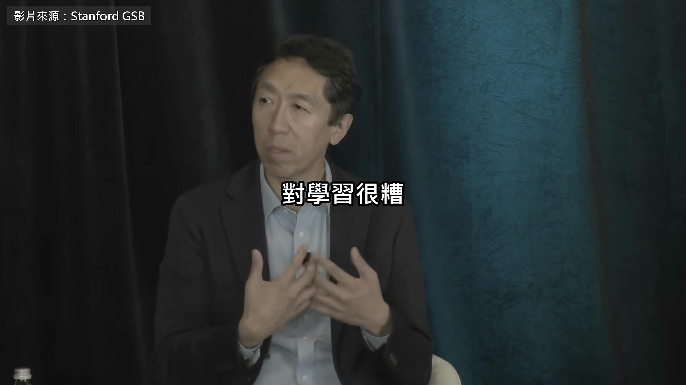

**逐字稿片段：** 他是 Coursera 的共同創辦人 線上課教過 800 萬人 AI 這是 9 月 24 號在史丹佛的對談

**話題推測：** 介紹吳恩達的身份：Coursera 共同創辦人

---

## 00:00:15

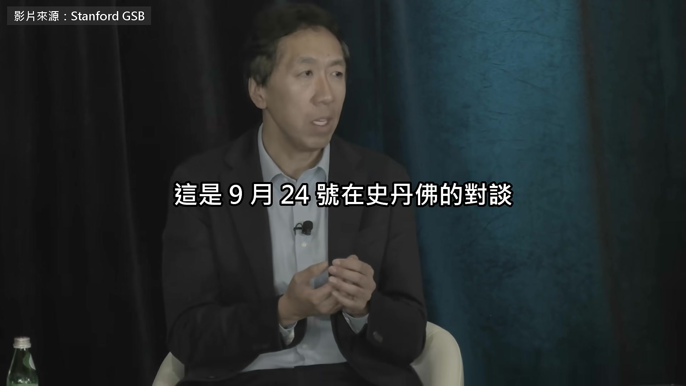

**逐字稿片段：** 那天世界銀行在介紹新一期的《世界發展報告》 整本談的都是 AI 不過我想說一件事，在我看來，它在教育上明顯行不通 我要講的話聽起來可能有爭議 但我覺得這再明顯不過 那就是，聊天機器人對學習很糟 在大學裡，我們這些教授都看得很清楚 嚴謹的學術研究也陸續出來證明了 學生用聊天機器人寫作業，作業分數會變高 可是期末考成績，還有長期學習的指標，反而會下降 這件事，校園裡的老師其實早就看在眼裡 其實不意外，學生把動腦這件事外包給聊天機器人 讓它替你做，事情是做完了 作業分數很漂亮，可是學習就吃虧了 所以我覺得，有些圈子有一點錯覺 以為聊天機器人對學習有幫助 沒錯，有些用聊天機器人的方式確實對學習有幫助 但事實是，絕大多數的用法 也就是絕大多數人用聊天機器人的方式，對學習都很傷 先說清楚，我非常支持 AI 它們很會幫人把事做完，我自己一天到晚都在用 但別騙自己說，它們是很棒的學習工具 不管是大學、中小學這些正規教育，還是大人自己學都一樣 大人就拿它來把事做完 但別騙自己，以為它真的很能幫我們學習 這就是現在的狀況，AI 在這件事上行不通 至少以它現在的樣子來說 他說的這類研究

**話題推測：** 提及世界銀行及其《世界發展報告》

---

## 00:02:20

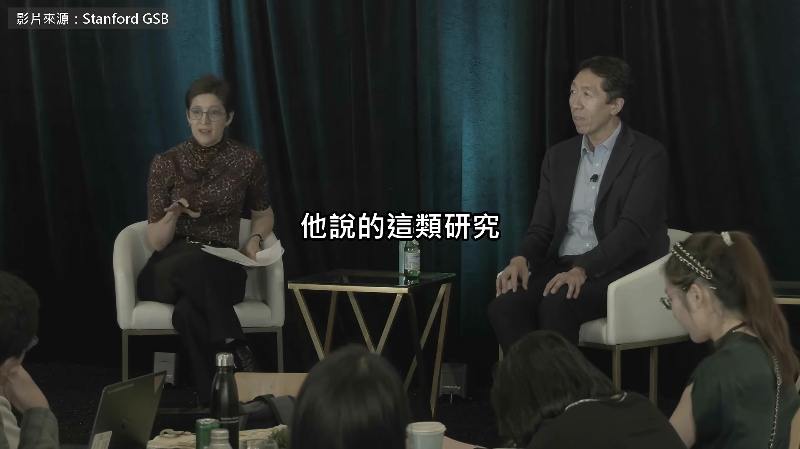

**逐字稿片段：** 有一篇去年登在美國國家科學院的期刊 PNAS 將近一千個高中生練數學 用一般 ChatGPT 的那組 練習成績高了 48% 可是拿掉 AI 去考試 反而比從來沒用過的人低了 17% 另一組用的是加了護欄的 AI 家教 這個退步大致就不見了 話說回來 做科技的都知道，今天行得通的，跟將來我們做得出來的不一樣 我很樂觀，在 AI 技術上面 我們能做出建立在扎實教學法上的學習體驗 真的能教會人，也讓人想學

**話題推測：** 提及美國國家科學院期刊 PNAS 的研究

---

## 00:02:59

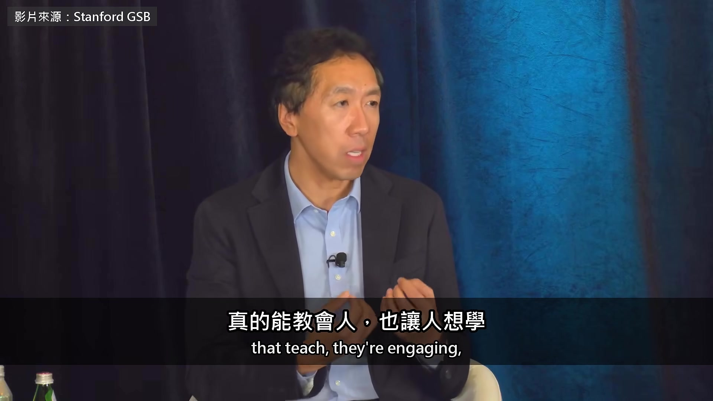

**逐字稿片段：** 還能讓我們從一對多，走到一對一 就算是今天，很多線上課程都是大家看同一支影片，這樣也有用 這沒什麼不好，確實有用 但有了 AI，我覺得現在有一條清楚得多的路 能把學習從一對多，也就是一個老師對很多學生 變成量身打造的一對一 要走到那一步，還有工作要做 但等我們開始推出這類東西 就有一條跟現在聊天機器人不一樣的路，能真的幫到學習 主持這場的 Susan Athey 是史丹佛經濟學教授 也是這份報告的學術主持人之一

**話題推測：** 討論 AI 在教育上的潛力：從一對多到一對一教學

---

## 00:03:49

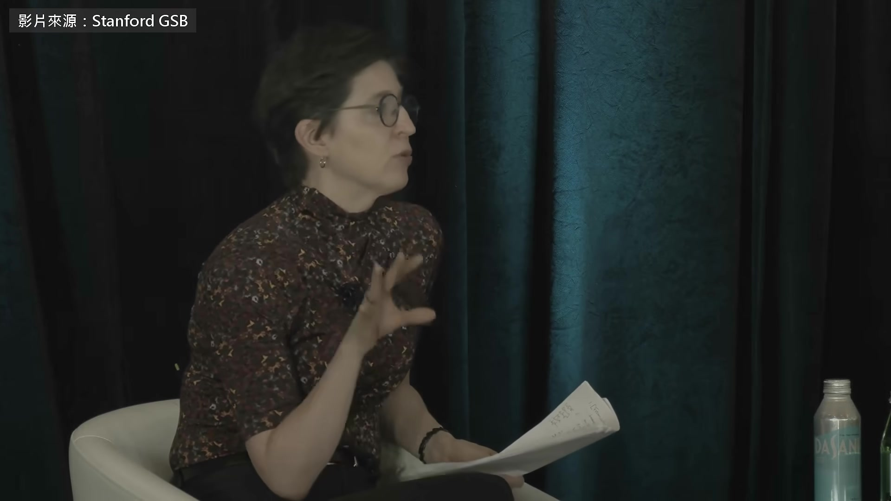

**逐字稿片段：** 她當過微軟的首席經濟學家 還是第一位拿到克拉克獎的女性 那個獎頒給 40 歲以下的經濟學家 地位被認為僅次於諾貝爾經濟學獎 她說連大學都還在摸索 教授們等於被丟了一句，AI 來了 你們自己想辦法 有趣的是，說到實驗 這個還沒寫成論文

**話題推測：** 說明 Susan Athey 曾任微軟首席經濟學家

---

## 00:04:10

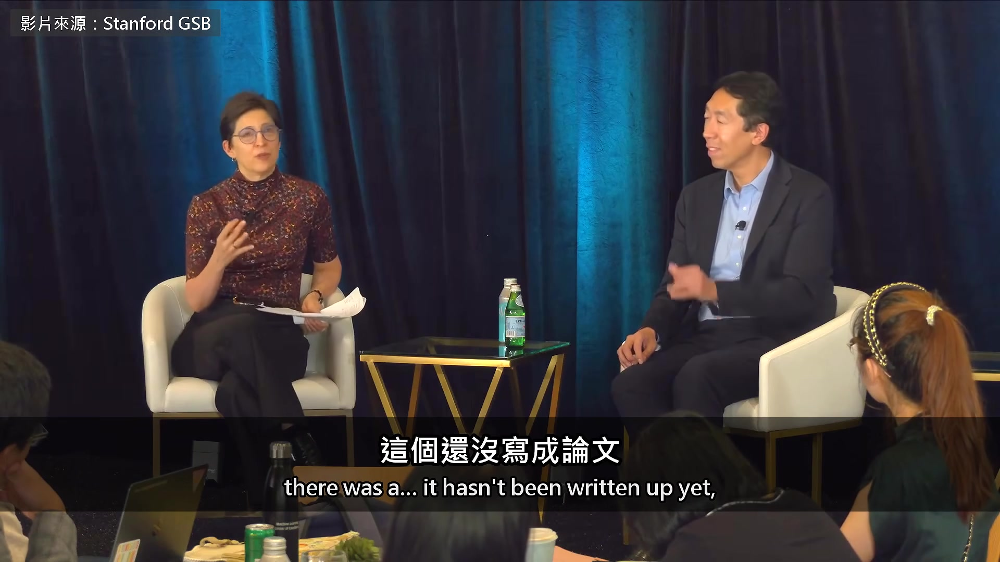

**逐字稿片段：** 不過去年底，史丹佛這裡有幾門課做了一個實驗 他們把學生隨機分組，不照平常那樣交作業 而是去跟助教見面，口頭報告半小時 取代交一份作業給人打分數 那些學生的表現好非常多 可是我聽到結果的時候想說，好，很棒 文理學院可以，連史丹佛也改得過來

**話題推測：** 提及史丹佛大學的口頭報告實驗

---

## 00:04:39

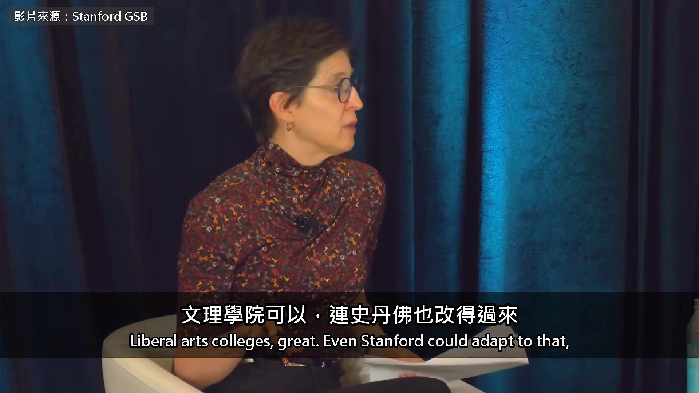

**逐字稿片段：** 那柏克萊呢？ 那些更大的州立大學呢？

**話題推測：** 提出其他大學的應用場景：柏克萊大學

---

## 00:04:44

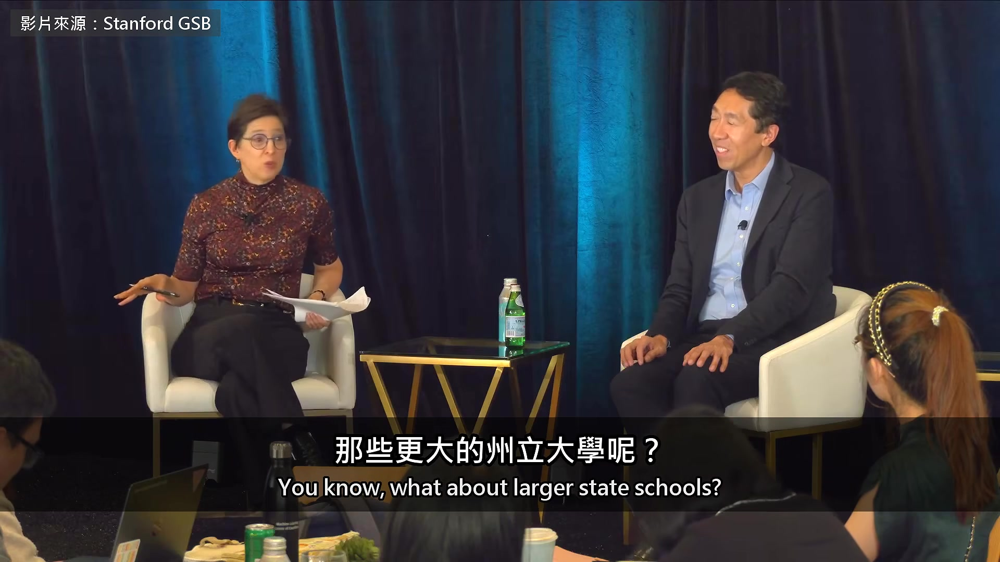

**逐字稿片段：** 普渡大學呢？他們很會大量培養工程系學生 可是他們的學生太多了 更別說開發中國家了 吳恩達說

**話題推測：** 提出其他大學的應用場景：普渡大學

---

## 00:04:55

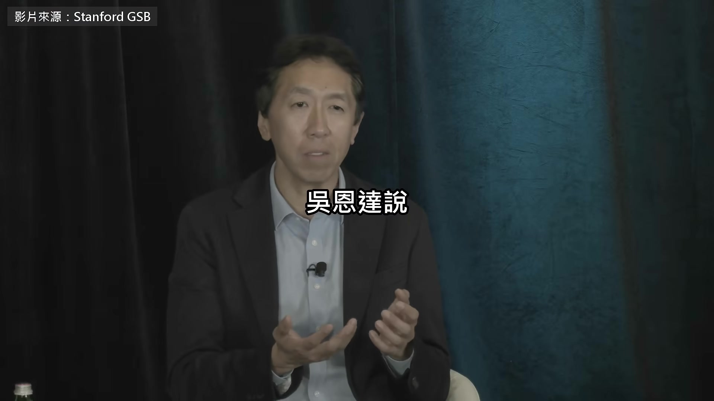

**逐字稿片段：** Coursera 現在就在幫沒有 AI 師資的大學開課 接著他講到 AI 時代人該練什麼本事 從 1997 年 IBM 的電腦下贏西洋棋世界冠軍 到後來的 Watson 跟 AlphaGo 每一次大家都以為 AI 什麼都會了 結果離真正好用都還很遠 我覺得在現在這個時間點 雖然現代的 AI，比 IBM Watson、下圍棋、下西洋棋的 AI 通用得多 我覺得 AI 有一個地方，落差比大家想的還大

**話題推測：** 說明 Coursera 如何協助缺乏 AI 師資的大學

---

## 00:05:25

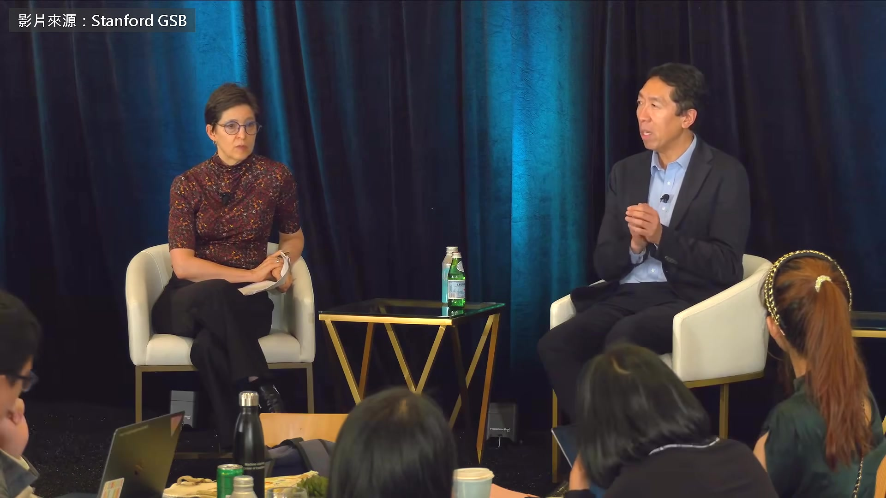

**逐字稿片段：** 就是 AI 已經很擅長「可驗證」的任務 可驗證的任務，就是有明確對錯、答案對不對查得出來的任務

**話題推測：** 引入「可驗證任務」的概念

---

## 00:05:35

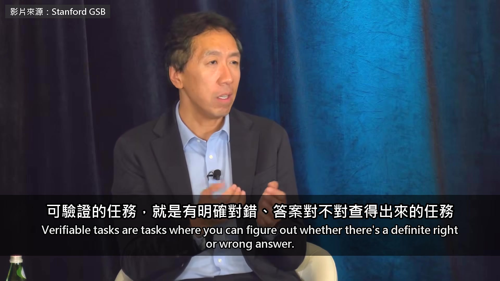

**逐字稿片段：** 寫程式就比較偏向可驗證的任務 因為程式寫出來，要嘛跑得對，要嘛跑不對 數學，證明數學定理也是可驗證的任務 因為定理證完，你可以檢查證明是對是錯 數學題是 回答事實問題也是，因為事實要嘛答對，要嘛答錯 可是在現實生活裡，我們做的很多事需要判斷，卻沒辦法驗證 比如說我要寫一個軟體，該寫什麼軟體？ 沒有明確的對錯 可是答案有好得多的，也有爛得多的

**話題推測：** 舉例說明可驗證任務：寫程式

---

## 00:06:19

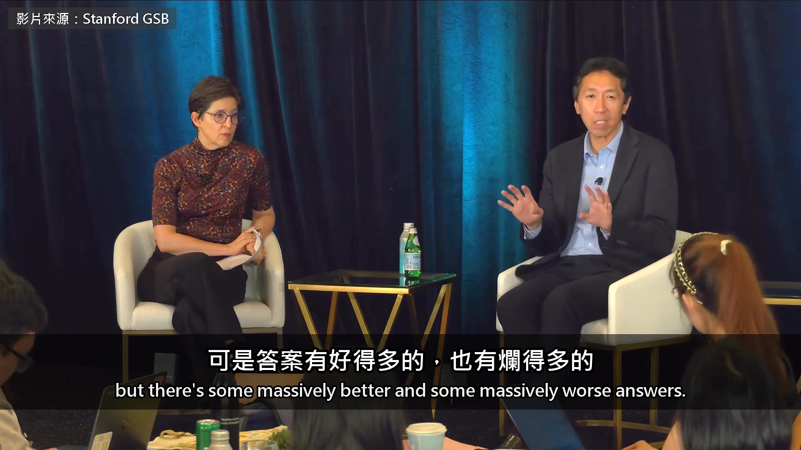

**逐字稿片段：** 或是行銷人員要決定，該用哪一句廣告標語 要先進這個國家的市場，還是那個國家 沒有數學上正確的答案，但答案還是有好有壞，差很多 因為技術上的原因，AI 在可驗證的任務上進步快得多 在不可驗證的任務上，就難進步得多

**話題推測：** 舉例說明不可驗證任務：行銷文案或市場決策

---

## 00:06:44

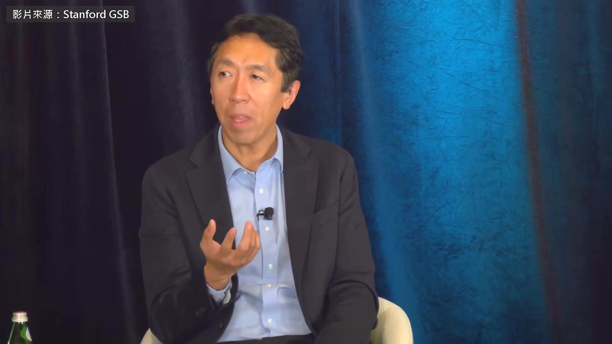

**逐字稿片段：** 技術上的原因是，有一套方法叫強化學習 只要你給 AI 一個方法，讓它自己檢查答案 它就能一直練下去，最後自己摸出做法 所以 AI 在可驗證的任務上，進步得比不可驗證的快多了 我覺得我們可能犯了一個錯，只盯著 AI 會做的那些厲害的可驗證任務 像寫程式、回答事實問題、證明數學定理 這些都很棒、很厲害，也非常有價值，我完全沒有要貶低 但我覺得大家可能會很意外 從可驗證的任務推到不可驗證的任務 這個落差，可能比一般人以為的還大 他說人比 AI 強的地方 是腦袋裡那一大堆背景 上次跟客戶提到某個功能 對方表情怪怪的，你就知道他不想要 這些 AI 都不知道 所以他看好教育 工作裡能自動化的那部分變便宜以後 剩下還得靠人做的部分會更值錢 我自己在教課、帶學生的時候，也確實看得到這一點 因為我現在整天都在讀學生用 AI 寫的東西 你會以為這很簡單 但後來你會發現，只要懂一點點 AI 幫你寫的東西就會好很多 學生寄東西給我，我就問 「這些全是你寫的嗎？」 「對，對，全是我寫的。」 「那第五點呢？」

**話題推測：** 提及強化學習 (Reinforcement Learning) 技術

---

## 00:08:16

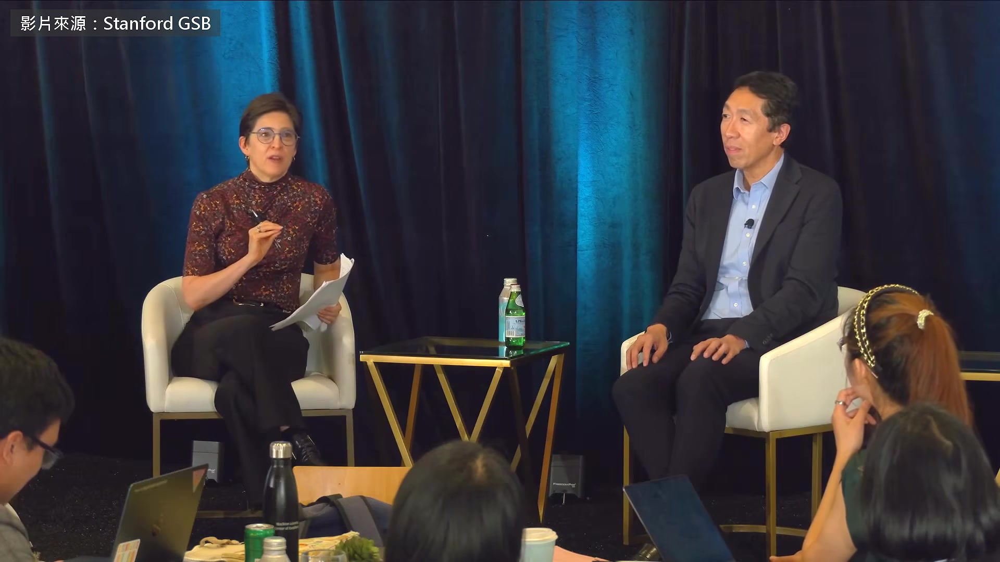

**逐字稿片段：** 「喔，那是 Claude 的點子，聽起來不錯。」 然後…我可以… 這就是經驗的用處，我做的時候根本不用想 我就說：「喔，這段刪掉。」 我可以讓 AI 寫出看起來很棒的東西 不用花什麼力氣 可是當你看到剛入門的人用 AI 寫出來的東西 那些字對他們來說都像天書 就會發現，其實不是那樣，用工具的人跟工具本身是互補的 在你自己專業的領域裡用，可能很難察覺這一點 我想給一個小建議 算是把 Susan 講的再推廣一點 給用 AI 寫東西的人一個私房建議 至少在現在，很多頂尖的 AI 系統寫出來都有很重的 AI 味 像 Susan 跟我這種讀過夠多 AI 文字的人 常常一看就知道：「對，這是 AI 寫的。」 很多人沒像我們讀過那麼多 AI 的東西，所以不知道 他們交東西的時候還覺得：「寫得真好」 卻不知道真正有經驗的人一看，就抓得到 AI 味，知道是 AI 寫的 也許技術會變，這些 AI 味會消失 但用 AI 寫東西的人要想一下，至少在現在 這技術的 AI 味還很重，你要是沒像我們花這麼多時間研究 你寫的東西可能滿是 AI 味，你自己卻不知道 沒錯 我也發現，有些學生英文經驗不多

**話題推測：** 學生使用 Claude 寫作業的案例

---

## 00:10:02

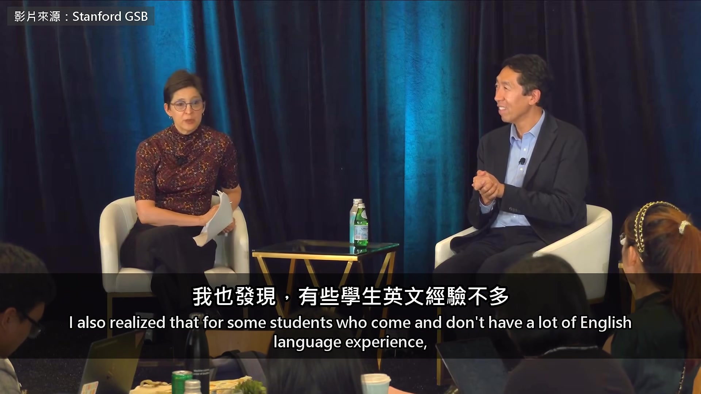

**逐字稿片段：** 他們跟 Claude 講話的時間，比用英文跟真人講話還多 所以那種 AI 味，在他們看來就是正常的說話方式 他們讀 Claude 寫的東西，比讀論文還多 我們對人的大腦做的事，真的很瘋狂 如果你覺得 TikTok 已經很誇張，現在大腦被改寫的程度更不可思議 談到政策

**話題推測：** 舉例學生與 Claude 互動多於真人的現象

---

## 00:10:27

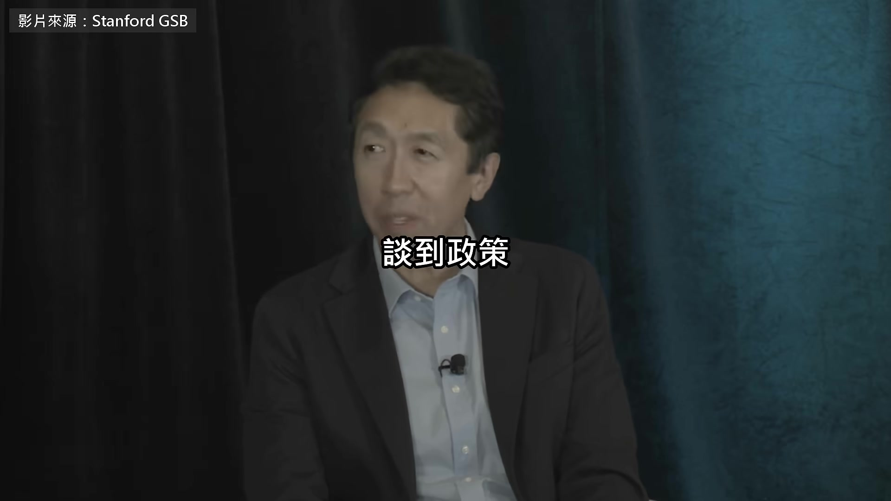

**逐字稿片段：** 吳恩達給開發中國家的建議裡有一條是投資培訓 他說美國跟中國雖然領先 差距其實沒那麼大 因為 AI 出來還沒多久 現在要讓人才跟上、甚至一口氣跳過去 機會比以前大 人才培訓這塊，你還想多講一點嗎？ 我知道你也很關心這件事 回想一下你自己學東西的經驗 你讀過的書、上過的線上課或實體課 還有跟朋友聊天學到東西的那些時候 你想得到有哪一次，你花了一大堆時間學一樣東西 回頭一看說：「天啊，真是浪費時間 早知道就不要學了。」 好像從來沒發生過，對吧？ 反而，我想我們每個人實際的經驗都是 花在學習上的時間，幾乎都證明是值得的 放到整個社會來看 因為學一項技能，短期的回報很小，長期的回報卻很深遠 而人的心理，我們每個人都不太會替長遠打算，我希望自己更會 也希望大家都更會 所以現實是，幾乎所有的個人、企業跟國家，在培訓上都投資不足 跟它能帶給個人、企業、國家的經濟回報比起來，都太少了 所以大致來說，學什麼重要，怎麼學也重要，這些都重要 但大致來說，在每一個階段 從幼兒教育一路到成人培訓 不是說不可能浪費 但我覺得，特別是在這個變動的環境裡 要在培訓和教育上投資到後悔投太多，門檻非常高 所以想想你自己的經驗 我猜你花在學習上的那些時間，你應該都很慶幸自己學了 現在把這個放大到整個社會 如果我們能讓每個人多投資自己、多學習 國家的結果會好得多 聊天機器人可以幫你把作業做完 學會還是得靠你自己花時間 吳恩達的建議是多投資自己 他說幾乎沒有人回頭覺得學過的東西是浪費

**話題推測：** 吳恩達對開發中國家的政策建議：投資培訓

---

## 00:13:07

**逐字稿片段：** 原影片 46 分鐘 前面他還講到，對開發中國家來說

**話題推測：** 說明原始影片的長度

---

## 00:13:11

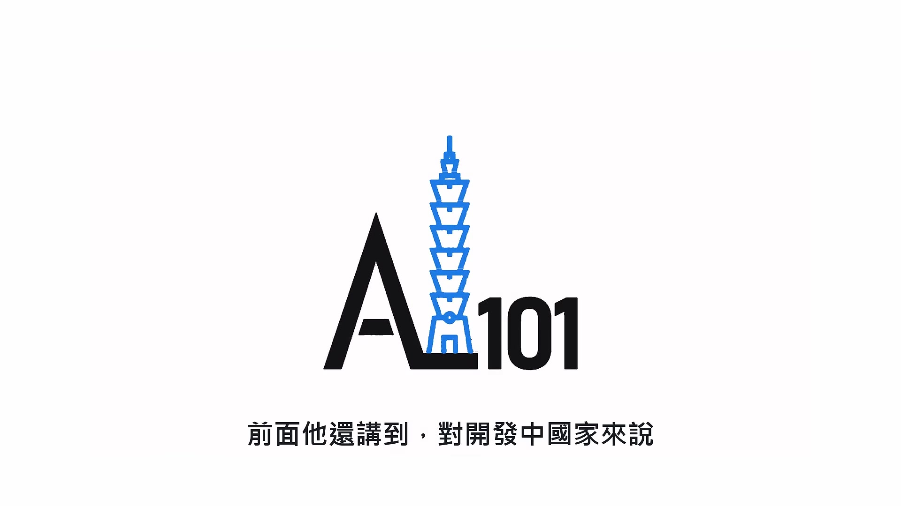

**逐字稿片段：** 開源的模型是別人關不掉的 AI 後面他給各國政府的建議是 現在投資 AI，就像當年美國蓋鐵路 原影片連結在說明欄，有興趣可以去聽更多。

**話題推測：** 提及開源 AI 模型對開發中國家的意義

---
