# ai-note-101_1SLc_XA1OuA — 關鍵畫面索引

- 來源逐字稿：[ai-note-101_1SLc_XA1OuA_GT.srt](ai-note-101_1SLc_XA1OuA_GT.srt)
- 影片：https://www.youtube.com/watch?v=1SLc_XA1OuA
- 截圖數：34

## 00:00:00

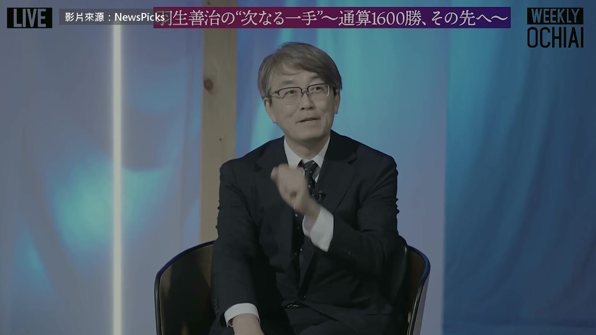

**逐字稿片段：** 1996 年 日本將棋的七大頭銜被同一個人全部拿走 史上第一次

**話題推測：** 介紹特定年份作為歷史背景。

---

## 00:00:05

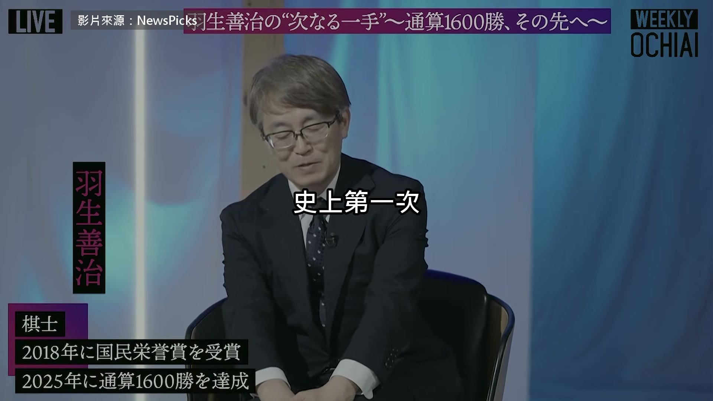

**逐字稿片段：** 他叫羽生善治，15 歲當上職業棋士 下了 40 年 去年累計到 1600 勝 將棋就是日本的象棋 也是最早被 AI 追過去的領域之一

**話題推測：** 介紹關鍵人物羽生善治，可能搭配照片或生平簡介。

---

## 00:00:15

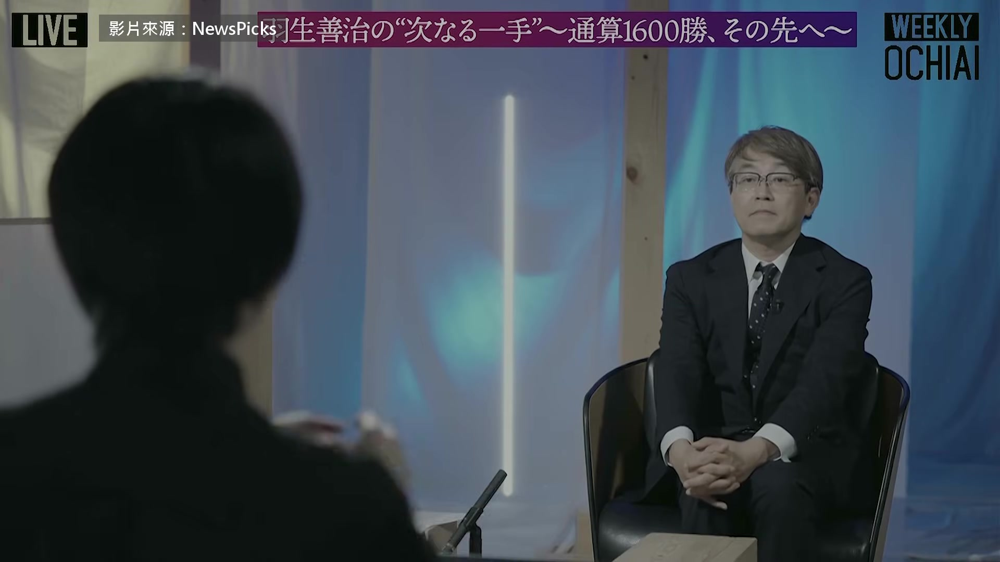

**逐字稿片段：** 今年 9 月公開的這段訪談裡 他講了一件跟多數人想的相反的事 AI 越強，棋士眼前的路越看不清楚

**話題推測：** 提及特定訪談，可能播放片段或訪談節目截圖。

---

## 00:00:22

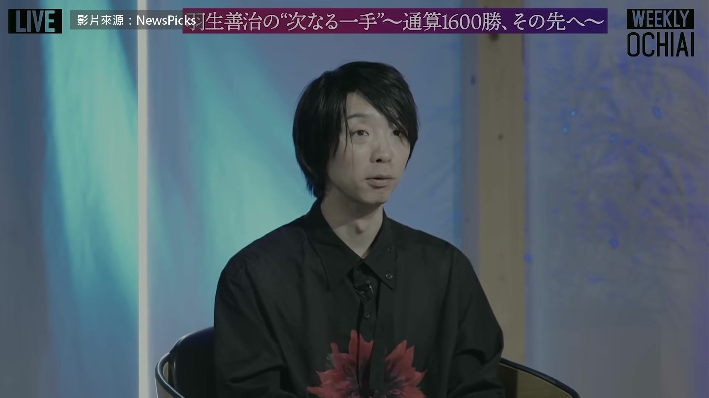

**逐字稿片段：** 節目是 NewsPicks 的 WEEKLY OCHIAI 主持人是媒體藝術家落合陽一 跟 AI 下棋，有什麼是人身上沒有的有趣地方？ 那種我想 100 年也絕對想不到的棋 它若無其事地就下出來了 它的點子怎麼來的，想法的範圍怎麼拉寬 這些都很值得參考 真好 不過，該怎麼說呢 「這一手看了不舒服，不想下」 這種棋很多 將棋碰上 AI 的時間 比大多數行業都早

**話題推測：** 介紹節目名稱 NewsPicks 的 WEEKLY OCHIAI。

---

## 00:00:56

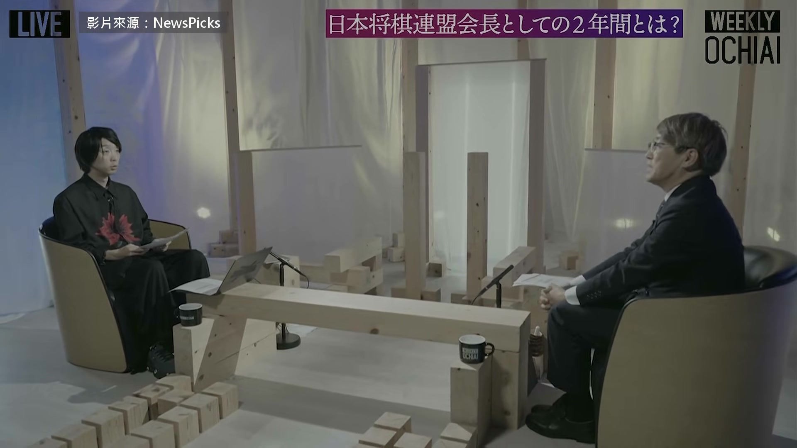

**逐字稿片段：** 2017 年 AI 在正式對局贏了當時拿著名人頭銜的棋士 之後職業棋士反過來拿 AI 當研究工具 落合陽一自己做生成式 AI 的研究 他把將棋當成走在前面的例子來問 電腦越來越厲害

**話題推測：** 提及特定年份「2017 年」，標記重要事件。

---

## 00:01:13

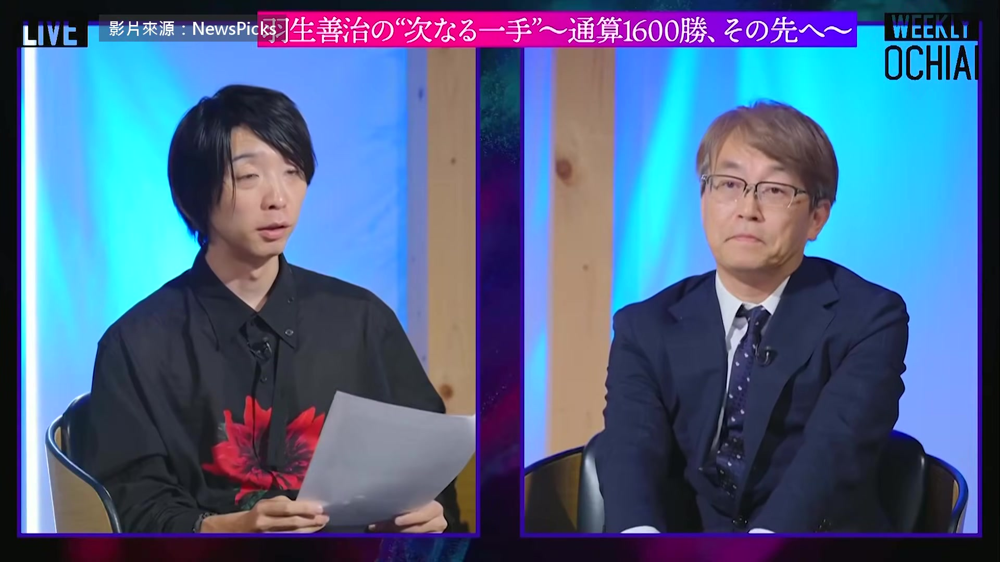

**逐字稿片段：** 將棋以外的領域大概也是，像數學家現在也在用 AI 幾乎每一個領域，都很猛烈地 開始發生將棋界已經發生過的事 比計算能力，人大概已經贏不了 AI 但跟它一起做，能做出更有創意的東西 羽生先生看到這些，會怎麼想 會不會覺得「這條路我們這一行早就走過了」 啊，原來如此

**話題推測：** 將討論範圍擴大到其他領域（數學家使用 AI），可能顯示比較圖表。

---

## 00:01:38

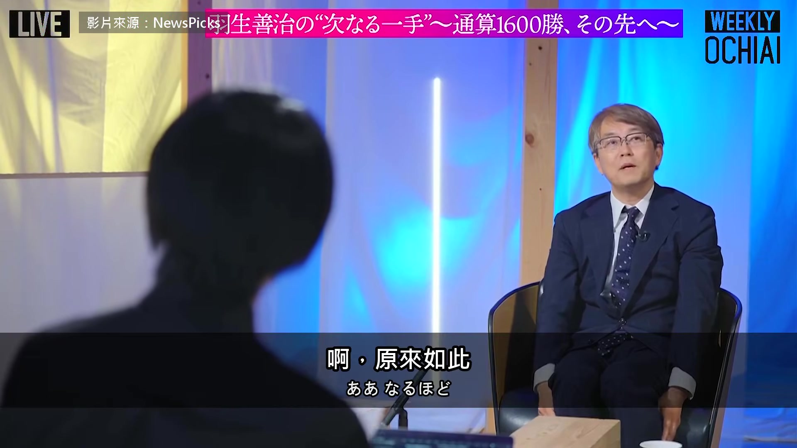

**逐字稿片段：** 當然，從 AI 的歷史來看 棋盤遊戲本來就是比較容易做出成果的領域 類似的現象，現在也擴散到別的領域 我想是有的 不過，該怎麼說呢

**話題推測：** 轉向 AI 的歷史發展，可能顯示 AI 發展時間軸。

---

## 00:01:59

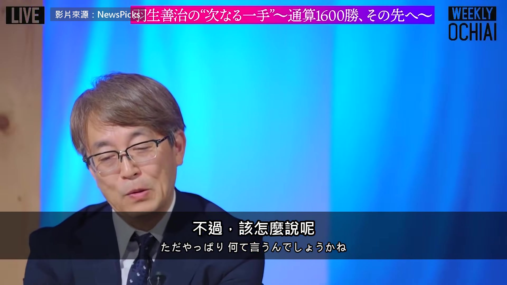

**逐字稿片段：** 拿到現實世界去用，跟在網路空間裡 在電腦裡就能做完的那種世界 基本上是兩回事 所以會發生的現象跟反應，我想不太一樣 您上次來的時候 我做生成式 AI 的研究做很久了

**話題推測：** 區分 AI 在現實世界和網路空間的應用，可能以對比圖示說明。

---

## 00:02:20

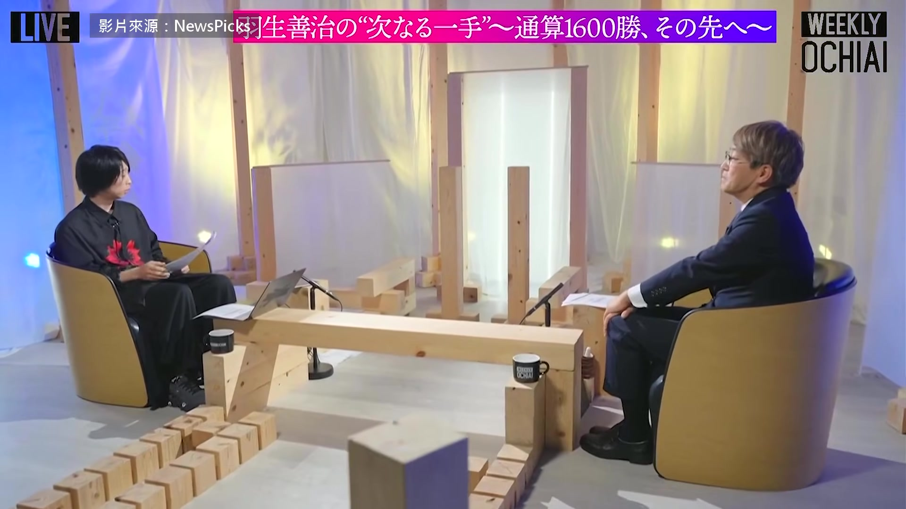

**逐字稿片段：** 2022 年，我的程式還有一半是自己動手寫的 原來如此

**話題推測：** 提及特定年份「2022 年」及個人程式碼比例，可能呈現時間軸或數據變化。

---

## 00:02:25

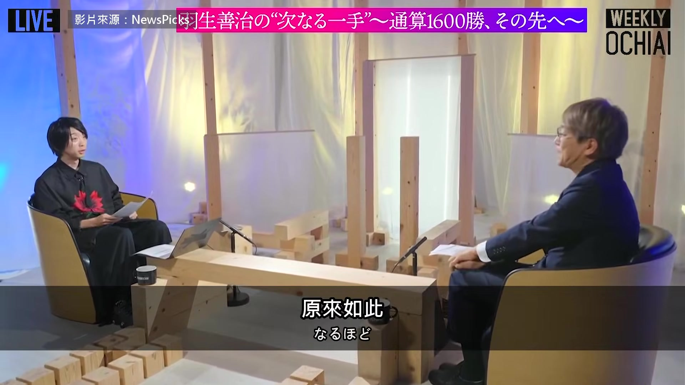

**逐字稿片段：** 現在是一行程式 都不自己動手寫了 拿將棋來比喻的話很有意思 大概就是自己動手下，精準度反而會變鈍 所以乾脆不自己動手，變成這種狀態 我自己都覺得很不可思議

**話題推測：** 對比當前「一行程式都不自己寫」的狀態，顯示技術演進的極端。

---

## 00:02:45

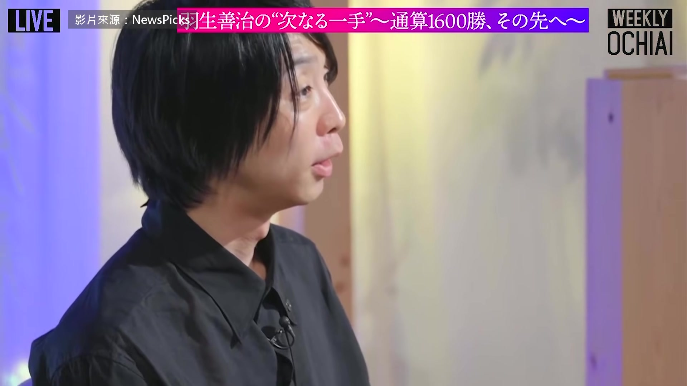

**逐字稿片段：** 不過反過來說，就算完全不自己動手 要選什麼，終究是人在做的事 至於哪裡有價值 哪裡有可能性 AI 不會連這些都幫你想 所以反過來說，就是要自己去選 要做哪個領域，力氣花在哪裡去分析、去研究 我想這個很重要 您說得對 這也是我自己的研究主題

**話題推測：** 提出即使 AI 代勞，「選擇」仍是人類核心價值的觀點。

---

## 00:03:19

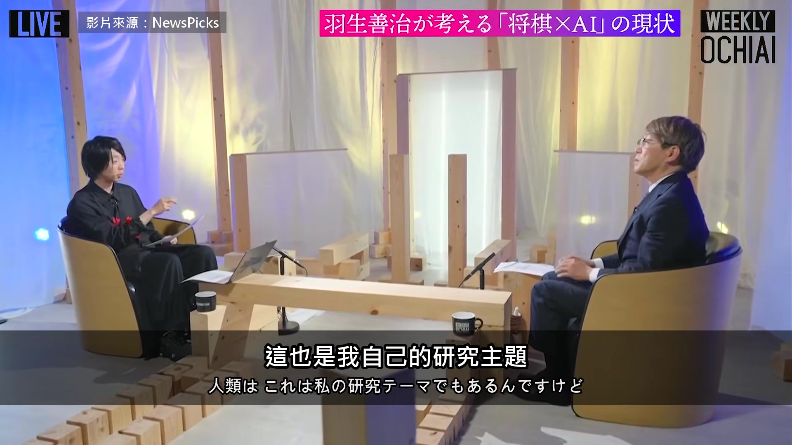

**逐字稿片段：** 人類一直把「做出東西」當成一種價值 把「做」交給別人之後，「選」就變得非常重要 因為做出來的東西會多到滿出來 要抓哪個關鍵，力氣往哪裡放 反而是「選」這件事變重要 我也這麼想 將棋的世界也一樣 有很多像死巷一樣的領域 一走進死巷，花掉大把時間 結果什麼都生不出來 要查當然可以一直查下去 技術上也做得到了

**話題推測：** 探討人類對「做出東西」與「選擇」價值的歷史觀點變化。

---

## 00:03:57

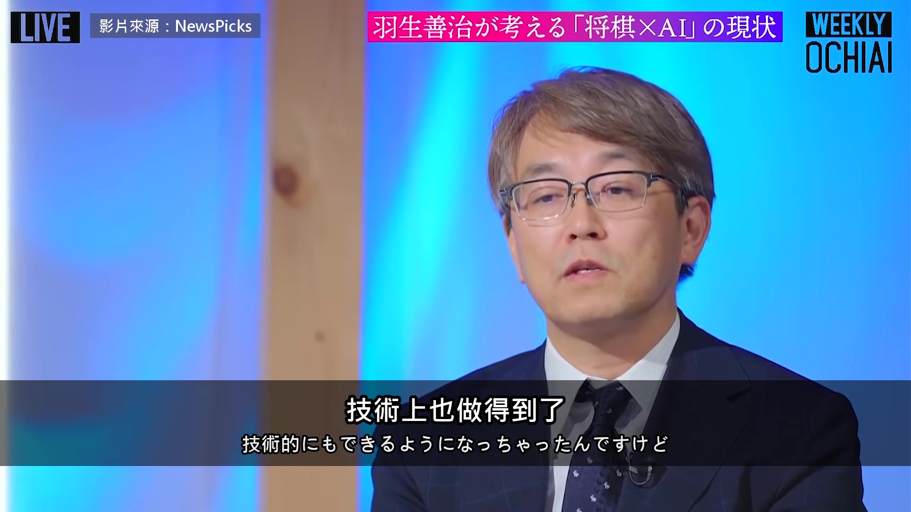

**逐字稿片段：** 可是怎麼避開那些死巷 是現在很重要的課題 我覺得重點就在這裡 能不能選到不走進死巷的路 就是您剛才講的那件事 對

**話題推測：** 轉向如何避開「死巷」的課題，可能以流程圖或路徑圖呈現。

---

## 00:04:10

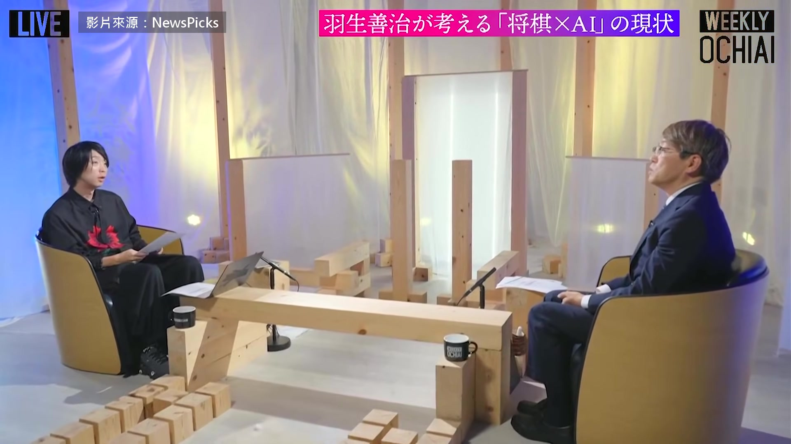

**逐字稿片段：** 舉個很好懂的例子 不是有圓周率的計算嗎 圓周率幾乎可以永遠算下去 將棋裡也有這種局面 一開始查下去，就只是在浪費時間 「這個大概沒完沒了」「這個不會有結論」 「現在做也沒意義」，要看得出來然後放手 把力氣集中在關心的題目、該做的事情上 我想這會變得很重要 對局當中也一樣嗎？往這邊算下去 會走進死巷，所以這裡先不想了 把腦力挪到另一邊去，您會這樣判斷嗎？

**話題推測：** 引入圓周率計算的例子進行類比，可能顯示相關數學符號或圖示。

---

## 00:04:49

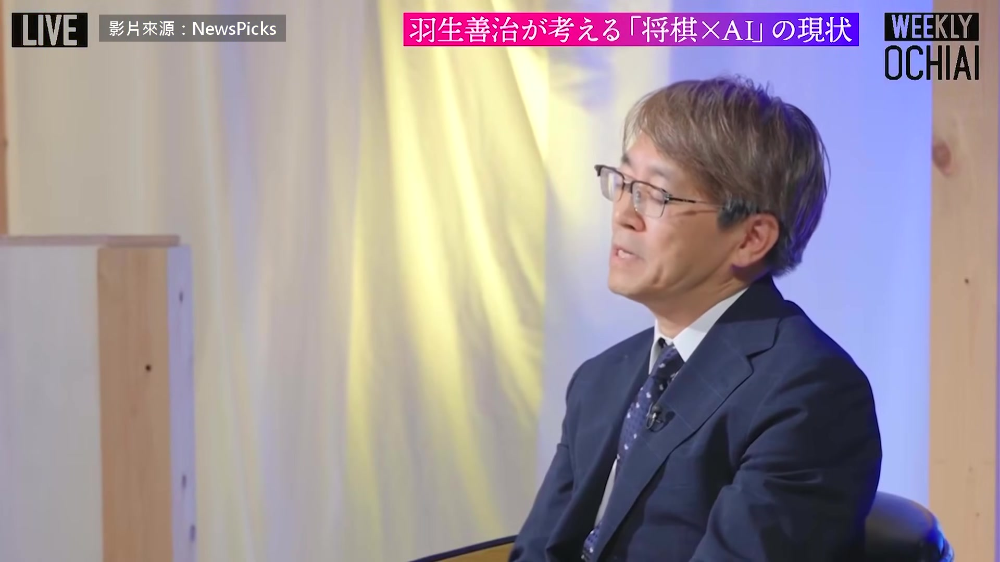

**逐字稿片段：** 是啊 AI 越進步，越是在沒有明確結論、沒有答案的情況下 還是得往前走，這種情況越來越多 最近嗎？ 越到最近越多 不是很有把握地覺得「這邊比較好」 而是一直帶著一種模糊 沒有把握就往前走，這種情況多了非常多 反而很難有「下對了」的手感 這是最近將棋界的特色 有意思。就是棋盤上聞到的味道不一樣了 對 以前多少可以先弄清楚再往前走

**話題推測：** 討論 AI 進步導致決策過程中不確定性增加的現狀。

---

## 00:05:29

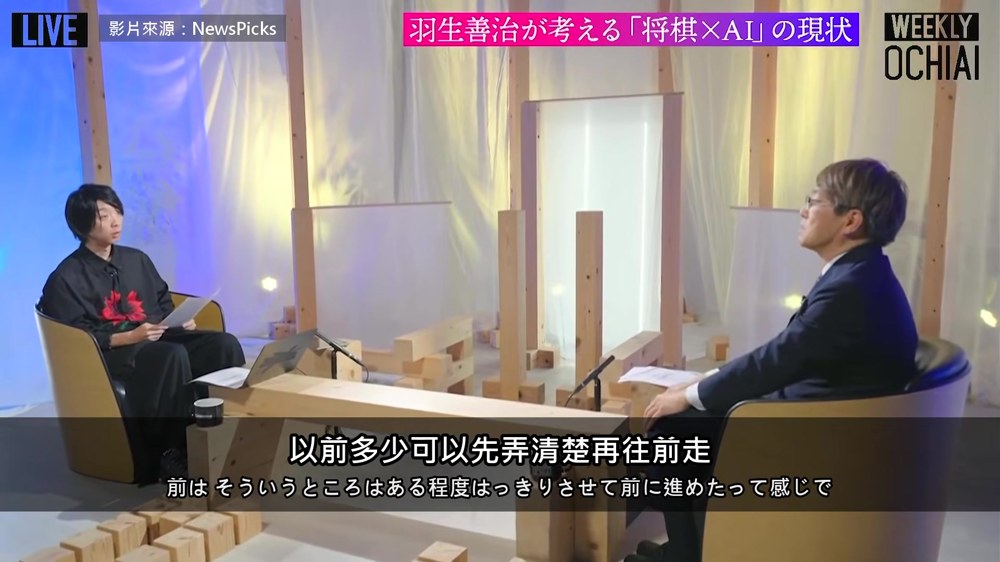

**逐字稿片段：** 現在一直是暗中摸索，在五里霧中 往前走，這種情況非常多 原來如此 這大概是因為，大家跟 AI 一起激盪 開發出沒見過的棋 那些新棋，是往結局看不清楚的地方衝進去的 大家卻意外地都在用、都在研究 說到底，尤其是將棋 職業棋士對上職業棋士，多半在沒見過的局面碰頭 從那裡往下，不管怎麼走都是未知的世界 然後還會變得更複雜 一路都是搞不清楚狀況的發展

**話題推測：** 使用「五里霧中」的比喻，可能搭配模糊、起霧的視覺效果。

---

## 00:06:11

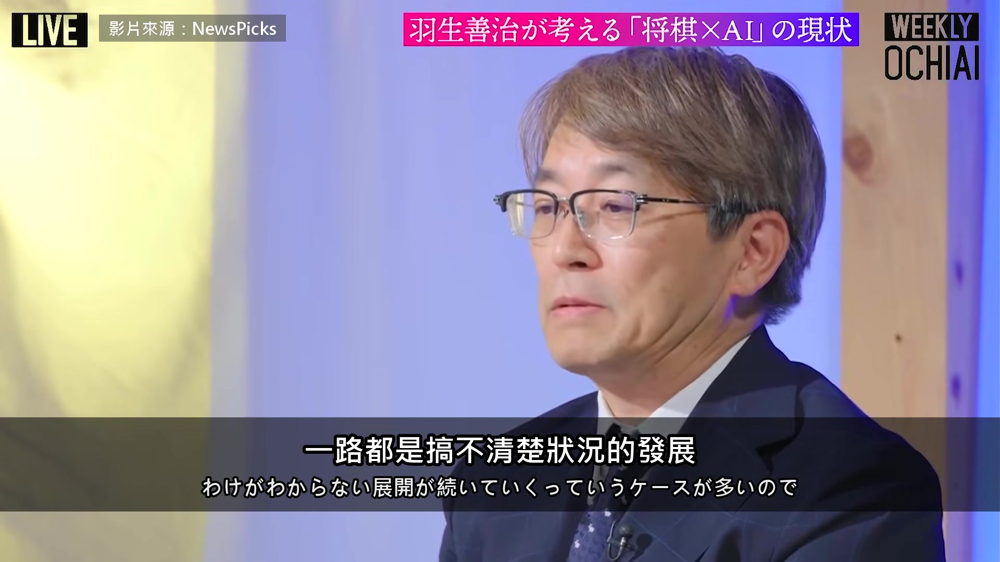

**逐字稿片段：** 社會上一般的印象 是有了 AI，什麼問題都能解決，一切變得清清楚楚 大家很容易這樣想 我覺得並不是 反而是模糊的、不明確的地方 會一直一直冒出來 至於能不能自在地 接受這件事，那又是另一回事了

**話題推測：** 探討社會對 AI 的普遍印象與實際情況的差異，可能呈現對比圖。

---

## 00:06:36

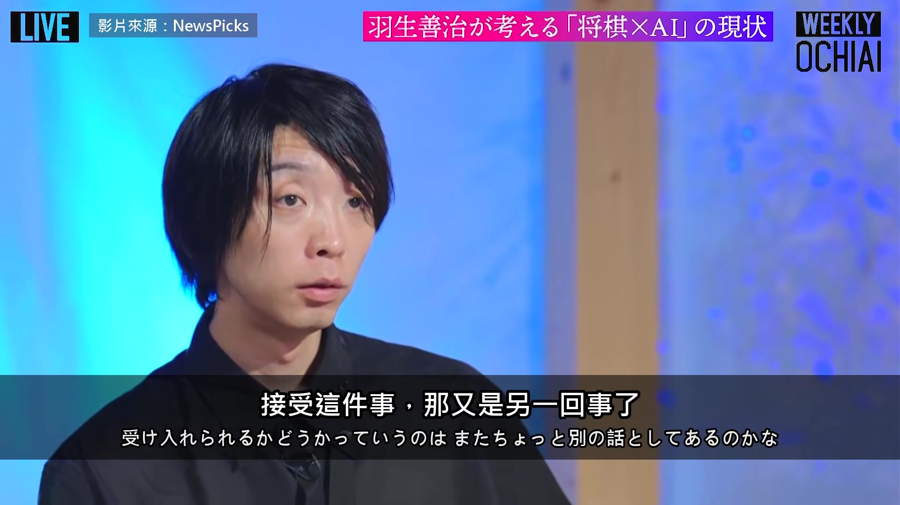

**逐字稿片段：** 落合接著說，商業世界也一樣 AI 一出現就把局面攪亂 兩年後會怎樣幾乎沒人說得準

**話題推測：** 將「起霧」現象擴展到商業世界，可能搭配商業圖表或新聞畫面。

---

## 00:06:43

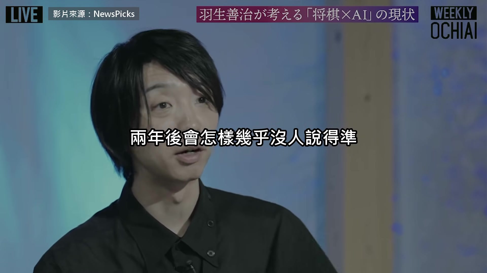

**逐字稿片段：** 大家只確定電力跟半導體很重要 將棋開始常常讓人覺得霧濛濛的 大概是哪一年的事？

**話題推測：** 提及電力與半導體的重要性，可能顯示相關產業圖表。

---

## 00:06:53

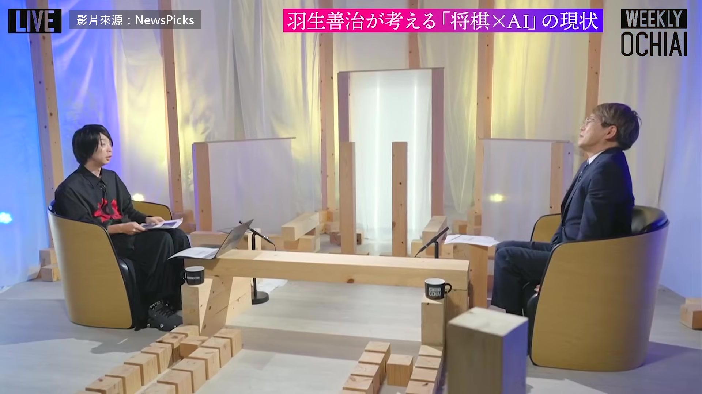

**逐字稿片段：** 大概是這 5 年左右吧 所以差不多是疫情那時候？ 從那時候起，我覺得變了很多

**話題推測：** 提及將棋界「起霧」狀況持續的時間，一個具體的數值「5年左右」。

---

## 00:07:08

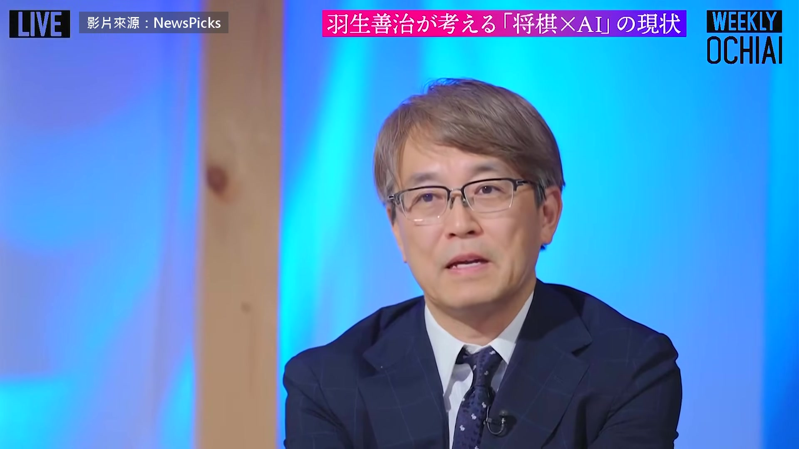

**逐字稿片段：** 將棋的 AI 化，比外面早了 7 到 9 年 這樣算，我們闖進同一種狀態的時間 現在又在加速，開個根號來算

**話題推測：** 提出將棋 AI 化比其他領域早「7 到 9 年」的數據。

---

## 00:07:20

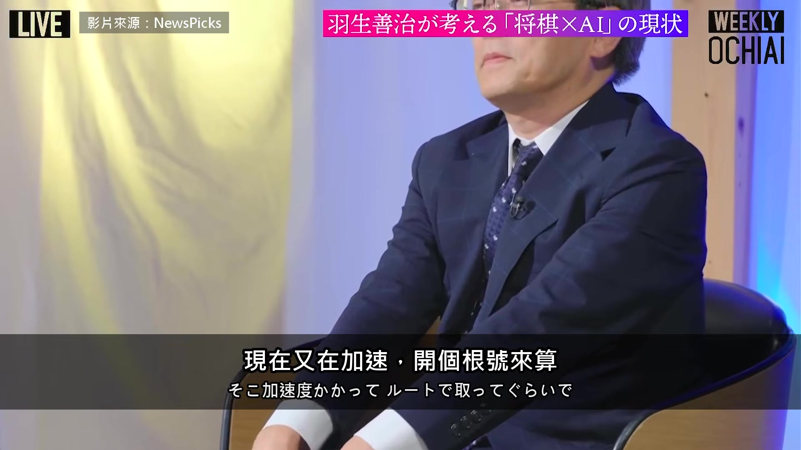

**逐字稿片段：** 大概 2029 年，就真的是霧濛濛的世界了 感覺現在就已經開始起霧了 已經開始了，對吧 我自己也是很切身地感覺到

**話題推測：** 預測「2029 年」全球將進入「霧濛濛的世界」，可能呈現未來預測圖。

---

## 00:07:35

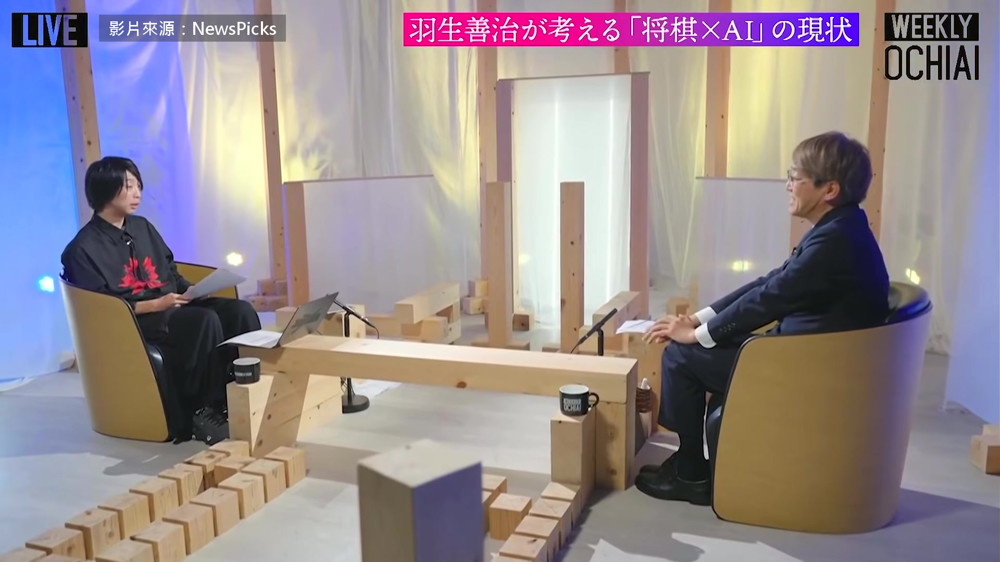

**逐字稿片段：** 在這種霧裡，大概要很會抓直覺的人 才有辦法做得好 這一點我感受很深 是啊 不過，正因為這樣

**話題推測：** 轉向在不確定性中「直覺」的重要性，討論所需能力轉變。

---

## 00:07:50

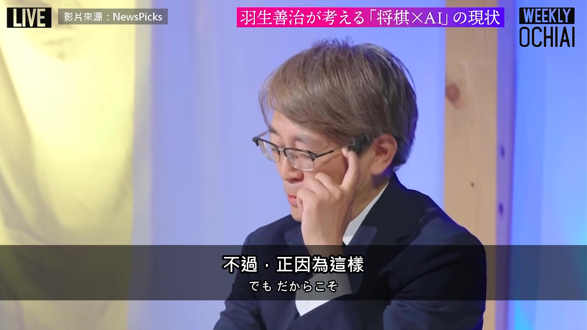

**逐字稿片段：** 我想差距很容易被拉開 量不出來、也驗證不了的事情 正在發生的時候 就是最容易拉開巨大差距的時候

**話題推測：** 提出不確定性下「差距容易被拉開」的觀點，可能示意差距擴大的圖表。

---

## 00:08:05

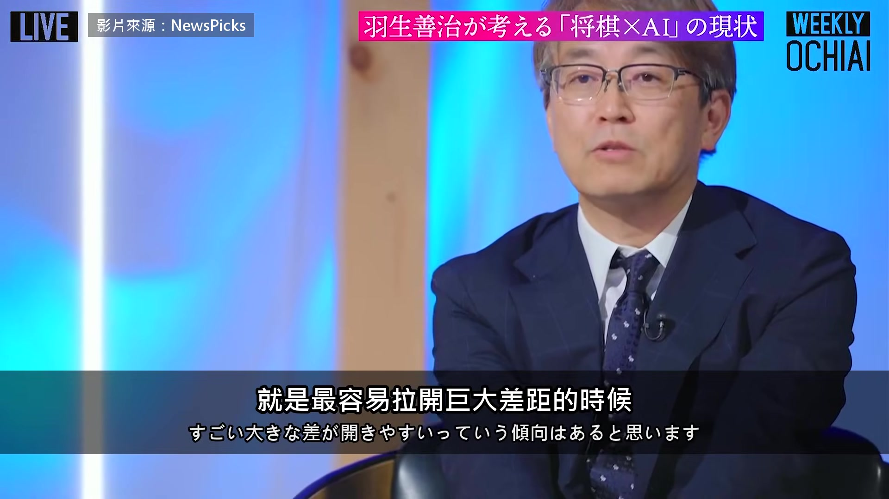

**逐字稿片段：** 不過我在大學教學生 碰到這種霧濛濛的局面，很多孩子會提不起勁 是啊，我想也是 不知道該怎麼辦 腳就是跨不出去，這種孩子很多 看到這樣卡住不動的孩子 換成將棋，您會跟他說什麼，讓他突破？

**話題推測：** 引入大學生面對不確定性的困境，討論教育相關議題。

---

## 00:08:29

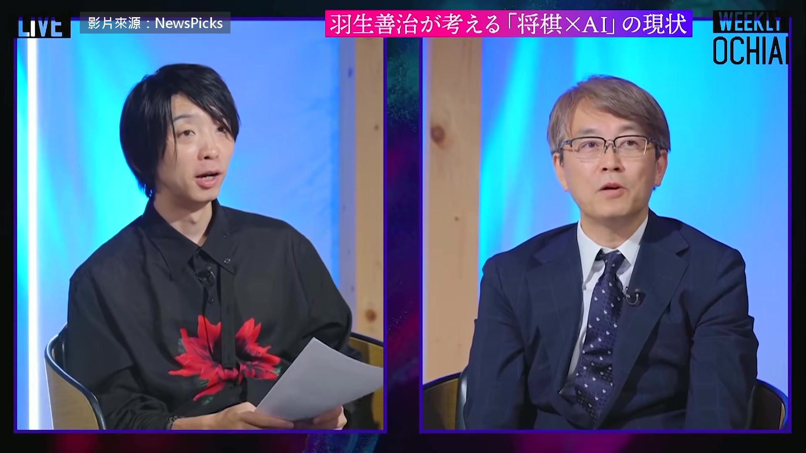

**逐字稿片段：** 嗯，像是「去旅行走一走」之類的 去旅行啊 得把它當成日常，當成本來就是這樣 不然我想是很難撐下去的 可是全人類，不對，是棋士一直在練這個 一直都在做 所以再霧的局面，也會去想怎麼往前走

**話題推測：** 提出「去旅行」作為突破困境的建議。

---

## 00:08:55

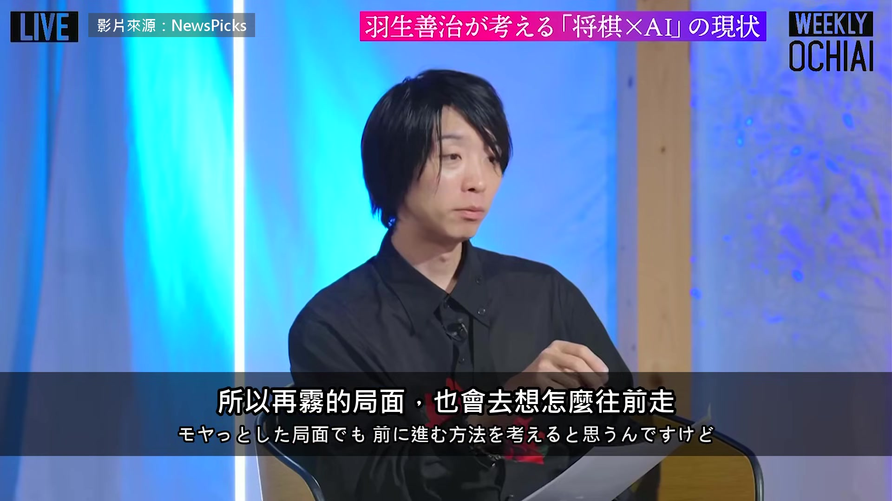

**逐字稿片段：** 一般人是受完義務教育、進了大學 在霧最濃的時候找工作，這種學生我常接觸 他們是真的會開始煩惱

**話題推測：** 探討一般人在教育階段遇到不確定性時的反應，可能示意人生階段圖。

---

## 00:09:09

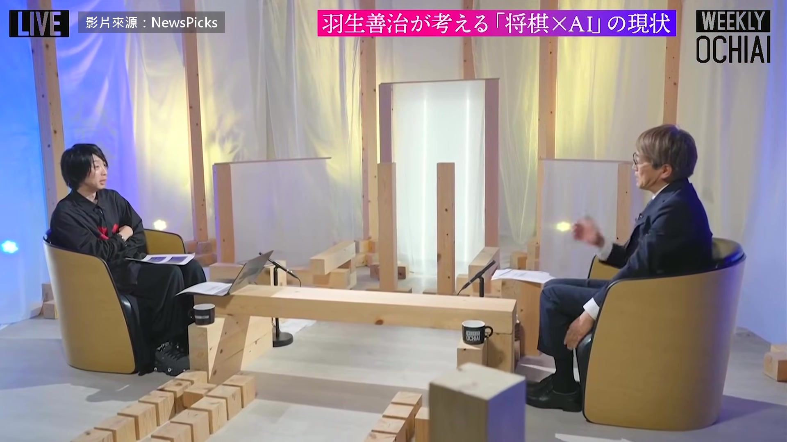

**逐字稿片段：** 這種事，我覺得不要每個人都去做 這樣才比較健康 喜歡這種事的人、興趣特別強的人 好奇心特別旺盛的人 只讓這些人去做，我覺得健康得多 要是每個人都這樣，大家的壓力只會越來越大

**話題推測：** 提出「不是每個人都該去做」面對不確定性的事，強調健康的分流。

---

## 00:09:31

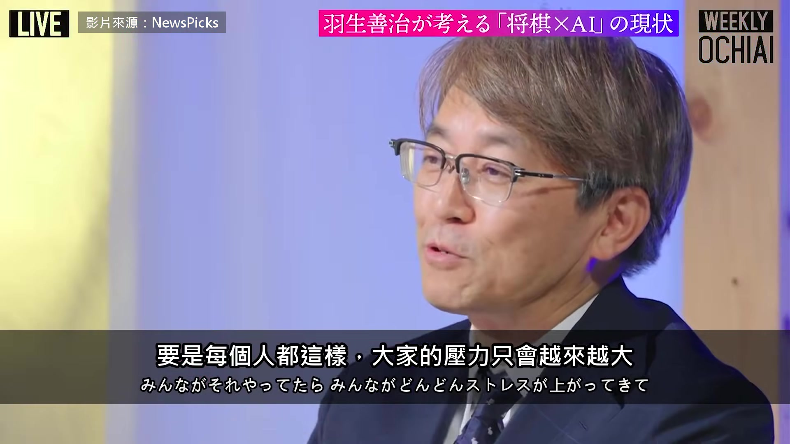

**逐字稿片段：** 落合沒有放過這一題 他說現實是整個世界都已經起霧 不喜歡這種局面的人 處境只會越來越糟 羽生說現在是過渡期

**話題推測：** 提及落合陽一對「世界已起霧」的回應，顯示對話互動。

---

## 00:09:40

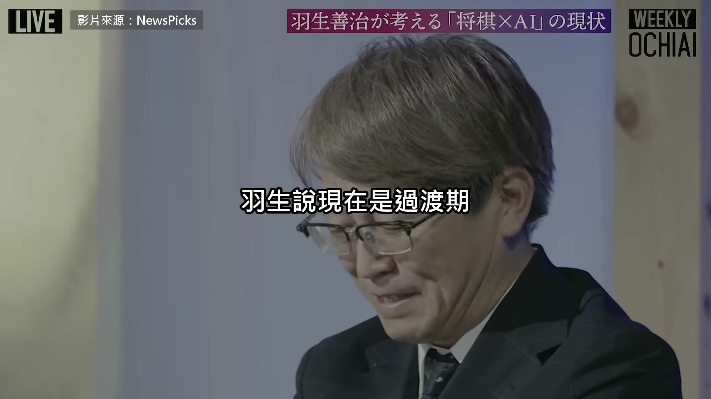

**逐字稿片段：** 然後把話接回他前面講過的那個字 所以說到最後 剛才講過「選」這件事

**話題推測：** 回溯並強調「選」這個核心概念。

---

## 00:09:49

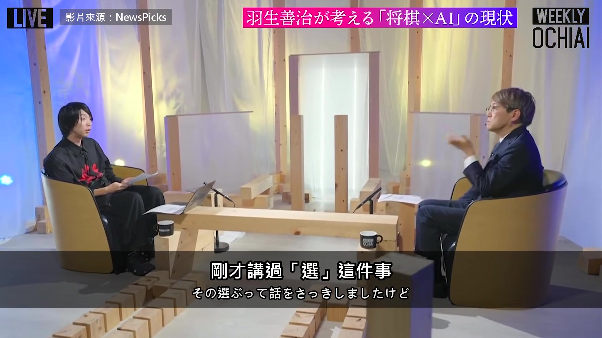

**逐字稿片段：** 我覺得，選擇本身就是個性 當然，從零生出東西的那種創意上的個性 我想還是會留下來 但一直選下去的結果 會變成那個人的風格，那個人獨有的東西 我是這樣想的 AI 下得出人想 100 年也想不到的棋 棋士眼前的路反而更霧 在霧裡每一步選了什麼，羽生善治說 那就是一個人的個性

**話題推測：** 提出「選擇本身就是個性」的核心論點，可能作為結論性標語。

---

## 00:10:21

**逐字稿片段：** 原影片 20 分鐘

**話題推測：** 轉為介紹原影片中其他話題，例如影片長度與內容。

---

## 00:10:22

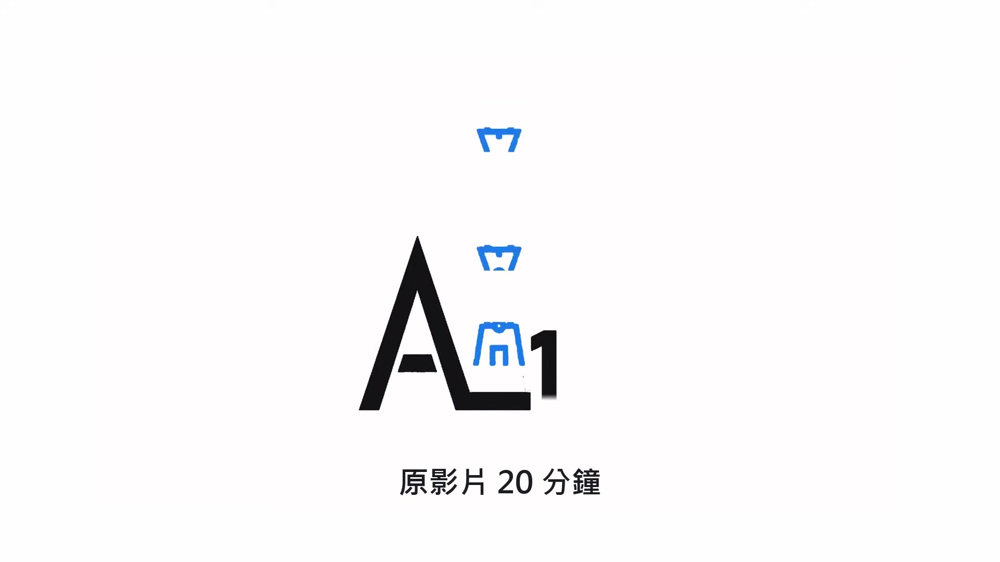

**逐字稿片段：** 前半段他講了當將棋連盟會長的那兩年 舊會館有兩個入口 下棋的日子他走左邊 處理會務的日子走右邊 靠這個切換腦袋

**話題推測：** 提及羽生擔任將棋連盟會長兩年的經歷，可能顯示相關職務照片。

---

## 00:10:32

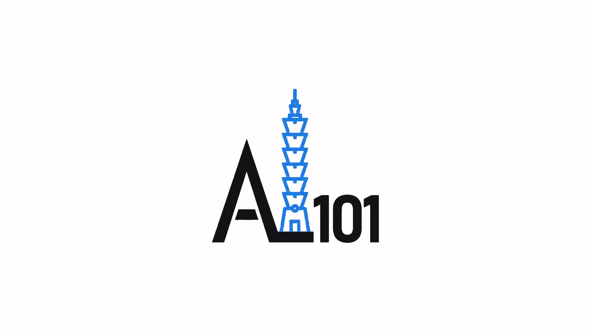

**逐字稿片段：** 他也講了怎麼看一個小孩會不會變強 看的是他分不分得出哪裡該想 哪裡想了也沒用 原影片連結在說明欄，有興趣可以去聽更多。

**話題推測：** 介紹羽生對判斷小孩將棋潛力的看法，轉向育才觀點。

---
