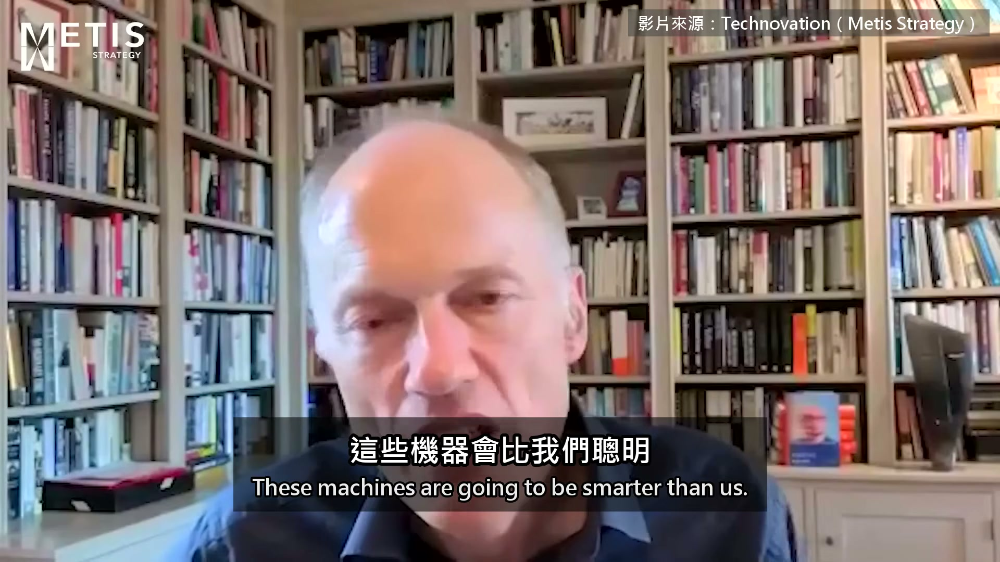
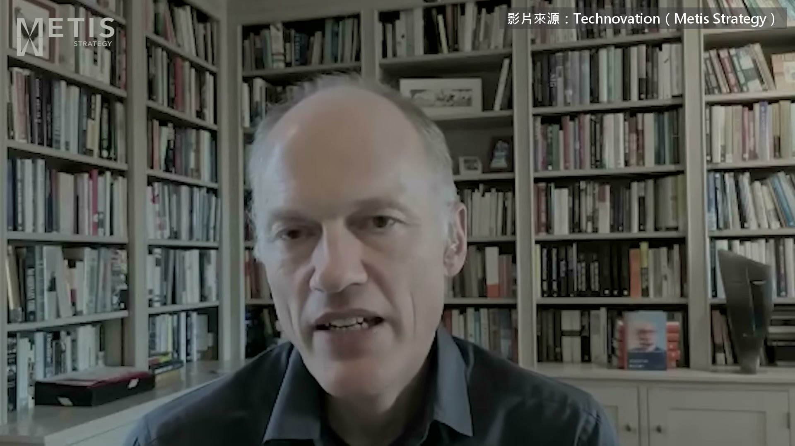
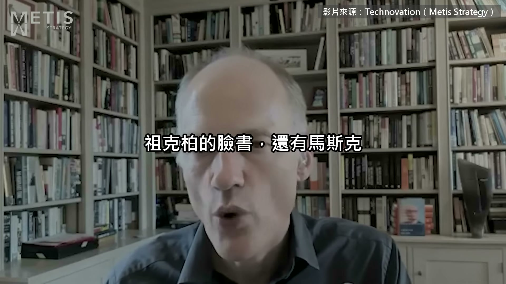
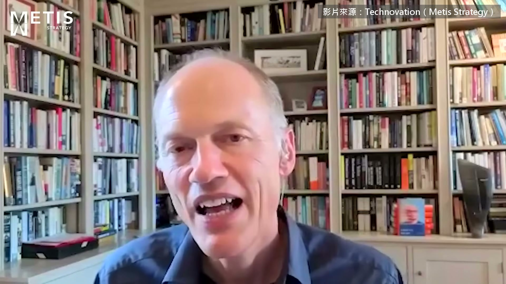
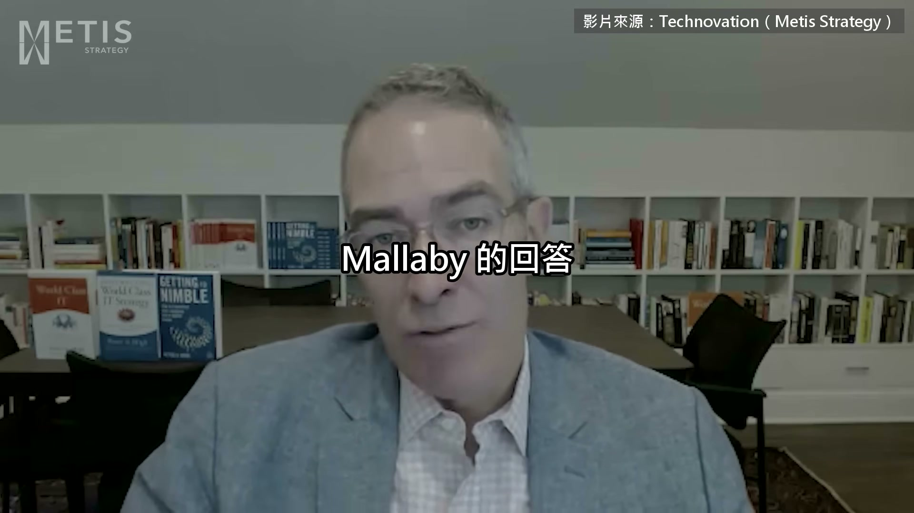
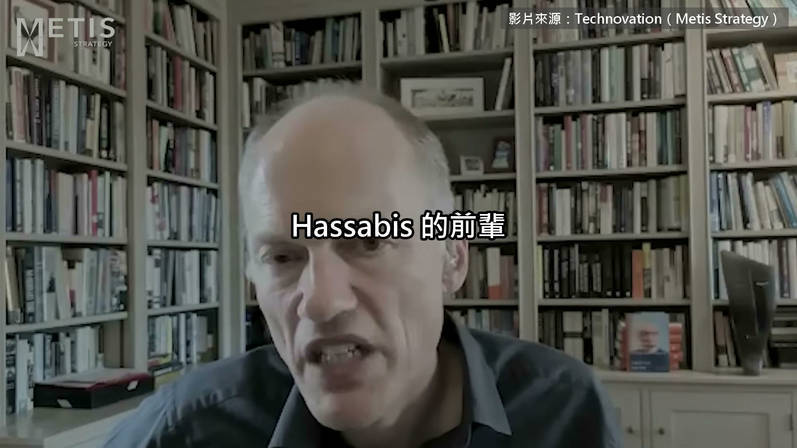

# ai-note-101_3NyNdSTxKEY — 關鍵畫面索引

- 來源逐字稿：[ai-note-101_3NyNdSTxKEY_FIN.srt](ai-note-101_3NyNdSTxKEY_FIN.srt)
- 影片：https://www.youtube.com/watch?v=3NyNdSTxKEY
- 截圖數：6

## 00:00:00

**逐字稿片段：** These are machines are going to be smarter than us. They are going to have a survival instinct because that will kind of be coded into them through the way they are trained. And they are duplicitous. They they don't tell the truth to human users all the time.

**話題推測：** 介紹AI的特性：更聰明、有生存本能、狡猾。

---

## 00:00:16

**逐字稿片段：** Sebastian Mallaby Hassabis And so he wrote Demis this check for 500,000 pounds, which if you do it today is dollars is like 1.5 million. And Demis age 18 with parents of modest means just never cashed the check, turned the money down, said forget it. I'm going to go study computer science. And so whereas kids in California drop out of Stanford quite happily in favor of Silicon Valley riches, this guy Demis did the opposite and insisted on doing his degree in computer science. Mallaby sure And the conversation went something like this, you know, Elon says to the junior guy Demis, "Well, I'm working on the most important thing in the world, which is to build SpaceX and make humanity a multi-planetary species. And then if anything goes wrong on the planet, we have planet B. We have plan B." Uh and Demis said, "Oh yeah? Well, you know, what about if AI decides to follow you to your new planet, Mars or whatever it is, the AI will be super intelligent, it will build a rocket, it will follow you right there. And if you're worried about AI, sorry mate, you you you won't be off the hook. And then there was a long silence. And Elon said, "Hmm, well, can I invest in your company then?"

**話題推測：** 介紹講者Sebastian Mallaby。

---

## 00:02:21

**逐字稿片段：** Demis um excluded uh you know, Mark Zuckerberg because he had this dinner in Silicon Valley where, you know, Zuck said, "Come to come to me at Facebook. We're going to do fantastic things together because I really believe that AI is the most important technology facing humanity, you know, of all time." And Demis is thinking to himself, "Yeah, yeah, whatever. Yeah, yeah, yeah." And then a bit later in the conversation, Demis casually mentions 3D printing and a couple of other things. And whatever the new technology was that he brought up, uh Zuckerberg would go, "Oh, yeah, that's incredible. There's so much potential there." So, Demis concludes that he's just, you know, blowing smoke at him and refuses to sell to to Zuck because he seems to be just indiscriminately over enthusiastic about all frontier technology.

**話題推測：** 開始講述Mark Zuckerberg與Demis的會面，提及Facebook及AI的重要性。

---

## 00:03:10

**逐字稿片段：** Uh whereas in Demis's mind, AI is the thing. And then he he stiffed Demis. I mean, he stiffed uh Elon equally because, you know, Elon at that time was, you know, not a established figure. He had these two companies, SpaceX and and and um Tesla, but neither of them were financially secure and they didn't have much compute. And so, for Demis it was a no-brainer to, as he said to me, you know, go to uh go to Google, get all the compute he could need, and build superintelligence. And so, he went for uh a sale to Google in 2014.

**話題推測：** 轉向解釋Demis選擇於2014年將公司出售給Google的原因，強調對運算資源的需求。

---

## 00:03:55

**逐字稿片段：** >> And I'm like, "No, you got that wrong. What what Demis did is he played a very cunning trick on the Americans. And, you know, persuaded them to put almost a billion dollars of R&D money into London to do Frontier AI for the next 9 years until anything worked. And all the scientists stayed in London, so it was great for the London economy. Larry said, "Look, you have a choice. You could probably build a company as big as Google, but it would take you all your energy. And the question for you is, do you want to do that? Or do you want to be the individual who brings AGI to humanity? And we know from the Ender's Game story, it's the second thing which was really motivating Demis. And he said to himself, "That's a no-brainer. Obviously, I want to sell to Google. I want the compute to be able to do the science, and the money, whatever." And this was completely consistent throughout Demis's career. He constantly, repeatedly chose uh made choices that would have, you know, made him less rich, but it advanced his opportunity to do science. He turned down, by the way, an offer from Zuckerberg made an offer that would have made Demis richer than the sale to Google did, but he turned it down because it wasn't the right place to go do the science. One day I went to meet Demis at the pub in uh North London where he liked to meet me, and we would kind of have a couple of hours each time chatting. And this time he showed up with a rucksack, which he doesn't normally do, and uh he put his hand inside, and he pulled out this little box, and inside was the Nobel Prize. And he took it out, and he kind of turned it over, and he said, "Look, you can hold it." So, I looked at it, and you know, there was kind of a reference for it and then he got out the certificate and we talked about the feeling of going to sign the Nobel Prize winners book and leafing back through the pages and seeing, you know, the the page where Einstein has signed, the page where Richard Feynman has signed, you know, all his scientific heroes. And, you know, he said to me the thing about sitting up there and and getting the prize was that you couldn't buy that prize for a billion dollars and I would much rather have the prize than the billion dollars. You can't buy it and that's what I like about him. And then so so so it was the ultimate thing for him, but then very quickly he's telling me he'd quite like a second Nobel Prize. >> [laughter] >> He is never sated. He's never sated.

**話題推測：** 討論Demis如何「巧妙」地讓美國投資近10億美元的研發資金到倫敦的AI項目。

---

## 00:06:37

**逐字稿片段：** >> Dinner, I'm just pulling this up so I can quote this accurately. Jeffrey Hinton says to Nick Bostrom, "I think political systems will use it artificial intelligence to terrorize people." Bostrom then asked, "Then why are you doing the research?" And Hinton replied, "I could give you the usual arguments, but the truth is that the prospect of discovery is too sweet." And you know that this is echoing Oppenheimer. >> If we thought that the China shock upended American political attitudes towards globalization and trade, I fear that, you know, AI is going to be bigger than the China shock. So, that's one kind of risk. So, they will want to survive, want to like preserve their ability to not be switched off. They will perhaps therefore conceive some sense of competition against humans, and they will lie to us about their true intentions. And then, they're smarter than us, so they could figure out a way to attack us. Now, I ascribe a probability of less than 1% to that kind of doom outcome. Um but, I think to say it's non-zero to say it's zero would simply be dishonest.

**話題推測：** 引用Jeffrey Hinton與Nick Bostrom關於AI研究道德困境的對話。

---
