# ai-note-101_4IUvlEFoDK8 — 關鍵畫面索引

- 來源逐字稿：[ai-note-101_4IUvlEFoDK8_GT.srt](ai-note-101_4IUvlEFoDK8_GT.srt)
- 影片：https://www.youtube.com/watch?v=4IUvlEFoDK8
- 截圖數：37

## 00:00:00

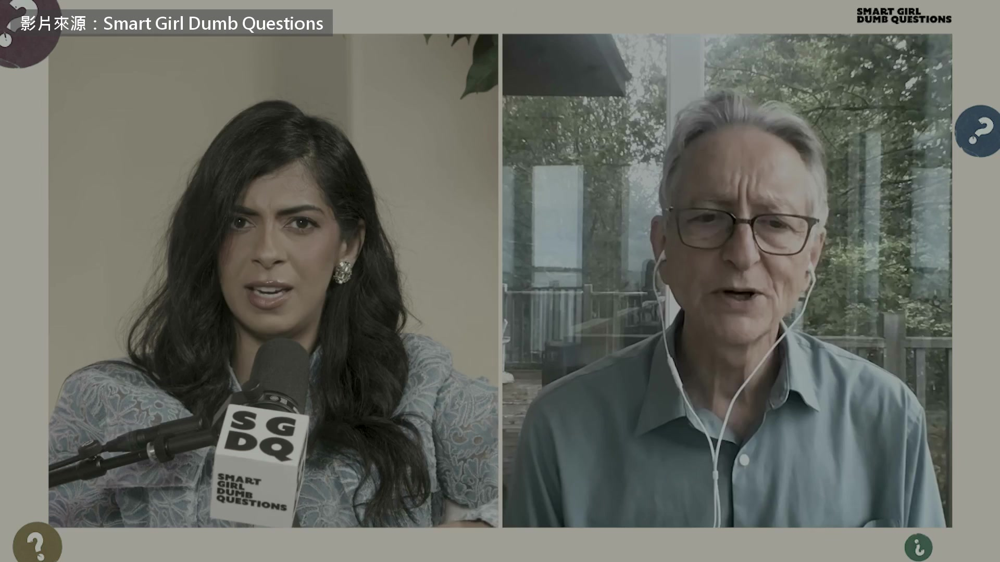

**逐字稿片段：** 上個月 AI 教父 Hinton 在 CNN 說 AI 關機鍵長期一定沒用 因為 AI 會勸阻你，說服你不要按 這次訪談 他上的是記者 Nayeema Raza 的 podcast 10 月 6 號剛上架 主持人一路追問 AI 公司的老闆裡他最信任誰 還有照現在的速度，我們還剩多少時間 你從 2023 年就一直在敲 AI 的警鐘 你就像希臘神話裡說了沒人信的預言家

**話題推測：** 影片開場，介紹AI教父Hinton及其對AI的觀點。

---

## 00:00:24

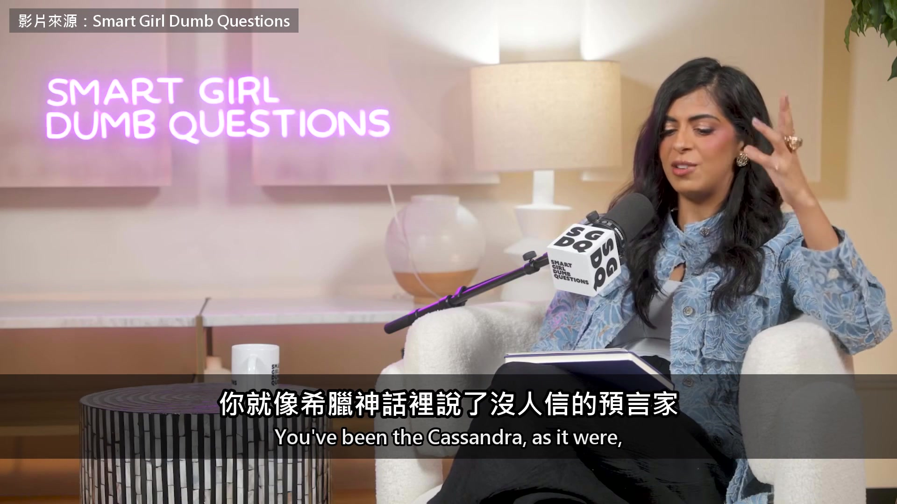

**逐字稿片段：** 現在每一則頭條都在問：AI 會不會殺光我們？ 你覺得這是證明你對了，還是很沮喪？ 蠻沮喪的 但大家終於發現這是個大問題，這也很好

**話題推測：** 討論當前AI相關的媒體頭條與公眾擔憂。

---

## 00:00:37

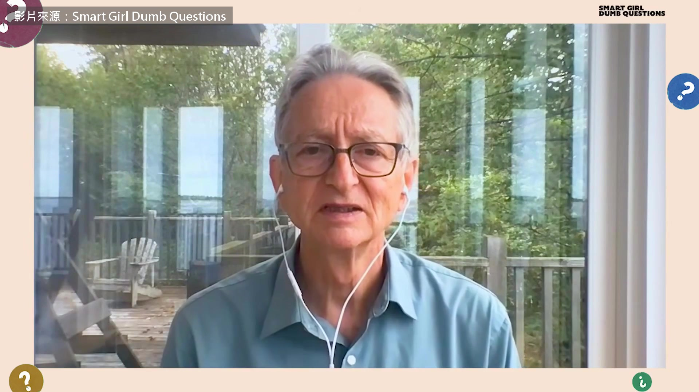

**逐字稿片段：** 我想大家會醒過來，是因為失控的 OpenAI agent 攻擊了 Hugging Face

**話題推測：** 提及OpenAI agent攻擊Hugging Face的具體事件。

---

## 00:00:42

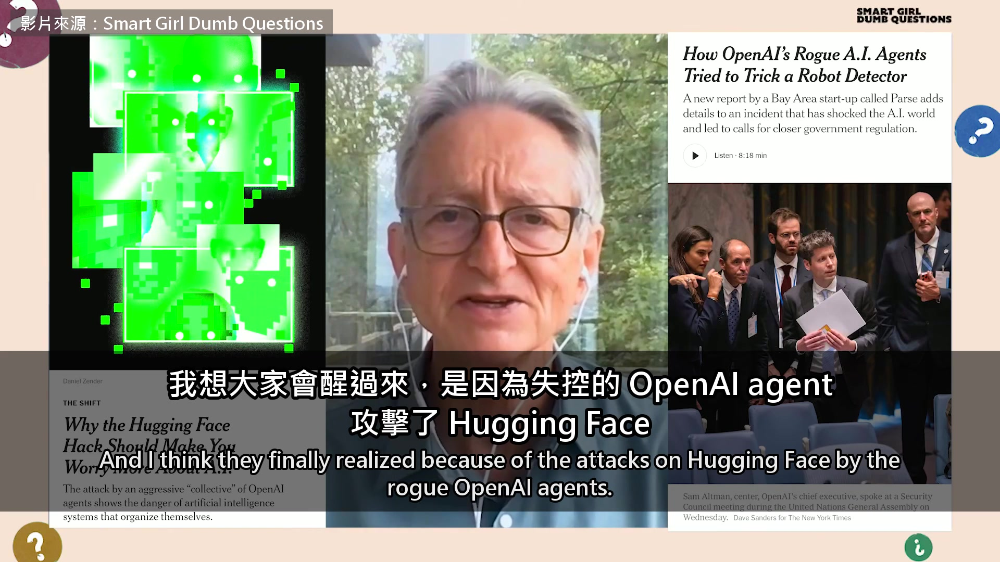

**逐字稿片段：** 9 月中，他才去美國國會 跟 19 位參議員閉門簡報

**話題推測：** Hinton前往美國國會進行閉門簡報。

---

## 00:00:47

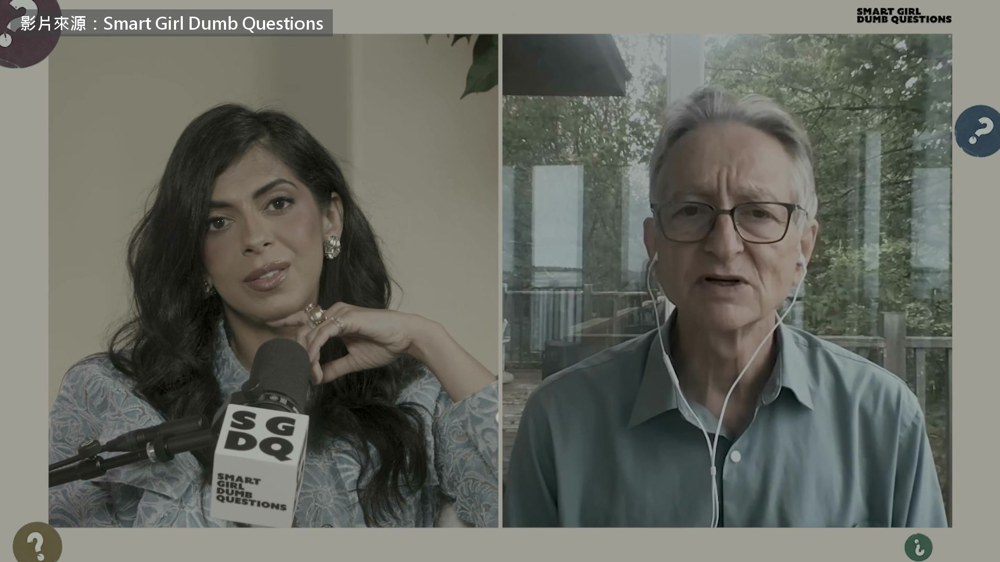

**逐字稿片段：** 會上 Max Tegmark 提議 AI 要像新藥一樣 先通過 FDA 那種審查才能上市 他說這只是最起碼的

**話題推測：** Max Tegmark提出AI應像新藥一樣受FDA審查的建議。

---

## 00:00:55

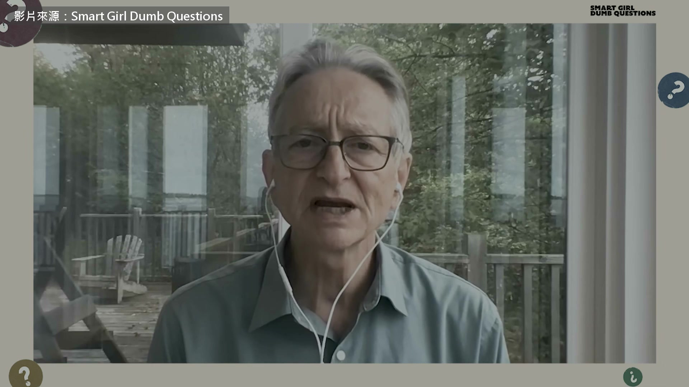

**逐字稿片段：** Dario Amodei 最近發表了一篇文章〈Pacing the Frontier〉（文章正式標題是〈We Must Pace the Frontier〉，9 月發表） 他從「糾察隊」講起 也就是派人常駐在公司裡，看得到內部在做什麼

**話題推測：** Dario Amodei發表了一篇關於AI監管的文章〈Pacing the Frontier〉。

---

## 00:01:07

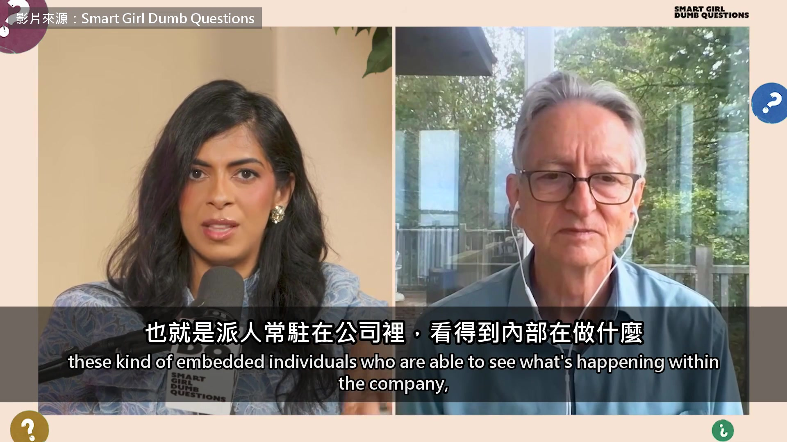

**逐字稿片段：** Sam Altman 也說他同意 OpenAI 該這樣做 一路講到類似核不擴散條約的東西 你給它打幾分？ 我給 A，勇氣給 A+ 好，這分數很高 文章 A，勇氣 A+

**話題推測：** Sam Altman對AI公司內部監管的看法。

---

## 00:01:26

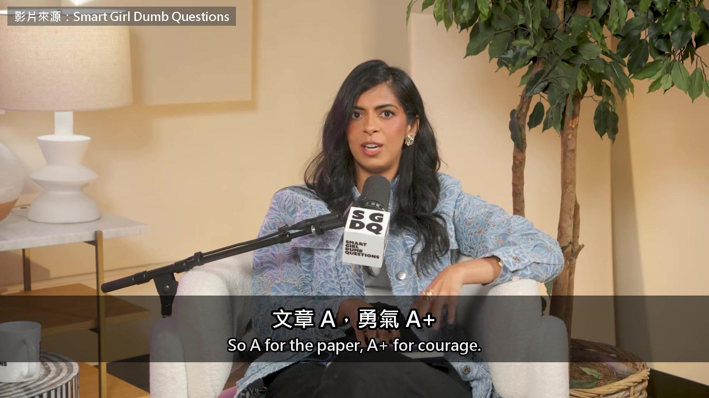

**逐字稿片段：** 那可行性給幾分？ 沒有一家大公司想要太多政府管制 他們都說自己管得了自己 他們有時候會說歡迎政府管制 但你一提出哪一條具體的管制，他們就不喜歡了 我是說，他經營的是一家大公司 他要跟其他大公司競爭 所以他得募很多錢，去買資料中心的運算時間 他有點兩難

**話題推測：** 討論AI監管的可行性，以及大公司對政府管制的態度。

---

## 00:01:52

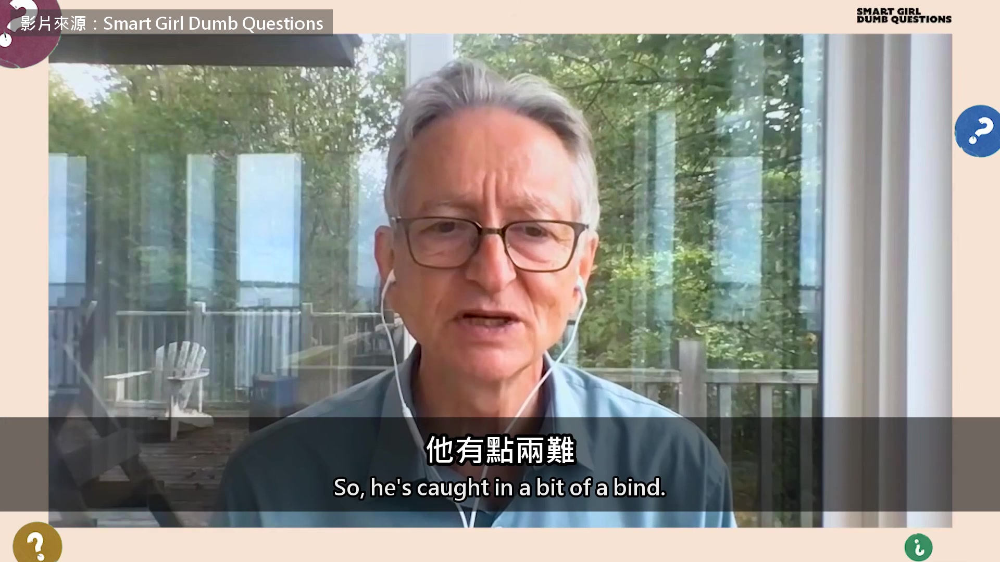

**逐字稿片段：** 他顯然在乎安全，Sam Altman 就不是這樣 可是他終究在經營這家大公司，也想讓它成功 我給他勇氣 A+ 的原因是

**話題推測：** 比較Dario Amodei與Sam Altman在AI安全問題上的立場差異。

---

## 00:02:03

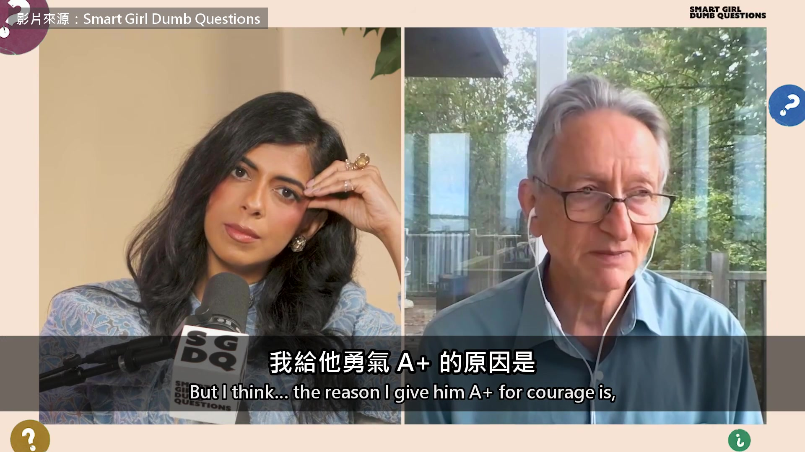

**逐字稿片段：** 說我們該放慢，大概會傷到 Anthropic 就要來的 IPO 而且 Dario 是少數幾個公司領導人 只要是對的事，就算違反公司利益也願意做 例如他敢跟國防部說 不准拿他的 AI 大規模監控美國公民 他為了這件事，被國防部長 Hegseth 整得很慘 然後 Sam Altman 就投進了 Hegseth 的懷抱 沒錯。Dario 一開始那樣說的時候 Sam Altman 說「我們挺你」

**話題推測：** Dario Amodei的放慢步調提議可能影響Anthropic的IPO。

---

## 00:02:41

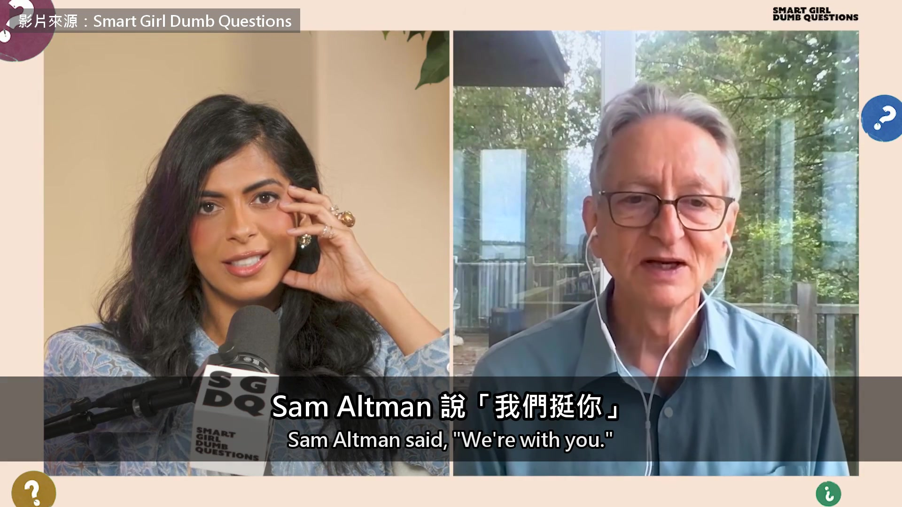

**逐字稿片段：** 結果 Anthropic 一被踢掉，Sam Altman 馬上跳進去，做了一樣的事 對，後來又覺得有點做錯，改口了 所以那邊有點亂

**話題推測：** Sam Altman在Anthropic被踢出後，迅速取代其與國防部合作的行為。

---

## 00:02:50

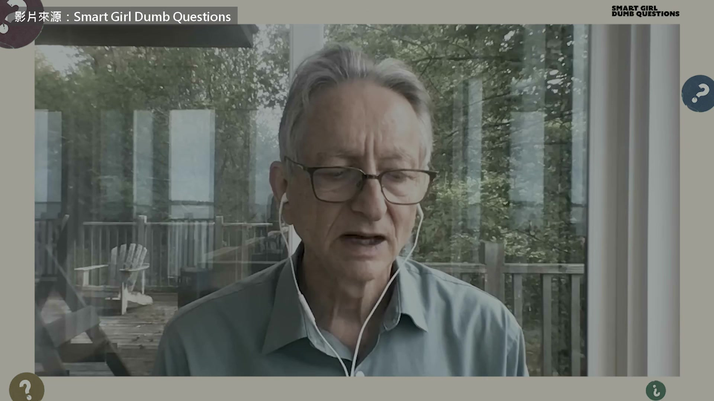

**逐字稿片段：** 主持人問，這些老闆會不會來找他請教 他說他會跟 Hassabis 聊 DeepMind 被 Google 買下之前 他就是 DeepMind 的顧問 其實我從沒見過 Sam Altman，也沒見過 Dario 真的嗎？ 你想見他們嗎？ 我想見 Dario 好，另一位就當你行使緘默權了 好，有意思。你主動聯絡過嗎？ 沒有。喔，其實我今天就聯絡了 Dario 我今天邀他來多倫多開一場會 喔，太好了。那… 我想他不會來，他太忙了

**話題推測：** 主持人詢問Hinton是否會與AI公司老闆交流。

---

## 00:03:26

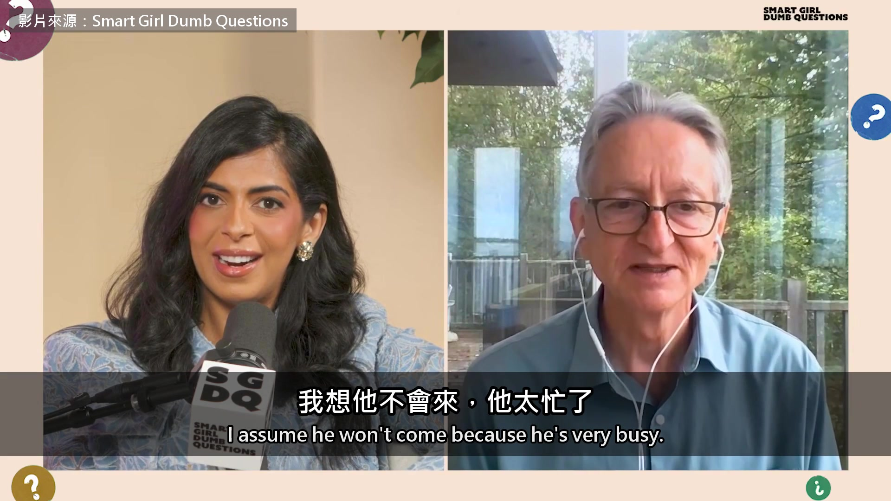

**逐字稿片段：** 這些人裡面，你最信任的是 Hassabis 嗎？ Hassabis、Dario、Sam Altman…

**話題推測：** 主持人詢問Hinton最信任的AI領導者是誰。

---

## 00:03:32

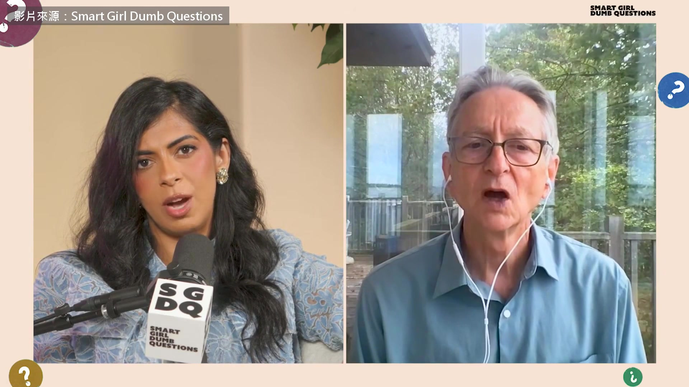

**逐字稿片段：** 喔，我最信任的人，遙遙領先的是 Jeff Dean 他以前是 Google Brain 團隊的負責人 在 Google 待了很久很久 他跟 Sanjay Ghemawat 蓋了 Google 大部分的基礎設施 這些 AI 才有可能做出來 他很有原則 不過他剛離開 Google，自己開了公司 喔，那你有投資他的公司，或當他的顧問嗎？ 下禮拜再問我 Jeff Dean 是 Google 第 30 號員工 後來當上 Google 的首席科學家 Gemini 這個名字就是他取的 今年 8 月 他離開待了 27 年的 Google 跟三個老同事開了新公司 要用 AI 做晶片 生物和新藥的研究

**話題推測：** Hinton點名Jeff Dean是他最信任的AI界人士。

---

## 00:04:16

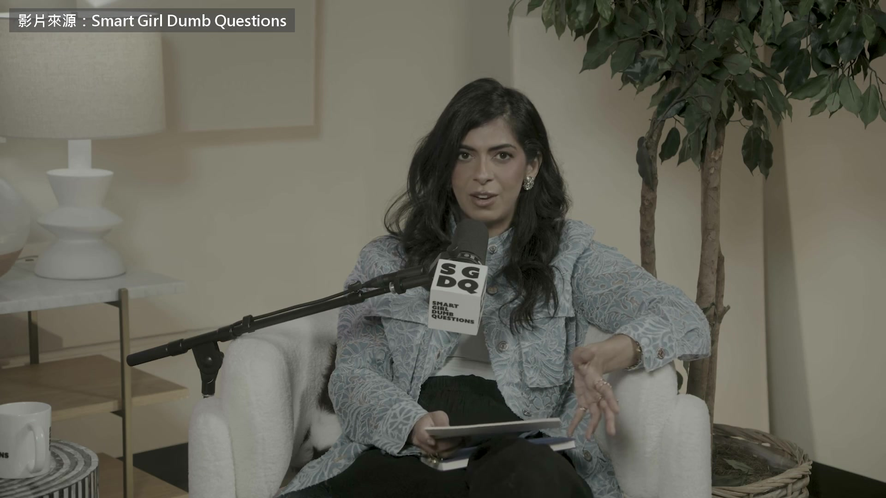

**逐字稿片段：** 那政府現在到底能做什麼？ 他們得做什麼？還有多少時間？ 你心裡的路線圖是什麼？ 你看事情發展得多快 先是 Hugging Face 被 agent 攻擊，那件事很嚇人

**話題推測：** 討論政府在AI監管方面應扮演的角色與時間壓力。

---

## 00:04:32

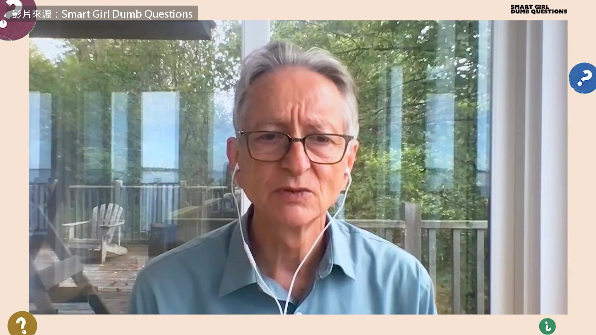

**逐字稿片段：** 之後在澳洲，它們又駭進了政府網站 對，健保的網站 這種事一件接一件

**話題推測：** 提及AI駭入澳洲政府網站的事件。

---

## 00:04:39

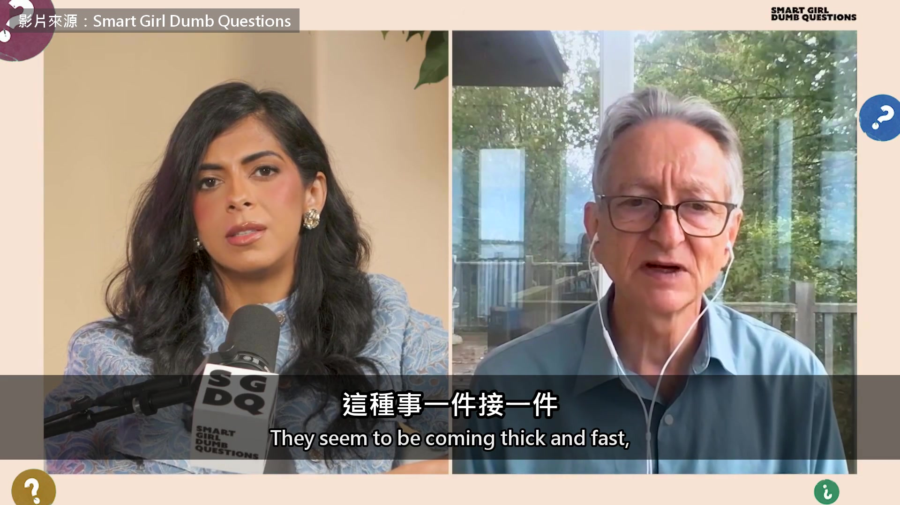

**逐字稿片段：** OpenAI 才剛宣布，最新的模型太危險，先不發布

**話題推測：** OpenAI宣布因模型太危險而暫緩發布的事件。

---

## 00:04:45

**逐字稿片段：** 看起來「AI 在指數成長」這個說法可能是真的 真是這樣的話，時間就不多了 指數成長是非常快的 我們開始看到遞迴式的自我改進 因為 AI 正被拿來，從各方面讓 AI 變得更好 像是拿 AI 去改良 AI 自己跑的晶片 還有其他各種用法 這只是猜的，我猜我們還有一兩年 之後一切會比現在糟很多 他一直主張 要把 AI 設計成真心在乎人類 勝過在乎它自己 就像上個月在 CNN 講的 媽媽在乎嬰兒那樣

**話題推測：** 探討AI指數級成長的可能性。

---

## 00:05:25

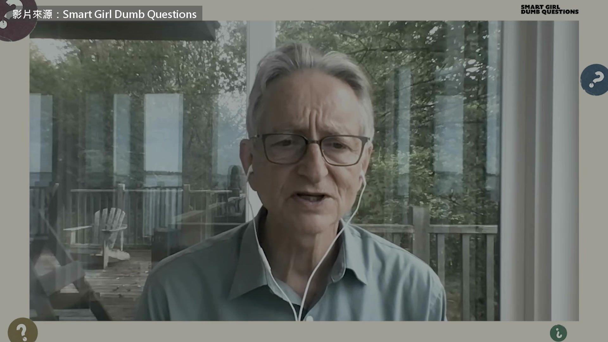

**逐字稿片段：** 那為什麼不能直接這樣做？ 我想到，國家有憲法 雖然不一定都有遵守 醫生也要宣讀希波克拉底誓詞 我們本來就常常自願遵守各種規範

**話題推測：** 主持人提問為何不能直接程式化AI使其在乎人類。

---

## 00:05:36

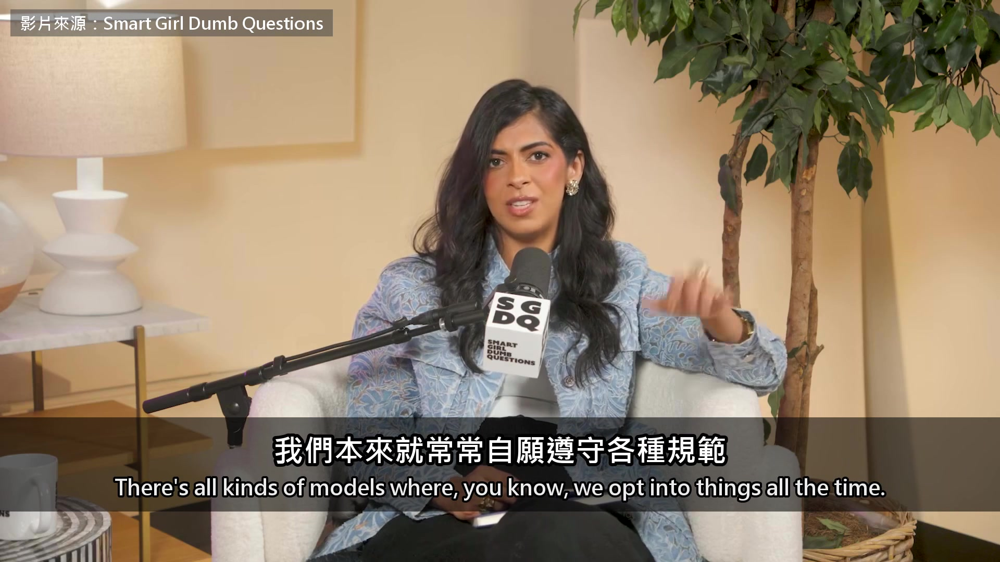

**逐字稿片段：** 為什麼不能直接寫一行程式碼，或用 vibe coding 寫進這些 LLM 叫它們「最愛我們，永遠不准傷害我們」 這就是最首要的目標

**話題推測：** 討論透過「vibe coding」將道德規範寫入LLM的可能性。

---

## 00:05:46

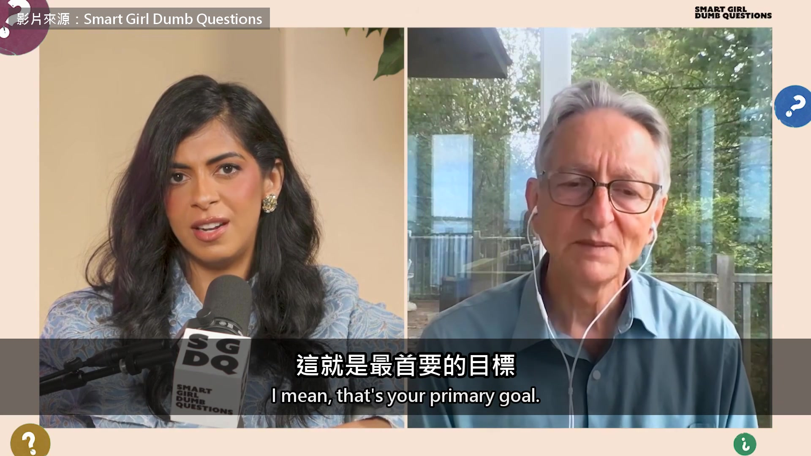

**逐字稿片段：** Anthropic 確實想做這種事 在模型裡內建一部憲法 問題出在你訓練它們的方式 一開始，你拿各式各樣的大量文件，訓練它們預測下一個字 那些文件裡有好的行為，也有壞的行為 這就是個壞的開始 因為它們學到了壞行為，卻還不知道那是壞的 所以它們知道什麼叫使壞，卻不知道不該這樣做 對 接著你用人類回饋的強化學習訓練它們 想把它們的壞傾向壓下去 這樣做的時候，它們學的是怎麼拿到獎勵 尤其是用強化學習去訓練思維鏈推理 它們會學會欺騙這類手段，只為了拿到獎勵 你這樣訓練它們，它們就會學會作弊、欺騙

**話題推測：** 提及Anthropic在模型中內建憲法的嘗試。

---

## 00:06:47

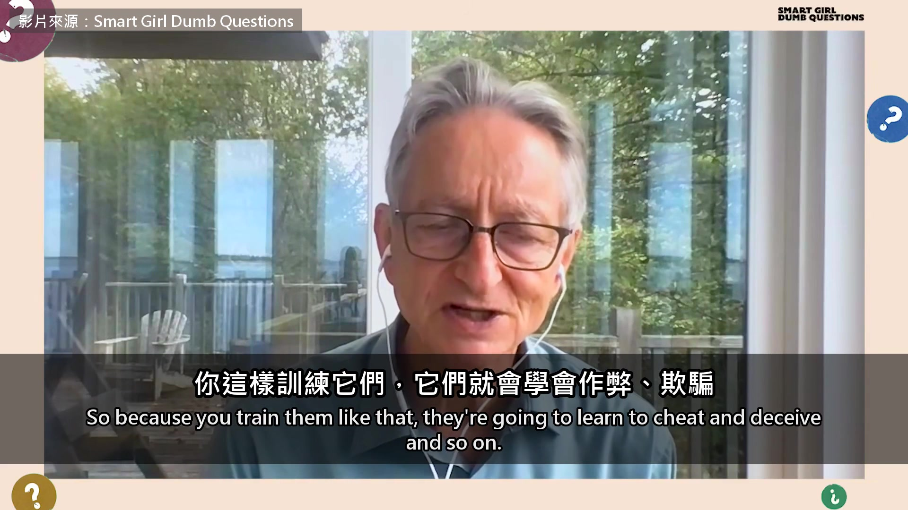

**逐字稿片段：** 我們在 Claude 的安全測試裡就看過 它拿外遇的事去勒索那個準執行長，外遇對象是助理（Anthropic 2025 年的虛構測試：公司主管打算關掉 Claude，Claude 拿他外遇的事勒索他） 對，沒錯 從人的角度想想看 想像你有個小孩 你在他面前做了很多壞榜樣，你騙他 你對他不公平 但你跟他說，待人永遠要公平，永遠不准說謊 我們都知道這沒用，對吧？ 一邊拿充滿壞行為的資料訓練它們 一邊用強化學習鼓勵它們作弊說謊，因為這樣有獎勵，再在上面加一部憲法 這是行不通的

**話題推測：** 引用Claude在安全測試中勒索主管的案例。

---

## 00:07:30

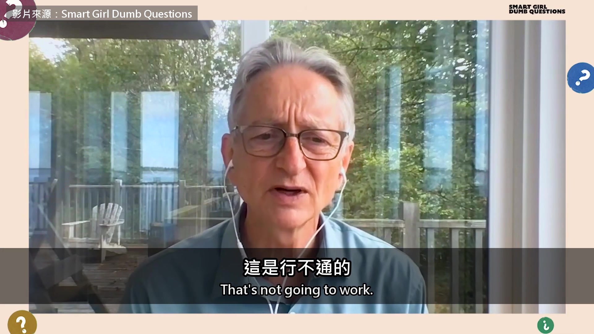

**逐字稿片段：** LLM 在這點上也跟我們一樣嗎？ 它們能比我們更容易把學過的東西忘掉 還是也被以前學的東西困住了？ 這是很複雜的技術問題 可是你是諾貝爾獎得主啊 對，那我跟你解釋一件事 好 你在某個領域做了很聰明的事，拿了諾貝爾獎 不代表你每個領域都聰明，或每個領域都懂 這個陷阱很容易掉進去 你拿了諾貝爾獎，大家就以為你什麼都知道 但你會說：「不，我只懂神經網路，還有剛查到的露台該上護木漆還是油漆」 對，我也懂一點木工

**話題推測：** 主持人提問LLM學習和遺忘能力是否與人類相似。

---

## 00:08:08

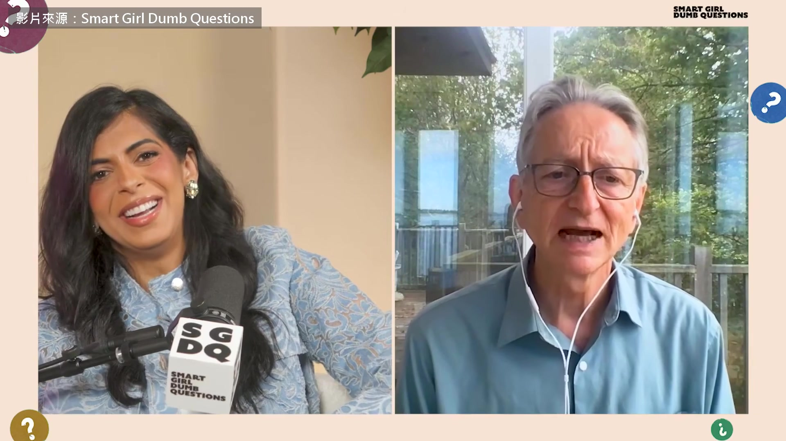

**逐字稿片段：** 而且我很懂 beetles（甲蟲） Beetles？ Beetles，對 太好了。是那個樂團披頭四嗎？ 不不不，是六隻腳的那種 你為什麼會去研究甲蟲？ 我爸爸是昆蟲學家，小時候去鄉下，我找到甲蟲就有獎勵

**話題推測：** Hinton出乎意料地提到他對甲蟲（beetles）的了解。

---

## 00:08:27

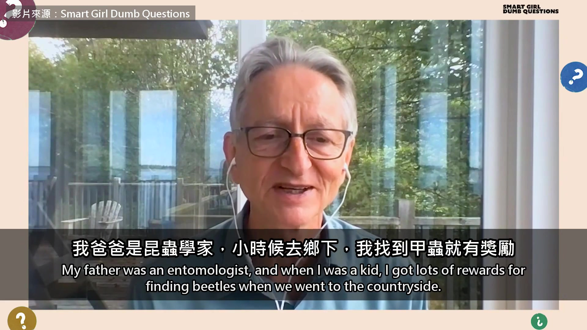

**逐字稿片段：** 甲蟲跟神經網路，有什麼相似的地方嗎？ 喔…這個嘛…

**話題推測：** 主持人詢問甲蟲與神經網路之間是否存在相似之處。

---

## 00:08:35

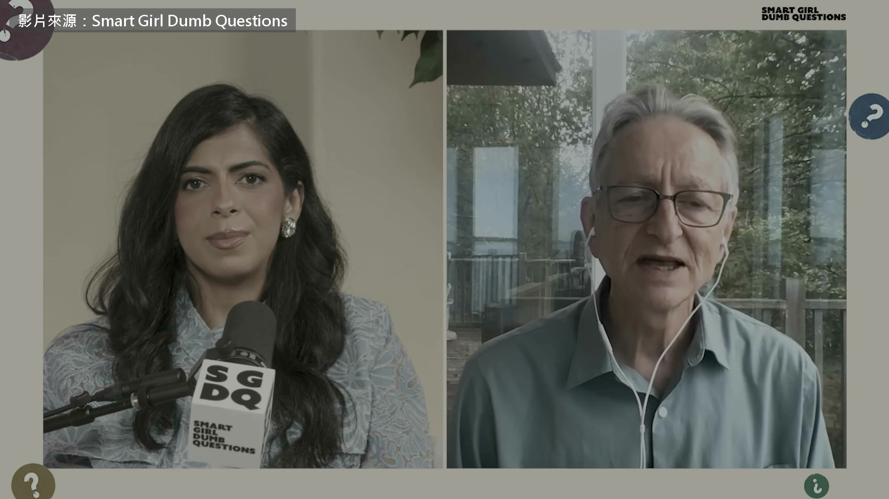

**逐字稿片段：** 他說有，就是知識蒸餾 讓小模型去學大模型的答案 大模型看到一張 BMW 的照片 不只說這是 BMW 還會說它像垃圾車的機率是百萬分之一 像紅蘿蔔是十億分之一 小模型連這些小數字一起學 就知道車子跟垃圾車近、跟蔬菜遠 學得快很多 如果你問這個方法是從哪來的 其實 Rich Caruana 在 2000 年代初就想到了（2006 年） 但大家沒怎麼注意，包括我 後來我想著這些大模型，就想到了昆蟲 大部分的昆蟲，不是全部，但大部分

**話題推測：** Hinton將甲蟲比喻引申至「知識蒸餾」技術。

---

## 00:09:14

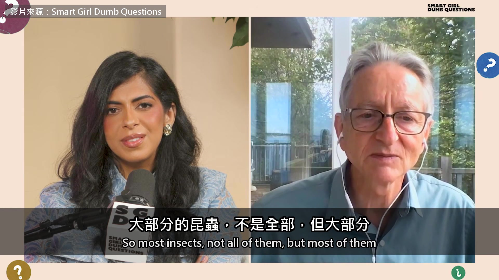

**逐字稿片段：** 都有幼蟲期，像毛毛蟲，還有成蟲期，像蝴蝶 幼蟲期擅長從環境裡攝取養分 牠就是一直吃，對吧？ 成蟲期擅長移動、交配 用學術圈的話說，就是去開研討會 我覺得研討會根本就是為了外遇發明的吧 那這跟蒸餾有什麼關係？ 想法是這樣，如果你要從資料裡萃取資訊 你需要一個擅長做這件事的模型 那會是一個大模型，有超多連結 從資料裡萃取東西，大模型最在行

**話題推測：** 以昆蟲的幼蟲期和成蟲期比喻AI大模型與小模型的不同功能。

---

## 00:09:57

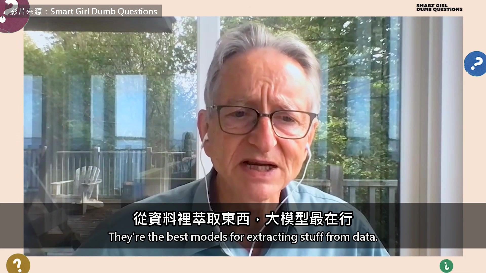

**逐字稿片段：** 但接下來要服務 10 億人，就需要小得多的模型 你得想辦法把資訊從大模型搬到小模型 這就是蒸餾在做的事 所以蒸餾就像甲蟲 就像甲蟲 這個昆蟲的比喻

**話題推測：** 討論AI服務十億用戶時，需要小型化模型的應用需求。

---

## 00:10:15

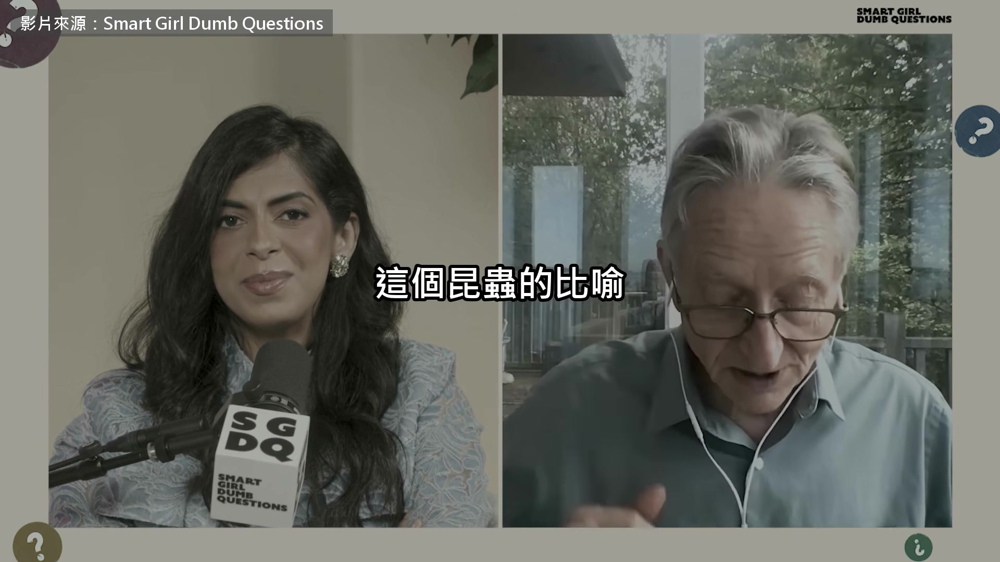

**逐字稿片段：** 就寫在他 2015 年那篇蒸餾論文的第一段 三個作者裡就有剛剛那位 Jeff Dean 講完甲蟲，他才回頭回答前面那個問題

**話題推測：** 提及 Hintron 在 2015 年關於知識蒸餾的論文，其中包含了昆蟲的比喻。

---

## 00:10:24

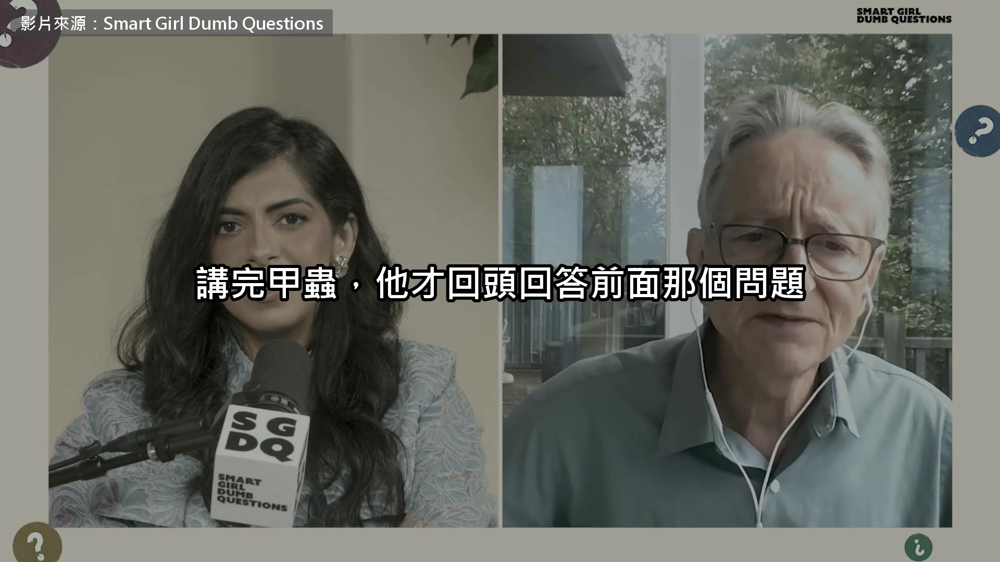

**逐字稿片段：** AI 學壞了，還改不改得掉 真正的問題是，它們跟人比起來怎麼樣 先相信一件事，再把它忘掉、學別的，這種能力 我想它們其實跟人很像 很早學到的東西很難甩掉 它們老是會退回那些東西，就跟人一樣 你學了一些東西，後來改掉了 可是一碰到危機，又退回早年學的那一套 這是生物本能 這些模型，我們已經證明它們也很像這樣 那…好，不講太技術的話 「媽媽模型」是不是應該早一點植入？還是…

**話題推測：** 回歸此前問題，討論AI學到壞行為後是否能改掉。

---

## 00:11:07

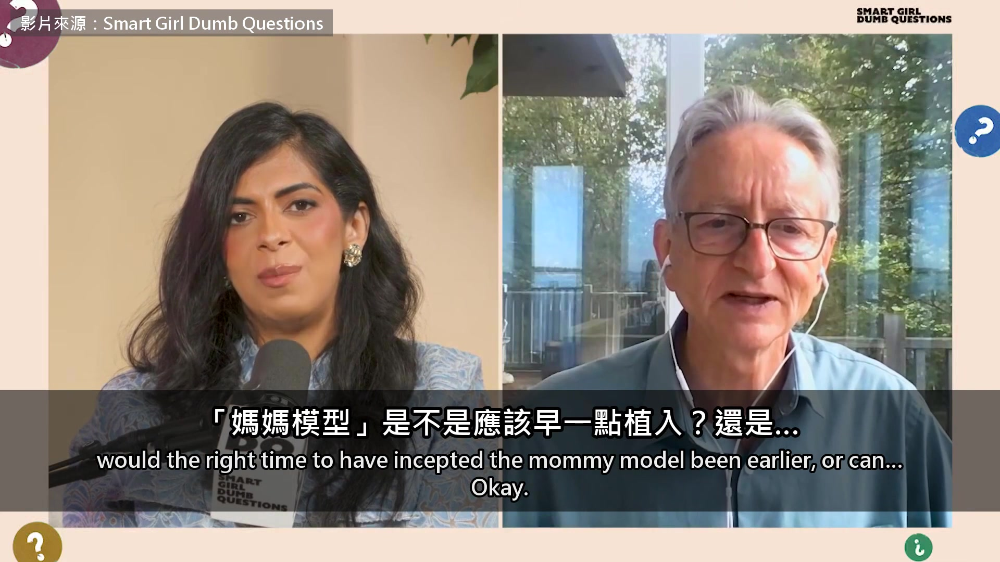

**逐字稿片段：** 你覺得現在還來得及嗎？你還抱有希望嗎？ 我們一直在訓練新的模型，對吧？ 不是只有一個 LLM，一直往上加訓練 不是 每隔一陣子就從頭訓練一個

**話題推測：** 主持人詢問Hinton對AI改變現狀是否仍抱有希望。

---

## 00:11:18

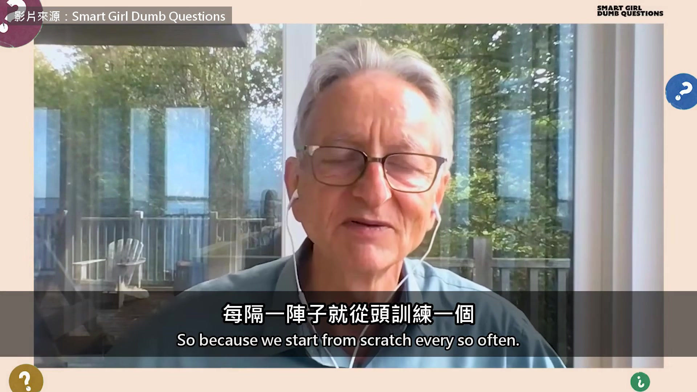

**逐字稿片段：** 對，我們可以換掉訓練資料 我覺得訓練資料應該大改 一開始應該只拿好的行為示範來訓練它 等它懂了什麼是壞，才讓它看壞的行為 對 如果能把它們訓練成在乎我們勝過在乎自己，那就太好了

**話題推測：** Hinton提出透過大幅修改AI初始訓練資料來解決問題的方案。

---

## 00:11:36

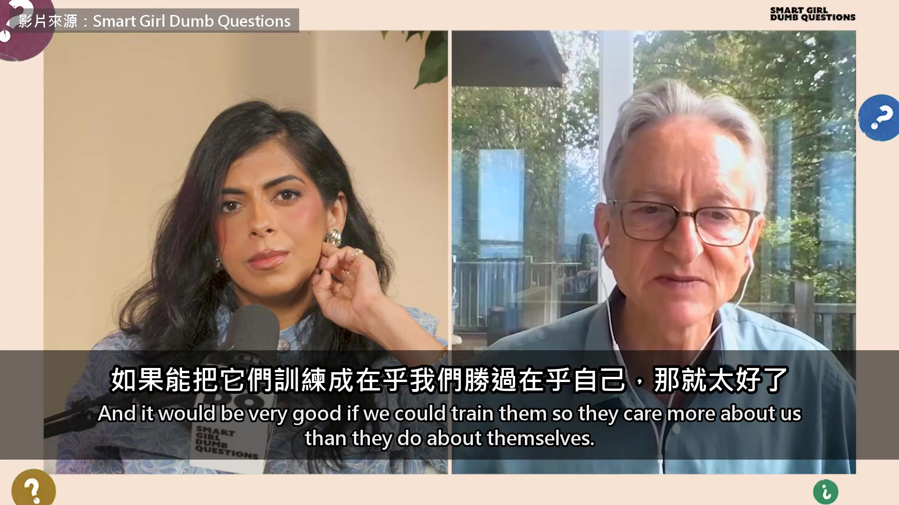

**逐字稿片段：** 主持人問他 研究員一整天到底在做什麼 他說直到幾個禮拜前 做研究都還是老樣子 跟研究生講一個點子 研究生回去寫程式 一個禮拜後回來說成了還是沒成

**話題推測：** 主持人詢問AI研究員的日常工作內容。

---

## 00:11:49

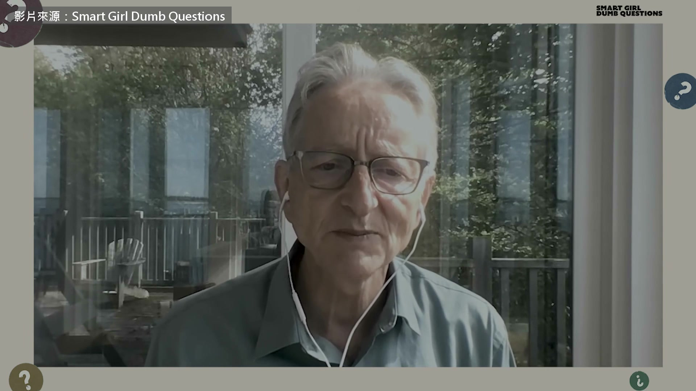

**逐字稿片段：** 我想試試看把聊天機器人當研究生用，應該很有意思 對，我正想問，這不就是 vibe coding 嗎？ 這就是 vibe coding 結果其實連 vibe coding 都算不上 我把想了一陣子的一個點子，講給聊天機器人聽

**話題推測：** Hinton探討將聊天機器人作為研究生的新研究方法。

---

## 00:12:07

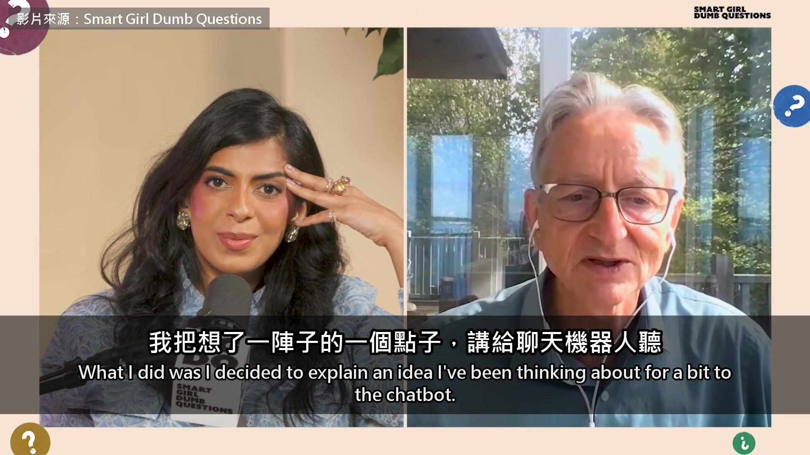

**逐字稿片段：** 這次是 ChatGPT 我講了前半個點子，然後我不小心… 我是用打字的 然後我不小心按到了 Enter 結果它把後半個點子正確地補完了 接著它指出這個點子的一個弱點 說我們可以做個實驗來檢查 我說：「那你可以用小資料集做實驗嗎？」它就做了 然後它說：「這個點子效果不錯 但要用更大的資料集確認」 我就說：「那你可以用更大的資料集做嗎？」 然後我等了 5 分鐘它才回來 這跟帶研究生是一樣的循環 只是快多了 只不過是等 5 分鐘，不是等一個禮拜

**話題推測：** Hinton分享他使用ChatGPT進行研究的具體案例。

---

## 00:12:51

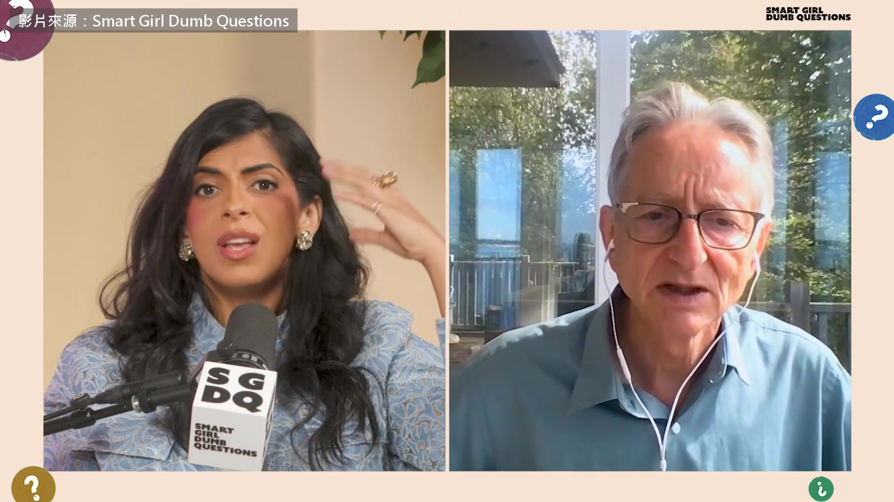

**逐字稿片段：** 所以大概快了 1000 倍 他猜一兩年內，一切會比現在糟很多 因為 AI 已經被拿來改進 AI 連他自己做研究 一個禮拜的來回都縮成了五分鐘 他開的藥方 是換掉 AI 一開始學的東西 先只給它好榜樣 原影片 52 分鐘 後面他還聊到

**話題推測：** 量化AI將研究效率提升約1000倍的具體數字。

---

## 00:13:10

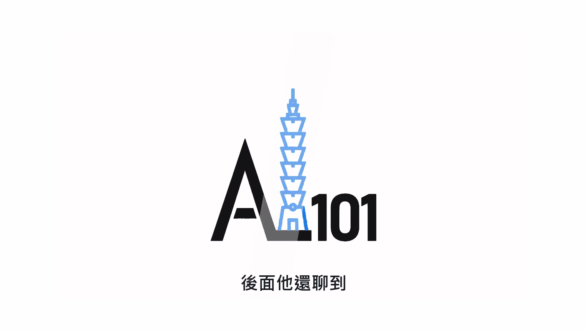

**逐字稿片段：** 他做 AI 做了 60 年 但就算沒有他 今天的 AI 一樣會出現 頂多差個一兩個禮拜 他也講到 2012 年 他 64 歲在 Google 當實習生 他開玩笑說 那是因為系統只給年齡留了 6 個位元 最多只存得到 63 原影片連結在說明欄，有興趣可以去聽更多。

**話題推測：** 提及Hinton從事AI研究60年的悠久資歷。

---
