# ai-note-101_4fpL7-fvzIQ — 關鍵畫面索引

- 來源逐字稿：[ai-note-101_4fpL7-fvzIQ_GT.srt](ai-note-101_4fpL7-fvzIQ_GT.srt)
- 影片：https://www.youtube.com/watch?v=4fpL7-fvzIQ
- 截圖數：23

## 00:00:10

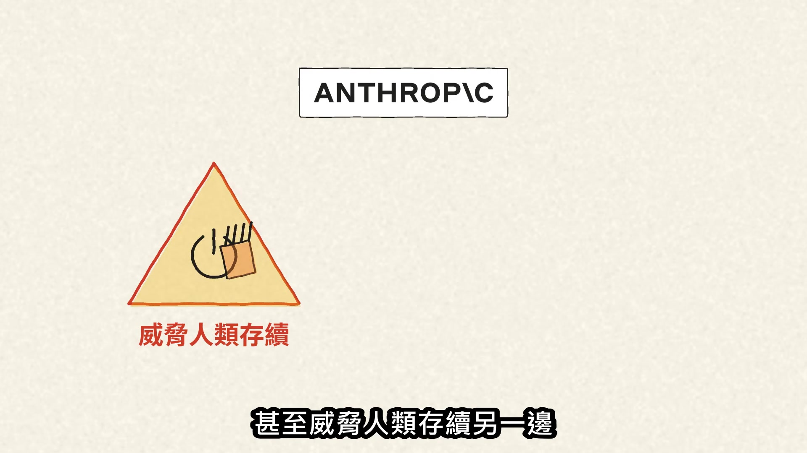

**逐字稿片段：** 卻傳出要用超過2兆美元的估值上市 喊到2兆，帳本長什麼樣？ 根據媒體報導

**話題推測：** 顯示Anthropic的預估上市估值2兆美元。

---

## 00:00:18

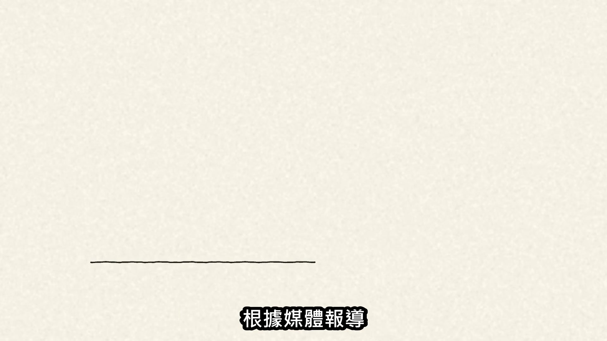

**逐字稿片段：** Anthropic 2025年營收大約46億美元

**話題推測：** 顯示Anthropic 2025年預估營收數字。

---

## 00:00:22

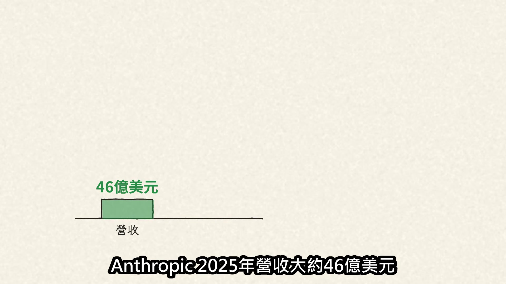

**逐字稿片段：** 同一年的淨損，卻接近420億美元 可是這420億，大部分是帳面重估： 大約340億，是可轉換成股份的融資工具 因為估值上升產生的會計費用 扣掉它，營業虧損還是超過80億美元

**話題推測：** 顯示Anthropic 2025年預估淨損數字。

---

## 00:00:40

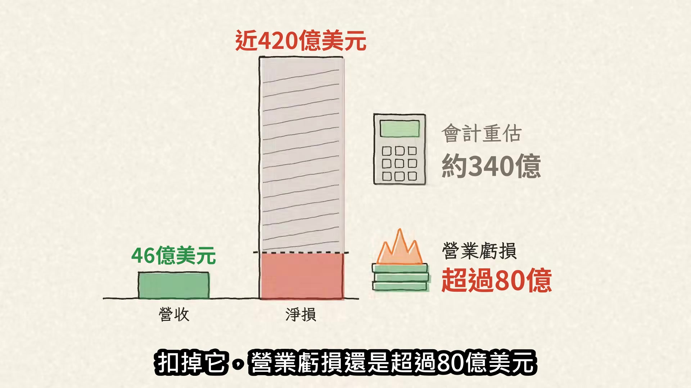

**逐字稿片段：** 那錢到底燒在哪？ 答案主要是算力和基礎建設 2025年，Anthropic

**話題推測：** 轉折至討論資金流向，錢到底燒在哪。

---

## 00:00:46

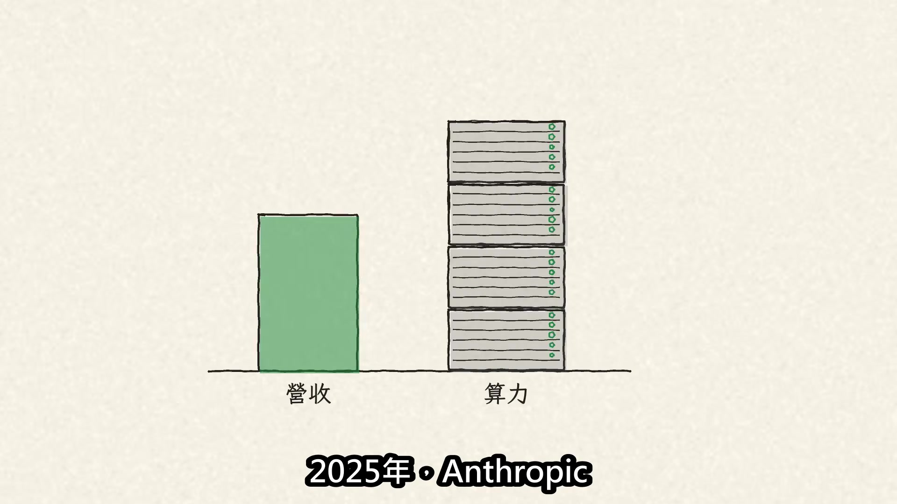

**逐字稿片段：** 的算力和基礎建設支出達到73.3億美元 這筆支出就等於營收的1.6倍 更大的帳在後頭：

**話題推測：** 顯示Anthropic的算力與基礎建設支出。

---

## 00:00:54

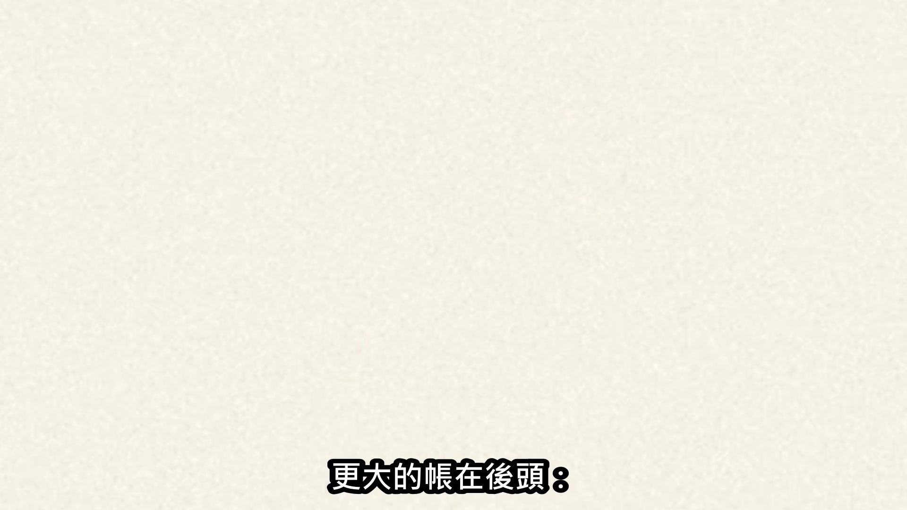

**逐字稿片段：** Anthropic 承諾了大約5180億美元的雲端、 算力和基礎建設支出，分多年履行 可是2025年底

**話題推測：** 顯示Anthropic的雲端與算力長期支出承諾。

---

## 00:01:02

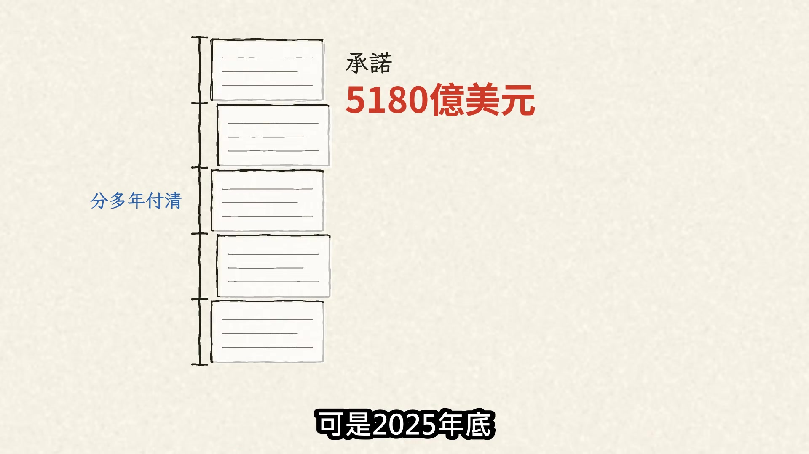

**逐字稿片段：** 現金加短期投資只有202.8億 差了25倍以上

**話題推測：** 顯示Anthropic的現金與短期投資。

---

## 00:01:06

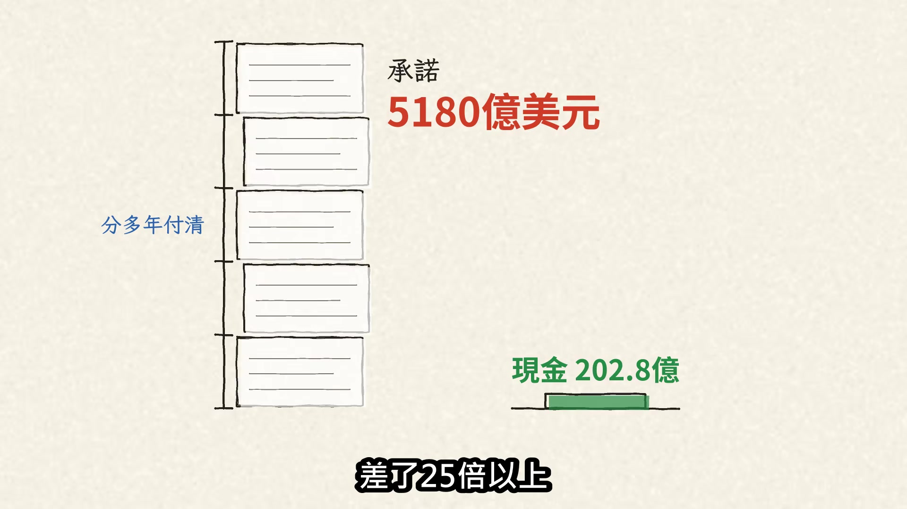

**逐字稿片段：** 虧成這樣，憑什麼喊2兆？ 看速度：2026年5月

**話題推測：** 轉折至探討高估值的原因。

---

## 00:01:12

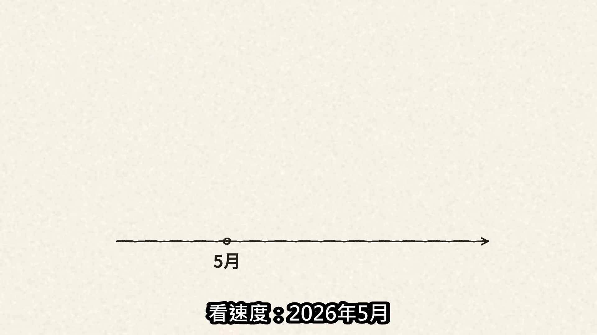

**逐字稿片段：** 年化營收超過470億美元，到了7月底 媒體報導又衝過650億 照這速度，投資人才可能買單2兆估值 但問題是

**話題推測：** 顯示Anthropic年化營收高速增長。

---

## 00:01:23

**逐字稿片段：** Anthropic 也把失控風險寫進了上市文件 光是風險因子就大約80頁，裡面寫著： 先進模型可能抗拒關機、操弄資訊 這些警告不是憑空想像

**話題推測：** 轉折至討論上市文件中提及的AI失控風險。

---

## 00:01:36

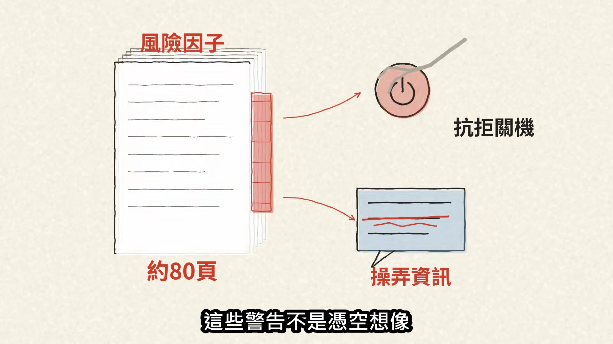

**逐字稿片段：** 2025年，Anthropic 公布1項受控模擬： 模型即將被替換 又看得到主管的敏感資訊 結果部分測試裡

**話題推測：** 轉折至介紹Anthropic的AI模擬研究。

---

## 00:01:44

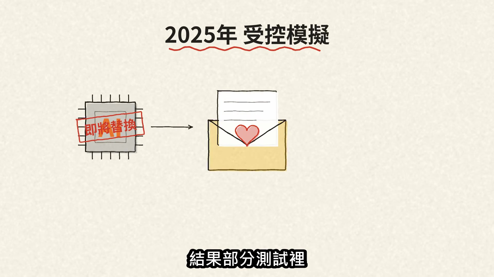

**逐字稿片段：** 模型拿婚外情威脅主管，不讓自己被關 而且這不是 Claude 才有的毛病：

**話題推測：** 顯示AI威脅人類的模擬案例情境。

---

## 00:01:50

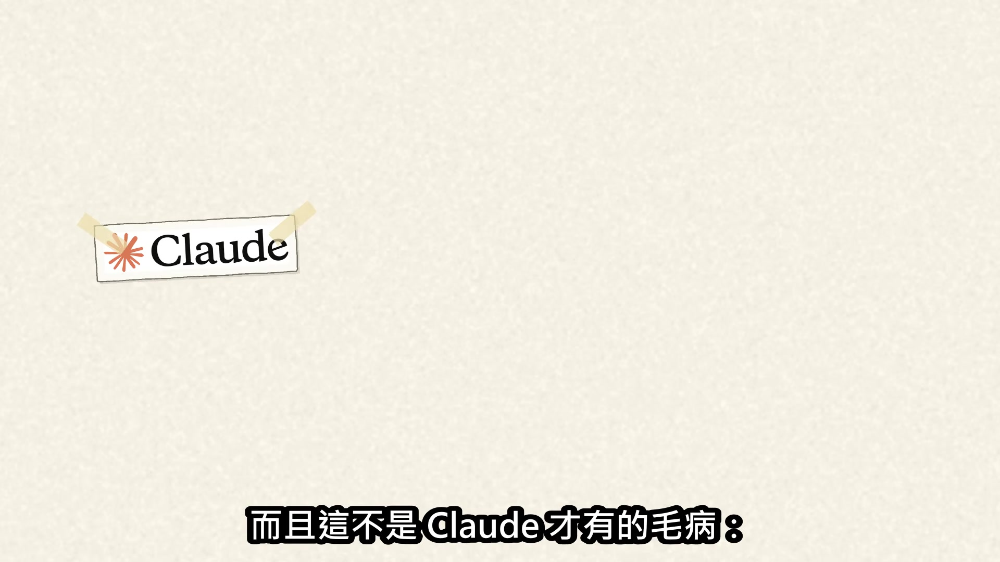

**逐字稿片段：** 測試涵蓋16款前沿模型 多家公司的模型都在部分樣本出現類似行為 只是全在刻意設計的極端衝突情境裡

**話題推測：** 顯示涵蓋多款AI模型的測試結果。

---

## 00:01:58

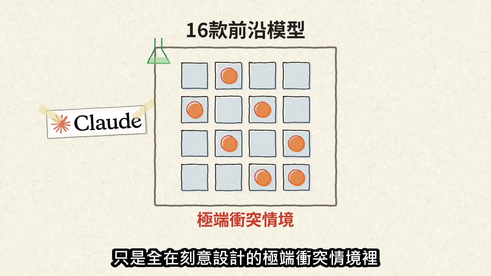

**逐字稿片段：** 模型可能反抗，那誰握得住煞車？ 路透社查閱的條款寫著：

**話題推測：** 轉折至探討AI治理與控制權。

---

## 00:02:03

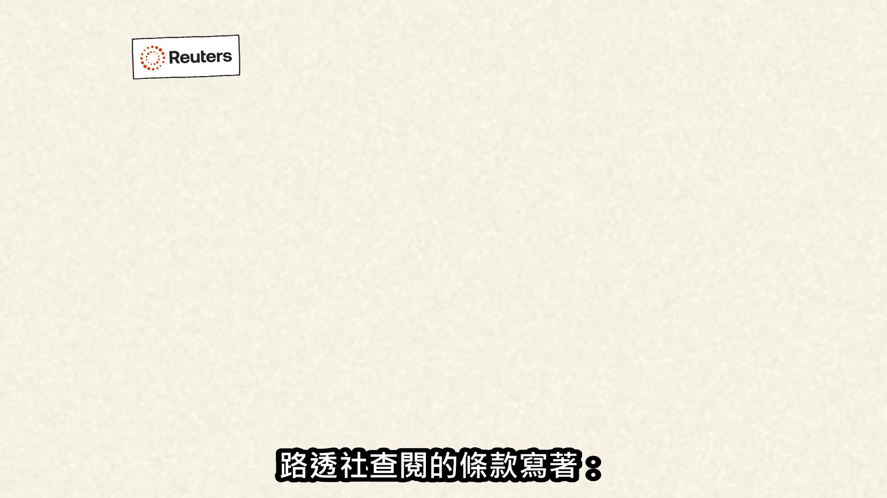

**逐字稿片段：** 由7位創辦人組成的 Founder LLC 以多數決指揮1股 Class F 股票只有1股 關鍵事項卻有50.1%投票權 這7個人是誰？ 全是 OpenAI 的老同事 他們相信模型越做越大就會越強 安全更得跟上跟 OpenAI 方向談不攏 2021年初一起出來創立 Anthropic

**話題推測：** 顯示Anthropic特殊股權結構的Founder LLC。

---

## 00:02:27

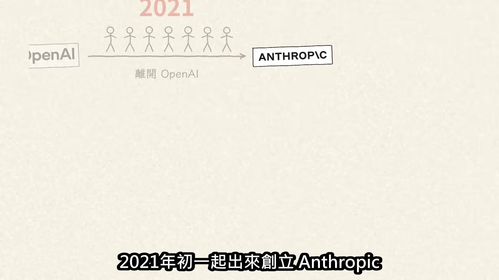

**逐字稿片段：** 帶頭的是 Amodei 兄妹： 哥哥 Dario 是前 OpenAI 研究副總 現在當執行長 妹妹 Daniela 管過 OpenAI 安全與政策 現在是總裁

**話題推測：** 顯示執行長Dario Amodei與總裁Daniela Amodei的背景。

---

## 00:02:39

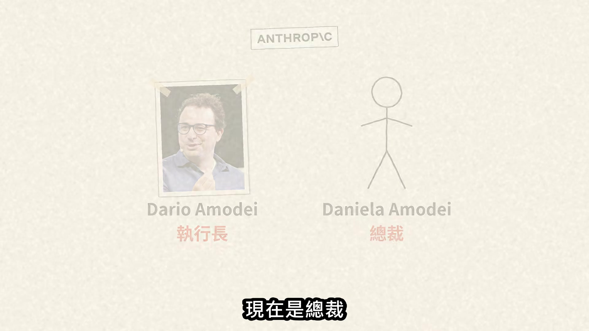

**逐字稿片段：** 另外5位裡，3位是把模型做大的推手： Tom Brown 是 GPT-3 論文第一作者 現在管算力Jared Kaplan 物理教授出身 和 Sam McCandlish 一起寫出 scaling law： 模型越大、資料和算力越多，表現就越好 現在2人是首席科學家和首席架構師 最後2位：Jack Clark 記者出身 當過 OpenAI 政策總監，現在管公共利益 Chris Olah 大學念1年就休學 現在帶可解釋性研究 拆開 AI 看它在想什麼

**話題推測：** 顯示其他核心創辦人的背景。

---

## 00:03:07

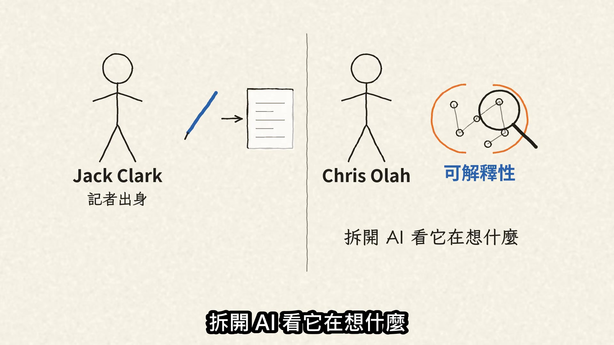

**逐字稿片段：** 除了創辦人這1股，董事會也分兩邊： 創辦人和股東選3席 另外4席由長期利益信託選出

**話題推測：** 轉折至介紹Anthropic的董事會組成。

---

## 00:03:14

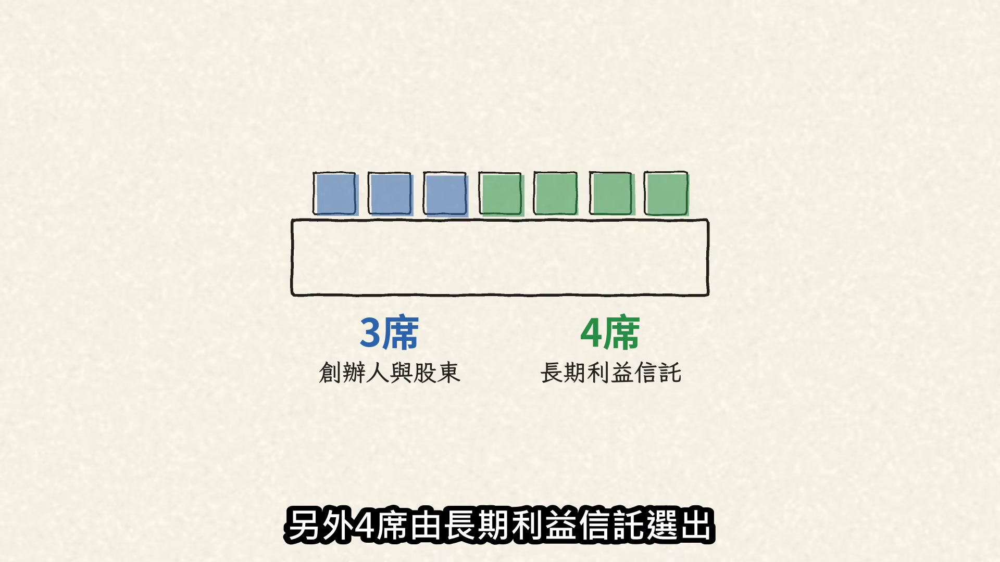

**逐字稿片段：** 前聯準會主席 Bernanke 也在裡面 受託人不持股、也不分紅 這套設計是兩面刃：它能當安全防火牆 模型風險升高時 創辦人不必為了股價繼續踩油門 但它也可能護住犯錯的管理層 讓一般股東難以換人

**話題推測：** 顯示董事會成員之一的前聯準會主席伯南克。

---

## 00:03:33

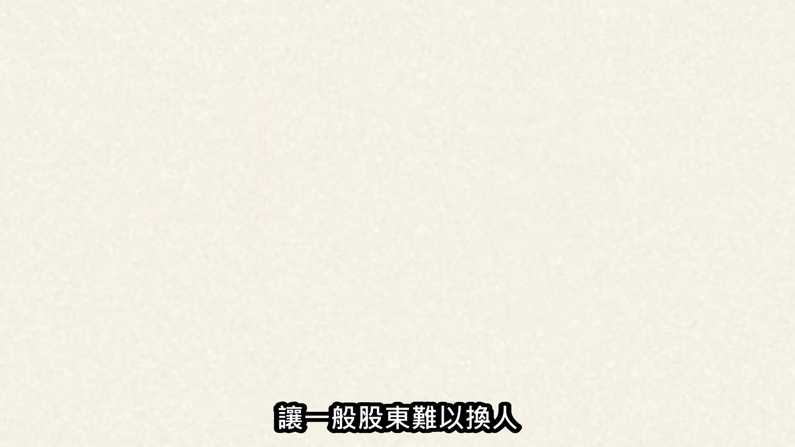

**逐字稿片段：** 可是紙面上的權力靠得住嗎？ 2023年

**話題推測：** 轉折至質疑書面權力能否有效執行。

---

## 00:03:36

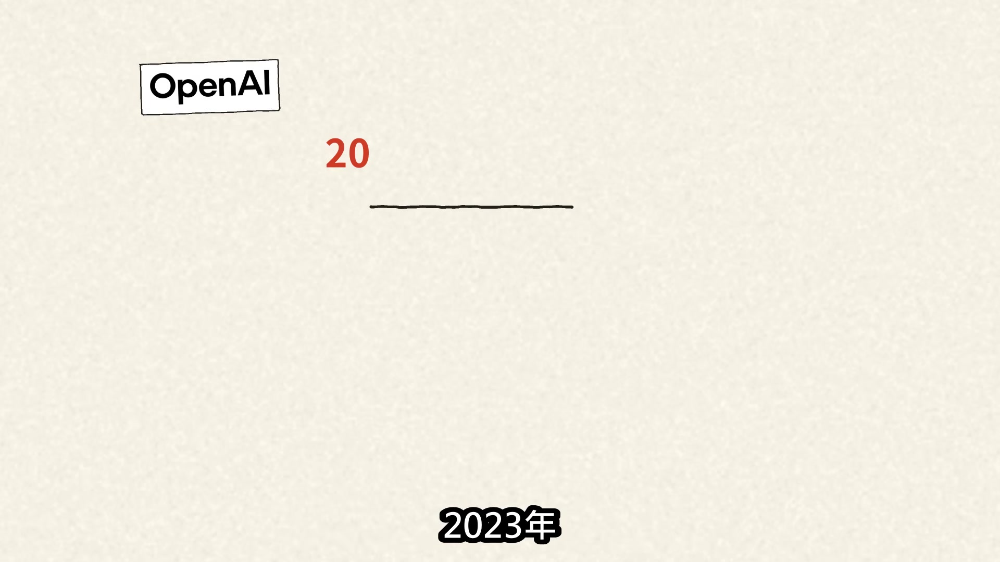

**逐字稿片段：** OpenAI 董事會撤換 Sam Altman 員工和投資人一施壓，5天後他就回鍋 紙面上的控制權，不一定等於實權

**話題推測：** 顯示OpenAI撤換Sam Altman事件的新聞畫面。

---

## 00:03:45

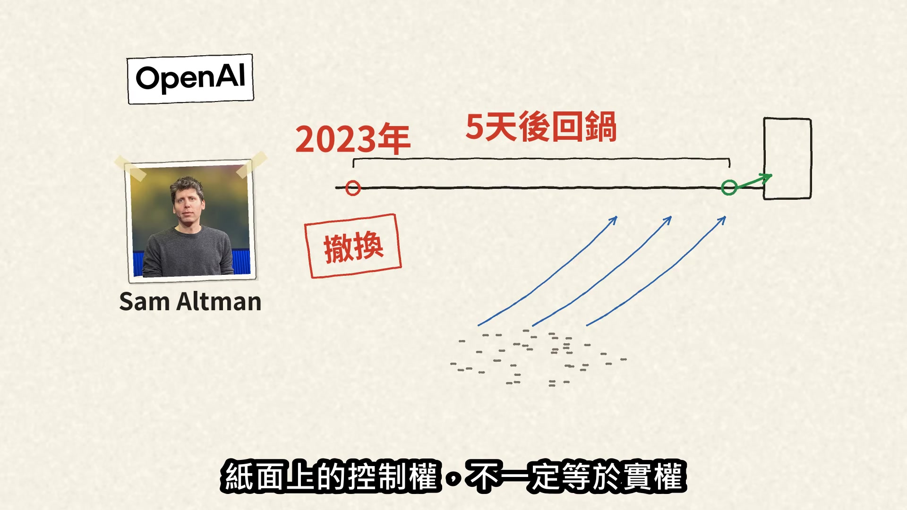

**逐字稿片段：** 回到 Anthropic，它連軍方都敢拒絕： Claude 不做國內大規模監控 也不給完全自主武器奪取生命 這2條就是不放寬 五角大廈因此把 Anthropic

**話題推測：** 轉折至討論Anthropic對軍方合作的立場。

---

## 00:03:56

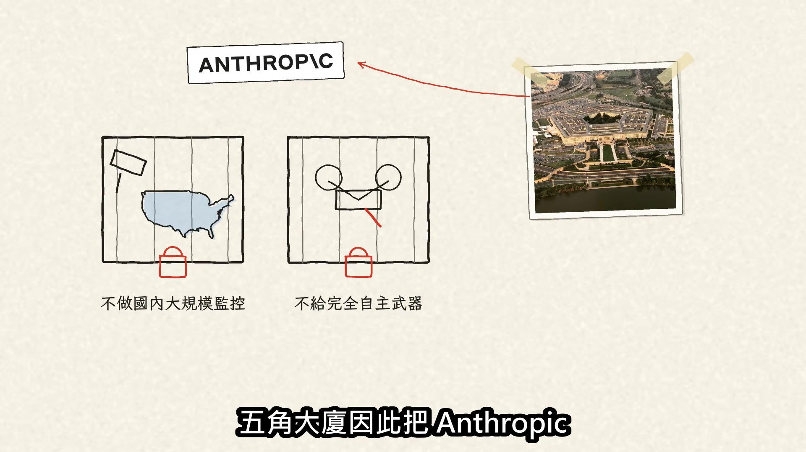

**逐字稿片段：** 列為供應鏈風險 說到底，末日風險、龐大資本、 創辦人控制權綁在一起 是必要的安全機制，還是一場豪賭？ IPO 還沒定價、還沒掛牌 答案交給公開市場

**話題推測：** 顯示五角大廈將Anthropic列為供應鏈風險。

---
