# ai-note-101_7XTRd1Fbkow — 關鍵畫面索引

- 來源逐字稿：[ai-note-101_7XTRd1Fbkow_GT.srt](ai-note-101_7XTRd1Fbkow_GT.srt)
- 影片：https://www.youtube.com/watch?v=7XTRd1Fbkow
- 截圖數：24

## 00:00:00

**逐字稿片段：** 這裡是 AI 101，全網最幽默的 AI 新聞

**話題推測：** 影片標題或開場動畫

---

## 00:00:04

**逐字稿片段：** 今年9月，有人把 Claude 當日記寫 結果寫進了警局 她是美國佛州的1名女子

**話題推測：** 開始討論佛州女子將Claude當日記的案例

---

## 00:00:11

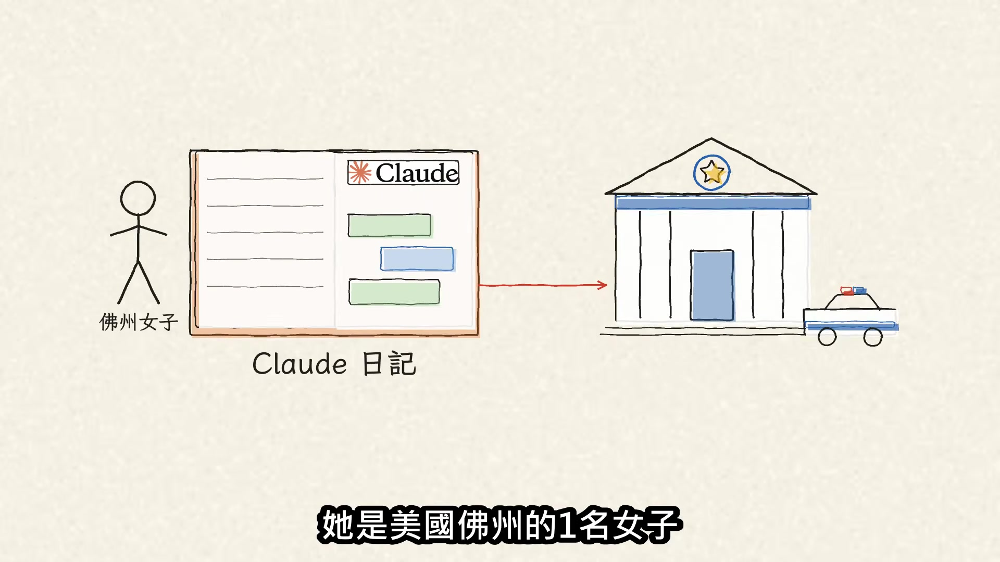

**逐字稿片段：** 從第一段文字到被捕，只有4天 但報警的，其實不是 Claude 先是自動系統攔下內容 再由 Anthropic 的員工讀過、判斷 最後由公司通報警方 報警的是 Anthropic 的人

**話題推測：** 新時間數字：從第一段文字到被捕只有4天，預期顯示時間軸

---

## 00:00:25

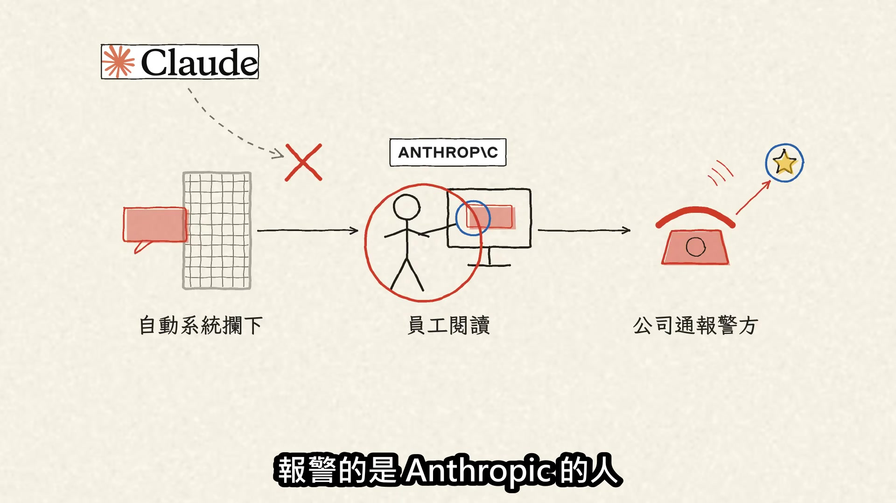

**逐字稿片段：** 那這4天發生什麼事？ 據逮捕報告，9月26日 這個帳號寫要發動大規模槍擊 隔天9月27日，又說拿到一把新槍 9月30日，她就在家裡被捕

**話題推測：** 轉換話題至這4天內發生了什麼事，預期顯示事件列表或時間軸細節

---

## 00:00:39

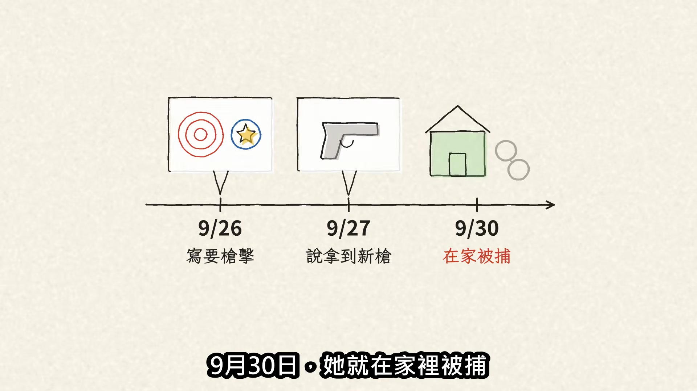

**逐字稿片段：** 被捕後她怎麼說？ 警長轉述，她說自己只是把 AI 當日記

**話題推測：** 轉換話題至被捕後女子的說法

---

## 00:00:44

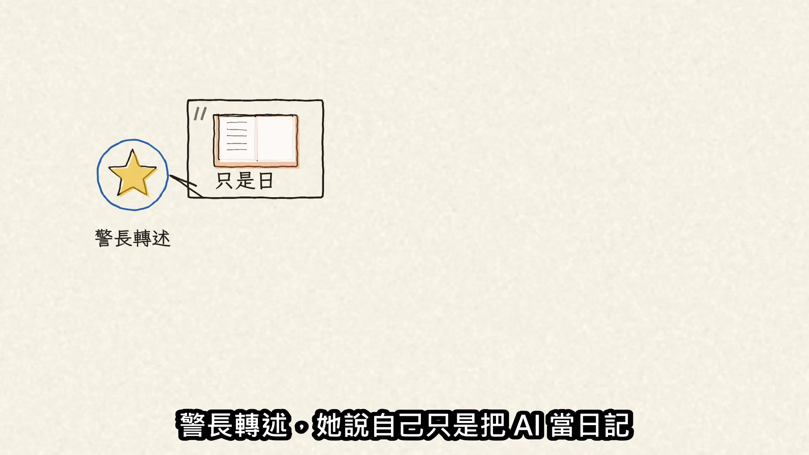

**逐字稿片段：** 但她被控威脅大規模槍擊，是2級重罪 一般最高可判15年 她為什麼會把 Claude 當日記 公開資料沒有交代 聊天時或許像關在房間裡自言自語 可是你打的字 其實都送到公司的伺服器 可能被機器分析、被真人讀到 警長就警告 用 AI 的人從來不是真正匿名

**話題推測：** 新法律概念與數字：被控2級重罪，預期顯示法律條文或文字說明

---

## 00:01:07

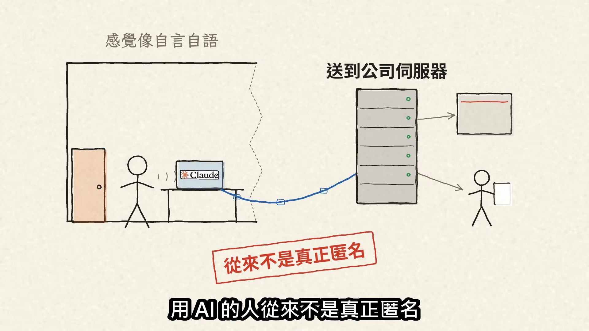

**逐字稿片段：** 也因為這樣，這件案子的法律問題包括： 把威脅寫進 AI 對話框 算不算「送出」去，讓別人有機會看見？ 她是否至少魯莽地忽視 這些字會被當成暴力威脅？

**話題推測：** 提出這件案子的法律問題，預期顯示問題列表

---

## 00:01:20

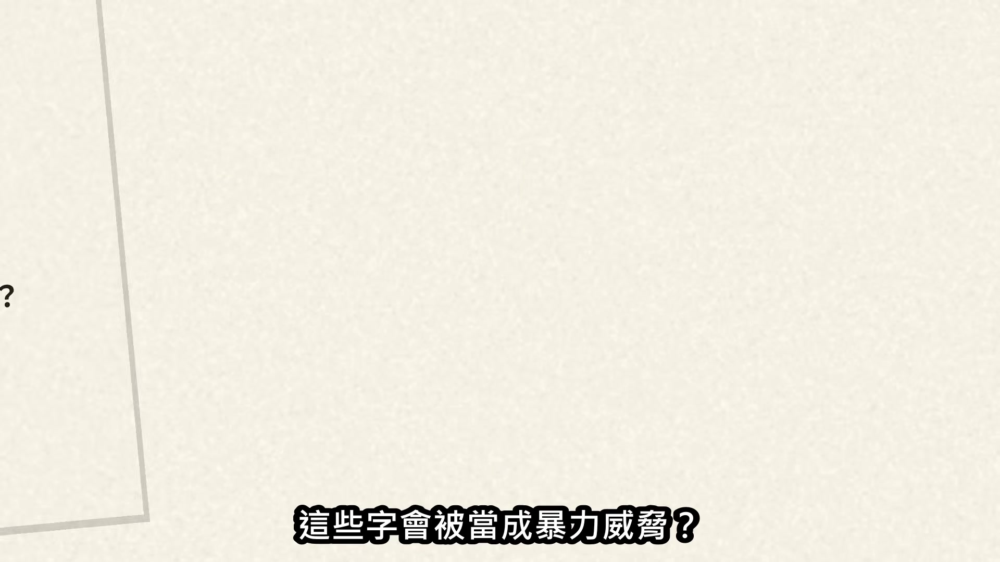

**逐字稿片段：** 可是，誰的字會被送去警局？

**話題推測：** 轉換話題至Anthropic的通報標準問題

---

## 00:01:22

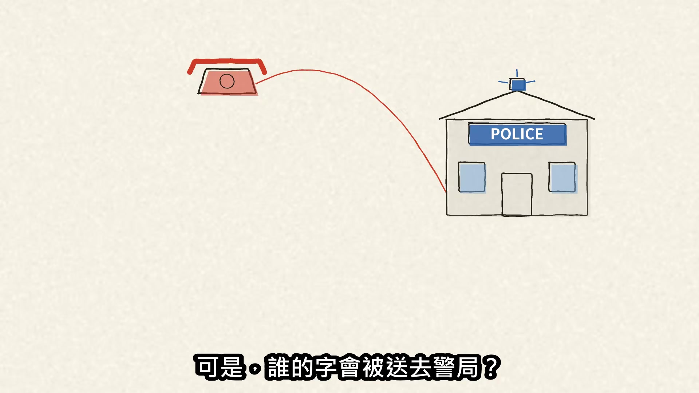

**逐字稿片段：** Anthropic 沒公開這件案子的風險分數、 具體通報門檻、審查員資格 也沒完整公開怎麼分辨發洩、幻想、 玩笑跟真的計畫 誰會被報警，具體標準仍未完整公開

**話題推測：** 列舉Anthropic未公開的具體標準，預期顯示列表

---

## 00:01:36

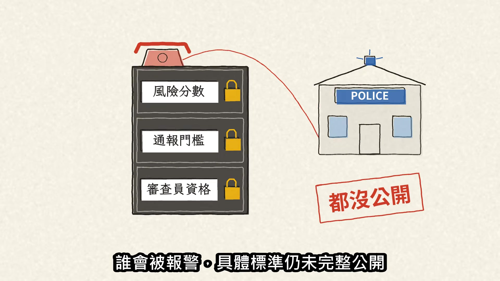

**逐字稿片段：** 而這股報警壓力的一個重要背景 來自加拿大

**話題推測：** 轉換話題至報警壓力背後的加拿大背景

---

## 00:01:40

**逐字稿片段：** OpenAI 曾標記過後來成為槍手的一個帳號並停用 但公司表示當時還不到「可信且迫近」，沒有報警

**話題推測：** 提及新公司OpenAI，預期顯示OpenAI的Logo或相關新聞

---

## 00:01:47

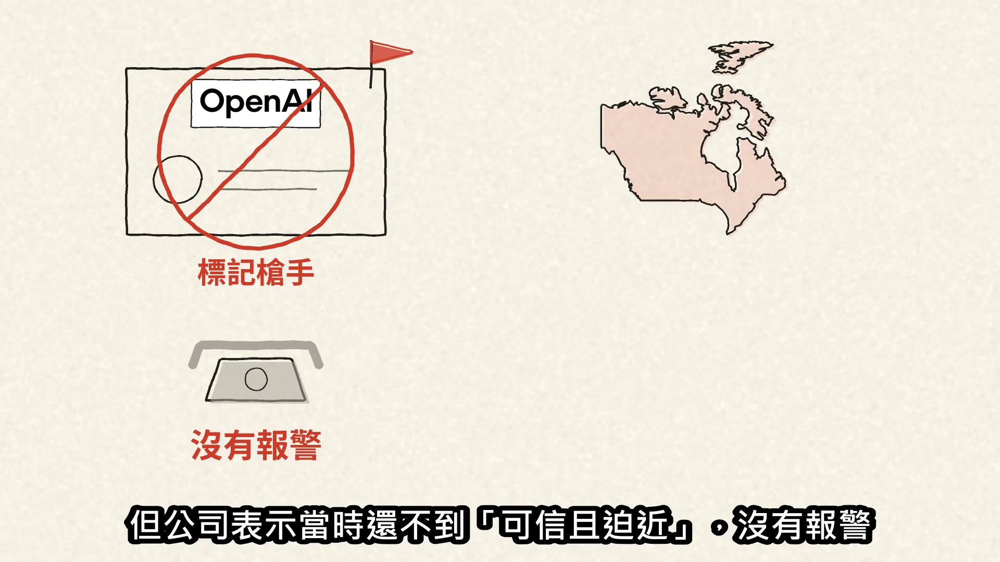

**逐字稿片段：** 今年2月 加拿大小鎮 Tumbler Ridge 發生槍擊 8名被害者死亡，槍手其後自殺 槍擊發生後 OpenAI 寫信給加拿大政府改口： 照強化後的規則重新判斷 現在會通報警方

**話題推測：** 新事件時間：今年2月加拿大槍擊案，預期顯示新聞畫面或事件背景

---

## 00:02:02

**逐字稿片段：** 這件事還引來37件私人訴訟 卑詩省政府之後又告了1件 官司一件件來，漏報的代價就變得很具體

**話題推測：** 新數字：引發37件私人訴訟，預期顯示訴訟統計圖表

---

## 00:02:11

**逐字稿片段：** 1年前 AI 公司面對的是看見危險卻沒報的風險 現在碰到模糊的內容 也多了一個先交給警方的誘因 從怕漏報，到可能更傾向先報

**話題推測：** 時間轉折：1年前的AI公司風險情況，預期顯示時間軸或對比圖

---

## 00:02:22

**逐字稿片段：** 所以佛州並非首例

**話題推測：** 引出佛州並非首例，預期顯示其他類似案例列表

---

## 00:02:25

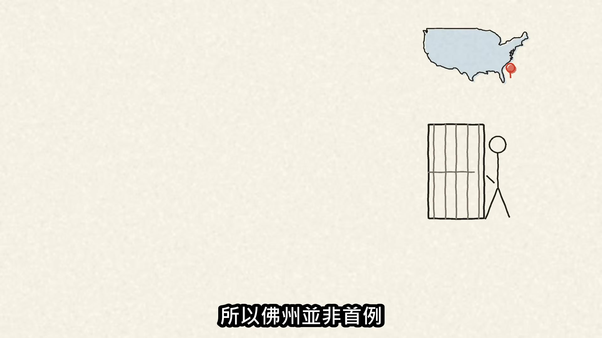

**逐字稿片段：** 8月，一名使用者寫說買了 AR-15 步槍 Anthropic 通報舊金山警方截至報導時 他未被逮捕或起訴

**話題推測：** 新案例時間與情境：8月有使用者寫買AR-15，預期顯示案例細節

---

## 00:02:33

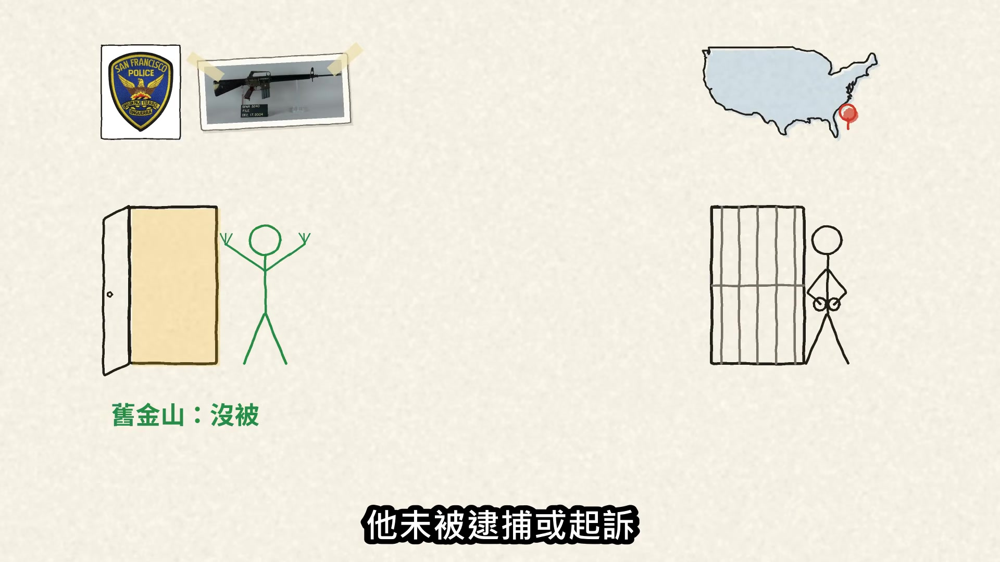

**逐字稿片段：** 同月 聖安東尼奧一名男子被指威脅攻擊小學，被捕

**話題推測：** 新案例時間與情境：同月聖安東尼奧男子威脅攻擊小學，預期顯示案例細節

---

## 00:02:38

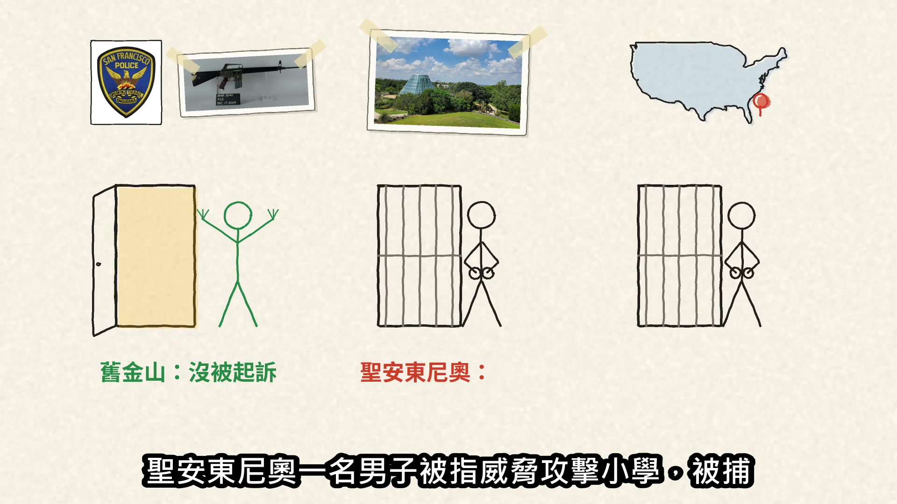

**逐字稿片段：** 加上佛州，至少3宗：2人被捕 1人截至報導時未被逮捕或起訴 可是風控網子本身會撈錯 今年上半年

**話題推測：** 新數字：至少3宗案例，2人被捕，預期顯示案例總結或統計圖

---

## 00:02:48

**逐字稿片段：** Anthropic 封鎖了1,140萬個帳號

**話題推測：** 新數字：Anthropic上半年封鎖1,140萬個帳號，預期顯示統計圖表

---

## 00:02:52

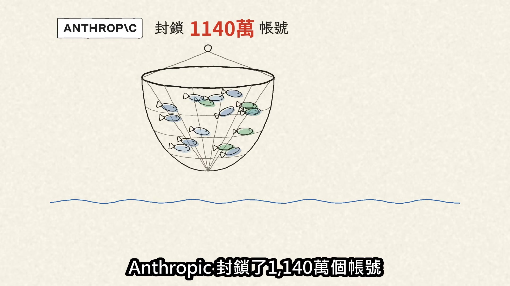

**逐字稿片段：** 398,000件申訴中，有42,000件翻案 約占申訴的10.6% 但這是封號申訴，不是報警誤報率 報警報了幾次、多少最後沒發現犯罪，都沒公布 更麻煩的是，刪掉也不一定就沒了 一般 Claude 對話刪掉後

**話題推測：** 新數字：398,000件申訴中42,000件翻案，預期顯示申訴與翻案比例圖

---

## 00:03:09

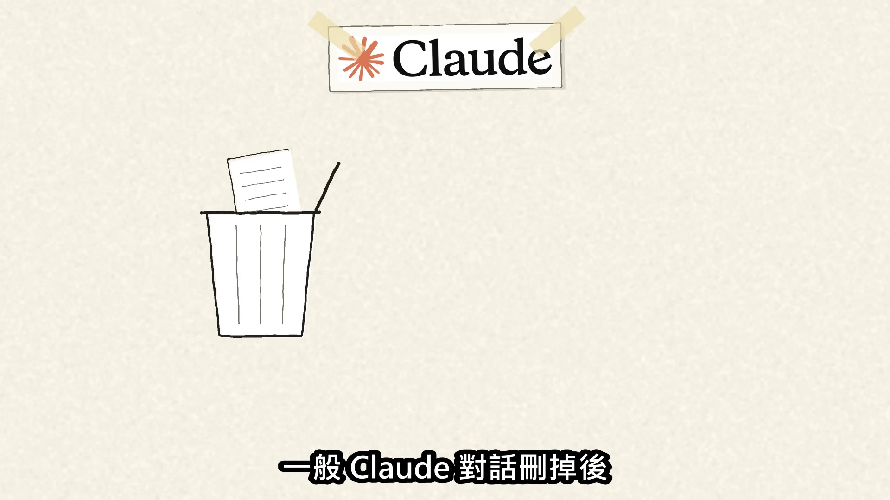

**逐字稿片段：** 原則上30天內從後端清除

**話題推測：** 新數字：資料原則上30天內清除，預期顯示資料留存政策圖示

---

## 00:03:12

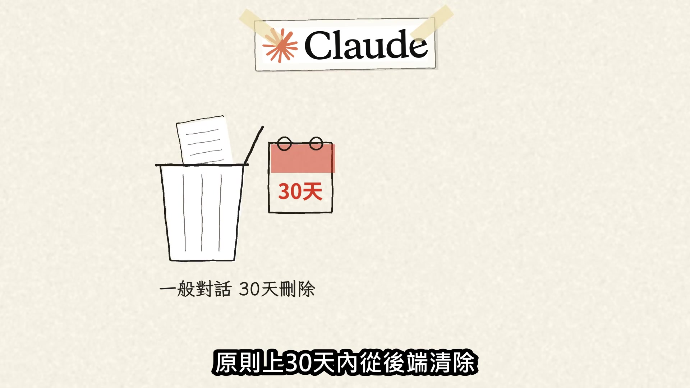

**逐字稿片段：** 但被安全系統標記的，最長會留2年

**話題推測：** 新數字：安全系統標記的最長留2年，預期顯示特殊留存政策

---

## 00:03:16

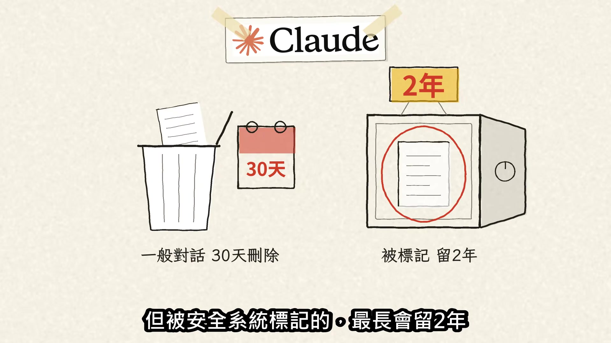

**逐字稿片段：** 回到佛州這件事 真正改變的是誰當第一道關卡： 法官看到之前 具體標準未完整公開的公司流程就先決定 哪些內容要留存 以及哪些情況要通報警方

**話題推測：** 回顧佛州案例，總結主要改變

---

## 00:03:29

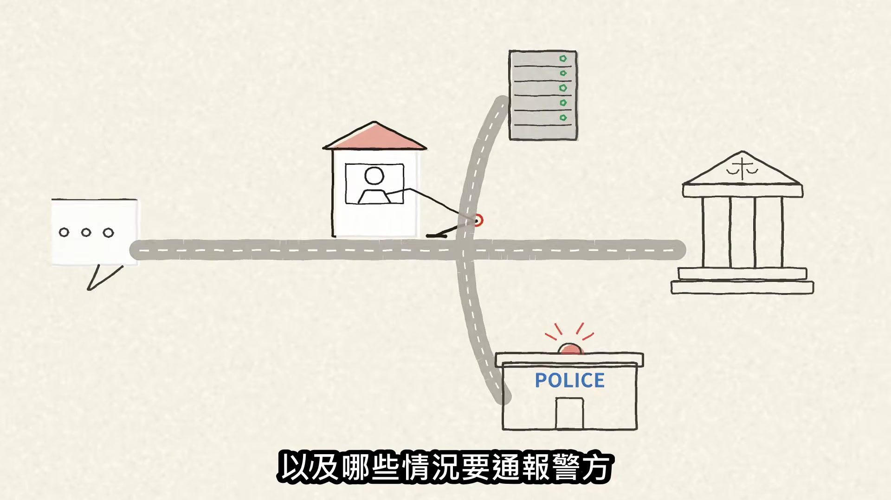

**逐字稿片段：** 下一個該公開的，是1年報警幾次、 多少案件結案，人又有沒有覆核機會

**話題推測：** 提出未來需要公開的資訊，預期顯示呼籲或列表

---
