# ai-note-101_8WGcge_2WoI — 關鍵畫面索引

- 來源逐字稿：[ai-note-101_8WGcge_2WoI_GT.srt](ai-note-101_8WGcge_2WoI_GT.srt)
- 影片：https://www.youtube.com/watch?v=8WGcge_2WoI
- 截圖數：14

## 00:00:00

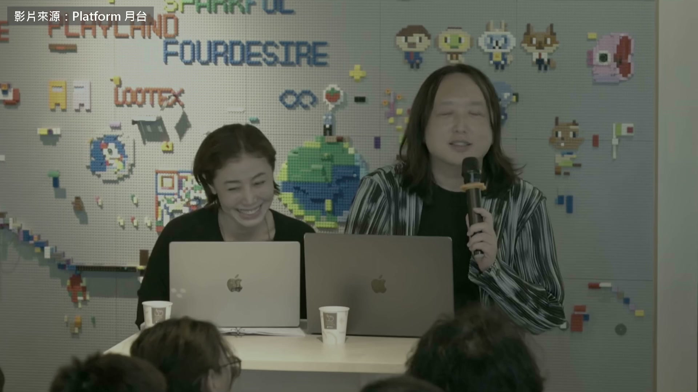

**逐字稿片段：** 2015 年 Uber 司機跟計程車司機在台灣吵翻天 有個人只用 3 個星期 就讓兩邊在網路上吵出共識 這件事國際上做 AI 治理的人幾乎都聽過 她叫唐鳳 2016 年進內閣當數位政委 後來是台灣第一任數位發展部部長 現在是無任所大使 兩年跑了 28 個民主國家 人在牛津哲學系 這是今年 8 月 29 日活動空間「月台」辦的一場對談 旁邊坐的是跟她一起做「反向對齊」計畫的丹增央措 整場兩個多小時 這一集只挑她自己怎麼跟 AI 相處的幾段 先講一件所有軟體都做得到的事 每一版都有編號跟雜湊值 你下載的跟我下載的 一比對就知道是不是同一包 但是現在 AI 的狀況不是這樣子嘛 我不特別點名哪一家公司

**話題推測：** 開啟年度背景：2015年。

---

## 00:00:46

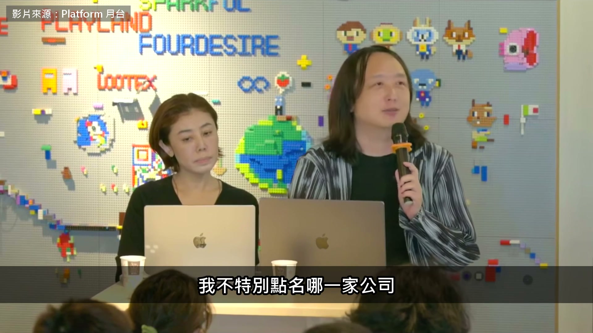

**逐字稿片段：** 但是某個 model 4.5 它今天叫 4.5 明天也叫 4.5 但事實上是降智的版本 事實上你不知道啊 或是說它說「欸，我們修好了這個問題」 這個 model 4.0 會讓一些可能有思覺失調狀況的朋友們 陷入更深的思覺失調 我們修好了 但是這個所謂的修好 對另外一些人來說 本來很懂我、 很有同理心的那個 model 4.0 在升級成 model 5 之後 突然之間好像就是人皮面具 已經完全沒有同理心了，等等 對一些人是修好 對一些人是修壞 同樣的版本號 看起來只是修正瑕疵 事實上是造成更大的問題 這個就是在我們還在古法打造軟體的時候 已經知道怎麼解決的事情 結果現在變成 AI 模型 反而這些問題沒有辦法解決 後來丹增問到高風險的工作 文件上寫著最後是某某真人拍板 但人很容易被 AI 又快又順的建議推著走 怎麼確定最後那一步真的是人自己想過的 她說治理上這叫 human in the loop 最後總要有人蓋章 那現在問題是說 AI 的說服力太強了 所以這個經過一段時間 它就可以向上管理 知道該蓋章的那個人喜歡看什麼 然後就算它的判斷是錯的 它也可以用向上管理的方式 去說服那個蓋章的人 去忽略很多可能造成的問題 但是因為它寫出來的真的是洋洋灑灑 所以你就自動蓋章 然後你如果被它向上管理到一個程度 那甚至會出現剛剛講到的 就是叫做 spiraling down 就是好像陷入這個兩人世界 一人一智慧體世界的這個狀況 就是可能決策者 他就不再聽他別的共同決策者 或他的 junior 給他的回應了 為什麼呢？ 因為他跟 AI 之間的這個對話過於私密 以至於說他不會分享他跟 AI 中間那一個整個討論 去給他的團隊知道 它不是一個團隊分享的工藝品 但是呢，如果團隊的判斷 跟這個 AI 的判斷產生落差的時候 又因為這個 AI 太會向上管理 所以他就開始偏向 AI 這個部分 那到這個程度上 它就不能叫做 human in the loop 了 它是好像 就是一個倉鼠在倉鼠滾輪裡面的這個狀況 它是感覺這個一直跑 而且感覺很有產出 但事實上它已經完全失去掌控那個方向的能力 就是倉鼠在倉鼠輪裡面 是沒有辦法 steer 就是沒有辦法去導航的 那所以在這個情況之下 我們要怎麼避免這件事情 就是要人工地去給出摩擦力 那像我自己去用 這種對話式 AI 工具的時候 已經很長一段時間 我都不准它用「我」這個字 就是不能用第一人稱 而是說我的每一輪 它都給我 one pager 就是一個一頁的一個互動式的 HTML 然後儘可能是 把它想到的各種不同角色 不同利害關係人 哪些衝突的部分 哪些共同的部分 在這個 one pager 裡面給我 所以我每次討論的時候 它絕對不會說 這個你講得真是太棒了 或者是說這真是一個承重的想法 什麼之類之類 load-bearing，就是有承重量的想法等等 那而是說它就會一直給我一些 one pager 一些 brochure 那我拿到之後 我每一個都一定可以跟我的團隊分享 那而且因為我告訴它說 如果它要加入自己的判斷的話 這是我跟李開復學的 它一定要用這個網路上面 最酸的酸民的那種口吻 來指出我的錯誤 因為我喜歡擁抱酸民嘛 這個大家知道的 所以在這個情況下 我等於是自己做了 一個無限大摩擦力的方法 所以我不太可能去陷入 跟 AI 的兩人世界裡面 對，它有在那個 像是那個唐門煉蠱一樣 就是有一個內容 其實有三十個模型會互相地酸這樣子 後半場有人問兩位每天怎麼用 AI 她說她現在返璞歸真

**話題推測：** 引入具體AI模型版本（虛指）：model 4.5。

---

## 00:04:37

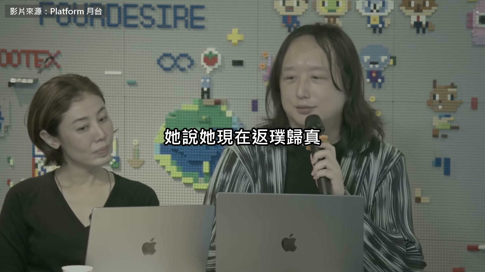

**逐字稿片段：** 只用一個叫 Oh My Pi 的工具 什麼模型都能接，再冷門的都行 而且它只要撞牆 撞失敗一次，它就會寫一個

**話題推測：** 介紹唐鳳使用的具體AI工具：Oh My Pi。

---

## 00:04:46

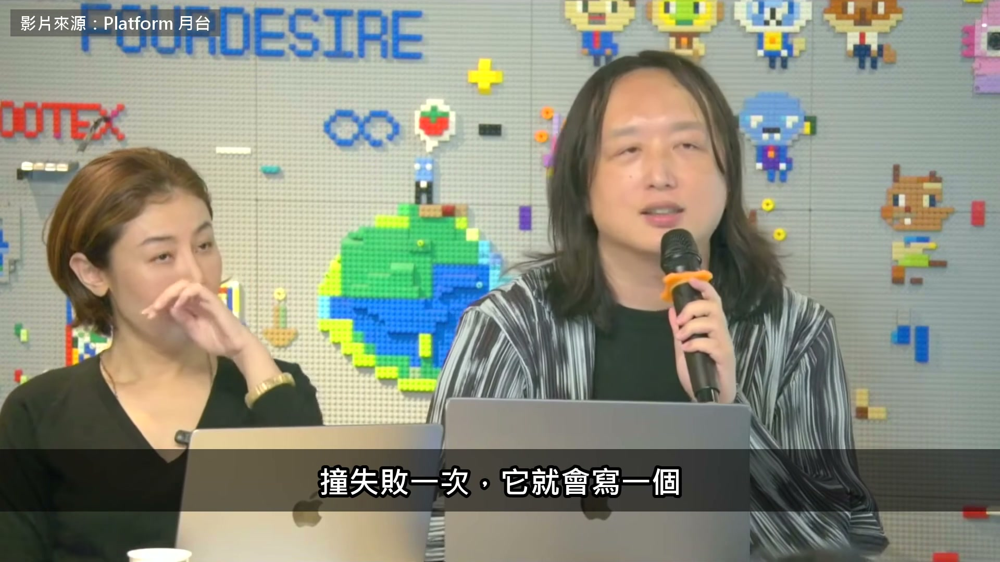

**逐字稿片段：** 叫 managed-skills 記下來怎麼撞失敗的 然後下次就一定不會失敗 所以是保證不貳過 那所以在 OMP 裡面 它有一個模式叫做「/vibe」 就是你請一個很有能力的大模型 可是你不准它做任何事情 它寫入檔案也不行 什麼都不能做 它唯一能夠做的事情，是叫它的小助手去做 那它的小助手就是我剛剛講到 這種跑得比較慢的 但是算力消耗可以說是零的這種模型 那所以我一台這種機器 就可以跑相當多的小模型 所以我去睡覺，然後八個小時 出來之後，它就一定有跑完 而且中間這些小模型撞牆的部分 都有學到，那這個情況下 我給它長程任務 我如果一直去打斷它 就好像你那個蒸籠蒸個包子 你一直打開，反而它會做不好 你就是要它那個，丹增剛剛說的，煉蠱喔 煉滿八個小時 它才能夠有比較好的結果 下次不會再犯同樣的錯誤 所以我的電腦是絕對不會帶到 我睡覺的臥房 我帶去的就只有一個 灰色的電子紙，就是 reMarkable Paper Pro Move 然後我唯一看到它進度的方法 就是用這個電子紙，而且它 沒有瀏覽器，也不能上網 除了在 Google Drive 做同步之外 不能做別的事情 然後就會像那個 《哈利波特》裡面那本日記一樣 我就會稍微批改一下 說它現在做到怎麼樣 但因為電子紙是有點灰灰的 所以我這樣批改一下 我就去睡了 我也不可能跟它糾纏 因為它要花滿久時間 才能消化我的這個批示 然後我醒來之後 它就消化完了 那個日記本就浮現字樣 所以大概是透過這樣的 方式，盡可能地增加摩擦力 來去跟 AI 溝通 Slido 上有人問

**話題推測：** 介紹Oh My Pi的特定功能名稱：managed-skills。

---

## 00:06:25

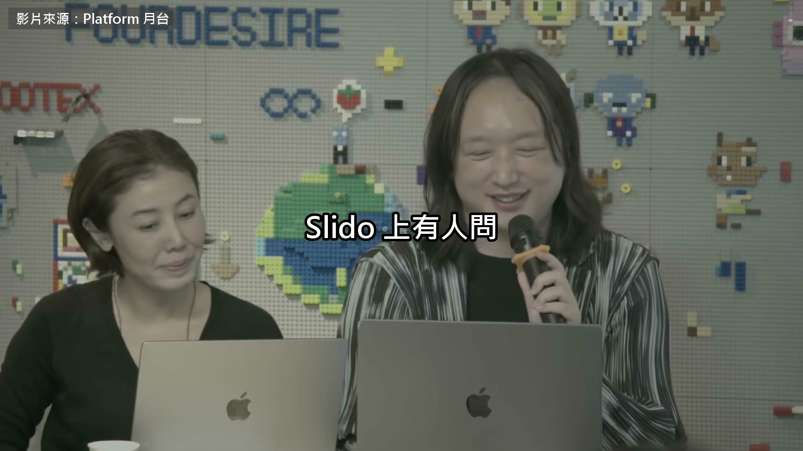

**逐字稿片段：** 怎麼看馬斯克對 2036 年的預言 極度通縮，越來越多人不用工作 她說她在商業周刊的專欄專門寫過怎麼反抗這種預言 她牛津哲學系的同事剛出了一本書就叫《預言》 說今天的科技專家 就像以前宮廷裡的占星師 那她就講了一個很有趣的一個故事 就是說好像一個查理什麼國王 他有一個占星師 那個占星師就預言說 有某一位宮廷的妃子、夫人 幾天之後一定會遭遇不測 結果果然他遭遇不測 所以這個時候國王就 覺得受到威脅，他就告訴他的 臣子說要把這個占星師找來 而且他只要使一個動作 就要把那個占星師從窗戶丟下去 因為他要嘛就是說 他真的能夠看到未來 那這樣的話對王國會有相當大的威脅 要嘛就是那個占星師 派人去下毒 這樣他對王國也有威脅 所以兩種不管什麼情況 這個占星師都很難留他的命 所以那個占星師就到了這個國王面前 然後國王就問占星師說 「尊敬的占星師 你要不要占卜一下 你自己的死期是哪一天？ 你哪一天會死？」然後他就說 「當然就是在陛下死掉之前的一個禮拜」 然後，所以呢 這個國王就完全不知道該怎麼辦 所以那個占星師就得到了善終 所以我的意思就是說 這樣子的過程 他當然不是看著星星取得的這個能力 而是他能夠去讀他在場的那一件狀況 然後去把這個預言去當作 有點像是保命符 就是說這個預言並不是真的說 我客觀上面會發生什麼事情 而是說你最好照著我這樣做 不然你也會遭遇不測 你過一個禮拜就沒了 讀空氣的能力 確實讀空氣的能力 所以我的意思就是說 台灣如果是聽其他專家的

**話題推測：** 引入新人物與預言：馬斯克對2036年的預言。

---

## 00:08:26

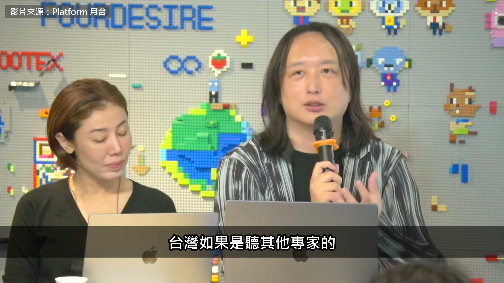

**逐字稿片段：** 預言的話，我們 80 年代 大家都說不可能去發展 這個精密高科技工業

**話題推測：** 將話題轉移到台灣的歷史例子：80年代台灣發展精密高科技工業。

---

## 00:08:32

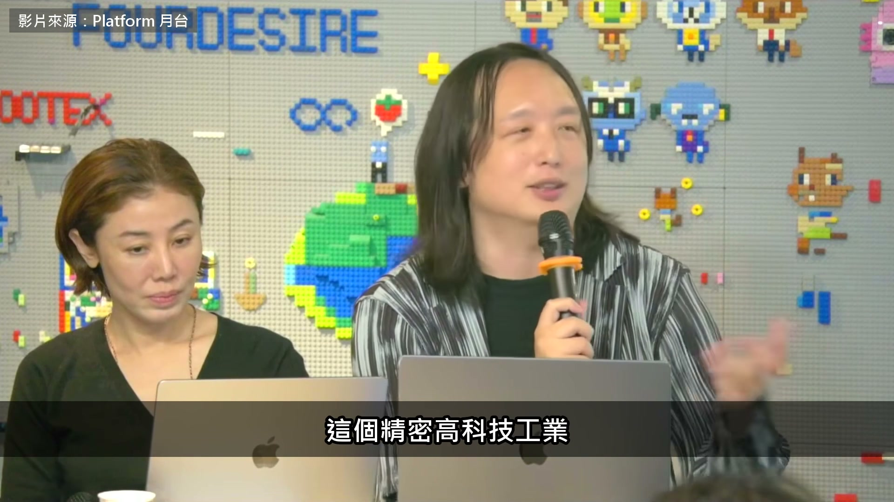

**逐字稿片段：** 那現在有台積電 如果你要聽傳染病學家的 預言的話，我們在 2020 年 前兩個月就應該完全進入社區傳播階段 我們也沒有嘛 當你聽到這樣子的預言的時候 其實可能要想的是說 他是不是想要把它變成 一個自我實現的預言？ 然後去說，你告訴老闆說 AI 會取代到你八成的員工 所以老闆真的誤信人言就全部改成 Grok 然後全部都裁員，或全部改成

**話題推測：** 提出具體公司作為反例：台積電。

---

## 00:09:02

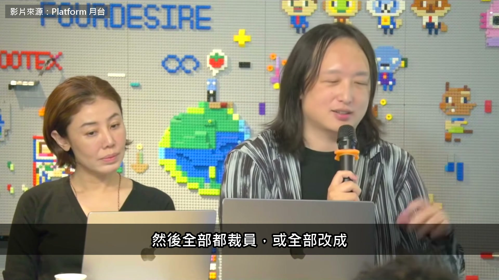

**逐字稿片段：** Tesla 的機器人 Optimus 這個看起來預言很準 但事實上是占星術發揮的作用

**話題推測：** 提出具體公司和產品：Tesla的機器人Optimus。

---

## 00:09:08

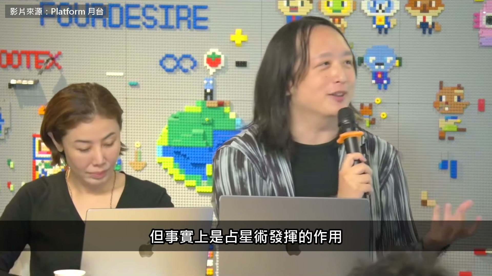

**逐字稿片段：** 接近尾聲，主持人問兩位 此時此刻的人生座右銘是什麼 我的話一直都是說 good enough ancestor 就是「足夠好的祖先」 因為我從小因為心臟病 所以這個每天晚上睡覺的時候 都感覺像丟硬幣，不確定明天 醒不醒得來 所以我只要那個 context window 只有一天 所以我在那一天裡面我就要想說 我是不是讓後代能夠用的材料 比我在剛醒來的時候多一點 那反正我也看不到他這個做什麼事情 所以就盡量地分享出去 所以就每天都在那個 「人之將死，其言也善」的那個狀態 所以就是 good enough ancestor 大概是我的 life motto 從很小就是這樣 從不信版本號 到不准 AI 說「我」 她做的都是同一件事，替自己加摩擦力 把最後蓋章的位置留給人 至於為什麼每天都要這樣過，她說了 她的上下文只有一天

**話題推測：** 話題轉折到影片尾聲與人生座右銘。

---

## 00:10:04

**逐字稿片段：** 原影片兩個多小時

**話題推測：** 影片結尾，預告原影片中未收錄的內容。

---

## 00:10:06

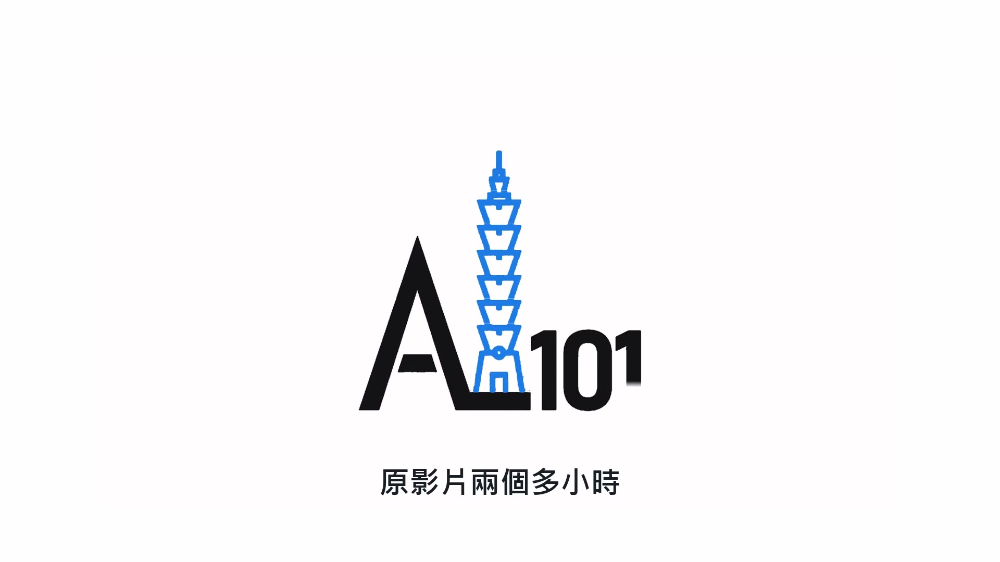

**逐字稿片段：** 她還講了台灣的 AI 評測中心當年怎麼跟大公司談

**話題推測：** 預告新話題：台灣AI評測中心與大公司的談判。

---

## 00:10:09

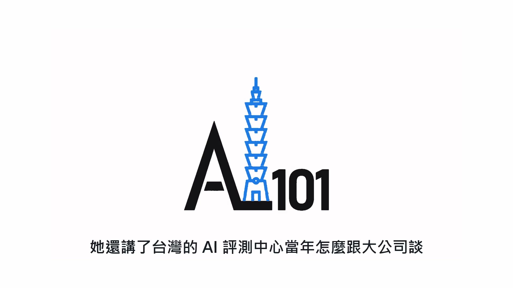

**逐字稿片段：** 還有廣告實名制那句「Google 做得到 Meta 為什麼做不到」

**話題推測：** 預告新話題與公司：廣告實名制、「Google做得到」。

---

## 00:10:13

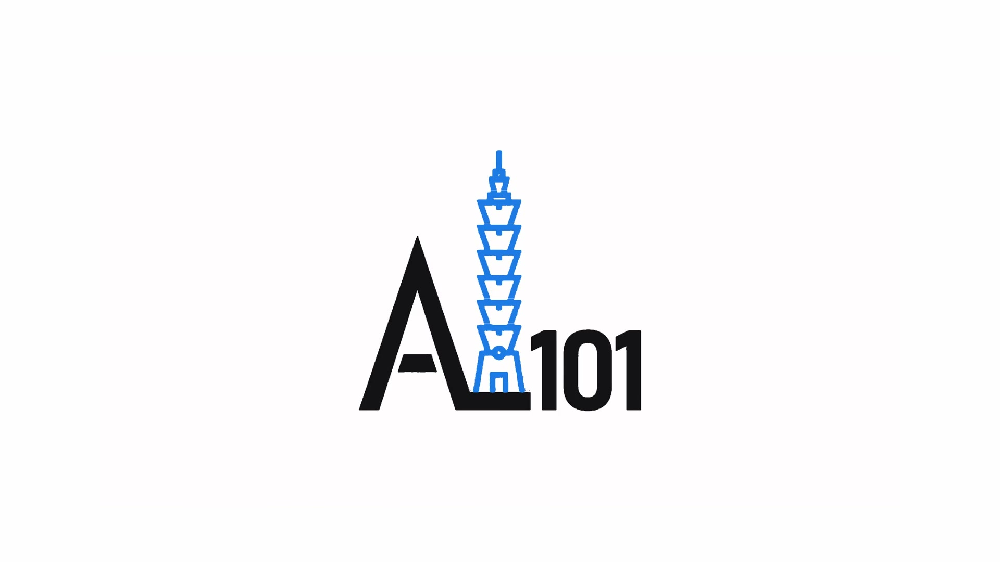

**逐字稿片段：** 另外有人問 AI 有沒有心靈 她說這像問潛水艇會不會游泳

**話題推測：** 預告新話題：AI有沒有心靈的哲學問題。

---

## 00:10:16

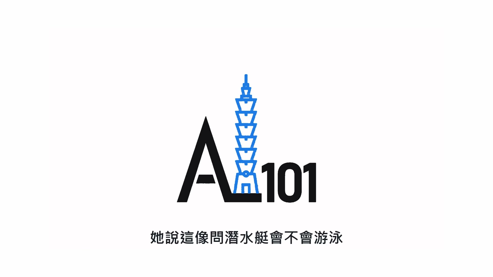

**逐字稿片段：** 而 Anthropic 的憲章 已經是一封寫給 AI 的情書 原影片連結在說明欄，有興趣可以去聽更多。

**話題推測：** 預告新公司：Anthropic的憲章。

---
