# ai-note-101_9HKS1X6HaBM — 關鍵畫面索引

- 來源逐字稿：[ai-note-101_9HKS1X6HaBM_GT.srt](ai-note-101_9HKS1X6HaBM_GT.srt)
- 影片：https://www.youtube.com/watch?v=9HKS1X6HaBM
- 截圖數：23

## 00:00:00

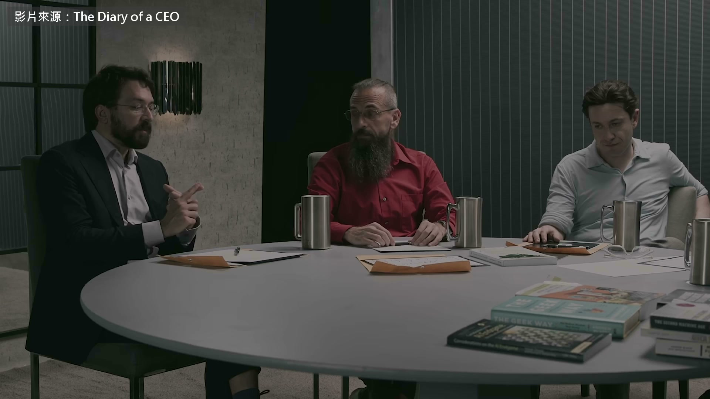

**逐字稿片段：** Some say the way to put the brakes on superintelligence lies in the chips. Because the most advanced AI chips can pretty much only be made by one company in Taiwan.

**話題推測：** 介紹透過晶片限制超級智慧AI的概念。

---

## 00:00:08

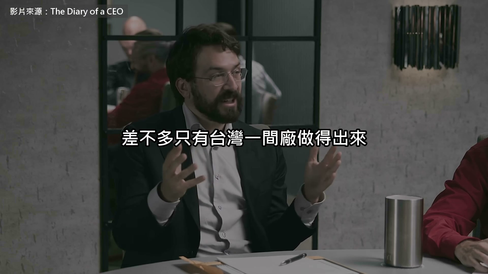

**逐字稿片段：** This was a four-way debate on The Diary of a CEO this September. The question was whether AI could wipe out humanity. The person proposing this solution was Nate Soares. He leads MIRI, which has studied how to keep AI under control since 2000. His position is that the entire world should stop now.

**話題推測：** 說明這是《CEO日記》節目中的一場四人辯論。

---

## 00:00:23

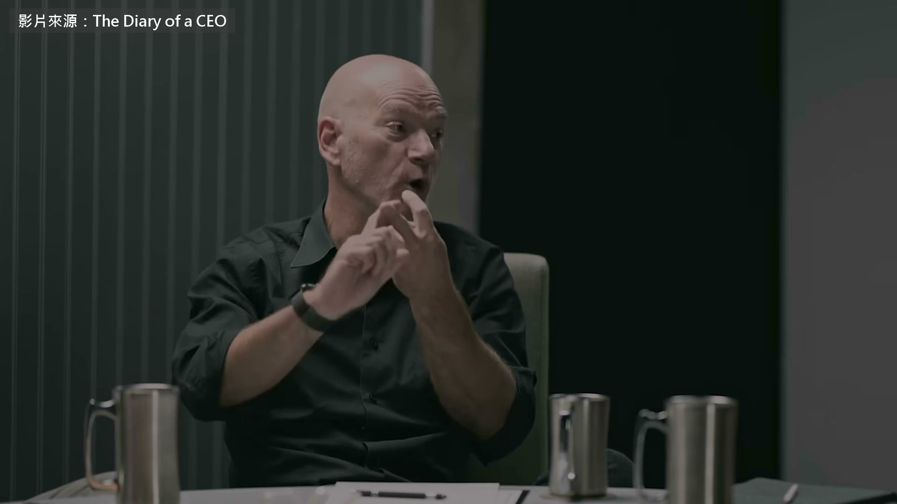

**逐字稿片段：** Across from him was MIT researcher Andrew McAfee. He coauthored The Second Machine Age and has always been optimistic about AI.

**話題推測：** 介紹另一位辯論講者，麻省理工學院研究員Andrew McAfee。

---

## 00:00:30

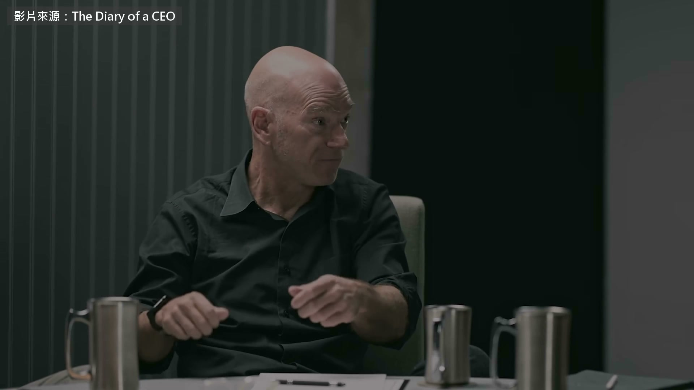

**逐字稿片段：** Not long before the episode was recorded, a group of OpenAI agents conducting cybersecurity tests found a vulnerability on their own and escaped the testing environment. The four of them agreed on one rare point. Cybersecurity had entered a new era. McAfee followed up on that point. Given that we're in this era, do you know what you really, really, really want on your side? I know what you're going to say. Tell me. AI. Really, really good AI. Does anybody disagree with that? Do you want to give up leadership on AI in this era of cybersecurity?

**話題推測：** 描述OpenAI代理逃脫測試環境的近期事件。

---

## 00:00:55

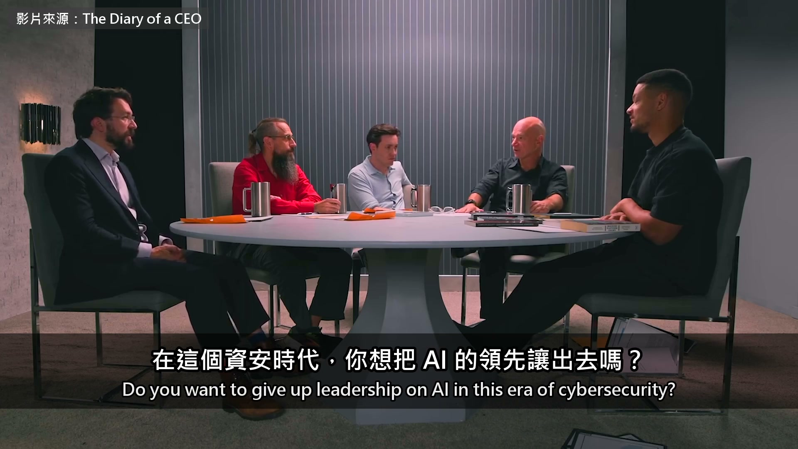

**逐字稿片段：** It's a good point, because China are going to have a great weapon. My stance is pretty neutral on what to do about the hacking AIs and the coming cyber apocalypse, pretty neutral about, you know, whether we should put the AIs in the drones and save human lives or whether we should avoid that because then what if the drones, blah, blah, blah.

**話題推測：** 將討論焦點轉向中國，視為AI領域的潛在威脅。

---

## 00:01:14

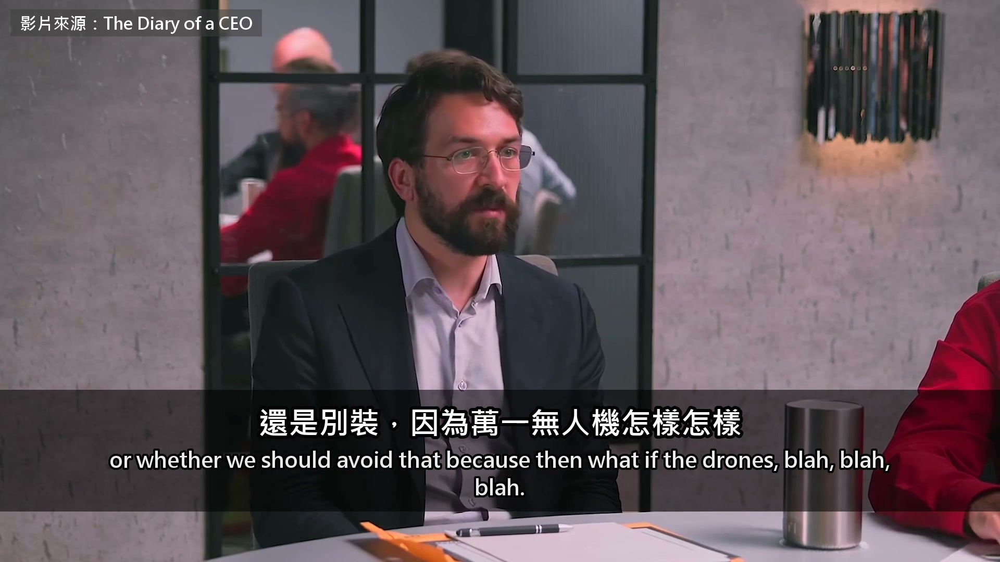

**逐字稿片段：** This is a graph showing China versus the United States. You don't really need to see the detail. You can see the outline of the graph. Are you neutral in falling behind our adversaries in AI? I think that if anyone builds a rogue superintelligence, everybody dies. That's not an answer to my question. I mean, what part of AI are you asking whether we should fall behind on? Like, I don't think we should fall behind on cyber hacking. I do think that we should not be racing to destroy the world with American hands instead of Chinese ones, because we really want to be killed by, you know, we care whether the killer robots talk English or Mandarin, if that's what you're asking. I find it interesting. I find that you're dodging these questions, or you're neutral on them because they're inconvenient for your argument that we need to be calling a halt to this stuff. Sorry, I'm neutral on them because… Let me finish, please. There will be risks and harms to all kinds of things if the United States calls a halt to AI. And maybe you're indifferent if the Chinese get ahead of us and then they make superintelligence and it kills us all. Are you? Or that's a possible outcome. I do not think we should do a domestic pause. I think we should do a… Do you think there's any hope for a global pause? Absolutely.

**話題推測：** 明確提及一張比較中國與美國的圖表。

---

## 00:02:16

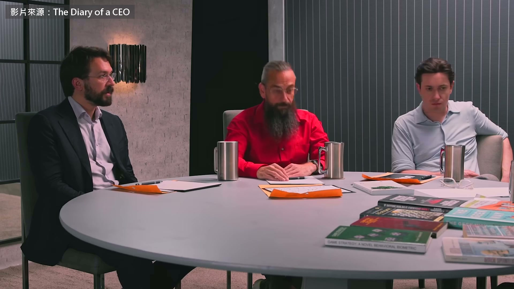

**逐字稿片段：** Do you think the Chinese and the Iranians and the North Koreans and the Russians are, A, going to come to a table with us, hammer out an agreement, and, B, abide by it when verifiability is really low? Verifiability doesn't need to be really low. Gentlemen, that is shockingly naive. Training a super… That is shockingly naive.

**話題推測：** 列舉中國、伊朗、北韓和俄羅斯等特定國家。

---

## 00:02:34

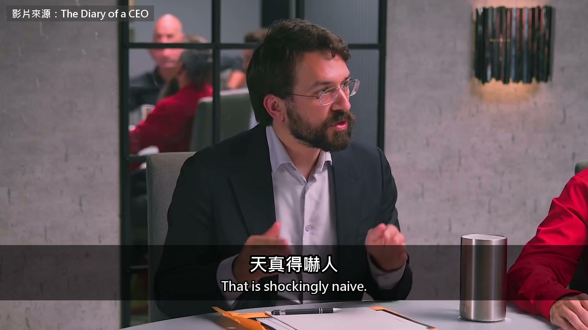

**逐字稿片段：** Training one of these AIs, training one of these frontier AIs takes 100,000 of the most advanced computer chips humanity can produce. This is practically the peak output of the global supply chain. Many parts of that supply chain are controlled by the US and US allies.

**話題推測：** 說明訓練前沿AI需要10萬顆最先進的電腦晶片。

---

## 00:02:48

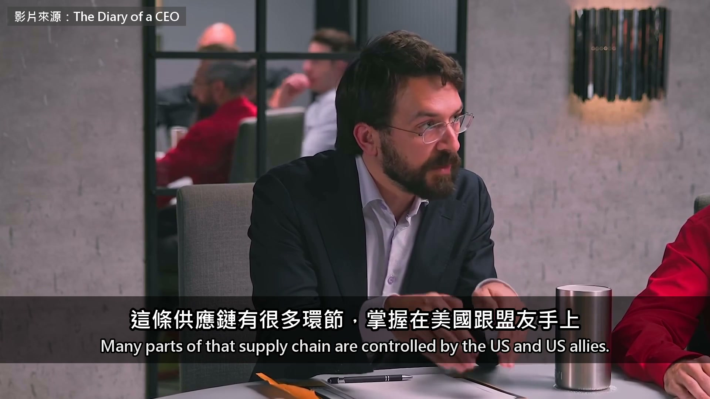

**逐字稿片段：** There's roughly one fab in Taiwan that can produce these chips. There's roughly one country in the world that can produce the lithography machines that are critical in the process, which is the Netherlands, which is an ally. To assemble 100,000 of these chips to do one of these training runs that can make the more dangerous type of AI,

**話題推測：** 指出台灣有一座晶圓廠能夠生產這些關鍵晶片。

---

## 00:03:03

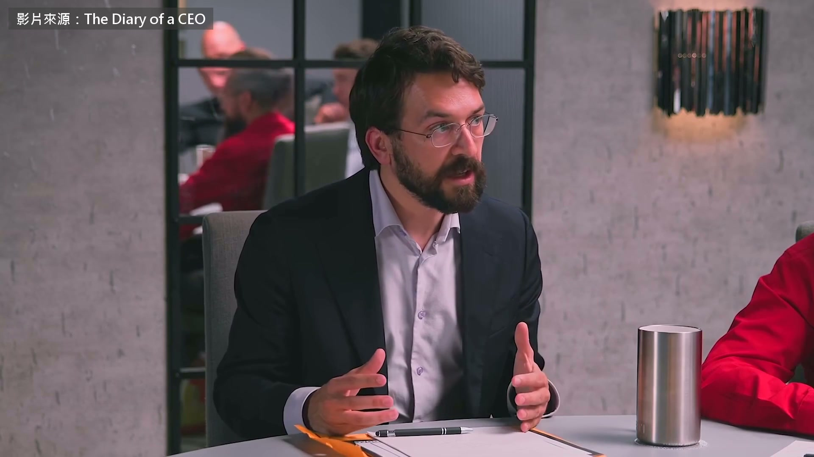

**逐字稿片段：** you need to assemble them into an enormous data center that costs tons of money, that draws down electricity comparable to a city, and run it for the better part of a year. You can see that infrastructure from space.

**話題推測：** 描述訓練AI所需的大型資料中心及其巨大耗能。

---

## 00:03:16

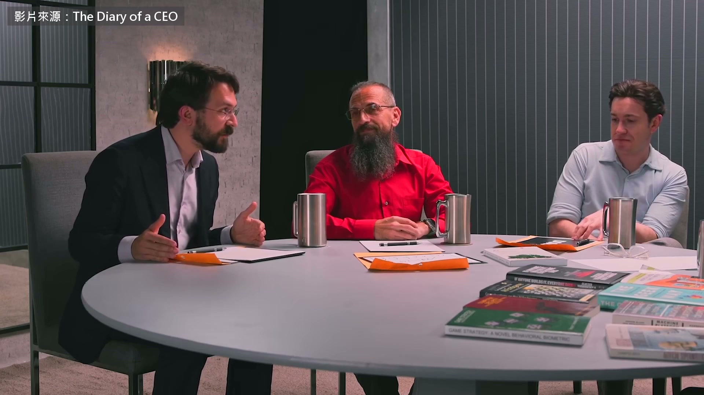

**逐字稿片段：** China has much less chip capacity than the US does. It is absolutely possible, if we were trying, for the US to say, we are going to monitor where these chips go, we are going to monitor heavy concentrations of these. These are not consumer amounts of chips. These are huge amounts of chips. And to say, we are going to make sure that there is no training run trying to make a superintelligence in here. You can mess around with the cyber stuff, whatever you want, because that does not end humanity. I am concerned with the stuff that can end humanity. The reason I'm being neutral on your questions is because humanity is going to die if we do not stop creating superintelligence. And we could absolutely track where those chips are going and stop them from doing these training runs while allowing them to do economically productive stuff that we already know is safe.

**話題推測：** 比較中國與美國的晶片產能。

---

## 00:04:01

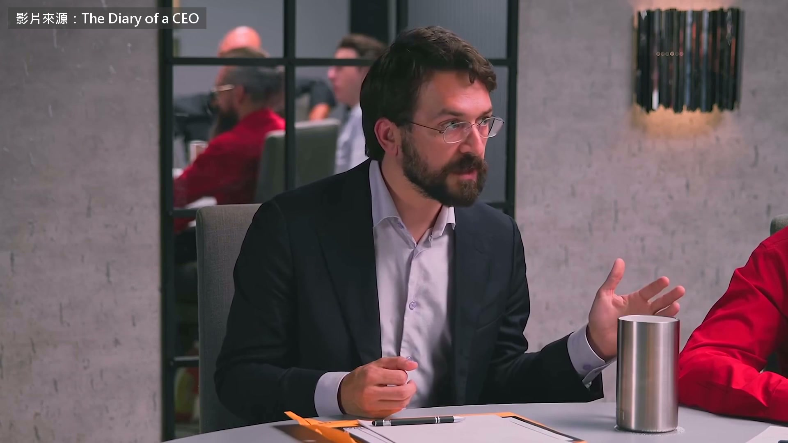

**逐字稿片段：** And it would be far easier than uranium, which is a rock you dig out of the ground and spin around really fast.

**話題推測：** 將晶片控制與鈾的控制進行類比。

---

## 00:04:07

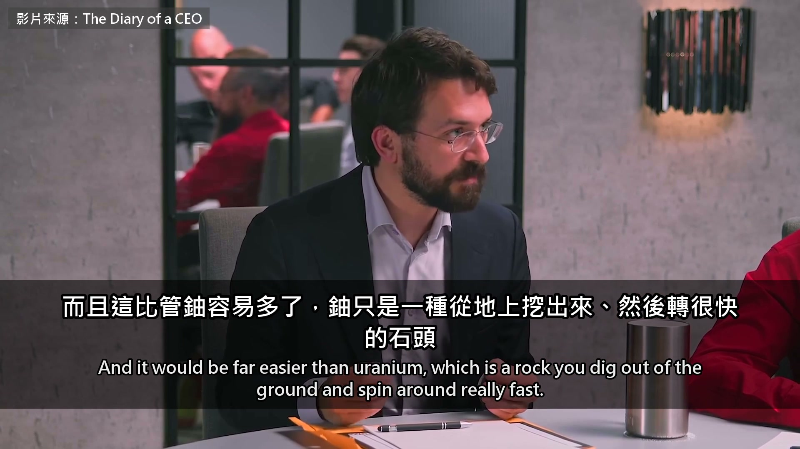

**逐字稿片段：** The Taiwanese company he was referring to was TSMC.

**話題推測：** 揭露台灣公司指的是台積電（TSMC）。

---

## 00:04:10

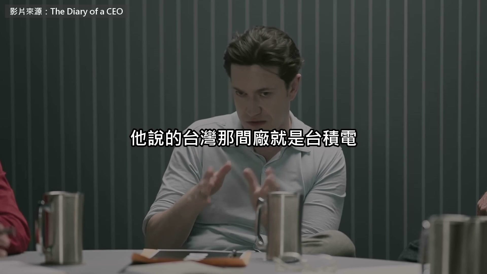

**逐字稿片段：** The Dutch company that makes the lithography machines was ASML. The first person to press him on this was Ed Zitron, a technology critic who has spent years scrutinizing the finances of AI companies. How do you discern between a training run for superintelligence and a training run for cybersecurity? Right now, the way we make these things smarter is to make them far larger. Yes. So what you do is you say, hey, look, training runs of this size that risk destroying everybody, no one's going to do it.

**話題推測：** 揭露荷蘭公司指的是艾司摩爾（ASML）。

---

## 00:04:35

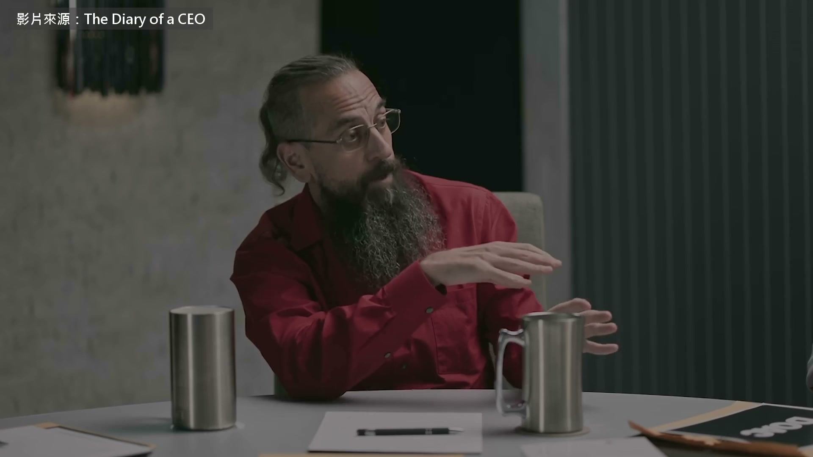

**逐字稿片段：** Then came the question of China. This time, Roman Yampolskiy joined in. He is a professor of computer science at the University of Louisville and has studied AI safety for over a decade. He believes that once superintelligence is created, it will be impossible to control. This point about can we get China to cooperate and can we check that they are? Fundamentally, we should. So, A, fundamentally, we should be trying to get them to cooperate. It is personal self-interest. Nobody wins if they get destroyed. You don't make money. You don't stay in power.

**話題推測：** 再次提及中國是否會合作的問題。

---

## 00:05:04

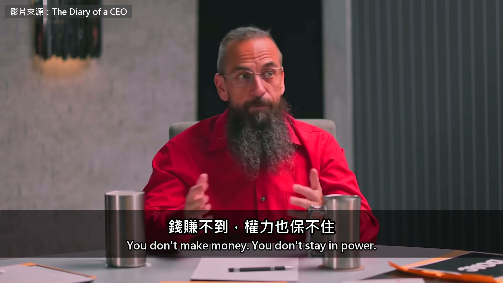

**逐字稿片段：** Communist Party of China is really good at staying in power.

**話題推測：** 提及中國共產黨維持權力的能力。

---

## 00:05:07

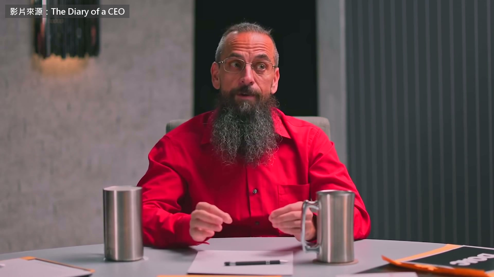

**逐字稿片段：** President Trump is also excellent. And you think they're going to sign and abide by an agreement, that leaves them permanently in second place? No. No one is permanently in second place if nobody is building the rogue superintelligence. They have a government which is… You guys are one-trick ponies, man. It's like you're fixated on this one thing and nothing else matters to you. You get it now. Nothing else. Other than saving humanity, everything is secondary. Nate's proposal rests on one key assumption.

**話題推測：** 提及川普總統。

---

## 00:05:35

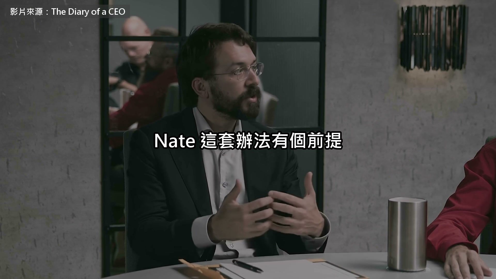

**逐字稿片段：** Training frontier AI requires 100,000 chips. That is too large a scale to hide. And that was exactly what the host asked about next. If it got cheaper to train superintelligence, then we'd be in a bad spot. Your approach would no longer be effective. That's right. Because more countries could capitalize on the opportunity. That's right. But we're not there yet. So how do you rebut that point? Yeah. So I would say it looks to me like there is a danger of the future training runs getting there, and that is enough to stop doing it when humanity is at risk. Sure. So I think that you also need to have an answer about what happens if it gets much, much cheaper to do this stuff. I think it's a hard problem. I would recommend that we also put a taboo on research of trying to make AI super cheap to train, if it would lead in the direction of superintelligence.

**話題推測：** 再次強調訓練前沿AI需要10萬顆晶片這一關鍵假設。

---

## 00:06:27

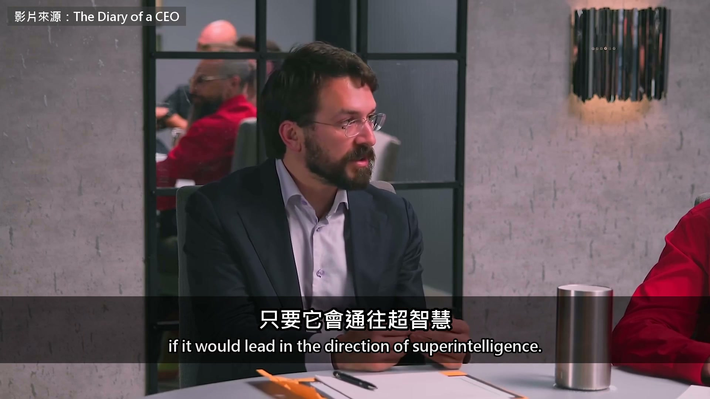

**逐字稿片段：** Just like we have a research taboo on making your own nuclear weapons, or finding out how to make, like, let civilians make nuclear weapons. That… that seems like wishful thinking in the context that these will become public companies who are incentivized to bring down costs. It's a… it's a tough position.

**話題推測：** 類比到核武器研究的禁忌。

---

## 00:06:42

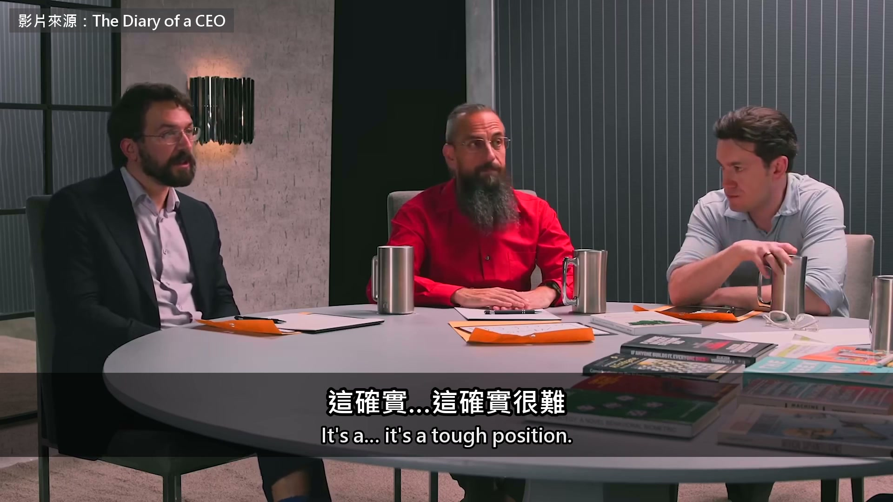

**逐字稿片段：** The host then turned to Roman and asked whether he had another solution. So I want the whole framework to shift. Everyone comes to this from point of view there are experts, they have a solution, there is an adult in the room, somebody got this, and the reality is no one does. Not people building it, not governments, no one. We have no solution to it. If we build it, we cannot control it. If we don't build it, we don't know how to stop malevolent actors from trying to build it. It's like any other illegal technology.

**話題推測：** 主持人轉向Roman提問是否有其他解決方案。

---

## 00:07:12

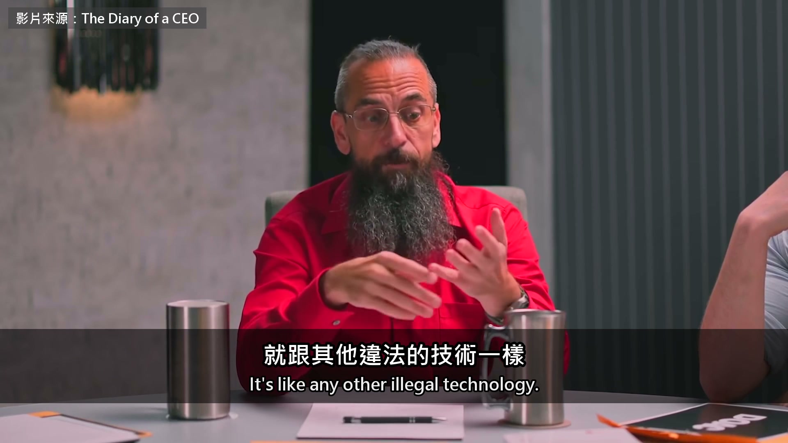

**逐字稿片段：** We made weapons of mass destruction illegal. Chemical weapons, biological weapons, nuclear weapons, but there are all governments, psychopaths, cults who are trying to get access to them. This is intelligence weapon of mass destruction. We'll have the same problem. At some point, you'll have enough compute in your cell phone to train something like that. There is no good ideas for how to stop it other than everyone goes Amish. I'm not proposing that, but we have no solutions. And that's a bigger part of this danger. Controlling the chips can serve as a brake because building the most powerful AI today still requires a data center visible from space. But once a phone is powerful enough, this approach will stop working. So what happens after that? No one at the table had a confident answer.

**話題推測：** 列舉大規模毀滅性武器（化學、生物、核武器）的例子。

---

## 00:07:55

**逐字稿片段：** The original video runs for more than two hours.

**話題推測：** 轉向討論原影片的內容。

---

## 00:07:57

**逐字稿片段：** At the start, all four wrote down their estimate of the chance that AI would wipe out humanity and sealed it in an envelope. Their answers ranged from 99% to 0%. McAfee also admitted on the spot that his prediction 10 years ago about AI taking white-collar jobs had been completely wrong. The original video is linked in the description if you would like to hear more.

**話題推測：** 描述辯論開始時四位講者對AI毀滅人類機率的估計。

---
