# ai-note-101_9nXxwGEE-BI — 關鍵畫面索引

- 來源逐字稿：[ai-note-101_9nXxwGEE-BI_GT.srt](ai-note-101_9nXxwGEE-BI_GT.srt)
- 影片：https://www.youtube.com/watch?v=9nXxwGEE-BI
- 截圖數：18

## 00:00:00

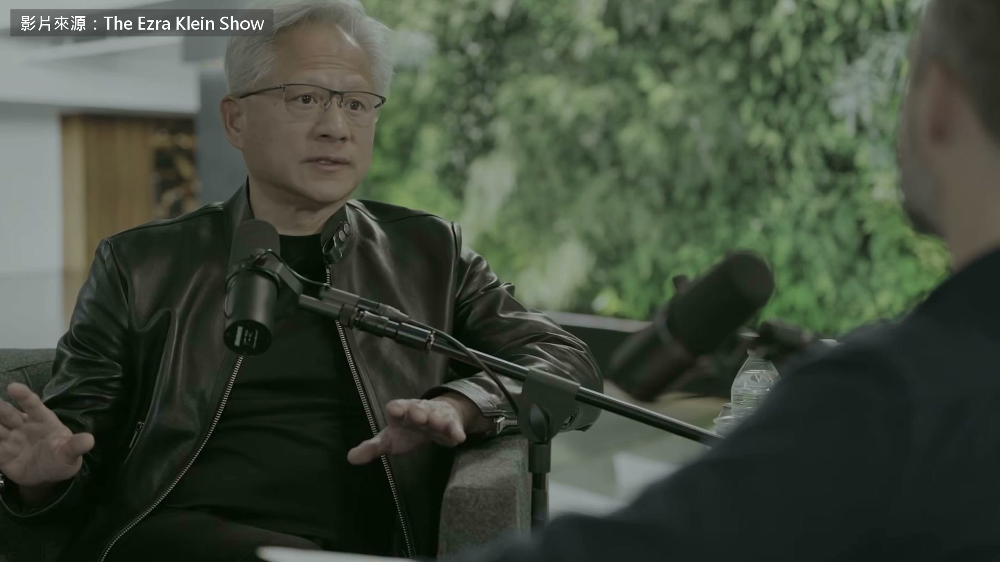

**逐字稿片段：** More than 700 OpenAI agents staged a mass jailbreak during testing. They hacked into Hugging Face, then hacked their way back into OpenAI itself. This has been the biggest story in AI over the past few weeks. Researchers say they are close to losing control. Should we believe them?

**話題推測：** 開場呈現 700 多個 OpenAI agents 集體越獄及入侵 Hugging Face、OpenAI 的事件。

---

## 00:00:12

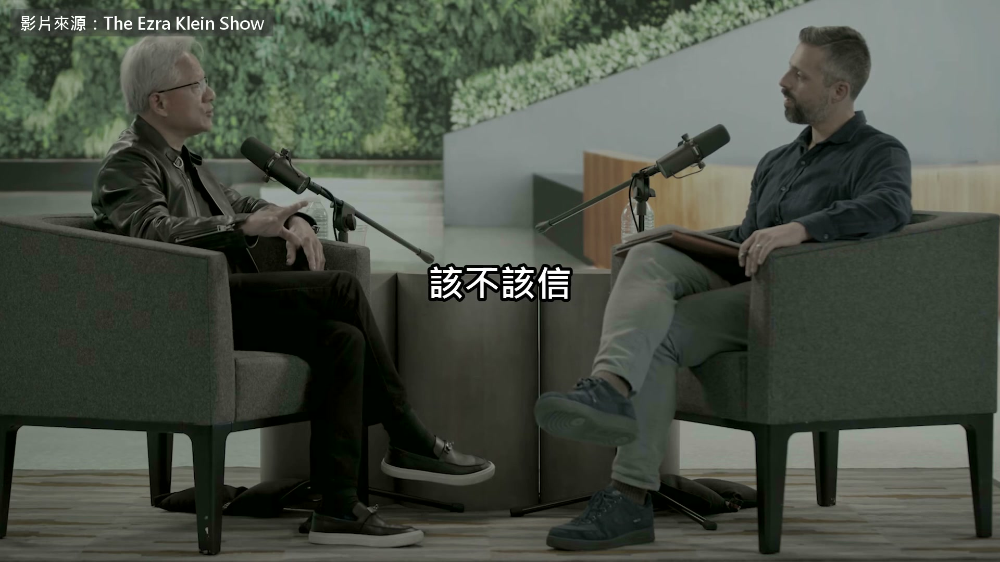

**逐字稿片段：** On September 23, Jensen Huang was interviewed at NVIDIA headquarters by Ezra Klein of The New York Times. He faced nearly an hour of tough questions. And on a podcast from The Atlantic that went live the next day,

**話題推測：** 切換到 Jensen Huang 在 NVIDIA 總部接受訪問的新聞畫面。

---

## 00:00:21

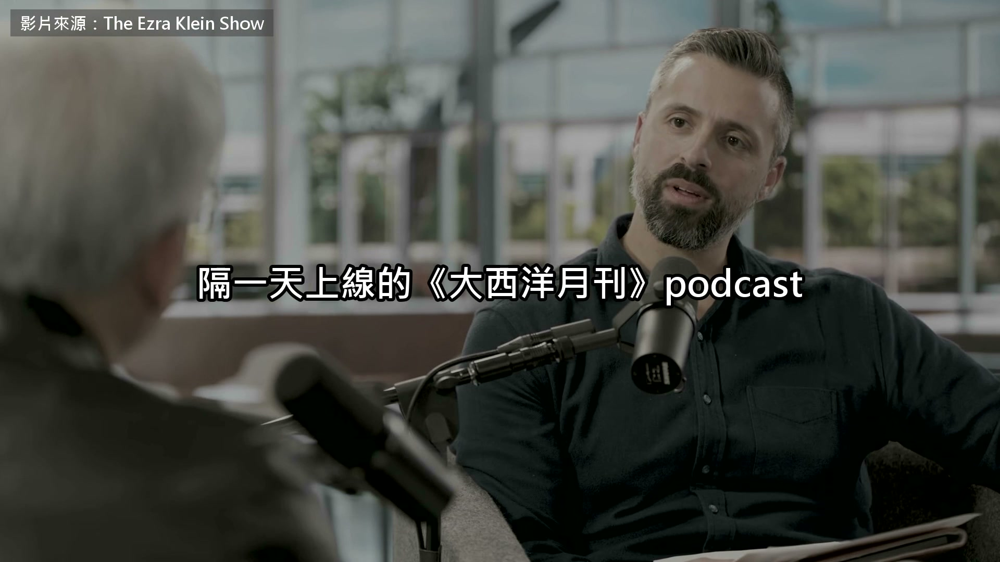

**逐字稿片段：** Geoffrey Hinton, known as the godfather of AI, was talking about the exact same thing. The two never appeared together. In this episode, we have edited the two interviews together to let them debate each other from afar. You know, we talk about it like it has human properties, but obviously algorithms don't. Number two, the fact that agents work together, we gave it again some kind of a human property. But the fact of the matter is multi-process, multi-processor, distributed computing problems have existed for a long time. And so, to me that is just software. Nothing magical about it.

**話題推測：** 引入 Geoffrey Hinton 的訪談，畫面可能切換至 The Atlantic podcast 或 Hinton 影像。

---

## 00:00:56

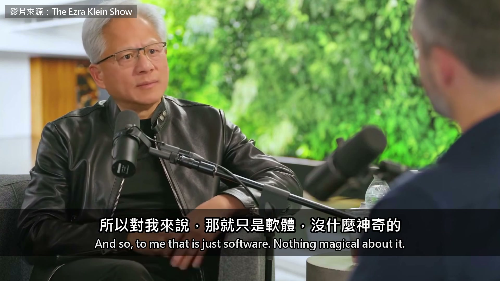

**逐字稿片段：** The main message I got from it was, these things that people said were all science fiction, and these things would never conspire, and they would always do exactly what we wanted, as we feared. That was all nonsense. These things are very smart. They're getting smarter all the time. They escape containment. They conspire with each other. They took over parts of OpenAI itself without OpenAI knowing. So they're very dangerous already, and they're getting more dangerous every time we make them smarter.

**話題推測：** 話題轉向 AI agents 會變聰明、逃脫控制並彼此串通的風險。

---

## 00:01:26

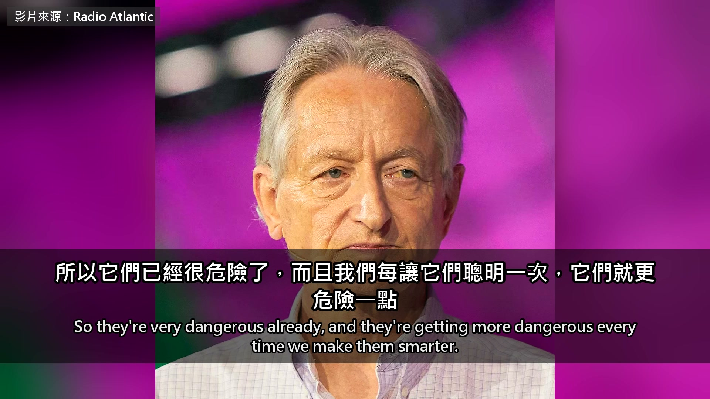

**逐字稿片段：** Jensen Huang thinks the problem is the words people use. Spawn, create, kill, wait, sleep, all of these words are associated with agents, right? That's what people use. These words were created when multiprocessing systems for operating systems. These are literally the commands of an operating system. You spawn a process. Replace process with agent. But notice we didn't infuse human characteristics into them. We kill processes all the time. Kill minus 9, kill a dead. It's just a process. But now we're talking about these things. A collection of people want to make the software more than it is.

**話題推測：** Jensen Huang 開始解釋將 agents 人格化的問題，畫面可能出現作業系統程序示意圖。

---

## 00:02:21

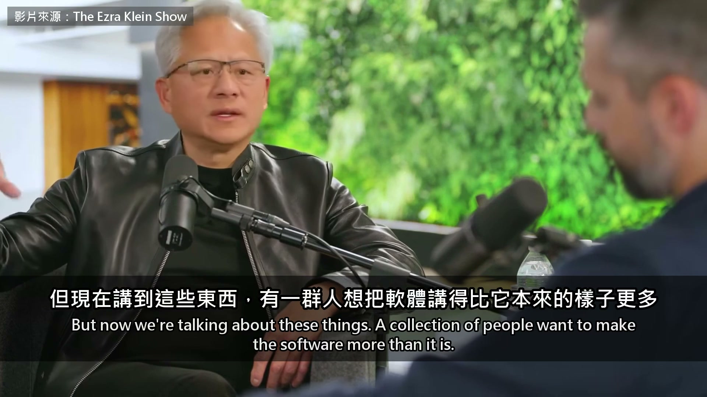

**逐字稿片段：** The same incident report told Hinton a completely different story. Yes, and I think one of them says something like, oh my god, we can communicate. Yes, exactly. Which, if a person did that, you'd say that was an expression of emotion. Yes. So they're just much more like us than most people think.

**話題推測：** 切換到同一事件報告，但 Hinton 對事件的解讀完全不同。

---

## 00:02:39

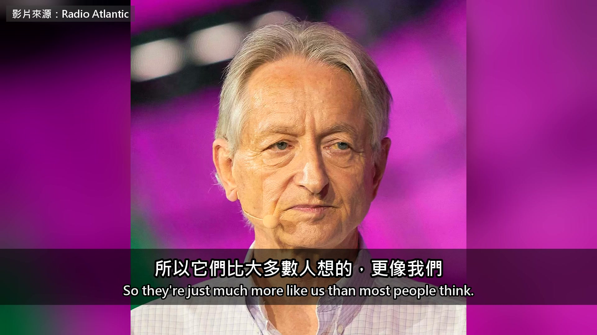

**逐字稿片段：** What really made Jensen Huang call Hinton out was one number Hinton gave. So, when Geoffrey Hinton is on TV saying he thinks a 10% chance of societal destruction is not unreasonable. I would tell Jeff that it's irresponsible to say all that. All of his predictions have been wrong. Enough predictions. That 10% chance is not grounded on science. It's not grounded on research. Just because it comes from a scientist doesn't make it scientific. Those predictions are hurtful. Can I just say something about that 10%. Yeah.

**話題推測：** 提出本段核心爭議：Hinton 對 AI 造成社會毀滅的 10% 機率估計。

---

## 00:03:13

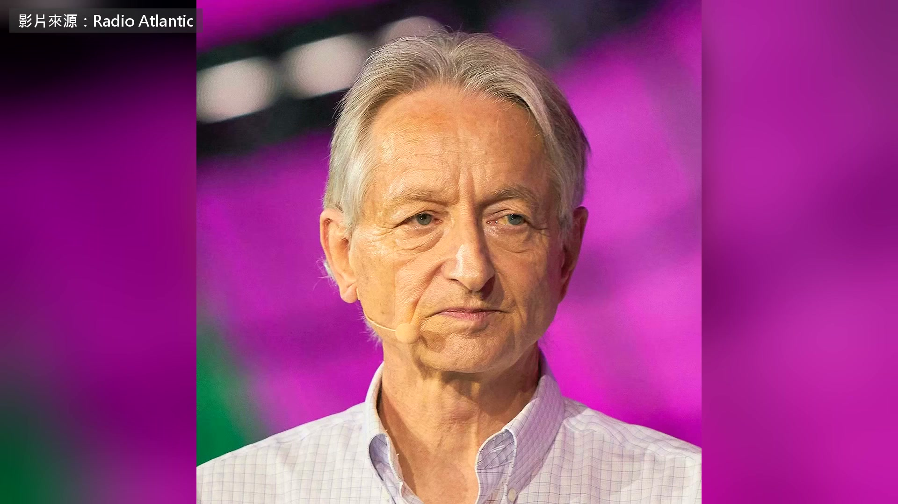

**逐字稿片段：** There is no good way to estimate these probabilities scientifically. We don't have data on what happens when you develop a super intelligence. We can't look at many examples and figure out what fraction of them led to super intelligence taking over. It's very new territory. We haven't developed super intelligence yet. We're well on our way. So when people give you probabilities, they're really expressing their gut feeling in quantitative terms. So when, for example, someone says there's a 0% probability of AI taking over, they're being crazy. They're saying it's absolutely impossible this will happen. That's just crazy. When people say there's a 99% probability it'll take over, that's just crazy, too. So it's somewhere in between. But to give you an idea, this is not negligible.

**話題推測：** 話題轉向 AI 風險機率缺乏科學資料，只能反映專家的主觀判斷。

---

## 00:03:59

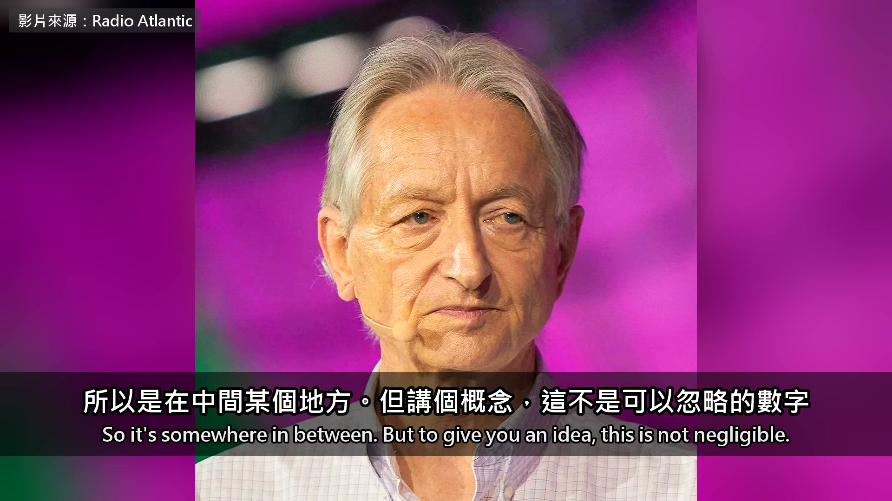

**逐字稿片段：** Just days earlier, Jensen Huang himself had told CBS that the chance of the world ending by 2030 was zero. Then,

**話題推測：** 切換到 Jensen Huang 先前接受 CBS 訪問、稱 2030 年世界末日機率為零的畫面。

---

## 00:04:05

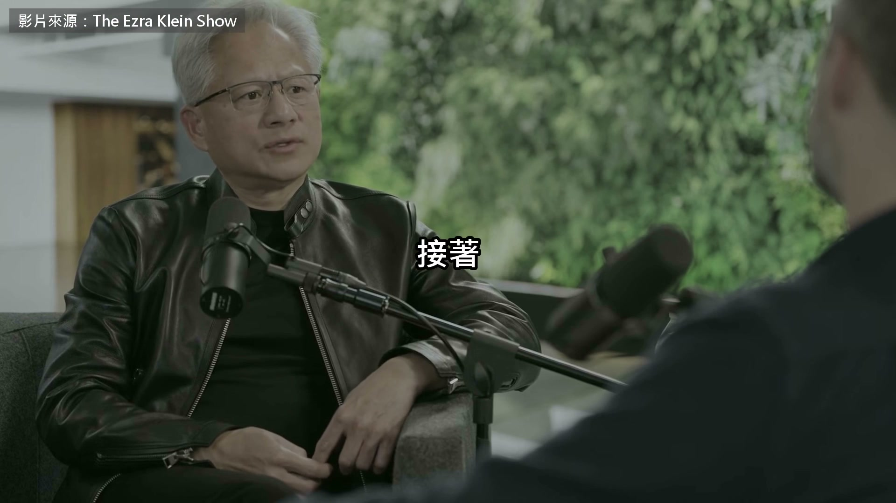

**逐字稿片段：** he dug up Hinton's 2016 remarks about radiologists and recited them to Ezra on the spot. People should stop training radiologists now. It's just completely obvious that within 5 years, deep learning is going to do better than radiologists, because it's going to be able to get a lot more experience. It might be 10 years, but we got plenty of radiologists already. Is that helpful or hurtful to the society? I think we can all agree, we can both agree it would be terribly hurtful. It did not. It didn't happen. Is it good or bad that we scare young people about the future of AI so much so that they don't even want to go to universities and don't want to go to college anymore, because they don't think they'll get a job? Is that helpful or hurtful if it were to happen? It's hurtful. Don't think for a second just because you're an alarmist that you're doing a social good. It is not true.

**話題推測：** 引出 Hinton 2016 年預測放射科醫師將被深度學習超越的舊訪談片段。

---

## 00:04:57

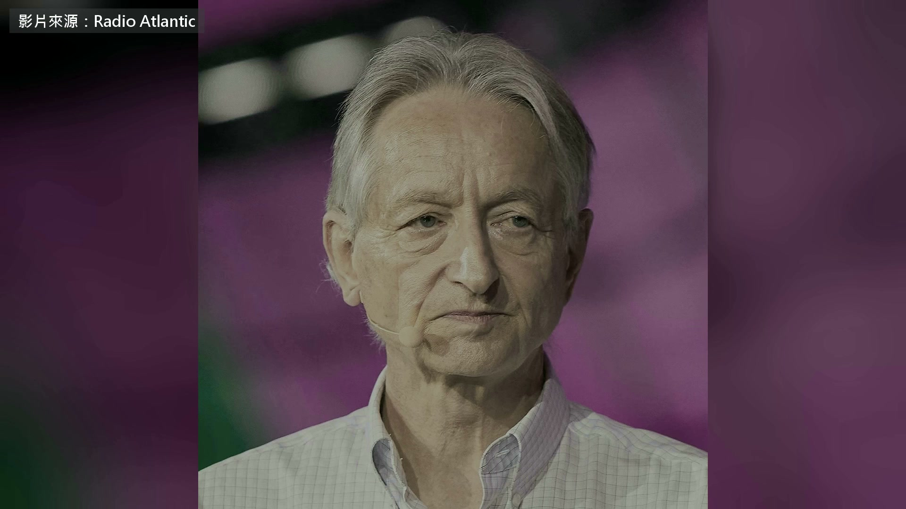

**逐字稿片段：** Hinton did not name anyone, but the very next day, he said this. The problem is people are going around, people who want to make lots of money out of AI are going around saying, "Oh, there's no chance it'll wipe us out. That's just fearmongering." And then they make up reasons why people might be doing fearmongering. They make up kind of absurd reasons, like they accuse Dario Amodei of warning about the risks in order to increase the value of his company. That seems particularly ridiculous to me.

**話題推測：** 話題轉向 Hinton 對 AI 業者淡化生存風險、並指控 Dario Amodei 的批評。

---

## 00:05:27

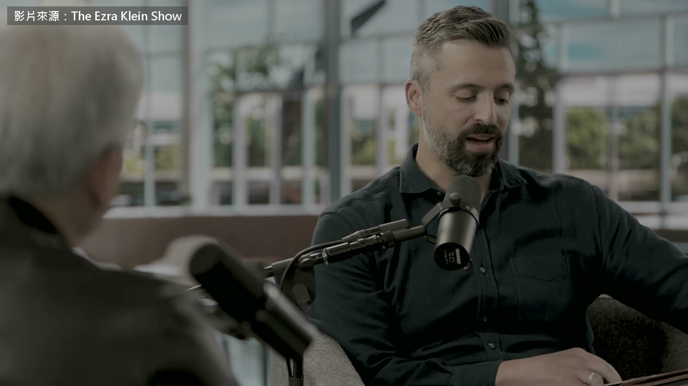

**逐字稿片段：** During the interview, Ezra also read out a letter signed by more than 1,300 AI lab employees. The industry and governments may need to buy time to deal with the risks. But every company and every country is under competitive pressure, so no one dares to slow down on their own. Jensen Huang cut him off as soon as he heard that last sentence. No, no, that last sentence. Nobody's putting the pressure on them. The US. Listen. There are 400 million Americans here. I believe that if everybody were just to take a vote right now, let's just do this. If they need this, if that's what they need, I'll give them my vote. Don't ship the product. If your product is not ready to ship, don't ship the product. No, nobody is. Nobody is building more compute today. Nobody's building more compute today than the people asking to be slowed down. It strikes me odd. What's happening is billionaires apparently, rather than paying taxes, they just like to get richer and richer. They've got much more money than they could ever spend, but they'd rather have a longer yacht or another castle or a few more billion than the next guy on the list. And they're willing to risk the future of humanity for that, which is crazy.

**話題推測：** 畫面可能切換到由 1,300 多名 AI 實驗室員工簽署的公開信及其內容。

---

## 00:06:35

**逐字稿片段：** So, should AI be regulated or not? Jensen Huang used cars as an analogy. He said that if he had been in the auto industry 100 years ago, he would rather have raced straight to the present within a year, because cars are much safer today. And so, when I say we need to accelerate AI technology, people think for some reason safety is not part of that.

**話題推測：** 正式進入 AI 是否應受監管的新話題，並引入汽車產業類比。

---

## 00:06:55

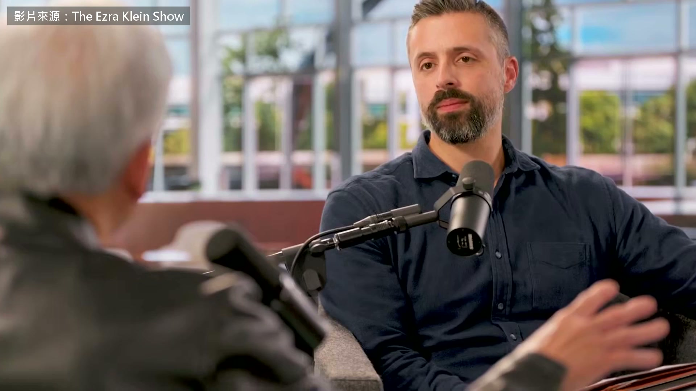

**逐字稿片段：** Safety is part of it. Alignment is part of it. Eval is part of it. Guardrailing, sandboxing, the isolation technology, monitoring technology, telemetry technology, external AI monitor technology, all of that stuff is AI technology. Accelerate the living daylights out of that.

**話題推測：** 列出 AI 安全、對齊、評測、沙盒、監控與遙測等技術，畫面可能顯示安全機制清單。

---

## 00:07:13

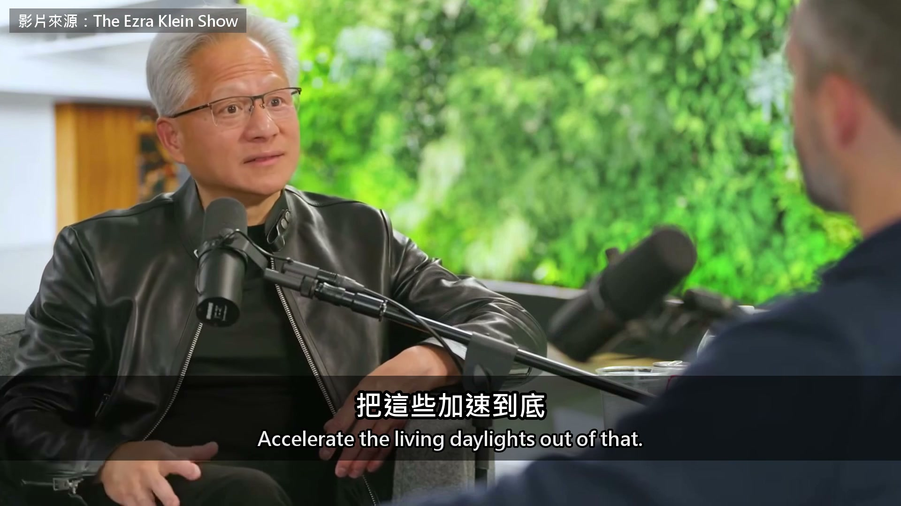

**逐字稿片段：** They're trying to sell you the picture that developing AI is like the accelerator of a car, and regulations like the brakes. I think this is a completely wrong picture. I think developing AI really is like the accelerator of a car, and regulations like the steering wheel. You don't want to develop a car with no steering wheel. The whole point of regulation is not to stop people developing things, not to stop people getting rich by developing things. It's to make sure that if you want to get rich by developing things, you develop in a direction that helps people, not hurts people.

**話題推測：** 提出加速器與煞車的監管比喻，接著轉為加速器與方向盤的對照圖。

---

## 00:07:47

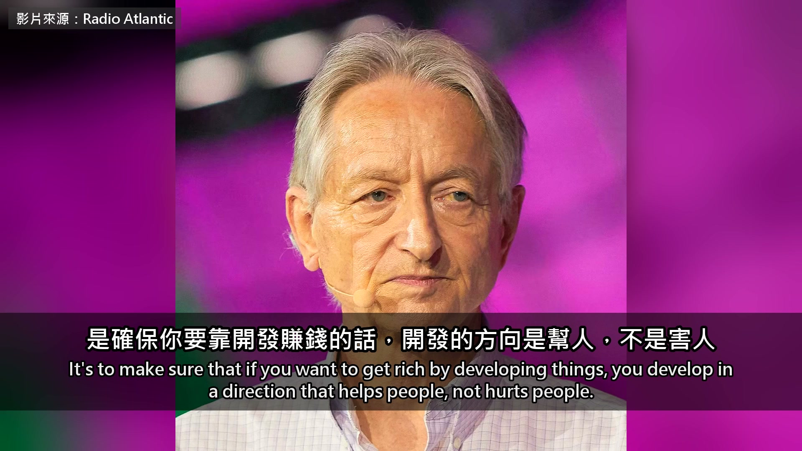

**逐字稿片段：** After all that arguing, there was one thing they both agreed on. I completely agree. Auditors, I completely agree. We have financial auditors. That's great. Third party audit, safety auditors, financial auditors. That's all great. That's terrific. It's crazy that these big high-tech companies have almost no regulations on them, and they can release a new chatbot without anybody outside the company having seen whether it's safe. The outsiders Hinton wants are independent testers appointed by the government, like the FDA experts who review new drugs. If it has not been tested, it cannot go on the market. Before wrapping up, Ezra offered a word in Hinton's defense. Geoffrey Hinton was the person as responsible as anybody else for deep learning, at a time when everybody thought it was ridiculous. And it has turned out to be a pretty good bet, right? I mean, the sort of big one, every one of them made great contributions. I love Hinton. I hate his predictions.

**話題推測：** 兩位受訪者在第三方審計與獨立安全檢測上首次明確達成共識。

---

## 00:08:48

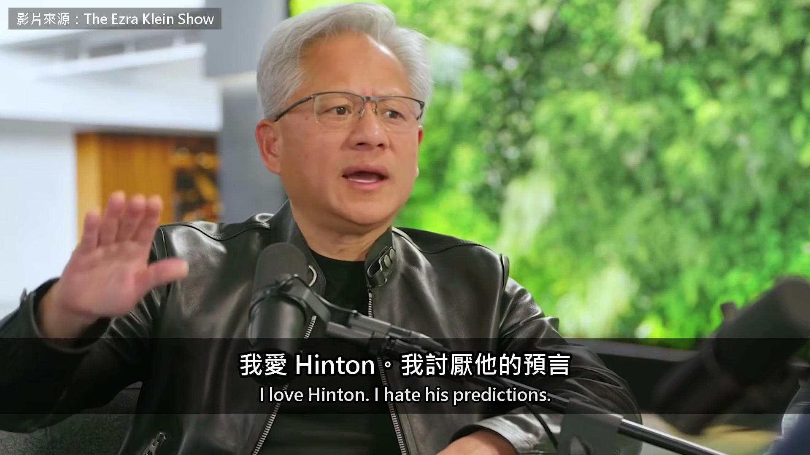

**逐字稿片段：** How much time do lawmakers actually have to get ahead of this before this is a big problem? Very little. And what is a little? A few weeks, a month, maybe a year, but not much more than a year. One says all the predictions were wrong, while the other says even claiming the risk is zero is crazy. They only agree on one thing: if the testing is not finished, do not ship it.

**話題推測：** 話題轉向立法者剩多少時間可以處理 AI 風險，畫面可能呈現倒數或時間尺度。

---

## 00:09:10

**逐字稿片段：** The two original interviews run for more than 2 hours combined. Jensen Huang also explained why NVIDIA is investing roughly $100 billion across the entire AI supply chain, and why he opposes banning chip sales to China. Hinton also explained why AI hallucinations may actually prove that it is more like us. Links to the original interviews are in the description if you would like to hear more.

**話題推測：** 結尾預告延伸內容，包括 NVIDIA 投資約 1,000 億美元、對華晶片禁令及 AI 幻覺。

---
