# ai-note-101_AlrQxLyriKM — 關鍵畫面索引

- 來源逐字稿：[ai-note-101_AlrQxLyriKM_GT.srt](ai-note-101_AlrQxLyriKM_GT.srt)
- 影片：https://www.youtube.com/watch?v=AlrQxLyriKM
- 截圖數：22

## 00:00:07

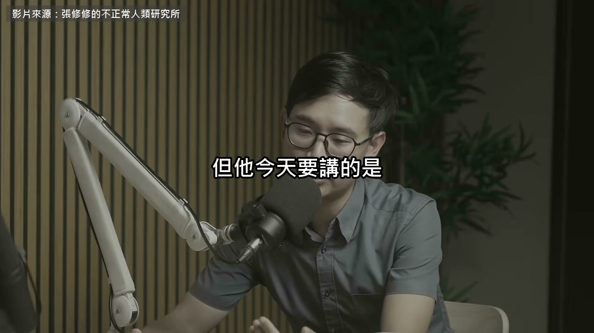

**逐字稿片段：** Children under 13 should not use general-purpose AI. His name is Kuan-wei Lu. He graduated from medical school, but after his internship, he did not stay at the hospital. Instead, he went off to build the Junyi Academy platform. Today, he is its chairman and CEO. Junyi has been around for 14 years. It is a free online learning platform, with lesson videos and exercises from elementary through high school. This is from a podcast released this September, The Institute of Abnormal Humans, hosted by Hsiu-Hsiu Chang. Let us start with that AI double. He says discussing decisions with his team can sometimes be a bit of a hassle, so he wanted to put his decision-making habits and all the company context into an agent. Opus 4.5 had just come out at the time. Whenever I ran into a problem, I would discuss it with the agent. I would say, I want to build this. How should I do it? And it would write the code. Then I would work on it some more. So, I took...

**話題推測：** Introduction of the main topic: AI use for children under 13.

---

## 00:00:48

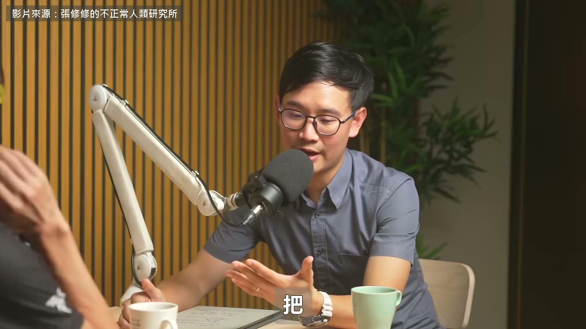

**逐字稿片段：** I used that lobster tool, and deployed it on a VPS, which is a virtual private server. Then, I gave it a personality and fed it data. Finally, I put it into Slack. And then I started seeing my actual colleagues asking it questions and discussing things with it. Right, and that was one part of it. You keep refining it, of course, because sometimes a colleague will ask, Hey, why did it give such a bad answer? Later, we realized that my colleagues really liked using it. One reason was that they felt they could never boss Kuan-wei Lu around in real life, but they could boss AI Kuan-wei Lu around.

**話題推測：** Mention of the 'lobster tool' used for AI deployment.

---

## 00:01:25

**逐字稿片段：** Back to education. Hsiu-Hsiu asked him, How exactly can AI help elementary school students? He said he would start with the downside. AI is like a knife. Before using it, you need to know it can hurt people. By the same token, with AI, the general-purpose large language models that are currently available to you are prohibited for children under 13 in most countries. The reason is that people have reached a rough initial consensus that children may not yet have the necessary mental maturity. Right. When they encounter something that lets them ask any question, and then AI can answer absolutely anything, it may eventually give responses that cause a child to develop the kind of emotional attachment they should normally have to a person. Instead, the child becomes attached directly to this thing. So, that is why AI used to help children learn needs to be specially designed. Junyi is working with the National Academy for Educational Research and Longpu Elementary School.

**話題推測：** Transition back to the main topic of education and AI.

---

## 00:02:32

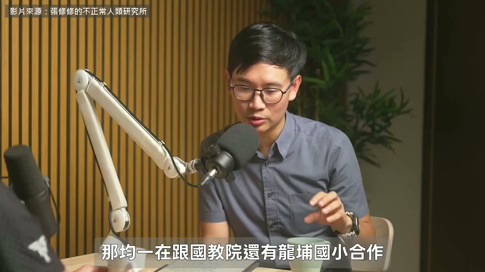

**逐字稿片段：** We designed a tool called AI Notebook specifically for this purpose. AI Notebook is one of the educational AI tools Junyi has developed over the past two years. It is used for math and science. English has a separate AI tutor.

**話題推測：** Introduction of the AI Notebook tool.

---

## 00:02:43

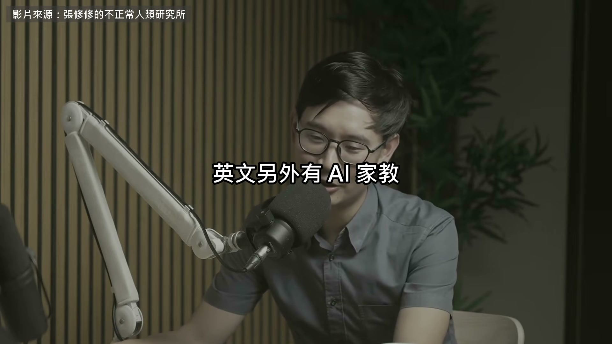

**逐字稿片段：** They have also partnered with three counties and cities to give thousands of elementary students a one-hour AI class at a time. This notebook is not really designed for chatting. It only answers questions within the school curriculum, and it does not give students the answer directly. Instead, it asks what their previous step was. In the Longpu Elementary School trial, there were 60 students in two classes. During one 40-minute lesson, they asked it 600 questions. So what happened? What we found with Longpu Elementary School was this. What benefits did AI Notebook bring? We discovered two things. First, in general,

**話題推測：** Scale of Junyi's AI educational partnerships and reach.

---

## 00:03:14

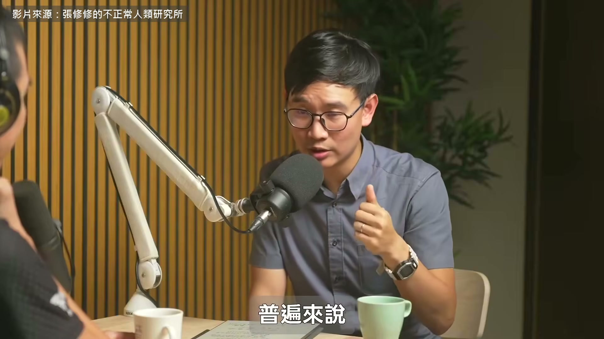

**逐字稿片段：** students' grades improved. They compared test results from before and after the trial. And this was empirically validated by the National Academy for Educational Research, the country's leading educational research institution. They conducted the actual study. But the other, more interesting finding was that the students' ability to ask questions, and the quality of those questions, also improved.

**話題推測：** First finding from the trial: improvement in student grades.

---

## 00:03:40

**逐字稿片段：** Except for one final group of children. What counts as a good question? Say you cannot solve a chicken-and-rabbit problem. Asking why this number is used instead of that one is a good question. Just tell me the answer, or Can you chat with me, is not.

**話題推測：** Introduction of an exception group of students who did not improve.

---

## 00:03:54

**逐字稿片段：** The system sorts every student's questions into red, yellow, or green for the teacher to see. After using it for a while, most students are gradually guided toward green. But that final group of students does not improve. Unless the teacher steps in, that last group of students gets into the habit of constantly using language that signals giving up when interacting with AI. And they still interact with it a lot. Our data shows that their engagement remains high, but their results stay poor. They just keep saying, This is so hard. I do not know how to do it. But they feel that at least they have somewhere to vent. At that point, what does this tell us? It tells us that human teachers theoretically will not lose their jobs. Because in situations like this, only a teacher can show concern, offer guidance, and teach students how to ask better questions. Only by helping them readjust is improvement possible.

**話題推測：** Explanation of the red, yellow, green question classification system.

---

## 00:04:46

**逐字稿片段：** That covers the teacher's role. But who do children themselves choose? He tried it with his six-year-old daughter. He told her to ask AI whenever she had a question, and she really did. But if I have time to answer, she still prefers asking me. Right. What I am trying to say is that children are still highly sensitive to the warmth of another human being. So even if AI can answer their questions, I think what we usually discuss with teachers now is that, at the end, the teacher should still ask, What did you learn from that discussion with AI? It is a bit like the teacher actively reconnecting that relationship. Then, in the end, the teacher invites the student to ask, Do you have any questions you would still like to ask me? You can assign

**話題推測：** Shift to the question of children's preference between AI and humans.

---

## 00:05:31

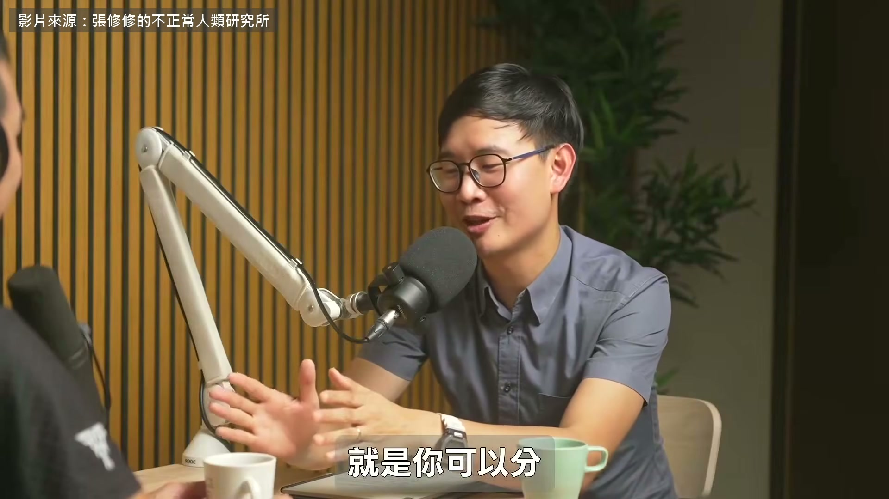

**逐字稿片段：** maybe 80% of the workload to AI, but make absolutely sure the remaining 20% is still interaction between the student and a real person. Do not throw that away. Right. When a child gets something right, you can say, Great job! And give them a hug. Those are things AI absolutely may still be unable to do even in 1,000 years.

**話題推測：** Recommendation for an 80/20 split between AI and human interaction.

---

## 00:05:48

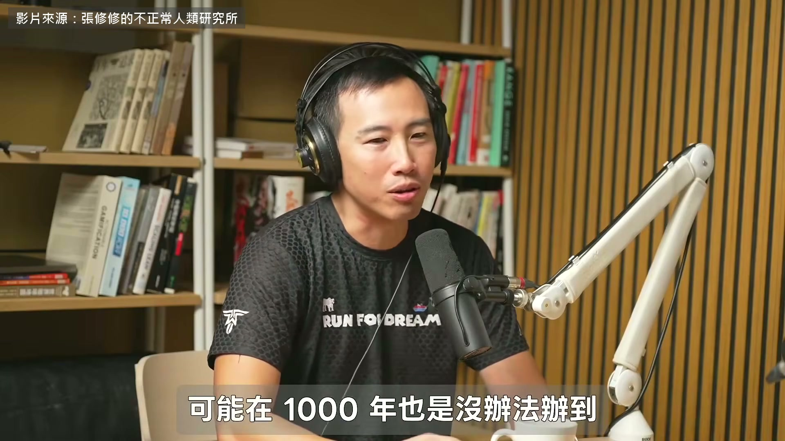

**逐字稿片段：** So at what age can children start using AI?

**話題推測：** Reintroduction of the question: At what age can children start using AI?

---

## 00:05:50

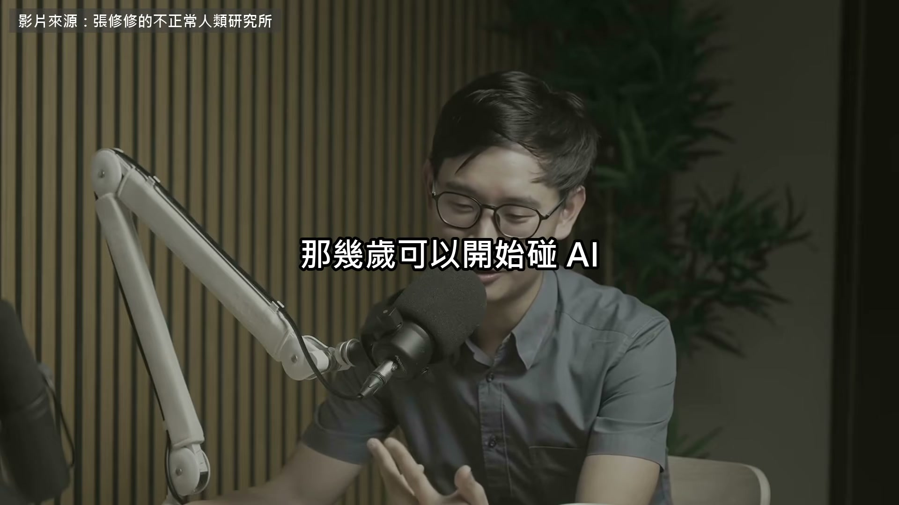

**逐字稿片段：** He gives four key ages: 6, 12, 15, and 18. For children under 6, the mainstream international view is to maximize interaction with real people. Tablets are not entirely off-limits, but there is one condition. The recommendation is that if a child uses one, an adult must be there with them. Right. That is one part of it. And before age 6, AI is generally discouraged. Its voice and other features can cause many children to form the wrong associations. There was actually a study somewhere, though I forget where. I will have to look it up.

**話題推測：** Presentation of four key ages (6, 12, 15, 18) for AI usage.

---

## 00:06:20

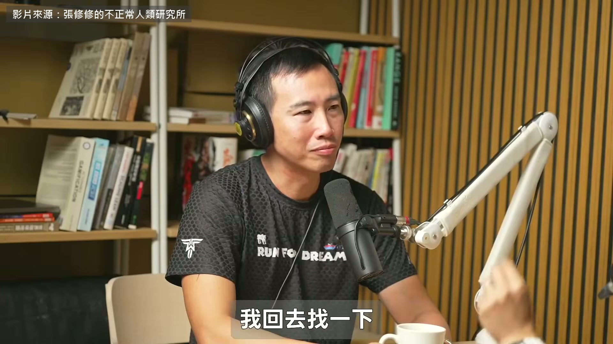

**逐字稿片段：** But a US study found that children of a certain generation suddenly became noticeably less polite. Why? Because that was when Alexa had just come out. You could keep giving it commands. You know? Children really did that. So there is already evidence of this. That is why, before age 6, you really have to remember

**話題推測：** Mention of a US study on children's politeness and Alexa.

---

## 00:06:38

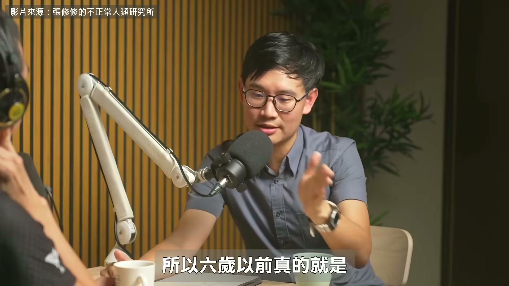

**逐字稿片段：** what Freud said: Your life is shaped by age 3 or 6. From 6 to 12, children should only use AI designed by educational institutions, such as Junyi or Khan Academy. These tools rarely give the answer directly. After 13, they can start using general-purpose AI to explore deeper why questions. From age 15, he trains them as future workers. Junyi's youngest interns are high school students. Beyond age, there is an even more fundamental question. If AI makes everything so easy, will our brains get lazy? Because this goes back to the essence of learning. Learning requires falling down many times before you can master something, just like a child learning to walk. There is a term that has become quite popular lately:

**話題推測：** Reference to Freud's statement on childhood development.

---

## 00:07:16

**逐字稿片段：** frictionless. It means having no resistance, or no friction. AI was originally designed to be frictionless. That makes interacting with it very comfortable. It is patient, never scolds you, and answers your questions precisely. Great. But the problem is that this does not help learning.

**話題推測：** Introduction of the term 'frictionless' in the context of AI.

---

## 00:07:32

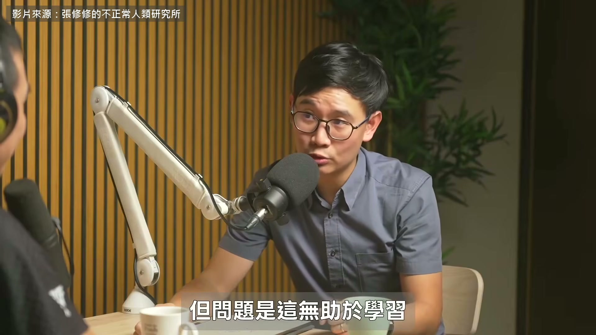

**逐字稿片段：** That is what neuroscience tells us. So this has now become an ethical issue. If we want to help people grow in a way that aligns with neuroscience, then we actually need to deliberately give AI a little friction. So it is very possible that...

**話題推測：** Reference to neuroscience findings on learning.

---

## 00:07:46

**逐字稿片段：** In the second half, Hsiu-Hsiu asked him, As work becomes increasingly efficient, what gives human life meaning? He began with the final phase of his time as a medical student.

**話題推測：** Transition to the second half of the podcast and a new question about meaning.

---

## 00:07:53

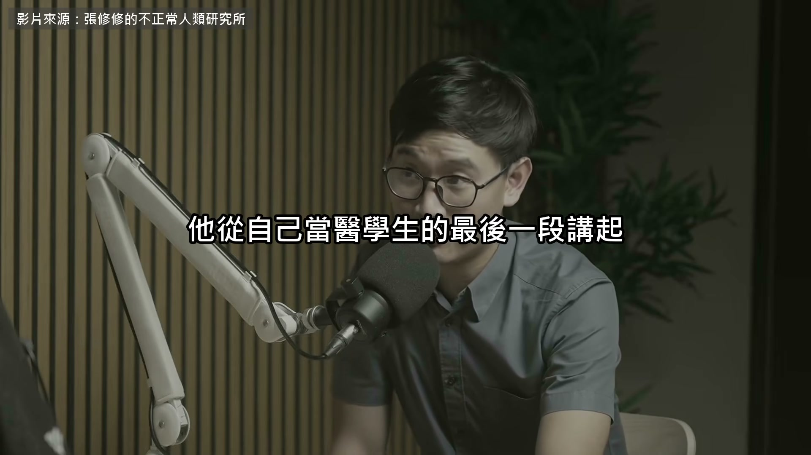

**逐字稿片段：** The place where he spent the most time was the hospice ward. Every patient admitted there knew they did not have much time left. After talking to many of them, he found that only two things mattered in the end. First,

**話題推測：** Speaker's experience in a hospice ward as a medical student.

---

## 00:08:03

**逐字稿片段：** what are my relationships with the important people in my life like? That person might be family, a partner, or a friend I care deeply about. But it is usually family or a significant other. And the second thing is,

**話題推測：** First key factor for life's meaning: relationships.

---

## 00:08:19

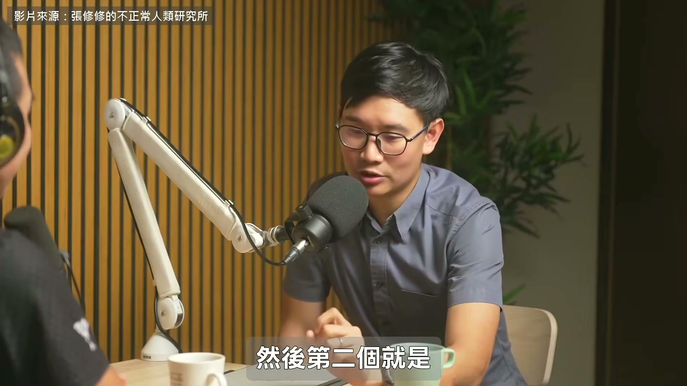

**逐字稿片段：** are there things I have always wanted to do in my life that I still have not done? Right. So in the end, it comes down to relationships and dreams, or intimacy and dreams. My own feeling is that, as human beings, the thing that ultimately most... cannot be taken away by AI is that AI cannot manage your relationships with other people for you. Even if it could, those would not be relationships with you. They would not be yours. So, the quality of my relationships with others is a fundamental source of meaning. The second thing is dreams. Nobody gets to dictate what your dream should be. The question is whether there is something inside you, an idea that genuinely belongs to you. And I think this is something that, no matter how AI evolves, we should preserve in children as much as possible. I want my child to be very good at using AI, but not use it so much that he becomes lonely. Right. He needs to be able to form relationships with others. And then, he should be highly skilled at using AI and use it efficiently, but he should not end up using AI only to do whatever his boss tells him to do. He should have ideas of his own that AI can help him bring to life. AI should be an accelerator for pursuing his dreams. At what age can children start using AI? His answer is not really an age. It is whether there is a person beside them. The two things AI cannot take away, relationships and dreams, are what adults need to preserve for children.

**話題推測：** Second key factor for life's meaning: pursuing dreams.

---

## 00:09:48

**逐字稿片段：** The original video is 87 minutes long. This edit contains less than one-tenth of it.

**話題推測：** Mention of the original video's length (87 minutes).

---

## 00:09:51

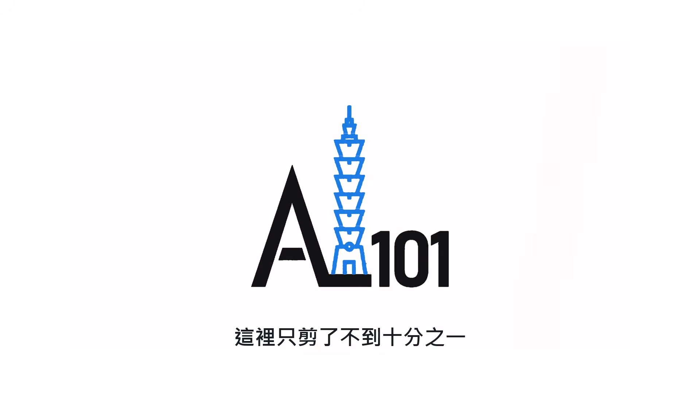

**逐字稿片段：** They also discuss an AI literacy framework based on asking, using, managing, and creating. They explain why Junyi rarely hires new graduates, and talk about an AI Musk built by one of his colleagues specifically to challenge your ideas. The original video's link is in the description if you would like to hear more.

**話題推測：** Mention of an AI literacy framework (asking, using, managing, creating).

---
