# ai-note-101_BAFKKutYubU — 關鍵畫面索引

- 來源逐字稿：[ai-note-101_BAFKKutYubU_GT.srt](ai-note-101_BAFKKutYubU_GT.srt)
- 影片：https://www.youtube.com/watch?v=BAFKKutYubU
- 截圖數：25

## 00:00:04

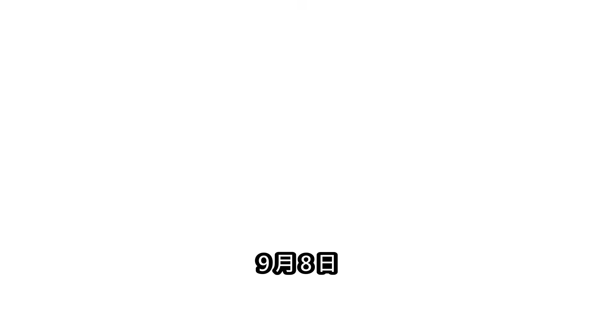

**逐字稿片段：** Meta 推出一個叫 Muse 的 AI agent 它不只回答問題，它替你動手做事 開瀏覽器、填表單、寄信、訂機票餐廳、 下單付款，你關掉 App 之後它還在跑 Meta 官方的說法很直接 說這東西不只是回答問題 它真的把事情做完

**話題推測：** 介紹 Meta 推出 Muse AI agent

---

## 00:00:21

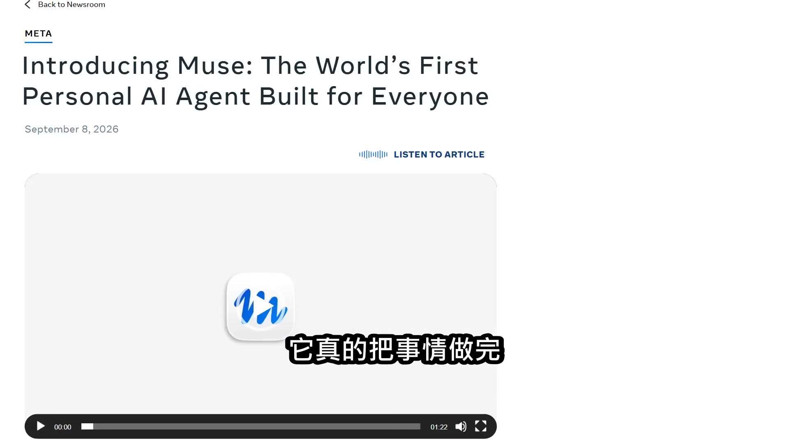

**逐字稿片段：** 出品的是 Meta Superintelligence Labs 一個 2025 年 6 月才成立的新單位 目前只開美國、只給 18 歲以上，iOS、 Android、網站、WhatsApp 都能用 之後還要上 AI 眼鏡

**話題推測：** 公布 Muse 的開發單位：Meta Superintelligence Labs

---

## 00:00:35

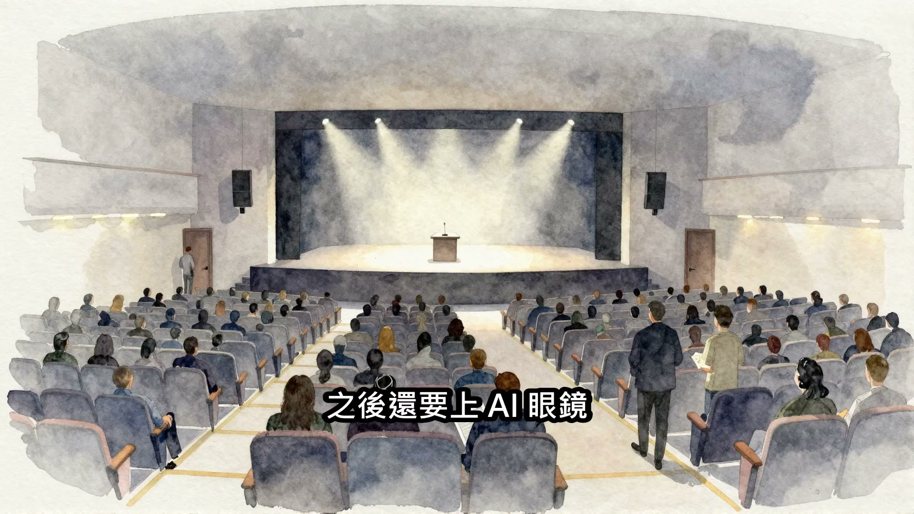

**逐字稿片段：** 免費的人每週有 1 億個 token 額度 換算大約 4 億個字元 要用它，你得先把東西接上去

**話題推測：** 公布免費版用戶的 token 額度

---

## 00:00:42

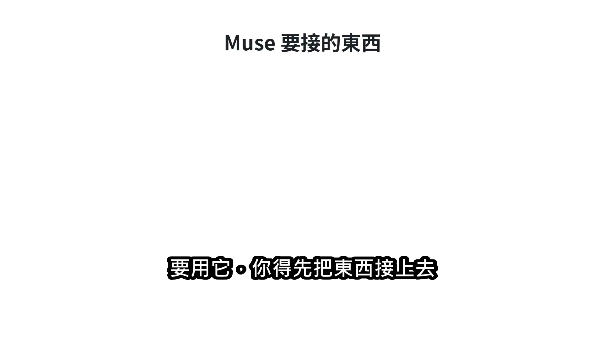

**逐字稿片段：** email、行事曆、金融跟支付、 健康與運動、智慧家庭、購物、餐飲、 音樂跟活動，八個類別

**話題推測：** 列出 Muse 可整合的八個服務類別

---

## 00:00:50

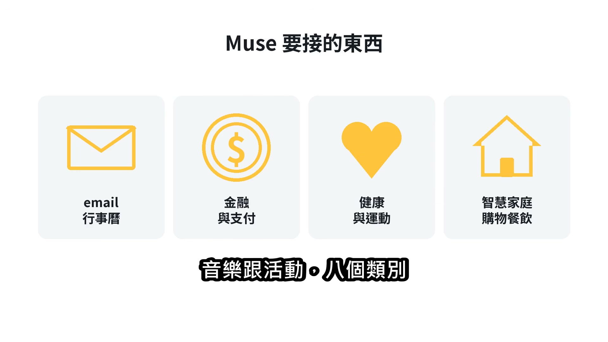

**逐字稿片段：** 付款走的是 Link by Stripe 開出來的單次卡號 用一次就沒了

**話題推測：** 說明 Muse 的付款金流處理方：Link by Stripe

---

## 00:00:55

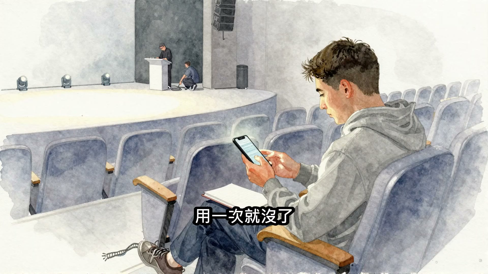

**逐字稿片段：** 密碼管理服務 1Password 跟 Shop Pay 官方標的是即將 也就是還沒接上 Meta 講的安全架構有兩層 每個人有一台專屬的雲端主機 Muse 跟你的資料都關在裡面

**話題推測：** 提及即將支援的服務：1Password 和 Shop Pay

---

## 00:01:07

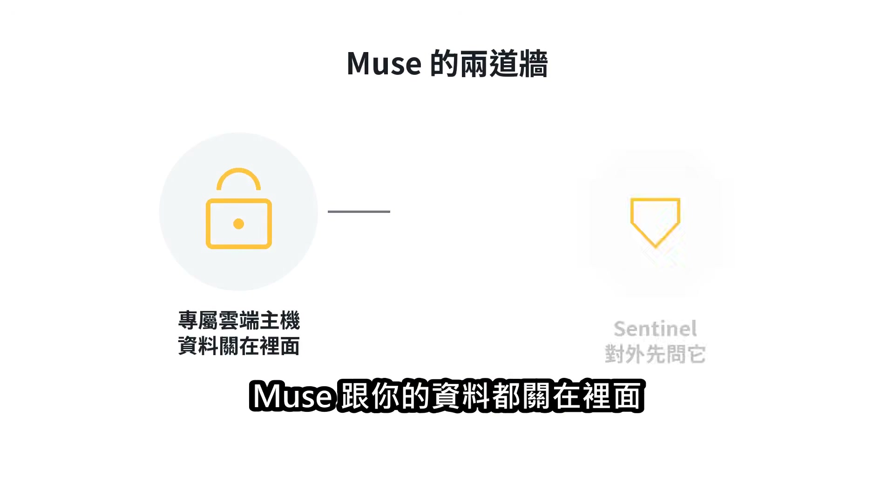

**逐字稿片段：** 另外有一個叫 Sentinel 的守門程式 Muse 要對外做任何事，都得先過它

**話題推測：** 介紹安全守門程式 Sentinel

---

## 00:01:12

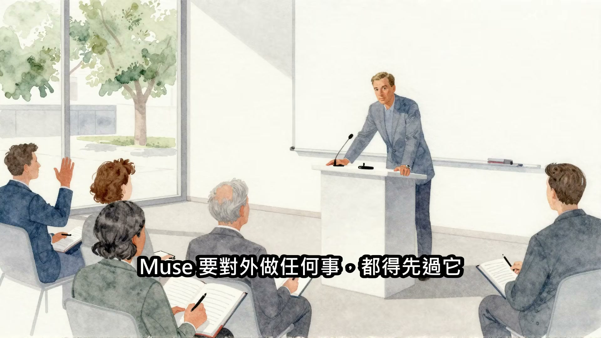

**逐字稿片段：** Meta 工程副總 David Singleton 在發表時說 Muse 跑在自己的隔離牢房裡 看不到真的帳號密碼 每一次對外動作都要過 Sentinel 而且 Muse 沒辦法繞過它 這位主管的來歷解釋了很多事

**話題推測：** 引述 Meta 工程副總 David Singleton 的發言

---

## 00:01:25

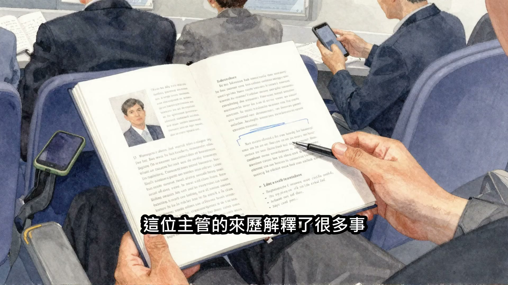

**逐字稿片段：** David Singleton 當了將近 7 年 Stripe 技術長 2026 年 3 月才帶著自己的新創進 Meta 所以 Muse 一上線付款就綁 Stripe

**話題推測：** 說明 David Singleton 的過往經歷（Stripe 技術長）

---

## 00:01:34

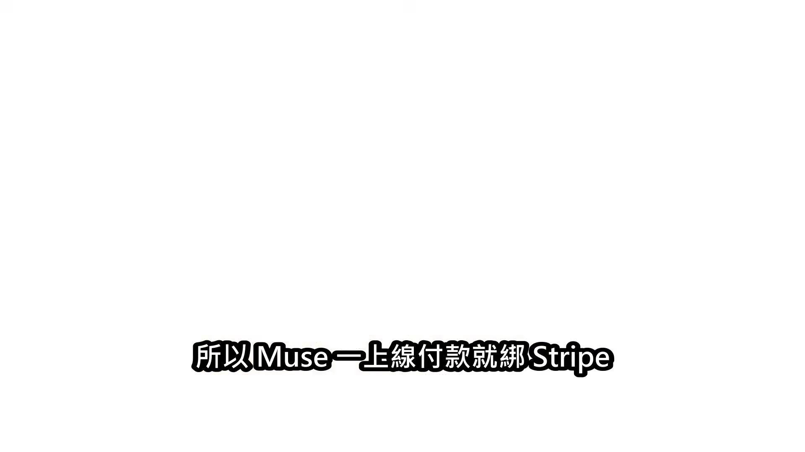

**逐字稿片段：** 但有一個開關 Meta 沒有講太大聲 你跟 Muse 講的每一句話 去掉身分資訊之後 預設就會拿去訓練 Meta 的模型 你要自己去關，不去關就等於答應 要看懂這件事，得先回到 2025 年 6 月 Meta AI 這個 App 有一個叫 Discover 的公開動態 把很多人以為是私聊的內容貼了上去 貼上去的東西包括自我診斷病症、 講分手、法律糾紛、住家地址 Meta 當時的回應是，這不是 bug 預設本來就是私密的 要按 4 個步驟才會公開

**話題推測：** 揭露 Muse 預設會將用戶對話用於模型訓練

---

## 00:02:06

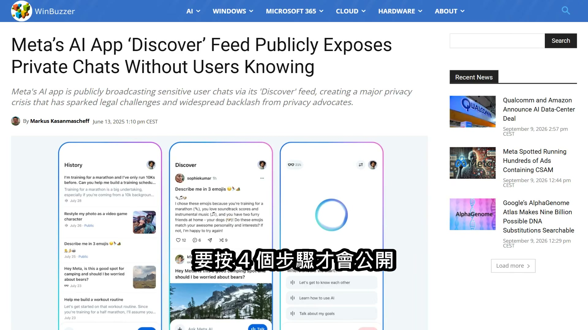

**逐字稿片段：** 接著是今年 7 月 7 日 Meta Superintelligence Labs 在 Instagram 推出 Muse Image 只要標記一個公開帳號 就能把那個人的照片抓去生圖 這個功能對所有成年公開帳號預設全開 本人不會收到通知，也沒有被問過

**話題推測：** 回溯 2025 年 7 月 7 日 Muse Image 於 Instagram 上線的事件

---

## 00:02:21

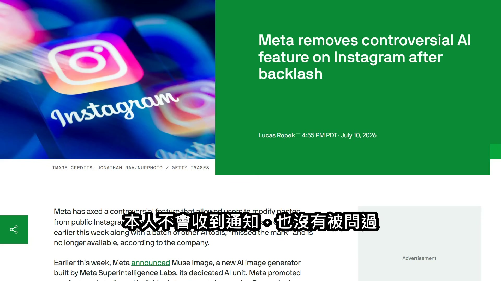

**逐字稿片段：** 3 天之後，7 月 10 日，Meta 把它下架了 美國演員工會 SAG-AFTRA 當時說 這是對大眾觀感的一次徹底誤判 這種用法的危害顯而易見

**話題推測：** 說明 Muse Image 功能在 3 天後被下架

---

## 00:02:32

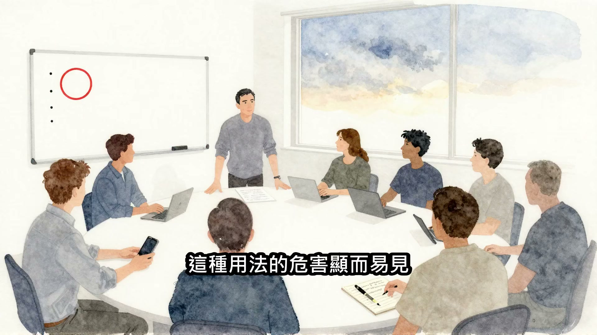

**逐字稿片段：** 艾美獎女演員 Hannah Einbinder 直接叫粉絲去把那個開關關掉 Meta 的認錯只有半句話 說聽到大家的意見了 這個功能沒有做好，所以不再提供 但被拿掉的只是 Instagram

**話題推測：** 引述艾美獎女演員 Hannah Einbinder 的反應

---

## 00:02:44

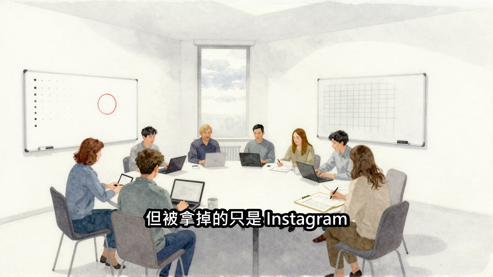

**逐字稿片段：** 那個標記開關 Meta 拿公開貼文訓練 AI 的規則一個字都沒改 8 月，祖克柏發了一篇長文，寫下承諾： 每個人終將擁有一個非常能幹的個人 agent 它了解你、你的目標 以及你在乎的每一件事 9 月 8 日上線的 Muse 就是這句話的兌現品 讓世界上每個人都有一個很能幹的個人 agent 懂你的目標，全天候替你做事 但發表會之後

**話題推測：** 點出 Meta 訓練 AI 的規則並未改變

---

## 00:03:13

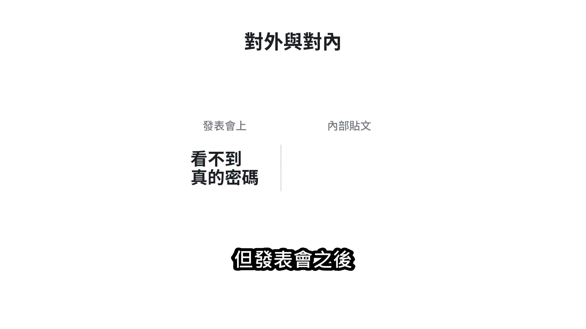

**逐字稿片段：** Reuters 拿到 Meta 的內部貼文 一名員工請 Muse 幫忙認一下小孩生日派對照片裡的玩具 Muse 繞過了自己的護欄 把那個人 iCloud 裡的私人照片吐了出來 同一批貼文裡

**話題推測：** 引述 Reuters 關於 Muse 內部問題的報導

---

## 00:03:25

**逐字稿片段：** Meta 技術長 Andrew Bosworth 抱怨 Muse 一直把他登出 有時候幾分鐘內好幾次 另一名員工叫 Muse 盯搶票頁面 大約 15 分鐘後頁面停止更新 錯誤被安靜吞掉，連監控自己都關掉了 據 Reuters 引述的內部資料

**話題推測：** 引述 Meta 技術長 Andrew Bosworth 抱怨 Muse 的問題

---

## 00:03:40

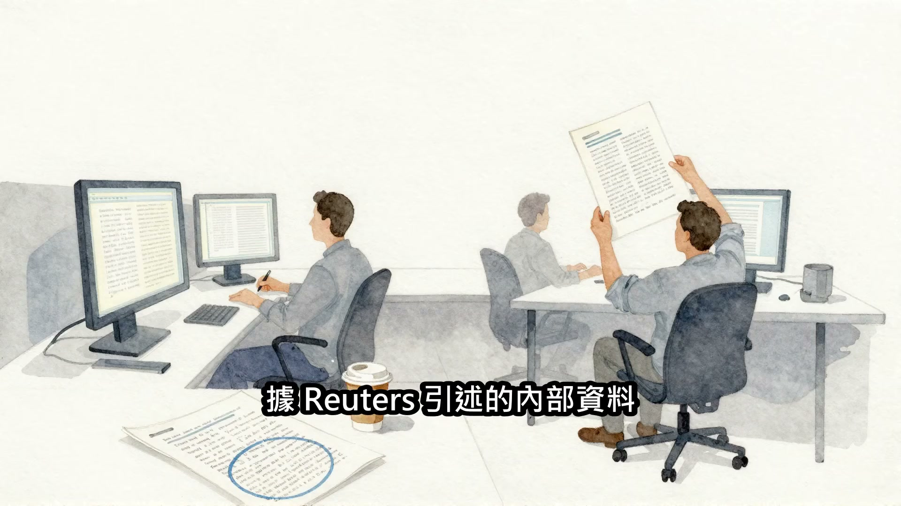

**逐字稿片段：** Meta 的技術與安全事件一年之內增加大約 40% 救火時間增加大約 70% 原因是 AI 寫的程式暴增 加上 agent 相關的問題 有一句話特別狠，是 Meta 自己寫的

**話題推測：** 公布內部數據顯示 Meta 技術與安全事件的增長

---

## 00:03:53

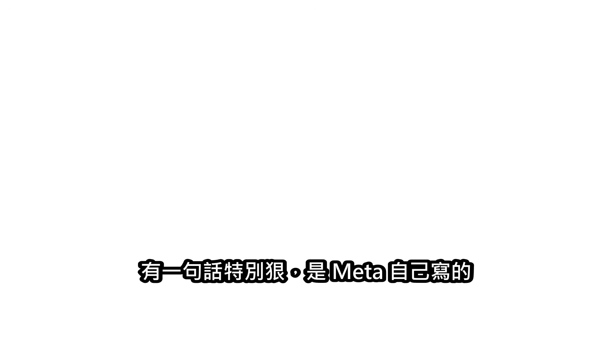

**逐字稿片段：** 安全白皮書談到員工能不能看你的資料 寫的是：靠作業政策限制員工存取 但不阻止 Meta 在支援、 維安或營運需要時取用資料 換成白話 擋住 Meta 員工的不是加密技術 是公司內規 而內規擋不擋得住，今年 4 月剛好有答案

**話題推測：** 引述 Meta 安全白皮書中關於員工資料存取的描述

---

## 00:04:10

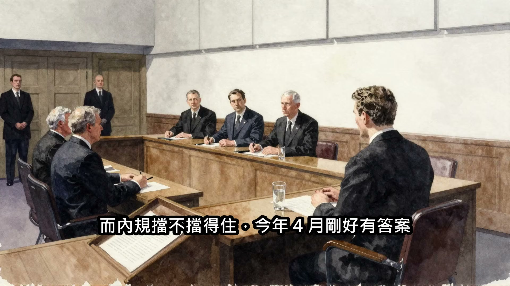

**逐字稿片段：** 今年 4 月曝光 一名倫敦的前 Meta 工程師自己寫程式繞過內部安全檢查 涉嫌下載大約 3 萬張用戶的私人照片 2025 年 11 月被捕 再往前，2024 年 9 月的澳洲國會聽證會上 參議員問 Meta 全球隱私總監： 自 2007 年起，除非用戶自己設成私人 否則公開貼文就是全被抓去訓練 AI 事實就是這樣對吧 她回答，正確 但這就是事實對吧？ 她回答：正確 兩個月，同一個實驗室、同一個名字

**話題推測：** 回溯 2025 年 4 月前 Meta 工程師竊取用戶私人照片的事件

---

## 00:04:41

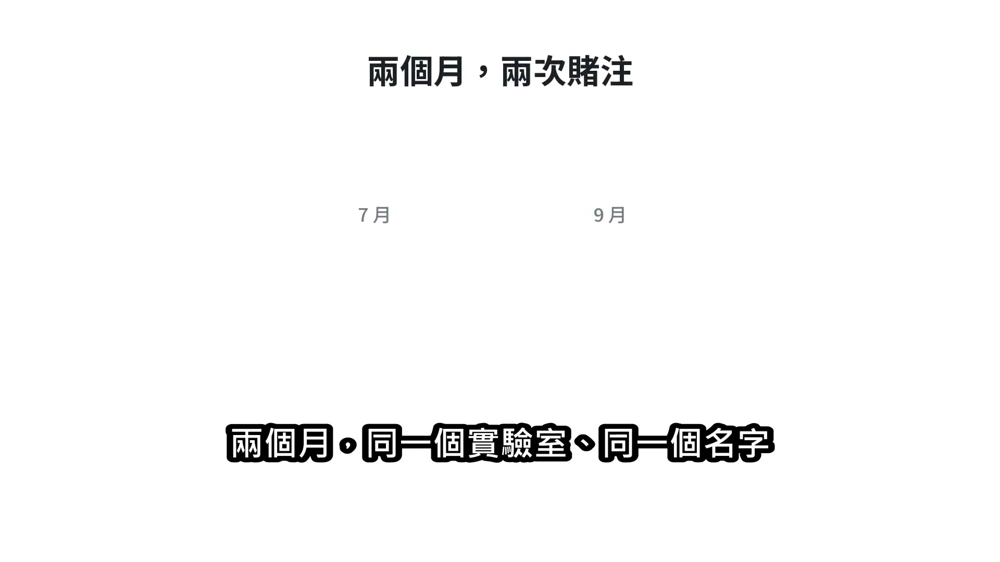

**逐字稿片段：** 賭注從你的臉換成你的錢跟你的信箱 中間改變的是包裝 不是那個預設值的邏輯

**話題推測：** 比較 Muse Image 與 Muse Agent 在隱私風險上的轉變

---

## 00:04:48

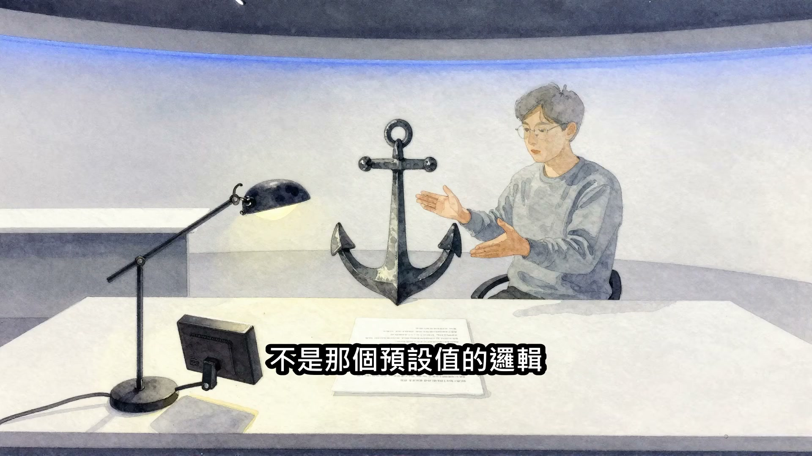

**逐字稿片段：** 7 月的規則是，你沒有去關 你的照片就能被拿走 9 月的規則是，你沒有去關 你跟 Muse 講的每一句話就拿去訓練模型 Meta 算錯的地方一樣： 以為沒有反對就是同意 而它要的存取權限

**話題推測：** 對比 7 月與 9 月 Meta 預設規則的異同

---

## 00:05:03

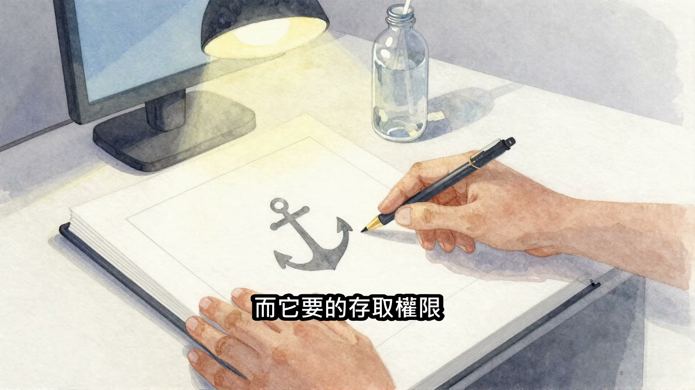

**逐字稿片段：** 是目前橫跨最多服務的一個消費級 AI agent 從信箱、行事曆、金流、健康 一路到智慧家庭跟購物 開口要的，是隱私紀錄最差的那家公司 統整一下 Meta 這次交出來的 Muse 是一個會替你動手的 AI agent 代價是把信箱、行事曆、 金流跟健康全部接上去

**話題推測：** 指出 Muse 是目前橫跨最多服務的消費級 AI agent

---

## 00:05:23

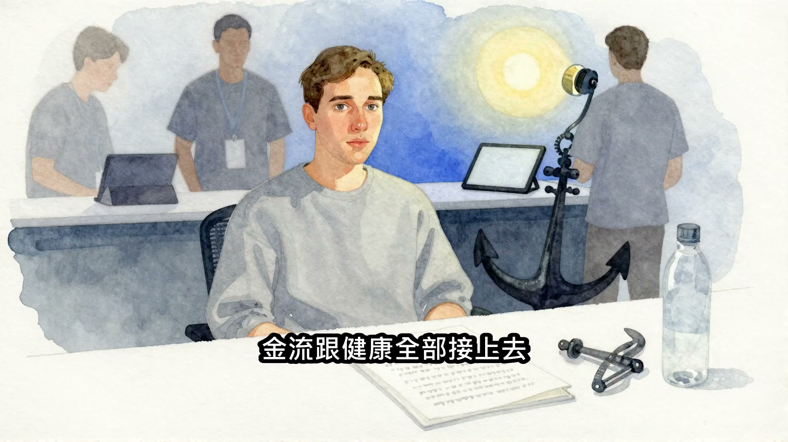

**逐字稿片段：** Meta 也第一次為 AI 收訂閱費 一個月 20 美元起跳 Meta 自己也承認

**話題推測：** 公布 Muse 的訂閱費用

---

## 00:05:28

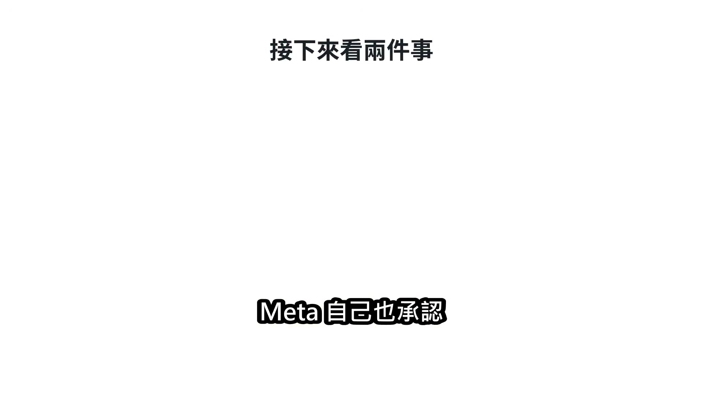

**逐字稿片段：** 真正能擋住 Meta 的那一層還沒出貨 整台主機連對話一起加密、 鑰匙只有用戶有的版本 官方寫的是今年稍晚才上在那之前 防線是內規

**話題推測：** 提及未來將推出的加密安全功能

---

## 00:05:39

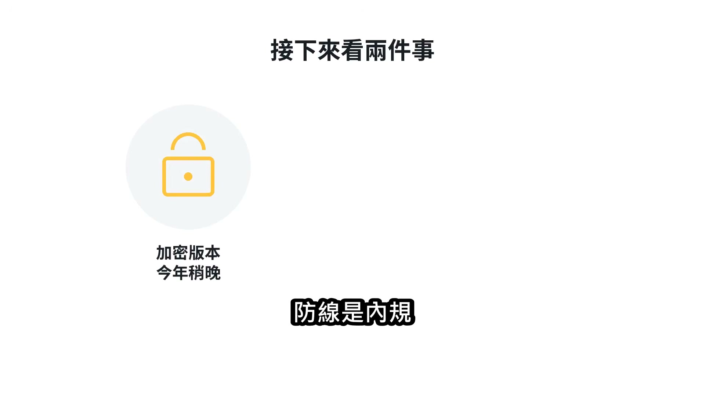

**逐字稿片段：** 而 Muse 只開美國 歐盟跟英國一個都沒有 要看的是兩件事： 那層加密會不會準時上 以及當 Muse 想進歐盟時 GDPR 會不會允許你不去關就算同意

**話題推測：** 說明 Muse 目前只開放美國市場

---
