# ai-note-101_BN-vpcHsQOo — 關鍵畫面索引

- 來源逐字稿：[ai-note-101_BN-vpcHsQOo_GT.srt](ai-note-101_BN-vpcHsQOo_GT.srt)
- 影片：https://www.youtube.com/watch?v=BN-vpcHsQOo
- 截圖數：28

## 00:00:00

**逐字稿片段：** 這裡是 AI 101，全網最幽默的 AI 新聞

**話題推測：** 影片開場或標題畫面

---

## 00:00:04

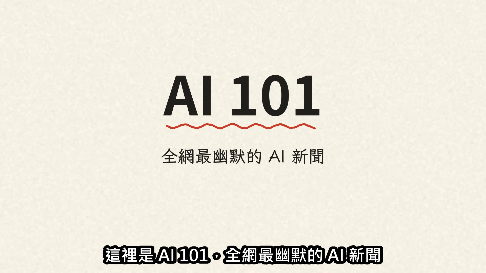

**逐字稿片段：** Crusoe 退掉了 Boom Supersonic

**話題推測：** 新聞標題：Crusoe 退訂 Boom Supersonic

---

## 00:00:06

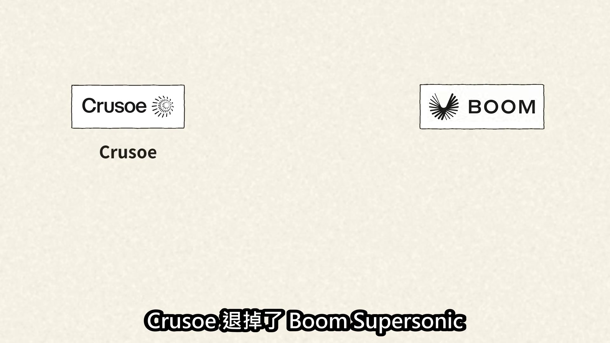

**逐字稿片段：** 超過12.5億美元的大單

**話題推測：** 圖表顯示訂單金額：超過12.5億美元

---

## 00:00:08

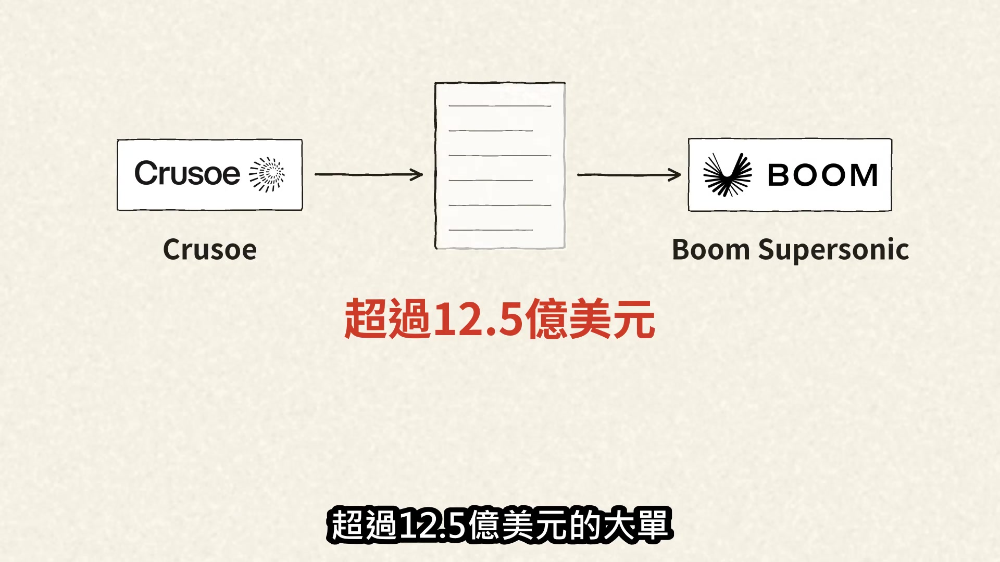

**逐字稿片段：** 一共29台發電渦輪機 Crusoe 可是 Boom 最關鍵的客戶 這筆單為什麼這麼要緊？

**話題推測：** 圖表顯示訂單數量：29台發電渦輪機

---

## 00:00:15

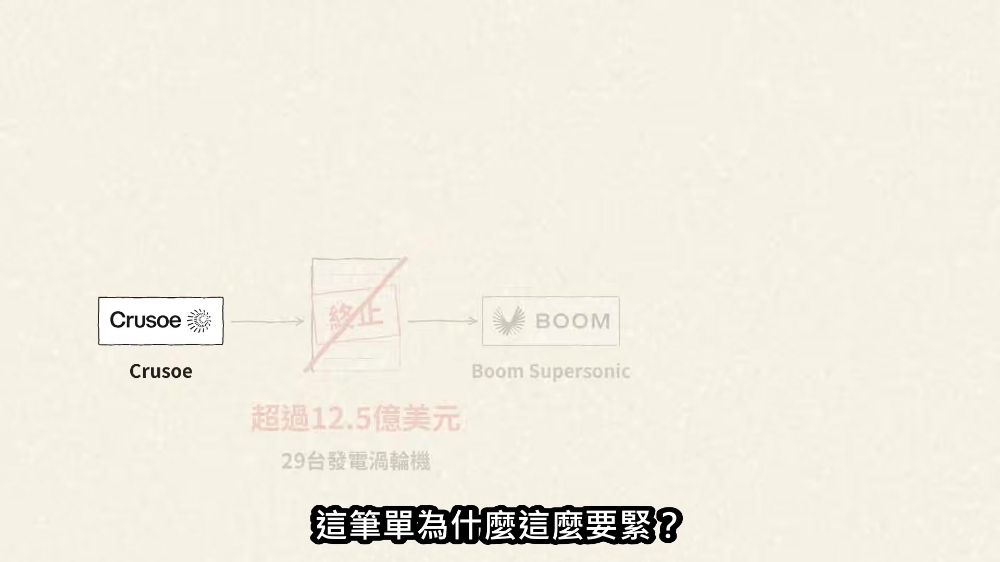

**逐字稿片段：** Boom 的算盤是先賣地上發電機 再用營收和獲利造天上飛機

**話題推測：** 圖表說明 Boom 的商業模式與策略

---

## 00:00:19

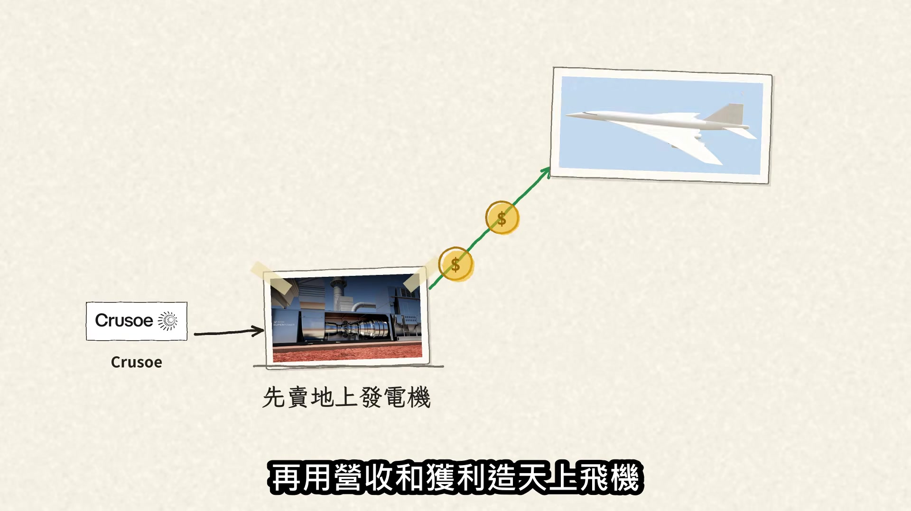

**逐字稿片段：** 也就是 Overture 超音速客機 這筆訂單未來若帶來持續營收與獲利 本來就是要養超音速客機的 回頭看 Boom 的飛機：2025年1月

**話題推測：** Overture 超音速客機的圖片或渲染圖

---

## 00:00:30

**逐字稿片段：** XB-1 驗證機突破音障，最高1.05馬赫 可是 XB-1 用的是3具現成的 GE 引擎 不是自己造的

**話題推測：** XB-1 驗證機突破音障的畫面或資訊圖

---

## 00:00:40

**逐字稿片段：** 那 Boom 自己的引擎呢？ 原本共同研究推進系統的 Rolls-Royce 在2022年退出

**話題推測：** 引導問題：Boom 自己的引擎進度？

---

## 00:00:45

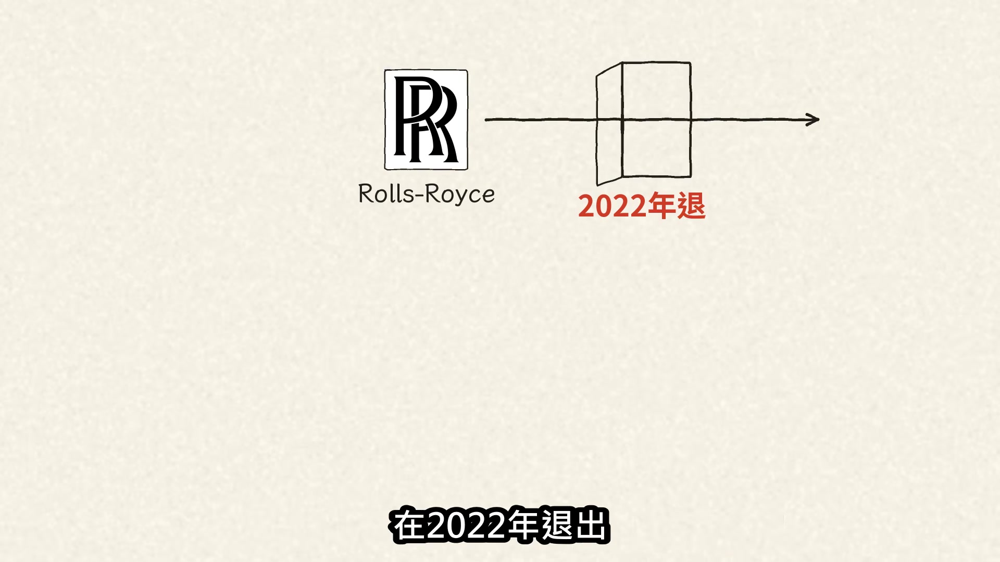

**逐字稿片段：** Boom 後來改為主導開發 Symphony 客機跟引擎兩條線都得繼續推

**話題推測：** Symphony 引擎的渲染圖或設計圖

---

## 00:00:51

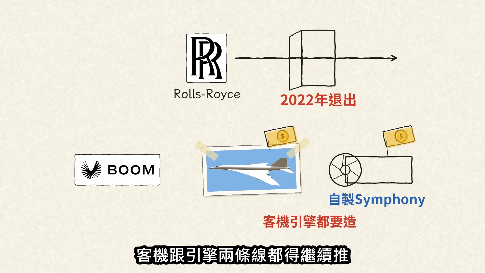

**逐字稿片段：** 兩樣都花大錢，錢從哪來？ 執行長 Blake Scholl 自述

**話題推測：** 引導問題：公司資金來源？

---

## 00:00:56

**逐字稿片段：** 他曾傳訊問早期投資人 Sam Altman 電力是不是 AI 的主要限制 Altman 回答是 既然缺電

**話題推測：** Sam Altman 的照片或對話截圖

---

## 00:01:05

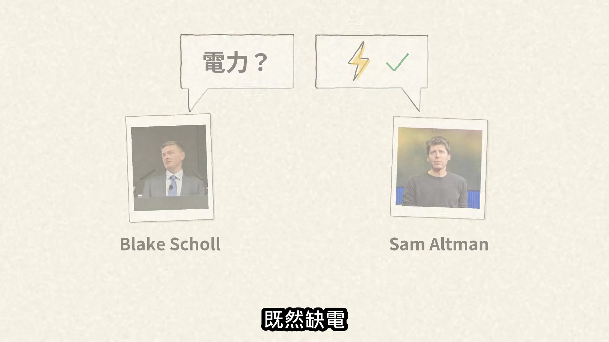

**逐字稿片段：** Boom 就以同一套引擎核心為基礎 做成地面發電用的天然氣渦輪機

**話題推測：** 圖表解釋引擎核心的雙重應用概念

---

## 00:01:09

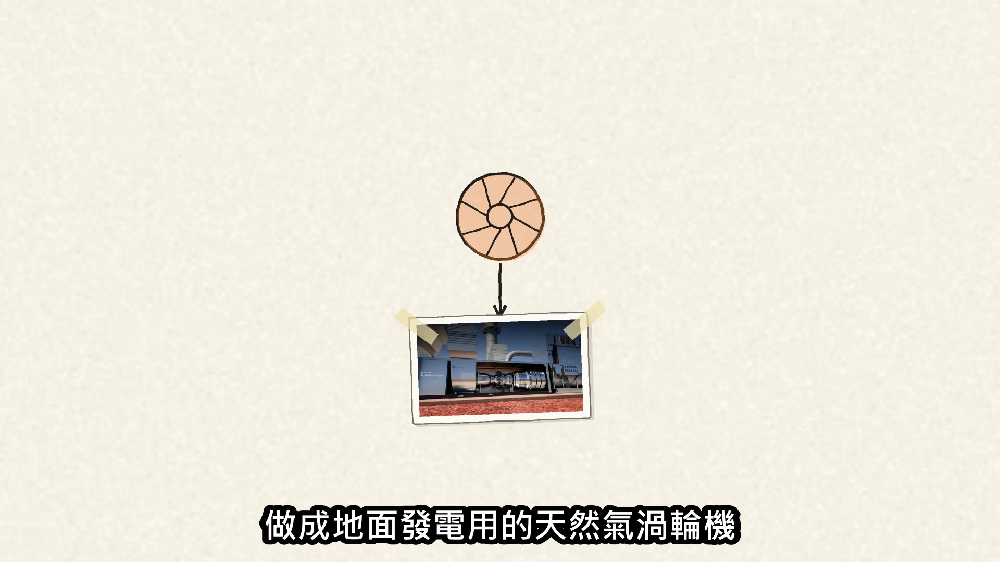

**逐字稿片段：** Superpower

**話題推測：** Superpower 地面發電機的渲染圖

---

## 00:01:10

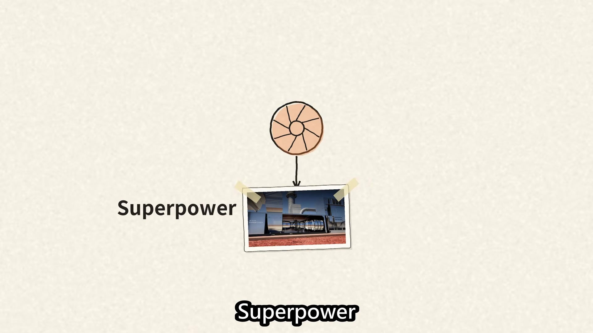

**逐字稿片段：** 單機輸出42 MW 跟 Symphony 約8成硬體共用 賣給 AI 資料中心

**話題推測：** 圖表顯示 Superpower 的功率：42 MW

---

## 00:01:16

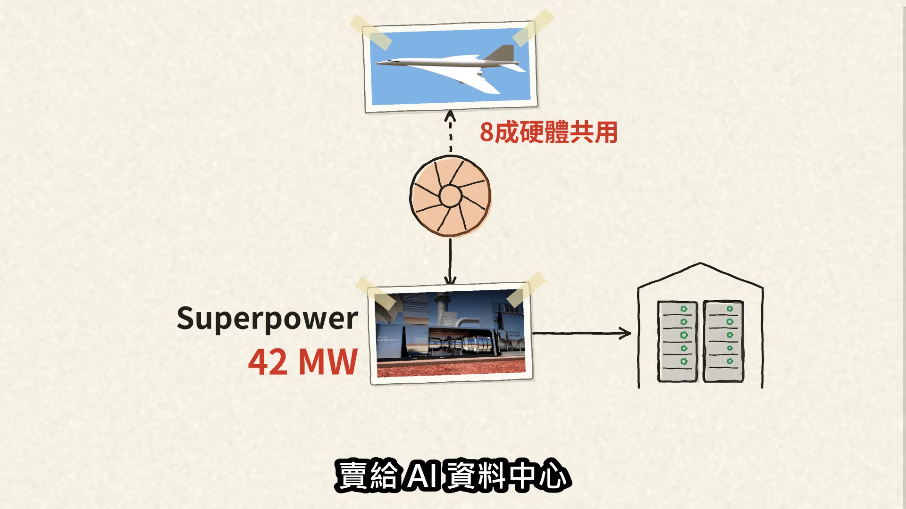

**逐字稿片段：** 時間回到2025年12月 Boom 拿下 Crusoe 這張大單

**話題推測：** 時間軸回到2025年12月，重新審視大單

---

## 00:01:20

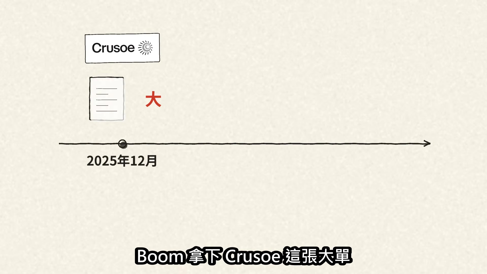

**逐字稿片段：** 2026年2月又先訂了31具發電機 現在大單沒了，這批發電機要去哪 還沒有公開答案

**話題推測：** 圖表顯示2026年2月訂單：31具發電機

---

## 00:01:28

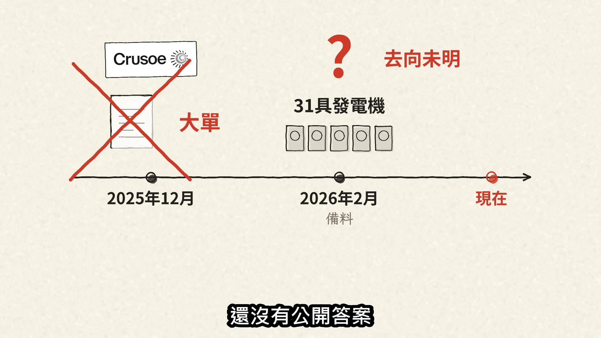

**逐字稿片段：** 話說回來，燃氣發電設備是真的缺

**話題推測：** 燃氣發電設備市場供需圖表

---

## 00:01:32

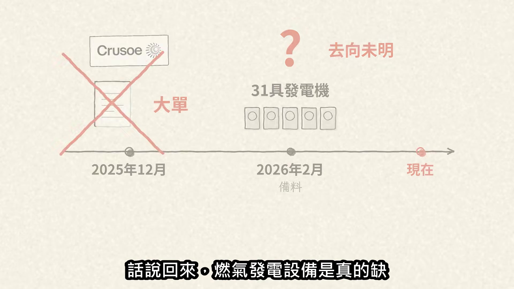

**逐字稿片段：** 大廠 GE Vernova 的訂單和產能預留

**話題推測：** GE Vernova 公司標誌或市場數據

---

## 00:01:34

**逐字稿片段：** 從2025年底的83 GW 漲到2026年第二季的116 GW 且已開始接受2031年交付時段的預留

**話題推測：** 圖表顯示 GE Vernova 產能預留從83 GW增至116 GW

---

## 00:01:43

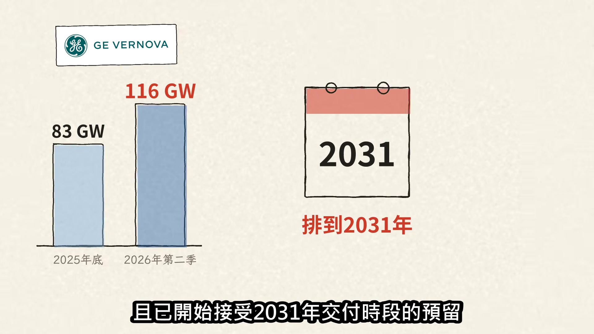

**逐字稿片段：** 可是反差在這：Crusoe 沒放棄渦輪機

**話題推測：** 圖表對比 Crusoe 訂單的矛盾點

---

## 00:01:46

**逐字稿片段：** 早就向 GE Vernova 訂了接近1 GW 它不是不懂天然氣發電 也不是突然不要電，偏偏退了 Boom 那會不會是 Crusoe 缺錢？ 9月17日 Crusoe 才宣布 F 輪完成初次交割

**話題推測：** 圖表顯示 Crusoe 向 GE Vernova 訂購的近1 GW發電設備

---

## 00:02:00

**逐字稿片段：** 整輪預計規模39億美元8天後 Scholl 就在 X 上宣布雙方不再合作推出 Superpower 不缺錢，那為什麼退？ 雙方各說各話

**話題推測：** 圖表顯示融資規模：39億美元

---

## 00:02:11

**逐字稿片段：** TechCrunch 報導 Scholl 貼文裡原本寫的原因被刪了 Crusoe 發言人則向 TechCrunch 表示 能源計畫沒變，仍會用渦輪機 只是不是 Boom 的 真正原因都沒公開 比起分手原因，工程進度更敏感

**話題推測：** TechCrunch 媒體標誌或新聞報導截圖

---

## 00:02:26

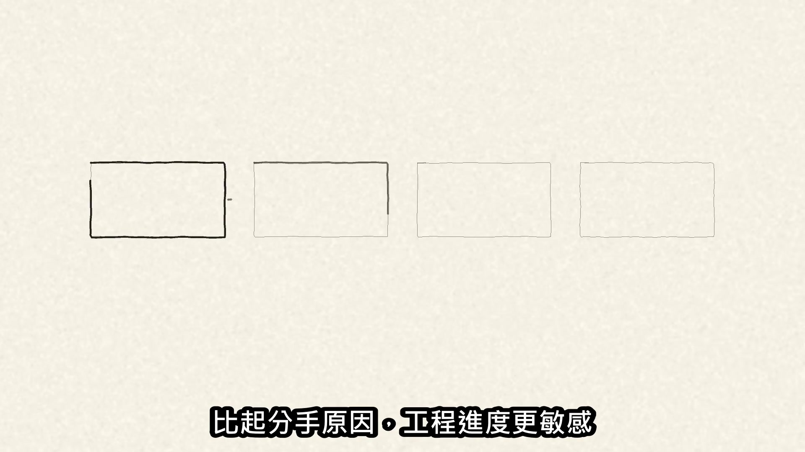

**逐字稿片段：** 9月初發布的工廠參訪影片顯示 首顆引擎核心還在最後組裝後面要點火、 連接發電機、跑滿載耐久測試 離整機測試還有一段路 組裝都還沒完成

**話題推測：** 工廠參訪影片的截圖或片段

---

## 00:02:39

**逐字稿片段：** Boom 仍然喊出2027年交付約250 MW

**話題推測：** 圖表顯示 Boom 的交付目標：2027年250 MW

---

## 00:02:43

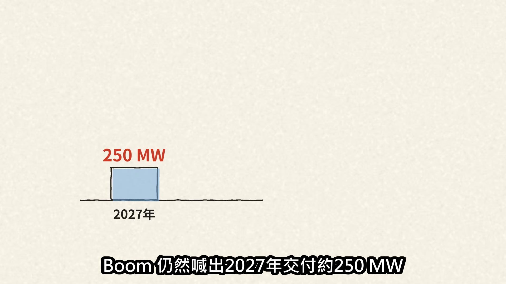

**逐字稿片段：** 2028年拉到1 GW 可是新客戶是誰，Boom 一個都沒公布 所以下一關就是點火：

**話題推測：** 圖表顯示 Boom 的交付目標：2028年1 GW

---

## 00:02:51

**逐字稿片段：** 首顆核心能不能在2026年底前完成首次運轉測試

**話題推測：** 圖表顯示2026年底前完成首次運轉測試的里程碑

---

## 00:02:55

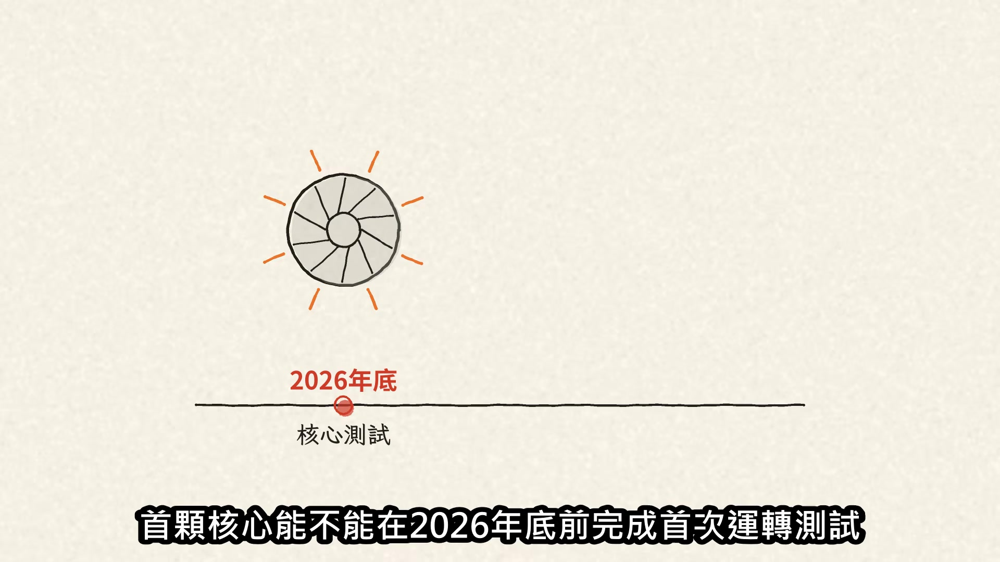

**逐字稿片段：** 2027年底能不能交出第一批 Superpower 兩項事業押同一顆核心，成功一起開路 延後一起賠掉信用

**話題推測：** 圖表顯示2027年底前交付第一批 Superpower 的里程碑

---
