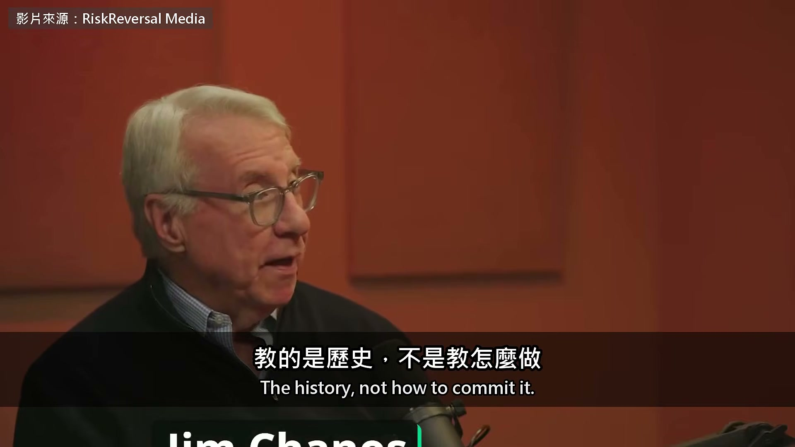
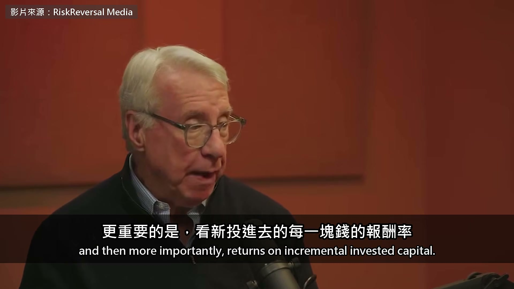
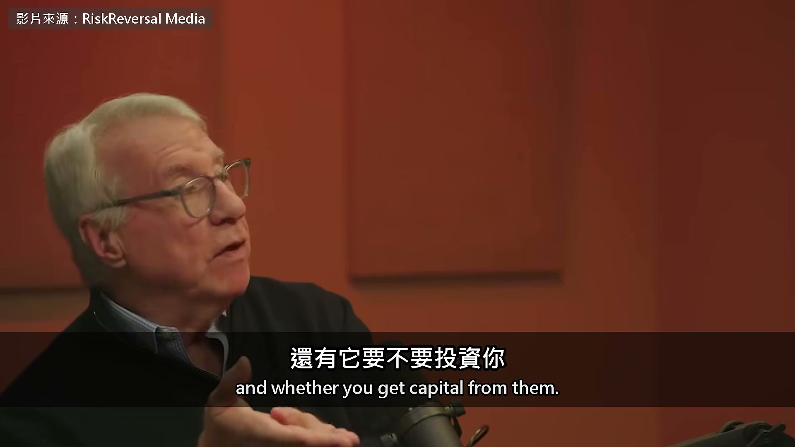
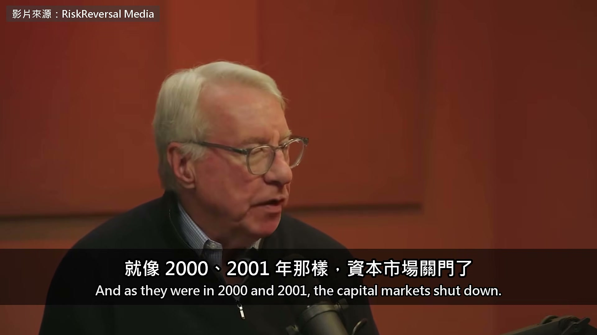
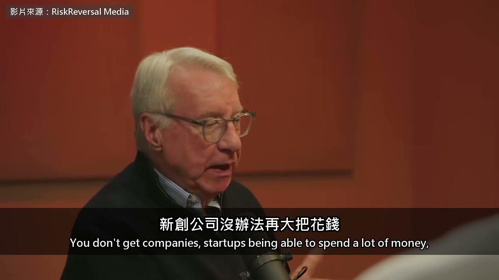

# ai-note-101_E8jgXsBknrs — 關鍵畫面索引

- 來源逐字稿：[ai-note-101_E8jgXsBknrs_GT.srt](ai-note-101_E8jgXsBknrs_GT.srt)
- 影片：https://www.youtube.com/watch?v=E8jgXsBknrs
- 截圖數：28

## 00:00:16

**逐字稿片段：** This episode of the RiskReversal podcast went live on September 25. It was hosted by Dan Nathan. Jim, you were also a professor, okay, at Yale University and at University of Wisconsin. You teach a class on financial fraud at both universities. Thanks for being back here, man. The history, not how to commit it.

**話題推測：** 介紹本集播客及播出日期

---

## 00:00:34

**逐字稿片段：** The other guest at the table was Gary Marcus, a cognitive scientist and professor emeritus at New York University.

**話題推測：** 介紹另一位嘉賓 Gary Marcus

---

## 00:00:39

**逐字稿片段：** In 2023, he testified alongside Altman before the U.S. Senate. For years, he has argued that large language models will not lead to AGI. In this episode, the two of them look at AI from a financial perspective. What kind of business are data centers, and who is funding them? What happens when the money stops? Chanos is bearish on data centers, but that view did not begin with AI.

**話題推測：** 提及 Gary Marcus 在參議院作證

---

## 00:00:55

**逐字稿片段：** Back in 2022, he started shorting traditional data center real estate investment trusts. His reasoning was simple. Their pretax returns on capital were only in the single digits. The equipment kept breaking and constantly needed replacing. At heart, it was a capital-intensive landlord business. Once AI took off, he said the picture became even clearer. As AI got going, it became very clear very rapidly that away from the world of the models, where the real money was going to be spent was physically in the infrastructure and hosting the models. And I knew immediately, and we've seen strong evidence, that that is going to really be a commodity business at the end of the day. I can't opine on what the models derive. And I would defer to your other guest, who knows that better than anyone. But I can analyze a real estate deal. And that's where I think people are really jumping off the cliffs right now, because they're assuming spot pricing is long-term pricing. They're assuming all kinds of things.

**話題推測：** 提及 Chanos 在 2022 年做空傳統資料中心 REITs

---

## 00:01:54

**逐字稿片段：** And what they don't realize is that the AI data center business is primarily an equipment leasing business. I'm buying chips from Nvidia and I'm renting them to you. And that's a financial construct. Traditional data centers are landlords.

**話題推測：** 解釋 AI 資料中心業務本質為設備租賃

---

## 00:02:10

**逐字稿片段：** So what about Microsoft, Google, Amazon, and the other cloud giants that build their own data centers for their own use? The host asked him when he started digging into that side of the business. We started focusing on the AI buildout, as opposed to legacy data center business, late '25. So last year, because the numbers were beginning to accelerate so dramatically.

**話題推測：** 提及微軟、Google、亞馬遜等雲端巨頭

---

## 00:02:31

**逐字稿片段：** We started work on the hyperscalers and looking at returns, and then more importantly, returns on incremental invested capital.

**話題推測：** 討論超大規模數據中心 (hyperscalers) 的回報率

---

## 00:02:37

**逐字稿片段：** And those peaked in 2024 and have been declining ever since. And at a rapid rate, by the way. If it continues at the current curve of decline, the hyperscalers, who are the best positioned to invest in these various initiatives, will have returns below their weighted average cost of capital sometime in mid '27, which I don't think the market is prepared for. To be clear, he is not saying this to promote a short position. He holds the broader market long as a hedge and shorts individual companies. On the AI trade, he is actually net long. What he cannot stomach is where the money is going. He says this cycle is now in its fourth year. Huge sums are starting to flow to fraudsters and hype merchants. When the host asked who he meant, he declined to name names. He simply said to look at one particular group. Well, I just say, just as a group, take a look at the guys who told you, and raised billions of dollars,

**話題推測：** 說明資本回報率在 2024 年達到高峰後下降

---

## 00:03:27

**逐字稿片段：** told you that raising money to buy servers to mine Bitcoin was going to be the next big thing. And now they've all transitioned seamlessly into becoming AI data center companies. The money is borrowed.

**話題推測：** 討論從比特幣挖礦轉型為 AI 資料中心的公司

---

## 00:03:44

**逐字稿片段：** He says the bond market has already started tightening in recent months. The cost of lending to data centers is rising. Outside the cloud giants, almost every company is losing money on a true economic basis. Yet Wall Street keeps raising its estimates.

**話題推測：** 提到債券市場已開始收緊

---

## 00:03:56

**逐字稿片段：** And yet Goldman Sachs today raised their estimate of total spending on data centers by 50 gigawatts, which is two and a half to three trillion dollars over the next five years. That was just the increase.

**話題推測：** 提及高盛對資料中心總支出的上調估計（50 GW）

---

## 00:04:13

**逐字稿片段：** So they're saying over the next five years the total spend will be 10 to 12 trillion,

**話題推測：** 預估未來五年總支出將達 10-12 兆美元

---

## 00:04:20

**逐字稿片段：** which is about 6% of GDP, which is, depending on how you want to define it, 1x to 2x the US personal savings rate. So just the personal savings rate is going to go into AI data centers for the next five years, according to the Street, before we get to funding the government deficit, everything else that the economy needs. So you're starting to get really silly numbers.

**話題推測：** 將總支出與 GDP 進行比較 (6%)

---

## 00:04:45

**逐字稿片段：** At the other end of the money flow are the model companies. Marcus has been writing about this since August 2023. Every lab is building the same kind of thing. There is no technical moat.

**話題推測：** 將焦點轉向 AI 模型公司

---

## 00:04:54

**逐字稿片段：** The only possible outcome is a price war. The host asked him whether launching a new model every week still means anything. I mean, this is part of the insanity of it all, is that nobody has a lasting lead here, nor will they.

**話題推測：** 提出 AI 模型公司之間可能發生價格戰

---

## 00:05:07

**逐字稿片段：** And now China is in the ring. So, like you just alluded to, Google has a new model coming out. Maybe it'll be a little bit better, but nobody keeps a lead for more than two weeks. That's why we have this commodity structure. It's great for consumers because the models get better, and it's great for consumers because they have to compete on price, because nobody can really say, my model is substantively better. And there's no frictional costs, right? I mean, to... To change, there's a little bit, but less and less,

**話題推測：** 提及中國也加入 AI 競爭

---

## 00:05:34

**逐字稿片段：** and things like OpenRouter are designed to reduce that friction. And so, yeah, there's basically no friction at this point, or converging on no friction. We're basically converging where it's not clear there's going to be any profit for the model providers at all. The model companies make no profit, and data centers are a leasing business. So who is making money? The host pointed out that Nvidia has a market value of $5.5 trillion, but its stock price is where it was 6 months ago. Nvidia's customers are the same cloud giants and data center companies we just mentioned. Chanos turned the question back on the host. Dan, let me pose this to you. Why should any company that is reliant upon Nvidia trade at a super premium to Nvidia? Agreed. I mean, we've talked about this for a while. This trades below a market multiple. Nvidia is a relatively cheap stock. Yeah, it's going to grow 75, 100% in the coming year. It's got free cash flow that, of course, it reinvests with everybody else, and we can get into that. But I just keep posing the question to the data center bulls and other people that are wholly dependent upon this relatively, you know, monopoly player in the space. Why would you trade at a premium to that player when they can dictate whether you get chips, when you get chips, in what order you get chips, and whether you get capital from them.

**話題推測：** 提及 OpenRouter 降低切換模型成本

---

## 00:06:50

**逐字稿片段：** So, I mean, it just literally, they are the nexus in a way that Cisco and Intel were not in the dot-com era. They control the chessboard.

**話題推測：** 將 NVIDIA 的地位與網路泡沫時期的 Cisco 和 Intel 進行比較

---

## 00:07:02

**逐字稿片段：** The host asked whether Nvidia's software platform, CUDA, still gives it a moat. Marcus said it is the closest thing to a moat in this industry. But he added one caveat. Jensen is a great CEO. They have a lot of things going for them, but the thing that they don't have going for them is their customers are the people that we were just talking about, right? If their customers don't make money using their stuff in the long run, then even if they have the best chips in the world, the customers are going to stop buying them. That's my point. That's to my point. I want to be short their customers and long Nvidia. So how will this boom end? The host asked him where the tipping point would be.

**話題推測：** 探討 NVIDIA 的 CUDA 軟體平台是否為護城河

---

## 00:07:40

**逐字稿片段：** His answer was a mechanism called reflexivity. When stock prices rise, companies can borrow money to build more. When they can no longer borrow, the demand disappears with it. He used Cisco in 2000 as an example. I think the financial markets themselves. Like I said earlier on, there's a reflexivity function here. The capital markets themselves will be the problem. And as they were in 2000 and 2001, the capital markets shut down.

**話題推測：** 解釋市場結束的「反射性」機制

---

## 00:08:06

**逐字稿片段：** Cisco was down 60... 40, excuse me, 40%, from March of 2000 to December of 2000. John Chambers said in early 2001

**話題推測：** 提及 Cisco 在 2000 年的股價跌幅

---

## 00:08:22

**逐字稿片段：** that his order book went from 70% growth in December of 2000 to minus 30 in January of 2001. That's how fast the ordering evaporated. Literally, people were double and triple ordering.

**話題推測：** 引用 Cisco 訂單量從增長 70% 轉為下降 30% 的案例

---

## 00:08:37

**逐字稿片段：** He also pointed to an accounting wrinkle. For every dollar you pay Nvidia, Nvidia records a dollar of revenue that same quarter, along with 75 cents in profit. But on your books, that cost is spread over 5 to 10 years. More troublingly, the dollar used to pay for it

**話題推測：** 提出關於會計處理的盲點

---

## 00:08:49

**逐字稿片段：** often comes from money that venture capital firms have just raised, not from operating profits. When the market shuts down, that dollar disappears immediately, but the costs keep running.

**話題推測：** 指出資金來源常來自創投而非營運利潤

---

## 00:08:57

**逐字稿片段：** And so S&P earnings dropped 40% from mid-2000 to mid-2001. I think I've talked to you about this. And people forget just how much, how fast everything collapsed, as every single enterprise cut back and said, we don't need 10,000 routers, we need 1,500. We don't need 10,000 switches, we need 2,000. Just, you know, maybe down the road we'll take all 10,000, but over the next few years we only need a couple thousand a year. That happened throughout the entire tech economy in the space of basically four quarters. And to think that it can't happen in this boom, which is much, much bigger and has accelerated much, much faster, you have to be kidding yourself. There is very big risk of financing in this market that will make all of this reflexive, and will look like a crash where long-term secular demand could still be growing.

**話題推測：** 提及 S&P 盈利在 2000-2001 年間的跌幅

---

## 00:10:01

**逐字稿片段：** Toward the end of the show, they discussed regulation. The host asked how government regulation of AI would affect his view. He said the government was already one of the forces driving this boom. Regulation would raise the cost of capital, and that is exactly what he has been watching. This is a capital-intensive boom. So anything that is going to raise the cost of capital, we've already started to see it, we talked about it at the beginning of the pod, has the chance to be a tipping point, at which point then capital dries up in the VC world. You don't get companies, startups being able to spend a lot of money,

**話題推測：** 討論政府對 AI 的監管

---

## 00:10:34

**逐字稿片段：** and you get a nuclear winter for a couple of years. His nuclear winter. No, not my... really. No, I mean an '01, '02 type situation, where the technology continues to move ahead, but investors lose a lot of money. He is not saying that AI is fake. The technology may keep moving forward. His bet is about the money. When the numbers stop adding up, investors are the first to get crushed. The original video runs for an hour and a half.

**話題推測：** 預測市場可能進入「核冬天」時期

---

## 00:10:58

**逐字稿片段：** They also compared U.S. GDP in the 10 years before and after Netscape went public. Chanos concluded that the internet did not change the macroeconomic numbers. Marcus also shared the inside story of testifying alongside Altman before the Senate in 2023. The link is in the description if you want to hear more.

**話題推測：** 比較 Netscape 上市前後美國 GDP 的變化

---
