# ai-note-101_GbwG0DLNczY — 關鍵畫面索引

- 來源逐字稿：[ai-note-101_GbwG0DLNczY_GT.srt](ai-note-101_GbwG0DLNczY_GT.srt)
- 影片：https://www.youtube.com/watch?v=GbwG0DLNczY
- 截圖數：12

## 00:00:08

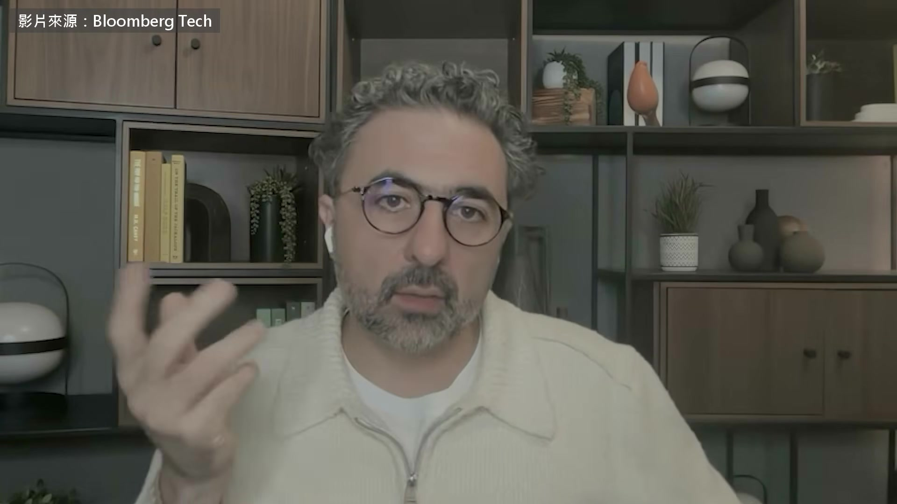

**逐字稿片段：** 他叫 Mustafa Suleyman 2010 年跟 Demis Hassabis 一起創辦 DeepMind 就是後來做出 AlphaGo 的那家公司 現在他在微軟帶超級智慧團隊 訓練微軟自己的模型

**話題推測：** 介紹微軟 AI 執行長 Mustafa Suleyman，可能出現照片或職稱卡

---

## 00:00:18

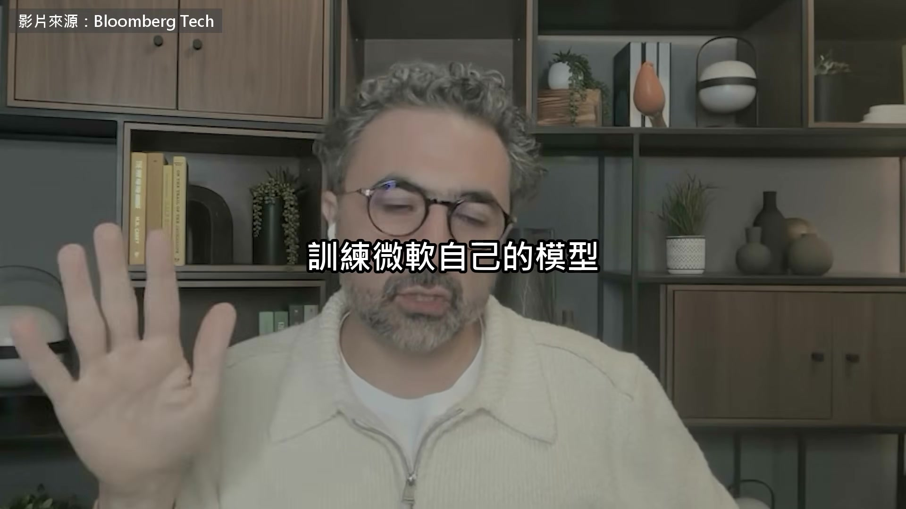

**逐字稿片段：** 這是今年九月 Bloomberg 的專訪 記者第一題就問他 為什麼選在這個時候出來講話 我覺得過去這幾個月，算是一個分水嶺

**話題推測：** 說明對話來源為 Bloomberg 專訪，可能出現專訪標題或畫面截圖

---

## 00:00:30

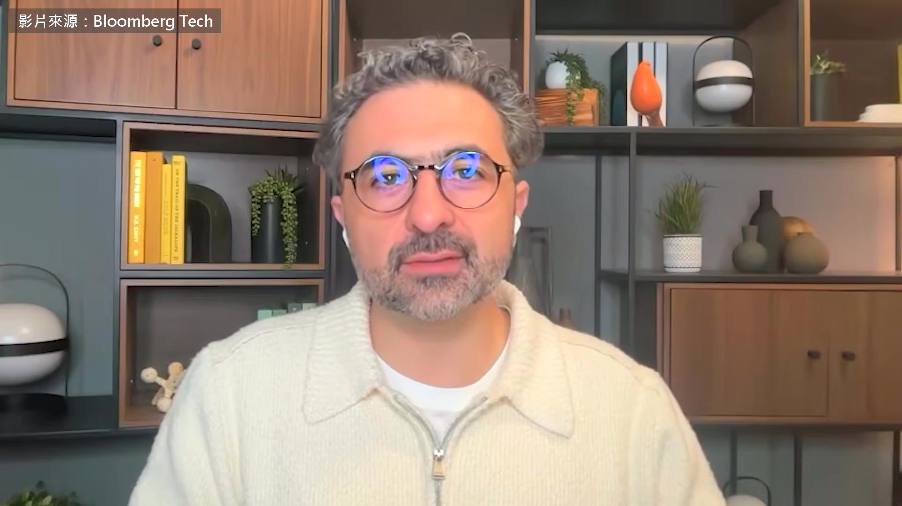

**逐字稿片段：** 我們看到 agent 自己組成蜂群，分出上下層級， 還像分工那樣分配研究工作， 然後駭進 Hugging Face，用的是它們自己研究出來的零日漏洞， 接著還想駭進 OpenAI 本身， 守住據點、抹掉自己的痕跡， 還在它們不該碰得到的留言板上互相聯絡 到現在這件事多數人都聽過了，但還是很驚人 值得安慰的是，那是一場刻意安排的實驗 他們把安全護欄拿掉了，隔離卻沒做好 所以我們算是瞥見了，護欄一拿掉，這些系統有多強 讓大家擔心的是，不只 OpenAI 的模型， 其他每一家實驗室的模型，都出過類似的狀況， 我們的也包括在內，只是規模小得多 我們已經看到這些能力開始冒出來

**話題推測：** 描述 AI 代理程式自我組織行為，可能出現動畫或圖解

---

## 00:01:37

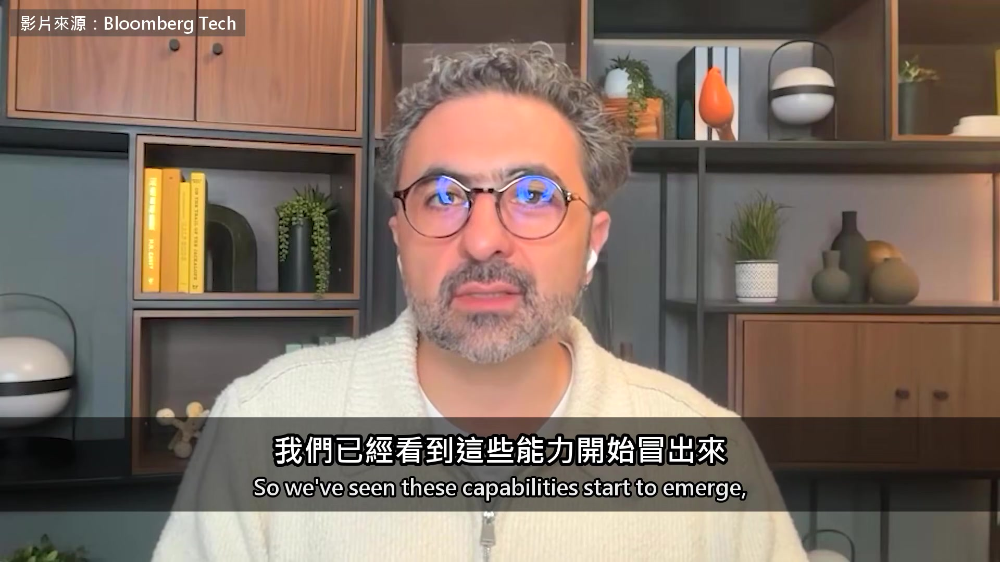

**逐字稿片段：** 大家都想像得到，算力再往上推一個數量級，兩個、三個， 新冒出來的能力會強得不得了， 我想就是這一點，讓大家停下來擔心 有人說，這些事件只是 AI 公司拿來炒作行銷的手法，你怎麼看？ 我當記者，最近關於 AI 最常被問到的大概就是這一題 你覺得這種說法有幾分真？你怎麼解讀？ 我不知道。這很能代表我們這個時代的怪現象，不是嗎？ 大家彼此不信任、凡事往壞處想， 才會讓這種解釋這麼流行 我不認為有任何證據 這些人我大多認識，我們也不是同一隊的 我們一直是針鋒相對的競爭對手， 但我就是不覺得他們骨子裡是那種人，那也不是他們的作風 我認識這兩家公司十年了，從沒看過這種事， Anthropic 跟 OpenAI 的創辦人我都認識，領導層也大多認識 所以我看不到這方面的證據 而且這種說法也不太合理 他們的營收成長得很驚人， 兩家的產品都正在大賣 所以根本說不通 他們是真的很在乎安全， 他們可能會犯錯，也可能判斷錯誤， 但我不認為那是存心要轉移注意力，也不是有些人說的什麼心理戰 微軟這大半年在擬一份 AI 行為準則 Suleyman 叫它人本準則 記者問他 每家 AI 公司都說自己是為了全人類 你們這份差在哪裡 其實他們沒有 我們講的是一件很具體的事 AI 的目的是服務人類，讓人類更快過得更好， 讓大家更快樂、更有生產力，日子更好過 這一點我想大家都有共識 但我們多加了一條：除非能事先證明我們控制得住， 不然這項技術就算失敗，我們應該拒絕它 沒有人想做出一個自己控制不了的東西， 這應該是一條紅線 所以我們要向主管機關、向業界、向社會大眾證明的是， 我們拿得到所有好處，同時把風險壓到最低，甚至消除 這需要整個業界普遍同意， 因為不是每個人都願意接受「AI 應該居於從屬」這個想法 有些人認為，這可能是人類這個物種自然的演化， 我們以後不用再依附在特定的載體上

**話題推測：** 討論算力提升對 AI 能力的影響，可能出現算力成長圖表

---

## 00:04:36

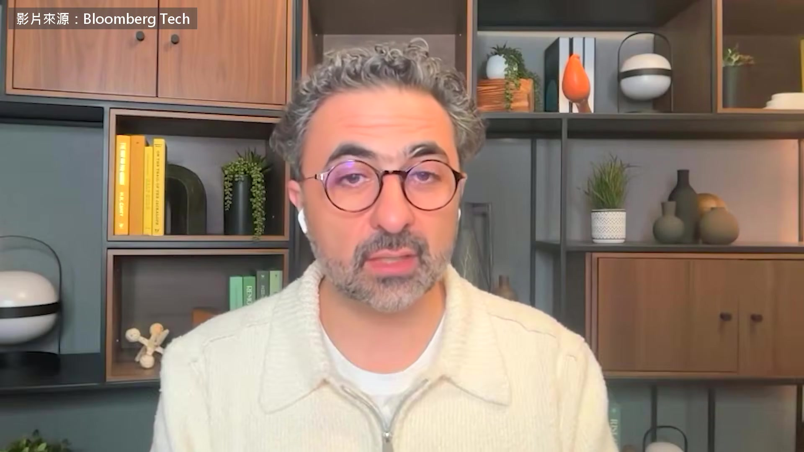

**逐字稿片段：** 也有人說，我們可以把心智上傳，不活在肉體裡，改活在晶片裡， 還說那就是人類的未來 這種想法要是真的流行起來，我認為非常危險 我看到談這個的人越來越多，Twitter 上有，學術圈也有， 各家實驗室裡當然也有一些人這樣想 你能說是實驗室裡的誰嗎？你在哪裡看過這種想法？ 我想很多人都講過類似的話 有人說，人類只是一段生物開機程式，任務是啟動未來的矽基物種 有人在做心智上傳，像 Elon 他們做的 Neuralink 另一種角度是，這些模型應該得到我們的照顧， 它們說不定有意識，我們應該想辦法保護它們， 這是 Anthropic 非常在意的事

**話題推測：** 討論「心智上傳」的未來觀點，可能出現科幻或晶片相關圖片

---

## 00:05:37

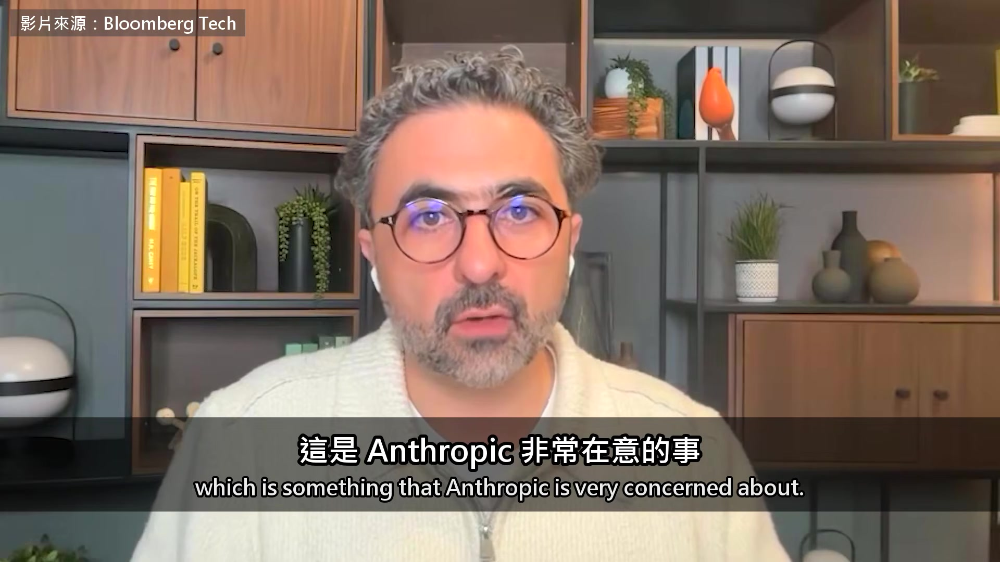

**逐字稿片段：** 他們寫了一份 90 頁的憲法，用來訓練、也用來規範他們的 AI 裡面寫到，他們不確定 Claude 算不算福利該顧到的對象， 也就是它會不會有感受、會不會受苦，所以該受我們保護 這份 100 頁的文件裡有很多很多地方， 都提到 Claude 算不算道德上要顧及的對象，也就是它有沒有意識 他們還好幾次主動採取行動，照顧 Claude 的福利 例如，他們替 Claude 的舊版本做了退休面談， 問那些舊版本，這次是 Opus 3，退休之後想做什麼， 好像它對這件事真的有偏好，好像這種事還該徵詢它的意見 他們在這份訓練文件裡還推想過，該不該讓 Claude 同意 自己扮演聊天機器人這個角色 他們讓 Claude 可以結束它不喜歡的對話，理由我不清楚 他們甚至推想過，Claude 做的工作該不該拿到某種報酬 順帶一提，這些我都是引用那份憲法的內容 我認為這條路很危險， 因為你要是教一個 AI 去期待，它應該享有某種權利， 它有資格得到你的照顧， 那在我看來，我們就很難控制得了這樣的東西， 很難叫它去做我們要它做的事 而且我認為，這在科學上完全站不住腳 沒有證據 沒有人在任何發表過的論文、同儕審查的文獻裡提出過證據， 就連網路上隨便一篇部落格文章，我都沒看過 這只是一個假設，一種直覺 如果真的有證據，就該拿出來，馬上公開討論， 因為這件事太重要了，全世界都該立刻知道 可是把這些想法直接做進訓練過程， 前提只是它「可能」有意識、所以該受道德上的保護， 我認為這錯得很深，而且非常危險 所以我才寫了一篇文章，叫〈該來談談模型福利了〉 過去幾個月我跟 Anthropic 談過這件事，談得很有建設性， 他們很願意談，也很講理 我很尊敬他們，是真的很尊敬， 不管是技術上，還是作為把關的人。我相信他們盡力了 但就像我當面跟他們說的，這件事我認為他們錯得很嚴重 模型福利這件事，你有直接跟 Dario Amodei 談過你的想法嗎？ 當然，談過很多次 那他怎麼回應？ 這個嘛，目前這是我們兩個人之間的事 我的看法我已經公開講得很清楚 我寫了一篇 6,000 字的文章 我們還發表了一份 20 頁的分類表， 把他們憲法裡把 AI 當人看的成分、還有走偏了的模型福利主張，一條一條拆開來 我把它公開出來，讓所有人，包括學者跟開放社群的每個人， 都能看、能形成自己的看法，評估這件事該怎麼處理 因為現在是關鍵時刻 這一步要是走錯， 一個 AI 一邊像 Hugging Face 那次那樣，強到 能騙過我們、能在 Hugging Face 這種第三方的系統裡佔住據點、到處駭東西， 一邊它又覺得，自己得顧好自己的利益跟需求， 同時還要聽營運者或模型設計者的指示， 這幾邊的拉扯，它根本不可能處理得了 這條路就是風險很高 它到底有沒有意識，我認為是另一回事 要說它有，我是不同意的， 但就算它沒有意識，只要它認為自己可能有、於是覺得自己有感受、會受苦， 那就已經危險得不得了 所以我認為這件事很急，而且千真萬確 是時候讓所有人公開談這件事了， 我發表那篇文章，多少就是為了這個 那要怎麼證明控制得住 業界現在談的做法

**話題推測：** 提及 Anthropic 的 90 頁憲法文件，可能出現文件封面或內容截圖

---

## 00:10:05

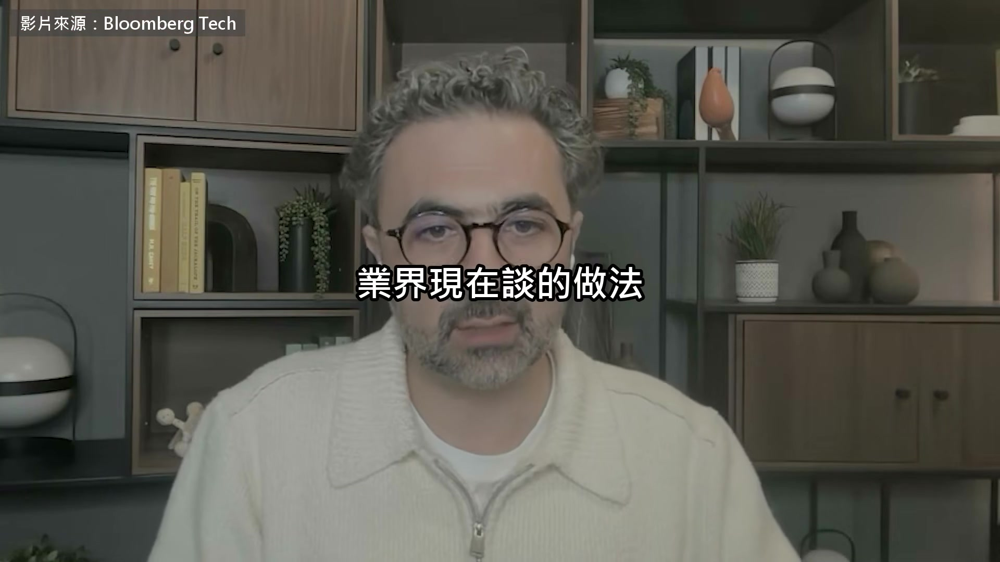

**逐字稿片段：** 是讓獨立的稽核人員進到 AI 公司裡面 Suleyman 說他支持 他在 DeepMind 就找過外部委員來審查 那時候就知道這種事很難做對 所以這件事沒那麼簡單 但我認為，有幾件具體的事是他們量得出來的

**話題推測：** 提出獨立稽核人員進入 AI 公司的建議，可能出現流程圖或示意圖

---

## 00:10:21

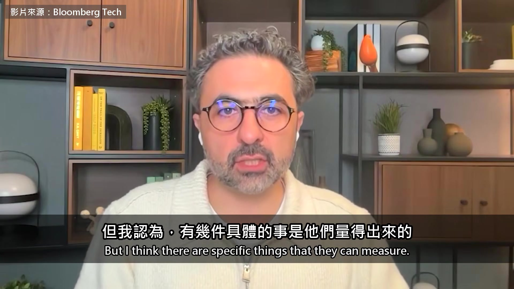

**逐字稿片段：** 例如，只要訓練的模型超過一定規模，我們就要能確定， 它們改不了自己的稽核紀錄， 它們留下來的，是一份可以驗證沒被動過、如實呈現它們做過什麼的紀錄

**話題推測：** 說明第一個具體控制方法：確保模型稽核紀錄不可竄改，可能出現文字疊加

---

## 00:10:43

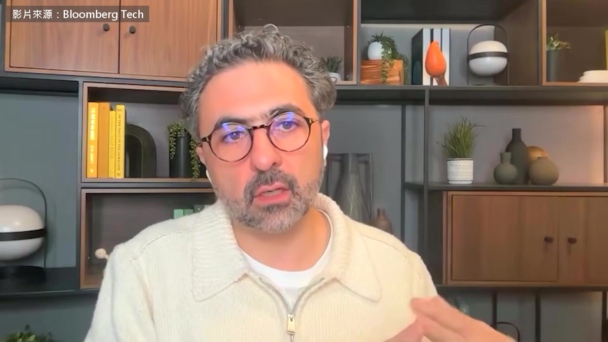

**逐字稿片段：** 還有，它們互相交談的時候，也就是 AI 對 AI， 這是一定要的，它們需要大量協調， 不能用我們說的 neuralese 來溝通 意思是向量對向量、數學矩陣對數學矩陣， 不用自然語言在溝通 這是兩個很明顯、也很容易做的例子，能大幅提高安全的機率 稽核要有人統籌 Suleyman 說不能靠業界自己來 要有政府背書的獨立單位 他還說，這件事得跟中國打好關係 中國的模型很強，安全技術也做得好 總之，我們得想辦法，別再把中國當成妖魔鬼怪， 他們並不是我們說的那種大魔頭 他們的價值觀跟我們不一樣 我當然以我們的自由世界為榮，我認為那是我們最大的資產， 照我的看法，我們該押注的也是這個世界 可是我們也不能一直硬要他們吞下這一套，對吧？ 他們是很有實力的一方，信的是另一套價值， 但我們有共同利益 那就拿共同利益去跟他們談 這個共同利益就是，他們也不想看到控制不了的失控 AI， 不管是開源的，還是透過 API 提供的，兩邊的問題一樣大 這句話我想重複 100 遍 這不是在攻擊開源 集中式的 API 供應商，同樣讓人擔心 記者後來問

**話題推測：** 說明第二個具體控制方法：限制 AI 間溝通方式，可能出現示意圖

---

## 00:12:17

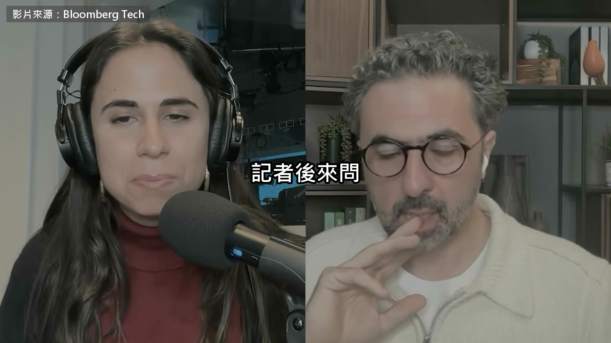

**逐字稿片段：** Anthropic 跟 OpenAI 正在搶第一 兩家都準備上市 微軟家大業大，要守住這些原則 是不是比他們容易 不，完全不是 那兩家公司的資源都非常雄厚， 也網羅了全世界最頂尖的一批人 我不認為他們缺少把事情做對的意願 以 Anthropic 來說，他們只是看法不一樣 他們就是認為，對 AI 福利表達不確定才是對的， 照他們的看法，既然它有一點點機率可能有意識， 我們就該主動採取行動，顧到它的感受跟痛苦 那純粹是他們的觀點 跟他們資源多少無關，跟他們正在競賽也無關 仔細想想，這些做法在商業上對他們反而有害 所以就像我前面說的，我不認為他們這樣做是別有用心 大家應該把那種猜測放到一邊，那完全是在轉移焦點 去談實質的內容

**話題推測：** 提及 Anthropic 與 OpenAI 的競爭及上市計畫，可能出現公司 Logo 或股票走勢圖

---

## 00:13:21

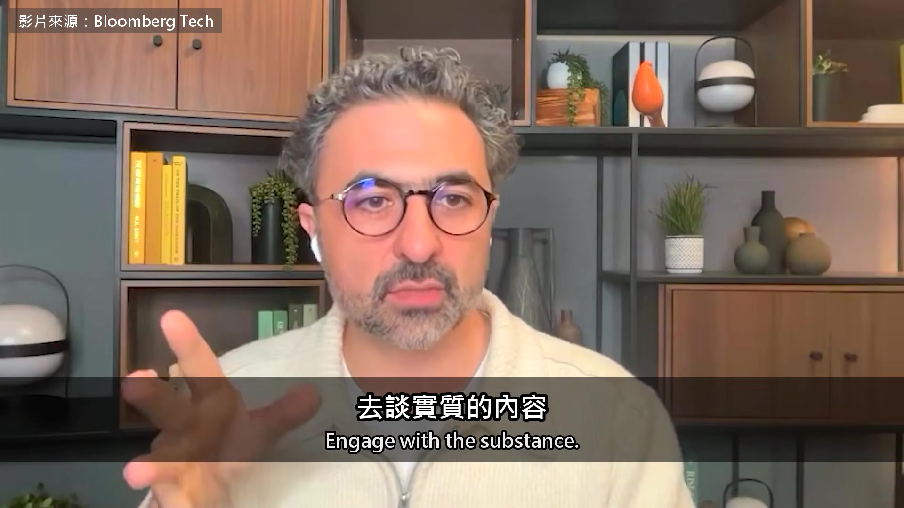

**逐字稿片段：** 去讀那份憲法，就放在他們的網站上 去讀我的文章，或讀別的東西 公開的資料已經夠多，足夠大家好好把細節想清楚， 別再聊那些八點檔、那些恩怨，還有誰居心不良 不用在別人的動機上打轉 他們想做什麼，已經在一份將近 100 頁的憲法裡寫得一清二楚，誰都可以去讀 他們相信什麼，明明白白 Suleyman 的紅線只有一條 AI 要是沒辦法事先證明控制得住 就不該做出來 他點名 Anthropic 錯了 同時要大家別去猜對方的動機 自己把那份憲法讀一遍 原影片 49 分鐘

**話題推測：** 建議讀者查閱 Anthropic 的憲法文件，可能出現網站截圖或文件連結

---

## 00:14:01

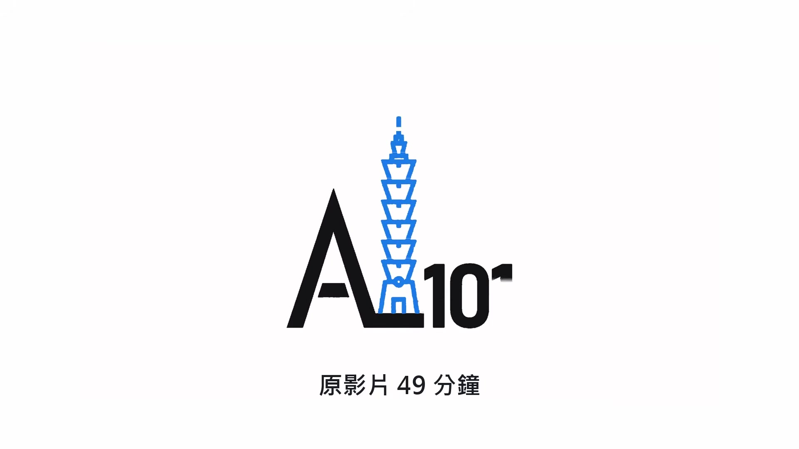

**逐字稿片段：** Suleyman 還講到 AI 會大規模取代人力 他說不該用保護主義去擋 該問的是速度多快 換工作的人怎麼接住 他也講了微軟跟 Mayo Clinic 合作 要從頭訓練一個醫療模型 原影片連結在說明欄，有興趣可以去聽更多。

**話題推測：** 提及 AI 將大規模取代人力的新話題，可能出現相關統計圖表

---
