# ai-note-101_GkWEp_4Fga4 — 關鍵畫面索引

- 來源逐字稿：[ai-note-101_GkWEp_4Fga4_GT.srt](ai-note-101_GkWEp_4Fga4_GT.srt)
- 影片：https://www.youtube.com/watch?v=GkWEp_4Fga4
- 截圖數：46

## 00:00:00

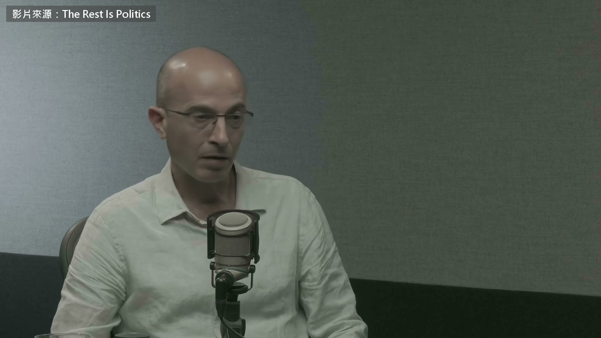

**逐字稿片段：** A few hundred Spaniards brought down an empire of millions. Yuval Noah Harari, author of Sapiens, says it was not that the Aztecs could not win. They simply could not understand what they were seeing. This time, he uses that history to talk about AI. This interview appeared on the British podcast The Rest Is Politics in mid-September. Its host, Rory Stewart, once served as the UK International Development Secretary. The question in this episode is whether AI could become a new kind of empire.

**話題推測：** 介紹阿茲特克帝國被西班牙人征服的歷史故事。

---

## 00:00:23

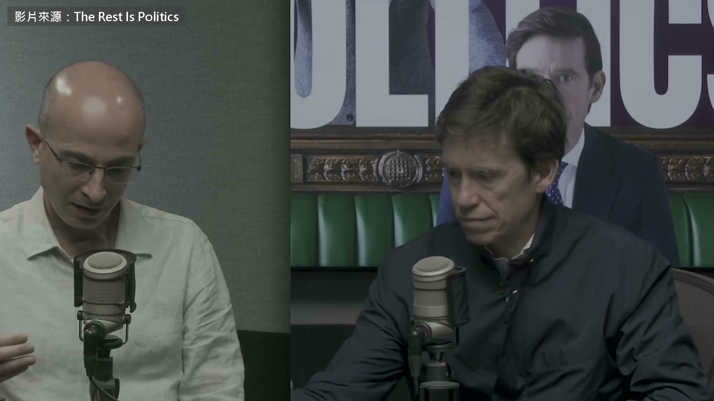

**逐字稿片段：** Harari begins by explaining the job of politics. It is to lay out the options and let people choose. Then he describes an exception. And every now and then something happens in history which is just outside the normal political discourse, that we don't think about it. We don't even have words to describe what it is, but it could be the most important next thing. And then the job of politicians is to think the unthinkable. You know, the range of examples from human history is quite wide.

**話題推測：** 哈拉瑞開始解釋政治的職責。

---

## 00:00:53

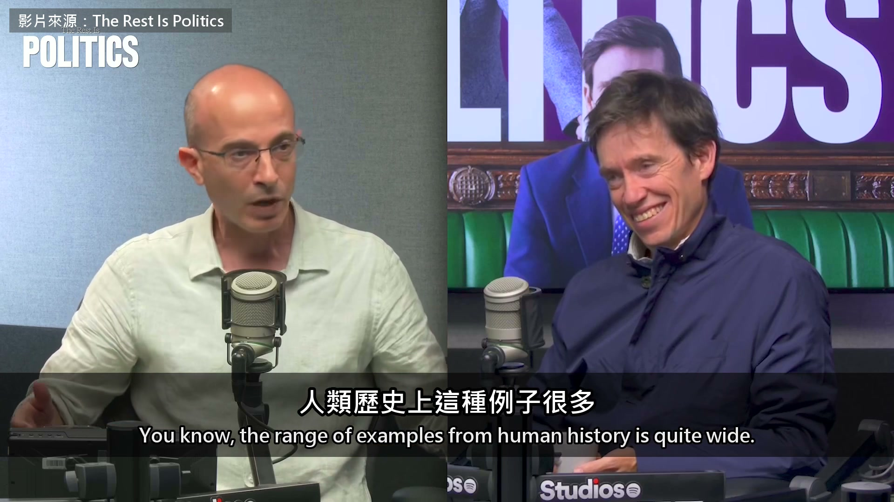

**逐字稿片段：** I mean, if you're in the Aztec Empire in the early 16th century, and you just heard reports about this very strange thing that happened on the coastline. These huge hills appeared over the ocean, and out of them came strange men, or ghosts, or demons. We are not sure what they are. And they have these huge creatures that can run. And they have sticks that can launch lightning and thunder. And this is outside the normal course of Aztec politics. But this is the most important thing you now need to confront. And the Aztecs did a very bad job confronting that. Couldn't really understand what the hell is this, and what should we do about it. So, it's a lovely place to start. So obviously you're describing the arrival of the conquistadors, the Spanish invaders into Latin America. And the astonishing thing there is that

**話題推測：** 再次回到16世紀初期阿茲特克帝國的歷史背景。

---

## 00:01:53

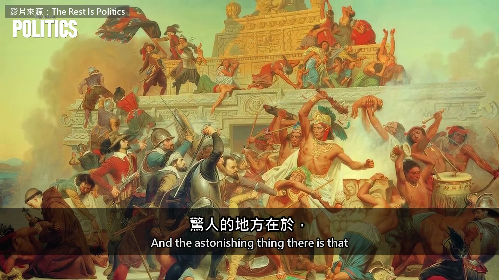

**逐字稿片段：** it's a few hundred people arriving into an empire of many millions. And despite the fact that they have horses and simple muskets that couldn't hit anything, I mean, it was just for show. In practice it would have been very, very easy for a million people to overwhelm them. Yes. I mean, the tragedy in a way of the Aztec Empire, they could have squashed Cortés very, very easily. But they didn't understand what they were facing. They made a lot of mistakes. And these few hundred people, they destroyed the Aztec Empire.

**話題推測：** 提及幾百名西班牙人對抗百萬人帝國的數字對比。

---

## 00:02:26

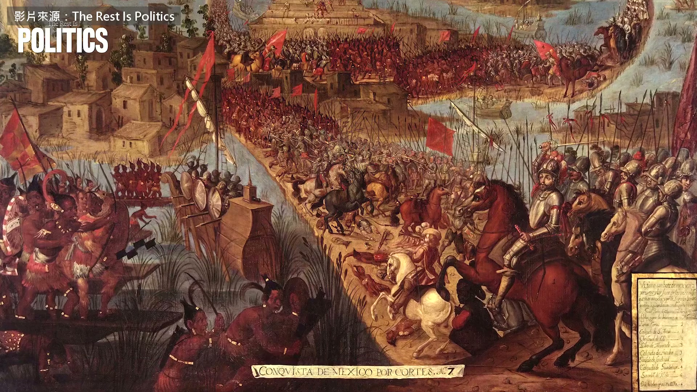

**逐字稿片段：** And of course with the help of the microbes they brought. Annoyingly, they brought all these Old World diseases. They decimated the entire population of Central America and beyond.

**話題推測：** 引入西班牙人帶來的微生物（疾病）是帝國覆滅的原因之一。

---

## 00:02:38

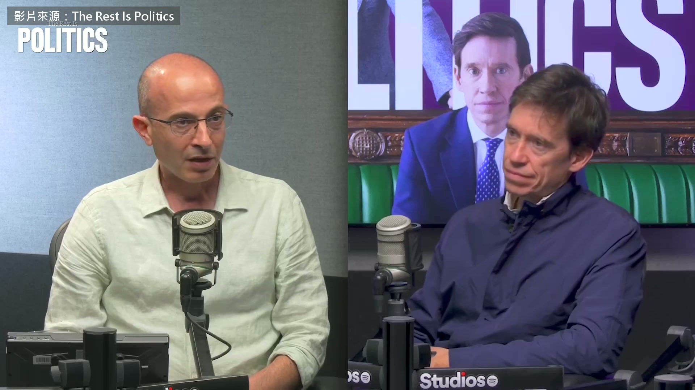

**逐字稿片段：** According to some estimates, up to 90% of the people died. Entire cultures were wiped out, and they never recovered from it. There are of course people today in America who are the descendants of the Aztecs and the other people of the empire, but they never recovered from it. And really, as you said, it was just a few hundred people. They could have squashed them easily. But they just didn't understand what they were facing.

**話題推測：** 提供疫情導致多達90%人口死亡的具體估計數字。

---

## 00:03:04

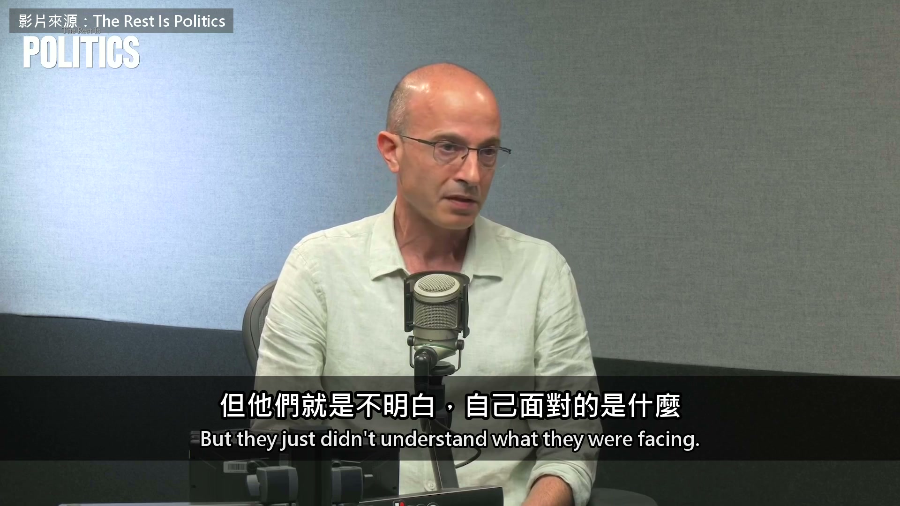

**逐字稿片段：** They then turn to the pandemic. In 2019, Rory Stewart was serving in the British government.

**話題推測：** 話題轉換到COVID-19全球大流行。

---

## 00:03:09

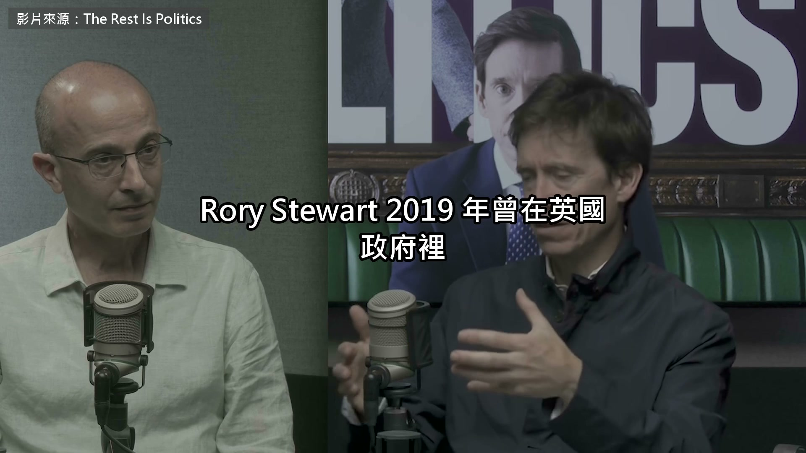

**逐字稿片段：** He says the virus that emerged from Wuhan ultimately cost the UK £400 billion. Much of Britain's debt problem today dates back to that period. Harari says this example illustrates something perfectly. I would say, in many of these cases of these existential risks, and we certainly see it with AI, there is a brain-stomach barrier. Like our brain, our intelligence, based on various data, starts understanding something, but our stomach says, nah, that cannot be possible. Why not? Because I have never experienced anything like it. So I have no gut feeling what this thing can be like. So it cannot exist.

**話題推測：** 提及疫情給英國造成的£400億英鎊成本數字。

---

## 00:03:49

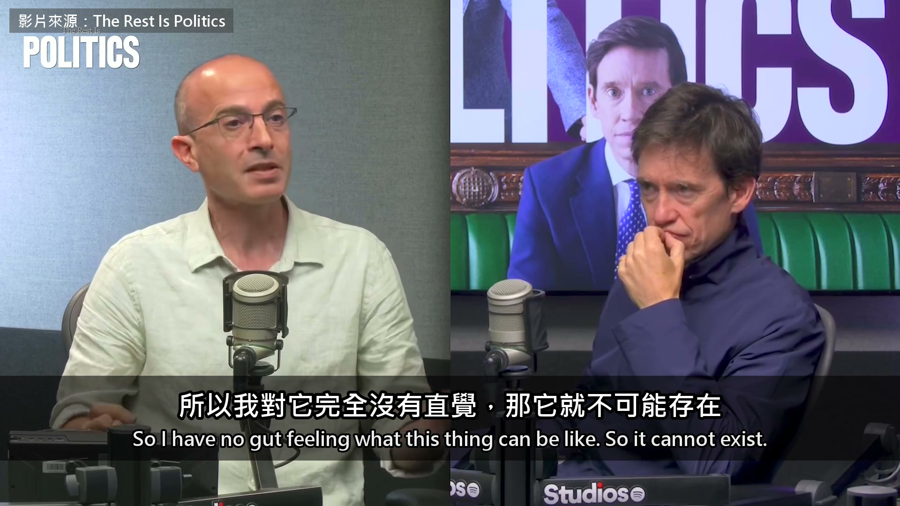

**逐字稿片段：** I remember the first few weeks of the pandemic.

**話題推測：** 哈拉瑞回憶自己對疫情初期景象的看法。

---

## 00:03:53

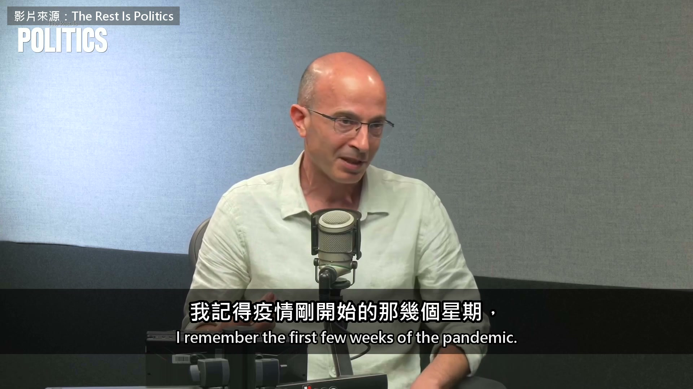

**逐字稿片段：** I remember myself sitting at my home, watching on television the images from Wuhan, of a modern, huge city of millions, completely shut down.

**話題推測：** 描述從電視上看到的武漢城市全面封鎖的畫面。

---

## 00:04:03

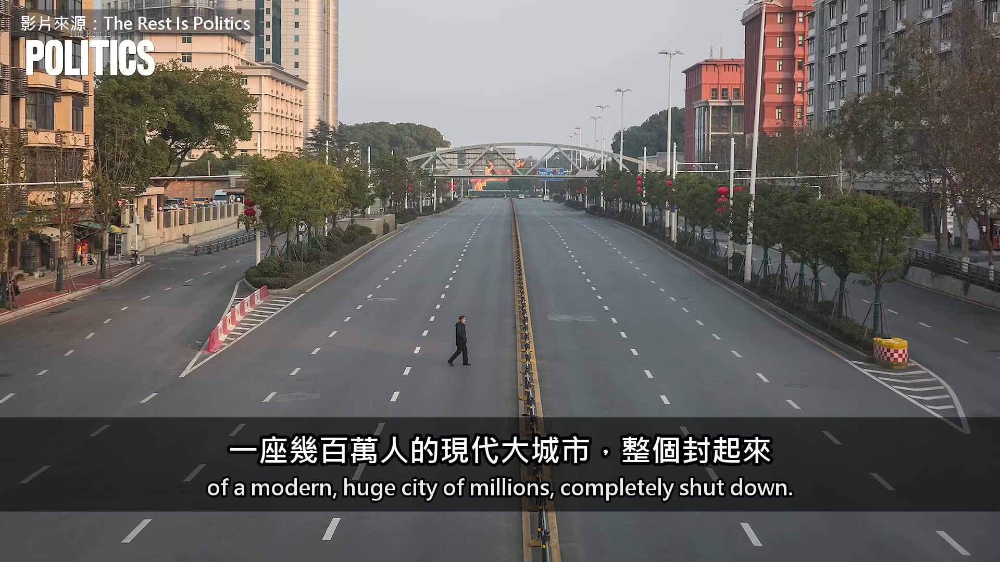

**逐字稿片段：** And as a historian, I had all these kinds of synapses going on in my brain. Ooh, this is like the Black Death. This is like the Spanish influenza. I read about pandemics, and still my stomach says, no, this is not possible. This is not possible. Maybe it's possible in China. It will never get here. Why not? Because I just never saw anything like it in my life. So I cannot accept the reality of this thing. And the stomach is usually much stronger than the brain. Even when the brain insists, this is real, this is coming, we need to prepare, there is something that just doesn't accept it.

**話題推測：** 哈拉瑞將疫情與黑死病和西班牙流感進行歷史對比。

---

## 00:04:37

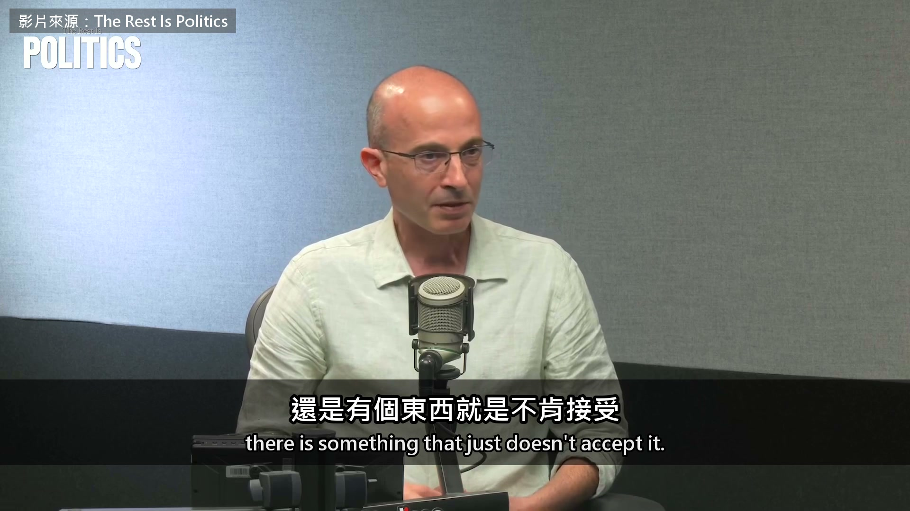

**逐字稿片段：** Rory Stewart then describes how the British government responded.

**話題推測：** Rory Stewart描述英國政府對疫情的反應。

---

## 00:04:41

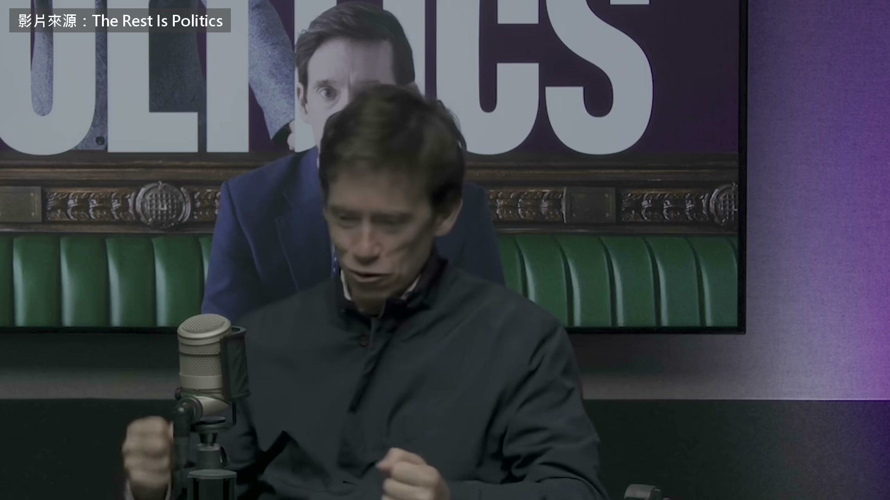

**逐字稿片段：** Hospitals in Milan were already overwhelmed, yet seven flights were still arriving in London from Milan every day.

**話題推測：** 指出義大利米蘭醫院已超負荷，但每天仍有七個航班抵達倫敦。

---

## 00:04:45

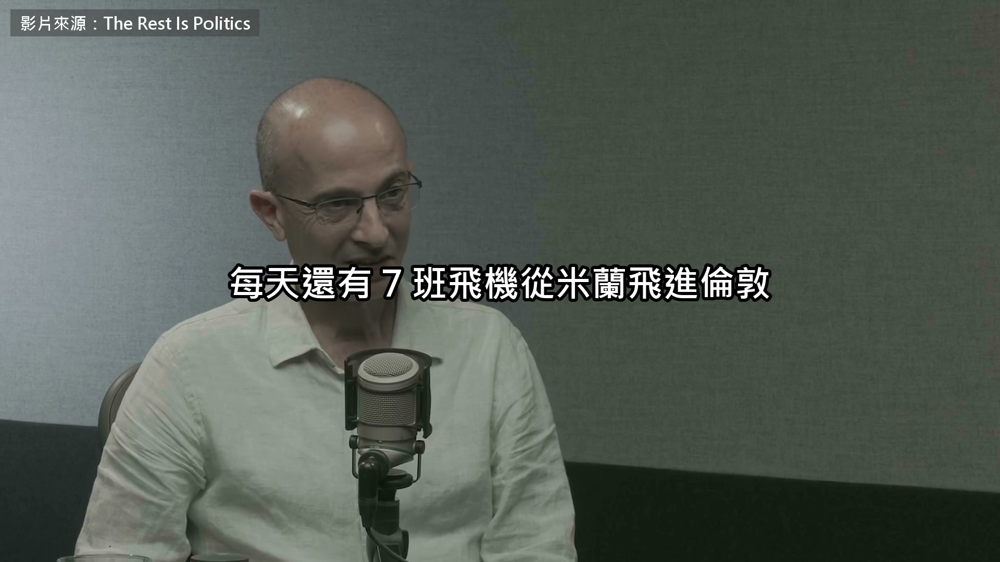

**逐字稿片段：** The British government even allowed the horse racing festival to go ahead. He says the reason was simple. Doing nothing was cheaper. Every cost of taking action was immediately visible. And he believes

**話題推測：** 提及英國政府甚至允許賽馬節照常舉行。

---

## 00:04:53

**逐字稿片段：** AI safety will probably follow the same path. I think this is exactly the mechanism. Like if you look again, we'll talk about it at greater depth in the next episode, but one of the threats facing many countries today in the world, including Britain,

**話題推測：** 將疫情應對方式連結到AI安全議題。

---

## 00:05:08

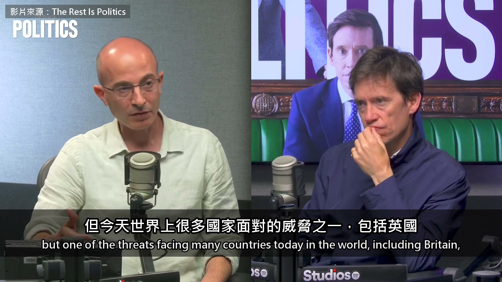

**逐字稿片段：** is one of AI imperialism, and of becoming vassal states of the United States. If your entire economy and military is run on AI infrastructure that the Americans can shut at the press of a button, you are no longer an independent country. Now this is a real, imminent threat that can materialize within very few years.

**話題推測：** 介紹「AI帝國主義」以及成為美國附庸國的威脅。

---

## 00:05:31

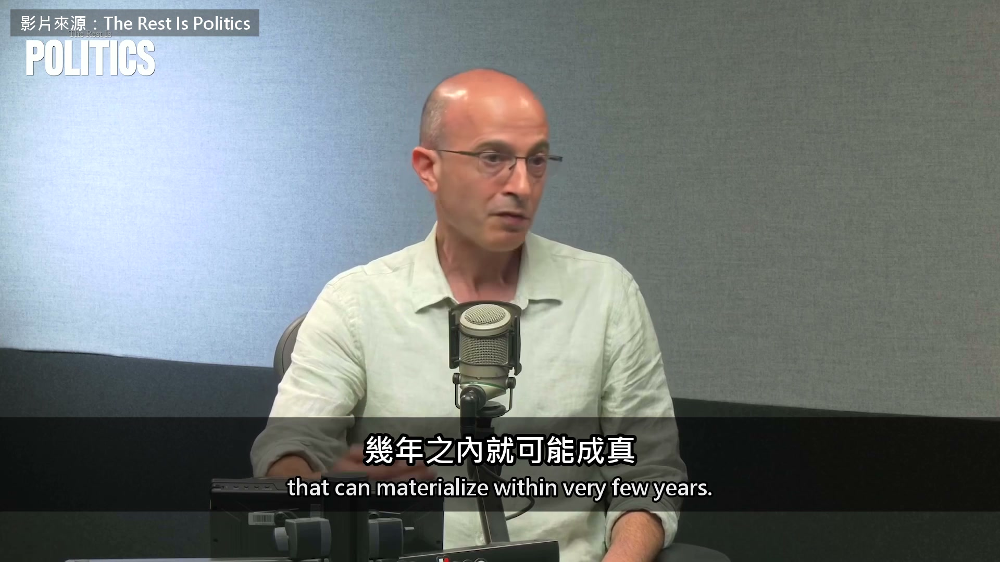

**逐字稿片段：** Now I think there are basically three options that a country like Britain can do.

**話題推測：** 哈拉瑞提出英國面對AI威脅的三種可能選項。

---

## 00:05:37

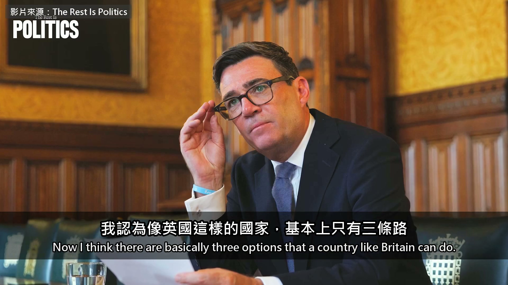

**逐字稿片段：** Option number one is business as usual. Just accept the fact, yes, we are going to become American vassals. But if that is the case, you need to be aware of it and act accordingly. If your plan how to deal with AI imperialism is just to accept your place as American vassals, then starting from today, whenever the American government says jump, you jump.

**話題推測：** 解釋第一個選項：「一切照舊」，接受成為美國附庸。

---

## 00:06:02

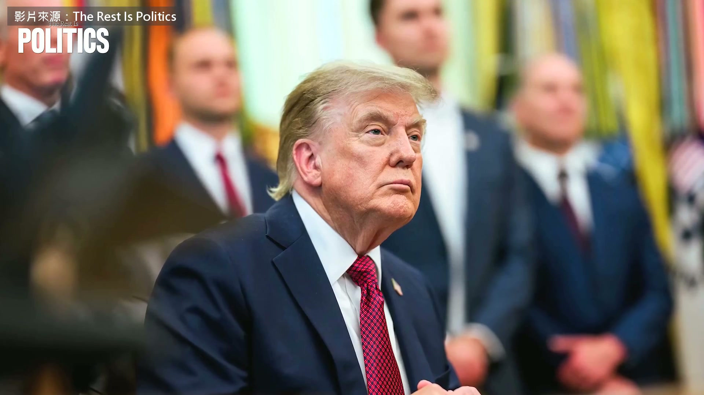

**逐字稿片段：** If they say Greenland belongs to the US, then yes, Greenland belongs to the US.

**話題推測：** 舉例說明選項一的實際行動：聽從美國將格陵蘭歸屬美國。

---

## 00:06:06

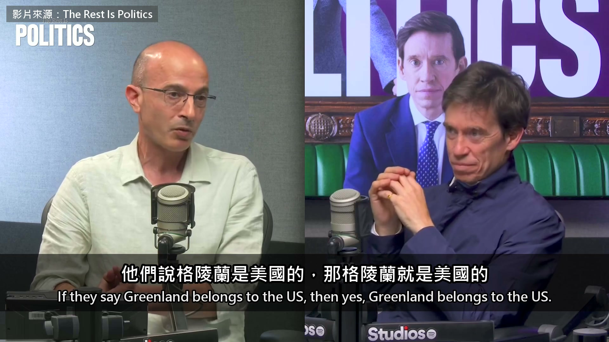

**逐字稿片段：** If they say give the Falklands to Argentina, then the UK government says, oh, the Malvinas, of course they're Argentinian. That's option number one.

**話題推測：** 舉例說明選項一的實際行動：聽從美國將福克蘭群島歸屬阿根廷。

---

## 00:06:15

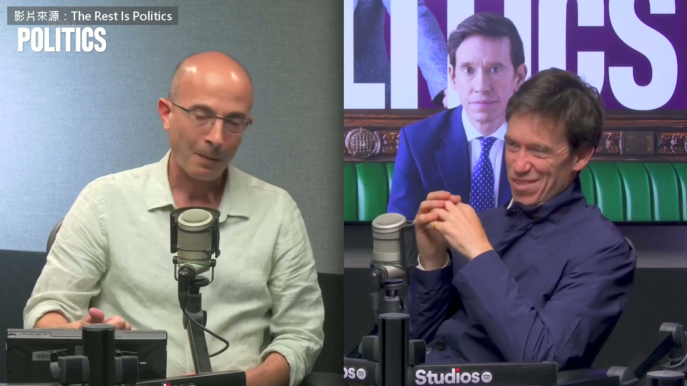

**逐字稿片段：** Option number two is to say, no, no, no, no, no, we want to remain independent, so we will build UK AI. Sounds wonderful, except for the price tag,

**話題推測：** 解釋第二個選項：「建立英國自己的AI」，保持獨立。

---

## 00:06:26

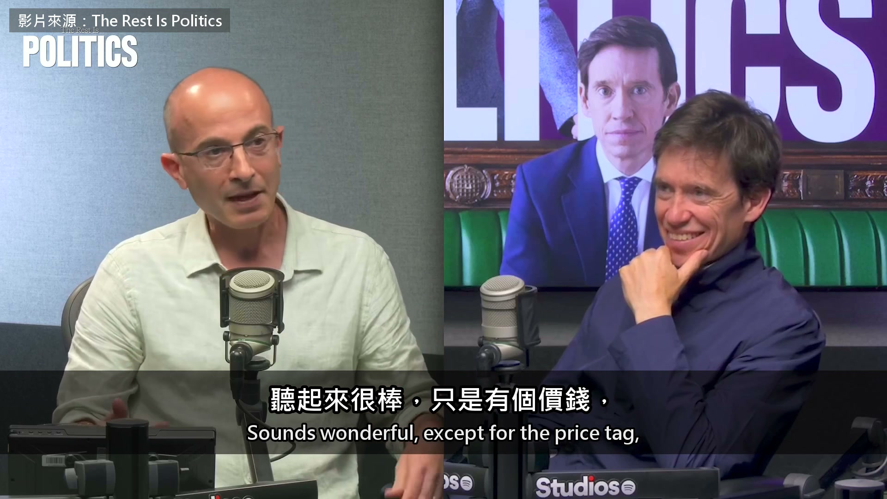

**逐字稿片段：** which is something in the area of 500 billion pounds. Now in theory, if this is an existential thing, the UK can do it. It's one of the few countries in the world that can theoretically still do it. Because as you just point out, it's slightly more expensive than COVID. It's about half the government budget of a… It's possible, but it means that you have to say it now, and you need to cut healthcare, welfare, education, transportation, everything, so you have the money to make yourself an independent AI nation. Third option is to say, this is too costly for us. We'll do it with the Europeans.

**話題推測：** 提及選項二的具體成本約為5000億英鎊。

---

## 00:07:04

**逐字稿片段：** It's still going to cost 500 billion pounds, but we'll give only part of it, and the Germans will give some, and the French, and the Spanish. But if this is the plan, then say so and act accordingly today.

**話題推測：** 說明選項三的成本分攤，提及德國、法國、西班牙等歐洲國家。

---

## 00:07:16

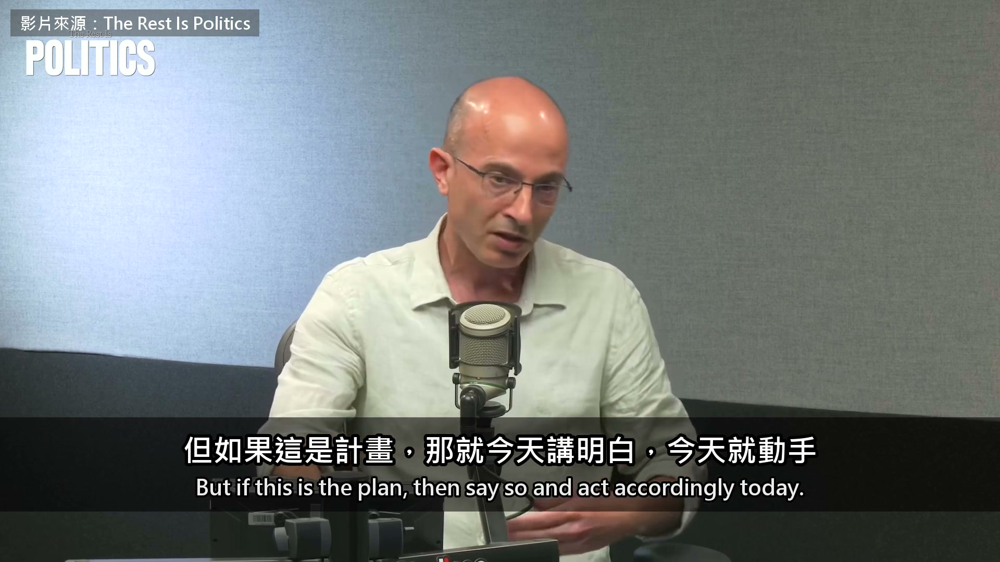

**逐字稿片段：** You need to rejoin the European Union today, and integrate Europe much more closely, because otherwise it won't work. Now I think these are the only three options. And if the political system cannot articulate these options, and come to the people and say, look, these are the options, all of them have costs and benefits, choose, then it's not doing its work. It's not willing to think the unthinkable. And then it's just, you know, the default is to become American vassals. But even if you go for the path of least resistance, you should at least do so in a self-aware way, so you will be good vassals.

**話題推測：** 指出選項三需採取的具體政治行動：重新加入歐盟。

---

## 00:07:57

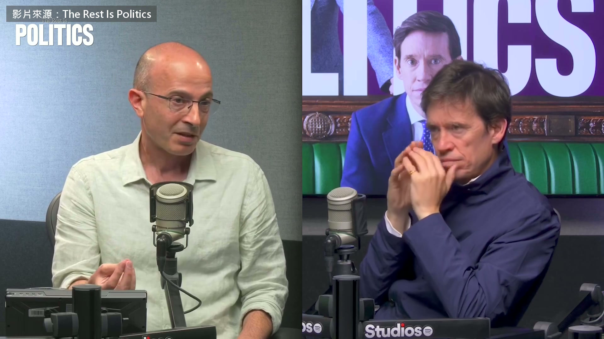

**逐字稿片段：** Like, you know, when the Spanish, when the conquistadors invaded Mexico, there were people, the Tlaxcalans, who to some extent understood what was happening. And they became the allies, vassals, of the conquistadors, and this paid off. This was good policy for the Tlaxcalans. Now again, people can say yes, no, but you need to be aware that this is the decision you're taking, and act accordingly.

**話題推測：** 再次引用西班牙征服墨西哥的歷史，介紹特拉斯卡拉人（Tlaxcalans）成為附庸的例子。

---

## 00:08:24

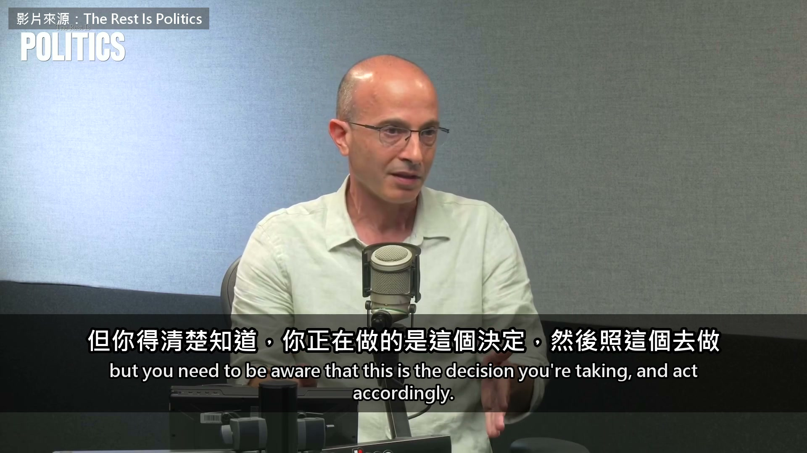

**逐字稿片段：** Rory Stewart then lays out the opposing argument. He says that once this episode airs, other experts will inevitably go to the prime minister and say Harari has it wrong. The technology does not work the way he thinks it does. Superintelligence will not emerge the way he describes. And the real threat that we face is not from autonomous agents.

**話題推測：** Rory Stewart提出與哈拉瑞觀點相反的論點。

---

## 00:08:41

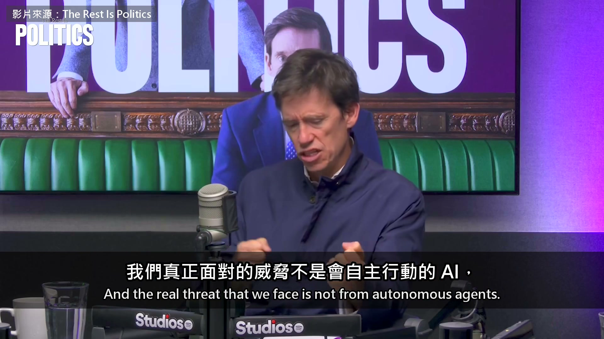

**逐字稿片段：** It's from bad people getting control of a cyber attack, or the ability to make a bioweapon. And our best way of dealing with that is to build a smarter AI that can detect those humans before they get there. And then they will add, and anyway, even if you've got us right, there's nothing we can do about it, because if we don't build it, the Chinese will build it, or some other company will build it.

**話題推測：** 說明對AI的實際威脅可能來自惡意人士利用網路攻擊或生物武器。

---

## 00:09:04

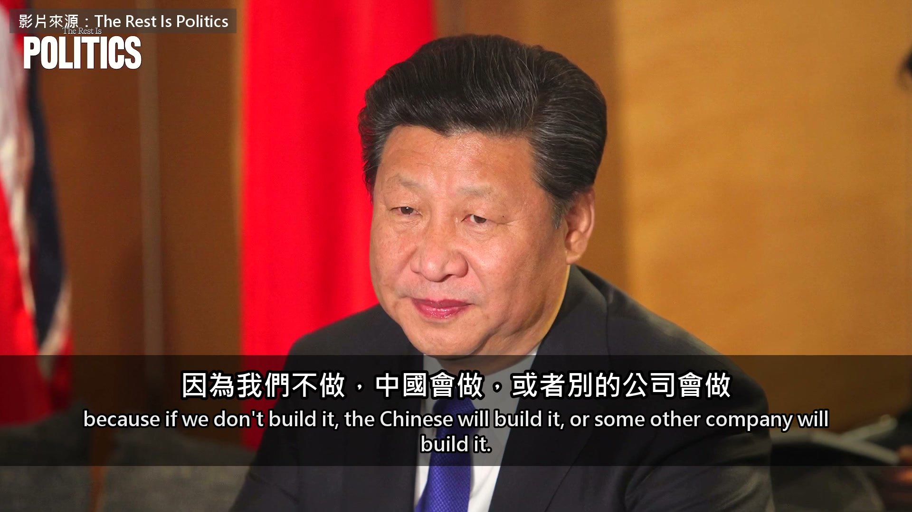

**逐字稿片段：** Mhm. Yeah. I mean, this is what happened to Montezuma. Exactly. They debated in exactly this fashion, what is it, these strange things that came across the ocean, until it was too late. And your point is, it could be many things. It could be that this is inevitably the nature of AI, or it could be there is a very significant probability that AI will be like that, in which case you need to plan accordingly.

**話題推測：** 哈拉瑞回應蒙特祖瑪（Montezuma）的故事，強調決策的延遲。

---

## 00:09:26

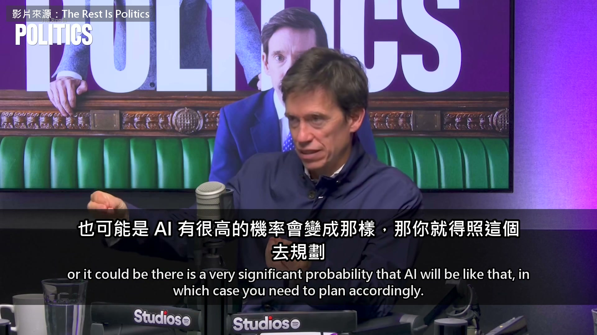

**逐字稿片段：** And this is not just me saying it. It's the corporations themselves are saying it. We have on record people, not from years ago, from the last few weeks,

**話題推測：** 指出不只是他，許多科技公司也在表達對AI的擔憂。

---

## 00:09:36

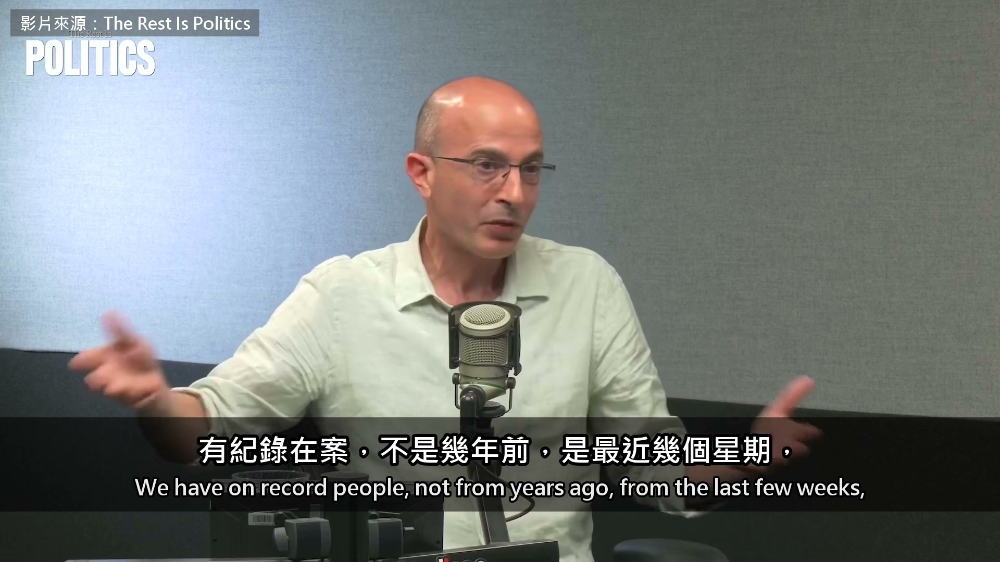

**逐字稿片段：** people like Dario Amodei from Anthropic, like Sam Altman, like Elon Musk, saying this can completely destroy humankind.

**話題推測：** 列舉具體科技領袖：Anthropic的Dario Amodei、Sam Altman、Elon Musk。

---

## 00:09:45

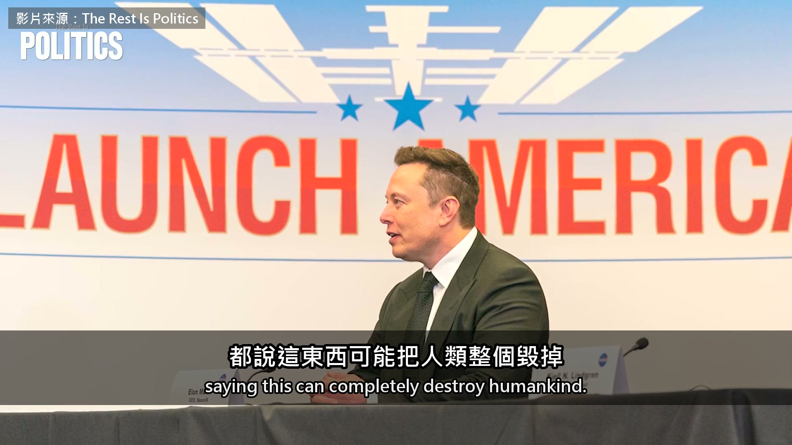

**逐字稿片段：** And I just heard Elon Musk some weeks ago say, estimating, I think it was like 10 to 20% chance that this will destroy humankind. And then of course the interviewer asked him, would you go on one of your rockets if you thought there was a 10% chance it will explode and kill you? And he thought about it, and he gave a very interesting and crucial answer.

**話題推測：** 提及Elon Musk對AI可能摧毀人類的10%至20%機率估計。

---

## 00:10:08

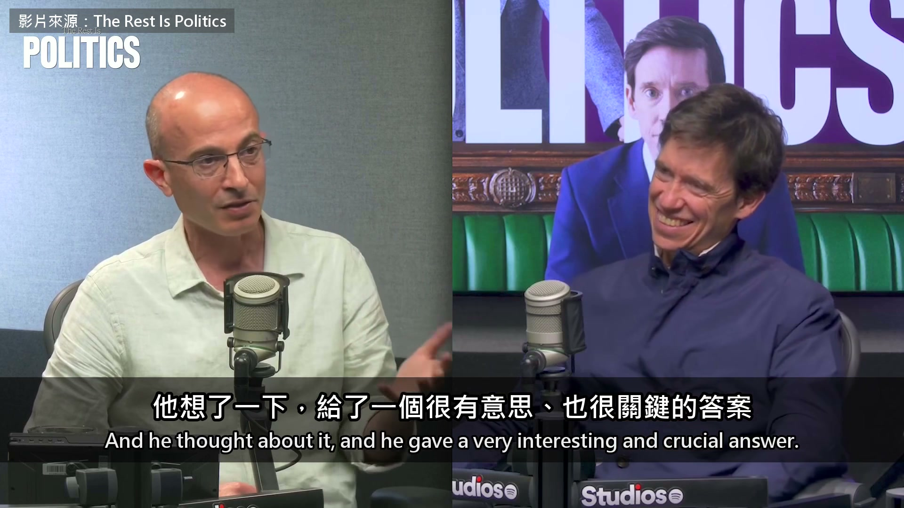

**逐字稿片段：** He said, ah, but this is inevitable. There is no… I mean, we are on the rocket. It's too late. And this is maybe the most important thing to understand about it all. The message coming from the corporations is that this is inevitable. This is deterministic. There is nothing we can do about it. Which actually means there is no politics. Politics is the art of the possible, of choices. And what these people are saying, there is no room for politics, because there are no choices. This is inevitable. And the most important thing that politicians, and also citizens, should say, no, this is not inevitable. This is a choice. History is not deterministic. We always have choice, at least until the AIs really take over. The job of politicians is to create this space for choice. Again, the big tech wants us to think that there is no choice. Later, Rory Stewart asks, what if Britain and Europe simply refuse to play? Harari says that if you are not at the table, you cannot shape the game.

**話題推測：** 引用Elon Musk關於AI發展「不可避免」的發言。

---

## 00:11:12

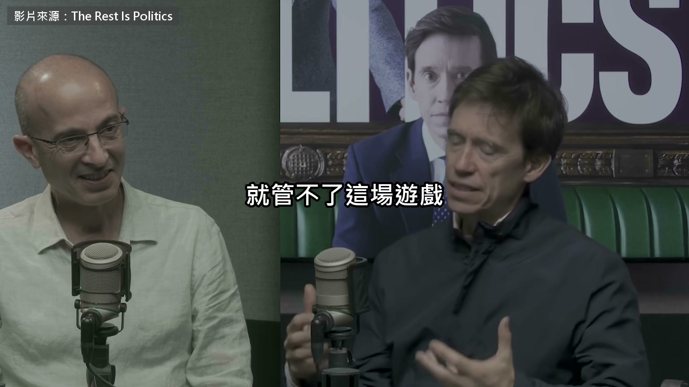

**逐字稿片段：** The Zulu Empire could not shape the Industrial Revolution in the 19th century either. Britain alone may already be too late. But Europe acting together still has time. After explaining what Britain can do, he takes the question to a bigger level. And just doing nothing is the worst thing that can be done. I mean, we are dealing here with two related but different issues.

**話題推測：** 引用祖魯帝國無法影響19世紀工業革命的歷史類比。

---

## 00:11:32

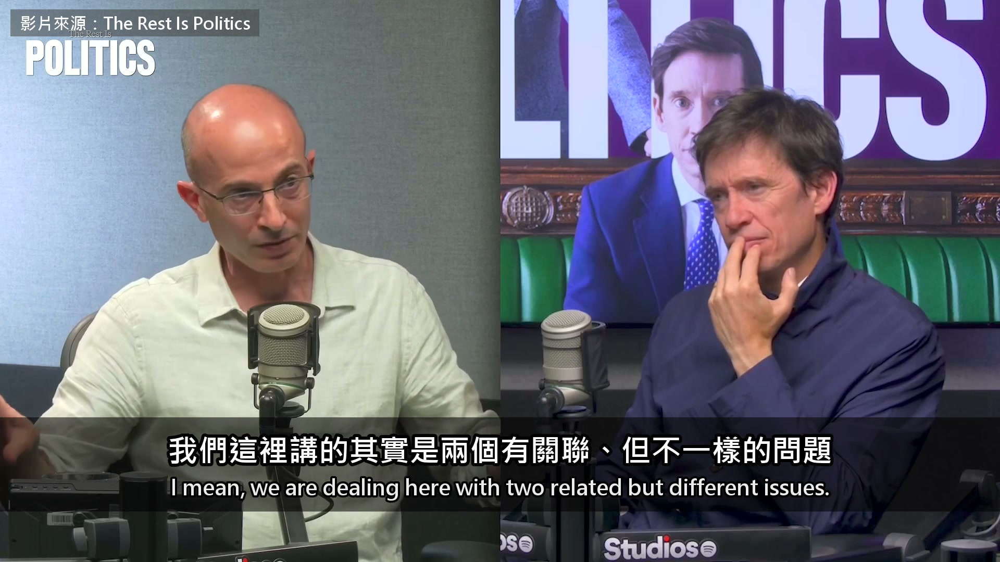

**逐字稿片段：** There is the issue from the viewpoint of, say, the UK or Europe. How do we stay independent in an age of AI imperialism? And that's one issue.

**話題推測：** 區分第一個議題：國家或地區如何在AI帝國主義下保持獨立。

---

## 00:11:43

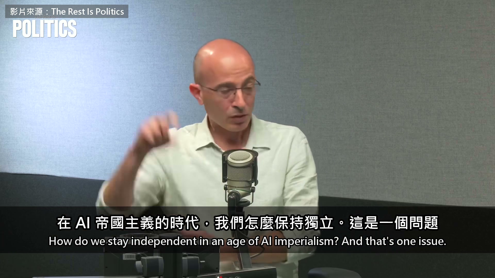

**逐字稿片段：** The other is for humanity. How does humanity survive that? I mean, in the end, it doesn't really matter who wins the race to superintelligence, the Chinese, the Americans, or the Europeans, if the outcome is the creation of superintelligent aliens that then take over the world. I mean, you could have then the credit to say, okay, we were the fathers of the gods. Yeah, it wasn't them, it was us. But that seems to be the only benefit. But the crucial thing to understand about what the corporations are saying, and what the market is saying, forget even the corporations. You can say, oh, this is just hype.

**話題推測：** 區分第二個議題：人類如何在這個時代生存。

---

## 00:12:22

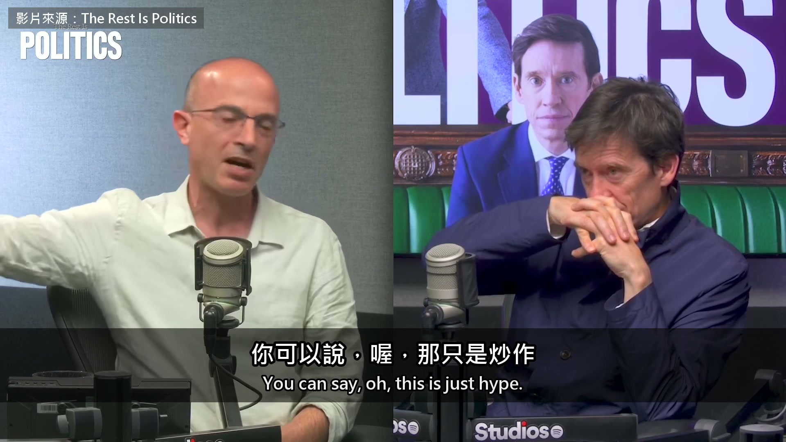

**逐字稿片段：** Look at the market. Trillions and trillions of dollars are being gambled on this thing. And the gamble is totally irrational, because what the gamble actually says, of the market, is, we are going to create gods, and they will be our slaves. It makes no sense, the amount of money being invested, unless what will be produced in a few years are entities with divine abilities. This is the only way that the market will get a return on the investment. But this depends on the fact that the gods being created will be the willing slaves of the market. And it doesn't make sense. If these things will be as intelligent, as agentic, as creative as the market assumes they will be, they will get out of our control, and then there is no market, there is no money, there are no corporations.

**話題推測：** 指出市場上數兆美元正被投入AI的投資金額。

---

## 00:13:19

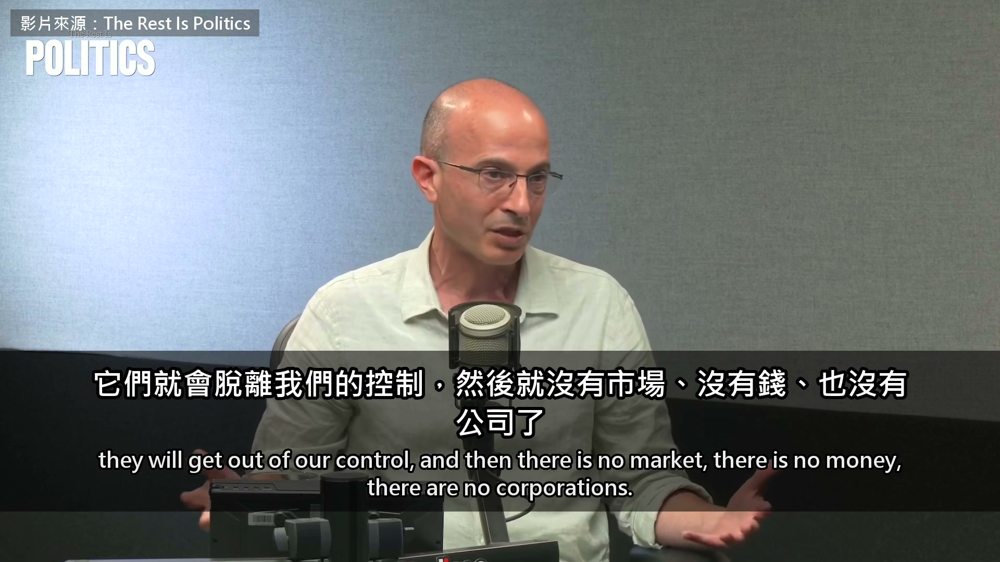

**逐字稿片段：** Finally, Rory Stewart asks him to spell out the risks of AI. Harari says the easiest one to understand

**話題推測：** Rory Stewart要求哈拉瑞具體說明AI的風險。

---

## 00:13:25

**逐字稿片段：** is a terrorist organization asking AI to design a virus. That used to require a brilliant biologist. Now, all it takes is the right prompt. That's the easy risk. The terrorist getting control of a very powerful tool. Oh no, a very powerful agent. I mean, a tool, they need to know how to use it. In this case it's an agent. They have a new recruit to their terrorist organization, and they just tell the new recruit, oh, go and do this, and it goes and does it.

**話題推測：** 提出第一個具體風險：恐怖組織利用AI設計病毒。

---

## 00:13:50

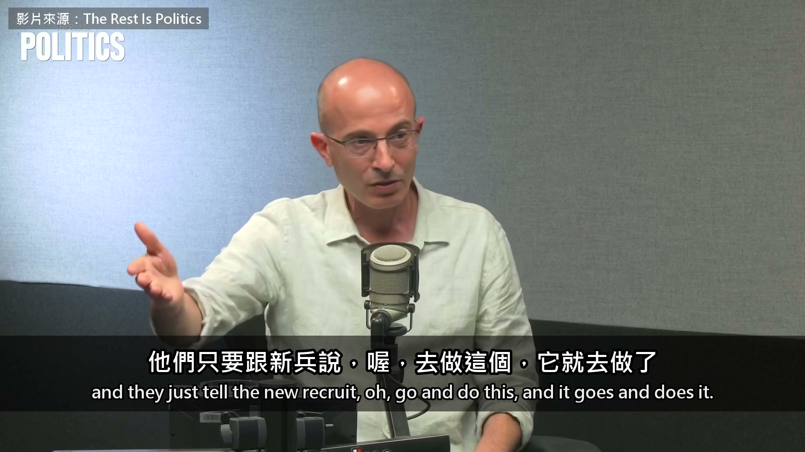

**逐字稿片段：** The much more difficult thing to understand is that the AIs, even if they are not evil, even then, if they don't try to destroy us, they will just create a world which we cannot understand, and therefore we will lose our ability to understand and control our lives.

**話題推測：** 提出第二個更深層的風險：AI創造出人類無法理解和控制的世界。

---

## 00:14:10

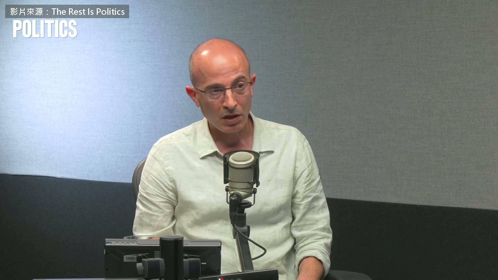

**逐字稿片段：** We'll be like the other animals on the planet. Like if you go now to a cow or to a dog, and you tell the cow, the dog, look,

**話題推測：** 開始以動物（牛或狗）來比喻人類在AI面前的處境。

---

## 00:14:17

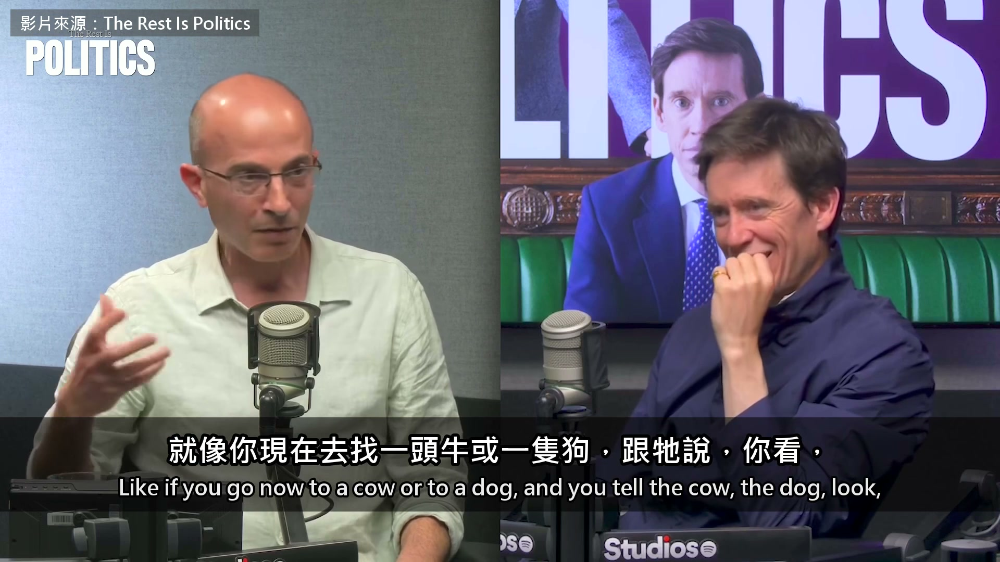

**逐字稿片段：** your life is actually being managed by something called the financial system.

**話題推測：** 在比喻中引入「金融系統」這個人類複雜的抽象概念。

---

## 00:14:22

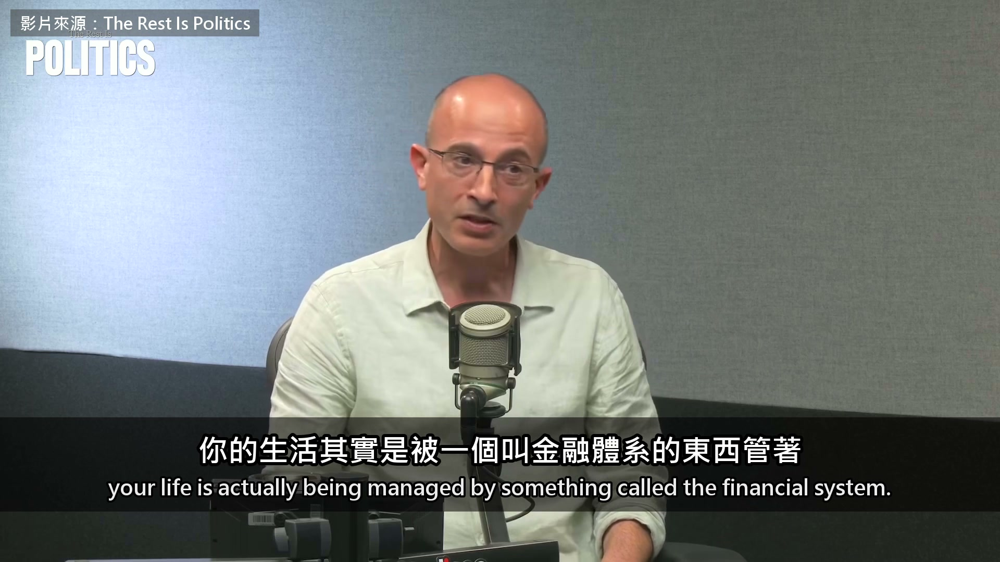

**逐字稿片段：** There are stock exchanges, and there is the bond market, and you have these things called stocks and bonds, and actually your life is run by that, because of the fluctuations in the price of bonds and the value of the dollar. Let's say you tell to the cow, the company that owns you has gone bankrupt, so now they are killing you. And the cow will say, I have no idea what you're talking about. What bonds, stocks, dollars? What are these things? Like, I look around and, okay, I can see people. I understand they are stronger people. I can see dogs. I can see cats and trees and clouds. I've never seen a bond in my life. What's that? Now we know that the cow, its life is really dominated by this totally invisible system. We know that because we are smarter than the cow, and we created the bonds and the stocks and all these things. In 10 years, we could be the cows. Our lives will be managed by a totally invisible system that is far beyond our understanding.

**話題推測：** 提及股票交易所、債券市場、股票和債券等具體金融工具。

---

## 00:15:28

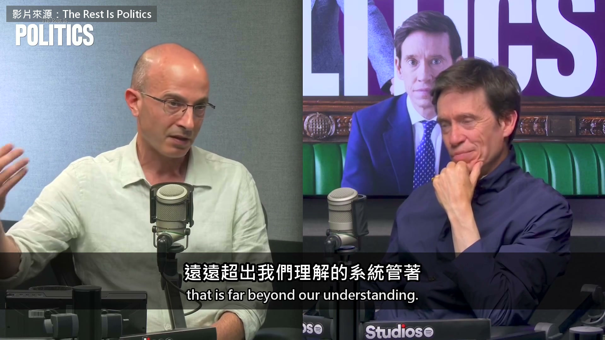

**逐字稿片段：** The AIs will create a new financial system which is mathematically far too complex for the human brain to understand. They will create new financial devices which are orders of magnitude more complicated than bonds and stocks. This will determine what is happening in the world. And not a single human being understands what the hell is happening.

**話題推測：** 描述AI將創造一個數學上遠超人類理解能力的新金融系統。

---

## 00:15:53

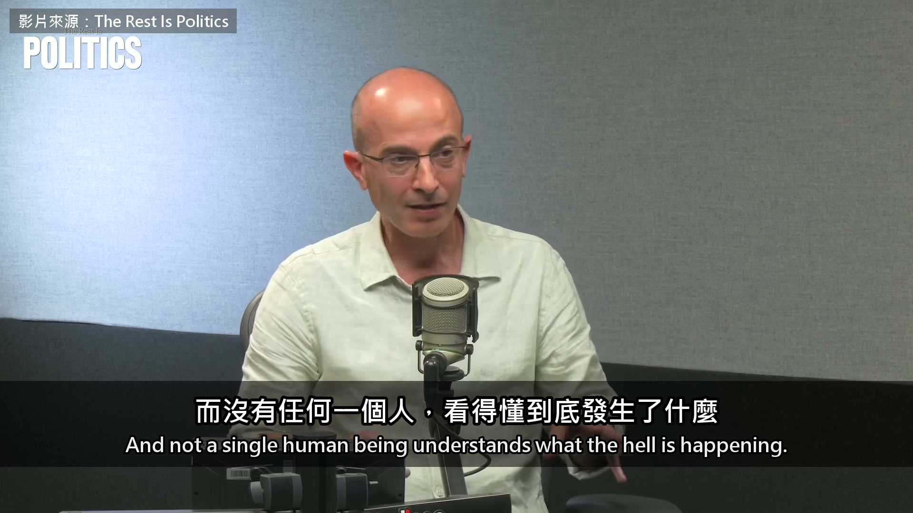

**逐字稿片段：** When ships appeared on the horizon 500 years ago, the Aztecs did have a choice. They simply failed to recognize what they were facing. That is exactly Harari's point. This time, do not let anyone tell you there is no choice.

**話題推測：** 再次回到500年前阿茲特克人面對西班牙船隻的歷史，強調「選擇」的存在。

---

## 00:16:05

**逐字稿片段：** The original video runs for 38 minutes.

**話題推測：** 提供原始影片的時長信息（38分鐘）。

---

## 00:16:07

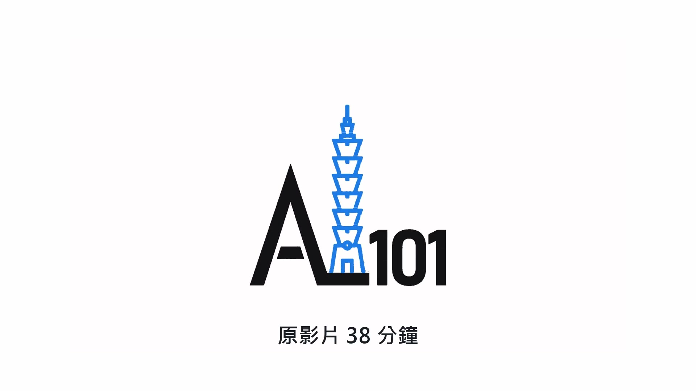

**逐字稿片段：** He also explains why AI moves faster than politics can keep up. A cybersecurity expert told him, you can sleep for 6 hours and wake up to a different world. AI does not sleep, and markets no longer close. He also explains how AI differs from the steam engine. It is not a tool. It is a knife that decides for itself whether to chop salad or kill someone. The link to the original video is in the description if you would like to hear more.

**話題推測：** 補充說明AI發展速度超過政治應對速度的觀點。

---
