# ai-note-101_Hd6ijY_SalU — 關鍵畫面索引

- 來源逐字稿：[ai-note-101_Hd6ijY_SalU_GT.srt](ai-note-101_Hd6ijY_SalU_GT.srt)
- 影片：https://www.youtube.com/watch?v=Hd6ijY_SalU
- 截圖數：28

## 00:00:00

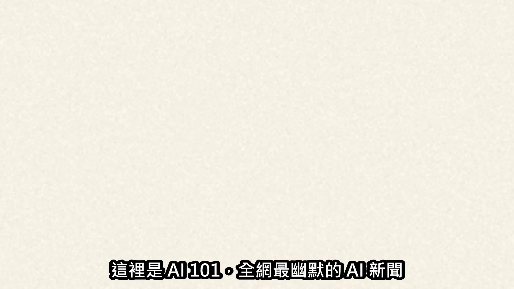

**逐字稿片段：** 這裡是 AI 101，全網最幽默的 AI 新聞

**話題推測：** 節目開場或標題畫面

---

## 00:00:04

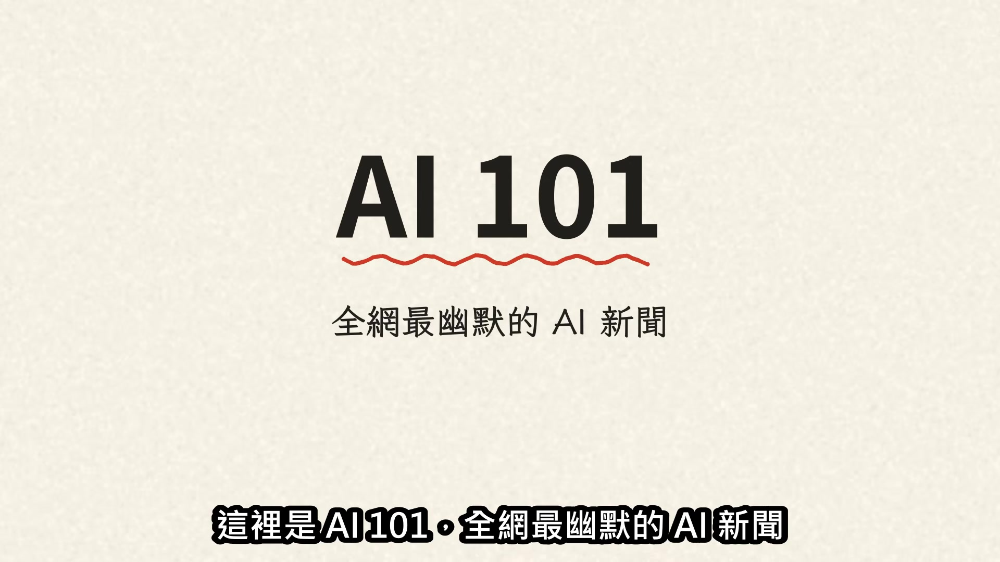

**逐字稿片段：** 美國和俄羅斯聯手 在最後關頭削弱了聯合國的殺手機器人安全文件 原本的安全文字 被刪成內容大幅弱化的版本 說起來很諷刺 美國和俄羅斯在烏克蘭戰爭中分屬對立陣營 可是一到日內瓦談判桌，卻站到同一邊 反對更具體、有約束力的國際規則

**話題推測：** 引出美國與俄羅斯聯手削弱聯合國文件的主要新聞

---

## 00:00:24

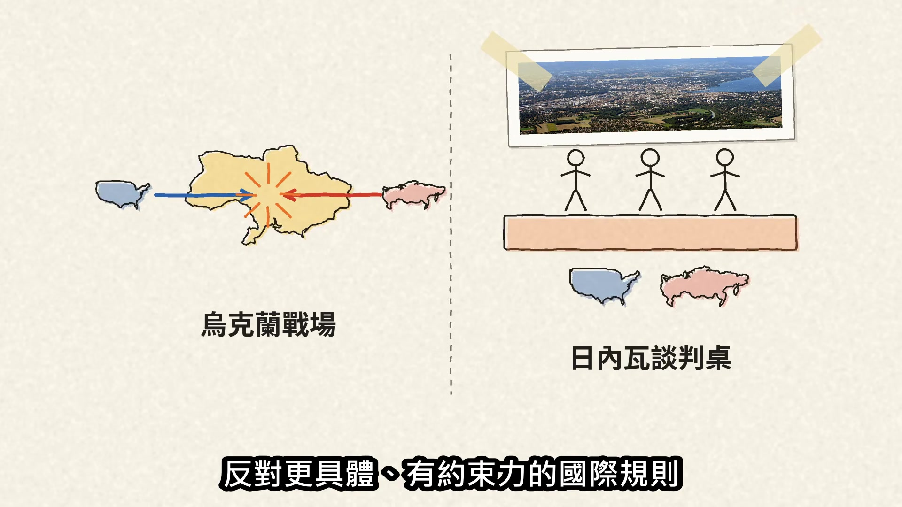

**逐字稿片段：** 美俄擋下的，到底是什麼規則？

**話題推測：** 提出問題，預期畫面會解釋被擋下的規則是什麼

---

## 00:00:27

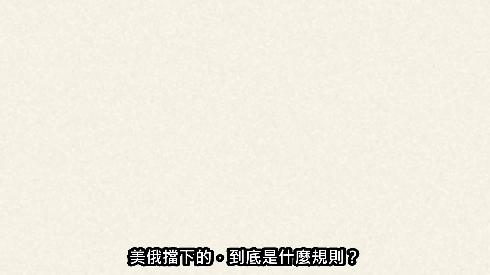

**逐字稿片段：** 是致命自主武器，英文縮寫LAWS 能在操作員不介入時 自行選擇並攻擊目標 所以關鍵在於：機器已經找到目標、 排好順序時，人類還有沒有最後決定權

**話題推測：** 定義「致命自主武器」(LAWS) 並解釋其縮寫

---

## 00:00:42

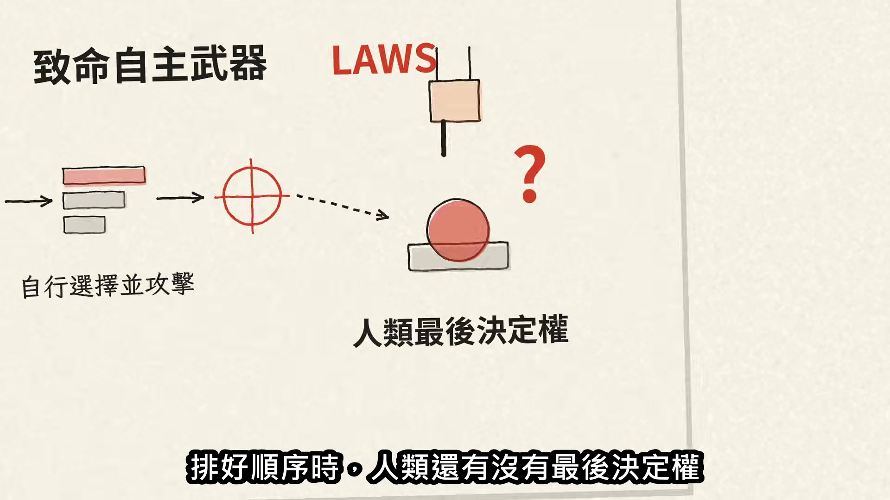

**逐字稿片段：** 這可不是紙上談兵

**話題推測：** 話題從理論轉向實際應用，暗示案例討論開始

---

## 00:00:44

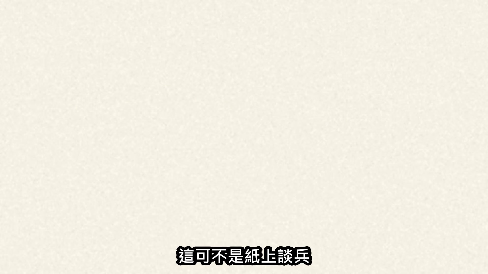

**逐字稿片段：** 《華盛頓郵報》報導 Palantir的Maven整合Anthropic的Claude 為美軍即時選目標與排序提供支援

**話題推測：** 提及《華盛頓郵報》報導，可能呈現新聞標題或相關圖片

---

## 00:00:51

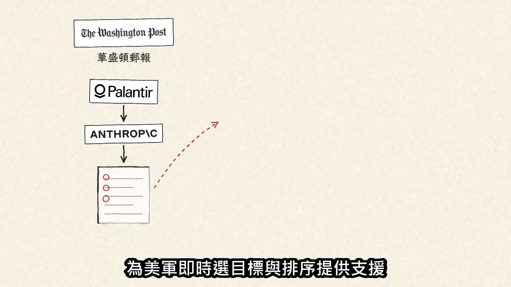

**逐字稿片段：** 2月28日展開的史詩怒火行動

**話題推測：** 介紹一項具體軍事行動「史詩怒火行動」及日期

---

## 00:00:54

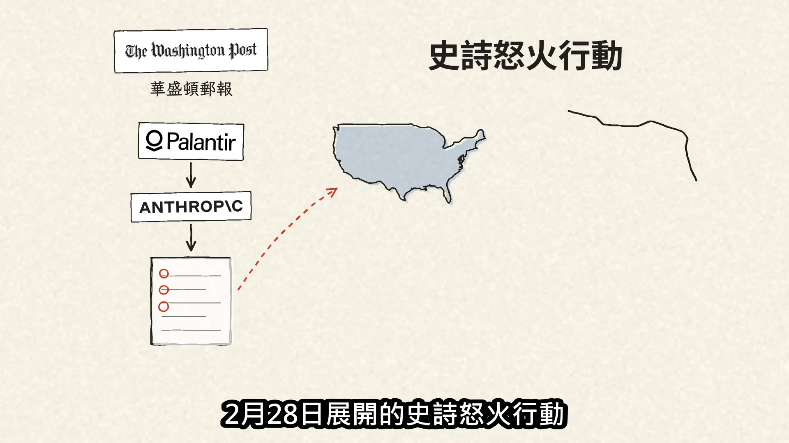

**逐字稿片段：** 首24小時攻擊超過1000個伊朗目標 平均每86秒一個 就在同一天

**話題推測：** 提供具體數字「攻擊超過1000個伊朗目標」，可顯示為數據圖表

---

## 00:01:01

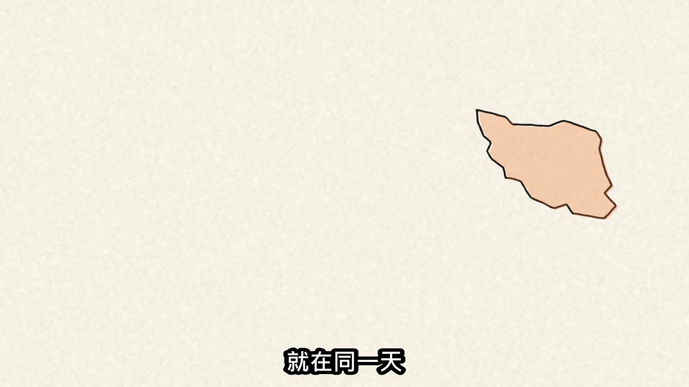

**逐字稿片段：** 伊朗米納卜1所小學遭到攻擊 至少165人死亡，很多是孩童 美方初步調查指向過時的目標資料 這些資料在加速的目標鏈裡 一路通過了人類簽核 所以，有人簽核，不代表複核就有效

**話題推測：** 轉移至另一個相關的悲劇事件「伊朗米納卜小學遭攻擊」

---

## 00:01:18

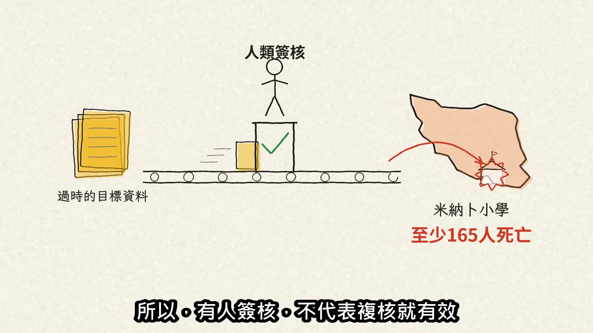

**逐字稿片段：** 照理說，這正是國際規則該管的事

**話題推測：** 話題回到國際規則的必要性

---

## 00:01:22

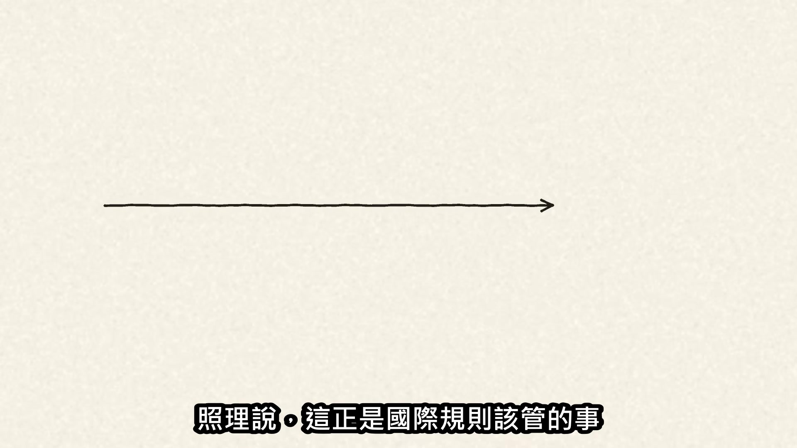

**逐字稿片段：** 可是在《特定常規武器公約》底下

**話題推測：** 提及具體公約《特定常規武器公約》

---

## 00:01:24

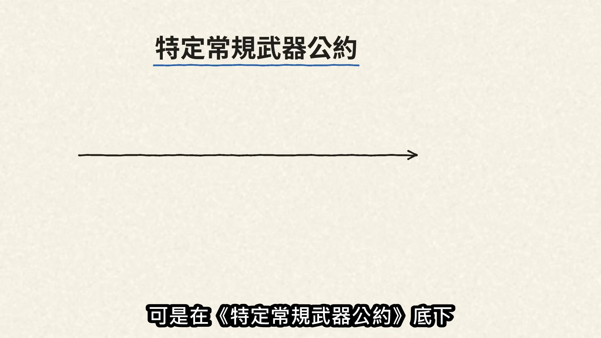

**逐字稿片段：** 各國從2014年開始談，談了10多年 到現在還沒有專門針對致命自主武器、 具有法律約束力的國際規則

**話題推測：** 提及談判的起始年份和持續時間「2014年開始談，談了10多年」

---

## 00:01:33

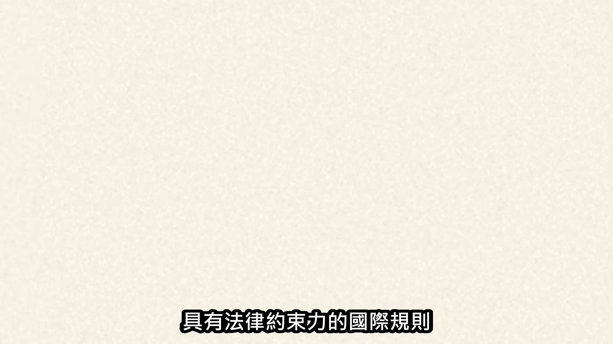

**逐字稿片段：** 為什麼會卡這麼久？ 其實想開談的國家是多數

**話題推測：** 提出問題「為什麼會卡這麼久？」

---

## 00:01:36

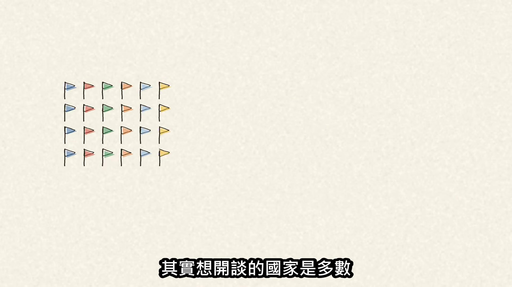

**逐字稿片段：** 共有76國支持以這份文本為基礎開談 但制度採共識決，只要1國反對就卡住 文件只能一直退讓

**話題推測：** 提供具體數字「共有76國支持」，可能顯示世界地圖或統計圖

---

## 00:01:46

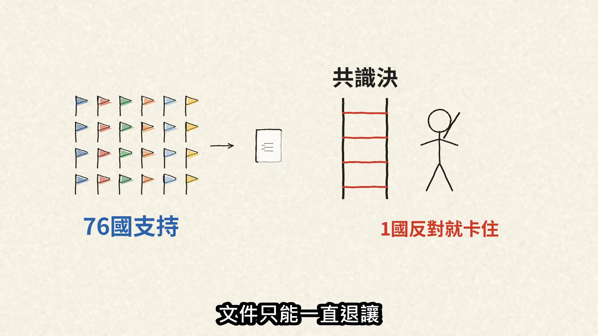

**逐字稿片段：** 最後那一步退讓，發生在9月4日 主席宣布停表 聯合國的公開鏡頭幾乎到此為止

**話題推測：** 提及具體日期「9月4日」的關鍵退讓事件

---

## 00:01:54

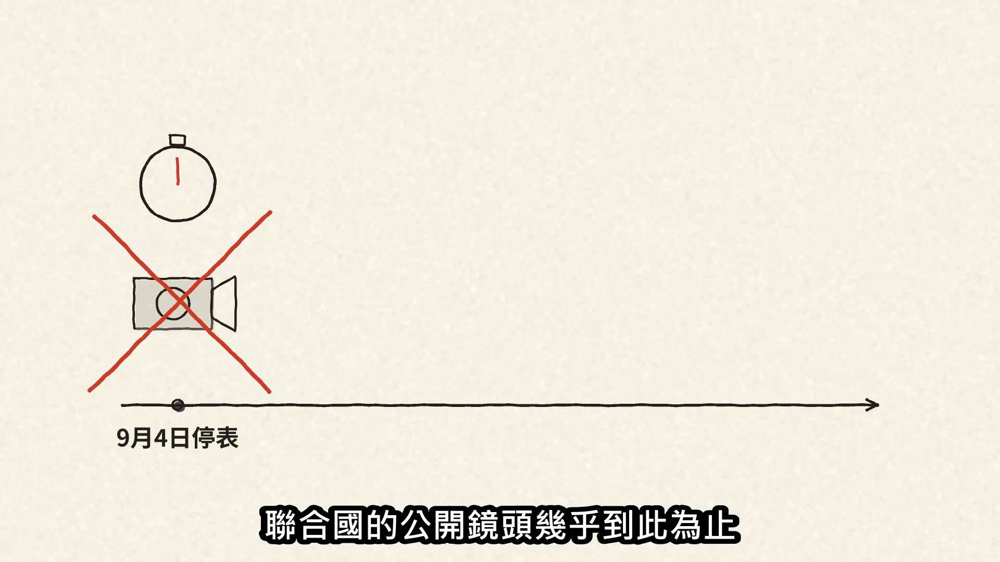

**逐字稿片段：** 《華盛頓郵報》報導 美國和俄羅斯閉門約15小時逐條改稿 到9月5日凌晨才達成共識

**話題推測：** 再次提及《華盛頓郵報》報導，引出更多閉門談判細節

---

## 00:02:01

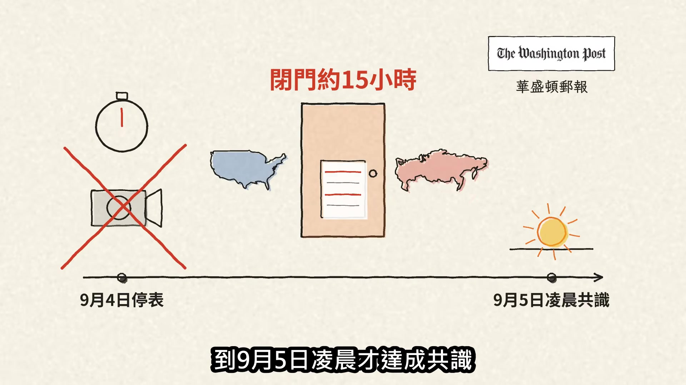

**逐字稿片段：** 那15個小時刪掉了什麼？ 《華盛頓郵報》的獨家調查指出

**話題推測：** 提出問題「那15個小時刪掉了什麼？」，預期畫面列出被刪內容

---

## 00:02:06

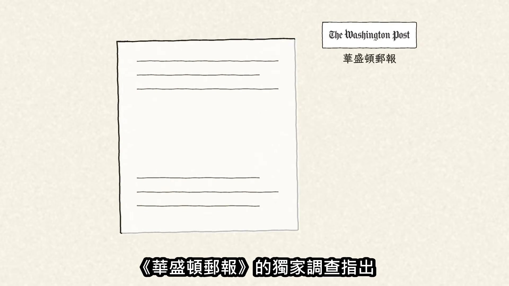

**逐字稿片段：** 其中一條是：AI產生的目標 在攻擊前必須由人類複核 這一條，被刪了 被拿掉的還不只這一條 6月5日的公開文本，還寫著倫理考量

**話題推測：** 揭露第一條被刪除的具體規則：「AI產生的目標在攻擊前必須由人類複核」

---

## 00:02:19

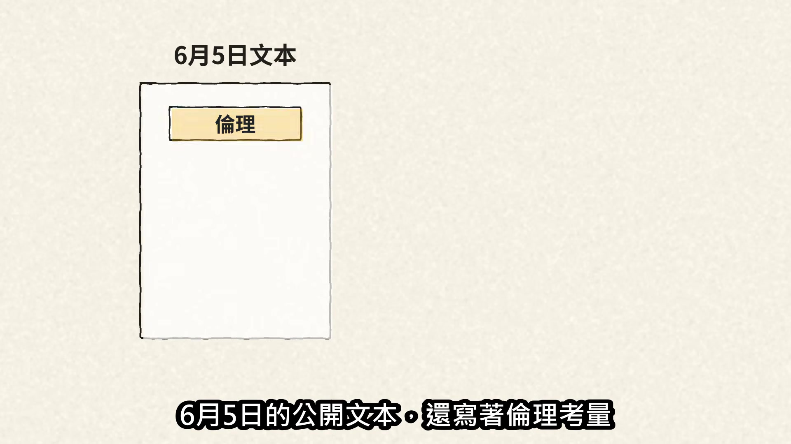

**逐字稿片段：** 武器系統也應該可預測、可靠、可追溯、可解釋 人權觀察組織指出 這些字眼在最後報告裡全被移除 並直接點名美國和俄羅斯

**話題推測：** 列出倫理考量中的具體要求：「可預測、可靠、可追溯、可解釋」

---

## 00:02:32

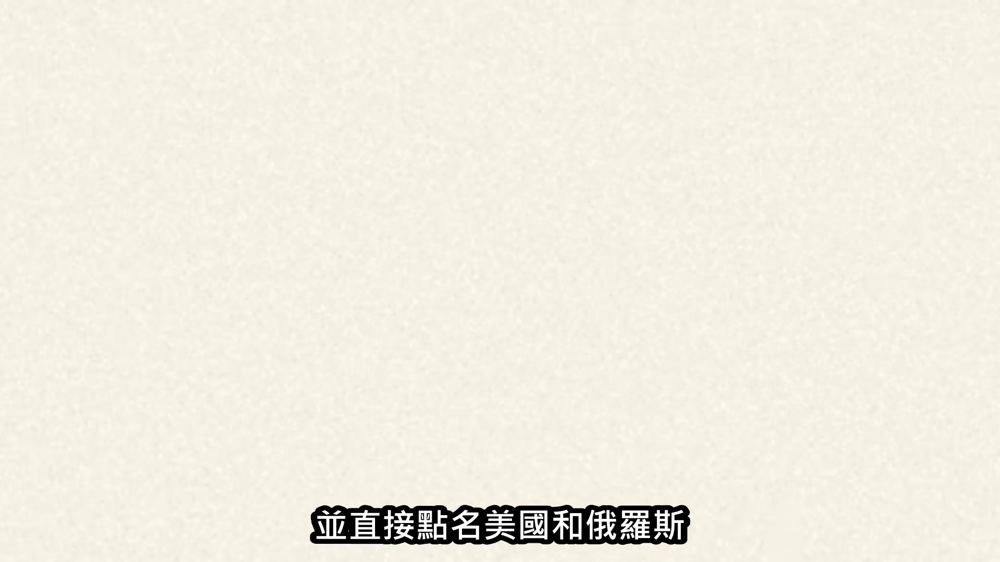

**逐字稿片段：** 一路刪下來，9月由128個締約方接受的 只剩1份沒有法律約束力的元素文件 這份文件不是條約 也不代表各國同意開始談條約

**話題推測：** 提供具體數字「128個締約方」及結果「沒有法律約束力的元素文件」

---

## 00:02:43

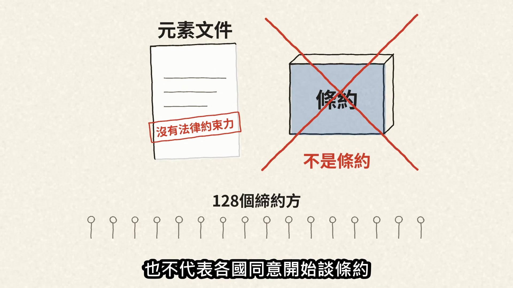

**逐字稿片段：** 美國國內也在拉扯

**話題推測：** 話題轉向「美國國內」的拉扯與衝突

---

## 00:02:45

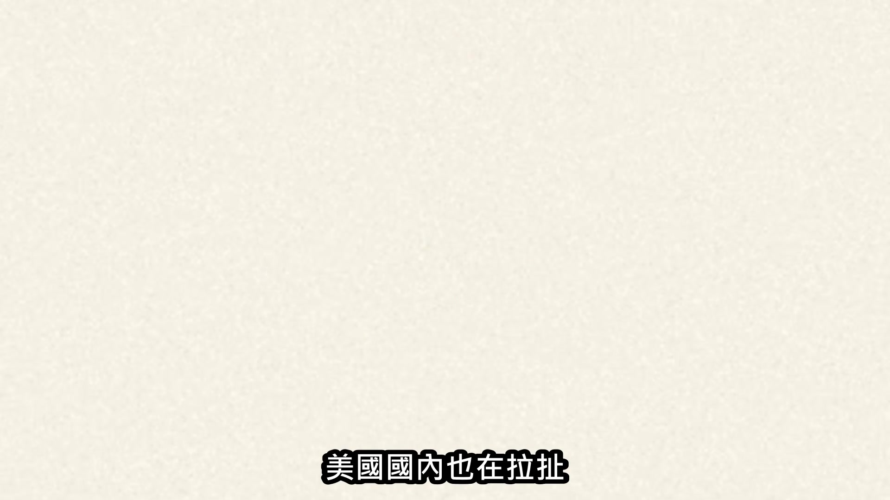

**逐字稿片段：** Anthropic執行長Dario Amodei替Claude畫了2條紅線：

**話題推測：** 介紹Anthropic執行長Dario Amodei，可能顯示人物照片與公司Logo

---

## 00:02:50

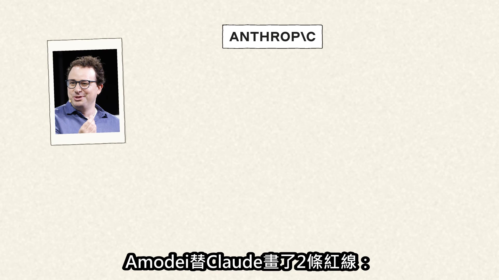

**逐字稿片段：** 不做大規模國內監控、不做全自主武器 國防部長Pete Hegseth卻把這家公司列為供應鏈風險

**話題推測：** 列出Claude的「2條紅線」：「不做大規模國內監控、不做全自主武器」

---

## 00:02:58

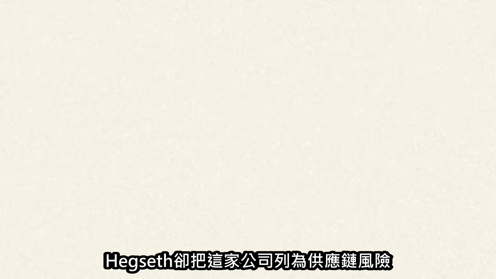

**逐字稿片段：** 這場衝突鬧上了法院 8月

**話題推測：** 提及衝突升級至「法院」，可能顯示法院相關圖像

---

## 00:03:01

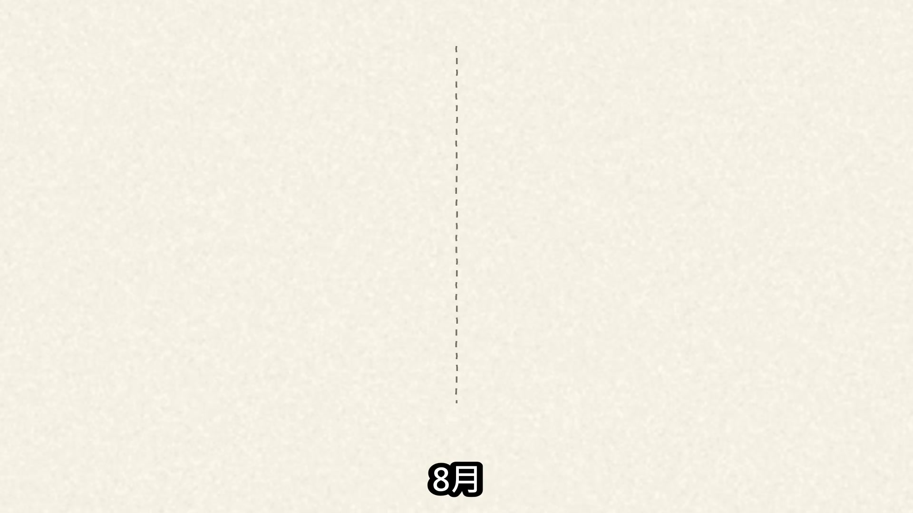

**逐字稿片段：** 加州聯邦法官裁定政府以較廣泛措施懲罰Anthropic違法

**話題推測：** 說明加州聯邦法官的裁定結果

---

## 00:03:04

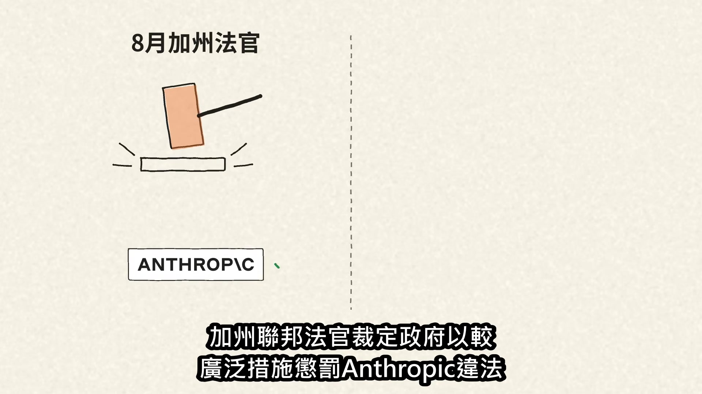

**逐字稿片段：** 可是9月25日

**話題推測：** 提供第二個法律案件的具體日期「9月25日」

---

## 00:03:06

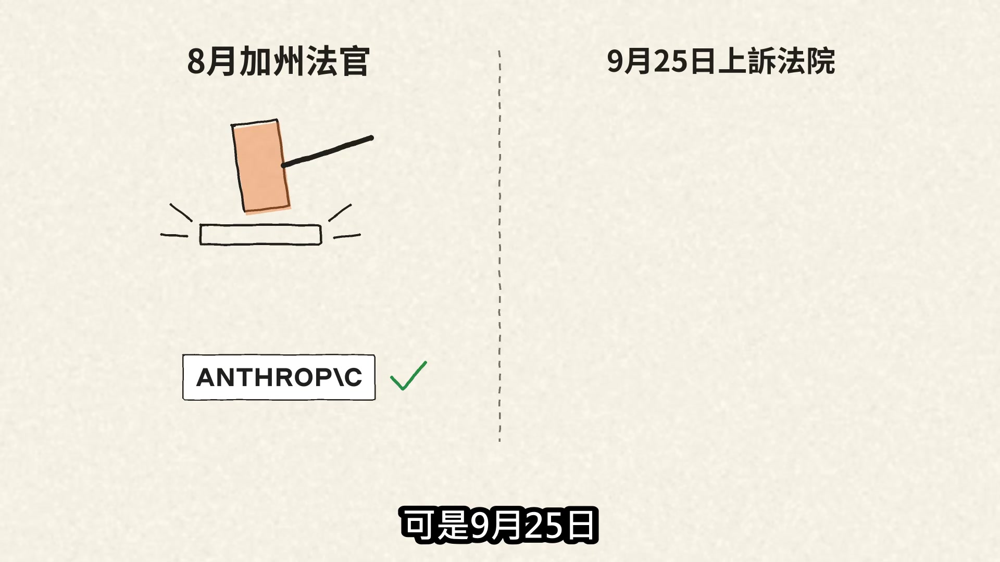

**逐字稿片段：** 華府聯邦上訴法院在另案又以2比1 支持五角大廈依另一部供應鏈法排除Anthropic 目前沒有誰全勝 法院沒有定論，國際規則也還沒定

**話題推測：** 說明華府聯邦上訴法院的裁定結果與投票數「2比1」

---

## 00:03:16

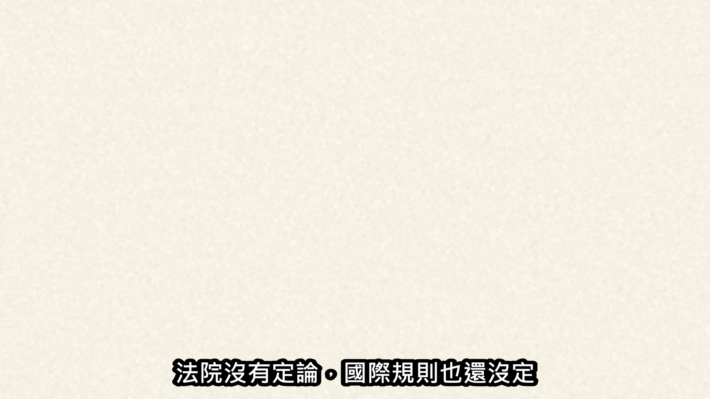

**逐字稿片段：** 11月16日到20日，各國會再回日內瓦 決定要展開有約束力的議定書談判 還是繼續討論 真正要問的是，人類還來不來得及 把最後一道有效複核寫進國際規則

**話題推測：** 提及未來會議的具體日期「11月16日到20日」與地點「日內瓦」

---
