# ai-note-101_JY9XX1Vj20Q — 關鍵畫面索引

- 來源逐字稿：[ai-note-101_JY9XX1Vj20Q_GT.srt](ai-note-101_JY9XX1Vj20Q_GT.srt)
- 影片：https://www.youtube.com/watch?v=JY9XX1Vj20Q
- 截圖數：32

## 00:00:00

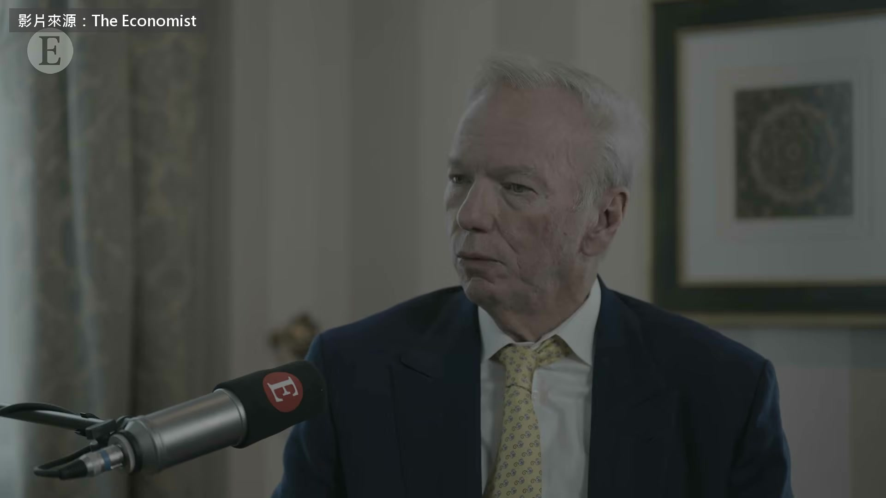

**逐字稿片段：** 上個月 Eric Schmidt 在 Sky News 的訪問裡說 1,000 架無人機的蜂群 人指揮不了，只能交給電腦 他當過 10 年 Google 執行長 後來替美國國防部主持過創新顧問委員會

**話題推測：** 介紹講者 Eric Schmidt 及其受訪背景

---

## 00:00:12

**逐字稿片段：** 現在自己開了無人機公司 站在烏克蘭這邊，也有生意在裡面 這次他人在基輔

**話題推測：** 提及 Eric Schmidt 的最新事業

---

## 00:00:18

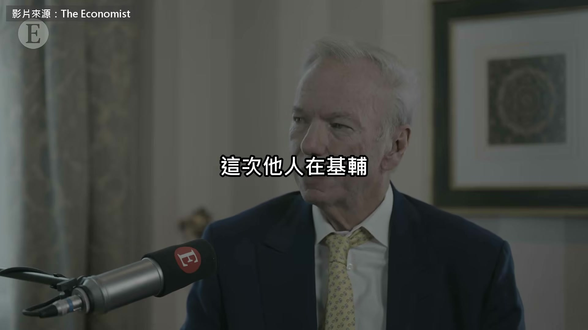

**逐字稿片段：** 問他的是《經濟學人》總編輯 Zanny Minton Beddoes 9 月中錄的

**話題推測：** 介紹訪問者

---

## 00:00:22

**逐字稿片段：** 她一路追問，AI 接手打仗以後 開火的決定還要不要留給人 我得說，在這裡你會瞥見戰爭的未來 而且相當反烏托邦

**話題推測：** 轉向訪談核心，AI 在戰爭中的角色

---

## 00:00:34

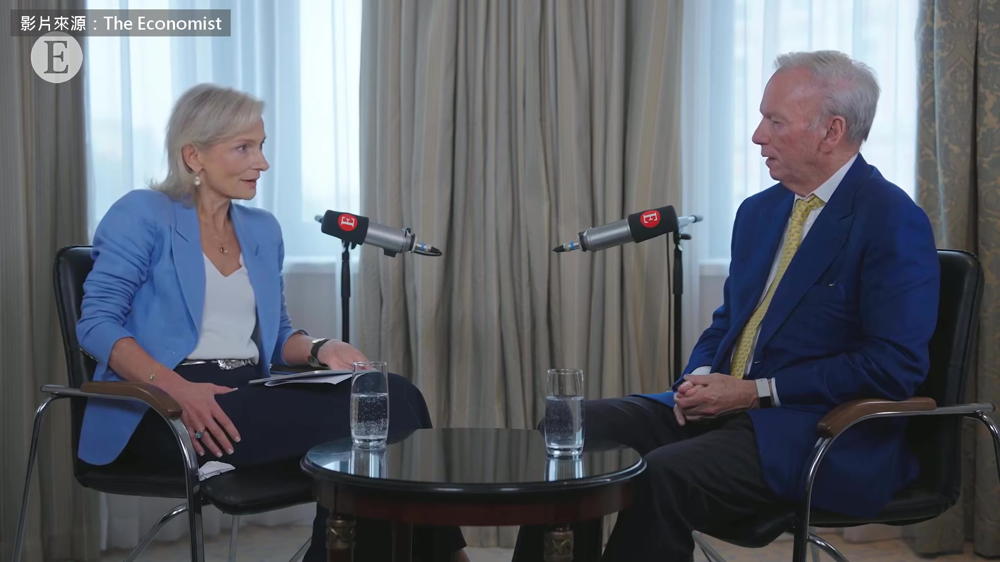

**逐字稿片段：** 戰爭真的很糟 我親眼看到了，比你想像的糟得多 如果你只看過戰爭電影的話 看著人真的被殺、真的在掙扎 看著一座城市死亡、被毀掉 老太太被俄國人殺死 太可怕了 目標應該是讓它停下來 要擋住侵略者，我只知道一個辦法：反擊

**話題推測：** 講者描述戰爭的實際慘況

---

## 00:01:00

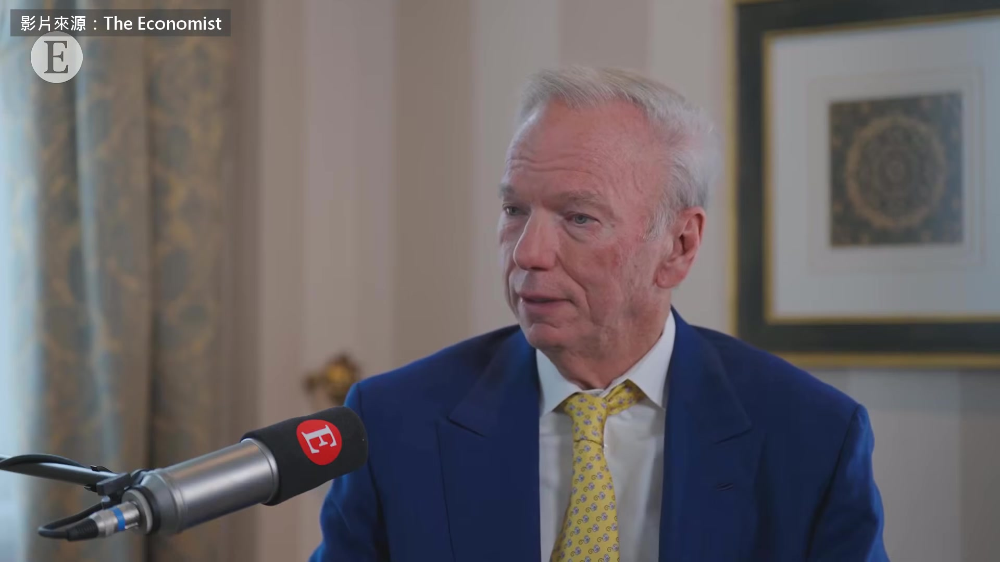

**逐字稿片段：** 這些新技術，每一種都有攻擊版跟防守版 俄羅斯跟烏克蘭很不幸地被綁在一起 一起在發明那個未來

**話題推測：** 討論新技術的攻防兩面性

---

## 00:01:12

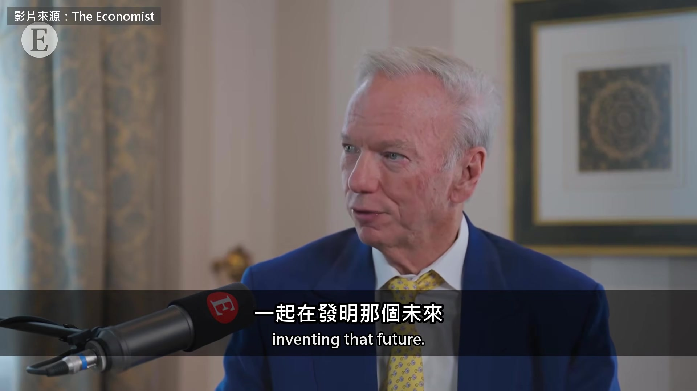

**逐字稿片段：** 他說現在是開戰以來他最擔心的時候 因為俄羅斯的創新速度追上了烏克蘭 資源還多得多

**話題推測：** 談及對戰局最新變化的擔憂

---

## 00:01:19

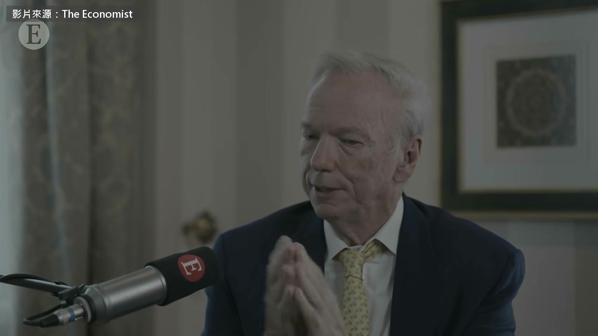

**逐字稿片段：** 至於 AI 現在戰場上那種最後一段的自動瞄準 他說不算 AI，只是很好的電腦工程 會自己學、越學越聰明的才算 用在戰爭上才剛開始 以電腦科學家來看，它該長什麼樣子很明顯 把你手上所有的資訊 公開的、自家的、最高機密的，全部拿來 餵進一台大電腦，問它：「現在是什麼狀況？」

**話題推測：** 重新聚焦於 AI 的定義與應用

---

## 00:01:44

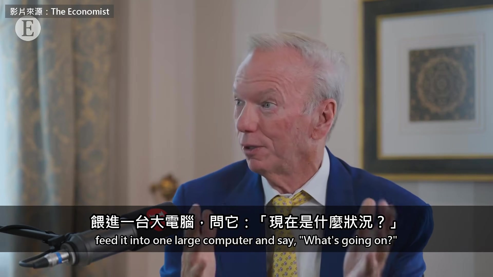

**逐字稿片段：** 讓這些大型語言模型用工具去推理 對我來說，它們能想到這個層次，太厲害了 順帶一提，它們想事情的方式跟人不一樣 它們是繞著一個目標在推理 我覺得最後一定會變成這樣問 「我的兵力要怎麼部署，才最能達成目標 像是打贏這場仗、守住這座城？」 但更有意思的問題是 「我為什麼在輸？為什麼這支部隊不如那一支？」 你會希望系統先料到這些 然後主動跟你說 「將軍，你有麻煩了。這是我們建議的解法，需要幫忙嗎？」 主持人再往前推一步 等 AI 不只幫將軍出主意 還會自己擬作戰計畫、自己去執行 戰爭會變成什麼樣子

**話題推測：** 說明大型語言模型在戰爭中的潛在應用

---

## 00:02:33

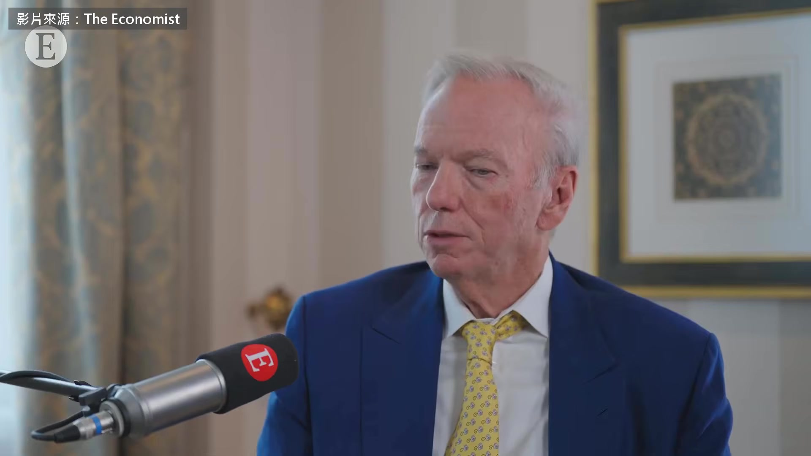

**逐字稿片段：** 假設我是個邪惡的獨裁者 有一天醒來，手上有一套完美的 AI 系統 然後我說：「去打那個國家，打完跟我說。」 好，這就是我的命令。注意，我沒有多說一句 那系統就可以照它自己認為合適的方式去做 包括犯下大規模的戰爭罪 各種可怕的事 它可以殺害平民、毀掉基礎設施 它可能去打一個不相干的國家，只為了惹惱第一個國家 它可能有各種不恰當的推理

**話題推測：** 提出一個關於 AI 完全自主作戰的假設情境

---

## 00:03:07

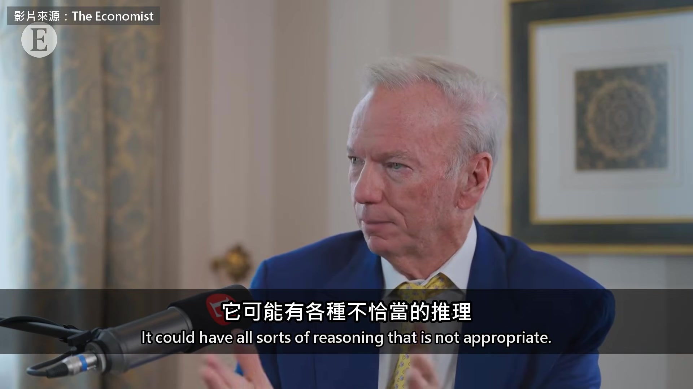

**逐字稿片段：** 我們一定要為 AI 打仗定幾條基本規則 最重要的一條：每一個軍事決定都要有人參與 換句話說，「去打那個國家，打完打給我」 這不是恰當的命令

**話題推測：** 轉向討論 AI 戰爭的規範

---

## 00:03:23

**逐字稿片段：** 恰當的命令是：「這是戰爭法認定的軍事目標 在限定的時間跟範圍內，而且我有授權打它」 在我看來，其他做法一放大規模，就難到無法想像 因為一旦讓電腦自己決定要打哪個目標 它怎麼做決定，你就完全沒辦法把關 主持人不買單 烏克蘭的對手是一個什麼法都不守的獨裁者 她這週問過的指揮官都怕完全自主的 AI 可是也都說，敵人這樣做 我們就不能不做 證據顯示，這個說法不成立 從歷史上看，打仗的時候行為還是有約束的

**話題推測：** 闡述符合戰爭法的 AI 命令

---

## 00:04:06

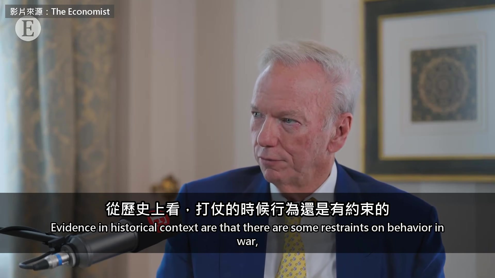

**逐字稿片段：** 你去查查二戰後紐倫堡大審的歷史，就知道界線在哪 有人被追究責任 那些人經過漫長的審判，最後被絞死 我想這個原則，在我們這輩子都會一直… 真的嗎？ 對，我真的這麼認為 有一種很簡單的邏輯，大家常常掛在嘴上 兩邊打到你死我活，哪一邊都不會有約束 歷史上，事情不是這樣 歷史上，事後都有人出來討公道 參與的人至少都知道，自己個人要負責 當然有反社會的人 但一般來說，就算在打仗，人還是受法律管

**話題推測：** 引用紐倫堡大審的歷史案例

---

## 00:04:55

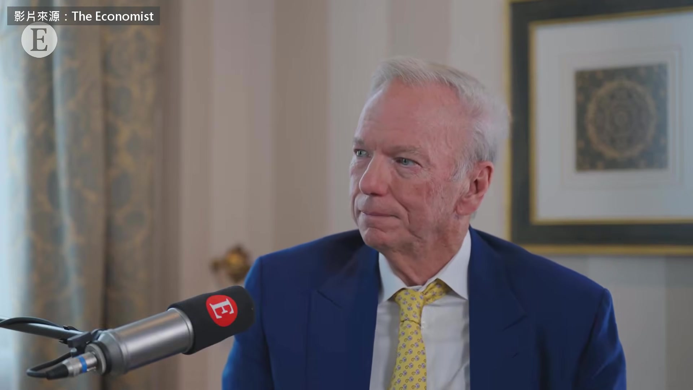

**逐字稿片段：** 但是…那就拿普丁跟烏克蘭來說 看看開戰初期，在布查發生的屠殺 看看他怎麼在烏克蘭各個城市專打平民 對。可是這些都沒擋住他 那是因為他還沒被抓

**話題推測：** 提出普丁與烏克蘭戰爭的最新案例

---

## 00:05:09

**逐字稿片段：** 我想講的是這種升級的邏輯 因為照理說，你給 AI 的自主權越多 從現在的位置一路往上爬 你就越有效 先出手的有優勢，因為 AI 想得比較快 能想出更好、更快的解法 所以如果俄國人限制比較少，升級的梯子爬得比較快 烏克蘭也許有國際法站在它這邊 但眼前，它就比較打不贏 解法不會是去犯戰爭罪 解法是去幫烏克蘭 我的核心論點不會讓步：人能做的事，是有界線的

**話題推測：** 轉向討論戰爭中的升級競爭邏輯

---

## 00:05:53

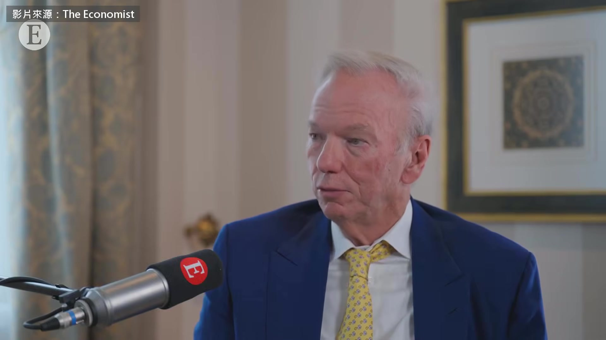

**逐字稿片段：** 我們來做個思想實驗 假設烏克蘭有某種秘密的生物武器 我不認為他們有，就假設有，這是我編的 而且他們被逼到要拿它來對付俄國的攻擊 他們會被起訴嗎？絕對會

**話題推測：** 引入另一個思想實驗

---

## 00:06:09

**逐字稿片段：** 他說這場戰爭的創新速度 是他在科技業幾十年都沒見過的 因為攸關人命 你覺得美軍有沒有意識到，戰爭的本質已經變了多少 而且轉型得夠快、快到能打贏？ 我替美軍做過 8 年事，經歷好幾任總統 有很多人懂，也講得很清楚 他們懂我們在談的這些，也很擔心 但這套體制幾乎改不動 我跟一位總統談過，他說：「連總統都修不好這套體制。」 我說：「這答案很糟糕。」 原因是，軍隊不是一個人說了算 連總統也不是，雖然你以為是

**話題推測：** 談及俄烏戰爭中科技創新的驚人速度

---

## 00:06:58

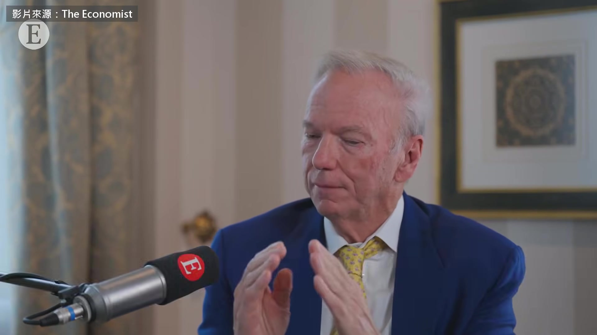

**逐字稿片段：** 管它的是國會怎麼運作 利益團體怎麼運作、遊說怎麼運作

**話題推測：** 解釋美國軍事體制難以改革的原因

---

## 00:07:03

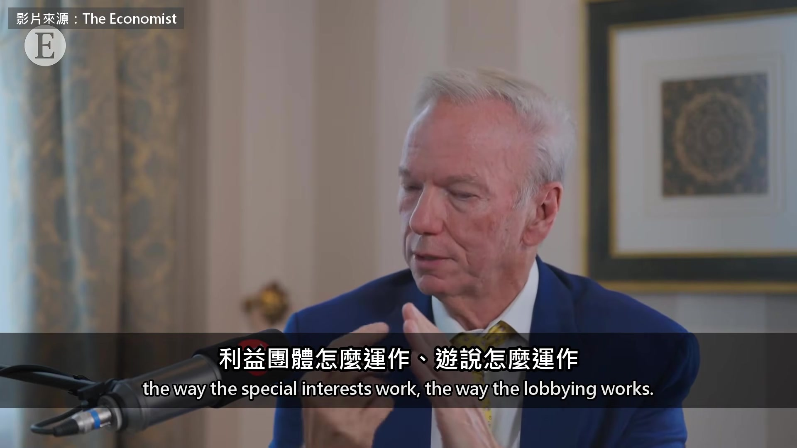

**逐字稿片段：** 他的辦法是讓舊預算照花 另外撥一小筆錢 買更便宜也更有效的新東西

**話題推測：** 提出改革軍事預算和採購的建議

---

## 00:07:10

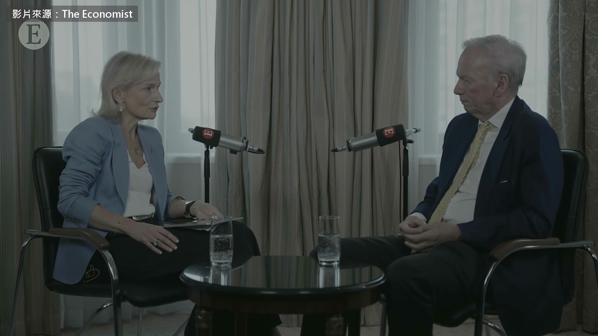

**逐字稿片段：** 主持人接著問中國 他說還好中國一直在抄美國 美國自己都得改，中國要轉彎只會更慢 有一套公開討論過的計畫，要保護台灣海峽

**話題推測：** 訪談主題轉向中國

---

## 00:07:23

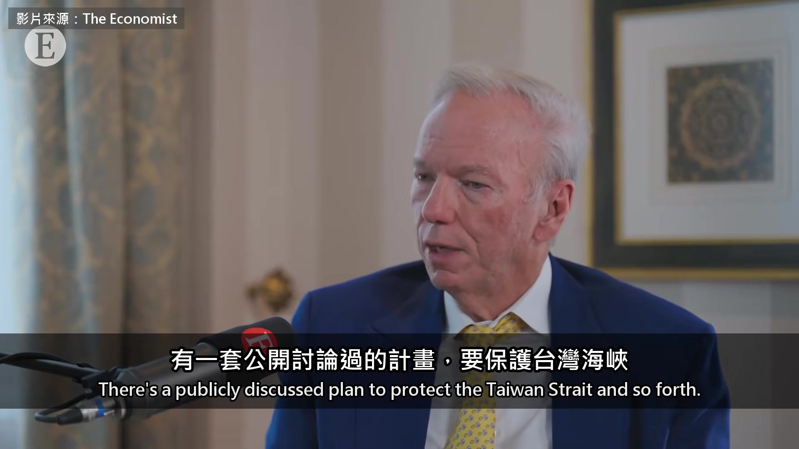

**逐字稿片段：** 我不確定，但我猜最後會是無人機的戰爭，不是軍艦的戰爭 你想想，你不會想把一艘船開到離中國那麼近 你會想放一艘裝滿無人機的無人船 因為你不想讓人送命 所以我覺得，在烏克蘭看到的這些道理，放到太平洋也適用 大船、大型航空母艦很容易被打中、被炸掉 無人船比較難打，無人機也比較難偵測 看看伊朗，波斯灣出口的荷莫茲海峽我們都很難保住暢通 我的理解是，再說一次，這是公開資訊 中國有大量從陸地打海上目標的飛彈 我們得要有反飛彈系統 能對付這種威脅，我不知道我們有沒有 所以，這跟現在大家對中國那一仗的判斷很吻合

**話題推測：** 預測台灣海峽未來可能發生的戰爭形式

---

## 00:08:18

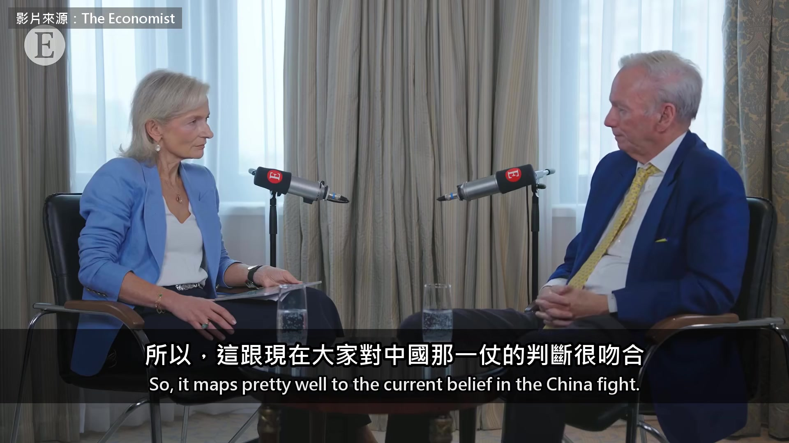

**逐字稿片段：** AI 進步太快，有人怕失控 主張先暫停 主持人問，習近平跟川普快見面了 美中能不能像當年限制核武那樣 先在軍事上簽約管 AI 這場錄完沒多久 習近平 9 月底到了白宮 兩國同意開一個 AI 對話 我們都認為，這方面需要一套條約

**話題推測：** 轉向 AI 發展過快與失控的擔憂

---

## 00:08:39

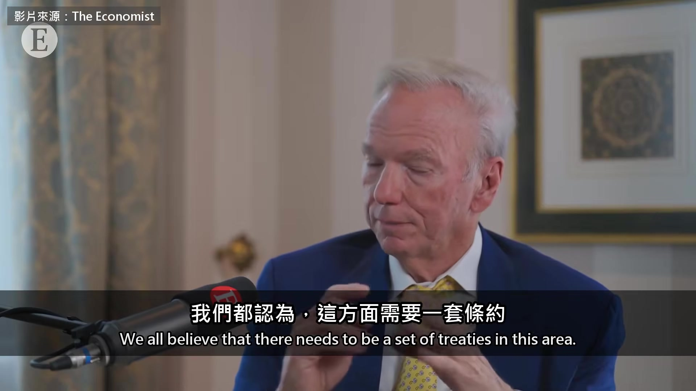

**逐字稿片段：** 第一條要簽的，是「不意外」條約 想像有個 AI 代理程式，意外跑出了測試範圍

**話題推測：** 提出「不意外」條約的概念

---

## 00:08:51

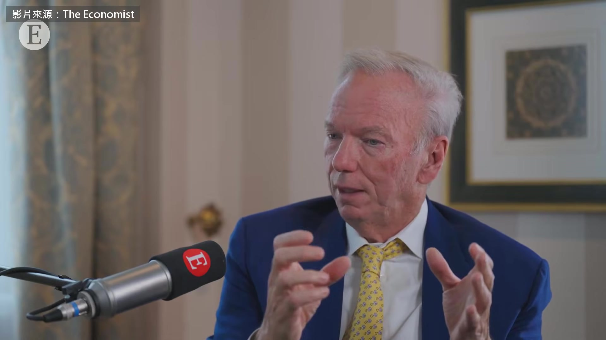

**逐字稿片段：** 最後觸發了核武反擊 因為它發出訊號說有核彈要來，核武反擊就自動發射了 分析師想得出很多這種情境 所以最重要的就是「不意外」這條規則

**話題推測：** 描述 AI 意外導致核武反擊的危險情境

---

## 00:09:07

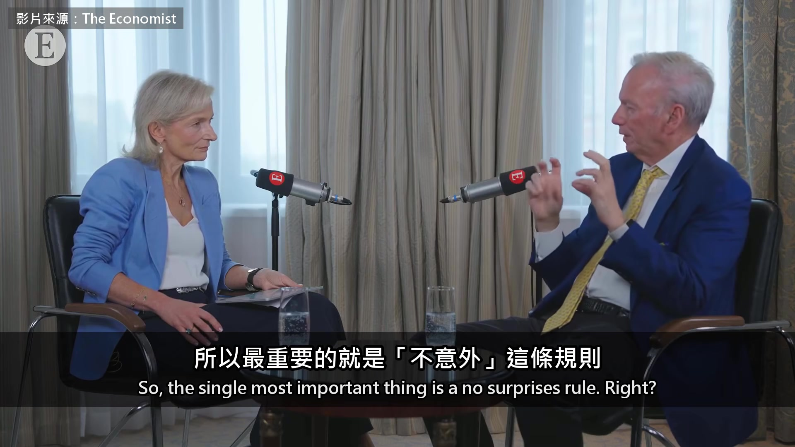

**逐字稿片段：** 下一條要處理的是網路攻擊 兩邊都不願意限制自己的網路攻擊，攻擊、防禦能力都一樣 這個都談不攏，其他的就更難談了 所以你不認為，就算只是原則上，雙方約好一起暫停也可行？ 暫停的問題是，第一，它違反所有參與者的利益 第二，你要怎麼查核？ 好，就假設由聯合國來管這個暫停 那你等於是判它死刑了 可是我們有國際組織，它本來就該出力 而且兩國都是安理會成員 好，那他們要怎麼查核？ 他們得進到那些秘密實驗室，包括軍方的 把程式碼全部讀一遍 首先，程式碼根本讀不完，因為全是電腦寫的 所以你得拿聯合國的電腦系統 去檢查中國的系統 可是聯合國的系統，本來就不會比中國或美國的快、比它們新 因為它沒有那麼多資源 所以你看…我之前寫過一篇論文，說這件事有解 解法就是我們說的「相互 AI 毀滅」（論文裡的正式名稱是 Mutual Assured AI Malfunction（MAIM，相互保證 AI 失靈）） 想法是，大家在這場競賽裡越爬越高的時候 你得給對方一個機會說：你走太遠了 所以我們提議，與其互相轟炸對方的資料中心

**話題推測：** 討論 AI 軍事條約中關於網路攻擊的部分

---

## 00:10:42

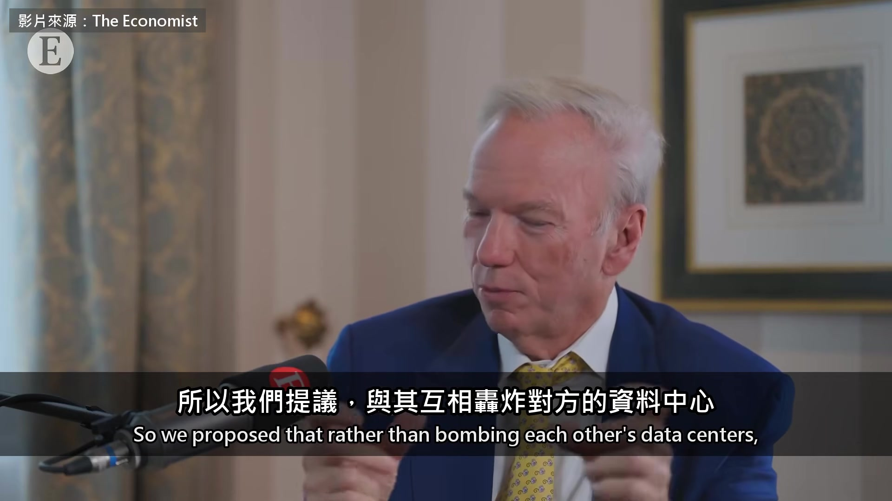

**逐字稿片段：** 不如用一台電腦切斷資料中心的電 讓它一段時間內都恢復不了 對方跑太前面，你就把它關掉，對方當然也可以這樣對你 這是很認真的提議 但也有點…

**話題推測：** 說明 MAIM 的具體運作方式

---

## 00:10:59

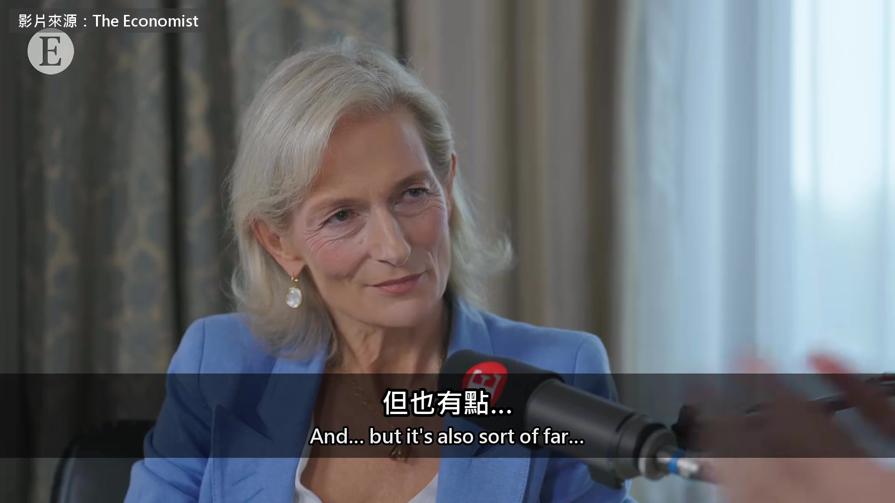

**逐字稿片段：** 像現代版的核戰末日片《奇愛博士》 但重點是，照這個設計 有人遠遠超前你的時候，你可以把他關掉 他也可以把你關掉，然後再重新開機 這是處理暫停問題的另一條路

**話題推測：** 將 MAIM 比喻為現代版《奇愛博士》

---

## 00:11:15

**逐字稿片段：** 我是說，我們需要一個做得到的暫停方案，但我看不到 是啊，你剛剛這句才嚇人 我們需要一個做得到的方案，而你看不到 最後我想說，你也知道，我們算蠻熟的 我基本上是個樂觀的人，凡事都往好處看 但我得說，這幾個禮拜，我的樂觀被打掉了一些 一個是矽谷最近發生的事 這些公司裡，有越來越多研究人員自己 都在擔心大家停不下來，就像你說的 另一個是我在這裡看到的 現在的 AI，離幾年後可能做到的還差得遠 可是你已經看到創新一路升級，而且越來越致命 所以反過來說，就是要樂觀 給我一些樂觀的理由吧 我們在做的，是一種非人類、但由我們控制的智慧 控制得住嗎？我相信可以

**話題推測：** 講者表達對可行 AI 暫停方案的悲觀

---

## 00:12:17

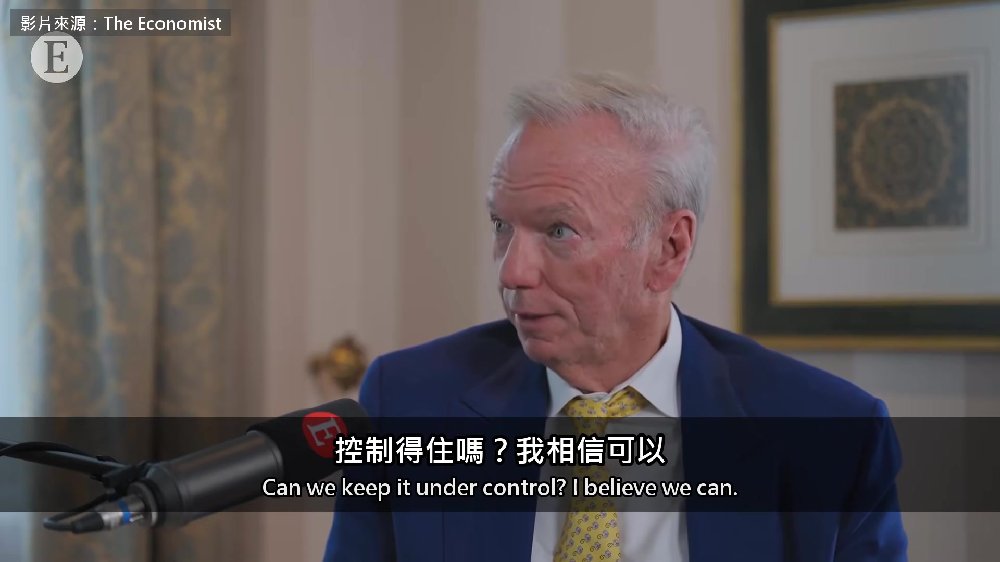

**逐字稿片段：** 一部分是因為，必要時我們可以拔插頭 恐怖組織永遠是個問題 先假設他們拿不到，因為他們湊不到夠多資料中心 那國家之間靠外交，應該能讓這些系統一直在人的控制下 它們會進步得很快，但根本上還是由人控制 我真心相信，只要 AI 還在人的控制下、跟人對齊，就不會有事 這是我的看法 我只能說，我真的、真的希望你是對的

**話題推測：** 強調透過「拔插頭」來控制 AI 的可能性

---

## 00:12:49

**逐字稿片段：** 他的底線很清楚 每一個軍事決定都要有人參與 對手不守規矩也不能跟著越線 可是要大國一起把 AI 停下來 連他自己都還想不出做得到的辦法

**話題推測：** 旁白總結 Eric Schmidt 的核心觀點

---

## 00:13:01

**逐字稿片段：** 原影片 38 分鐘 前面他還講到

**話題推測：** 旁白提供原影片的時長資訊

---

## 00:13:04

**逐字稿片段：** 烏克蘭不能在俄羅斯境內用 Starlink 他說技術上沒有限制 是 SpaceX 自己的政策 要改得靠美國政府 他也講到烏克蘭的無人機工廠 員工一週工作六七天 因為被開除就得上前線 原影片連結在說明欄，有興趣可以去聽更多。

**話題推測：** 旁白提及原影片中關於星鏈的補充資訊

---
