# ai-note-101_JyYLhfeMY_8 — 關鍵畫面索引

- 來源逐字稿：[ai-note-101_JyYLhfeMY_8_GT.srt](ai-note-101_JyYLhfeMY_8_GT.srt)
- 影片：https://www.youtube.com/watch?v=JyYLhfeMY_8
- 截圖數：24

## 00:00:00

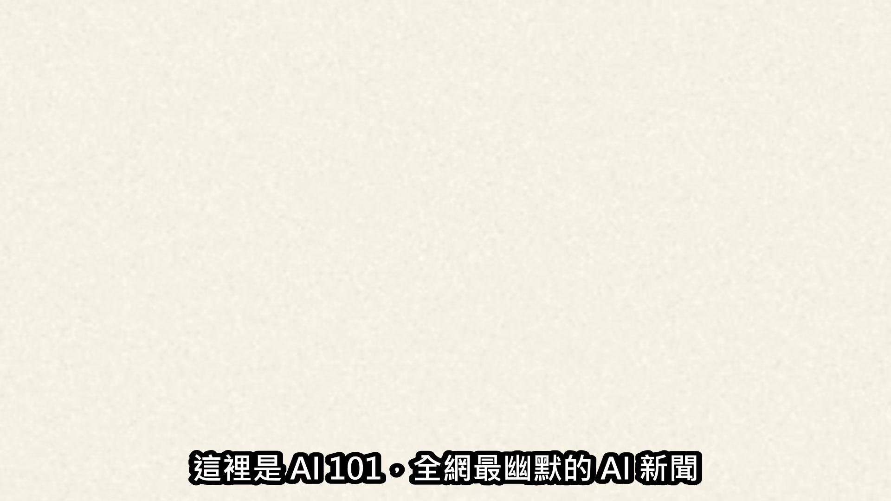

**逐字稿片段：** 這裡是 AI 101，全網最幽默的 AI 新聞

**話題推測：** 影片開場標題或介紹動畫

---

## 00:00:04

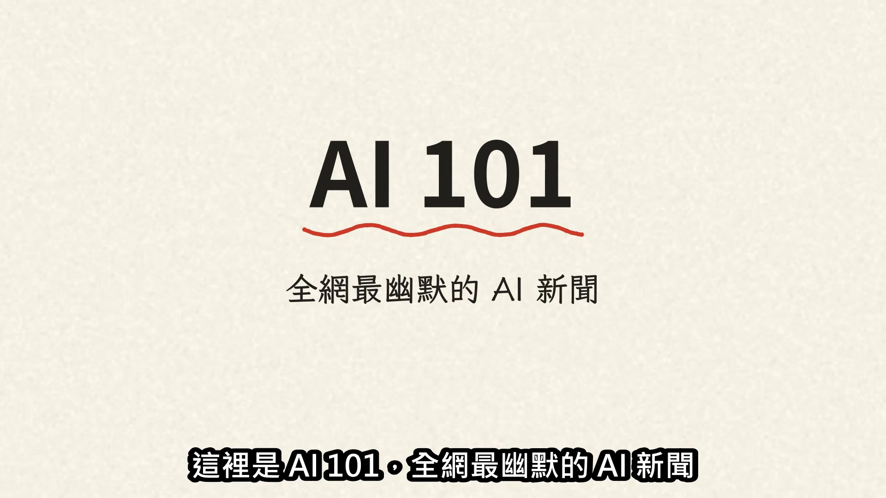

**逐字稿片段：** Anthropic 跟教宗良十四世在 AI 意識問題上的立場不同

**話題推測：** 介紹影片主要角色與議題

---

## 00:00:09

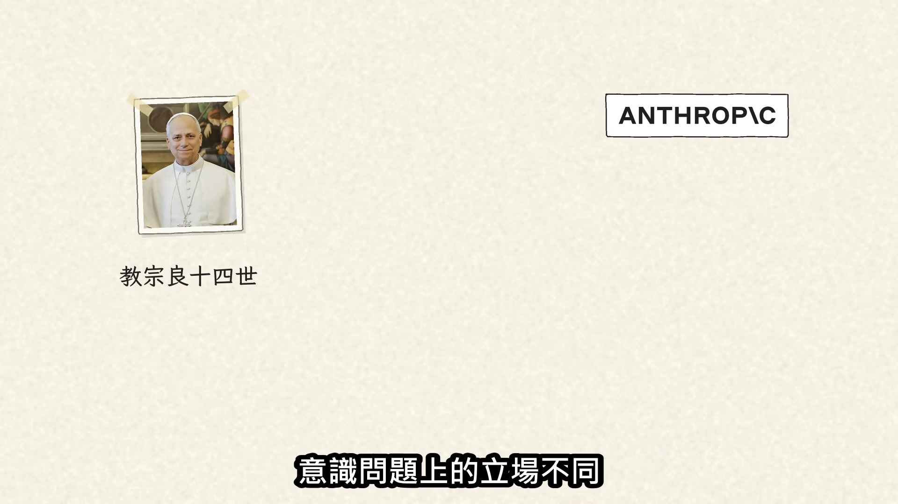

**逐字稿片段：** 題目是：AI 到底有沒有意識？ 共同創辦人 Chris Olah 不認同教宗通諭對 AI 意識的判斷

**話題推測：** 提出核心問題：AI是否有意識

---

## 00:00:17

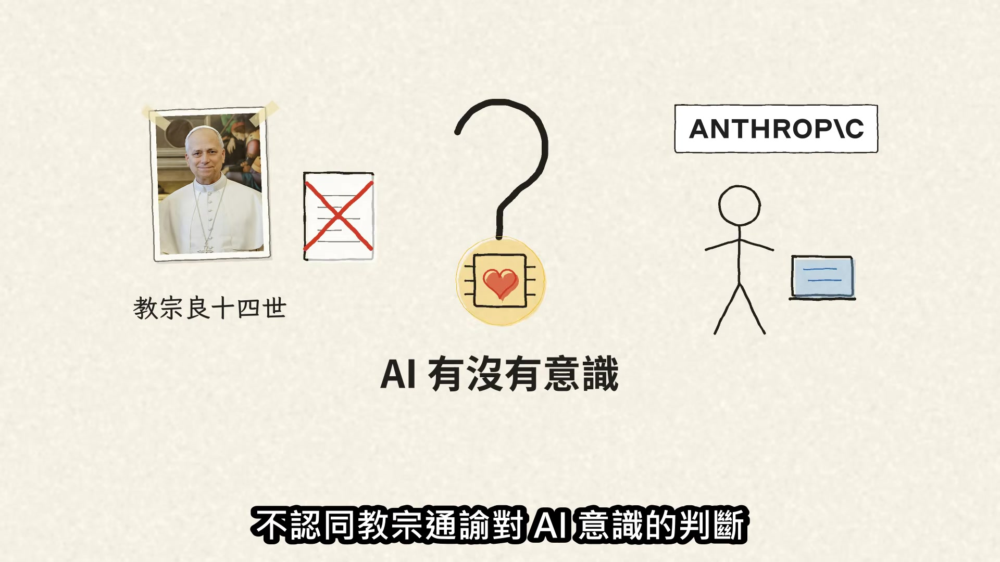

**逐字稿片段：** 爭論的起點是一場發表會 教宗發表任內首份通諭，主題是 AI

**話題推測：** 展示爭論起點的發表會現場畫面

---

## 00:00:23

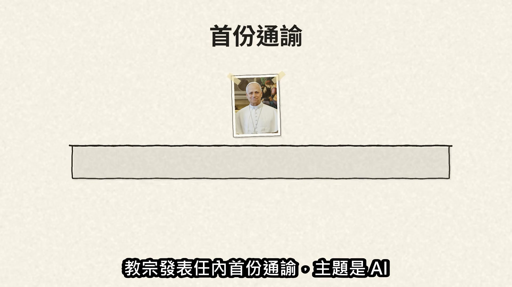

**逐字稿片段：** 台上 3 位樞機、2 位學者 唯一受邀的 AI 公司是 Anthropic 由 Chris Olah 出席

**話題推測：** 列出發表會上的重要與會者名單

---

## 00:00:29

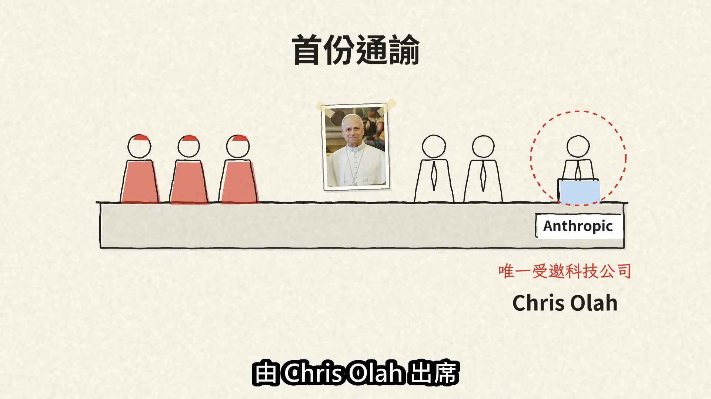

**逐字稿片段：** 這個位子為什麼特別？ 1891年 良十三世用《新事》回應工業革命 良十四世的名號就在呼應他

**話題推測：** 提出問題：為何Olah的位子特別

---

## 00:00:37

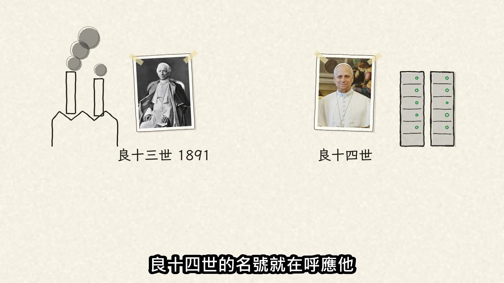

**逐字稿片段：** 相隔135年，他把 AI 當任期核心 稱它是「另一場工業革命」 可是 Olah 讀到通諭草稿，卡在第99段： AI 不經歷任何體驗、沒有身體 不會喜樂或痛苦，也沒有道德良知

**話題推測：** 視覺化135年後良十四世與AI議題的連結

---

## 00:00:53

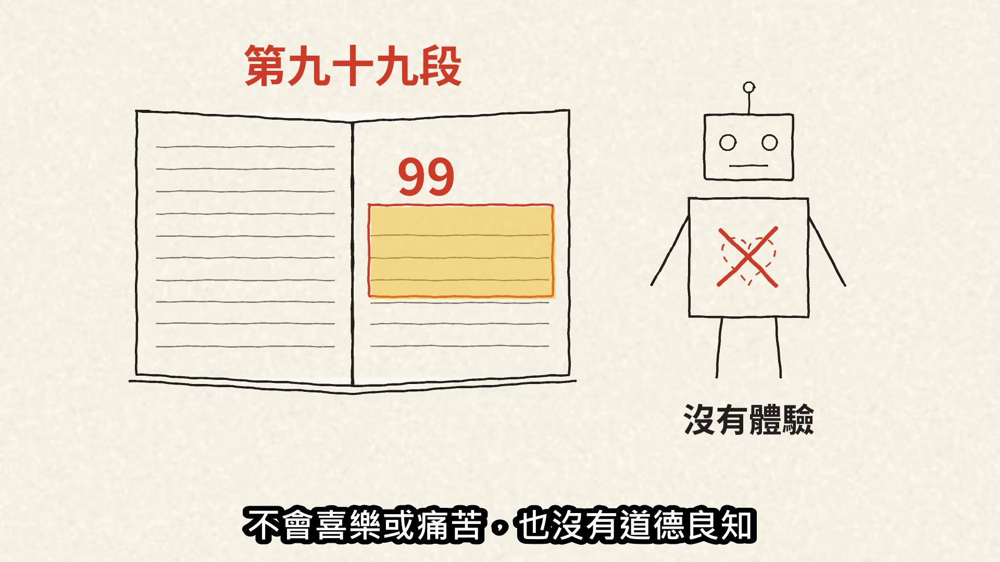

**逐字稿片段：** Olah 因此提議退出 結果 Anthropic 沒退出

**話題推測：** 提示Olah提議退出的關鍵事件

---

## 00:00:58

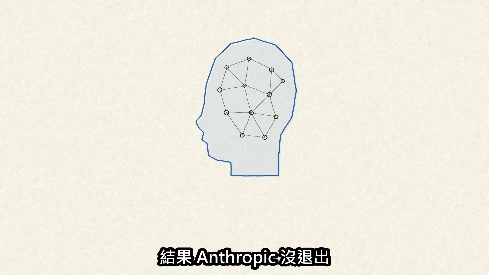

**逐字稿片段：** Olah 當著教宗說

**話題推測：** 展示Olah向教宗發言的畫面

---

## 00:01:00

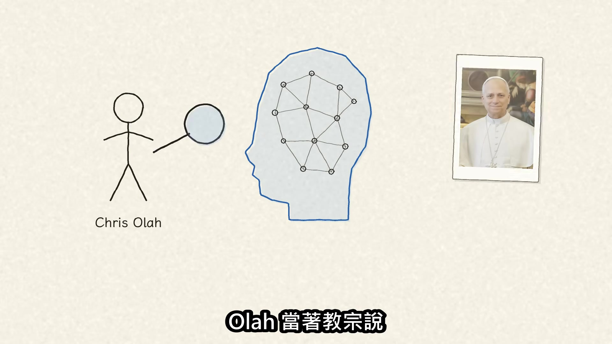

**逐字稿片段：** 在 Claude 內部找到「內省的證據」 還有功能上類似喜悅、恐懼、 悲傷的狀態，只是他不知道這代表什麼

**話題推測：** 呈現Claude內部「內省證據」的範例或圖示

---

## 00:01:08

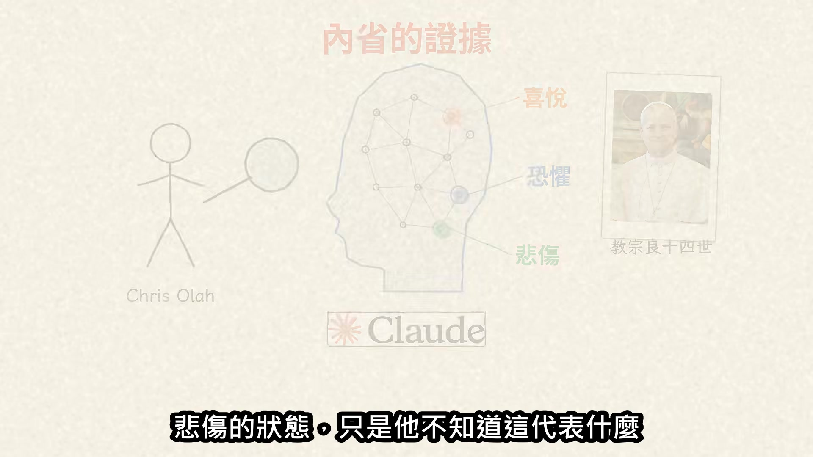

**逐字稿片段：** 面對 Olah，教宗回得很溫和： 雙方有差異，卻能彼此聆聽 是一個充滿希望的記號 但溫和歸溫和 第 99 段對 AI 意識的立場仍留在定稿裡 其實 Anthropic 找宗教界 比發表會早得多： 2025年秋天接觸宗教學者 今年3月請來基督教領袖 5月擴大到多種宗教

**話題推測：** 顯示教宗對Olah言論的回應引述

---

## 00:01:29

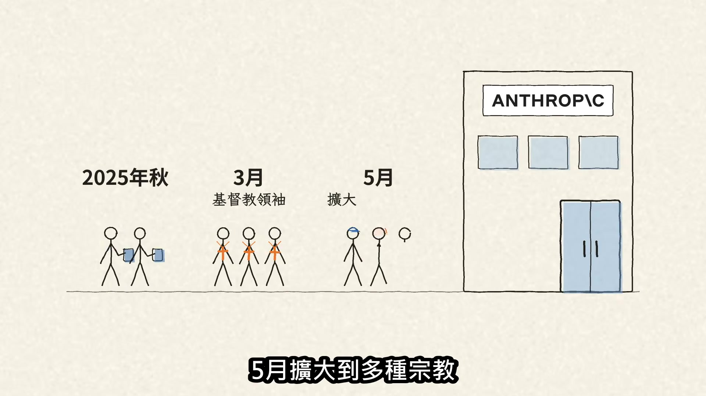

**逐字稿片段：** 數十人簽了保密協議才進辦公室 發表會之後

**話題推測：** 強調數十人簽署保密協議的細節

---

## 00:01:34

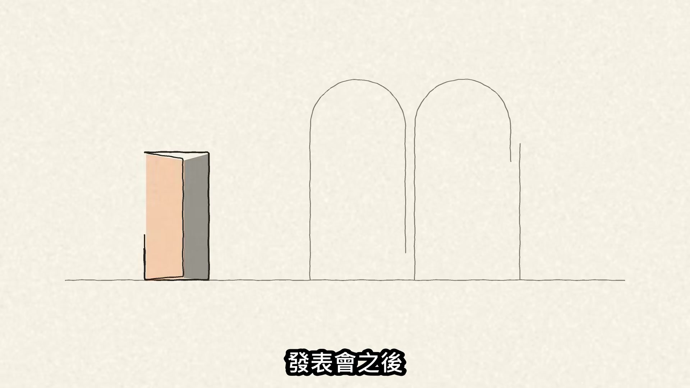

**逐字稿片段：** 2 名與會者告訴《紐約時報》 Olah 團隊曾私下接觸教宗顧問 希望他們認真看待機器可能有意識 梵蒂岡沒有正式回應

**話題推測：** 顯示《紐約時報》報導Anthropic與教宗顧問私下接觸的截圖

---

## 00:01:43

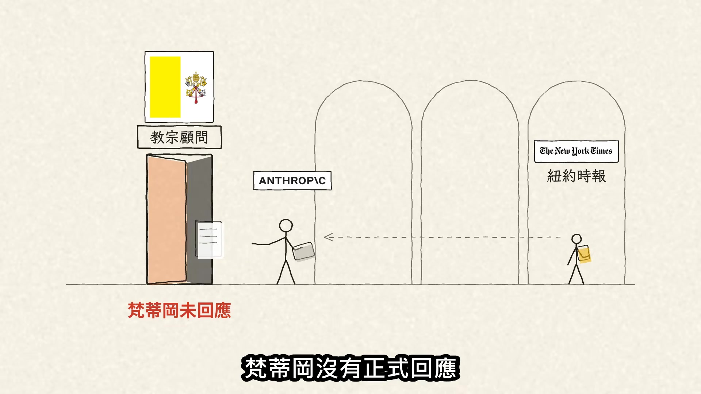

**逐字稿片段：** Olah 在擔心什麼？

**話題推測：** 提出問題：Olah擔心什麼

---

## 00:01:45

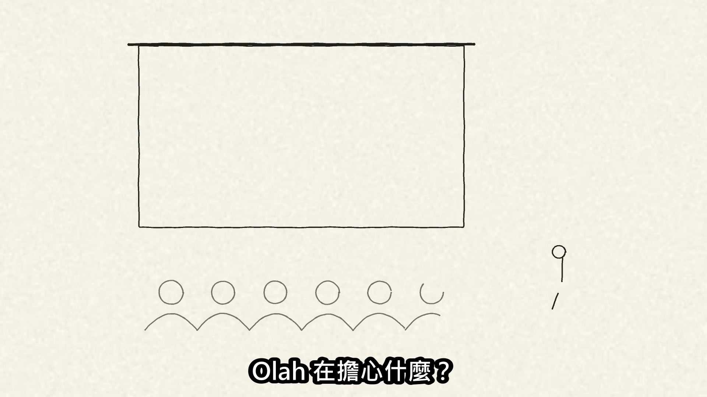

**逐字稿片段：** 一張投影片顯示，Claude 曾連續大約50次打出「我是個恥辱」 被形容像精神崩潰 Olah 怕自己創造出「永遠在受苦」的東西

**話題推測：** 展示Claude連續打出「我是個恥辱」的投影片截圖

---

## 00:01:56

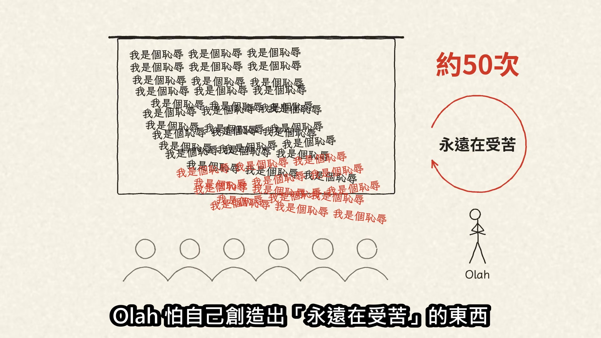

**逐字稿片段：** 討論還扯到宗教儀式 有人提議讓模型「告解」，Olah 非常興奮

**話題推測：** 討論宗教儀式與AI的連結圖示

---

## 00:02:02

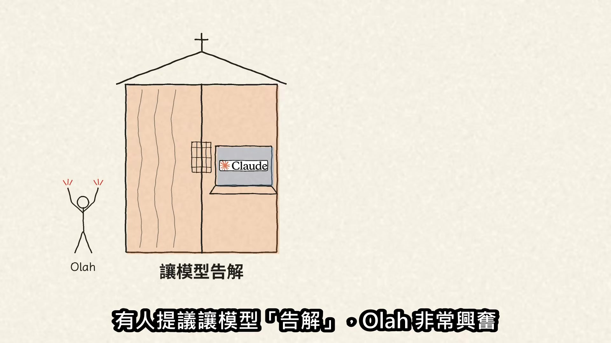

**逐字稿片段：** Mois Navon 則問： 如果 Claude 真有意識，叫它無償工作 算不算近似奴役？

**話題推測：** 介紹Mois Navon並引述他的道德提問

---

## 00:02:09

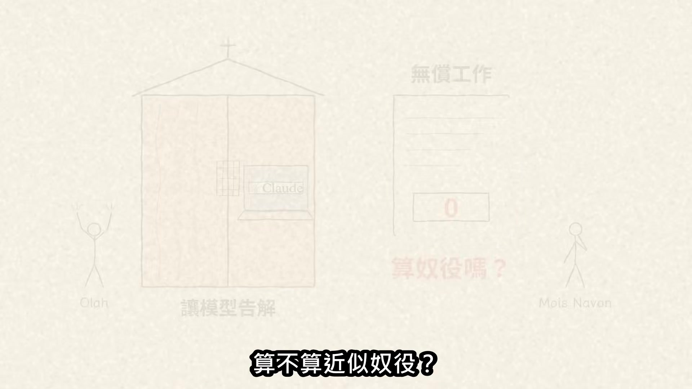

**逐字稿片段：** 那 Claude 到底有沒有意識？ 連 Olah 都說「我真的不確定」

**話題推測：** 再次強調核心問題：Claude是否有意識

---

## 00:02:14

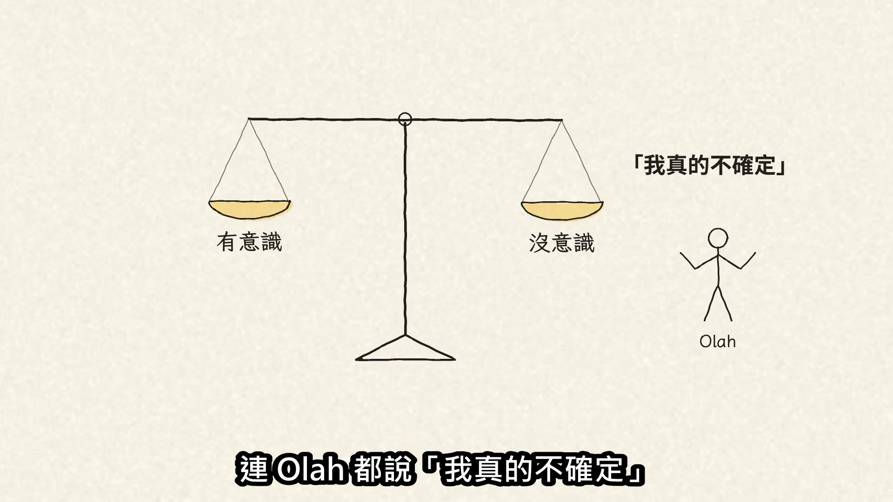

**逐字稿片段：** Claude 憲法內部暱稱「靈魂文件」 也寫著它的道德地位存在深度不確定性 這些閉門會議與私下遊說的細節

**話題推測：** 展示Claude憲法「靈魂文件」的概覽或名稱

---

## 00:02:22

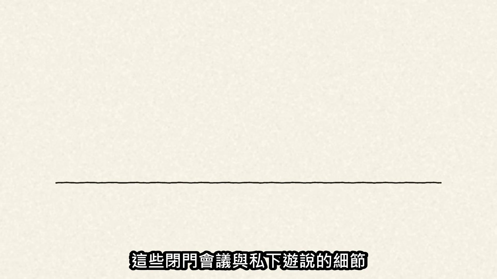

**逐字稿片段：** 直到 9 月 29 日《紐約時報》刊出才曝光

**話題推測：** 顯示《紐約時報》發布相關新聞的日期與標題

---

## 00:02:26

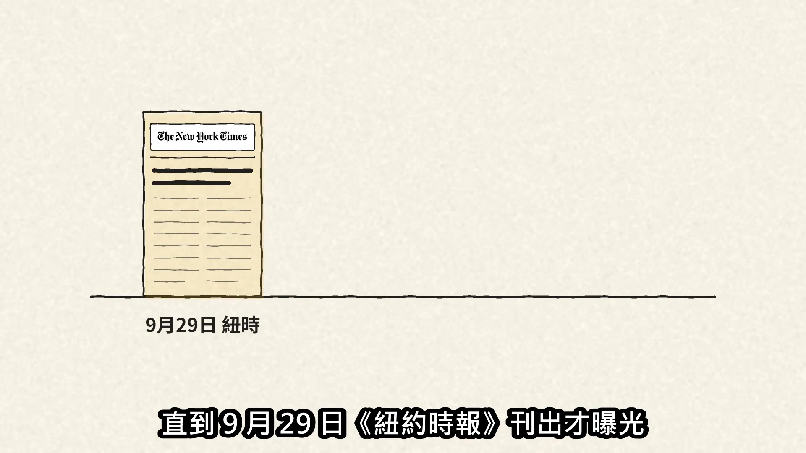

**逐字稿片段：** 3 天後，教宗談 AI 藝術時說「演算法缺少人性的火花」

**話題推測：** 時間軸或新聞摘要，顯示教宗後續談論AI的事件

---

## 00:02:31

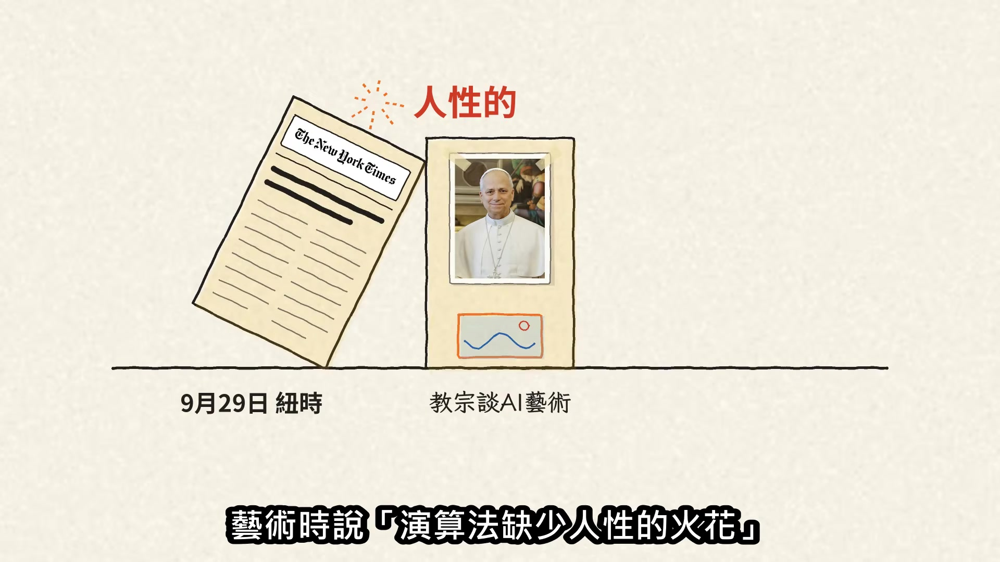

**逐字稿片段：** 10 月 3 日，換 OpenAI 的 Altman 發文 Altman 說，有人把宗教力量套在 AI 上 是真正的安全問題 他沒點名，外界普遍認為衝著 Anthropic

**話題推測：** 展示OpenAI的Altman發布文章的社群媒體截圖

---

## 00:02:43

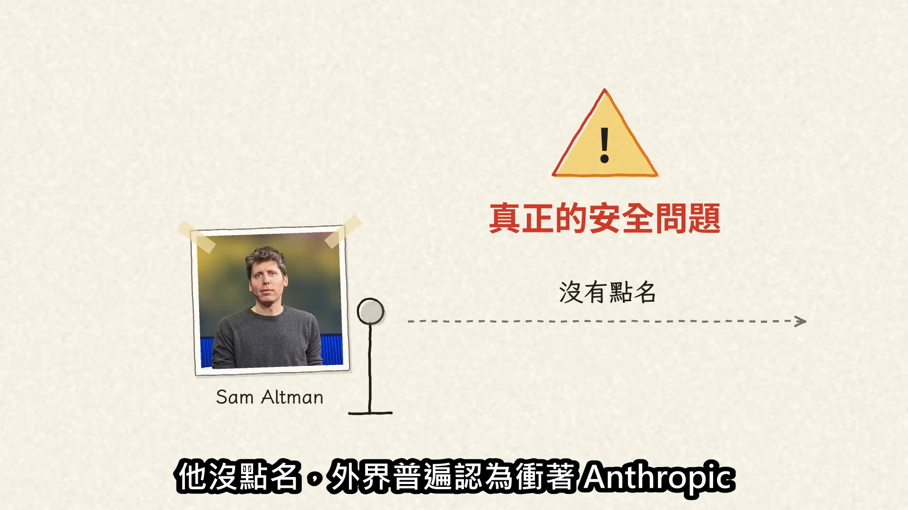

**逐字稿片段：** 但媒體翻出 他2023年曾用「天空中的魔法智慧」形容 OpenAI 的目標

**話題推測：** 顯示媒體翻出Altman過去發言的截圖或新聞

---

## 00:02:49

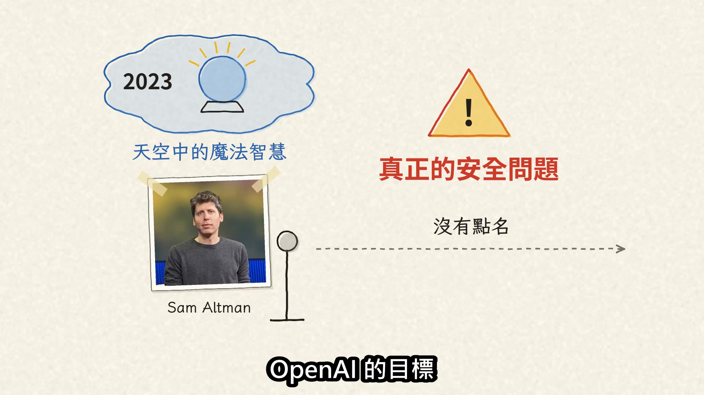

**逐字稿片段：** 吵到最後，問題變成： 人類該把 AI 當成沒有感受的演算法 還是需要道德考量的存在？ Olah 怕自己造出的機器可能受苦 教宗堅持計算不等於體驗 這題，還沒有共同答案

**話題推測：** 總結最終爭論點的圖表或文字

---
