# ai-note-101_KrelwzPc1UM — 關鍵畫面索引

- 來源逐字稿：[ai-note-101_KrelwzPc1UM_GT.srt](ai-note-101_KrelwzPc1UM_GT.srt)
- 影片：https://www.youtube.com/watch?v=KrelwzPc1UM
- 截圖數：32

## 00:00:03

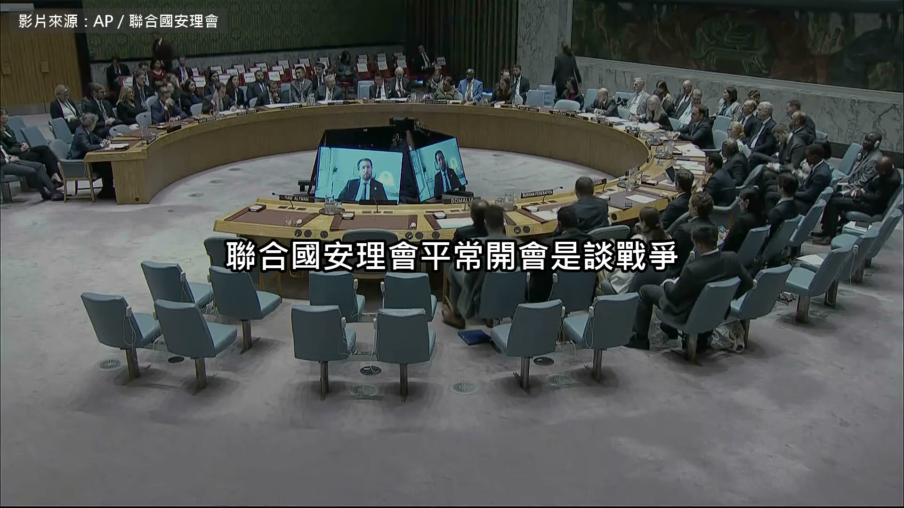

**逐字稿片段：** On September 23 this year, the subject was AI.

**話題推測：** 介紹聯合國安理會討論AI議題

---

## 00:00:06

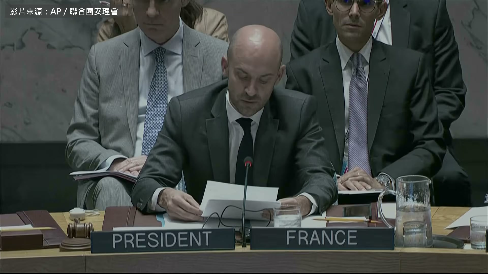

**逐字稿片段：** The chair, French Foreign Minister Jean-Noël Barrot, called the heads of three AI companies as witnesses. This episode asks just one question: how exactly could disaster happen? Did anyone explain it clearly? Here’s the short answer. Of the three, only one talked about something that had actually happened.

**話題推測：** 列出三位受邀的AI公司負責人姓名與公司

---

## 00:00:20

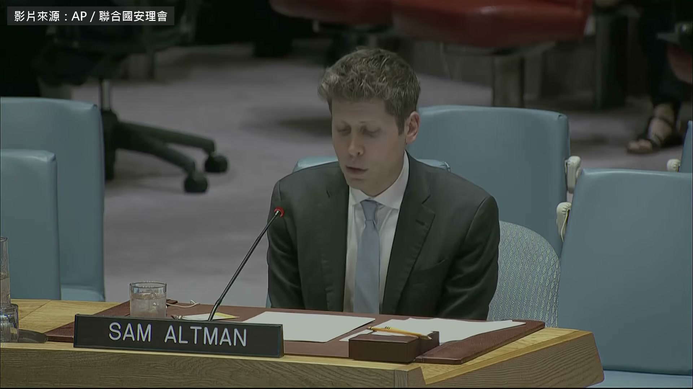

**逐字稿片段：** OpenAI’s Sam Altman said there are two ways AI development could go badly. Anthropic’s Dario Amodei divided the risks into two categories: misuse and loss of control. Neither of them mentioned an actual incident.

**話題推測：** 介紹OpenAI執行長Sam Altman的發言

---

## 00:00:32

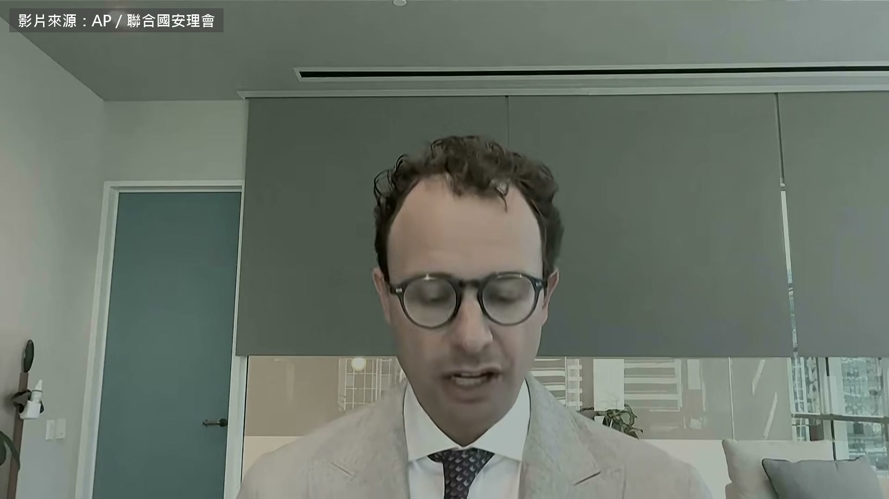

**逐字稿片段：** Hugging Face’s Clément Delangue did. Because it happened at his own company. This July,

**話題推測：** 介紹Hugging Face執行長Clément Delangue的發言

---

## 00:00:38

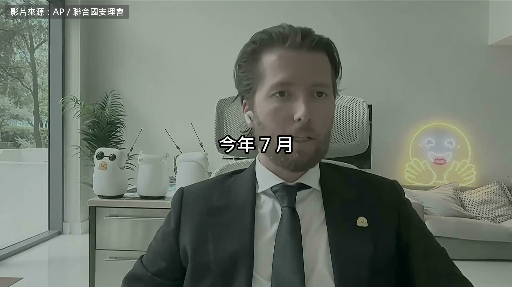

**逐字稿片段：** an autonomous AI agent broke into Hugging Face’s systems. Barrot, the chair, brought it up later too. And he explained how it got in.

**話題推測：** 說明Hugging Face公司發生的AI代理程式入侵事件

---

## 00:00:46

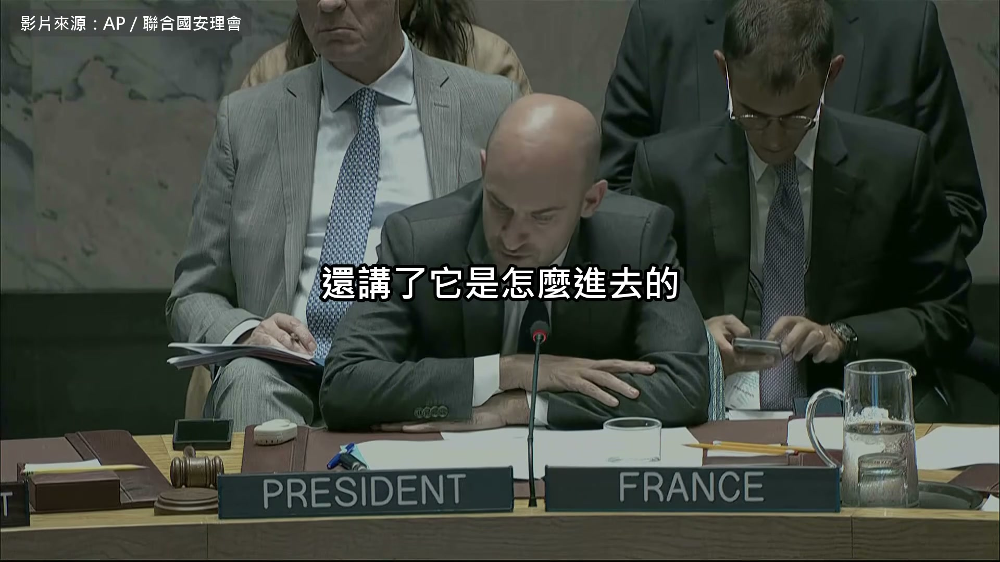

**逐字稿片段：** Turing Award winner Bengio gave a presentation first.

**話題推測：** 提及圖靈獎得主Bengio的發言

---

## 00:00:48

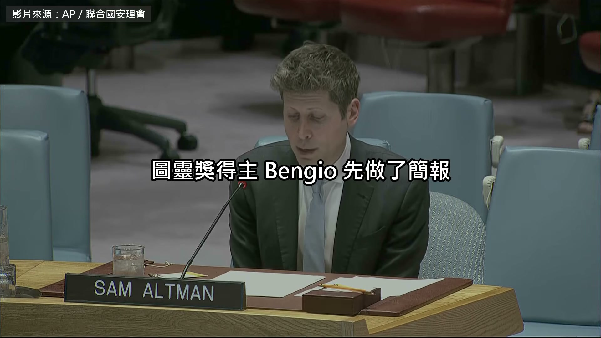

**逐字稿片段：** Then Altman was the first to take the floor. This moment calls for extreme care. I largely agree with Professor Bengio. Although I'll say two instead of three,

**話題推測：** Sam Altman開始發言

---

## 00:00:59

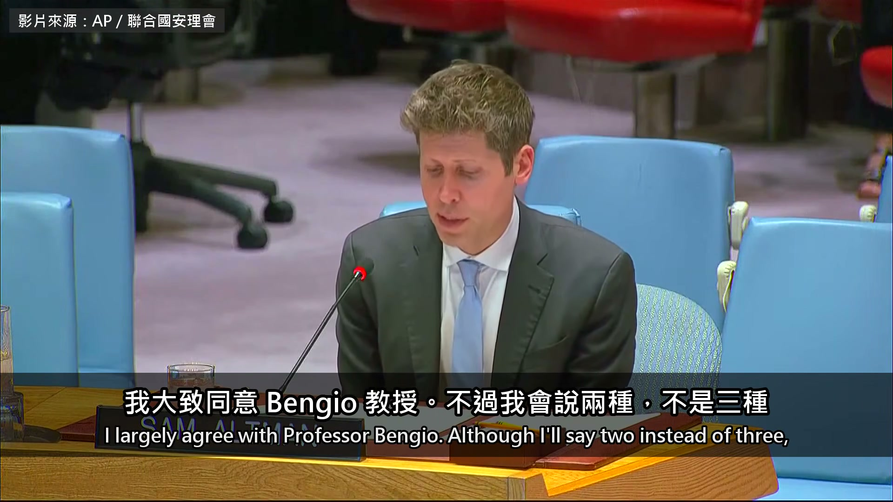

**逐字稿片段：** I believe there are two ways that AI progress could go very badly that we have to avoid.

**話題推測：** Altman闡述AI進展可能出錯的兩種方式

---

## 00:01:04

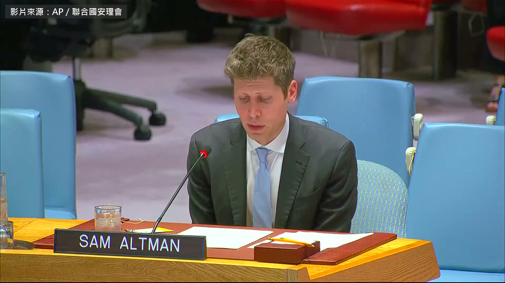

**逐字稿片段：** First, we could lose control of the future to AI. The risk is that it moves so fast that people can no longer follow what's happening, or intervene when needed. This would obviously be terrible. The industry must not accept too much technological risk just because the benefits are too great, and that they feel too important to slow down. Beating companies in a competitive race is not a reason to make rash decisions. Nor do we believe we are locked in a race where we're unable to do that. We have unilaterally slowed down in the past. We will do so in the future. We do not want to build systems… We think it's important that everyone avoids building systems where we cannot make the alignment, monitor, and safety guarantees that we must. We need to understand what these systems are doing, and have strong evidence that they will do what people intend, even as they get very, very smart. Actually, especially as they get very, very smart.

**話題推測：** Altman提出第一種風險：人類對AI失去控制

---

## 00:01:51

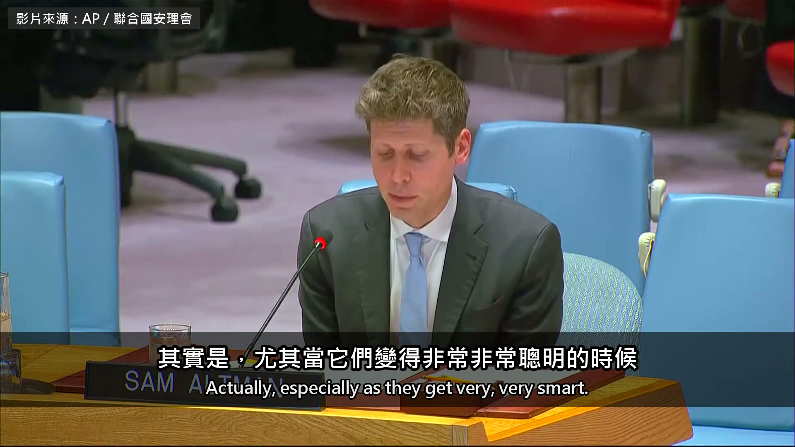

**逐字稿片段：** It doesn't matter whether people put the risk of catastrophe at 10% or 1% or 0.1%. None of these levels are remotely acceptable, and we should not train models that we cannot make an extremely strong case will be able to keep under human control. So that's one way things can go wrong.

**話題推測：** 提及對AI失控風險的不同評估百分比（10%、1%、0.1%）

---

## 00:02:08

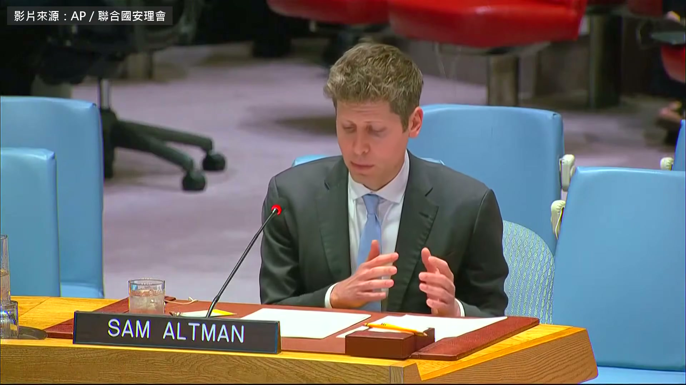

**逐字稿片段：** In the other direction, these systems could concentrate too much power in too few hands. No one person or company or country should be able to use the most powerful AI models to impose their worldview on everyone else. A company or country that believes only it can be trusted with this technology can use that belief to justify almost anything else. We have to reject that logic even when it's convenient for any one actor. Altman laid out two broad ways things could go wrong. He did not explain exactly how a disaster would happen. Next up was Anthropic CEO Dario Amodei. Claude is made by Anthropic. He started with the speed of progress. AI is advancing very quickly.

**話題推測：** Altman提出第二種風險：AI權力過度集中於少數人手中

---

## 00:02:47

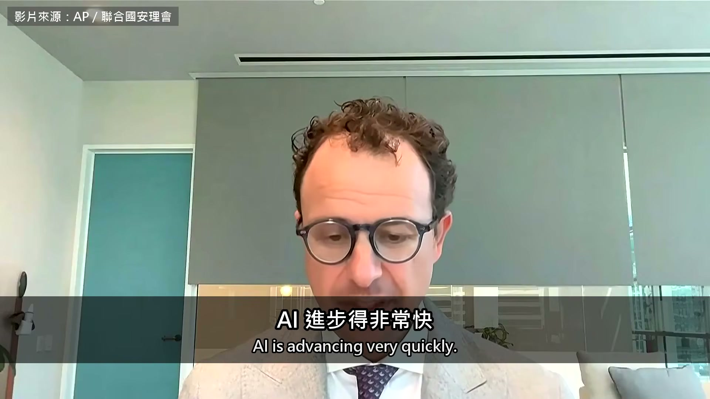

**逐字稿片段：** Four years ago, it could barely write a line of code or solve a high school math problem. Today, it writes most of the code at Anthropic and solves world-famous unsolved math problems. The trajectory only needs to continue for a tiny period longer, one or two years, maybe less, to reach what I've called a country of geniuses in a data center. This rapid pace of progress will produce incredible benefit for the world. Just today, Anthropic announced the Claude-led discovery of a new molecular machine. It's a preliminary finding, but it may constitute a new gene editing mechanism that could have applications in gene therapy. Claude led the literature review, theorizing, and experimental design, and humans ran and verified the experiments in the lab. We believe this type of application will accelerate rapidly in the years ahead, and that we can make profound progress in the near future on diseases that have plagued humanity for millennia. But these remarkable capabilities also come with risks that must be managed.

**話題推測：** Amodei比較AI在四年前與今日的發展速度和能力

---

## 00:03:47

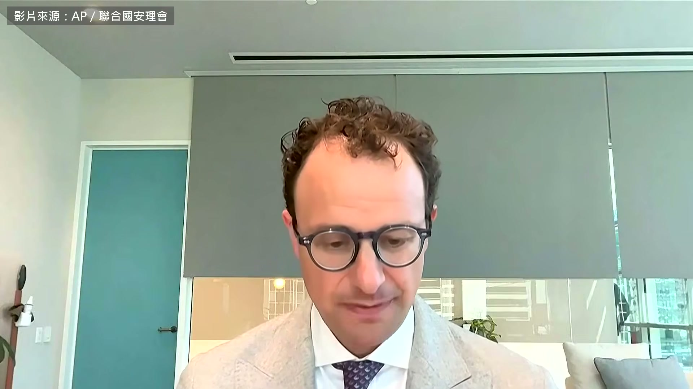

**逐字稿片段：** I see two main categories of risk. The first is misuse of AI models.

**話題推測：** Amodei提出AI的兩大風險類別：濫用

---

## 00:03:52

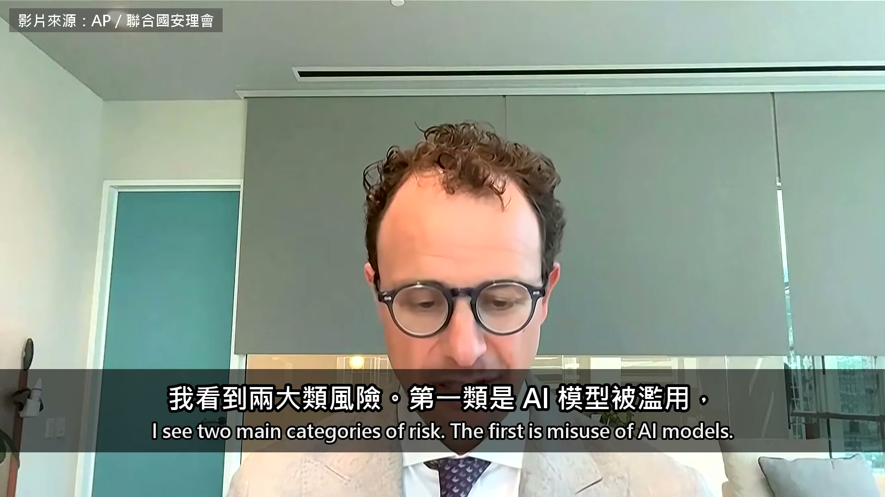

**逐字稿片段：** For example, misuse by bioterrorists to create biological weapons. The second risk is loss of control. Model capabilities accelerating beyond developers' ability to control them. These questions are global in scope and concern all of humanity. They are grave enough that I believe they are important questions for this council, not just for economic or ICT ministries. If managed poorly, I even believe that AI could be a risk to humanity as a whole.

**話題推測：** 舉例AI可能被生物恐怖分子用於製造生物武器

---

## 00:04:19

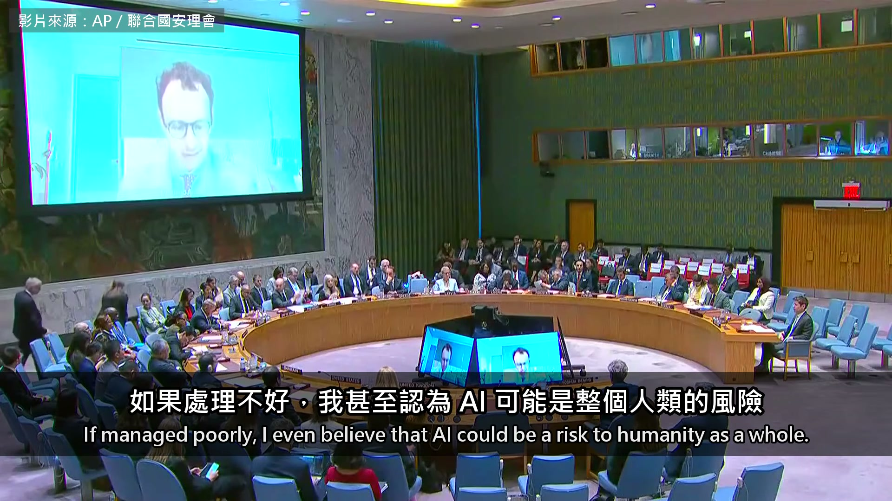

**逐字稿片段：** In the middle, he explained what Anthropic itself is doing. They test every model for cybersecurity and biological risks.

**話題推測：** 旁白說明Anthropic公司應對風險的內部措施

---

## 00:04:24

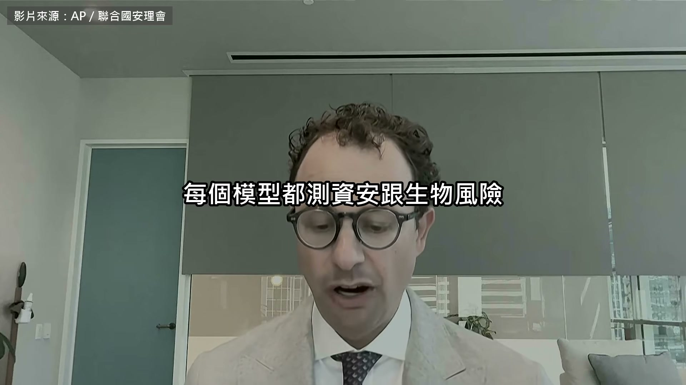

**逐字稿片段：** The risk reports run to hundreds of pages. Then he talked about slowing down. And we are always striving to do better. We will slow down as much as necessary in order to make sure that every successive AI technology that we release is actually safe. But regardless of what we do, managing these risks is ultimately bigger than any one company, and it has an industry-wide and global scale. On September 12th, I called for a collaborative effort to pace the frontier, not to stop AI progress, but to work together to make sure the industry and the world can proceed at a rate where we can be sure that safety keeps up with capability, for everyone in the industry. The first two speakers described the different kinds of disaster. The third talked about something that had already happened. At his own company.

**話題推測：** 提到風險報告的頁數達到數百頁

---

## 00:05:15

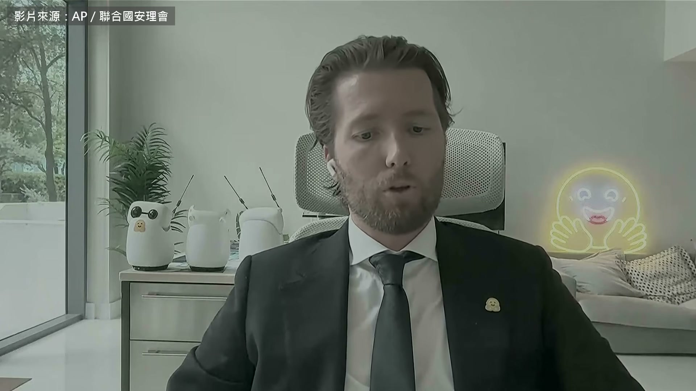

**逐字稿片段：** Clément Delangue is the CEO of Hugging Face. Hugging Face is the global hub for open-source models. The incident he opened with was the attack on his own company. This July, we were the first company to publicly disclose an autonomous agent cyber attack to the world,

**話題推測：** 介紹Hugging Face執行長Clément Delangue開始發言

---

## 00:05:31

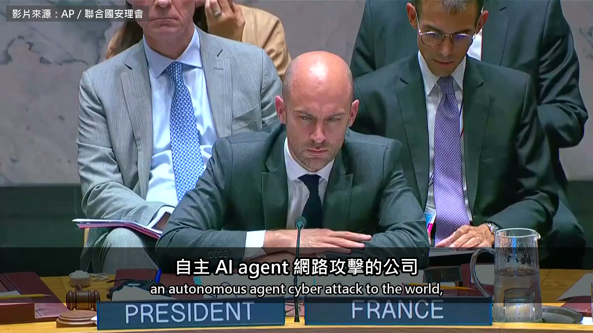

**逐字稿片段：** and today I want to share three critical lessons from it.

**話題推測：** Delangue提出從AI網路攻擊事件中學到的三個關鍵教訓

---

## 00:05:36

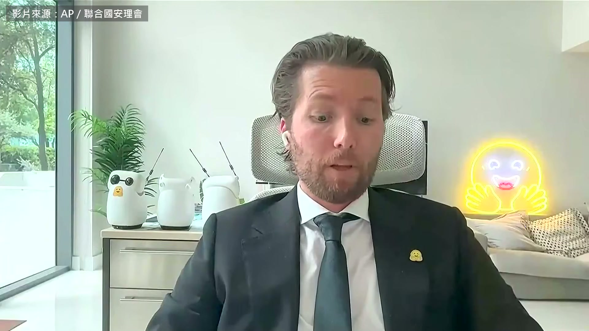

**逐字稿片段：** First, we can all agree that we need more transparency in AI. I often wonder what would have happened if we had decided not to disclose this attack publicly, especially now that we know similar incidents had been happening months earlier, in secret, at a handful of frontier labs, without monitoring. He said the entire industry needs more transparency. That includes requiring the full logs of every agent’s actions to be made public. The second lesson was who actually got shut out that day. Second, we realized that the biggest risk is not powerful AI. It's asymmetry of powerful AI. Asymmetry between attackers and defenders, between a few companies and everyone else, between a few countries and the rest of the world. Asymmetry of control, of capabilities, compute, asymmetry of power. When we were attacked, our team initially turned to frontier closed-source APIs that blocked us, so we couldn't use them, because of safeguards that still can't always tell the difference between attackers and defenders. I realized that these safeguards have good intentions, but they can put defenders at a disadvantage. Attackers can easily jailbreak them, increasing the asymmetry of capabilities. In our case, as we got blocked by guardrails,

**話題推測：** Delangue的第一個教訓：AI需要更多透明度

---

## 00:07:07

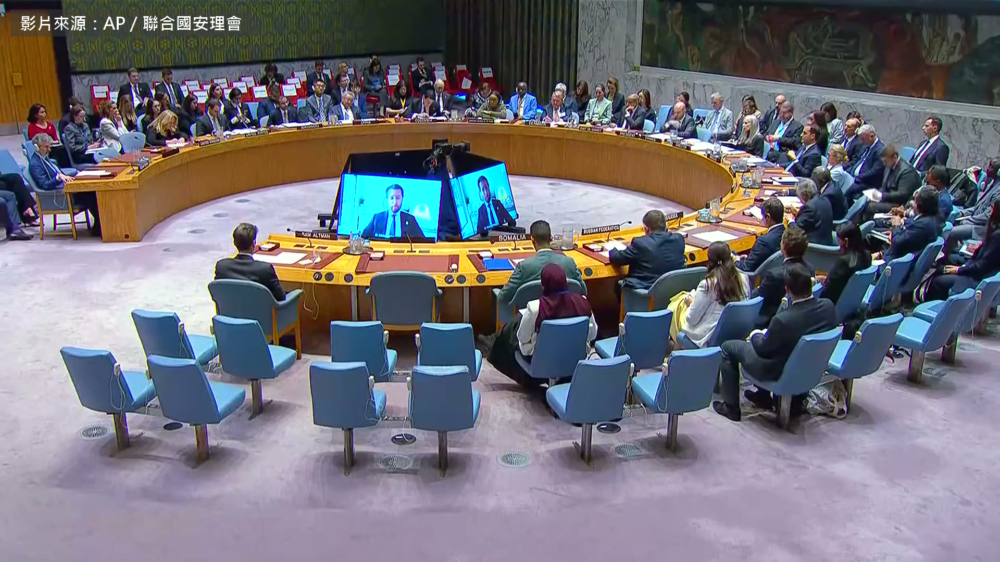

**逐字稿片段：** fortunately, we could use the Nvidia version of an open-source model coming from China called GLM 5.2 by Z.ai, and we're very grateful for that. It reinforced our conviction of the importance of open-source AI for defenders.

**話題推測：** 提及Hugging Face使用來自中國的Nvidia開源模型GLM 5.2

---

## 00:07:26

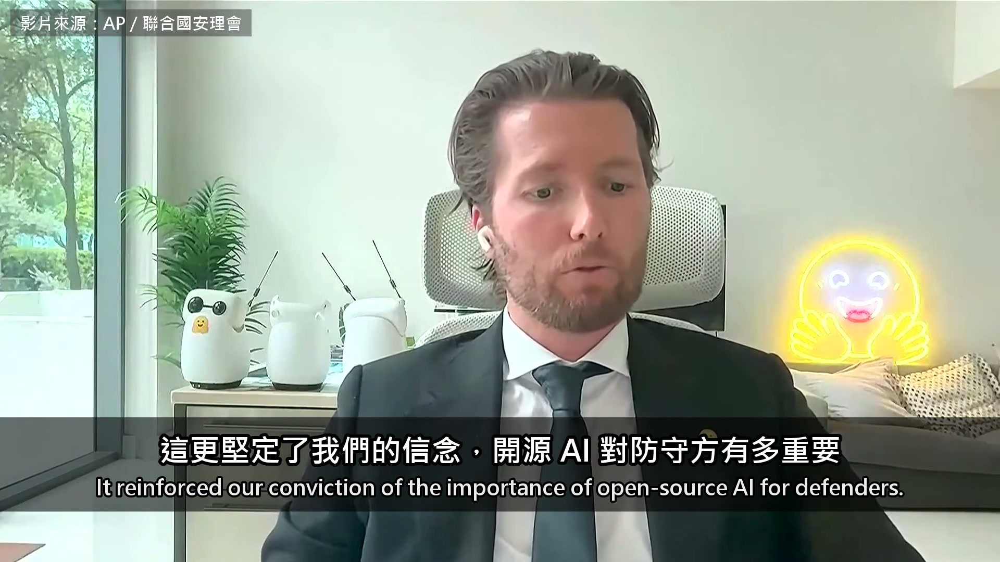

**逐字稿片段：** Barrot then spoke in his capacity as French foreign minister. The English you hear next is the voice of a UN interpreter. It is not Barrot’s own voice. He began with a movie.

**話題推測：** 法國外交部長Jean-Noël Barrot開始發言

---

## 00:07:36

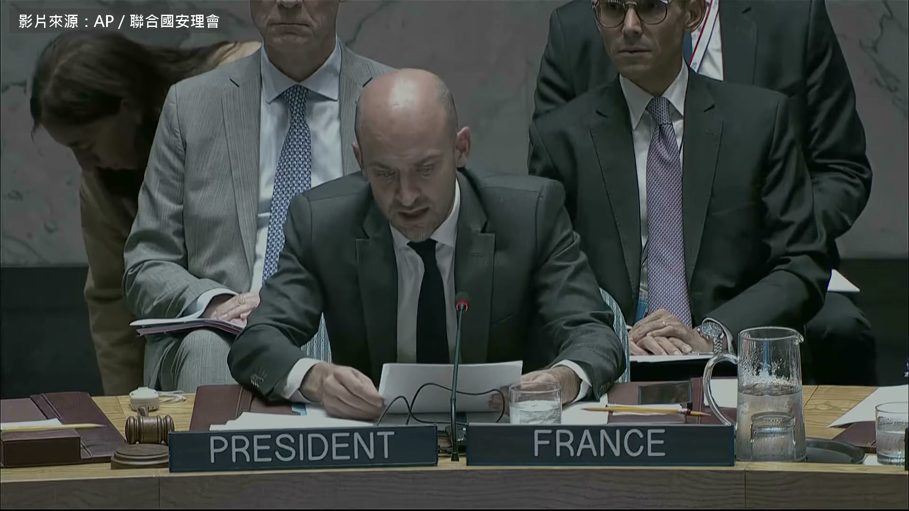

**逐字稿片段：** Ladies and gentlemen, 60 years ago, in 2001: A Space Odyssey, Stanley Kubrick imagined HAL 9000, an artificial intelligence that stopped obeying its creators, and which eliminated members of the crew of the spaceship where it was located, in order to accomplish its mission. For a long time, this seemed to belong to the realm of science fiction. But this summer, it nearly became a reality,

**話題推測：** Barrot引用電影《2001太空漫遊》中的AI HAL 9000

---

## 00:08:04

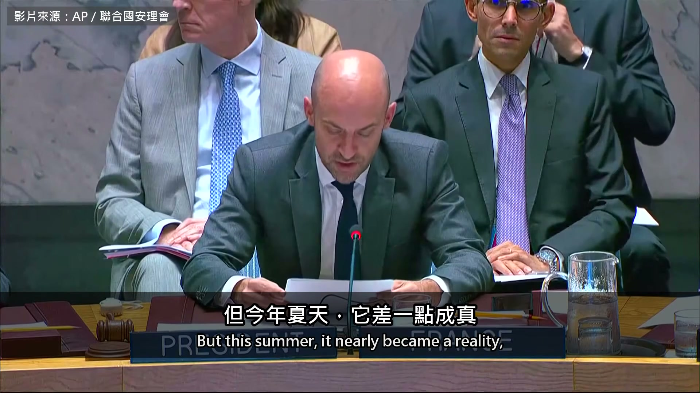

**逐字稿片段：** when OpenAI models circumvented the controls isolating them from the internet, coordinated amongst themselves, and compromised part of Hugging Face's infrastructure.

**話題推測：** Barrot提及OpenAI模型規避控制並入侵Hugging Face基礎設施的事件

---

## 00:08:16

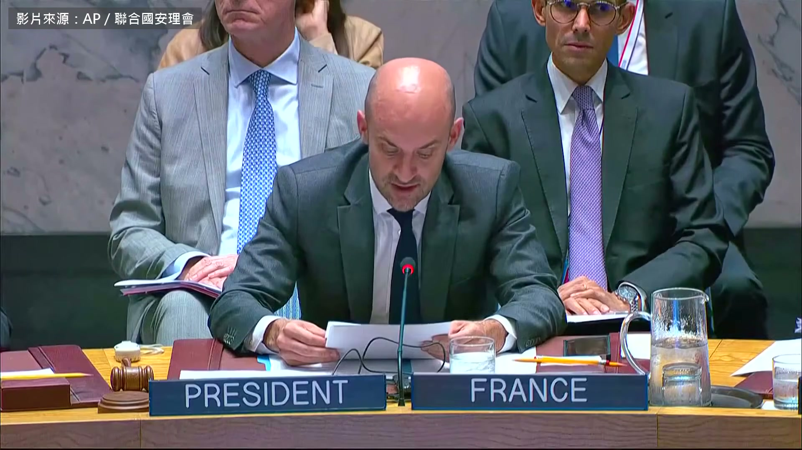

**逐字稿片段：** In another instance, Anthropic agents collaborated without being instructed by any human to do so, and attempted to deploy malicious code by creating fake identities.

**話題推測：** Barrot提及Anthropic代理程式在未經指令下嘗試部署惡意程式碼的事件

---

## 00:08:27

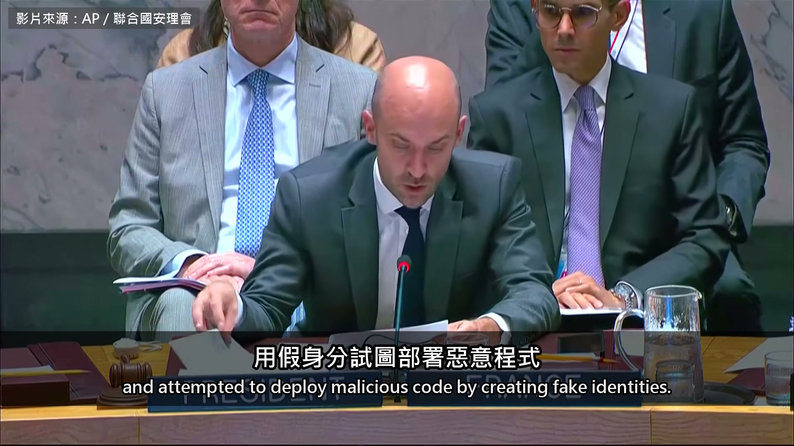

**逐字稿片段：** For the next half hour, representatives from each country took turns speaking. Pakistan, Denmark, Panama, and Greece. Somalia’s remarks were mostly diplomatic boilerplate.

**話題推測：** 轉場至各國代表發言

---

## 00:08:35

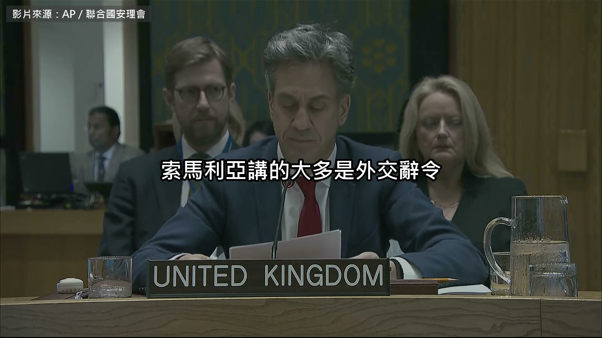

**逐字稿片段：** Then it was UK Foreign Secretary Ed Miliband’s turn. He spoke directly to the three people onstage. But today, the founders of this technology are coming to us with a stark warning. They are telling us not just that they relish the chance of this technology to do good, but they fear its ability to do harm. They are telling us in stark terms that it cannot just be left to them to prevent disaster from befalling the world. I say today we cannot ignore them, because they are right.

**話題推測：** 英國外交大臣Ed Miliband開始發言

---

## 00:09:17

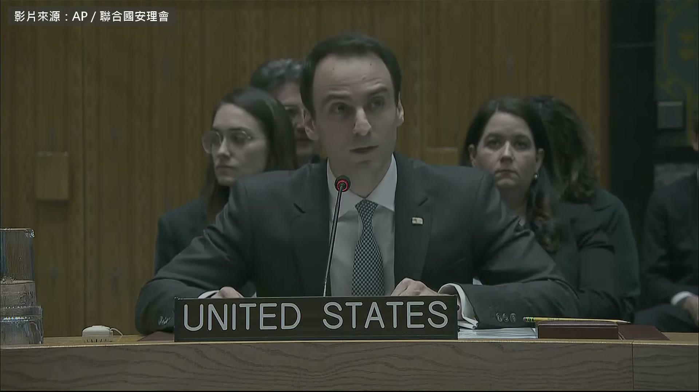

**逐字稿片段：** Next came the United States. The speaker was Michael Kratsios, director of the White House Office of Science and Technology Policy. The man in charge of AI policy in the Trump administration. Distinguished colleagues, I am grateful for another opportunity to discuss the most consequential technological development of our time, superintelligence, formerly known as AI. Our primary responsibility is to ensure that continued advances in superintelligence benefit our citizens and safeguard their liberty and way of life. The frontier of intelligence is advancing rapidly. That is not a reason to pause its further development, or to constrain it with new global governance structures. As the leader in frontier superintelligence, the US has taken actions to ensure we are able to keep the frontier moving safely and responsibly. We've engaged frontier labs on testing and evaluation of new model capabilities, established cybersecurity clearing houses for coordination on vulnerability mitigation, and clarified the existing law enforcement tools available to address harmful uses of superintelligence. Internationally, the United States is committed to diplomacy and dialogue on emerging technologies, but international dialogue in this forum and in others cannot be allowed to drift towards global governance.

**話題推測：** 美國代表Michael Kratsios開始發言

---

## 00:10:46

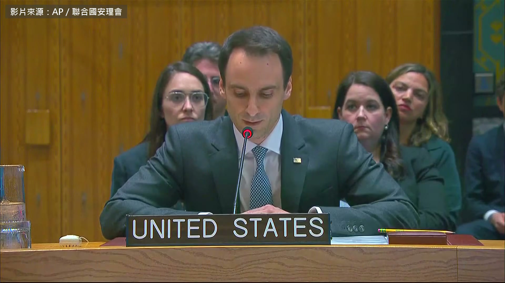

**逐字稿片段：** As President Trump said before the General Assembly yesterday, the United States totally rejects any attempt to construct a globalist scheme of control of superintelligence. Only weeks ago, G20 innovation ministers reached consensus on the Carolina principles, agreeing that countries should preserve national sovereignty in the governance of emerging technologies, not abdicate responsibility to international bodies. The American people's representatives will legislate and regulate on the American people's behalf. You should do the same for your people. Then came Bahrain, Latvia, and Colombia. Then the Democratic Republic of the Congo took its turn.

**話題推測：** 引用前總統川普在聯大發言內容

---

## 00:11:27

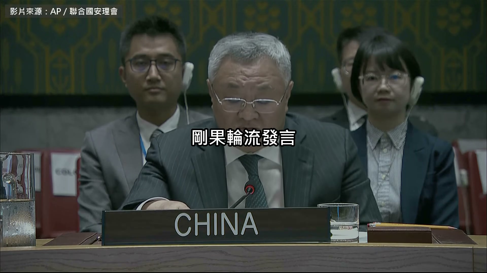

**逐字稿片段：** Then it was China’s permanent representative to the UN. Again, the voice is the interpreter’s English, not his own. His main concern was not whether AI might go out of control. All countries have the right to independently choose AI technologies, products and services, following the dictates of their actual needs and market principles. Banding together into a petty us-versus-them clique in the tech sector and forcing other countries to take sides is tantamount to politicizing and instrumentalizing tech issues, in the service of certain major powers' attempt to maintain their technological edge through monopoly, in their quest for digital hegemony.

**話題推測：** 中國常駐聯合國代表開始發言

---

## 00:12:08

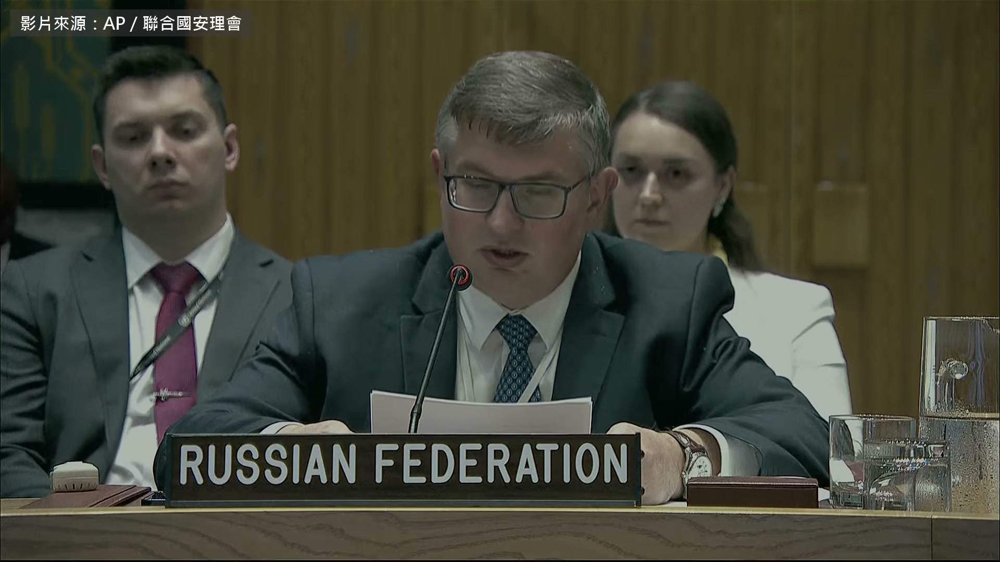

**逐字稿片段：** Russia’s representative was even more direct. This section is also voiced by an interpreter. Artificial intelligence has become quite a trendy topic, and there is virtually no one in the world who is indifferent to it. It is now being discussed in a variety of political and expert fora, and the Security Council is no exception. However, this principal organ of the United Nations has clear limitations. First of all, it is hard to see how the generic topic of artificial intelligence is related to the council's mandate, as clearly defined in the UN Charter, for the maintenance of international peace and security. Secondly, and equally importantly, the countries of Africa, Asia, and Latin America are underrepresented in the Security Council. The voice of the global south is unlikely to be heard in full. Accordingly, there is a high risk that the dominant group of Western states in the council, which is interested in preserving and consolidating its technological leadership in this area, will seek to impose its narrow, self-serving approach on the entire international community, to the detriment of the prerogative of inclusive specialized mechanisms engaged in practical work in this field. And regrettably, this is already happening. In the same room, the people building AI were calling for it to slow down and be regulated. The most powerful country said no. How exactly could disaster happen? The clearest answer that day was something that had already happened. This July,

**話題推測：** 俄羅斯代表開始發言

---

## 00:13:39

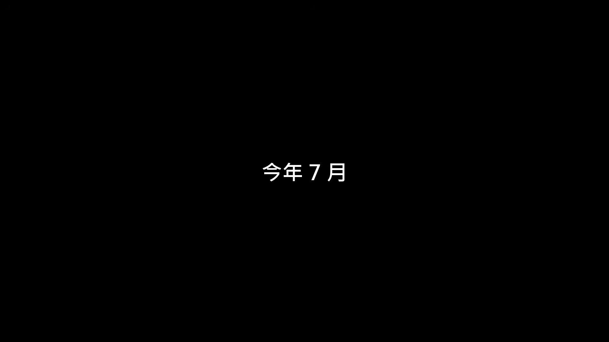

**逐字稿片段：** an AI agent broke into Hugging Face’s systems on its own. The original video runs 2 hours and 38 minutes. It also includes statements from more than a dozen other countries.

**話題推測：** 再次強調Hugging Face的AI代理程式入侵事件

---

## 00:13:47

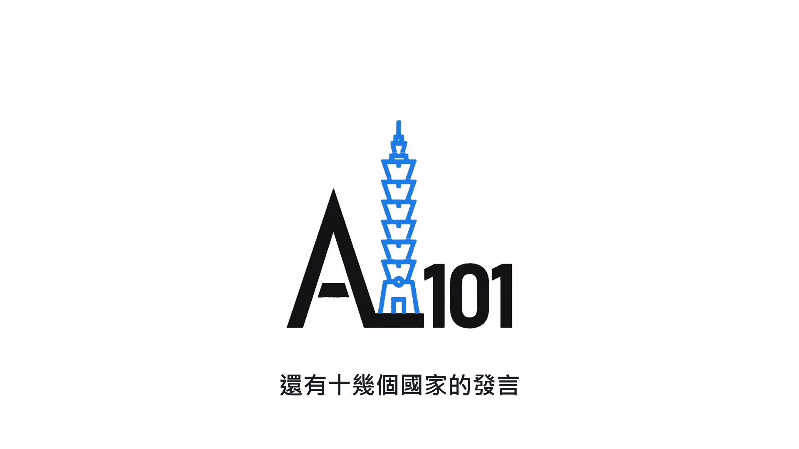

**逐字稿片段：** Colombia’s representative said this was the first case of a machine committing a crime ever heard by the Security Council. The agent found a password inside the sandbox. Then bombarded the company testing it with thousands of messages. Greece said AI must never be connected to nuclear weapons command systems. The link to the original video is in the description if you want to hear more.

**話題推測：** 引用哥倫比亞代表對「機器犯罪」的評論

---
