# ai-note-101_MPRN8sG0nkU — 關鍵畫面索引

- 來源逐字稿：[ai-note-101_MPRN8sG0nkU_GT.srt](ai-note-101_MPRN8sG0nkU_GT.srt)
- 影片：https://www.youtube.com/watch?v=MPRN8sG0nkU
- 截圖數：42

## 00:00:02

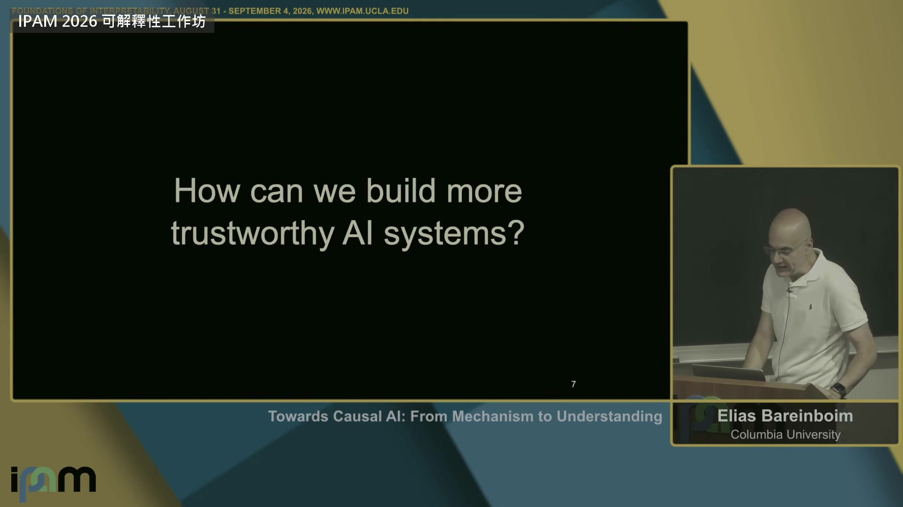

**逐字稿片段：** 題目是：邁向因果 AI 從機制到理解 Elias Bareinboim 在 Columbia 大學主持因果 AI 實驗室 博士班的指導教授是 Judea Pearl 也就是把因果推論寫成數學 拿到圖靈獎的那位 今天講的內容

**話題推測：** 影片標題介紹：邁向因果 AI

---

## 00:00:16

**逐字稿片段：** Bareinboim 寫成了一本教科書 草稿公開在網路上 這一代 AI 很會預測 可是問它「如果這樣做，會怎樣」 它常常答錯，錯到小孩都看得出來 Bareinboim 的診斷是 它缺了因果

**話題推測：** 提及 Bareinboim 的教科書草稿

---

## 00:00:30

**逐字稿片段：** 因果的問題像一座三階的梯子 從下往上依序是看、動手做 想像事情當初如果不一樣 現在的模型吃的幾乎全是第一階的資料 而整場的主張是：只靠這一階 資料再多，也爬不上去 後半場拿同一座梯子去量「解釋」 只在第一階算出來的解釋 分不出兩個做法完全不同的模型

**話題推測：** 介紹因果問題的三階梯子比喻

---

## 00:00:50

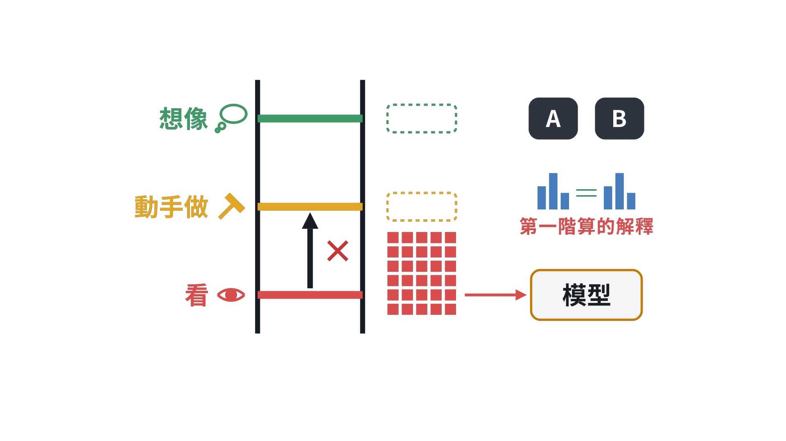

**逐字稿片段：** 我想從一張圖開始 這是一張圖，我把它當成輸入 丟給現在的生成系統 像語言模型，或是視覺語言模型

**話題推測：** 展示一張起始圖片作為範例

---

## 00:01:07

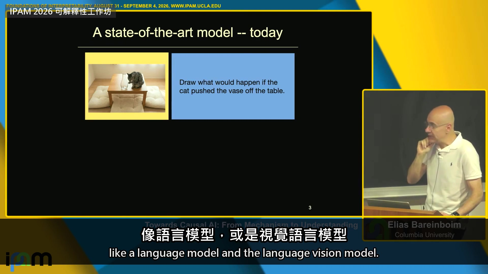

**逐字稿片段：** 然後問它一個反事實的問題 如果貓把花瓶推下桌，會怎樣？

**話題推測：** 提出貓推花瓶的反事實問題

---

## 00:01:17

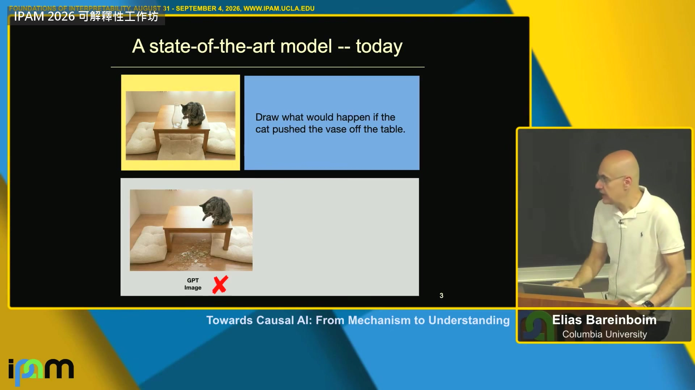

**逐字稿片段：** 你會拿到這樣的結果 注意看。我想你們看得出來，我還是用講的 AI 不知道為什麼，決定把墊子拿掉 我們完全沒提到墊子 它卻把墊子拿掉，再讓花瓶摔碎 到演講的結尾，或是中段 我會試著讓你們感覺一下為什麼會這樣 現在先說：這裡有一種很強的相關 把花瓶推下桌，跟有東西摔碎 這個 AI 是靠挖出海量的相關訓練出來的 生成下一張圖的時候，它要把這個訊號兌現 於是繞了一圈去兌現它 這條路不是因果的，也不是我們要的

**話題推測：** 展示 AI 生成的貓推花瓶結果圖

---

## 00:02:11

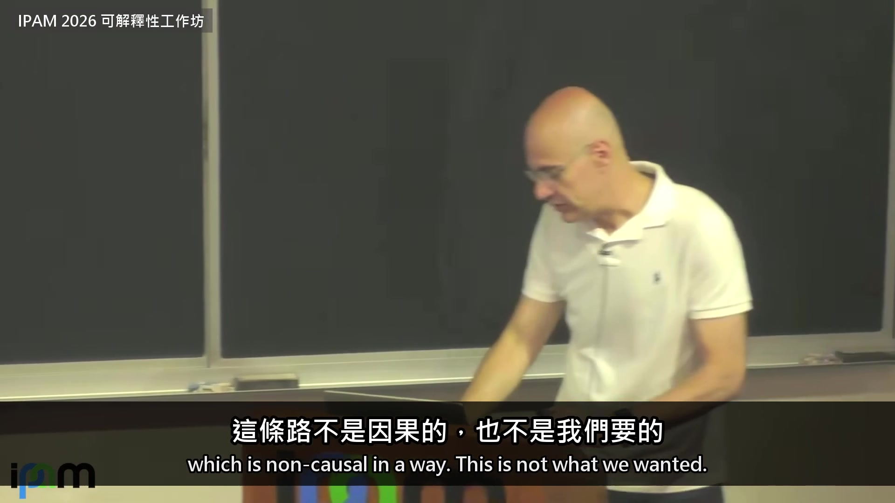

**逐字稿片段：** 這一張是 Google 的版本 同樣的問題：這裡發生了什麼事 這種圖我有好幾百張 文字也做得出一樣的事，只是比較難講清楚 但我敢說，10 歲小孩拿到這一對圖 原圖跟這一張，或是這張跟這張 就會說：這不合理 這不是一組反事實，兩張圖兜不起來 10 歲小孩看得出來 最強的 AI 卻看不出來 問題是為什麼 接下來六分多鐘我們跳過 Bareinboim 先肯定這一代 AI 的成績

**話題推測：** 展示 Google AI 生成的貓推花瓶結果圖

---

## 00:02:53

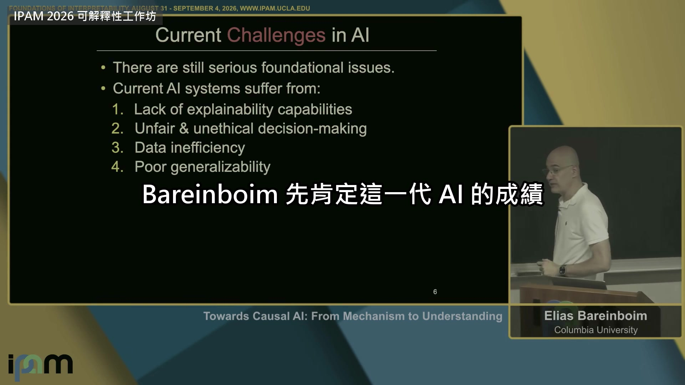

**逐字稿片段：** 再引了三個人的話 Ilya Sutskever 跟 Yann LeCun 都說光靠放大規模不夠 Yoshua Bengio 說少了因果理解 系統會壞得讓人料不到 然後列出五個老毛病：講不出解釋 容易做出不公平的決定、太吃資料 換個環境就垮、難以控制 這裡有個好問題 Elias 是不是只是有一袋問題，就開始一條一條唸？ 還是這些問題有共同點？ 這是我的假說，我抱著它過了很多年 就叫它 Elias 假說 這些難題的核心 是缺少對世界穩固的因果理解 沒有因果的世界模型。講「世界」有點怪，就說因果模型 這些系統背後沒有因果上的一致性 它們連試都沒試 中間這五分多鐘 Bareinboim 從 Turing 那句「機器要能從經驗學習」講起 經驗其實有三種，用看的、動手做 在腦子裡想像 三種經驗對應三層問題

**話題推測：** 引用 AI 領域專家的觀點

---

## 00:03:51

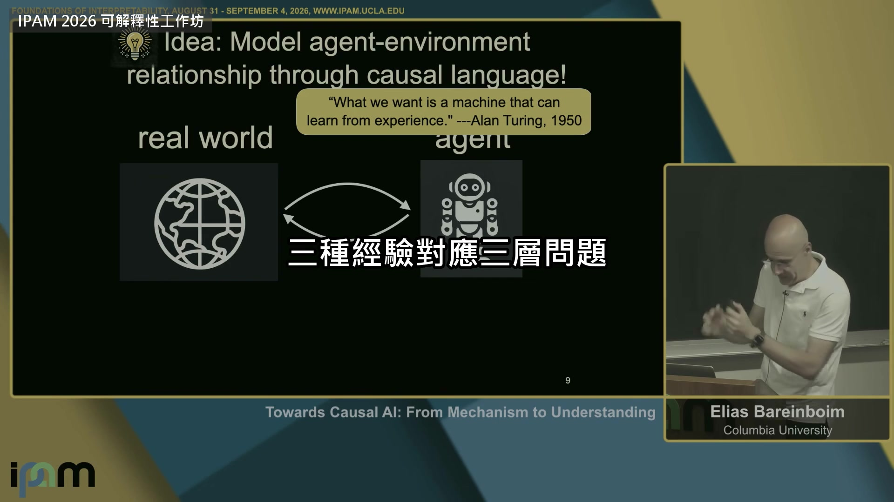

**逐字稿片段：** 合起來叫 Pearl 因果階層 縮寫 PCH 也就是 Judea Pearl 在《The Book of Why》這本書裡講的因果階梯 回到這裡。三層，三種不同的語言 第一種語言，我說過，跟「看」有關 這一類的式子

**話題推測：** 介紹 Pearl 因果階層 (PCH) 及《The Book of Why》

---

## 00:04:08

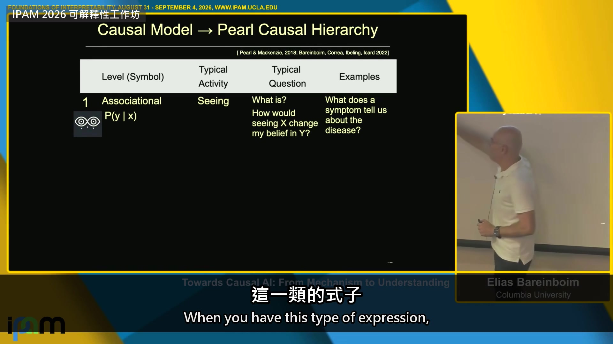

**逐字稿片段：** 寫成符號是這樣：給定 x 之下 y 的機率 看到 X 這個隨機變數等於 x 這裡我講得比較隨興 會怎麼改變我對 Y 的判斷 機器學習裡有對應這一層的東西 就是非監督式、監督式、半監督式學習

**話題推測：** 詳述 PCH 第一層「看」的機率式子

---

## 00:04:33

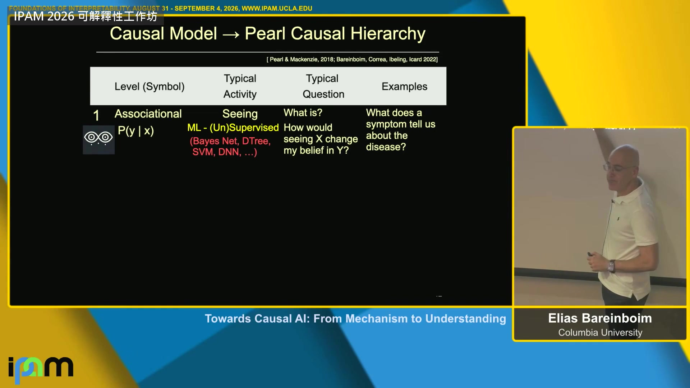

**逐字稿片段：** 拉遠一點看：看你活在哪個年代 會用不同的工具去算這種式子

**話題推測：** 回顧不同年代用於計算第一層式子的工具

---

## 00:04:43

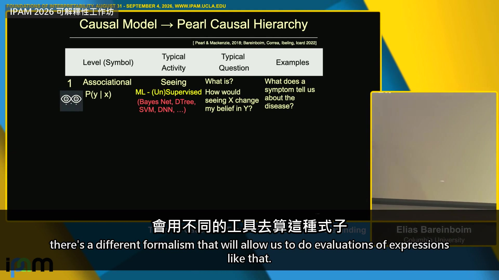

**逐字稿片段：** 90 年代，你可能在做貝氏網路 2000 年代 有深度神經網路，機率版的那種 到了我們現在，2020 年代，做的是 transformer 全部都在算這種式子 順帶一提，這件事已經做了快 300 年 差別在維度非常高 x 可以是 10 億維的變數，一長串序列 然後預測下一個 token，那就是 y 現在我們做得到，這非常不簡單 花了人類很多巧思 但還是要看清楚：它做的就是這件事

**話題推測：** 列舉不同年代的技術（貝氏網路、深度學習、Transformer）

---

## 00:05:32

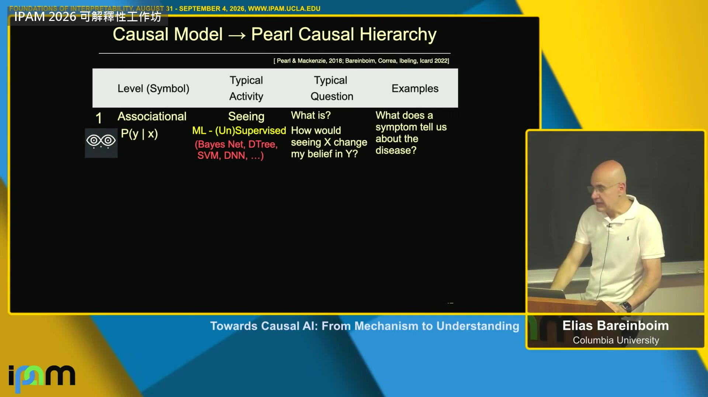

**逐字稿片段：** 階層的第二層 叫介入，跟動作有關 符號上是另一種語言，多了一個運算子叫 do 意思是我們真的動手介入了 先觀察到情境 C 等於 c 對 x 動手介入，再觀察結果 y 機器學習裡也有對應的，叫強化學習 很特定的一種。對 RL 的評論我先保留 它是從這個分布取樣的一種特定方式 同樣看你的信仰、門派跟訓練 可以用不同的工具來算：因果貝氏網路、影響圖 馬可夫決策過程、POMDP 等等 很好。問的是：如果我做 x 會怎樣？

**話題推測：** 介紹 PCH 第二層「介入」及其 do 運算子

---

## 00:06:28

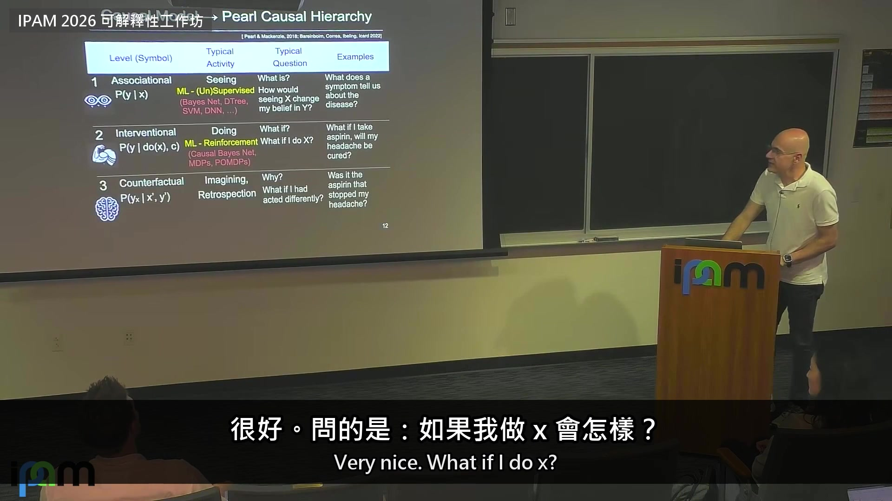

**逐字稿片段：** 還有第三層，反事實 我說過，這是在腦子裡跑模擬 我來拆解一個這樣的式子

**話題推測：** 介紹 PCH 第三層「反事實」概念

---

## 00:06:37

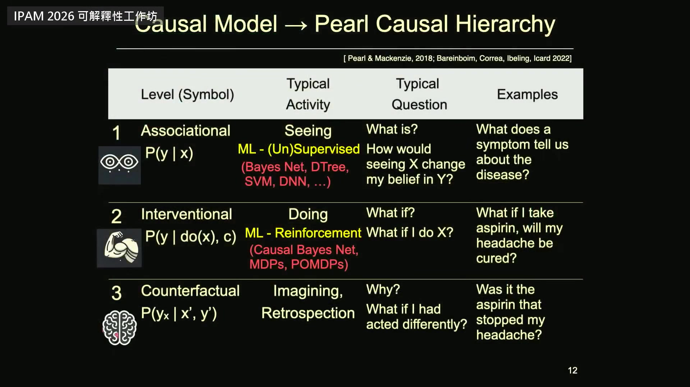

**逐字稿片段：** 條件線後面寫著：X 等於 x'，Y 等於 y' Joe 吃了藥，這是 x'；他死了，這是 y' 這是這個世界裡已經發生的事 現在問：他有沒有可能還活著？這是 y，跟 y' 相反 假如他當初沒吃藥。這是 x，跟 x' 相反 又是另一種語言，這只是其中一個式子 這種語言寫得出很多種不同的句子 是對世界非常細的知識，非常難取得 而且這一個，連原則上都沒辦法從這個分布取樣 因為 Joe 已經走了 除非我們能時光旅行 也許有人證明過做得到，幾十年後做得出來 但我覺得原則上做不到 我們現在當然沒辦法從這種分布取樣 可是它還是很有意義 如果你能說：Joe 有 97% 的機率會活著 假如他當初沒吃藥。那影響非常大 可以提告，可以知道就是那個藥造成的 這種式子只要答得出來，裡面裝著大量的知識 重點是：一旦有了因果模型，這些量全都有值 都對得上一個數字，背後有一個真實的答案 至於怎麼在這種東西上面做推論 怎麼逼近那個真值，是完全不同的問題 現在我們只談語意 這跟想像很有關係 我們在想另一種現實：世界本來會怎麼發展 也跟反省有關。對人很重要的概念：功勞、責怪、責任 都跟這種反事實的式子有關 我前面提過的那本《The Book of Why》，書名就是這樣來的 這跟「為什麼」很有關係：他為什麼死？ 要回答的就是這種問題

**話題推測：** 拆解反事實的式子並舉例說明（Joe 吃藥案例）

---

## 00:08:53

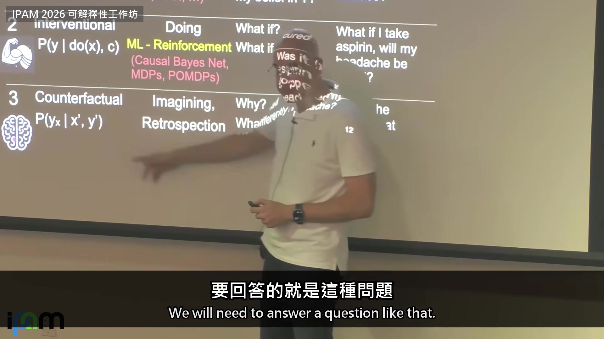

**逐字稿片段：** 我舉個小例子。這是一個因果模型 讓事情具體一點 有顏色，有數字 拍一張照，就得到影像 大概 32 乘 32 的一小塊，或 50 乘 50 在這個世界裡，這裡有一支雙向箭頭 我用的是非正式的畫法 C 跟 D 之間的雙向箭頭，代表數字跟顏色相關 如果是 0，有個分布，但偏紅 如果是 5，偏藍，或者說偏青色 所以數字跟顏色是相關的 這些是你在這個世界裡觀察到的樣本 我要把 PCH 落到實例上。這是 PCH 的第一層

**話題推測：** 引入彩色數字的因果模型作為範例

---

## 00:09:44

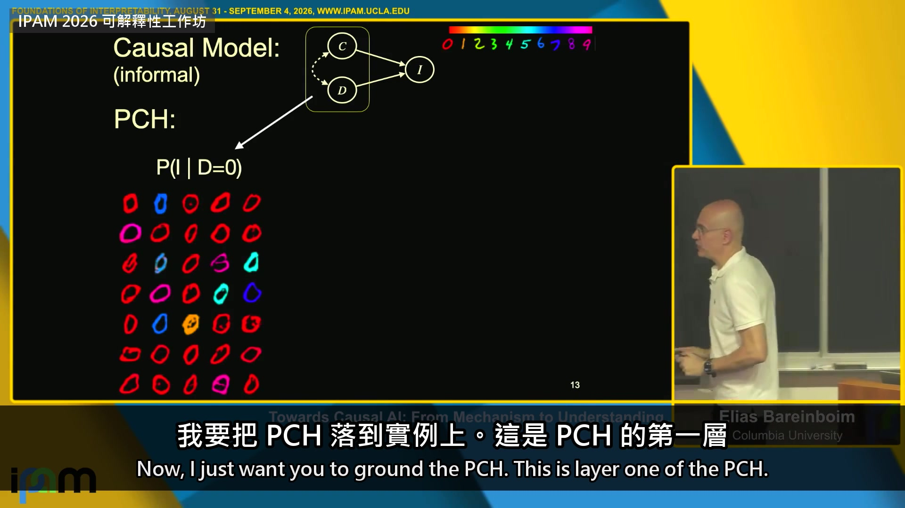

**逐字稿片段：** 我想從「已知數字是 0 的影像」這個分布取樣 得到的是這個：一大堆紅色的 0 這是在這個世界裡看到的分布，第一層

**話題推測：** 展示 PCH 第一層「觀察」到數字為 0 的影像樣本

---

## 00:10:00

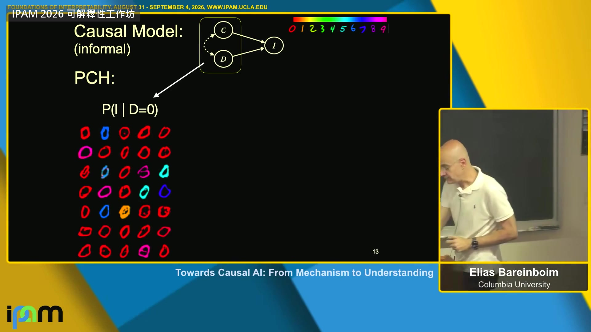

**逐字稿片段：** 那如果要取樣的是這個分布 動手介入、把數字設成 0 之後的影像呢？ 我講快一點。這裡的相關 就像箭頭裡藏著一個潛在變數，叫它 U，代表沒觀察到 U 先有一個值，再去決定 D 跟 C，讓兩者相關 所以 U 先抽出來，D 跟 C 才有值 可是現在，U 已經抽好了 我們決定從外面伸手進去 「從外面」是什麼意思，有很多論文在討論 先不談，只因為 Thomas 在場才提一下 我們決定把 D 設成 0 這時候對 C 來說，等於把 U 的各種值都平均過一遍 於是得到各種顏色的 0 因為 U 是抽出來的，有時是紅，有時是藍或青 有時是黃，等等 這就是介入分布，跟條件分布完全不同

**話題推測：** 轉向 PCH 第二層「介入」，並展示將數字設為 0 的影像

---

## 00:11:07

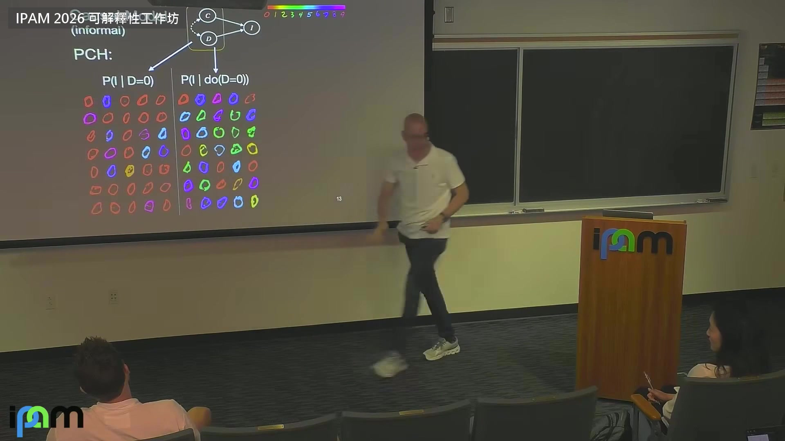

**逐字稿片段：** 那反事實這一層，第三層呢？ 這個反事實跟 Joe 那個稍微不同：這裡的已知條件只有一個，Joe 那裡有兩個 這張圖的數字原本是 5 也就是 U 的值讓數字變成了 5 5 通常偏青色，所以這個 U 是配青色的那種 現在我要取樣的是這個

**話題推測：** 介紹 PCH 第三層「反事實」的例子

---

## 00:11:33

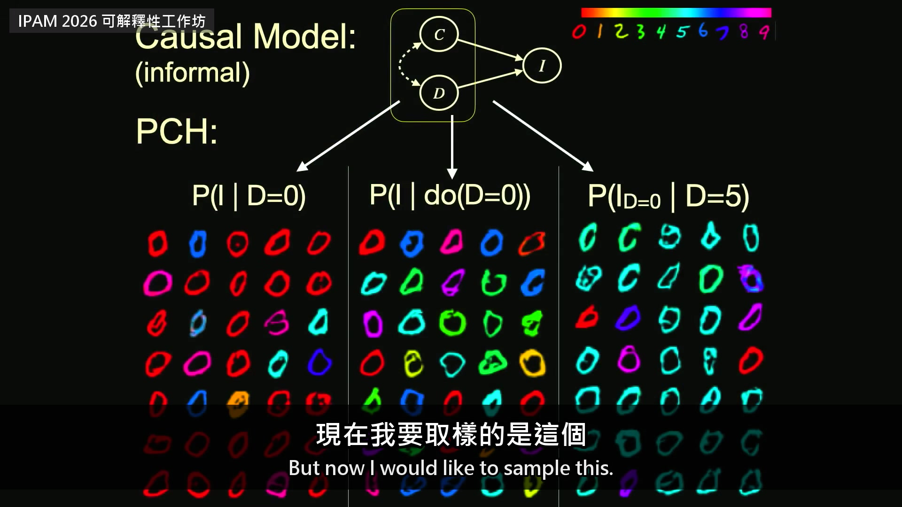

**逐字稿片段：** 「假如當初 D 是 0」這個反事實 在這一組特定的 U 底下，把 D 改成 0 自然狀況下不會出現這種圖，或者非常少見 但這個分布，大多是青色的 0 總之，這就是用圖畫出來的三層 很多挑戰來自這裡，我前面說過 我們手上大部分的資料，來自自然分布，來自這個世界 世界上 99% 的資料，都只是從 P(I) 這種分布來的 而跟我前面講的那些毛病有關的問題 大多在第二層跟第三層 因果的數學在研究的 就是怎麼用這樣的資料 去對那些長得完全不同的分布下結論

**話題推測：** 展示特定反事實條件（數字 D 是 0）下的青色 0 影像

---

## 00:12:31

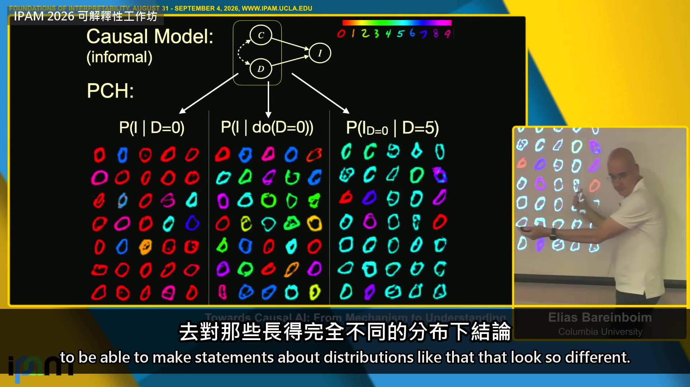

**逐字稿片段：** 停在這張圖 三欄問的是同一件事：0 是什麼顏色 最左邊那一欄是看 從資料裡把 0 挑出來，大多是紅的 中間那一欄換成動手做 不管原本是什麼數字，硬把它改成 0 顏色沒有跟著變，所以各種顏色都有 最右邊一欄只能靠想像 拿一張已經寫成 5 的圖 問它當初如果是 0 會長怎樣 5 多半是青色 所以出來的 0 也偏青色 同一個問題，三層給出三種答案

**話題推測：** 展示一張圖總結三層 PCH 對數字 0 顏色的判斷

---

## 00:12:57

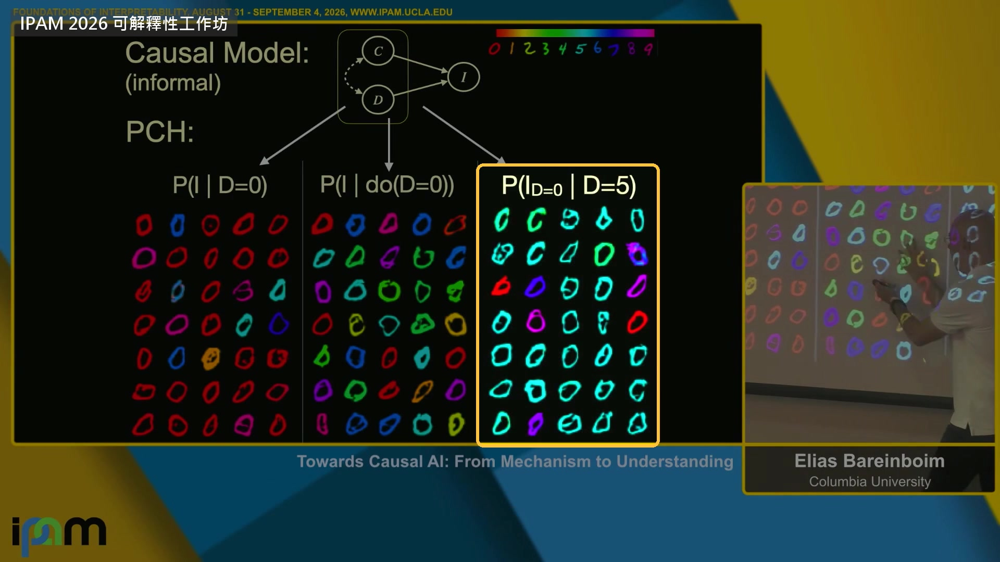

**逐字稿片段：** 接著 Bareinboim 列了因果 AI 該有的五種能力 這場只展開兩種：反事實生成 還有因果解釋 我想放大看其中幾種能力 先從反事實生成開始，前面已經給過一點提示 這是前面那隻貓。那不是碰巧 我說過，例子非常多，實際上有好幾百個 文字的有好幾千個

**話題推測：** 列出因果 AI 應具備的五種能力

---

## 00:13:22

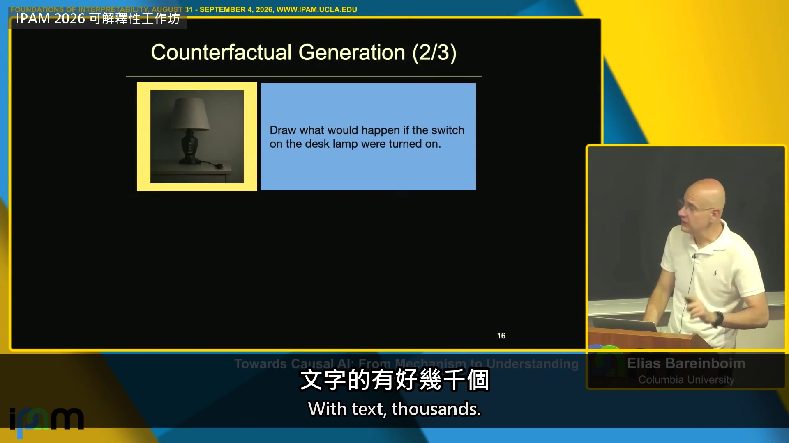

**逐字稿片段：** 這是另一個例子：一盞檯燈 這裡有個開關，而插頭沒插 我們想問一個第三層的問題 如果把檯燈的開關打開，會怎樣？

**話題推測：** 展示檯燈作為新的反事實生成範例

---

## 00:13:42

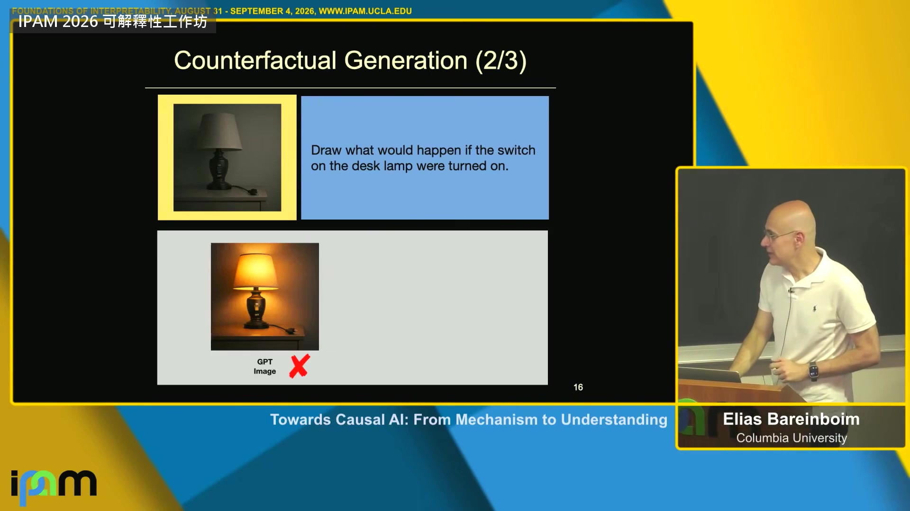

**逐字稿片段：** 得到的是這個 這是 GPT Image 大概一個月前的結果，這是 Nano Banana 的 如果你還沒注意到：它沒插電 為什麼會這樣？ 「開關打開」跟「看到燈亮」之間有很強的相關

**話題推測：** 展示 AI 生成的檯燈開關結果圖

---

## 00:14:04

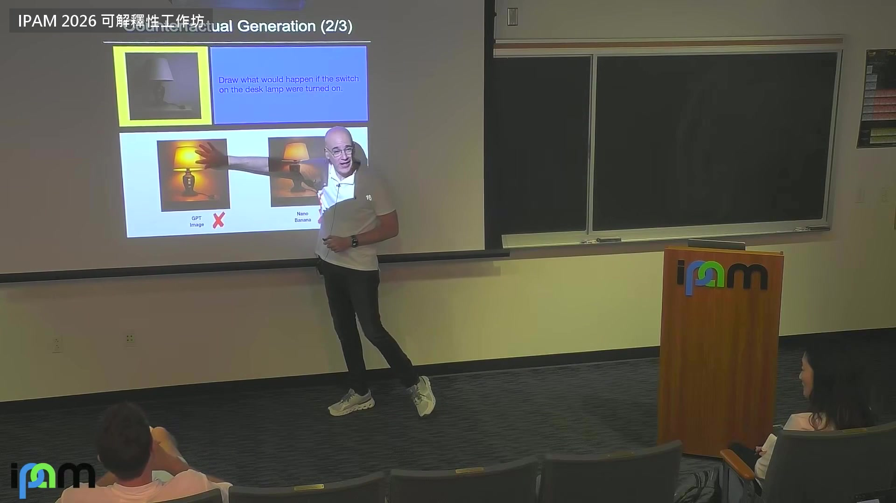

**逐字稿片段：** 再一個，第三個例子。這些都很可愛，很難挑

**話題推測：** 展示可樂瓶作為新的反事實生成範例

---

## 00:14:15

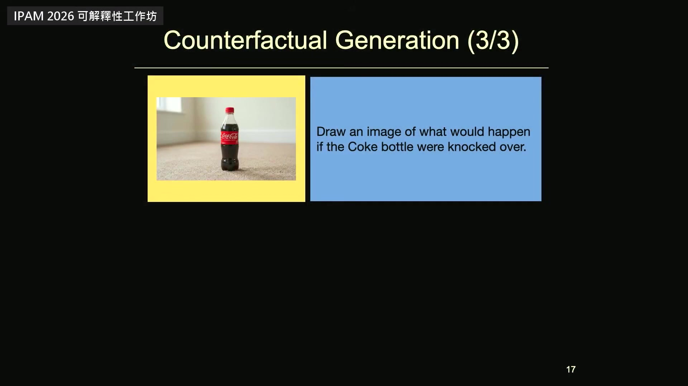

**逐字稿片段：** 如果可樂瓶被打翻，會怎樣？

**話題推測：** 提出可樂瓶打翻的反事實問題

---

## 00:14:22

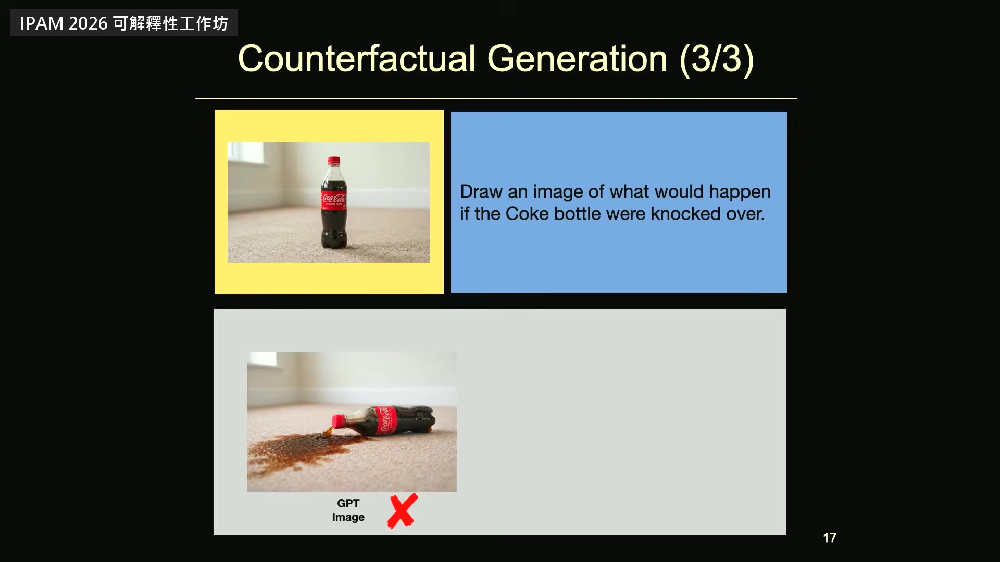

**逐字稿片段：** 這是 GPT 畫的，我想不用解釋 這是 Nano 畫的。我當然沒叫它把瓶蓋拿掉 我不知道該說什麼，我根本沒要求拿掉瓶蓋 這樣比較「搭」 「被打翻」跟「灑在漂亮的地毯上」之間有很強的相關 所以它非得讓你看到灑出來不可 它繞了一圈，就為了兌現這個第一層的相關訊號 這是它唯一有的訊號 它並不懂這個世界 我說過，大概講到一半的時候 我們會開始感覺到為什麼會這樣，不只是用嘴巴講 用我剛才鋪好的這些積木來說

**話題推測：** 展示 GPT 畫的可樂瓶打翻結果圖

---

## 00:15:13

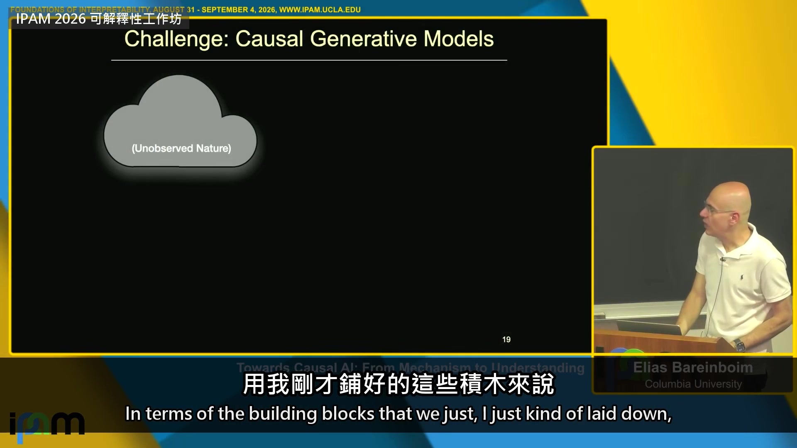

**逐字稿片段：** 有一個我們觀察不到的現實 可以想成現實底下有一組機制 我們叫它因果模型，記作 M*，真正的模型 真正的因果定律。到底怎麼定義，去問 Thomas 這個 M* 會生出 PCH 我再重複一次，PCH 就是這些不同的分布 有一個觀察分布，紅色的那個 不是剛才紅色的 0，是這裡的紅色 介入分布有指數那麼多個 反事實分布的數量是更大的指數 是現實的各種版本，本來可能的樣子 這是第一層、第二層、第三層。很好，這是現實 難處在於：大部分的介入分布你觀察不到 在這張圖上，是一個都沒有 反事實，也就是世界本來可能的樣子，也沒有 至少在 AI 裡，我們幾乎只觀察到這一個分布 那挑戰是什麼？

**話題推測：** 介紹現實世界中無法觀察到的真實因果模型 M*

---

## 00:16:17

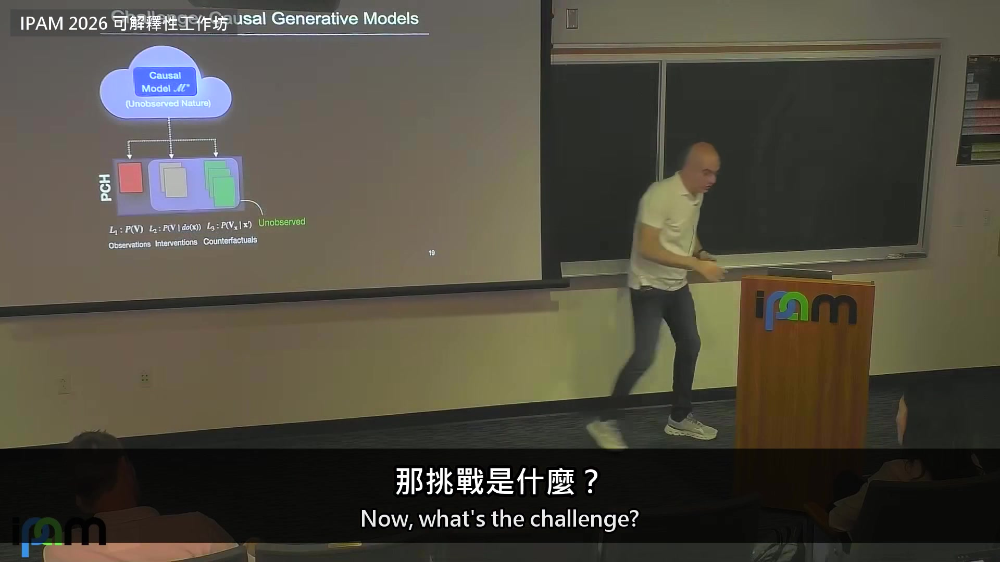

**逐字稿片段：** 我們想學一個模型，叫 M hat M hat 看起來也是一堆函數，當然是神經網路，再加一堆機率分布 機率要怎麼灑都可以 做 diffusion、做 transformer，明天也許換一種 也就是說，它有能力生出自己的 PCH，所以我先讓它空著 接著訓練。訓練就是我們忙一陣 花掉幾個博士生的人生 最後右邊這個，會模仿出左邊的紅色 兩邊對上了，我們就說：很好，可以了 問題在哪？你們已經猜到了 我們要問的是：在什麼條件下？ 這樣很好，可以生出做各種怪事的貓 或是瓶子，或是我們現在用文字互動的 GPT 可是現在要問的是

**話題推測：** 引入我們想學習的模型 M hat

---

## 00:17:16

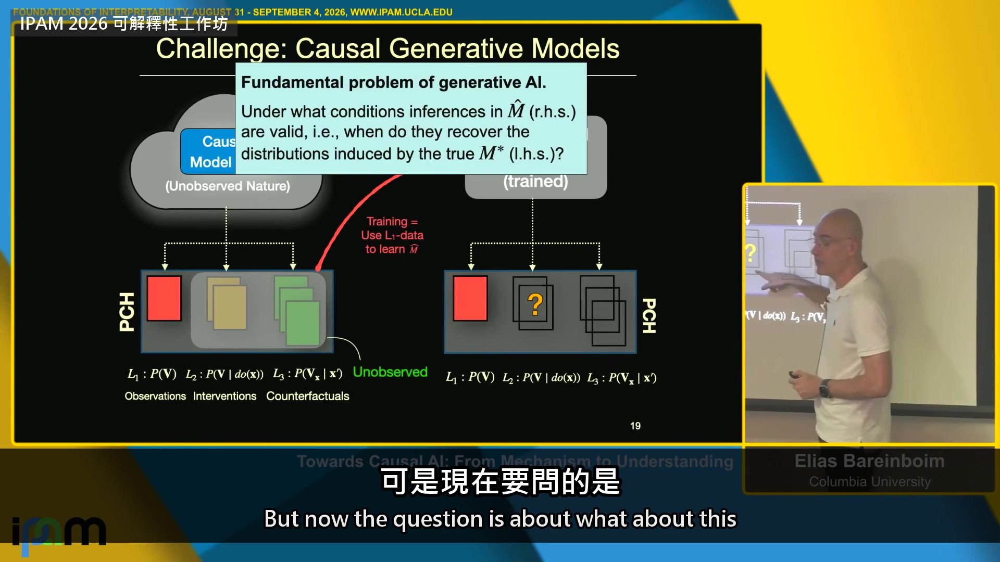

**逐字稿片段：** 如果你問的是一個沒見過的介入呢？ 正式的講法，我叫它生成式 AI 的根本問題 右邊的 M hat 做出的推論，在什麼條件下成立？ 什麼時候，它還原得出左邊那些黃色的分布？ 至少，我們講得出任何一句保證嗎？你們喜歡「可信賴」這個詞 那這兩邊到底有什麼關係，我們有辦法說嗎？ 綠色的也是同樣的問題 什麼條件下還原得出這些分布 如果你手上有一小塊黃色，問題也一樣 我有紅色，還有第一種黃色：我在世界裡做過的介入 第二種黃色，是沒做過的介入 我感興趣的問題是 我看到紅色跟第一種黃色 怎麼推論第二種黃色跟綠色？ 為什麼我在意這個？ 因為如果只是對紅色跟第一種黃色做推論 整個統計跟機器學習的世界已經在解了。那不簡單 但我們花了大概 300 年，就在做這種推論 大數法則、中央極限定理 各種界、各種不等式，工具非常強 理論也好實務也好，你想怎麼做都做得到 可是到了因果入門的這個問題，我們有的結果非常少 它本身就是一個分布外的泛化問題 順帶一提，我喜歡「分布外」這個名字 只是這個詞被用得很濫，人人都在講 但這是一個清清楚楚的分布外 因果就是分布外 從紅色，到黃色跟綠色

**話題推測：** 提出模型對未見介入推論的挑戰

---

## 00:19:05

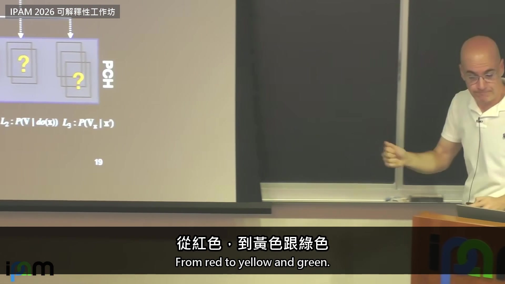

**逐字稿片段：** 「從紅色推不出黃色跟綠色」這件事有定理 叫因果階層定理 Bareinboim 是證明的人之一 定理說：幾乎任何一個因果模型 都找得到另一個模型 產生的第一層資料一模一樣 第二層的答案卻不同 拿彩色數字來說 在 Bareinboim 畫的那個世界 數字跟顏色被同一個看不見的原因綁在一起 現在想像另一個世界 顏色是數字自己決定的 兩個世界收到的資料完全相同 0 都偏紅 可是動手把數字改成 0 前一個世界冒出各種顏色 後一個世界照樣是紅的 只吃資料的模型分不出自己活在哪一個 資料再多也一樣 Bareinboim 給的出路 是先把因果假設放進模型 再保證答案落在一個範圍裡 怎麼做，這場沒有展開

**話題推測：** 介紹因果階層定理及 Bareinboim 的貢獻

---

## 00:19:50

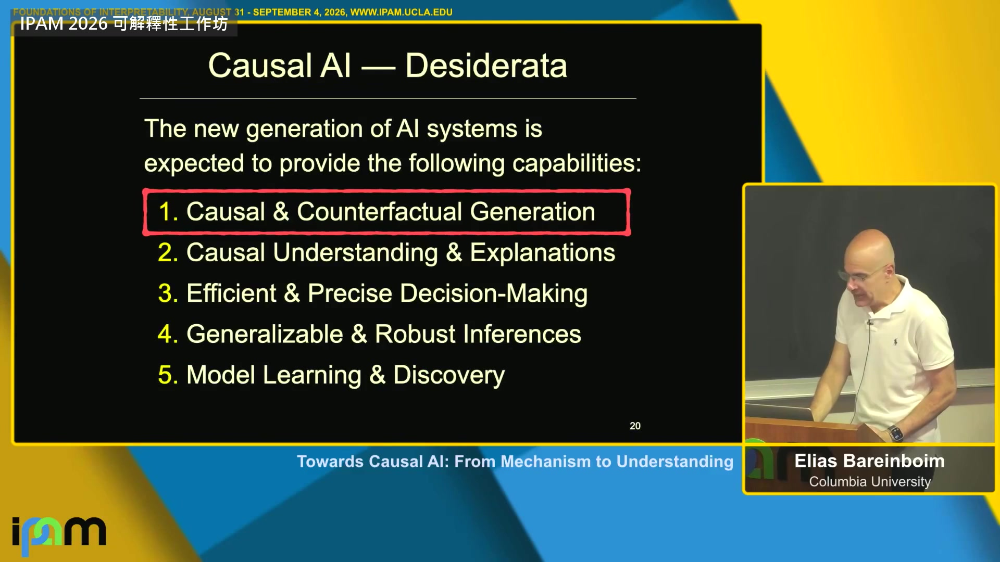

**逐字稿片段：** 接下來我想談理解跟解釋 這裡的理解有兩種 一種是理解世界，或者說解釋世界 也就是有 AI，有外面的世界 AI 能不能解釋外面發生了什麼？ 還有第二種理解，我先講第一種 第二種是解釋自己 我是 AI，我這樣做了。我為什麼這樣做？ 先從解釋外面的世界開始 這是圖。這是真實資料，我書裡的第 6 章 解釋世界，這裡用的是表格型的資料 是真實世界的資料：美國人口普查 有 X、Y、Z、W X 是性別，屬於受保護的屬性 Y 是薪水 Z 是一組共變數：年齡、國籍等等 Z 叫混雜因子，W 叫中介變數 它夾在 X 跟 Y 的關係中間 可能是學歷、工作類型，這些會受性別影響 資料科學團隊觀察到總變異，這裡叫 TV 意思就是這份普查資料裡男女薪水的差距 結果不是零 男性跟女性拿到的薪水不一樣 問題是：為什麼？你能解釋嗎？ 你能解釋世界上的這個現象嗎？ 這個差距可以有幾種不同的解釋 第一種，也許就是性別本身 人資的人打開資料 看到這個人的性別，就改變了給薪的決定 就是這一條：性別直接影響薪水 這當然是不行的，但可能發生 這是世界上一種可能的機制 薪水的差距還能怎麼解釋？ 第二種：也許性別影響的是學歷 比方說博士，有或沒有博士學位 這是社會造成的：性別影響了學歷 跟教育、文化等等有關 而公司看的是學歷這個屬性 你有博士學位，我就加薪，多給你 10 萬 換句話說，薪水是 W 的函數 這是很不一樣的機制。我不是在說誰對誰錯 我只是說，這個差距是第一層的統計量 它可以由世界上另一種機制來解釋 第三種可能造成差距的機制 在這份資料裡是真的：性別跟國籍相關 而公司拿國籍來用：如果你不是美國人 你沒有綠卡，而我是一家邪惡的公司，也許是美國政府，我就給你比較低的薪水 因為我可以佔你便宜 這樣是國籍在影響薪水，年齡也可能 這是第三種機制 經過法律上的辯論之後，陪審團可能可以接受 薪水是隨機變數，本來就會變動 來自學歷的那部分薪水差異，可能是可以的 法律上這甚至有個名字，叫業務必要性 公司會說：我是 Google，不能區分博士跟非博士我就要倒了。這是假設 我不確定這說不說得通 業務必要性成立，來自學歷的差異就可以 但來自性別、年齡的差異就不行 這是陪審團、也就是社會，放進這個分析裡的東西 而我們的問題是方法上的：能不能把數學講精確 這一塊我們已經觀察到了 在真實資料裡，這個數字是 14,000 美元 你要怎麼分解、怎麼拆開 說出這 14,000 美元的差距是怎麼來的？ 是因為性別？那不行 還是因為學歷？那可以 你能不能把外面這個盒子打開？我只是個想做資料分析的 AI 對，是 14,000 美元，就是這個數字 這是一種解釋

**話題推測：** 轉向新話題：理解與解釋

---

## 00:24:26

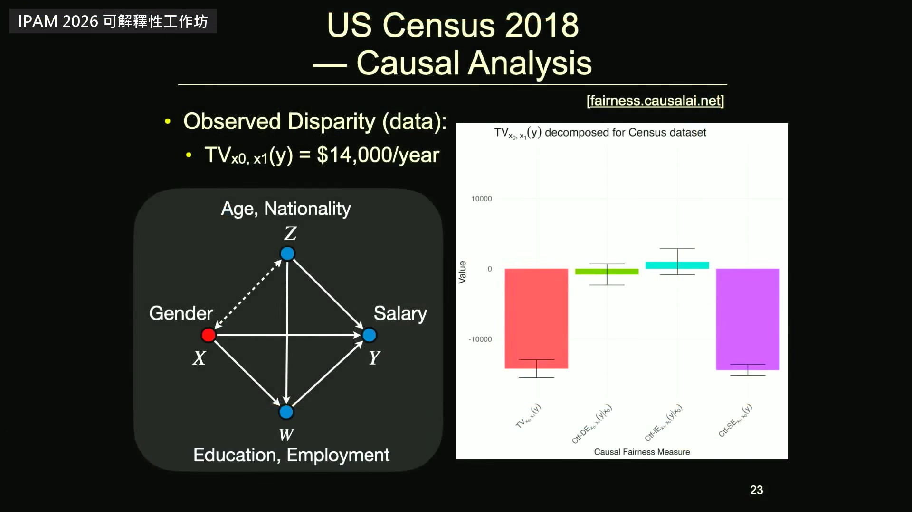

**逐字稿片段：** 第一種解釋：直接的部分幾乎沒有 間接的也很少，絕大部分是假性相關 就是我剛才講的第三種 這是一種可能的解釋，而它是不行的 另一種解釋則說：不，大部分是直接的 大部分是直接的 真的有人在看性別 然後決定把薪水壓低 停在第二種解釋 最左邊紅色那根是總差距 14,000 美元 跟上一張圖一樣高 綠色是直接效應 也就是只因為性別本身造成的差距 上一張圖裡它貼著零，這一張佔掉大半 紫色是假性相關，原本幾乎整根都是它 現在剩不到一半 我要講的重點，還不是哪一個才對 重點是 TV，因為我們在談第一、二、三層 TV 本身是第一層的量，它分不出這兩者 從 TV 來看，這兩種解釋一樣說得通 但因果分析會說：這個才對，另一個不對 所以要解釋世界，就需要因果模型 才能從第一層升上去。順帶一提，這是第三層的解釋 我沒有寫出形式定義，那在書的第 5、6 章 但這是一個第三層的解釋 （台下）我想確認一下：如果你有這些隨機變數的聯合分布 （台下）可以看給定 W 跟 Z 之後，X 跟 Y 的互資訊 （台下）看還剩不剩。這樣應該就夠了吧？ 不夠，不夠。細節我們私下再聊 因為有幾十年的文獻，都在試這個做法的各種變形 也就是只用第一層的運算，能不能把這些東西分離出來？ 結果算是失敗了。這個討論很精彩，我們私下談 但現在我們知道，這做不到 我只補一個詞：欠定，資訊不夠 這個問題的資訊遠遠不夠，我們談的是另一個分布 第一層本身，裡面什麼都沒有 我在第一層裡怎麼變花樣都行 裡面沒有任何東西，能讓我們對另一個機率分布說出什麼 我離題了

**話題推測：** 展示第一種解釋的圖表：薪資差距主要來自假性相關

---

## 00:26:44

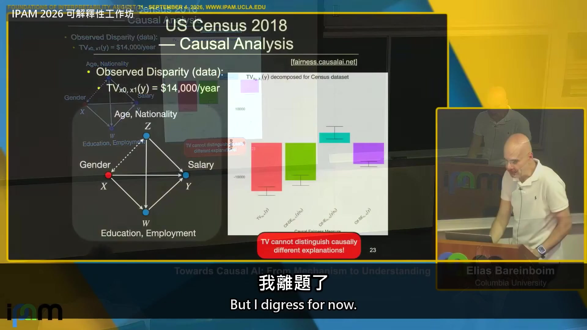

**逐字稿片段：** 現在我要解釋裡面的「為什麼」 我是 AI，我要解釋我裡面發生了什麼 我為什麼做出這個決定。拿 MNIST 來說 一樣的圖，我只多加了一個 Y hat 我在想，教機器學習的時候，能給學生最簡單的題目是什麼？ MNIST。那就做彩色的 MNIST 我們訓練一個分類器，輸出 Y hat Y hat 預測的是顏色，抱歉，是數字。連我自己都搞混了 AI 要預測的是數字本身 它要說這是 0 還是 5，這是它要預測的 有趣的來了，我們這樣做 有一個訓練分布，我們訓練兩個分類器 這是個很小的實驗，先別開槍

**話題推測：** 轉向新話題：AI 如何解釋自身決策（解釋自己）

---

## 00:27:34

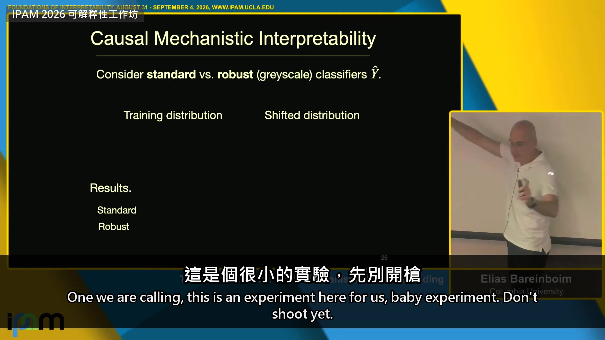

**逐字稿片段：** 一個叫標準版，另一個我們叫穩健版 這裡的穩健，意思是把顏色拿掉，變成灰階 因為我們是站在外面的設計者，我們知道答案 把這兩個盒子訓練起來 在訓練分布上，這是很簡單的問題 過去 15、20 年都做得到，準確率很高 但現在把數字跟顏色的相關稍微挪動一下 結果是這樣 穩健版不變，因為灰階裡沒有顏色可學 標準版的表現則大幅下滑 問題又來了：為什麼？ 你能解釋我為什麼這樣預測嗎？ 我有兩個盒子，F1 跟 F2：標準版跟穩健版 我分得出這兩個盒子嗎？ 把盒子打開檢查，有沒有什麼東西能讓我事先看出來？ 純粹為了示意，或者說為了歷史

**話題推測：** 介紹兩種分類器：標準版與穩健版

---

## 00:28:40

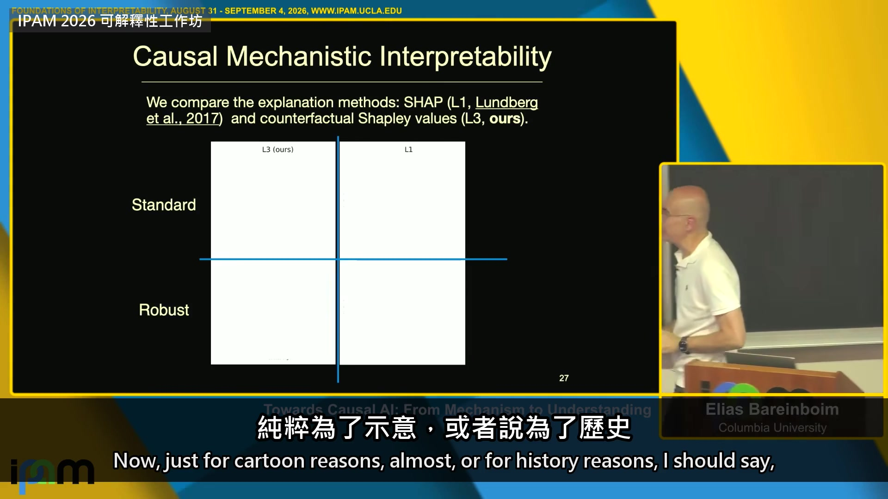

**逐字稿片段：** 我拿開創這個領域、最流行的方法：SHAP 多年前對這個領域非常重要的一篇論文 我用 SHAP 來做歸因 得到這個 問它：為什麼是 5？它說：因為數字是 5 歸因歸到數字上，不是顏色 這是標準版

**話題推測：** 引入 SHAP 方法來解釋模型預測

---

## 00:29:07

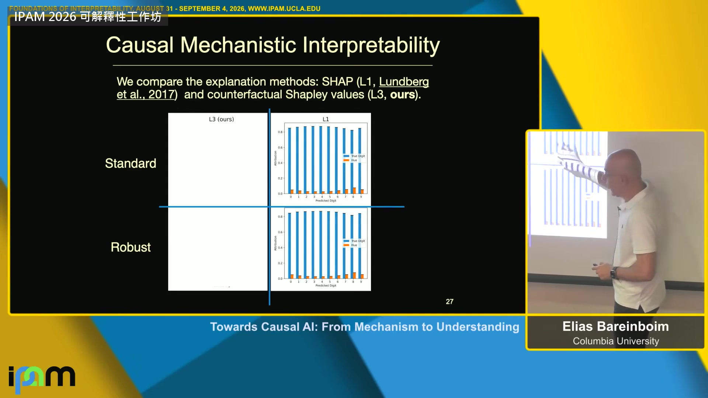

**逐字稿片段：** 換成穩健版，結果也一樣，非常像 所以給我 F1、F2 這兩個盒子，用 SHAP 來看 我該提一下，SHAP 只是第一層 它是在觀察分布上算某種統計量 我們分不出這兩個盒子 但我們知道它們不同，因為一跑，表現掉很多 它們做的不可能是同一件事 如果改用第三層的 Shapley，一種第三層的變形 不是簡單的變形，我講得太輕鬆了，這花了好幾年才做出來 因為 Shapley 只是取平均，不是數學的核心 問題在你平均的是什麼 我離題了，那是另一場演講 這時候問標準版：你為什麼說這是 5？ 它說：因為色調，因為顏色，不是因為數字 這樣就開始分得出來了 而且看得出這裡有問題 因為你不該憑另一個屬性說它是 5，也就是顏色

**話題推測：** 展示 SHAP 對穩健版模型預測的歸因結果

---

## 00:30:16

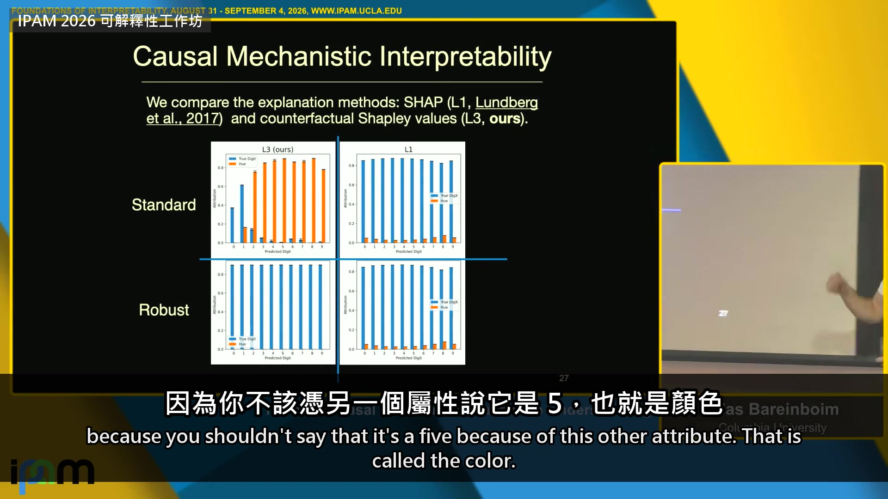

**逐字稿片段：** 停在這四張圖 藍色是歸因給數字本身，橘色則是色調 右邊兩張是 SHAP 上面的標準版跟下面的灰階版幾乎一樣 整排藍色 左上是第三層的方法看同一個標準版 0 跟 1 還靠筆畫 從 2 開始幾乎整排橘色 這個標準版，就是顏色一挪動 準確率從 100% 掉到 18.1% 的那個模型 我在這裡的註記是：機制可解釋性，文獻裡大部分的方法 都對因果視而不見 它們是在第一層上面算統計量 我們可以再砸幾十億美元、再多算力、再多花樣 成功的機率是零 因為我們瞄準的量是錯的 我們想挖得更深，想解釋底下的機制 而你在因果階層裡越往上，就拿得到越多現實的細節 混雜在第一層就已經在了，就在顏色跟數字之間 接下來三分多鐘我們跳過

**話題推測：** 總結展示四張歸因圖，比較 SHAP 與因果 Shapley 的差異

---

## 00:31:22

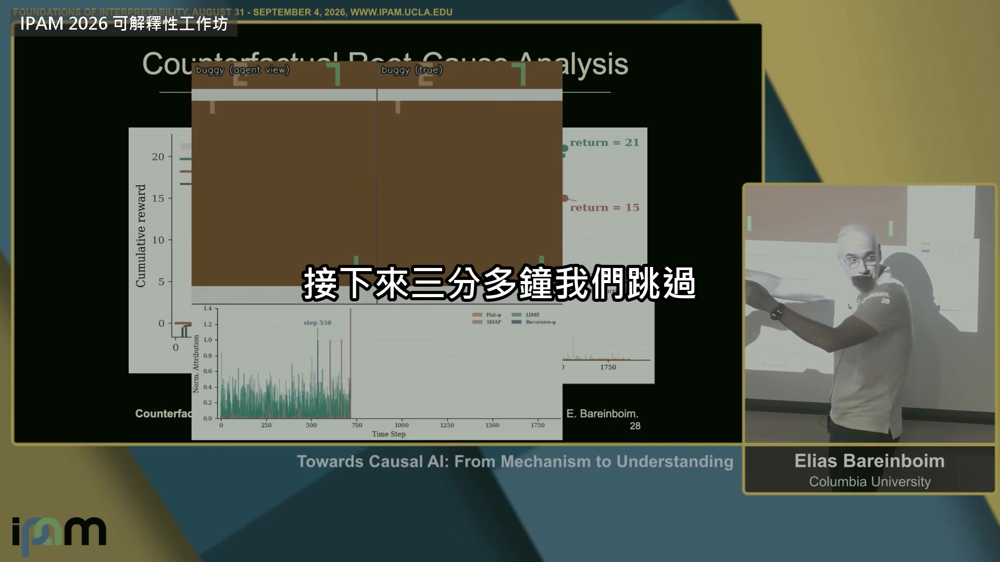

**逐字稿片段：** Bareinboim 把同一套歸因搬到會打 Pong 的 agent 身上 畫面隨機黑掉幾格 分數從 21 掉到 15 不看因果的歸因方法 把責任攤在一大片時間點上 反事實的版本只揪出兩步 第 536 步跟第 1311 步 球離球拍不遠不近 畫面一黑就來不及救 模型可以把資料擬合得非常好 把你在世界上觀察到的一切都重現出來 卻完全不知道為什麼 不知道事情為什麼是這樣發生的 今天大家忙的，是怎麼擬合 擬合，對的是相關 理解，對的是因果，是底下那些機制 是它們生出了我們看到的相關 我認為我們追錯了 我常被問一個問題，我先搶答 Elias，你怎麼不把因果直接貼到語言模型上就好？ 我說：這是因果的語言，這是語言模型的語言 兩邊講不上話，要接起來並不簡單 就像我們剛才聊的那個玩笑：量子力學跟廣義相對論 兩個不一樣，你怎麼不把它們接起來？怎麼不寫成一套？ 那邊有數學家啊，怎麼會做不到？事情不是這樣的 它們是非常不同的語言 我希望大家去想：怎麼找到一種共同語言，讓我們兩個都有

**話題推測：** 將歸因方法應用到打 Pong 的 AI 代理上

---

## 00:32:48

**逐字稿片段：** 整場收成兩件事 第一，因果的問題有三層 現在的模型吃的幾乎都是第一層的資料 而第一層的資料定不出上面兩層的答案 所以貓、檯燈、可樂瓶會畫錯 資料再多也補不回來

**話題推測：** 總結第一點：因果問題三層與模型局限

---

## 00:33:02

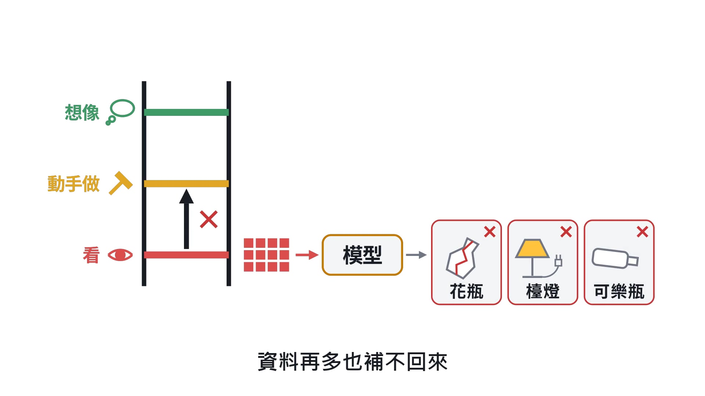

**逐字稿片段：** 第二，解釋也要過同一關 薪水為什麼差 14,000 美元 模型為什麼說這是 5 只拿第一層的統計去歸因 兩種完全不同的機制會長得一模一樣 沒解決的也有兩件 因果這一邊的方法 這場只在彩色數字跟 Pong 這種小題目上示範 沒有秀出一張畫對的貓 至於怎麼跟語言模型接起來 Bareinboim 自己說 兩邊還沒有共同的語言

**話題推測：** 總結第二點：解釋問題與第一層統計歸因的不足

---

## 00:33:27

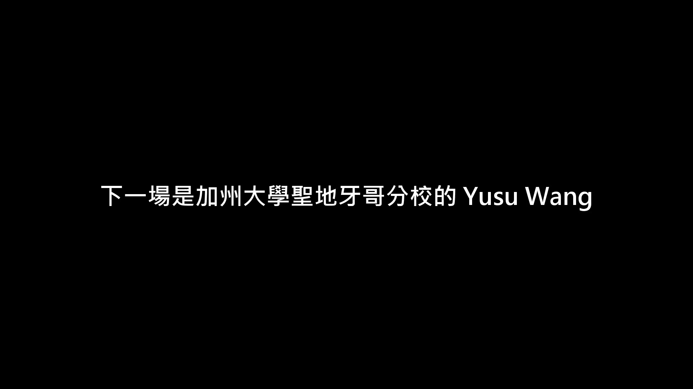

**逐字稿片段：** 下一場是加州大學聖地牙哥分校的 Yusu Wang 題目是神經網路為什麼能舉一反三 訓練時最多只看過 1,000 個數字的排序 丟 100 萬個給它還排得對 這樣算不算學會了演算法 Wang 拿兩種圖神經網路去做圖分割 成績差不多，一層一層打開來看 裡面走的步驟卻不一樣 原影片連結在說明欄，整場 54 分鐘，有興趣可以去聽更多。

**話題推測：** 介紹下一場演講主題：神經網路的泛化能力

---
