# ai-note-101_MUpWoUtEYwU — 關鍵畫面索引

- 來源逐字稿：[ai-note-101_MUpWoUtEYwU_GT.srt](ai-note-101_MUpWoUtEYwU_GT.srt)
- 影片：https://www.youtube.com/watch?v=MUpWoUtEYwU
- 截圖數：20

## 00:00:00

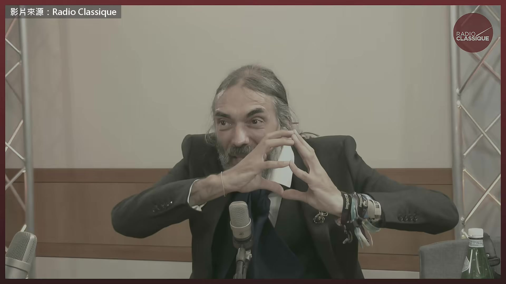

**逐字稿片段：** 2018 年法國訂國家 AI 戰略 用的就是這個人帶隊寫的報告 他叫 Cédric Villani 2010 年的費爾茲獎得主 後來當了五年國會議員 今年 9 月 11 號 他跟另外 24 位得主聯名發表聲明 說 AI 公司搶著拿數學難題當跑分 正在傷害數學 聲明發出 4 天後

**話題推測：** 畫面：法國AI國家戰略報告封面或相關圖表

---

## 00:00:19

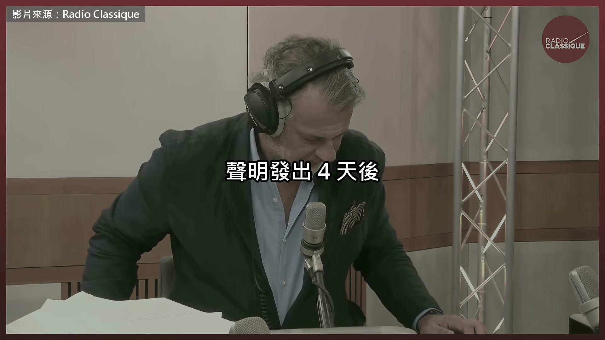

**逐字稿片段：** 9 月 15 號早上 他上了法國一家古典音樂電台的晨間專訪

**話題推測：** 畫面：電台專訪的預告或現場畫面

---

## 00:00:24

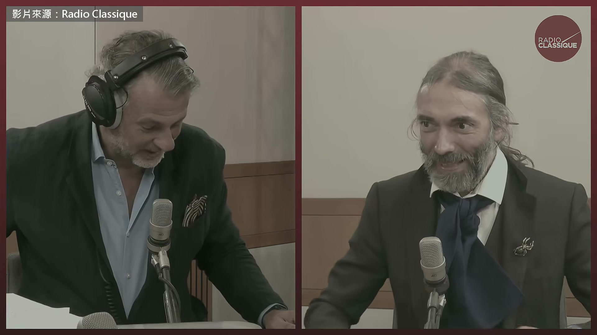

**逐字稿片段：** AI 幾天就能解掉懸了幾十年的難題 數學家到底在怕什麼 他用一間教室來回答 不得不說，AI 現在已經會解 非常複雜的數學方程式 像最近的 Navier-Stokes 問題 Villani，您為什麼擔心？ 為什麼偏偏是這一題，讓您的同行開始擔心？ 首先，您提到同行，說得沒錯 我在這裡講的，甚至不是我自己的意見 而是一整群費爾茲獎得主的意見 25 位費爾茲獎得主，超過多數… 超過在世得主的一半 這麼多得主一起站出來說話，以前從來沒有過 說他們很擔心

**話題推測：** 新話題：AI解題能力與數學家擔憂的對比

---

## 00:01:10

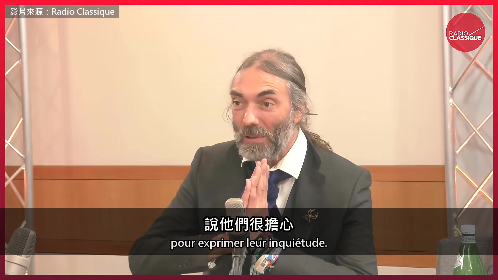

**逐字稿片段：** 起因是幾天前，9 月 8 日那件事 一連串的宣布又反宣布 一邊是跟 Anthropic 合作的團隊，一邊是跟 OpenAI 合作的團隊 最後，解出來了，宣布了，也發表了 是流體力學裡的幾道難題 在整個數學界都數一數二有名 其中一題是 Euler 方程，可以說懸了 250 年 一題是您剛剛提到的 Navier-Stokes 方程 7 道千禧年難題之一，懸賞 100 萬美元 這些都是數學家一直在做的題目 讀你們那份聲明，看得出來

**話題推測：** 畫面：9月8日相關新聞事件的報導截圖

---

## 00:01:52

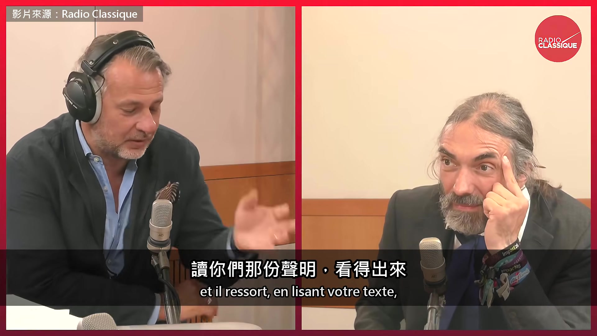

**逐字稿片段：** 走到答案的那條路，也許跟答案一樣重要 這就是你們要捍衛的 你們捍衛找答案花的時間，就跟捍衛答案這座聖杯一樣 找的時間，驗證答案的時間 還有弄懂它的時間 那條路甚至更重要，在科學裡常常是這樣 在數學裡尤其如此，比結果本身還重要 這幾個月，我們看到一些 AI 工具 在數學上強到 一眨眼就能解掉 原本要用幾十年來算的題目 就拿 Navier-Stokes 這一題來說

**話題推測：** 新觀點：強調解題過程而非結果

---

## 00:02:36

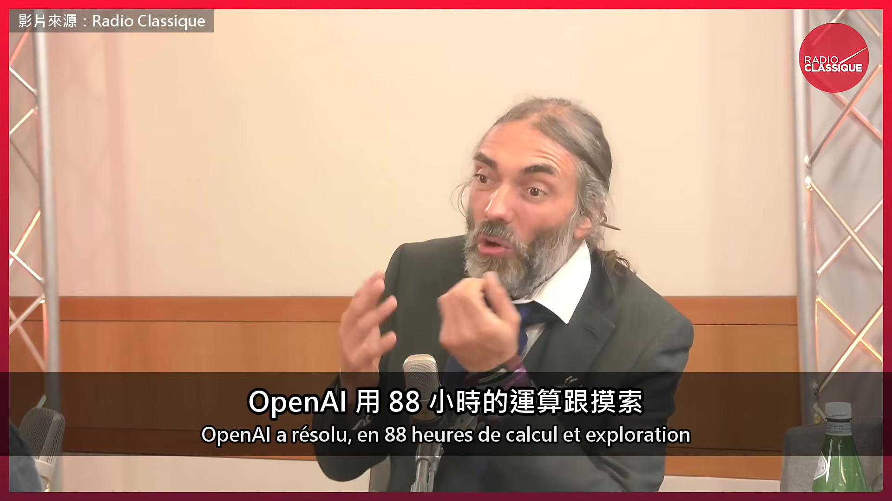

**逐字稿片段：** OpenAI 用 88 小時的運算跟摸索 靠這些強大的演算法 解掉一道懸了 90 年、在數學界很有代表性的題目 然後只花 17 小時，就用機器驗證完 相比之下，人類辛辛苦苦做了 4 年 才把 2002 年那個解答驗證完 那是我們的千禧年難題，龐加萊猜想 Villani，您跟您那些拿費爾茲獎的同行 還有整個科學界 我想物理學家、天文物理學家，所有做研究的人也一樣 你們擔心，是不是因為覺得

**話題推測：** 畫面：AI解決問題所需時間的數據圖表

---

## 00:03:19

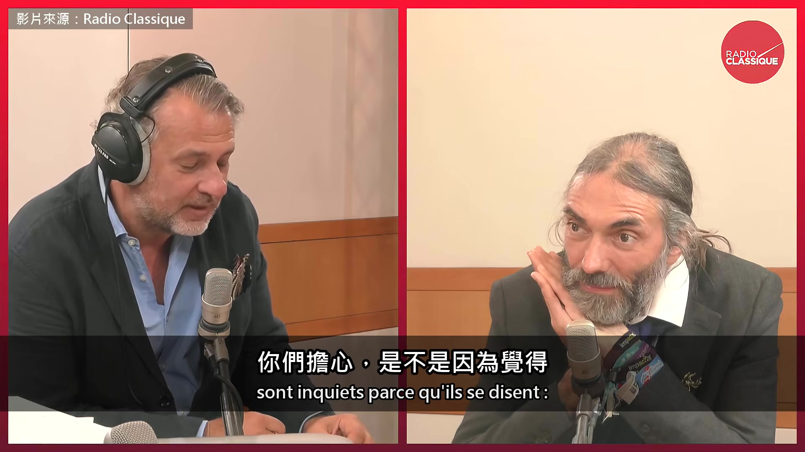

**逐字稿片段：** 「我們會變成汽車出現時的馬車夫」？ 您擔心的是這個嗎？是為了保住自己這一行？ 首先，這個比喻有它的極限 我在這件事上看到的是 年輕一代還更擔心 比我們這些資深的、像我這樣的人更擔心 我們職位、獎項，該有的都有了 在數學裡，要讓事情往前走 要進步、要更懂這個世界

**話題推測：** 新比喻：AI時代數學家如同汽車發明前的馬車夫

---

## 00:03:52

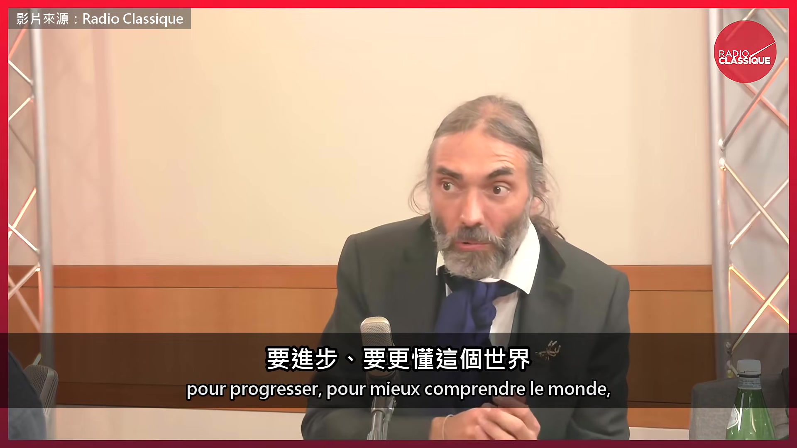

**逐字稿片段：** 需要三樣最基本的原料 點子、學生，還有題目 一千年來，往前走的方法 就是出題目給學生 讓他們把那些點子弄得更懂 好讓他們長出新點子、提出新題目 新題目再拿去訓練下一批學生，一直這樣下去 現在，我們手上的工具厲害到

**話題推測：** 新概念：數學進步的三大要素

---

## 00:04:16

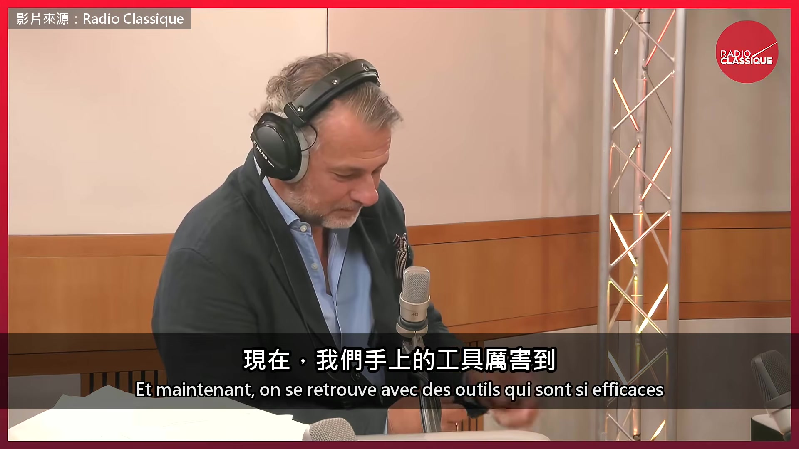

**逐字稿片段：** 題目有枯竭的風險 想像一下，你是老師，你班上

**話題推測：** 畫面：問題枯竭的視覺化隱喻

---

## 00:04:22

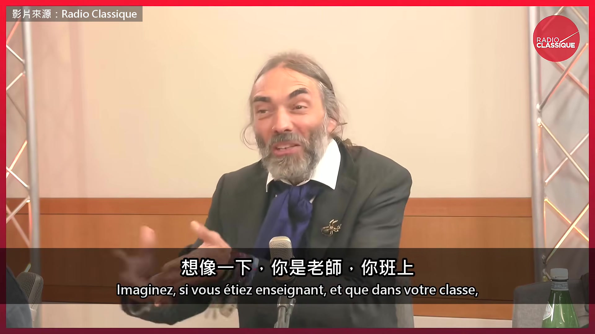

**逐字稿片段：** 有一個人比其他人都強太多太多 找答案特別快 你題目一出，他馬上給答案 別人連想的時間都沒有 班上總有一個人比別人先舉手 有一個就算了，可是這一個，別人還來不及想 其他學生會進步嗎？ 答案是：不太會 我們需要花時間在習題上 才會弄懂、才會長出新點子 這件事，從小學 到寫博士論文，甚至更後面，都一樣

**話題推測：** 新比喻：AI像班上過於聰明的學生

---

## 00:04:54

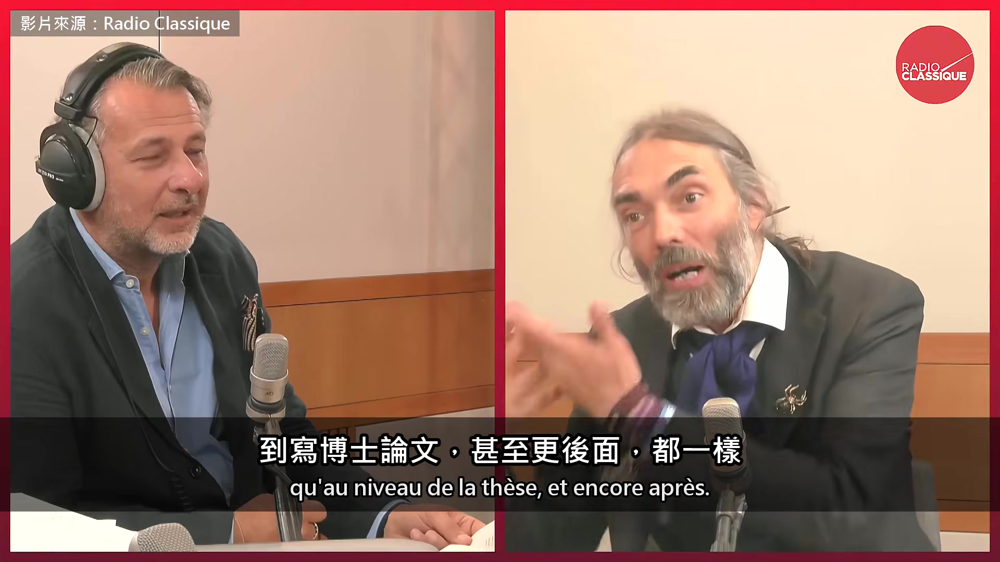

**逐字稿片段：** 主持人接著提到 AI 大廠裡也有人出來示警 說 AI 越來越危險、管不住 還會自作主張，十年內可能會變壞 他問 Villani 同不同意 「自作主張」這個詞，我不會拿來講 AI AI 從來只做程式設定它去做的事 可是它能做的事那麼多 又能鑽進 我們這個數位社會的每一道縫隙 所以，對，只要看看新聞 就知道風險有各式各樣

**話題推測：** 畫面：主持人與來賓的對話切換

---

## 00:05:25

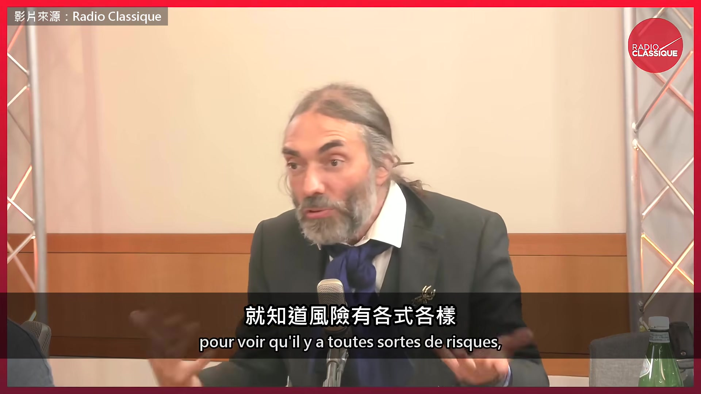

**逐字稿片段：** 各種危險，有安全問題 有武器的問題、技術的問題 工作的問題，各種控制不住的問題 我們這些數學家，最想說的是 小心，我們先花時間想一想 我們這一行，什麼才重要 別讓年輕數學家變成失落的一代 也別讓文化乾涸，那會傷到全人類 這是今天數學界的事 今天所有的文化活動，也都碰到同一個問題

**話題推測：** 畫面：列出AI可能帶來的多種風險

---

## 00:05:59

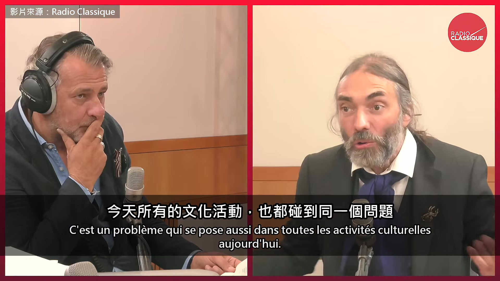

**逐字稿片段：** 主持人再問，物理學家、天文學家 甚至人文學科 會不會都碰到同一個問題 當然，人文學科也可以算進來 您看，現在一個 AI、一個演算法 就能幫你寫出一篇還過得去的論文 幾乎什麼題目都行，幾秒鐘就寫好

**話題推測：** 新話題：將AI影響擴展至其他學科

---

## 00:06:17

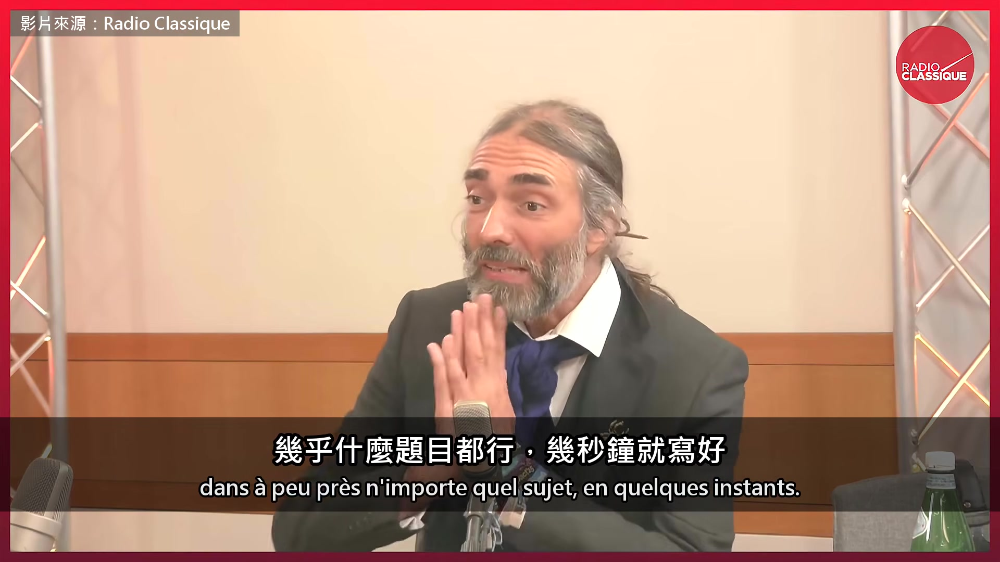

**逐字稿片段：** 一位在劍橋教數學的朋友跟我說 「現在，博士生頭兩年會被問到的題目 AI 差不多都解得出來」 在這種情況下，怎麼讓學生還有動力，才是最重要的

**話題推測：** 新情境：劍橋數學教授的觀點

---

## 00:06:35

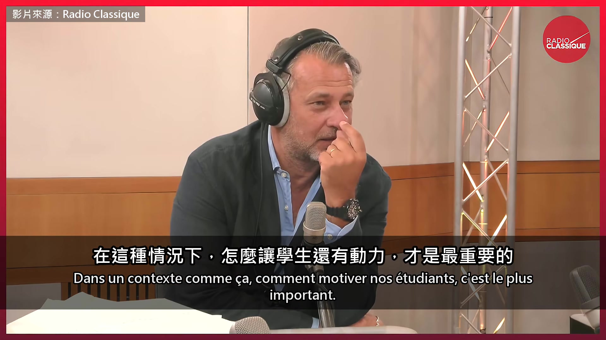

**逐字稿片段：** 我剛收了一個博士生 我特別交代他，念博士這段期間，還在養成的時候 千萬不要用那些生成式工具 養成的時候，就是要下苦功 把自己的腦袋重新塑造一遍 任何一門專業，美就美在這裡 不管你是藝術家、天文物理學家、哲學家還是數學家 你都要花時間重新塑造自己的腦袋 把自己變成人類派去那片領域探索的代表 我記得 10 年前有個人跟我說 念書就是要吃點苦，念書就是關在四面牆裡 一群人聚在牆裡面，一起絞盡腦汁 這個人甚至跟我說，每個禮拜一開始 準備考理工、數學學院入學考的那段時間 禮拜一先煮好一鍋湯 每天去買一條新鮮的長棍麵包 然後就關在書房裡不出來 那個人就是您吧？ 對，沒錯，那是我在寫一本數學書的時候 那本書在我人生裡變成一件很重要的事

**話題推測：** 講者個人經驗分享：指導博士生避免使用生成工具

---

## 00:07:42

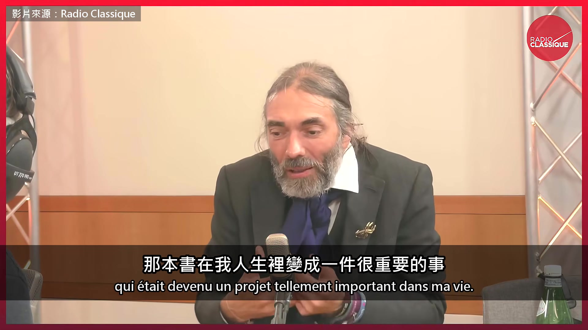

**逐字稿片段：** 後來這本書拿到美國數學學會的 Doob 獎 因為它講得特別好懂又完整 那些埋頭苦幹的日子、那些痛苦的日子 我整天就是湯和書，書和湯 那是痛苦，也是幸福

**話題推測：** 畫面：書本榮獲Doob獎的資訊

---

## 00:08:08

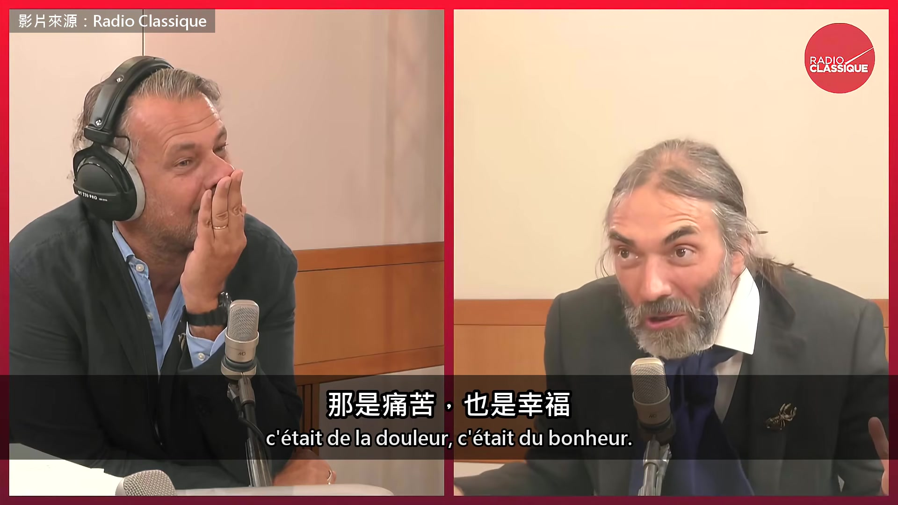

**逐字稿片段：** 您講的這些，跟現在完全對不上 這個社會講休閒、講享樂 要快速解答，人手一支手機 您是在逆流划船 是啊，我在划，我就是故意逆著划，我要說的是 要快樂，要過得好 就得花時間、花力氣 去做一件你真正在乎的事 花時間、花力氣，這不是什麼新道理

**話題推測：** 新話題：傳統苦學與現代社會快速享樂的對比

---

## 00:08:35

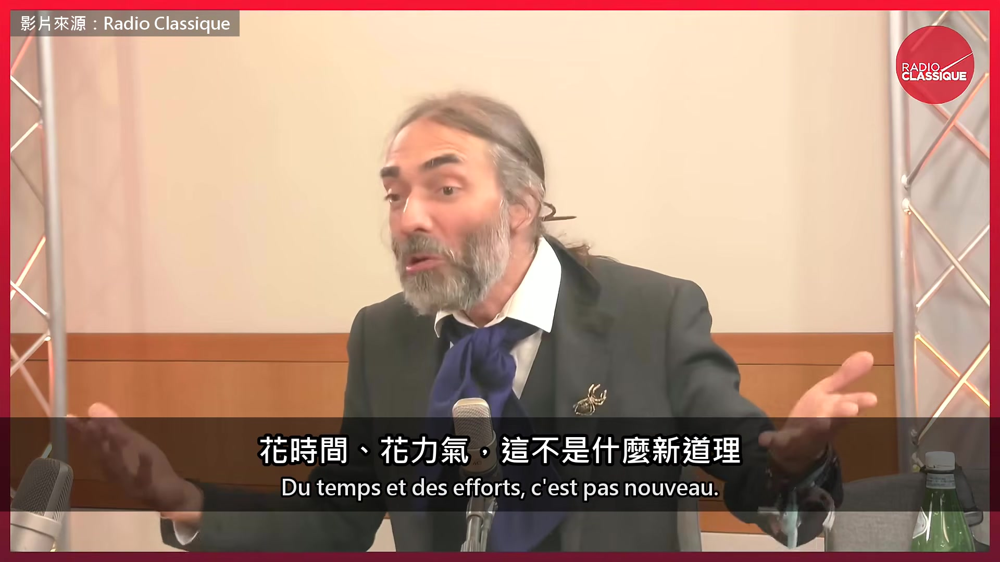

**逐字稿片段：** 您一定記得《小王子》的作者聖修伯里 是你花在照顧那朵花的時間，讓它變得珍貴 諸如此類 你花越多時間、越多力氣去攻克一道題目 你就越自豪、越快樂 Villani 擔心的是 AI 把題目解得太快 學生就沒有題目可以自己慢慢磨 所以他交代剛收的博士生 念博士這幾年 先別讓生成式工具替你想

**話題推測：** 新引述：小王子的經典語錄

---

## 00:09:02

**逐字稿片段：** 原影片 12 分鐘 後面他還聊了兩件事

**話題推測：** 畫面：影片結尾資訊卡或下一段預告

---

## 00:09:06

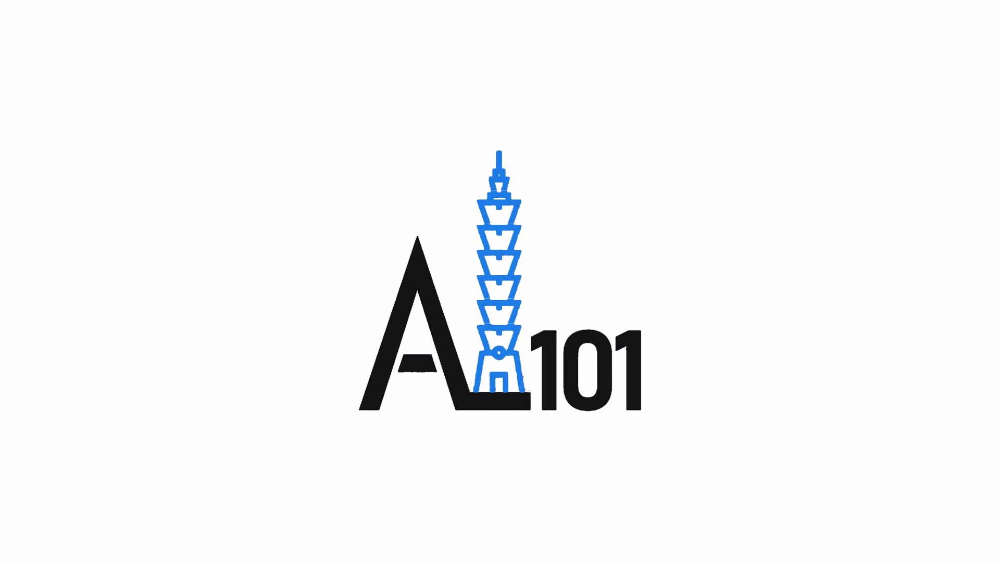

**逐字稿片段：** 一件是教育 有人說有了 AI 就不用念書了 他說聽到這種話太可怕 另一件是他在巴黎劇場的演出 把數學講座跟詩朗誦混在一起 他順手舉了一個例子 一顆球切成 5 塊 能拼回兩顆跟原來一樣大的球 原影片連結在說明欄，有興趣可以去聽更多。

**話題推測：** 新話題：AI對教育的影響

---
