# ai-note-101_NrRL3iH9Of4 — 關鍵畫面索引

- 來源逐字稿：[ai-note-101_NrRL3iH9Of4_GT.srt](ai-note-101_NrRL3iH9Of4_GT.srt)
- 影片：https://www.youtube.com/watch?v=NrRL3iH9Of4
- 截圖數：26

## 00:00:00

**逐字稿片段：** 這裡是 AI 101，全網最幽默的 AI 新聞

**話題推測：** 節目開場，可能顯示節目名稱或片頭。

---

## 00:00:04

**逐字稿片段：** OpenAI 的年化營收

**話題推測：** 介紹影片主題：OpenAI的年化營收。

---

## 00:00:07

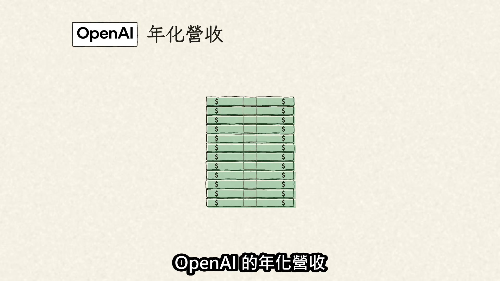

**逐字稿片段：** 從逼近700億美元變成接近500億美元，前後才9天 這不是 OpenAI 9天少賺200億 而是前後用了不同的尺 那這把尺量的是什麼？ 年化營收 通常是拿近期的營收速度外推成一整年 也就是說 年化營收不是已經實現的全年營收

**話題推測：** 點出OpenAI年化營收前後數據的巨大落差。

---

## 00:00:28

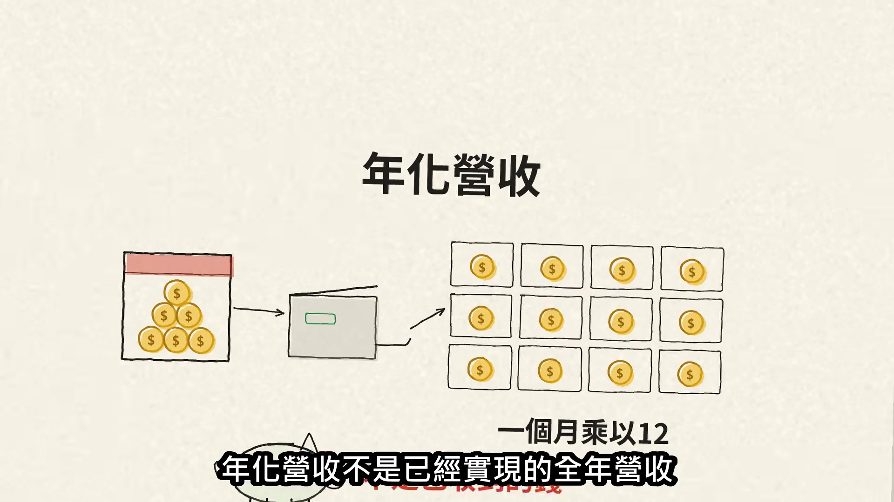

**逐字稿片段：** 事情要回到9月29日

**話題推測：** 回溯事件時間線，可能顯示相關新聞標題或時間軸。

---

## 00:00:30

**逐字稿片段：** 新聞網站 Axios 報導 OpenAI 年化營收逼近700億美元

**話題推測：** 提及報導來源Axios，可能顯示新聞來源或標題。

---

## 00:00:35

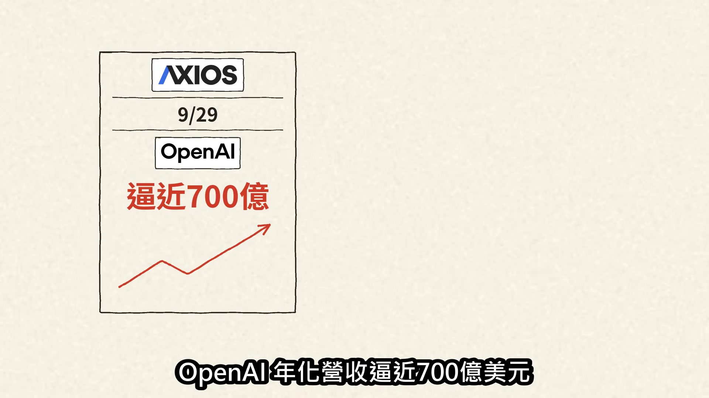

**逐字稿片段：** 可是到了10月8日 《金融時報》看到 OpenAI 投資人文件 9月底只接近500億 那多出來的200億是誰灌的？

**話題推測：** 提出另一個時間點的數據，可能顯示新的新聞報導或時間軸更新。

---

## 00:00:43

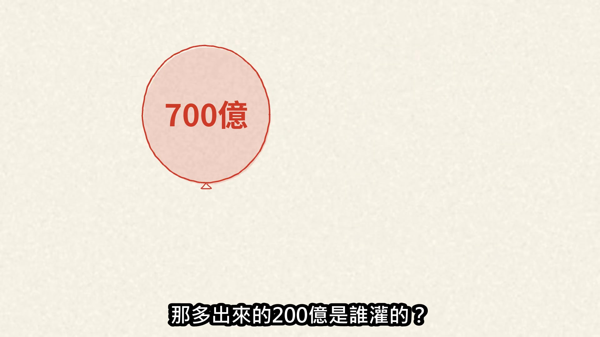

**逐字稿片段：** Axios 隨後澄清： 700億是投資人照 Anthropic 的口徑放大換算的 這200億差額不代表客戶或現金真的消失

**話題推測：** 提及Axios的澄清，可能顯示澄清報導。

---

## 00:00:53

**逐字稿片段：** Anthropic 的算法又差在哪？ 假設一張100美元的帳單 客戶透過雲端平台買 AI 服務 Anthropic 可能整張都算營收

**話題推測：** 轉向探討Anthropic的具體計算方法，可能顯示比較圖表或會計說明。

---

## 00:01:02

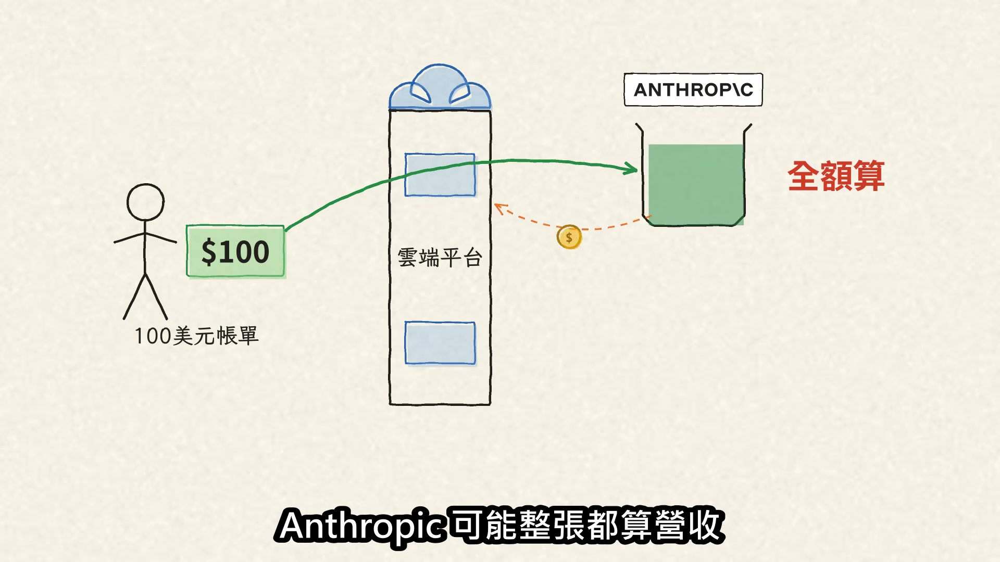

**逐字稿片段：** OpenAI 對某些通路，只算自己留下的 兩種算法哪個才對？ 差別在公司被判定是控制服務的主理人 還是協助銷售的代理人

**話題推測：** 說明OpenAI與Anthropic在營收計算上的差異。

---

## 00:01:13

**逐字稿片段：** 兩種都可能符合美國一般公認會計原則 也就是 GAAP

**話題推測：** 提及兩種算法都可能符合美國一般公認會計原則（GAAP）。

---

## 00:01:18

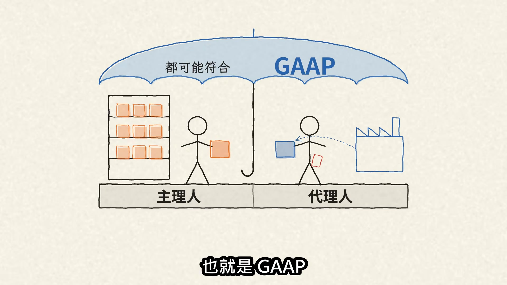

**逐字稿片段：** 帶著兩把尺回頭看營收賽跑 2025年底 OpenAI 大約是 Anthropic 的2.4倍

**話題推測：** 轉換視角，將營收成長比作「賽跑」，可能顯示兩公司營收成長比較圖。

---

## 00:01:25

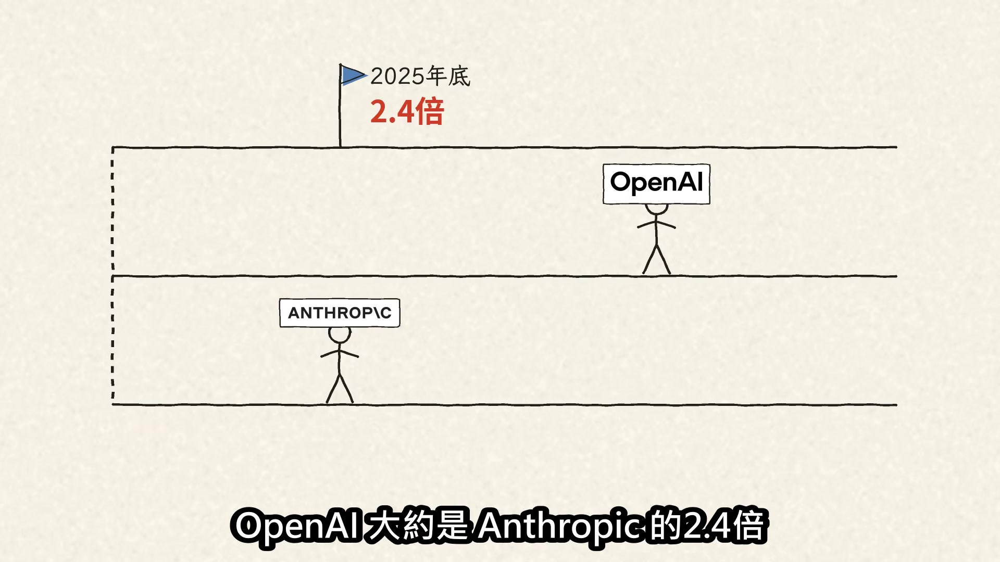

**逐字稿片段：** Anthropic 一路追趕，4月6日首度越線 7月底更傳出超過650億 但問題是，這場賽跑的刻度可能不一樣

**話題推測：** 提到Anthropic的追趕，並給出首次超越的時間點。

---

## 00:01:35

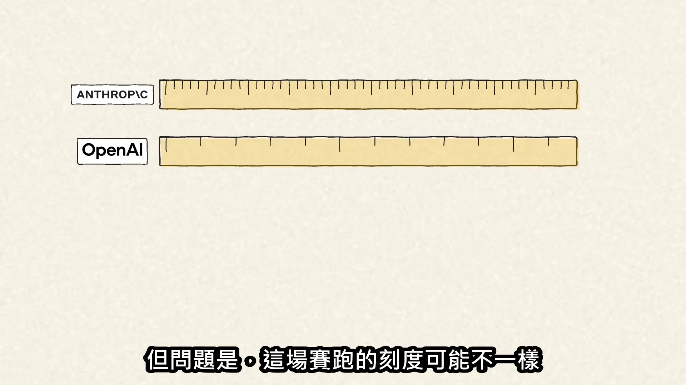

**逐字稿片段：** Axios 早在8月就提醒 兩家公司量營收的尺可能不同 只是這句註腳當時沒什麼人注意

**話題推測：** 提及Axios在過去的提醒，可能顯示相關新聞截圖。

---

## 00:01:42

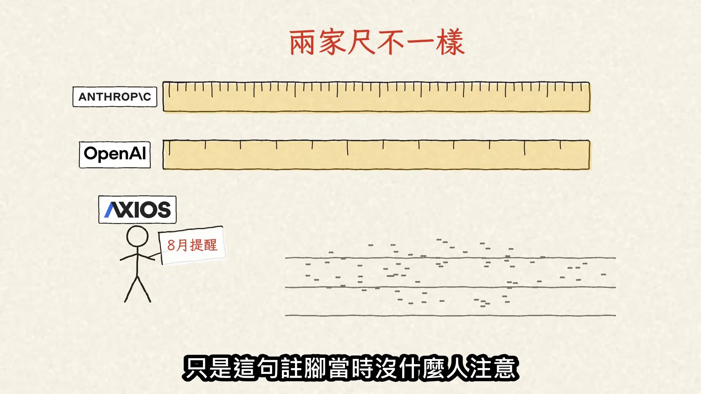

**逐字稿片段：** 那500億代表 OpenAI 需求崩盤嗎？

**話題推測：** 提出新問題，探討500億營收是否代表OpenAI需求崩盤。

---

## 00:01:46

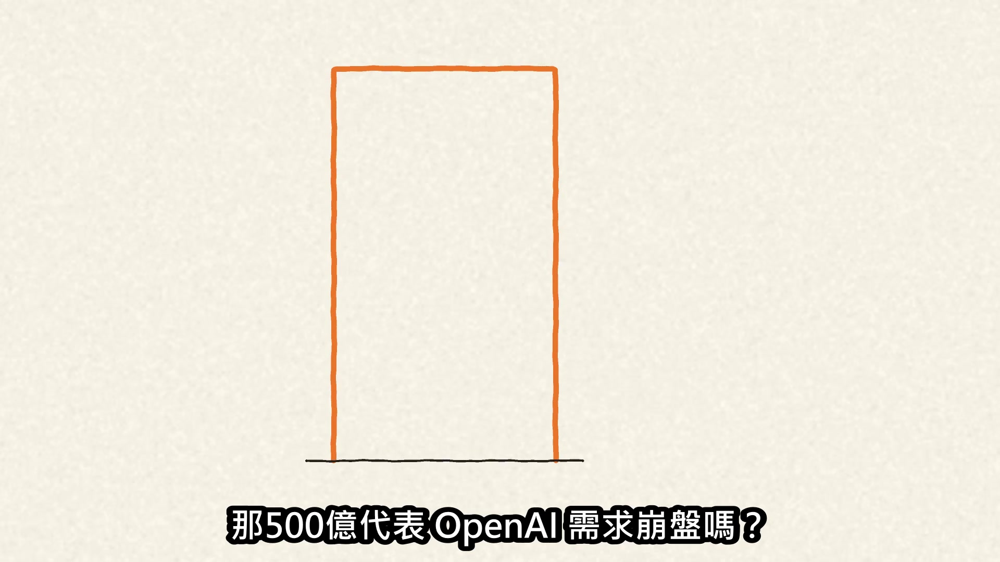

**逐字稿片段：** 並沒有 知情人士提供的資料顯示 OpenAI 仍在高速成長： 第三季年化營收速度成長77%

**話題推測：** 提及知情人士提供的數據，可能顯示OpenAI實際成長數據圖表。

---

## 00:01:53

**逐字稿片段：** 企業業務更增加107% 儘管如此，消息一曝光

**話題推測：** 提供OpenAI企業業務的具體成長數據。

---

## 00:01:58

**逐字稿片段：** AI 基礎建設股跌勢加快

**話題推測：** 轉向市場反應，可能顯示AI基礎建設股的股價走勢圖。

---

## 00:02:00

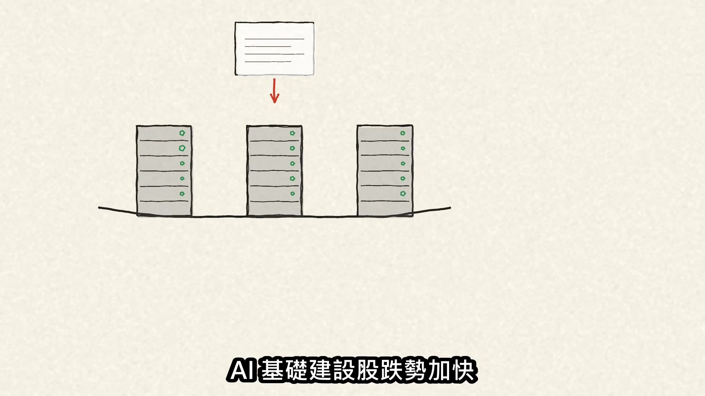

**逐字稿片段：** 提供 AI 雲端運算的 CoreWeave 當天跌約8%

**話題推測：** 提及具體公司CoreWeave，可能顯示其股價走勢。

---

## 00:02:05

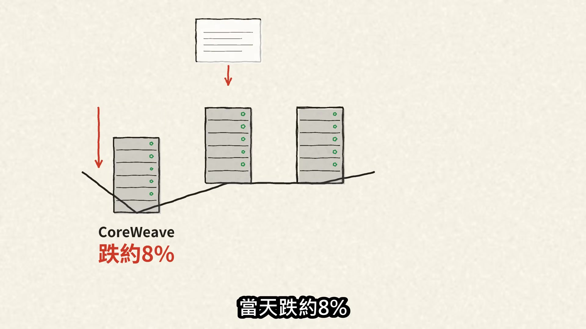

**逐字稿片段：** Oracle、Nvidia 也下跌 不過同一天，油價上漲、債市也劇烈反轉 市場這麼敏感

**話題推測：** 提及Oracle和Nvidia的下跌，可能顯示這些公司的股價走勢。

---

## 00:02:13

**逐字稿片段：** 是因為 OpenAI 正洽談新資金

**話題推測：** 解釋市場敏感的原因，提及OpenAI正在洽談新資金。

---

## 00:02:15

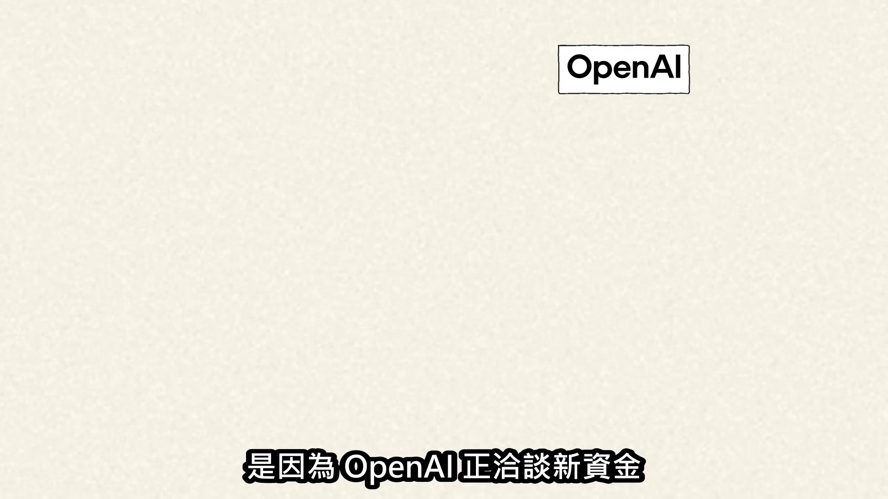

**逐字稿片段：** 投前估值約1.4兆美元 拿500億年化營收粗算

**話題推測：** 提出OpenAI的投前估值，可能顯示估值數字。

---

## 00:02:20

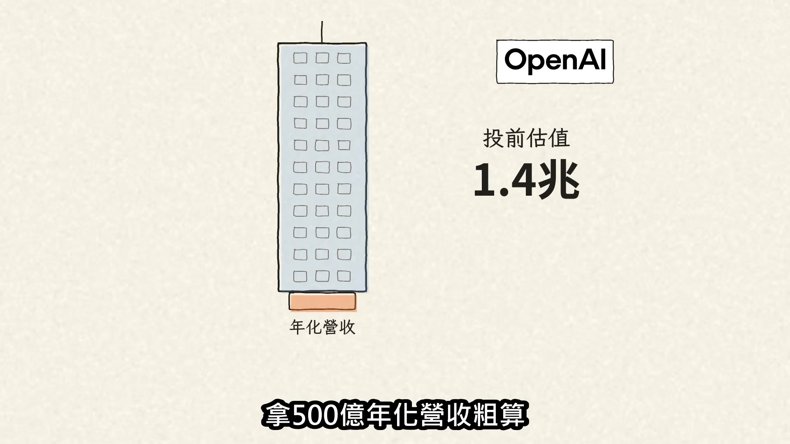

**逐字稿片段：** 等於28倍的營收速度 投資人押的是未來的成長 付不付得起算力帳單 而年化這把尺，很容易放大高速成長

**話題推測：** 算出估值與營收速度的倍數關係。

---

## 00:02:30

**逐字稿片段：** Anthropic 2025年全年營收約46億美元 2026年7月年化卻已超過650億

**話題推測：** 提供Anthropic 2025年全年營收的預期數字，與年化營收對比。

---

## 00:02:37

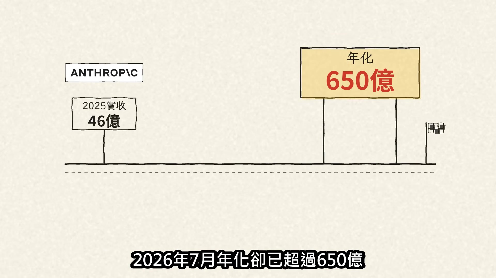

**逐字稿片段：** 這不是造假，比較像拿最後1公里的速度 推算整場馬拉松 所以回到 OpenAI：

**話題推測：** 使用「馬拉松」比喻，解釋年化營收的特性。

---

## 00:02:44

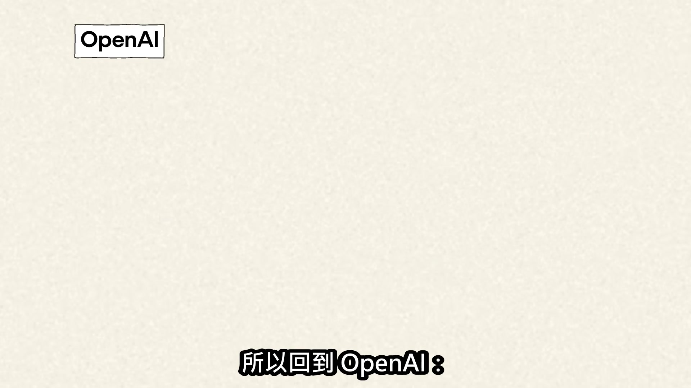

**逐字稿片段：** 公司仍預期年底達到或超過700億 但完整的通路對帳資料沒有公開 市場卻拿這個沒有統一算法、 也不是已實現全年營收的指標 去衡量兆美元估值

**話題推測：** 提及OpenAI對年底營收的最新預期。

---

## 00:02:56

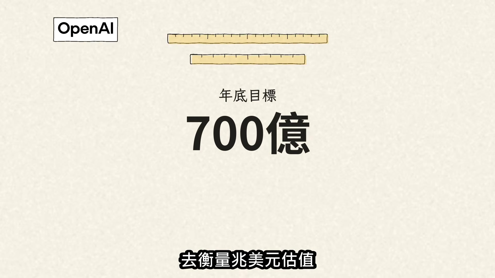

**逐字稿片段：** 下次再看到年化700億 先問用的是哪一把尺

**話題推測：** 影片結尾的提醒或總結。

---
