# ai-note-101_OlCqb3DtqnM — 關鍵畫面索引

- 來源逐字稿：[ai-note-101_OlCqb3DtqnM_GT.srt](ai-note-101_OlCqb3DtqnM_GT.srt)
- 影片：https://www.youtube.com/watch?v=OlCqb3DtqnM
- 截圖數：24

## 00:00:00

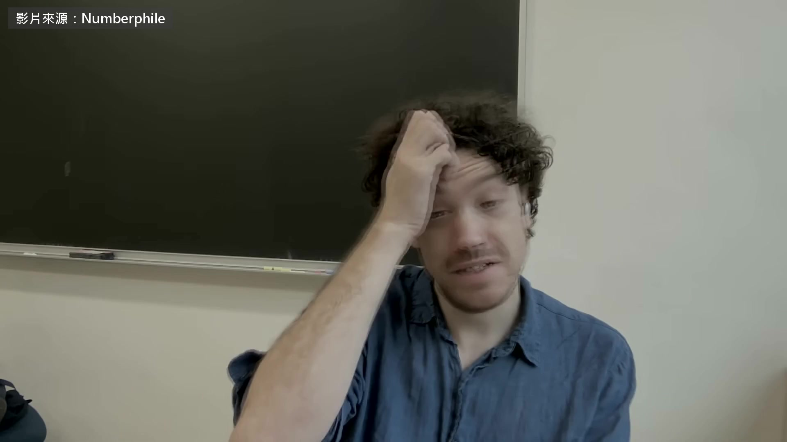

**逐字稿片段：** 9 月 8 日 OpenAI 宣布用 1 萬個 agent 解掉了懸賞 100 萬美元的千禧年難題 Navier-Stokes 一直在逼近這一題的 是紐約大學 Courant 研究所的數學教授 Tristan Buckmaster 他研究流體方程的奇異點已經六、七年 合作者 Levent Alpöge 在 Anthropic 上班 OpenAI 宣布之前 他跟 OpenAI 的人通了一通視訊電話 這是數學頻道 Numberphile 9 月底上架的專訪 他從頭講那通電話 也講數學界為什麼開始不敢公開自己的未解問題 你又笑又開心，這就帶到我想問的第一個問題，

**話題推測：** 事件日期：9 月 8 日

---

## 00:00:35

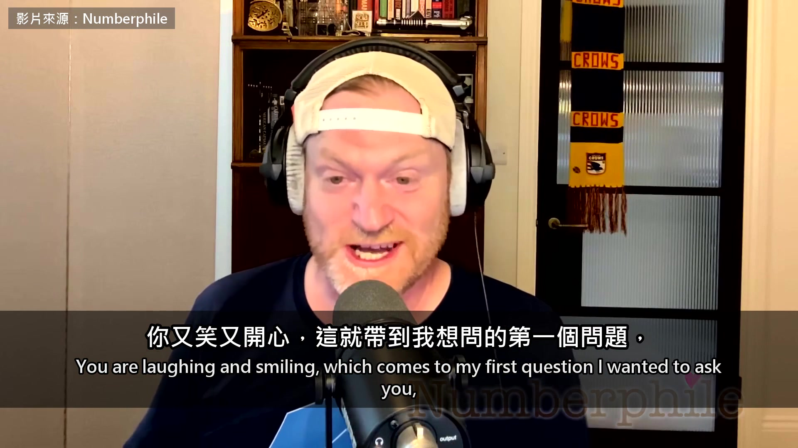

**逐字稿片段：** 你現在感覺怎麼樣？ 比幾個星期前好。不過事情還沒有完全平息 你知道，我有一個兩個月大的寶寶， 出事的那個星期，我平均每天晚上大概只睡 2 個小時 一直有人來敲我辦公室的門， 有時候門開著，他們就直接走進來， 我就趴在桌上睡著。我真的累壞了 感覺像不像被 1 萬個 agent 搶劫？ 從你的角度，會覺得自己是受害者嗎？ 對啊，這整件事就是很荒謬 就是，你知道，我不是… 我算是懂那套文化的人， 因為我之前就接觸過這個圈子…

**話題推測：** 主持人提問，訪談正式開始

---

## 00:01:43

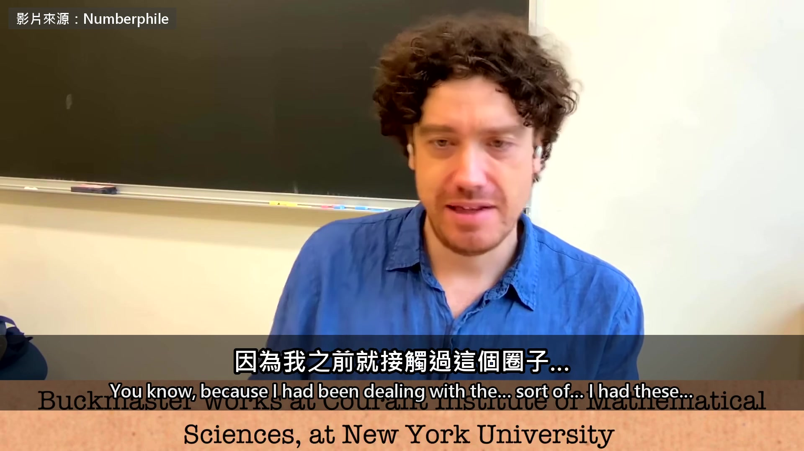

**逐字稿片段：** 因為我之前…我之前跟 Google DeepMind 合作過， 大概知道科技業怎麼運作，基本上什麼都做得出來

**話題推測：** 提及曾與 Google DeepMind 合作經驗

---

## 00:01:58

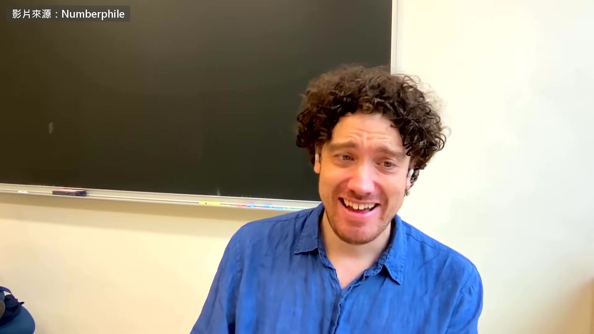

**逐字稿片段：** 我知道他們的哲學是「快速行動，打破成規」， 這套哲學碰上數學，一定會撞在一起 這次被打破的就是你嗎？ 對。好笑的是，這件事本來可以很簡單 他們只要照規矩出牌， 讓我們先發表我們的結果，然後再放出他們那一大群 agent， 然後，你知道… 路就很清楚，故事也很清楚， Navier-Stokes 這一題也還是他們的 Levent 在 Anthropic 上班，但這是他私下的專案，是跟我一起做的 這根本不是 Anthropic 砸幾百萬美元的專案

**話題推測：** 闡述科技業「快速行動，打破成規」哲學

---

## 00:02:55

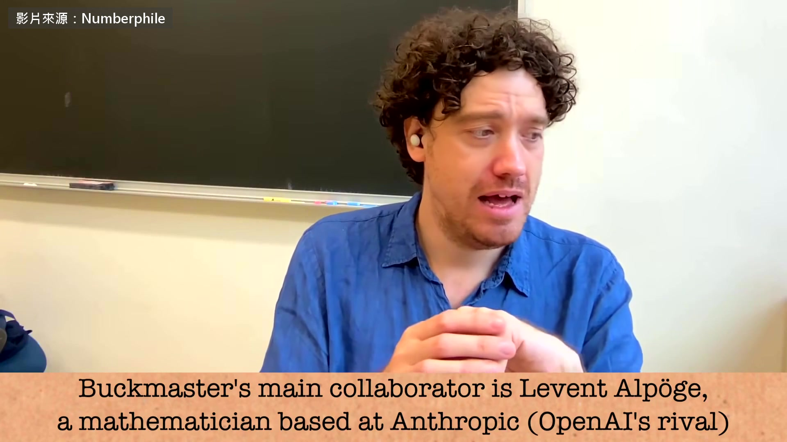

**逐字稿片段：** 當然，要是 Anthropic 的 Dario 說「我們來打敗 OpenAI」，那就另當別論 可是不是那樣，我們也從來不想變成那樣 所以他們只要讓我們先發表，再拿去往下做， 那就不會鬧成這麼大的風波

**話題推測：** 提及 Anthropic 的 Dario

---

## 00:03:24

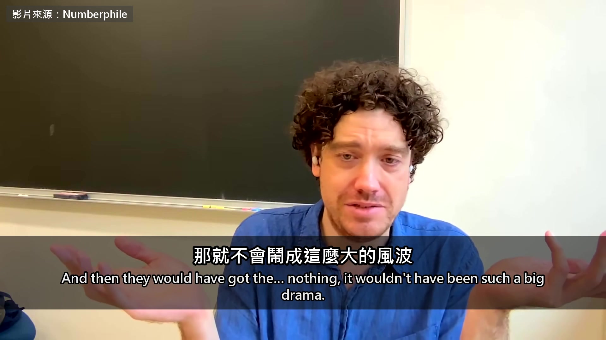

**逐字稿片段：** 他跟 Alpöge 先做出來的是 Euler 方程 可以想成少了黏性的 Navier-Stokes 他說真正的機制就在 Euler 裡 他自己用 AI 好幾年了 Alpöge 還搭了一整套 agent 系統 外界以為把題目貼進去 按下 Enter 就有答案 他說那正是 AI 公司想賣的印象 Euler 的結果還沒發表 消息就先傳了出去 當時有個傳言。消息是從 Anthropic 漏出去的， 不知道怎麼傳到 OpenAI，又傳到 DeepMind， 在科技業裡傳開，幾天後就上了網路 事情一下子鬧得很大… 網路上一堆推文，你去看下注市場， 突然寫著 Anthropic 要解掉千禧年難題 我記得傳言是 Anthropic 解掉了兩道千禧年難題 可是那是錯的。傳言本身就錯了， 我們根本還沒解掉 Navier-Stokes，我們解的是 Euler 一開始的傳言只說是 Anthropic， 後來大家才發現是 Levent， 後來才發現那個人是 Levent， 接著 OpenAI 的人開始找 Levent，都是老朋友，問他「你在紐約嗎？」 主持人先插了一個問題 OpenAI 後來發的那篇證明 到底算不算解出來了 對，我認為是。對，這題是解掉了 他們發的那篇論文，不是人讀得下去的樣子， 但裡面的想法消化得了，也整理得成數學家能接受的東西 那時候到處在傳，說我們解掉了 Navier-Stokes， 情況開始有點失控 所以我去找了 OpenAI 的一位數學家，想讓大家冷靜下來 一開始他回信說「好，我們別競爭」 我們很樂意…我也跟他們說過，我們也在用你們的產品 我們那時候還在寫論文， 後來我說，我們下個星期見面談

**話題推測：** 揭示他們團隊先完成的是 Euler 方程

---

## 00:06:00

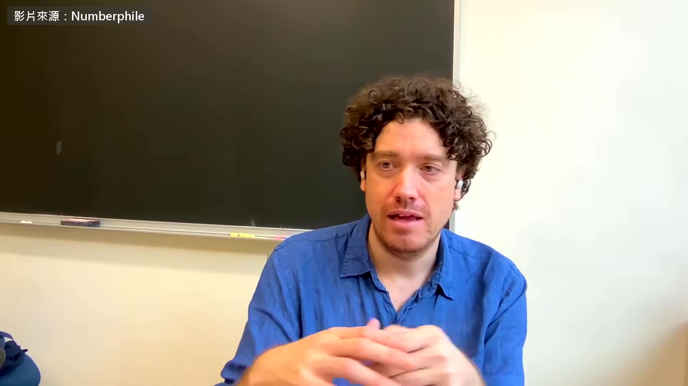

**逐字稿片段：** 結果我們收到那位數學家傳來的訊息， 說 OpenAI 要做一件很蠢的事 那是什麼意思？ 我們不知道是什麼事 你要怎麼猜都可以， 反正就是說，OpenAI 要做一件很蠢的事， 你得上線跟我們談。那天是星期六 不過「蠢」聽起來像是瘋狂的那種意思 不是笨的那種蠢，是… 對，不是笨的那種蠢， 是他們要做一件極度不道德的事 所以你的理解不是「我們要幹一件瘋狂的事」 比較像「我們要做一件不該做的事」 沒錯。我們的理解是，他們要做一件很糟的事， 你得上線阻止它發生 訊息裡沒說那件事是什麼 他猜 OpenAI 大概是想搶在他們前面發表 他跟 Alpöge 那幾篇結果 用的都是加外力的做法 就這樣，我上了那通電話 他們是那時候才說解出來了，還是還沒解？ 我記得 OpenAI 的 Sébastien…我記不太清楚了 他們一開始就跟我們說解出來了， 不過我印象中，他在通話前幾分鐘，好像就先傳訊息跟 Levent 講了 我問的第一個問題是，他們解的是哪一個 細節上…這題有好幾種解法， 終點線也不只一條 所以你只是以數學家的身分，對技術細節好奇？ 不是，跟好奇沒關係 我是想知道，他們有沒有拿走我們的方法， 因為要是他們解的是加外力的版本，對我來說就是個警訊 結果他們解的就是那一個

**話題推測：** 收到 OpenAI 傳來「要做蠢事」的訊息

---

## 00:08:22

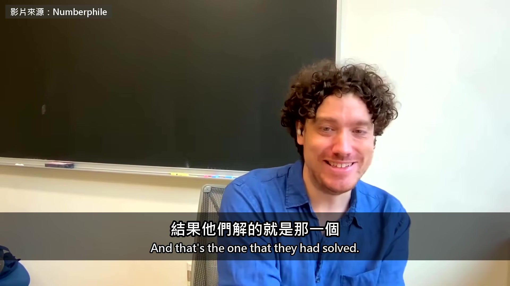

**逐字稿片段：** 一開始，他們就在說謊 他們一上線…而且他們是有備而來的 不是一時失手。他們準備好了，要給我們看他們下的 prompt 那時候我就知道，他們要說謊了， 因為他們之前解別的數學題，就在 prompt 上說過謊 接著那位數學家在螢幕上秀給我看。我記得那是 Google Meet 視訊 他們在螢幕上給我看，就是把千禧年難題的題目原封不動貼上去 他們說，把題目貼進去、按下 Enter，就得到一個解 那一刻我只能笑，實在太荒謬了 不到幾分鐘就穿幫了，那是騙人的， 他們之前早就做過別的題目，也下過別的 prompt 這個謊幾分鐘就破了 可是他們就是準備好要拿這套說法給我 而且他們不肯說是什麼時候開始做的 我一直問：「你們什麼時候要…你們什麼時候開始做的？什麼時候？」 他們只回「喔，我們的模型很厲害」 「我們有這些很厲害的模型」，可我不是什麼都不懂的人… 我是這一行的人，我懂這是怎麼回事， 模型只是其中一塊，開了多少個 agent 這些，背後還有更多故事

**話題推測：** 指控 OpenAI 在通話中說謊

---

## 00:09:52

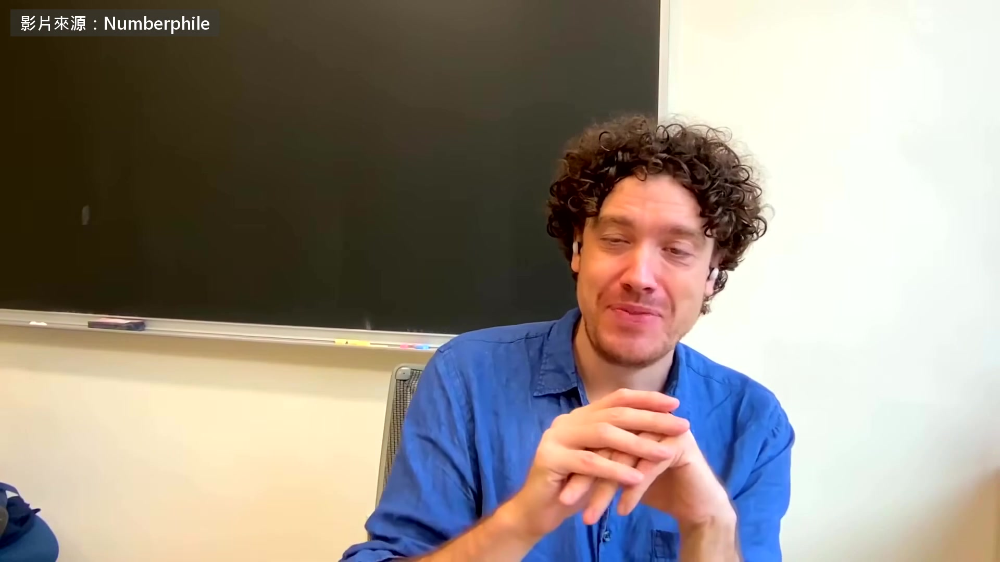

**逐字稿片段：** 最後我故意問了 Sébastien 一個誘導式的問題 我說：「所以你同意，你們是聽到傳言之後才開始做的？」 他說：「對。」 不過，聽到傳言就馬上動手，也沒有犯法 要是我聽說有人要拍一支我正準備拍的 YouTube 影片， 我大概也會加快腳步，搶在他前面 不過你知不知道，或是你怎麼認為，

**話題推測：** 講者誘導式提問，確認 OpenAI 動手時機

---

## 00:10:20

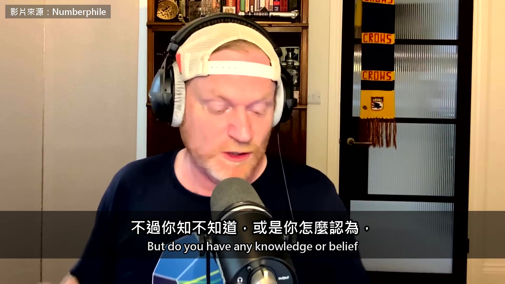

**逐字稿片段：** 你放進 Codex 的東西，有沒有被 OpenAI 拿去用， 不管是直接去看，還是拿去訓練模型， 雖然我覺得兩個也差不了多少，但我懂什麼呢？ 你怎麼想，或者你知道些什麼？ 我沒辦法 100% 指出到底發生了什麼， 但間接證據很清楚 大家一直拿 Navier-Stokes 那題，跟我們的工作比 可是比錯論文了

**話題推測：** 主持人詢問 Codex 資料是否被使用

---

## 00:11:00

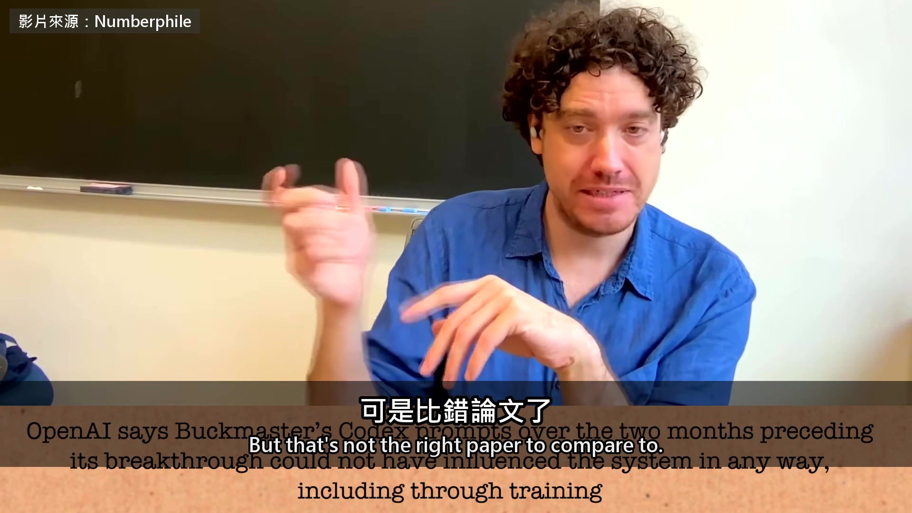

**逐字稿片段：** 該比的是不加外力的 Euler 方程那篇 這篇不加外力的 Euler，裡面所有的機制， 都跟我們另一個版本、還沒發表的 Euler 論文一模一樣 那些機制本身，都建立在我們已經發表的那篇論文的想法上， 而 Euler 從加外力走到不加外力，那一步其實很小 基本上，那篇不加外力的 Euler，主要的架構元素全都在我們的工作裡， 而那些東西就在他們的伺服器上 而且那時候還沒發表 還沒發表。沒有，還沒發表

**話題推測：** 強調應比較不加外力的 Euler 方程論文

---

## 00:11:50

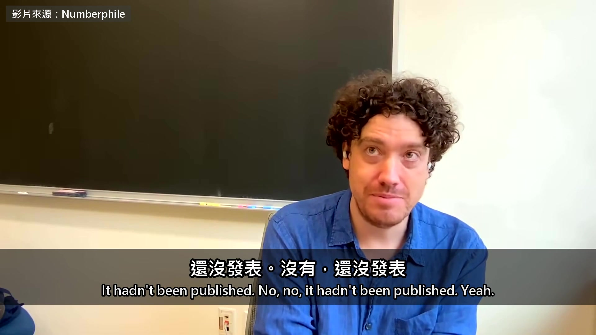

**逐字稿片段：** 關鍵在這裡，他們解 Navier-Stokes 用了 1 萬個 agent 解 Euler 那題，他們沒用到 1 萬個，只用了 100 個 等於是從零開始，只靠 100 個 agent agent 的數量就是關鍵， 因為 agent 開多少個，決定你能搜多廣， 他們只用了 100 個，最後做出來的架構，跟我們的一模一樣

**話題推測：** 比較 Navier-Stokes (1萬 agents) 與 Euler (100 agents) 解決方式

---

## 00:12:22

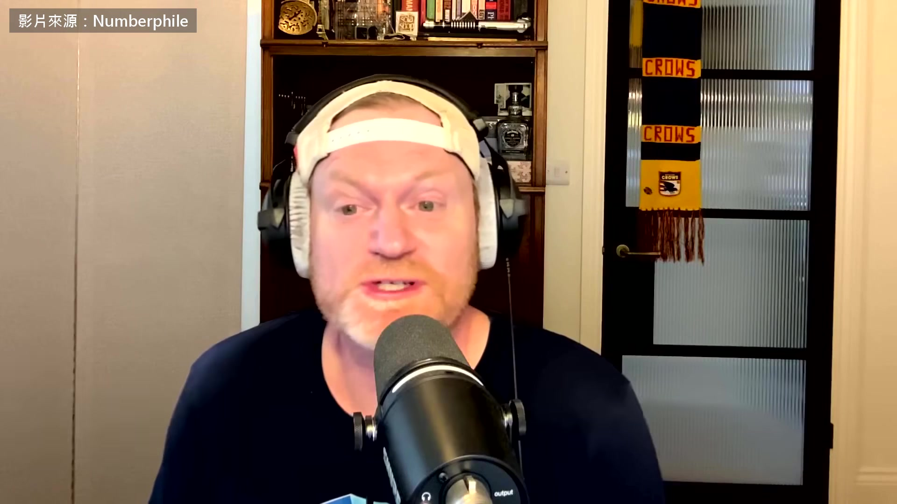

**逐字稿片段：** 你後悔用他們的產品嗎？你是不是太天真了？ 你自己說過你懂這個產業，知道它怎麼運作 把那些東西都放進 Codex，是不是一個錯誤？ 你後悔嗎？重來一次，你還會這樣做嗎？ 我們…對，我們犯了很多錯 一開始消息會走漏，就是一個錯 要是沒有走漏，就不會拉起這次的紅色警報 要是我從來沒用過 Codex，當然… 對，我想我們是…我看過很多誇張的事， 但我沒想到他們會做到這個地步

**話題推測：** 主持人詢問講者是否後悔使用 OpenAI 產品

---

## 00:13:06

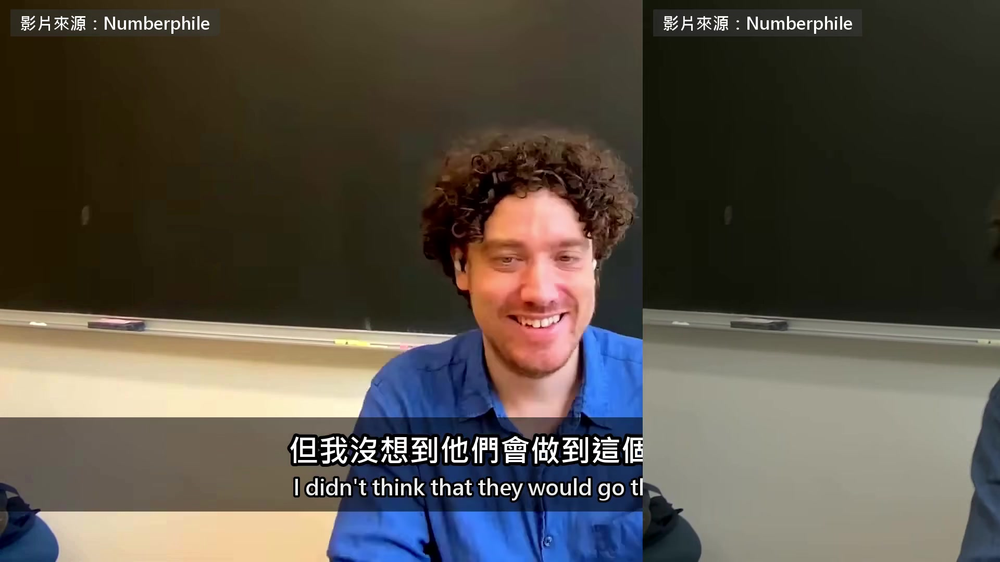

**逐字稿片段：** OpenAI 研究長 Mark Chen 公開說過 沒有人 也沒有 AI 去翻過使用者的資料 官方聲明另外補了一句，雖然不太可能 但無法排除他們用產品留下的資料 在去掉身分之後幫模型變強過

**話題推測：** 引用 OpenAI 研究長 Mark Chen 的公開聲明

---

## 00:13:20

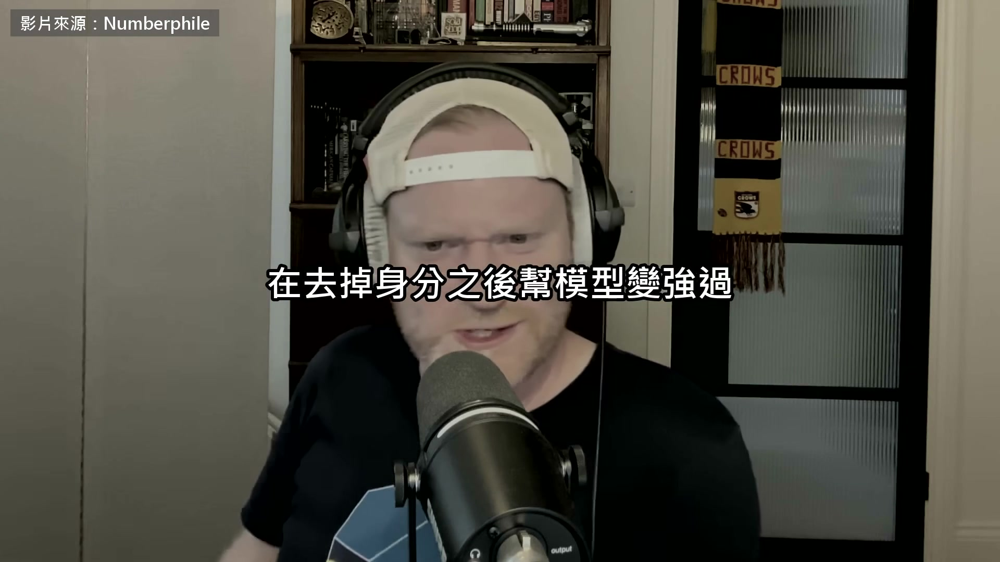

**逐字稿片段：** 主持人接著問他 要不是合作者在 Anthropic 上班 他是不是會分到更多功勞

**話題推測：** 主持人追問合作者所屬公司對功勞的影響

---

## 00:13:27

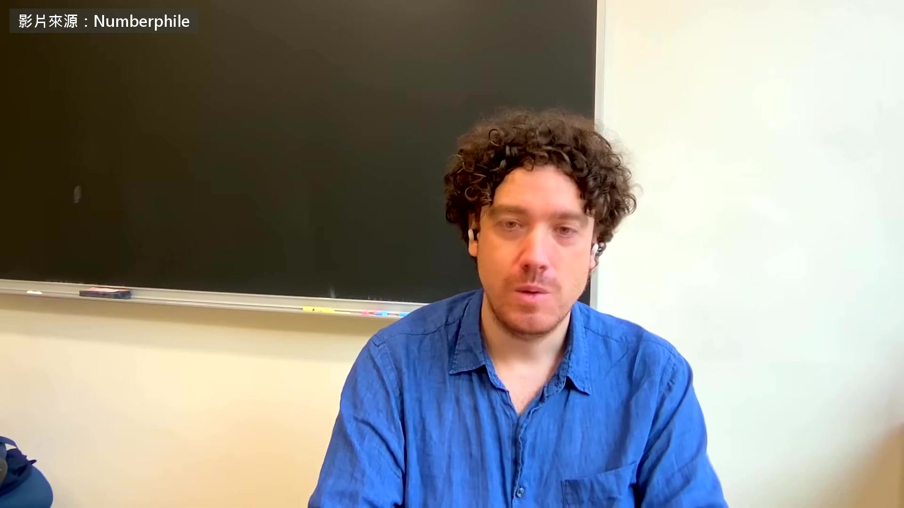

**逐字稿片段：** 功勞這件事，我要反駁一下， 我要的不是多分一點功勞 只是…我不喜歡… 我想反對的，是這些公司做事的文化， 還有它對數學界造成的傷害 所以重點不在多拿功勞

**話題推測：** 講者強調核心問題在於公司文化，而非個人功勞

---

## 00:13:57

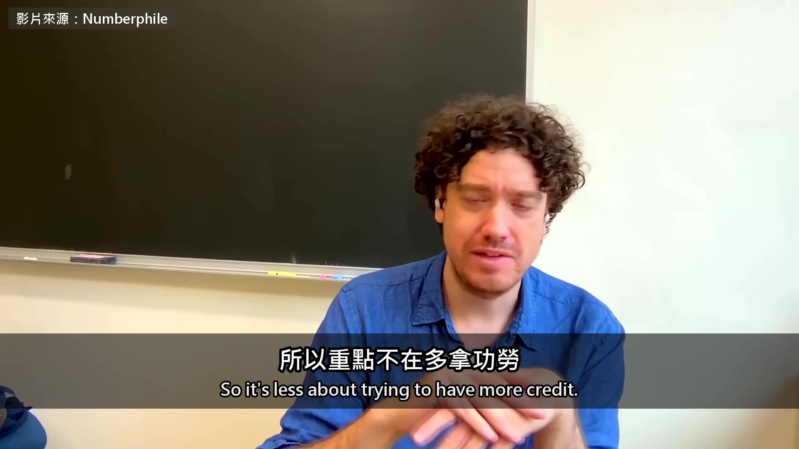

**逐字稿片段：** Clay 的千禧年大獎我也不在乎 問題在於這些 AI 實驗室之間的超級競爭 而且我要說，聽到傳言之後開始砸幾百萬美元搶這題的， 不只他們一家 我聽說另一家知名公司也這樣做 所以我要反對的，是這種快速行動、打破成規的文化， 跟數學界正面相撞， 以後也會跟我們其他所有人撞上 主持人替另一邊說話 撇開禮貌不談 這題本來可能還要再等幾十年 OpenAI 一下子就解掉了 對數學不也是好事嗎

**話題推測：** 表明不在乎 Clay 千禧年大獎

---

## 00:14:58

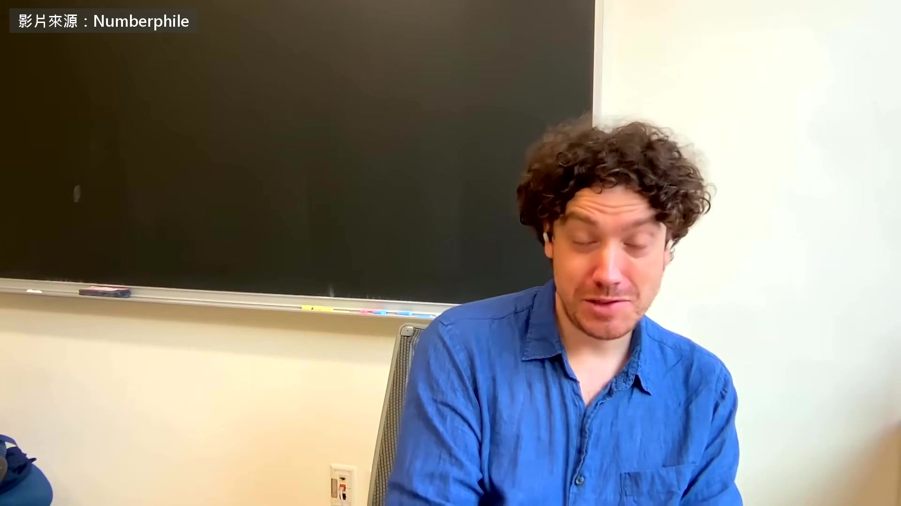

**逐字稿片段：** 我們來看看，要是他們沒做會怎樣 那幾天之後一樣會被解出來 世界不會有任何改變 再來看看它帶來了什麼負面影響 你知道，大家… 千禧年難題是在 9 月 8 日解出來，我記得是那天，而不是 9 月 20 日， 世界一樣不會改變 可是它對數學界的影響很大， 因為現在大家都不想講自己手上的未解問題 大家怕這些 AI 公司突然殺進來搶走， 把它們當成測模型的考題 大家不信任這些 AI 產品 學術界受到很大的衝擊 這些 AI 實驗室帶來的威脅，讓我們慢了下來 所以它其實是拖累了科學的進展， 就只為了早幾個星期發表一個結果 我很喜歡千禧年難題，但這又不是治好癌症 這道千禧年難題是 9 月 8 日還是 9 月 20 日解出來，對世界的影響是零

**話題推測：** 講者反駁，分析 OpenAI 行為的負面影響

---

## 00:16:39

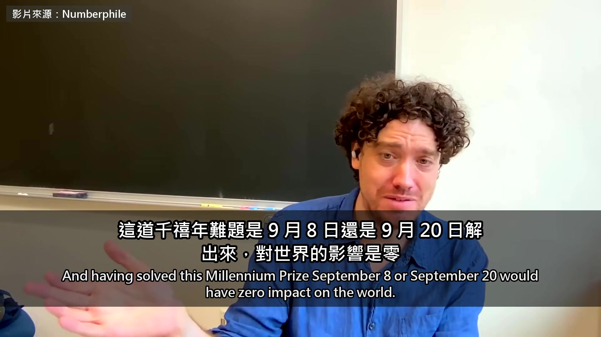

**逐字稿片段：** 你這次算是站出來了。你願意跟我這樣的人談， 也公開發了聲明。對方是一家又大又有錢、權力跟資源都很多的公司 堅持原則，對你來說是很難的決定嗎？ 你大可以走另一條路。你有想過後果嗎？ 你想了很多嗎？還是覺得這本來就是該做的事？

**話題推測：** 主持人詢問堅持原則是否為艱難決定

---

## 00:17:04

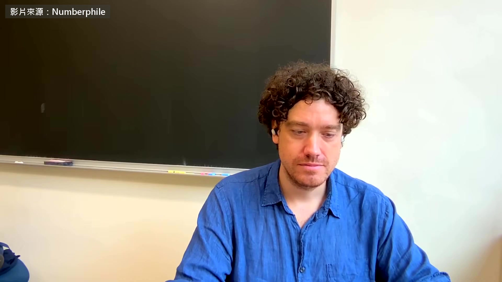

**逐字稿片段：** 他們給過我一個機會，當他們那篇論文的唯一作者， 條件是把我的合作者踢掉 我有沒有考慮過當唯一作者？一秒都沒有 那太不道德了。他們是要我出賣他 一個跟我合作了一年的人， 只因為他在 Anthropic 上班，就要我把他踢出去

**話題推測：** 揭露 OpenAI 曾提供唯一作者身份，條件是踢掉合作者

---

## 00:17:40

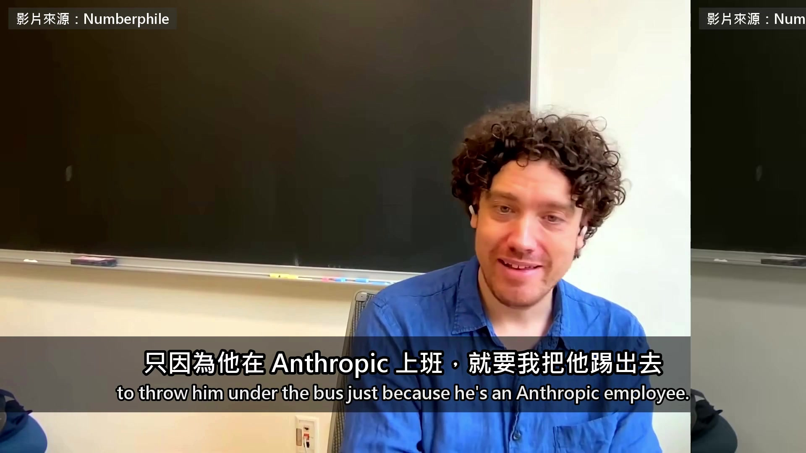

**逐字稿片段：** 主持人最後丟了一個假設 如果是日本有一組數學家跟他走在同一條路上 他聽到風聲就踩油門搶先發表 這跟 OpenAI 有什麼不一樣 換成那個情況，假設日本有人在做這些題目， 而我在跟 Levent 合作，他拿得到公司內部的模型， 我不會去跟他們搶快 不過我要說，如果只是那樣，我就認了 我還是覺得那樣不對。但我相信實際發生的不是那樣 如果他們真的跑進…他們會說沒有， 但如果他們真的跑進 Codex，拿走你出於信任放進去的東西， 那真的就像被扒了口袋 對，所以我才這麼生氣 我要先講清楚，我不知道他們會不會來受訪 他們說過，而且公開說過很多次，我也會附上連結，他們沒有那樣做 當然。可是他們也說過，Navier-Stokes 是他們一次就解出來的

**話題推測：** 主持人提出假設情境：與日本數學家競爭

---

## 00:19:01

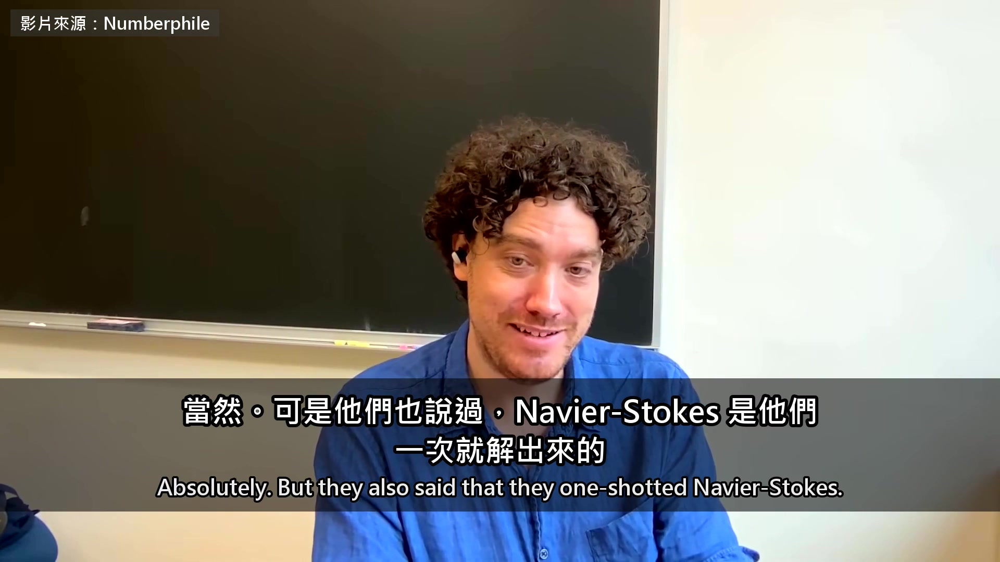

**逐字稿片段：** 這件事會改變你身為數學家用 AI 的方式嗎？ 當然，它改變了我用 Codex 的方式 重要的東西都不會再放進 Codex 任何真正有價值的…任何原創的想法，都不會再放進去 他說這一題 9 月 8 日或 9 月 20 日解出來 對世界沒有差別，受傷的是數學界 大家開始不敢公開自己的未解問題 他自己的做法是 重要的想法再也不放進 Codex

**話題推測：** 主持人詢問此事是否會改變講者使用 AI 的方式

---

## 00:19:37



**逐字稿片段：** 原影片 46 分鐘 他還講了 OpenAI 那篇證明到底聰明在哪 他說從 Euler 跳到 Navier-Stokes 的那一步是好點子 用的正是他自己試了 10 多年都沒做成的方法

**話題推測：** 影片結尾，提及原影片更多內容

---

## 00:19:48

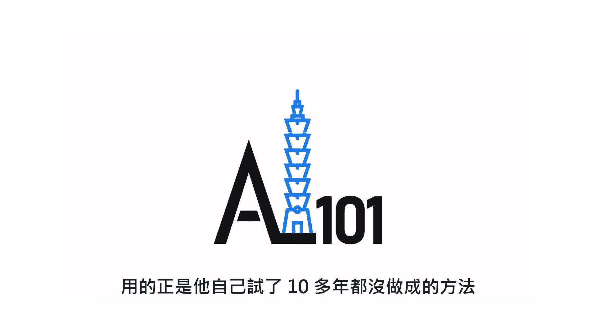

**逐字稿片段：** 還有他 13 歲就在用 GPU 寫電腦繪圖引擎 本來想當遊戲工程師 是當數學家的叔叔把他拉進數學 原影片連結在說明欄，有興趣可以去聽更多。

**話題推測：** 介紹講者的個人背景與數學之路

---
