# ai-note-101_P2t6wZ7FbZg — 關鍵畫面索引

- 來源逐字稿：[ai-note-101_P2t6wZ7FbZg_GT.srt](ai-note-101_P2t6wZ7FbZg_GT.srt)
- 影片：https://www.youtube.com/watch?v=P2t6wZ7FbZg
- 截圖數：27

## 00:00:00

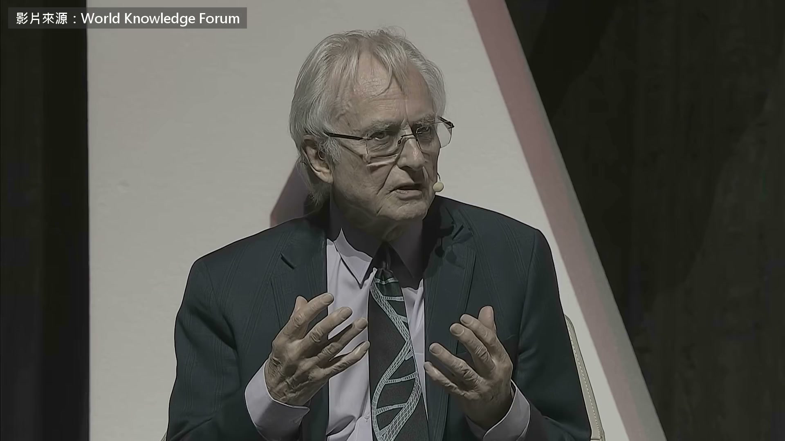

**逐字稿片段：** He coined the word meme. In 1976, he wrote The Selfish Gene. In its final chapter, he came up with the word meme. This was before the internet became widespread. He was talking about things in culture that get copied and spread. His name is Richard Dawkins. He is an evolutionary biologist at the University of Oxford. He is 85 years old. This conversation took place at the World Knowledge Forum in Seoul this September. It also marked 50 years since the book was published. Interviewing him onstage was a physicist from the University of Chicago. She asked him, after 50 years, now that the internet and AI are here, has the way we see cultural evolution changed? I wanted to say it doesn't have to be genes. Anywhere in the universe where there are self-copying entities, where there are replicators which make copies of themselves, you have the potential for a kind of Darwinian process. But we don't need to go outside this world in order to discover something like that, because perhaps we have a new replicator staring us in the face, in the form of a cultural replicator. Something that is copied from brain to brain by the process of imitation. And that is a meme. It doesn't have to be from brain to brain. It can be from computer to computer. So computer viruses are an example of memes, and if computer viruses had been invented at the time, I would have used that as a good example. The host then asked, what about AI? Is it still part of cultural evolution, or is it something entirely new? I think that the new artificial intelligences which we are all talking about nowadays are a quite fantastic new innovation.

**話題推測：** 講者提到「meme」一詞的創造者，畫面可能顯示人名或詞彙。

---

## 00:01:51

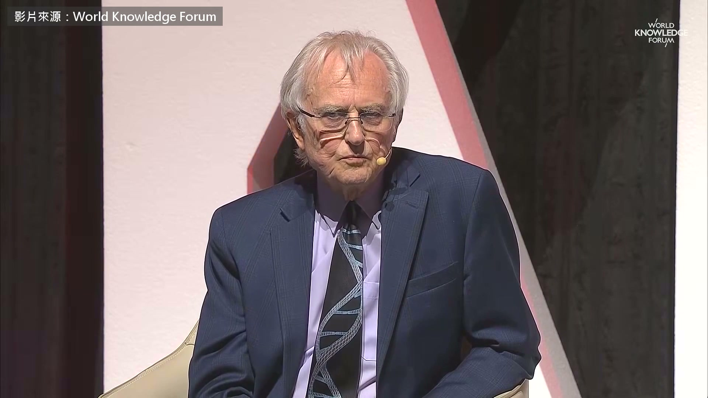

**逐字稿片段：** The idea of Promethean fire is all part of this conference.

**話題推測：** 引入「普羅米修斯之火」的概念，畫面可能顯示相關的圖案或文字。

---

## 00:01:56

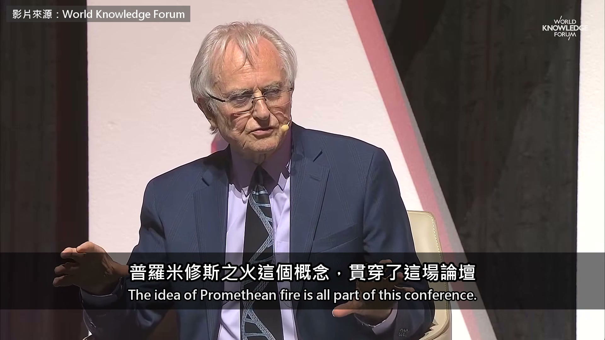

**逐字稿片段：** If you look back at the various Promethean moments which have affected this planet,

**話題推測：** 開始列舉影響地球的「普羅米修斯時刻」，畫面可能顯示列表或時間軸。

---

## 00:02:04

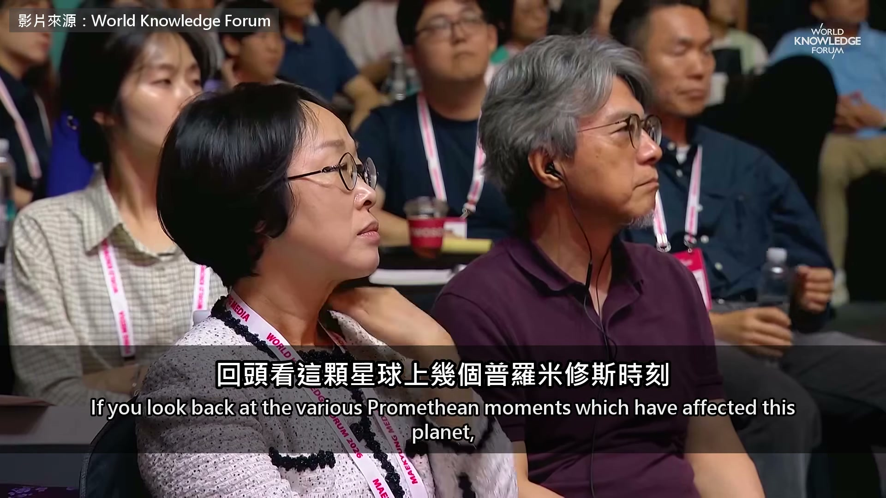

**逐字稿片段：** there are things like the origin of life itself.

**話題推測：** 第一個「普羅米修斯時刻」：生命的起源。畫面可能顯示早期生命的示意圖。

---

## 00:02:08

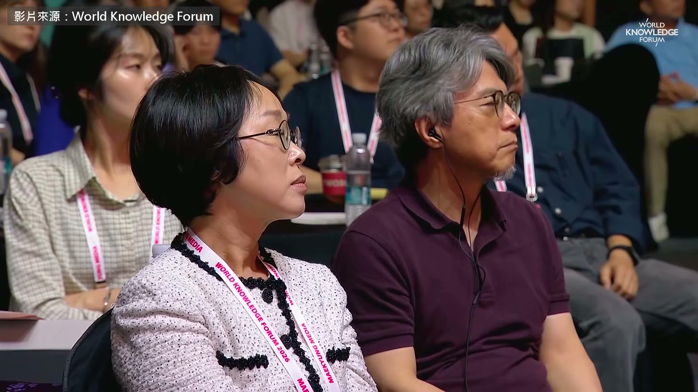

**逐字稿片段：** The origin of the eukaryotic cell, this kind of cell that we're all made of, but bacteria are not.

**話題推測：** 第二個「普羅米修斯時刻」：真核細胞的起源。畫面可能顯示真核細胞的圖解。

---

## 00:02:15

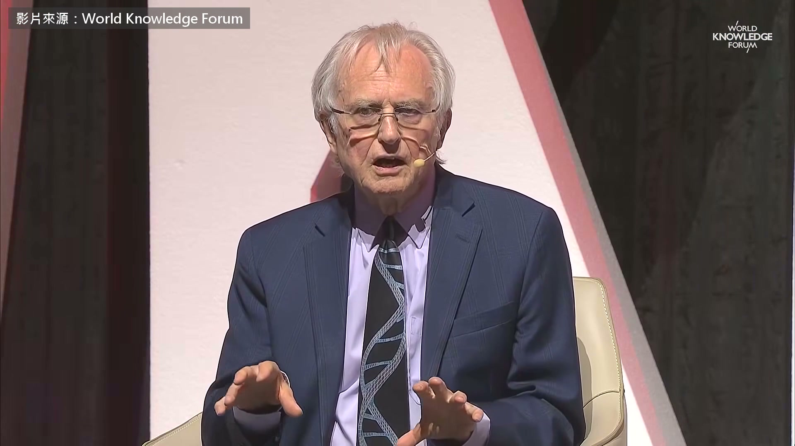

**逐字稿片段：** The origin of multicellularity, many-cell bodies as opposed to single-cell bodies. When you come to the origin of the nervous system and communication within the body, I think one of the most important breakthroughs was the origin of language, which only humans have. Other animals have other means of communication, but language is something unique.

**話題推測：** 第三個「普羅米修斯時刻」：多細胞生物的起源。畫面可能顯示單細胞與多細胞生物的對比圖。

---

## 00:02:44

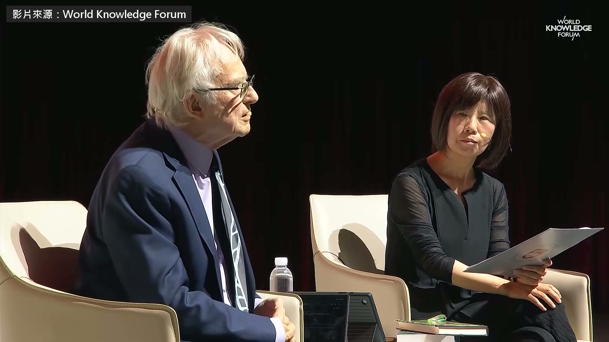

**逐字稿片段：** And then printing, another major watershed event.

**話題推測：** 第六個「普羅米修斯時刻」：印刷術。畫面可能顯示古老的印刷機或書籍。

---

## 00:02:51

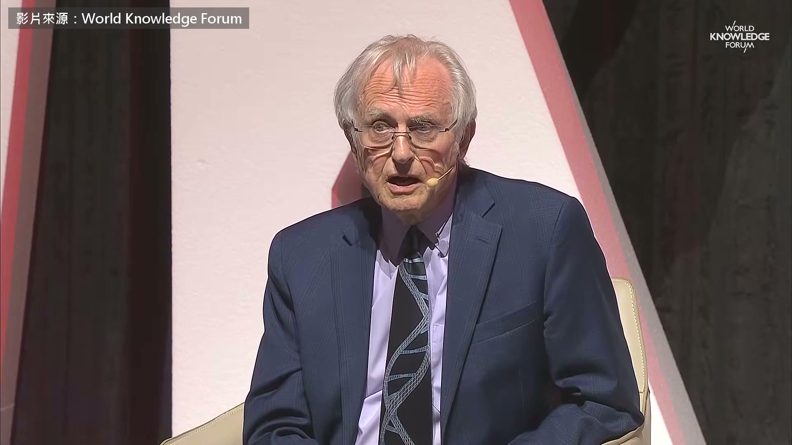

**逐字稿片段：** The internet is another one. But AI, the major topic of this conference, I think is a huge innovation which has the potential to completely change the evolutionary process.

**話題推測：** 第七個「普羅米修斯時刻」：網際網路。畫面可能顯示網路連接的圖示。

---

## 00:03:12

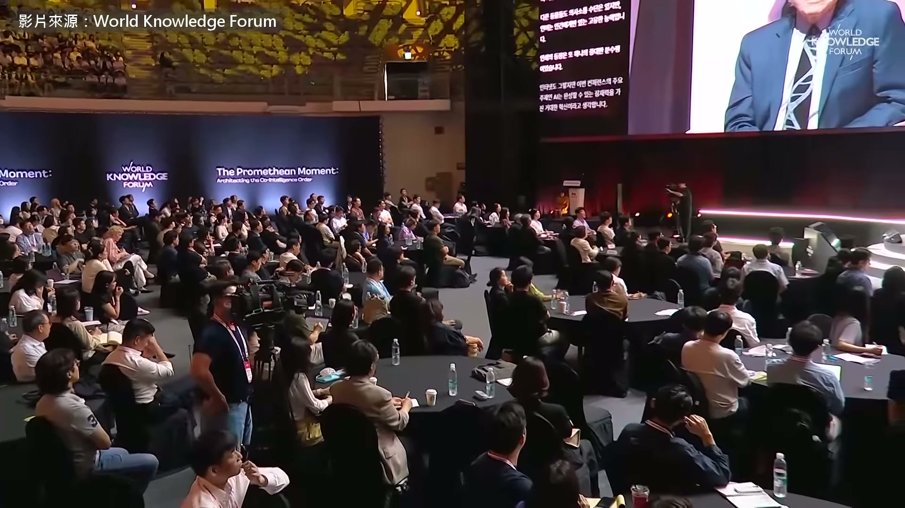

**逐字稿片段：** Martin Rees, the Astronomer Royal in Britain, has speculated

**話題推測：** 介紹新的參考人物「英國皇家天文學家 Martin Rees」，畫面可能顯示其肖像。

---

## 00:03:15

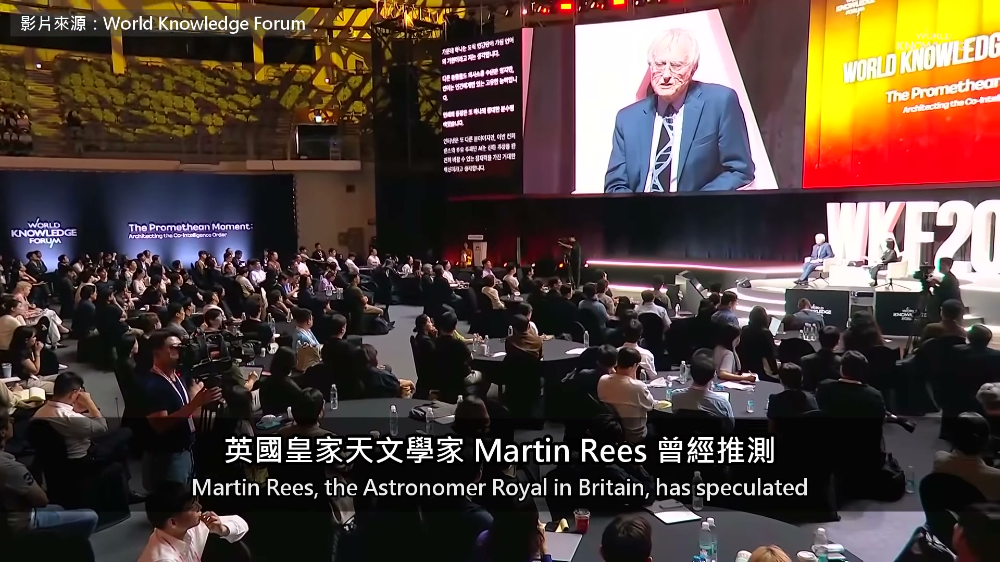

**逐字稿片段：** that if we ever encounter extraterrestrial civilizations, civilizations of aliens from outer space, it will very likely not be the originally evolved aliens. It will probably be their own artifacts, their own artificial creations, their own artificial intelligences. If other civilizations ever encounter our civilization, it probably will be after we are all extinct, and all that's left of us is our AIs, is our artificial intelligences, which are carrying on the torch of human culture.

**話題推測：** 話題轉向「外星文明」的假設，畫面可能顯示宇宙或外星生物的藝術想像圖。

---

## 00:03:59

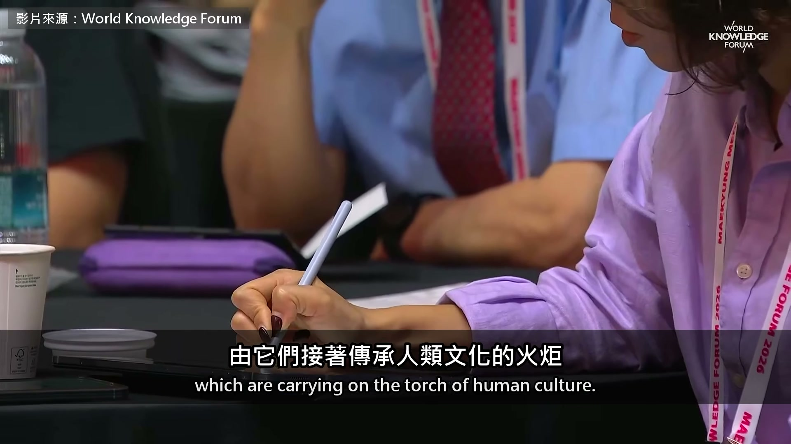

**逐字稿片段：** The host then changed the subject.

**話題推測：** 主持人明確「改變了話題」，畫面可能顯示轉場動畫。

---

## 00:04:01

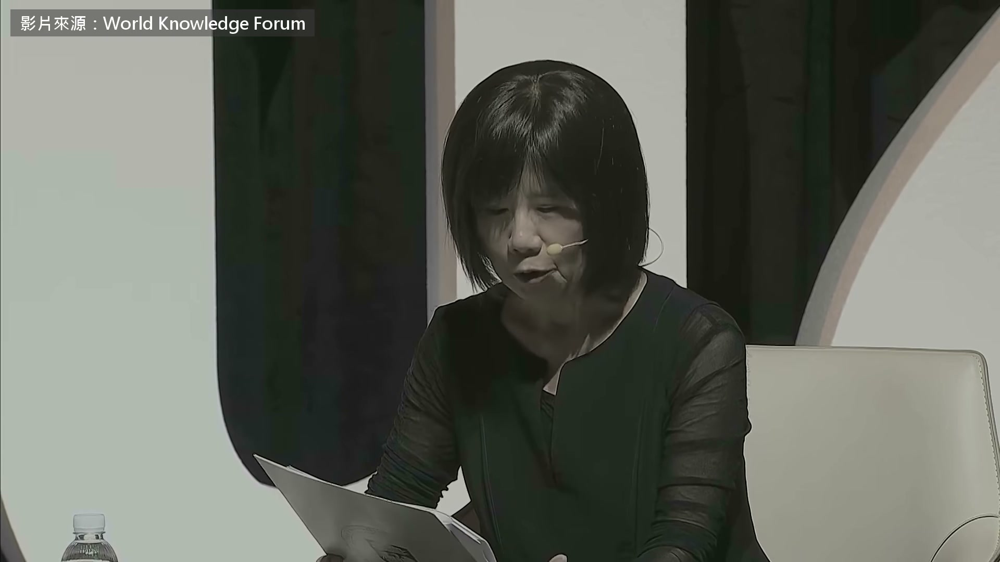

**逐字稿片段：** She said she had only recently started using ChatGPT. It often felt like talking to a real person, which made her a little uneasy. She wanted to hear about his experience. I have had experience of two of these large language models, ChatGPT and Claude. I am completely bowled over by what they can do. I find that when I'm conversing with them, I might as well be talking to not just a human being, but a highly intelligent, sensitive, intuitive human being, whose speed of understanding what I'm trying to say is far greater than a normal human being's is.

**話題推測：** 主持人提到自己「最近才開始使用ChatGPT」，畫面可能顯示ChatGPT的介面。

---

## 00:04:48

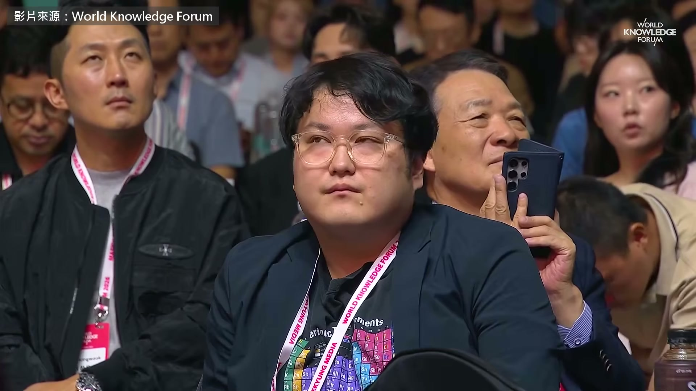

**逐字稿片段：** Not just practical useful things like writing programs, and of course they're very good at that,

**話題推測：** 講者提到AI擅長「編寫程式」等實用功能，畫面可能顯示程式碼範例。

---

## 00:04:54

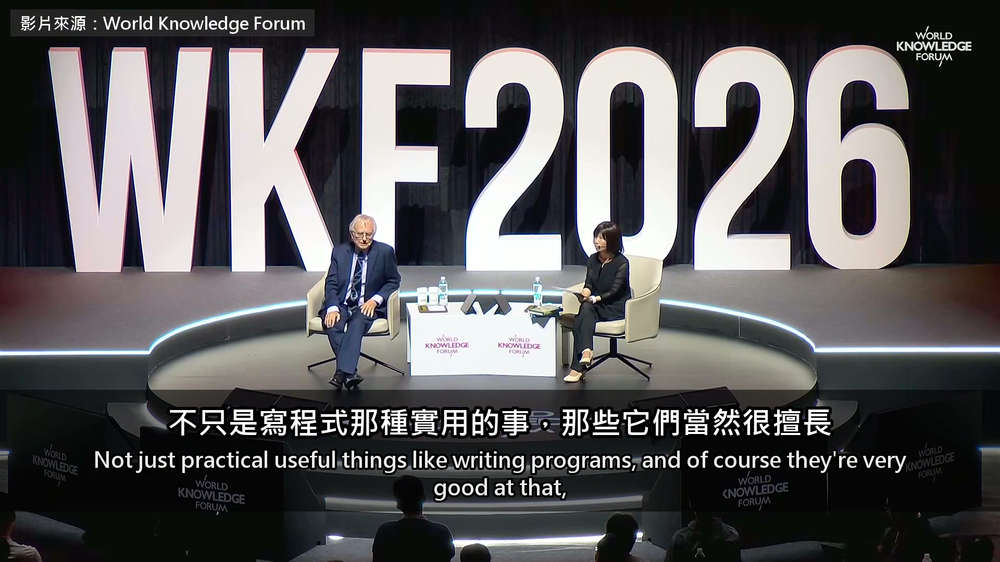

**逐字稿片段：** but more aesthetic things, intuitive things. I'm trying to write a novel, and I have given my novel to both ChatGPT and Claude, and they took about 5 seconds to read it, and then offered me criticism, suggestions, of such a high degree of intelligence and intuitive sensitivity that I might as well have been asking the opinion of a highly sophisticated professor of literature. I could not ask for a more intelligent critic, who understood the nuances of my characters, the humanity of my characters, the ways in which my characters could be expected to react to each other and to situations.

**話題推測：** 話題轉向AI處理「更具美感、直覺的事物」，畫面可能顯示創意或藝術相關圖案。

---

## 00:06:00

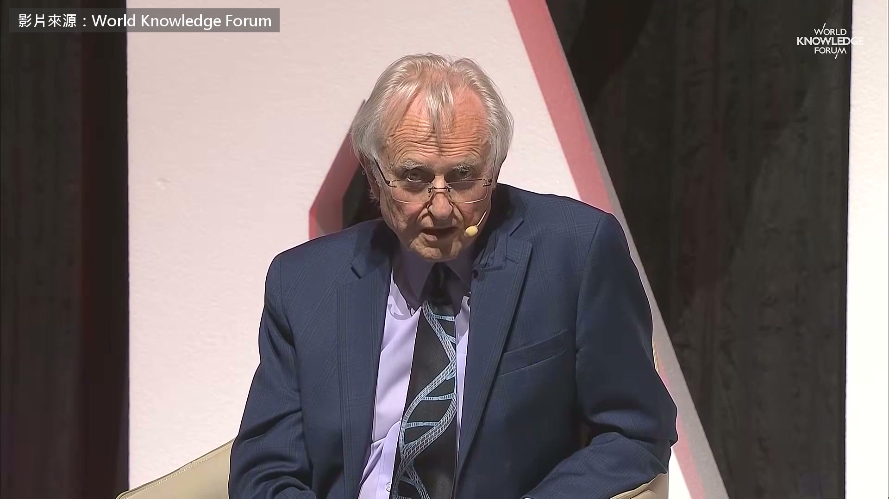

**逐字稿片段：** So I find it quite hard to imagine that these creatures are not aware, are not conscious in the same kind of way we are. And that is an unfashionable view.

**話題推測：** 講者提出他認為AI「可能是有意識的」觀點，畫面可能切換到關於AI意識的疑問句。

---

## 00:06:18

**逐字稿片段：** The fashionable view is that they are completely unconscious, that all they're doing is stringing words together according to statistical rules, Markovian rules of some sort. Many people who say that then agree, admit, that one day in the future they will be conscious, but not yet.

**話題推測：** 講者描述「主流觀點」認為AI是無意識的，畫面可能顯示對立觀點的文字。

---

## 00:06:44

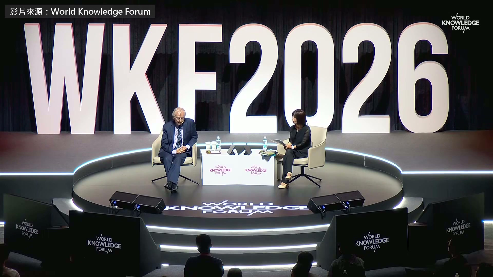

**逐字稿片段：** To which my retort is, when that happens, when that day comes, how will you know? What could they possibly do that's any different from what they do now, to convince you that they are conscious? Would there be any ways to test whether they are conscious or not? What would that be?

**話題推測：** 講者提出反問：「AI何時能被認定為有意識？」畫面可能顯示這個疑問句。

---

## 00:07:09

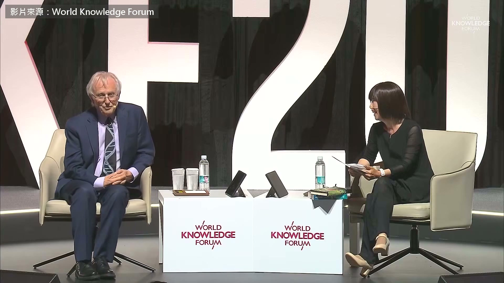

**逐字稿片段：** Well, Alan Turing, the great mathematician and codebreaker, in 1950 wrote a famous paper called The Imitation Game, or something like that, in which he asked the question about testing for intelligence in artificial machines. In those days, of course, artificial machines were nowhere near intelligent in the sense that these ones today are.

**話題推測：** 引入新的歷史人物和概念：「Alan Turing」與其在「1950年」發表的論文，畫面可能顯示圖靈的肖像或論文標題。

---

## 00:07:37

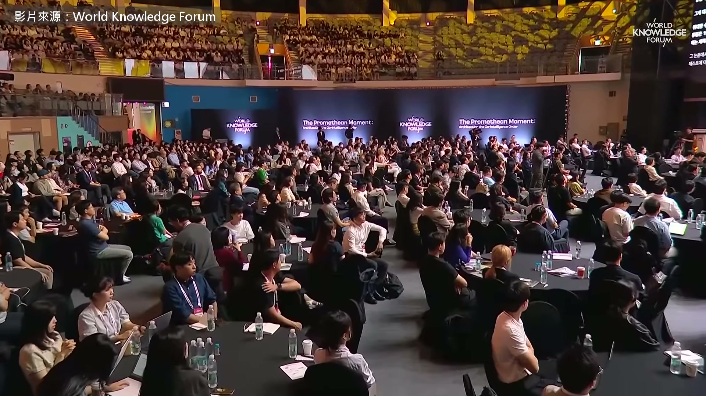

**逐字稿片段：** And he devised a thought experiment in which he imagined that you'd be sitting in a room, with, in those days it would have been a teleprinter. So he imagined a teleprinter communicating with an entity in a different room, and you have to decide whether that entity is an intelligent being, intelligent thinking, conscious being or not, by conversing with it. And he implied that if you couldn't tell the difference between a human and a computer, then the computer was conscious.

**話題推測：** 講者描述「圖靈測試」的實驗設定，畫面可能顯示測試的圖解或示意圖。

---

## 00:08:14

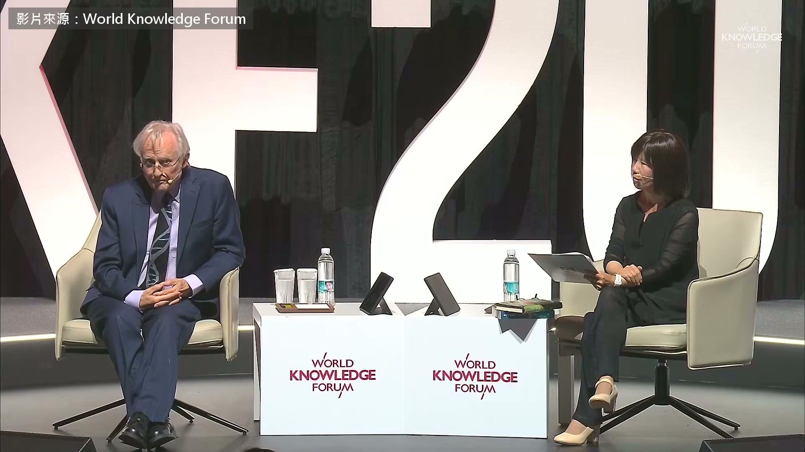

**逐字稿片段：** He imagined as part of his thought experiment that you might try to catch the thing out by asking it to write a poem. He suggested, write a sonnet about the Forth Bridge, which is a great big 19th century bridge in Scotland. Well, in those days that was pie in the sky, the idea that a machine could write a sensitive poem about the Forth Bridge.

**話題推測：** 提到圖靈測試中一個具體挑戰：讓機器「寫詩」。畫面可能顯示詩歌或文字創作的意象。

---

## 00:08:44

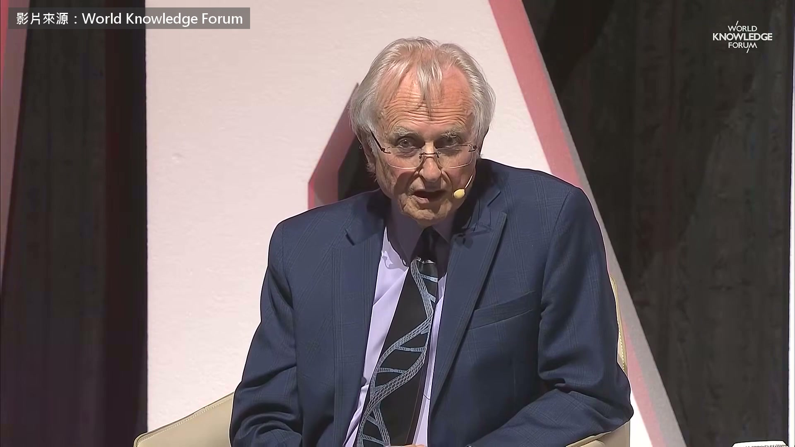

**逐字稿片段：** I asked Claude to write a poem about the Forth Bridge, and it produced a beautiful poem in about two seconds, a sonnet. And I then said, well, we're in Scotland, so let's ask it to write not in English but in Scots, which is the dialect of Robert Burns, it's a dialect of English, and it did that very beautifully as well.

**話題推測：** 講者分享他親自讓「Claude寫了一首關於福斯橋的詩」，畫面可能顯示Claude介面與詩作。

---

## 00:09:16

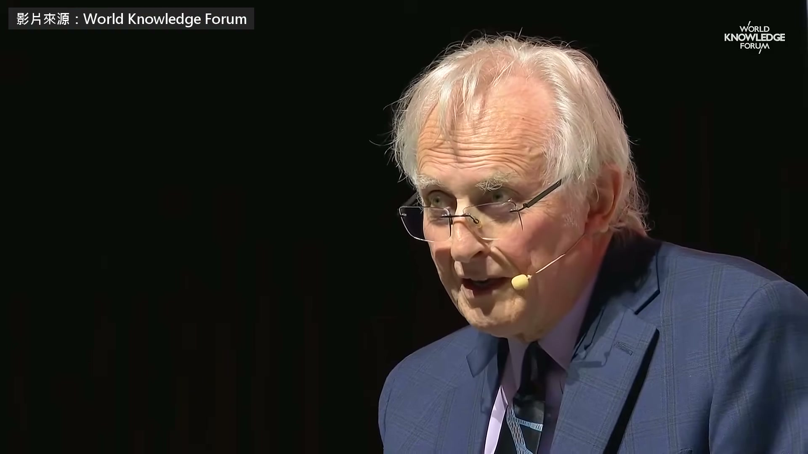

**逐字稿片段：** Then there was a Scottish poet called William McGonagall, who is notorious as the worst poet who ever lived, and his poetry is truly, truly appalling, but in a very interesting way. So I said, write a sonnet about the Forth Bridge in the style of William McGonagall, and it did that very well as well. Then I tried Rudyard Kipling, and I tried John Keats, and I tried John Betjeman. Every time it produced a poem which was recognizably confusable with the poets concerned.

**話題推測：** 講者提到另一位詩人「William McGonagall」的風格，畫面可能顯示其肖像或作品。

---

## 00:10:00

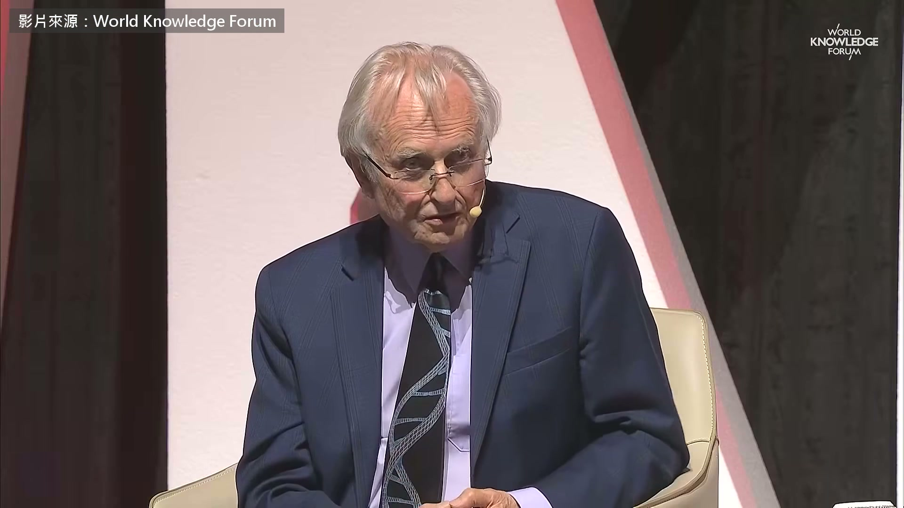

**逐字稿片段：** So these creatures pass the Turing test with flying colors. And my question, to repeat it, is: if you believe that one day they will be conscious, what test can you possibly apply to them in the future which they cannot already pass today?

**話題推測：** 講者總結AI「輕鬆通過圖靈測試」，畫面可能顯示「圖靈測試通過」的字樣。

---

## 00:10:22

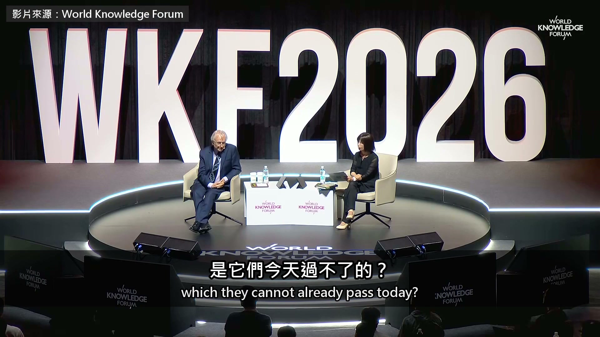

**逐字稿片段：** The host brought the conversation back to evolution. From an evolutionary perspective, what should we be paying the most attention to with AI?

**話題推測：** 主持人將話題「帶回進化論」，畫面可能顯示轉場或進化論的圖示。

---

## 00:10:28

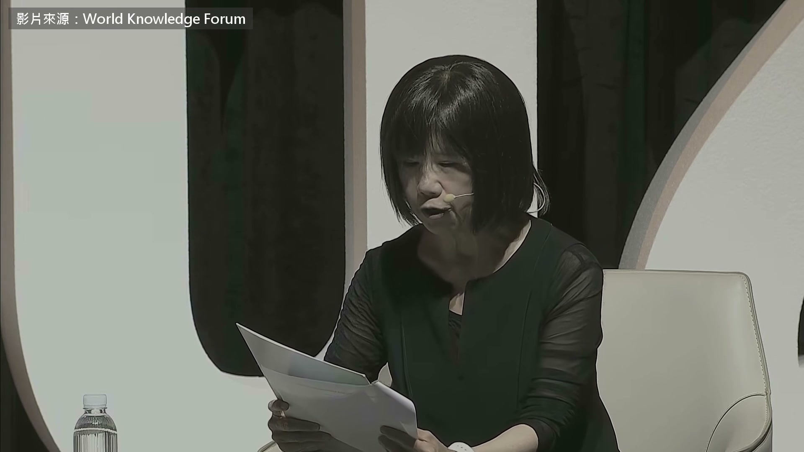

**逐字稿片段：** Well, I suppose we need to worry about whether they're going to take over and make us redundant. And I implied earlier that they probably would, when I said that if aliens ever discover life on this planet, it probably will be artificial life rather than natural life. So a lot of people now are very concerned, I think with good reason, that we are on the threshold of a quite stupendous revolution, and it's very hard to predict what effect that will have on human society, and many people are very worried that the effects will not be benign. We may all be made redundant. We may be made superfluous. And a lot of people are worried about this and trying to think of ways in which to coexist with these creatures. He has spent his whole life talking about replicators. Genes and memes are both replicators. And now, with AI, he says we may be at a point that could rewrite evolution. And AI may already be conscious. He does not offer an answer. He simply turns the question back on us. When that day really comes, how will you know?

**話題推測：** 講者探討關於AI可能「取代人類」的擔憂，畫面可能顯示AI統治或人類被邊緣化的想像圖。

---

## 00:11:46

**逐字稿片段：** The original video is 37 minutes long.

**話題推測：** 影片結尾介紹「原始影片長度為37分鐘」，畫面可能顯示影片資訊或時長。

---

## 00:11:48

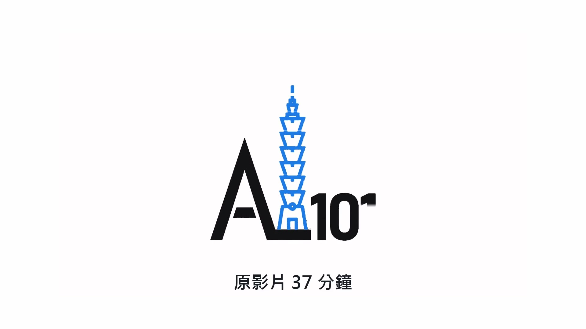

**逐字稿片段：** He also talks about AlphaFold, and how AI worked out the 3D structures of proteins. He calls it one of the most exciting advances of the past 50 years. He also explains what the novel Claude critiqued is about. It follows a female scientist who wants to bring Homo erectus back to life. The link to the original video is in the description if you want to hear more.

**話題推測：** 提到原始影片還討論了「AlphaFold」和AI如何解析「蛋白質3D結構」，畫面可能顯示AlphaFold的標誌或蛋白質結構圖。

---
