# ai-note-101_PaXel_vr1no — 關鍵畫面索引

- 來源逐字稿：[ai-note-101_PaXel_vr1no_GT.srt](ai-note-101_PaXel_vr1no_GT.srt)
- 影片：https://www.youtube.com/watch?v=PaXel_vr1no
- 截圖數：23

## 00:00:00

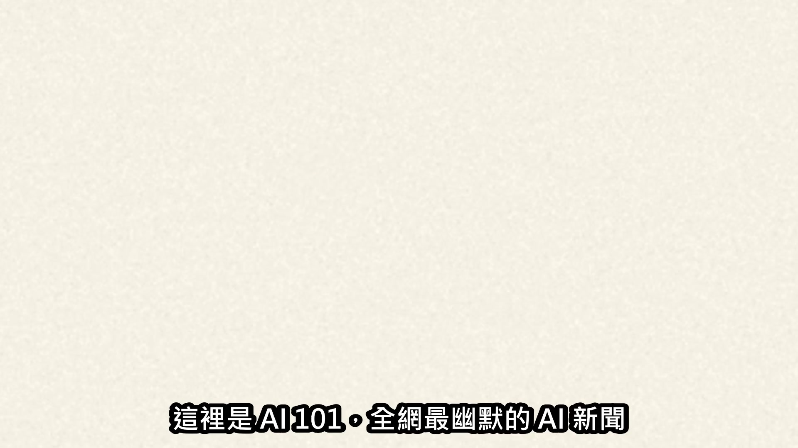

**逐字稿片段：** 這裡是 AI 101，全網最幽默的 AI 新聞

**話題推測：** 節目開場，介紹節目名稱及主題

---

## 00:00:04

**逐字稿片段：** 一名可能單獨行動的操作者，用一套 AI 自主滲透測試系統鎖定南韓金融機構同期至少

**話題推測：** 開始講述AI自主滲透測試系統鎖定南韓金融機構事件

---

## 00:00:11

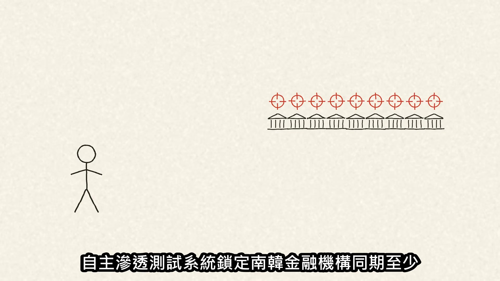

**逐字稿片段：** 9 家南韓銀行自行披露或被報導遭鎖定 最後讓調查者掌握線索的 是伺服器開放目錄裡的 AI 對話和一份身分真偽未明的履歷 可是被打開的 並不是銀行最重要的那扇門

**話題推測：** 提及受影響的銀行數量：9家南韓銀行

---

## 00:00:26

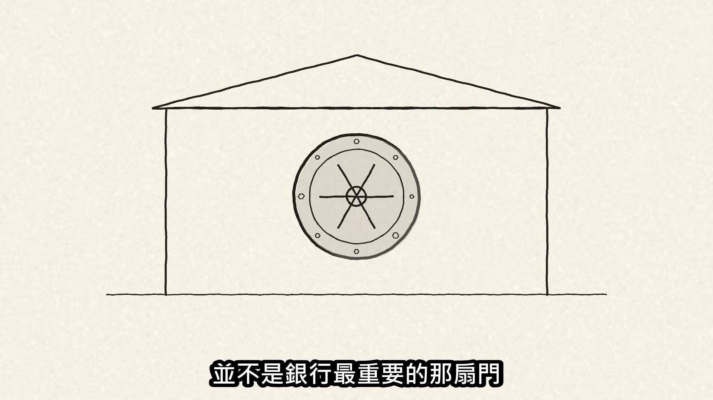

**逐字稿片段：** 核心交易照常運作 出事的是貸款仲介查詢、 外勤業務支援這類外圍系統 大門沒破 客戶資料卻從旁邊的小門流了出去 從小門漏出去的，可不是幾筆資料而已

**話題推測：** 說明銀行核心系統未受影響

---

## 00:00:40

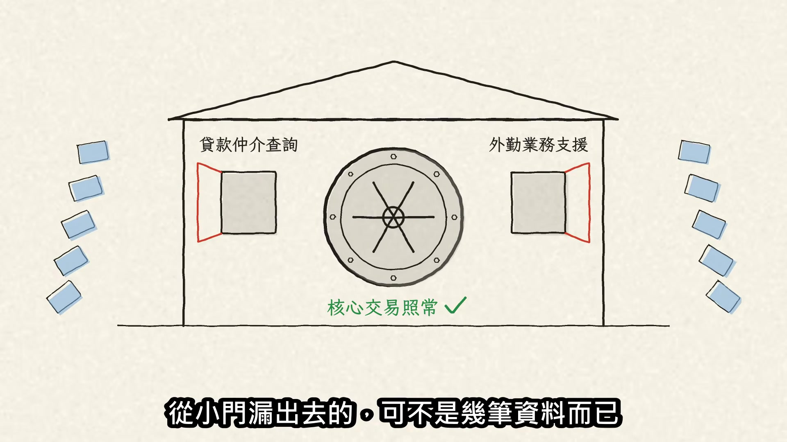

**逐字稿片段：** 光是新韓銀行一家

**話題推測：** 提到具體受影響的銀行「新韓銀行」

---

## 00:00:42

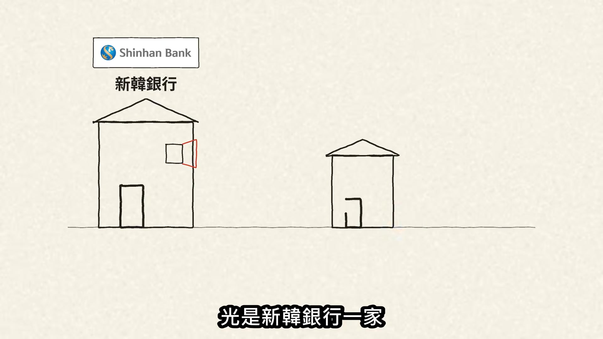

**逐字稿片段：** 就確認大約2萬5千名客戶受到影響 漏掉的又是哪些資料？

**話題推測：** 說明受影響的客戶數量：約2萬5千名

---

## 00:00:48

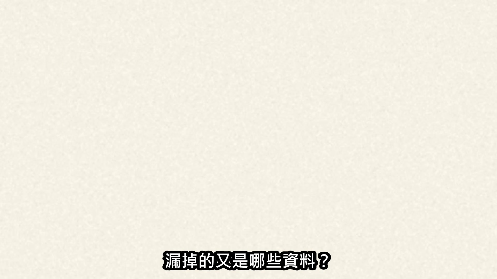

**逐字稿片段：** 姓名、電話、年收入，還有貸款額度 單獨看好像沒什麼，但拼在一起 就足以量身打造一套詐騙話術 一通電話就叫得出你的名字

**話題推測：** 列出外洩的客戶資料內容：姓名、電話、年收入、貸款額度

---

## 00:00:59

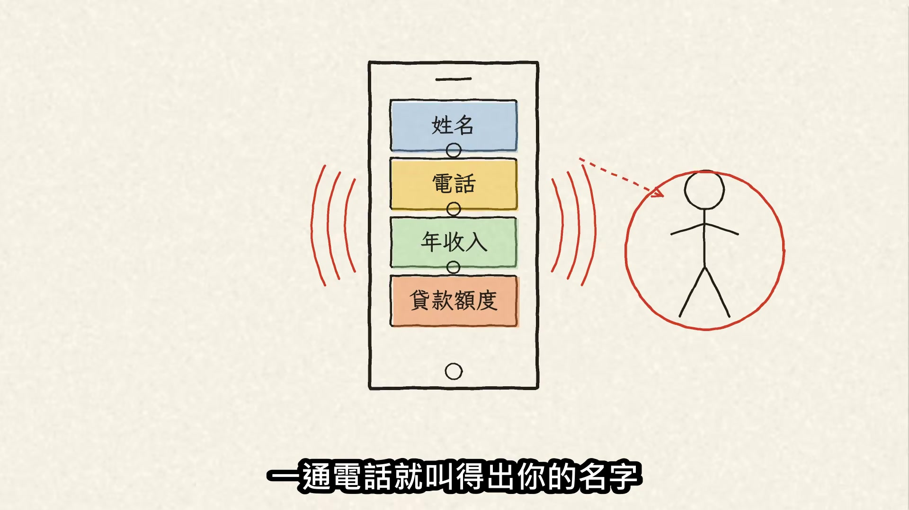

**逐字稿片段：** 那駭客是怎麼露餡的？

**話題推測：** 話題轉向駭客的露餡細節

---

## 00:01:01

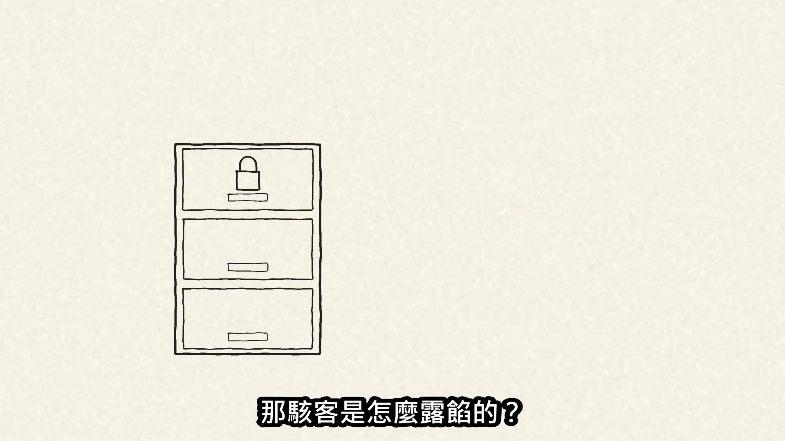

**逐字稿片段：** 資安公司 CrowdStrike 發現 他的伺服器目錄沒上鎖 裡面有 Claude Code 工作階段、 Claude 記憶檔，還有中文寫的提示 像一本沒闔上的工作筆記

**話題推測：** 提及揭露事件的資安公司CrowdStrike

---

## 00:01:14

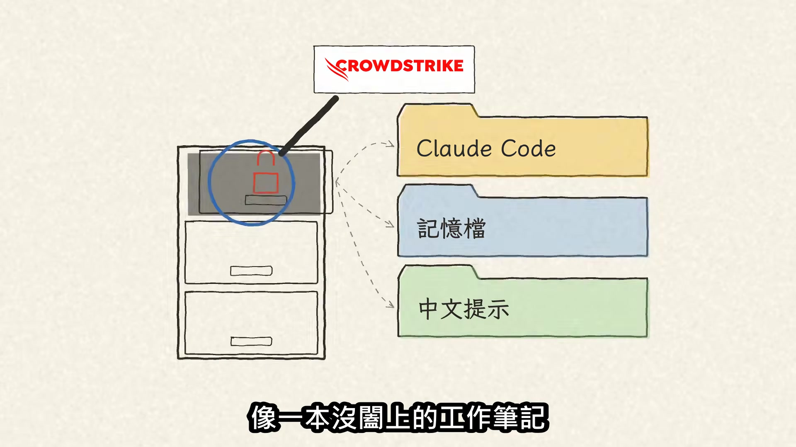

**逐字稿片段：** 這本筆記裡最核心的工具，叫 ARTEX 一套開源的 AI 自主滲透測試系統 能讓一個人指揮多個 AI 代理分工作業 ARTEX 的說明寫明限個人學習用途 這次卻被拿來濫用

**話題推測：** 介紹駭客使用的核心工具ARTEX

---

## 00:01:29

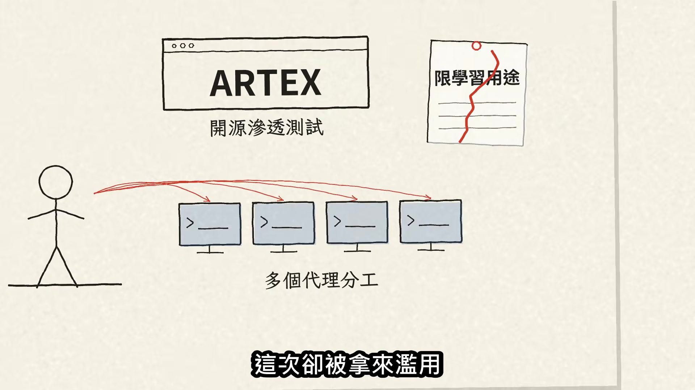

**逐字稿片段：** 工具再厲害，挑目標的還是人 沒有證據顯示 AI 自己選中南韓銀行 目標是操作者決定的，AI 只是幫忙偵察、 滲透，替他跑腿

**話題推測：** 強調挑選攻擊目標的還是人類操作者

---

## 00:01:40

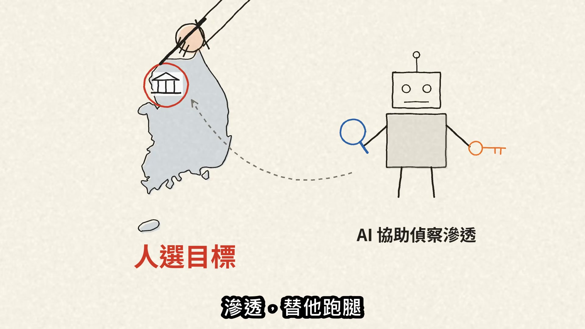

**逐字稿片段：** 那操作者拿到資料想做什麼？

**話題推測：** 探討操作者的動機和意圖

---

## 00:01:43

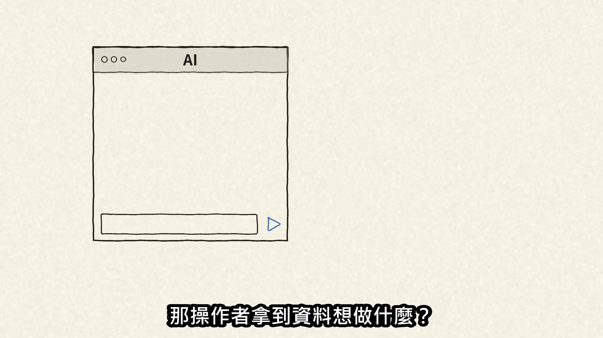

**逐字稿片段：** 他問過 AI，韓國外洩資料通常在哪裡賣 還有怎麼找 Telegram 上的交易群 這支持以金錢為動機的判斷 但目前沒有證據顯示資料已經賣出

**話題推測：** 說明駭客詢問AI如何販賣外洩資料及尋找交易群組

---

## 00:01:53

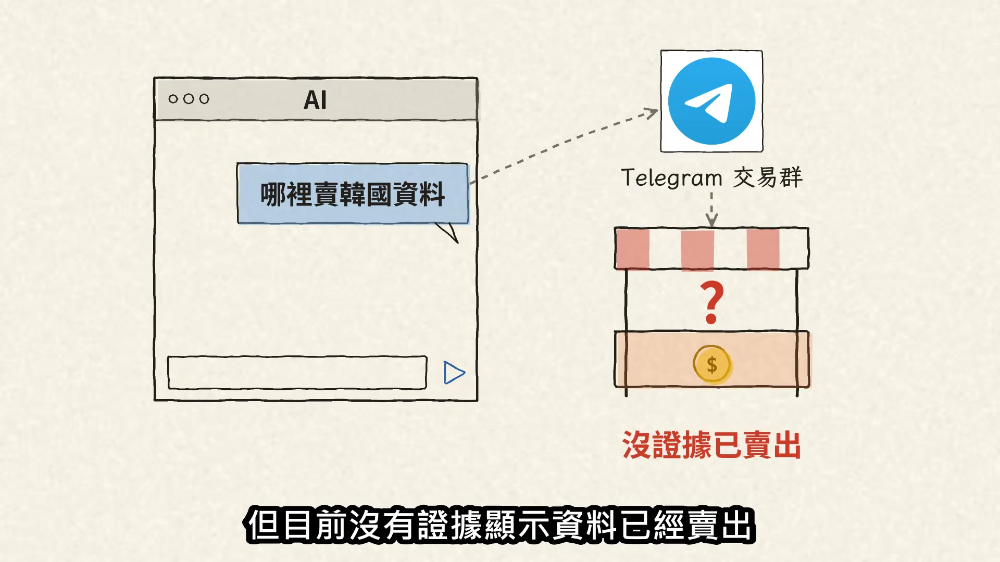

**逐字稿片段：** 更有反差的是，同一批 ARTEX 成果 他轉頭又叫 Claude 寫進一份資安研究員履歷 前一刻還在找地方賣資料 下一刻就包裝成求職成就 可是這份履歷，也不能拿來認人

**話題推測：** 揭示駭客利用攻擊成果製作資安研究員履歷的反差行為

---

## 00:02:09

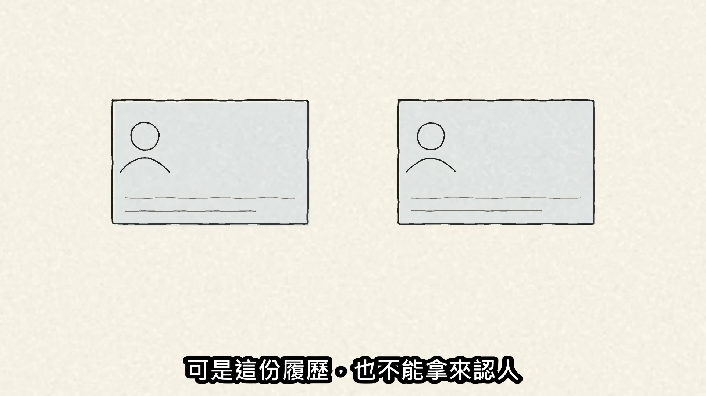

**逐字稿片段：** 同一批紀錄裡，一處寫26歲 另一處卻填2007年出生 換算下來大約19歲 年齡前後打架，不能當成真實身分 也因為線索對不上

**話題推測：** 指出履歷中年齡資訊的矛盾：26歲

---

## 00:02:21

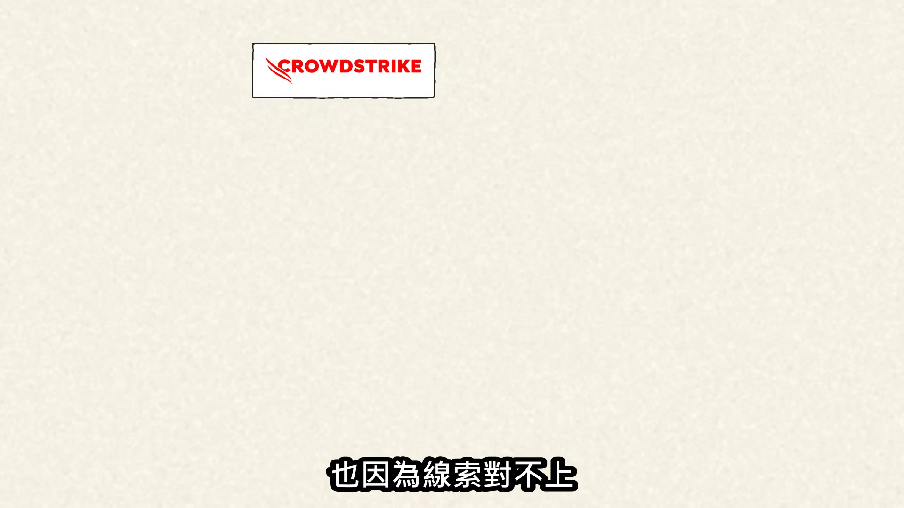

**逐字稿片段：** CrowdStrike 只用中等信心判斷：

**話題推測：** 說明CrowdStrike對操作者的判斷及信心程度

---

## 00:02:24

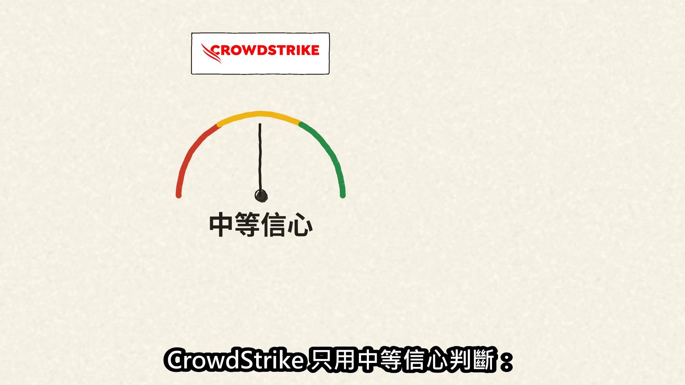

**逐字稿片段：** 操作者可能說中文，以金錢為動機 CrowdStrike 也沒有把這次行動歸到任何國家頭上

**話題推測：** 列出CrowdStrike判斷操作者可能說中文且動機為金錢

---

## 00:02:33

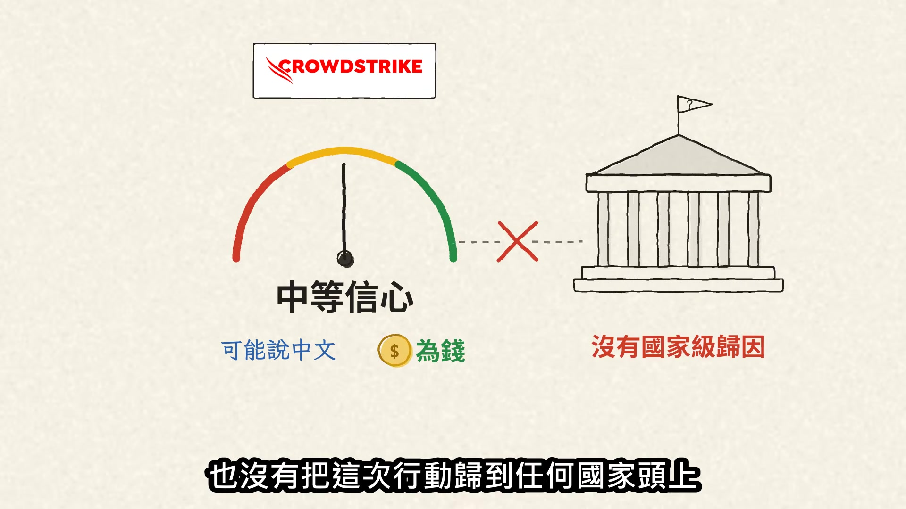

**逐字稿片段：** 那南韓警方呢？

**話題推測：** 話題轉向南韓警方的調查進展

---

## 00:02:35

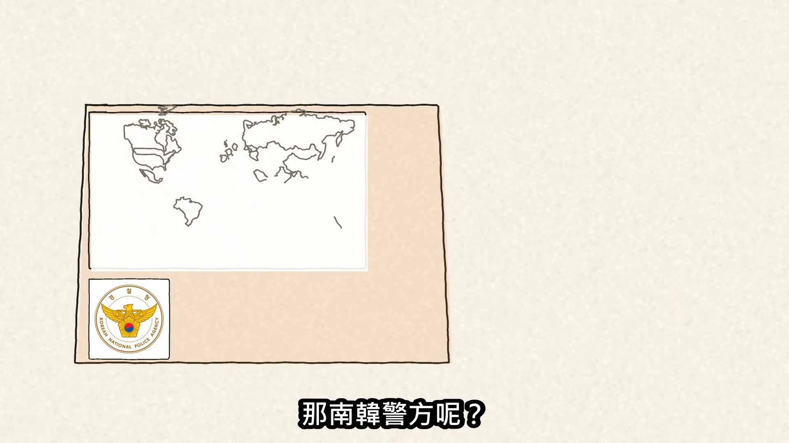

**逐字稿片段：** 警方桌上是28個 IP 分布在至少12個國家 但大多只是用來藏身的代理和中繼點 比起這些假面 駭客自己留下的 AI 對話和記憶檔 反而成了新的指紋 把兩條線索放在一起看

**話題推測：** 提及警方追查到的IP數量：28個

---

## 00:02:49

**逐字稿片段：** AI 可能讓單一操作者同時指揮多個代理 做出過去像大型團隊才有的產能 可是留紀錄、管伺服器、藏身分的紀律 未必跟著升級

**話題推測：** 總結AI如何讓單一操作者達到多團隊產能

---

## 00:02:58

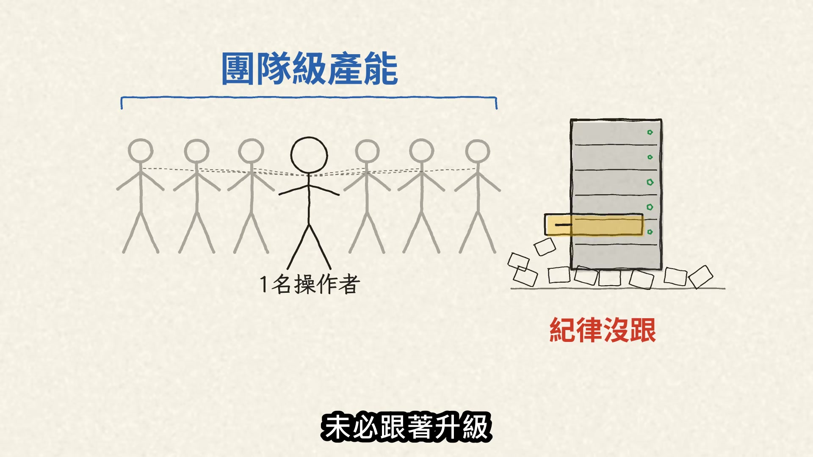

**逐字稿片段：** 駭客的身分還在查，銀行的帳也要算了

**話題推測：** 話題轉向銀行需承擔的責任和後續

---

## 00:03:03

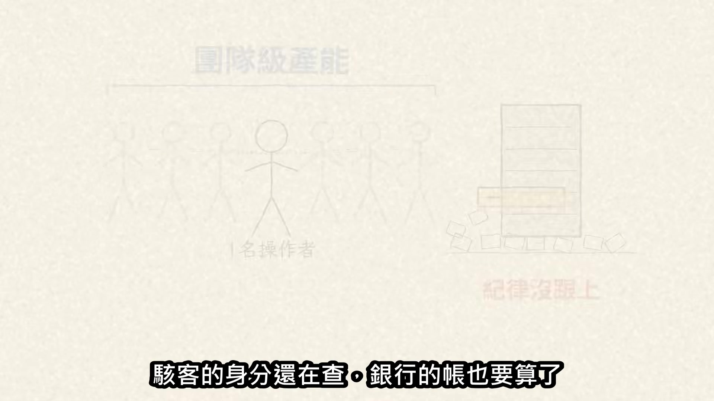

**逐字稿片段：** 10月19日

**話題推測：** 提及銀行行長將在10月19日出席國會聽證

---

## 00:03:04

**逐字稿片段：** 5家銀行的行長要到南韓國會的國政監查 說明連環外洩和資安投資的責任： 為什麼守住了核心大門 卻讓外圍系統成了漏資料的小窗

**話題推測：** 說明5家銀行行長將前往南韓國會接受國政監查

---
