# ai-note-101_QfvviTQtcHQ — 關鍵畫面索引

- 來源逐字稿：[ai-note-101_QfvviTQtcHQ_GT.srt](ai-note-101_QfvviTQtcHQ_GT.srt)
- 影片：https://www.youtube.com/watch?v=QfvviTQtcHQ
- 截圖數：41

## 00:00:00

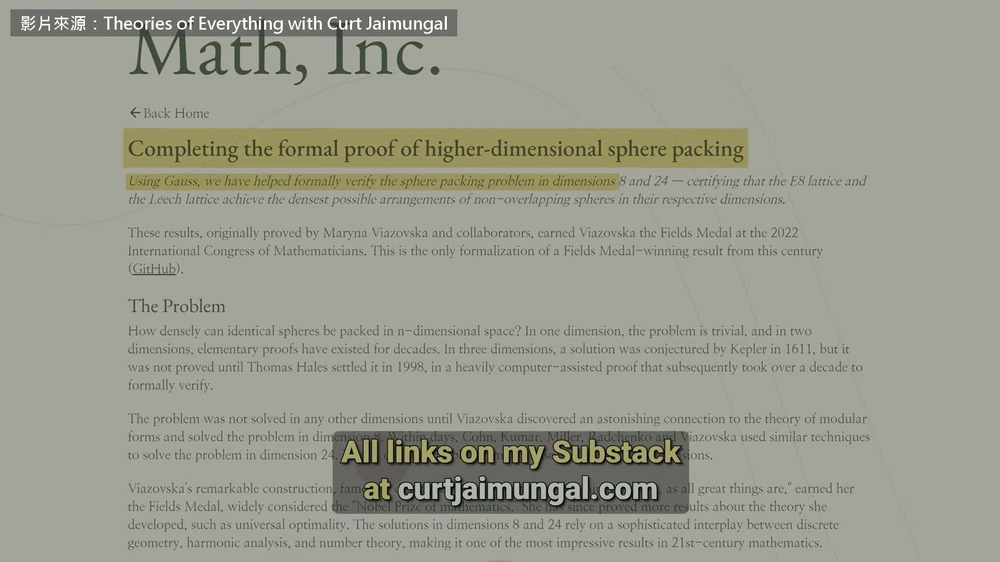

**逐字稿片段：** 今年三月初 新創公司 Math Inc 宣布

**話題推測：** 介紹新創公司 Math Inc 宣布的事件背景。

---

## 00:00:02

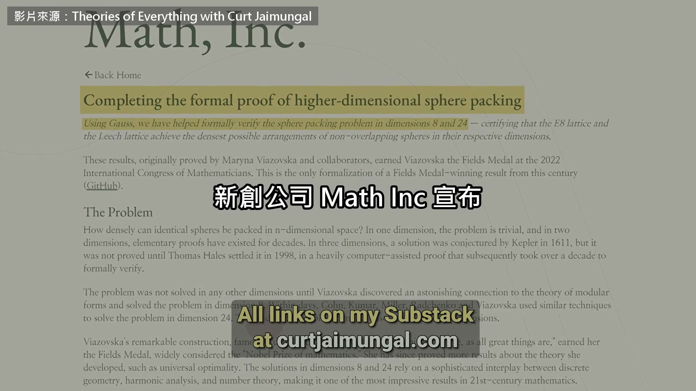

**逐字稿片段：** 8 維跟 24 維的球體堆積證明 已經完整寫成 Lean 程式碼 每一步都能交給電腦檢查

**話題推測：** 說明 Math Inc 宣布的具體證明內容，8維跟24維的球體堆積證明。

---

## 00:00:08

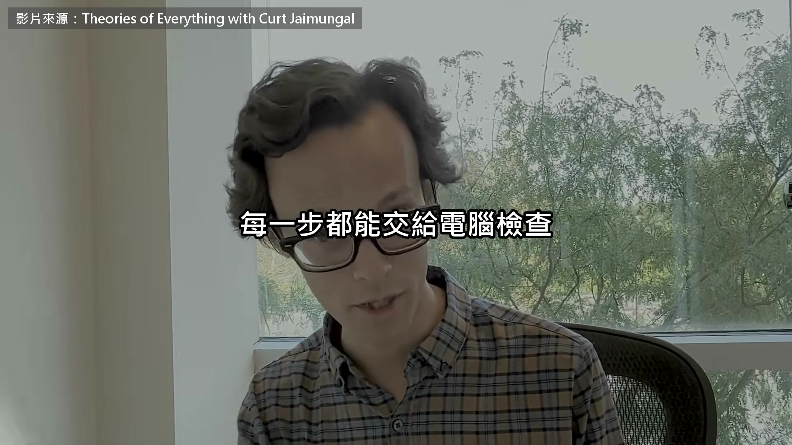

**逐字稿片段：** 8 維那一份讓 Maryna Viazovska 拿到費爾茲獎 從 2024 年起就有一群人手工在寫 帶頭的是博士生 Sidharth Hariharan Jonathan Gorard 大約十年前被 Wolfram Research 找去 就是要做自動定理證明 後來成了 Wolfram 物理計畫的共同創辦人 也在普林斯頓做應用數學

**話題推測：** 介紹 Maryna Viazovska 因8維球體堆積證明獲得費爾茲獎。

---

## 00:00:27

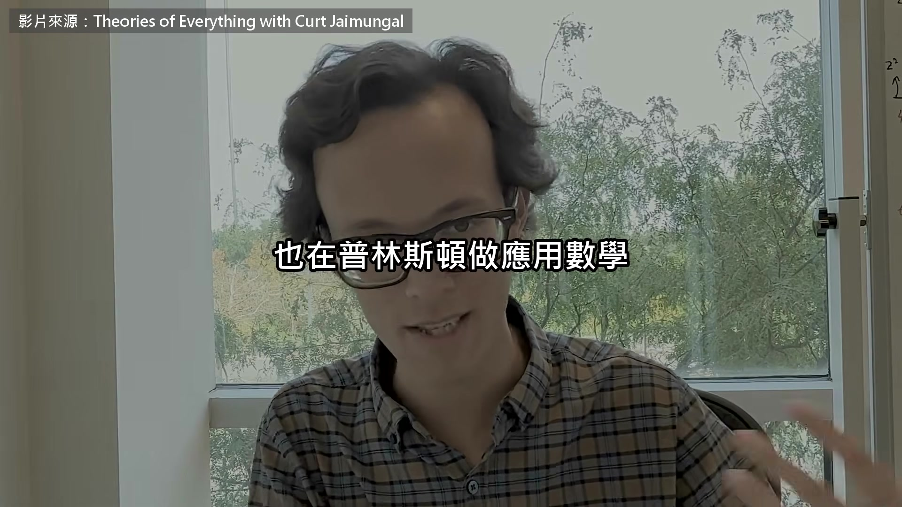

**逐字稿片段：** 今年他出來創了 Lanyon AI 自己當執行長 要替物理學做一套像 Lean 那樣能驗證推理的語言

**話題推測：** 介紹 Jonathan Gorard 創立新公司 Lanyon AI。

---

## 00:00:34

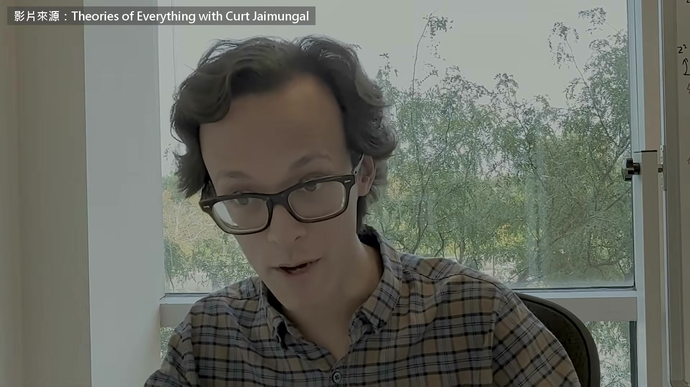

**逐字稿片段：** 這是 10 月 5 號剛上架的訪談 我原本以為，一路追著 AI 能力的進展 我大概知道這件事什麼時候會發生 AI 遲早做得到，這點很清楚

**話題推測：** 提及此次討論來源為近期上架的訪談。

---

## 00:00:46

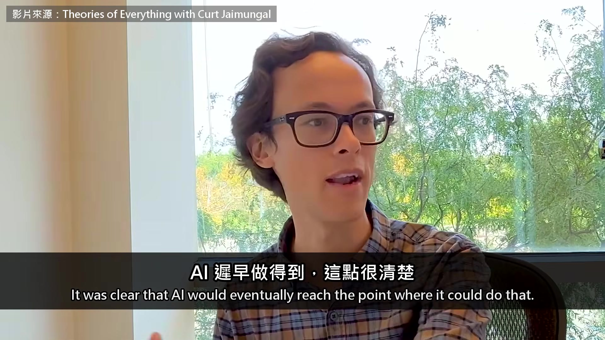

**逐字稿片段：** 可是如果你在 2026 年 1 月問我 我會很有把握地說，這最晚也要到 2027 年底… 說錯，是最快。比較合理的時間是 2028 年 結果 3 月初，就冒出一份幾十萬行 完全自動生成的 Lean 證明，就這樣丟出來 對我來說，那就是「完蛋了」的那一刻 那一刻我才發現，我整個想錯了 時間表全錯了 所以我當時的想法是…對了，我得補充一下 我沒多久就知道，整件事比表面上看到的複雜得多

**話題推測：** 引用未來時間點，說明講者原先對AI發展時程的預期。

---

## 00:01:26

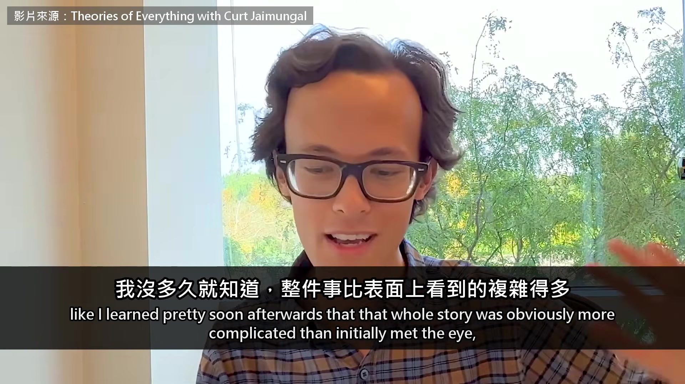

**逐字稿片段：** 當中還有 Sidharth Hariharan 的事 這個博士生，據說被 Math Inc 搶先了 我是說，我經歷那一刻的時候，並不知道事情的全貌 結果這件事比我以為的更有意思，也更微妙 但真正讓我害怕的 是我意識到一件事 我跟我同事在做的這類研究 這種好奇心驅動的應用數學、計算物理研究 我會說，一直都是靠刻意模糊一條界線，來證明自己值得做 界線兩邊，我叫它「科學當產品」跟「科學當過程」

**話題推測：** 再次提及 Sidharth Hariharan 與Math Inc事件的關聯。

---

## 00:02:10

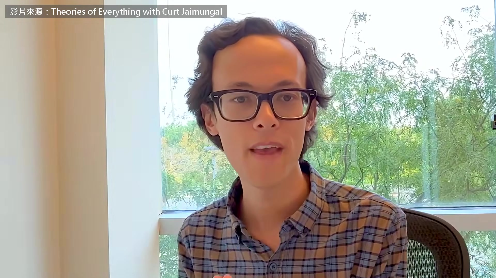

**逐字稿片段：** 「科學當產品」很清楚 就是治好癌症、搞定核融合、產生乾淨能源 這類目標 只要不太離譜，基本上沒人會說這是壞事 或說該停止資助、別再做這些 或說該把做這些題目的人裁掉

**話題推測：** 開始解釋「科學當產品」的定義與目標。

---

## 00:02:29

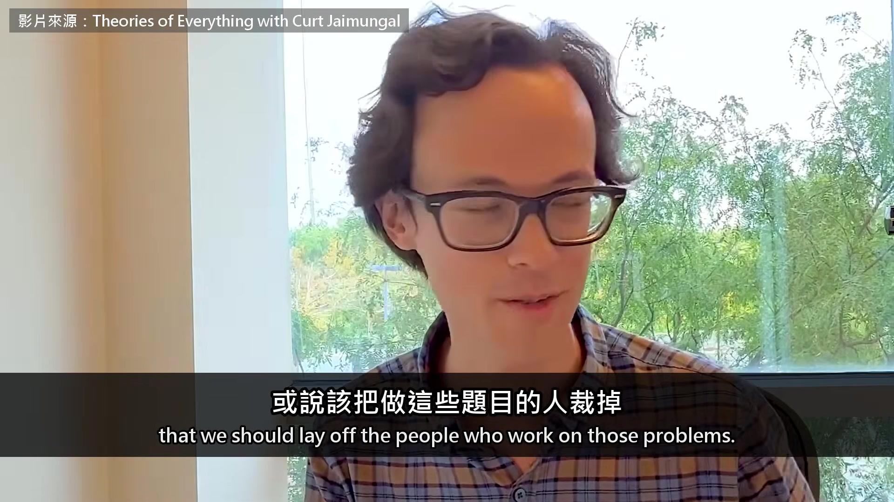

**逐字稿片段：** 另一邊是「科學當過程」，就是那些好奇心驅動的東西 像是「我想搞懂蛋白質摺疊」 或是「我想搞懂亂流」 或「我想搞懂量子重力」之類的 大致上，我們替後者辯護的方式 就是借前者的名義把它洗白

**話題推測：** 開始解釋「科學當過程」的定義與其好奇心驅動的特點。

---

## 00:02:48

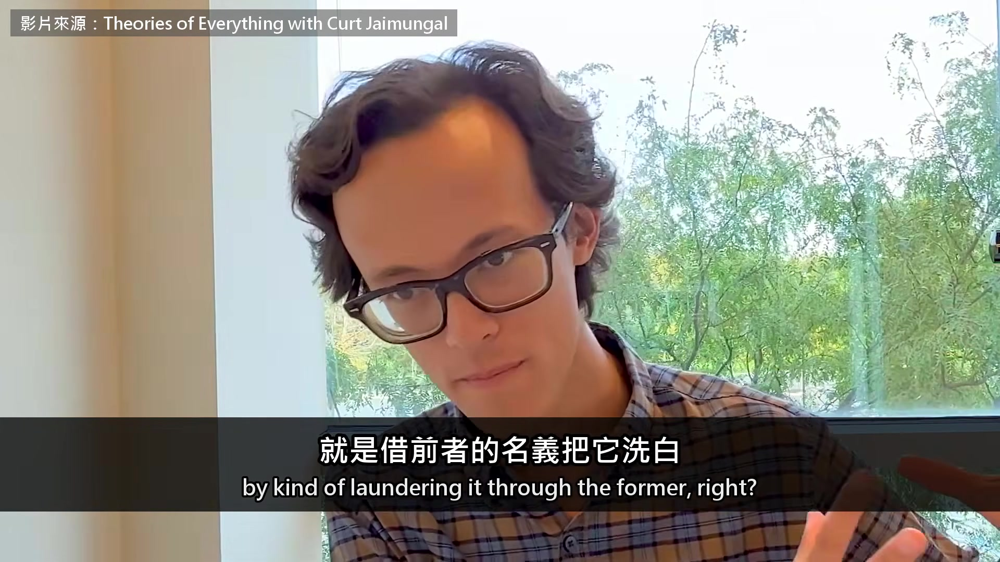

**逐字稿片段：** 舉個有點好笑的例子，我一直覺得… 我有個很要好的朋友，做代數幾何、代數數論 研究 p-adic Langlands 那一類定理 他做的東西，細節我一樣都看不懂 可是他寫的每一份經費申請，開頭都有一段固定的套話 說代數數論對密碼學有用，對網路安全很關鍵 我就想：「好啦，數論確實對密碼學有用」

**話題推測：** 引入一個有趣的例子來闡述科學辯護的方式。

---

## 00:03:17

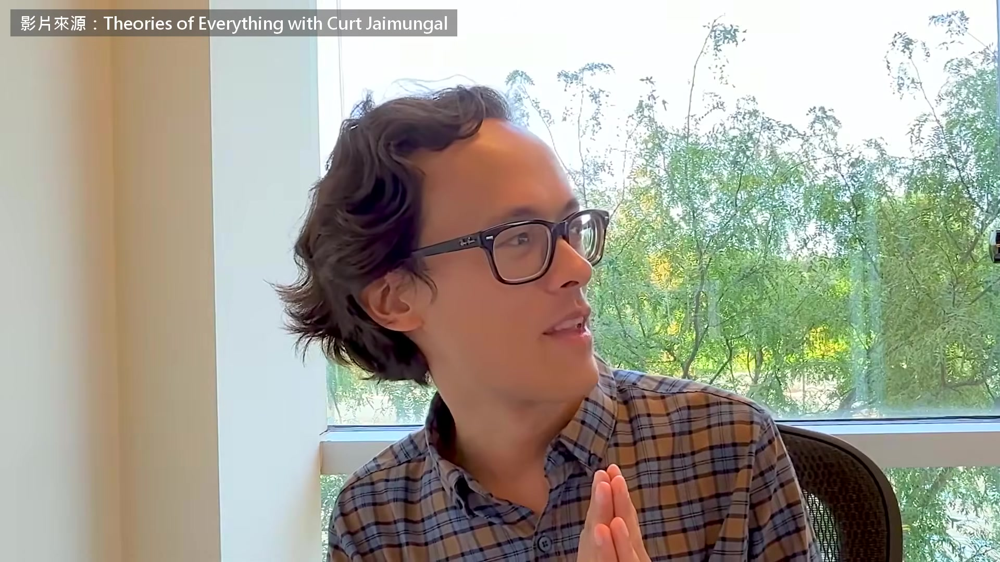

**逐字稿片段：** 問題是，密碼學用得到的數論，大多是一千年前的東西 像是中國剩餘定理 就算是最前沿的，也就是橢圓曲線密碼、離散對數那些方法 最新也只到 19 世紀，講給當時的數學家 Jacobi 聽，他都聽得懂

**話題推測：** 說明密碼學實用數論多為古老知識，如中國剩餘定理。

---

## 00:03:33

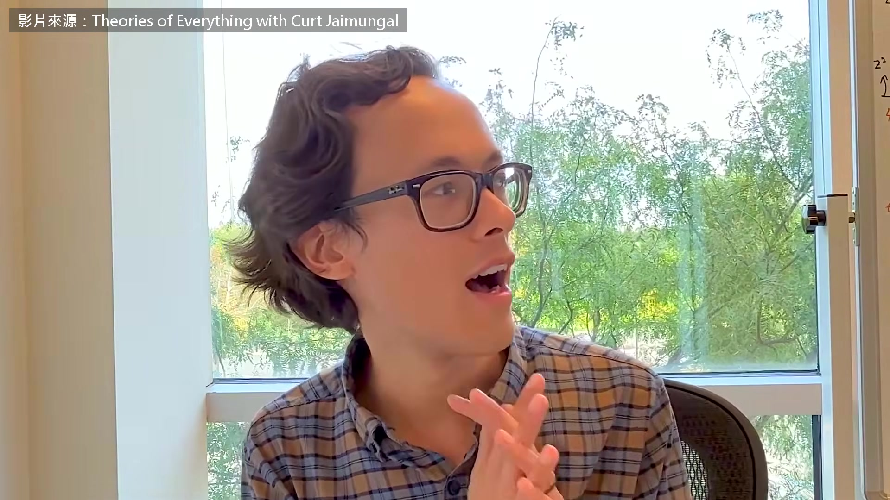

**逐字稿片段：** 所以說，證明 p-adic Langlands 綱領的定理能改善網路安全 根本就是胡扯 可是大家普遍覺得，你非這樣寫不可 不然經費機構不買帳 社會大眾也不會接受我們拿錢支持這種研究

**話題推測：** 指出證明 p-adic Langlands 與改善網路安全之間的荒謬連結。

---

## 00:03:47

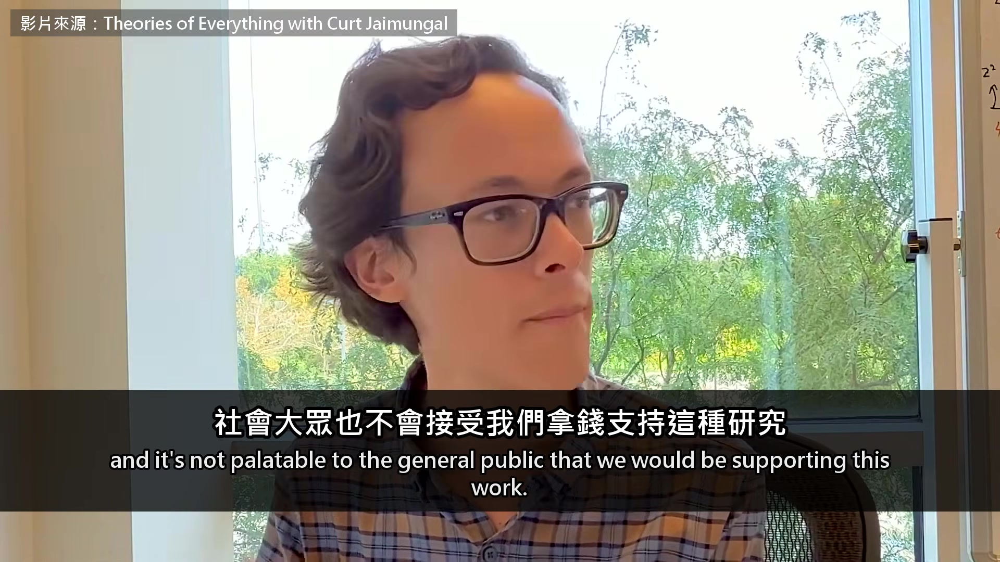

**逐字稿片段：** 他說他寫經費申請也這樣寫過

**話題推測：** 提及自己也曾寫過類似不確定的經費申請。

---

## 00:03:49

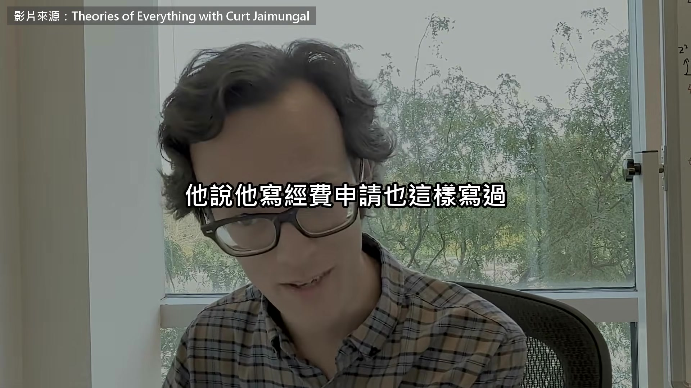

**逐字稿片段：** 說偏微分方程的研究對半導體製造有用 其實他半信半疑

**話題推測：** 舉例偏微分方程對半導體製造的應用，但自己半信半疑。

---

## 00:03:54

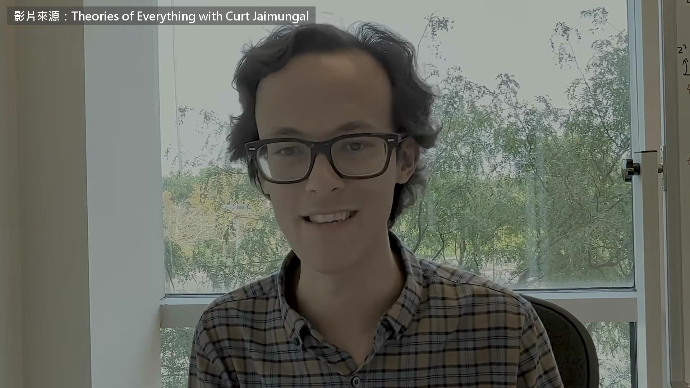

**逐字稿片段：** 就在三月那一刻我明白，這套撐不下去了 這才是讓我害怕的地方 我本來想，如果還有兩年，也許還來得及改變學界的生態 改變裡面的政治，改變整套體制的設計 結果我發現，根本沒時間做這些

**話題推測：** 指出三月那一刻意識到過去的模式無法持續。

---

## 00:04:08

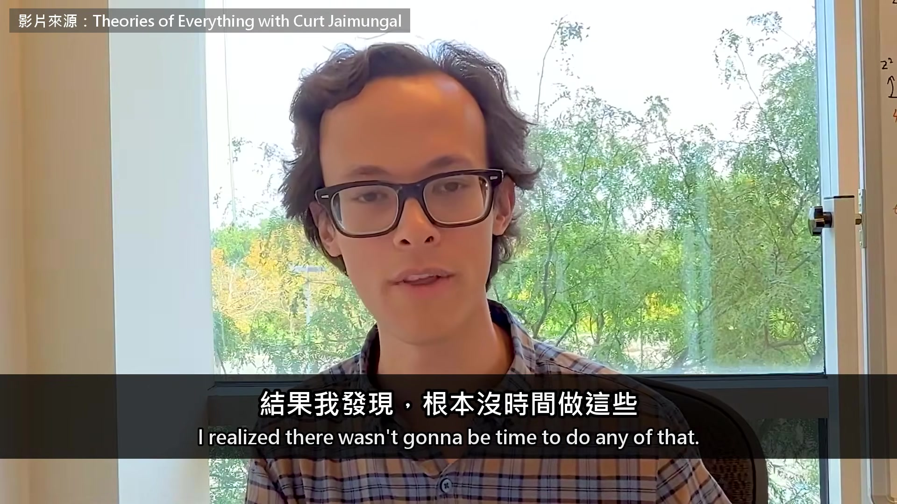

**逐字稿片段：** 突然之間，大家會開始說（這個禮拜就是最典型的例子）

**話題推測：** 描述當前情勢下，人們開始質疑傳統科學研究模式。

---

## 00:04:15

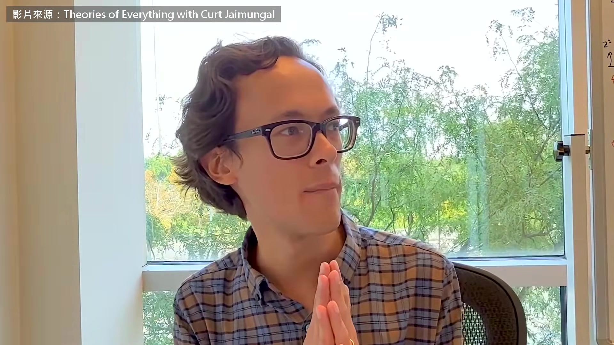

**逐字稿片段：** 「等一下，產品那一面 AI 全都做得到」 「那我們幹嘛還要支持過程那一面？」 我本來整個人生、整個職涯，都是照這套在規劃的 我很幸運，光靠思考就能過活 想點子、解問題、學東西 我發現，用來支持這些事的那套體制 至少從我的位置看，維持不了多久了 那一刻的重點就在這裡

**話題推測：** 引述人們對AI能完成「產品」面工作的質疑。

---

## 00:04:45

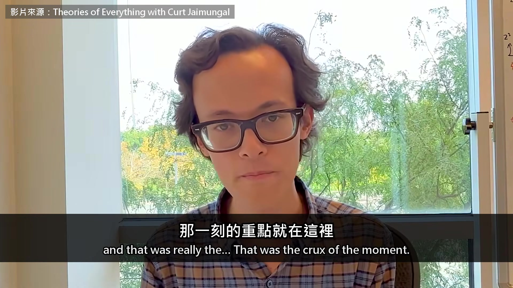

**逐字稿片段：** 主持人追問他 為什麼用的是害怕這個詞 而不只是意外

**話題推測：** 轉述主持人追問他使用「害怕」一詞的原因。

---

## 00:04:51

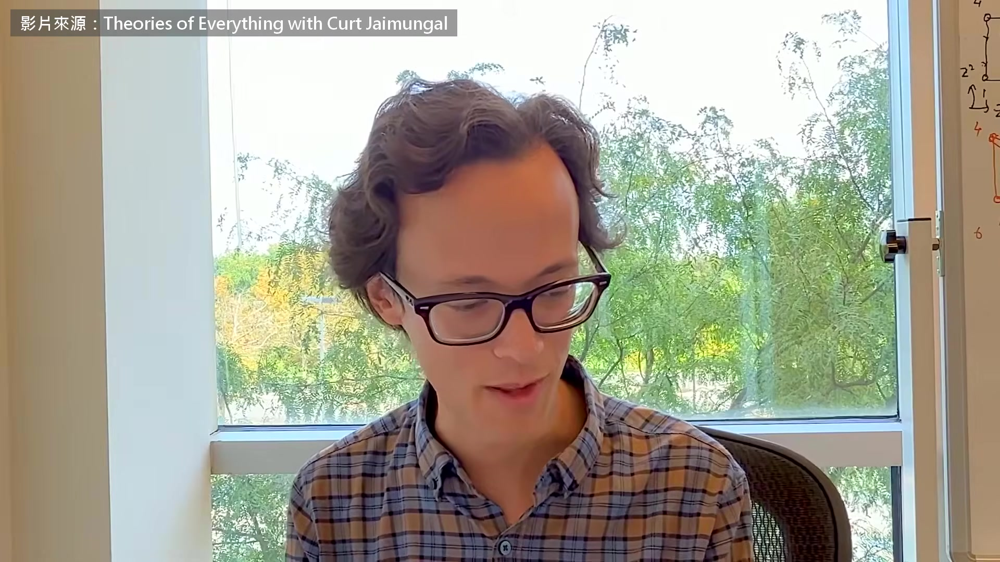

**逐字稿片段：** 我那時候到處找學界同事，問他們：「你們怎麼看這件事？」 這也讓我害怕，因為我突然發現 「天啊，我們在結構上完全沒有準備好」 因為我…我覺得自己像是…我先講清楚 我一點都不是先知

**話題推測：** 描述他向學界同事詢問對此事件看法的行為。

---

## 00:05:08

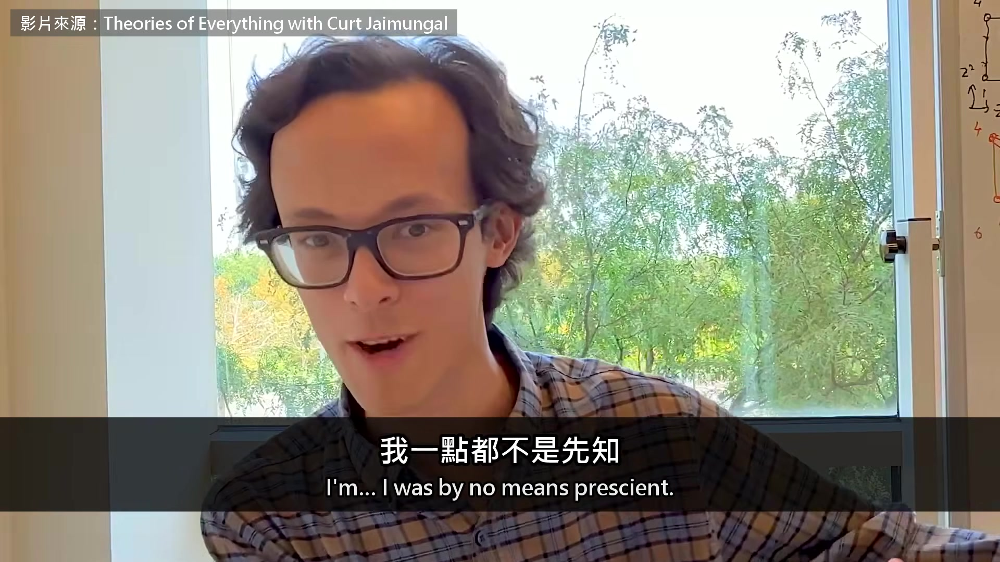

**逐字稿片段：** 照矽谷的標準，我晚到得不得了

**話題推測：** 以矽谷標準為借鑒，說明自己對AI發展反應較慢。

---

## 00:05:12

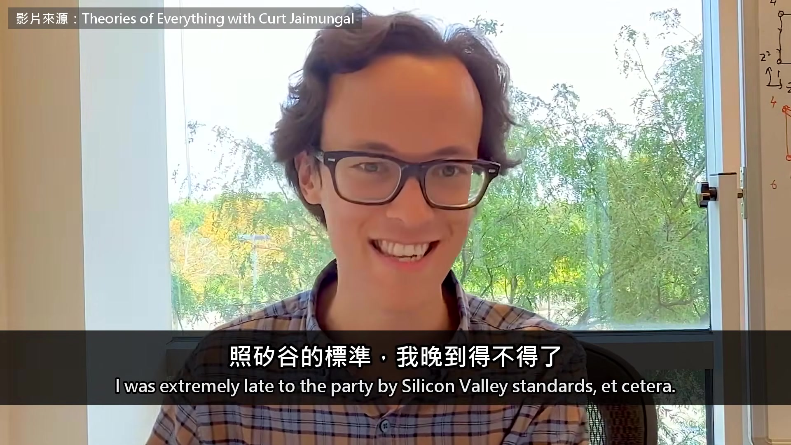

**逐字稿片段：** 但我在普林斯頓這些地方到處問：「等一下，我們打算怎麼辦？」 「我們怎麼看待這件事？」 「跟經費機構、博士後、博士生的做法要怎麼調整？」 「科學研究的流程又要怎麼改？」

**話題推測：** 描述他在普林斯頓等學術圈詢問如何應對AI衝擊。

---

## 00:05:27

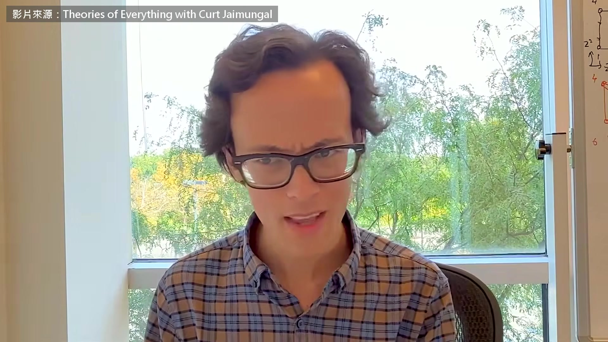

**逐字稿片段：** 我得到的回應，當然有例外，但很多學界同事的回應 讓我非常擔心，他們顯然幾乎沒想過這個問題 也幾乎沒在注意外面發生了什麼

**話題推測：** 概述從學界同事那裡得到的回應，普遍未深思此問題。

---

## 00:05:42

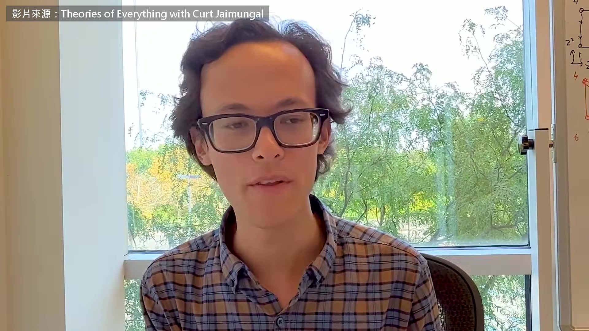

**逐字稿片段：** 大家說：「沒事啦，我們把 AI 加進工作流程就好」 「撥一部分時間，替這個那個科學問題訓練神經網路代理模型」 那時剛好碰上美國能源部大力推動

**話題推測：** 引用同事的說法，認為只需將AI整合進工作流程即可。

---

## 00:05:58

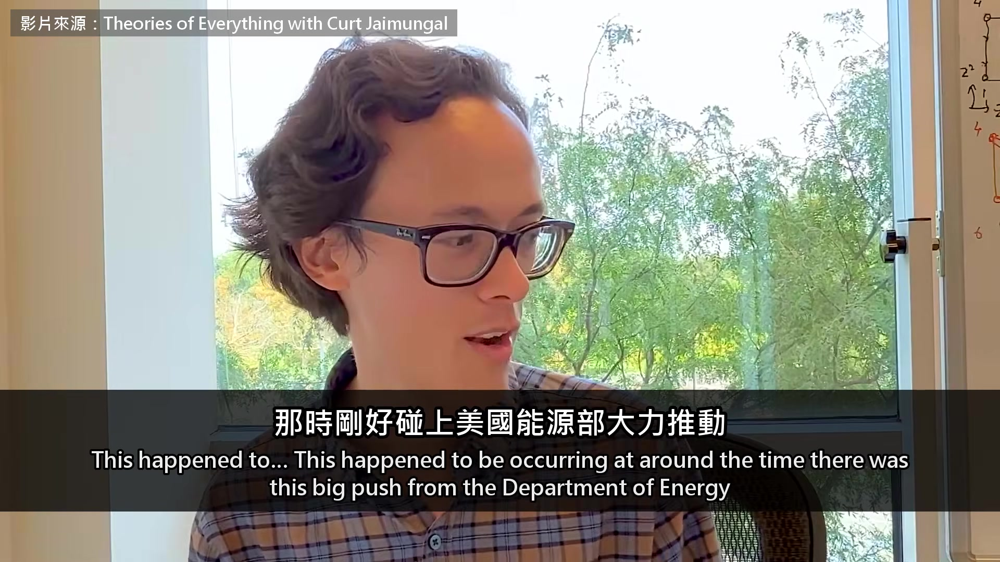

**逐字稿片段：** 要大家提案給所謂的 Genesis 計畫 目標是用 AI 加速美國的科學研究 所以我們很多討論都繞著「這要怎麼放進 Genesis 計畫」打轉 我因此看到很多同事在寫、在提的東西 他們提的計畫 放在 10 年前算是不錯的機器學習專案 像是：「我們拿這個神經網路架構，餵這些資料，得到這個結果」 這種計畫，2015 年就做得出來 現在明明是完全不同的世界了 我卻不覺得有多少同事認真在面對 主持人問 那些提不起興趣的同事有沒有共同點 像是年紀

**話題推測：** 具體點出Genesis計畫的目標是用AI加速美國科學研究。

---

## 00:06:44

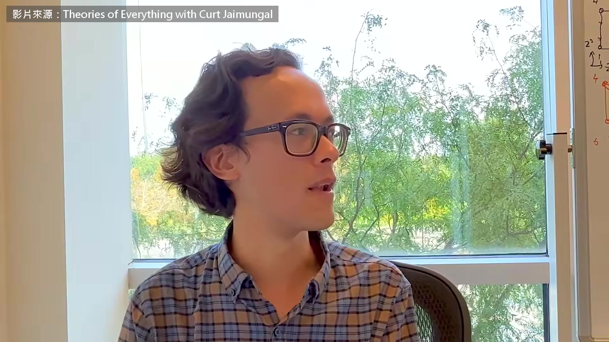

**逐字稿片段：** 沒有，硬要說有什麼規律的話，跟年紀有一點弱相關

**話題推測：** 說明對AI的態度與年紀有弱相關，年輕與資深者接受度高。

---

## 00:06:49

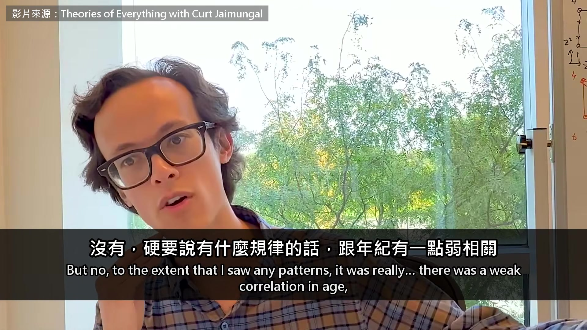

**逐字稿片段：** 很年輕的人 剛讀研究所的學生，很快就用起來

**話題推測：** 具體討論年輕學者對AI的迅速接納。

---

## 00:06:57

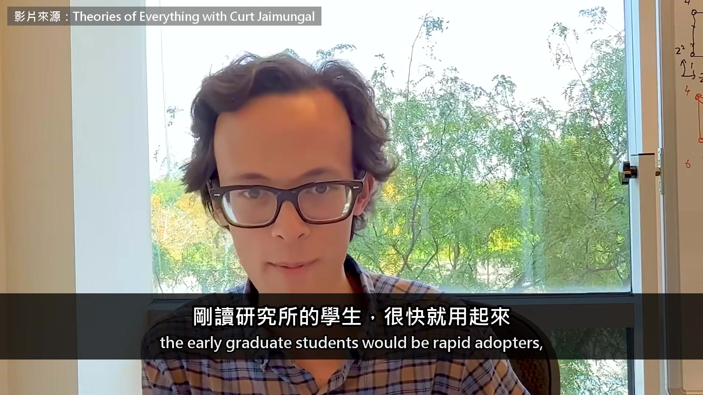

**逐字稿片段：** 職涯快走到尾聲的那一輩，也很快用起來

**話題推測：** 具體討論職涯末期學者對AI的輕鬆嘗試。

---

## 00:07:00

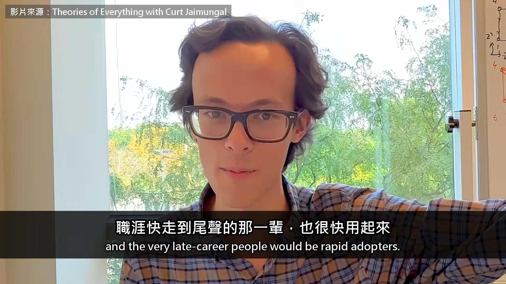

**逐字稿片段：** 最排斥的，反而是職涯走到一半的人 我想原因很明顯，或者說心理上的原因很明顯 年紀大的人，已經不用再證明什麼 他們大概經歷過別的方法革命 所以試用一個顛覆性的新技術，心態比較放鬆 新來的、年輕的人，大概沒見過別的樣子

**話題推測：** 具體討論職涯中期學者對AI的最排斥態度。

---

## 00:07:24

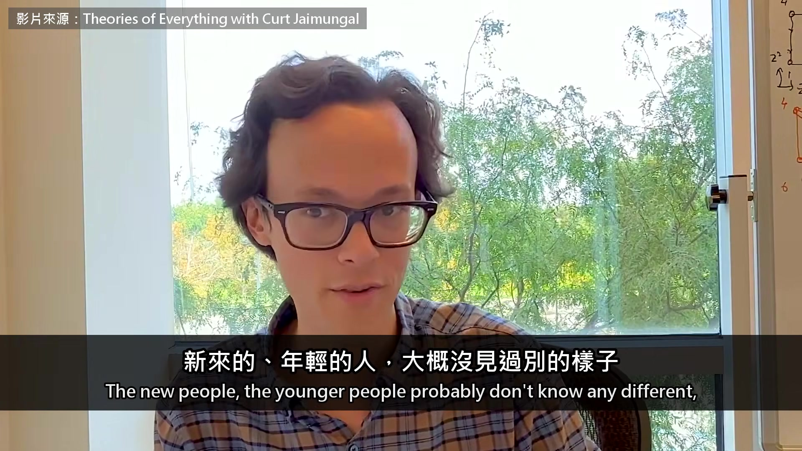

**逐字稿片段：** 就像 Douglas Adams 說的 你 20 歲以前就有的東西，感覺就是世界本來的樣子 而中間那群人，職涯跟名聲都已經建立在 某一套做科學的方式、某一套看世界的方式上 突然看到那一套整個受到威脅 他們最可能說：「不不不，這太糟了」 不只是說「這是壞事」，這點我其實滿能體會 而是說「它沒用」 這是很典型的邏輯謬誤，很多人都犯了 「我覺得這東西不好、有破壞性，所以它不會成功」

**話題推測：** 引用 Douglas Adams 的話來解釋人們對新事物的態度。

---

## 00:08:04

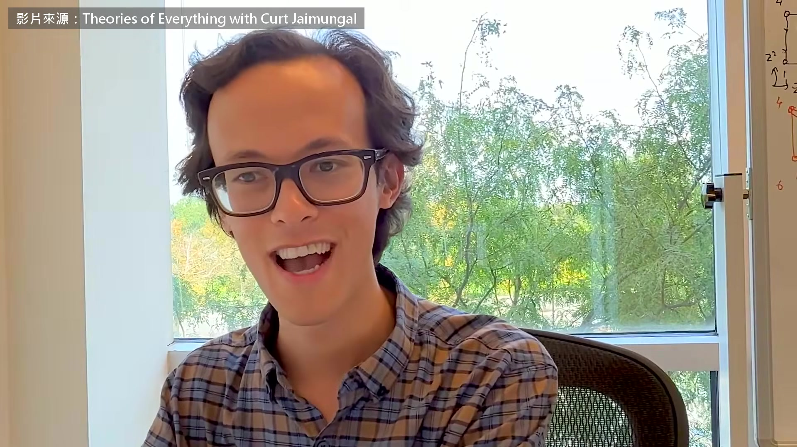

**逐字稿片段：** 我那時候一直跟他們說：「聽好，很多這類技術我也反對」 我有很長一段時間，某種程度上到現在都還是

**話題推測：** 講者表明自己也反對某些AI技術的破壞性。

---

## 00:08:12

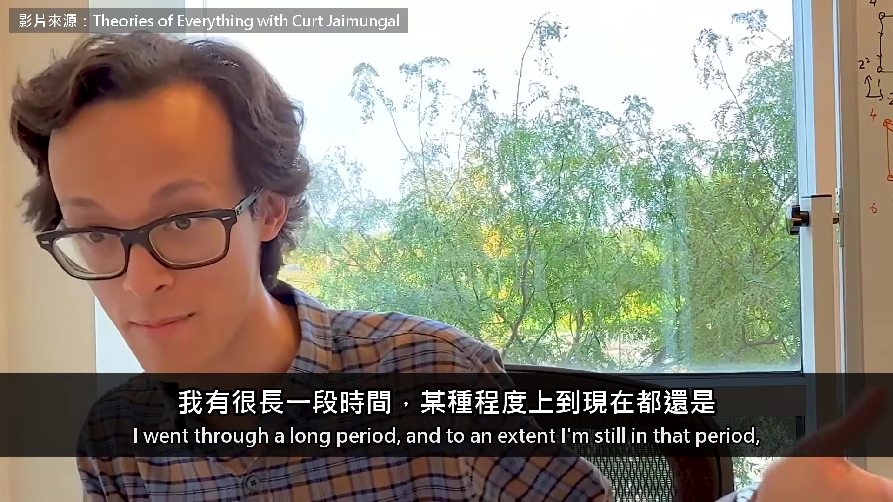

**逐字稿片段：** 從人本的角度，很反 LLM 我覺得這種技術很容易被用得違反人性 讓認知能力退化、思考能力退化、創造力退化 尤其如果你是科學家，是靠好奇心做研究的科學家 創意、思考、學習就是你吃飯的傢伙 我覺得對這些事要非常小心 所以我有點擔心一些年長的同事 他們用得超熱衷 因為我會想：「等等，你上次自己讀論文是什麼時候？」 「上次自己解方程式是什麼時候？」 「這麼依賴這些工具，你確定沒在傷害自己？」

**話題推測：** 從人本角度，表明自己對大型語言模型 (LLM) 的反對立場。

---

## 00:08:55

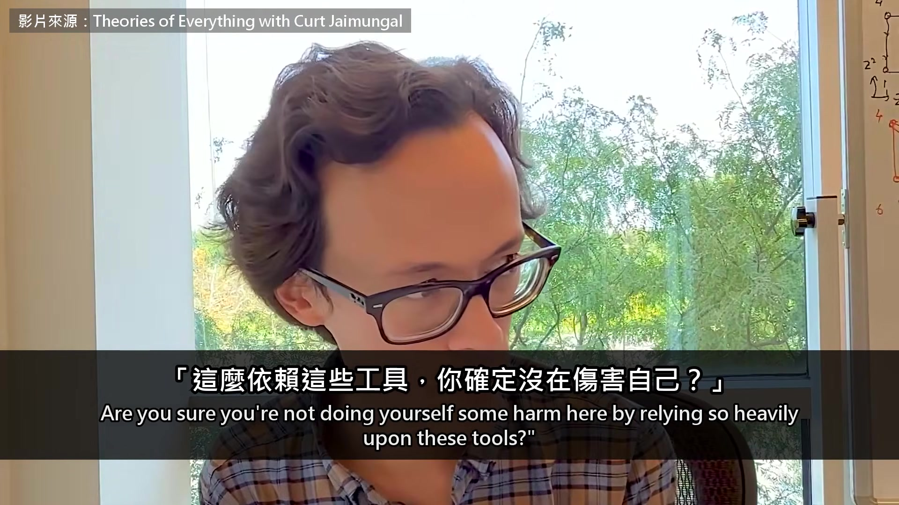

**逐字稿片段：** 訪談後段

**話題推測：** 提示訪談內容進入後段的轉折。

---

## 00:08:56

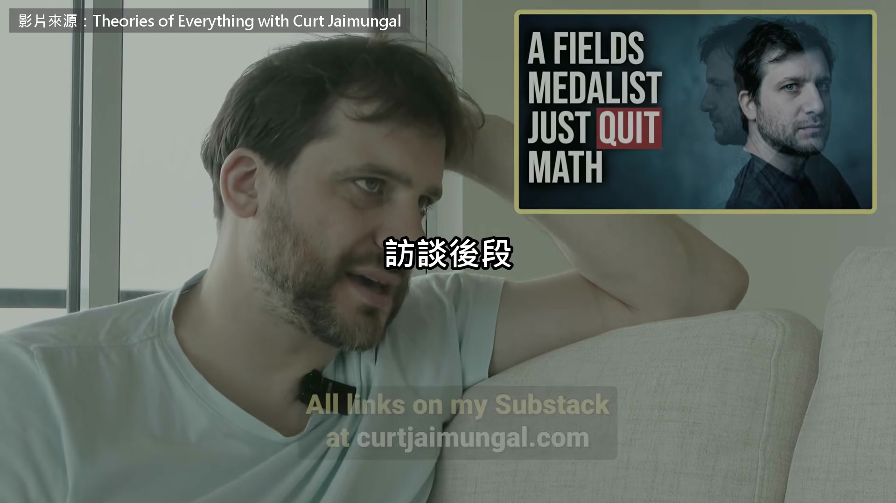

**逐字稿片段：** 主持人提到另一集的費爾茲獎得主說自己在哀悼 問他會不會也是 我講這些，不代表我比較看得開 我也在哀悼…應該說，我那時候在哀悼 我一直都在哀悼，沒有停過

**話題推測：** 提及主持人轉述另一位費爾茲獎得主對現狀的「哀悼」情緒。

---

## 00:09:10

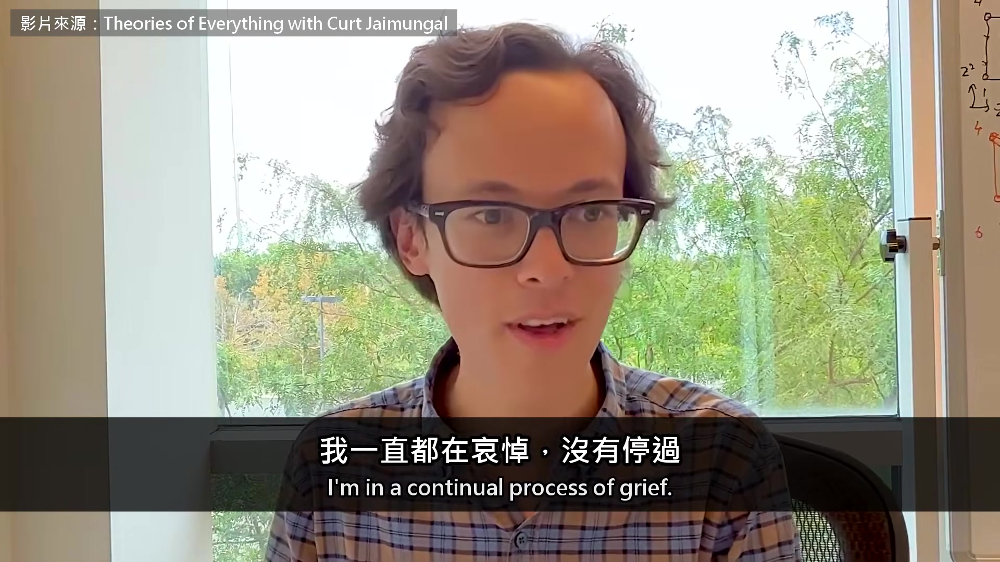

**逐字稿片段：** 某種程度上，我開這家公司的理由之一 就是要替這份哀悼找個出口 我看得到我的領域在變，而且變成我不喜歡的樣子

**話題推測：** 說明創立 Lanyon AI 的其中一個理由是為自己的哀悼尋找出口。

---

## 00:09:24

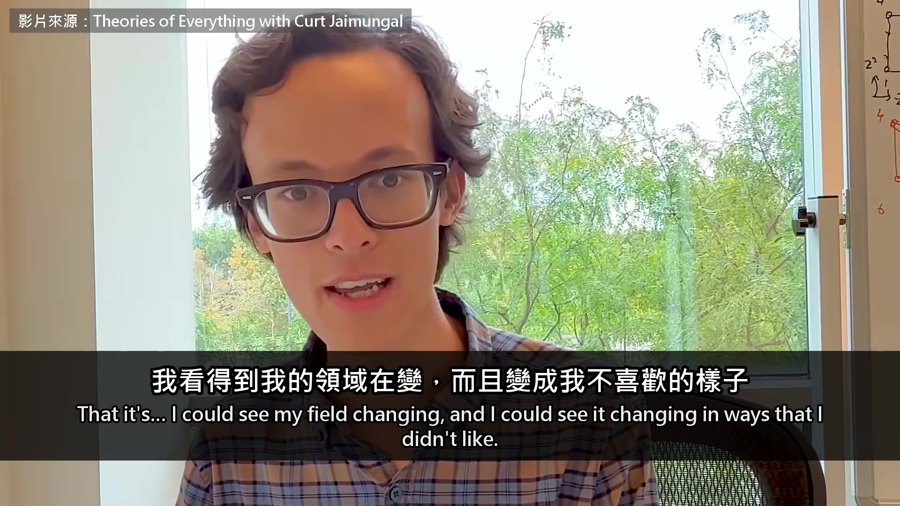

**逐字稿片段：** 我剛才提到那些年長的同事

**話題推測：** 再次提及年長的同事對AI工具的熱衷使用。

---

## 00:09:28

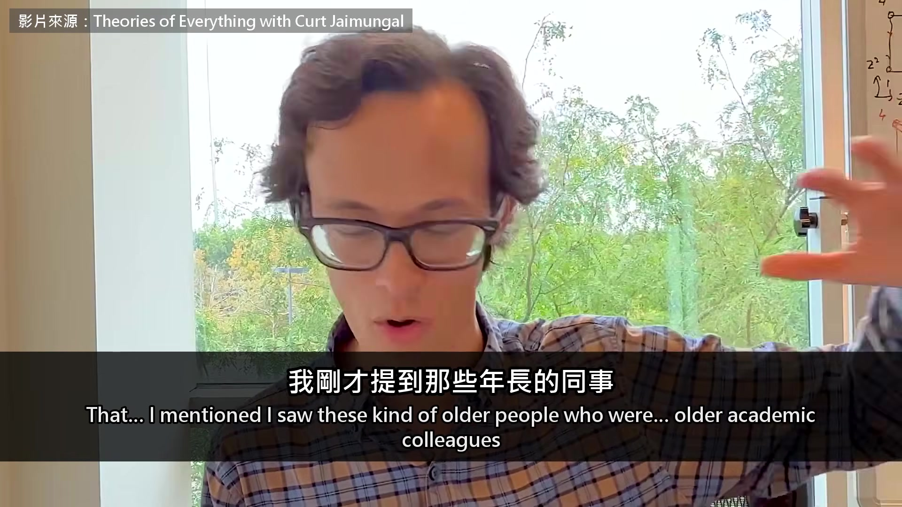

**逐字稿片段：** 很熱情地把 ChatGPT、Claude 放進研究流程 我完全無法理解 對我來說，那好像把所有的樂趣都拿走了 他們說：「是不是超棒？」

**話題推測：** 點名同事熱情使用 ChatGPT 和 Claude 等AI工具融入研究流程。

---

## 00:09:44

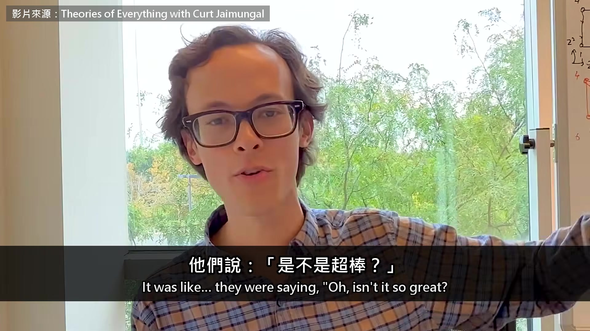

**逐字稿片段：** 「我可以用 Claude Cowork 或 Claude Code，幫我讀論文、解方程式」 「寫程式、設計演算法」 我坐在那裡想：「等一下，不不不，那正是我享受的部分」

**話題推測：** 引用同事描述AI工具如何協助讀論文、解方程式等工作。

---

## 00:09:55

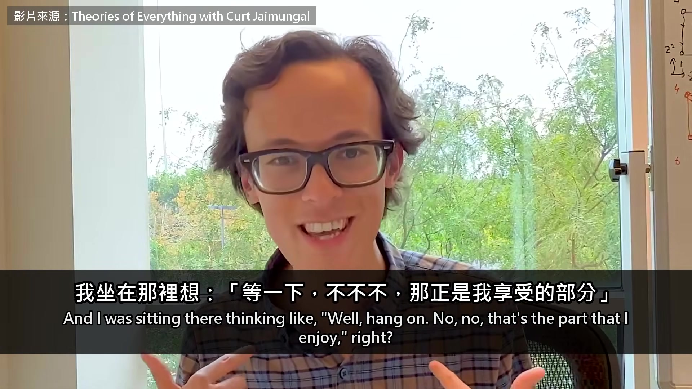

**逐字稿片段：** AI 把成果包辦以後 好奇心驅動的研究要拿什麼理由申請經費 學界還沒準備好回答

**話題推測：** 提出AI包辦成果後，好奇心驅動研究的經費申請困境。

---

## 00:10:02

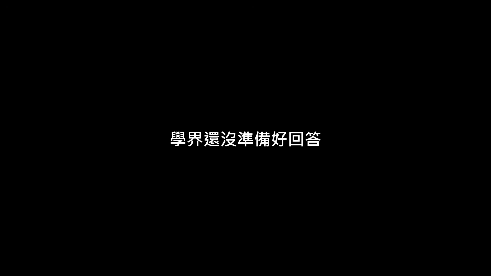

**逐字稿片段：** Gorard 在哀悼的 是他最喜歡的那一段，親手讀論文 解方程式

**話題推測：** 歸結 Jonathan Gorard 哀悼的是親手讀論文、解方程式的樂趣。

---

## 00:10:08

**逐字稿片段：** 原影片兩個多小時，後面他還講到

**話題推測：** 預告原影片中後續的其他話題，如物理學家對粒子偵測的層層假設。

---

## 00:10:11

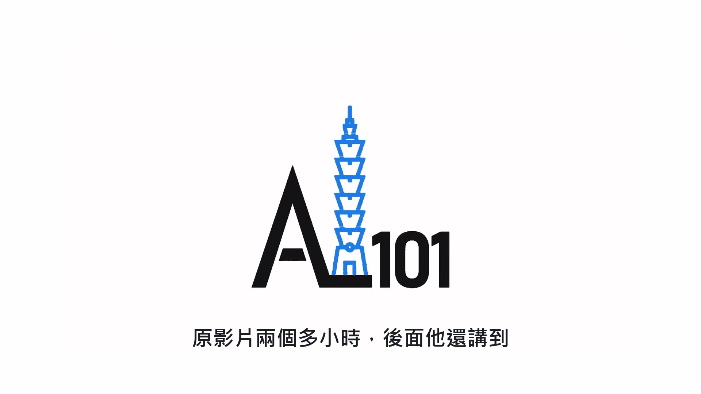

**逐字稿片段：** 物理學家說一句「我偵測到一個粒子」 背後其實疊了 20 到 50 層理論假設 還有 Alan Turing 唯一的博士生 70 多年前就想替物理學做一台像圖靈機那樣的推理機器 原影片連結在說明欄，有興趣可以去聽更多。

**話題推測：** 提及物理學家說「偵測到一個粒子」背後的複雜假設。

---
