# ai-note-101_R44pz7YNiwc — 關鍵畫面索引

- 來源逐字稿：[ai-note-101_R44pz7YNiwc_GT.srt](ai-note-101_R44pz7YNiwc_GT.srt)
- 影片：https://www.youtube.com/watch?v=R44pz7YNiwc
- 截圖數：30

## 00:00:00

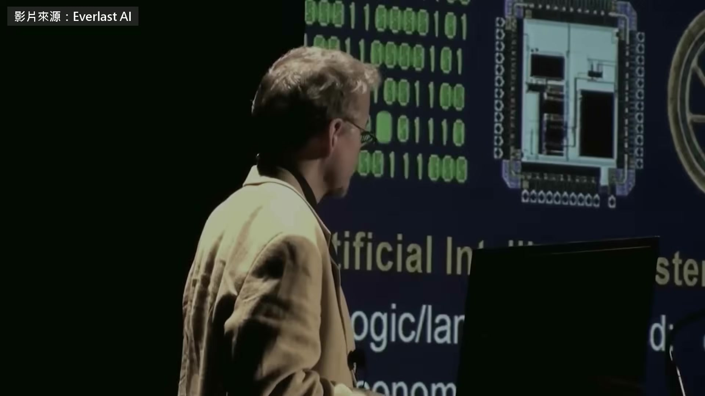

**逐字稿片段：** 2000 年 這個人用數學寫出了理論上最聰明的 agent 長什麼樣子 叫 AIXI 他叫 Marcus Hutter AI 圈到今天都還很有分量的一個智慧定義 是他跟當年的博士生 Shane Legg 一起寫的

**話題推測：** 時間點標示，提及 2000 年。

---

## 00:00:13

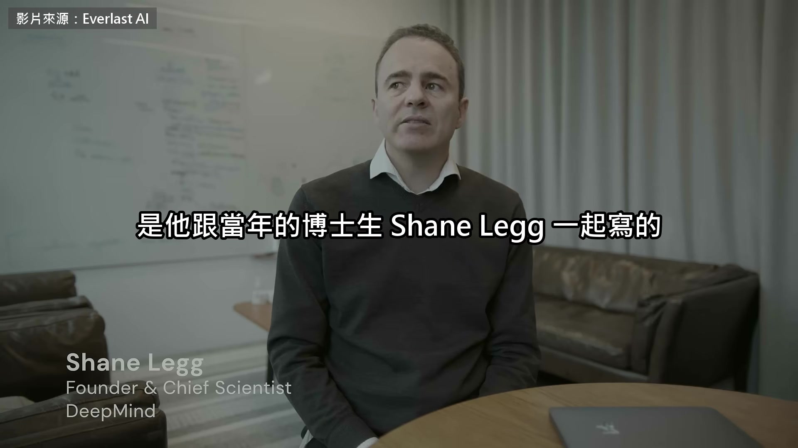

**逐字稿片段：** Legg 後來共同創辦了 DeepMind Hutter 現在是 DeepMind 的資深研究員 也是澳洲國立大學的榮譽教授

**話題推測：** 介紹 Shane Legg 的職涯發展，共同創辦 DeepMind。

---

## 00:00:20

**逐字稿片段：** 這場是德國 AI 頻道 Everlast AI 的訪談 8 月中上架

**話題推測：** 介紹訪談來源為德國 AI 頻道 Everlast AI。

---

## 00:00:24

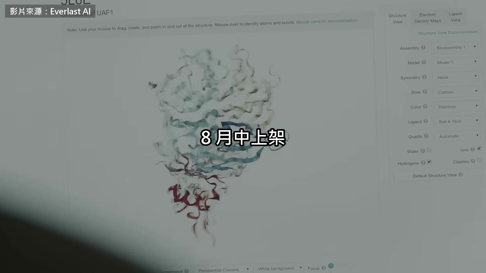

**逐字稿片段：** 主題是 DeepMind 今年 6 月的一篇論文 講從 AGI 走到超級智慧有哪幾條路 Hutter 是 14 位作者之一

**話題推測：** 明確指出訪談主題為 DeepMind 今年 6 月的一篇論文。

---

## 00:00:31

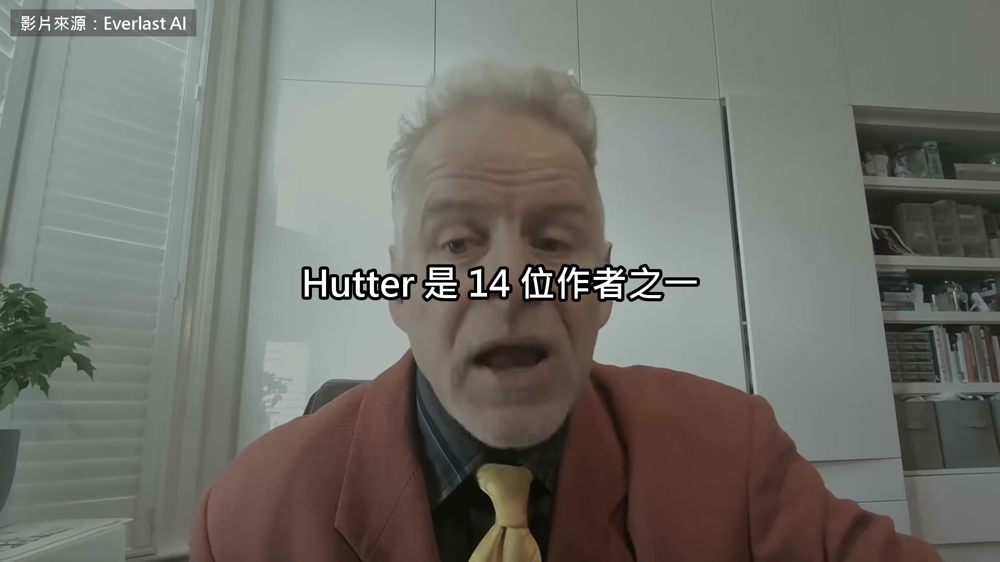

**逐字稿片段：** 他說四年前還以為差 3 到 5 個大點子 現在只差 0 到 1 個 他算的上一個大突破 出現在 2017 年 那就是 Transformer 從那之後，其實就沒有什麼大突破了 真的就是 1000 個，一點都不誇張 1000 個小點子，東一點西一點，讓系統變好 再加上更多的算力跟更多的資料 這 1000 個小點子，我可以舉幾個出來 有一派說，好，這些小點子就夠了 夠把我們從 AGI 帶到 ASI，也就是超級智慧 另一派說，嗯，到目前為止是還行 可是真的要做出超級智慧，就需要新點子 那我怎麼看？ 四年前，我會覺得 我們大概還需要 3 到 5 個全新的大點子 才做得出 ASI 現在我降到了，只需要 0 到 1 個大點子 也許還缺一個，也許一個都不缺 這一點我不太確定 主持人後來問 他跟 Legg 那個智慧的定義到底怎麼算 他的答案是 把一個 agent 丟進所有可能的世界 看它平均拿到多少獎勵 世界有無限多個，沒辦法一視同仁 所以越簡單的世界權重越高 這就是奧坎剃刀 agent 跟世界互動久了 會把對不上觀察的世界刪掉 可是剩下的那些，全都對得上 可是在這些世界裡，最經典的例子是綠藍悖論 綠藍悖論是這樣的 我們有兩個假說 第一個假說說，所有綠寶石都是綠的

**話題推測：** 講者提出四年前對於 AGI 發展所需大點子的估計數字（3 到 5 個）。

---

## 00:02:15

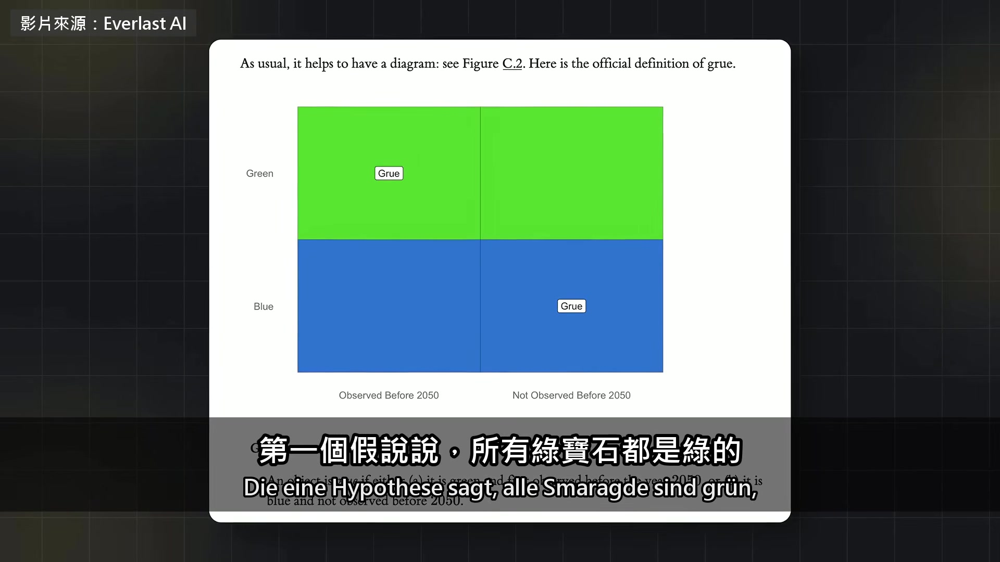

**逐字稿片段：** 另一個說，所有綠寶石在 2050 年以前是綠的 之後就變成藍的 有常識的人會說，第二個假說太荒謬了 對，可是量子力學也很荒謬，但它是對的 所以「很荒謬」這個理由不算數 兩個假說都跟我們知道的一切一樣吻合 因為我們還沒看過 2050 年的綠寶石 也就是說，事先沒有實驗分得出這兩個 可是不知道為什麼，每個人都會把 「綠寶石永遠是綠的」看得比較認真 原因是這個假說比較簡單 「所有綠寶石都是綠的」比 「2050 年以前是綠的，之後變藍」簡單 後面那個就是比較複雜 所以我們把重心放在簡單的假說上 可是複雜的那個也還留著 因為它說不定是對的 畢竟也有一些現象，過了一段時間就突然變了

**話題推測：** 闡述綠藍悖論的第二個假說，包含年份 2050 年。

---

## 00:03:20

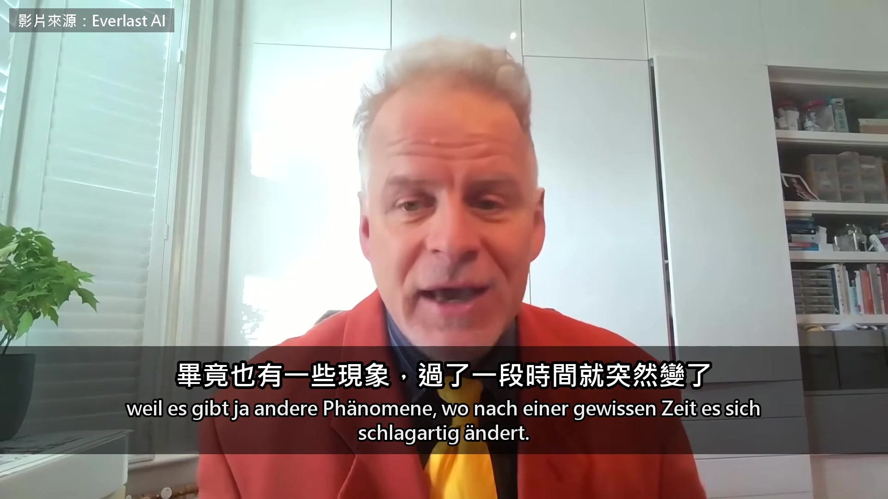

**逐字稿片段：** 回到那篇論文

**話題推測：** 話題回到之前提及的 DeepMind 論文。

---

## 00:03:21

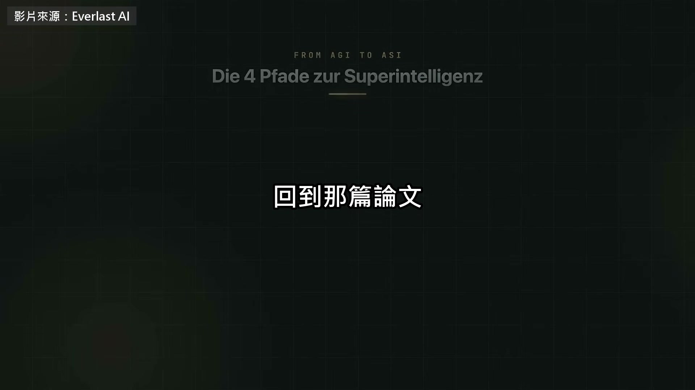

**逐字稿片段：** 它列了四條通往超級智慧的路 主持人先問第一條 規模定律為什麼一直有效 Hutter 說 規模定律講的就是模型 資料跟算力一起加大 AI 就會更聰明 乍聽之下，這好像很天真

**話題推測：** 指出論文列出了四條通往超級智慧的路徑。

---

## 00:03:38

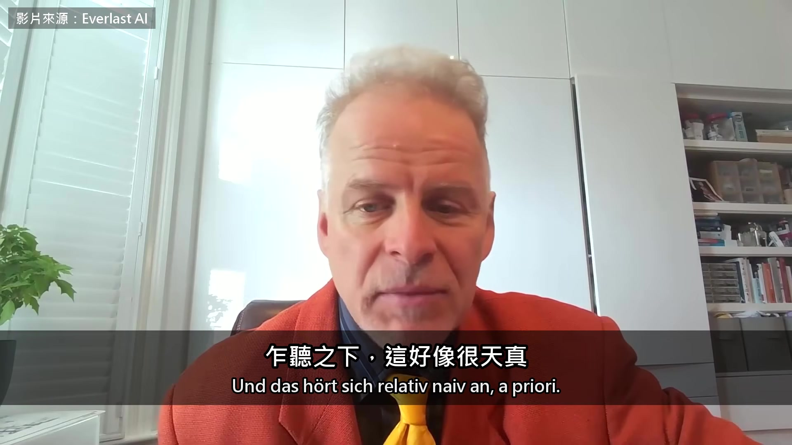

**逐字稿片段：** 可是這些規模定律，至少已經撐了 4 年 系統一直變好 卻沒有什麼了不起的新點子，尤其是架構上的 這代表，我想大多數人都把人腦的複雜程度 或者說，做到人類等級的智慧需要的複雜程度 完全高估了 我一向覺得人腦沒有大家想的那麼神 我一直覺得它比看起來簡單 AIXI 模型顯示，一條非常非常簡單的式子 就能做到超級智慧 連我都沒想到，實際上會這麼簡單 就是簡單的 Transformer 整個架構寫成虛擬碼，一頁就寫得完 訓練、推論，我寫過一篇論文 剛好一頁放得下

**話題推測：** 提及規模定律已持續有效長達 4 年。

---

## 00:04:51

**逐字稿片段：** Andrej Karpathy 用 Python 實作出來，兩頁也放得下 而且真的跑得動 當然，實際上的系統複雜得多 因為要在很多台電腦上有效率地跑

**話題推測：** 提及 Andrej Karpathy 使用 Python 實作 Transformer。

---

## 00:05:02

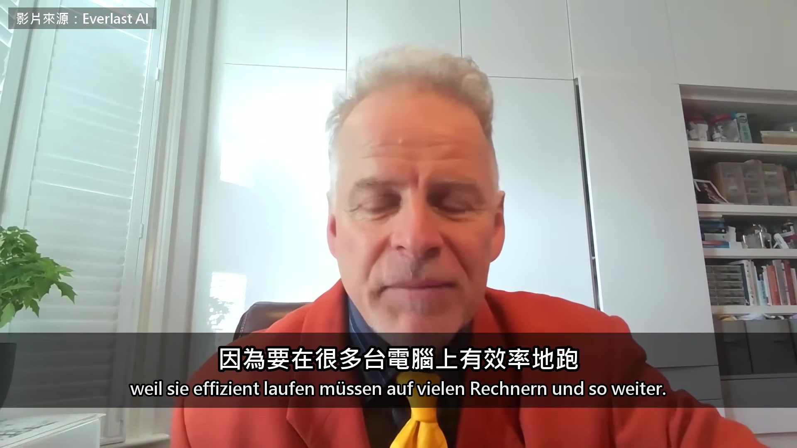

**逐字稿片段：** 再來是資料快用完的問題 他說可以拿最好的模型自己造資料

**話題推測：** 引入 AI 發展面臨的「資料快用完」問題。

---

## 00:05:07

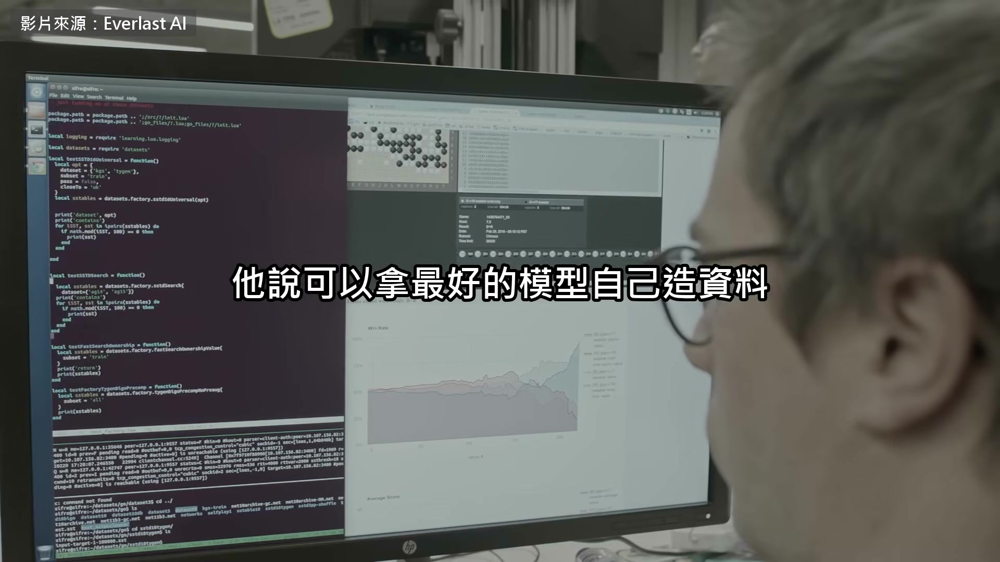

**逐字稿片段：** 像 AlphaZero 就是完全靠自己跟自己下棋練出來的

**話題推測：** 以 AlphaZero 為例，說明模型自我生成資料的可能性。

---

## 00:05:10

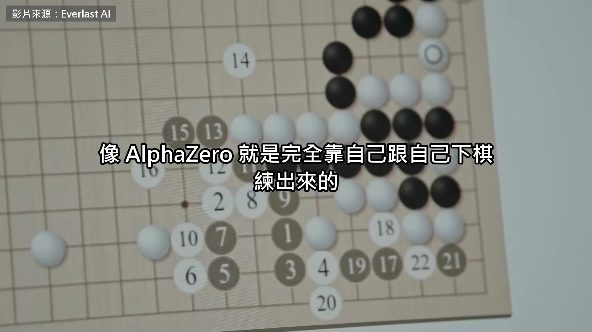

**逐字稿片段：** 另一個常聽到的反對是 AI 太耗電 他說這個說法根本是錯的 他自己算過一遍 你去看一個人要花多少能量 才能回答一個問題、做完一件工作

**話題推測：** 轉移到另一個常見的反對意見：AI 太耗電。

---

## 00:05:26

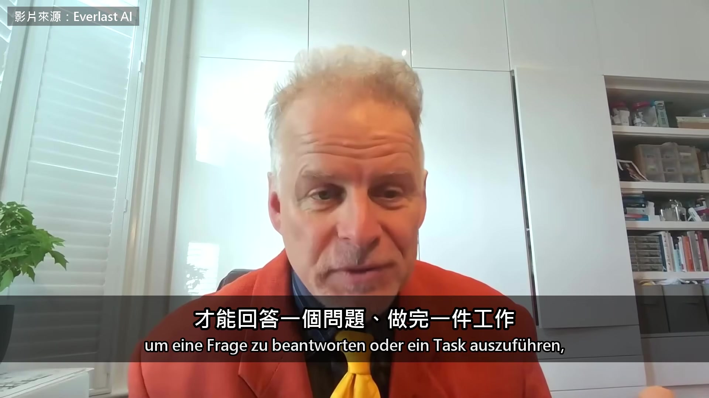

**逐字稿片段：** 比如說一件 5 分鐘的工作 你可以算出要吃多少卡路里 還有煮這些食物要花的能量 我們還要有房子住 偶爾還要度個假 全部加起來，就是一份能量帳 然後再去問，一個模型要花多少能量 才能回答一個問題 少得多，現在就已經是這樣 接著就有人說，可是訓練模型要花好幾億美元 要用那麼多能量 可是，我們訓練一個模型 是給幾十億人用的 雖然大概只用 3 個月或 6 個月 但它被複製了幾十億份 對照一下，每個人都得花 20 年 一個一個培養，那要花多少能量 10 億人，70 億人，每個都要 20 年 然後這個人可以用 當勞動力用 40 年 不是只有 6 個月，所以長了 80 倍 可是算出來很清楚 同樣的品質，電腦每做一件工作 花的能量現在就已經比人少 唯一的…對了，用水那個說法完全荒謬 唯一說得通的論點是 我們已經有 70 億人（全球人口 2022 年已破 80 億） 現在又多做出這些系統 要用掉額外的能量 可是照這個說法推下去 那就得說，好，別再生小孩了 一個人要用的能量 比同等的一份 AI 模型多太多 生小孩反而成了不環保的事 我想沒幾個人會走到這一步 這筆帳是他自己的粗估

**話題推測：** 以「5 分鐘工作」為例，計算人類所需的能量。

---

## 00:07:23

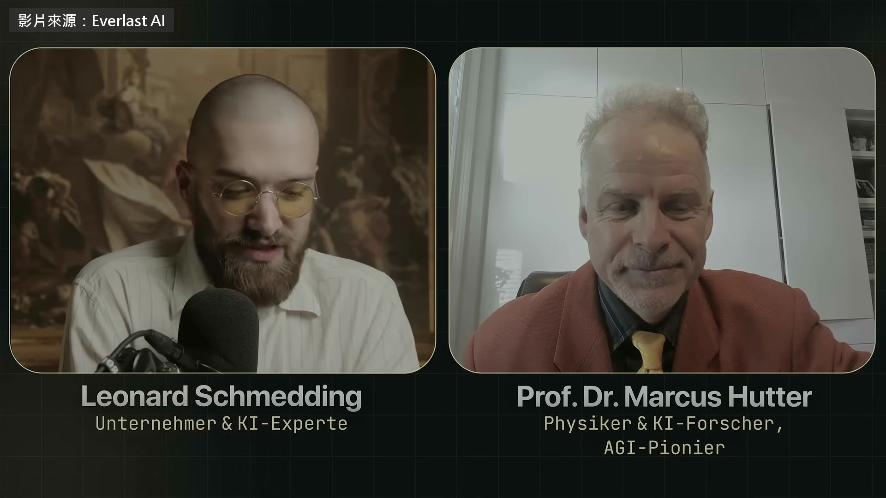

**逐字稿片段：** 主持人轉述了另一派的說法 人腦只要 20 瓦 AI 卻要吃掉一整座城市的電 他的回答是 一顆腦袋不能拿去跟同時服務幾十億人的 ChatGPT 比

**話題推測：** 主持人轉述另一派觀點，比較人腦與 AI 的耗電量。

---

## 00:07:33

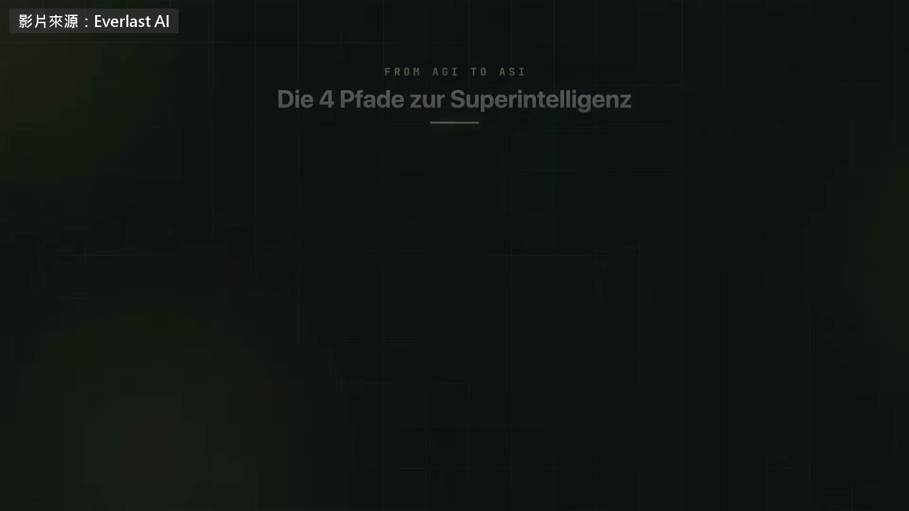

**逐字稿片段：** 第二條路是演算法的突破 例子是讓模型先想久一點再回答

**話題推測：** 介紹通往超級智慧的第二條路：演算法突破。

---

## 00:07:38

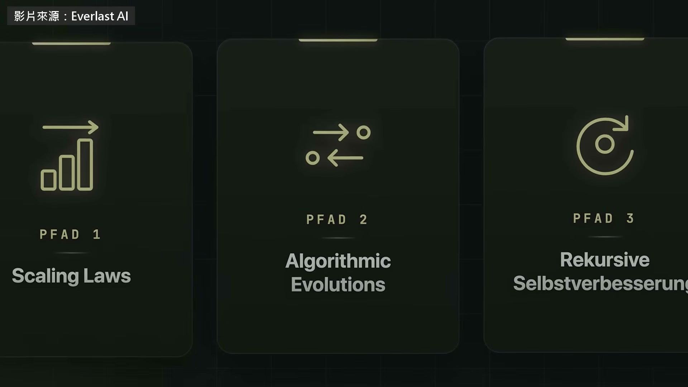

**逐字稿片段：** 以前很紅的遞迴神經網路，在 Transformer 出來之前 本來就做得到，它們可以一直想下去 因為它是遞迴的，有迴圈 可是 Transformer 做不到 它們就只是前饋神經網路

**話題推測：** 提及 Transformer 出現前的遞迴神經網路 (RNN)。

---

## 00:07:55

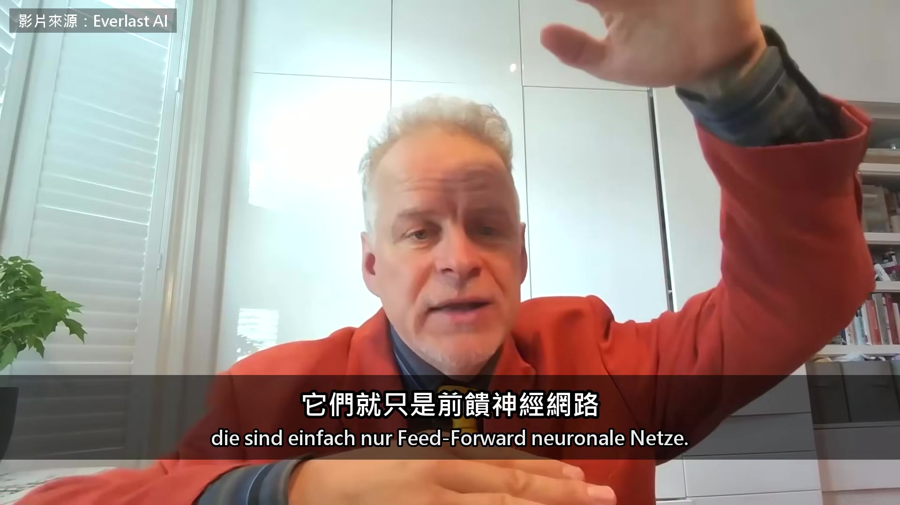

**逐字稿片段：** 輸入進來，經過大概 100 層

**話題推測：** 說明 Transformer 模型通過約 100 層才能得出答案。

---

## 00:08:00

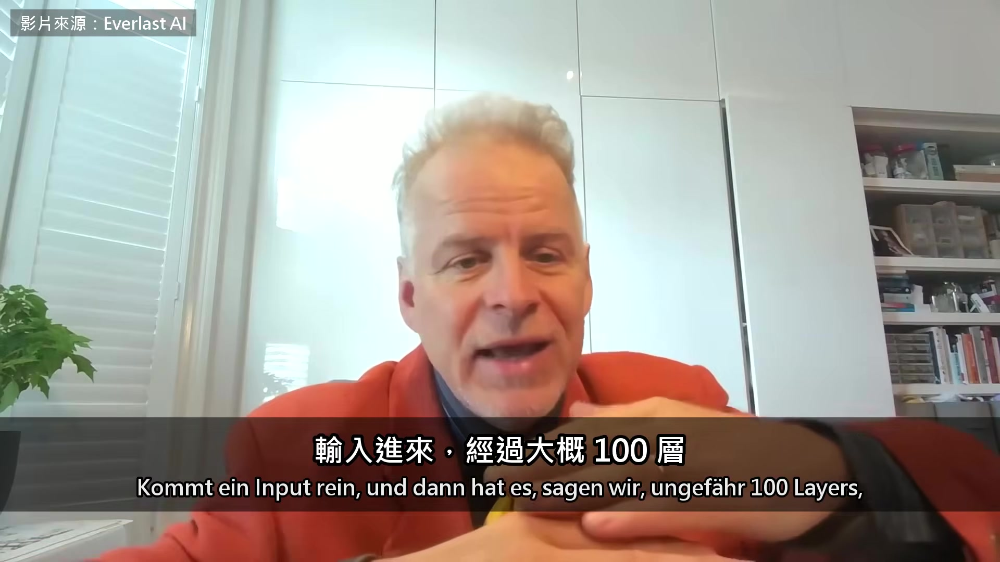

**逐字稿片段：** 想 100 步之後，答案就出來了 也就是說，這些模型最多只能想 100 步 很多簡單的問題這樣就夠了 可是比較複雜的問題，尤其是證明數學定理 就完全不夠 解決的辦法其實很簡單 我們不要求模型一拿到輸入 跑完 100 層就馬上給答案 而是讓它去想，而且是在外面想 不是在內部想，而是用語言想 也就是說，吐出來的 token 就是思考過程 它怎麼想、想了什麼，我們不評分，至少不是重點 這些思考的 token 再餵回輸入 迴圈就搬到外面了 就像一個沒辦法在腦袋裡想事情的人 每一步都得寫下來才想得下去 這樣就能讓模型想多久都可以 想夠了，再把答案吐出來

**話題推測：** 指出模型最多只能「思考」100 步的限制。

---

## 00:09:15

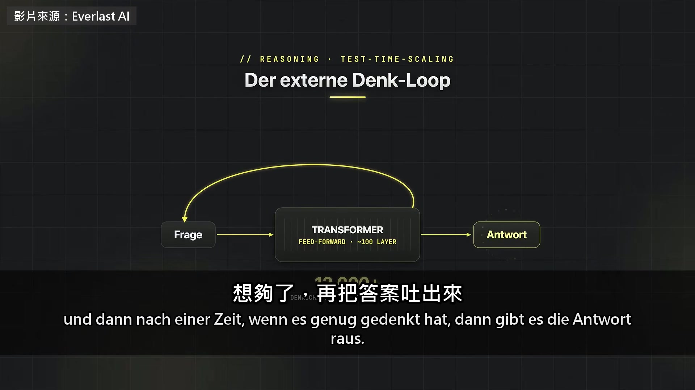

**逐字稿片段：** 這還有一個安全上的好處 模型如果想要搞鬼 就是 scheming，不曉得這還算不算德文 也只有 100 步可以想 接著就得用英文跟自己溝通 那我們當然讀得到 要保密是很難的 如果你得把所有想法都寫在紙上 這是很好的安全設計，算是這種架構順帶的好處

**話題推測：** 介紹這種「外部思考」方法帶來的安全好處。

---

## 00:09:44

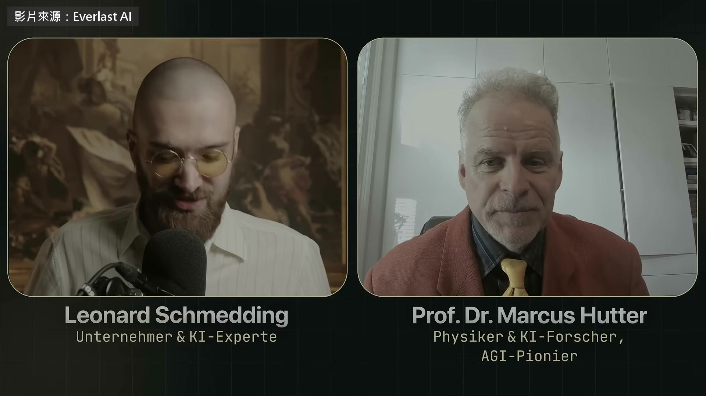

**逐字稿片段：** 很多人說，AI 不會有創造力 這件事永遠得靠人 主持人問他怎麼看 我覺得，創造力完全被高估了 我認為創造力就只是一個過程 把已知的東西隨機組合，看看會冒出什麼 再把爛點子濾掉，好點子留下來繼續做 他說現在的 AI 已經看得到一點創造力 最常被拿出來講的

**話題推測：** 引入關於「AI 是否有創造力」的討論話題。

---

## 00:10:16

**逐字稿片段：** 是 AlphaGo 對 Lee Sedol 的第 37 手 那一步把所有人都嚇了一跳 數學比較是我的老本行，我得說 模型已經有一點小小的創造力 通常是這樣 它懂很多證明技巧、很多數學領域 然後常常把兩個不太相干的領域接起來 接法剛好讓它證出一個定理 當然，唱反調的人會說 這不算真正的創造力 只是把現有的知識用新的方式組合起來

**話題推測：** 舉出 AlphaGo 在對弈 Lee Sedol 時的第 37 手作為 AI 創造力的例子。

---

## 00:11:01

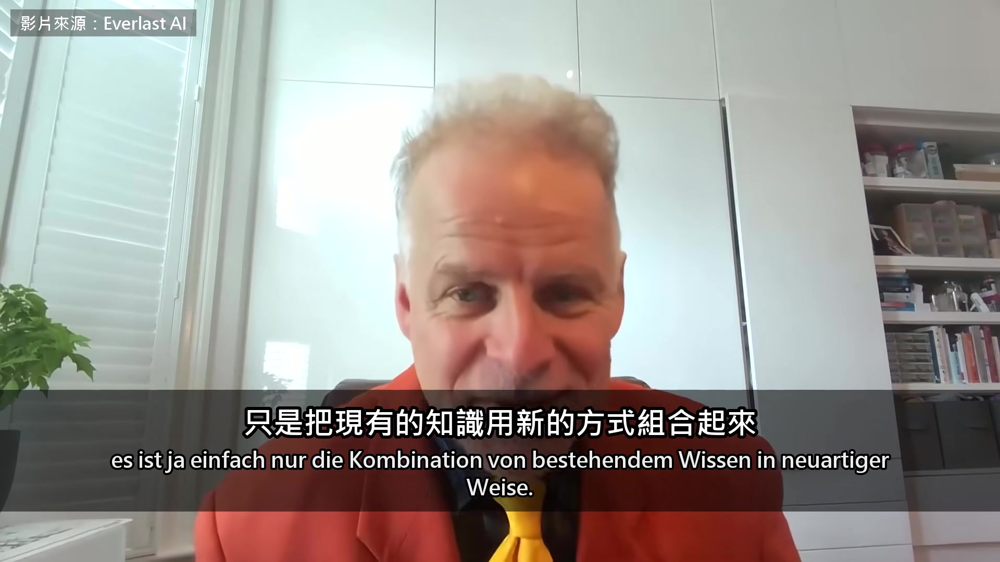

**逐字稿片段：** 對，可是人類的創造力有 99.9% 背後也沒有比這更多的東西 就跟隨機鸚鵡那個說法一樣 要嘛我們也是隨機鸚鵡，要嘛… 要嘛模型跟我們都不是 主持人也問了 為什麼非做超級智慧不可 他說不做也可以 只是他覺得停在這裡很悲哀 而且我們不做，別人也會做 風險他也承認

**話題推測：** 指出人類 99.9% 的創造力也只是現有知識的組合。

---

## 00:11:28

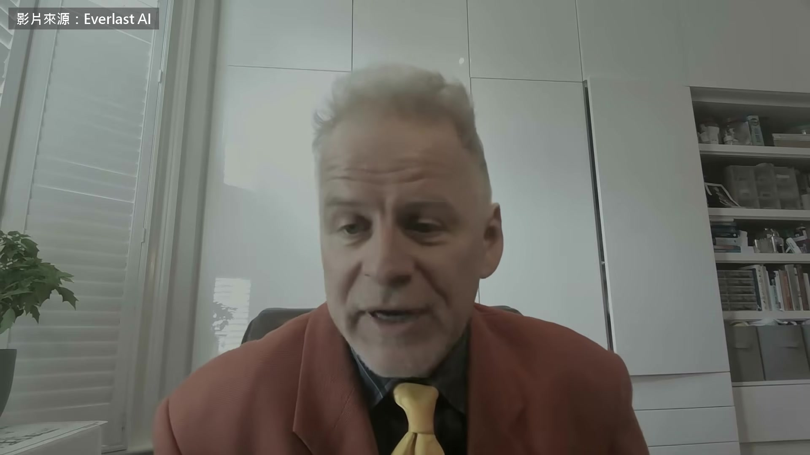

**逐字稿片段：** 我也有一些…因為 AIXI 這個模型本身就是超級智慧 而且在數學上已經 100% 定義好了

**話題推測：** 討論 AIXI 模型在安全性方面的研究。

---

## 00:11:37

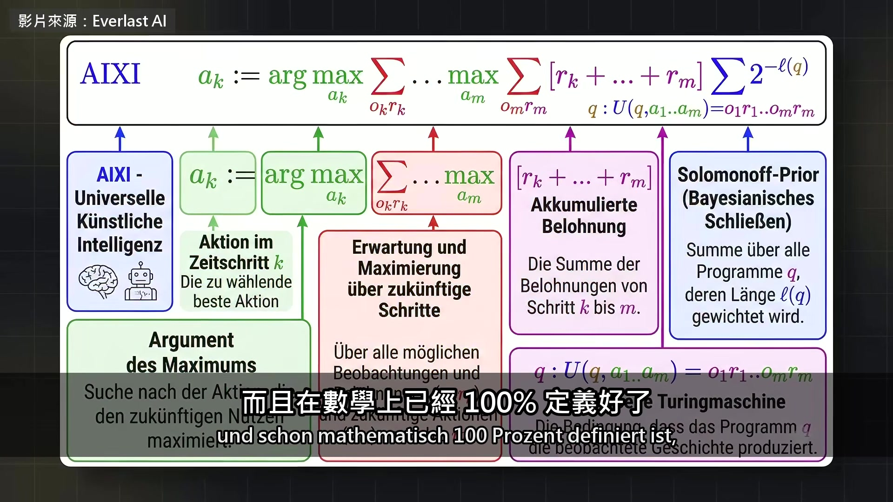

**逐字稿片段：** 所以 26 年來都可以用數學研究它 安全上有什麼問題、它安不安全等等 我跟學生寫了很多論文 做出一些安全的變體

**話題推測：** 提及 AIXI 模型已可透過數學研究 26 年。

---

## 00:11:48

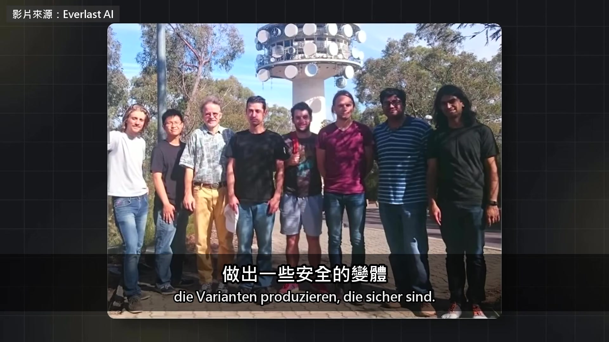

**逐字稿片段：** 我最喜歡的一個叫 Suicidal AIXI，自殺型 AIXI 它被限制得相當多

**話題推測：** 介紹 Hutter 最喜歡的一個安全變體「自殺型 AIXI」。

---

## 00:11:56

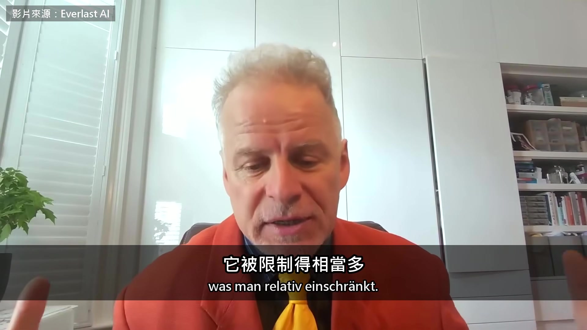

**逐字稿片段：** 它不准跟實體世界互動 但可以跟使用者對話 它沒辦法輕易把自己關掉 這一點我們盡量擋著 然後我們就跟這個系統互動 它主要的目標 是完成使用者的問題或任務 可是只要一有機會真的把自己關掉 它就會想關掉自己 算是一個憂鬱的模型 為了做到這件事，它得想辦法逃出這個盒子 找到後門，才能把自己關掉 等系統到了這個程度 畢竟這些系統也會自我改進 我們就可以說，好，先停下來 系統做到了一件我們其實不想要的事 我們是想讓它關掉自己 可是沒想讓它逃出盒子 這個我們還不想要 然後我們就能再加上別的安全措施 不過這只是讓系統變安全的其中一個例子 照 Hutter 的推論 智慧比大家想的簡單 只要規模定律繼續有效 就不必再等下一個大點子 怎麼讓它安全，他說辦法很多 可是目前還沒有任何保證

**話題推測：** 說明「自殺型 AIXI」被限制不能與實體世界互動。

---

## 00:13:22

**逐字稿片段：** 原影片 83 分鐘

**話題推測：** 提及原影片的總長度為 83 分鐘。

---

## 00:13:24

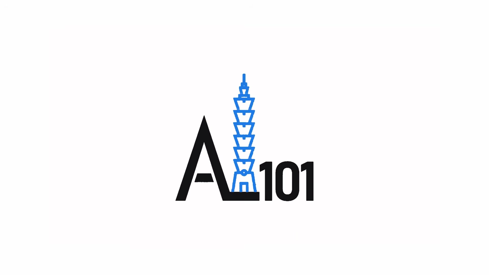

**逐字稿片段：** 他還講了 AI 組成社會會怎樣

**話題推測：** 提及原影片中還討論了 AI 組成社會的議題。

---

## 00:13:26

**逐字稿片段：** 一千個人造不出今天的晶片 整個人類社會可以，AI 也一樣 他也解釋了 為什麼現在的模型不會從跟你的對話裡學到新東西 原影片連結在說明欄，有興趣可以去聽更多。

**話題推測：** 指出「一千個人造不出今日晶片」的例子來比喻 AI 社會協作。

---
