# ai-note-101_SPdIOcxARkQ — 關鍵畫面索引

- 來源逐字稿：[ai-note-101_SPdIOcxARkQ_GT.srt](ai-note-101_SPdIOcxARkQ_GT.srt)
- 影片：https://www.youtube.com/watch?v=SPdIOcxARkQ
- 截圖數：17

## 00:00:32

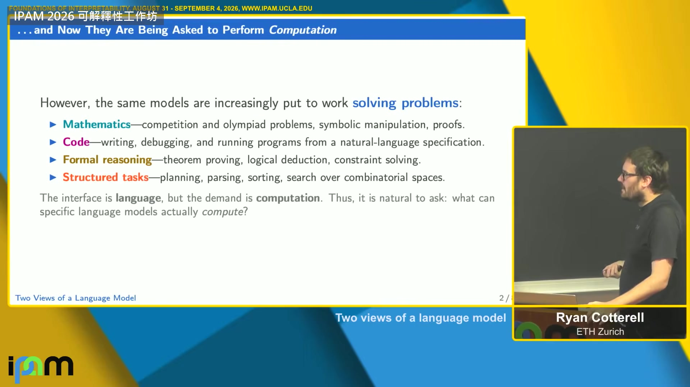

**逐字稿片段：** 這場大部分時間我都在問一件事：一個語言模型到底算得動什麼 這是第九集 題目是：語言模型的兩種看法

**話題推測：** 介紹演講主軸：語言模型如何執行計算。

---

## 00:00:43

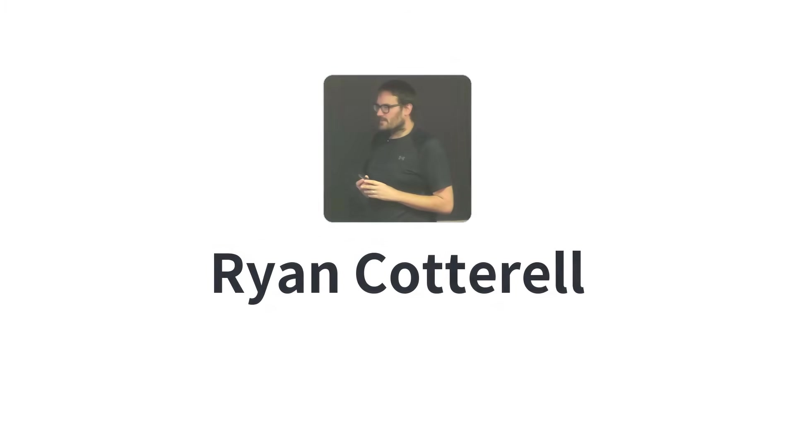

**逐字稿片段：** 講話的人叫 Ryan Cotterell 蘇黎世聯邦理工學院的教授 專門拿形式語言理論去量神經網路的能耐 這場會引用到的定理 有好幾個是他跟學生證出來的 最新的一個今年才發表 他自己說，整個工作坊裡做這一行的 大概只有他一個 要懂我怎麼看這件事，有一則很棒的 xkcd 漫畫 我解釋一下為什麼好笑，你們可能看不清楚 主角把一個子集合加總問題，NP 完備的，編碼成點餐 他們把一個難題編進了自然語言裡 我看我們拿語言模型做的一些事，差不多就是這樣

**話題推測：** 介紹講者 Ryan Cotterell 及其研究領域。

---

## 00:01:23

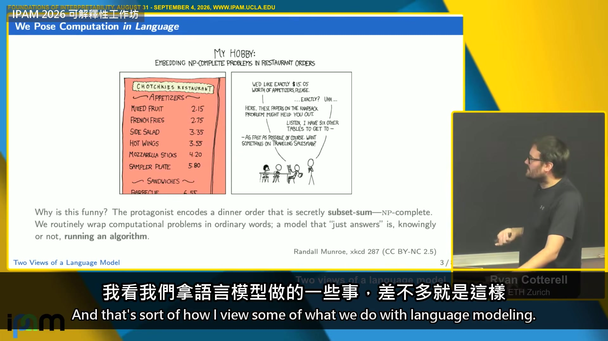

**逐字稿片段：** 好，先講一下用詞 這場我會說「計算」，不說「推理」 雖然圈子裡「推理」流行得多，大家都講推理 我覺得「計算」是更貼切的字 為什麼這樣想不在這場的範圍內，休息時間我很樂意解釋 所以我會講計算 就像題目說的，我們會用兩種方式看一個語言模型 我先從第一種開始，機率分布的觀點 然後大部分時間是計算模型的觀點，也就是把語言模型看成在執行一個演算法 好，先進統計的觀點 演講跟討論裡常見的狀況是：很少有人替語言模型給一個數學定義 所以我從這件事開始

**話題推測：** 澄清演講中使用的術語：「計算」而非「推理」。

---

## 00:02:17

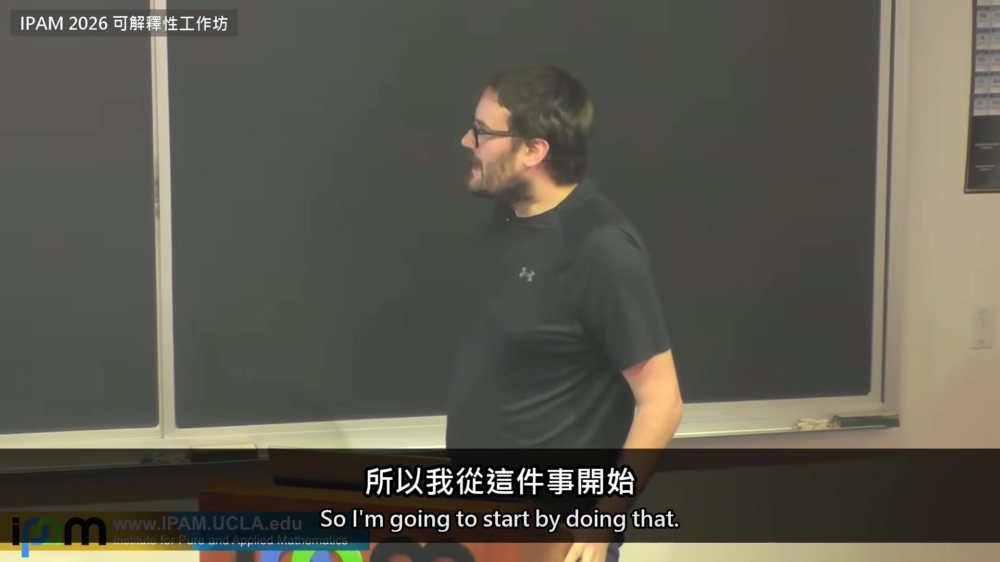

**逐字稿片段：** 在那之前，先講一點形式語言理論的基本術語 字母表，通常寫成 Sigma，是一個有限、非空的符號集合 字串是從 Sigma 裡取符號排成的有限序列 資工很在乎 Kleene 閉包 它是所有字串的集合，其中 Sigma 0 定義成只裝著空字串的集合 空字串是唯一一條長度 0 的字串 配上串接這個運算，Sigma star 也就是自由幺半群 這是代數的看法 記號上，我用這個小下標，表示前面第 1 到第 t 減 1 個符號 這些是理論資工的基本詞彙

**話題推測：** 講解形式語言理論的基本術語，例如字母表、字串、Kleene 閉包。

---

## 00:03:07

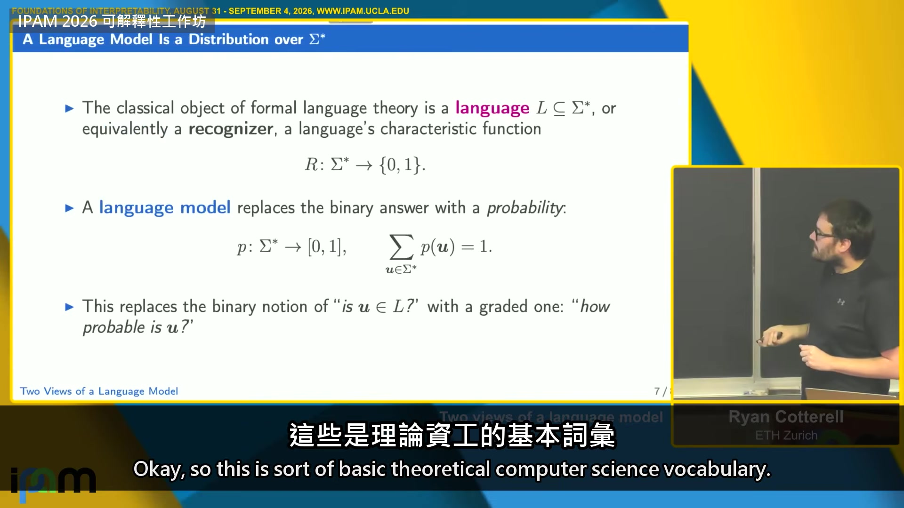

**逐字稿片段：** 形式語言理論跟複雜度理論裡一個經典的物件，叫辨識器 辨識器就是一個語言的特徵函數 語言是 Sigma star 的某個子集合，所以是一個從 Sigma star 到 {0, 1} 的映射 我們可以談一個語言的複雜度：不可判定的、正規的，這類的 語言模型，這是歷史上的定義，雖然很多現代論文忽略了它，就是 Sigma star 上的一個機率測度 我們把「這條字串在不在語言裡」放寬成「這條字串有多可能」 這就是我們要用的定義 有一個很常見的量，等一下會知道為什麼，叫前綴機率 我在 p 上面畫一個小箭頭，從左到右 意思是：隨機抽一條字串，它以 x 開頭的機率 把所有接法加起來就是了 有時候可以把它重新正規化成一個分布，有時候不行 另一個常用的是條件前綴機率 已經看到前綴 x 了，接下去是 y 的機率是多少 這是在鋪基本的記號 特別是這個量，很多論文都沒有好好寫出來 接下來進入我說的自迴歸分解 這比較接近你在機器學習論文裡會看到的 我們引進一個新符號，字串結尾 EOS，重點是它不在 Sigma 裡， 把「x 之後是 EOS」的機率定義成這個比值：字串 x 的機率，除以它的前綴機率， 這樣任何一個字串上的分布，都可以拆成一個符號接一個符號生成的機率 字串長度不固定，這點要處理 嚴格說，這裡的 n 其實是個隨機變數 講一點個人意見。常聽到有人帶點貶意地說：語言模型不過是下一個符號的預測器 對我來說，那不是定義 定義是這個字串上的分布 任何語言模型都可以這樣拆開 所以那是定理，不是定義 也有別的拆法：不從左到右，可以從右到左，或不按順序 我同事 Chu-Cheng 問過一個有意思的問題： 不是能不能拆，永遠可以拆， 而是這樣拆要付多少參數空間的代價，也就是精簡性，等一下會講 這樣拆你放棄了多少？ 再補一句：把語言模型定義成下一個符號預測器不好，是因為很多預測器根本不是語言模型 比方無限擲硬幣：一直丟，正面或反面， 這個測度給所有有限字串的機率是 0，全部的機率都跑到無限長的字串上 所以我很喜歡「Sigma star 上的分布」這個定義， 等一下會看到它跟「計算」怎麼扣在一起

**話題推測：** 介紹形式語言理論中的「辨識器」概念。

---

## 00:06:47

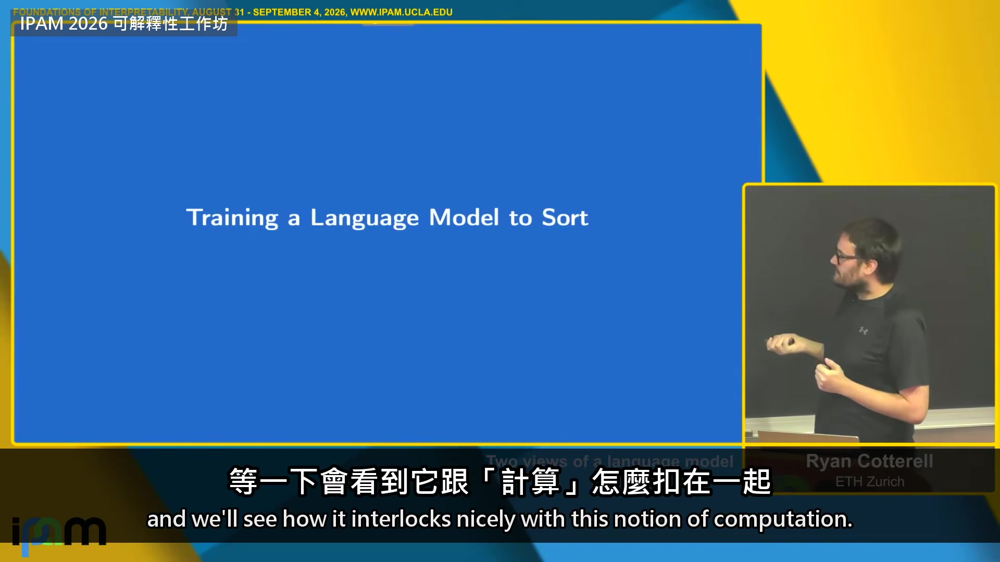

**逐字稿片段：** 現在來講訓練一個語言模型做排序 這是一個案例研究，講到最後會再回來，如果來得及 但它是個有用的思想實驗 為什麼是排序？ 因為排序毫無疑問是計算 資工的人最早學的演算法之一：氣泡排序、快速排序、分析 所以如果能說一個語言模型「會排序」，它肯定是在計算 這個問題比看起來難 記號上，Sigma 有 k 個不同的符號，再加一個分隔符號 前 k 個符號有一個全序，還有一個排序函數把它們排好 我訓練一個語言模型：抽一條字串當前綴，也就是要排序的那條， 接分隔符號，再接排好的版本，然後訓練語言模型去擬合這個分布 非常簡單

**話題推測：** 開始介紹案例研究：訓練語言模型做排序。

---

## 00:08:00

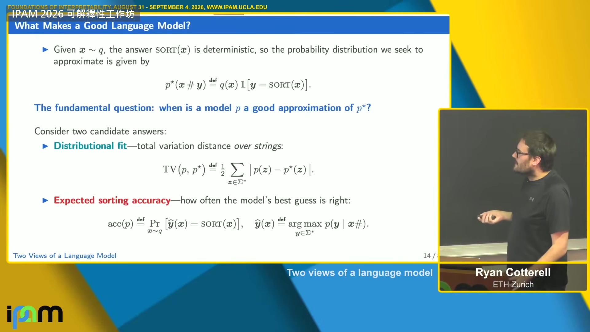

**逐字稿片段：** 你會問：假設我訓練一個語言模型去擬合這個分布 這是目標分布 這一塊是確定的，所以寫成指示函數 根本的問題是：我訓練的 p，什麼時候算是 p* 的好模型？ 有兩個可能的答案 一個是總變異距離，p 跟 p* 在分布上有多接近 另一個是期望排序準確率 算一下就知道總變異距離會界住期望排序準確率， 用 Pinsker 不等式還可以把 KL 拉進來， 反正排序準確率跟模型擬合真實分布的好壞有關 那如果 p* 擬合得很好，能不能說我們的語言模型 p 學會排序了？ 我的答案是：不能 因為我們講「演算法」的時候，至少在基礎資工裡，指的完全不是這個 不是「在高機率的那些輸入上能動」就好

**話題推測：** 提出問題：如何評估訓練的語言模型是否能有效擬合目標分布。

---

## 00:09:17

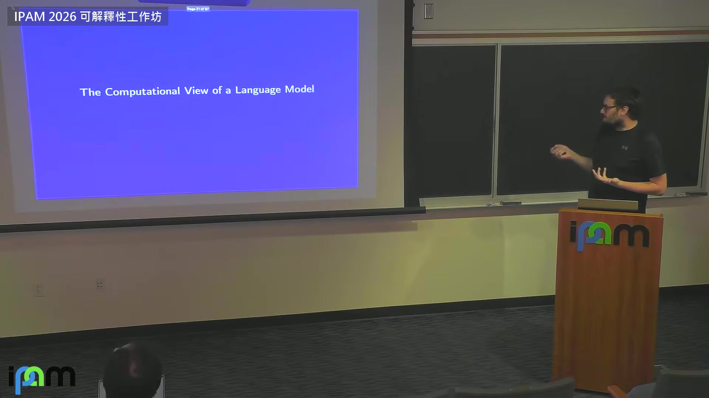

**逐字稿片段：** 這就帶到語言模型的計算觀點 我們要把語言模型看成在做計算，基礎資工那個意義的計算 所以它必須在所有輸入上都對，不只是高機率的那些 統計觀點問的是：這個模型預測得多好？ 平均情況預測得好不好？ 我們在乎的是典型的、高機率的輸入 計算觀點問的是：這個模型算的是什麼，怎麼算？ 這要求它實作的是正確的演算法 「正確」的意思是：資工系學生 上第一堂演算法課，考卷上寫正確性證明的那種正確 我說的正確是這個

**話題推測：** 轉入語言模型的「計算觀點」。

---

## 00:10:04

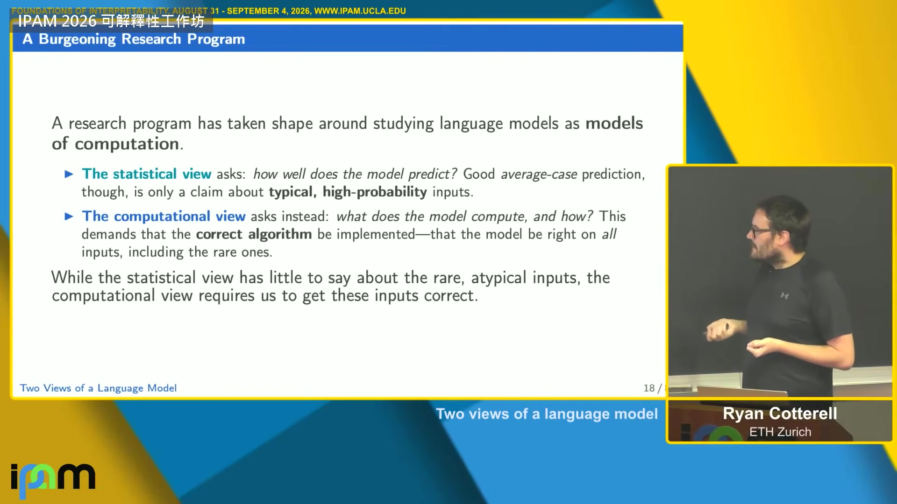

**逐字稿片段：** 統計觀點對罕見的、非典型的輸入，常常沒什麼可說的 現在進到第二個觀點：語言模型當成某種計算 怎麼從一個機率分布，變成一個會說是或不是的模型？ 因為我們要從剛才那個東西走到辨識器 我們要一個會計算的東西 天真的做法是：設個門檻就好 但這樣不好，語言裡永遠只會有有限條字串，太平凡了 我們玩過幾種：一種是自迴歸辨識 要求每一步的下一個符號都要過 epsilon 這個門檻 這可以做出無限的語言 也可以說：給一個 prompt，argmax 是什麼？ 這兩種都行得通，都給得出無限的語言 一旦定下接受的方式，也就是定下怎麼把一個字串上的分布拿來談計算， 就會冒出很多問題 第一，各種語言模型的表達力有多強？ 表達力的意思是：它們在 Chomsky 階層上落在哪 第二個，我最近很在乎的，是精簡性 先預告一下，第一題的答案，至少對 transformer 來說，是它們在 Chomsky 階層上非常低 它們是次正規的 表達力很弱的模型 但精簡性問的是：這個模型可以編得多小？ 意思是，這些表達力很弱的模型往往非常精簡， 等於我們學到的是一台非常非常大的有限自動機， 只是不是任意一台，有特殊的結構 但它是一台很大、表達力很弱的自動機 第三個問題比較後設：分析這些語言模型，該用什麼工具？ 我們要怎麼想它們？ 也許要用邏輯、代數，或電路複雜度 在進到這些好問題之前，有個更根本的事：我們要研究的形式物件到底是什麼？ 這很重要，因為一個真正的 transformer 是個很雜亂的東西 有限精度的算術、學出來的權重 還有一層層疊上去的工程設計選擇 我們得替這種 transformer 的理想化版本，給一個數學定義 我先說服你：連要開始這件事，都得先有 transformer 的數學定義 舉個例子 想像你手上有這個演算法 有些人可能認得，不認得也沒關係 假設有人就丟給你這段，你問：它在做什麼？ 該怎麼理解它？它是離散的 它是歐拉法，在近似這個微分方程的解 不一樣的地方在：微分方程是先來的 也就是說，這個演算法是拿來近似那個柏拉圖式的理想，我們真正在乎的那個數學物件 這樣我們可以做數值分析，分析這個演算法 但我們真正想懂的，是它在近似的那個東西 這很有用：只跑有限次迭代、用浮點數算， 都只是缺陷，能不處理最好 微分方程要是有漂亮的解析解，我們最開心 相反地，transformer 給我們的是完全相反的處境 它是以一個「能用的東西」的身分來到我們面前 不是某個既有物件的離散化 一個但書：Vaswani 那篇原始論文確實是用實數定義它的 但那只是機制，不是「它該算什麼、為什麼」 而且這代表，等一下會多講，在 transformer 裡，有限精度並不明顯是一種近似誤差 所以第一件事，是把那個缺掉的物件逆向工程回來，有個能推理的數學定義 這裡我們跳過三分鐘 他把 transformer 的正式定義走了一遍 只要記得一步 attention 先替每個位置打分數 再用 softmax 把分數變成權重 他接下來動的就是這一步 文獻裡常見兩種理想化 一是有界精度，二是硬 attention 精度是非常非常重要的事 我的學生 Franz 也在場，他花很多時間想這個 重要是因為：實際硬體上跑的每一個 transformer 都是有限精度 但很多分析裡，你願意假設哪種精度，結果會差很多 最常見的選擇是用有限精度 意思是：transformer 裡的浮點數不是近似，那就是我要的 或者說有 log n 精度：輸入變長，位元也跟著變多 為什麼在乎精度，等一下有一頁： 如果允許任意精度，可以證出一堆圖靈完備的結果 問題是那些結果不反映我們認為 transformer 做得到的事 那不是幫得上忙的理論 所以這是個很重要的選擇 至於硬 attention，我們常把 softmax 換成溫度趨近零的極限 這是為了數學上方便 這樣證定理容易得多，架構其他部分都不用動 接下來講的結果都是硬 attention 的 transformer 但在某個程度上可以推廣 這場我希望你帶走的一件事：精度很重要 很多人會引 Pérez 那篇，很好的論文，叫〈Attention is Turing Complete〉 或是 RNN 那邊更早的 Siegelmann 跟 Sontag 但那些證明，你去看，是用有理數去編碼圖靈機的磁帶 一個有理數可以有任意長的位數，所以能裝下一條圖靈機磁帶 這是學不出來的 沒有哪個 transformer 會拿單一個有理數去編碼一條圖靈機磁帶 讀完那些證明，你不會覺得解釋了什麼 所以我們限制精度，避開這些幾乎平凡、幫不上忙的結果 不過這留下一個開放問題：我們該用哪一種算術模型 硬 attention 則是另一個理由 它讓分析容易，雖然等一下也會講一點有些理論怎麼處理 softmax， 講硬 attention，我們就能開始證一些比較容易的定理 而且我們喜歡這些定理 不把它當成無關緊要，是因為有些定理把 transformer 接到了很成熟的複雜度類 有點巧：transformer 就算在這些理想化底下，也重新發現了一些經典的計算理論 我們會考慮三種：第一種是軟的 文獻裡叫 SMAT，softmax attention transformer 那個 A 就是 attention。這不是理想化，就是原版 有 UHAT 就是只取一個 argmax；平手怎麼處理有講究，等一下講 平手怎麼破很重要 還有 AHAT AHAT 是取低溫極限，在所有最大的位置上平均 三種 attention UHAT 要注意：平手的處理很重要 argmax 不只一個的時候，你怎麼破平手，會改變結果 各種結果其實都很有意思，都是很自然的類 但這麼小一個細節就把分析改變很多，很有趣 我想講一點形式語言理論 特別是等一下會講到的 star-free 語言，大學部課程裡沒有 它比較偏 很多資工的人，甚至大多數，學過 Chomsky 階層 我們可以分類。剛說過辨識器 可以照複雜度把語言分層 分成一個階層，因為有不同的機器，複雜度一層層往上 來接受它們 比方正規語言：a*b*，或是 parity，數個數 mod 2 上下文無關但不正規的，注意這是階層，正規的都是上下文無關的 像括號配對，像 Python，那是上下文無關 再上去是上下文相關，然後是圖靈機的遞迴可枚舉 這就是經典的 Chomsky 階層 大結果是：固定精度的 transformer 基本上是次正規的 它們接受的是正規語言以下的類，很出人意料，因為我們想的是那些又大又強的語言模型 你會以為它們像圖靈機，但據我們所知不是 它們非常非常弱 次正規語言就是包含在正規語言裡的某一類 這裡要講的是 star-free 語言 我會給幾種刻畫，時間不夠可能跳幾個 大方向是：star-free 語言做不到的事，是數 mod 2，或者任何 k 的 mod k Michael Hahn 2020 年那篇論文開了頭 他證明 transformer 不會數 mod 2 這裡不談思考鏈，那會補強一些 但基本的 transformer 不會數 mod 2 想談表達力的話，這是個問題 star-free 是那種有很多等價刻畫的類，所以大家喜歡它 讓人覺得這是個自然的類 想想確定型有限自動機的經典定義：有限個狀態，一張轉移圖 這種機器接受的是正規語言 一個語言是 star-free，就是這台機器是非週期的 也就是它的轉移幺半群，術語，沒有非平凡的置換 所以像數 mod 2 這種，就不是 star-free 另一種講法是正規表示式 Kleene 定理說它等價於正規語言 我們在命令列常用到 它有三個運算：聯集、串接、Kleene 星號 star-free 正規表示式就是拿掉星號，名字從這來，再加上補集 這是這個類的另一種刻畫 整個 Sigma star 是 star-free 的，因為它是空集合的補集 但像 parity 就不是 還有幾種邏輯的刻畫 在有限結構上的邏輯裡，star-free 語言剛好就是一階邏輯定義得出來的那些 資工裡另一個流行的邏輯，線性時序邏輯，也刻畫它們 這就是 star-free 語言的快速導覽 這個類有好幾種刻畫 希望你帶走的是：有這麼一個次正規的類 表達力更弱，包含在正規語言裡 有很多等價的刻畫，所以它不算冷門，我們認為它很自然 而 transformer，至少某些種類的 transformer，跟這個類連在一起 為什麼事後看，你本來就該預期 star-free 跟 transformer 有關係 因為線性時序邏輯的「過去」算子，想像從左到右讀一條字串，它問的是：我後面有沒有某個條件成立過？ 直覺上這就像 attention 這是那個證明的精神

**話題推測：** 比較統計觀點和計算觀點對語言模型的要求。

---

## 00:23:57

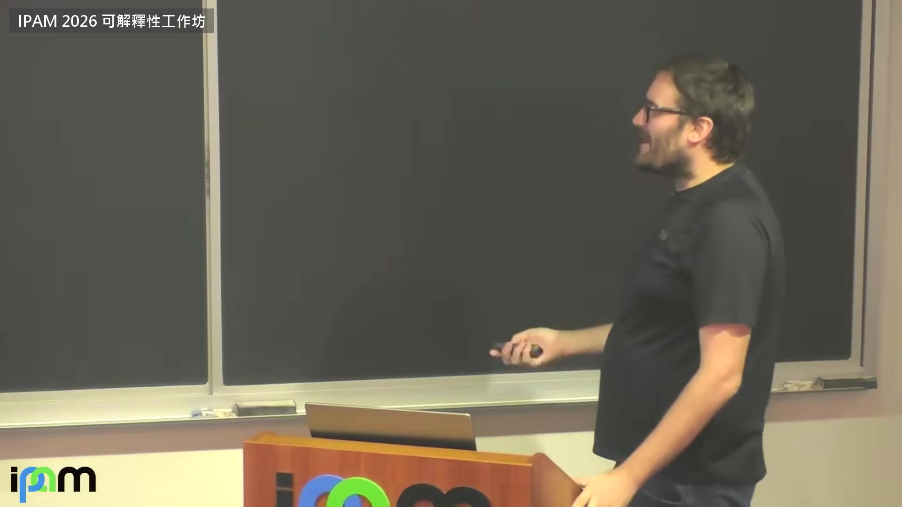

**逐字稿片段：** 第一個結果是關於 UHAT 定理之前，再看一次這張圖：unique hard attention 就是只挑一個的那種， 得到的定理，Dana Angluin、Andy Yang、David Chiang 證的： UHAT 認得一個語言，若且唯若它是 star-free 這個版本對 UHAT 不需要任何精度假設 我也沒說用哪一種辨識模式，好幾種都成立 為什麼 2024 年這是個驚人的結果：我剛用 star-free 的導覽鋪過， 只要把 attention 改成只挑一個，transformer 就跟這個非常成熟的形式語言類對上了 很有意思。誰想得到？非常意外

**話題推測：** 呈現關於 UHAT (Unique Hard Attention Transformer) 能辨識 star-free 語言的定理。

---

## 00:24:59

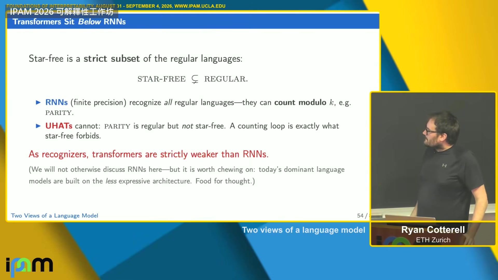

**逐字稿片段：** 對照一下：循環神經網路，我說它們是正規的 有一些圖靈完備的證明，但都非常依賴任意精度那套 有限精度的 RNN，很容易證明它們認得的剛好是正規語言 這是有人證過的 為什麼這有意思 有限精度的 RNN 跟正規語言關係很深 Marvin Minsky 在五〇年代就對另一種 RNN 證過 有意思的是：transformer 嚴格弱於 RNN 等一下會回來給一部分解釋：為什麼是這個更弱的模型變成主流？ 很反直覺 可平行化是一種解釋，我會給另一種你可能覺得有意思的 還能畫得更細：玩不同種類的 attention，可以對到 star-free 底下的子類

**話題推測：** 將 UHAT 的表達能力與循環神經網路 (RNN) 進行比較。

---

## 00:26:06

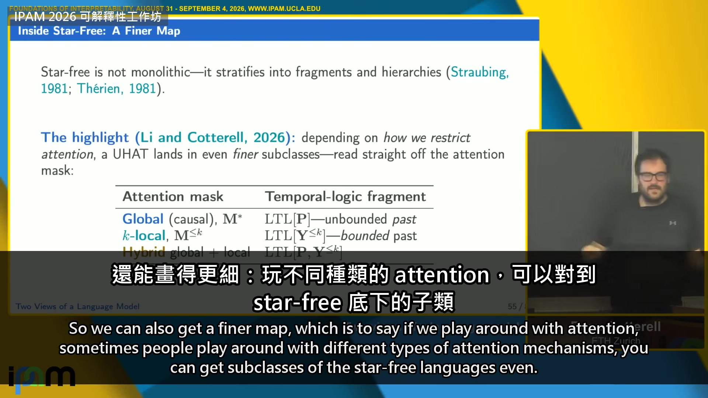

**逐字稿片段：** 我跟學生最近一篇論文：不同的 attention 限制，對應到 star-free 不同的子類

**話題推測：** 提出不同 attention 限制對應到 star-free 語言不同子類的研究成果。

---

## 00:26:18

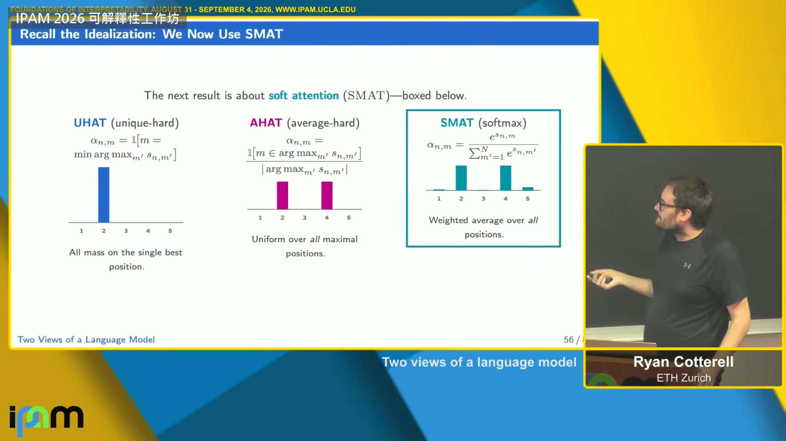

**逐字稿片段：** 另一個結果是 SMAT 的，softmax attention 的 transformer 如果是有限精度，也就是接受有限精度這件事，它們對應到 R-trivial 語言 這是 star-free 的另一個子集 很接近只用「過去」算子 P 的線性時序邏輯定義出來的語言 這些構造很有意思，但得把所有浮點數列舉出來 不過還是有用的刻畫 所以就算是 softmax，也證得出定理 接下來簡單介紹電路複雜度，才好講 AHAT 的結果 arXiv 上最近有一篇我很喜歡的論文，Kolaitis 跟 Sengupta 寫的， 問的是：為什麼布林電路會是看 transformer 的那副眼鏡 這一套在很多方面已經成了主流， 等一下會講它跟 star-free 語言的關係 補一點歷史： 布林電路在八〇年代特別紅，因為很適合描述平行演算法 它屬於描述複雜度理論那一支 所以說來也自然：transformer 當初就是因為能平行化才被選上， 這個研究平行演算法的好工具，拿來看它剛好合用 簡單介紹幾種電路，因為電路複雜度這領域有點像字母湯 我們在乎兩類電路 一個叫 AC0，一個叫 TC0 AC0 就是你想像中的電路 AND、OR、NOT 閘，每個閘可以接任意多條輸入，輸入長度固定 電路族等一下講 TC0 是 AC0 再加多數決閘。也就是它會數數 八〇年代一個經典結果：AC0 是 TC0 的真子集 具體來說 parity，數 mod 2，不在 AC0 裡 記得講 star-free 語言時提過數 mod 2，等一下會接回來 在那之前，先多講一點電路 電路可以推廣成吃字串當輸入 但一個電路只吃固定長度的輸入，比如長度 n 的位元字串 所以要認一個語言，需要一整族電路，每個長度各一個 這裡有個退化的狀況要特別提：既然是一族各管一種長度的東西， 就得想清楚它們是怎麼造出來的 得有一台機器，替每個長度把電路吐出來 不然一不小心，連不可判定的語言都造得出一族電路來認 意思是：如果不要求這一族一致， 每個長度都可以放任意一個電路，能偷塞的東西就太多了 通常的規定是：由一台類似圖靈機的東西，替每個長度吐出電路， 而且這台圖靈機能跑多久有上限 說 DLOGTIME 一致， 意思就是：一台在對數時間內跑完的確定型圖靈機，輸出長度 n 的那個電路 對 n 來說是對數時間 要把兩個觀點接起來：star-free 語言剛好就是落在 AC0 裡的那些正規語言 從這裡開始合起來了 鋪這些術語，是為了講 AHAT，average hard attention，還有 SMAT 的結果 有 log 精度的話，SMAT 跟 AHAT 認得 TC0 裡的很多東西，不是全部 上界是 TC0 這是 David Chiang 最近的結果 既然是上界，任何超出 TC0 的事，transformer 做不到 可以再推一點 我跟一個學生換了一個一致性條件，可以拿到整個 TC0 但要加一些填充、一些深度、一些迴圈 熟 transformer 文獻的話，就是那幾種調整，拿到反方向 一句話：精度一旦跟著長，就能從 AC0 走到 TC0 簡短講一下精簡性 然後進到玩具實驗，我的排序例子 精簡性談的是：一種形式機器可以把某個語言表示得多小 說一種形式比另一種精簡，是找得到一族語言， 第一種只要 n 個位元，第二種要 2 的 n 次方個位元 經典例子很多人看過：確定型跟非確定型有限自動機 確定化可能讓機器爆大，反過來不會 可以證明這是緊的：非確定性有時能把機器縮小 我們證出來的是：UHAT 認得 star-free 語言， 而且有 star-free 語言，UHAT 認得，DFA 卻要 2 的 2 的 n 次方個狀態 這開始像個解釋了 更驚人的是，跟 RNN 比，它們可以精簡到指數級 在這個軸上，一個 transformer 可以很緊湊地裝下一個非常大的 RNN RNN 能表達的它不是都能 但在兩邊都做得到的那一類裡，它可以非常精簡 這也許就解釋了為什麼我們喜歡 transformer AHAT 這邊大多還開著 UHAT 的結果是我們今年剛發表的 AHAT 精簡到什麼程度我不知道，完全開放 這對機械可解釋性的意思是：如果接受 UHAT 模型， 形式上做機械可解釋性是 EXPSPACE 困難，更正，EXPSPACE 完備 某種意義上比 NP 困難還難 所以在這些理想化底下，不會有通用的高效演算法來做機械可解釋性 退一步說，我這麼喜歡精簡性，一部分是因為有些實驗結果很難解釋， 為什麼 transformer 模擬 RNN 反而更好，明明 RNN 表達力更強 精簡性對我們來說也許是更好的答案 我們還在用更受控的實驗看這件事 最後講點哲學的 收一收，因為前面趕著講了一堆很硬的技術結果

**話題推測：** 介紹 SMAT (Softmax Attention Transformer) 在有限精度下對應到 R-trivial 語言的結果。

---

## 00:33:52

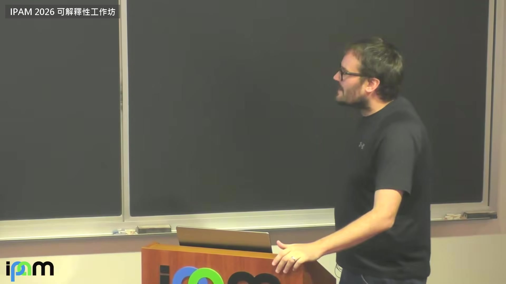

**逐字稿片段：** 把 Chomsky 請進來 一點語言學，我覺得好玩，而且大家都有意見

**話題推測：** 引入喬姆斯基的語言學觀點。

---

## 00:33:59

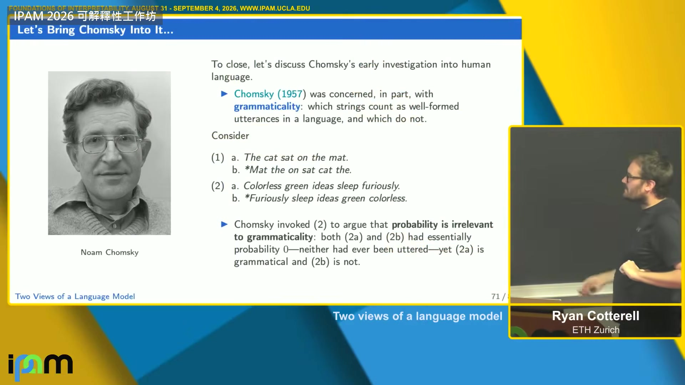

**逐字稿片段：** Chomsky 最有名的東西之一是「合語法」這個概念 他會說：大多數說英文的人會同意，「貓坐在墊子上」是合語法的句子， 「墊子 那 上 坐 貓 那」不合語法 他很在乎這件事，連沒意義的句子也是，他有名的例子：無色的綠色想法狂暴地睡著 他說這句沒意義，但合語法；反過來排就不合語法 1957 年他就主張，也因此被抓住把柄： 句子的機率無關緊要，因為 A 跟 B 分不開，他認為兩句的機率都是 0 但合不合語法，會英文的人都有直覺 所以五〇年代他就公開說過：別做語言模型 更精確一點，他說的是：那不是我在乎的問題 等一下會看到為什麼這有關 1965 年另一本名著《句法理論的面面觀》，他講了另一個區分，我認為對機械可解釋性很重要 就是「能力」跟「表現」 「貓吃掉的老鼠死了」，大家都聽得懂 但一直往中間塞：「那個人養的狗追的貓吃掉的老鼠死了」，很難講，很難解析 子句一層套一層，人類非常吃力 他的論點是：第三句還是合語法，人類吃力是因為我們在自己的神經網路上跑英文，而那不是很好的模型 硬體不太好 這後來在語言學某些角落演變成一場筆戰 我想拿的是：他把「能力」，懂英文的語法， 跟「表現」，人用有限的記憶體怎麼處理語言，分開了 我要說，語言模型有一樣的能力跟表現問題 理想化的 transformer，比如 log 精度的那種，是能力層次的分析 但實際觀察一個固定精度的 transformer，就是表現的問題，它會不管用 等一下用實驗結果給你看 把電路理論接回來：我有兩個理想化的 transformer，忠實地實作出來 我真的寫了 UHAT 跟 AHAT UHAT 不能排序，AHAT 可以 我手寫了一個排序完全正確的 transformer，編譯成 AHAT UHAT 則是從資料學出來 最後看幾張圖 訓練出來的 UHAT 表現不錯，期望值上排得很好 手寫的 AHAT 也是 但兩個都沒辦法推廣到更長的輸入，理由不同 AHAT 是因為固定精度讓它跑不動自己的演算法， UHAT 則是根本沒學會那個演算法 它表達不出那個演算法 這個訓練出來的整體準確率是 95%，但隨長度增加就掉下去， 這些是趕出來的，數字可能沒完全對齊，但它擬合資料擬合得很好 只看這個結果，我們會說：它學會排序了， 而這是手寫的 transformer，最後也掉下去，準確率 97，差不多， 這一個可證明它實作了排序，但兩者的實驗特徵幾乎一樣 這就是我要說的能力跟表現的區分 重點是：你可以把資料擬合得很好，卻沒學會演算法 反過來，你可以學會演算法，卻還是排不好，執行的時候表現還是不好 這個區分很有意思：想機械可解釋性要找的是哪一種解釋時，這個區分很重要 收尾，比較好玩的哲學註腳：Chomsky 這個老想法，撇開語言學那場筆戰， 正是我們分析 transformer 時碰到的問題， 我們怎麼知道表現差是固定精度的問題，還是根本沒學會演算法

**話題推測：** 討論喬姆斯基的「合語法」概念及例子。

---

## 00:38:48

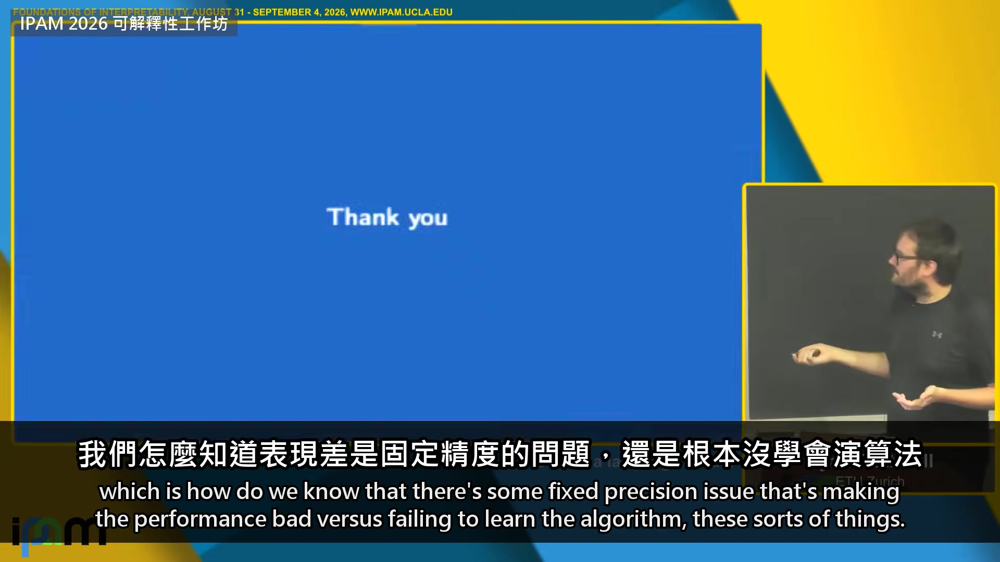

**逐字稿片段：** 整場收成兩句 第一，擬合得好不等於學會演算法 平均 95 分的模型 可能根本沒學會排序 從成績曲線上還看不出來 第二 transformer 能算的東西很少 卻把同樣的東西寫得非常短 短到找不到通用又有效率的方法 把它完整驗一遍

**話題推測：** 總結演講的兩個主要論點：擬合不等於學會演算法，以及 Transformer 的計算能力與精簡性。

---

## 00:39:06

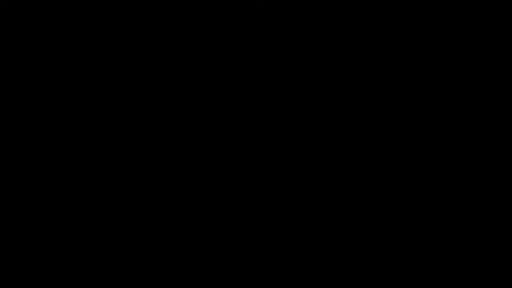

**逐字稿片段：** 下一場是柏克萊的統計學家 Bin Yu 這場的主張是 一個有瑕疵的可解釋性方法 比黑箱還危險，因為它給你假的安全感 所以可解釋性方法要分級 像排行榜一樣：哪些方法有證據 哪些沒有 證據長這樣 從果蠅的基因裡找出 20 組交互作用 文獻裡的實驗證實其中八成是真的 原影片連結在說明欄，整場 45 分鐘，有興趣可以去聽更多。

**話題推測：** 預告下一場演講的講者 Bin Yu 及其關於可解釋性方法的觀點。

---
