# ai-note-101_SgkvkPPlitk — 關鍵畫面索引

- 來源逐字稿：[ai-note-101_SgkvkPPlitk_GT.srt](ai-note-101_SgkvkPPlitk_GT.srt)
- 影片：https://www.youtube.com/watch?v=SgkvkPPlitk
- 截圖數：22

## 00:00:04

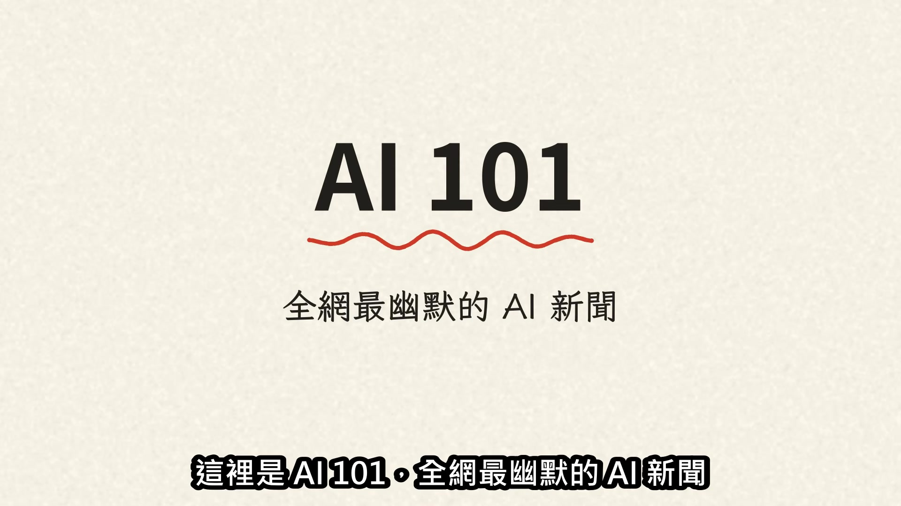

**逐字稿片段：** 日本聲優 Kenjiro Tsuda 打輸了 AI 仿聲官司：

**話題推測：** 介紹日本聲優津田健次郎與AI的官司主題

---

## 00:00:08

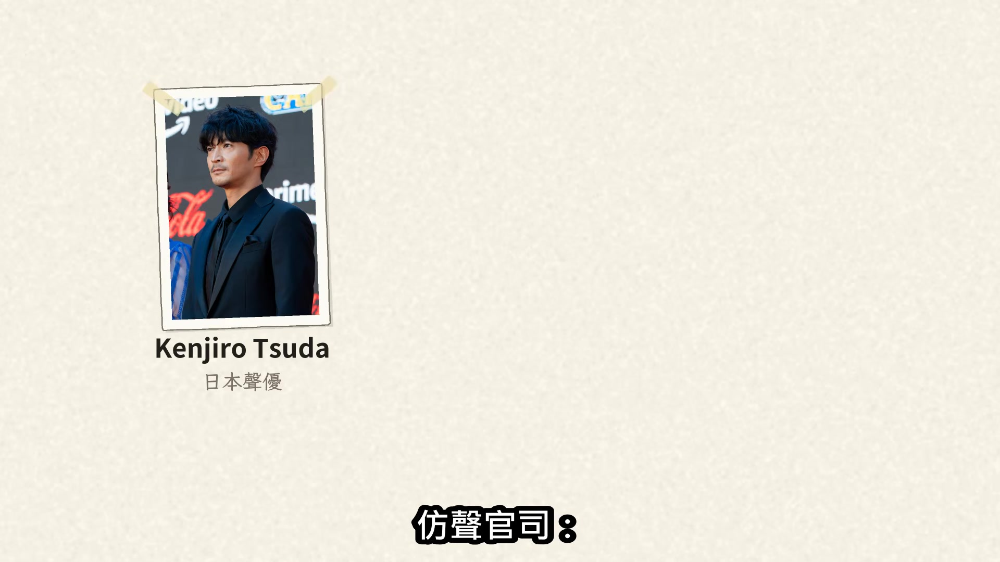

**逐字稿片段：** 9月30日，東京地方法院駁回他的請求 可是同一份判決裡，法院首次講明 人的聲音也可能受到保護 Tsuda 輸了官司，卻留下了首次司法判斷 法院到底怎麼說？ 判決裡最關鍵的一句是：

**話題推測：** 東京地方法院駁回津田請求的具體裁決時間與結果

---

## 00:00:24

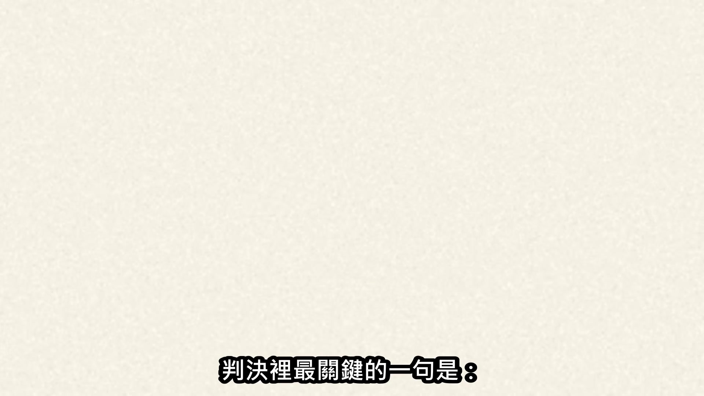

**逐字稿片段：** 人的聲音跟肖像一樣，是個人人格的象徵 所以只要聲音有吸引顧客的力量 它帶來的商業價值 就可能受到公眾形象權保護

**話題推測：** 判決中關於「人的聲音是個人人格象徵」的關鍵語句

---

## 00:00:35

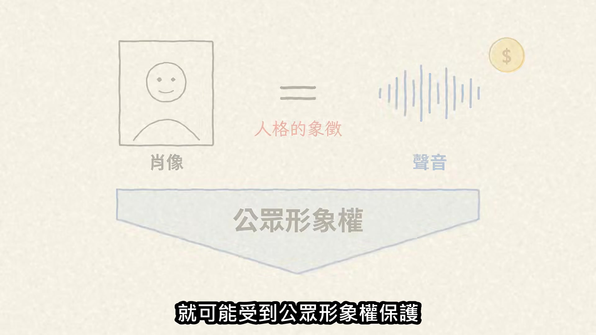

**逐字稿片段：** 那 Tsuda 的聲音有沒有這種吸客力？

**話題推測：** 轉向討論津田健次郎聲音的「吸客力」及商業價值

---

## 00:00:38

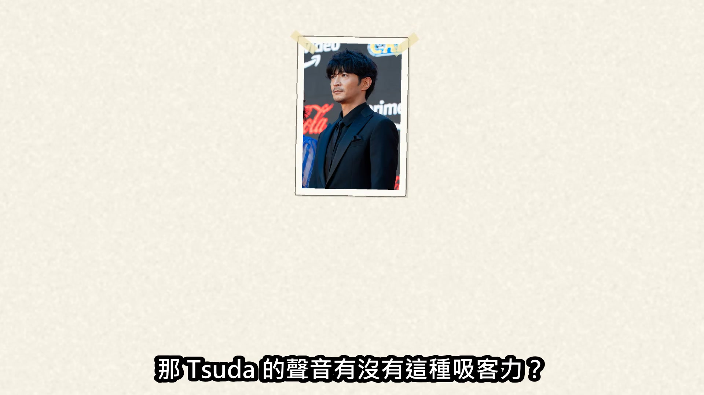

**逐字稿片段：** 他配過《咒術迴戰》的七海建人、 《遊戲王》的海馬瀨人 那副辨識度極高的低沉嗓音 撐起他的職業形象和商業價值 就是他的招牌

**話題推測：** 列舉津田健次郎配音的代表性角色與作品

---

## 00:00:48

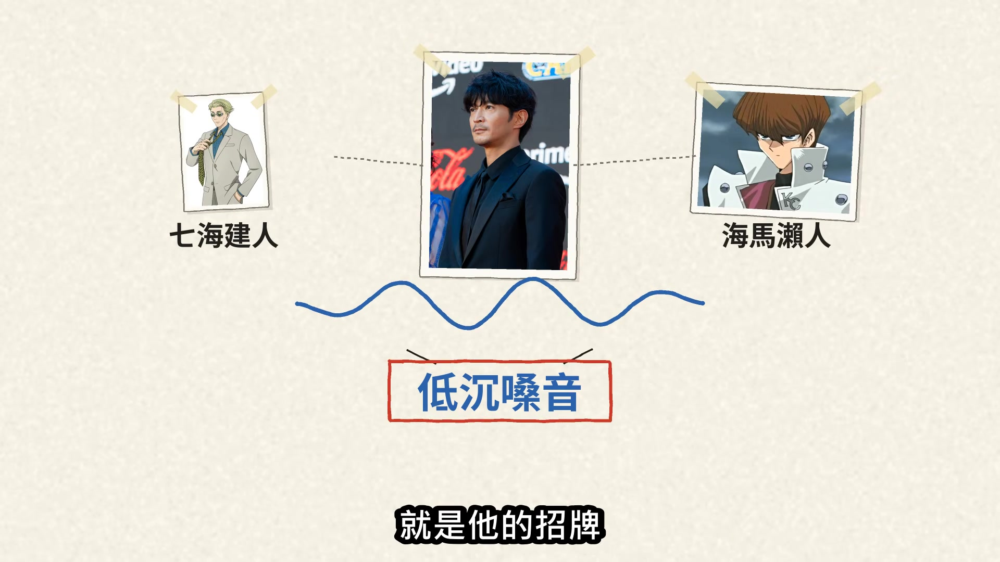

**逐字稿片段：** 但 Tsuda 認為，有人盯上了這副嗓子 Tsuda 這邊指出 一個身分不明的 TikTok 帳號

**話題推測：** 轉向津田健次郎主張其聲音被AI模仿侵害的細節

---

## 00:00:55

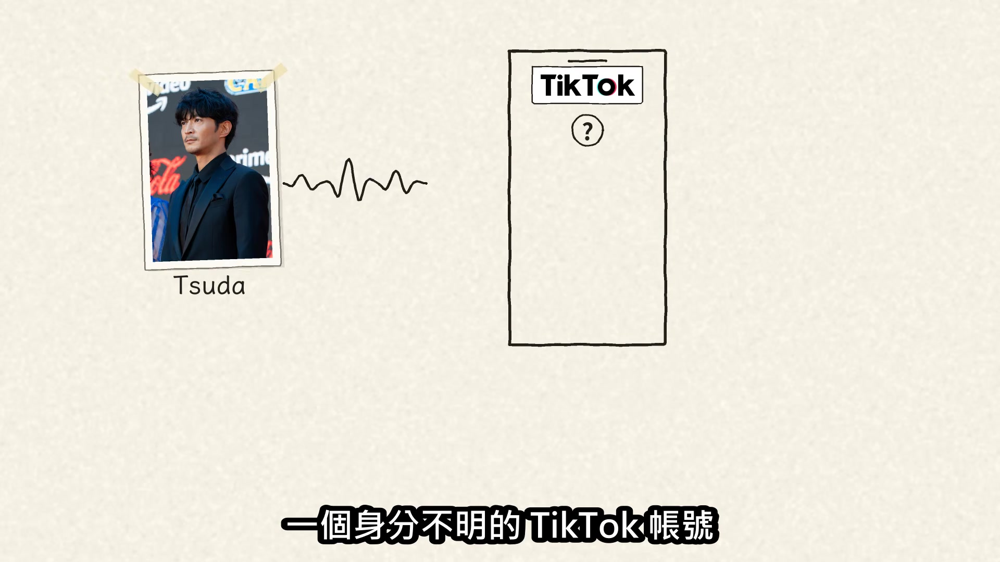

**逐字稿片段：** 從2024年7月到2025年9月 發了188支短片 旁白都是用生成式 AI 模仿他的聲音 這些片也不是發好玩的 Tsuda 主張

**話題推測：** 揭示AI模仿聲音短片發布的時間範圍

---

## 00:01:07

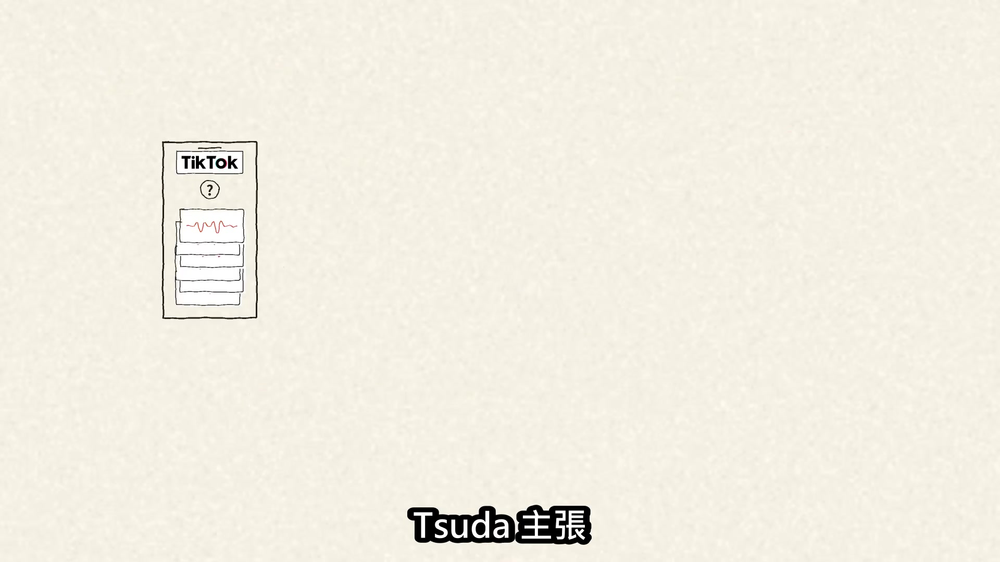

**逐字稿片段：** 這個帳號拿他的名氣換流量和錢： 累積超過21萬名粉絲

**話題推測：** 說明TikTok帳號利用津田名氣獲取流量與金錢的商業主張

---

## 00:01:11

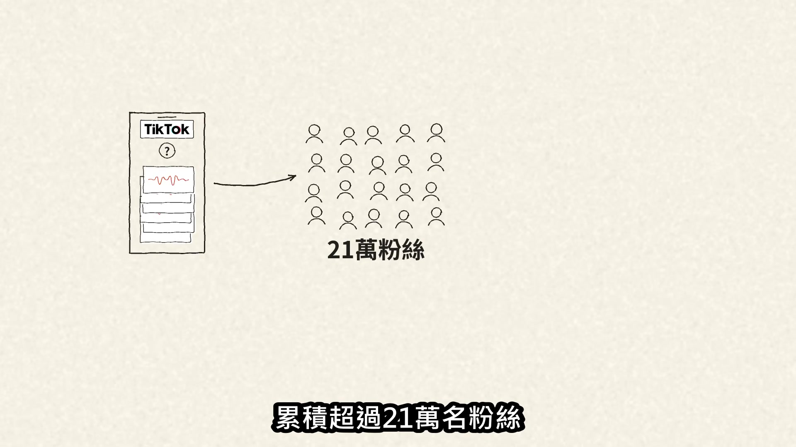

**逐字稿片段：** 每個月估計進帳50萬到75萬日圓 不過這些數字是原告方的主張 不是法院認定的

**話題推測：** 呈現TikTok帳號每月估計的日圓收入數字

---

## 00:01:19

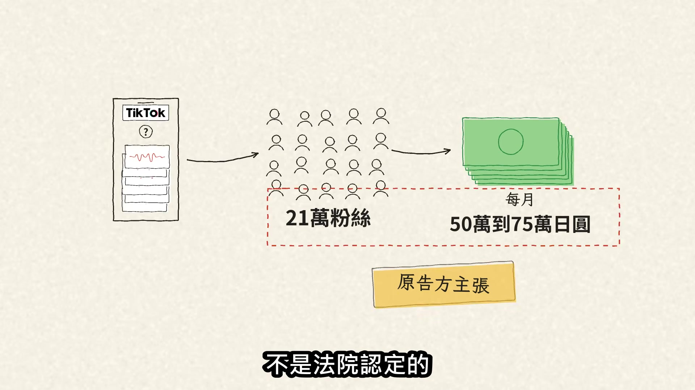

**逐字稿片段：** 那聲音到底像不像？ 兩邊講得完全相反

**話題推測：** 提出「聲音到底像不像」的爭議點

---

## 00:01:23

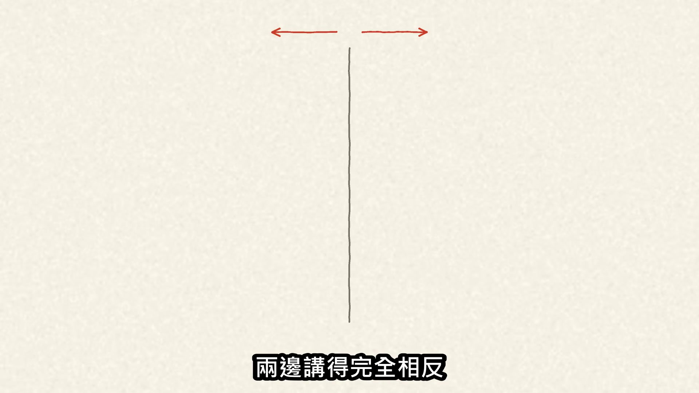

**逐字稿片段：** Tsuda 拿出音響分析，說兩者高度相似

**話題推測：** 津田方提出的音響分析證明聲音高度相似

---

## 00:01:27

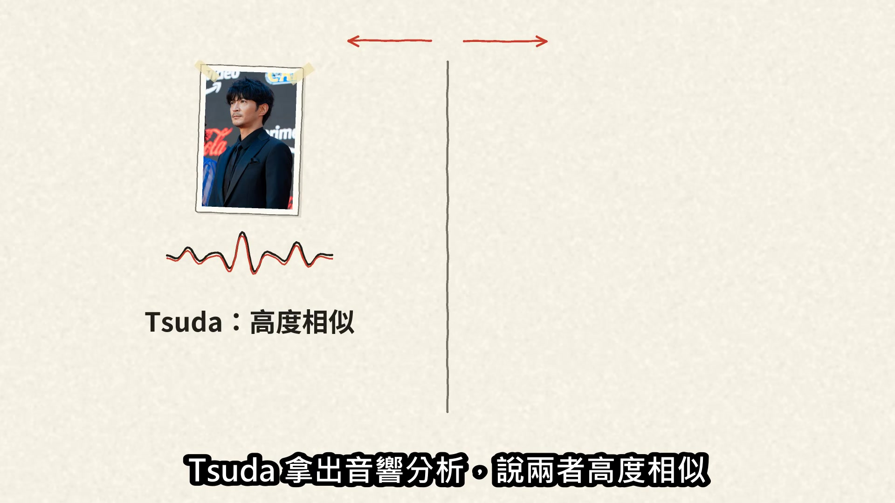

**逐字稿片段：** TikTok 的營運公司否認侵權 說那只是第三方聲音訓練出來的普通男性聲音據報導 上傳者還說 AI 用的是朋友的聲音 可是還沒等法院回答像不像 帳號就先不見了 官司還在打

**話題推測：** TikTok營運公司否認侵權的說法

---

## 00:01:41

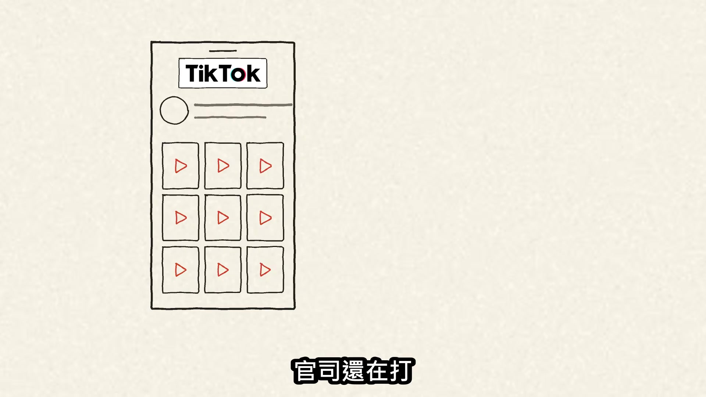

**逐字稿片段：** 上傳者就在2026年5月把帳號刪除 那些影片也跟著消失

**話題推測：** 上傳者刪除TikTok帳號的關鍵時間點

---

## 00:01:46

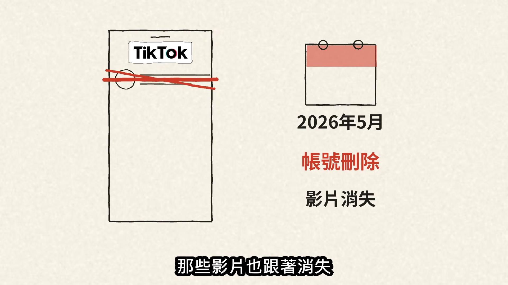

**逐字稿片段：** 也因為影片消失，官司就這樣輸了 Tsuda 提出的是刪除影片的請求 被告是 TikTok 的營運公司 不是匿名上傳者 影片已經不在，平台沒有東西可以刪 所以法院駁回 換句話說，法院沒有回答聲音像不像 也沒有認定這188支片侵權 更沒有判平台賠償

**話題推測：** 解釋因影片消失導致津田官司敗訴的原因

---

## 00:02:09

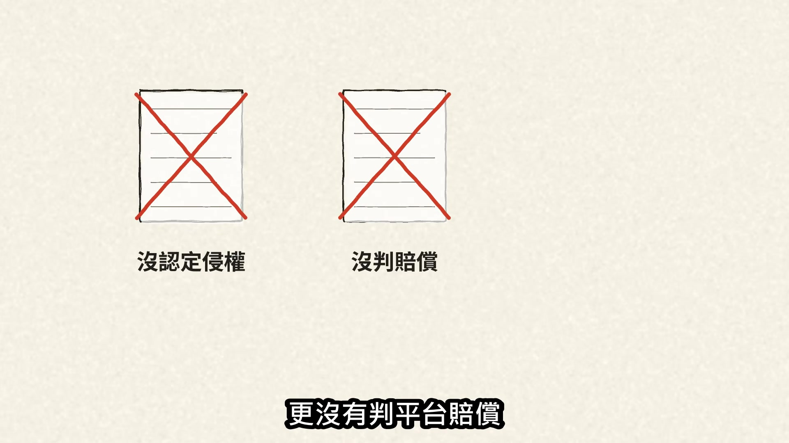

**逐字稿片段：** 法院承認的是，聲音原則上可以受到保護

**話題推測：** 強調法院承認聲音原則上可受保護的里程碑判斷

---

## 00:02:14

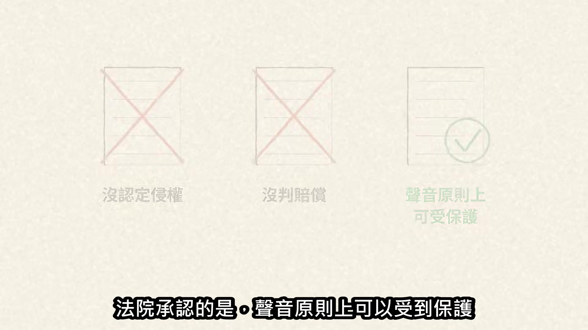

**逐字稿片段：** Tsuda 先前也曾撲空 據多個報導，他聲請公開發文者資料 東京地院也下令提供 可是連線紀錄送到業者手上時 已經過了保存期限 先前程序沒能鎖定上傳者 這次則是刪除標的在判決前消失

**話題推測：** 轉向津田先前試圖公開發文者資料失敗的經歷

---

## 00:02:31

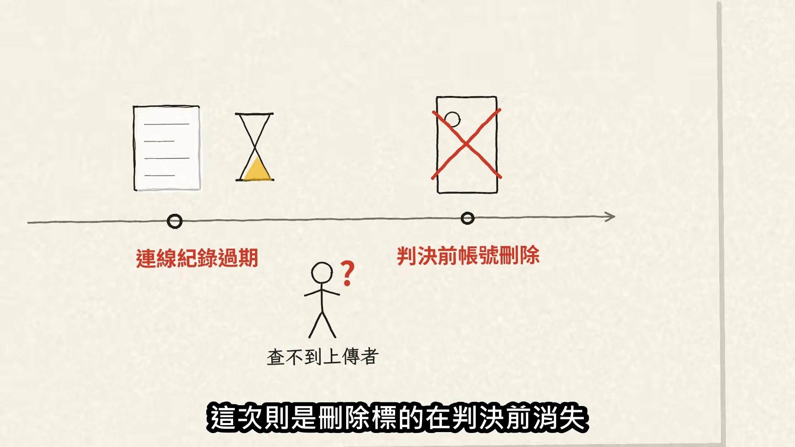

**逐字稿片段：** 同樣的難題，日本政府也在處理 法務省從今年4月到7月開了5次會議

**話題推測：** 切換至日本政府處理數位內容侵權問題的政策討論

---

## 00:02:36

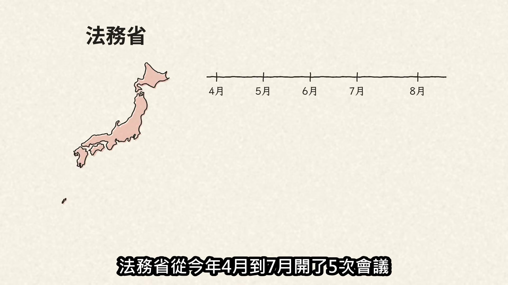

**逐字稿片段：** 8月公布報告：

**話題推測：** 提及日本法務省公布聲音保護相關報告的時間

---

## 00:02:38

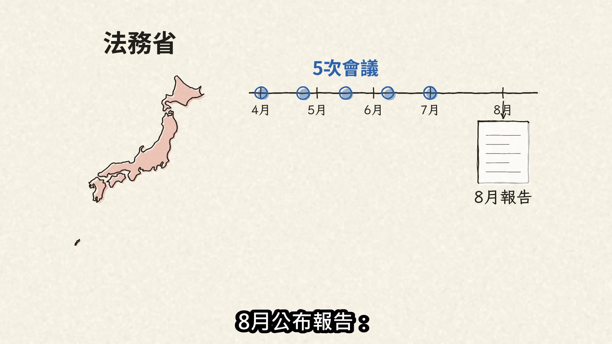

**逐字稿片段：** 聲音靠現有的公眾形象權和人格利益 就能受到保護 這是對現行法的解讀 不是新訂一部聲音權法 政府這樣解讀

**話題推測：** 公布政府報告中關於「聲音可受現有公眾形象權和人格利益保護」的結論

---

## 00:02:46

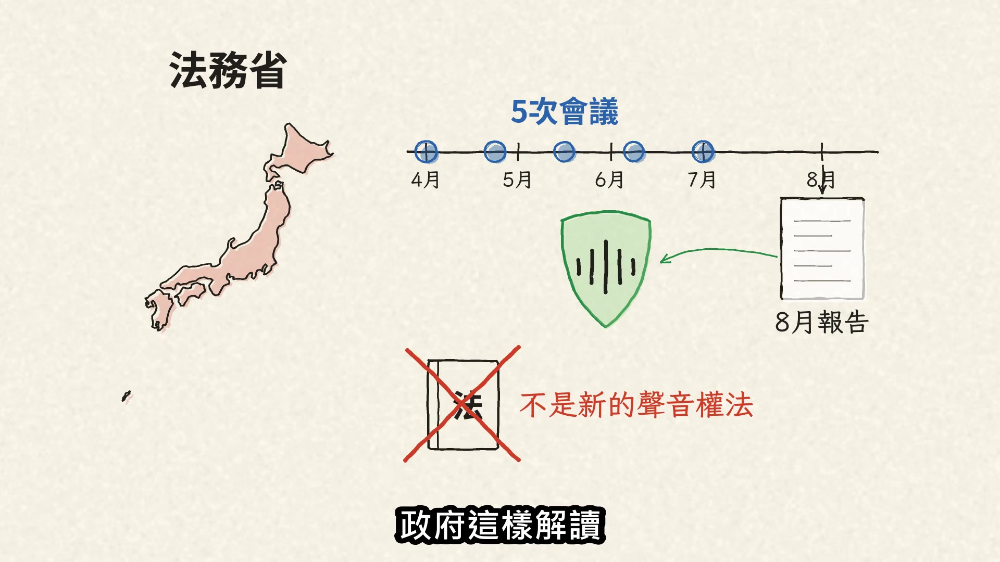

**逐字稿片段：** 那聲音的主人自己怎麼想？

**話題推測：** 探討聲音主人（聲優業界）對此議題的看法

---

## 00:02:49

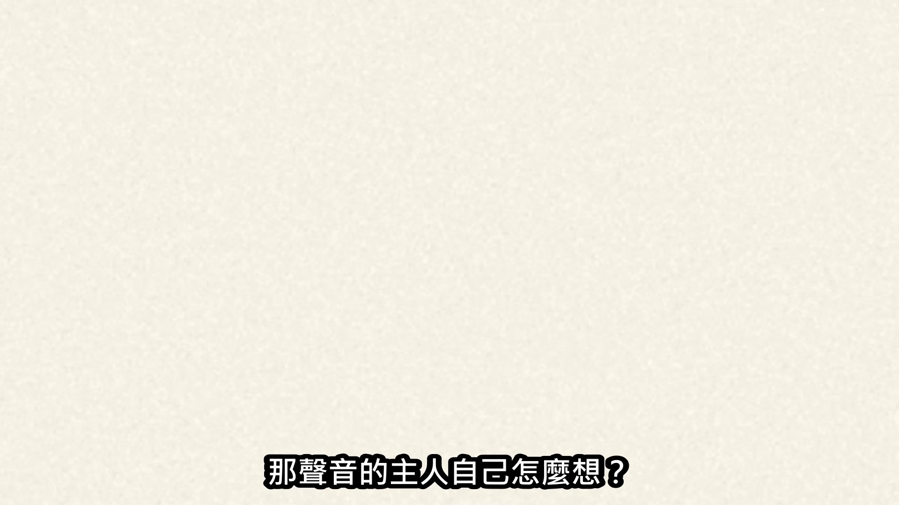

**逐字稿片段：** 日本俳優連合說，聲音是人格、尊嚴、 信用和職業人生的一部分 一項國內服務的調查裡，48名實演者 沒有任何一個人同意自己的聲音被拿去用 所以回到 Tsuda 身上

**話題推測：** 引用日本俳優連合對聲音是人格、尊嚴一部分的聲明

---

## 00:03:02

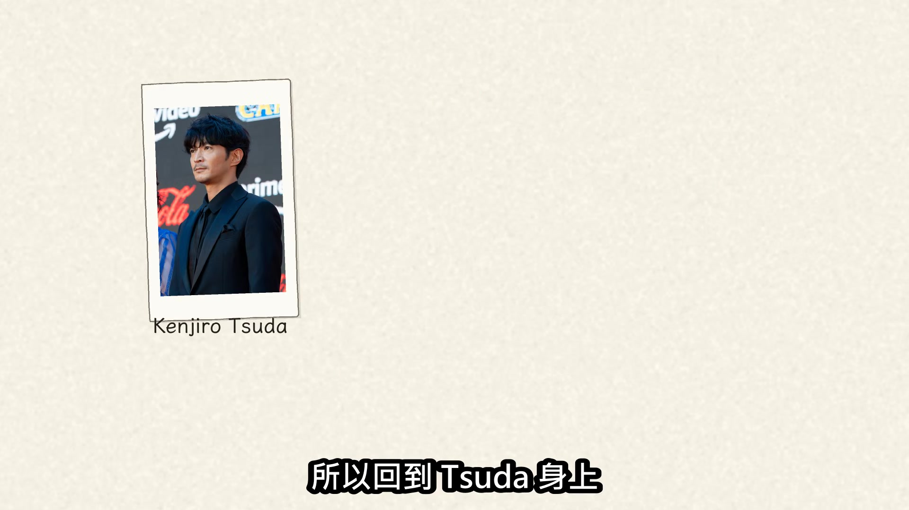

**逐字稿片段：** 最矛盾的就在這裡：他贏了原則 卻沒有拿到實際救濟要不要上訴 也還沒有公開決定 證據會過期、帳號能刪除、 內容一下就消失，法律雖然開始追 AI 卻總是慢一步

**話題推測：** 總結津田健次郎「贏了原則卻未獲實際救濟」的矛盾結局

---
