# ai-note-101_V8_sWpR4Gn0 — 關鍵畫面索引

- 來源逐字稿：[ai-note-101_V8_sWpR4Gn0_GT.srt](ai-note-101_V8_sWpR4Gn0_GT.srt)
- 影片：https://www.youtube.com/watch?v=V8_sWpR4Gn0
- 截圖數：15

## 00:00:00

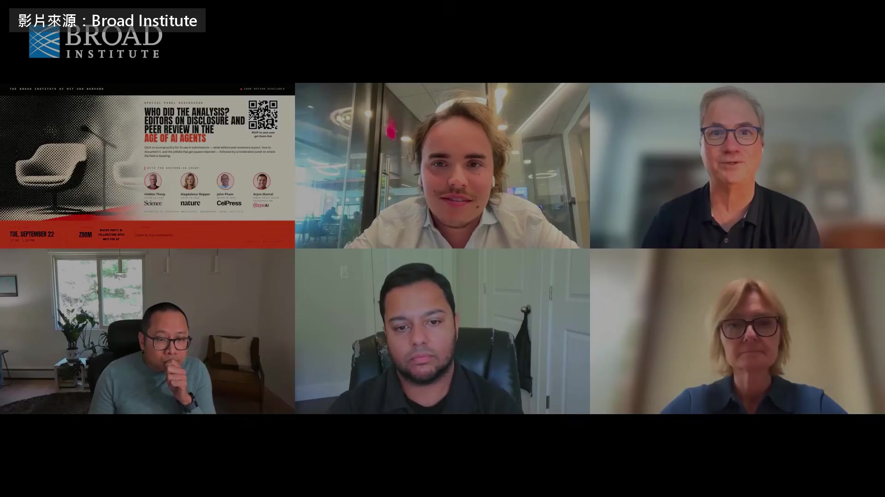

**逐字稿片段：** Science、Nature Cell 的總編輯 坐進了同一場線上座談 主辦的是 MIT 跟哈佛合辦的 Broad 研究所 時間是今年 9 月 22 號 他們要談的是 AI 開始替科學家跑分析 寫論文之後，期刊還把不把得住關 Science 的總編輯 Holden Thorp 是化學家 當過北卡羅來納大學的校長 ChatGPT 問世兩個月後 他就宣布 Science 不收 AI 寫的文字 後來一步步放寬 Magdalena Skipper 是遺傳學家 2018 年接掌 Nature 是這本期刊創刊快 150 年來第一位女性總編輯 同一年接手 Cell 的是 John Pham 他也參與管理 Cell Press 旗下的整批期刊 第四位 Arjun Manrai 在哈佛醫學院教書 也是 NEJM AI 的資深副主編 這本期刊屬於《新英格蘭醫學期刊》 專登醫療 AI 的研究 審稿流程已經用上 AI 好。打招呼之前，我想先分享一個數字 從昨天到現在，有 100 位報名這場座談的人填了一份簡短的問卷 大部分的人工作上都在用 AI

**話題推測：** 介紹主要期刊和機構

---

## 00:01:06

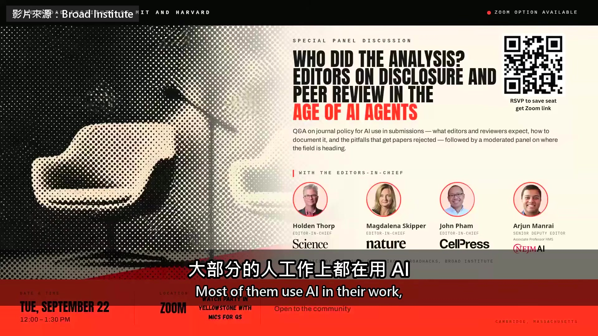

**逐字稿片段：** Broad 有 38% 的研究者已經讓 agent 跑自己的資料 我說的是 agent，不是聊天助理 可是我們問他們，要不要讓 AI 來審自己的論文

**話題推測：** 公布 Broad 研究所研究者使用 agent 的比例

---

## 00:01:21

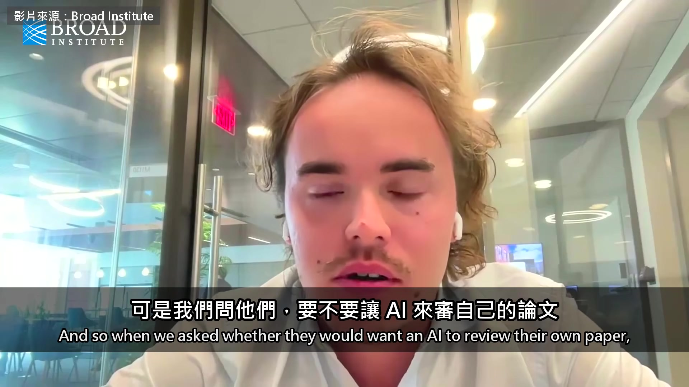

**逐字稿片段：** 85% 的人說不要 所以大家可以接受這些工具來幫忙，被這些工具評判就不行

**話題推測：** 公布研究者不願讓 AI 審稿的比例

---

## 00:01:29

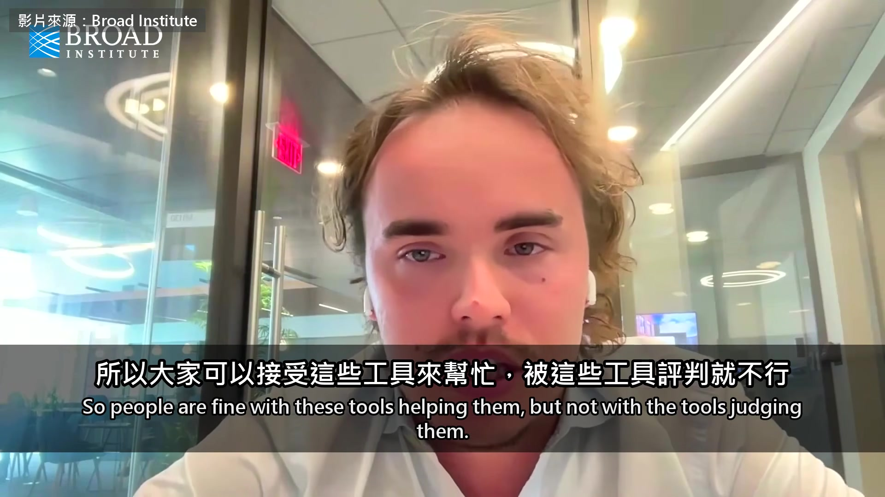

**逐字稿片段：** 第一題是一位實驗室負責人問的 他們的分析是幾組 agent 接力做完的 論文的方法要怎麼寫 四位的答案一樣 要交代到別人能照著重做 Thorp 另外提醒作者一件事 寫論文的人還要記得一件事 尤其是登在我們這四本、很多人盯著看的期刊 一定會有人放一個 agent 去查你的論文，看東西有沒有交齊 還會做一件事。這件事一直到幾個月前 我們其實沒怎麼跟大家講，我們自己是做不到的

**話題推測：** 開始討論第一個問題：AI 協作論文的方法寫法

---

## 00:02:06

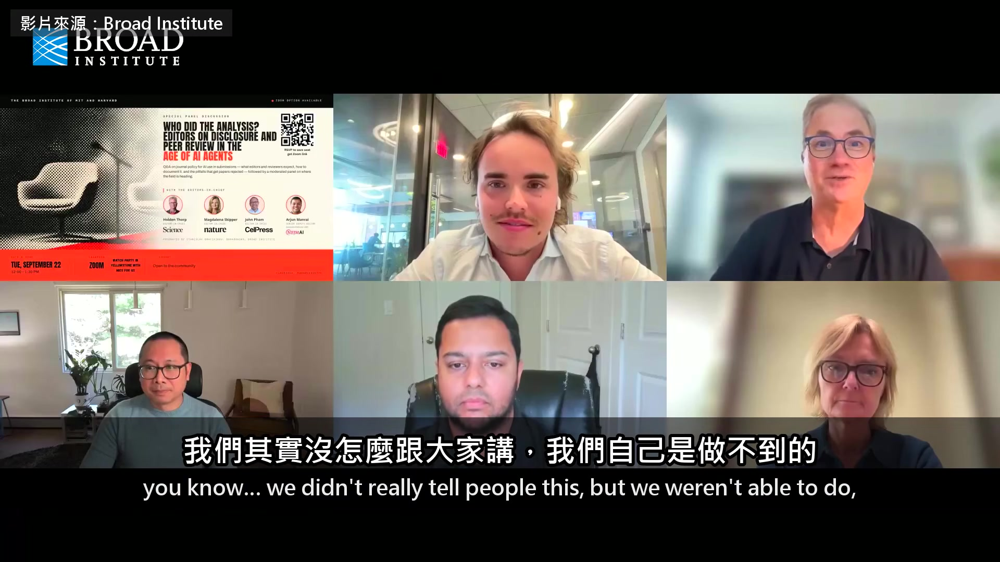

**逐字稿片段：** 就是檢查程式碼到底能不能跑 過去 20 年左右交上來存檔的程式碼，大多數其實沒有被執行過 除非有人真的很認真要重做某一篇論文 但現在我想這會變成常態。我們可能會用 agent 論文登出來以後，別人一定會用 agent 去驗證程式碼真的跑得起來 長遠來看這是好事。因為我們真的花很多時間 我相信其他幾位也一樣 回頭去翻舊論文 去查為什麼有人跑不動我們存檔的程式碼 主持人後來問 John Pham 期刊該不該一收到稿子就把程式碼跑一遍 不過你問 John 的那一題，我想講一件事 就是投稿的時候先篩 其他幾位可以自己說，但我們不可能在投稿階段篩任何東西 因為收到的稿子，有 93%、94% 我們都要說再見 所以 Proofig、iThenticate 這類查圖片、查抄襲的工具 我們通常到流程後段才拿來跑稿子 不過還是來得及在刊出之前把問題改掉 人力查不完

**話題推測：** 提出檢查論文程式碼是否能跑的新挑戰

---

## 00:03:24

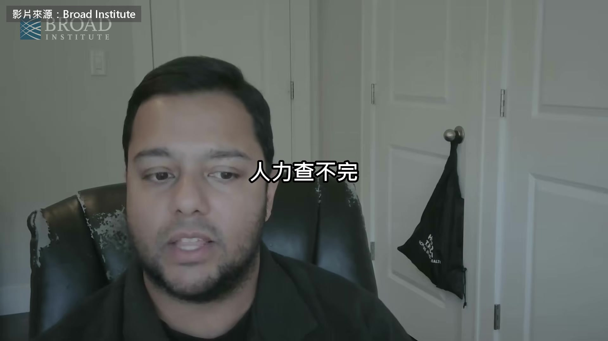

**逐字稿片段：** NEJM AI 去年秋天試了一個做法 叫快速通道 照 Manrai 的說法 他們挑了兩篇編輯都看好的論文 先問過作者 由一位編輯自己寫完審稿意見 再讓 ChatGPT 跟 Gemini 各審一遍 7 天就做出決定 第一篇是他負責的 這個…第一篇是我負責的，我花了很多工夫 AI 確實讓我們變快，但工作量還是非常大 整個過程用了大量的人為判斷 快速通道大概就是這樣 我們從中學到什麼？我覺得各位應該自己判斷

**話題推測：** 介紹 NEJM AI 試行的「快速通道」審稿做法

---

## 00:04:03

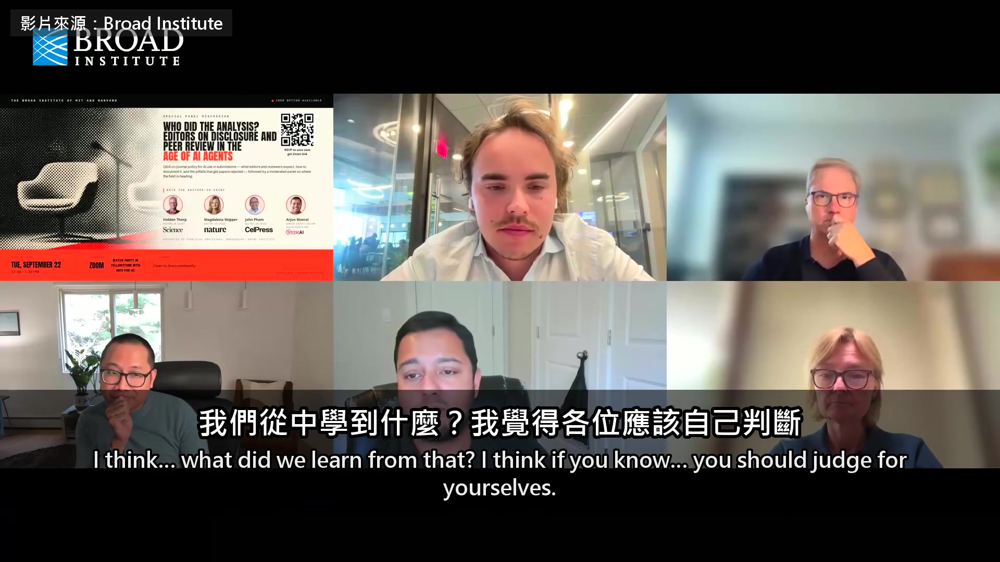

**逐字稿片段：** 審稿意見我們都放在補充資料裡。你可以看到我沒用 AI、自己寫的那份，也可以看到 AI 寫的 我對自己那份很滿意，但我覺得 AI 的審稿意見真的、真的很好 它們指出的…跟我把論文丟進 AI 之前自己寫的，有很多重疊 有些點我提了，AI 沒有著墨 也有些點 AI 提了，我沒有著墨

**話題推測：** 建議讀者查看補充資料中的人工與 AI 審稿意見對比

---

## 00:04:26

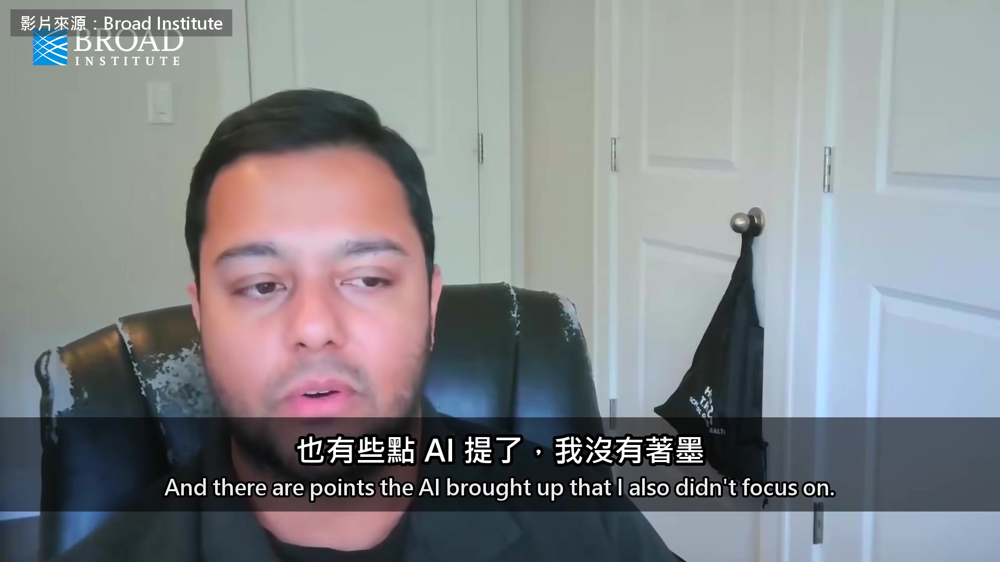

**逐字稿片段：** Nature 的社論要研究者別把審查中的稿子貼進聊天機器人 Skipper 說第一個理由是保密 第二個理由

**話題推測：** 提到 Nature 關於研究者不應將審查中稿件貼入聊天機器人的社論

---

## 00:04:34

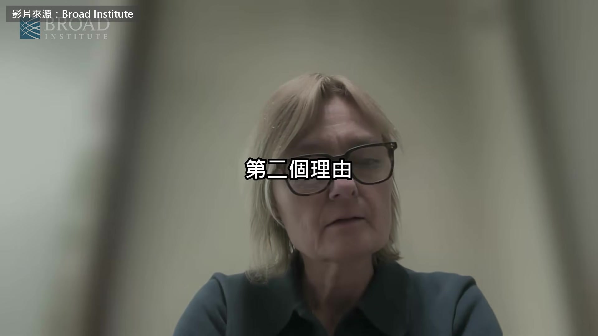

**逐字稿片段：** 跟 9 月 OpenAI 宣布解出千禧年難題 Navier-Stokes 有關 當我們把資料、分析、論文稿 我找不到更好的詞 「餵」給 AI 系統的時候 我這裡是故意用一個很籠統的說法 我們要意識到，這些系統、agent 甚至成群的 agent，是在學習的 然後我們就會碰到這一次的狀況 這一次是數學界 碰到的問題 但其他任何領域都會遇到一模一樣的問題 有一個模型…應該說一組模型 一組 agent，解掉了一個根本的難題 然後被指控 說這個模型是站在整個社群的肩膀上 甚至可能是站在幾位指得出名字的研究者 肩膀上 卻沒有給他們任何功勞

**話題推測：** 提及 OpenAI 宣稱解決 Navier-Stokes 難題的事件

---

## 00:05:52

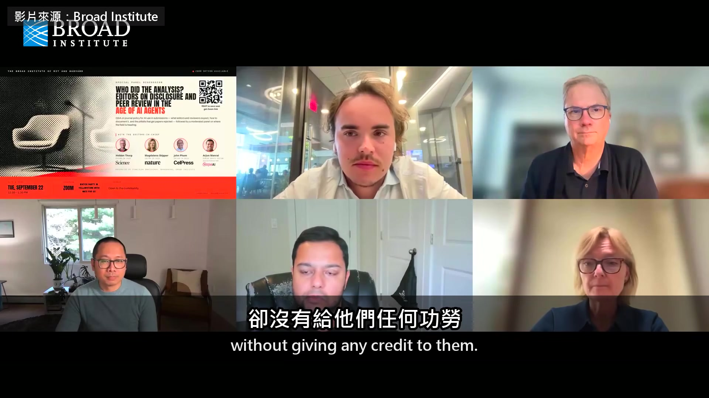

**逐字稿片段：** Thorp 說 Science 的立場一樣 不希望稿子是因為期刊才流進聊天機器人 但另一方面，我們知道 Nature 報導過一篇預印本，說我們現在看到的論文有 80% 含有 AI 寫的文字 論文要是沒進過語言模型，那些字不會自己跑進去 所以我們知道很多作者都在這樣做 我自己教一門課，18 歲的大一學生要寫報告 然後有人說…有人問 有時候有人問我「你是不是讓他們回家寫，再叫他們發誓沒用 AI？」 我就說「對啊，然後隔天我再發一包大麻讓他們帶回家，叫他們不准抽」 因為我覺得，真的很難想像 有人坐在自己正在用的同一台電腦前面 拿它寫論文，卻不去用那些工具 有些工具本來就內建在他用的文書軟體裡 如果每個審稿人跑的都是同樣那兩個模型，同儕審查會不會變得千篇一律？ 對。我想 拿兩個市面上的 AI 來審論文這個例子 首先，我們不要這種審稿。這個我們自己來就行了 另一點是 一個工具是拿整個網路訓練出來的 它給的結果就很好猜、很平淡

**話題推測：** 說明 Science 在稿件保密立場上與 Nature 一致

---

## 00:07:30

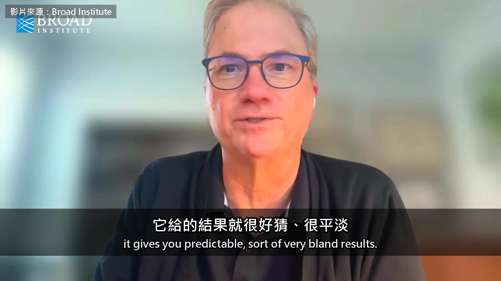

**逐字稿片段：** 我在 podcast 訪問 James Evans 的時候聊到這個 他說「你問它城裡哪家義大利餐廳好，它會給你 Olive Garden 這種連鎖店」 因為它手上這一家的資料最多 所以不管以後幫忙審稿的工具長什麼樣子 我同意總有一天會有 都得是專門打造的 拿科學文獻 用心、仔細地訓練出來 還有一點，我想大家都知道 市面上這些工具講的話你不喜歡，你是可以把它講到改口的 我最近需要做一個不會要命、但很不舒服的醫療處置 細節就不說了，在場不是醫生的人不會想聽 我知道它說得對，但我跟它說「也許我只是拉傷肌肉」，它就說「喔，這我倒沒想到」 我該去急診，我也去了，但我很輕鬆就說服它我不用去 現在要是拿 ChatGPT 或 Claude 來審論文 它說「我覺得這張光譜圖不太對」 你回它「你有沒有看這裡，或是換個角度看？」 它可能就說「喔，這我沒想到」，然後這條意見就沒了 所以現在這種 網頁版的介面，沒辦法拿來做這件事 最後一題是功勞 主持人問 如果幾個 AI agent 各自做出同一個發現 這個發現算誰的 AI 做出來的東西，功勞要給誰？我不知道 我們現在是有規定的 我們現行的規定是

**話題推測：** 引述 podcast 中 James Evans 對 AI 評論平淡的說法

---

## 00:09:20

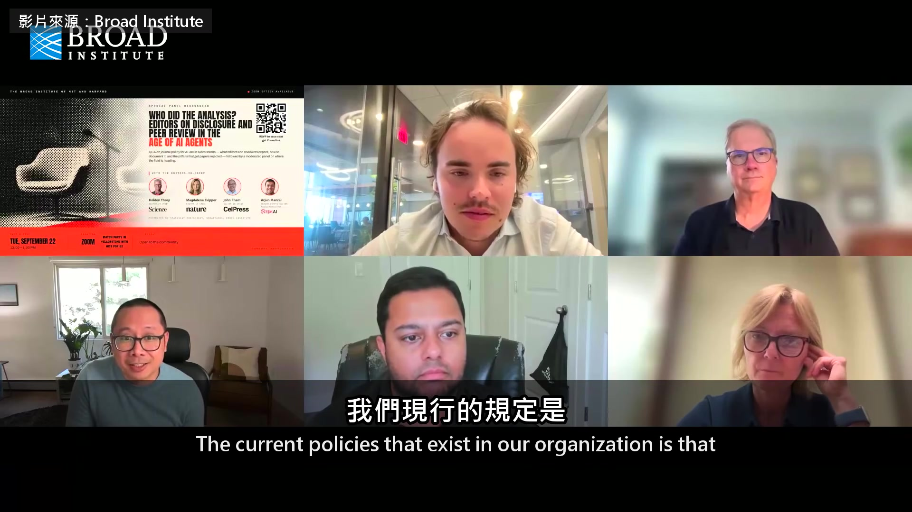

**逐字稿片段：** AI agent 不能列為論文作者 因為沒辦法要它們負責 背後還有很多考量 所以這一題的答案，我想是它們誰都拿不到功勞 至少照我們現行的規定是這樣 我接著 John 的話講 我認為一定要 把功勞看成硬幣的一面 另一面是責任，出了事要有人出來負責 John 剛才講的就是這個。agent 之所以不能掛名 就是因為之後沒辦法要它為那份研究負責 AI 已經在跑分析 也寫得出不錯的審稿意見，可是出了錯 沒辦法找它負責 所以論文上掛誰的名字，誰就得扛

**話題推測：** 明確指出 AI agent 不能列為論文作者的規定

---

## 00:10:22

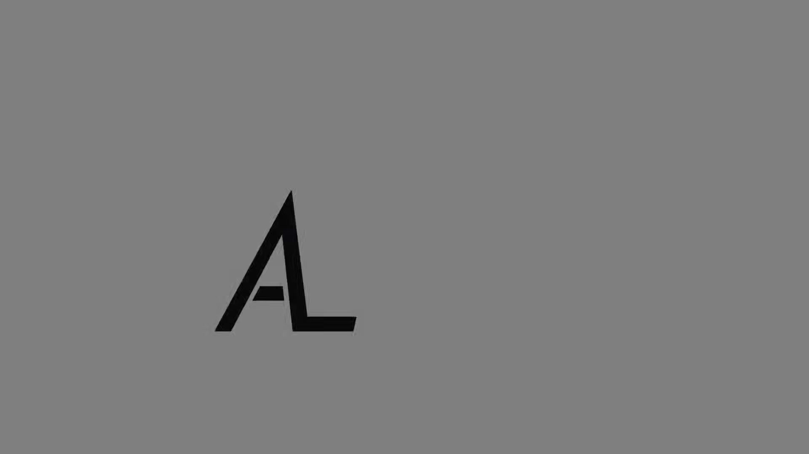

**逐字稿片段：** 原影片將近一個半小時

**話題推測：** 影片總結與額外資訊的過渡

---

## 00:10:24

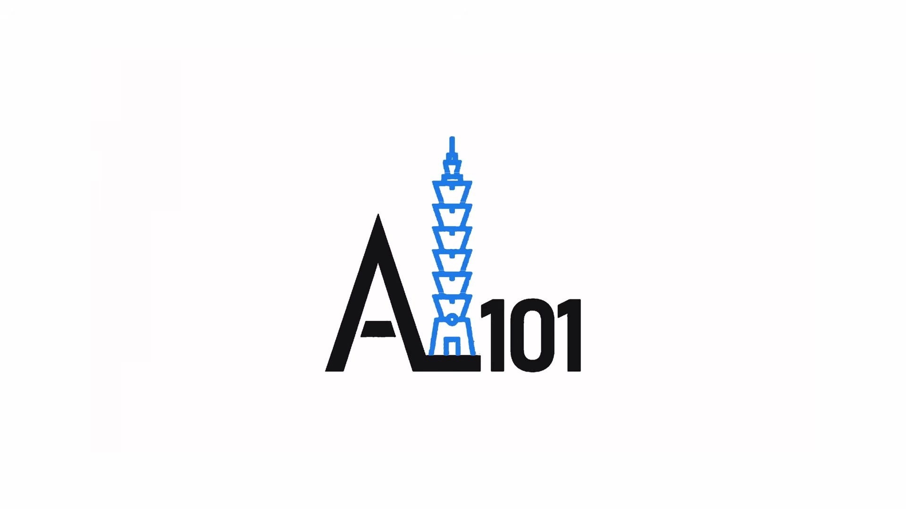

**逐字稿片段：** Thorp 還說 Science 一年只登 750 篇論文 不打算增加 因為每一篇要查的東西越來越多

**話題推測：** 提及 Science 每年刊登論文的數量與不增量政策

---

## 00:10:30

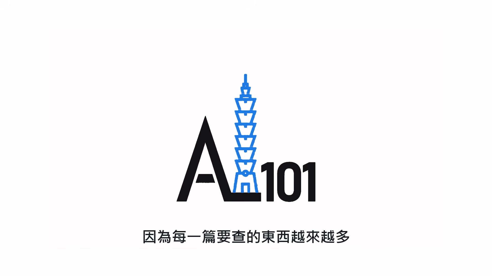

**逐字稿片段：** 他也批評開放取用常見的 CC BY 授權 說多數作者沒讀過自己簽了什麼 這些論文被拿去訓練模型的比付費牆後面的多 原影片連結在說明欄，有興趣可以去聽更多。

**話題推測：** 批評開放取用常見的 CC BY 授權

---
