# ai-note-101_V9PE-sRu0mQ — 關鍵畫面索引

- 來源逐字稿：[ai-note-101_V9PE-sRu0mQ_GT.srt](ai-note-101_V9PE-sRu0mQ_GT.srt)
- 影片：https://www.youtube.com/watch?v=V9PE-sRu0mQ
- 截圖數：29

## 00:00:00

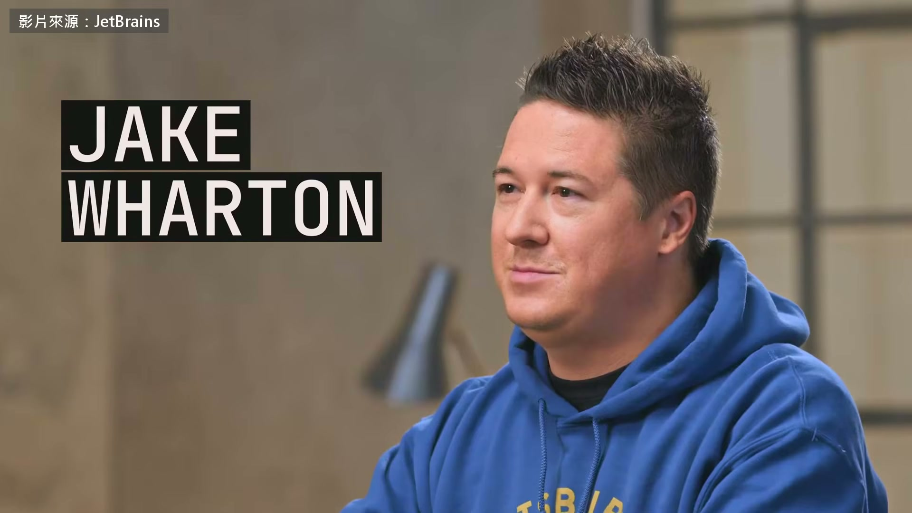

**逐字稿片段：** Jake Wharton, Android developer and author of Retrofit and OkHttp, brought Kotlin to Android, quit his big tech job in 2025 during massive tech layoffs, publicly against AI.

**話題推測：** 開場介紹 Jake Wharton、Kotlin／Android 身分，以及他離開大科技公司的背景。

---

## 00:00:14

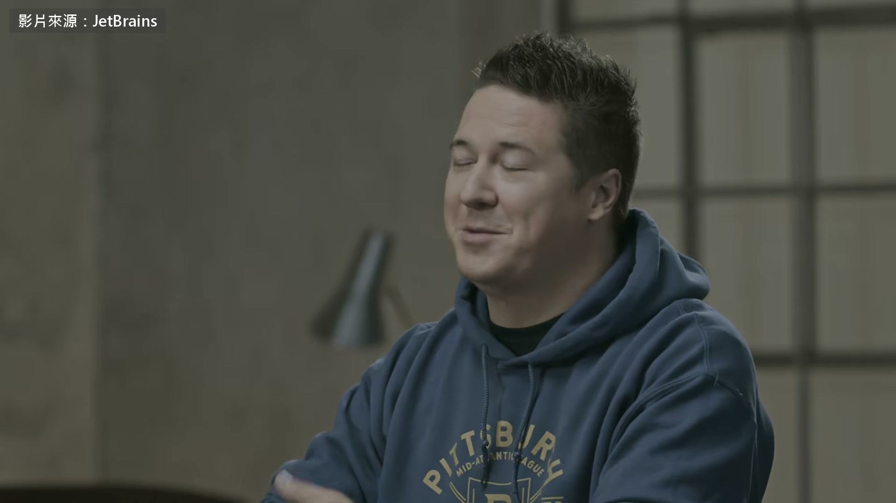

**逐字稿片段：** For his next job, he publicly listed nine requirements. The first was no AI. That alone ruled out 80% of companies. This comes from an official JetBrains interview released this September. It starts with how he joined Google. In 2017, Google announced Kotlin as one of the official Android languages. You became the first engineer on the Kotlin team at Google. How did that happen? So at the time I had worked at Square for five or six years, and we had adopted Kotlin about three years prior. And I had written a document that basically justified why we should use Kotlin at the company, in order to get it approved. He later made that document public. And the Android community started seeing him as the guy pushing Kotlin.

**話題推測：** 切入他求職時公開列出的九項要求，並突出第一項「不要 AI」。

---

## 00:01:01

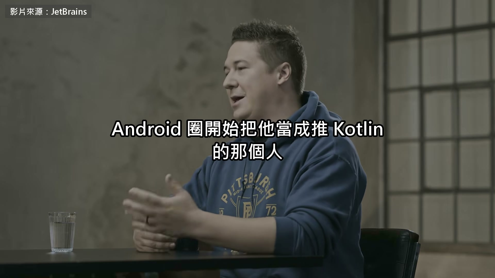

**逐字稿片段：** Then Google came calling. And I mean, I can think of no greater recognition of the idea of introducing Kotlin than going to the company that's providing the tooling for all of Android and turning that language into the thing that's now the first party official thing. So it was an opportunity that was impossible to pass up.

**話題推測：** 話題轉到 Google 邀請他加入 Kotlin 團隊，以及 Kotlin 成為 Android 官方語言。

---

## 00:01:26

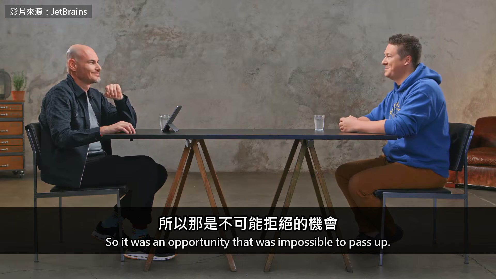

**逐字稿片段：** But before he joined, he made it clear that he would only stay for 2 years. He would make Kotlin the primary language for Android, then leave. In the end, he stayed an extra 9 months. The host asked why he left.

**話題推測：** 呈現他加入 Google 前設定的兩年任期與離職計畫。

---

## 00:01:36

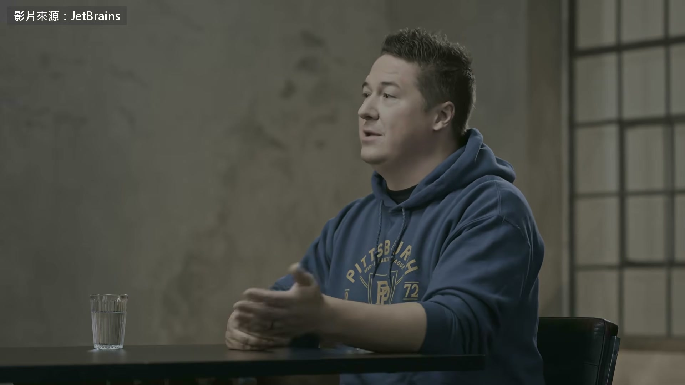

**逐字稿片段：** Ultimately, I just want to build things with the tools and libraries, not just build tools and libraries. So I had to go back to working on something where I got to reap the benefits of that investment. So yeah, there's a lot to like about working at Google. There's also things to dislike. But I feel like I accomplished my goal, and then had to go back and use the thing that I built. Sorry, but things to dislike. What do you mean? I have lots of issues with Google as a company, the way that they can lock you into their products and services. But yeah, I mean, the Android team is fantastic. I do miss working on that stuff.

**話題推測：** 切換到他離開 Google 的原因：想使用自己打造的工具，而不只是開發工具。

---

## 00:02:16

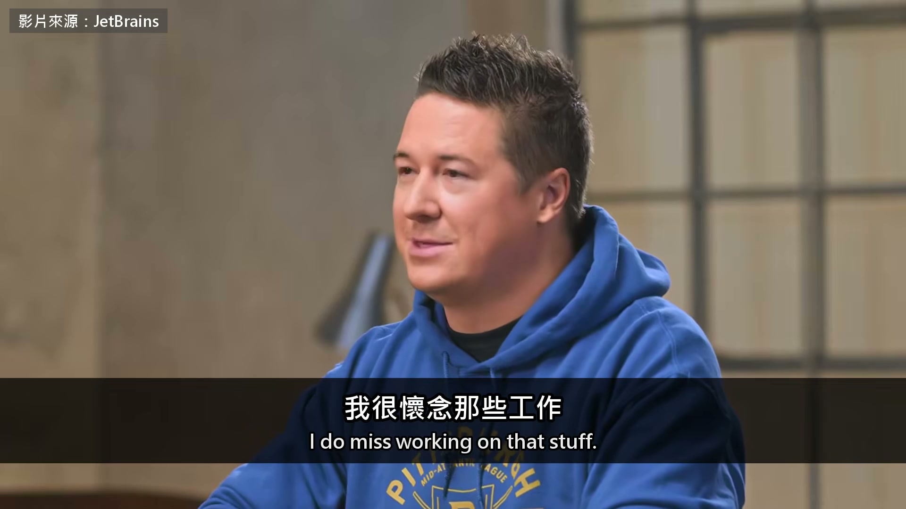

**逐字稿片段：** After leaving Google, he went back to Cash App. There, he built a framework that let the app update its interface and logic without releasing a new version. The whole thing was later made open source.

**話題推測：** 轉到他離開 Google 後回到 Cash App 並打造可遠端更新框架的經歷。

---

## 00:02:24

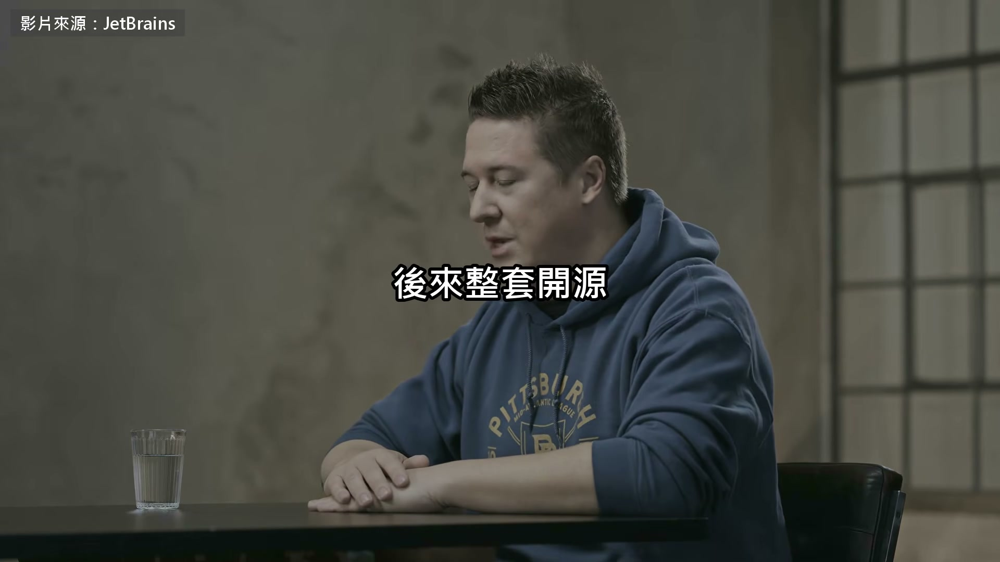

**逐字稿片段：** 5 years later, last November, he left. The host asked if finding a job was hard.

**話題推測：** 顯示他五年後離開 Cash App，以及重新求職的轉折。

---

## 00:02:29

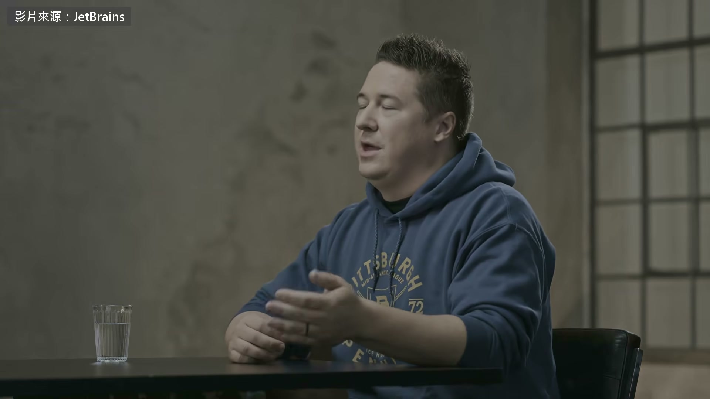

**逐字稿片段：** So, it wasn't the easiest thing. There certainly are jobs out there. I was a little picky. I would say I had some requirements of the place that I wanted to end up. I was fortunate enough to leave voluntarily, on my own terms. It's certainly not like it was five years ago, when anyone walking off the street could get snatched up and make a ridiculous amount of money as an Android developer. Then the host asked about salaries.

**話題推測：** 切換到科技業求職市場變化與他對新工作的挑剔程度。

---

## 00:03:01

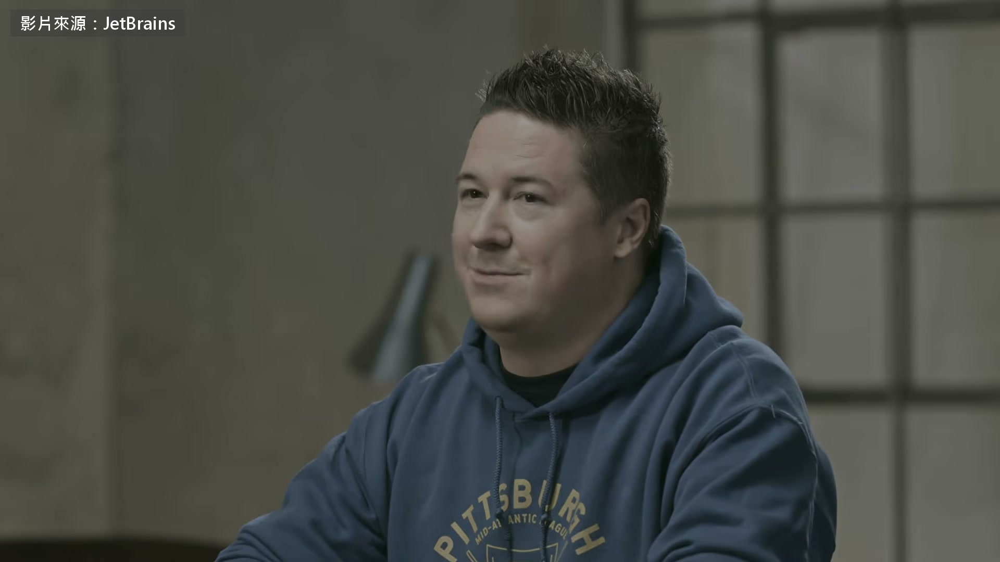

**逐字稿片段：** He said he had reached an age where he no longer wanted to gamble on equity. He would rather take a steady cash salary. After they finished talking about money, the host pulled out a list.

**話題推測：** 轉入薪資與股權選擇，呈現他偏好穩定現金薪資的財務考量。

---

## 00:03:10

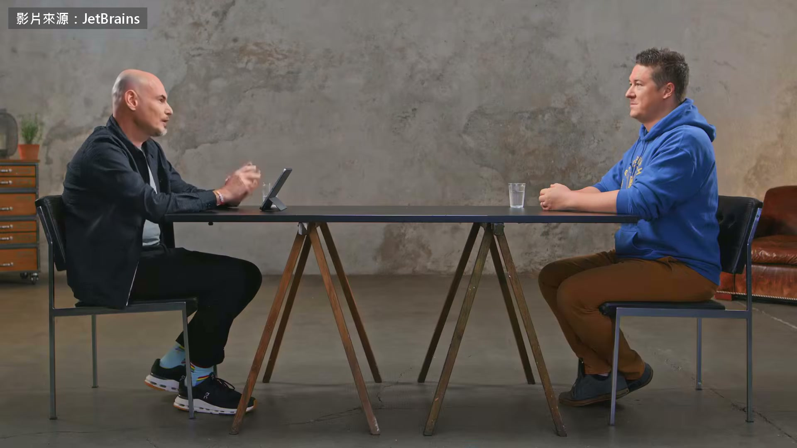

**逐字稿片段：** When you were looking for a job, you published nine values for your future employer. I'll read them and you tell me what they mean and why they are important to you. No AI. No AI companies, AI-based products, or forced AI usage for development. Yeah. It's first for a reason. It was probably the thing that I was looking for most. And then there's this whole other thing about the ethics behind the tools.

**話題推測：** 畫面很可能切換成他公開列出的九項求職價值清單。

---

## 00:03:45

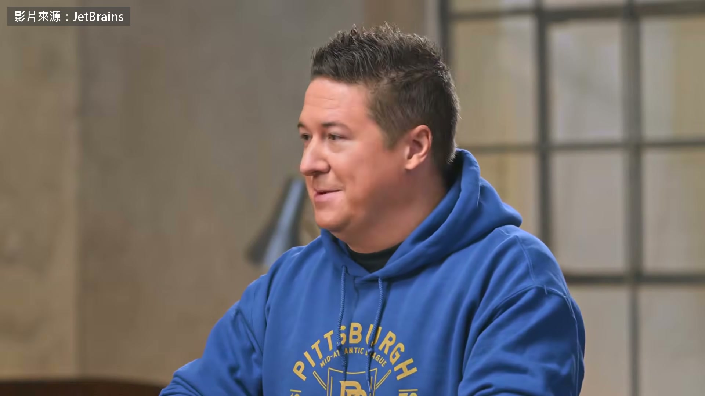

**逐字稿片段：** They're basically built on the largest copyright infringement in history. You can pretty much draw a straight line from Aaron Swartz, who downloaded all this scientific data, like 30 gigs of scientific data, and was facing decades of jail time for this, 2013 or something. I can't remember exactly when it was. And he ultimately took his own life from that copyright infringement claim that they were bringing against him. And you fast forward to now,

**話題推測：** 話題轉向 AI 工具涉及的大規模著作權爭議。

---

## 00:04:20

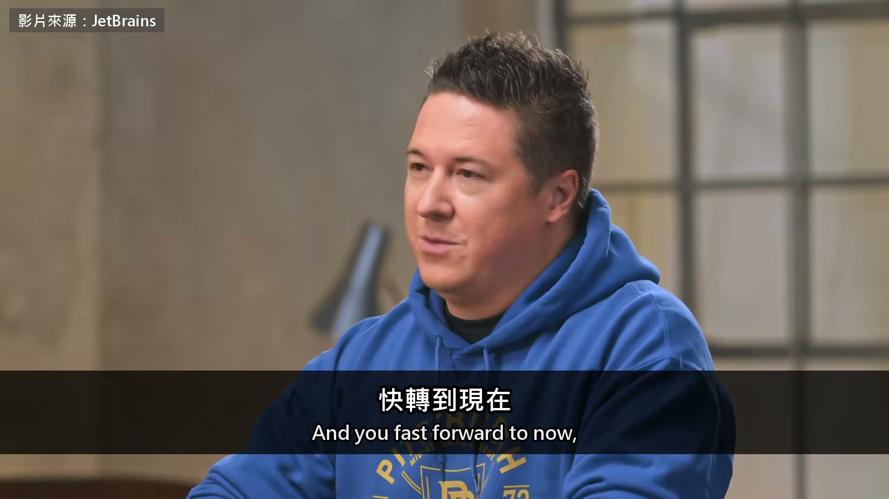

**逐字稿片段：** the way that these models are being trained is they're essentially ignoring artists' copyright. They're ignoring the licenses of code that exists. Just because you can get access to something doesn't mean you have the rights to be able to remix it and reimagine. In some cases, spit back out verbatim these things that you've ingested. He said programming tools have always been something engineers fall in love with first, then ask management to approve.

**話題推測：** 轉到生成式模型訓練資料忽視藝術家與程式碼授權的批評。

---

## 00:04:46

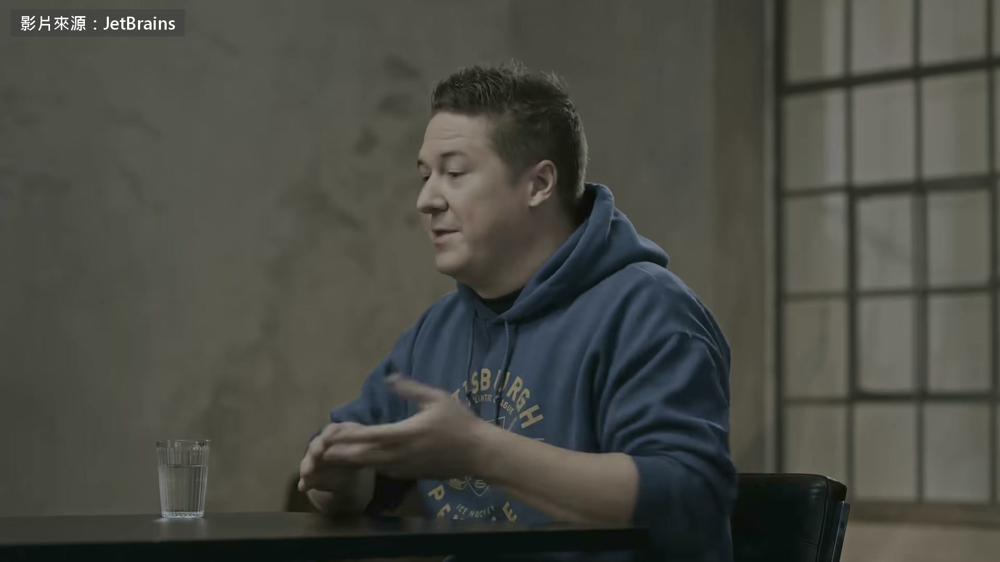

**逐字稿片段：** Next, he mentions Jack Dorsey, the founder of Square and his former boss, and Eclipse, an old editor that the Android world stopped using years ago. If Jack Dorsey came to me and said you have to use Eclipse, I probably also would have quit. But yeah, when the leadership of your company is forcing these tools upon you, that in and of itself would be one thing,

**話題推測：** 引入 Jack Dorsey、Square 與 Eclipse 編輯器的新人物和公司背景。

---

## 00:05:15

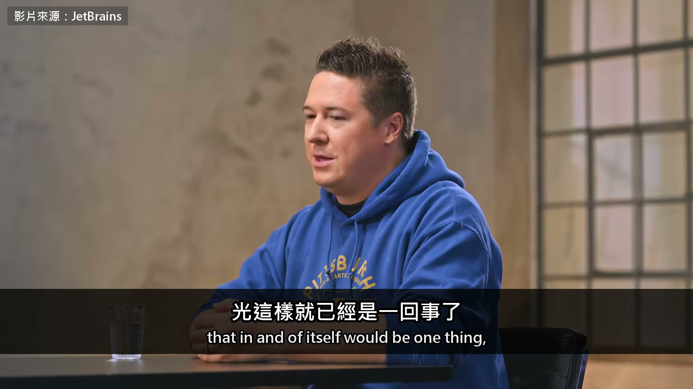

**逐字稿片段：** but then when you couple that with recurring layoffs, it just doesn't look good.

**話題推測：** 畫面可能切換到反覆裁員與公司強迫使用工具的負面影響。

---

## 00:05:23

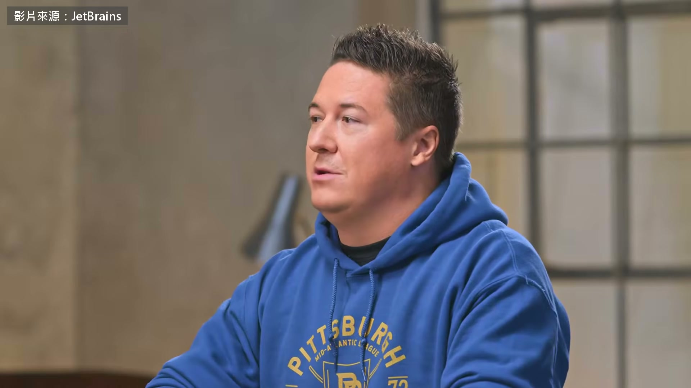

**逐字稿片段：** And this goes back to the salary thing, where I'm in a fortuitous position. I have worked hard for a long period of time and I've earned the ability to choose where I want to go. A lot of people don't have that. And so, yeah, that list is me. And AI was at the top because that's the thing that right now I value the most.

**話題推測：** 轉入他因資歷與財務條件而能自主選擇工作的個人處境。

---

## 00:05:45

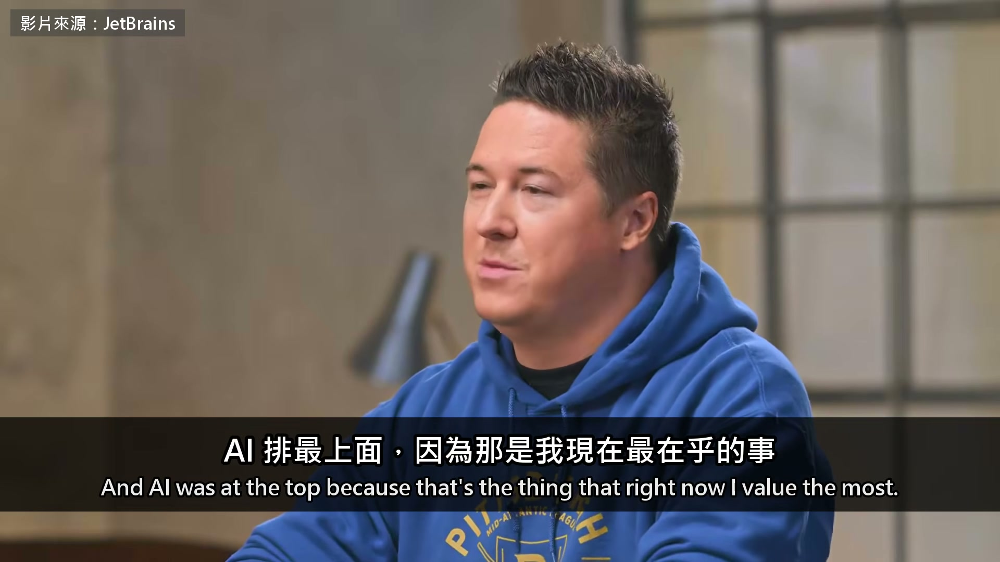

**逐字稿片段：** And it immediately disqualified 80% of the potential places I probably could have gone. The second item on the list was also one of his former employer's biggest bets.

**話題推測：** 突出「拒絕 AI」使他排除約 80% 潛在公司的關鍵數字。

---

## 00:05:57

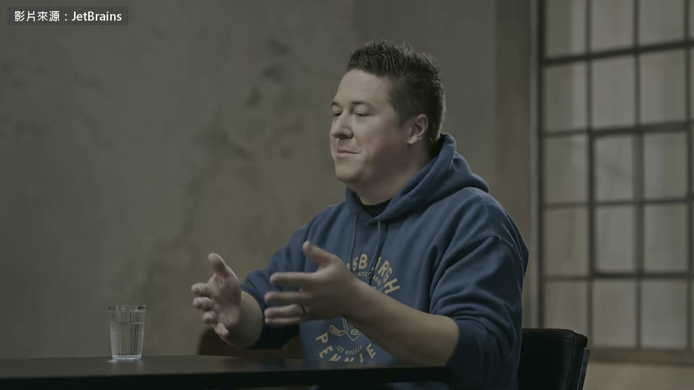

**逐字稿片段：** No crypto. Cryptography is good, but cryptocurrencies are bad. As we go on this list, you can really draw parallels to where I came from.

**話題推測：** 切換到清單第二項「不要加密貨幣」，並區分密碼學與加密貨幣。

---

## 00:06:07

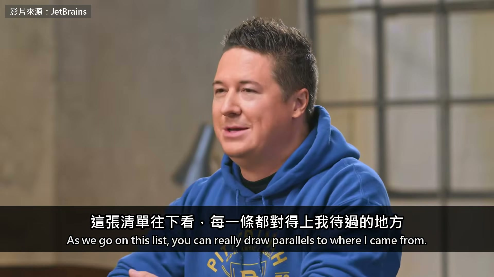

**逐字稿片段：** So before LLMs, it was cryptocurrencies. And at Square and at Cash, again, we leaned very heavily into that. And it just, it's basically a Ponzi scheme, right? There's no real value. The nine points also included

**話題推測：** 轉到 Square／Cash App 大力投入加密貨幣，以及他將其比作龐氏騙局的觀點。

---

## 00:06:28

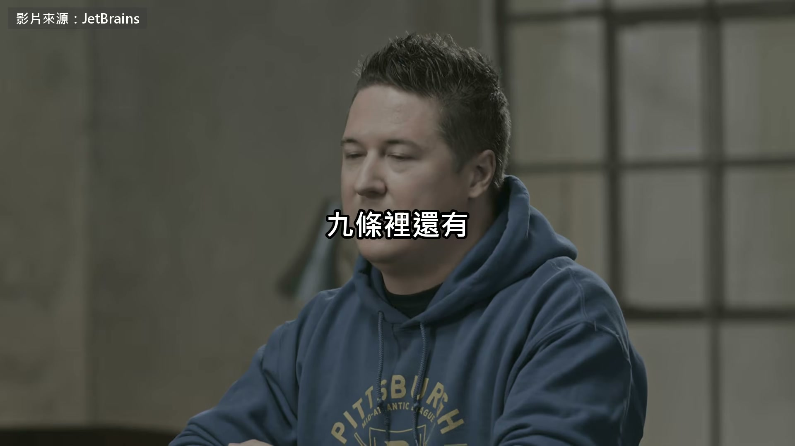

**逐字稿片段：** no exploitative gig economy businesses, a small, focused company, and no work chat apps on his phone. The host asked which point had cost him the most opportunities.

**話題推測：** 快速呈現清單中的其他條件：拒絕剝削性零工經濟、小型專注公司與手機工作聊天軟體。

---

## 00:06:36

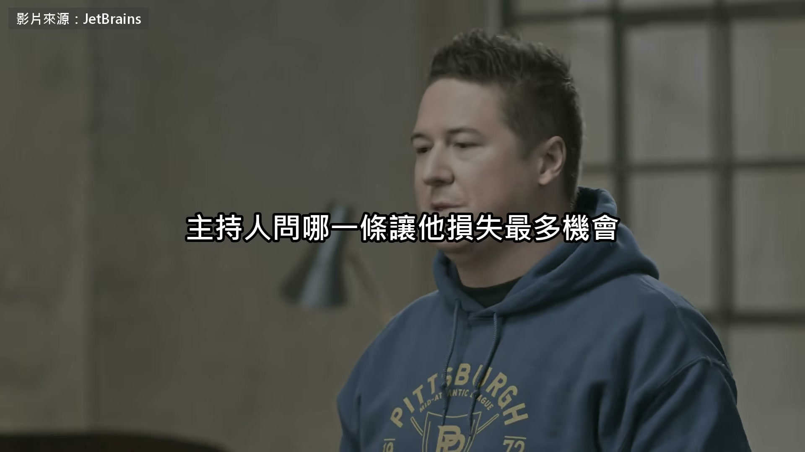

**逐字稿片段：** It was not the one about AI. It was the rule against venture backed companies. That just categorically eliminated, I would say, 95% of potential companies, because that's the model. Yeah, it's a hard one. It was a hard one to stand by, especially since that usually means higher salary as well. And so I had to be comfortable with taking a pay cut, if that was going to be a thing that was a value of mine.

**話題推測：** 切換到風險投資支持公司這項限制，以及它排除 95% 潛在公司的數字。

---

## 00:07:05

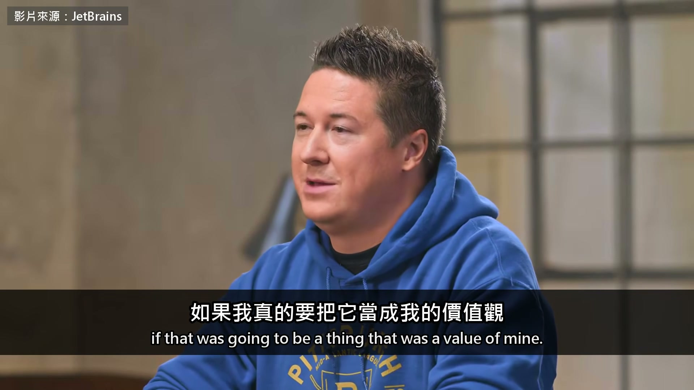

**逐字稿片段：** This February, after 3 months of searching, he joined a company called Skylight.

**話題推測：** 轉到他搜尋三個月後加入 Skylight 的新公司與時間線。

---

## 00:07:09

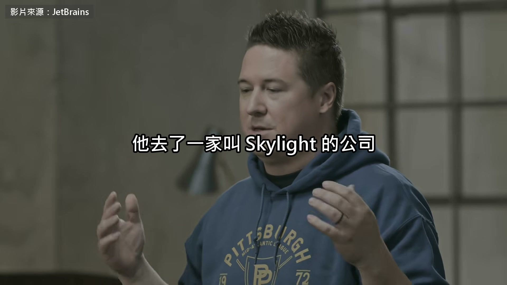

**逐字稿片段：** It makes a wall mounted family calendar tablet. Soccer practice times, what groceries to buy that week, the whole family shares one device. They echo a lot of the values that we covered, and they had this bonus, this cherry on top, which was, it was a product that I'm like the customer for. I had the product, I had the use case, I have the family. This is a product for families. I've been really wanting to do hardware tinkering. They're a hardware product. I really like that they're not in the Play Store. I don't have to deal with the whole Google thing. The interview did not return to AI until the second half.

**話題推測：** 切換到 Skylight 的壁掛式家庭行事曆平板產品介紹。

---

## 00:07:53

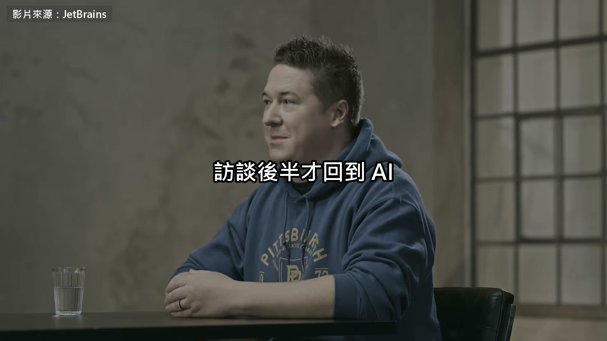

**逐字稿片段：** The host asked him about the Coinbase layoffs. He did not think that approach was sustainable. LLM prices are being subsidized by venture capital. Once those subsidies stop, companies that replaced engineers with AI will be the first to get burned. Have you tried writing code with AI agents?

**話題推測：** 話題回到 AI，轉入 Coinbase 裁員、LLM 補貼與企業用 AI 取代工程師的風險。

---

## 00:08:07

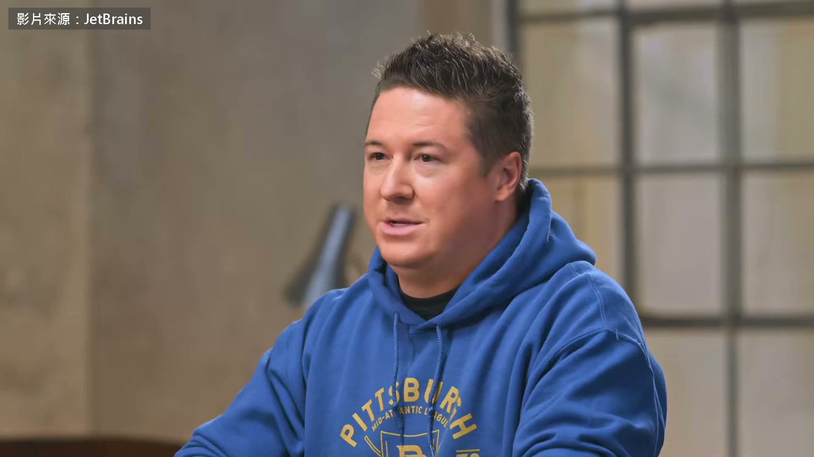

**逐字稿片段：** Never. I choose to take an extremist stance because I want to make sure that people are thinking about the thing that's behind what they're working with. I feel like by relying on these systems, you're essentially transferring power away from yourself. You're turning yourself into a replaceable cog that these companies can then throw away and pull in the cheaper version of you so that they can save money. He also made his position clear.

**話題推測：** 聚焦他從未使用 AI coding agents，以及採取極端反 AI 立場的原因。

---

## 00:08:40

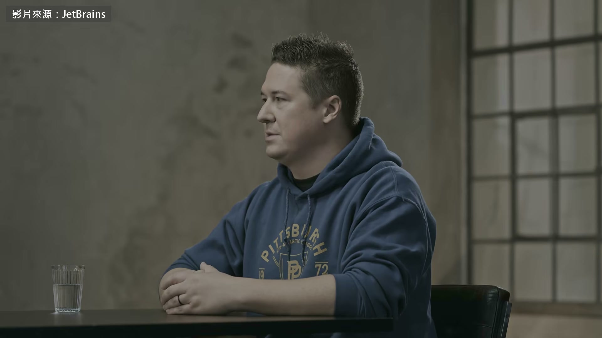

**逐字稿片段：** Using AI to do something he already knows how to do, he does not object to that. What he objects to is using it to write code beyond your own abilities. That means betting your future on a tool that could raise its prices at any time.

**話題推測：** 呈現他對 AI 的細緻立場：可用於已經會做的事，但反對用來跨越自身能力寫程式。

---

## 00:08:50

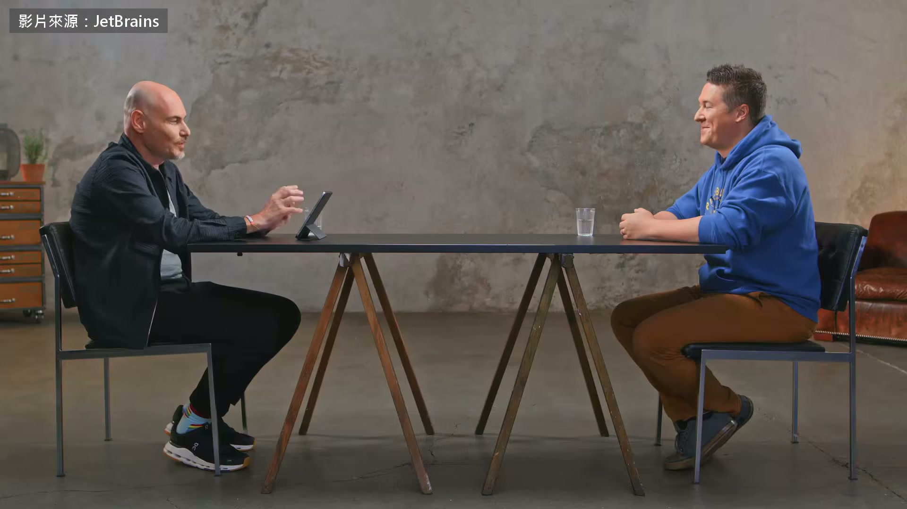

**逐字稿片段：** What's your plan B if AI writes better code than you in six months? I probably will just keep working at smaller and smaller companies and making less and less money, while retaining my happiness. Because I'm not at the beginning of my career. I'm not fighting to level up. I am very fortunate in the choices that I made. And it has given me a lot of opportunity and has put me in this position where I have the ability to take this hardline stance. A lot of people aren't in that. For the final question, the host asked,

**話題推測：** 切換到「如果 AI 六個月後寫得比你更好，備案是什麼」的職涯情境。

---

## 00:09:33

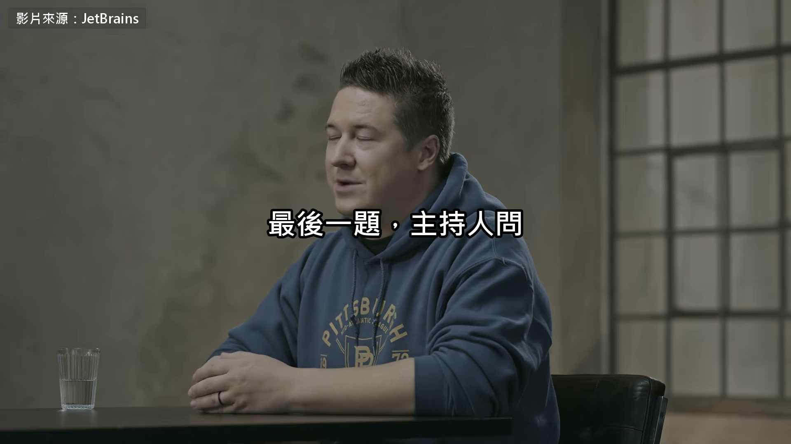

**逐字稿片段：** if Kotlin disappeared one day, what would the world lose? He said it would be a huge loss. But programming languages do not need to live forever. And you personally, what would you lose?

**話題推測：** 進入最終問題，轉到 Kotlin 消失後世界與程式設計社群可能失去什麼。

---

## 00:09:44

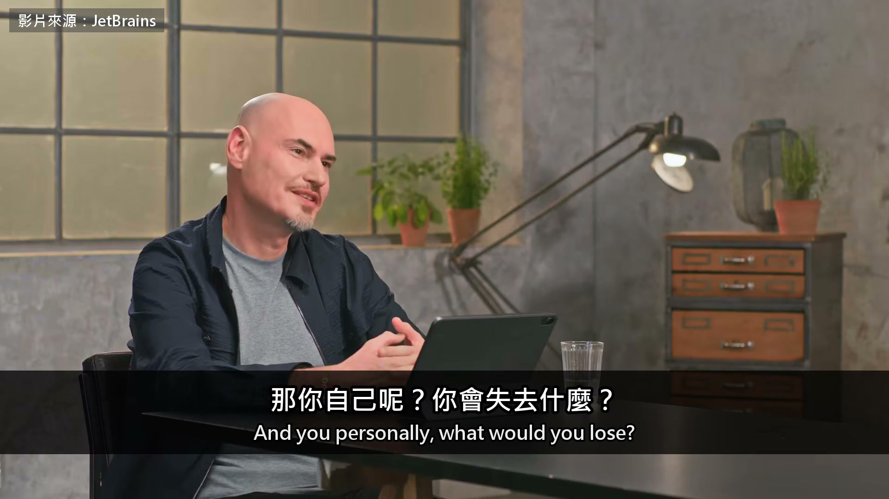

**逐字稿片段：** I would definitely lose my ability to probably have a job anywhere. I'm not skilled at any other language enough to really make money. I've sort of put all my eggs in the Kotlin basket. I'm very happy with putting all my efforts behind Kotlin and making that the thing I tie myself to. And yeah, so please, please don't make it go away.

**話題推測：** 聚焦他個人將職涯全部押在 Kotlin 上，以及失去 Kotlin 後的工作風險。

---

## 00:10:11

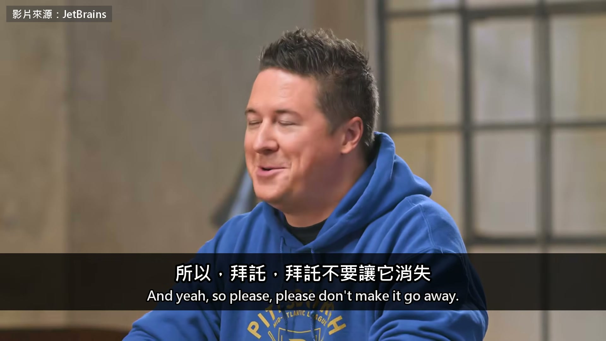

**逐字稿片段：** The first item on his list ruled out 80% of companies. He still made his choice by that list. Just like when he left Google, and when he left Cash App last year. Every time, it was the same. As for whether engineers can still afford to choose like that, he did not answer for anyone else. The original interview runs for more than 2 hours. He also explained why he thinks Swift is better designed than Kotlin, and why he is not a fan of Flutter. The link is in the description if you want to hear more.

**話題推測：** 結尾回顧清單限制、離職選擇與原始兩小時訪談的延伸內容。

---
