# ai-note-101_WH9k3RIHbhM — 關鍵畫面索引

- 來源逐字稿：[ai-note-101_WH9k3RIHbhM_GT.srt](ai-note-101_WH9k3RIHbhM_GT.srt)
- 影片：https://www.youtube.com/watch?v=WH9k3RIHbhM
- 截圖數：24

## 00:00:00

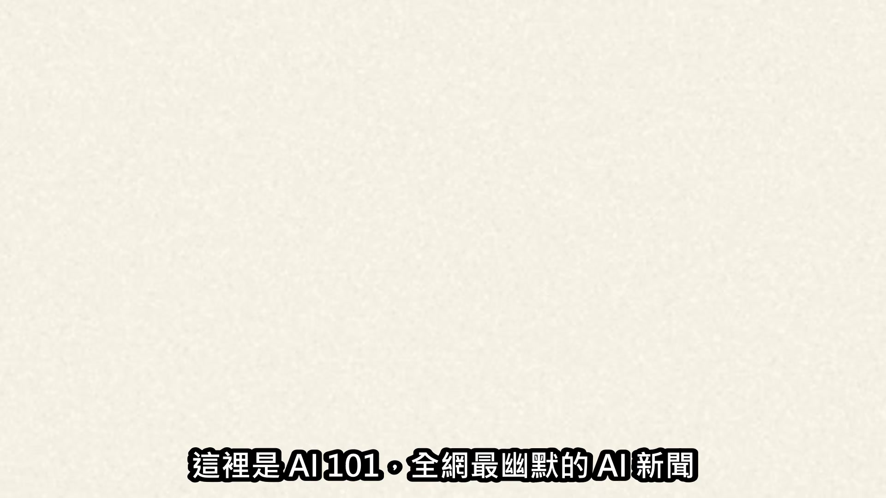

**逐字稿片段：** 這裡是 AI 101，全網最幽默的 AI 新聞

**話題推測：** 影片開場白與節目名稱

---

## 00:00:04

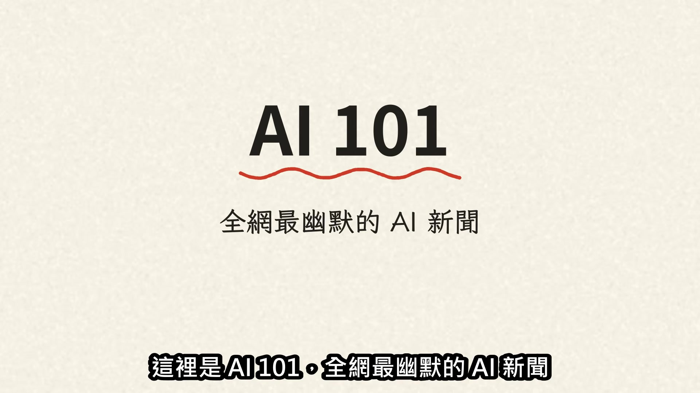

**逐字稿片段：** AI 月費吃到飽的時代正在結束：

**話題推測：** 介紹影片主旨：AI 月費吃到飽時代結束

---

## 00:00:07

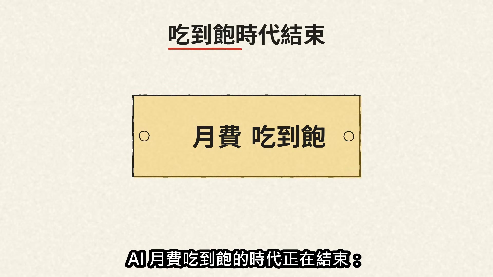

**逐字稿片段：** ChatGPT 加入廣告 200美元的方案也準備砍量

**話題推測：** 提及 ChatGPT 產品線的變動：廣告策略

---

## 00:00:10

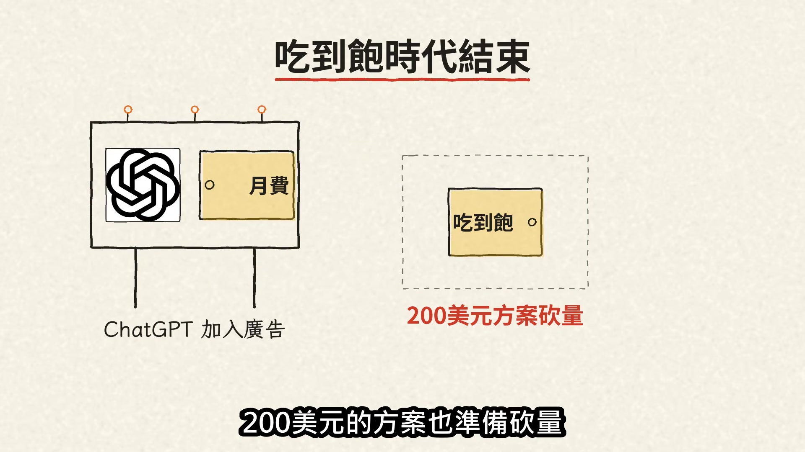

**逐字稿片段：** 就連堅持不放廣告的 Claude 訂閱補貼也可能撐不久 這張月票的價格，其實三年沒動過

**話題推測：** 引入新公司 Claude 的訂閱服務

---

## 00:00:18

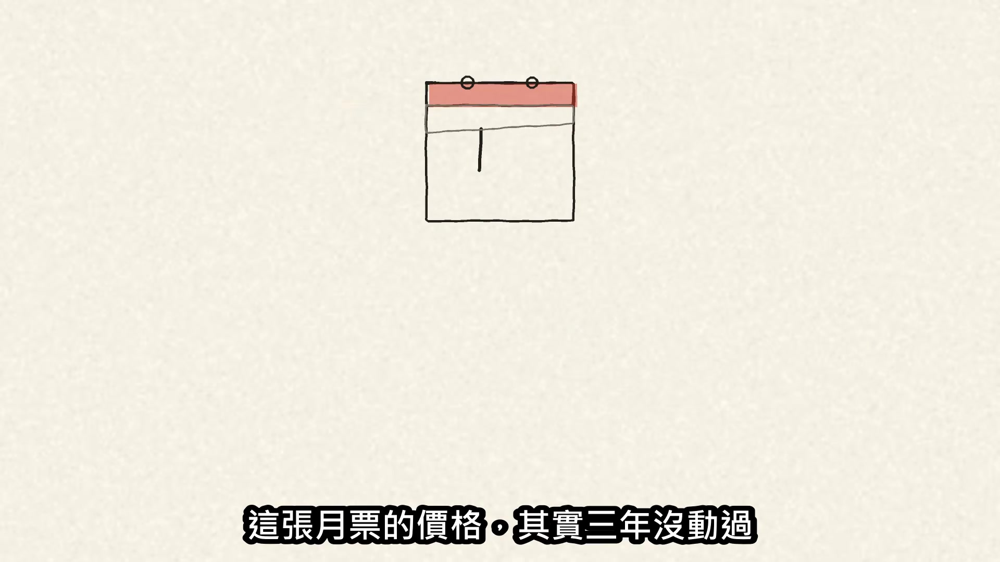

**逐字稿片段：** 2023年，ChatGPT Plus 每月20美元 Claude Pro 也同價

**話題推測：** 提供 ChatGPT Plus 的具體訂閱價格

---

## 00:00:23

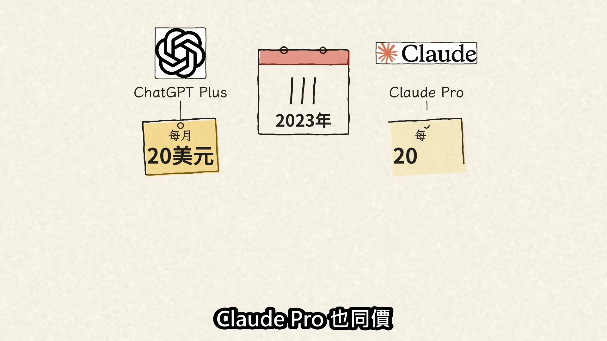

**逐字稿片段：** 月費沒漲，但能用多少算力，會變

**話題推測：** 話題從月費價格轉向算力用量變化

---

## 00:00:27

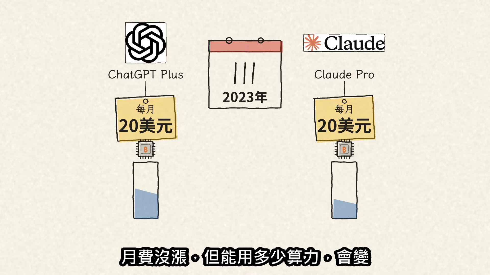

**逐字稿片段：** 最先變的是免費版 ChatGPT 2月開始測試廣告，才半年

**話題推測：** 聚焦於免費版服務的變動

---

## 00:00:32

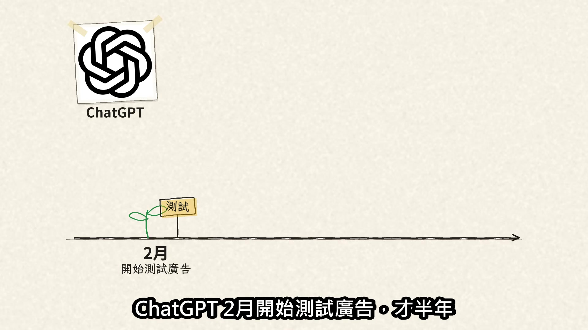

**逐字稿片段：** 8月底 OpenAI 就宣稱廣告年化營收速度衝到10億美元

**話題推測：** OpenAI 廣告營收的具體數字

---

## 00:00:36

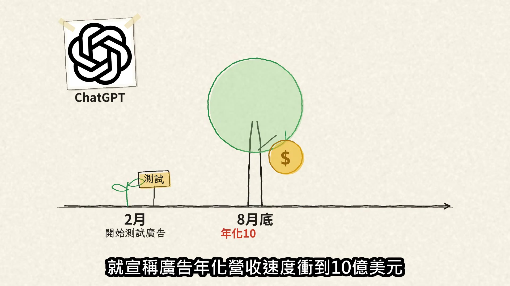

**逐字稿片段：** 到了10月，OpenAI 宣布預計在月底先於美國小規模測試生圖旁的廣告 那不想看廣告的人呢？ 廣告只出現在 Free 和 Go 方案 免費使用者可以改選無廣告模式 代價是訊息額度更少

**話題推測：** OpenAI 預計小規模測試生圖廣告的日期與細節

---

## 00:00:51

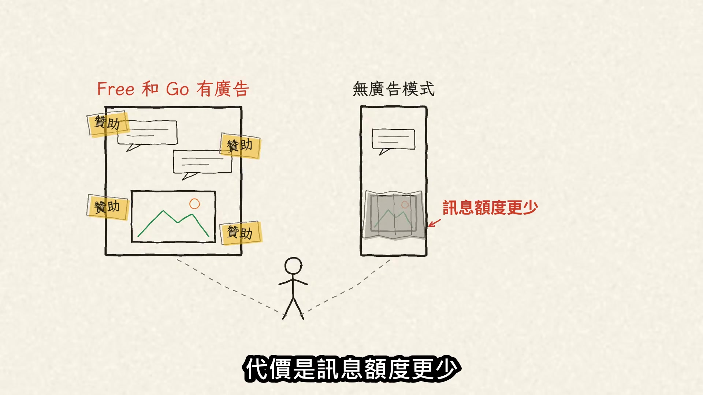

**逐字稿片段：** Plus、Pro、Business、 Enterprise 和 Edu 目前沒有廣告 免費版不看廣告，就只能接受更少功能

**話題推測：** 列舉目前無廣告的付費方案類型

---

## 00:00:59

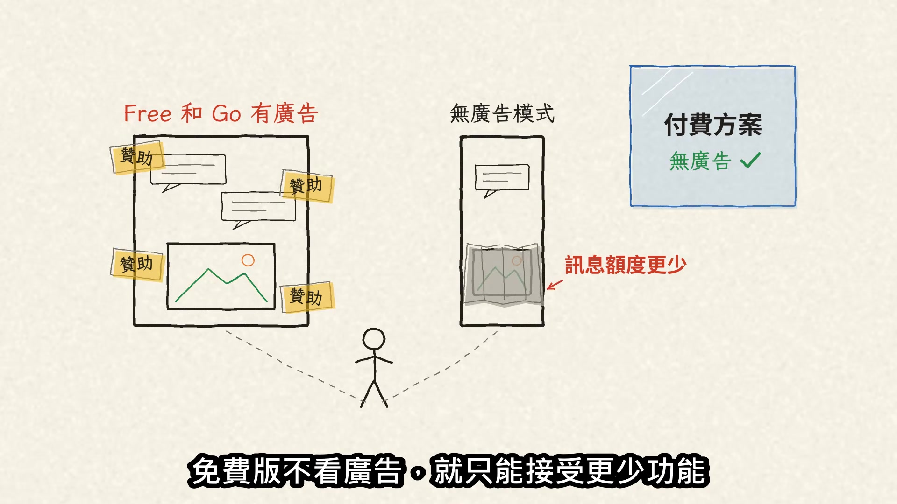

**逐字稿片段：** 付費的人也沒逃過

**話題推測：** 轉向討論付費方案的變化

---

## 00:01:01

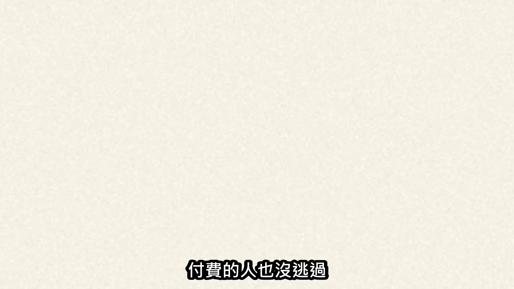

**逐字稿片段：** OpenAI 每月200美元的 Pro 200 價格不變

**話題推測：** 具體說明 OpenAI 每月200美元 Pro 方案

---

## 00:01:04

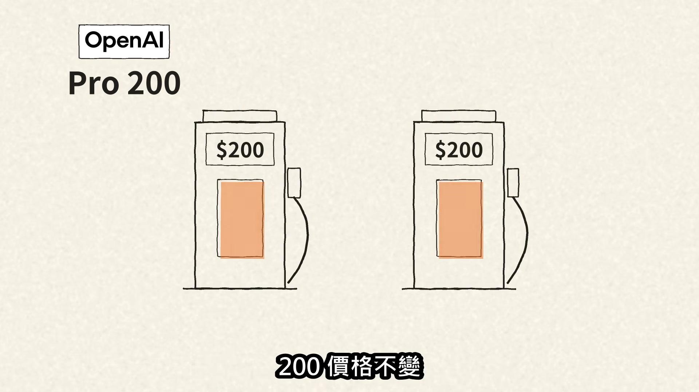

**逐字稿片段：** 但10月30日起 GPT-6 Pro 每週訊息從200則砍到100則 同樣的錢，用量只剩一半 所以想用得跟以前一樣多

**話題推測：** 告知 GPT-6 Pro 方案訊息額度被砍的具體日期與幅度

---

## 00:01:13

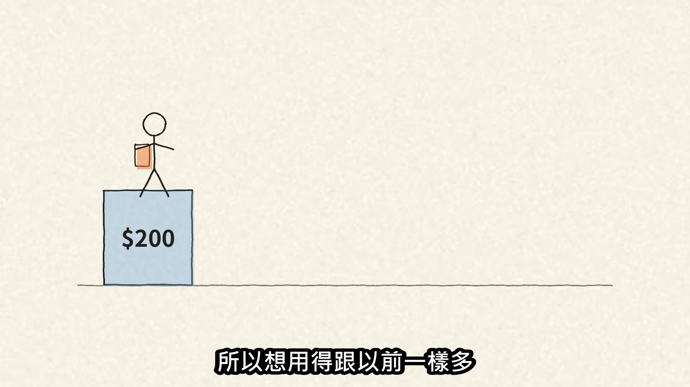

**逐字稿片段：** 就得往上爬到每月500美元的 Pro 500

**話題推測：** 介紹新的更高價位 Pro 500 方案

---

## 00:01:16

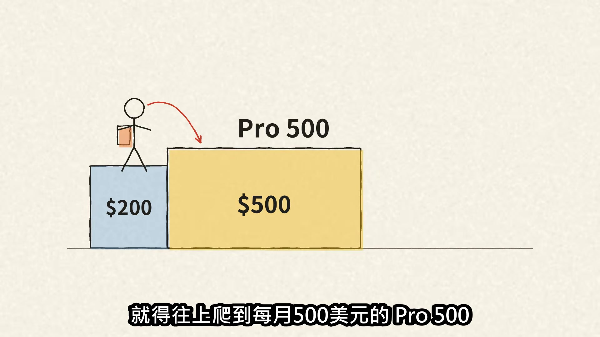

**逐字稿片段：** 可是獨立研究機構 SemiAnalysis 估算 它的量只比舊的200美元方案多約21% 奇怪的是，開發者用的 API 反而在降價 API 是讓程式照用量呼叫模型、 用多少付多少的介面

**話題推測：** 引用獨立研究機構 SemiAnalysis 的估算數據

---

## 00:01:33

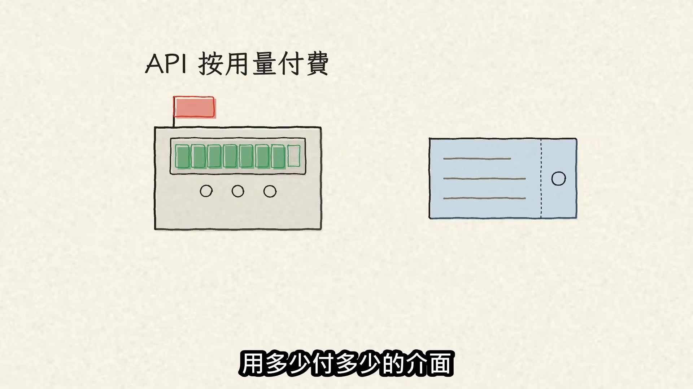

**逐字稿片段：** GPT-6 Sol 和 Luna 的價格大約減半 Opus 5.5 的表價也降了20% 為什麼月票反而縮水？ SemiAnalysis 估算，同樣每月20美元 Claude Pro 能用約29億 tokens ChatGPT Plus 只有約10億 差了大約2.9倍 給得這麼大方，代價不小

**話題推測：** 具體說明 GPT-6 Sol 和 Luna 等 API 的降價幅度

---

## 00:01:54

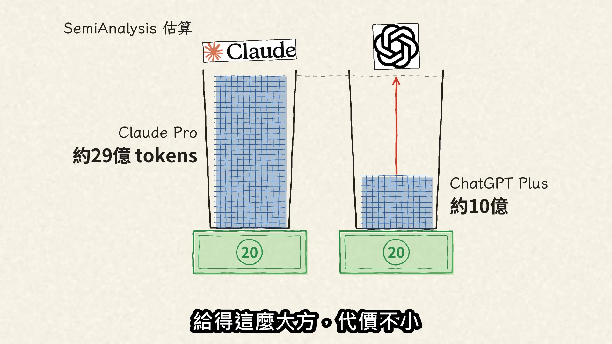

**逐字稿片段：** SemiAnalysis 粗估 Claude 訂閱吃掉 Anthropic 約41.7%的推論算力 卻只帶來約10%營收 這張月票，可能是一筆昂貴的補貼

**話題推測：** SemiAnalysis 估算 Claude 訂閱服務消耗的算力與營收不成比例

---

## 00:02:07

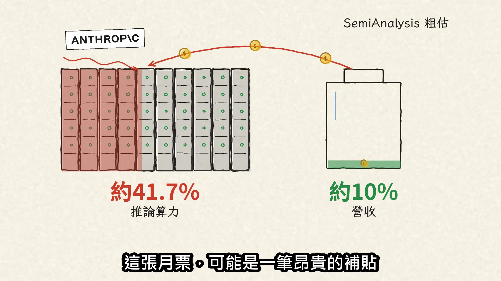

**逐字稿片段：** 那 Anthropic 也放廣告呢？

**話題推測：** 探討 Anthropic 是否也會引入廣告的可能性

---

## 00:02:09

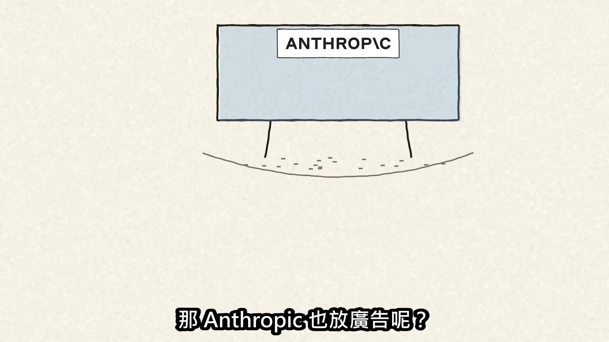

**逐字稿片段：** 它早就承諾不會，還在超級盃廣告直說： 「廣告會來到 AI，但不會來 Claude」 所以若要降低訂閱補貼 能調的旋鈕就更集中在價格、 額度和模型權限

**話題推測：** 提及 Anthropic 在超級盃廣告中承諾不放廣告

---

## 00:02:23

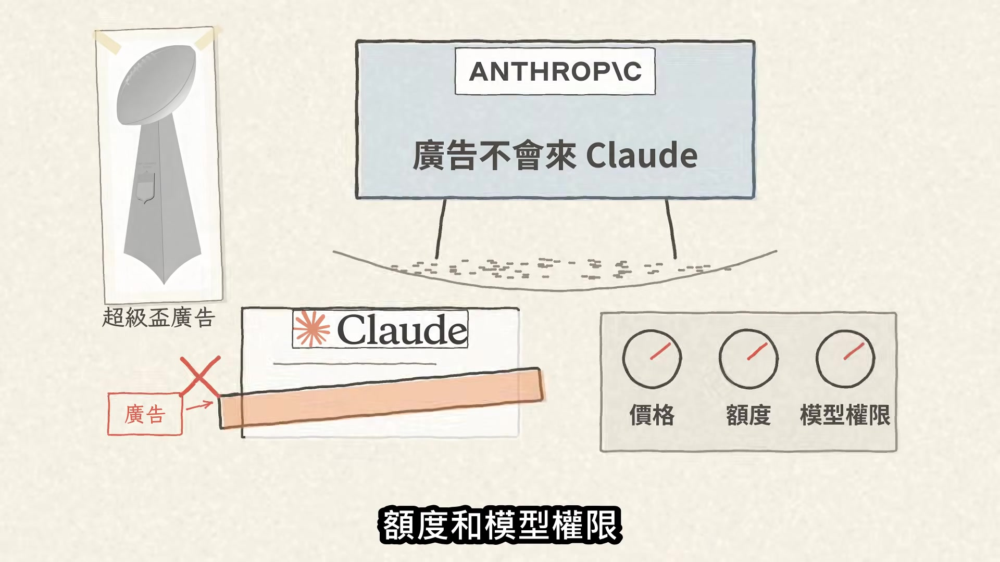

**逐字稿片段：** 偏偏 Anthropic 的財務壓力很大

**話題推測：** 闡述 Anthropic 公司的財務壓力狀況

---

## 00:02:26

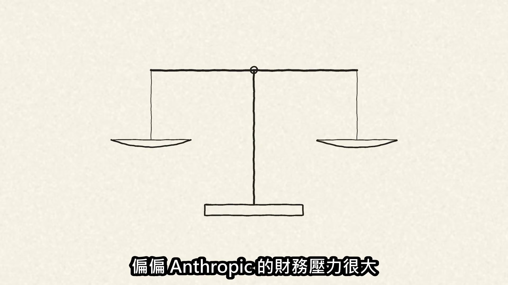

**逐字稿片段：** 招股書顯示，2025年營收約46億美元 營業損失卻有約80.6億美元 營業損失比營收還大

**話題推測：** 引用招股書顯示 Anthropic 的營收與損失數據

---

## 00:02:34

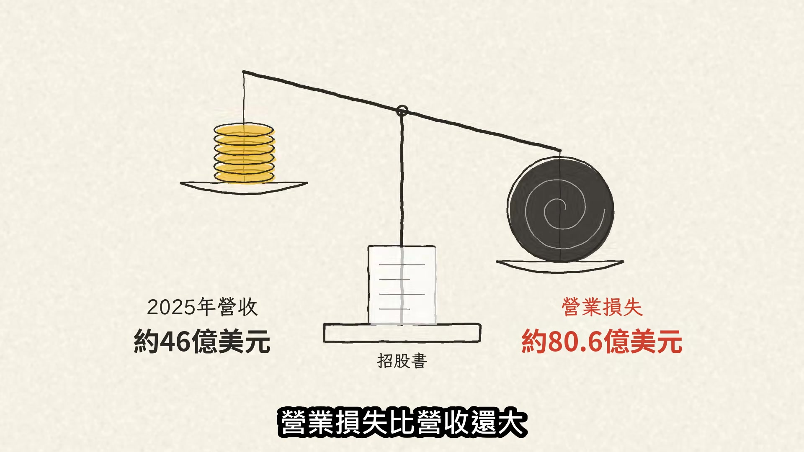

**逐字稿片段：** 往後看，10月還有3個日子

**話題推測：** 展望未來十月的幾個重要日期

---

## 00:02:37

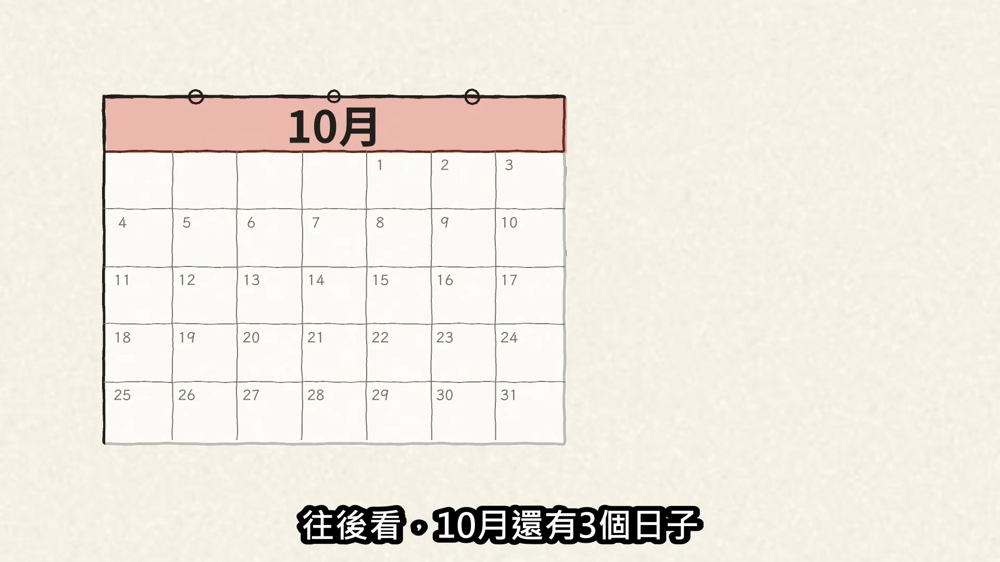

**逐字稿片段：** 會讓免費和付費都更緊：10月9日起 Gemini 免費版預定只剩 Flash-Lite 10月29日，Pro 200 舊額度到期10月底，ChatGPT

**話題推測：** 提及 10月9日 Gemini 免費版功能限制的變化

---

## 00:02:45

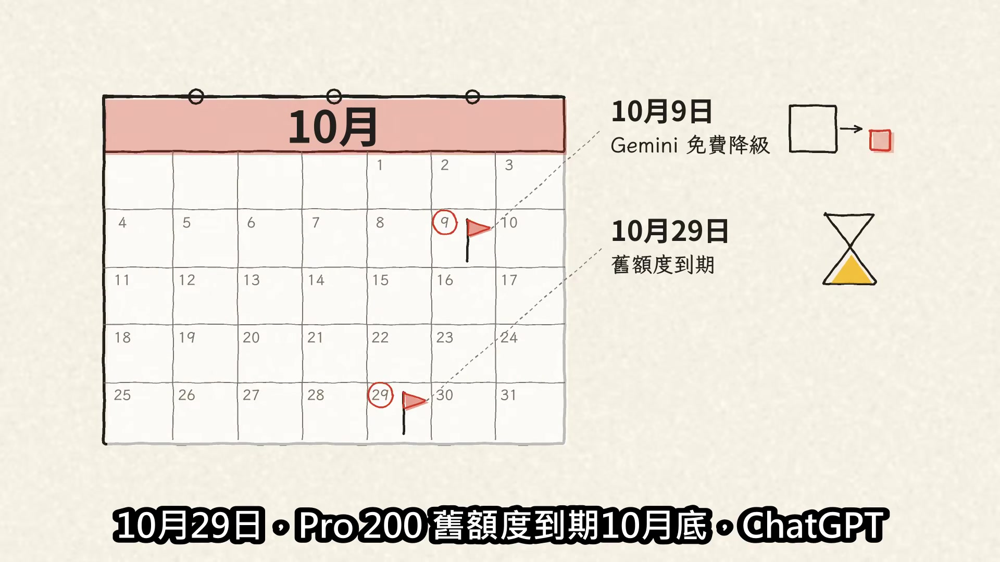

**逐字稿片段：** 預計在美國小規模測試生圖旁的廣告 把這些拼起來，AI 公司正在收回讓使用者靠固定月票大量消耗算力的補貼 免費使用者用注意力付 重度使用者用更高月費付吃到飽 正變成隨時能調整額度的信用池

**話題推測：** 提及 10月底 ChatGPT 在美國測試生圖旁廣告的事件

---
