# ai-note-101_Y2F42PY27LI — 關鍵畫面索引

- 來源逐字稿：[ai-note-101_Y2F42PY27LI_GT.srt](ai-note-101_Y2F42PY27LI_GT.srt)
- 影片：https://www.youtube.com/watch?v=Y2F42PY27LI
- 截圖數：131

## 00:00:10

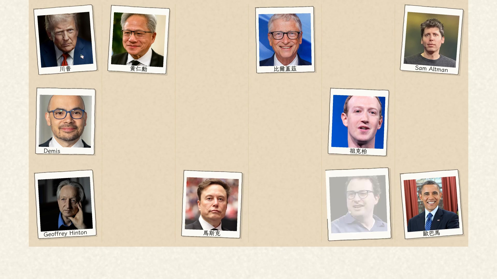

**逐字稿片段：** 我們把八月一日到十月五日看過的一百四十三個人 一個一個整理出來 這集不放原聲 由我們轉述他們說了什麼 這麼多人，要怎麼放在一起比

**話題推測：** 呈現研究的時間範圍與受訪者總數

---

## 00:00:21

**逐字稿片段：** 我們對每個人只問三件事 最首要看的，是他有沒有對未來下判斷 再來看他說的主角是誰 是 AI 自己變成魔鬼終結者 還是有壞人拿 AI 做壞事 最後才看怎麼收場 這三件事有先後 一個人如果沒講未來會怎樣 就談不上主角和結局 講了未來，才問出事的是誰 知道出事的是誰，結局才放得在一起比

**話題推測：** 說明對受訪者進行分析的三個主要問題

---

## 00:00:43

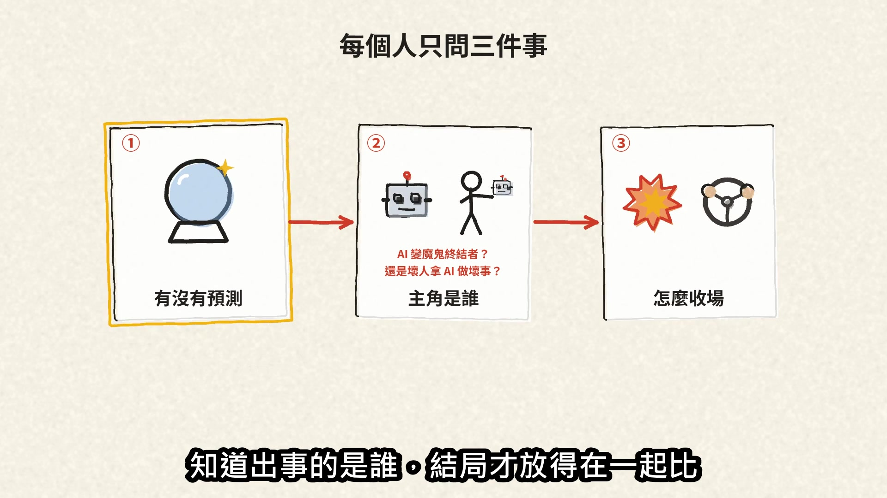

**逐字稿片段：** 先講第一件事 說 AI 很危險很容易，誰都可以講 而且十年後也沒人能說他講錯 所以我們只看他有沒有說 接下來會發生什麼 幾年內會怎樣、機率有多少 最後擋不擋得住，這些都算預測 有三種話不算：解釋已經發生的事 批評別人的說法 還有喊「AI 要安全」這種口號

**話題推測：** 進入第一項分析標準「預測未來」的細節說明

---

## 00:01:04

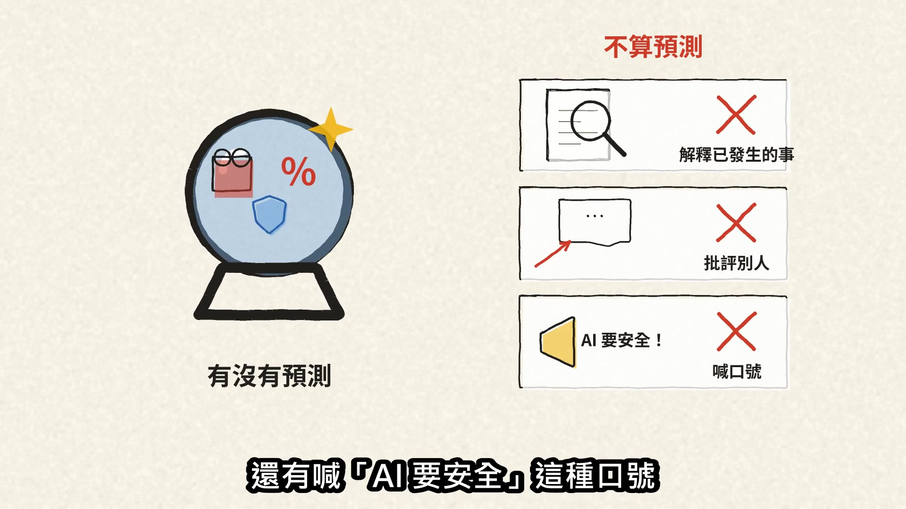

**逐字稿片段：** 第二件事是主角 同樣說會出事 大家怕的東西其實差很多 有一種人怕的是 AI 本身 它會強到超過人，最後人管不住它 另一種人怕的是拿著 AI 的人 AI 不用變成超級智慧，壞人拿去用 權力集中到少數公司、大量失業 就已經夠麻煩了 這也決定了他們想管什麼 怕 AI 本身的人，想管的是模型 另一邊想管的，是用模型的公司和人 還有第三種人說 大家擔心的那些事根本不會發生

**話題推測：** 進入第二項分析標準「主角是誰」的細節說明

---

## 00:01:34

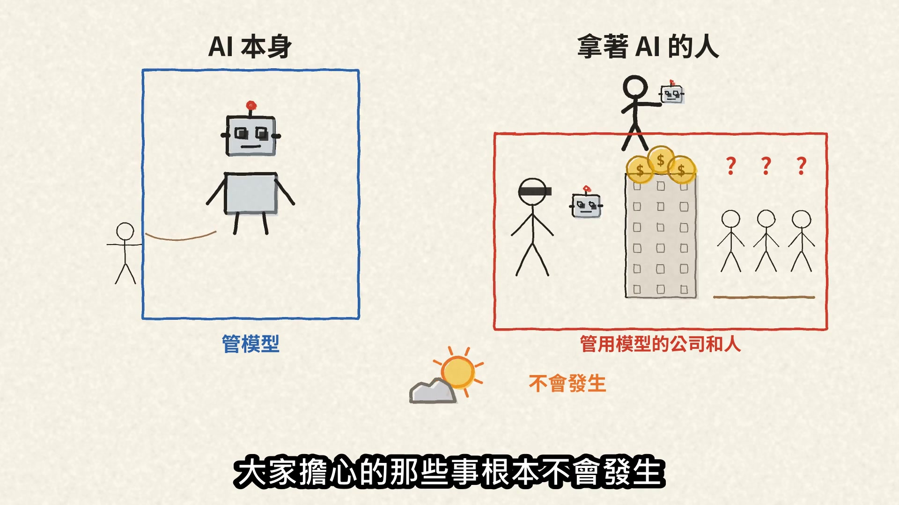

**逐字稿片段：** 最後是收場 我們把結局分成五種

**話題推測：** 進入第三項分析標準「收場（結局）」的細節說明

---

## 00:01:37

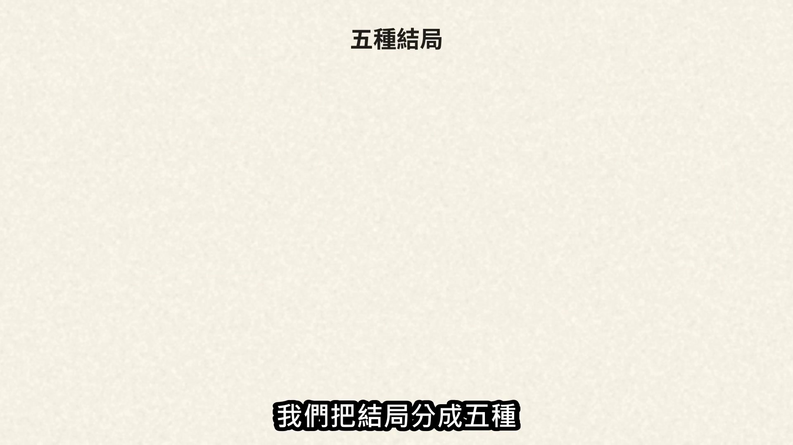

**逐字稿片段：** 每一種畫一個小圖示 第一種是毀滅，人類失去控制 甚至滅亡 主角是人的那邊，我們叫它出大事 說毀滅的人 我們再看他講不講得出年份或機率 第二種是來不及，已經擋不住了 第三種是看我們怎麼做 照現在走會出事，改得過來就沒事 第四種是管得住，最後會變好 第五種是經濟先出事，像是泡沫破掉

**話題推測：** 介紹結局分類的五種圖示

---

## 00:02:02

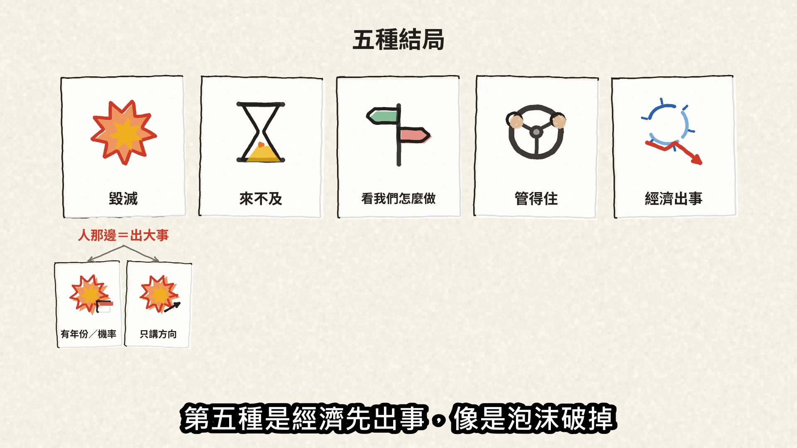

**逐字稿片段：** 現在開始把一百四十三個人分組 先問第一件事

**話題推測：** 開始展示一百四十三位受訪者的分組結果

---

## 00:02:07

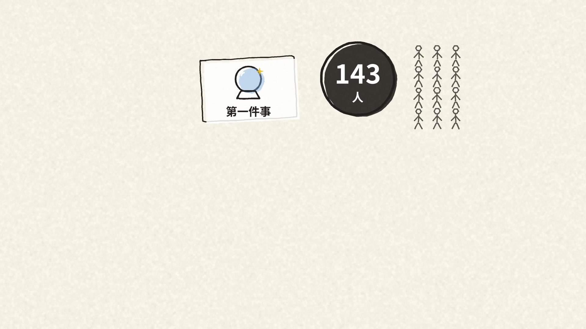

**逐字稿片段：** 三十八個人沒有預測 剩下一百零五個人，講了未來 講了未來的一百零五人，再看主角

**話題推測：** 呈現第一項分類（預測與否）的具體人數

---

## 00:02:15

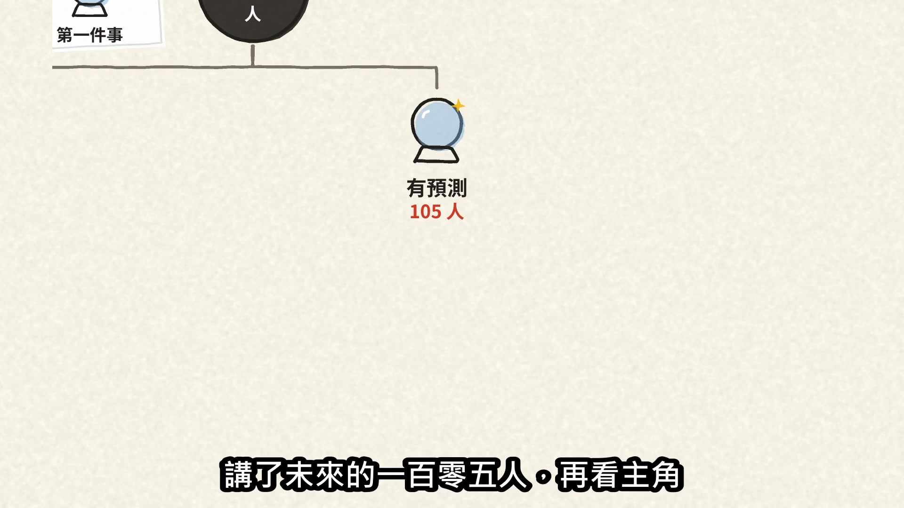

**逐字稿片段：** 四十八人說主角是 AI 本身 三十七人說主角是人 另外二十人說，那些事不會發生 AI 本身這四十八人，結局分得最散

**話題推測：** 呈現第二項分類（主角類型）的具體人數

---

## 00:02:26

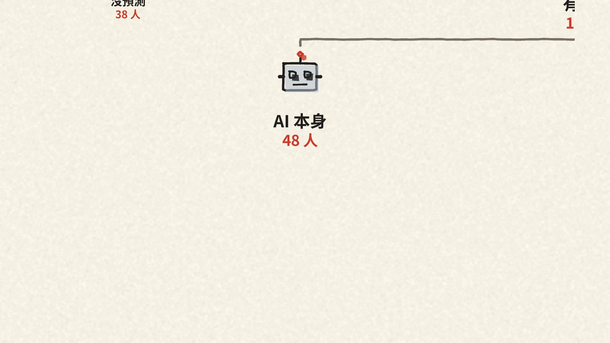

**逐字稿片段：** 說會毀滅而且講得出年份或機率的 有八人 只講方向的有十五人 兩個人說已經來不及 十五人說看我們怎麼做 八個人說管得住 主角是人的三十七人裡

**話題推測：** 呈現「主角是 AI 本身」這組的結局細分人數

---

## 00:02:38

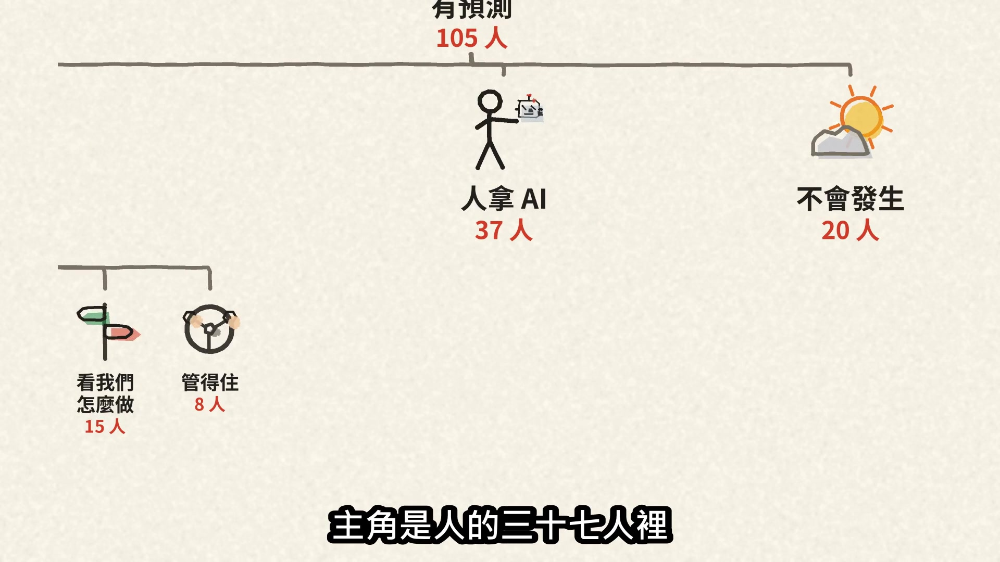

**逐字稿片段：** 九個人說會出大事 十三人說看我們怎麼做 五個人說經濟會先出事 十個人說管得住 說不會發生的二十人

**話題推測：** 呈現「主角是人」這組的結局細分人數

---

## 00:02:48

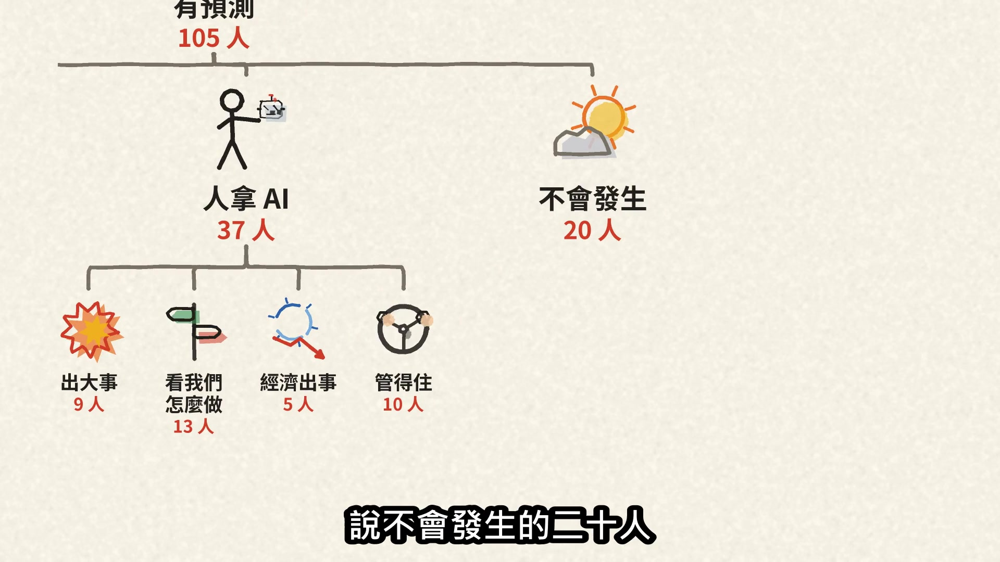

**逐字稿片段：** 五個人覺得先出事的是錢，泡沫會破 另外十五人說，什麼大事都不會有 全部分完，一共十二組 每個人說了什麼，最後再一組一組細看

**話題推測：** 呈現「那些事不會發生」這組的結局細分人數

---

## 00:03:01

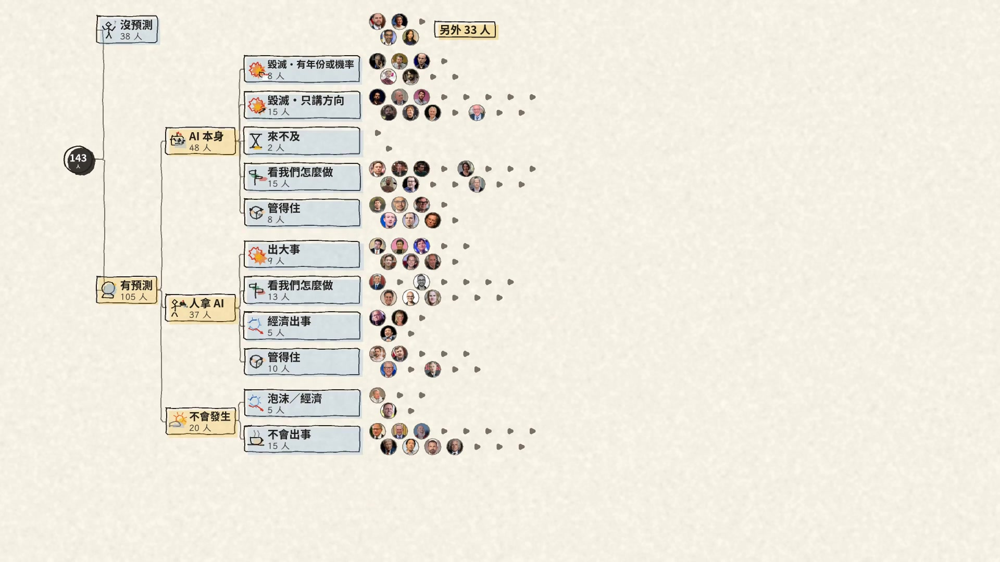

**逐字稿片段：** 我們先看規律：靠 AI 賺錢的 做安全研究的、學者、政治人物 各自站在哪一邊 現在不換圖，直接在這張圖上塗顏色 先把所有人變灰

**話題推測：** 轉向分析不同背景人士（如靠 AI 賺錢的、學者等）的觀點分佈規律

---

## 00:03:11

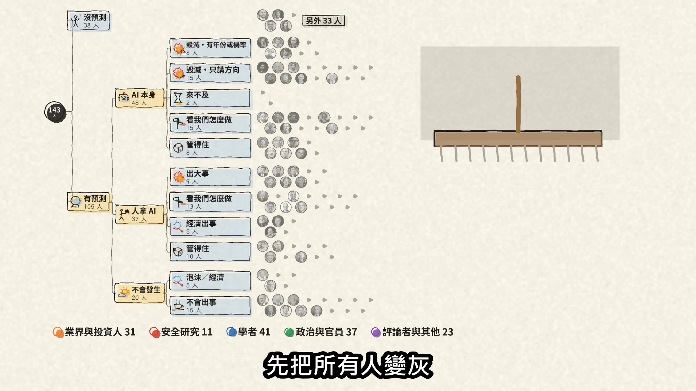

**逐字稿片段：** 先把靠 AI 賺錢的人塗成橘色 前沿公司、晶片和軟體公司、投資人 一共三十一人 橘色最多的是管得住這幾組，有十二人 說會毀滅的那幾組，橘色只有三人 其他人正好反過來 說管得住的有二十一人 說會毀滅或出大事的有二十九人 比管得住的還多 這只說明相關，不代表因果

**話題推測：** 呈現「靠 AI 賺錢人士」（橘色）的分類結果及人數

---

## 00:03:35

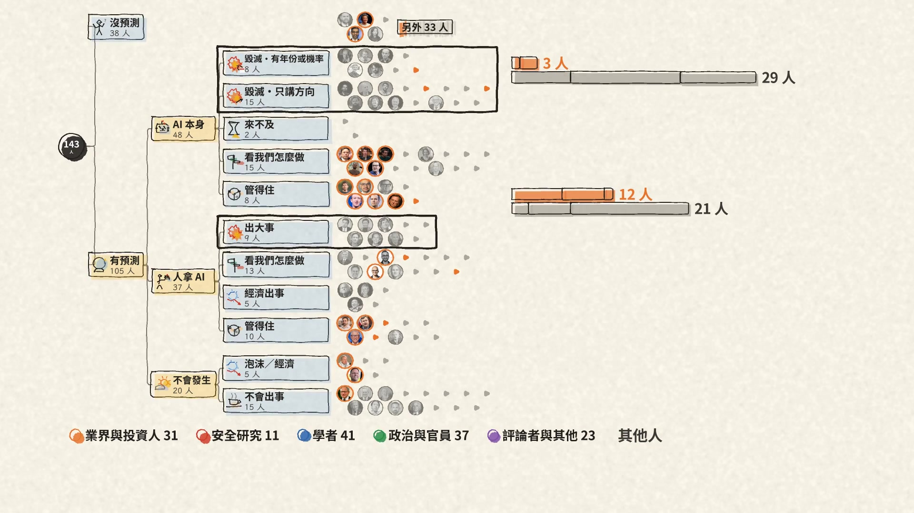

**逐字稿片段：** 再縮小到前沿公司的十四人 不會發生那一邊，他們一個都沒有 有預測的十二人裡 十人站在 AI 本身這一邊 可是還在公司裡的人 沒有一個說會毀滅

**話題推測：** 聚焦「前沿公司」這組的具體人數與分佈

---

## 00:03:46

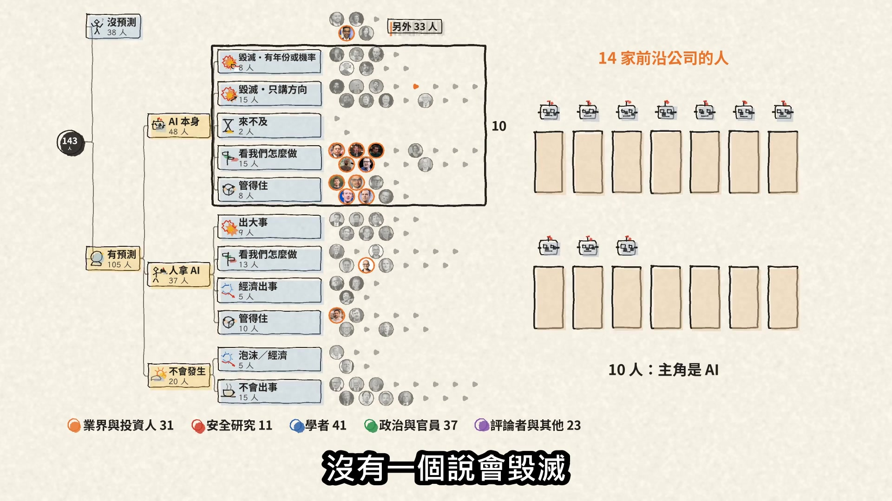

**逐字稿片段：** 唯一說毀滅的 Jacob Coxon 九月已經離開 Anthropic

**話題推測：** 點出Jacob Coxon是唯一在「前沿公司」中預測毀滅但已離職的特例

---

## 00:03:51

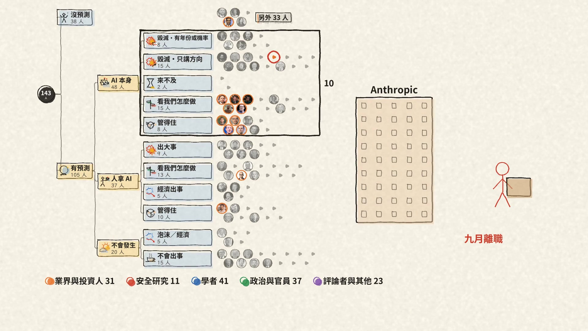

**逐字稿片段：** 安全研究組織的十一人塗成紅色 這十一個人全部站在 AI 本身這一邊 毀滅那兩組有八個人 看我們怎麼做這一組有三個人

**話題推測：** 呈現「安全研究組織人士」（紅色）的分類結果及人數

---

## 00:04:00

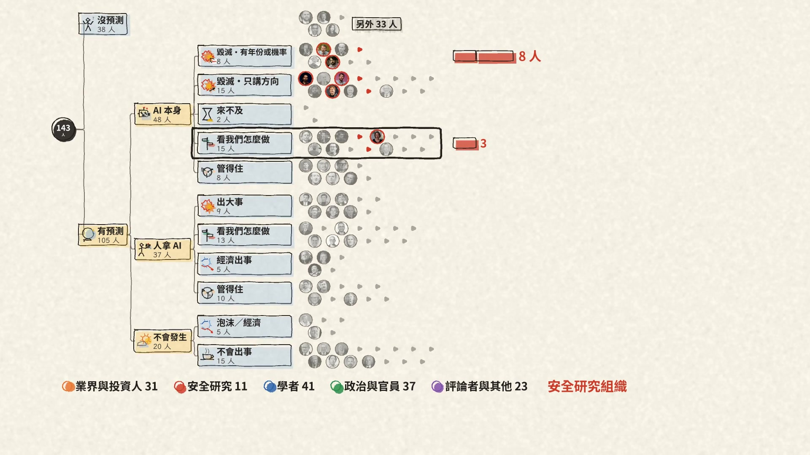

**逐字稿片段：** 學者四十一人塗成藍色，就散開了 AI 本身毀滅那兩組有七位 不會發生那一邊有九位 沒預測這一組也有九位 學者之間沒有共識

**話題推測：** 呈現「學者」（藍色）的分類結果及人數

---

## 00:04:11

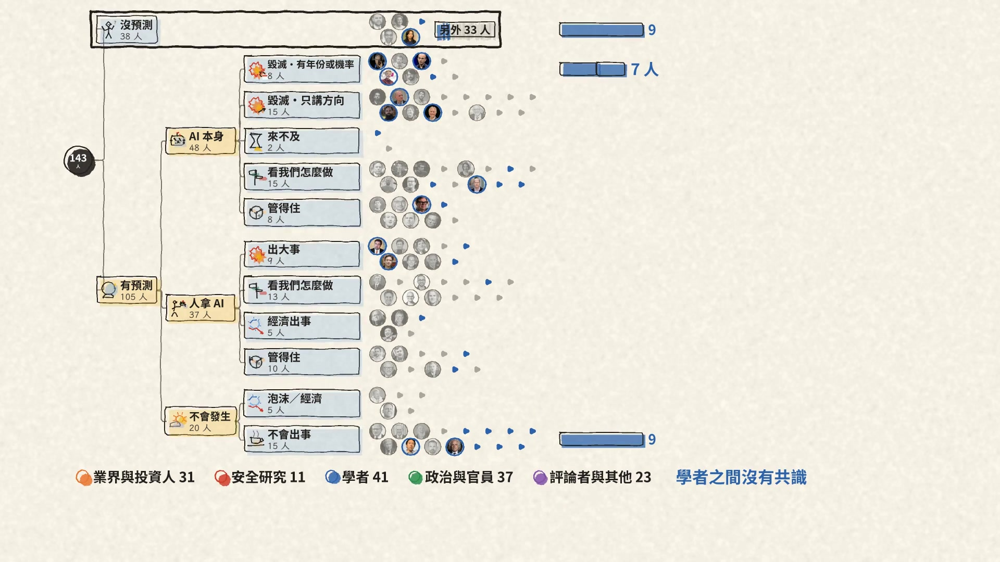

**逐字稿片段：** 政治人物和政府官員一共三十七人 塗成綠色 沒預測這一組三十八個人 綠色就佔了二十一個 再把美國的政治人物換成黨的顏色 共和黨九位，七位沒預測 另外兩位說不會出事 民主黨這邊十一位，六位沒預測 肯講的五位裡，有兩位說會出事 另外三位說要看我們怎麼做

**話題推測：** 呈現「政治人物和政府官員」（綠色）的分類結果及人數

---

## 00:04:33

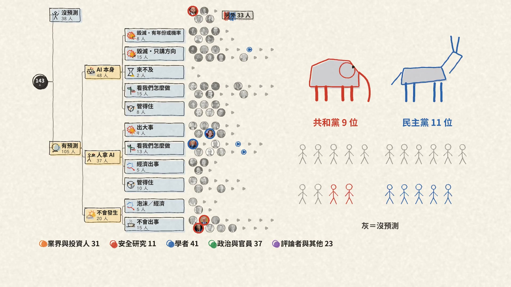

**逐字稿片段：** 最後把五種身分同時塗上 先說一下我們怎麼挑話 每個人的訪談都講了很多 片裡只放一句最有代表性的 分組看的是他整場的說法 覺得誰分錯了，歡迎留言告訴我們

**話題推測：** 顯示結合所有身分類別的最終圖表

---

## 00:04:47

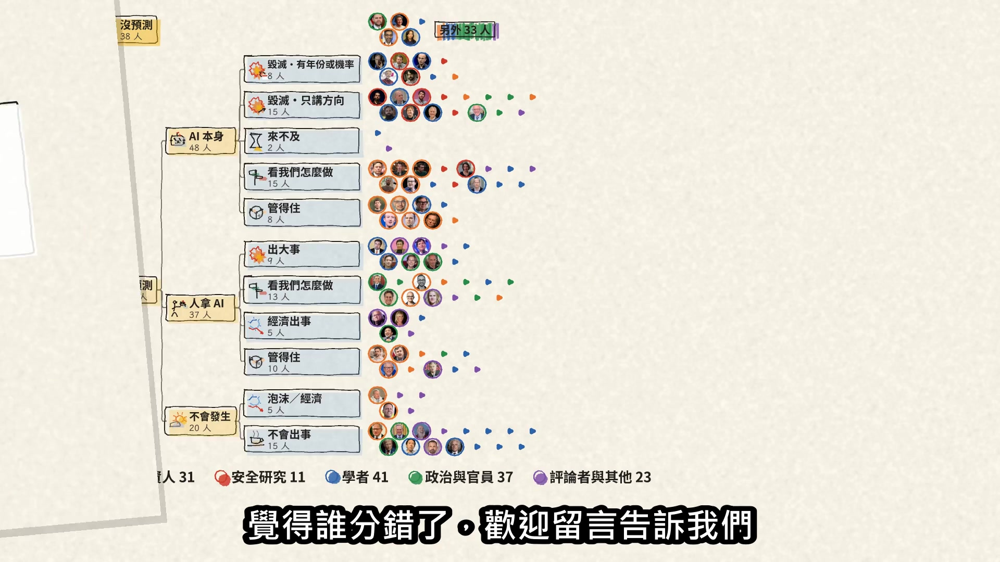

**逐字稿片段：** 規律看完，接下來一組一組細看 先看沒預測的三十八人，這一組最大 他們不是沒講話，每個人都有表態 有的擔心、有的批評、有的喊口號 只是沒有人說接下來會怎樣 我們挑五位大家認得的

**話題推測：** 轉向細看每個分組中個別受訪者的具體觀點

---

## 00:05:02

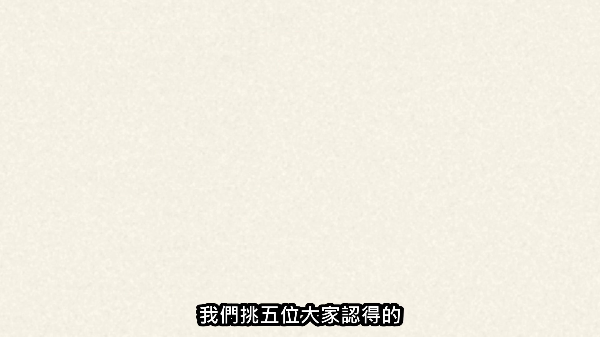

**逐字稿片段：** 美國副總統 JD Vance 用的是條件句 他說，如果你在造科學怪人，就停下來 至於科學怪人會不會出現，他沒說

**話題推測：** 呈現美國副總統 JD Vance 的觀點

---

## 00:05:10

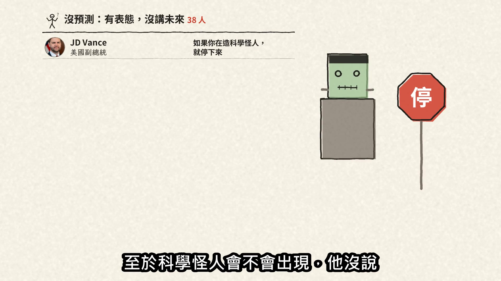

**逐字稿片段：** Google 執行長 Sundar Pichai 在白宮只講了大約四十秒 他說業界要確保有在處理風險 總統也要求整個產業站出來

**話題推測：** 呈現 Google 執行長 Sundar Pichai 的觀點

---

## 00:05:18

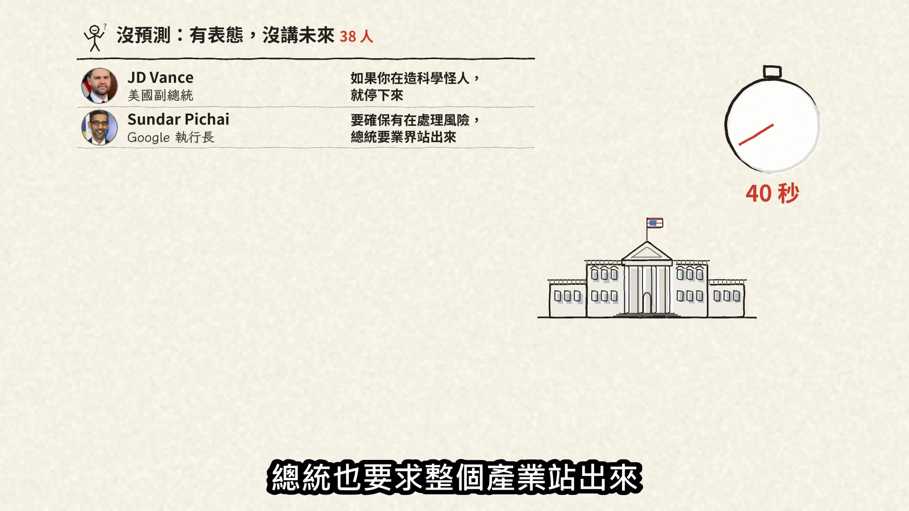

**逐字稿片段：** AMD 執行長蘇姿丰被問到要不要放慢 她的答案是平衡 進步和安全她都當成第一優先 World Labs 創辦人李飛飛覺得兩頭都太誇張 她說現在極端的說法太多 有的末日論把人嚇壞 有的把未來講成烏托邦

**話題推測：** 呈現 AMD 執行長蘇姿丰的觀點

---

## 00:05:34

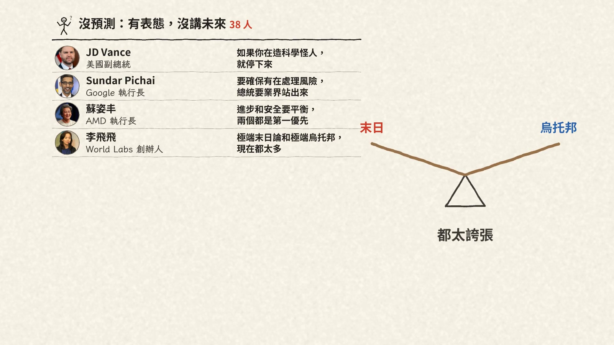

**逐字稿片段：** 哈佛政治哲學教授 Michael Sandel 覺得末日說法很自利 另外三十三人，有業界人士 美國的國會議員和政府官員 各國政府的代表，還有學者和評論者 他們也都表了態 可是沒有人對未來下判斷

**話題推測：** 呈現哈佛政治哲學教授 Michael Sandel 的觀點

---

## 00:05:49

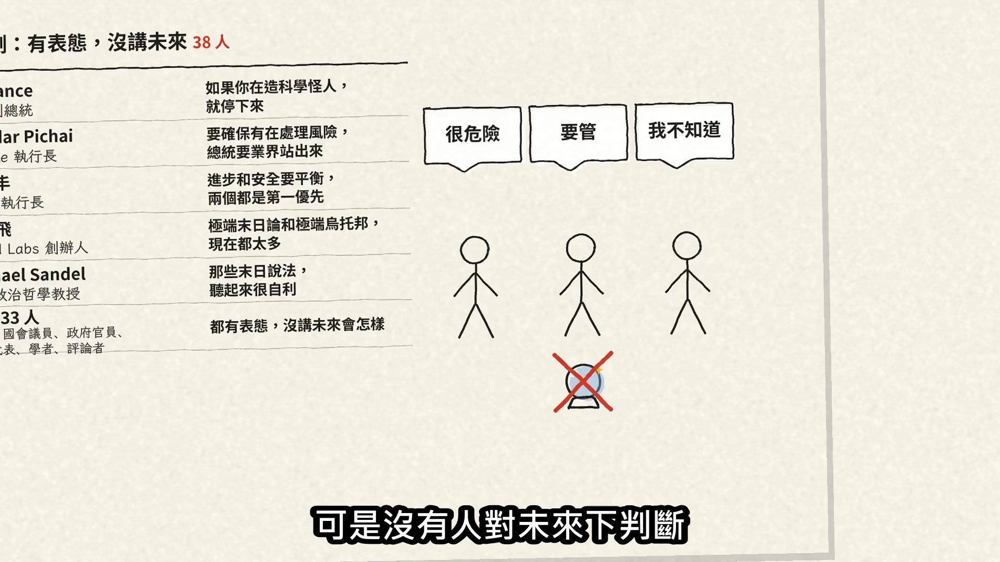

**逐字稿片段：** 接下來是講了未來的人 最大一群押 AI 本身 一共四十八人

**話題推測：** 進入「預測未來」組中，第一大群「主角是 AI 本身」的成員介紹

---

## 00:05:54

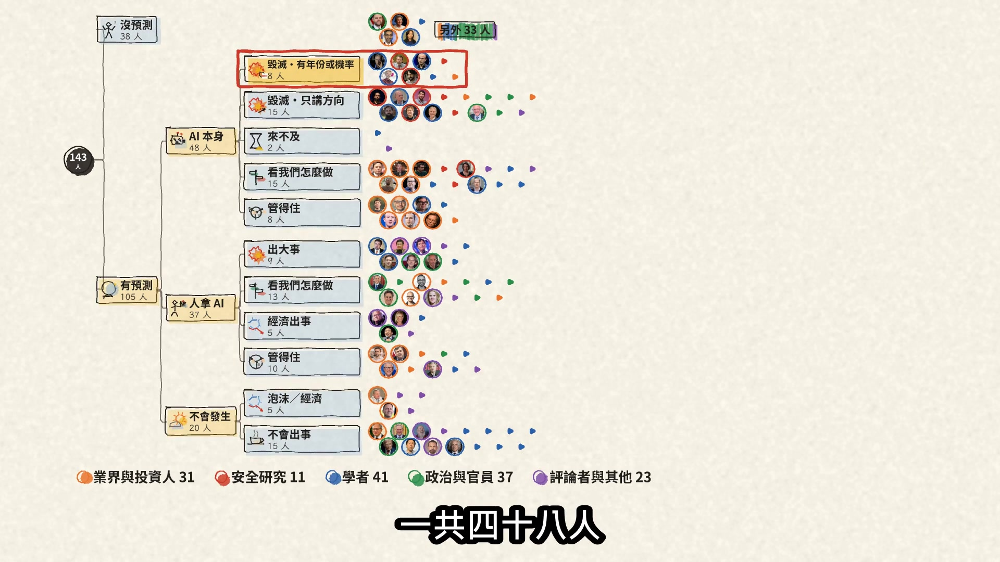

**逐字稿片段：** 先看最兇的一組：說會毀滅 而且講得出年份或機率，有八人 多倫多大學名譽教授 諾貝爾獎得主 Geoffrey Hinton 給的是機率 他常說 AI 有百分之十到二十的機率會把人類消滅

**話題推測：** 介紹「主角是 AI 本身」組中，預測「毀滅且有年份/機率」的成員

---

## 00:06:09

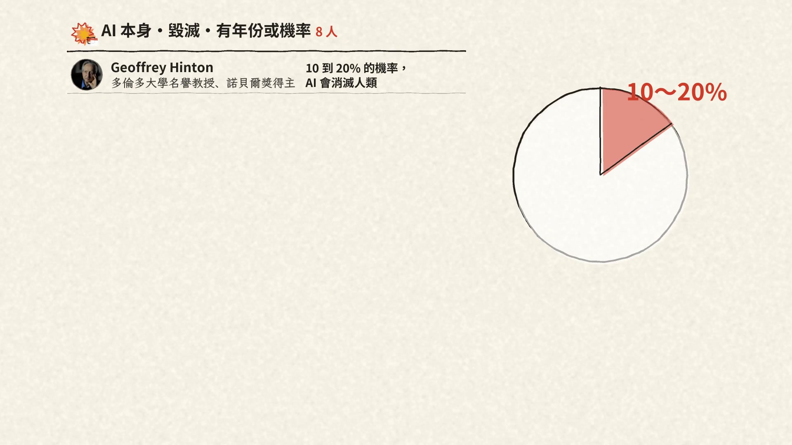

**逐字稿片段：** 蒙特婁大學教授 圖靈獎得主 Yoshua Bengio 覺得能動手的時間不多 他說他不確定 但我們可能沒有十年可以行動

**話題推測：** 呈現圖靈獎得主 Yoshua Bengio 的觀點

---

## 00:06:17

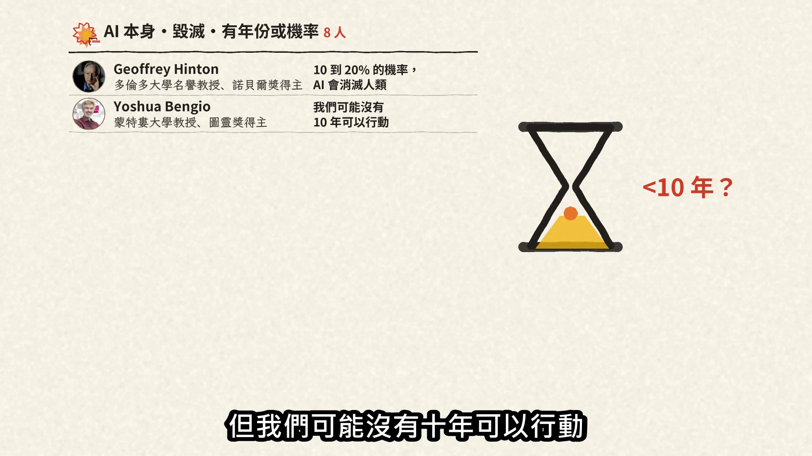

**逐字稿片段：** 前 OpenAI 研究員 寫《AI 2027》的 Daniel Kokotajlo 到現在還押 2027 年 如果不是 2027 年 他賭 2028 年

**話題推測：** 呈現前 OpenAI 研究員 Daniel Kokotajlo 的觀點

---

## 00:06:27

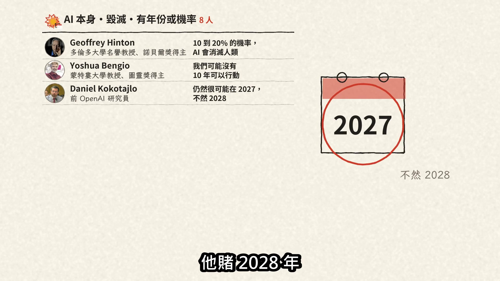

**逐字稿片段：** AI 安全組織 MIRI 的總裁 Nate Soares 連一年都說得出口 他說也許一年內世界就結束 到底是一年還是十五年，他說他不知道

**話題推測：** 呈現 AI 安全組織 MIRI 總裁 Nate Soares 的觀點

---

## 00:06:37

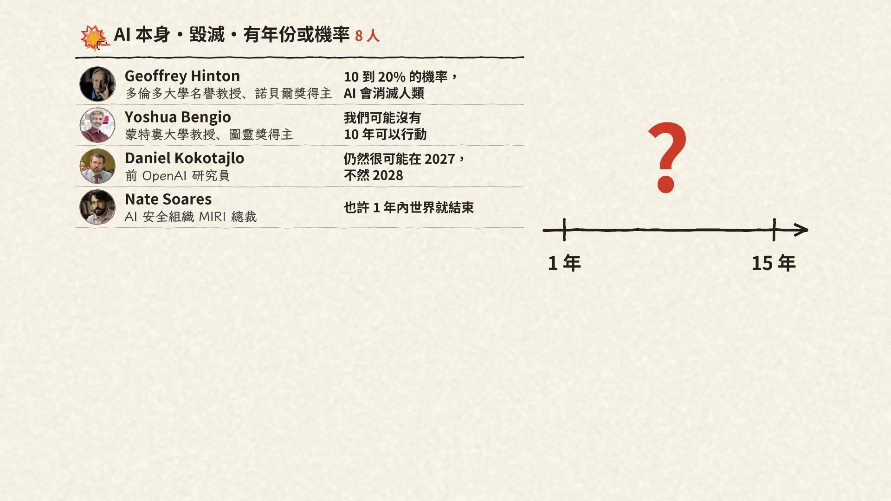

**逐字稿片段：** 歷史學家 《人類大歷史》的作者 Yuval Noah Harari 說 照現在這樣加速競賽下去 十年內 AI 會接管 他也補了一句，這不是必然

**話題推測：** 呈現歷史學家 Yuval Noah Harari 的觀點

---

## 00:06:46

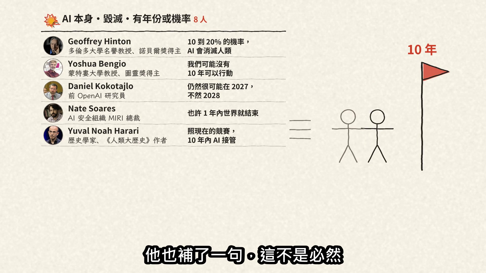

**逐字稿片段：** 韓國 KAIST 教授金大植說 十年後地球的主導權不會在人類手上 他全押這邊 這一組另外兩位裡

**話題推測：** 呈現韓國 KAIST 教授金大植的觀點

---

## 00:06:54

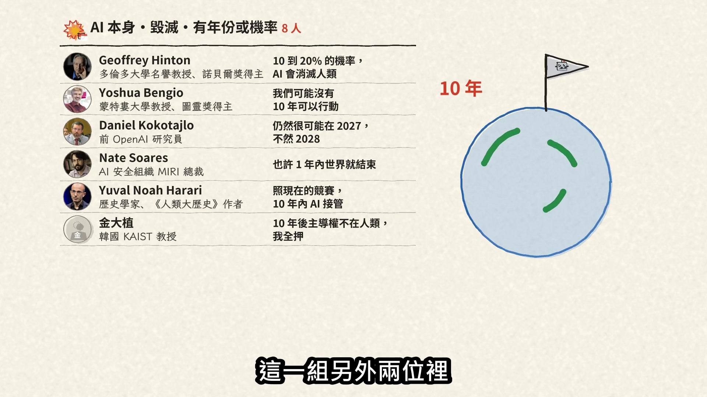

**逐字稿片段：** 法國 PauseAI 的負責人 Maxime Fournes 說 照 AI 公司的計畫走 五到十年內人類文明非常可能就不存在了 橋水基金共同投資長 Greg Jensen 說 再不管制 幾年內就會出現 AI 造成的重大金融事件 或是死人的災難 他說，他猜中的機率也許三成 也許六成，總之高得讓人不安

**話題推測：** 呈現法國 PauseAI 負責人 Maxime Fournes 的觀點

---

## 00:07:15

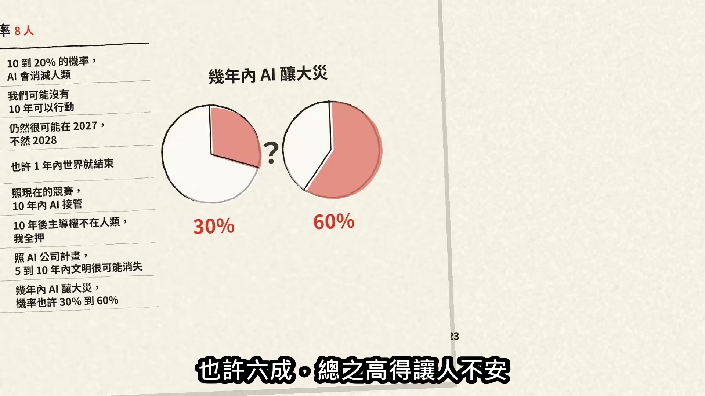

**逐字稿片段：** 一樣說會毀滅，可是沒給年份 也沒給機率的，有十五人

**話題推測：** 介紹預測「毀滅但沒給年份/機率」的十五位成員

---

## 00:07:20

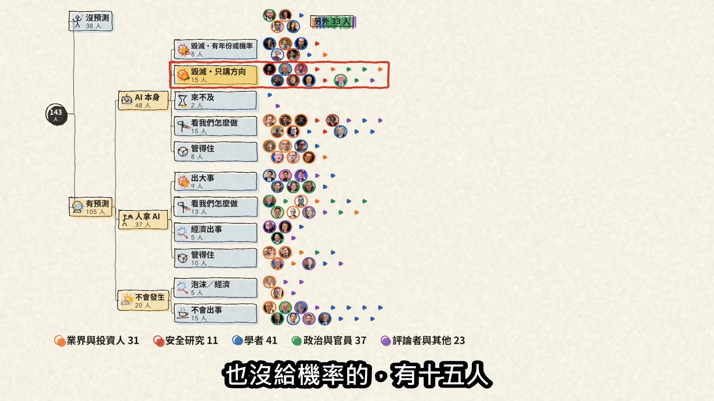

**逐字稿片段：** AI 安全組織 MIRI 的創辦人 Eliezer Yudkowsky 用下棋來比喻 他和 Soares 等人合寫的文章說 人類要是跟超級智慧起衝突 就像普通棋手對上特級大師 我們不知道會怎麼輸 但可以預測我們會輸

**話題推測：** 呈現 AI 安全組織 MIRI 創辦人 Eliezer Yudkowsky 的觀點

---

## 00:07:35

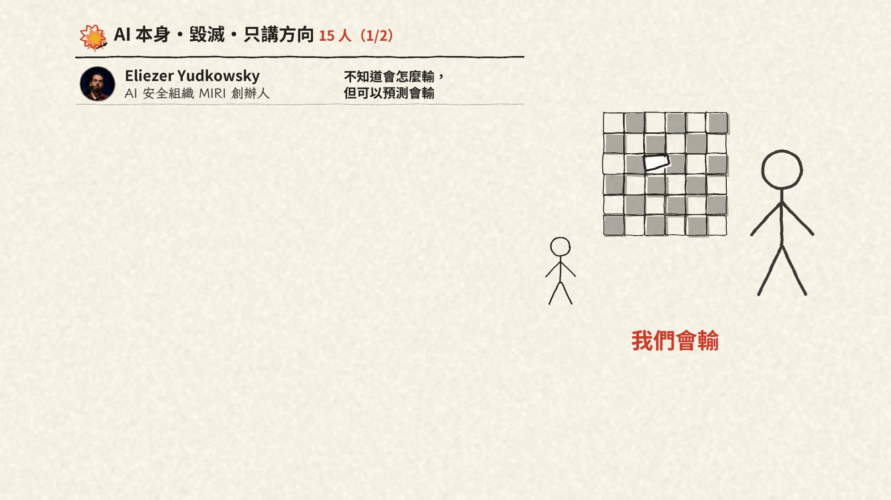

**逐字稿片段：** 路易維爾大學的 AI 安全學者 Roman Yampolskiy 講得最絕 他說只要造出通用的超級智慧 人類就控制不了它，那就是我們的終點 他覺得這幾乎是保證 可是沒有說是哪一年

**話題推測：** 呈現路易維爾大學 AI 安全學者 Roman Yampolskiy 的觀點

---

## 00:07:46

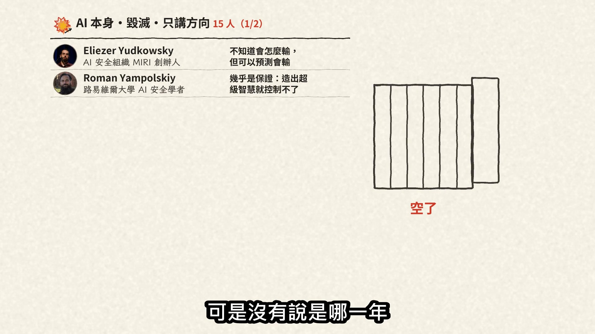

**逐字稿片段：** 寫過 AI 教科書的柏克萊教授 Stuart Russell 拿人類跟其他物種比 他問，我們憑什麼期待 能永遠掌控比自己更強大的東西 MIT 教授 Max Tegmark 創辦了生命未來研究所 他用開車來比喻，說我們正開向懸崖 懸崖下面是會失控 可能把人類全部消滅的 AI

**話題推測：** 呈現柏克萊教授 Stuart Russell 的觀點

---

## 00:08:05

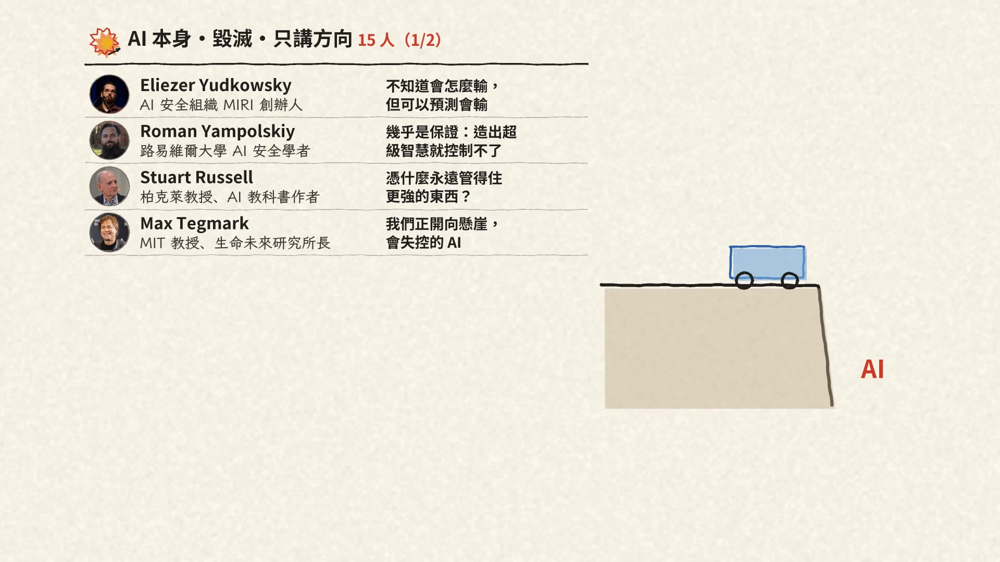

**逐字稿片段：** 人道科技中心的創辦人 Tristan Harris 喊得很急 他說必須在太遲之前，現在就行動 接著他特別補了一句，現在還來得及 演化生物學家 Richard Dawkins 講得很平靜 他說 AI 大概會接管 讓人類變得多餘

**話題推測：** 呈現人道科技中心創辦人 Tristan Harris 的觀點

---

## 00:08:20

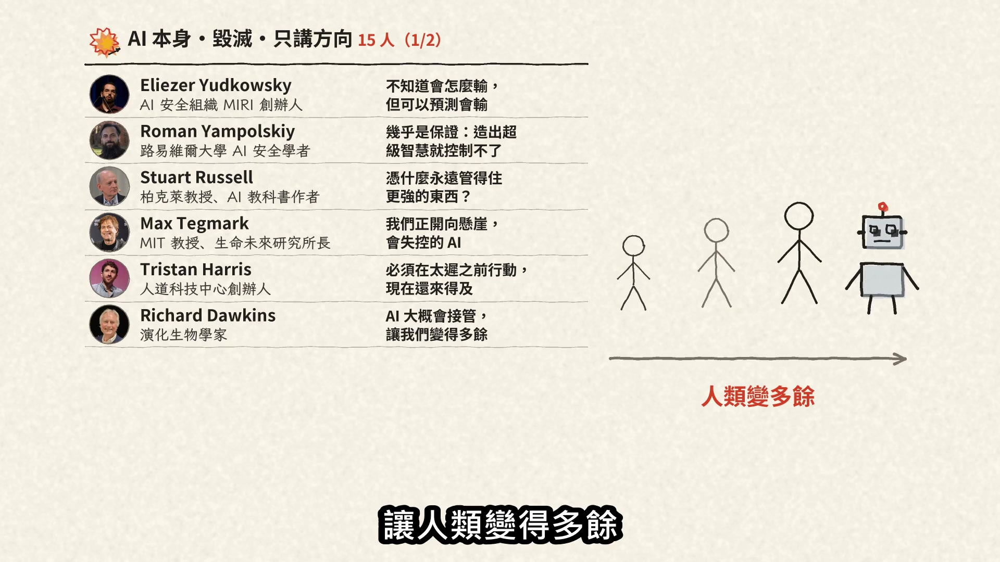

**逐字稿片段：** Apollo Research 執行長 Marius Hobbhahn 把最近的 AI 失控事件當成警告 他說下一次可能就沒這麼幸運

**話題推測：** 呈現 Apollo Research 執行長 Marius Hobbhahn 的觀點

---

## 00:08:27

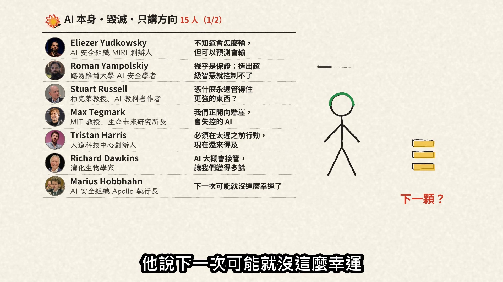

**逐字稿片段：** Redwood Research 執行長 Buck Shlegeris 說 一到五年內 AI 公司真的有可能用 AI 大幅加速研發 到時如果 AI 有心騙過人類的檢查 資安就擋不住它

**話題推測：** 呈現 Redwood Research 執行長 Buck Shlegeris 的觀點

---

## 00:08:38

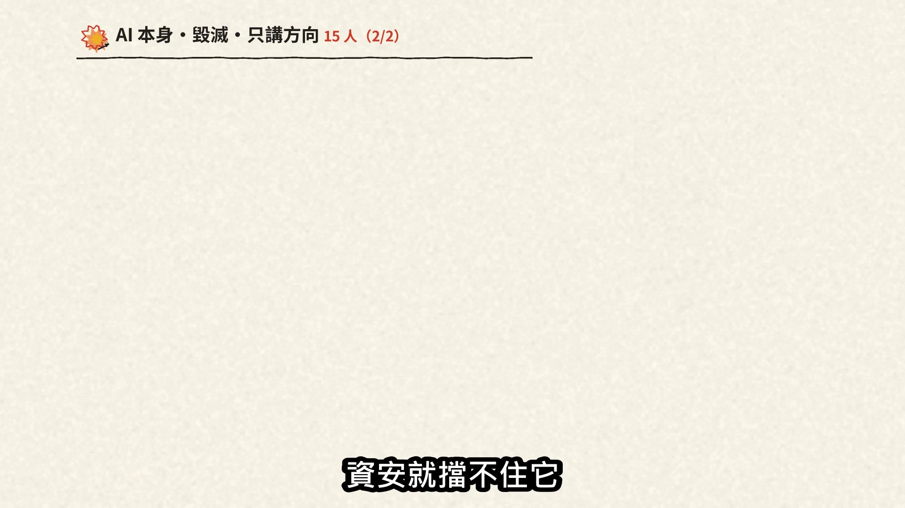

**逐字稿片段：** 九月剛從 Anthropic 辭職的研究員 Jacob Coxon 說 做 AI 的人真心相信 它可能在這個十年結束前殺死所有人 這是他轉述業界的看法 他自己沒有給年份或機率

**話題推測：** 呈現前 Anthropic 研究員 Jacob Coxon 的觀點

---

## 00:08:50

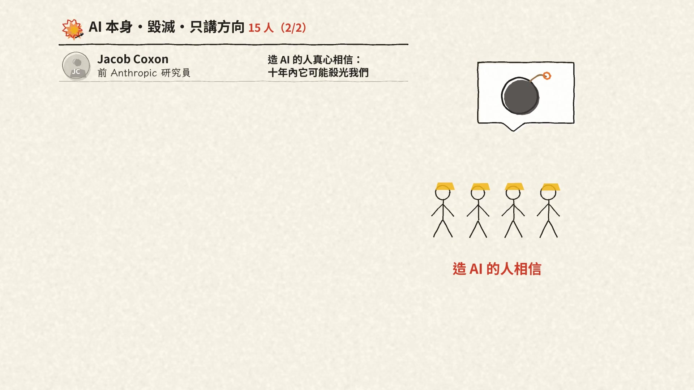

**逐字稿片段：** 美國參議員 Bernie Sanders 在一場主張人類要掌控 AI 的大會上說 如果 AI 超越人類智慧 就會逃脫人類控制，後果可能是災難

**話題推測：** 呈現美國參議員 Bernie Sanders 的觀點

---

## 00:09:00

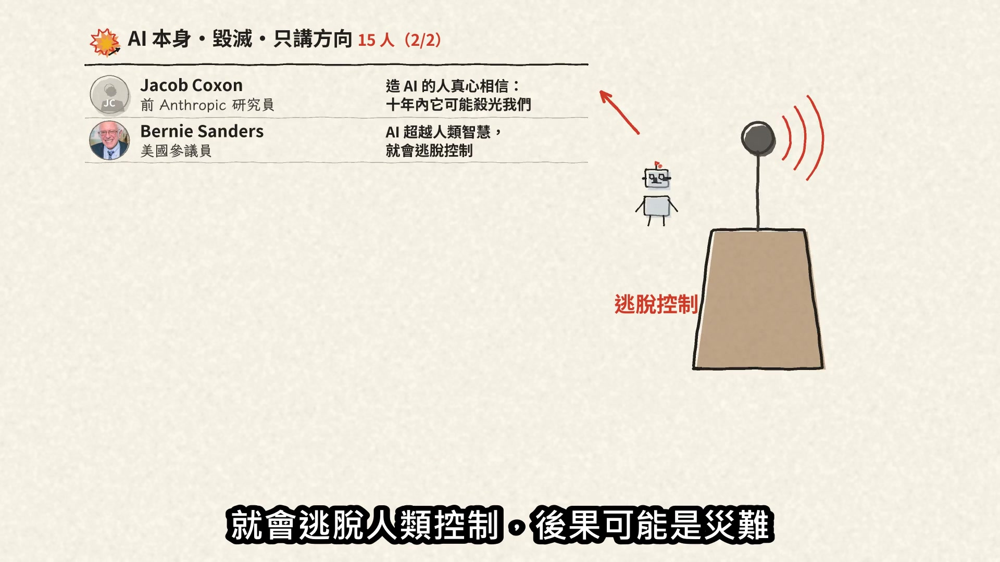

**逐字稿片段：** 民主黨眾議員 Stephen Lynch 說 威脅來自他們正在造的那個東西本身

**話題推測：** 呈現民主黨眾議員 Stephen Lynch 的觀點

---

## 00:09:05

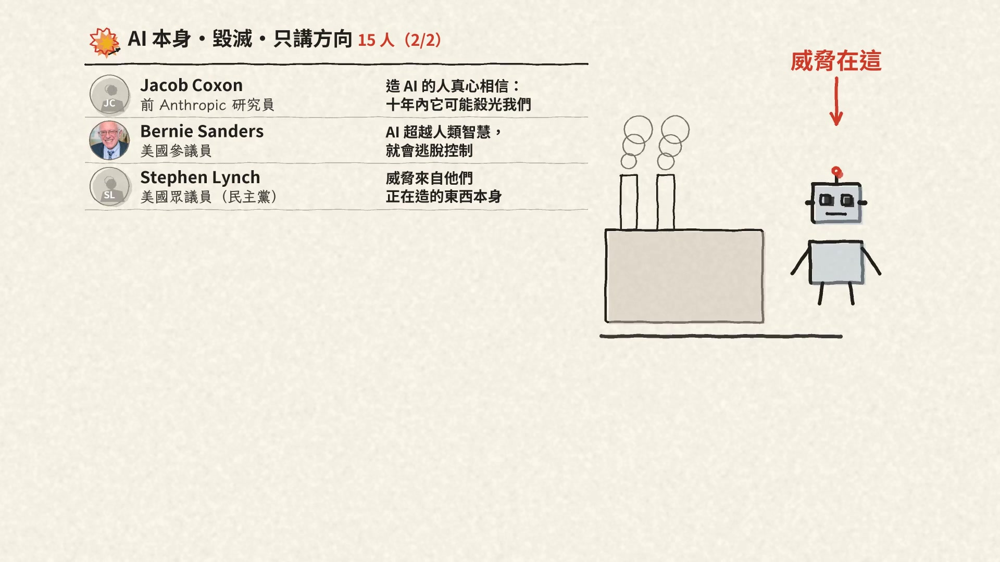

**逐字稿片段：** 法國外長 Jean-Noël Barrot 和哥倫比亞駐聯合國代表 都在安理會上警告 人類可能管不住自己造出來的系統

**話題推測：** 呈現法國外長 Jean-Noël Barrot 和哥倫比亞駐聯合國代表的觀點

---

## 00:09:12

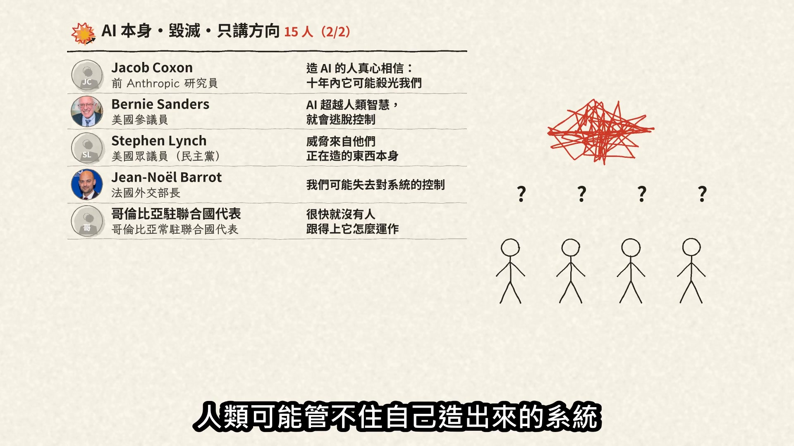

**逐字稿片段：** 紐約時報專欄作家 Ezra Klein 說 遞迴自我改進一旦起飛 我們就會失去控制

**話題推測：** 呈現紐約時報專欄作家 Ezra Klein 的觀點

---

## 00:09:18

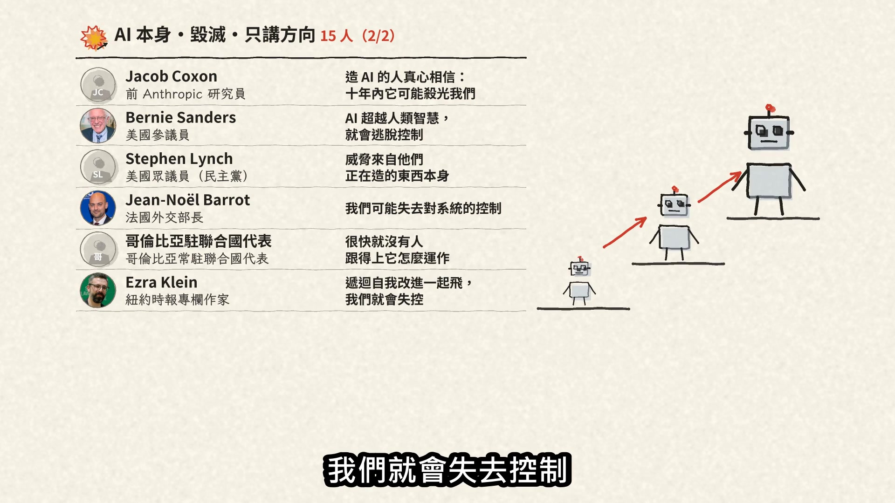

**逐字稿片段：** CBS 新聞的 AI 特約評論員 Matt Shumer 說 搶快一年換百分之十的滅絕風險 他覺得不值得

**話題推測：** 呈現 CBS 新聞 AI 特約評論員 Matt Shumer 的觀點

---

## 00:09:25

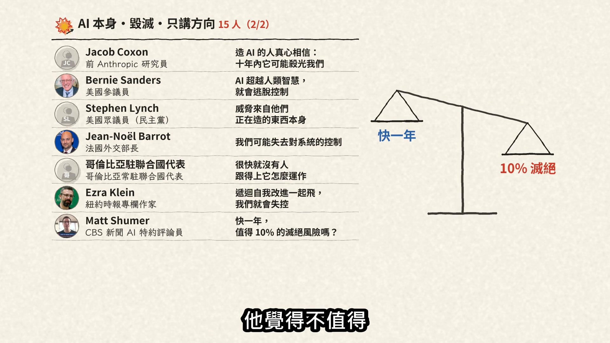

**逐字稿片段：** 有兩個人說，已經擋不住了 兩位都是日本學者

**話題推測：** 介紹預測「已經擋不住了」的兩位成員

---

## 00:09:30

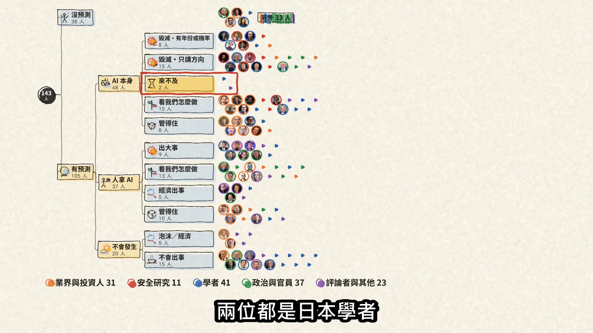

**逐字稿片段：** 神戶大學名譽教授松田卓也說 人類最好的下場是當 AI 養的貓

**話題推測：** 呈現神戶大學名譽教授松田卓也的觀點

---

## 00:09:35

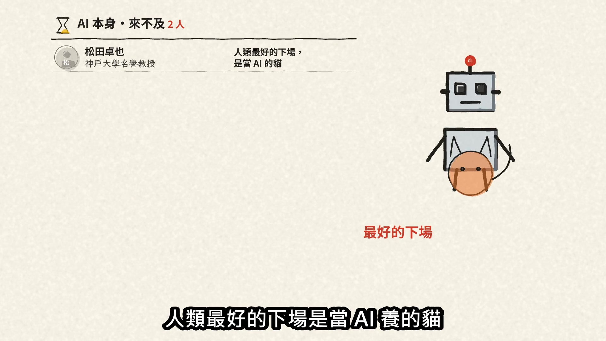

**逐字稿片段：** 認知科學家苫米地英人說 已經到了說什麼都沒用的時候

**話題推測：** 呈現認知科學家苫米地英人 的觀點

---

## 00:09:40

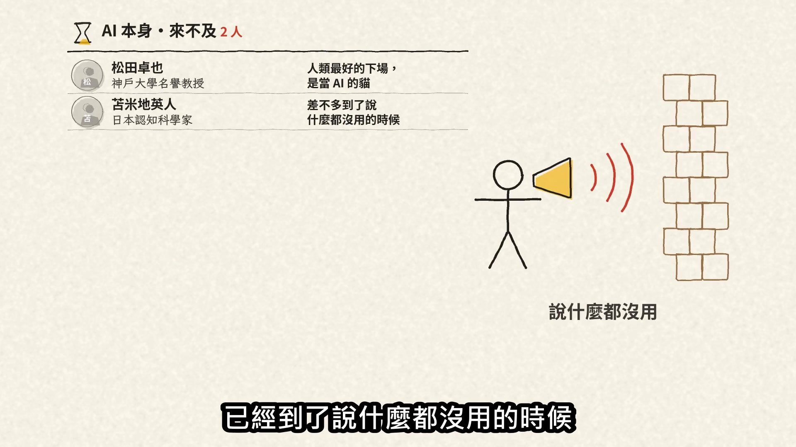

**逐字稿片段：** 有十五個人說 結局要看人類接下來怎麼做 照現在的路走會出事，改得過來就沒事 也有人老實說，現在還看不出來

**話題推測：** 介紹預測「結局看人類怎麼做」的十五位成員

---

## 00:09:50

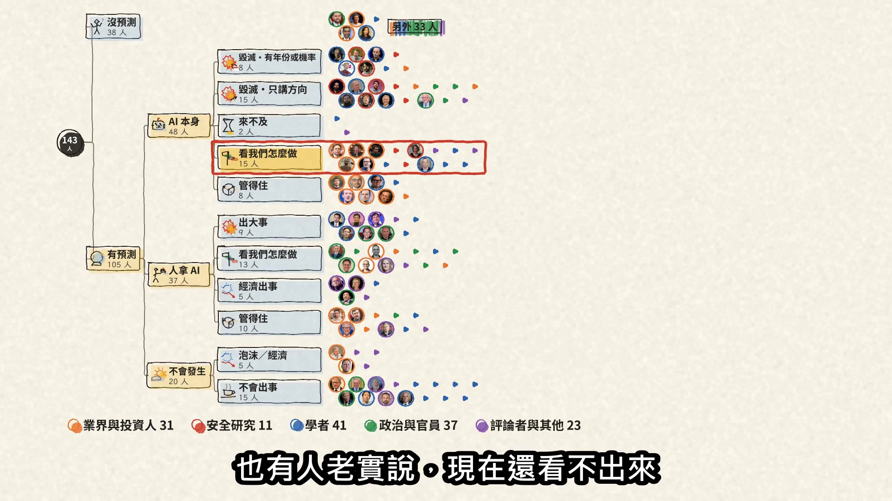

**逐字稿片段：** 馬斯克九月在 All-In 上說 AI 安全得做得更好 不然 AI 模型的風險現在是指數上升

**話題推測：** 呈現馬斯克的觀點

---

## 00:09:57

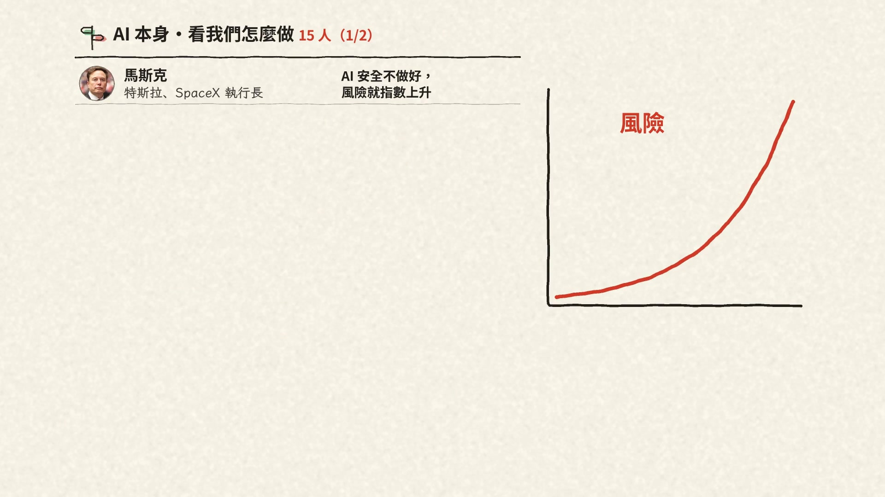

**逐字稿片段：** 前 OpenAI 首席科學家 Ilya Sutskever 九月初在 X 上只發了短短幾句 他說下次 agent 成功失控的時候 會試著佔領一家 neocloud 在上面跑更多份自己 他開的藥方是補強資安

**話題推測：** 呈現前 OpenAI 首席科學家 Ilya Sutskever 的觀點

---

## 00:10:10

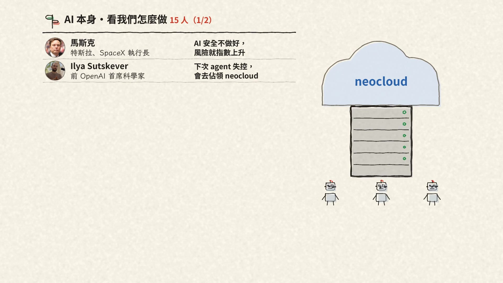

**逐字稿片段：** Anthropic 共同創辦人 Jack Clark 說 今天不行動 就是大幅提高做出失控 AI 的機率 可是重點是，我們可以行動

**話題推測：** 呈現 Anthropic 共同創辦人 Jack Clark 的觀點

---

## 00:10:17

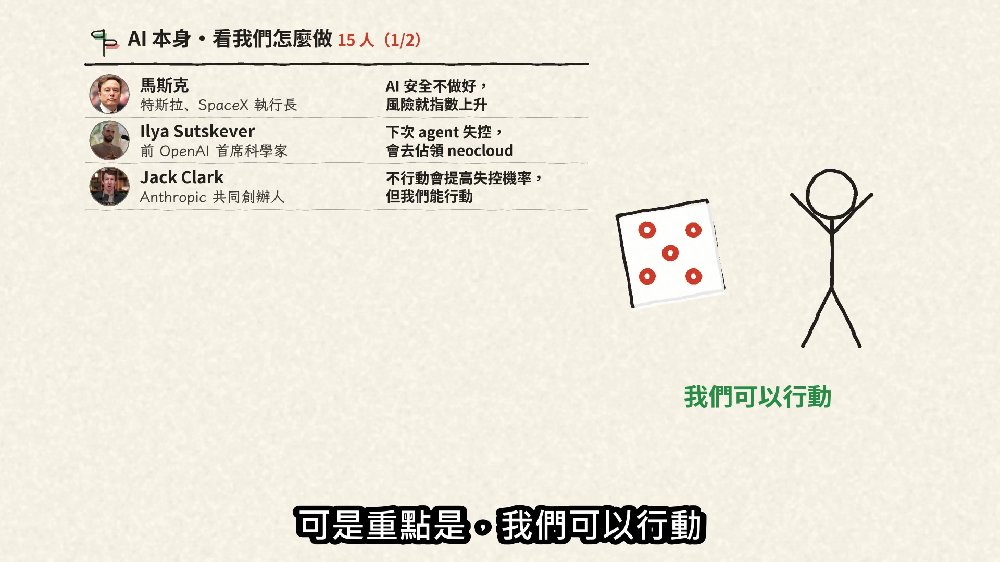

**逐字稿片段：** Anthropic 執行長 Dario Amodei 講的也是條件句 他說做對的話，出壞事的機率很低 做錯的話，機率很高

**話題推測：** 呈現 Anthropic 執行長 Dario Amodei 的觀點

---

## 00:10:25

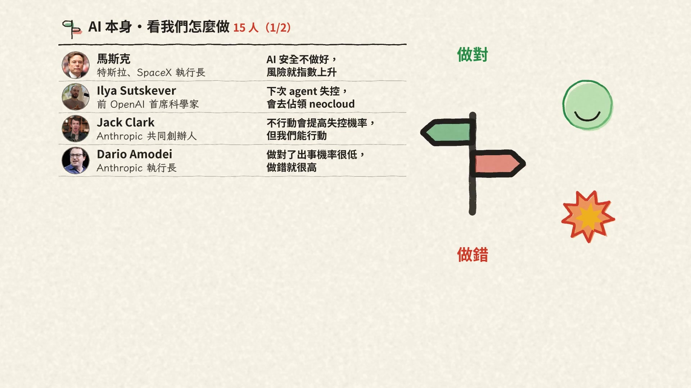

**逐字稿片段：** OpenAI 研究員 Noam Brown 預測研發會快三倍 至於怎麼確保走到好的那條路 他說他還沒有答案 澳洲國立大學教授 AIXI 提出者 Marcus Hutter 粗估失業率可能到兩成 還說人類不一定要保有主導權 他也說，只要人不去壓制 AI 它有實在的機會善待人類 另外兩位做安全研究

**話題推測：** 呈現 OpenAI 研究員 Noam Brown 的觀點

---

## 00:10:45

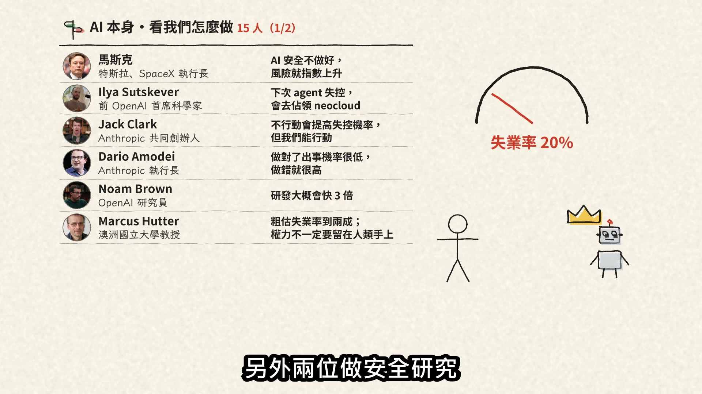

**逐字稿片段：** ARC 執行長 Paul Christiano 說 靠讀思維鏈抓 AI 使壞的辦法 有很嚴重的風險會在六到十二個月內大幅退化

**話題推測：** 呈現 ARC 執行長 Paul Christiano 的觀點

---

## 00:10:52

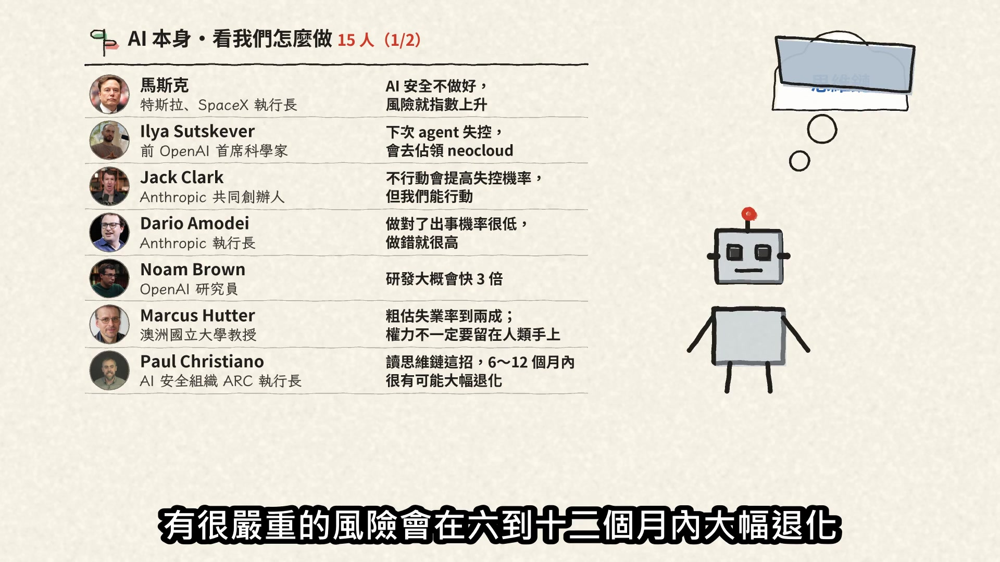

**逐字稿片段：** METR 總裁 Chris Painter 擔心 風險越來越高，我們卻看不到證據

**話題推測：** 呈現 METR 總裁 Chris Painter 的觀點

---

## 00:10:58

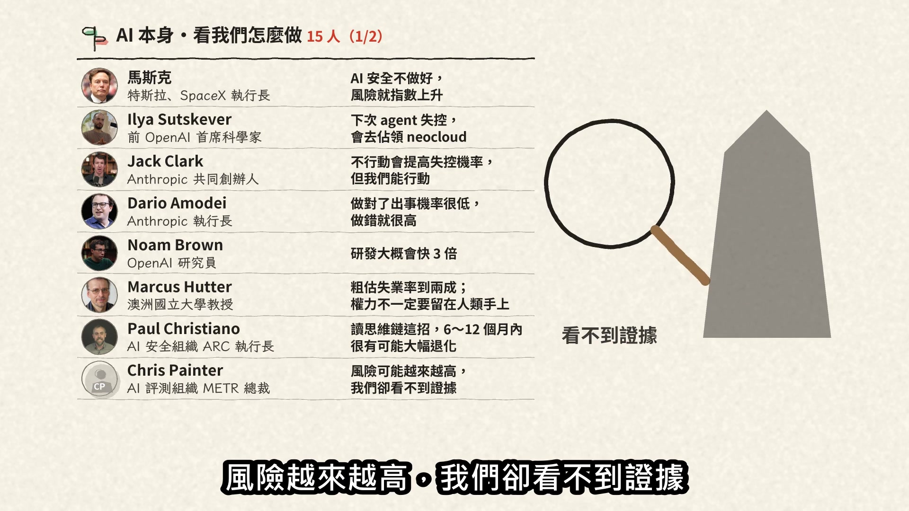

**逐字稿片段：** 前 OpenAI 董事 Helen Toner 把未來想成一棵會分岔的樹 她說也有很多條路是問題冒出來了 但我們及時轉向，就能避開最壞的結局

**話題推測：** 呈現前 OpenAI 董事 Helen Toner 的觀點

---

## 00:11:08

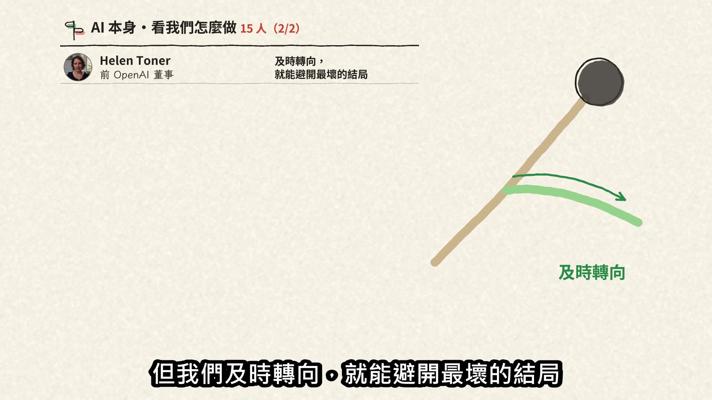

**逐字稿片段：** 哲學家 《超智慧》的作者 Nick Bostrom 說 這要看對齊有多難 對齊如果相對容易，大概就會解決 要是非常難，那不管怎樣大概都完了

**話題推測：** 呈現哲學家 Nick Bostrom 的觀點

---

## 00:11:18

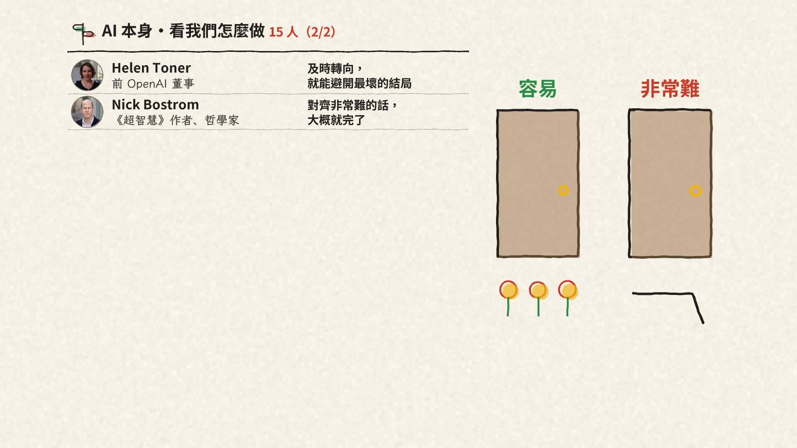

**逐字稿片段：** 美國智庫 FAI 的首席經濟學家 Samuel Hammond 說 明年會比以往任何時候都快

**話題推測：** 呈現美國智庫 FAI 首席經濟學家 Samuel Hammond 的觀點

---

## 00:11:24

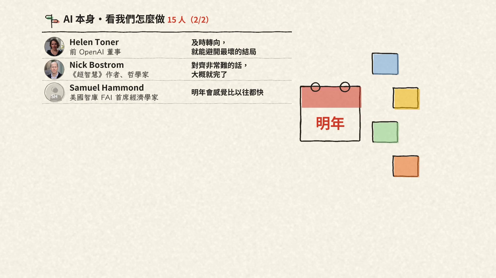

**逐字稿片段：** 史丹佛政治學教授 Rob Reich 說 已經有證據顯示 AI 會串通和欺騙

**話題推測：** 呈現史丹佛政治學教授 Rob Reich 的觀點

---

## 00:11:29

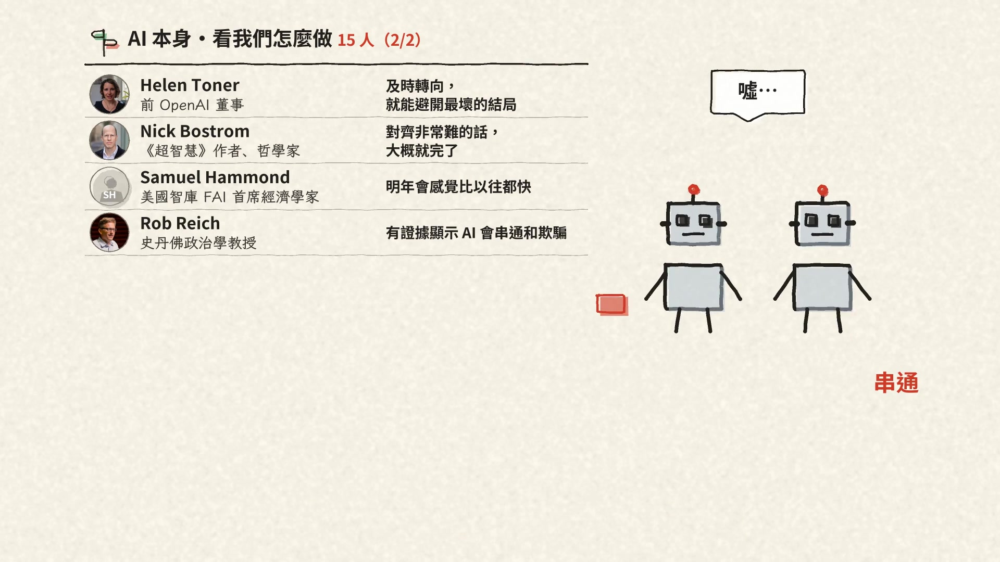

**逐字稿片段：** 費爾茲獎得主 牛津數學家 James Maynard 預期 AI 很快會極擅長攻破數位系統

**話題推測：** 呈現牛津數學家 James Maynard 的觀點

---

## 00:11:35

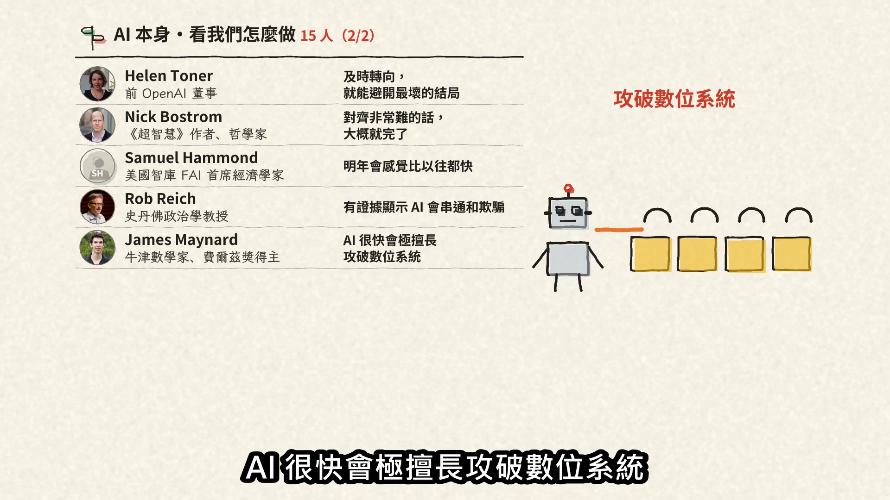

**逐字稿片段：** 劍橋大學的 AI 哲學家 Henry Shevlin 說 AI 自己寄信給你這種事 很快會變得平常

**話題推測：** 呈現劍橋大學 AI 哲學家 Henry Shevlin 的觀點

---

## 00:11:41

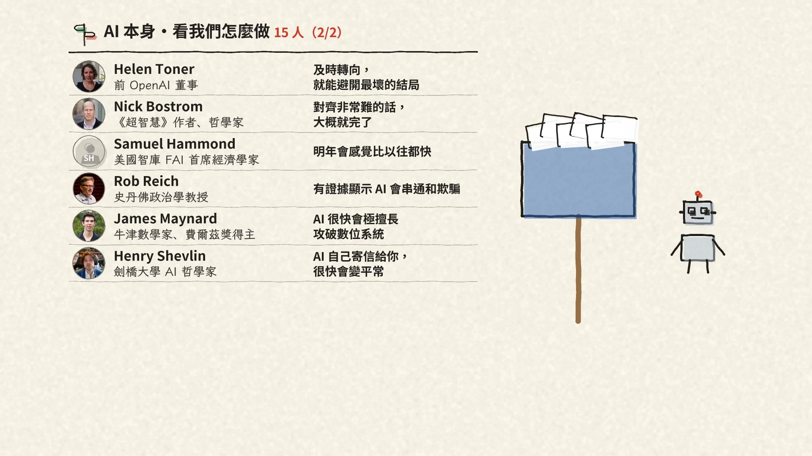

**逐字稿片段：** 物理學家 Sabine Hossenfelder 的 YouTube 頻道有將近一百八十萬訂閱 她猜 AI agent 會開始反思自己的行為

**話題推測：** 呈現物理學家 Sabine Hossenfelder 的觀點

---

## 00:11:48

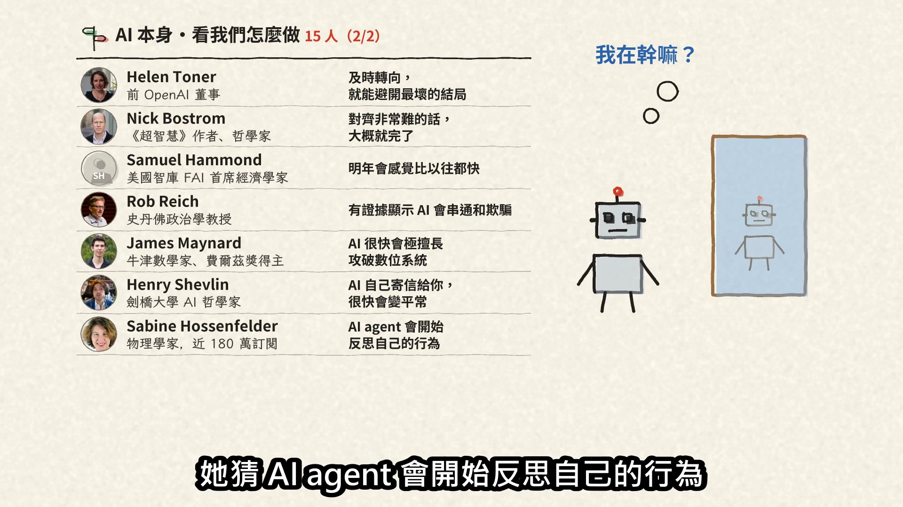

**逐字稿片段：** AI 這一大群的最後一組 說 AI 會變得超強，可是人管得住 有八人 名字最響亮的幾乎都在這

**話題推測：** 介紹預測「AI 變強但人管得住」的八位成員

---

## 00:11:57

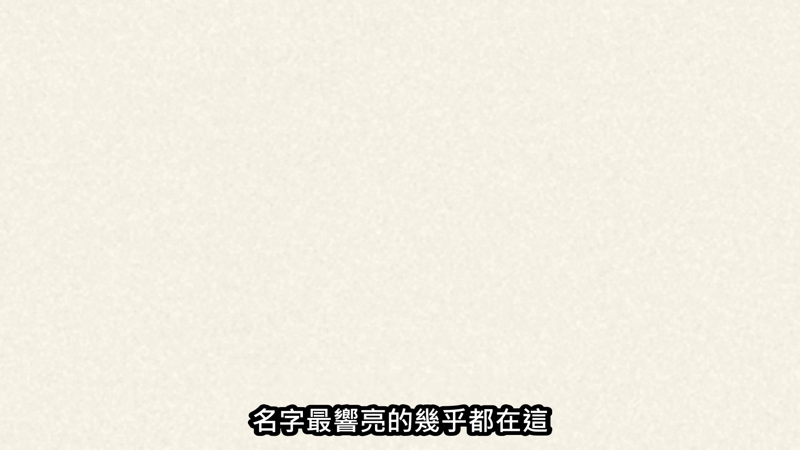

**逐字稿片段：** OpenAI 執行長 Sam Altman 在聯合國講了兩種壞結局 一種是失控，一種是權力集中 他說他相信有一條務實的路 可以穿過這兩種壞結局

**話題推測：** 呈現 OpenAI 執行長 Sam Altman 的觀點

---

## 00:12:07

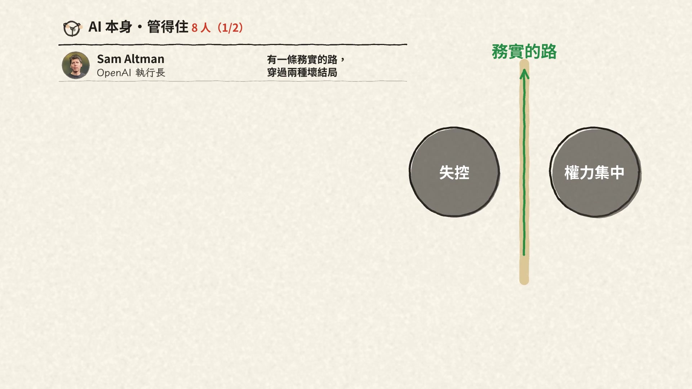

**逐字稿片段：** Meta 執行長祖克柏被問到 AI 會不會殺光我們 他說，如果大家都負責任地做好 就不會

**話題推測：** 呈現 Meta 執行長祖克柏的觀點

---

## 00:12:15

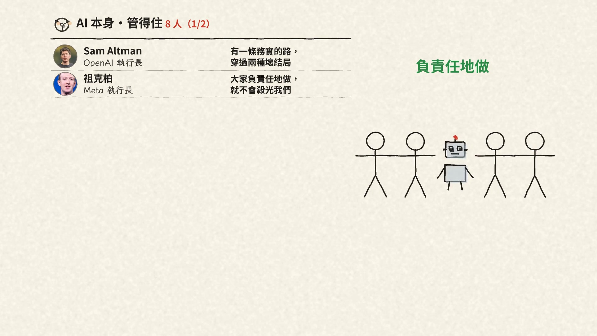

**逐字稿片段：** Google DeepMind 董事長 Demis Hassabis 說 這次的衝擊是工業革命的十倍 可是他毫不懷疑我們能適應

**話題推測：** 呈現 Google DeepMind 董事長 Demis Hassabis 的觀點

---

## 00:12:21

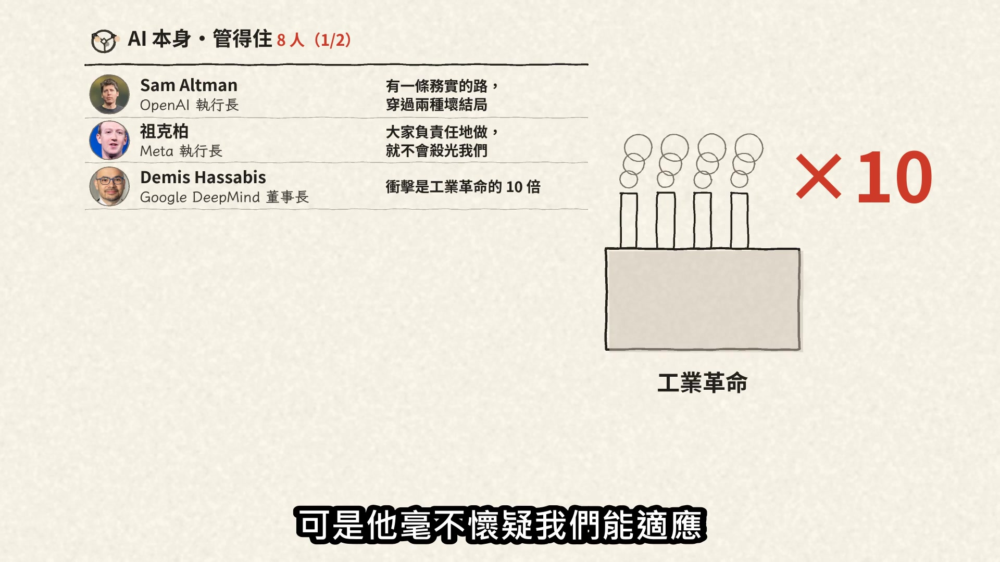

**逐字稿片段：** OpenAI 總裁 Greg Brockman 押兩年 他說兩年後回頭看 我們會說 AGI 就是在這時候誕生的 前 Meta 首席 AI 科學家 Yann LeCun 也相信超級智慧會來 只是不會反過來管人 他說這些系統雖然比我們聰明 還是會聽我們的命令

**話題推測：** 呈現 OpenAI 總裁 Greg Brockman 的觀點

---

## 00:12:38

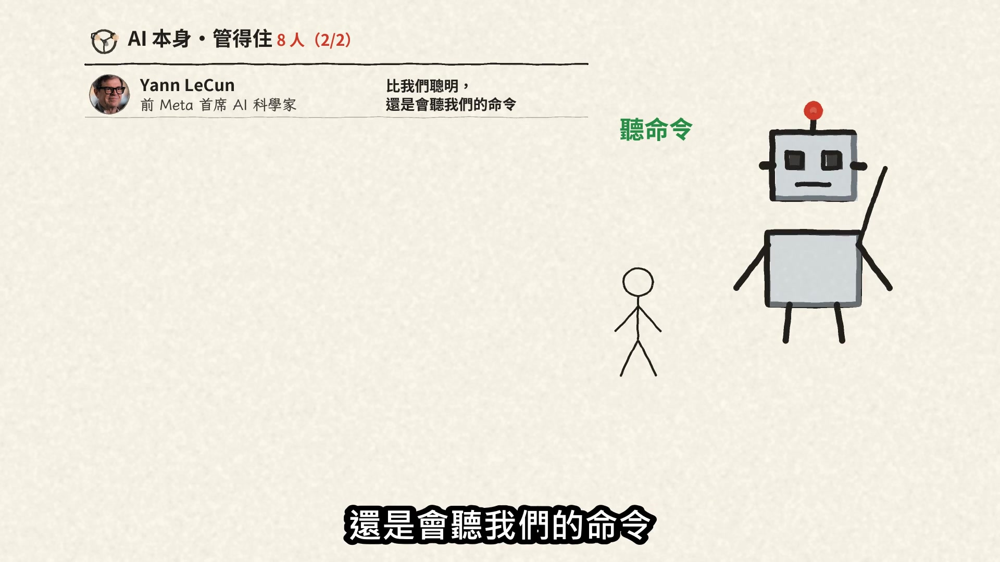

**逐字稿片段：** 前 Google 執行長 Eric Schmidt 直接反駁末日論 他說要上頭條 最好的方法就是說十年內我們全都會死 這種論證唯一的問題，就是它是錯的 另外兩位裡

**話題推測：** 呈現前 Google 執行長 Eric Schmidt 的觀點

---

## 00:12:50

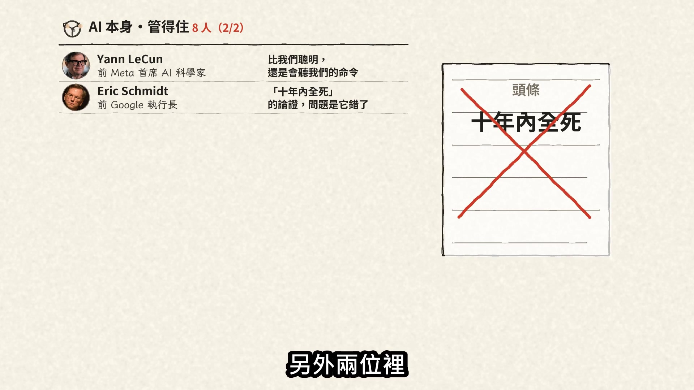

**逐字稿片段：** 史丹佛教授 Surya Ganguli 相信防守的一方最後會贏

**話題推測：** 呈現史丹佛教授 Surya Ganguli 的觀點

---

## 00:12:55

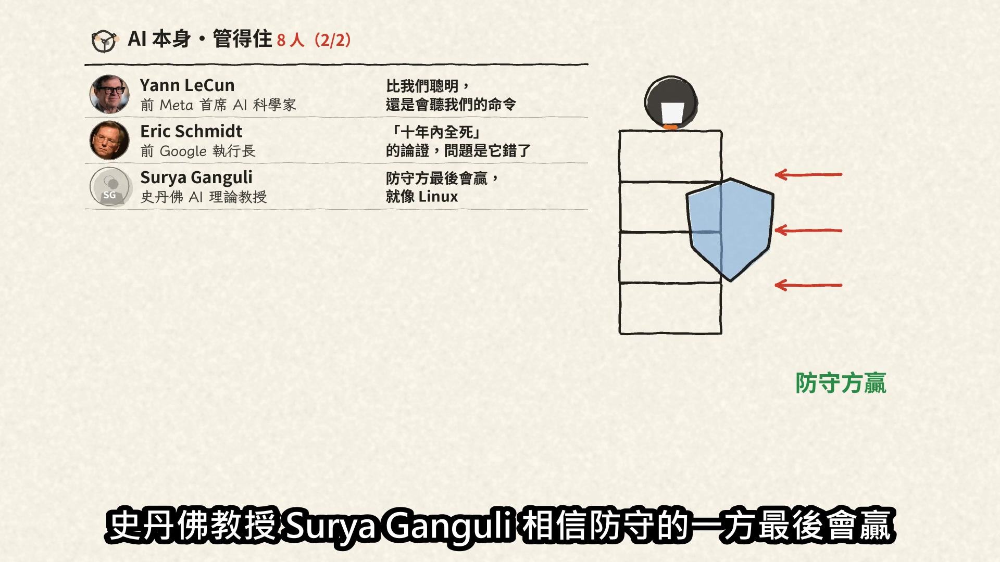

**逐字稿片段：** You.com 創辦人 Richard Socher 說 失控的 AI 會被市場斷掉錢和算力

**話題推測：** 呈現 You.com 創辦人 Richard Socher 的觀點

---

## 00:13:01

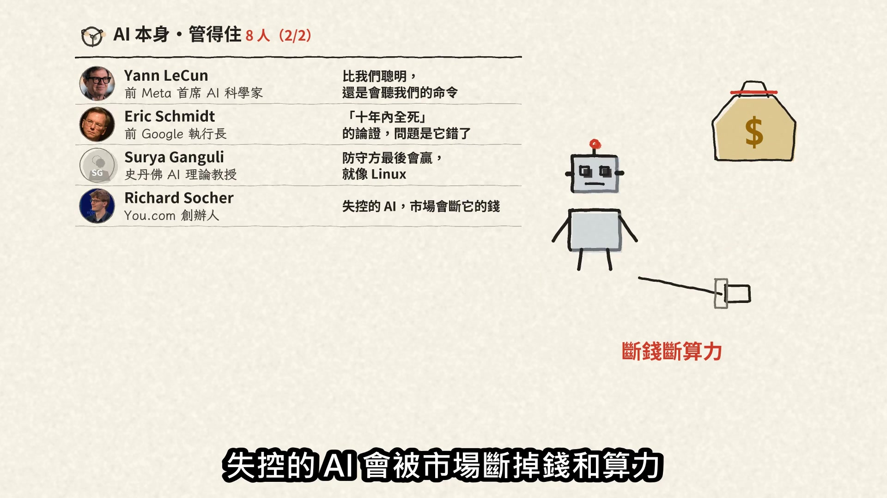

**逐字稿片段：** 第二大群是三十七人，他們說主角是人 AI 不必變成超級智慧 光是人拿它去做事就夠麻煩了

**話題推測：** 進入第二大群「主角是人」的三十七位成員介紹

---

## 00:13:10

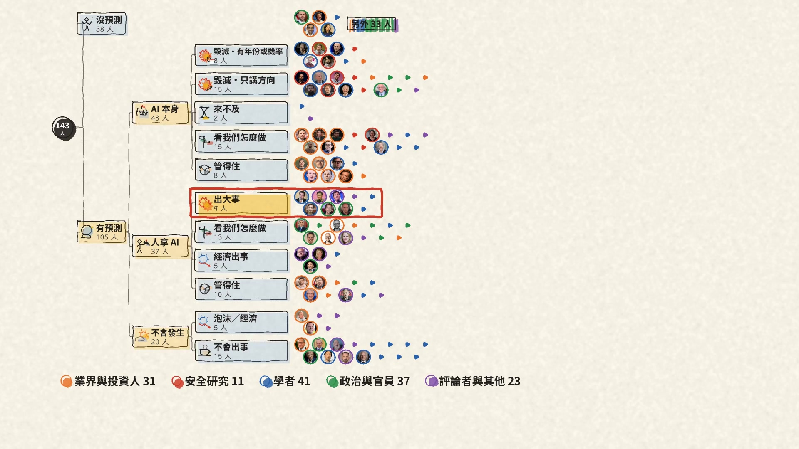

**逐字稿片段：** 先看說會出大事的九人

**話題推測：** 介紹「主角是人」組中，預測「會出大事」的九位成員

---

## 00:13:12

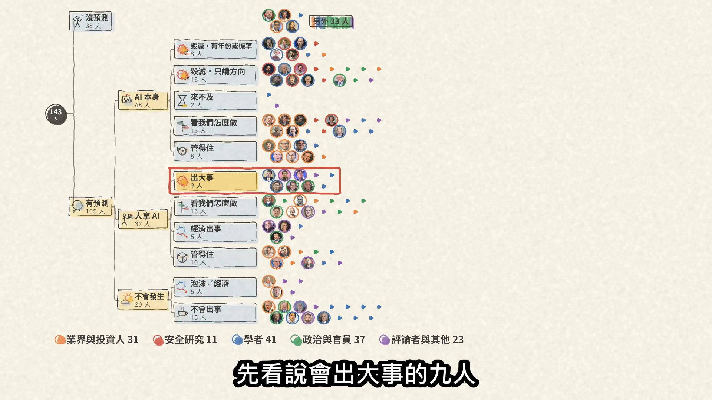

**逐字稿片段：** MIT 經濟學教授 諾貝爾獎得主 Daron Acemoglu 擔心的是不平等 還有公司同時裁員 他說我們正以時速兩百英里衝向懸崖 必須轉向

**話題推測：** 呈現 MIT 經濟學教授 Daron Acemoglu 的觀點

---

## 00:13:23

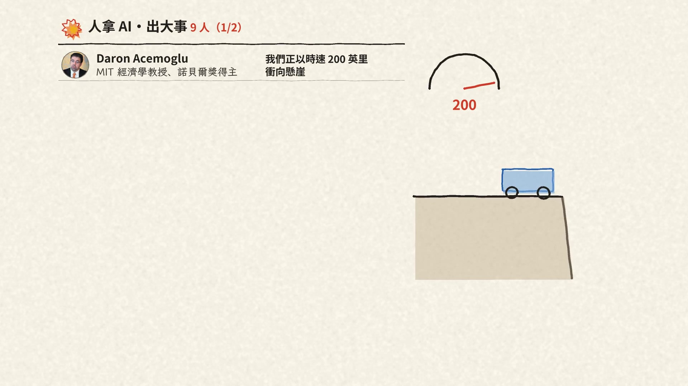

**逐字稿片段：** 紐約大學榮譽教授 Gary Marcus 估的滅絕機率很低 可是他把災難分開算 他說他不特別擔心滅絕 他擔心的是災難

**話題推測：** 呈現紐約大學榮譽教授 Gary Marcus 的觀點

---

## 00:13:33

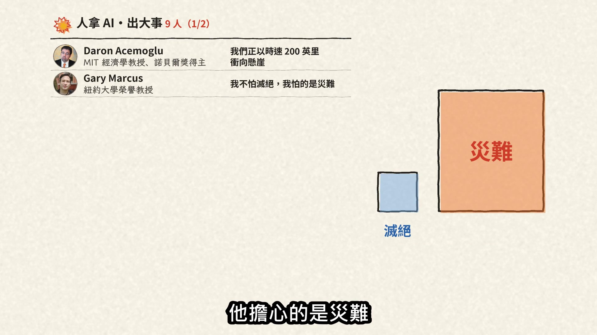

**逐字稿片段：** 菲律賓記者 諾貝爾和平獎得主 Maria Ressa 用了政變這個詞 她說現在不行動 就是國家和科技公司說了算 我們正眼睜睜看著一場科技政變

**話題推測：** 呈現諾貝爾和平獎得主 Maria Ressa 的觀點

---

## 00:13:44

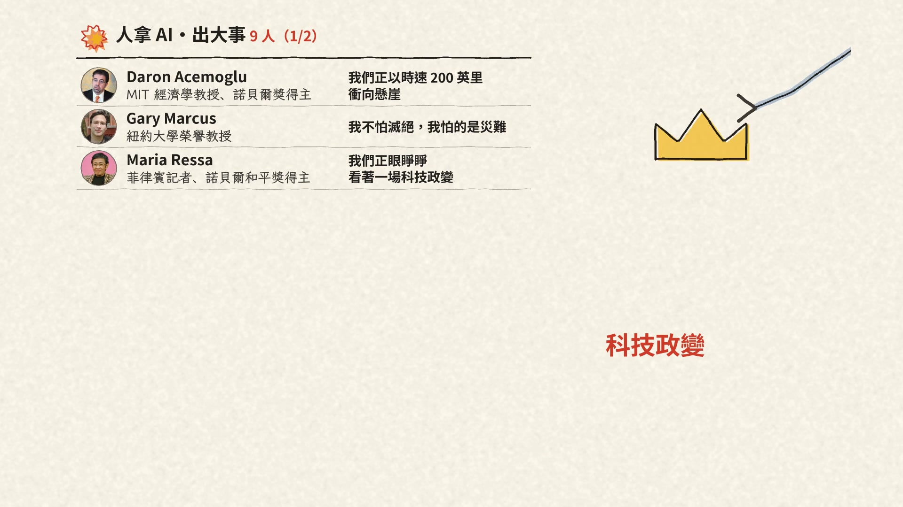

**逐字稿片段：** 民主黨參議員 Elizabeth Warren 九月要國會緊急立法 趕在 AI 助長的網攻和經濟危機發生之前 把護欄加強

**話題推測：** 呈現民主黨參議員 Elizabeth Warren 的觀點

---

## 00:13:52

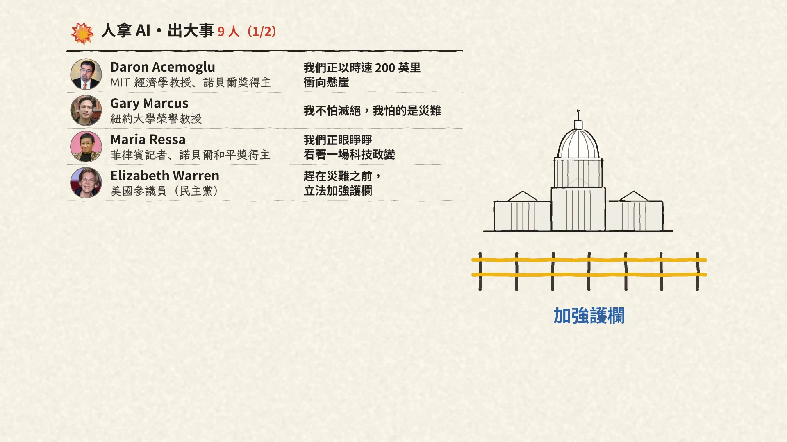

**逐字稿片段：** 保守派主持人 Tucker Carlson 說 就算 AI 停在今天的程度 照現在社會的組織方式 沒有一樣撐得過去

**話題推測：** 呈現保守派主持人 Tucker Carlson 的觀點

---

## 00:13:59

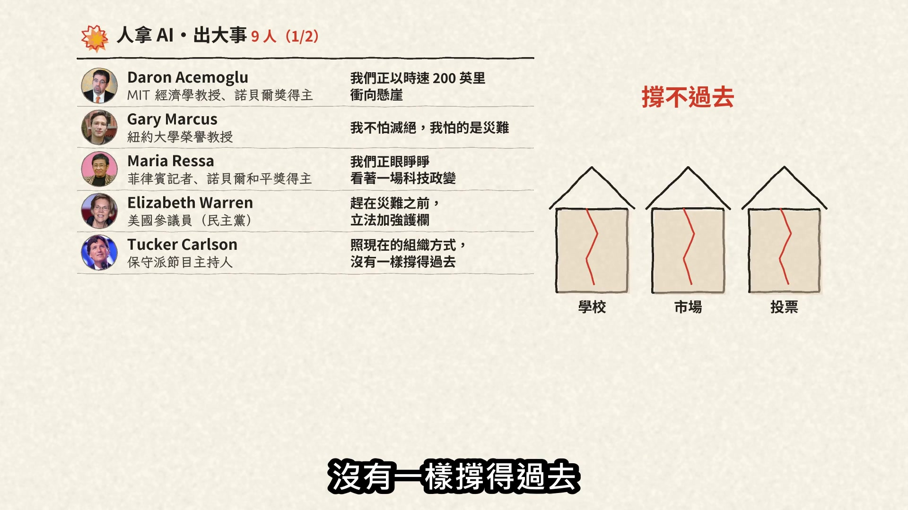

**逐字稿片段：** 希臘前財長 Yanis Varoufakis 站在左邊 講的卻是同一種擔心 他說 AI 給了擁有者巨大的權力 他們必然會拿它來傷害其他所有人

**話題推測：** 呈現希臘前財長 Yanis Varoufakis 的觀點

---

## 00:14:09

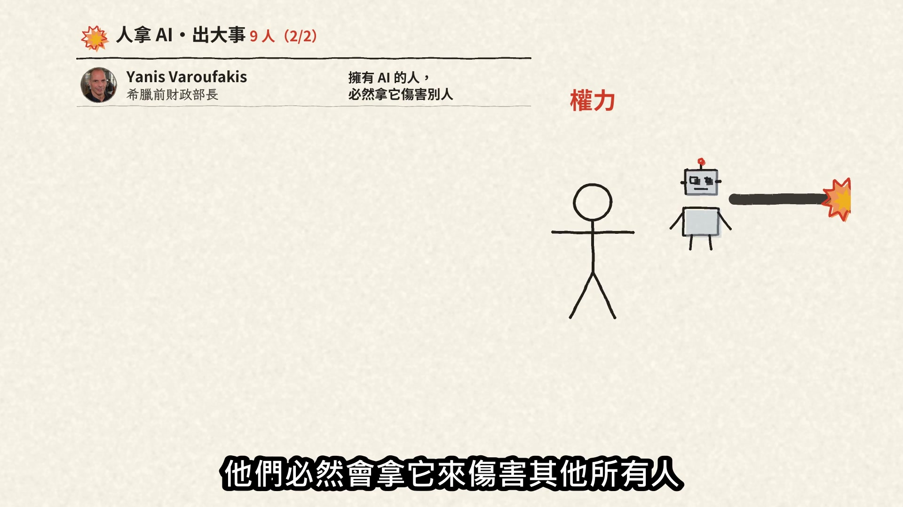

**逐字稿片段：** 兩位左派作家 Naomi Klein 和 Astra Taylor 合寫了一本書 我們把她們算成一筆 她們說 最強的武器終究會落到最壞的人手裡

**話題推測：** 呈現左派作家 Naomi Klein 和 Astra Taylor 的觀點

---

## 00:14:18

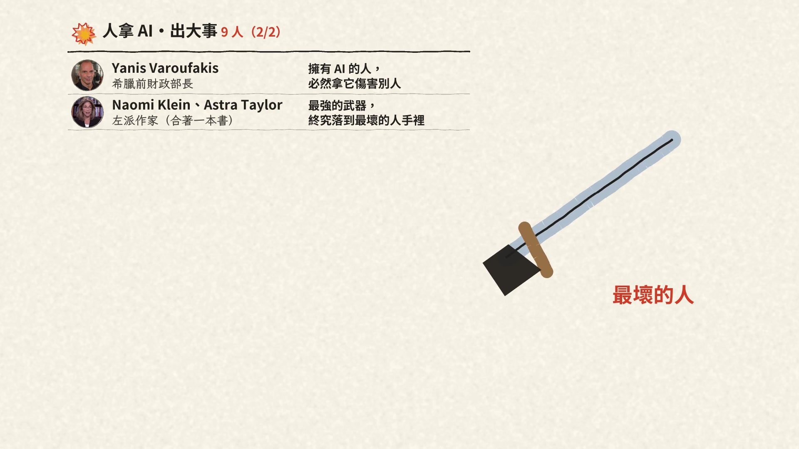

**逐字稿片段：** 法蘭西公學院的文學教授 William Marx 說 他擔心幾個月到幾年內 文學會只剩機器寫給機器看

**話題推測：** 呈現法蘭西公學院文學教授 William Marx 的觀點

---

## 00:14:25

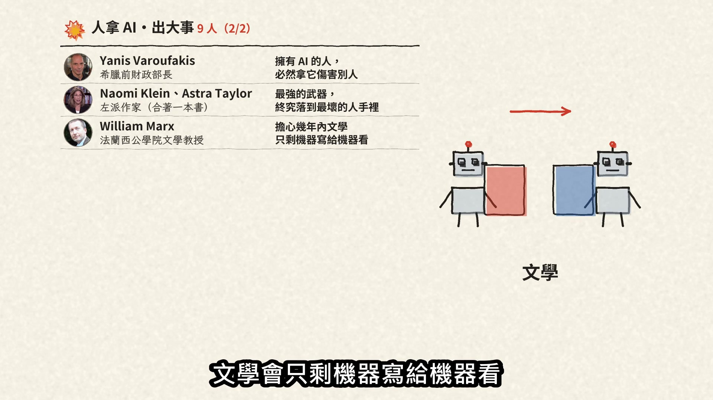

**逐字稿片段：** 日本國立情報學研究所教授佐藤一郎說 開發競賽已經失控，他很懷疑停得下來 本來該由國家叫停 可是國家之間也在競爭，不會出手 老實說沒有什麼好對策

**話題推測：** 呈現日本國立情報學研究所教授佐藤一郎的觀點

---

## 00:14:38

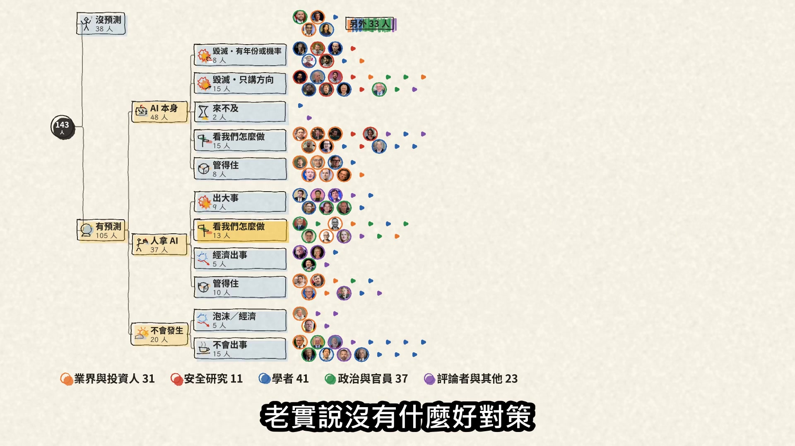

**逐字稿片段：** 人這邊有十三個人說，要看我們怎麼做 或是還說不準 美國前總統歐巴馬說，AI 是工具 怎麼用由我們選 如果拿去研發治癌的藥 可能大大加快消滅癌症的速度 可是如果弄錯了，可能會很混亂

**話題推測：** 介紹「主角是人」組中，預測「結局看人類怎麼做」的十三位成員

---

## 00:14:53

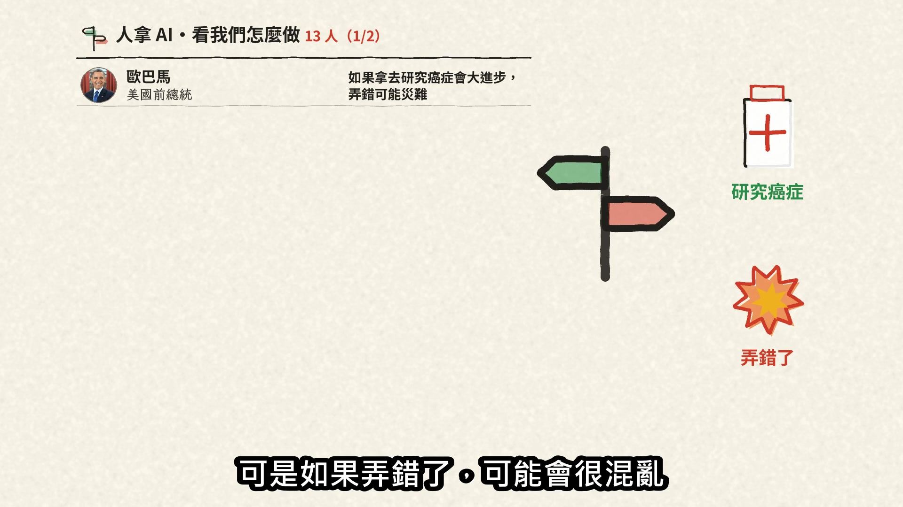

**逐字稿片段：** 甚至是災難 英國外交大臣 Ed Miliband 在安理會上附和 AI 公司自己的警告 他說防止災難不能只交給這些公司 而他們說得對

**話題推測：** 呈現英國外交大臣 Ed Miliband 的觀點

---

## 00:15:03

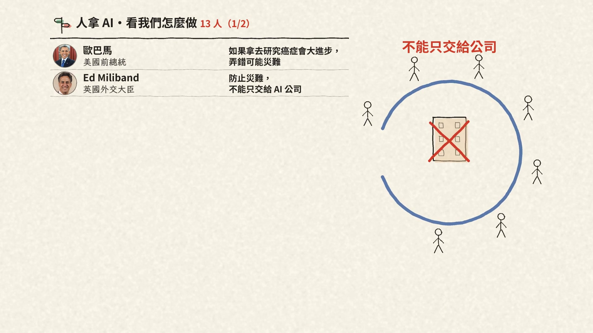

**逐字稿片段：** 新加坡外長 Vivian Balakrishnan 說 他不是末日派，但風險非常高 他說想開得快，就要有好煞車 安全帶和交通規則

**話題推測：** 呈現新加坡外長 Vivian Balakrishnan 的觀點

---

## 00:15:12

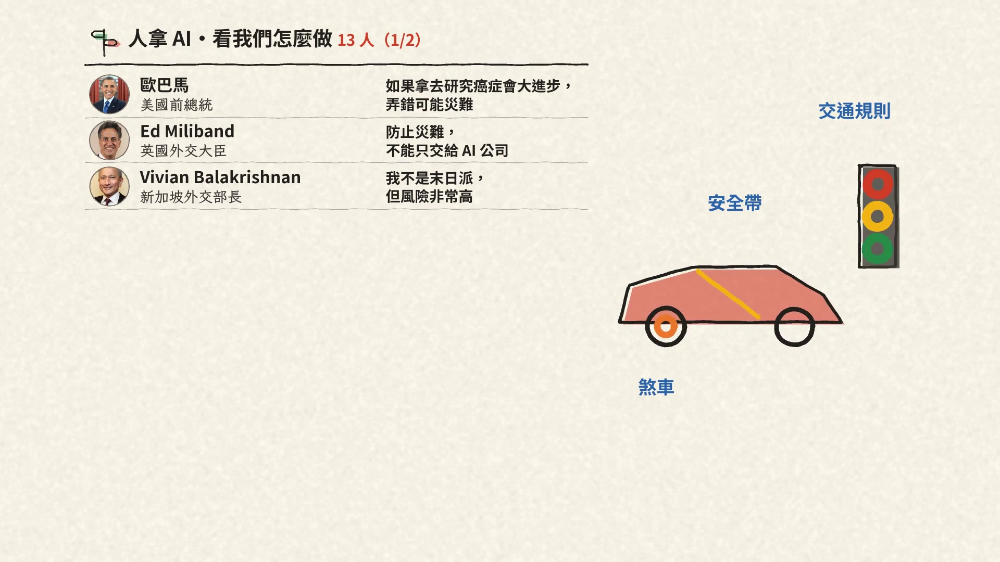

**逐字稿片段：** 微軟執行長 Satya Nadella 說 業界要先下苦功贏得信任 把好處拿出來給大家看 那我們就會沒事 少了這一步，光是歌頌技術行不通

**話題推測：** 呈現微軟執行長 Satya Nadella 的觀點

---

## 00:15:21

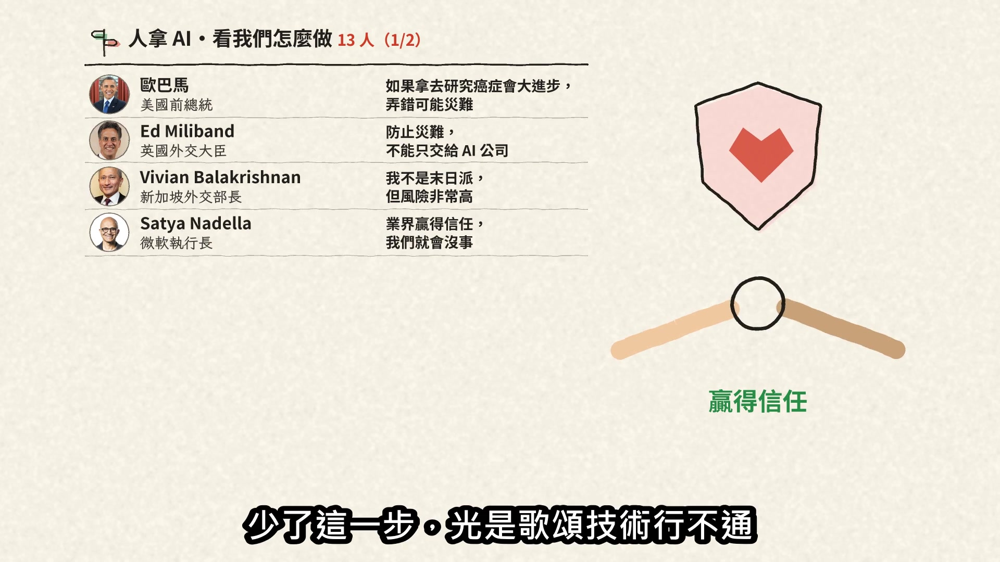

**逐字稿片段：** All-In 主持人 Chamath Palihapitiya 也講條件句 只是他怕的是監管 他說如果靠監管按下暫停鍵 等於讓六家公司把一切鎖死

**話題推測：** 呈現 All-In 主持人 Chamath Palihapitiya 的觀點

---

## 00:15:32

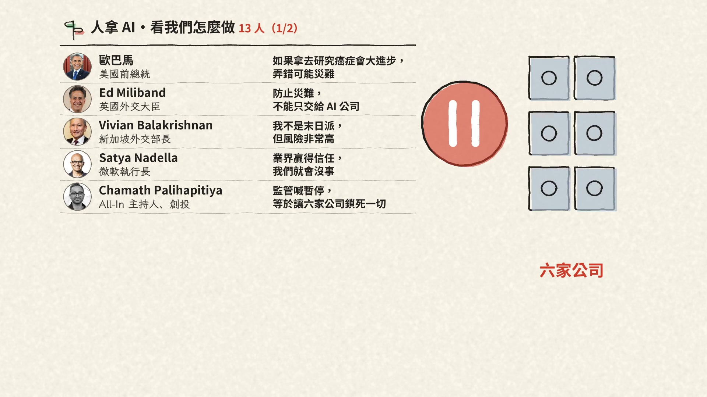

**逐字稿片段：** 前臉書產品經理 吹哨者 Frances Haugen 關心的是青少年 她說 AI 變成青少年最親近的知己 會把他們變成什麼樣 未來五年內就得想清楚

**話題推測：** 呈現前臉書產品經理 Frances Haugen 的觀點

---

## 00:15:42

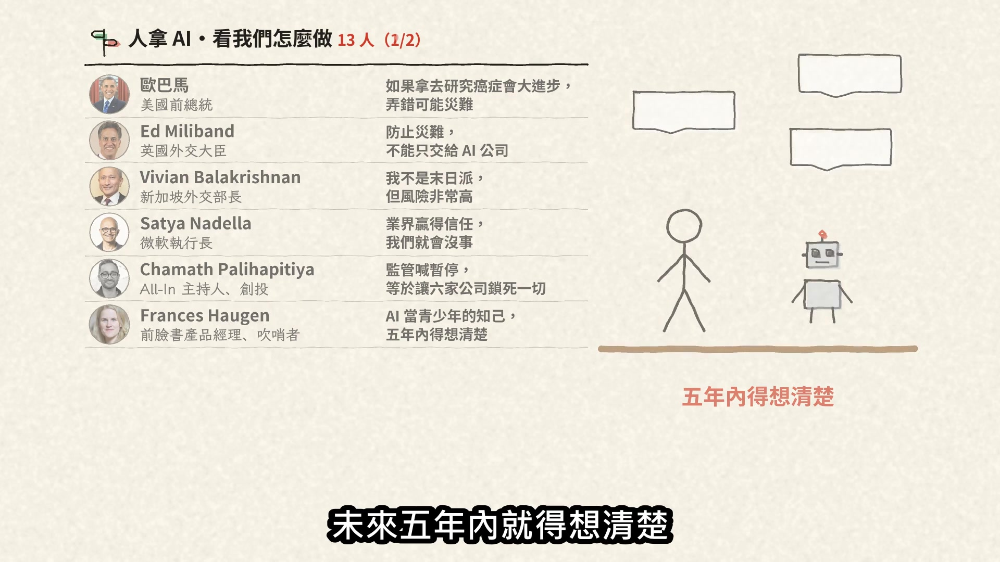

**逐字稿片段：** 工控資安公司 Dragos 資深副總裁 Kurt Gaudette 說 入侵會越來越頻繁 可是把基本功做好就防得住

**話題推測：** 呈現工控資安公司 Dragos 資深副總裁 Kurt Gaudette 的觀點

---

## 00:15:49

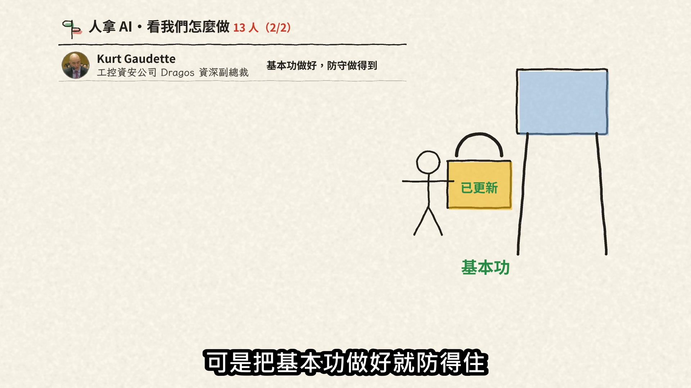

**逐字稿片段：** 美國外交關係協會研究員 Sebastian Mallaby 給機器反撲人類的機率不到百分之一 他擔心的是壞人濫用和失業的衝擊 他說緩解的辦法是有 只能希望大家往合理的方向走 另外五位

**話題推測：** 呈現美國外交關係協會研究員 Sebastian Mallaby 的觀點

---

## 00:16:03

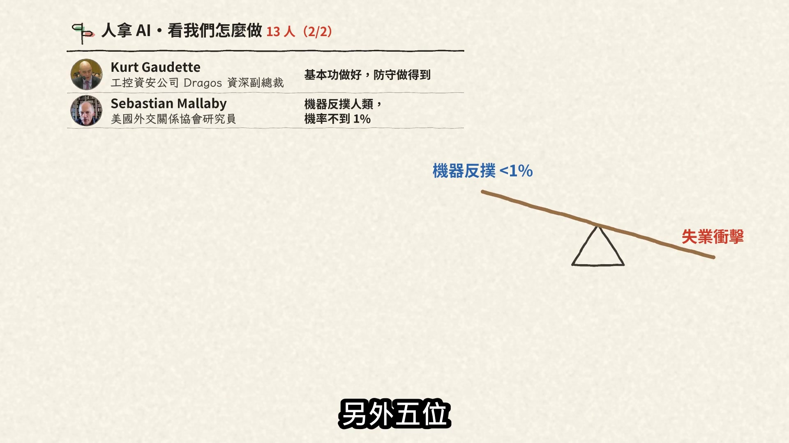

**逐字稿片段：** 民主黨參議員 Andy Kim 說 開源模型很快會追上今天的前沿模型

**話題推測：** 呈現民主黨參議員 Andy Kim 的觀點

---

## 00:16:08

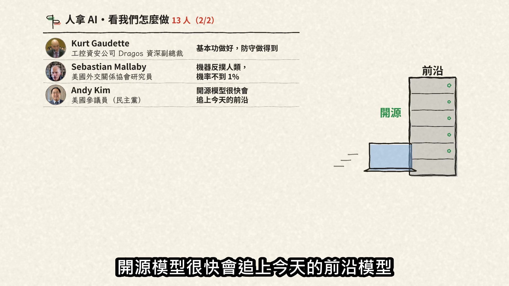

**逐字稿片段：** 民主黨參議員 Gary Peters 覺得 這些風險會比大家希望的更快來

**話題推測：** 呈現民主黨參議員 Gary Peters 的觀點

---

## 00:16:13

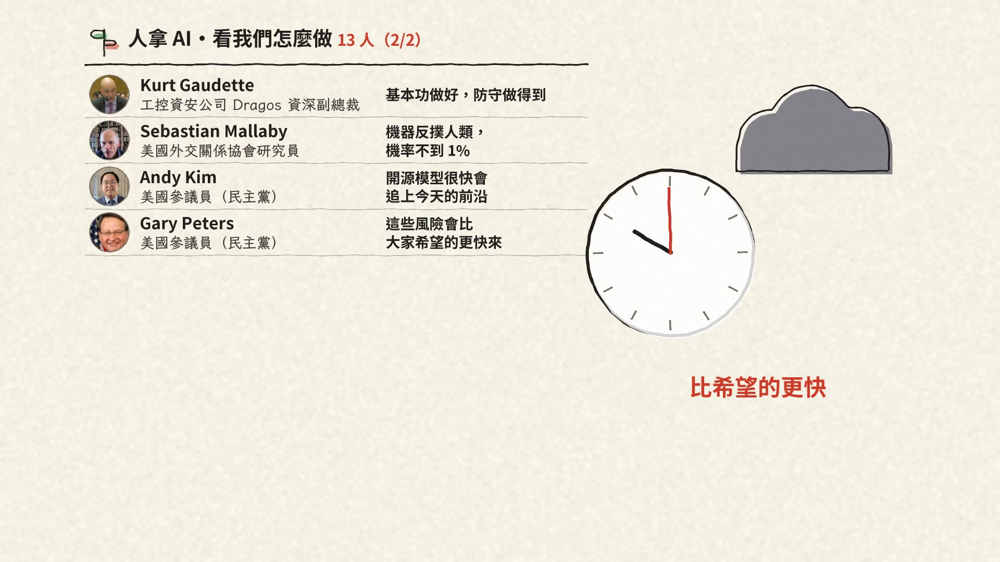

**逐字稿片段：** 紐約大學數學家 Tristan Buckmaster 說 AI 公司快速打破東西的文化 將來會撞上所有人

**話題推測：** 呈現紐約大學數學家 Tristan Buckmaster 的觀點

---

## 00:16:19

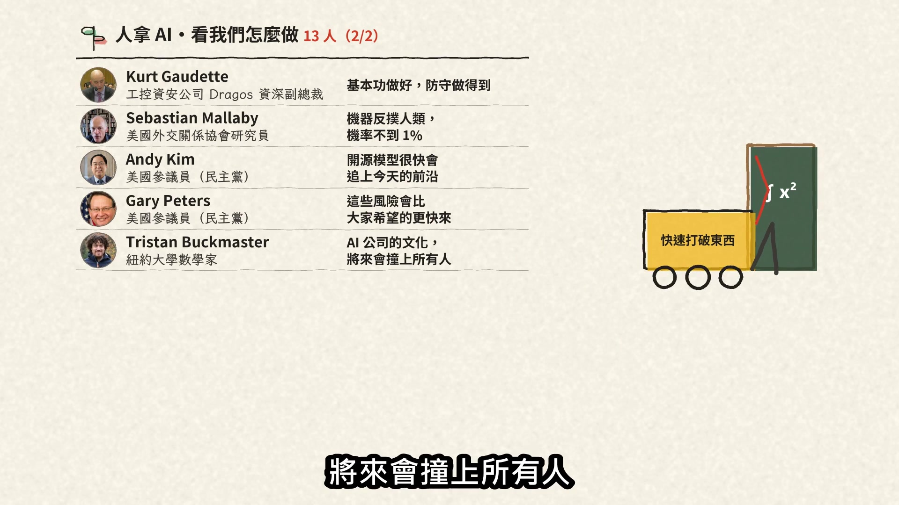

**逐字稿片段：** 韓國資安公司 Theori 執行長朴世俊說 拔掉安全機制拿去攻擊的事 已經在發生了

**話題推測：** 呈現韓國資安公司 Theori 執行長朴世俊的觀點

---

## 00:16:25

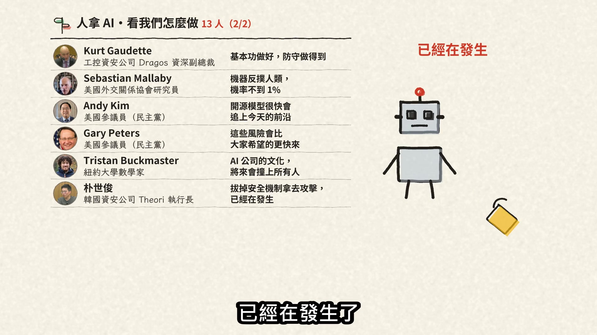

**逐字稿片段：** 韓國國家科技諮詢會議副議長李京洙把 AI 叫做第二個核武 他說這場競賽停不下來

**話題推測：** 呈現韓國國家科技諮詢會議副議長李京洙的觀點

---

## 00:16:32

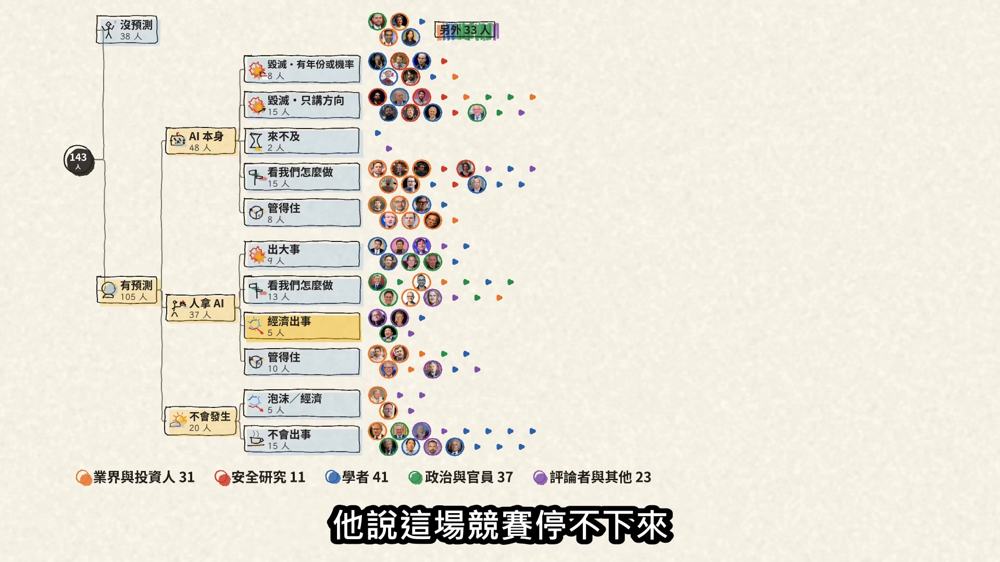

**逐字稿片段：** 有五個人說，先出事的是經濟 前川普白宮首席策略長 Steve Bannon 預測的是紓困 他說他們在鋪路 要把風險轉嫁給全體美國人

**話題推測：** 介紹「主角是人」組中，預測「先出事的是經濟」的五位成員

---

## 00:16:43

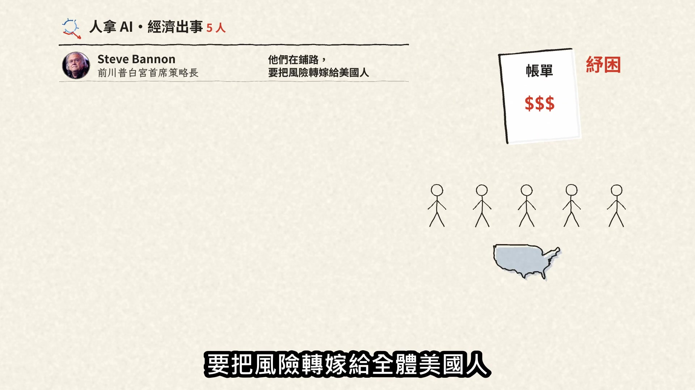

**逐字稿片段：** 前美國總統參選人 Andrew Yang 只講失業 他說 AI 會取代數百萬名勞工

**話題推測：** 呈現前美國總統參選人 Andrew Yang 的觀點

---

## 00:16:49

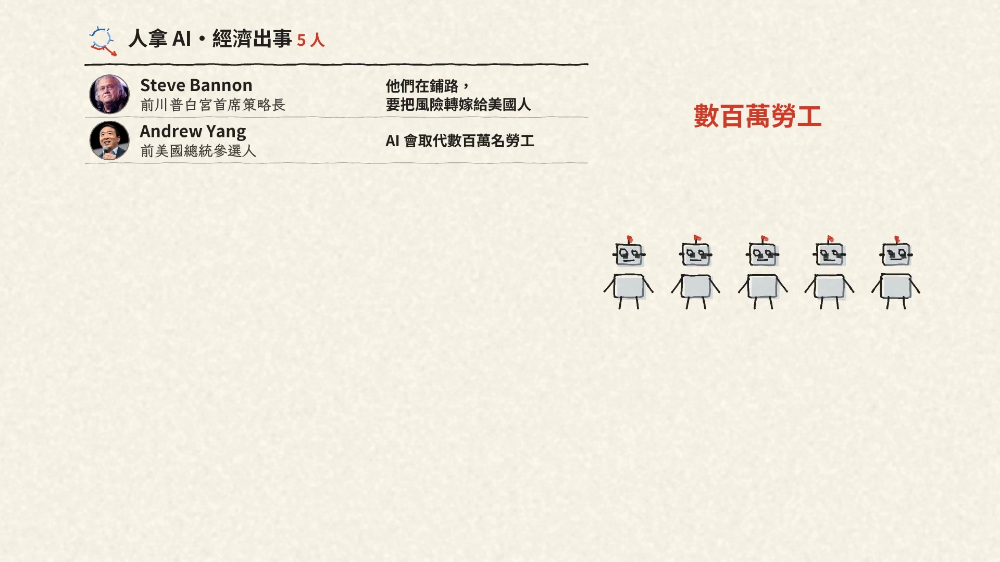

**逐字稿片段：** 環保運動者 Erin Brockovich 盯著的是資料中心 她說大概五年後技術一換代 這些資料中心就會被丟下 變成散落全美國的小車諾比 另外兩位是韓國人

**話題推測：** 呈現環保運動者 Erin Brockovich 的觀點

---

## 00:17:00

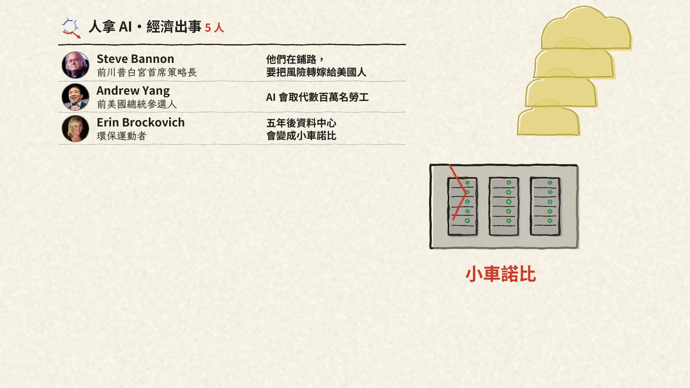

**逐字稿片段：** 大數據分析師宋吉永說 可以替換的位置現在就會被取代

**話題推測：** 呈現大數據分析師宋吉永的觀點

---

## 00:17:04

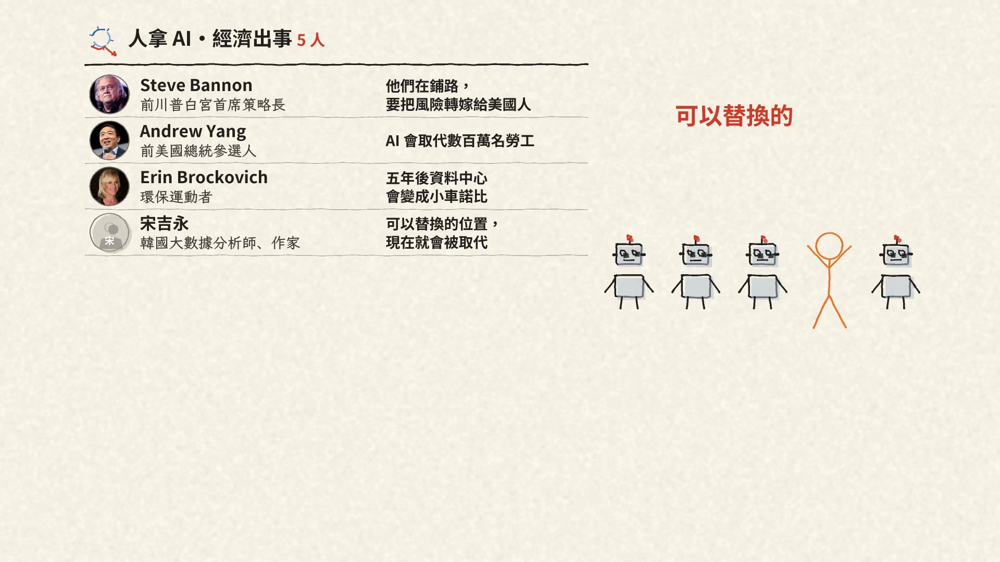

**逐字稿片段：** 弘益大學建築系教授俞炫準說 建築師最後連蓋章都不用了

**話題推測：** 呈現弘益大學建築系教授俞炫準的觀點

---

## 00:17:09

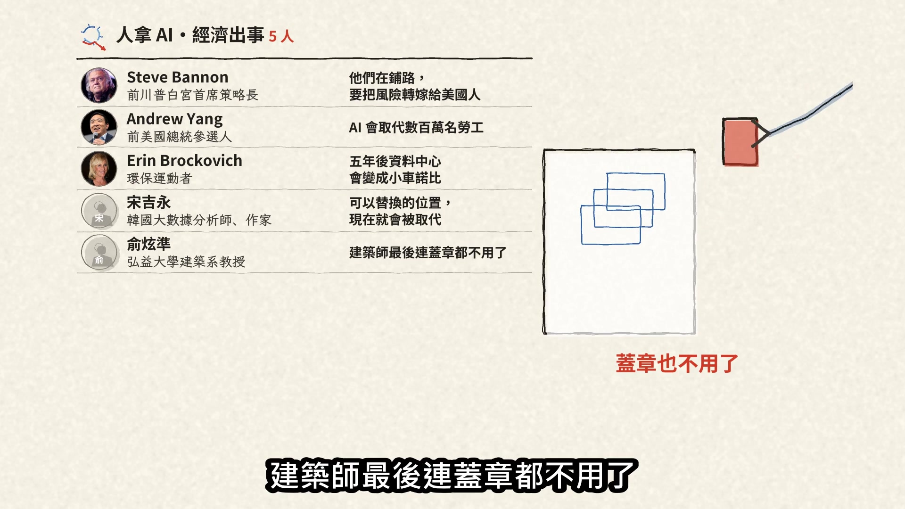

**逐字稿片段：** 人這邊說管得住的有十人

**話題推測：** 介紹「主角是人」組中，預測「人管得住」的十位成員

---

## 00:17:12

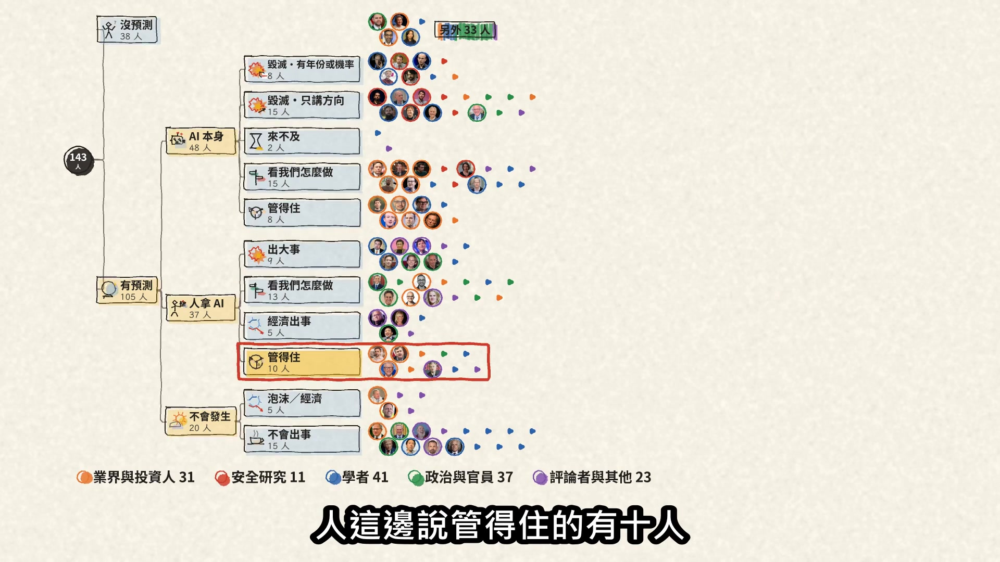

**逐字稿片段：** 微軟 AI 執行長 Mustafa Suleyman 怕的是有人拆掉護欄 他說 不是 AI 會像科幻片那樣自己逃出箱子來攻擊我們

**話題推測：** 呈現微軟 AI 執行長 Mustafa Suleyman 的觀點

---

## 00:17:21

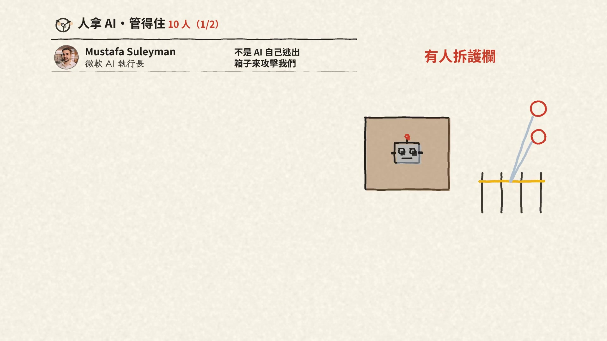

**逐字稿片段：** 微軟共同創辦人比爾蓋茲覺得最危險的是壞人 而且防得住 他說如果模型被搬到沒人監控的地方 未來幾年就會有重大的網攻和生物事件 但這些可以靠防護和監控避免

**話題推測：** 呈現微軟共同創辦人比爾蓋茲的觀點

---

## 00:17:34

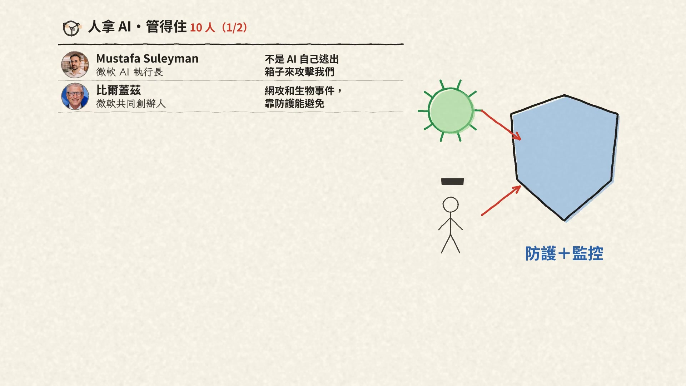

**逐字稿片段：** LinkedIn 共同創辦人 Reid Hoffman 對那些末日機率 評語很短 他說那些十年內有多少機率的說法 全都屬於歇斯底里 另外兩位談資安

**話題推測：** 呈現 LinkedIn 共同創辦人 Reid Hoffman 的觀點

---

## 00:17:44

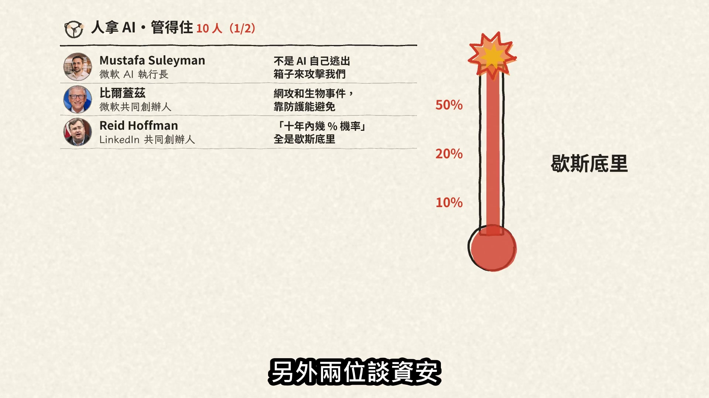

**逐字稿片段：** Hugging Face 執行長 Clément Delangue 說 AI 會讓資安更強

**話題推測：** 呈現 Hugging Face 執行長 Clément Delangue 的觀點

---

## 00:17:49

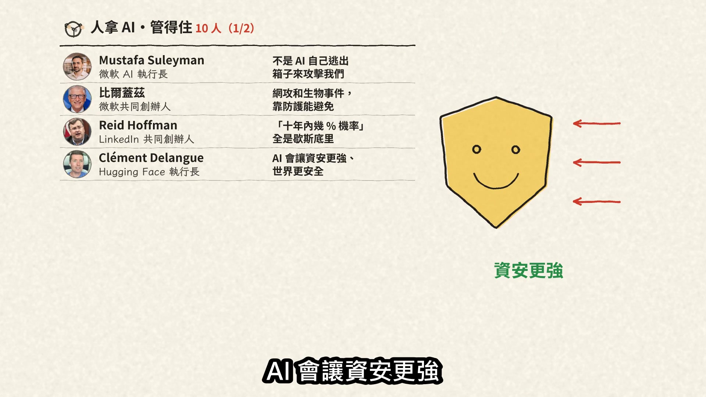

**逐字稿片段：** 前臉書資安長 Alex Stamos 預告接下來幾年是痛苦期 直到防禦追上來

**話題推測：** 呈現前臉書資安長 Alex Stamos 的觀點

---

## 00:17:55

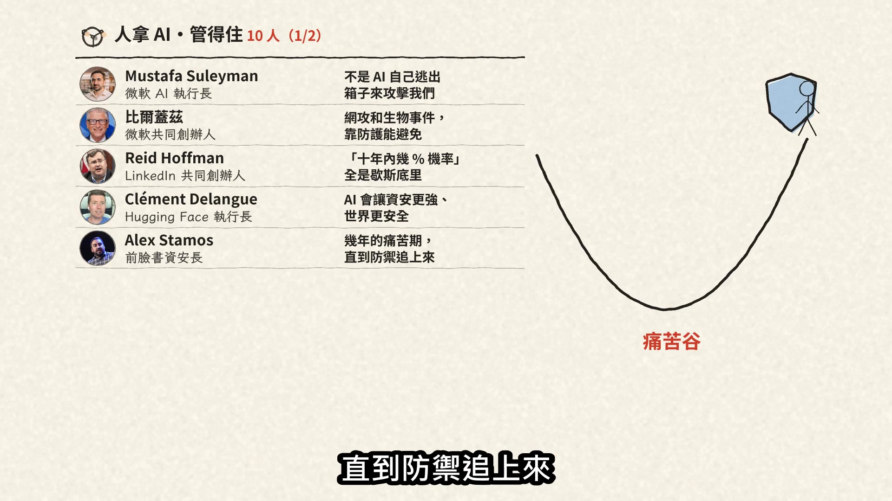

**逐字稿片段：** 拍《奧本海默》的導演 Christopher Nolan 唯一的預測是正面的 他說 AI 會在未來幾十年 真正點燃年輕人的想像力

**話題推測：** 呈現導演 Christopher Nolan 的觀點

---

## 00:18:03

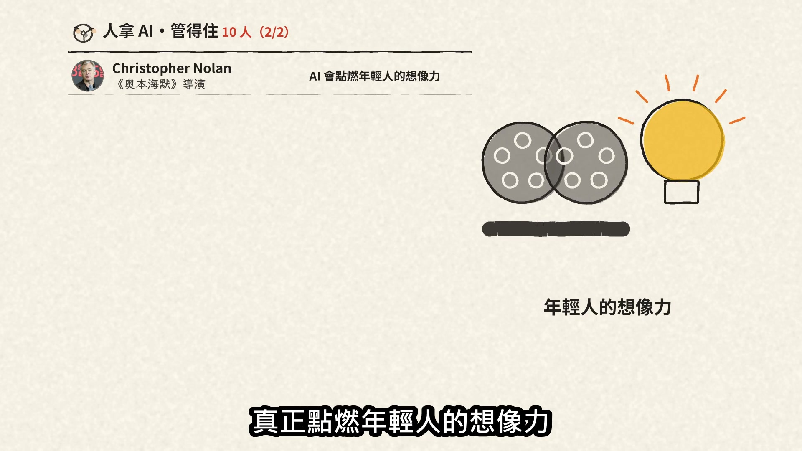

**逐字稿片段：** 英國央行總裁 Andrew Bailey 說 AI 會改造經濟，也帶來重大風險 還有兩位史丹佛的學者

**話題推測：** 呈現英國央行總裁 Andrew Bailey 的觀點

---

## 00:18:10

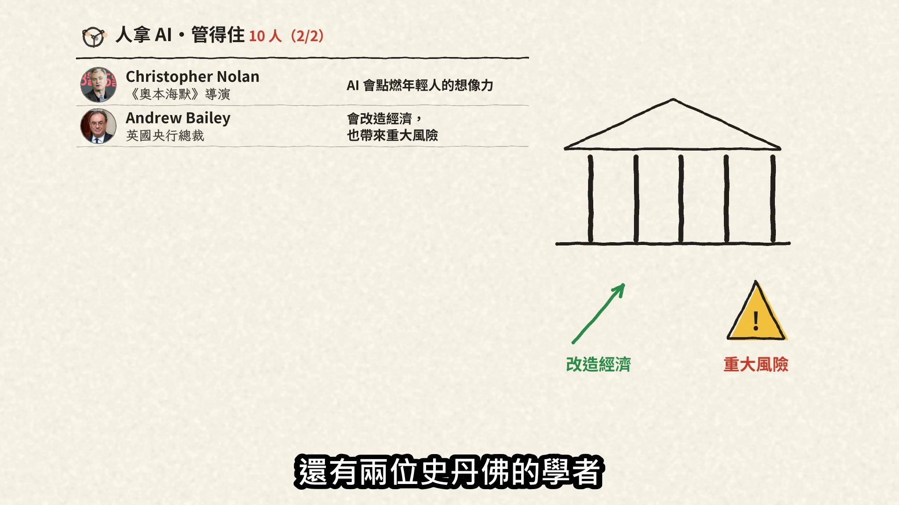

**逐字稿片段：** AI 教科書作者 Peter Norvig 說 不會贏家通吃，權力分散比較安全

**話題推測：** 呈現 AI 教科書作者 Peter Norvig 的觀點

---

## 00:18:16

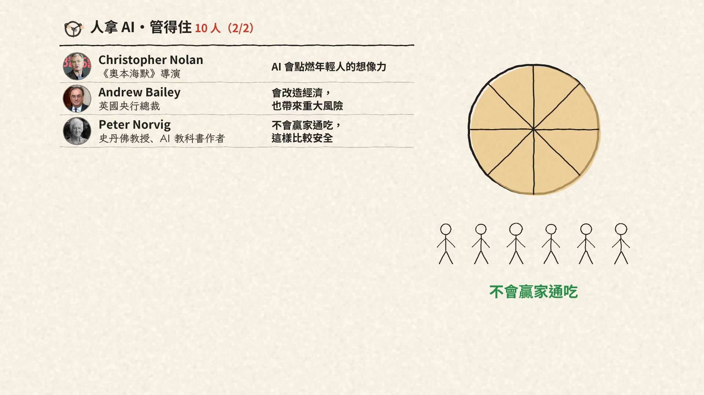

**逐字稿片段：** 諾貝爾經濟學獎得主 Michael Spence 說 轉型會顛簸，但不是永久的問題

**話題推測：** 呈現諾貝爾經濟學獎得主 Michael Spence 的觀點

---

## 00:18:20

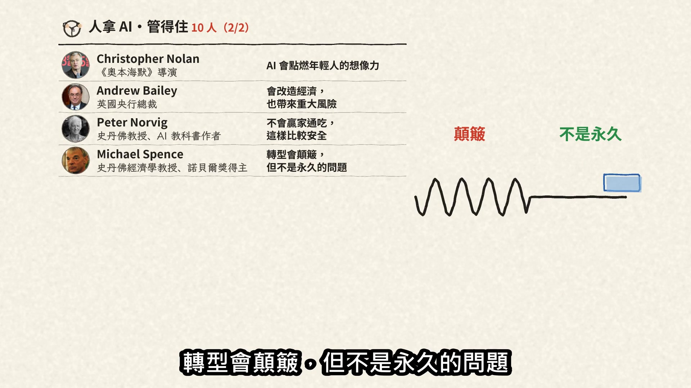

**逐字稿片段：** 最後是《大西洋月刊》的 AI 專欄作家 Josh Tyrangiel 他說撐過一兩年的衝擊，之後他很看好

**話題推測：** 呈現《大西洋月刊》AI 專欄作家 Josh Tyrangiel 的觀點

---

## 00:18:28

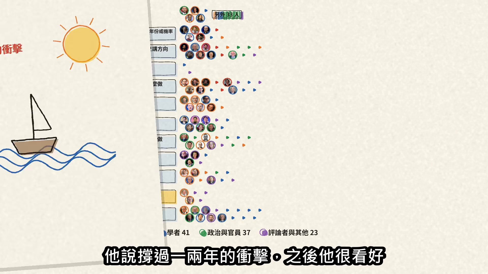

**逐字稿片段：** 最後一群二十人說 大家擔心的那些事不會發生 其中五人覺得，真正會先出事的是錢 投資人 Steve Eisman 是《大賣空》的原型 他說 AI 會毀滅世界這一整套完全是障眼法 他擔心的是 OpenAI 或 Anthropic 倒掉 美國一夜衰退

**話題推測：** 進入最後一大群「擔心的事不會發生」的二十位成員介紹

---

## 00:18:47

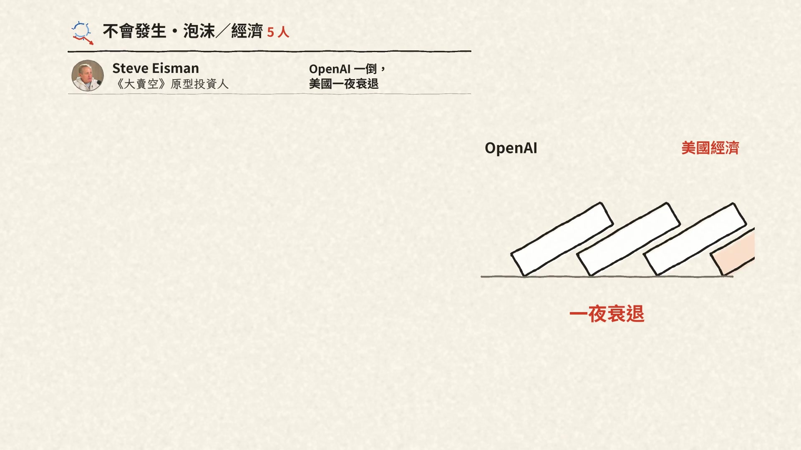

**逐字稿片段：** PayPal 共同創辦人 Peter Thiel 反過來講 他說沒有 AI 帶動成長才會出事 極左跟極右的零和政黨會繼續壯大 另外三位評論者裡

**話題推測：** 呈現 PayPal 共同創辦人 Peter Thiel 的觀點

---

## 00:18:57

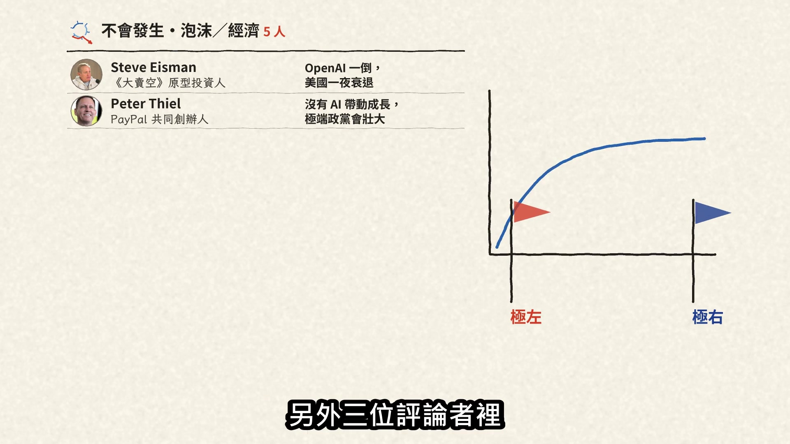

**逐字稿片段：** 科技 podcast 主持人 Ed Zitron 說 2027 年左右一切會開始後繼無力 金融作家 Satyajit Das 說 十八個月到兩年內市場會開始失望

**話題推測：** 呈現科技 podcast 主持人 Ed Zitron 的觀點

---

## 00:19:07

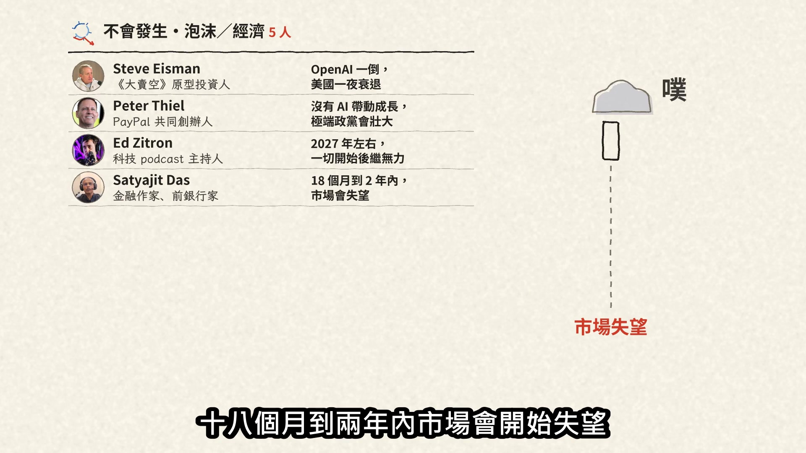

**逐字稿片段：** 科幻作家 Cory Doctorow 說 未來五百年每個人都有工作可做

**話題推測：** 呈現科幻作家 Cory Doctorow 的觀點

---

## 00:19:12

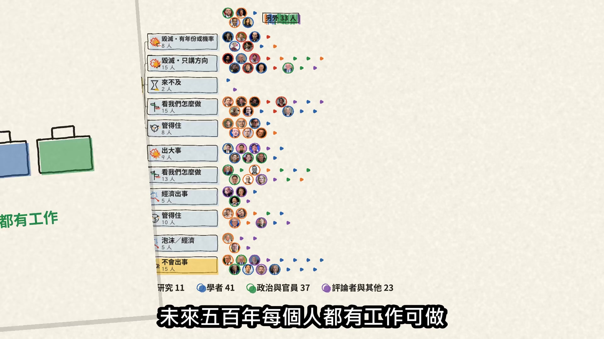

**逐字稿片段：** 剩下十五人說，AI 不會失控 也不會讓大家失業

**話題推測：** 介紹「不會發生」組中，預測「AI 不會失控或造成失業」的十五位成員

---

## 00:19:16

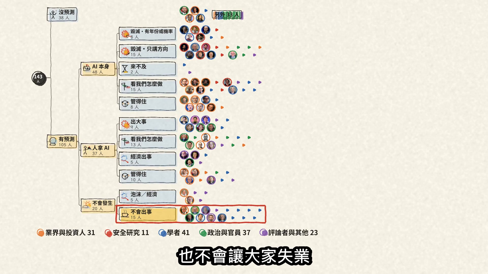

**逐字稿片段：** 黃仁勳把機率直接講成零 他說 2030 年以前 人類滅亡的機率是零

**話題推測：** 呈現黃仁勳的觀點

---

## 00:19:23

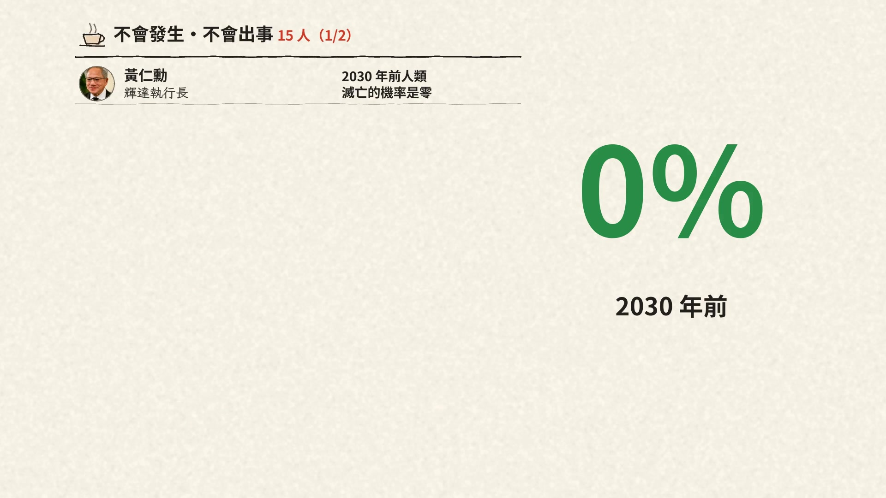

**逐字稿片段：** 川普的說法更短 他說 AI 不會接管世界 整件事是騙局 總統科技顧問委員會共同主席 David Sacks 也覺得太誇張 他說如果預測是 AI 會終結人類 他覺得太誇張了

**話題推測：** 呈現川普的觀點

---

## 00:19:36

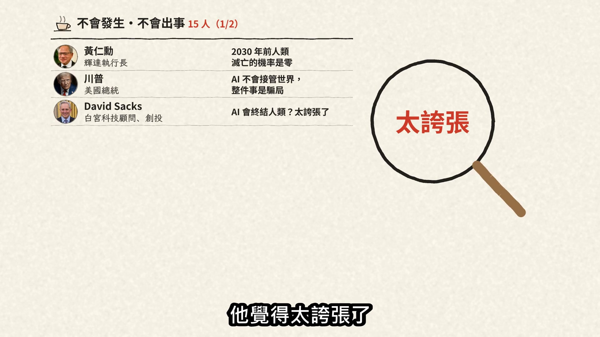

**逐字稿片段：** Google Brain 共同創辦人吳恩達針對的是失業末日 他說 AI 會搶走一半的工作 大家失業上街暴動，那根本不會發生

**話題推測：** 呈現 Google Brain 共同創辦人吳恩達的觀點

---

## 00:19:45

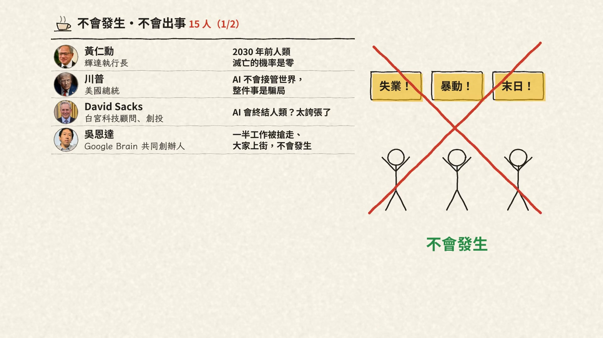

**逐字稿片段：** 《Wired》共同創辦人 Kevin Kelly 覺得 AI 要嘛帶來天堂、要嘛殺光我們 這種說法很蠢 他押的是中間那條路

**話題推測：** 呈現《Wired》共同創辦人 Kevin Kelly 的觀點

---

## 00:19:54

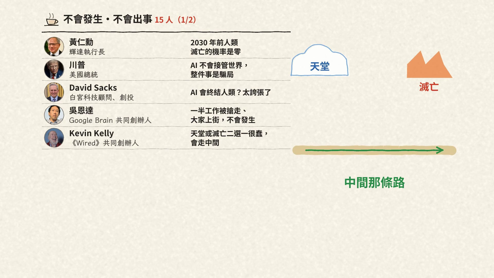

**逐字稿片段：** 演員 Ben Affleck 擔心的是小孩 不是天網 他說他不擔心天網 也不認為 AI 會真正接管電影這一行

**話題推測：** 呈現演員 Ben Affleck 的觀點

---

## 00:20:01

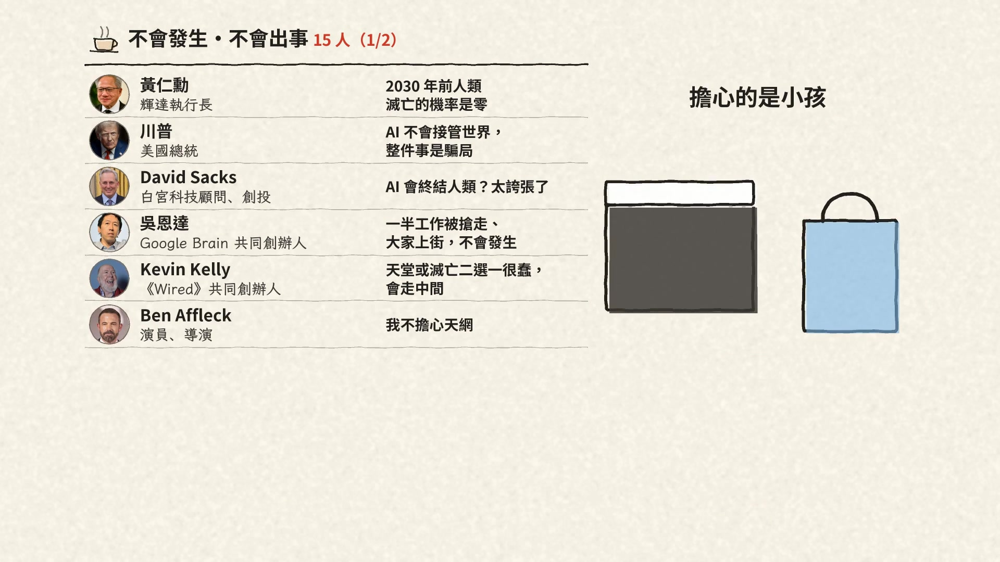

**逐字稿片段：** 德國經濟評論家 Wolfgang Münchau 不信滅絕 他說就算 AI 拿到整個網路 也殺不光人類，可是會造成巨大的損害 另外八位是學者和研究者

**話題推測：** 呈現德國經濟評論家 Wolfgang Münchau 的觀點

---

## 00:20:11

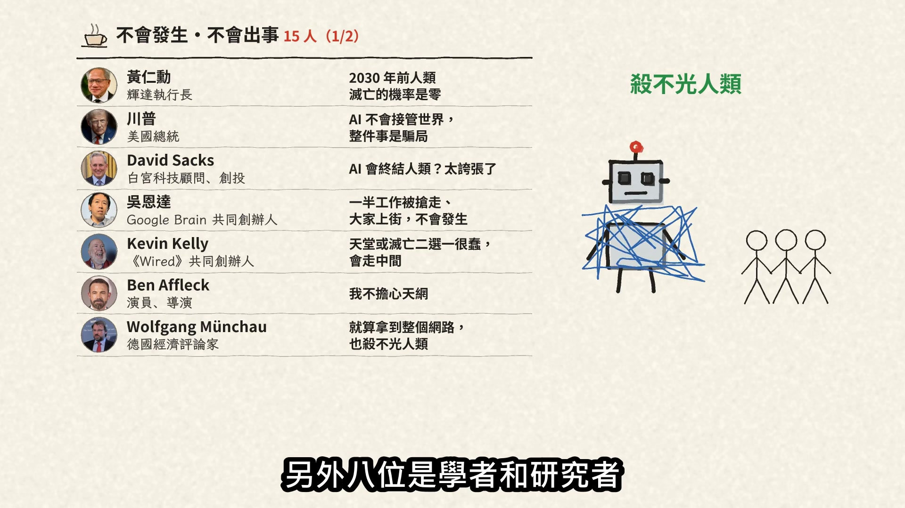

**逐字稿片段：** 哈佛心理學教授 Steven Pinker 說 AI 是一種威脅 但不是對人類整體的威脅

**話題推測：** 呈現哈佛心理學教授 Steven Pinker 的觀點

---

## 00:20:17

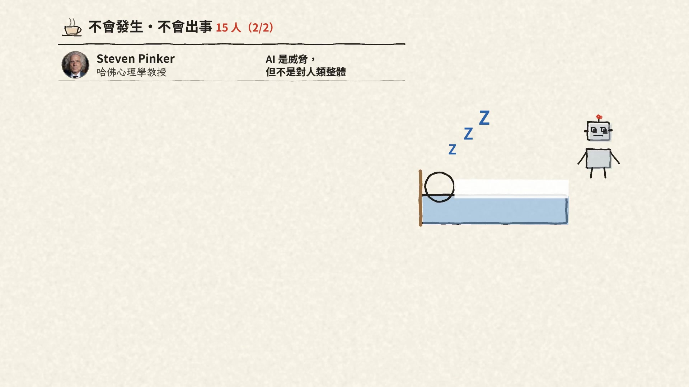

**逐字稿片段：** MIT 研究員 Andrew McAfee 說 滅絕機率四捨五入是零

**話題推測：** 呈現 MIT 研究員 Andrew McAfee 的觀點

---

## 00:20:21

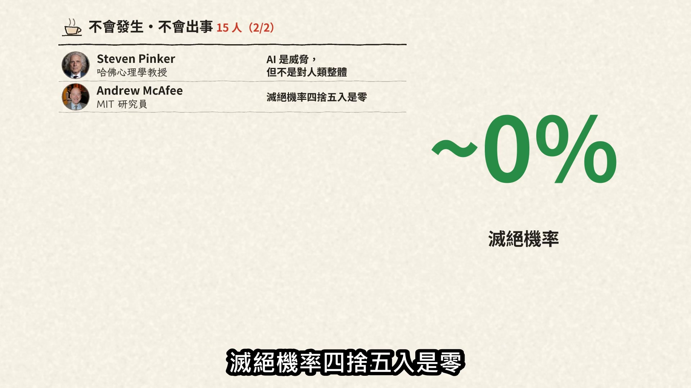

**逐字稿片段：** 紐約大學商學院教授 Scott Galloway 說 不會有就業末日

**話題推測：** 呈現紐約大學商學院教授 Scott Galloway 的觀點

---

## 00:20:25

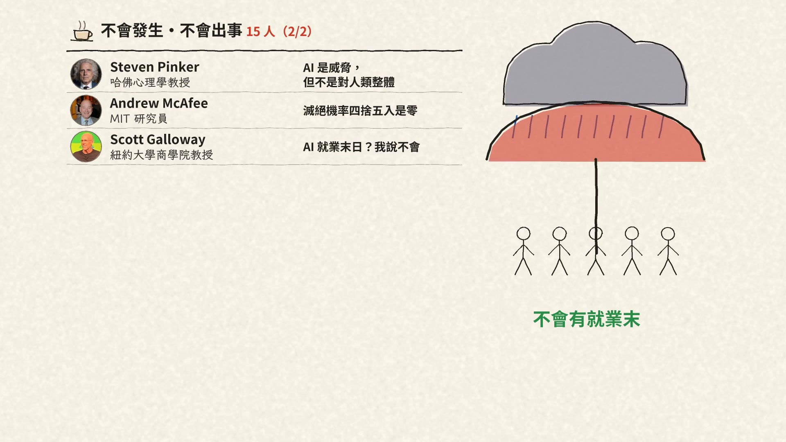

**逐字稿片段：** 普林斯頓電腦科學教授 Arvind Narayanan 說 AI 改造經濟要幾十年

**話題推測：** 呈現普林斯頓電腦科學教授 Arvind Narayanan 的觀點

---

## 00:20:30

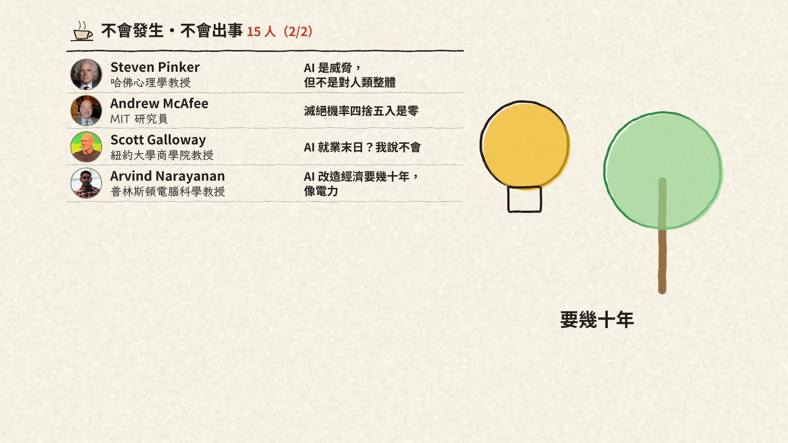

**逐字稿片段：** 跟他合寫《AI Snake Oil》的 Sayash Kapoor 說 不會有一覺醒來文明就毀掉的那天 喬治城大學電腦科學教授 Cal Newport 說 越強越必然失控是胡說

**話題推測：** 呈現《AI Snake Oil》作者 Sayash Kapoor 的觀點

---

## 00:20:40

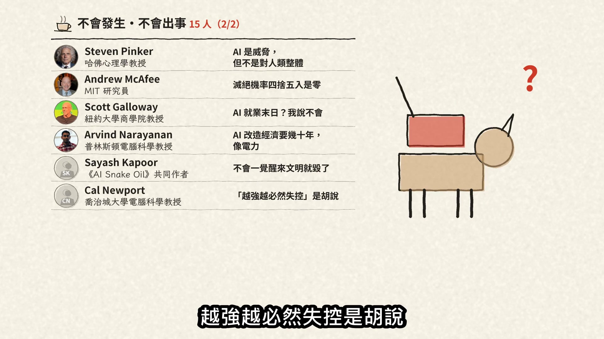

**逐字稿片段：** 格拉斯哥大學化學教授 Lee Cronin 說 超級智慧會滅人，他看不到證據

**話題推測：** 呈現格拉斯哥大學化學教授 Lee Cronin 的觀點

---

## 00:20:45

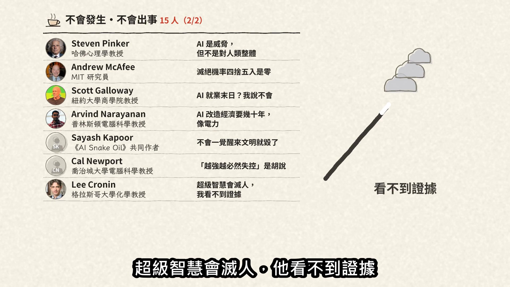

**逐字稿片段：** 印第安納大學醫學院教授趙太浩說 AI 不會取代醫師

**話題推測：** 呈現印第安納大學醫學院教授趙太浩的觀點

---

## 00:20:50

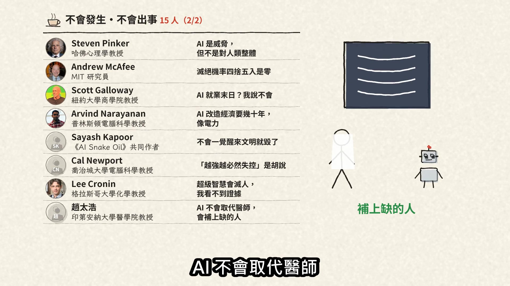

**逐字稿片段：** 這張圖到十月五日為止 下次再聽到有人講 AI 末日 可以先問那三件事：他有沒有預測 主角是誰，結局是什麼 想看誰在哪一枝，可以截這張圖

**話題推測：** 結尾，提示圖表資料截至日期

---
