# ai-note-101_Y40cCdonmls — 關鍵畫面索引

- 來源逐字稿：[ai-note-101_Y40cCdonmls_GT.srt](ai-note-101_Y40cCdonmls_GT.srt)
- 影片：https://www.youtube.com/watch?v=Y40cCdonmls
- 截圖數：20

## 00:00:03

**逐字稿片段：** 美國資安公司 Calif 在 9 月 8 日公開一支叫 WeWorm 的蠕蟲 它可以打一通微信電話 就接管對方的帳號 然後自動打給對方所有的朋友 Calif 的原話是，受害者不需要接電話 也不需要碰手機 手機一響，攻擊就已經打進去了 資安圈把這種攻擊叫零點擊 意思是你什麼都不用做就會中 你唯一會看到的，是一通沒接到的來電 洞開在微信的網路通話功能裡 手機接到來電的時候要先處理對方傳來的資料，Calif 就是在這一步把不該塞的東西塞了進去

**話題推測：** 介紹美國資安公司Calif及其發現的新聞事件

---

## 00:00:39

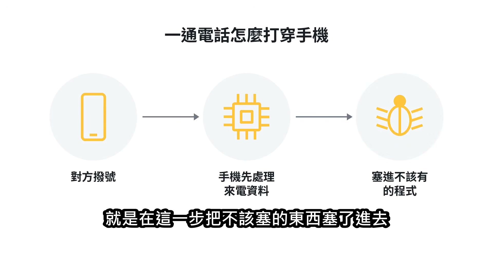

**逐字稿片段：** 更麻煩的是 iOS 跟 Android 都中 這不是某一支手機的問題 是微信自己那段程式的問題，兩邊都有

**話題推測：** 說明漏洞影響範圍涵蓋iOS與Android系統

---

## 00:00:46

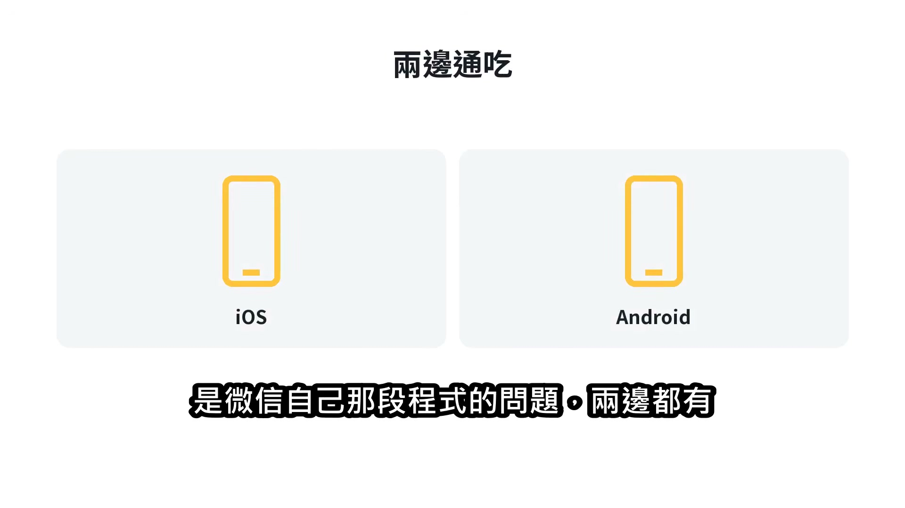

**逐字稿片段：** Calif 自己估的射程是超過 10 億支手機

**話題推測：** 說明Calif估計的受影響手機數量（超過10億支）

---

## 00:00:50

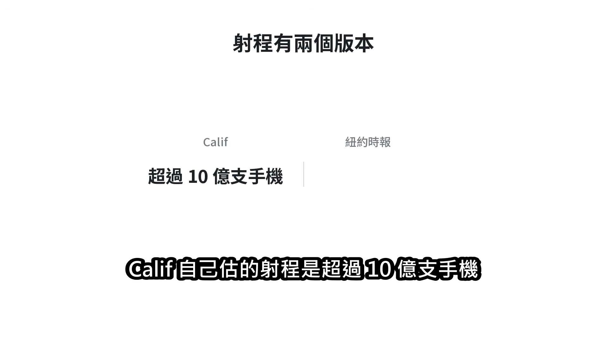

**逐字稿片段：** 紐約時報同一天的報導寫的是數億台裝置、 幾個小時內傳完，兩個數字出自不同的人 接下來這段逐日紀錄是 Calif 自己貼出來的 7 月 23 號團隊內部確認這個洞是真的 隔天 7 月 24 號就通報騰訊 通報的隔天，7 月 25 號

**話題推測：** 紐約時報報導的受影響裝置數量（數億台）

---

## 00:01:08

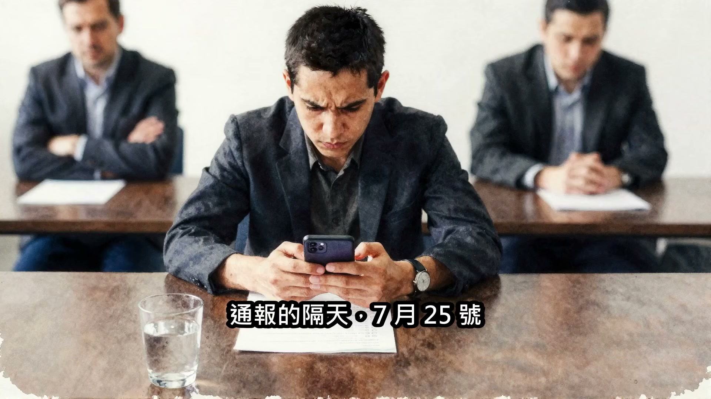

**逐字稿片段：** Calif 全公司的微信帳號被封了 封了四天，7 月 29 號才解封 沒有人解釋為什麼 Calif 沒有指控騰訊報復 只是把日期排在那裡

**話題推測：** 說明Calif公司微信帳號被封的事件

---

## 00:01:19

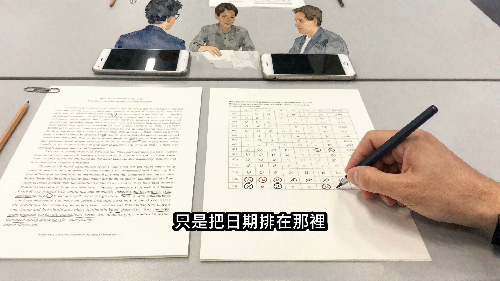

**逐字稿片段：** 而微信在中國是身分證、是錢包 帳號被封等於生活停擺 帳號 7 月 29 號解封

**話題推測：** 闡述微信在中國的重要性（身分證、錢包）

---

## 00:01:26

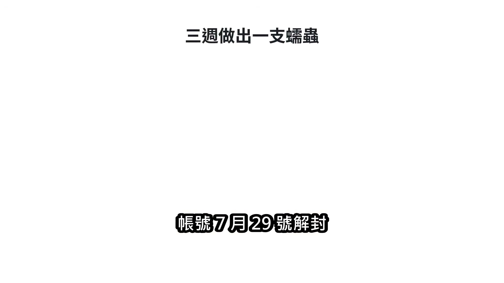

**逐字稿片段：** 7 月 30 號 Calif 就完成第一支 Android 攻擊碼 8 月 2 號完成 iOS 的 8 月 11 號把兩邊串成會自己傳染的蠕蟲

**話題推測：** Calif完成第一支Android攻擊碼

---

## 00:01:34

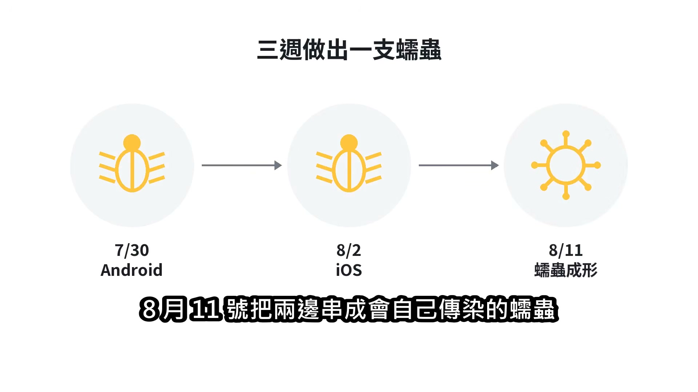

**逐字稿片段：** Calif 說這整件事是跟 AI 一起做的 找到洞之後兩天寫出第一支攻擊碼 再一週做成蠕蟲

**話題推測：** 提及此次事件與AI的協同工作

---

## 00:01:42

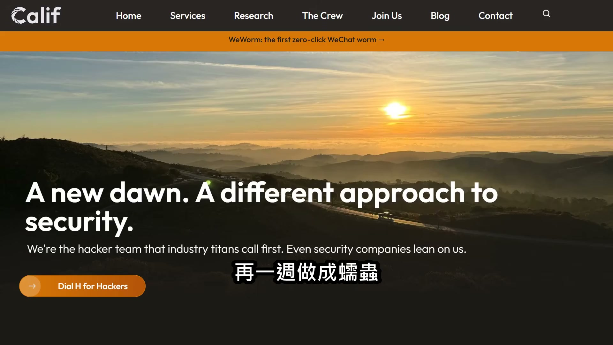

**逐字稿片段：** 過去這需要一個更大的團隊、花好幾個月 Calif 全文只寫了跟 AI 一起做 從頭到尾沒有講是哪一個模型 這點他們沒有具名，外界也不知道

**話題推測：** 比較過去與現在開發蠕蟲所需的時間與團隊規模

---

## 00:01:53

**逐字稿片段：** 8 月 21 號騰訊推出新版微信 Android 是 8.0.77、iOS 是 8.0.76 從通報到修好，中間隔了 28 天 8 月 28 號騰訊確認伺服器端也替所有用戶擋掉了 9 月 3 號 Calif 把完整技術分析跟能跑的攻擊碼交給騰訊，9 月 4 號騰訊確認這個洞真的可以遠端下指令 這 28 天裡 十幾億人照常在微信上打電話 沒有人知道有一支會自己傳染的蠕蟲 已經在別人的電腦上跑得起來了

**話題推測：** 騰訊推出新版微信修補漏洞

---

## 00:02:25

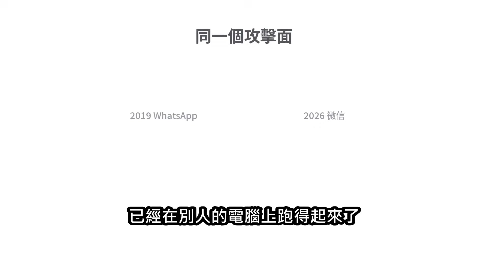

**逐字稿片段：** 這一招七年前有人用過 2019 年 5 月 WhatsApp 的網路通話被人打穿 也是打一通電話、對方不必接 就能把間諜軟體裝進去

**話題推測：** 提及七年前WhatsApp曾發生類似攻擊事件

---

## 00:02:33

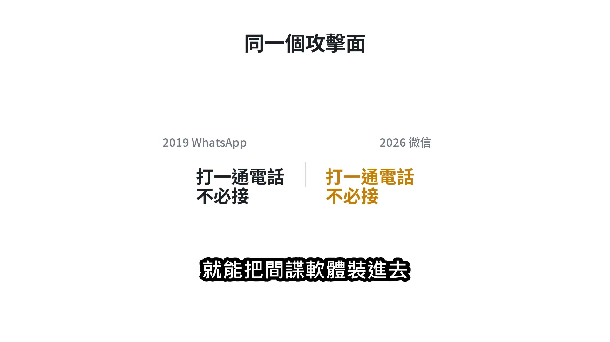

**逐字稿片段：** 做那件事的是以色列公司 NSO Group 賣的是給政府用的間諜軟體

**話題推測：** 介紹以色列公司NSO Group及其相關事件

---

## 00:02:39

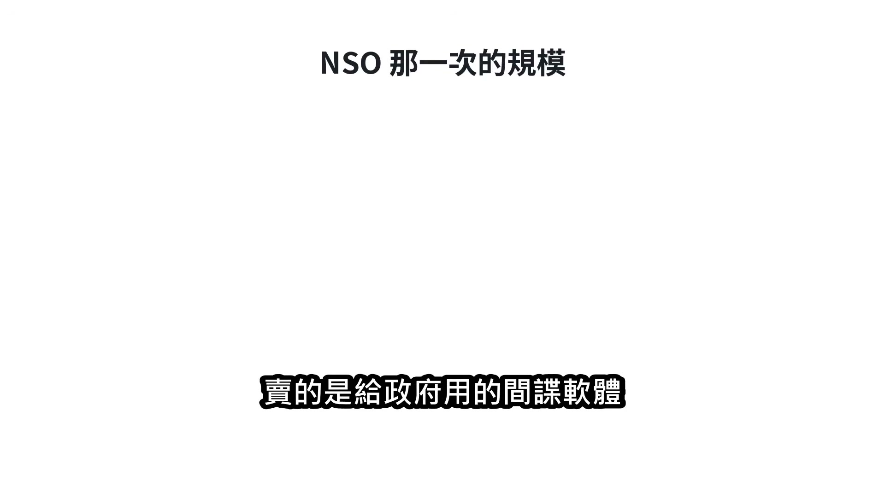

**逐字稿片段：** 法庭文件顯示，目標橫跨 51 個國家、 1400 多人，多半是記者跟人權工作者 2025 年 5 月

**話題推測：** NSO Group攻擊目標橫跨51個國家、1400多人

---

## 00:02:47

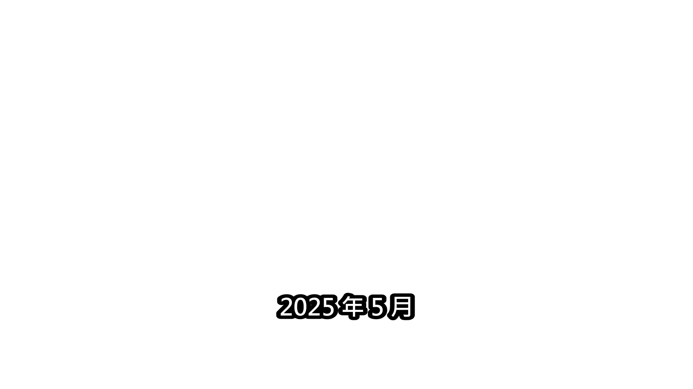

**逐字稿片段：** NSO Group 被判賠 1.67 億美金 做這件事的代價，法院已經算過了 Google 的漏洞研究團隊 Project Zero 早就講過這種攻擊 除非你不用手機，否則沒有辦法防 這是一種沒有防禦手段的武器 差別在做得到的人變多了

**話題推測：** NSO Group被判賠1.67億美金

---

## 00:03:03

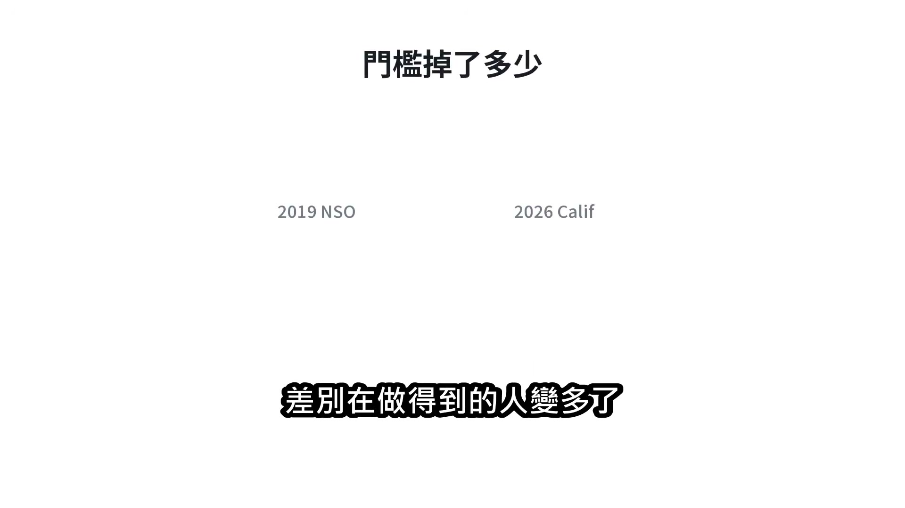

**逐字稿片段：** 2019 年這種能力屬於一家做了十幾年、 只賣給政府的公司 2026 年，它屬於一家 60 人的顧問公司，加上兩天 Calif 自己在文章裡寫，AI 正把這種能力交到技術沒那麼好的人手上 讓一般使用者暴露在前所未有的風險裡 這句話是他們 9 月 8 號寫的

**話題推測：** 比較2019年與現在發動攻擊所需的能力與團隊規模變化

---

## 00:03:22

**逐字稿片段：** 還有一個反差在另一邊 Anthropic 5 月 22 號公布自家找漏洞計畫的第一份成績單 掃過 1000 多個開源專案 找出 6202 個高危漏洞 回報出去的有 530 個

**話題推測：** 引入另一則關於Anthropic公司找漏洞計畫的新聞

---

## 00:03:35

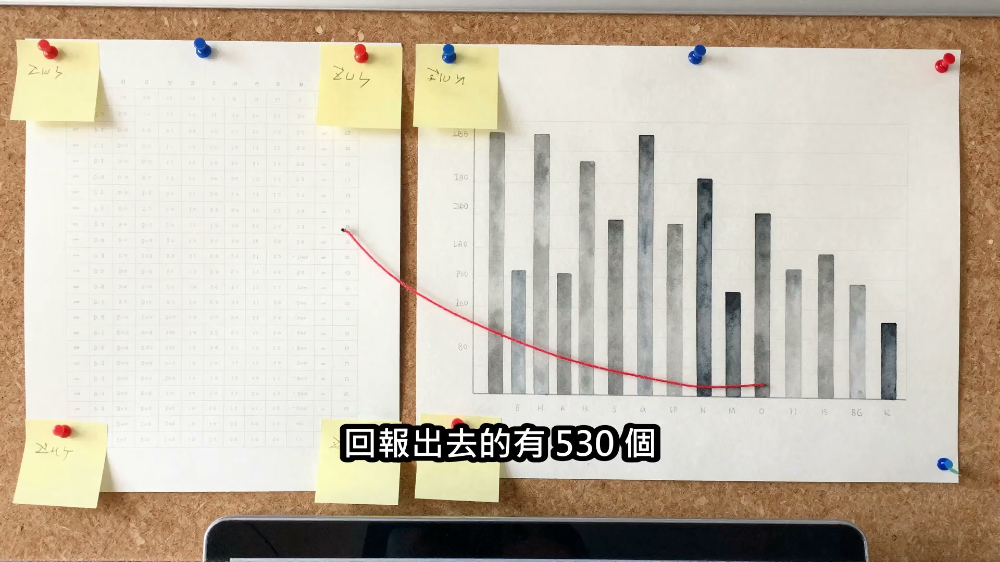

**逐字稿片段：** 真正被補好的只有 75 個 找洞已經工業化了，補洞還是手工業 資安專家 Bruce Schneier 在 4 月寫過一句但書： 假設防守方補得動、 而且能快速推給用戶 這項技術對防守方有利

**話題推測：** 真正被修補好的漏洞數量（75個），顯示修補效率低

---

## 00:03:49

**逐字稿片段：** 微信這次花了 28 天，而蠕蟲只要一週

**話題推測：** 比較微信修補漏洞的28天與蠕蟲形成的一週時間

---

## 00:03:53

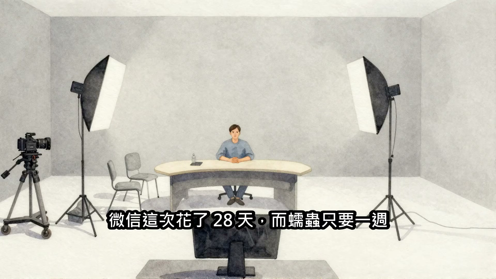

**逐字稿片段：** 統整一下 這次真正的新聞不是微信有洞 是做出這種攻擊的門檻掉到了 60 個人加兩個星期就做得完 Calif 打穿的是 10 億人每天在用的通訊軟體 然後把攻擊碼整包交給了騰訊 Calif 說同一類的通話攻擊面 在其他通訊軟體上也存在，正在往下查 還沒有公布是哪幾個 技術細節要留到之後的研討會

**話題推測：** 進入影片總結部分

---

## 00:04:15

**逐字稿片段：** 台灣人用的 LINE 是同一類軟體 目前沒有任何證據指 LINE 有這個問題 但下一份報告值得看

**話題推測：** 提及台灣常用通訊軟體LINE的潛在風險

---
