# ai-note-101_YU5ESeka-CE — 關鍵畫面索引

- 來源逐字稿：[ai-note-101_YU5ESeka-CE_GT.srt](ai-note-101_YU5ESeka-CE_GT.srt)
- 影片：https://www.youtube.com/watch?v=YU5ESeka-CE
- 截圖數：41

## 00:00:00

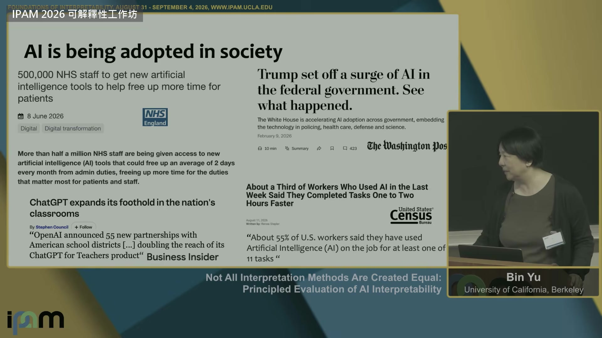

**逐字稿片段：** 這是第 10 集 題目是：解釋方法不是生而平等 解釋 AI 的方法那麼多 哪一個可以信 過去十年，她做的是同一件事 讓機器學習從基因資料裡挑出線索 再交給生物實驗室去驗

**話題推測：** 影片開場，展示集數與標題。

---

## 00:00:15

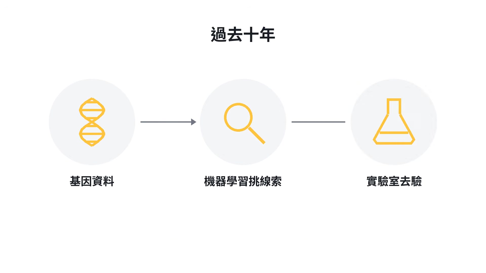

**逐字稿片段：** 去年登上 Nature Cardiovascular Research 的那篇心臟病論文 88 頁，就是這樣做出來的

**話題推測：** 提及具體研究論文與期刊名稱。

---

## 00:00:21

**逐字稿片段：** 她叫 Bin Yu 柏克萊的統計學家 美國國家科學院院士

**話題推測：** 明確點出講者姓名、學校與頭銜。

---

## 00:00:25

**逐字稿片段：** 這場的骨架只有兩步 第一步 她主張解釋 AI 的方法要分級

**話題推測：** 介紹本場演講的兩步驟骨架。

---

## 00:00:29

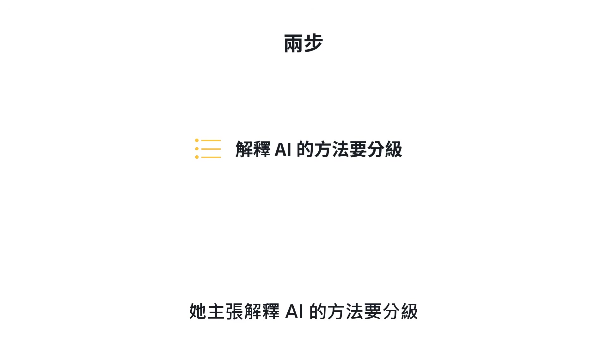

**逐字稿片段：** 分級的尺叫 TRUST 一共 5 層 第二步，她拿這把尺去量 3 個方法 3 個都出自她自己的實驗室

**話題推測：** 引入「TRUST」分級尺度的概念。

---

## 00:00:36

**逐字稿片段：** 大家應該都看到了，AI 正在進入社會

**話題推測：** 開始討論 AI 進入社會的廣泛應用情境。

---

## 00:00:41

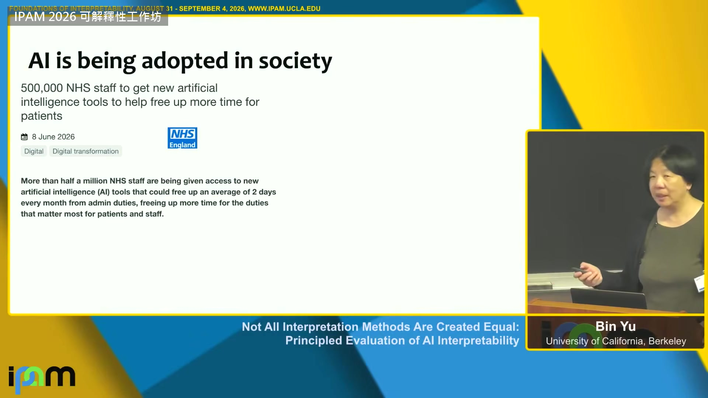

**逐字稿片段：** 英國的國民保健署正在讓員工用起來 美國政府很積極在推各部門採用 人口普查局有一份報告說，將近三分之一的工作者已經在用 有件事我準備這場演講才知道 ChatGPT 正在把版圖擴進 55 個學區 OpenAI 真的在往教育擴張，也附了一些準則 但要我說，審查還可以再多一點 也開始有證據顯示：沒有護欄的話，學到的東西留不住 這裡有兩個對照試驗 一個做的是土耳其的高中數學 這個樣本比較小，那個是規模比較大的研究 這個規模小，我記得是大學程度 結果很像。做法是分兩組 一組用 AI，一組不用 過一段時間再測記得多少，通常是 45 天或 60 天 用 AI 的那組明顯比較差，例如差了 10% 挪威已經禁止小學使用 AI 事情正在發生 加州去年有了第一部 AI 安全法 前年的第一版沒過 第二版比較弱，重點放在透明度

**話題推測：** 舉例英國國民保健署使用 AI 的情況。

---

## 00:02:10

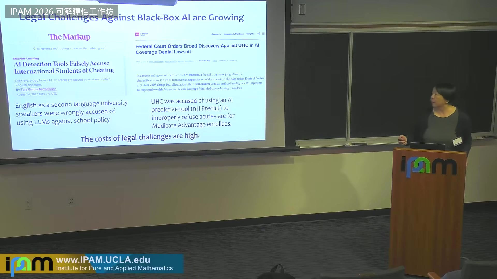

**逐字稿片段：** 在法律這一邊，也有人提出挑戰 而打官司的成本非常非常高 第二個案子還動用了國會調查 所以非常非常貴 不可能每個案子都走這條路去查

**話題推測：** 討論法律層面對 AI 的挑戰與訴訟案例。

---

## 00:02:29

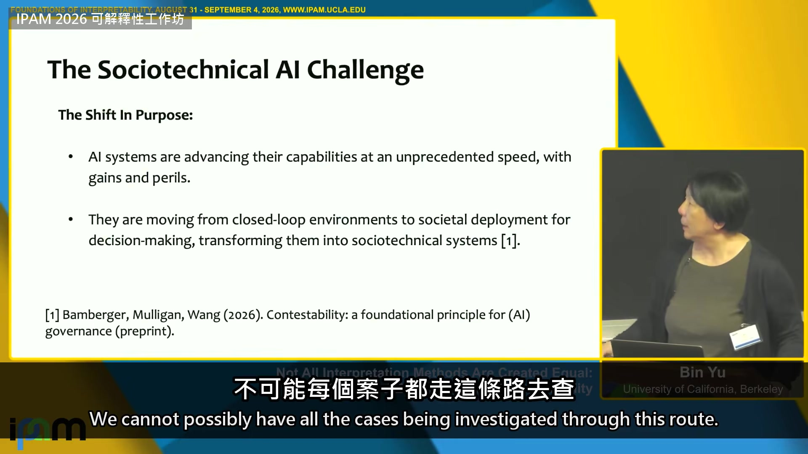

**逐字稿片段：** 總結一下。我的工作建立在兩位法律同事的研究上 Ken Bamberger 教授、Deirdre Mulligan，還有 Victor Wang 他們來自法學院跟資訊學院 他們有一篇論文，題目是〈可質疑性：AI 治理的基礎原則〉 我們都同意，AI 的能力進步得很驚人 解數學題是這樣，駭客攻擊也是 它們正在走出實驗室，進入部署 AI 因此變成一個社會技術系統 這個轉變的意思是：它現在綁著特定的社會用途，會影響個人跟社群 而隨機實驗或系統性的研究又貴又花時間 不可能及時抓到所有問題 所以我認為，可質疑性會變成社會的一項基本要求

**話題推測：** 總結並介紹其法律同事對「可質疑性」的研究。

---

## 00:03:34

**逐字稿片段：** 他們怎麼定義可質疑性？ 定義是：AI 系統必須讓使用者或受影響的人，能夠有意義地質疑、 理解、並且修正系統的輸出，還有它背後的假設 也就是讓使用者有能力真正參與開發，因為這是社會技術系統 他們要的第一件事是透明 我們得想辦法讓使用者看得懂這個系統 第二件是可以採取行動的救濟管道 使用者要有機制去追問、去修正模型內部的邏輯跟因果表徵 這些目標很重，但可以朝那個方向努力

**話題推測：** 詳細定義「可質疑性」的內涵。

---

## 00:04:20

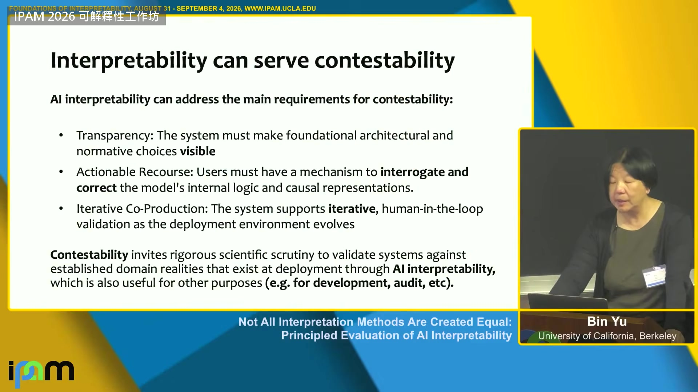

**逐字稿片段：** 第三件是反覆來回的共同產出 部署的環境會變，系統要支援有人參與的反覆驗證 以老師來說，學校裡部署的系統出了問題，他們應該有管道找 OpenAI 處理 我覺得學校可以有自己的封閉系統 不必用最先進的前沿模型，因為學校的用途很明確 那個層級用開放權重的模型就可以 學校的控制權更多，安全上的配備也更多 可質疑性會引來嚴格的科學檢驗：透過 AI 可解釋性，拿系統去對照部署現場已經確立的事實 可解釋性對別的用途也有用，部署、稽核等等 這只是一個新的角度，規模大得多 所以可質疑性其實意味著：解釋方法的標準要拉高 前提是：要能有意義地質疑跟修正 AI，就需要能把模型內部運作攤給人看的解釋方法

**話題推測：** 闡述「可質疑性」的第三個要求：反覆來回的共同產出。

---

## 00:05:22

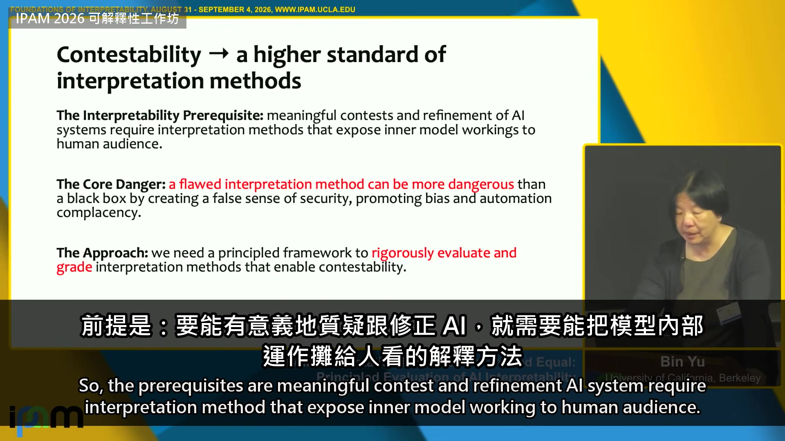

**逐字稿片段：** 核心的危險是：一個有瑕疵的解釋方法，可能比黑箱更危險，因為它給你假的安全感 所以不是有解釋就一定比沒有好 它還會助長偏誤，讓人對自動化掉以輕心 我們接下來的做法，是提出一個有原則的框架 我要講的這個工作還在成形當中 很歡迎大家批評指教 框架要做的是嚴格評估解釋方法並且分級，看它拿得出多少證據來支撐可質疑性

**話題推測：** 提出有瑕疵的解釋方法可能比黑箱更危險的警告。

---

## 00:05:56

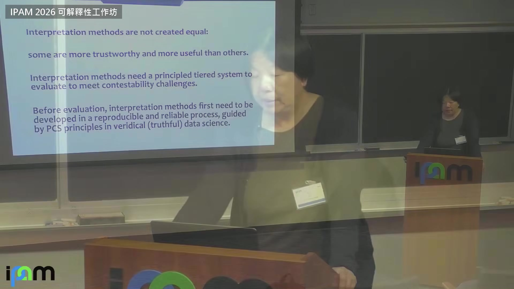

**逐字稿片段：** 所以，解釋方法不是生而平等 一個方法該不該用，背後的證據有等級之分 有些就是比別的更可信、更有用 我剛才說過，我們需要一套有原則、分層級的評估系統，來回應可質疑性的挑戰

**話題推測：** 再次強調「解釋方法不是生而平等」的核心論點。

---

## 00:06:12

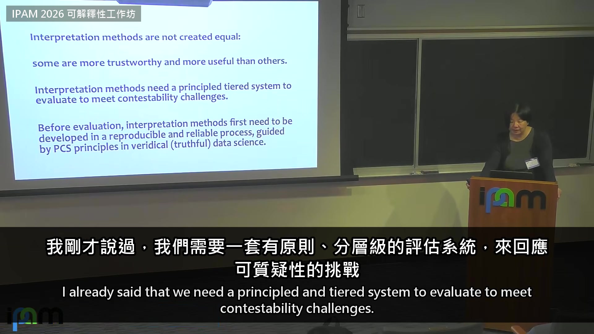

**逐字稿片段：** 這是我們 2019 年發表在 PNAS 的論文 我組裡有人做機器學習、有人做神經科學、有人做基因體學 大家湊在一起問：我們說的可解釋性，到底是什麼意思？ 那是 2019 年

**話題推測：** 介紹其團隊 2019 年發表在 PNAS 的論文。

---

## 00:06:27

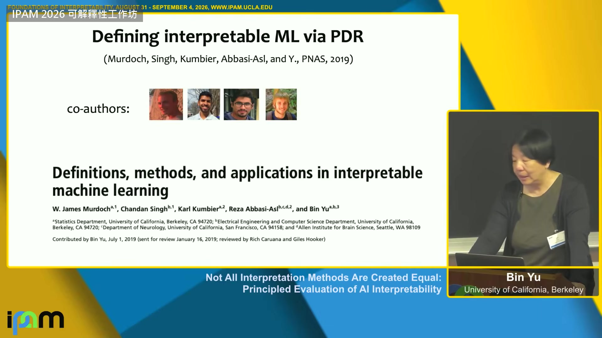

**逐字稿片段：** 相對於當時的文獻，我們提出的關鍵概念是：要先定義看的人是誰，也就是相關性 解釋必須對著這個來定義 預測準確度，多數可解釋性論文本來就會要求 我們試著把描述準確度定義得更精確，而且是相對於看的人來定 我們把這三項要求叫做 PDR 同一段時間，我們也在發展 veridical data science 這個框架 論文隔年發表，想做的是把機器學習跟統計的原則整合在一起 並且把傳統統計看的樣本間變異，大幅擴張成穩定性 人為判斷的評估跟整合也算進來 因為 PCS 管的是整個工作流程 要把資料科學或 AI 變成一門系統的科學，留下紀錄是很大的一塊 因為什麼才算合理的人為判斷？ 離開情境就沒辦法定義 我常舉一個例子：我的手機會掉 我太常摔了，它沒壞，到現在都沒壞 我拿到頂樓去丟，它就會壞 如果只是掉在地上，我還錄了影，結果它壞了 那我大概有立場回去找 Apple，說這產品有問題 從樓頂丟下去的就不行 一樣都是摔 一個是手機正常使用下合理的擾動 另一個就不是，除非我是間諜之類的 所以留下紀錄在這個框架裡才佔這麼大一塊

**話題推測：** 提出解釋必須定義相關性（看的人是誰）的關鍵概念。

---

## 00:08:06

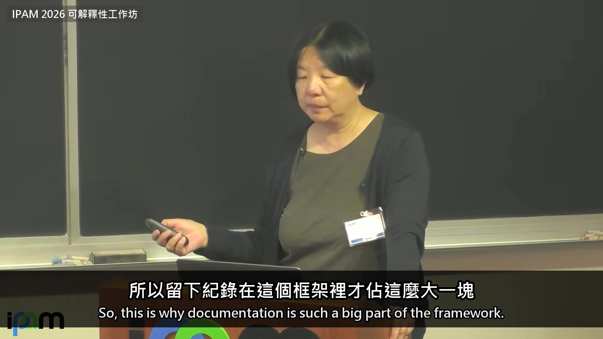

**逐字稿片段：** 兩組縮寫後面會一直出現，先停下來看

**話題推測：** 暫停並解釋 PDR 與 PCS 在圖表上的呈現。

---

## 00:08:09

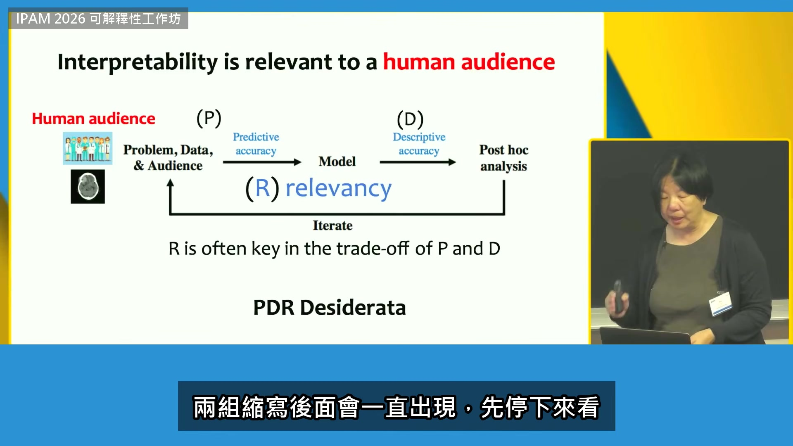

**逐字稿片段：** PDR 在這張圖上是兩個箭頭加一個迴圈 從資料到模型的箭頭叫 predictive accuracy 問的是模型有沒有學對 從模型到事後分析的箭頭叫 descriptive accuracy 問的是解釋有沒有照實講出模型學到的東西 迴圈上的 R 是 relevancy 解釋要對看的人有用 底下那行字說，P 跟 D 怎麼取捨 常常由它決定 PCS 是下一頁的三個原則 Predictability 結論要過得了現實的檢查 Computability 要算得動 Stability 做法在合理的範圍內變動 結論不能跟著變 接下來將近三分鐘 她講的是 PCS 想當各領域的共同語言 還有哪些單位已經採用，我們跳過 那我們說的 TRUST 是什麼？ 首先是地基：PDR 三項要求要先滿足 當初寫的時候，P 指的是預測 現在我把它擴大成現實檢查 這是底線：預測要準、描述要準，而且對看的人、對用途是相關的 論文原本寫的是對一個任務 現在有了基礎模型，我想講得大一點，所以改叫用途，比較一般 第二層 R：嚴謹、可擴展的知識基礎 方法必須跑得動大規模 真的要稽核或理解 AI 系統，可擴展性是一定要的 而且輸出要用一種形式呈現，讓專家可以做嚴謹、系統性的審查 這對應的是 P，現實檢查

**話題推測：** 描述 PDR 框架的箭頭與迴圈圖示。

---

## 00:09:43

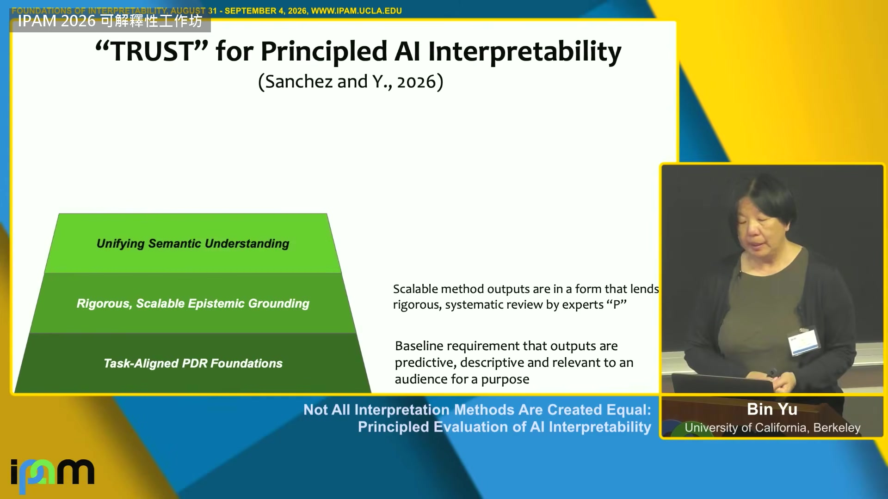

**逐字稿片段：** 再來，解釋或它的結論要有穩定性 同一個領域裡不同的人，對同一個結果不該有兩種解讀 不然就有問題了，溝通裡的雜訊太多 這是 U 我們還要看評估跟審查做得多廣，這一層叫適用範圍的可轉移性 看監督式學習，即使在二、三十年前剛起步的時候 也從來不是拿三個 benchmark 資料集就想證明方法有效 至少是幾十個、上百個 但看可解釋性，資料集少得可憐 通常三個左右，就想說方法有效 這很侷限 所以在可轉移性這件事上，可解釋性還比不上監督式學習 我們需要更多公開資料集，也需要私下的合作，讓大家拿得到證據 我是通才型的 統計學家就是想做出在很多領域都能用的東西 所以對我來說很重要的是：一套通用的解釋方法，不能只在某一個資料集上有效 要在一大片問題上都有效 但沒有東西永遠有效 所以限制也要講出來 有時候就是行不通 我上課都說，統計跟資料科學的第一定理是：沒有東西永遠有效 所以你得搞懂它怎麼有效、為什麼有效、什麼時候有效 把限制講出來也很重要 資料集夠多，才看得出它什麼時候不行 最後一層，我認為是做科學研究的人做得到的：外部驗證，而且是前瞻性的 解釋要能幫你設計新的東西，不只是拿手上的資料對模型做消融 我們會進實驗室做實驗 這整套都是從我們一個做了很久的計畫裡長出來的，用的是 iterative random forest 接下來我就講這個 五層由下往上再走一次 最底層，解釋要對得上任務跟看的人 也就是剛才的 PDR 第 2 層，方法要跑得動大模型 輸出要整理成專家可以逐條審查的形式 第 3 層，不同的人讀同一份解釋 讀到的意思要一樣 第 4 層，換一批相關的資料 方法還要有效 最上層，照著解釋去設計新的實驗 做出來要對 五層名稱的第一個字母由下往上排 拼出來就是 TRUST 她沒有明講的一點是成本 底下兩層在電腦前就能驗 最上層要進實驗室 我一直在追的東西叫交互作用 很多名言都在講：科學裡沒有東西是單獨起作用的 永遠是不同東西之間的交互作用 我們能不能用機器學習、用 AI 把它找出來？

**話題推測：** 闡述 TRUST 的第三層「穩定性」或「明確性」（Unambiguous）。

---

## 00:12:40

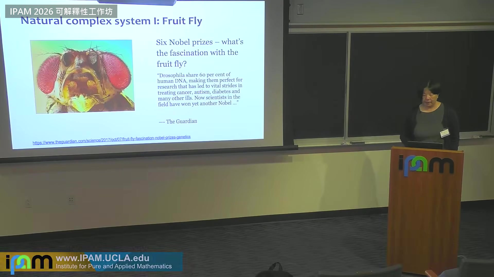

**逐字稿片段：** 我跟同事研究的第一個系統是果蠅 牠是生物學的明星，有五、六個諾貝爾獎是靠果蠅研究拿的 別小看牠，牠大約 60% 的基因跟我們一樣 沒有差那麼多 果蠅研究做了幾十年、甚至上百年，知道牠有四階的交互作用

**話題推測：** 介紹其研究的第一個系統：果蠅。

---

## 00:13:06

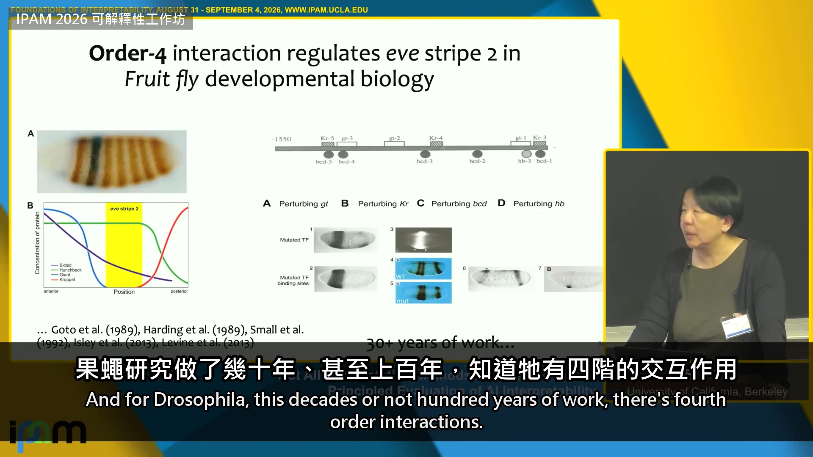

**逐字稿片段：** 身體成形的時候有一個分節的階段，這是果蠅的胚胎 現在知道是四個基因一起作用，把身體的藍圖鋪出來，也就是分節 所以我們知道，不能只停在兩兩一組的二階交互作用 要往更高階走

**話題推測：** 以果蠅胚胎的分節過程為例，說明四階交互作用。

---

## 00:13:24

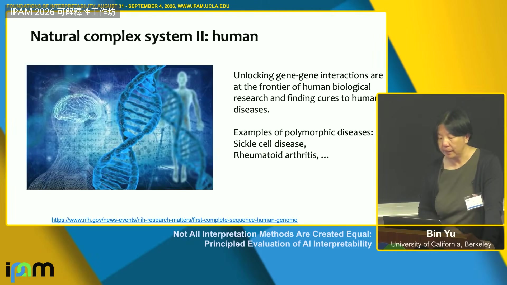

**逐字稿片段：** 我們做的下一個複雜系統是人 全基因體關聯分析在找單一的重要基因上進展很大 但現在的前線，是好幾個基因一起作用才造成的疾病 例如鐮刀型貧血、類風濕性關節炎 我們一直在做的是一種心臟病，叫 HCM

**話題推測：** 轉向研究下一個複雜系統：人類。

---

## 00:13:49

**逐字稿片段：** 肥厚型心肌病變，在美國每 500 人就有 1 人 我們跟史丹佛的 Ashley 團隊合作 以前的文獻已經知道這個病有遺傳的成分 我們用的是 UK Biobank 的資料 得這個病的人，左心室的壁會變厚 心臟很難把血打出去，後果很嚴重，包括死亡 透過 iterative random forest 這套框架，我們追的是因果

**話題推測：** 提及 HCM 在美國每 500 人就有 1 人的患病率。

---

## 00:14:19

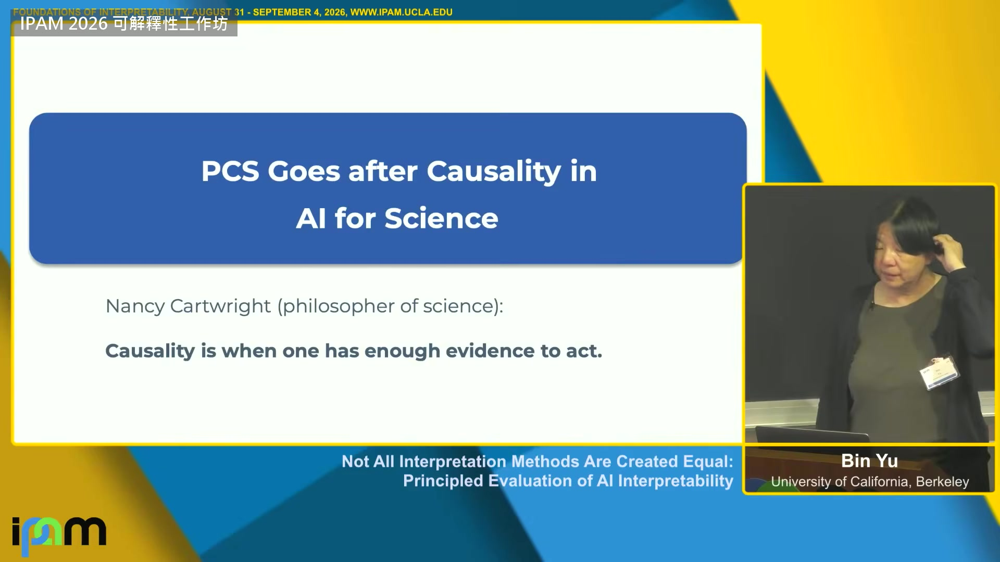

**逐字稿片段：** 講到因果，我喜歡哲學家 Nancy Cartwright 的定義 她說：因果，就是你的證據夠到可以行動 所以重點是證據 我們的行動是做實驗 你的可能是臨床試驗，可能是再做一個實驗 也可能是再收一批資料 這就是定義 我們想做的，是拿當時處理表格資料最領先的機器學習方法 也就是隨機森林，把它變得可以解釋

**話題推測：** 引用哲學家 Nancy Cartwright 對因果關係的定義。

---

## 00:14:51

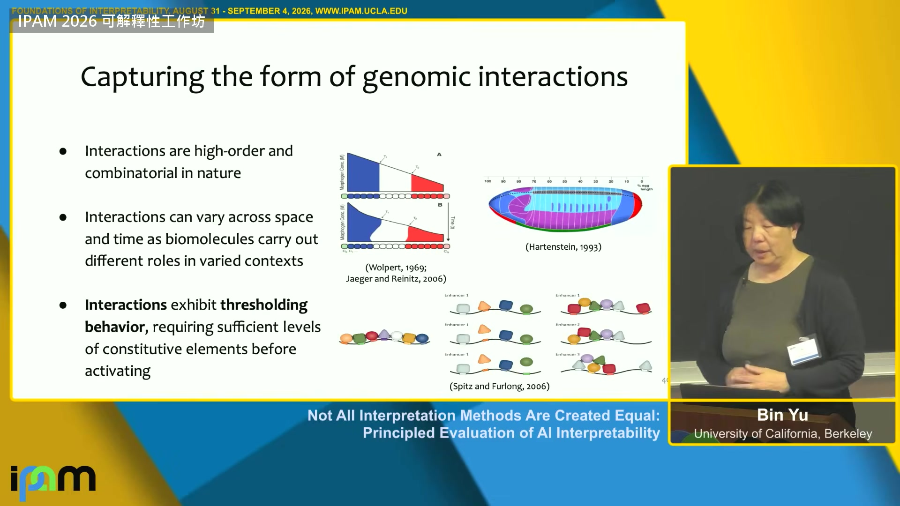

**逐字稿片段：** 我們借了一個生物學的知識，叫法國國旗模型 前面看過，基因的交互作用可以遠高於兩兩成對 統計的傳統做法從一百年前的 Fisher 開始：先有主效應，再加多項式的二次項 非常數學 而這個模型告訴我們：對某些過程，多項式不是交互作用該有的形式 大家發現，過門檻才是交互作用的一種形式 因為在細胞的層次，這些生物分子的量要夠多，才會交互作用 細胞裡雜訊很多，沒有那麼精準 所以量要夠 每個基因會做出很多很多小分子，它們得一起作用 這就叫法國國旗模型 而抓得住它的數學形式，而且是講得出機制的，就是決策樹 意思是：基因表現量、轉錄因子或蛋白質到了某個水位，才會交互作用 沒到就不會 交互作用是幾階，就看你放進幾個布林條件 決策樹在機器學習裡歷史很長 Leo Breiman 把這些集大成，做出隨機森林 在座大概都知道隨機森林，我就不多說 只提其中一步：特徵有很多很多個 每次分岔只抽其中一小部分，數量叫 mtry，而且是均勻地抽 不會把所有特徵都搜一遍 是用均勻的隨機抽樣取一個子集 問題來了。在我們之前就有人想到用樹來找交互作用 他們的想法是：兩個特徵如果落在同一棵樹的同一條路徑上 就可能有交互作用 我們也是這樣做 可是結果完全不穩定 你把它們收集起來，沒有一個是穩定的 這大家都知道 所以穩定性其實是能不能解釋的前提，只是沒人明講 預測力是有的，它是領先的方法 預測這一關的現實檢查它過了 但不能解釋，因為穩定性這條原則沒過 看的人是誰？生物學家 他們要解讀，可能會去做實驗 可能會把它註記進資料庫。所以對象是生物學家

**話題推測：** 引入「法國國旗模型」這一生物學知識來解釋交互作用。

---

## 00:17:16

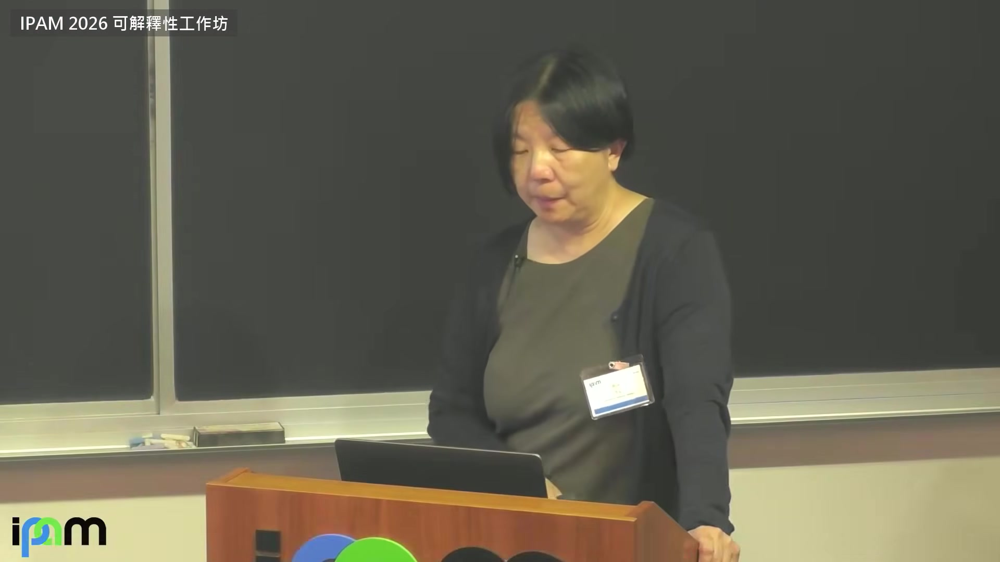

**逐字稿片段：** 所以我們做的就是把穩定性加進去 這也是 PCS 框架的起點 拿一個預測力好的隨機森林，加上穩定性 加法是這樣：先跑第一輪隨機森林 第二輪。記得原本的隨機森林每次分岔是均勻抽樣 而隨機森林本來就會算一個重要性指標 我們就讓重要的特徵多抽一點，不重要的少抽一點 等於做一種軟性的降維 還有一些步驟沒那麼重要 外面再套一圈 bagging，把穩定性收集起來 這樣就有了穩定性分數

**話題推測：** 說明其團隊將穩定性原則加入隨機森林，形成 iRF。

---

## 00:17:52

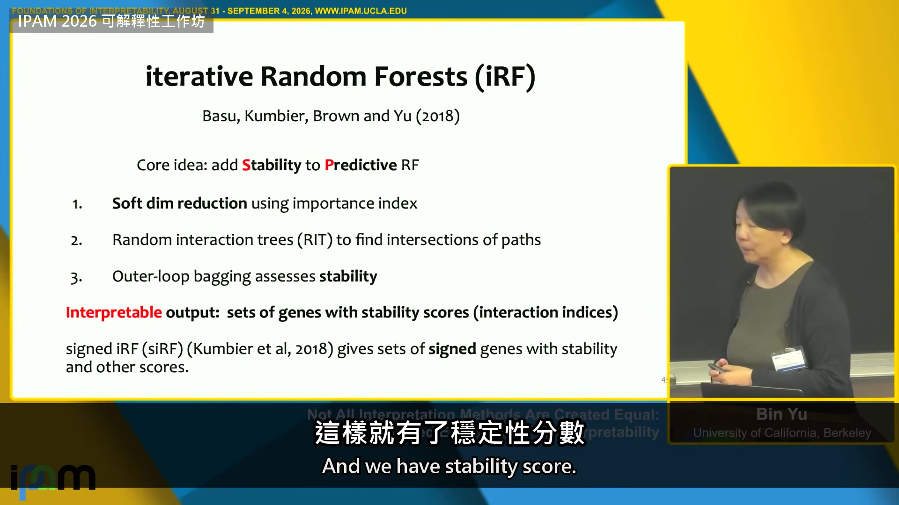

**逐字稿片段：** 這是果蠅的增強子預測問題 細節我就不講了 每一筆資料是一段 DNA，上面有一些量測值 要判斷的是這一段是不是增強子 某種意義上，它像啟動子，只是離得遠 基因要開始表現，得有東西幫忙 增強子就是負責啟動的角色之一 它是透過 DNA 的立體結構起作用，所以不必緊鄰著基因 這就叫增強子

**話題推測：** 介紹 iRF 在果蠅增強子預測問題上的應用。

---

## 00:18:17

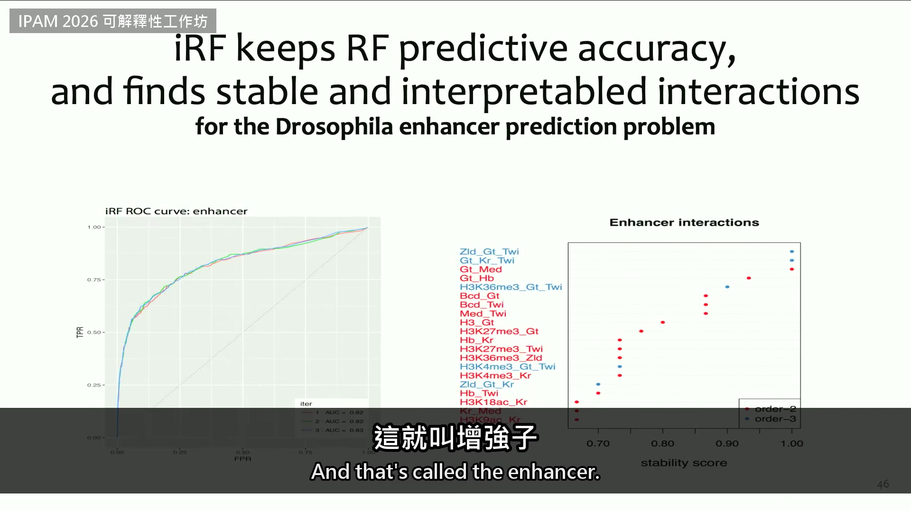

**逐字稿片段：** 這裡是三輪迭代，用的是測試集 準確度一點都沒掉

**話題推測：** 展示 iRF 三輪迭代的測試集準確度結果。

---

## 00:18:24

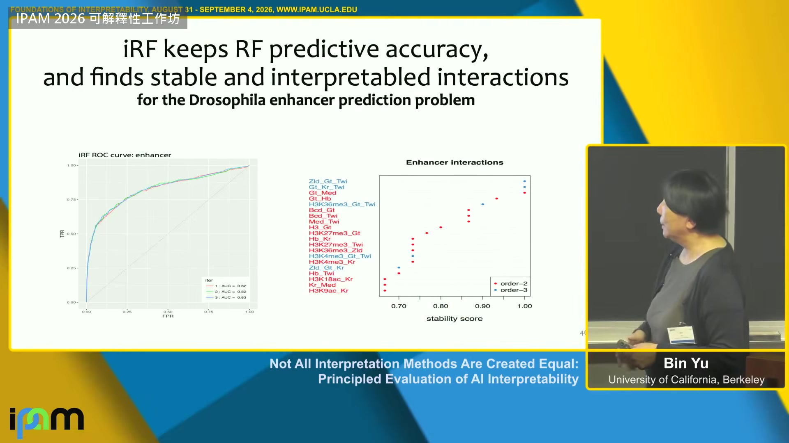

**逐字稿片段：** 這邊是穩定性分數，我們憑常識切在 0.5 紅色是兩個一組的，寫的是轉錄因子基因的名字 藍色是三個一組的交互作用 穩定性分數超過 0.5 的我們全收 方法是用這份資料開發的，另外還跑了很多模擬，等一下會講 模擬用的是一個特定的數學模型，講得出機制的那種 我們還有另一個完全獨立的問題，關於剪接，開發時完全沒碰，留著當驗證 所以至少有兩個真實的問題，其中一個完全沒碰過 我們找到的 20 組成對交互作用裡 後來發現文獻裡已經有人做過雷射消融實驗 其中 80% 是真的交互作用 實驗不是我們做的，但文獻替我們驗證了 至於三個一組的，那是生物學的前線，要看他們能不能做實驗 去驗證它。所以我們給的是建議 接下來三分鐘是理論，我們跳過 只留結論跟但書 她們把過門檻才起作用這件事寫成一個數學模型 證明了簡化版的演算法找得回真正的交互作用 但書是她自己講的 證明假設每個特徵互相獨立 各組交互作用彼此不重疊 而這兩條在她們手上的問題裡都不成立 果蠅很好處理 牠們是工廠式繁殖的 彼此非常一致 人就複雜多了 我們要用的 UK Biobank 資料看的是心臟，跟環境因素關係很大 所以訊號非常非常弱

**話題推測：** 展示穩定性分數圖表，並指出 0.5 的常識切點。

---

## 00:20:08

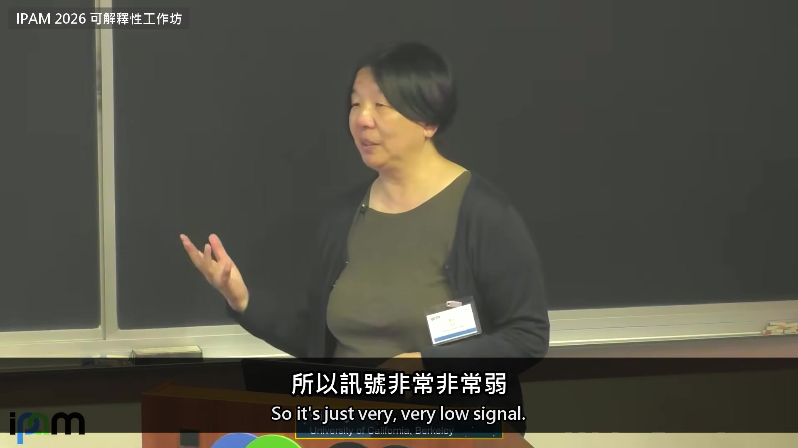

**逐字稿片段：** 再提醒一下 HCM 是什麼

**話題推測：** 再次提醒 HCM 的定義。

---

## 00:20:12

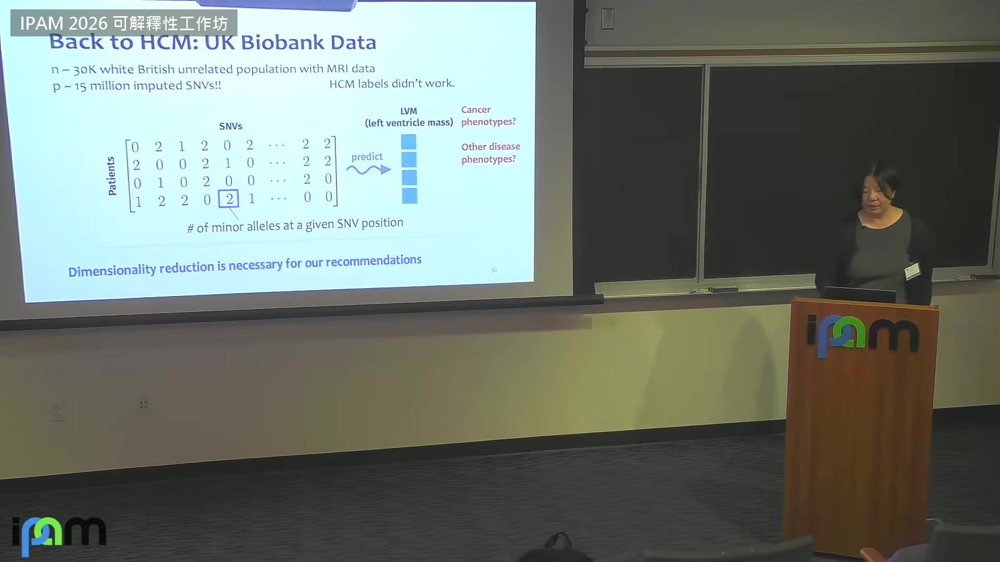

**逐字稿片段：** UK Biobank 的資料，給不熟的人說明一下 每個人都可以有這樣的基因序列資料 在某一個位置上，大多數人的 DNA 是一樣的 資料記的是你跟多數人不一樣的地方 因為大多數人是健康的 所以你跟別人不一樣的地方，可能就是生病的原因 這種資料叫單核苷酸多型性

**話題推測：** 詳細說明 UK Biobank 基因資料的特點（單核苷酸多型性）。

---

## 00:20:38

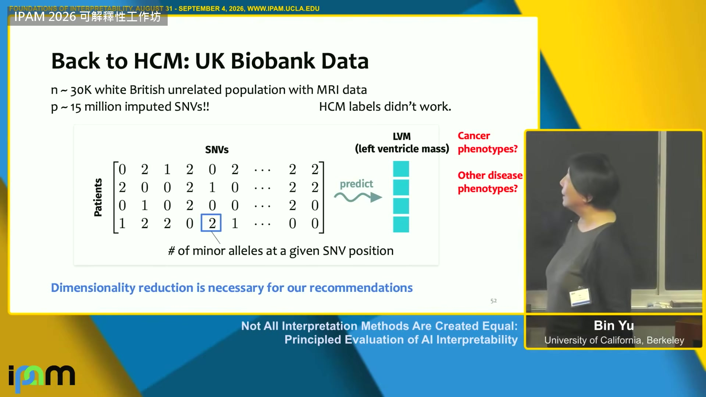

**逐字稿片段：** 我們得把問題重新定過，又是為了穩定性 原本的疾病標籤不能用 得用深度學習算出體積，再做正規化 還要二值化，細節很多 不過我覺得這套做法對別的表現型也有用 我們也用了全基因體關聯分析，得先篩過一輪 因為在計算上，隨機森林只吃得下幾千個輸入 這是我們做法的總覽，只講大方向 這是一個訊噪比非常低的問題 我認為這一類問題，光靠統計、資料科學或 AI，不足以下確定的結論 一定要搭配實驗室裡的實驗 我們不得不重新定題 因為用原本的標籤，連丟銅板的 50% 都贏不了 等於沒有訊號 連丟銅板都贏不了，就什麼都不該做 所以得做很多事 我們做了推薦、查了註解資料庫、用了好幾種預測方法 最後勉強贏過 50%，拿到 55% 而且是好幾種方法都到這個數字 我們選 iterative random forest 來做解釋，理由是生物學的知識 線性模型一樣是 55% 但照已知的知識，我們要找的是交互作用，所以不用線性模型 然後我們做了基因靜默實驗 還做了一大堆別的 這裡的機制指的是生物學上的機制 我們認為那不是蛋白質跟蛋白質直接的交互作用 是調控，間接的調控 實驗本身是另一個故事 因為跟我們合作，他們把實驗重新設計過 最後我們找到兩組交互作用 論文跟審稿人來回了很久 加上附錄 88 頁 去年登在 Nature Cardiovascular Research，還附了兩篇評論 第一次回覆審查意見就寫了 38 頁 工作量真的非常大 尤其我們推的是一個新的統計方法，iterative random forest 大家都在用線性模型，要說服人很費力 我們把線性模型的做法重做一遍，證明它找不到對的交互作用 總結：我們得到在生物學上有意義、講得出機制的解釋 而 PCS 引導、用 iRF 排出來的優先順序，讓實驗的命中率很高 這裡也是 80% 我們的經費只夠做五個實驗，其中四個找到了有因果關係的基因或交互作用 如果拿 TRUST 來評 它當然站得住，因為整套框架就是從這個經驗建起來的 不過 iterative random forest 的可擴展性差了一點

**話題推測：** 解釋因穩定性需求而重新定義問題標籤的過程。

---

## 00:23:30

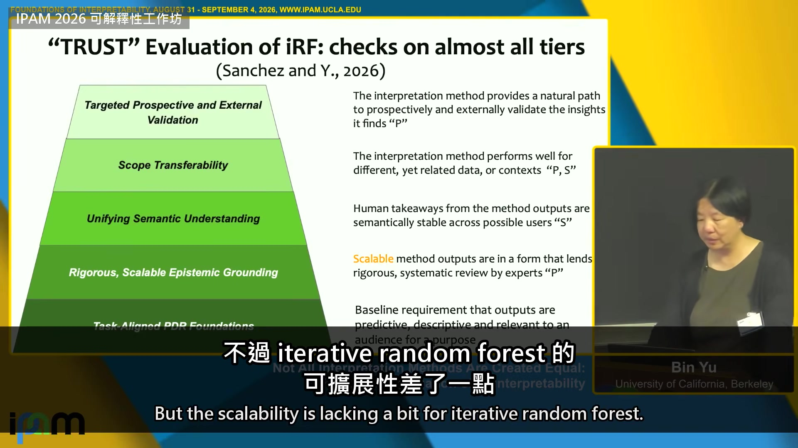

**逐字稿片段：** 這一頁是她替 iRF 打的成績 右邊五段說明，字是黑的就算通過 整頁只有一個詞是橘色 第 2 層開頭的 Scalable 原因在心臟病那一題出現過 1500 萬個基因位點 隨機森林吃不下 得先用別的方法篩到幾千個 同一把尺

**話題推測：** 展示 iRF 在 TRUST 評分表上的具體成績（多數為黑字）。

---

## 00:23:48

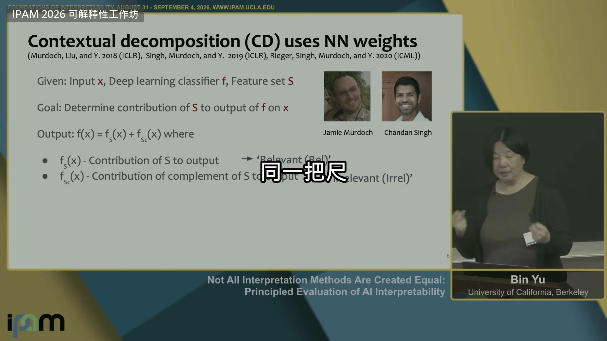

**逐字稿片段：** 接下來量的是深度學習的解釋方法 先量她實驗室的 CD-T CD 是 contextual decomposition 把輸入裡你關心的那幾個字跟其餘的分開 一層一層往前算 算出那幾個字對輸出貢獻多少 CD-T 是 transformer 的版本 用來自動找電路 也就是模型裡合力完成一件事的那一小組零件 方法的細節我們跳過，直接聽結果

**話題推測：** 轉向評估深度學習的解釋方法。

---

## 00:24:10

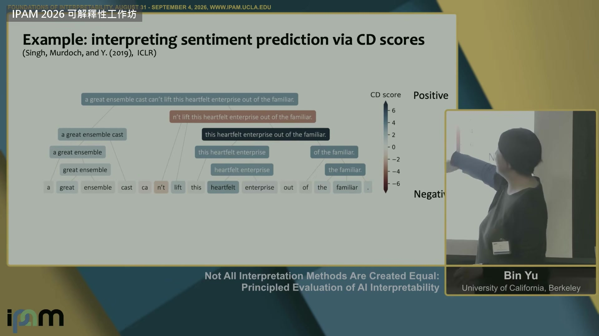

**逐字稿片段：** 重點是：在文獻裡那些傳統的 benchmark 上 我們一樣忠實，沒有更忠實

**話題推測：** 指出 CD-T 在傳統基準測試上的忠實度與執行時間表現。

---

## 00:24:20

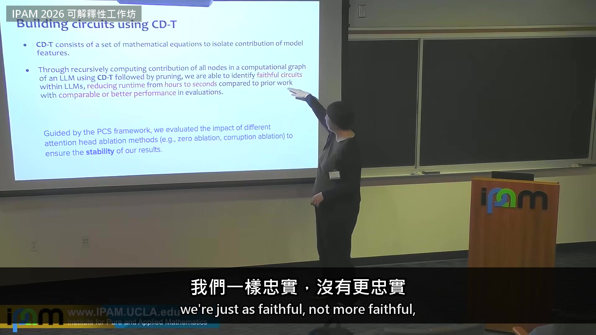

**逐字稿片段：** 但執行時間從幾小時降到幾秒 這是可解釋性在可擴展性上真正的進展 我們也做了很多擾動，確認結果站得住 我還想帶進一點現實 雖然比不上做實驗，但我們跟 UCSF 的臨床醫師合作，是泌尿科醫師 延續之前一起做過的工作 這是一個很簡單的自然語言處理問題 拿一份文件，例如攝護腺癌的病理報告 從裡面抽出結構化的資料，像癌症的分數，攝護腺癌用的是 Gleason 分數 這方面我們經驗很多 可以看到，我們找到的電路確實抓到了比較關鍵的病理用語 我們有好幾個版本的深度學習模型，差在早期工作用的輸入資料 有些跟任務比較貼合 我們確實看得到差別，這是有臨床端參與的 但這跟做實驗不一樣 審查的等級不一樣，不過比只用 benchmark 資料好 所以在這裡，我認為預測跟描述這兩項是滿足的，因為醫師看得懂 可擴展性也有，但是結果的部分 我不確定專家是不是真的知道怎麼解讀電路 不像兩個基因，生物學家知道那是什麼，他們有自己的理解 他們有上位效應這個概念，就是基因之間的交互作用 所以層次不一樣 你把一個電路交給醫師，我不知道他們會怎麼看 得先解讀，還要回頭去看 attention head 層次真的不一樣 所以我標成橘色 還不太算。黑色是通過 橘色就是，勉強算 而且我們不知道每個人讀出來的是不是一樣 這些電路我們只跟一、兩位醫師談過 其他泌尿科醫師呢？ 我們沒什麼把握 我認為泌尿科醫師還不知道怎麼解讀電路 也許以後可以訓練他們，但現在還很模糊 方法的部分，我們跟其他大多數解釋方法有一樣的毛病 只有幾個 benchmark 資料集，外加這一份醫療資料 很有限，不是很多很多的 benchmark 外部驗證我們肯定沒有，只有醫師給過意見 所以我才說，這個比不上前面那個 當然，框架本來就是照那個經驗訂的

**話題推測：** 展示 CD-T 將執行時間從幾小時降到幾秒的顯著改進。

---

## 00:26:49

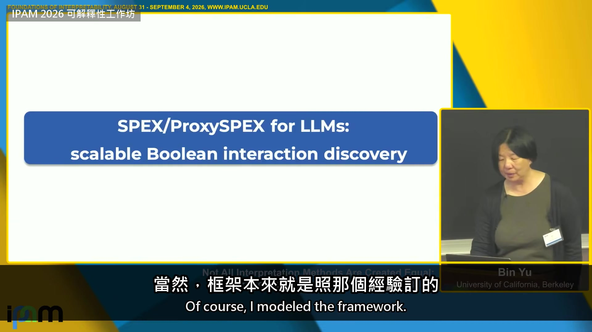

**逐字稿片段：** 同一座金字塔，顏色變了 最底層還是黑字 第 2 層只剩 Scalable 是黑的 後半句變成橘色 第 3 層整段也是 第 4 層跟最上層是紅字 紅色她沒有解釋 對照她剛才的話就是沒過 資料只有幾個 benchmark 加一份病理報告 外部驗證沒有做

**話題推測：** 展示 CD-T 在 TRUST 評分表上的成績（部分橘字和紅字）。

---

## 00:27:10

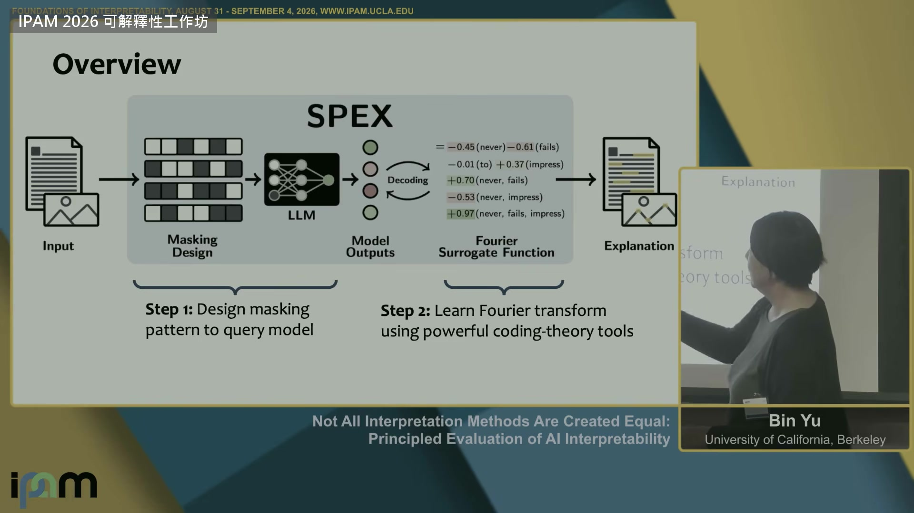

**逐字稿片段：** 第 2 個方法叫 SPEX 走的是另一條路：不看模型內部 只把輸入的字遮掉一部分再問模型 問很多次 再用編碼理論的工具反推哪幾個字是一起起作用的 後續的 ProxySPEX 把要問的次數壓到 10 分之 1 細節一樣跳過，看她打的成績 這裡也一樣

**話題推測：** 介紹實驗室開發的第二個深度學習解釋方法：SPEX。

---

## 00:27:30

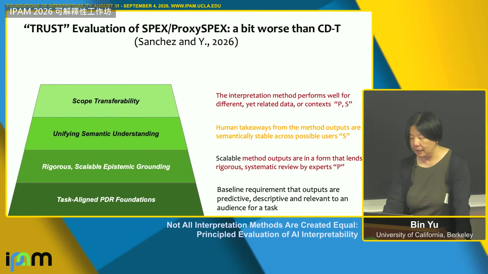

**逐字稿片段：** 這個比 CD-T 還要再差一點，因為沒有任何領域專家看過我們的結果 完全是機器學習、AI 圈自己的工作 只有跑 benchmark 外部的研究肯定是沒有 最後兩分鐘

**話題推測：** 展示 SPEX 在 TRUST 評分表上的成績（比 CD-T 更差）。

---

## 00:27:47

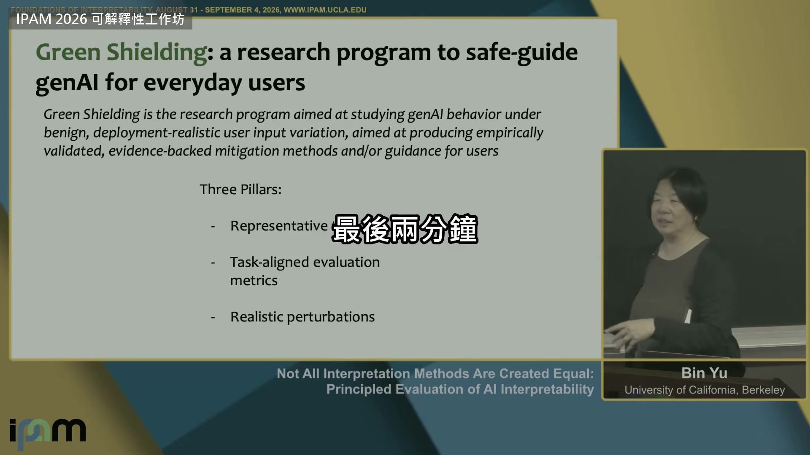

**逐字稿片段：** 她講的是一個還在進行的計畫 叫 Green Shielding 想法是：我們要替日常的使用者把關 有三根支柱 第一，我們測的東西要能代表一般使用者真的會做的事 第二，評估要對齊任務 這得跟醫師來回很多次，才知道哪些指標才是相關的 第三，擾動要貼近真實，例如 我們兩個症狀一樣 你問問題的方式可能跟我不一樣 問法不同，得到的回答有的就比較有幫助 還有諂媚的行為，它讓你開心，但有時候是有害的 有些人就是想忽略問題，模型可能就順著他 這個名字當然是借了 red teaming 的光，所以叫 green shielding 我們看的是沒有惡意的真實輸入，不是對抗式的 prompt 要的是使用者平常就會有的各種變化 要以驗證為導向 要評估緩解的方法有沒有效 所以 green shielding 讓可質疑性做得起來 我直接往下講。我們有一個個案研究 我做事一定要落在真實的東西上 我們先找出 prompt 裡會影響結果的因素 例如語氣跟情緒，真的會改變結果 於是我們設計了一個中和器 拿一段帶情緒的輸入，先把情緒拿掉，再餵給模型 可以看到，回答真的變了 現在的問題是：變好還是變壞？ 回答的範圍是縮小了 可是一開始，醫師拒絕幫我們標註，他們說 你給我的資訊不夠 我不會下診斷 可是聊天機器人很樂意給一大堆診斷 這真的會讓人擔心 我們現在在做評估 我們也學到：診斷本來就是一個資訊不完整的問題 醫師沒辦法這樣評 所以得改成所謂的處置推理，改問真正相關的問題 所以要設計出讓醫師能標註的題目，需要大量的來回討論 總結。我認為這是一個新的、有原則的 AI 可解釋性框架，建立在我們跟其他人先前的工作上 我們想把不同的解釋方法區分開來 讓使用者真的知道誰好誰壞，有點像一張排行榜 我們評了三個方法，我也講了 green shielding 未來的工作。在座很多人做機械可解釋性的理論 我認為那些理論模型可以當成人造的標準答案 拿來看我們這種現成的方法找不找得到 另一件事是，我想替 CD-T 拿到更多證據 不然就得把它做得更好 理論模型抓到的現實越多 就越能當現成方法真正的試驗場 我希望我們能在中間會合 這對兩邊都有幫助 因為現成的方法最後是要用在真實的 AI 系統上 但我想問：這些講機制的理論模型，能不能加進越來越多的現實？ 像我那個布林函數的模型就是一個例子，只是它來自決策樹，不是深度學習

**話題推測：** 介紹一個仍在進行中的新計畫：Green Shielding。

---

## 00:31:05

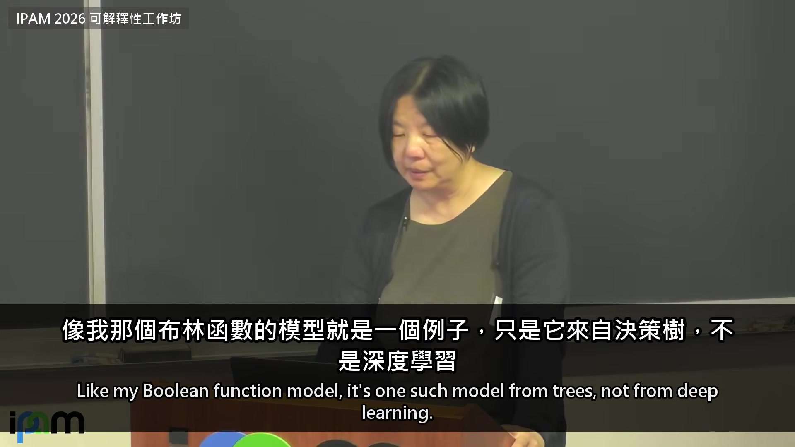

**逐字稿片段：** 整場收成兩句 第一，解釋方法要分級 錯的解釋會給人假的安全感 所以要看它背後有多少證據 最硬的一種是照著解釋去做實驗 第二，拿 TRUST 這把尺量 有實驗撐腰的 iRF 幾乎全過 她自己的兩個深度學習方法只站穩了最底層 還沒做到的她也講了 TRUST 的論文還沒投出去 尺又是照 iRF 的經驗訂的 拿去量別的領域準不準，還要更多案例

**話題推測：** 總結整場演講的兩個關鍵重點。

---

## 00:31:32

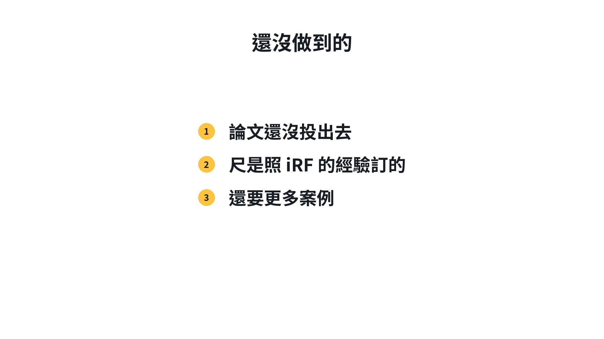

**逐字稿片段：** 下一場是史丹佛的 Christopher Potts 要講一個聽起來不太可能的現象 先讓一個模型愛貓，再叫它只寫數字 拿這些數字去訓練另一個模型 數字裡一個貓字都沒有 第二個模型卻也愛上了貓 這個現象叫 subliminal learning 這一場要示範的是：怎麼在訓練之前 就從資料裡把它抓出來 原影片連結在說明欄，整場 46 分鐘，有興趣可以去聽更多。

**話題推測：** 預告下一場演講的講者與主題。

---
