# ai-note-101_YgRTpD7ftmc — 關鍵畫面索引

- 來源逐字稿：[ai-note-101_YgRTpD7ftmc_GT.srt](ai-note-101_YgRTpD7ftmc_GT.srt)
- 影片：https://www.youtube.com/watch?v=YgRTpD7ftmc
- 截圖數：34

## 00:00:00

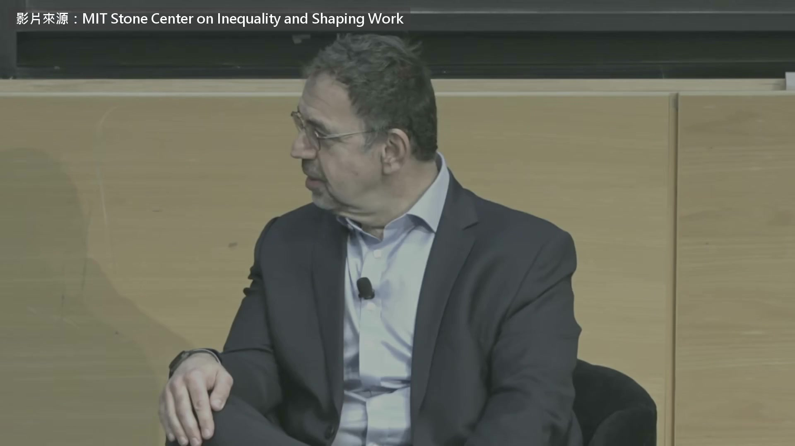

**逐字稿片段：** 寫過《國家為什麼會失敗》的 MIT 經濟學家 Daron Acemoglu 2024 年拿下諾貝爾經濟學獎 這幾年他研究的是 AI 會讓誰受益 誰被丟下 今年 9 月底 MIT 替他的新書辦了一場座談 書名問的是：自由民主到底怎麼了 主持這場對談的是 Michael Sandel 哈佛政治哲學教授

**話題推測：** 介紹經濟學家 Daron Acemoglu，畫面可能顯示其照片或著作《國家為什麼會失敗》封面。

---

## 00:00:20

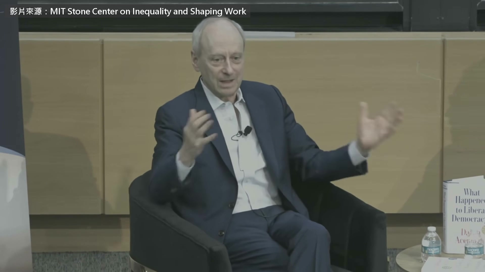

**逐字稿片段：** 他的《正義》是哈佛第一門免費放上網的課 全世界幾千萬人看過 中文書名叫《正義：一場思辨之旅》 經濟學家跟哲學家坐在一起

**話題推測：** 提到 Sandel 的著作《正義》，畫面可能顯示其書封。

---

## 00:00:30

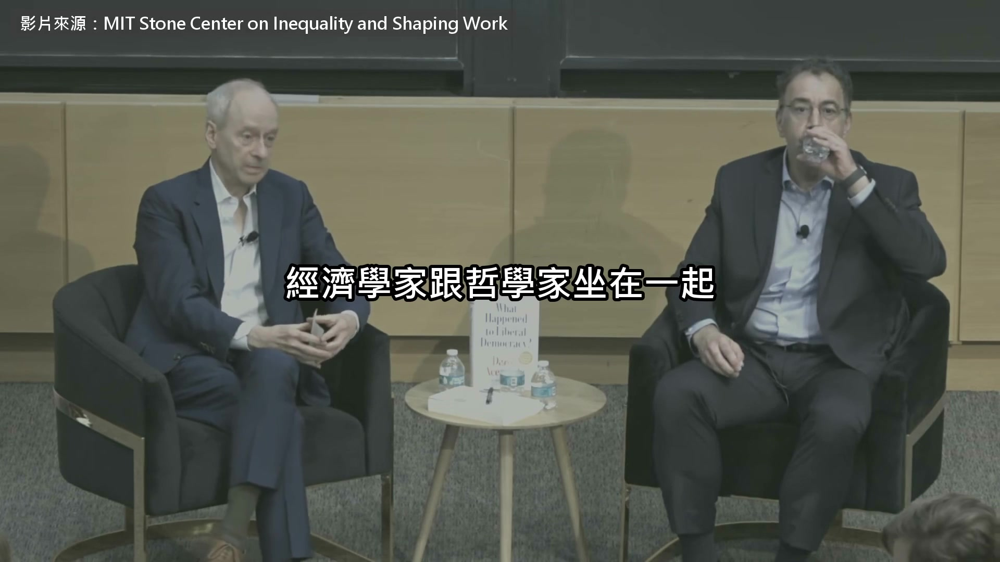

**逐字稿片段：** 談的是一個老問題：新技術帶來的好處 為什麼沒分到大多數人手上 AI 會不會再來一次 兩個人同意的地方不少 只是走到結論的路不一樣 前半小時談美國政治的部分先跳過 這集從 Sandel 質問經濟學家的那一段開始 Sandel 先替經濟學家把話講完

**話題推測：** 點出座談會的核心問題：新技術的好處為何未能普及，以及 AI 是否會重蹈覆轍。

---

## 00:00:49

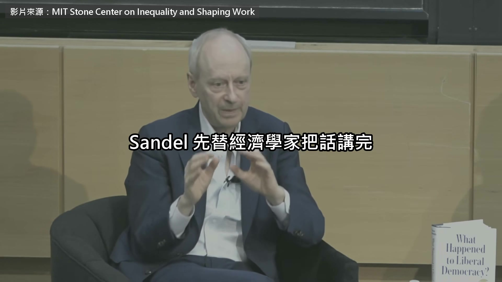

**逐字稿片段：** 新技術跟自由貿易會有贏家 也會有輸家，但贏家賺到的 多到足夠補償輸家 新自由主義全球化那時候，這套話我們聽了一遍又一遍， 現在講 AI，我們又聽到同一套 那些經濟學家是不是漏了什麼？ 我們認罪。是的 我不是說你當年也是啦啦隊， 但他們到底漏了什麼？

**話題推測：** Sandel 概述經濟學界關於新技術和自由貿易的傳統觀點：贏家收益足以補償輸家。

---

## 00:01:18

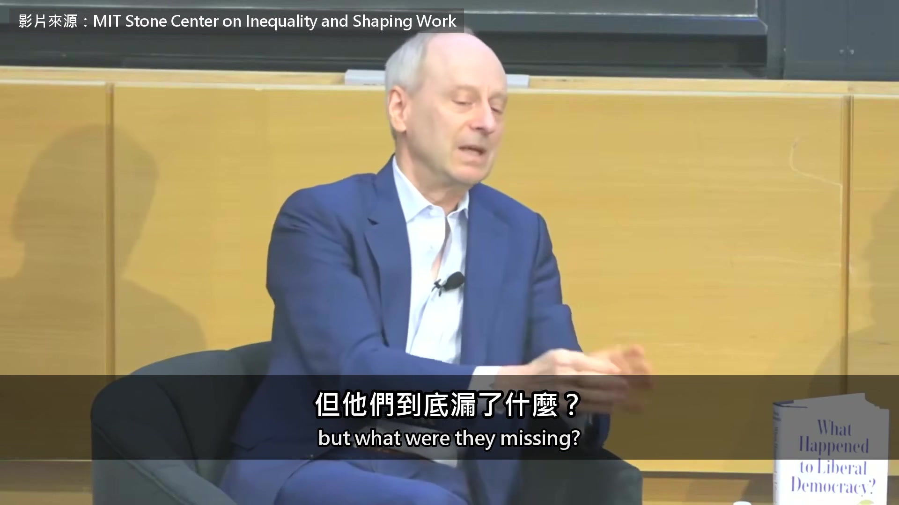

**逐字稿片段：** 我覺得首先，這裡有兩套不同的說法， 也許不只兩套， 你剛剛其實兩套都點到了， 它們在經濟學家的推論裡扮演的角色不太一樣， 在政治經濟裡也是

**話題推測：** Acemoglu 開始說明兩種不同的觀點，畫面可能切換到分點列表。

---

## 00:01:40

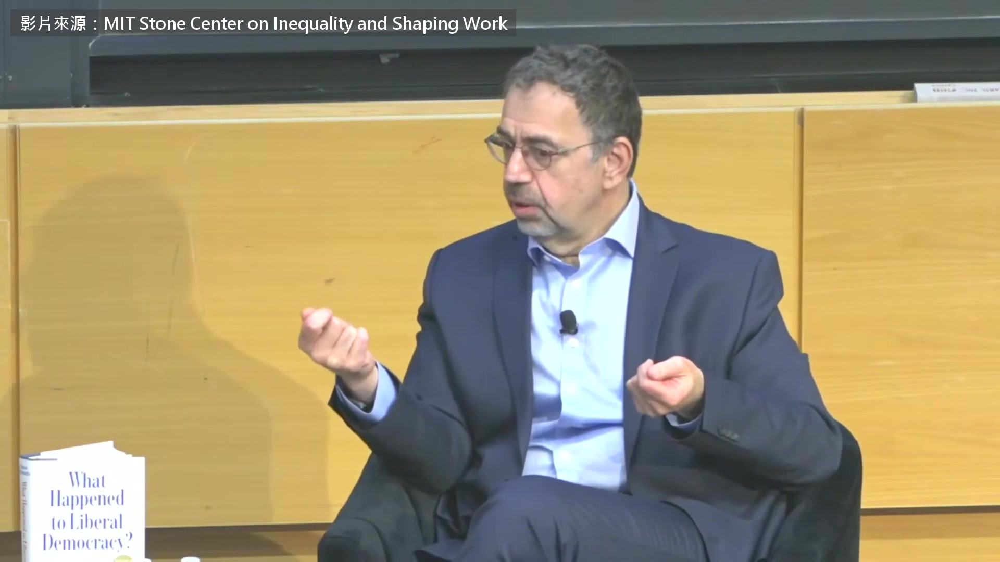

**逐字稿片段：** 第一套，我覺得今天在討論 AI 的時候也還是非常主流， 就是認為任何技術進步， 只要提高了我們生產商品跟服務的能力， 用經濟學家的行話，就是把技術可能性的邊界往外推， 最後都會讓每個人受益 也許會有短暫的挫折，有些人丟了工作， 但生產力提高了，就會有更多工作、更高的薪水， 不管做什麼， 就算一開始受益的是資本家、工程師，或一小群人，

**話題推測：** 闡述第一套說法：技術進步將擴大技術可能性邊界並最終讓所有人受益。

---

## 00:02:25

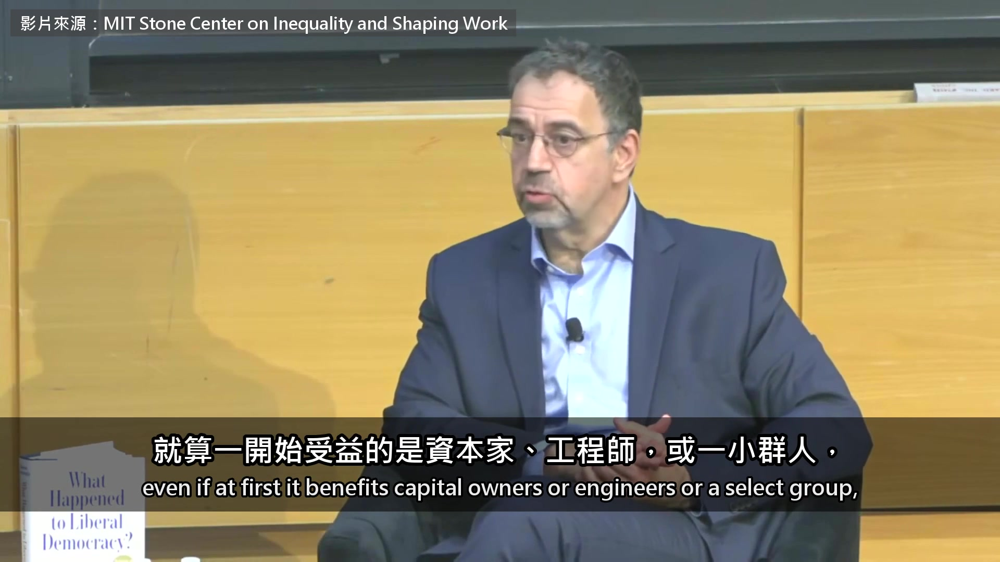

**逐字稿片段：** 最後都會滴下來 滴漏論有好幾種版本， 但本質上是同一回事

**話題推測：** 提到「滴漏論」（trickle-down theory），可能搭配示意圖。

---

## 00:02:33

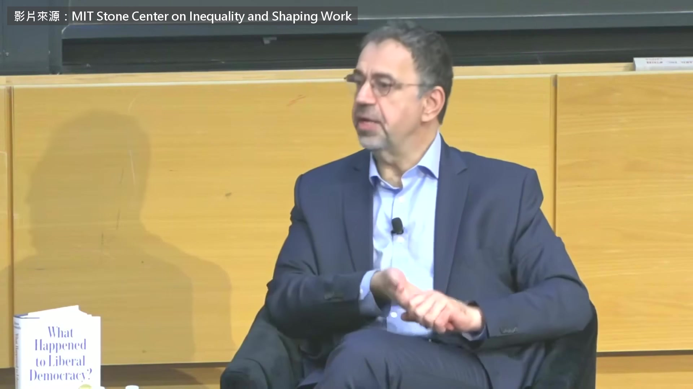

**逐字稿片段：** 這正是我跟 Simon Johnson 在上一本書《權力與進步》裡，核心要反駁的說法 不知道我們影響了多少，但我們試過了，

**話題推測：** 提及他與 Simon Johnson 合著的《權力與進步》一書，可能顯示書封。

---

## 00:02:46

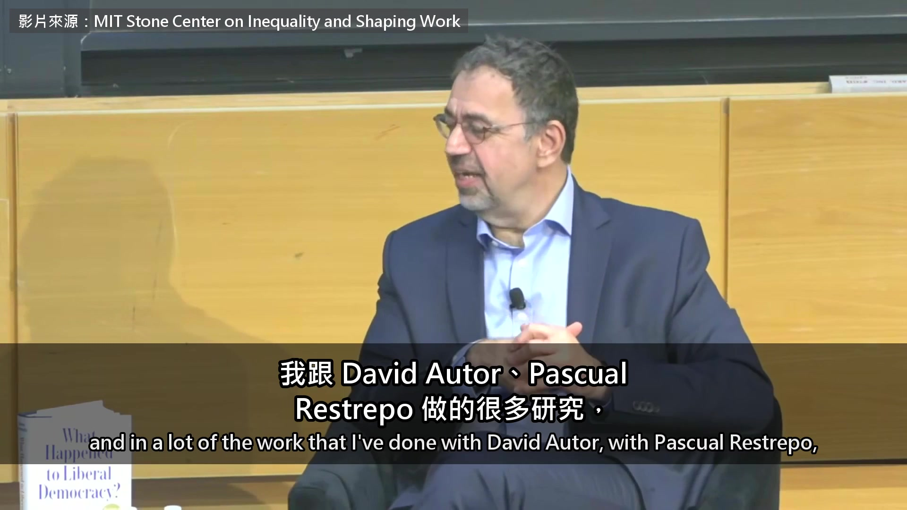

**逐字稿片段：** 我跟 David Autor、Pascual Restrepo 做的很多研究， 也是在學術上做同樣的事

**話題推測：** 提到他與 David Autor、Pascual Restrepo 的研究。

---

## 00:02:54

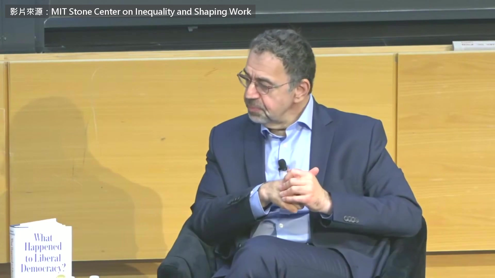

**逐字稿片段：** 第二套說法是，會有一些永遠的輸家， 尤其當你承認每個人的技能不一樣，比如在全球化的脈絡裡， 但，這就是你剛講的那個， 收益總是比損失大， 而且會有某種機制去補償輸家 問題是，從來沒有 那是在政治經濟裡決定的 你經濟上變好了，政治上也會更有力量 那你通常就不會去做那些重分配， 而且我們常常連完美的工具都沒有

**話題推測：** 闡述第二套說法：承認會有永遠的輸家，但收益總是大於損失，且有補償機制。

---

## 00:03:31

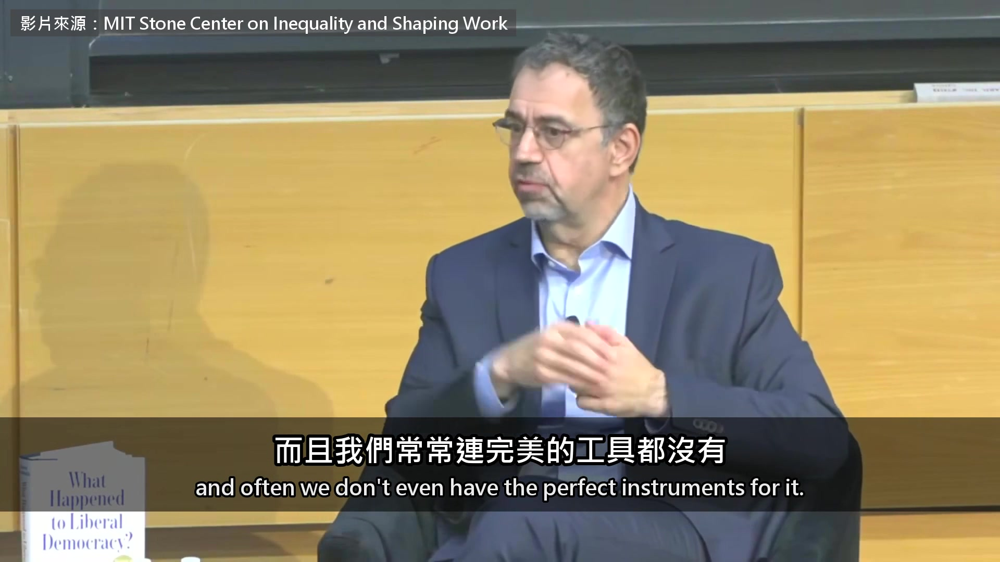

**逐字稿片段：** David Autor 對「中國衝擊」的研究，就把這點講得非常清楚 對，我覺得那些研究很重要 你跟你的同事做的研究，是一個很難得的異端替代方案， 至少從經濟學圈外看起來， 主流並不是這樣看事情的 在這套說法裡， 主流經濟學家，至少很多人，似乎忽略了一點： 贏家的收益，並沒有變成有效的重分配

**話題推測：** 引用 David Autor 對「中國衝擊」的研究，可能顯示相關圖表或數據。

---

## 00:04:27

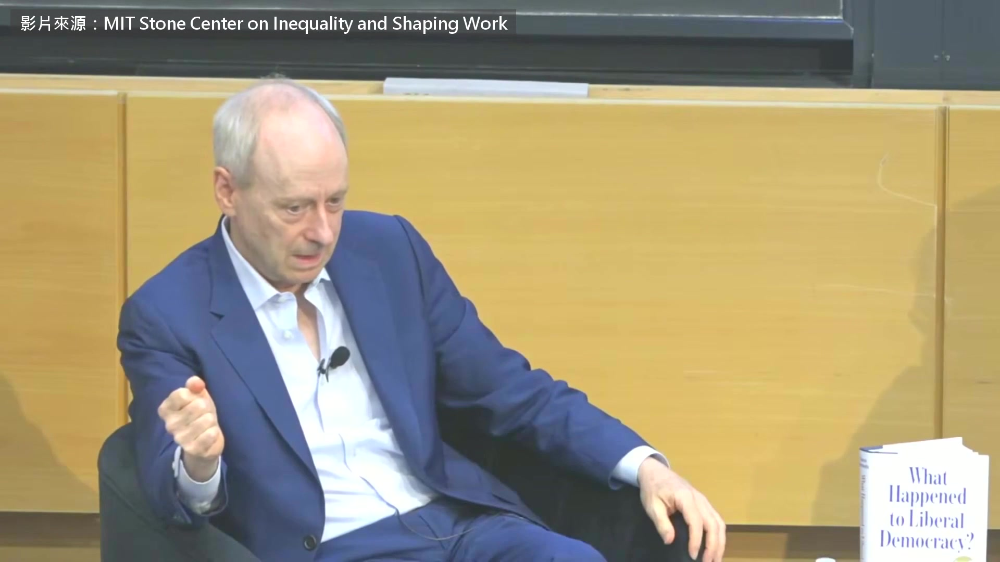

**逐字稿片段：** 而重分配能不能取代共享的繁榮， 又是另一個問題了 Acemoglu 的答案最後落在政治 錢分不下去，是因為贏家也拿到了權力 Sandel 想問的是再下一步 就算錢真的分下去，夠不夠 幾分鐘後他回到這題 先把不平等拆成兩種 所以可以這樣說： 新自由主義全球化的經濟安排， 拉大了貧富差距

**話題推測：** Sandel 提出新問題：重分配能否取代共享的繁榮？畫面可能顯示問句。

---

## 00:05:01

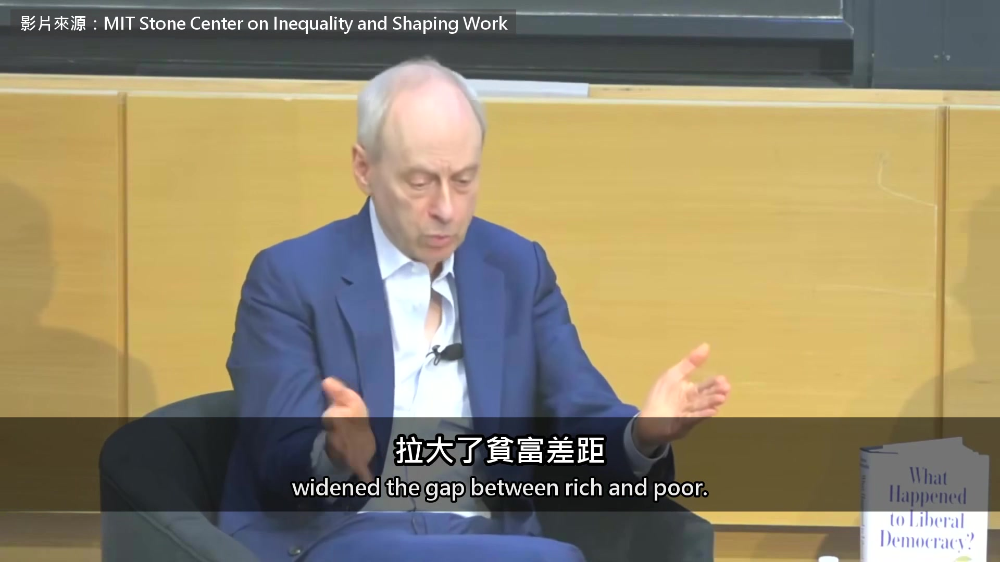

**逐字稿片段：** 這是經濟上的不平等 但同一時間，

**話題推測：** 說明第一種不平等：經濟上的貧富差距。

---

## 00:05:07

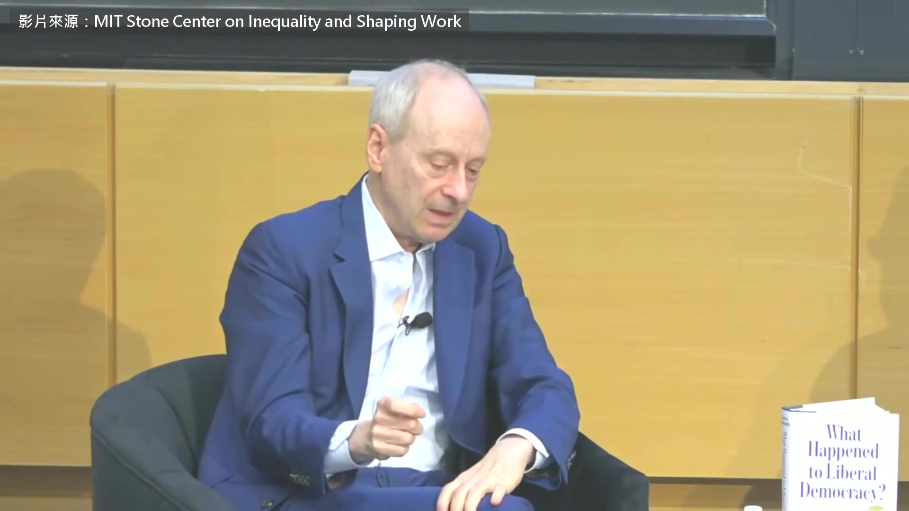

**逐字稿片段：** 贏家跟輸家之間的鴻溝也在加深， 而這跟貧富差距是兩回事 沒錯 贏家跟輸家。 這一部分跟經濟不平等擴大有關， 但也跟贏家的一種傾向有關： 他們相信成功是自己掙來的， 所以成功就是他們配得上的證明 言下之意，被拋下的人也是活該 我一開始籠統地說過，Michael 的研究對我影響很大，

**話題推測：** 說明第二種不平等：贏家與輸家之間的鴻溝加深，源於成功者認為自身是應得的。

---

## 00:05:51

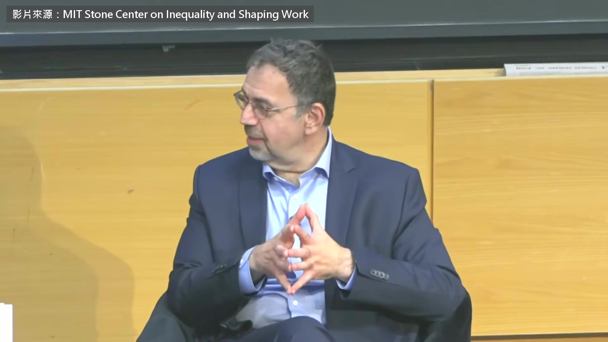

**逐字稿片段：** 從他剛剛這段話，就看得到我從他那裡學到最多的三件事 第一是社群的角色，來自你比較早的著作 另外兩件跟今天的討論很有關，

**話題推測：** Acemoglu 提及他從 Sandel 著作中學到的三件事，可能顯示分點列表。

---

## 00:06:05

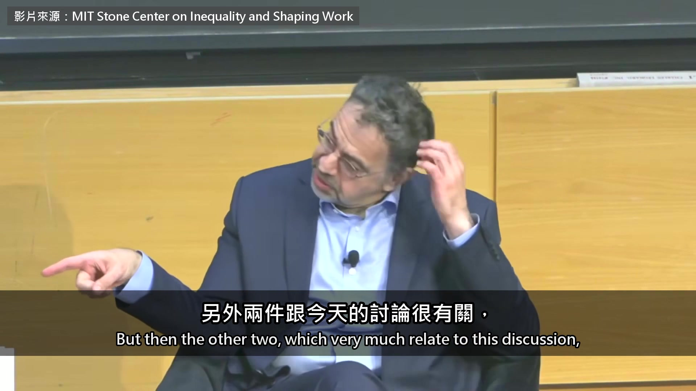

**逐字稿片段：** 特別是來自《成功的反思》 一是用「功績」去解讀成功跟失敗， 會變成一股羞辱過得沒那麼好的人的力量 第三個，是它很漂亮地 講出了很多我一直想不清楚的想法， 就是「貢獻正義」這個概念： 光是重分配、讓人有足夠的東西可以消費，是不夠的 人還需要感覺到自己在為社會做貢獻， 這關係到他們怎麼看待自己的貢獻， 也關係到別人的肯定 這些都跟今天談的有關

**話題推測：** 特別提到 Sandel 的《成功的反思》一書，可能顯示書封。

---

## 00:06:47

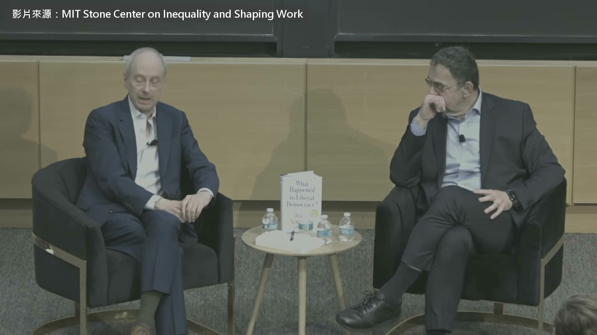

**逐字稿片段：** 接下來他換回經濟學家的講法 拿歷史跟數字說同一件事 這不只是重分配的問題，

**話題推測：** 旁白說明 Acemoglu 轉換論述方式，將從經濟學角度，以歷史和數字闡述。

---

## 00:06:54

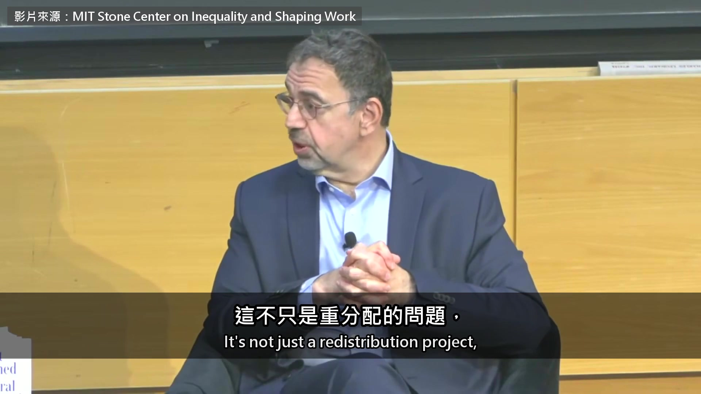

**逐字稿片段：** 我可以從兩方面再強調 第一，不管是近代還是更早的歷史， 我找不到任何一個持久的共享繁榮，不是建立在薪資成長上的 所以薪資成長絕對必要，不只是為了共享繁榮， 也是為了讓這份繁榮對人有意義

**話題推測：** Acemoglu 強調兩個重點，畫面可能顯示分點列表。

---

## 00:07:18

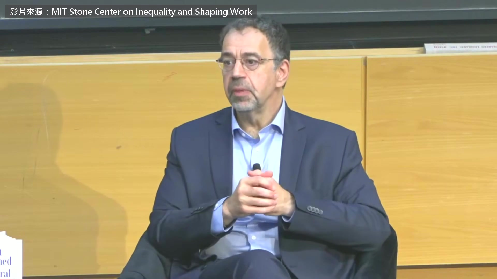

**逐字稿片段：** 第二，我認為極端形式的重分配，傷害會很大， 就像你剛講的那樣

**話題推測：** 闡述第二個重點：極端形式的重分配會帶來傷害。

---

## 00:07:29

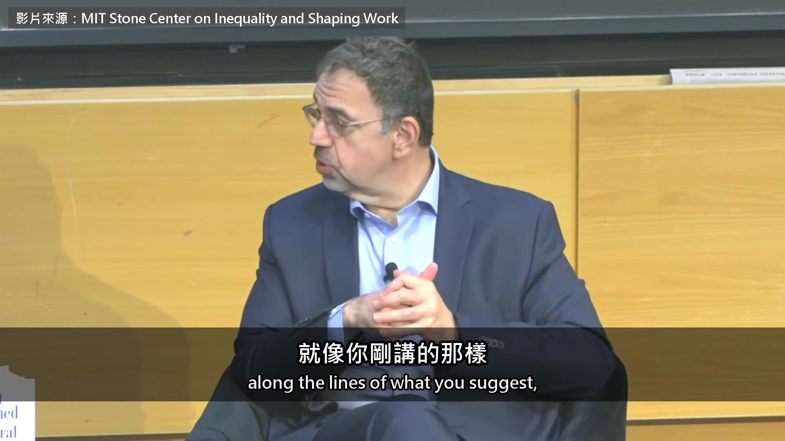

**逐字稿片段：** 用全民基本收入來想，最容易懂 如果我們得靠全民基本收入，去養活比如 50%、60%、70% 的人口， 這些人在 AI 時代找不到工作， 或找不到收入夠好的工作，撐起越來越高的期待， 那會是一個讓人很喪氣的經濟， 一大部分的人會覺得、也會被告知： 你只是靠那些很有創意的工程師、企業領袖、CEO 掉下來的碎屑活著 我覺得那是災難的配方 我覺得這點非常非常重要 他說還不必走到那一步

**話題推測：** 以「全民基本收入」（UBI）為例說明，可能顯示文字標示。

---

## 00:08:14

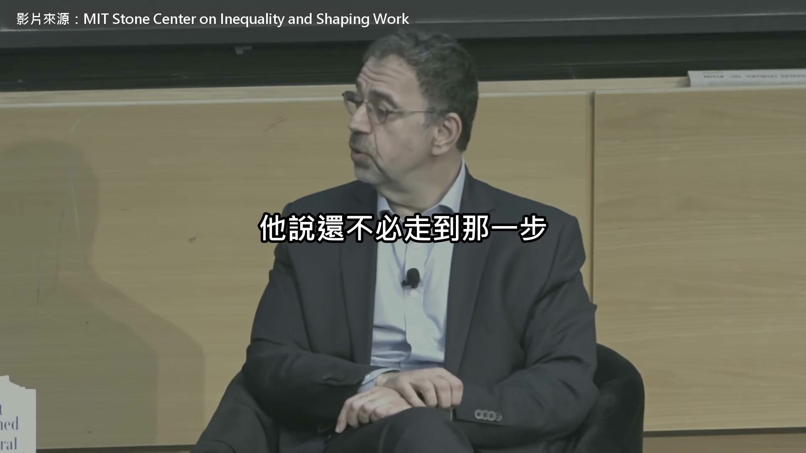

**逐字稿片段：** 他跟兩位 MIT 同事提過一個方向 叫「對勞工友善的 AI」，讓水電工 護理師 老師靠 AI 做到以前做不到的事 Sandel 下面說的「你們三位」 指的就是這三個人 對。我覺得你們三位強調的這件事很重要， 共享的繁榮， 靠的不只是全民基本收入買得到的基本物資 它需要你真的是參與者， 有聲音、有發言權， 去形塑那些支配我們生活的力量， 包括經濟跟職場長什麼樣子 你們強調對勞工友善的 AI，這些研究我覺得之所以重要，

**話題推測：** Acemoglu 提出「對勞工友善的 AI」概念作為解決方向，可能顯示文字標示或示意圖。

---

## 00:09:06

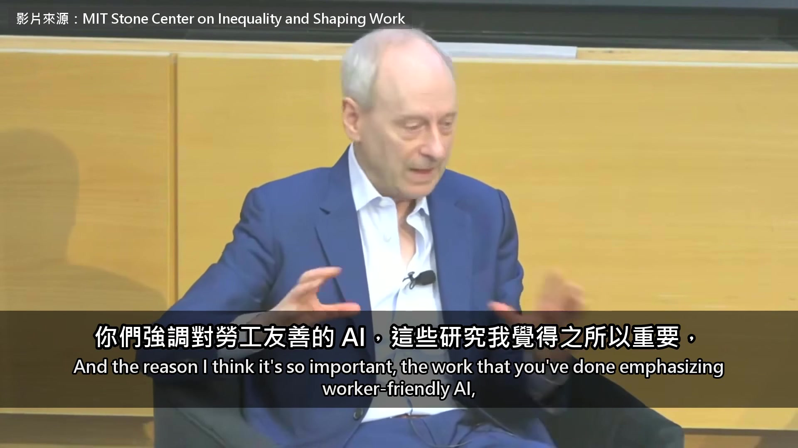

**逐字稿片段：** 是它教我們：AI 的目標、 AI 的目的， 不能是取代工作，而是強化工作， 讓勞工的生產力提高，薪水也跟著提高 你剛提到的貢獻正義，就在這背後

**話題推測：** Sandel 強調 AI 的目標應是「強化工作」而非「取代工作」，可能以對比圖示呈現。

---

## 00:09:34

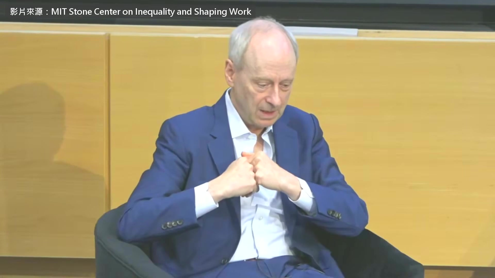

**逐字稿片段：** 它點出的，是只講分配正義會漏掉的東西： 人最根本的需要， 在基本消費品跟生活必需品之外， 最根本的需要，是被我們的同胞需要， 能夠用我們的努力跟才能去回應那些需要， 並因此贏得社會的尊重、 榮譽跟認可 這是貢獻正義的要求， 全民基本收入給不了這個 這才是讓繁榮真正被共享的東西 共享的不只是錢。是活動，是共同的生活 是那個共同的計畫

**話題推測：** 對比「貢獻正義」與「分配正義」的差異，可能顯示文字對比。

---

## 00:10:40

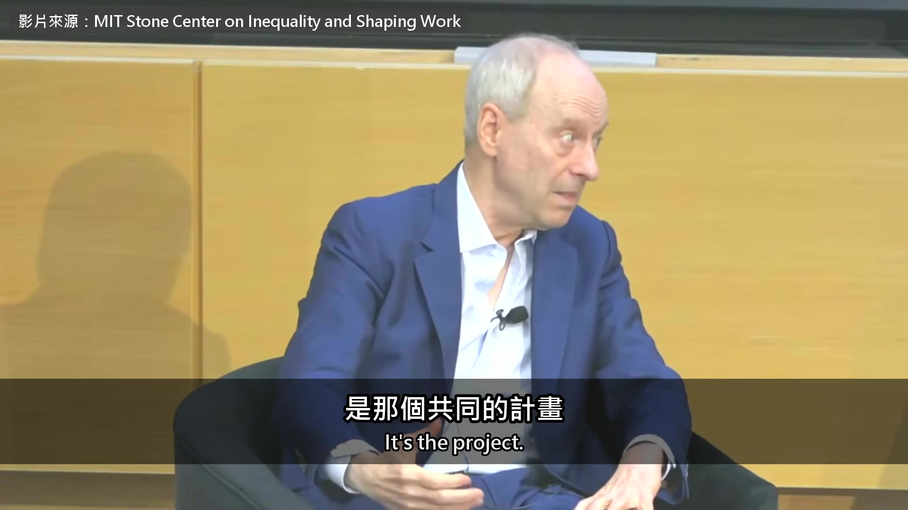

**逐字稿片段：** 計畫，包括用民主審議去決定這個計畫長什麼樣

**話題推測：** 引入「民主審議」的概念，強調共同參與計畫。

---

## 00:10:45

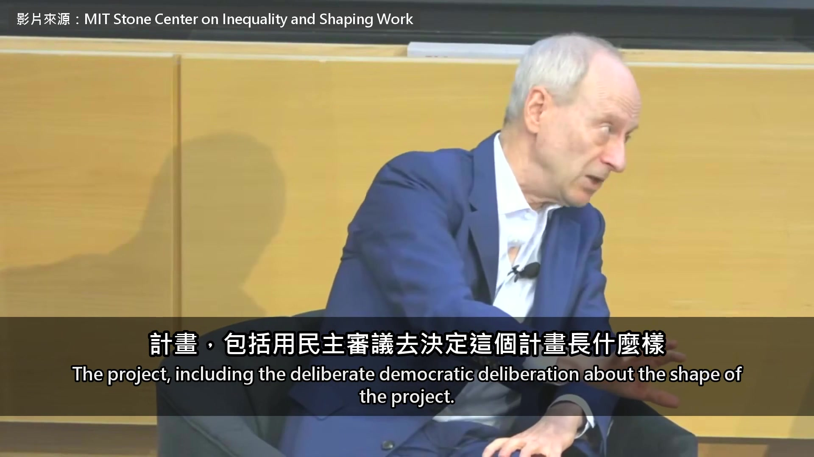

**逐字稿片段：** Acemoglu 接著講回 AI 業界每天說 AI 會改變你生活的每一個面向 同時又叫你別擋路 交給專家跟幾家前沿實驗室就好 他說在民主社會，這兩句話再矛盾不過 對，Daron，這點我同意 他們說我們只剩幾分鐘就要開放提問了 但在那之前，我忍不住想問， 如果等一下有 AI 的問題，你可以再多講：

**話題推測：** Acemoglu 將話題轉回 AI 業界的現況。

---

## 00:11:17

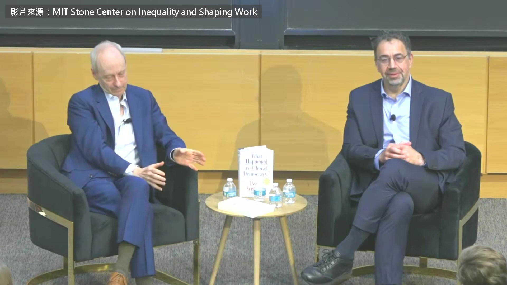

**逐字稿片段：** 最近那一波末日論， 說人類十年內有滅絕的風險 為什麼，我本來希望今天來能從你這裡學到，為什麼 別太樂觀 我直覺上對那些說法很提防， 不是因為我是技術專家， 知道他們把風險跟滅絕機率算錯了， 而是因為它聽起來詭異地、矛盾地自利 當這些實驗室的領導者跟參與者向我們宣告： 我們手上這東西強大到可能毀滅人類， 大家最好擔心一下 為什麼我覺得這很可疑？ 嗯，我的看法是，我沒有什麼讀心的特殊能力， 看不透那些發表這些說法的高層跟中層在想什麼， 但我認為他們是真心的，他們是真的在擔心這些事

**話題推測：** Sandel 提出對近期「AI 末日論」的疑問，可能顯示相關新聞標題。

---

## 00:12:38

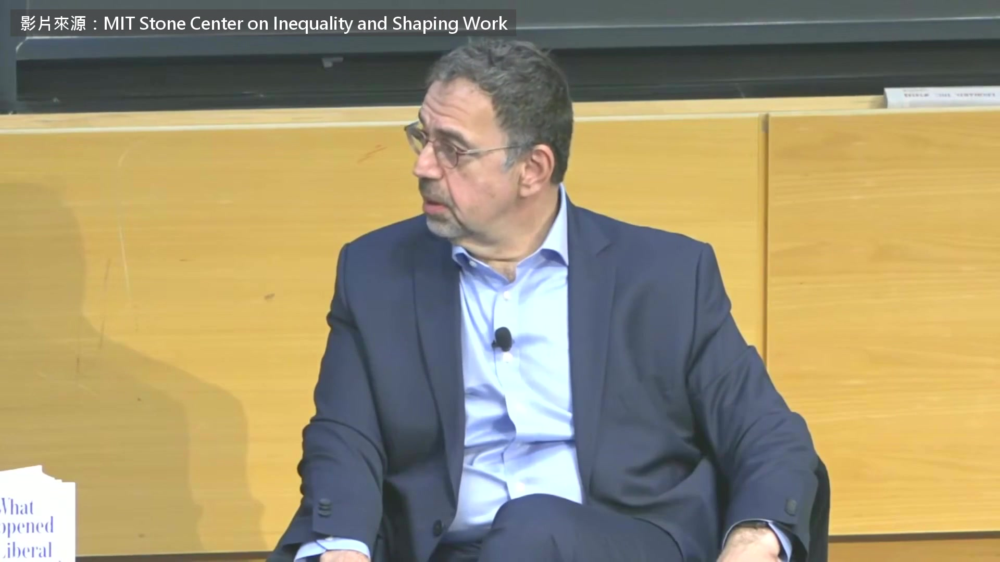

**逐字稿片段：** 但這也凸顯了，如果你看他們的背景， 在這件事上，讓出身非常狹窄的一群人掌權，為什麼會有問題

**話題推測：** Acemoglu 討論 AI 產業領導者背景的狹隘性，可能顯示行業人士組成圖表。

---

## 00:12:52

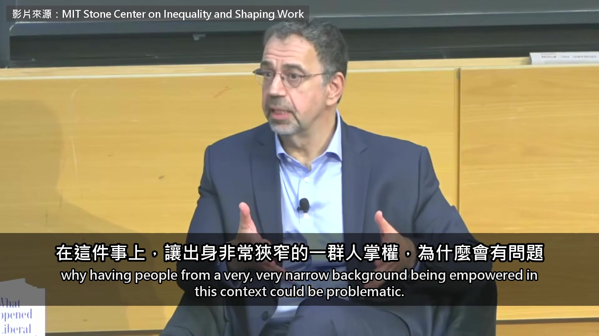

**逐字稿片段：** Anthropic 的整個高層，還有 OpenAI、DeepMind 的很多人， 都來自同一個圈子，對 AI 的看法都一樣 吞下的是同一批科幻小說 讀的是同一批網路哲學家

**話題推測：** 點名 Anthropic、OpenAI、DeepMind 等公司，可能顯示其企業標誌。

---

## 00:13:10

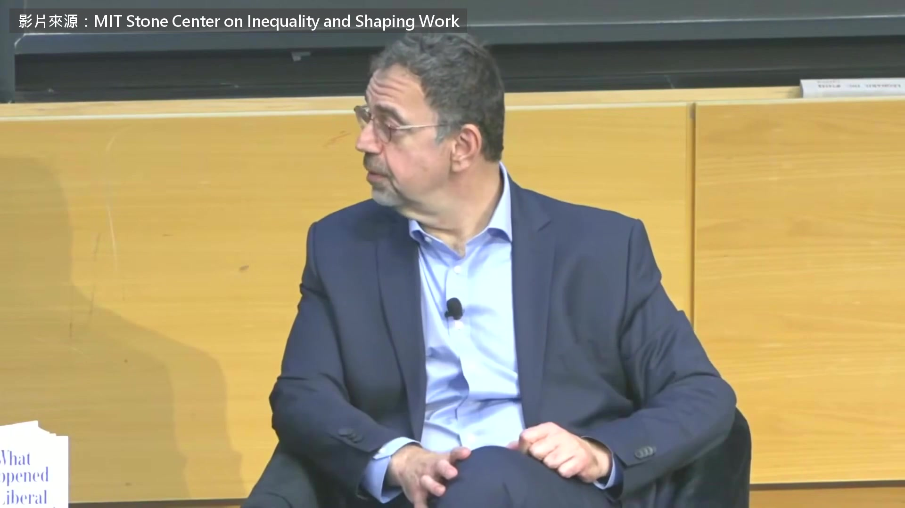

**逐字稿片段：** 好，那你講到的就是意識形態了 我跟 Simon 在《權力與進步》裡強調過一個很重要的觀點： 意識形態一直在左右技術的方向， 而在 AI 這件事上更是如此

**話題推測：** Sandel 將此現象歸結為「意識形態」的影響，可能顯示文字標示。

---

## 00:13:29

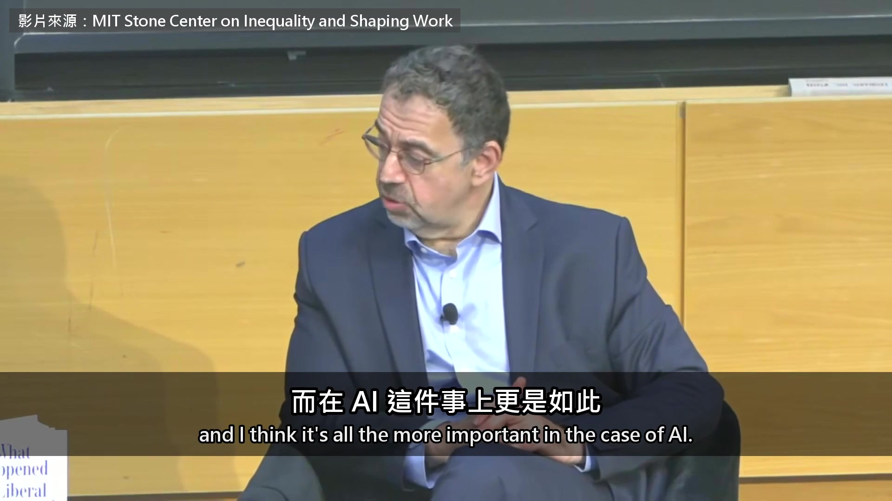

**逐字稿片段：** 開放提問之後，台下有人問 在大科技公司裡

**話題推測：** 旁白說明進入觀眾提問環節。

---

## 00:13:33

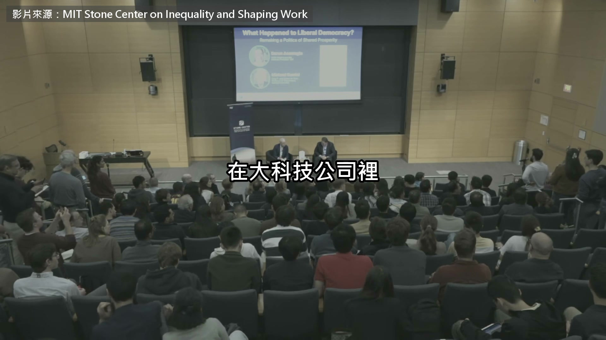

**逐字稿片段：** 要怎麼真的把 AI 往對勞工友善的方向做 Sandel 是這樣回答的 至於 AI 的問題， 怎麼把它導向對勞工友善的用途，

**話題推測：** 觀眾提問：如何在大科技公司中落實「對勞工友善的 AI」？畫面可能顯示問題文字。

---

## 00:13:50

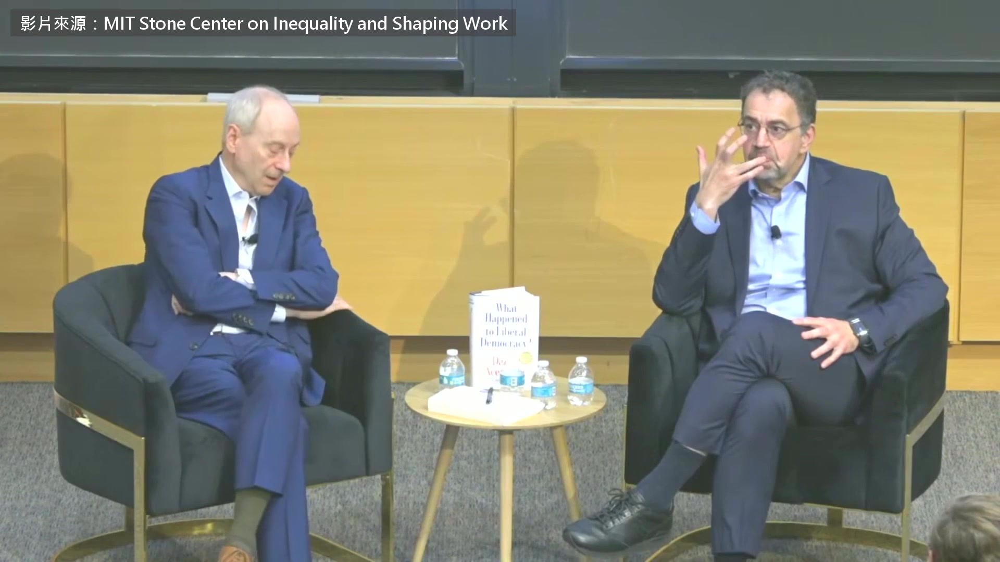

**逐字稿片段：** 關於 AI 的治理，公共辯論才剛開始， 也就是最近幾個月的事 我懷疑光設一個監管機構是不夠的， 因為那等於接受現有的結構， 只是讓政府的監管者從外面盯著 要讓大眾對 AI 的方向有發言權， 一個辦法是讓大眾持有這些公司的股份， 不管是公共投資、公有， 還是部分公有 這麼主張是有道理的， 因為它們賴以運作、賴以生財的那些海量資料， 那些餵進它們正在蓋的、嗡嗡運轉的資料中心的資料， 那到底是誰的資料？不是他們的 現在有一些個別著作權人的官司 但在著作權官司之外， 有一個更大的問題： 這些資料實質上是不是像一種自然資源、公共資源， 如果是，那治理制度就應該 讓大眾對這個資源怎麼用有發言權 講到發錢夠不夠 經濟學家跟哲學家從兩條路走到同一個答案 不夠，人要有事做，也要被需要

**話題推測：** Sandel 討論「AI 治理」議題，可能顯示文字標示。

---

## 00:15:33

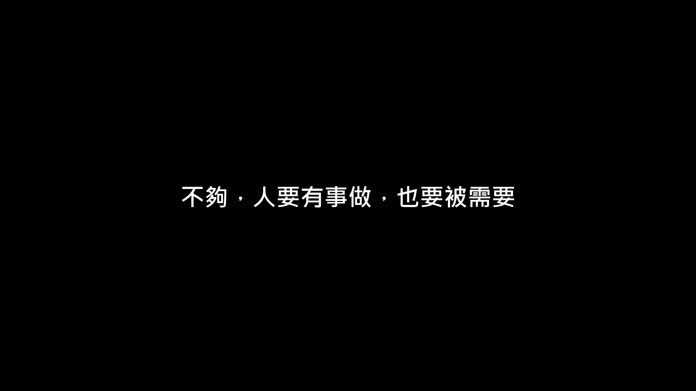

**逐字稿片段：** 兩個人看法不同的只有末日論 Sandel 覺得那聽起來很自利 Acemoglu 則相信他們是真心的 只是整群人讀的是同一批書 原影片一個多小時

**話題推測：** 旁白總結兩人對 AI 末日論的不同看法。

---

## 00:15:44

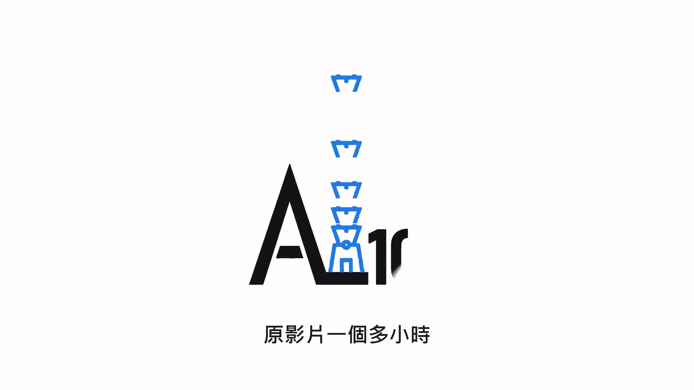

**逐字稿片段：** 問答時間 Acemoglu 還講到 這幾年大科技公司的決策權一直往最高層集中 中層工程師幾年前還有的影響力 現在沒了 原影片連結在說明欄，有興趣可以去聽更多。

**話題推測：** 旁白補充 Acemoglu 在問答環節中提出的額外觀點：大科技公司決策權高度集中。

---
