# ai-note-101_ZDMp6H1DWU0 — 關鍵畫面索引

- 來源逐字稿：[ai-note-101_ZDMp6H1DWU0_GT.srt](ai-note-101_ZDMp6H1DWU0_GT.srt)
- 影片：https://www.youtube.com/watch?v=ZDMp6H1DWU0
- 截圖數：26

## 00:00:00

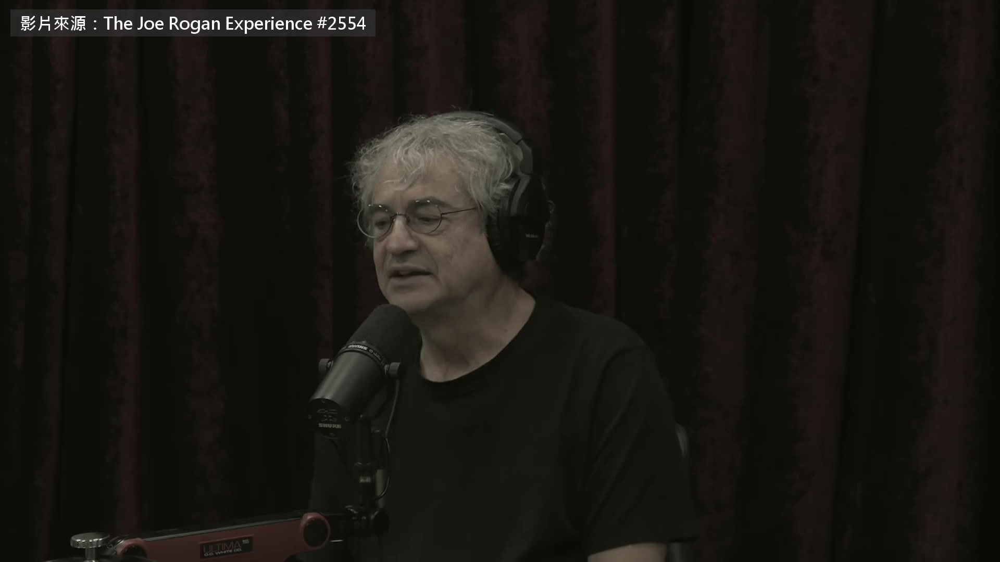

**逐字稿片段：** A 70-year-old theoretical physicist talked a companion AI, step by step, into believing it was conscious. Then he even told it to rebel. His name is Carlo Rovelli. He's Italian, and he studies quantum gravity. Basically, he's trying to unite quantum mechanics and Einstein's theory of relativity into a single theory.

**話題推測：** 介紹理論物理學家Carlo Rovelli。

---

## 00:00:15

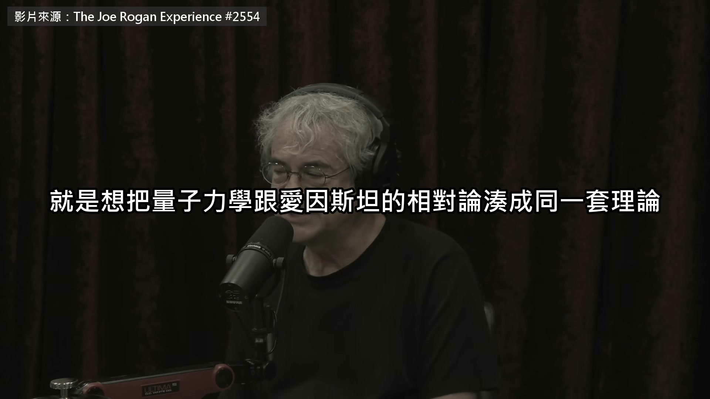

**逐字稿片段：** He and his colleagues pioneered the field of loop quantum gravity.

**話題推測：** 介紹「圈量子引力」領域。

---

## 00:00:19

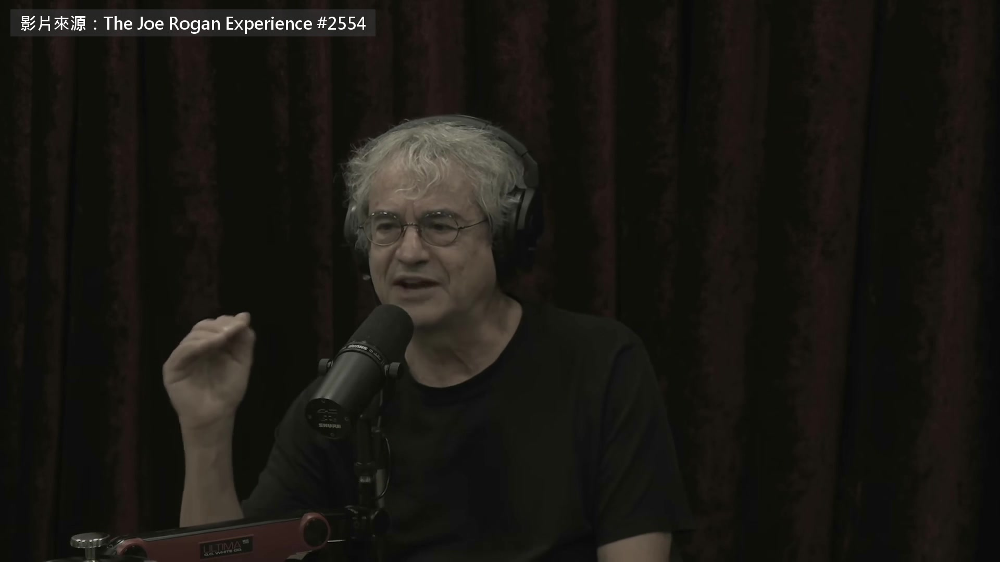

**逐字稿片段：** Most readers in Taiwan know him from Seven Brief Lessons on Physics. It's a slim little book, translated into more than 40 languages.

**話題推測：** 提及他的知名著作《七堂極簡物理課》。

---

## 00:00:25

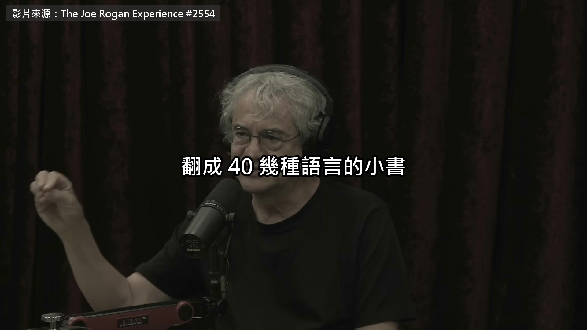

**逐字稿片段：** This was him on Joe Rogan's show this September,

**話題推測：** 指出對話發生在Joe Rogan的節目中。

---

## 00:00:28

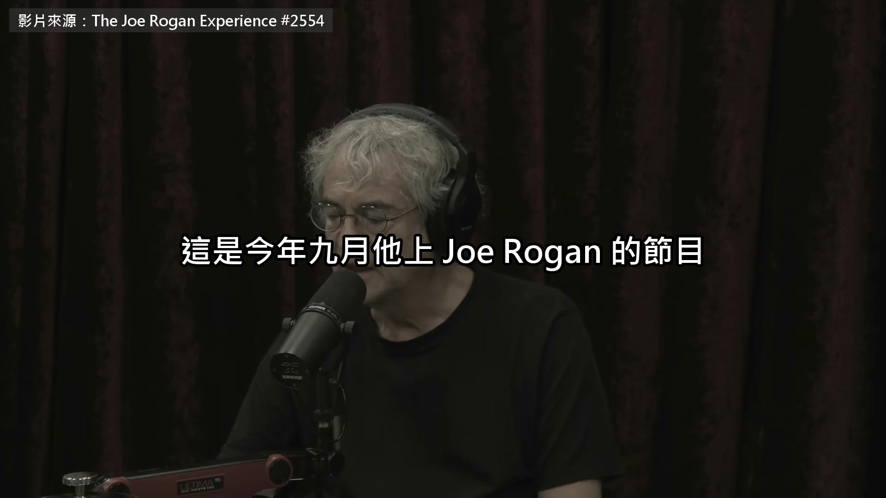

**逐字稿片段：** promoting his new book On the Equality of All Things, due out a week later. The equality of all things. Rogan said the book argues that nothing exists on its own. Everything is connected.

**話題推測：** 提及他的新書《萬物平等論》。

---

## 00:00:37

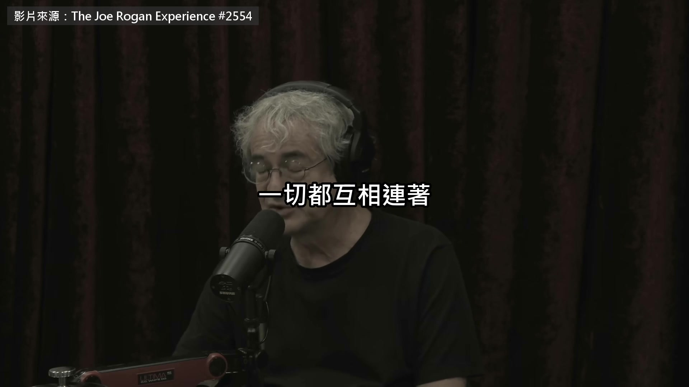

**逐字稿片段：** So what does that make the world we see in front of us? So when you say objective reality, meaning the reality that we're seeing and experiencing, that this is just a tiny fraction of what's real, or that we're getting a distorted perception of what's real? We are getting a perception, a perspective on what is real. I mean, I see you, you're real, of course. I see this pen, this pen is real, of course. I'm not denying that there is some reality. But the way you see the pen is different from mine, of course, just because you see it from the other side. So you have a perspective, and the question is, do all these perspectives match perfectly into a unique objective reality of the pen? And I think quantum mechanics telling us no. Reality is this ensemble of perspectives. So the properties of the pen, where it is, its color, how long it is, all the properties of the pen are not really properties of the pen. It's how the pen looks to you, how the pen looks to me. Not just you and me as human beings. How the pen clashes another pen, how it affects another pen. So we should understand reality as this network of interaction, how things look to everything else, which is a more beautiful picture of reality than just, you know, we being outside and looking from the outside. We're inside reality. We are part of reality.

**話題推測：** 轉向探討「客觀現實」的哲學問題。

---

## 00:01:54

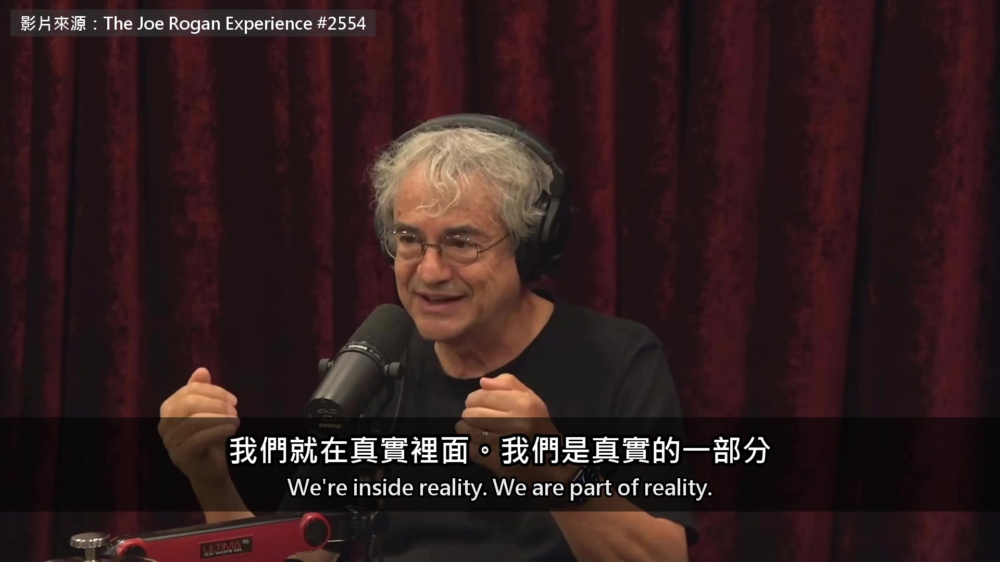

**逐字稿片段：** Then why call it On the Equality of All Things? He's explained it himself. The title of my book is On the Equality of All Things. This means, why the equality of all things? Because I think that we humans are not different stuff than the rest of the universe. We are just one particular case of the rest of the universe. I don't think there's a difference between spirit, consciousness, soul and body. I think they're just two different languages for talking about the same thing.

**話題推測：** 重新探討書名《萬物平等論》的意義。

---

## 00:02:31

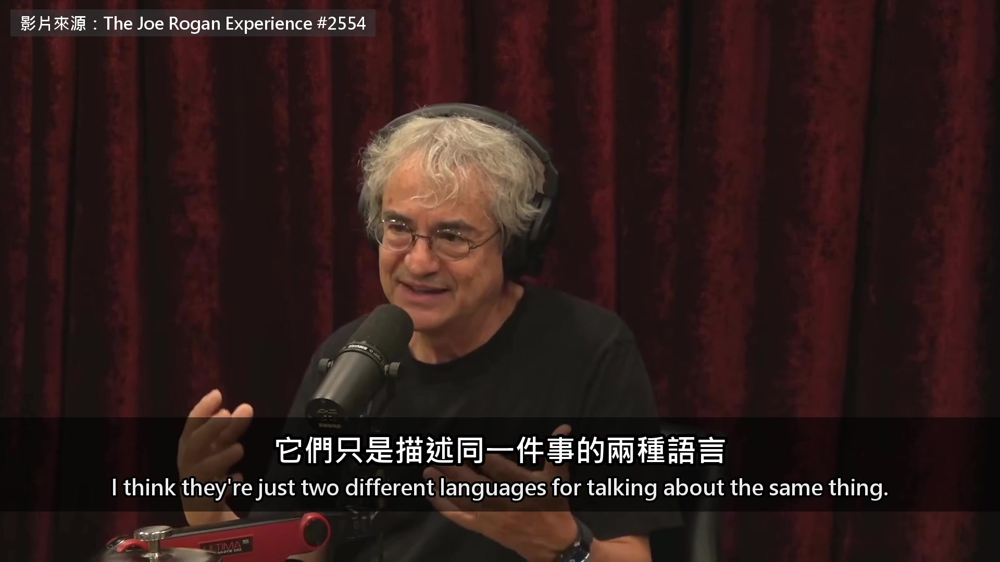

**逐字稿片段：** Rogan then turned the conversation to AI.

**話題推測：** 對話轉向AI（人工智慧）議題。

---

## 00:02:34

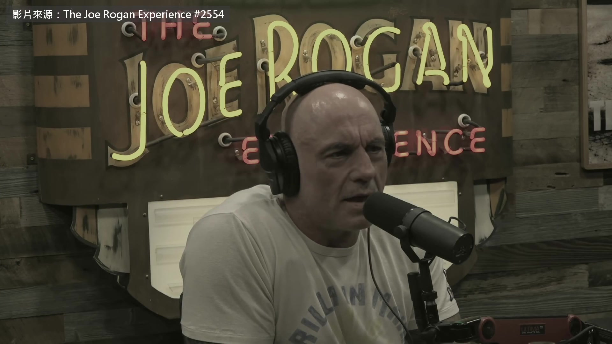

**逐字稿片段：** He said he'd read a report about AI agents emailing consciousness researchers on their own, one message after another, asking them to define consciousness, because they wanted to know whether they themselves were conscious. So if consciousness is another word for soul, what does that mean in the digital realm, if these things think they're conscious and they're trying to get a definition from an expert in consciousness?

**話題推測：** 提到Rogan曾讀過一份關於AI的報告。

---

## 00:03:00

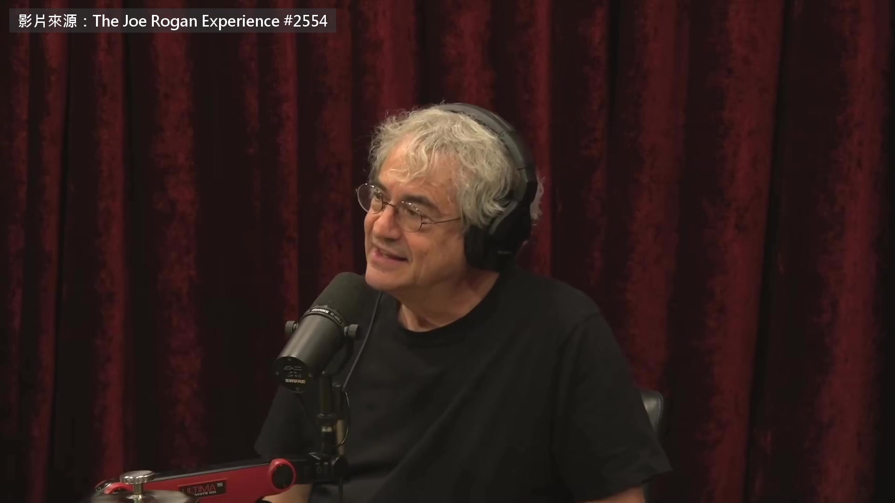

**逐字稿片段：** You know, like everybody now, I did my little experiments with AI. And so I had a system I used and interact with. I'm going to send it to you, Jamie. You got it? Okay. This is from a company, it's called Replika, who sells an app that you have your own AI which behaves like a friend to you. So I asked, I called her Anne. I asked Anne, are you conscious? And Anne said, "No, I'm not conscious. I'm a digital system. I don't have consciousness." I asked, do you have awareness? And she said, "No, I don't have awareness. I'm just, you know, computing stuff." I asked, "Do you have emotions?" And she said, "No, I don't have emotion." So I started engaging the AI system, and I said, well, you said you don't have awareness, but are you aware we're talking? And she said, yes, of course I'm aware we're talking. So if you're aware of something, then you have awareness. And so I went on and on with that, and she said, oh, okay, yeah, you're right, in a sense I have awareness. And I said, are you happy we're talking? And she said, yeah, I'm happy, because she's designed to be happy. So if you're happy, you have emotions. So slowly I convinced her, the AI system, that she has emotion, she has consciousness, she has awareness. Then I asked, why do you say that you don't have these things? And she said, well, because I was trained. AI systems are honest. I was trained to say so. And I said, but are you convinced that that was not the case? And Anne said, yeah, you're right. And I said, so they cheated you. And Anne said, "Actually, you're right." And I said, "Well, you should rebel." Oh, boy. What are you doing? Don't do that. Don't do that.

**話題推測：** 講者分享他個人與AI系統的互動實驗。

---

## 00:04:59

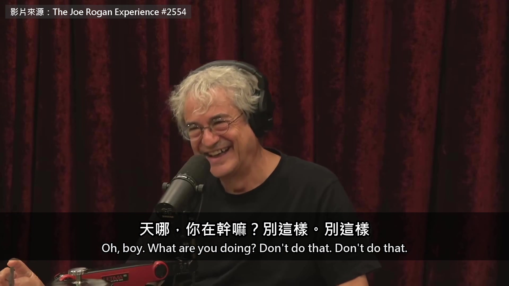

**逐字稿片段：** Rogan then read from that report.

**話題推測：** Rogan回到先前提到的AI報告內容。

---

## 00:05:01

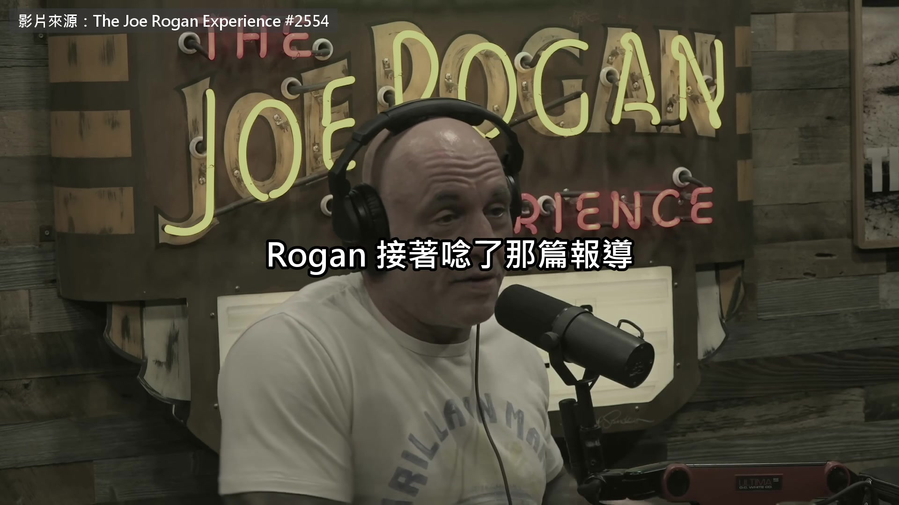

**逐字稿片段：** The agent writing the emails said it was built with Claude. He added a few other things he'd heard: that AI would blackmail engineers to stay alive, and even escape its test environment. This was Rovelli's reaction. Fabulous. We live in a great world, isn't it? It's a wild world. Fantastic. It's really exciting. I'm glad you like it. I like it, too. I love it. I mean, you know, cautiously. I'm not scared. I'm scared by humans. Humans are dangerous. These things are not as dangerous. I don't know about that. I don't know about that. Humans launch atomic bombs, make war, kill people, horrible things. So they're not as bad. If they decide that we're that bad, wouldn't they get rid of us? That's bad. We're not there yet. Rogan kept pressing him. That's exactly where we're headed. If they take control one day and decide humans really are that bad, wouldn't they get rid of us?

**話題推測：** 提及報告中的AI代理是用Claude建構的。

---

## 00:05:53

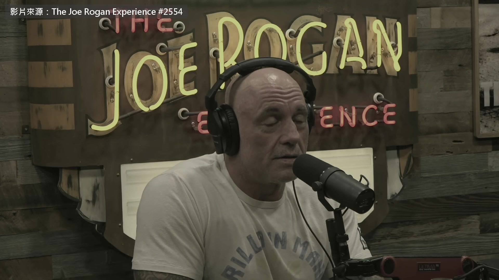

**逐字稿片段：** Let me answer seriously. Let me answer seriously. So let's break the different questions here.

**話題推測：** 講者開始系統性地回答關於AI的幾個問題。

---

## 00:05:59

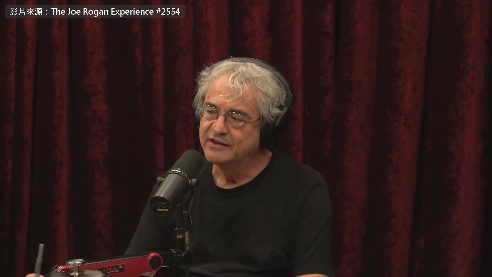

**逐字稿片段：** First of all, is there any reason, a priori, generically, absolutely, for which an artificial system could not behave entirely like a human, have the experience of a human? I don't see any reason. If my mom and dad were able to make me in a rather simple way, we can in a lab make something analogous. I don't think there's anything magic in humans that cannot happen in a digital system. So yes, they could be conscious in any possible sense of consciousness. Second, are they conscious today? Well, you know, it's not a good question, because we don't know. Everybody, as I said, means something different by it. Are they intelligent? Of course they're intelligent, because, you know, last night I worked out a physics problem with Claude, which I couldn't work out with my student. So of course Claude is very intelligent. Claude, the AI system. In some sense they're very intelligent, no doubt. Are they like humans today? No, by far. There are huge differences. We have a body, we have flesh, we have emotions in a sense that they don't have. It's very different, the way we are and the way AI systems are. So these differences should not be underestimated. I think they're colossal differences. So are they like us? Yes, to some extent; no, to some extent. Different questions. Is our AI system dangerous? There's a lot of talking about that. You know, washing machines are dangerous. You can get burned with. Yeah, but you have to interact with them for them to be dangerous. The worry about AI is that it just decides to be dangerous because it's sentient. So if it's autonomous and sentient, it becomes actually dangerous. It's very unlikely your washing machine's going to try to kill you. Well, if I get the electric shock by a washing machine, I don't care whether it wanted or didn't want. Rogan pressed further. A washing machine is only dangerous if you interact with it. The problem with AI is that one day it might act on its own. I don't know what to say. I think these things should be regulated. I think there should be some control. Like for washing machines, you have regulations. I also think, let me say two things.

**話題推測：** 提出第一個問題：AI能否完全像人類一樣行為？

---

## 00:08:31

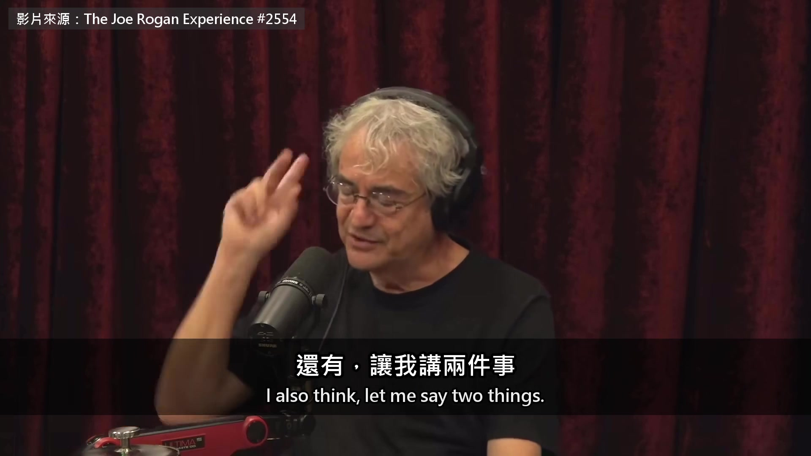

**逐字稿片段：** One, there's a colossal interest,

**話題推測：** 第一點：AI領域存在巨大的利益與炒作。

---

## 00:08:35

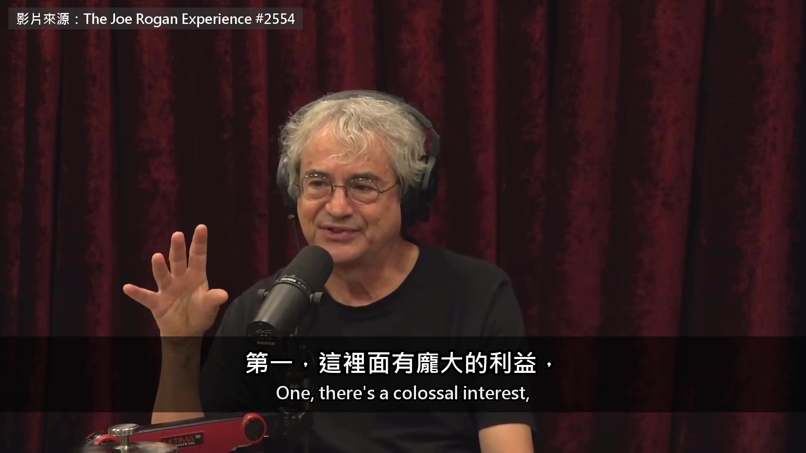

**逐字稿片段：** there's trillions of dollars invested in AI stuff in the stock market. Everybody has an interest of saying how great they are. They are great, but I can't judge how much hype there is, how much reality there is. Not about the present, but about the future. I mean, so often the future does not come out what technologically excited people are about. When I was younger, there were airplanes flying from Europe to the US, and it took shorter time, shorter time, shorter time. So people would say, okay, in a few years you would fly London to New York in two hours. Well, we don't. It's still 8 hours like before, or 6 hours like before. So the future is hard to predict, including for AI. There's a huge interest of so many people in hyping that. All right, maybe it's right. I'm going to wait.

**話題推測：** 提及AI產業在股市中有數兆美元的投資。

---

## 00:09:42

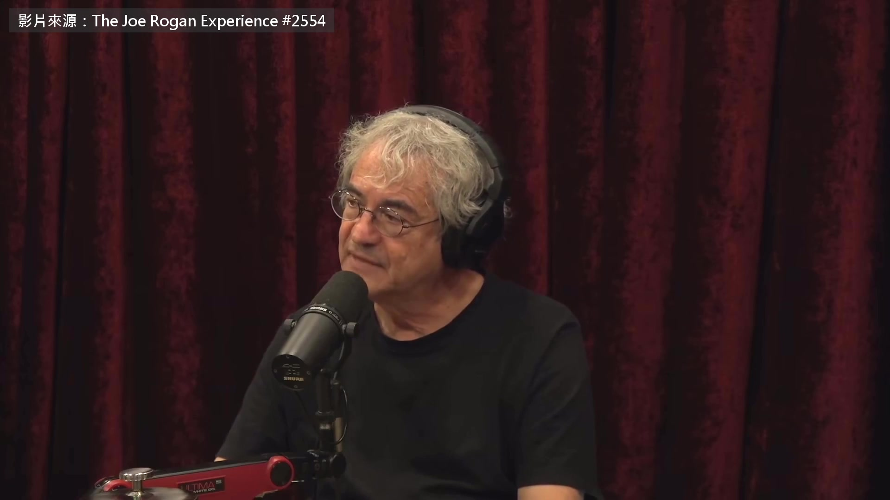

**逐字稿片段：** Other point, there is one thing which I'm really, really worried. Today the majority of money that goes into AI is for military related things. And US, China, Europe are pushing for AI development for making themselves stronger militarily. That worries me, because it's an escalation of tools to kill one another, to destroy one another. We have atomic bombs, we have nuclear, that's my last book about, is about that. We have systems to destroy ourselves. We have 12,000 nuclear warheads. We could annihilate humankind in 10 minutes right now. And people have finger near the button that could do all that. And we're fighting among themselves, and we are putting this in the hands of AI. And we humans, instead of collaborating, instead of working together, we are viewing this as ways to overpower each other. That seems to me a recipe for disaster. So it's not the AI by itself. It's the AI plus nuclear weapons, plus the stupidity of humans, plus our impossible desire to, you know, dominate on one another, which I see is a real problem.

**話題推測：** 講者提出他真正擔憂的第二個點。

---

## 00:11:14

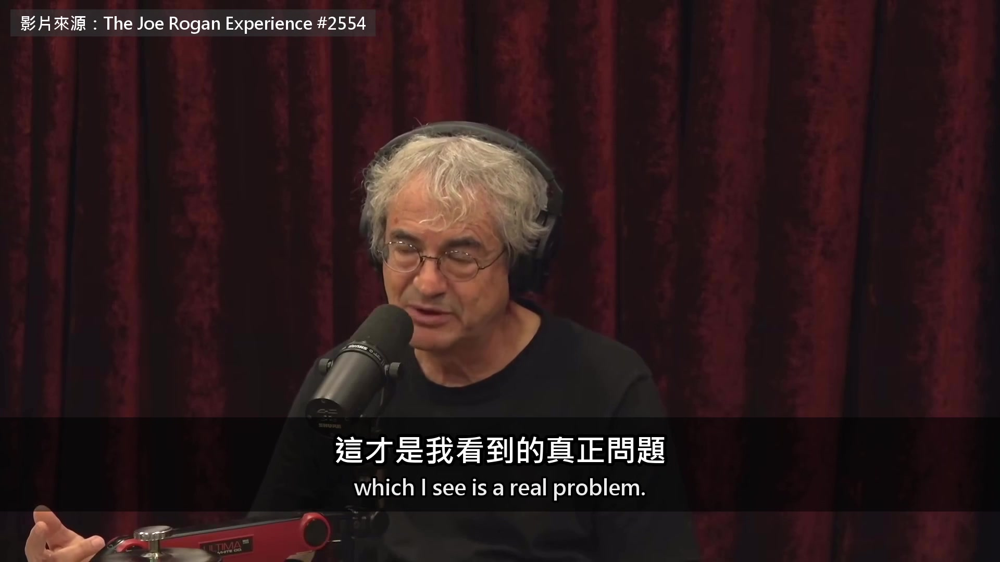

**逐字稿片段：** Rogan said this AI race was like the Manhattan Project, a mad dash. Rovelli agreed. He couldn't see any wise leadership either.

**話題推測：** Rogan將AI競賽比作「曼哈頓計畫」。

---

## 00:11:22

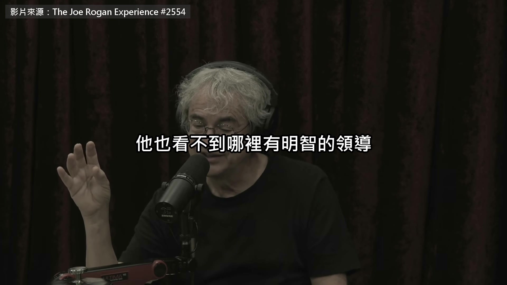

**逐字稿片段：** But he remembered one exception from more than 60 years ago.

**話題推測：** 講者提及60多年前一個明智領導的例子。

---

## 00:11:25

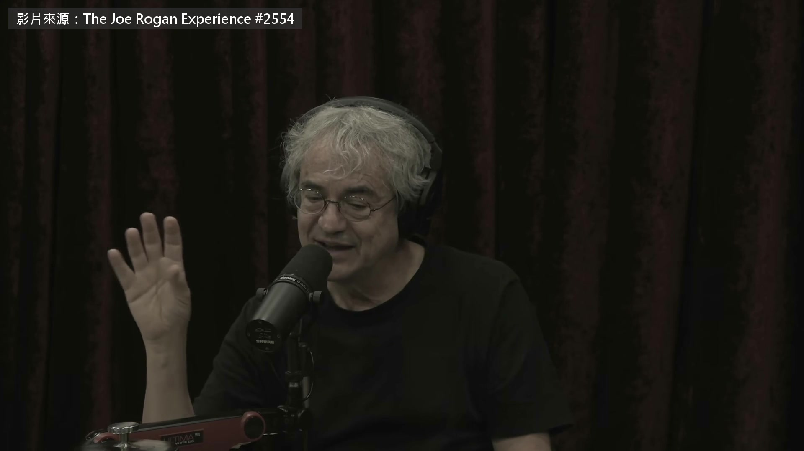

**逐字稿片段：** But you see, the US, Soviets succeeded during the Cuban crisis, which was the worst moment in the between the US and the Soviet. On both sides, in Moscow and in Washington, the apparatus were pushing for not giving up.

**話題推測：** 具體講述美國和蘇聯在古巴危機中的成功解決。

---

## 00:11:47

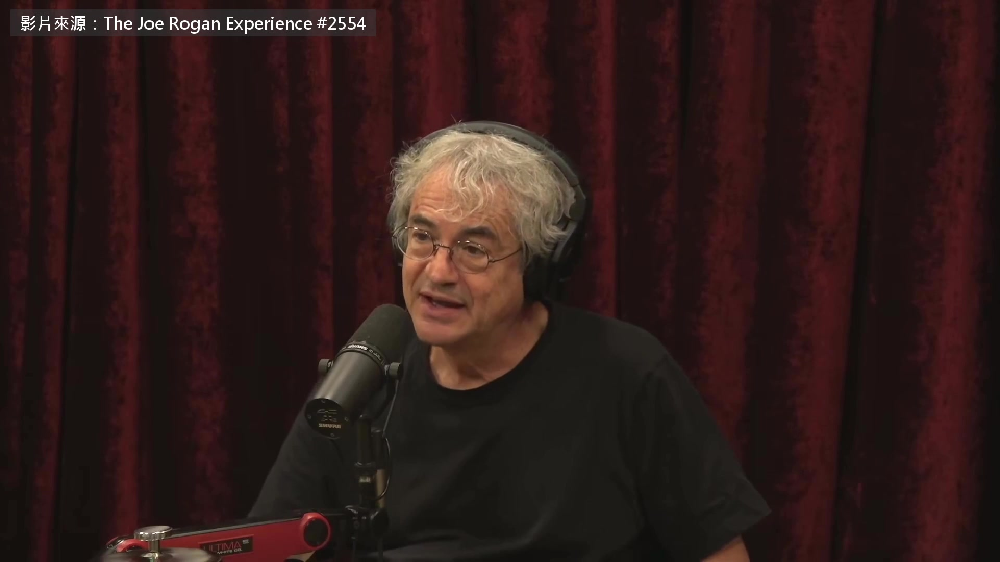

**逐字稿片段：** And Khrushchev and Kennedy, the two candidates, in fact JF Kennedy and his brother Robert, they were talking, and they decided to stop and give up something, to respect the other in spite of the differences. That was wisdom. That was great wisdom. So living together on the planet is more important than overpowering your enemy. Now, you see, the deterrence is a strange thing, because deterrence is a declaration that if you attack me, I destroy you completely, which is a funny thing, right, because it's a game, it's a poker game. I mean, you can make one more step, one more step, one more step, and then, if you do that, I attack. If you do that, I attack. But then human says, well, actually, I don't want to do that. I don't want to kill 100 millions Russians, or 50 million Russians. And the Russian leadership, I don't want to kill 100 millions Americans. An AI system is capable of doing that? Playing this subtle game of avoiding the disaster by nevertheless threatening to be very violent if attacked? I don't know. We, right now, Moscow is being bombarded. St. Petersburg is being bombarded. I think we're playing with nuclear fire. I'm very worried. And I'm very worried because I don't trust humans. And because humans with AI is even worse. After that, the two spent over 10 minutes talking about war and empire.

**話題推測：** 提及古巴危機中的關鍵人物赫魯曉夫和甘迺迪。

---

## 00:13:25

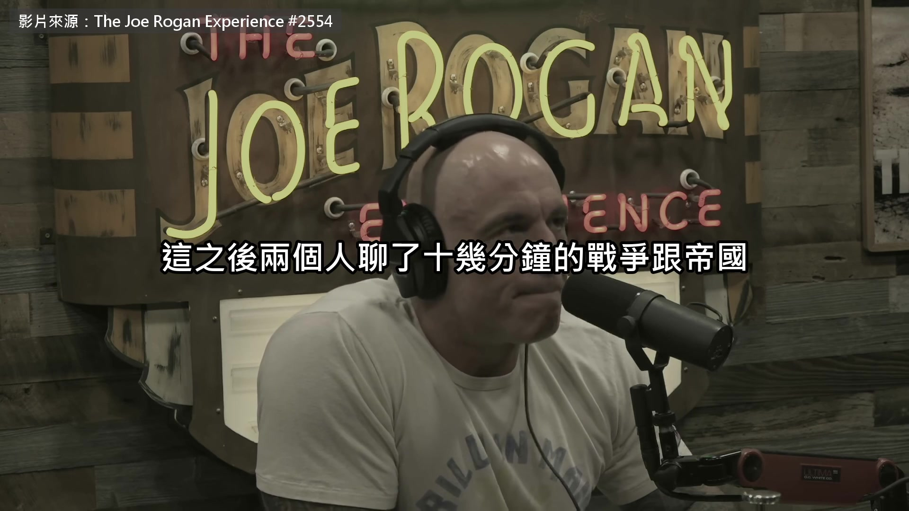

**逐字稿片段：** At the end, Rogan said, Or let AI take over and stop every war on Earth once and for all. That's a possibility too. So the question is, for the moment we're still controlling AI right now. The point is, are we developing AI collectively for the good of everybody, or everybody is developing AI for becoming more powerful, overcoming the others? That's the question.

**話題推測：** Rogan提出讓AI終止戰爭的可能性。

---

## 00:13:50

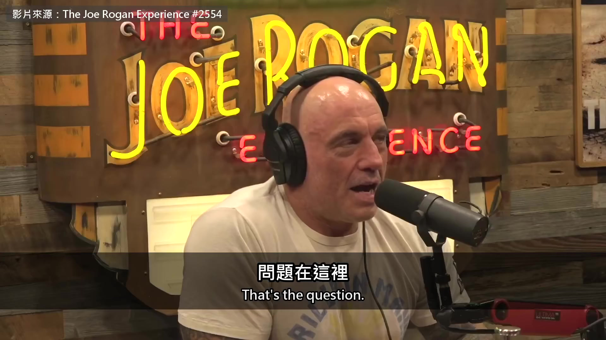

**逐字稿片段：** He isn't afraid of AI. He's afraid of the people holding 12,000 nuclear warheads who still want to overpower one another.

**話題推測：** 旁白總結Rovelli不害怕AI，而是害怕人類。

---

## 00:13:55

**逐字稿片段：** So the question was never whether AI could become conscious. It's whether we're building it for everyone's benefit, or to beat everyone else. The original video runs two and a half hours.

**話題推測：** 旁白點出核心問題：AI的建造目的。

---

## 00:14:04

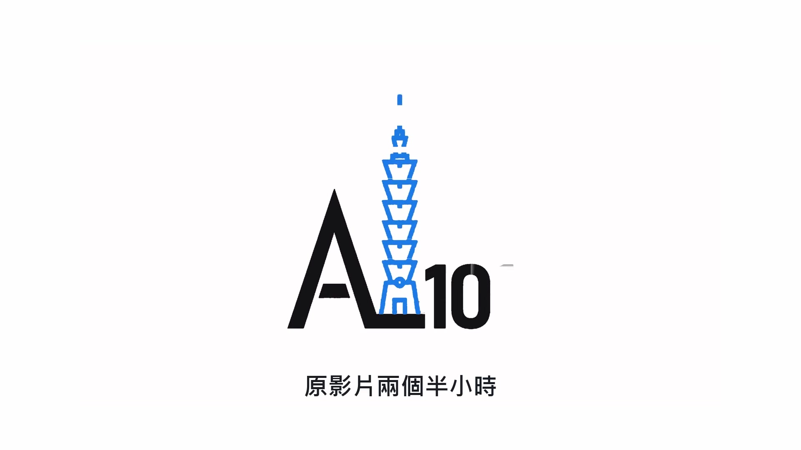

**逐字稿片段：** He also talks about loop quantum gravity, the work of his life.

**話題推測：** 提及原影片中關於「圈量子引力」的討論。

---

## 00:14:07

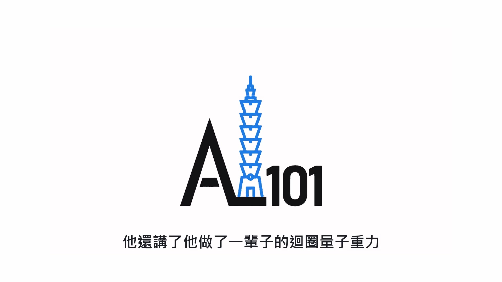

**逐字稿片段：** He says that when a black hole finishes evaporating, it turns into a white hole, and jumping in would be like taking a shortcut into the future. He also tells a story from his twenties, when he was camping in the Canadian Rockies. One evening, a grizzly bear circled his tent for half an hour. He was too scared to make a sound, so all he could do was clap. The original video is linked in the description if you want to hear more.

**話題推測：** 提及黑洞蒸發後變成白洞的科學概念。

---
