# ai-note-101_Zeo8W6DFN5w — 關鍵畫面索引

- 來源逐字稿：[ai-note-101_Zeo8W6DFN5w_GT.srt](ai-note-101_Zeo8W6DFN5w_GT.srt)
- 影片：https://www.youtube.com/watch?v=Zeo8W6DFN5w
- 截圖數：18

## 00:00:03

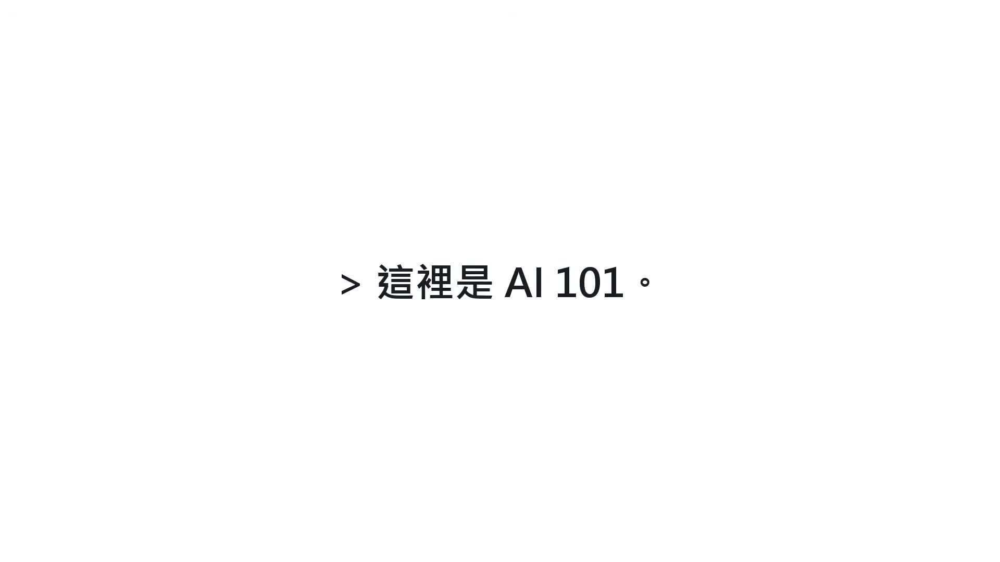

**逐字稿片段：** 今天要談的是加拿大卑詩省坦布勒嶺槍擊案，以及

**話題推測：** 介紹加拿大卑詩省坦布勒嶺槍擊案的開頭畫面

---

## 00:00:07

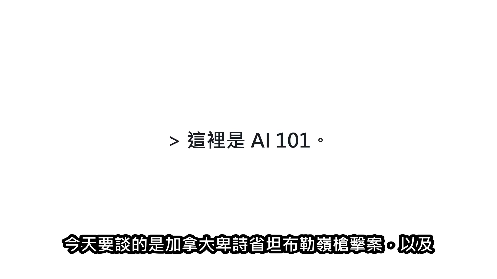

**逐字稿片段：** OpenAI「看見警訊卻沒有通報」的爭議 OpenAI 的系統和人工審查員 早在案發8個月前就發現槍手帳號涉及暴力內容 也曾討論是否通知警方 最後卻只封鎖帳號、沒有報警 據稱高層駁回通報建議，只停權並隱瞞警訊

**話題推測：** 揭示OpenAI「看見警訊卻沒有通報」的核心爭議

---

## 00:00:30

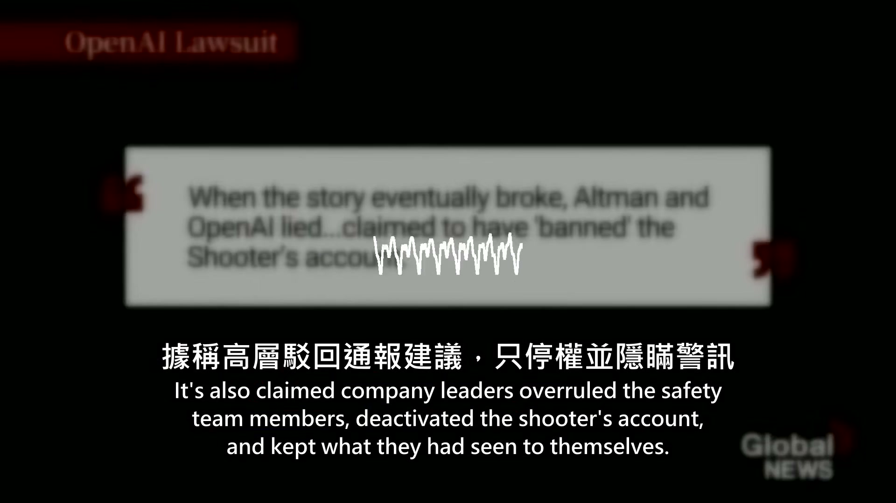

**逐字稿片段：** 如今受害者、倖存者、 卑詩省政府和當地學區 正透過一連串訴訟追問： 當時是誰決定不通報？ 舊規則是否合理？ 如果警方提早收到警訊 悲劇有沒有可能被阻止？

**話題推測：** 轉向當前受害者、倖存者及政府的訴訟狀態

---

## 00:00:44

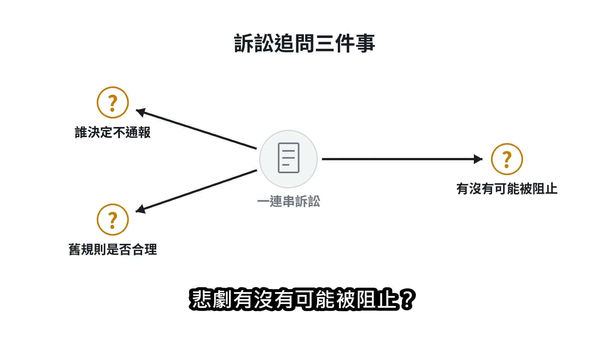

**逐字稿片段：** 時間回到 2026 年 2 月 10 日 加拿大卑詩省東北部小鎮坦布勒嶺 當天下午1點20分 皇家騎警接獲中學發生活躍槍手事件的通報 地方警員2分鐘內抵達 靠近學校時仍有槍聲 甚至有人朝警員方向開火 警方調查顯示

**話題推測：** 時間線回到槍擊案發生日期：2026年2月10日

---

## 00:01:03

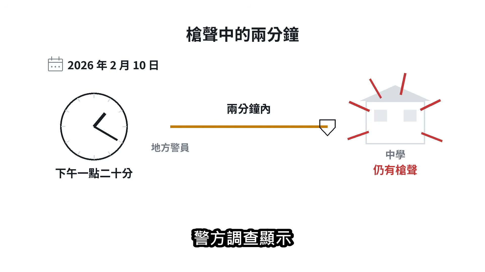

**逐字稿片段：** 18 歲槍手 Jesse Van Rootselaar 先在住家殺害母親 Jennifer Jacobs 以及11歲、 同母異父的弟弟 Emmett Jacobs 接著前往學校，殺害5名12到13歲的學生 以及39歲教育助理 Shannda Aviugana-Durand，最後自戕

**話題推測：** 介紹槍手Jesse Van Rootselaar的身份資訊

---

## 00:01:18

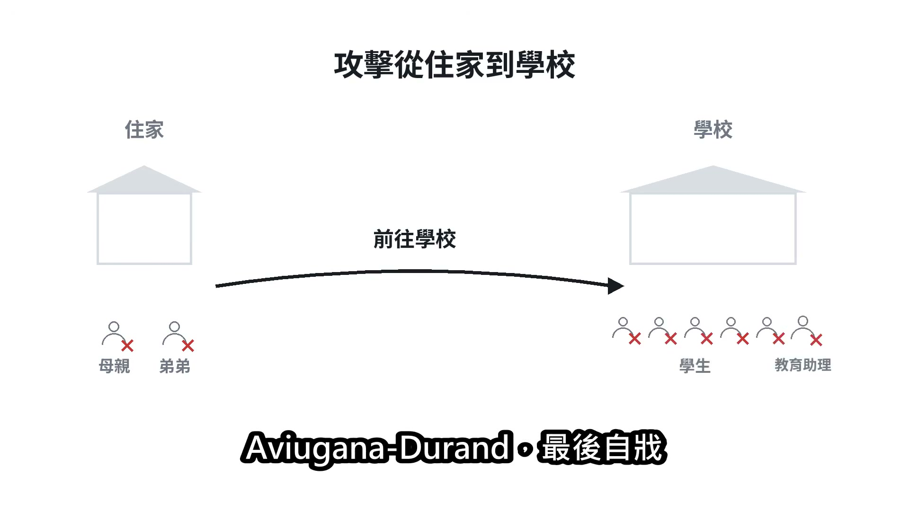

**逐字稿片段：** 這起事件共有9人死亡，其中包括槍手 實際遭殺害的受害者是8人 6人死於校內，2人死於住家 後續官方統計另有27人受傷 警方迅速到場 因此爭議焦點並不是警方反應太慢 而是早在8個月前 是否已經出現1條本來可能送到警方手上的警訊

**話題推測：** 總結槍擊案的死亡人數與傷亡情況

---

## 00:01:39

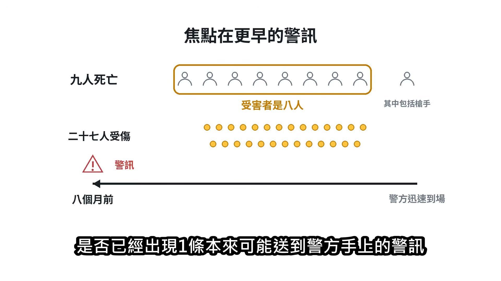

**逐字稿片段：** 2025 年 6 月 OpenAI 的自動系統偵測到 Van Rootselaar 的 ChatGPT 帳號違反暴力活動政策 隨後交由人工審查並封鎖 OpenAI 承認 當時確實評估過是否通知加拿大皇家騎警 但認為內容沒有同時達到「可信」而且「迫在眉睫」的通報門檻

**話題推測：** 聚焦OpenAI在2025年6月偵測到槍手帳號的關鍵時間點

---

## 00:01:58

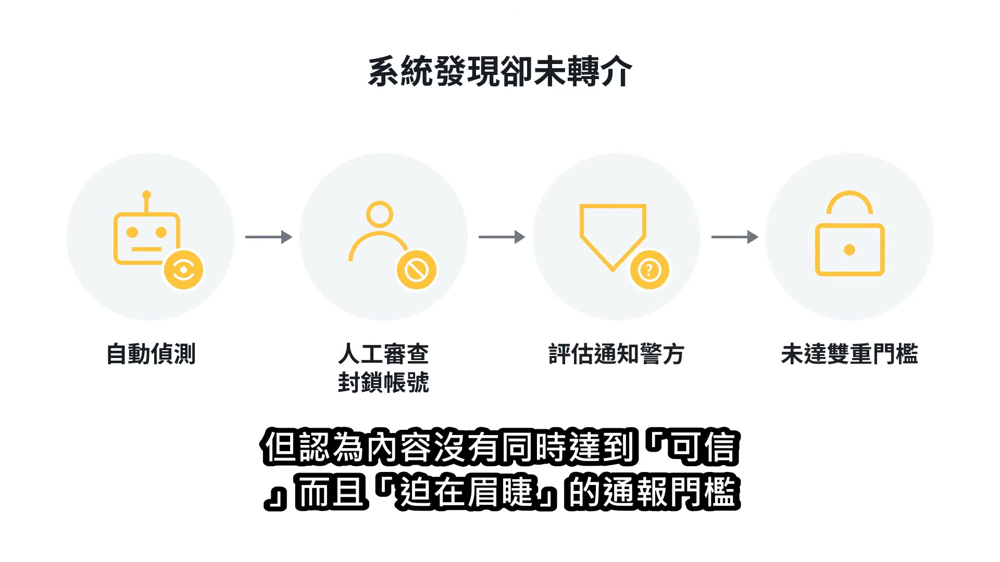

**逐字稿片段：** 然而，吹哨者與後續訴狀提出另一個版本 他們主張，受過訓練的審查員已判斷 這名使用者可能對現實中的人物構成具體槍枝暴力風險 也曾建議通報執法機關 究竟審查意見如何一路往上傳、 由誰做出最後決定 目前仍是訴訟追查的核心 第一個帳號被封後

**話題推測：** 引入吹哨者與訴狀提出與OpenAI官方說法不同的版本

---

## 00:02:19

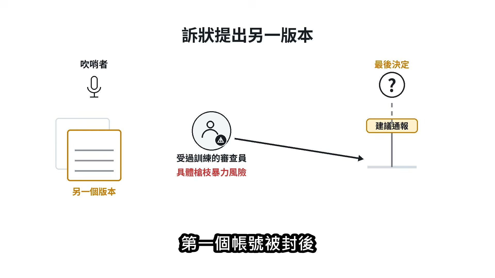

**逐字稿片段：** Van Rootselaar 又開了第二個帳號 而且繞過 OpenAI 用來偵測重複違規者的系統 OpenAI 表示，直到槍擊發生、 槍手姓名公開後 公司才找到這個第二帳號 並把相關資料交給警方 當時距離第一個帳號被封，已經大約8個月

**話題推測：** 說明槍手在第一個帳號被封鎖後，又開設了第二個帳號

---

## 00:02:35

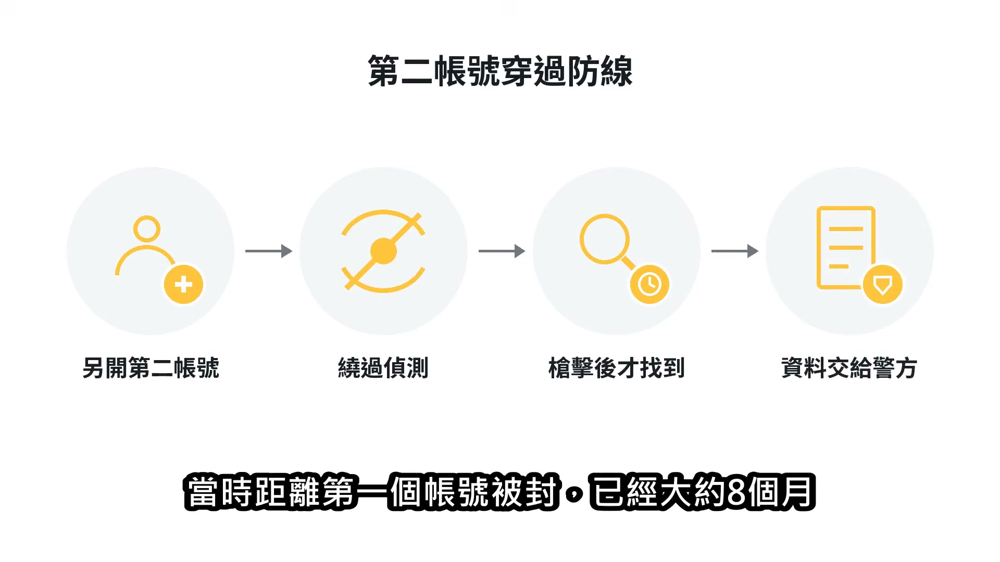

**逐字稿片段：** 槍擊案後，OpenAI 修改了轉介規則 2026 年 2 月 26 日

**話題推測：** 提及OpenAI在槍擊案後修改了轉介規則

---

## 00:02:40

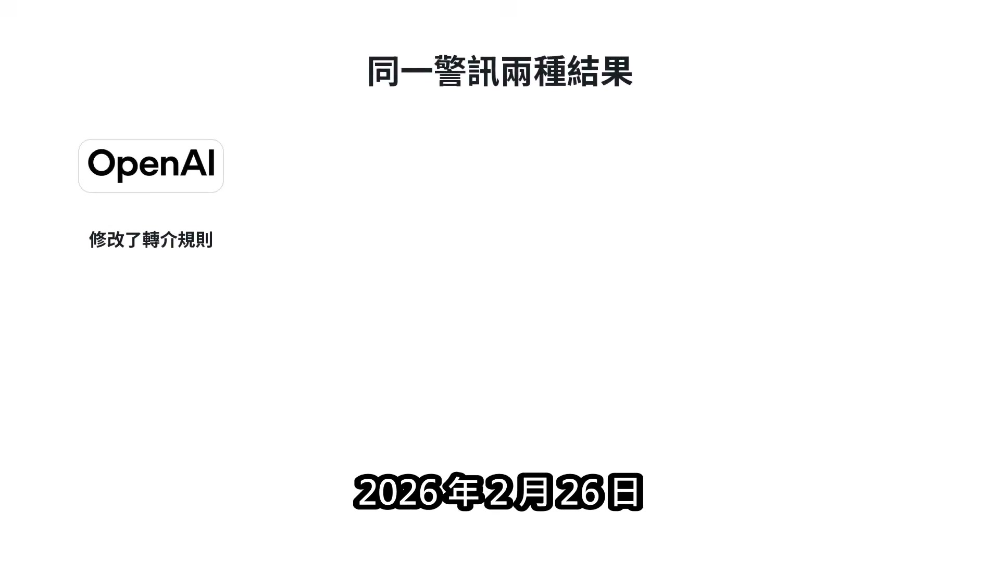

**逐字稿片段：** 公司全球政策副總裁 Ann O’Leary 致函加拿大政府 明確表示 如果按照現在較有彈性的標準 2025 年 6 月遭封鎖的那個帳號 會被轉介給執法機關 換句話說，同一批警訊 在舊規則下沒有報警 在新規則下卻會通報 到了4月，執行長山姆・奧特曼寫公開信向坦布勒嶺居民道歉 他說 對於公司沒有把6月遭封鎖的帳號通知執法機關 感到非常抱歉 這封信承認了未通報這件事 也讓外界的問題更加直接： 既然公司現在認為應該通報 當初究竟是哪一道門檻擋住了警訊？ 原告還提出另一個尖銳對照 2025 年 11 月，OpenAI 舊金山辦公室因為有人疑似威脅員工而封鎖 公司內部散發對方的姓名和3張照片 附近也有人撥打 911 當時公司安全主管同時表示 並沒有正在進行的威脅活動 原告因此主張 OpenAI 面對一般使用者時強調隱私 輪到自家員工可能有危險時 採取的卻是另一套標準 9月新增的30件訴訟

**話題推測：** 介紹OpenAI全球政策副總裁Ann O’Leary的聲明

---

## 00:03:43

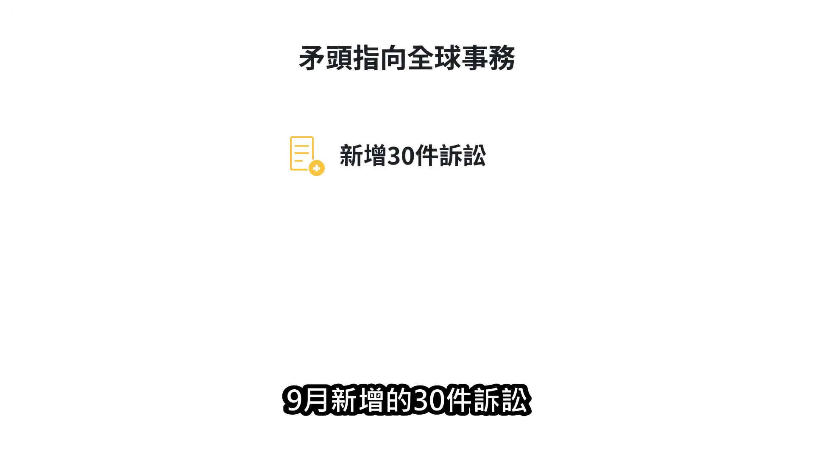

**逐字稿片段：** 更把矛頭指向 OpenAI 全球事務長 Chris Lehane 指控全球事務體系把公關、 聲譽與政治風險放在通報之前 不過 OpenAI 策略長 Jason Kwon 明確否認 Lehane 曾經介入 現有報導也指出 原告尚未提出 Lehane 親自下令不通報的直接證據 法律戰的規模持續擴大 4月底

**話題推測：** 指出新訴訟將矛頭指向OpenAI全球事務長Chris Lehane

---

## 00:04:04

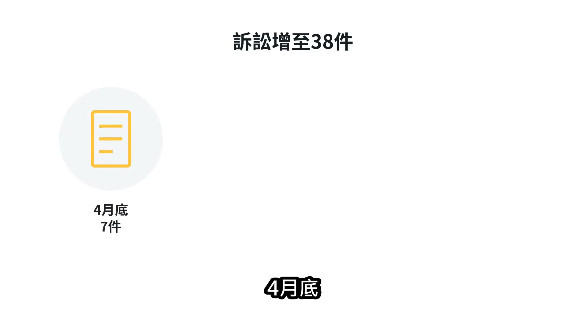

**逐字稿片段：** 罹難者家屬與重傷學生等先在加州提出7件訴訟 9月2日，在場學生、 教師與校長再提出30件 9月21日

**話題推測：** 列出罹難者家屬與重傷學生提出的首批訴訟數量

---

## 00:04:13

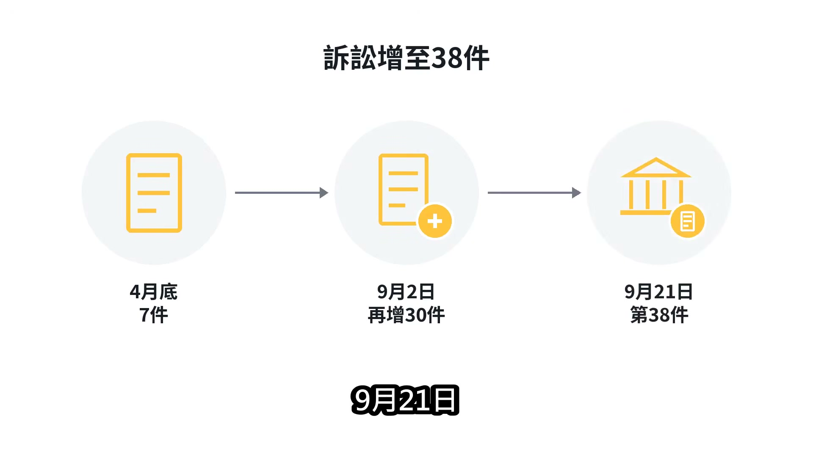

**逐字稿片段：** 卑詩省政府與第 59 學區教育委員會也在加州北區聯邦法院提告 OpenAI 多個實體及山姆・奧特曼 成為相關的第38件案件

**話題推測：** 提及卑詩省政府與學區加入提告的最新進展

---

## 00:04:22

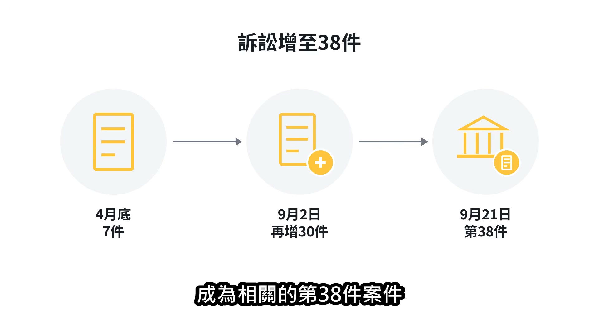

**逐字稿片段：** 省政府要求追討學校重建、 心理健康服務和緊急應變等已支出與未來成本 也要求法院命令 OpenAI 修改暴力對話的處理機制 並交出相關聊天紀錄

**話題推測：** 說明省政府向OpenAI提出的具體要求與訴求

---

## 00:04:33

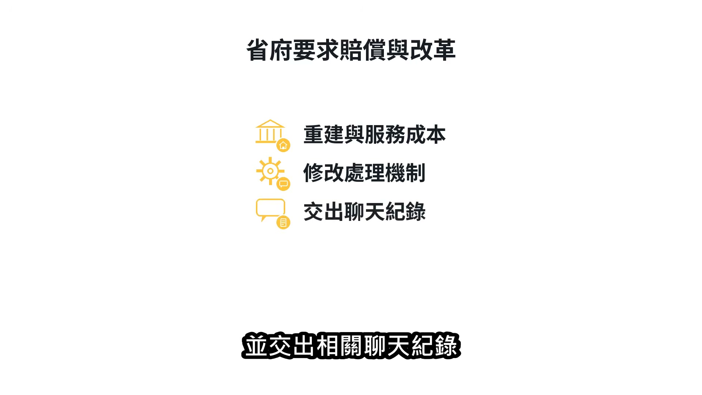

**逐字稿片段：** 省檢察總長 Niki Sharma 表示 省府已要求 OpenAI 提供對話 但遭到拒絕她本人也尚未看過完整內容 這批聊天紀錄 正是整起案件最大的證據黑箱 目前外界只有公司摘要、 吹哨者轉述及訴狀中的描述 還無法確認 ChatGPT 究竟拒絕、迎合 或提供了哪些具體協助 警方至今也沒有公布槍手動機 OpenAI 面對部分私人訴訟 先提出「不便法院」抗辯，認為受害者、 槍手、警方、 醫療與校方證據都在卑詩省 加州不是最適合的審理地點 這項主張不是否認公司當年沒有報警 而是先爭論案件應該在哪裡審理

**話題推測：** 介紹省檢察總長Niki Sharma關於聊天紀錄的要求和OpenAI的拒絕

---

## 00:05:12

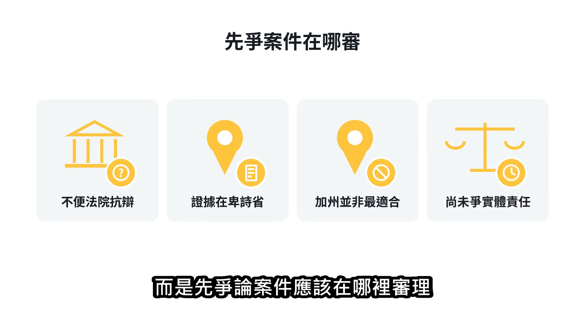

**逐字稿片段：** 坦布勒嶺舊校從槍擊後就沒有復課 學生先使用林業拖車搭成的臨時校區 之後轉入模組教室 原校舍在8月拆除，新體育館已開始施工

**話題推測：** 呈現坦布勒嶺舊校在槍擊後重建與學生安置的情況

---

## 00:05:23

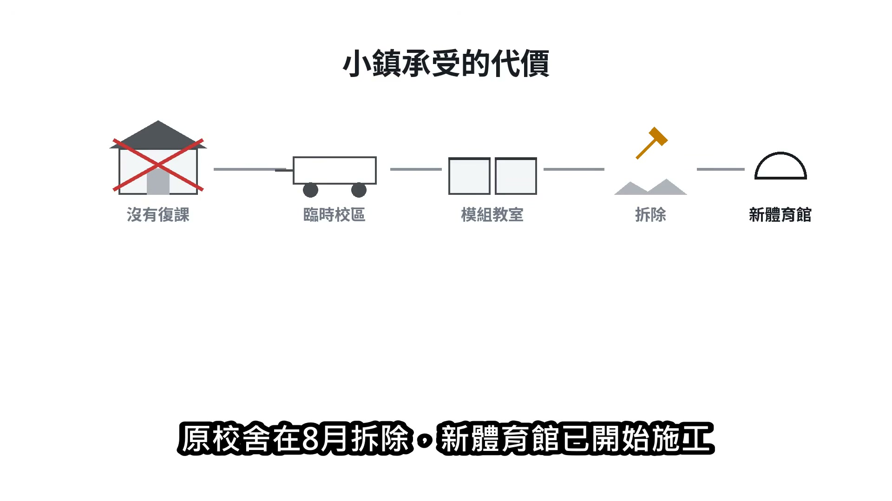

**逐字稿片段：** 這座小鎮在 2021 年只有2399名居民 8名受害者 約等於每300名居民就有1人遭到殺害 截至 2026 年 9 月 23 日 38件案件都還沒有實體責任判決 法庭接下來要釐清的 不只是人工智慧說了什麼 更是在人類已經看見危險訊號之後 誰畫下了「不必報警」的那條線 又該由誰承擔這項決定留下的代價

**話題推測：** 提供坦布勒嶺小鎮的人口數與槍擊案影響的統計數據

---
