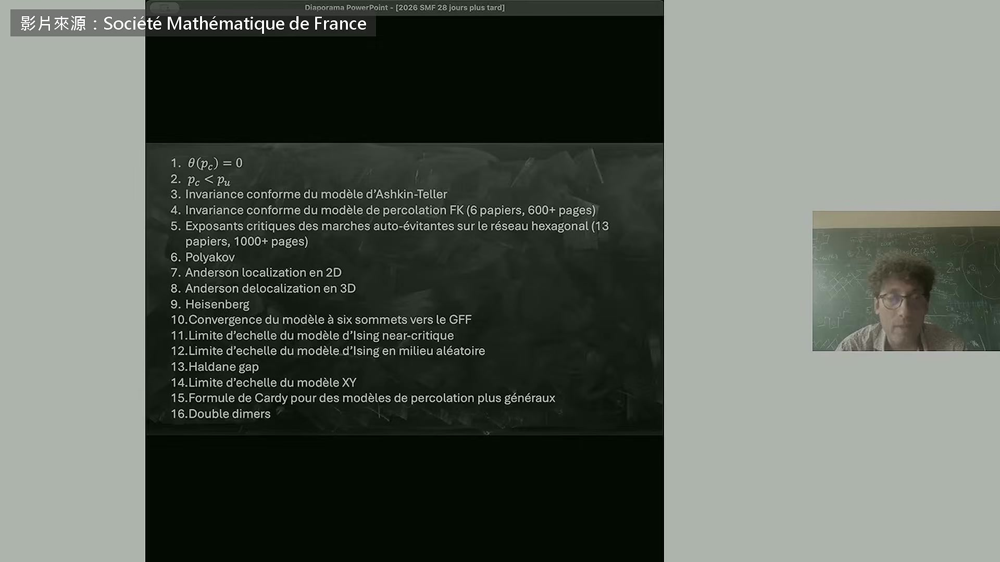
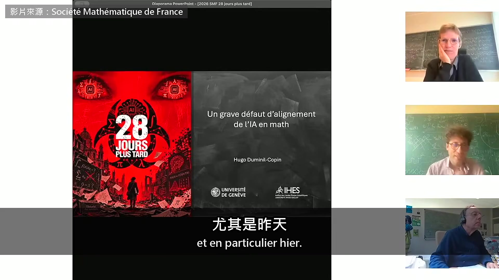
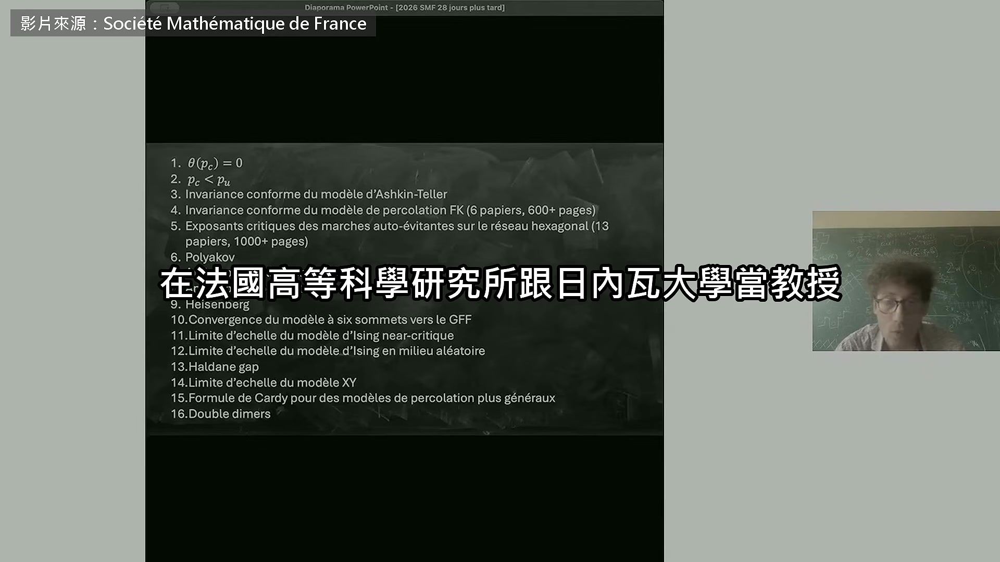
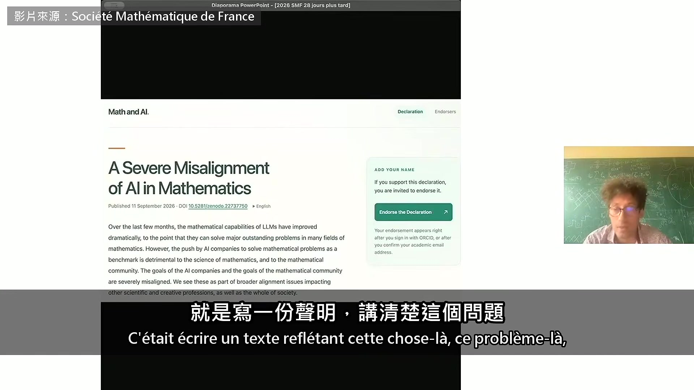
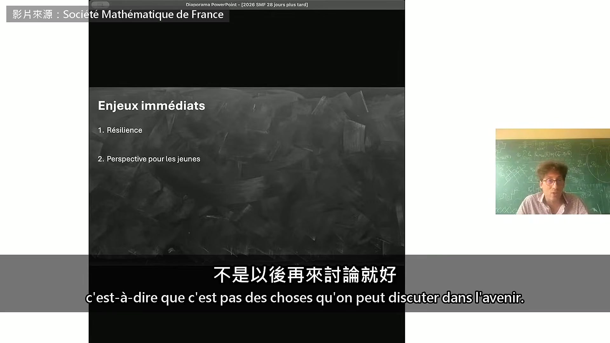

# ai-note-101__dXF4dOjsjY — 關鍵畫面索引

- 來源逐字稿：[ai-note-101__dXF4dOjsjY_GT.srt](ai-note-101__dXF4dOjsjY_GT.srt)
- 影片：https://www.youtube.com/watch?v=_dXF4dOjsjY
- 截圖數：5

## 00:00:00

**逐字稿片段：** 10 月 6 號 OpenAI 一口氣公開了一大批 AI 做出來的數學新結果 兩天後 一位費爾茲獎得主在線上講座說 他寫進論文 演講跟經費申請的研究題目 全部被解掉了，一題不剩 你們可以想像 這段時間，這場演講我差不多每 3 天就得改一次 尤其是昨天

**話題推測：** 提及具體日期，可能顯示新聞標題或日期圖示。

---

## 00:00:22

**逐字稿片段：** 講話的人叫 Hugo Duminil-Copin 2022 年的費爾茲獎得主 在法國高等科學研究所跟日內瓦大學當教授

**話題推測：** 介紹講者姓名與頭銜，可能顯示個人簡介投影片。

---

## 00:00:30

**逐字稿片段：** 他研究的是滲流，一塊滿是小孔的石頭 孔多到某個程度，水會突然從滲不過去 變成整塊流得通 這場是法國數學學會 10 月 8 號開的線上講座 他講第一場 可是對職業數學家來說 真正的轉變，至少對我來說 我發現這一天會比預期早很多的那一刻 是在 4 月 一方面，Lean 證明開始系統化、自動化 那真的很驚人 另一方面…我老是搞混 忘了是 5.5 還是 5.6 總之，新的 ChatGPT 出來了 講一件跟我們的研究、跟我的研究直接有關的事 我有個同事，好玩而已 那是他這輩子第一次用 LLM 他丟進去的，就是他手上在做的題目 那道題我自己大概 10 年前也做過 我有一篇登在 Duke 的論文，70 頁 證出了維度大於 4 的情況 這位同事前一年 證出了同一個猜想維度大於 2 的情況 他就想說好玩，丟進 ChatGPT 問它「你做得出來嗎？」問的是真正的那個猜想 那是 Benjamini 跟 Schramm 提出來的猜想 要證的是所有大於 1 的維度 而且維度可以是碎形那種 結果 ChatGPT 給了他一頁的證明 漂亮得不得了 而且你沒辦法說 它只是去哪篇我們沒看過的論文，把對的論證找出來 你想想這個年輕人有多震驚 他埋頭做了好幾年的題目，一秒就被解掉了 重點不在證明簡不簡單 那個證明很漂亮，而且很短 我們當時就想：「好吧，很明顯，結束了 剩下的只是幾週、幾個月的事」 後來的發展證明我們沒說錯 5 月那道有名的 Erdos 題目 我們又看到同一種事 AI 在這上面已經強得很明顯 可是那種本事，該怎麼說 跟我們職業數學家的本事對不太上 也就是說，這兩次都很典型 都看得到一種所謂「長距離的類比」 有一條連結，大家一直沒看到 可是這條連結一旦被找出來 證明本身其實沒有那麼複雜 所以靠的比較是百科全書式的知識 還有把很遠的東西類比起來的能力 他這一行有一道猜想 寫作 θ(p_c)=0 它問的是，孔剛好多到臨界點的那一刻 水到底流不流得過去 三維空間的版本 幾十年來沒有人證得出來 我自己在這件事上，也有一段小經歷 9 月初，應該說 8 月底到 9 月初 大概是這樣，我們聽到一些傳言 就只是傳言 說這一行最大的猜想，至少是最有名的那一道 叫做 θ(p_c) = 0 已經被 Anthropic 解掉了 我們只有傳言，其實什麼都不知道 沒有第一手的消息 被聯絡過的人，如果真的有人被聯絡過 也沒有把消息傳出來 所以我們完全被蒙在鼓裡 然後 9 月 2 日，我們發現了一份 Lean 證明 沒有任何說明 像我這種跟電腦處不太來的人 老實說，我覺得自己一下子老了一倍 連自己在看什麼都看不懂 結果得靠一位同事，用 AI 本身 把這份 Lean 證明 轉成一篇完全讀不懂的論文 我很佩服我們幾位年輕同事 他們硬是把這篇可怕的東西讀完 現在正在重寫 像今天早上，Arthur 就寫出一篇 比較短，也比較好懂 可是背後得花真功夫，才弄得懂它 對我們來說，這次跟之前那些結果不一樣 這是我們這一行真正最大的難題 是我們的燈塔之一 一路引著大家做研究的東西 就這樣被解掉了 就在 6 天後…當然，這個消息 我們決定不對外講 我們不太想讓它上新聞 可是 6 天後，Navier-Stokes 被證出來了 那一段大家都經歷過了 應該說，被宣布證出來了 結果所有媒體一窩蜂撲上去 因為以前我們就是這樣找媒體的 你看，千禧年難題，你看，費爾茲獎，這一類的 所以這次，套句話說，OpenAI 中了頭獎 每家媒體都拿它上頭條 可是我得說，傷害早在那之前就造成了 對數學界的衝擊 可惜事情變得…我真的跟「10 月」處不來，抱歉 可是事情變得更糟，因為兩天前，你們都知道 有 350 道題目被證出來了 都是重要的題目，每一題都是 至少我想，我們很多人 光是證出其中一題，就會高興得不得了 簡單說，這幾個月的我大概是這樣 有點慌…其實是嚇到僵住 這是週二半夜的我 我放了好幾台卡車 因為我要讓你們看看，我這邊災情有多慘 這上面每一題 我都在演講裡講過 寫進論文 寫進經費申請，過去的跟未來的 說真的 結果全部被解掉了 沒有一題沒被解掉 所以我現在的處境，可以說前所未有 就是我所有的研究方向…至少對我來說是前所未有 我所有的研究方向，都被解掉了 有好幾個方向 一出來就是 6 篇論文，加起來超過 600 頁 講滲流的共形不變性 那是我們的大計畫之一，而且進展得很順 可是看起來，我們離終點比想像的還遠 至少，希望我們找得到短一點的證明 總之，600 頁 還有那個有名的自迴避隨機漫步 我想很多人都聽過 聽過我演講的人，大概都聽我講過這題 週二晚上，我打開一篇論文 心想，這篇我完全看不懂 我花了一整天才搞懂，那其實是第 13 篇 前面還有 12 篇 加起來超過 1000 頁 9 月 11 號 25 位費爾茲獎得主發了一封聯名信 說 AI 公司搶著拿數學難題當跑分 正在傷害數學 這場講座的標題，就是那封信的標題 後面再補上「28 天後」 先講房間裡那頭大象 我知道大家現在很難 不在這件事上選邊站 我不認為自己是反 AI 的人 我只是自己不用它 有些情況用它完全合適，這我一點意見都沒有 可是現在 AI 被拿來用的方式 大公司的用法，還有我們一部分同行的用法，不是全部 在我看來完全不對 這就是我們一開始幾個人私下討論的事 後來我們邀請所有願意的費爾茲獎得主一起加入 就是寫一份聲明，講清楚這個問題

**話題推測：** 介紹研究主題，可能顯示滲流現象示意圖。

---

## 00:09:35

**逐字稿片段：** 就是 AI 的用法，特別是「挖礦」 玩電玩的人會說「刷」 一題一題，有系統地把題目打掉 就拿 θ(p_c) 來說 我後來才發現，有個人試過要聯絡我 這個人跟我講得非常清楚 其實是電腦自己在挑，應該說是程式 自己決定要解哪些題目 當然，是根據我們累積下來的知識 可是這已經是數學發現的全自動化了 不得不說，這封聲明的影響很有限 我想它也許讓數學界 一起…應該說，讓大家敢講話了 對 AI 公司的影響 看週二那次公布就知道 等於零 而且最重要的一點是 「別把引導我們的那些未解猜想全部拆掉」 這一點完全沒有被聽進去 非得證明它能把我們屠殺殆盡 而且是最徹底的那種 這有點奇怪，因為我想我們沒有人懷疑過 經過 Navier-Stokes 那件事 他們有本事做這種事 這件事很急 不是以後再來討論就好

**話題推測：** 提及具體 AI 應用方式，可能顯示「AI 數學挖礦」概念圖。

---

## 00:11:21

**逐字稿片段：** 這關係到現在的年輕人 我帶的博士生跟博士後 現在全陷入恐慌，我懂他們 大學部跟碩士班的學生 也在問同一個問題，很簡單 數學還有未來嗎？ 我還想講兩點…不，三點 很重要的一點是，我覺得我們整體 在溝通跟資訊上出了問題 這些公司就愛話題 所以做事、對外講話，都把話題衝到最大 這是有後果的 不知道別人怎樣，像我這種倒楣的 週二就差不多知道，幾小時內就要公布了 那真的是地獄 我是說，有個記者先聯絡我 所以我知道它要來了 一開始跟我說是某個時間 結果不是那個時間 改了 3 次 壓力大到難以想像 公布出來了，「我們搞定數學了」，云云 我是說，他們要怎麼做，我們管不著 可是我們自己怎麼做、怎麼講話，我們管得著 老實說，這方面我們也不是沒有問題 今年夏天 他寫了一篇短文談 AI 跟數學

**話題推測：** 將話題轉向對年輕一代的影響，可能顯示相關的社會議題圖示。

---
