# ai-note-101_bE5lQEtHF-Y — 關鍵畫面索引

- 來源逐字稿：[ai-note-101_bE5lQEtHF-Y_GT.srt](ai-note-101_bE5lQEtHF-Y_GT.srt)
- 影片：https://www.youtube.com/watch?v=bE5lQEtHF-Y
- 截圖數：17

## 00:00:12

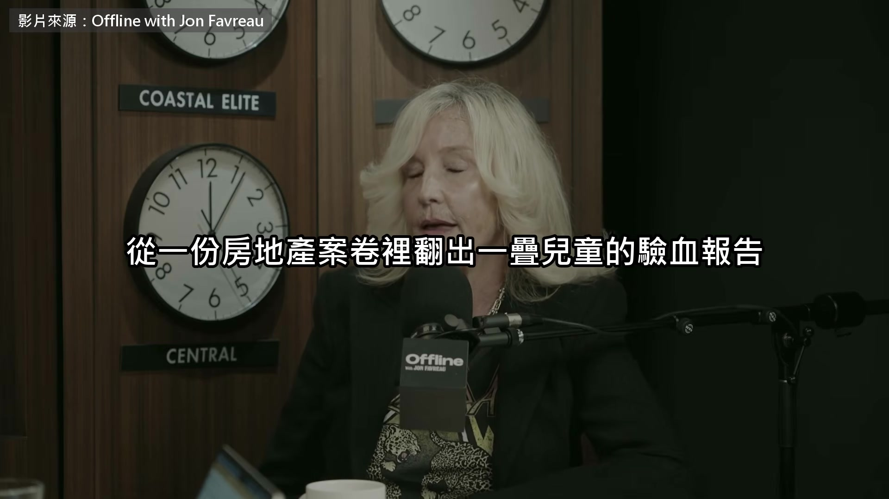

**逐字稿片段：** 一路查到電力公司 PG&E 汙染了 Hinkley 這個小鎮的地下水 PG&E 最後賠了 3.33 億美元 之後 30 多年 她一直在幫各地社區對抗大企業 這是 10 月 3 號上架的訪談 主題是 AI 資料中心 電影上映之後，只要哪裡出了大的環境問題，我就會收到信 我一天到晚都在收信 可是如果同一個鎮一次來一批，15 封、30、40、50 封 那通常就是我的第一個線索，代表那裡出事了 有一天我醒來…我們的地圖是從 5 月開始的，大概 5、6 個月前 信箱裡有 30 封信，全都來自賓州的同一個社區 都在反映資料中心的問題，很憤怒，說完全不透明 資料中心已經有幾十年了，大家都知道 雲端那些東西 我就想，這很奇怪，這個鎮到底怎麼了？ 資料中心又是怎麼回事？因為那是 AI 的超大規模資料中心 所以我開始查，越查越覺得有意思 我喜歡看全貌，所以我喜歡做地圖，地圖讓我看得到全貌 我就想，嗯，這感覺很像 Hinkley

**話題推測：** 介紹電力公司 PG&E 與 Hinkley 小鎮

---

## 00:01:32

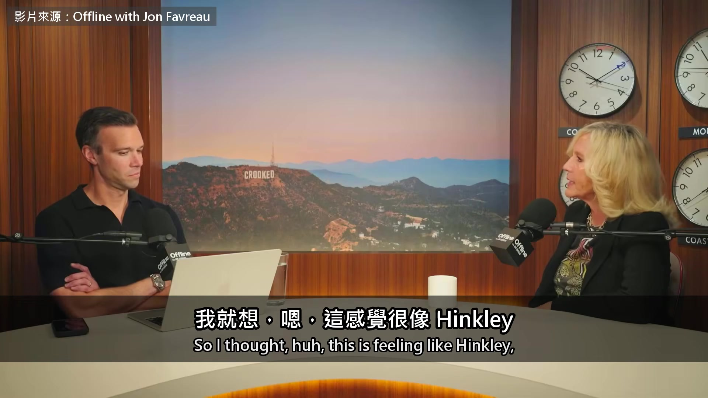

**逐字稿片段：** 因為你要搞懂的是資料中心、電力公司、電、用水 有人在隱瞞什麼 我心想，糟了，我又要蹚這渾水了嗎？ 我想知道，是不是只有這個鎮這樣

**話題推測：** 列出資料中心、電力公司、電、用水之間的關聯

---

## 00:01:44

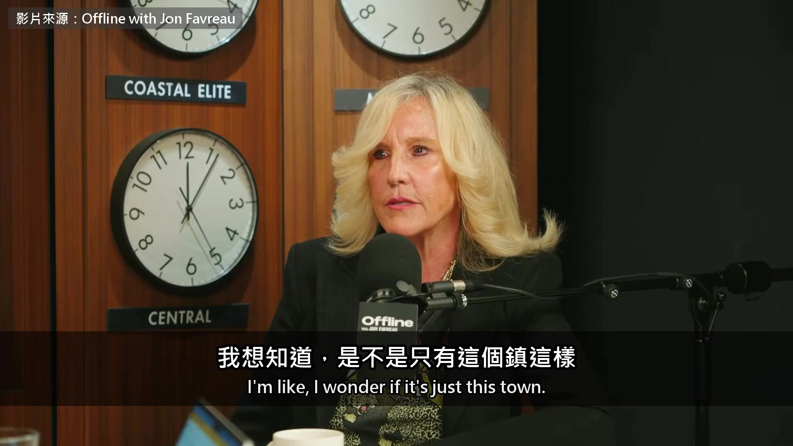

**逐字稿片段：** 所以我做了 Brockovich 資料中心通報地圖，放上網 第一天就當機兩次 到第三天，每一州都有人通報 全美國每一州，都有好幾個城市、好幾個郡 那時候我心想，糟了，我又繞回原點了。糟了 真正讓我在意的 也是讓我覺得繞回原點的 我太記得 Hinkley 了 我就想，一定有人在某個地方說謊 每一件通報，每個郡、每個城市、每一州來的每一件通報 全都簽了保密協議 我就想，等一下，這怎麼可能？事情就是這樣開始的 資料進來之後，我喜歡分門別類

**話題推測：** Brockovich 資料中心通報地圖上線

---

## 00:02:41

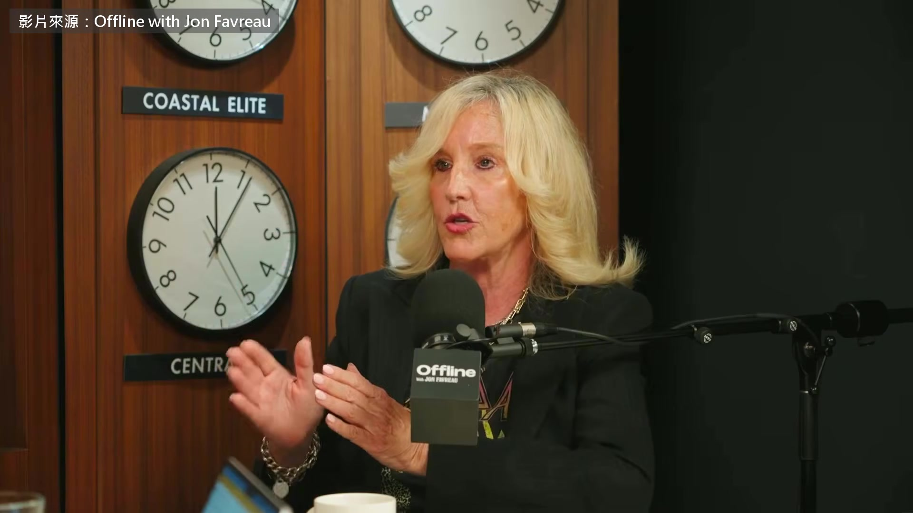

**逐字稿片段：** 因為通報有各種階段，有的還在提案 有的說我們在抗爭，有的說我們在被掩蓋 也有通報說已經在施工，還有的已經在運轉 所以從提案、施工到運轉，每個階段發生什麼事，我大概都看得到 我想深入問一下保密協議 因為你說大家最在意的，其實不是水、電或噪音 那些也有，只是排在後面，最在意的是不透明 地方政府跟開發商簽保密協議，有多常見？ 我想偶爾有個一兩件是可能的 但我就是在這裡覺得，等一下 我在看整張圖 怎麼會每一件都在同一個時間，被放進保密協議裡？ 不同的州、不同的許可、不同的法規 這才是最讓我驚訝的，保密到這種程度 大家常常低估這些社區 他們很聰明，他們要答案 我很早就看到他們在做另一件事 他們自己去申請資訊公開，調政府的公文 好幾個州都有人回報，他們申請到的公文顯示 那些保密協議，2021、2022 年就簽了 我心想，不妙 但越往下查 我知道的事越來越多 保密協議那邊 是他們在改地方的條例 很多社區都跟我回報 我才剛收到一件佛州來的通報，真的嚇到我 開發商在寫分區條例，寫了又改 是替市議會寫的 我心想，哇 連管電價的公用事業委員會，規章也是他們在寫 我心想，哇，這到底是怎麼搞的？ 所以我認為保密協議就是為了這個，他們不想讓人知道 他們在改分區條例，這些全都在做 如果公開講，大家一定會說，等一下 所以這是突襲。我很不想用這個詞，但大家的感覺就是這樣 因為等他們真的收到通知，已經太遲了，全部都簽好了 他們只能問，這裡到底發生了什麼事？ 所以我認為他們想保密，理由很多 Hinkley 當年的汙染

**話題推測：** 說明通報的各種階段（提案、抗爭、施工、運轉）

---

## 00:05:31

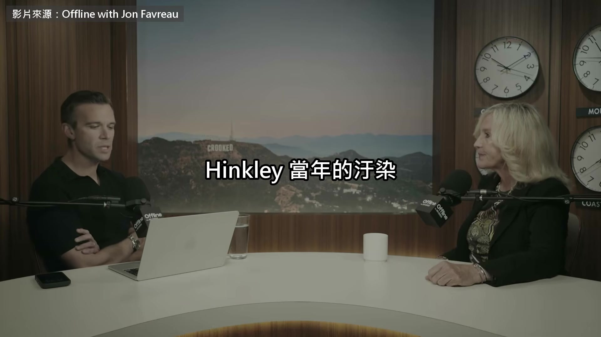

**逐字稿片段：** 源頭是 PG&E 天然氣加壓站冷卻水塔排出的廢水 現在資料中心最常被問的也是冷卻用水

**話題推測：** 回顧 Hinkley 汙染源於 PG&E 冷卻水塔廢水

---

## 00:05:38

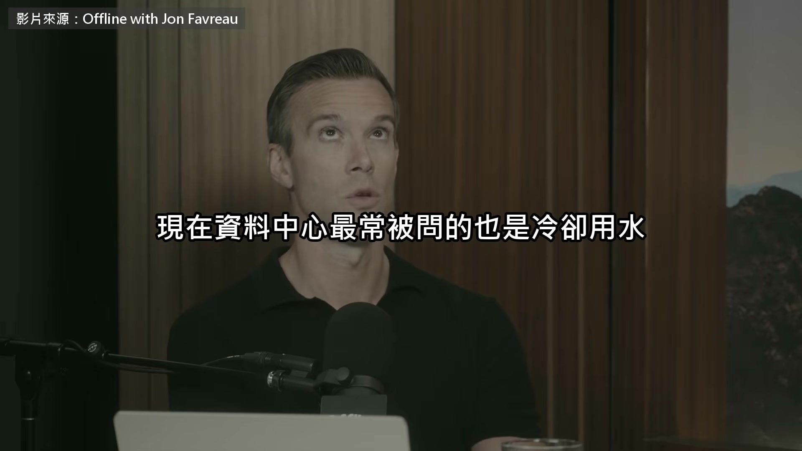

**逐字稿片段：** 業界的標準回答是閉路冷卻 讓水在管線裡循環使用 所以現在有閉路冷卻、有回收廢水，一切都沒問題了 不是

**話題推測：** 介紹業界標準的「閉路冷卻」技術

---

## 00:05:52

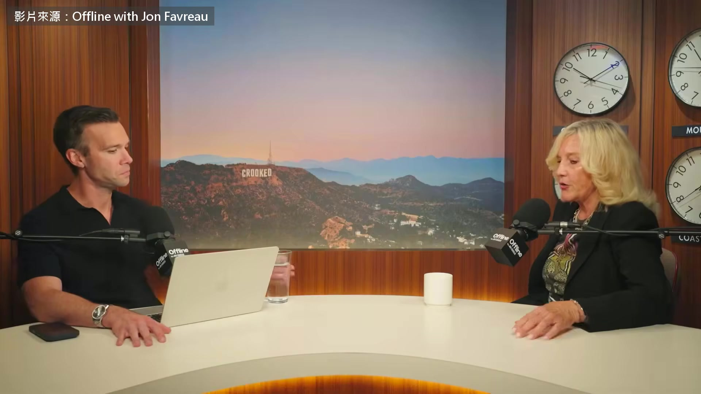

**逐字稿片段：** 通常像加州 Hinkley 那樣，冷卻水是在現場露天蒸發掉的 這些 AI 超大規模資料中心本來要用很多水 我們都知道，很多人反對它們用那麼多水 所以現在改成閉路冷卻，魔術就在這裡 沒錯，現場不再露天蒸發，那個地點確實省了水 但你看場外，用閉路冷卻 場外反而可能要用更多水 因為你得供電給這些資料中心 所以這其實是拿一個換另一個 你沒有省到水，用的水甚至可能更多 發電要用水，而你現在得把這麼多電送進資料中心

**話題推測：** 比較 Hinkley 當年冷卻水露天蒸發的做法

---

## 00:06:58

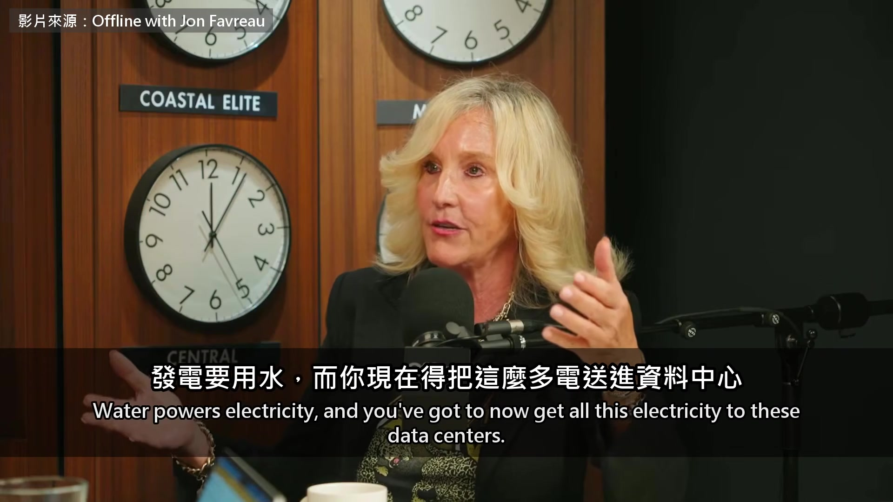

**逐字稿片段：** 這叫水電悖論 這個悖論一直都在，工程上一直沒解決 因為你基本上是拿水去換電，總要犧牲一邊 所以不一定有省到水 場外可能要用掉更多水 接下來是電的這一邊 還有一件事，大家開始火大了 那些 76.5 萬伏特的大型高壓電線，穿過他們的土地 是用徵收的方式拿走的 那電的問題呢，你一定收到很多這方面的擔憂 我的理解是，大型資料中心不一定會讓其他人的電費變貴 但這是監管機關的選擇 新電廠跟電網的錢誰來付，對嗎？ 完全正確 這麼多通報裡 最讓我難受的是 現在看起來，所有的帳都要丟給我們付 事情不該是這樣 你們想要這些 AI 超大規模資料中心，那就該有人監督 我不覺得這有什麼不合理 這是典型的大企業作風 為了錢把問題往後踢

**話題推測：** 提出「水電悖論」概念

---

## 00:08:30

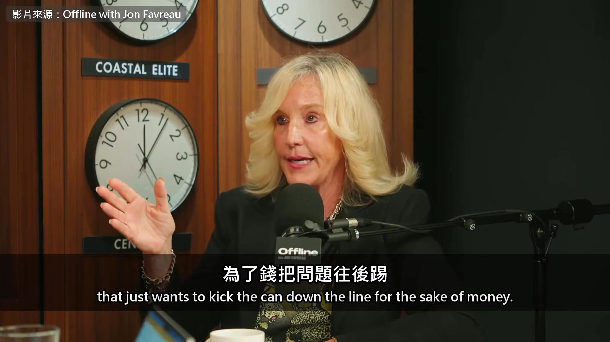

**逐字稿片段：** 大概 5 年後技術一換代，好戲就上場了 你們會把這些小車諾比丟在美國各地 為什麼不能一開始就讓他們付該付的錢 安全、基礎設施都自己付？ 那些本來就該是他們自己的基礎設施 大家都知道，現有的基礎設施又老又舊，根本撐不住 所以大家擔心這些成本會落到自己頭上。而且已經在發生了 但已經有人寫信給我 說他們的電費跟水費漲了 200% 到 400% 他們把漲價前後的帳單寄給我 收到這些通報，真的讓我很難受 有人說，我靠固定收入過活 現在我得選，是要吃飯還是付電費 我心想，外面到底發生了什麼事？ 資料中心日夜不停地運轉

**話題推測：** 預測 5 年後技術換代可能帶來的問題

---

## 00:09:38

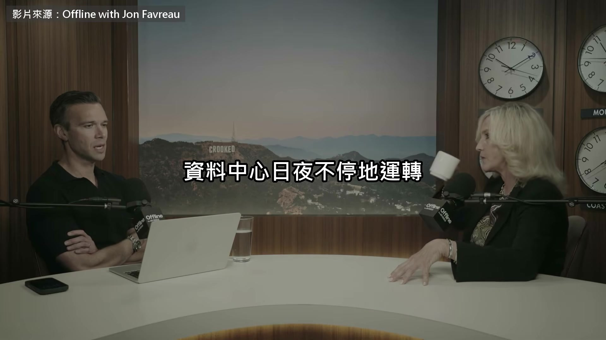

**逐字稿片段：** 主持人接著問到噪音 說頭痛的通報，多到數不清 一天 24 小時都是那種分貝 完全不得安寧。頭痛、焦慮 小孩也出現問題 牧場主人回報，這麼高的分貝讓他們很擔心 因為動物壓力很大

**話題推測：** 主持人將話題轉向噪音問題

---

## 00:10:08

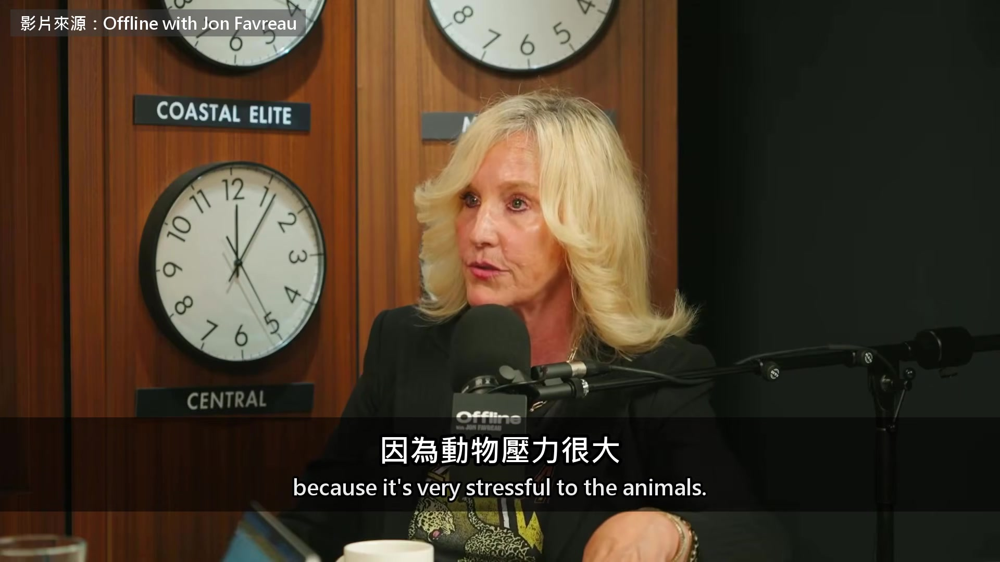

**逐字稿片段：** 所以牧場主人開始回報，死胎變多了 因為牠們壓力非常大 還有拉進來的這些電線 越來越多獸醫來找我 他們照顧牲畜跟乳牛 35、40、45 年了 他們很擔心這些拉進來的電線 在接地接上資料中心之前，到處都可能有雜散電壓 他們看過方圓好幾英里的產業，因為這樣整個垮掉 還有內部的吹哨者寫信給我，說他們很擔心

**話題推測：** 牧場主人回報動物死胎增加的現象

---

## 00:10:52

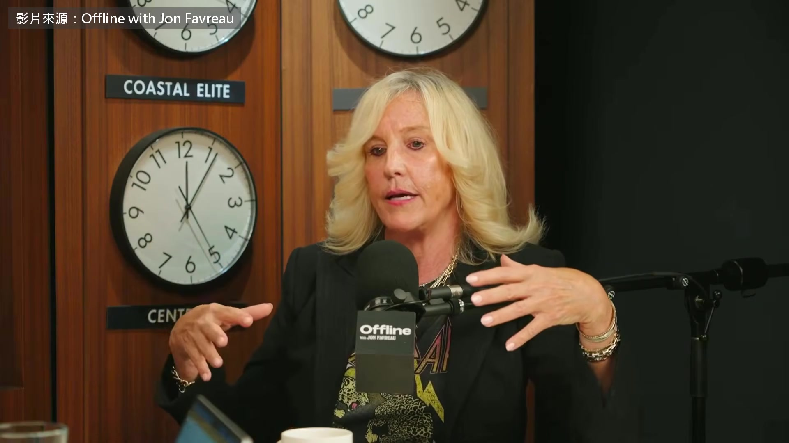

**逐字稿片段：** 說他們沒有許可就在蓋了 我心想，什麼？都是你不想聽到的事 他們甚至回報說，我可能是這裡的電工 但這份工作只有一年，做完我就沒工作了 資料中心開始運轉之後，只需要很少人顧 但你已經毀了一個地方，那裡可能本來很多人去飛蠅釣，觀光就這樣沒了 房價也跌了，他們又沒有工作 所以他們回報說，大家說這對經濟多好多好，我們根本沒看到 訪談最後，主持人說光看民調 看不出這股反彈有多大，要到社區裡聽 才知道真正的力量在哪裡 力量一直都在那裡 這 30 年我學到一件事 這些環境問題 98% 是從一個媽媽開始的，她的小孩生病了 她想搞清楚到底怎麼回事 我也學到，當這份堅持找到另一個媽媽 她們真的會找到，接著變成 50 個媽媽，組織起來 然後她們把問問題當成自己的工作，問很難的問題 健康、驗血、工程，那些她們以為自己看不懂的東西 她們看得懂，只要下定決心 我看著這些人動起來，覺得很驚奇 不是只有加州 Hinkley 一個鎮，是全美國每一州的好幾個鎮 我跟你說，現在已經有 20 個國家在我的地圖上通報

**話題推測：** 揭露資料中心可能在沒有許可的情況下施工

---

## 00:12:39

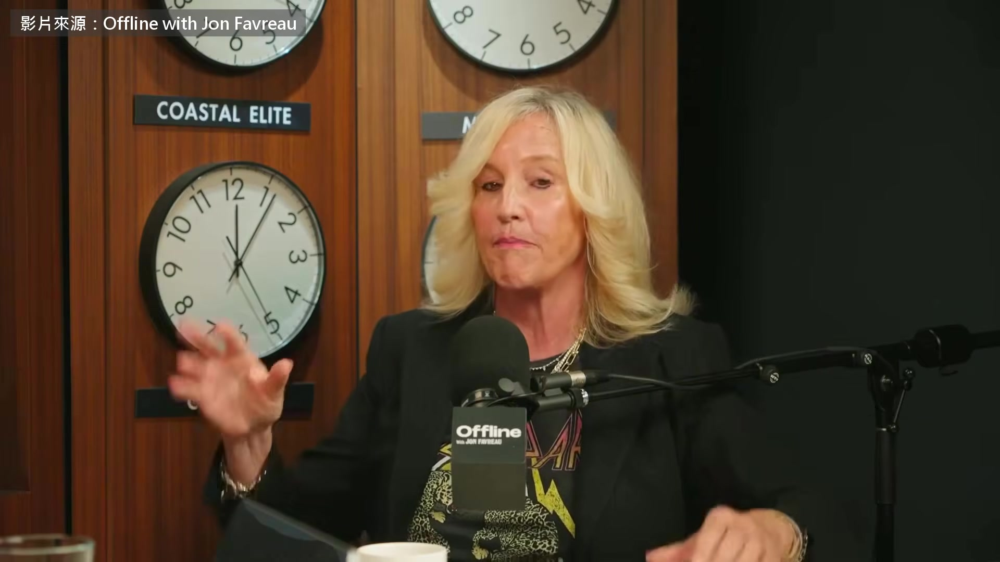

**逐字稿片段：** 最近日本來了三件，我看了很傻眼 你猜怎麼樣？全都簽了保密協議 我心想，天啊

**話題推測：** 說明日本有三件通報案例

---

## 00:12:49

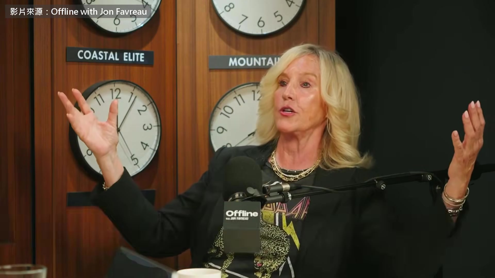

**逐字稿片段：** 從一個鎮，到這個國家，再到全世界 我認為這是一個非常大的 非常、非常大的全球問題 她知道的這些事，是居民 獸醫跟工地裡的人一件件寄給她的 照她拼出來的地圖 附近的人聽到消息的時候 保密協議早就簽好了 電費最後也落在他們頭上

**話題推測：** 總結問題從單一城鎮擴散至全球的趨勢

---

## 00:13:16

**逐字稿片段：** 原影片一個多小時，她還講到 她剛開始追的時候

**話題推測：** 提及原影片的長度及其他資訊

---

## 00:13:20

**逐字稿片段：** 全美國暫停或禁止蓋資料中心的地方大概 30 個

**話題推測：** 講者追查初期，全美約 30 個地方暫停或禁止資料中心建設

---

## 00:13:23

**逐字稿片段：** 現在超過 600 個 還有當年在 Hinkley 她天天去，過了一年多居民才信任她 原影片連結在說明欄，有興趣可以去聽更多。

**話題推測：** 目前全美暫停或禁止資料中心建設的地方已超過 600 個

---
