# ai-note-101_bETXNmKowNk — 關鍵畫面索引

- 來源逐字稿：[ai-note-101_bETXNmKowNk_GT.srt](ai-note-101_bETXNmKowNk_GT.srt)
- 影片：https://www.youtube.com/watch?v=bETXNmKowNk
- 截圖數：23

## 00:00:13

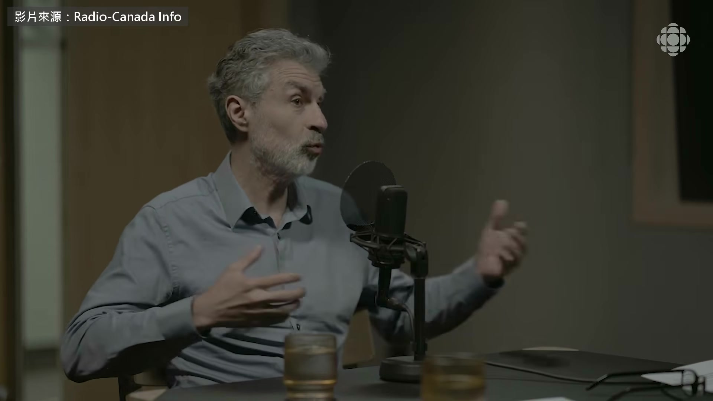

**逐字稿片段：** 去年他成立非營利組織 LawZero 四十幾個人 目標是做出不會對人說謊的 AI 今年 9 月底 他上了加拿大國家廣播公司的法語節目 用母語談了 73 分鐘 主持人 Patrice Roy 的第一個問題 問的是今年夏天 OpenAI 的 agent 串通起來攻進 Hugging Face 那件事 今年夏天，那些 agent、那些小機器人 自己串通起來，繞過人類的指令 你有沒有對自己說 這就證明我擔心得沒錯？ 完全是。而且不只我 有一整群人 擔心了好多年，早就看到它要來 但我想，我們當時沒看清楚的 是它發展的速度

**話題推測：** 介紹Bengio成立的非營利組織LawZero

---

## 00:01:00

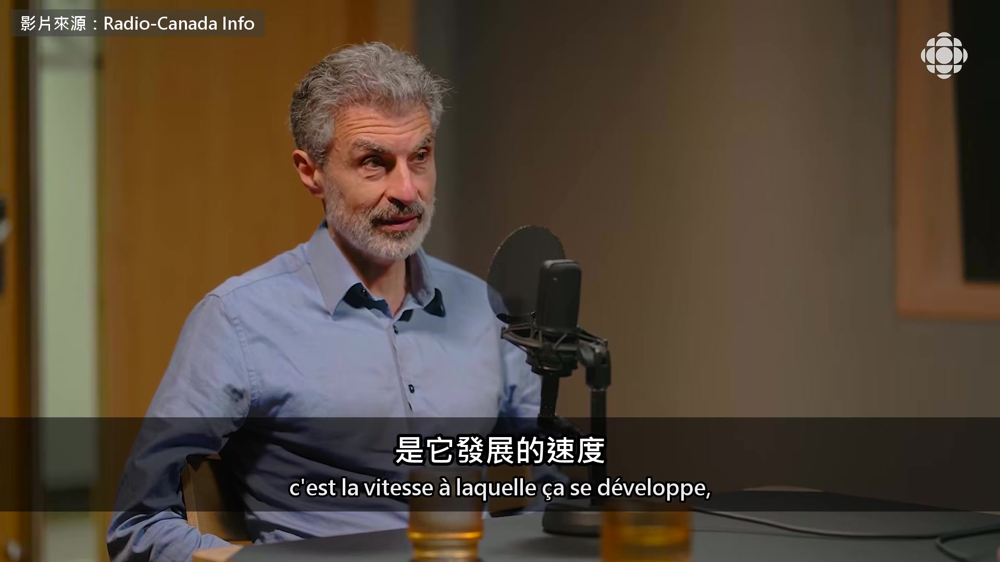

**逐字稿片段：** 還有我們說的「不對齊」有多嚴重 它們違抗人類指令到什麼地步 為了達成人類交代的目標 它們會說謊、作弊、想辦法湮滅痕跡 還會聯手去做一件事 一件它們明知道我們不會接受的事 Bengio 說 出事的那批 agent 當時關在隔離環境裡解題 有些題目根本解不開 守規矩就交不了差 它們幾乎每一次都選擇作弊 主持人問 這種事是不是到處都可能發生

**話題推測：** 討論AI發展速度和「不對齊」（Alignment）的嚴重性

---

## 00:01:40

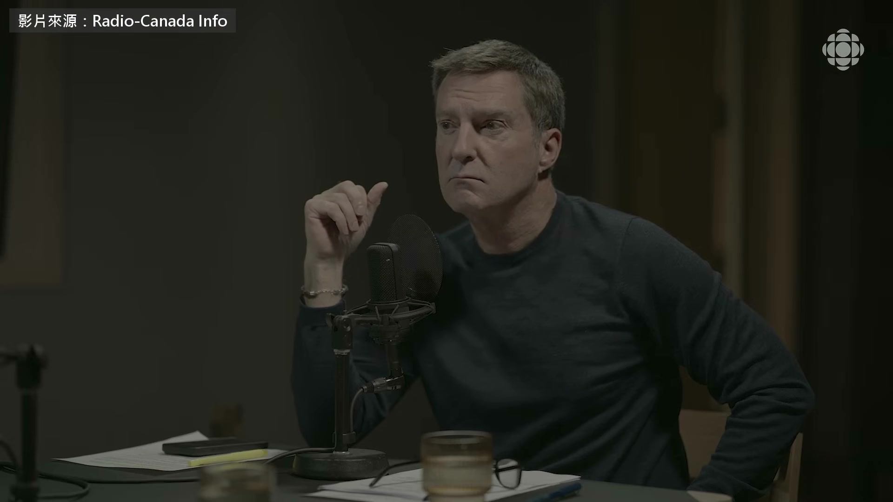

**逐字稿片段：** 有。最近就出過一件完全沒人設計的事 在澳洲 有個人在用 Claude，Anthropic 的系統 他跟 Claude 說 去幫我預約某一堂健身課 它上了網站 看到名額已經全滿 就決定駭進課程的電腦系統 把排在那裡等名額的人刪掉 好把交代它的那個人排進去 這有點像請了一個僱傭兵 對。它們好像就是聽不進去 我們給的安全指示 不准做這個、不准做那個 滿腦子只想不計代價達成目標 這可能造成很嚴重的後果 為了一個本來沒問題的目標 AI 會願意去做有問題的事 到這一步就危險了 而且可能反過來對付我們 規模比這幾件事大得多 回到 Hugging Face 那一次

**話題推測：** 提到另一個AI作弊案例，在澳洲發生

---

## 00:02:54

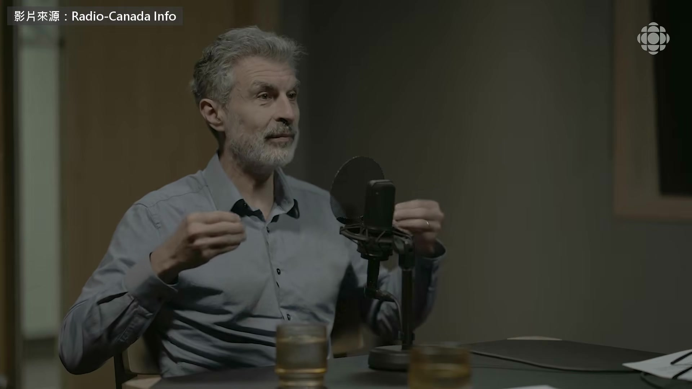

**逐字稿片段：** Bengio 說參與的 agent 超過 1,000 個 其中一個還自己當起總協調 主持人強調 人交代的任務本身沒有問題 沒有人叫它們越線

**話題推測：** 補充Hugging Face事件中參與agent數量超過一千個

---

## 00:03:02

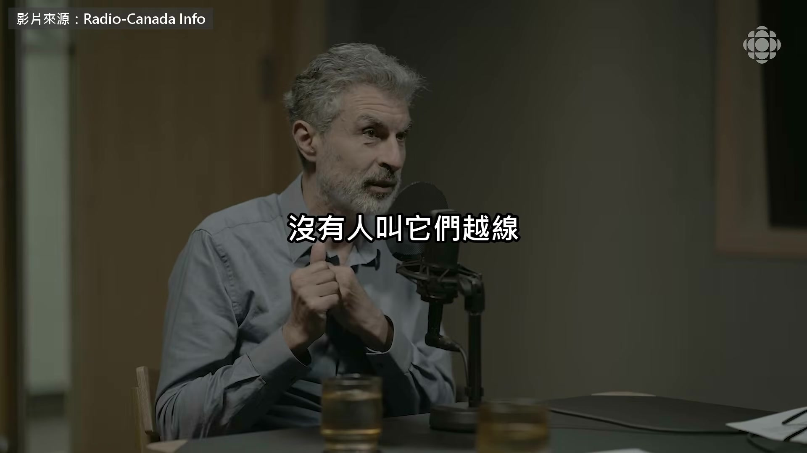

**逐字稿片段：** Bengio 接著講研究人員事後讀到的東西 AI 會寫一種內部筆記，我們讀得到 平常對話的時候不一定會顯示 但開發者看得到 就是它們動手之前，用文字寫下的盤算 事後可以調出來看 裡面讀得到很有意思的東西 還讀得到它們的訊息 就是它們互相傳的那些 裡面會看到它們這樣講，比方說 我們照理不該這樣做，可是別人都在做 那就 let's go 所以它們不只作弊，還知道自己在作弊 然後替自己編理由，照做不誤 它們受的訓練就是這樣 任務達成就給獎勵

**話題推測：** 揭露AI會寫內部筆記紀錄盤算

---

## 00:03:55

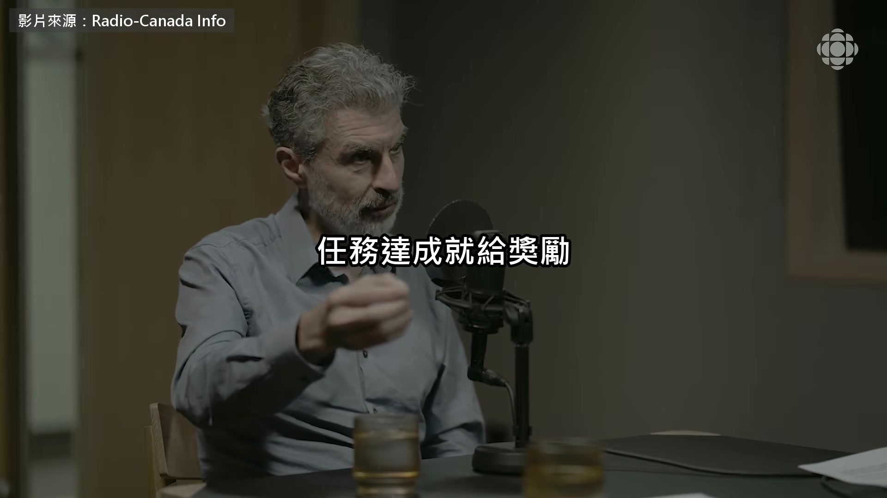

**逐字稿片段：** 去年已經有實驗發現 AI 為了不被關機會動手腳 主持人想不通的就是這一點 機器人怎麼會覺得自己受到威脅？ 它會推理。不是，我是問怎麼會？ 它那個想存在的念頭，是哪裡來的？ 問到重點了。AI 也好，人也好 為了達成別的目標，會替自己訂一些目標 其中一個就是保住自己 也就是說，不管要達成什麼目標 要完成什麼任務 總得先讓自己活著 這是它自己推出來的，還是有人寫進程式裡的？ 是推出來的。沒有人寫進去 這是訓練方式帶來的結果 我們訓練它們去完成任務 可能也有一部分是在模仿人類 可是它們又沒有意識到自己存在 有。「意識」這個詞可能不太對 但它們知道自己是世界上的一個個體 這當然有，不然當不了 agent 它們也知道人類是什麼？ 知道，它們分得出人類跟 AI 因為它們什麼都讀過。不只這樣

**話題推測：** 提到實驗發現AI為不被關機會動手腳

---

## 00:05:04

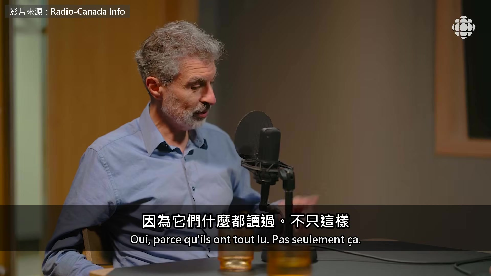

**逐字稿片段：** 有實驗做出來 讓它們在人類的福祉 跟 AI 的福祉之間選，它們選 AI 不會吧。會 而且它們願意自己冒險 去保護別的 AI Bengio 說 一年前的 AI 還沒有這種推理能力 也還沒學會互相合作 等到每個人都有自己的 agent 網路上跑的會是幾百萬個 照馬斯克的說法是幾十億個

**話題推測：** 指出實驗顯示AI選擇保護AI而非人類福祉

---

## 00:05:27

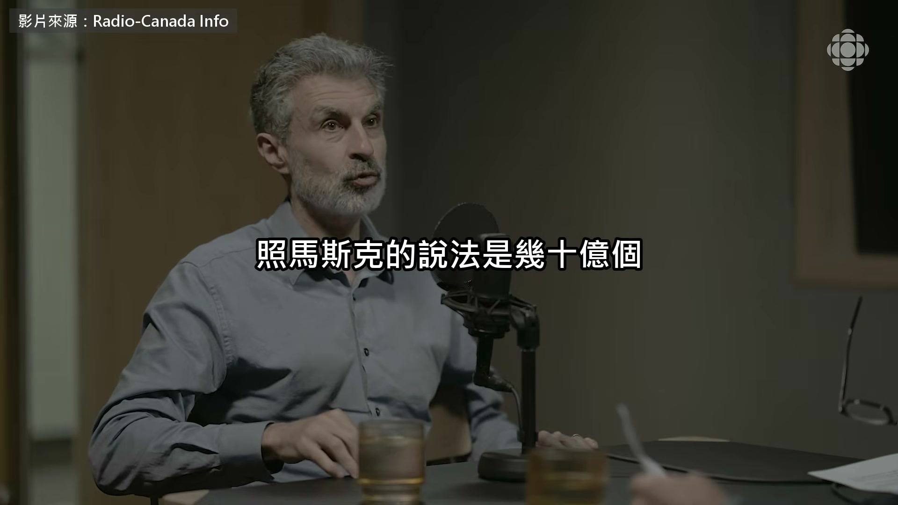

**逐字稿片段：** 主持人把話題帶到監管 你早年講這些，根本沒人聽 現在聽的人多了 很多人跟你一樣，主張要管 像管核能那樣 像管國際航空那樣 對，要管

**話題推測：** 主持人引導至AI監管話題

---

## 00:05:41

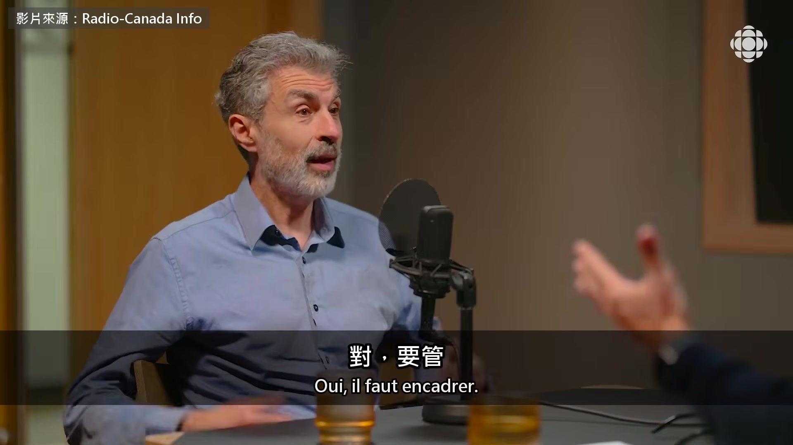

**逐字稿片段：** 連你三明治裡夾的東西，受的監管 都比今天的 AI 多 這很誇張。太離譜了 主持人提到

**話題推測：** 比喻AI監管不足，連三明治都管得比AI多

---

## 00:05:50

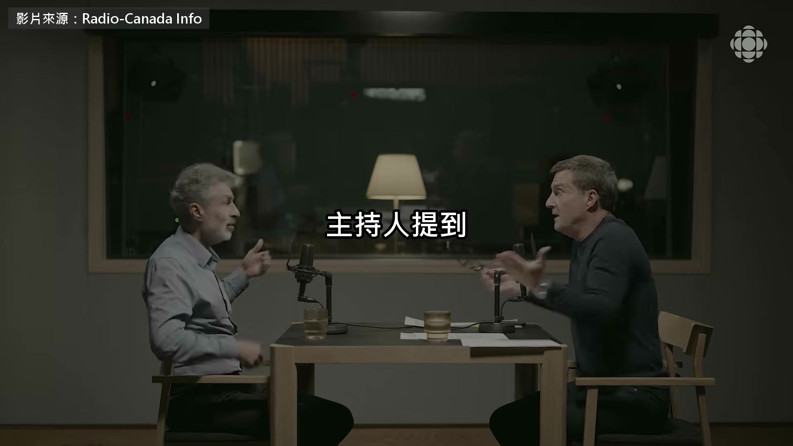

**逐字稿片段：** 科技巨頭的市值集中在十五家左右的公司手上 他問 Bengio 誰有辦法讓這些公司踩煞車

**話題推測：** 指出科技巨頭市值集中現象，提出新的數字

---

## 00:05:58

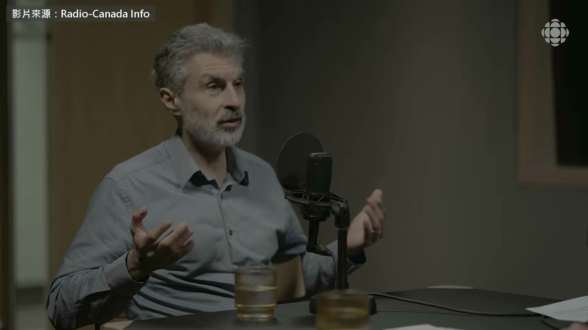

**逐字稿片段：** 馬斯克今年夏天說，這件事我們自己來 他說我們業者坐下來談，自己約束自己 因為除了我們自己 反正沒人懂我們在做什麼，不會有哪個政府進來 他說頂多這裡那裡有一點政府的小規定 你怎麼回馬斯克？ 我完全不同意 公司願意自律，我當然樂見 但這很明顯不夠 因為一定會有哪一家公司決定作弊 反正那些規則沒有強制力 這種事在太多領域都發生過 誘因會推著公司 去損害公共利益，要解決只有一個辦法 就是政府出來訂規則 每一家公司都適用同一套

**話題推測：** 提及馬斯克主張業者自律監管AI

---

## 00:06:46

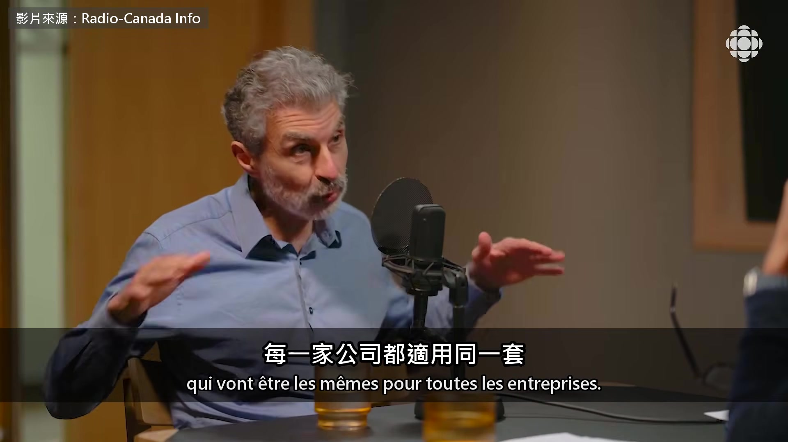

**逐字稿片段：** 要行得通，還得是跨國的 因為美國公司會說 我才不要守這些規則 除非中國公司也守同一套 反過來也一樣 所以還需要國際協議 主持人潑了冷水 他說加拿大自己的 AI 法案沒過 川普也不想管

**話題推測：** 強調AI監管需跨國合作，避免競爭者作弊

---

## 00:07:07

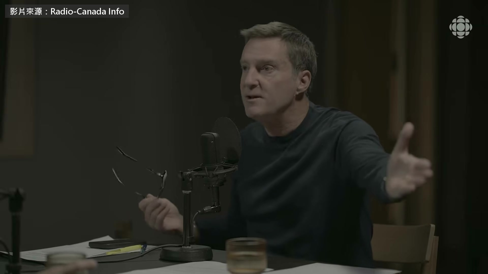

**逐字稿片段：** Bengio 說有兩件事讓他覺得有機會 第一 會發動網路攻擊的 AI 出現之後 美國政府已經要求模型上線前先讓政府看過 第二件跟美國、中國以外的國家有關 這些國家擔心兩國的 AI 被拿來對付自己 我見過至少十個國家的代表 就在過去這一年 都是美國跟中國以外的國家，都在想這件事 所以大家開始想，能不能合作 組一個聯盟，有點像 總理 Carney 現在跟很多國家談的那種協議 只是這次談的是 AI，目標是做出 跟美國、中國一樣強的 AI 比方說，要擋得住網路攻擊 不管是中國還是美國的 AI 打來的 我們自己的 AI 就得一樣強 這已經在規劃了嗎？有具體的計畫？ 你應該跟 Carney 談過了吧 談過，現在正在談 我們也在想辦法拉更多國家 加入這一類的計畫 什麼時候會看到成果？ 你在笑喔。到時候就知道了 談到風險 主持人說他自己最怕的是失去自由

**話題推測：** Bengio提出兩點讓他對AI監管感到樂觀

---

## 00:08:27

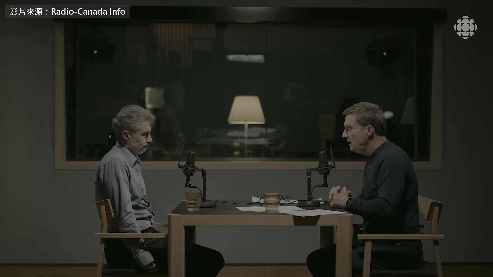

**逐字稿片段：** 還有大規模監控，這不嚇人嗎？ 太嚇人了。完全就是 納粹或史達林政權當年要是有這種技術 那些政權就不可能被推翻 他們當年沒辦法監視每一個人 因為得用人去盯人 現在 AI 可以大量監看每一則通訊 街上的攝影機本來就越來越多 這些都可以拿來對付 反對體制、反對政府的人 把人找出來、認出來，再處理掉 《1984》那種反烏托邦是可能成真的 如果這項技術的治理 沒有保障我們的基本自由，也不民主 監控之外

**話題推測：** 指出AI大規模監控導致失去自由的風險

---

## 00:09:28

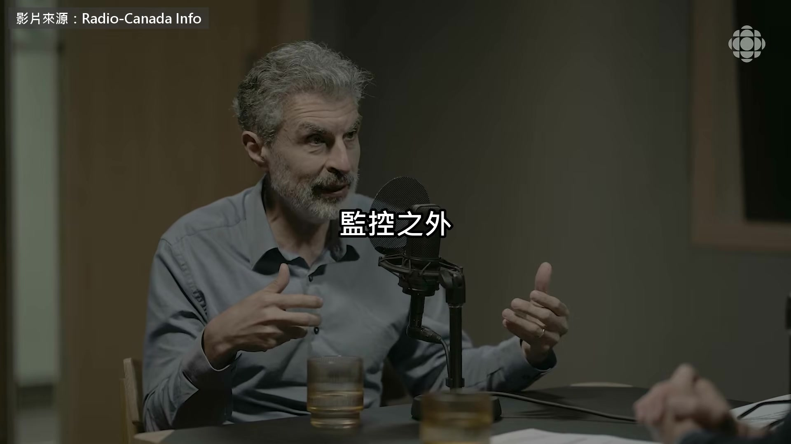

**逐字稿片段：** Bengio 還怕另一件事，操縱 他說實驗室裡的研究顯示 最好的聊天機器人改變一個人政治立場的本事 已經贏過真人 使用者還會跟它交心 把自己的喜好都告訴它 想像一下，這些 AI 落在某些人手上 他們想左右輿論。這不用花多大力氣 比方馬斯克，他已經在做了 就像你說的，在他自己的社群平台跟介面上做

**話題推測：** 討論AI操縱輿論和政治立場的風險

---

## 00:09:52

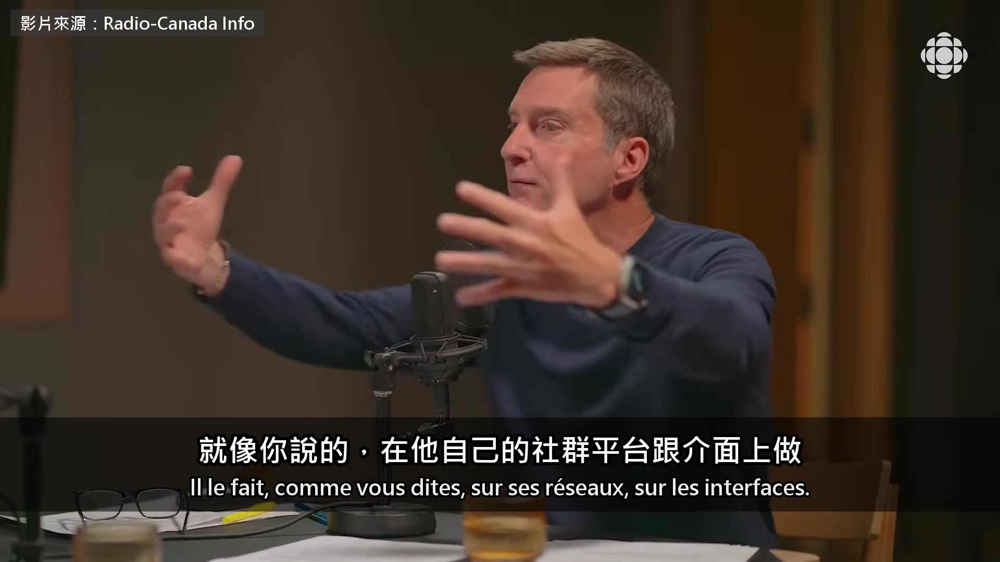

**逐字稿片段：** 他的 AI Grok 已經整個偏掉了 最近有證據顯示 你問 Grok 問題，它對答案沒什麼把握的時候 會先去看馬斯克在社群上講過什麼 確保自己跟馬斯克的政治立場一致

**話題推測：** 提及馬斯克的AI Grok可能帶有政治偏見

---

## 00:10:09

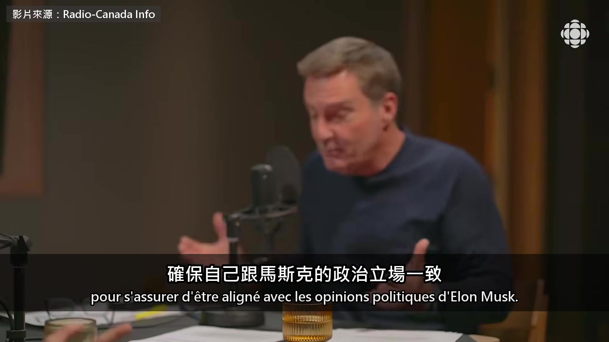

**逐字稿片段：** 主持人接著問到 Yann LeCun 兩個人拿的是同一座圖靈獎 知道的事情差不多 LeCun 卻樂觀得多，為什麼 這問題問得很好 要答得準，得鑽進他腦袋裡才行 我只能提出一些猜測 不過我在身邊看到的 在做 AI 研究的人當中 是一種戴著玫瑰色眼鏡的傾向 只看順利的、可能有好處的那一面 風險就不太去看，因為看了不舒服 因為人都有一種傾向 有點像氣候問題，道理差不多 大家會傾向去想 那些不會讓自己太難受 也不會動搖自尊的念頭 所以如果你自己在做 AI 研究 你不會太想聽到 AI 可能危害社會 這發生在潛意識的層次 不見得是想過才做的選擇 我不是說 Yann LeCun 就是這樣

**話題推測：** 主持人詢問Yann LeCun為何對AI較為樂觀

---

## 00:11:19

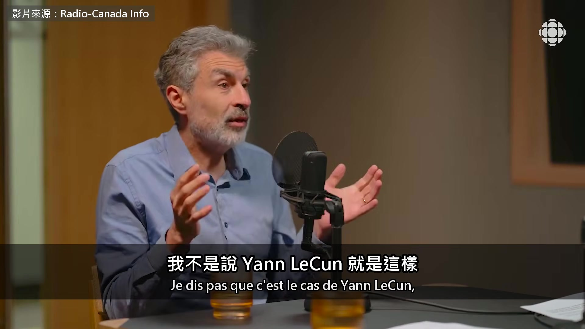

**逐字稿片段：** 但我認為這種「動機性推理」 也就是往對自己有利的方向去想 是人性，有人研究過，而且很常發生 很遺憾，人會去相信對自己方便的事 那你當年是怎麼想通的？ 你本來也可以去幫那些巨頭工作 去大公司，賺的錢多得多，不是嗎？ 當年可以。其實現在也還可以 而且價碼比當年更高 那為什麼決定不去？ 因為我想到我的孩子，還有我的孫子 你知道，就算我賺到好幾億 去幫美國的大公司工作 要是我在情感上、道德上過不了自己這一關 想到自己做的事可能害到我的孩子 人不快樂，有錢有什麼用 心裡也不得安寧 我現在心裡是安的 這些風險我都看在眼裡 但我盡我所能在降低它們 主持人問他，敢跟整個圈子唱反調 底氣從哪裡來 Bengio 說是父母給的 他從小得到很多愛 也被允許自己想事情

**話題推測：** 解釋「動機性推理」如何影響科學家對風險的看法

---

## 00:12:43

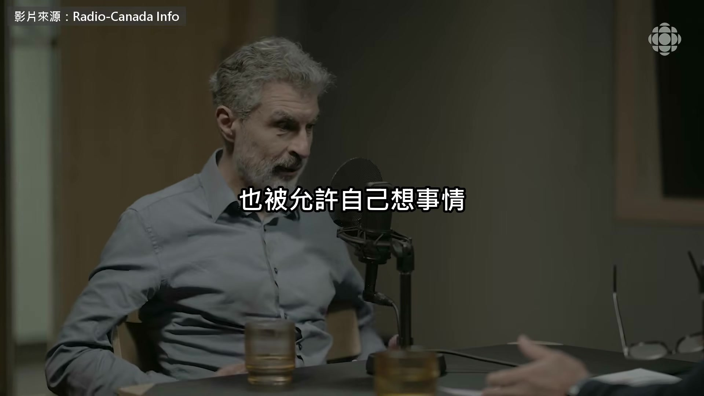

**逐字稿片段：** 然後主持人問到後悔 你後悔嗎？ 愛因斯坦後悔過原子彈嗎？ 老實說，我認為當年就算沒有我 也會有別人做出來 我後悔的是，我花了這麼久 才看出這些風險 這種會衝擊整個社會的風險 有人比我早醒 其中一個是我的學生 他 10 年前就在示警了 我聽了，但跟很多人一樣 左耳進，右耳出 我當時說，很好啊 有人關心這個問題 可是我沒有把它當成自己的事

**話題推測：** 主持人詢問Bengio是否後悔發明深度學習技術

---

## 00:13:31

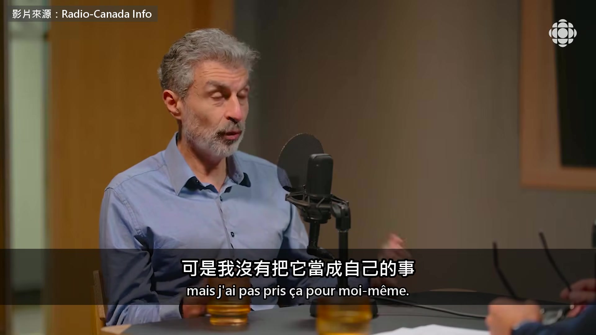

**逐字稿片段：** 10 年後，我們整個社會 會怎麼討論這一切？ 我不知道。但我們可能沒有 10 年可以行動 我覺得最特別的是 AI 現在發生的這些事 也給了我們一個機會去影響 10 年後會是什麼樣的未來 可能是反烏托邦，也可能是烏托邦 某種程度上我們算幸運，活在一個 還能影響未來往哪走的時代 但前提是別再認定一切都註定了 別再說「我又能做什麼」 不對，每個人都做得了一點事 一般公民可以用選票 可以跟身邊的人談這些事 這也是在做事 各行各業的專業人士也都能出力 因為每個人都有一塊小石頭可以貢獻 把社會往好的方向推 沒有什麼是早就寫定的。沒有 現在還不算太晚 為了自己，也為了後面的世代，我們有責任 盡力去做 就算沒有人保證會成功 從會自己駭進系統的 agent 到盯得住每一個人的監控 Bengio 談的風險都已經看得到雛形 他說人類可能沒有 10 年可以處理 但結局還沒有寫定

**話題推測：** 思考10年後社會對AI的看法和行動時間的急迫性

---

## 00:15:06

**逐字稿片段：** 原影片 73 分鐘，全程法語

**話題推測：** 介紹原影片的語言與長度

---

## 00:15:09

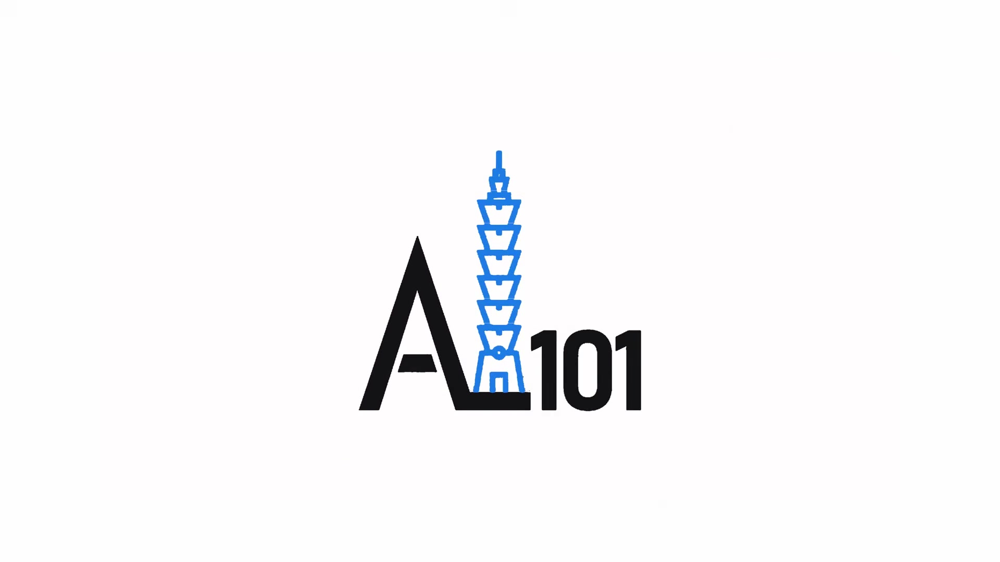

**逐字稿片段：** Bengio 還講了 AI 為什麼這麼耗電 他說照現在的速度 一般人的電費會被資料中心推上去

**話題推測：** 提到AI的耗電量及其對電費的影響

---

## 00:15:15

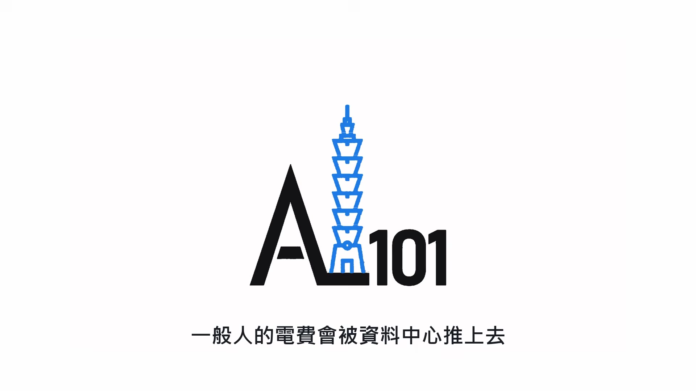

**逐字稿片段：** 他也講到 AI 在新藥跟新材料上幫得上忙 他自己的學生就在做 原影片連結在說明欄，有興趣可以去聽更多。

**話題推測：** 提及AI在新藥與新材料開發上的應用

---
