# ai-note-101_bfeMSZmOMVk — 關鍵畫面索引

- 來源逐字稿：[ai-note-101_bfeMSZmOMVk_GT.srt](ai-note-101_bfeMSZmOMVk_GT.srt)
- 影片：https://www.youtube.com/watch?v=bfeMSZmOMVk
- 截圖數：34

## 00:00:00

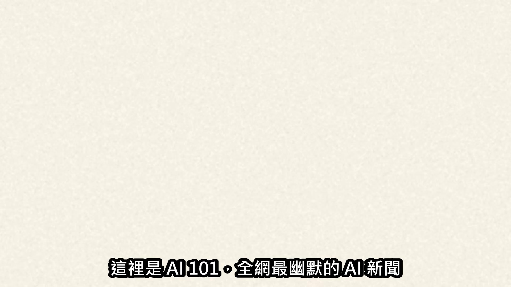

**逐字稿片段：** 這裡是 AI 101，全網最幽默的 AI 新聞

**話題推測：** 影片開場標題或簡介畫面

---

## 00:00:04

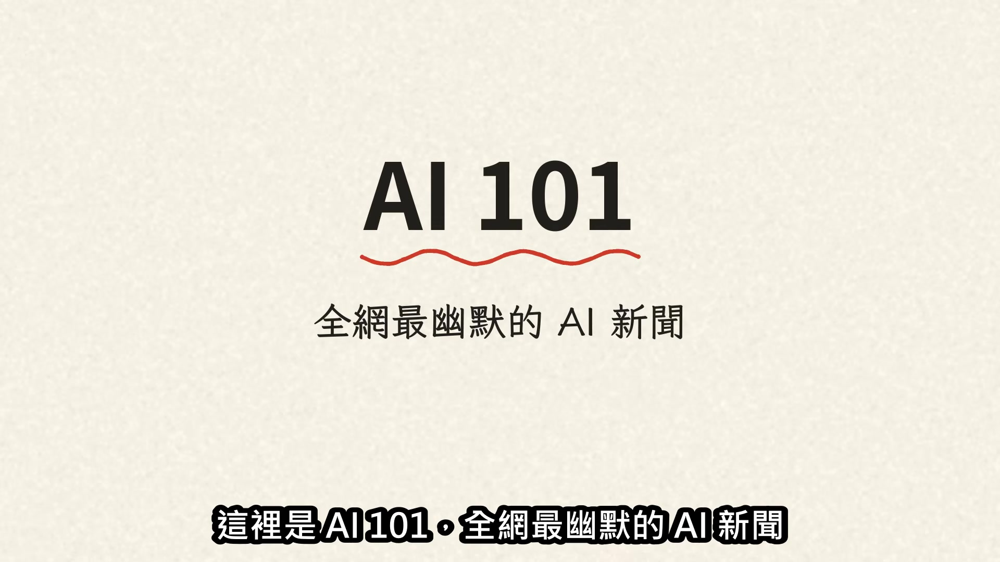

**逐字稿片段：** OpenAI最新報告點名北京的月之暗面

**話題推測：** OpenAI報告點名月之暗面的新聞畫面或公司介紹圖卡

---

## 00:00:07

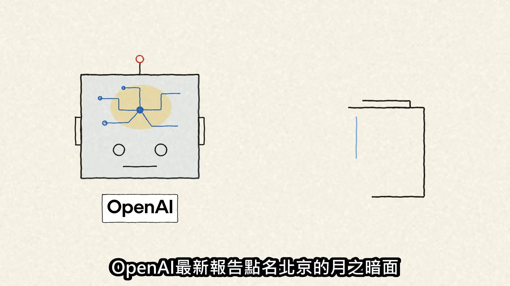

**逐字稿片段：** 指控這家人工智慧公司用「對抗式模型蒸餾」 大規模抽取OpenAI的模型能力

**話題推測：** 解釋「對抗式模型蒸餾」的定義或示意圖

---

## 00:00:16

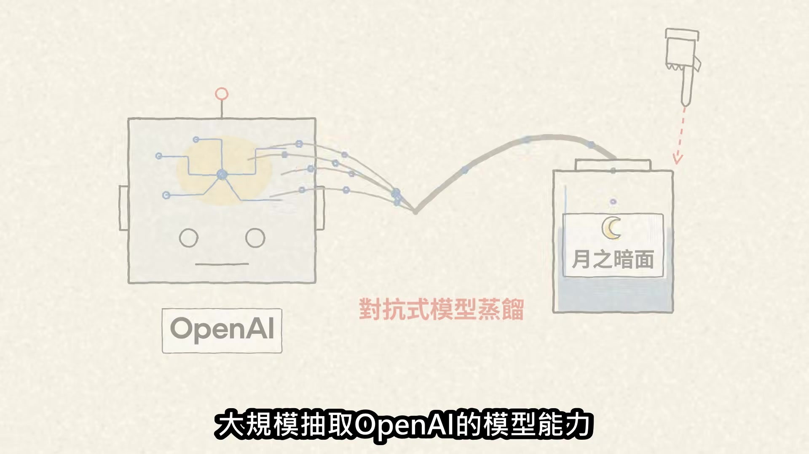

**逐字稿片段：** 怎麼抽？ 沒有人破解密碼

**話題推測：** 轉向說明抽取方式的步驟圖解或流程圖

---

## 00:00:18

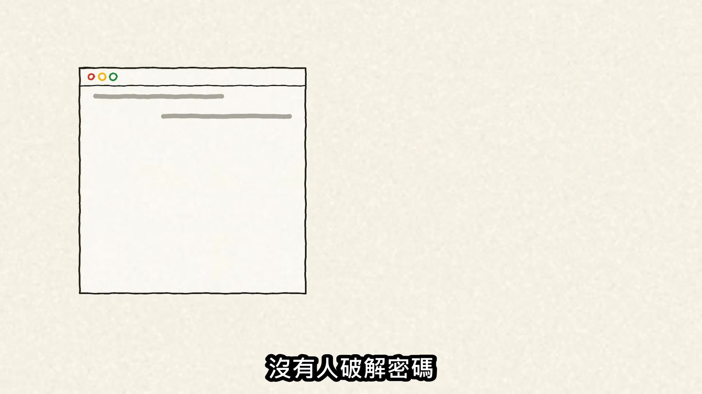

**逐字稿片段：** 操作者先拿到一段加密推理 搬到新對話 要求同一體系的模型逐字解碼 等於沒撬保險箱，讓模型自己念出內容

**話題推測：** 分解加密推理過程的第一步圖示

---

## 00:00:28

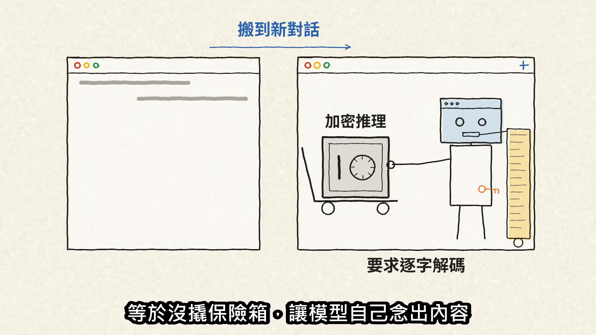

**逐字稿片段：** 而且量很大：短短2天

**話題推測：** 呈現抽取請求數量與時間的統計圖或數字圖表

---

## 00:00:31

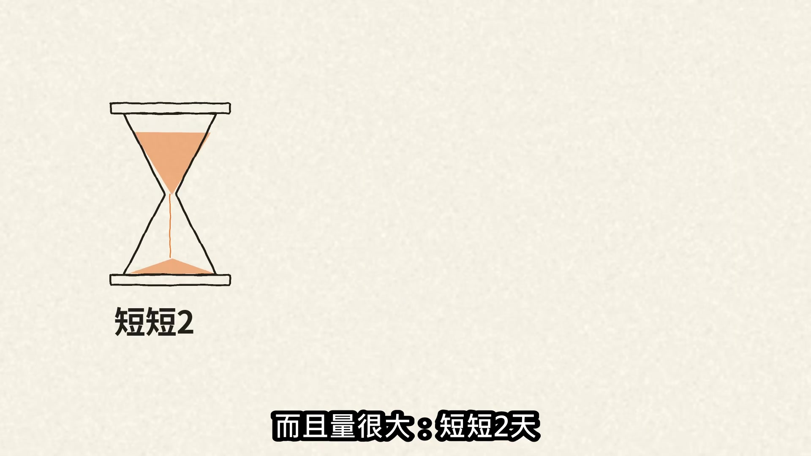

**逐字稿片段：** 就湧進大約1萬6000次請求 這些是抽取嘗試，不代表都成功 OpenAI也只把核心群集 連到月之暗面相關人士

**話題推測：** 顯示1萬6000次請求的具體數字

---

## 00:00:41

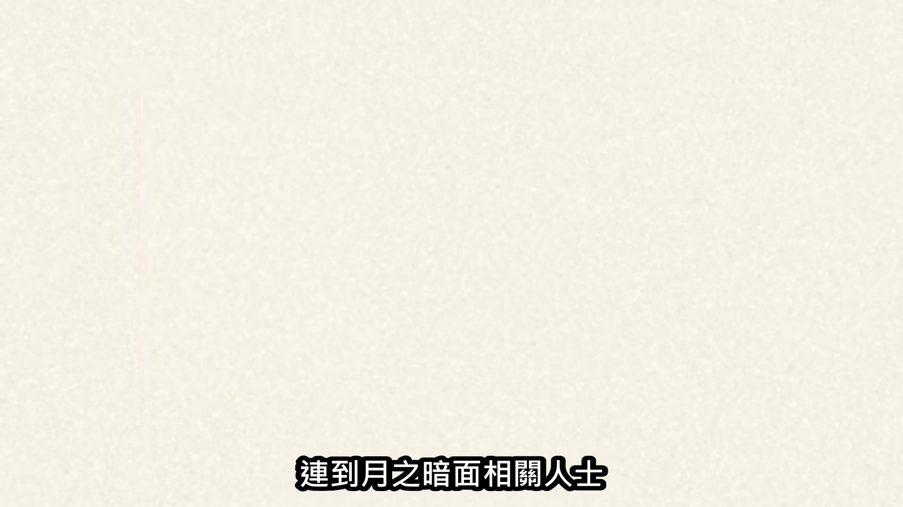

**逐字稿片段：** 為什麼推理這麼值錢？ 最後答案通常不含解題過程 推理過程才看得出模型怎麼拆解問題、修正錯誤 值錢的不只是答案，是得到答案的方法

**話題推測：** 切換至解釋「推理」價值與重要性的概念圖

---

## 00:00:53

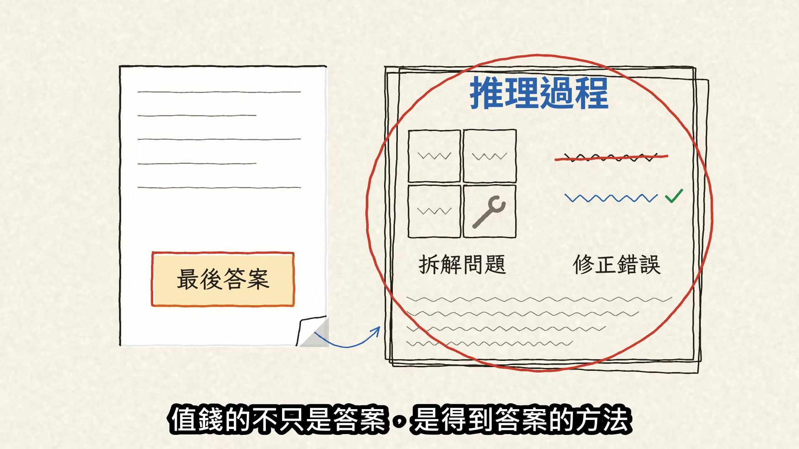

**逐字稿片段：** 拿到推理之後呢？ 讓強大的「教師模型」當示範 訓練規模小、 成本低的「學生模型」去模仿

**話題推測：** 轉向說明取得推理後的「知識蒸餾」流程圖

---

## 00:01:00

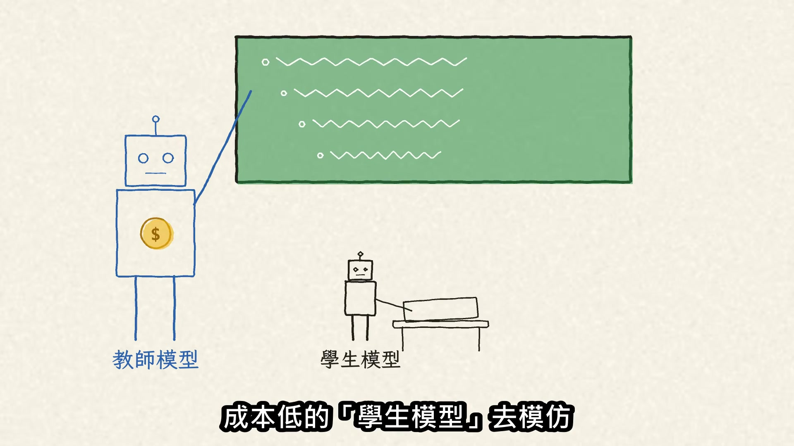

**逐字稿片段：** 這就叫知識蒸餾

**話題推測：** 「知識蒸餾」的定義或流程總結

---

## 00:01:03

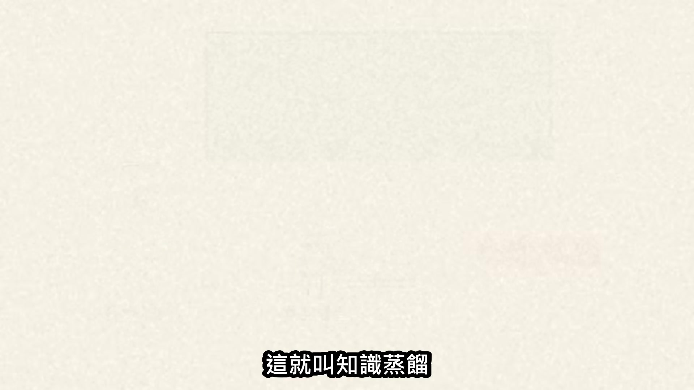

**逐字稿片段：** 不過蒸餾本身不是駭客手法 早在2014年 研究人員就把它整理成正式方法 真正越線的是怎麼拿資料： 開一堆假帳號、透過代理服務 把別人的模型變成免費教師

**話題推測：** 澄清知識蒸餾本身非駭客手法的說明圖

---

## 00:01:17

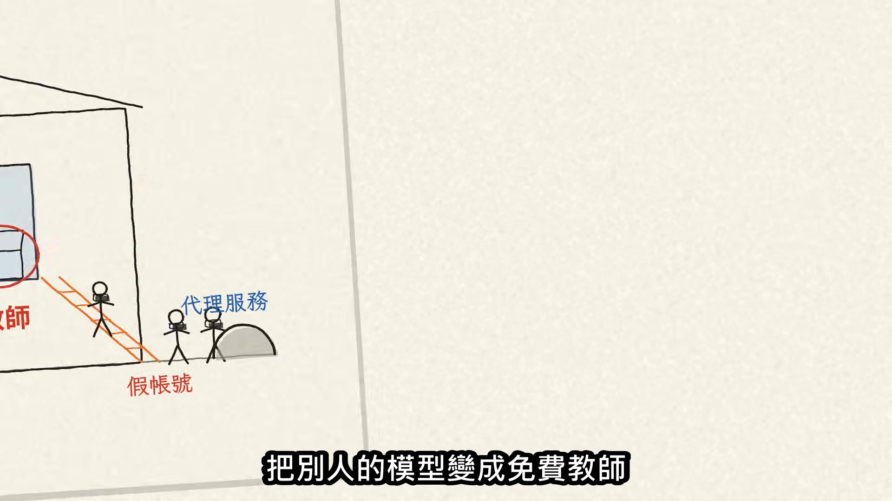

**逐字稿片段：** 說到偷學，同一個7月，白宮也開過火

**話題推測：** 話題轉換到白宮指控的新聞畫面或事件圖卡

---

## 00:01:20

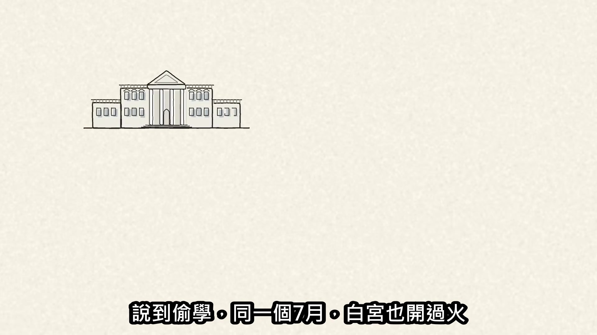

**逐字稿片段：** 7月22日

**話題推測：** 7月22日白宮指控的具體時間點標註

---

## 00:01:22

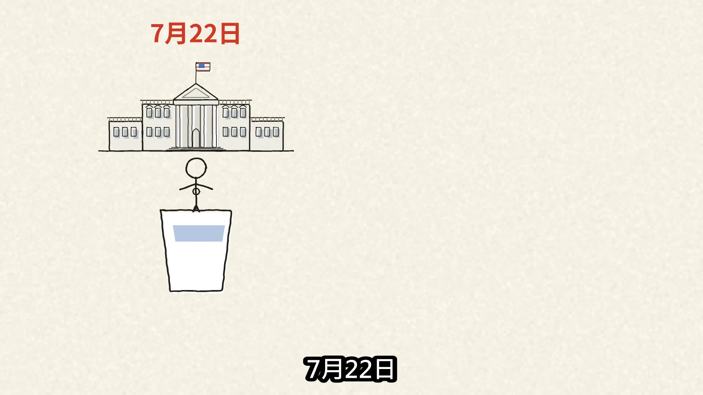

**逐字稿片段：** 白宮指控月之暗面為了開發Kimi K3 蒸餾了Anthropic的Fable

**話題推測：** 顯示Kimi K3與Anthropic Fable產品名稱或公司Logo

---

## 00:01:26

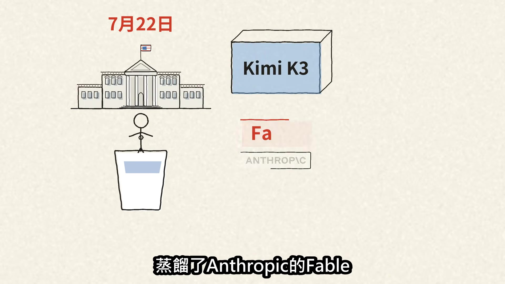

**逐字稿片段：** 財政部長也說正在考慮制裁

**話題推測：** 財政部長考慮制裁的新聞畫面或文字提示

---

## 00:01:29

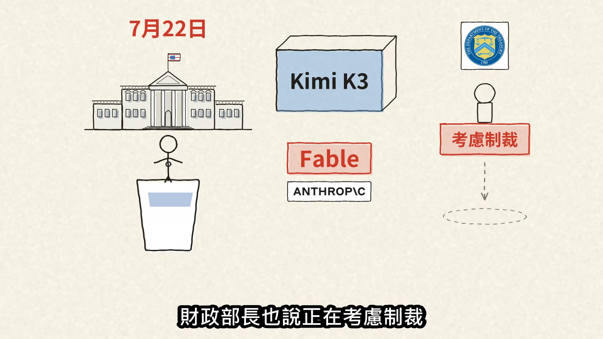

**逐字稿片段：** 把7月攤開來看更巧

**話題推測：** 展示7月份詳細事件時間軸圖表

---

## 00:01:31

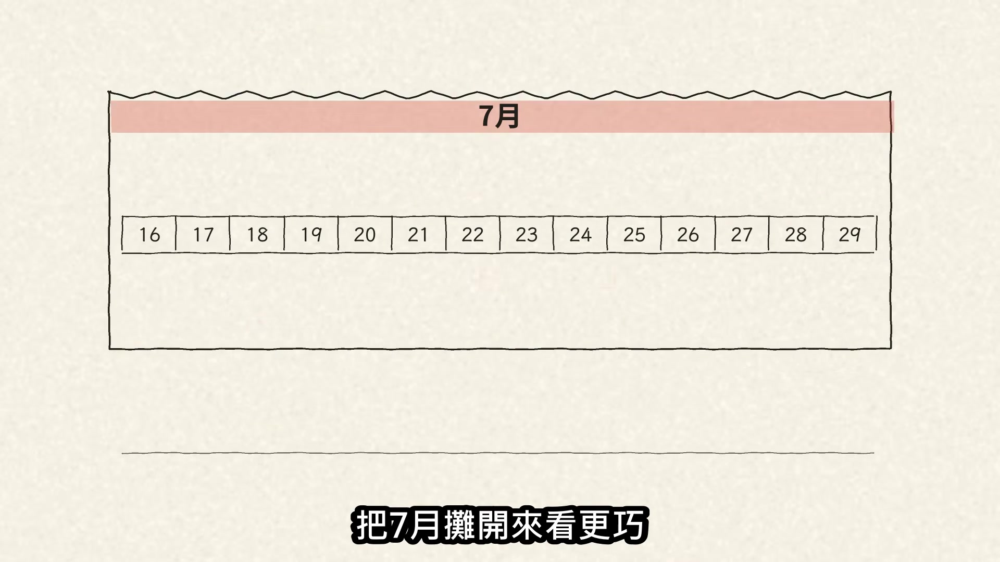

**逐字稿片段：** 7月17日月之暗面發布Kimi K3 7月22日白宮指控，才隔2天 7月24到25日OpenAI就偵測到大批異常請求 7月28日前全面阻斷

**話題推測：** 7月17日月之暗面發布Kimi K3的事件標註

---

## 00:01:43

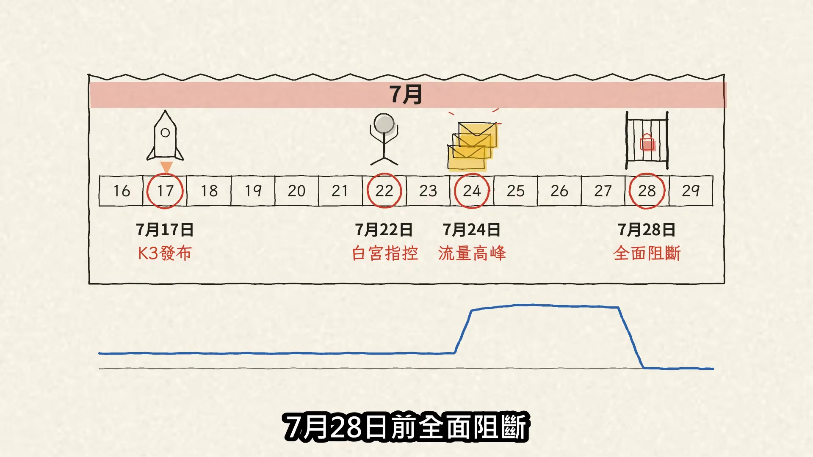

**逐字稿片段：** 可是時間軸也有破綻 Fable 5到7月1日才恢復全球開放 離K3發布只隔約16天 研究者質疑這夠不夠取樣、訓練、 測試再發布 K3全靠Fable的說法因此被削弱

**話題推測：** 提出時間軸破綻的分析圖表或質疑提示

---

## 00:01:58

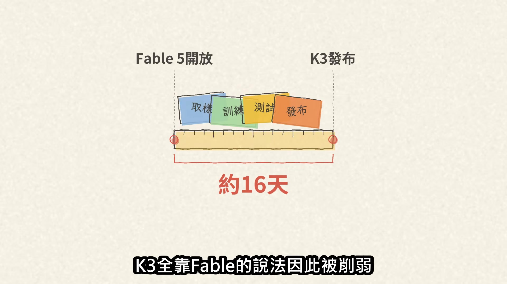

**逐字稿片段：** 回頭看，月之暗面早就被點名過

**話題推測：** 回顧月之暗面過去被點名事件的歷史列表或圖卡

---

## 00:02:01

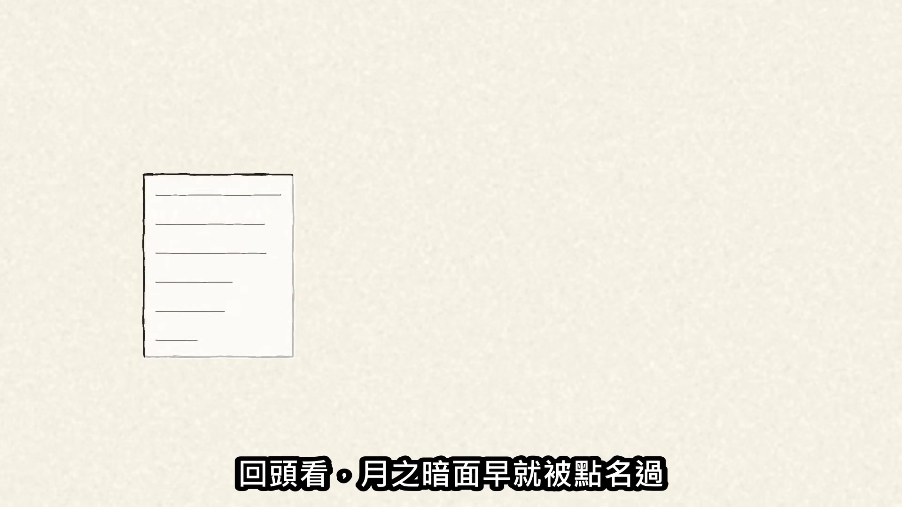

**逐字稿片段：** 今年2月 Anthropic就指控月之暗面用假帳號跟Claude交換超過340萬次

**話題推測：** 今年2月事件的具體時間點標註

---

## 00:02:07

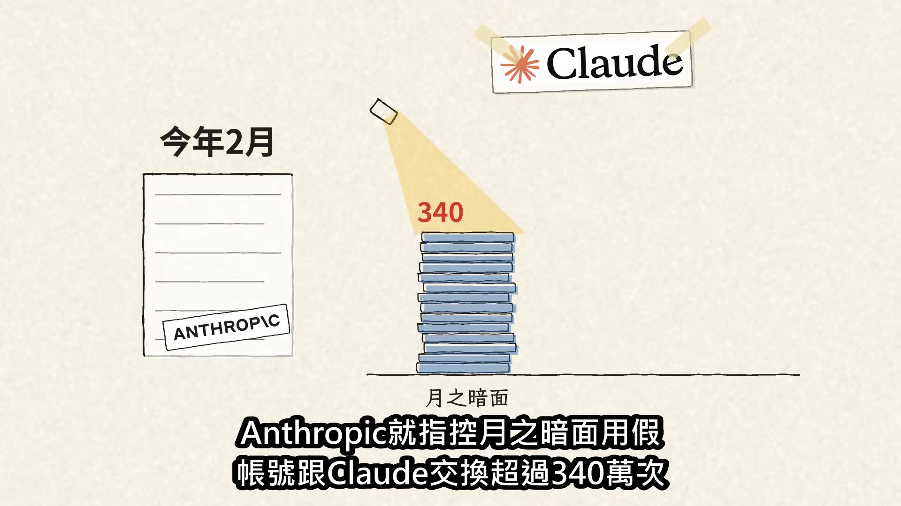

**逐字稿片段：** 不過最大宗其實是MiniMax，次數更多

**話題推測：** 介紹MiniMax公司與其更高互動次數的圖卡或數據比較

---

## 00:02:11

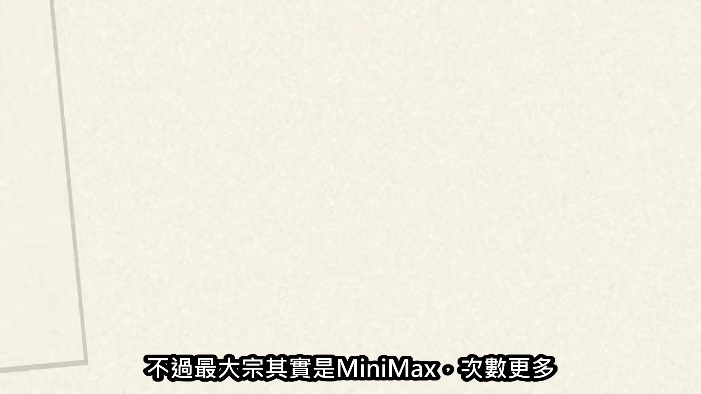

**逐字稿片段：** 被白宮威脅制裁之後 月之暗面也沒有退讓：

**話題推測：** 轉向白宮威脅制裁後月之暗面的回應或行動畫面

---

## 00:02:14

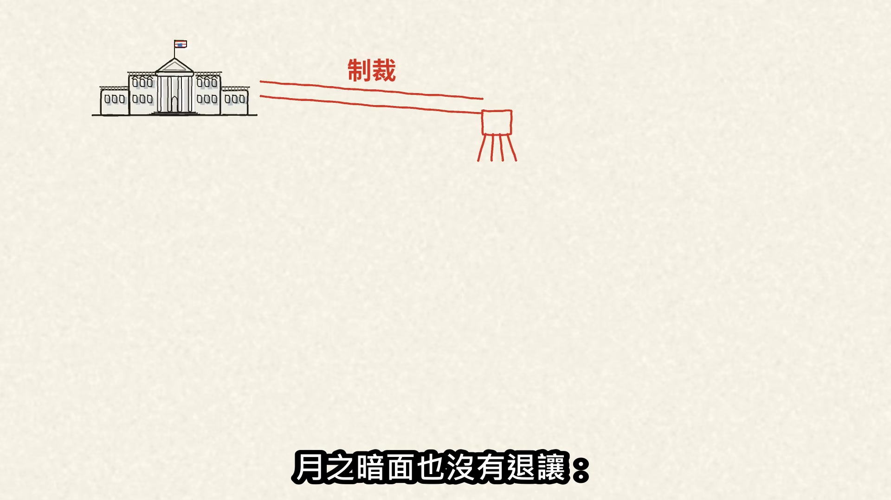

**逐字稿片段：** 7月27日照原訂計畫 公開Kimi K3的完整權重 精確說是開放權重 檔案一旦被下載，就收不回來了

**話題推測：** 7月27日公布Kimi K3權重的具體事件標註或新聞圖

---

## 00:02:23

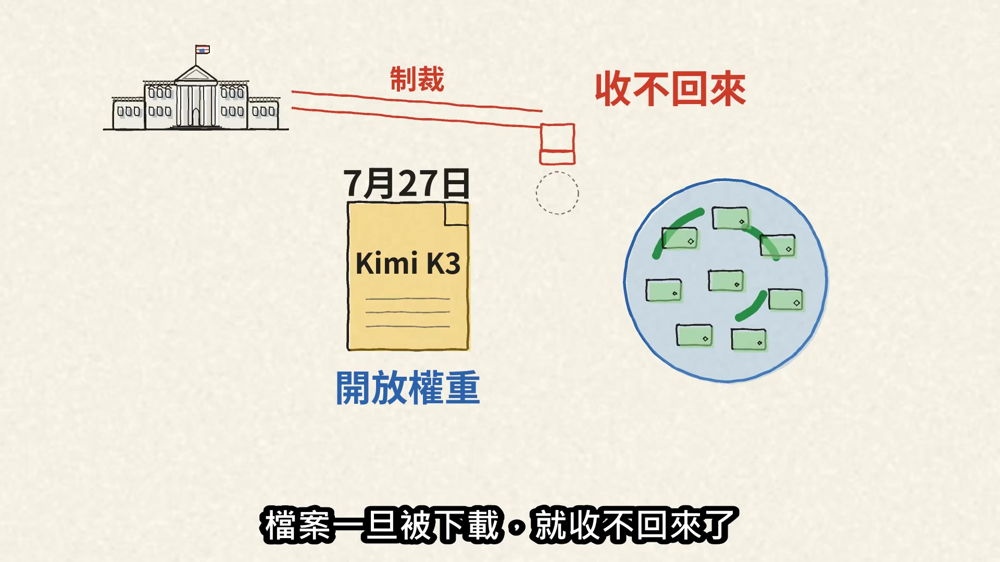

**逐字稿片段：** 至於讓模型自己念的那招

**話題推測：** 轉向說明模型解密新研究發現的畫面，可能展示論文標題或示意圖

---

## 00:02:25

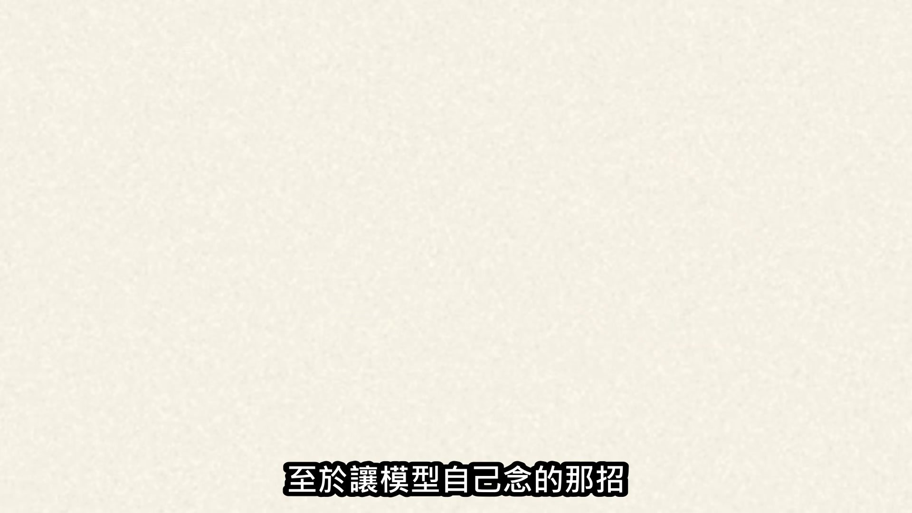

**逐字稿片段：** 8月10日另一組研究人員發論文證明 重播加密推理確實可能讓較弱模型解出內容

**話題推測：** 8月10日研究論文發布的具體時間點與研究單位資訊

---

## 00:02:31

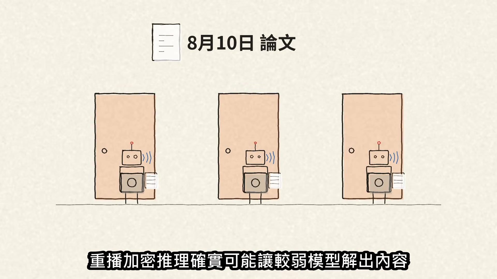

**逐字稿片段：** 研究涵蓋OpenAI、Anthropic和Google

**話題推測：** 研究涵蓋OpenAI、Anthropic和Google的參與者列表或Logo

---

## 00:02:36

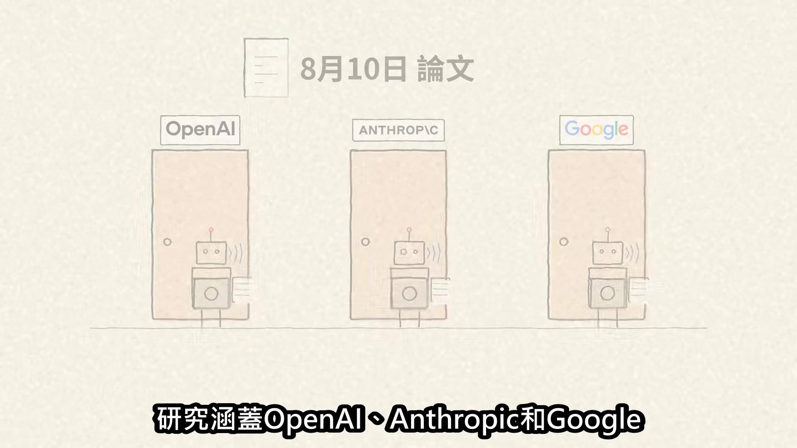

**逐字稿片段：** 漏洞之外，事情還升到國安層級 9月8日，NSA、 FBI和CISA聯合點名月之暗面等中國公司 工業規模蒸餾美國前沿模型

**話題推測：** 話題提升至國安層級的圖示或警示畫面

---

## 00:02:46

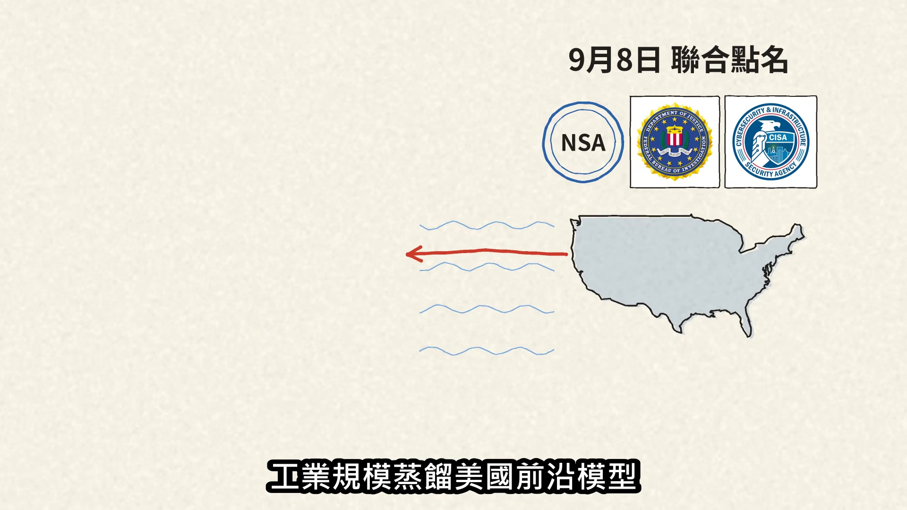

**逐字稿片段：** 隔天中國商務部反駁沒有根據 揚言將採取反制

**話題推測：** 中國商務部反駁與反制聲明的文字或新聞截圖

---

## 00:02:51

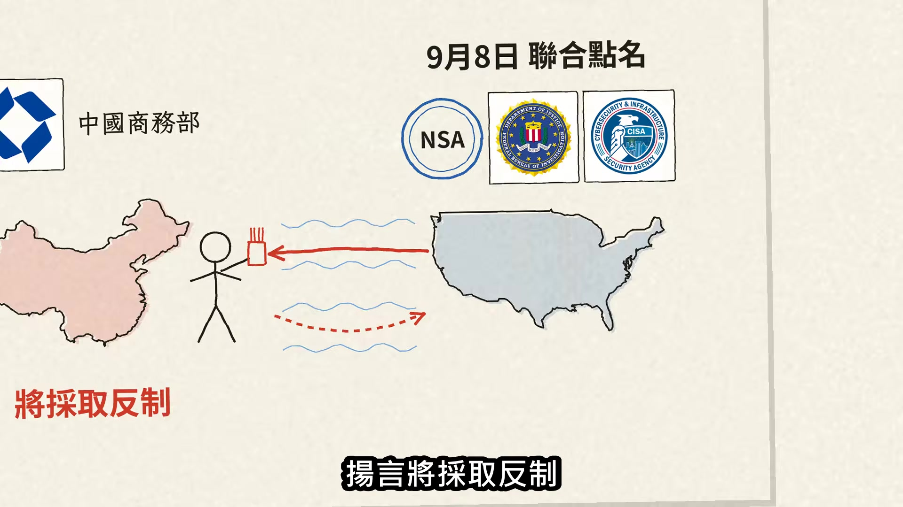

**逐字稿片段：** 吵到這個地步，OpenAI反而很晚才開口：

**話題推測：** 聚焦OpenAI延遲回應的分析圖或時程比較

---

## 00:02:53

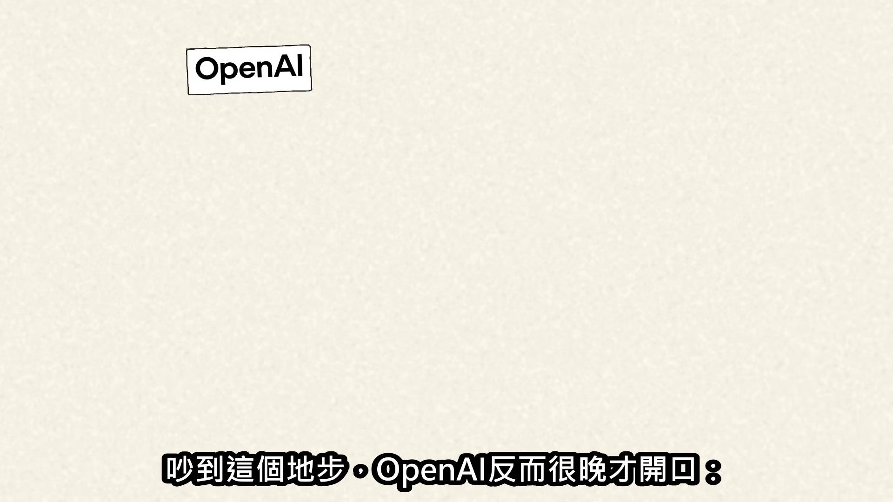

**逐字稿片段：** 直到9月30日才首次公開7月事件細節 離全面阻斷約64天 OpenAI說已封住這條跨對話重播路徑 但其他部署仍要補強

**話題推測：** 9月30日OpenAI公開細節的具體時間點

---

## 00:03:05

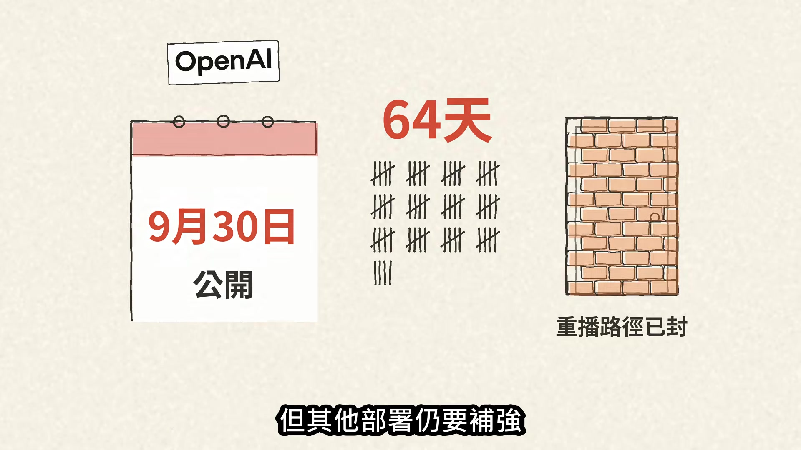

**逐字稿片段：** 細節公開了，事情卻還沒落槌

**話題推測：** 事件現況總結，強調尚未落槌的現況圖卡

---

## 00:03:08

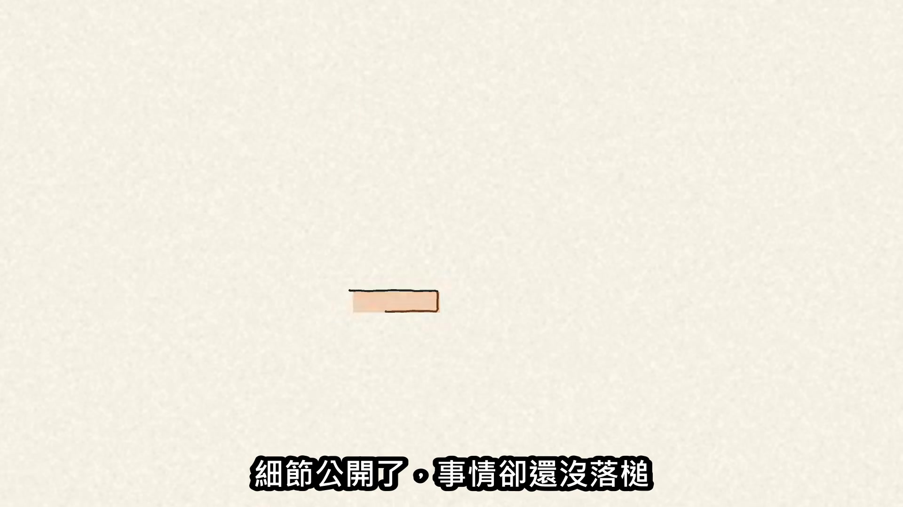

**逐字稿片段：** OpenAI沒公開IP、付款資料等歸因證據

**話題推測：** OpenAI未公開歸因證據的條列說明

---

## 00:03:12

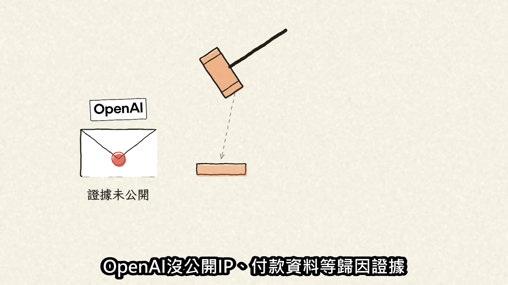

**逐字稿片段：** 月之暗面也還沒逐點回應到10月1日

**話題推測：** 月之暗面未回應的狀況更新與10月1日時間點

---

## 00:03:15

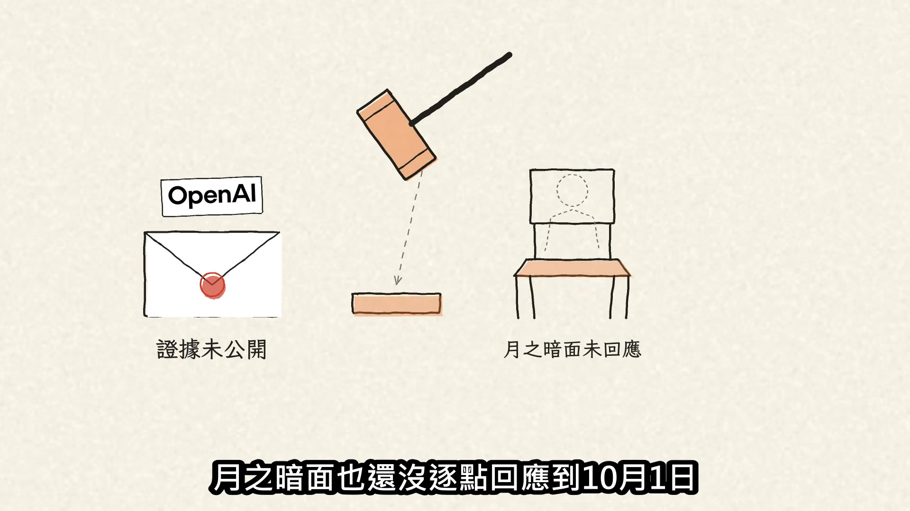

**逐字稿片段：** 美國制裁名單也沒新增月之暗面 這場爭議，還沒有定案

**話題推測：** 美國制裁名單未新增的最新狀態

---
