# ai-note-101_cMzh-zJp4ss — 關鍵畫面索引

- 來源逐字稿：[ai-note-101_cMzh-zJp4ss_GT.srt](ai-note-101_cMzh-zJp4ss_GT.srt)
- 影片：https://www.youtube.com/watch?v=cMzh-zJp4ss
- 截圖數：25

## 00:00:00

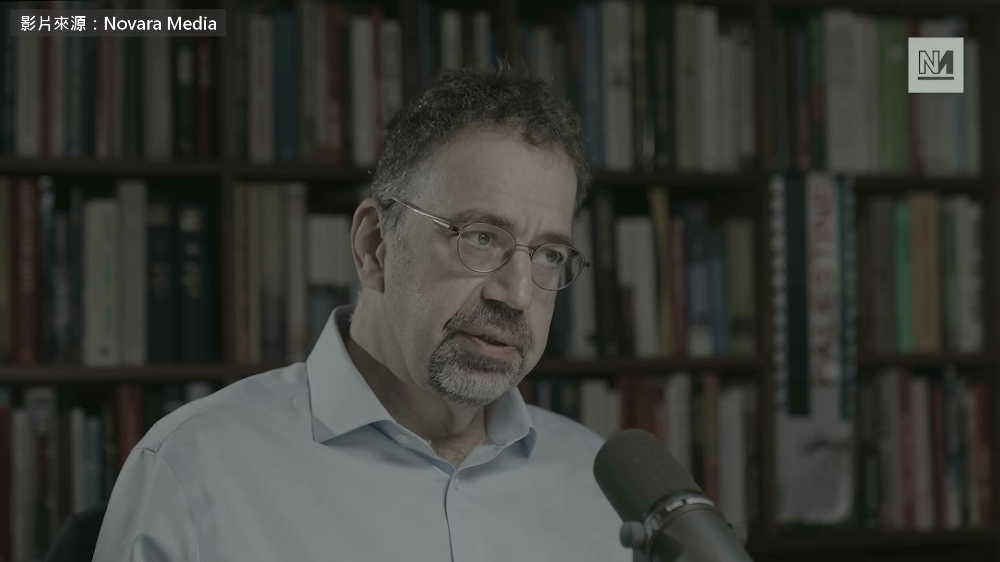

**逐字稿片段：** 上個月我們剪過諾貝爾經濟學獎得主 Daron Acemoglu 的訪談 他說決定 AI 往哪走的 是一小群讀同樣科幻小說的人 這一場是 9 月 20 號上架的 他拿美國跟中國來比 主持人指出 他談自由民主的新書完全沒寫中國 其實中國可以拿來當成自由民主以外的另一種模式來談 不過我還是決定，不要讓論證變得更長、更複雜 但沒錯，我認為只有中國這個模式 威權體制還沒有完全爛掉 我推測，中國有些部分運作得還不錯 但我認為，這有一部分也是自由民主國家自己的弱點 技術上沒能跟上中國，製造業的底子也沒能跟上中國

**話題推測：** 介紹諾貝爾經濟學獎得主 Daron Acemoglu 及其訪談主題

---

## 00:00:54

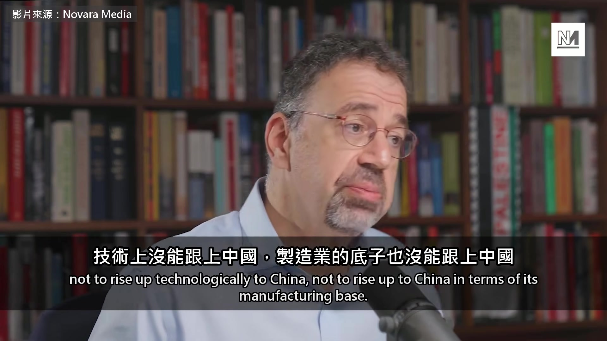

**逐字稿片段：** 主持人接著引了一個說法

**話題推測：** 主持人引述一個新說法

---

## 00:00:56

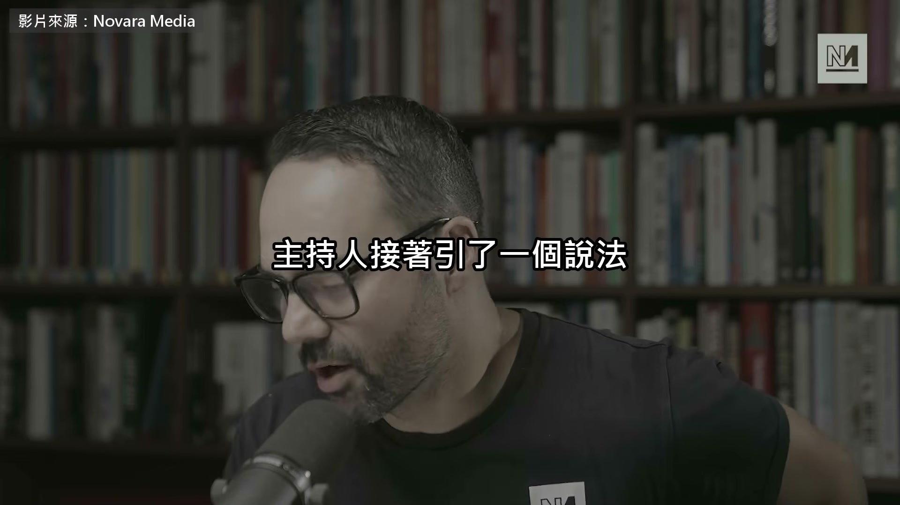

**逐字稿片段：** 西方過去 150 年的好日子 靠的是技術跟經濟上領先全世界 現在這個領先沒了 不，技術領先非常重要，而我們確實正在失去它，這完全是事實 但某種程度上，我認為自由民主的政府 更有機會把技術領先拿回來

**話題推測：** 提及西方過去150年的歷史與技術領先

---

## 00:01:16

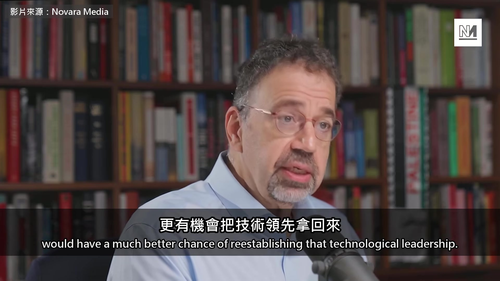

**逐字稿片段：** 話說回來，我們為什麼會失去技術領先？

**話題推測：** 提出問題：西方為何失去技術領先？

---

## 00:01:20

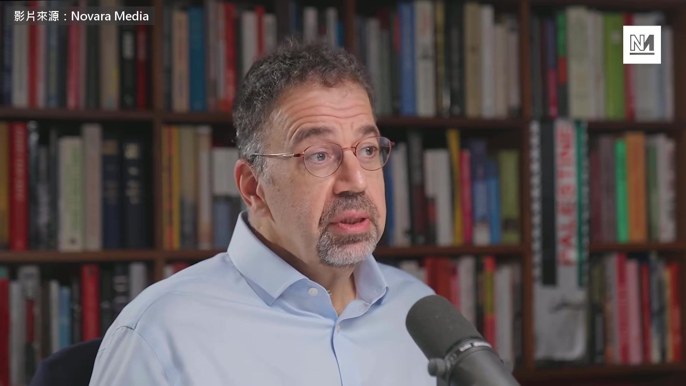

**逐字稿片段：** 第一，中國有些政策做得很好 撐起了它的製造業跟經濟 這是他們的功勞，但有很大一部分是我們自找的 西方各國政府一口氣撤掉了貿易保護 讓很便宜、有時候還有補貼的中國製造品 湧進市場，摧毀了自己的產業 在 AI 跟科技上，我們把所有資源都押在 AGI 還有那些非常複雜、非常龐大的基礎模型上 結果你老是聽到一句話，「美國的 AI 領先中國」

**話題推測：** 闡述中國在政策方面做得好的第一點

---

## 00:02:12

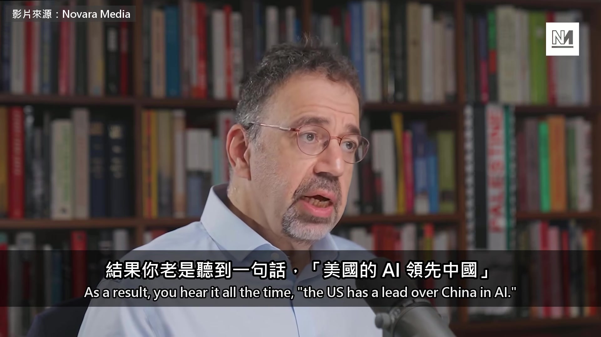

**逐字稿片段：** 我們在大型語言模型上，大概領先 6 到 16 個月

**話題推測：** 提出美國在大型語言模型上領先的具體時間數字（6到16個月）

---

## 00:02:19

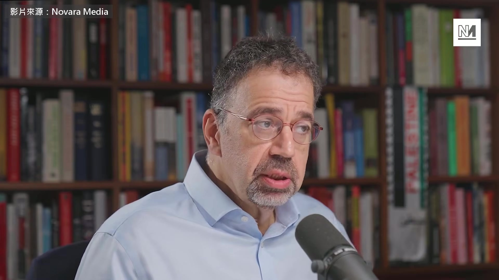

**逐字稿片段：** 但你去看科技的…其他每一個面向，中國都做得很好 他們領先美國、英國、大部分的歐洲，應該說整個歐洲 把機器人跟 AI 整合進生產流程這件事 把 AI 用進電商跟直接面對顧客的產業，他們也領先 而且他們在兩件非常關鍵的事情上，投入了大量資源 一個是製造業的底子。他們有龐大的製造業，帶來很多邊做邊學的機會 也有很多機會把 AI 跟技術用來提高生產力 另一個是他們有一大批技術非常好的工程師 要把 AI 整合進生產流程的每一個環節，這一點太重要了 這些本來都是我們也做得到的事 美國沒有投資在工程人才上 其實我認為，移民帶來的技術對美國非常關鍵 是美國能繁榮的一大助力 但依賴移民工程師，等於讓美國的政策制定者有了藉口 不必投資自己的教育體系

**話題推測：** 轉向討論中國在其他科技面向的優勢

---

## 00:03:43

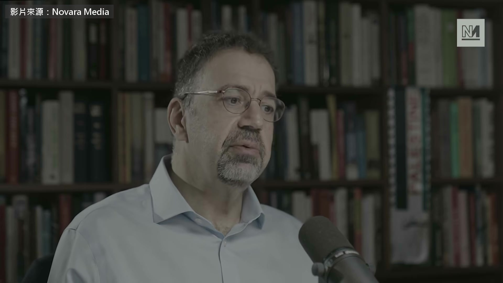

**逐字稿片段：** Acemoglu 分析過蘇聯 蘇聯的經濟一度表現不錯，後來垮掉 他認為是因為體制做不到創造性破壞

**話題推測：** 引述Acemoglu對蘇聯經濟崩潰的分析

---

## 00:03:50

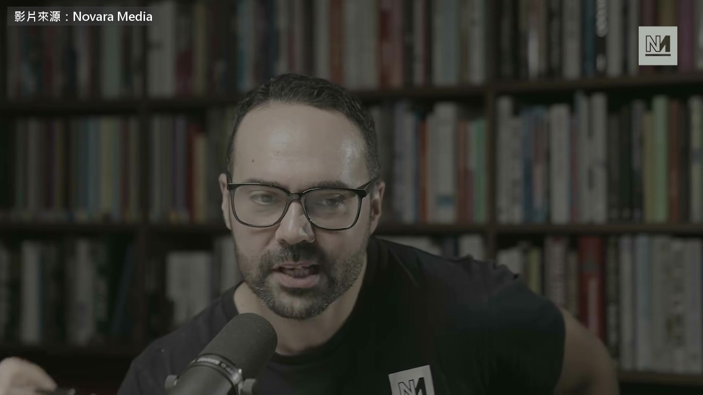

**逐字稿片段：** 主持人拿中國反問他 那為什麼中國看起來，比現在的資本主義經濟體更會做創造性破壞？ 如果你把創造性破壞看成一個分散的過程 新點子從底下冒出來，挑戰既有的想法、做法跟策略 那中國其實沒那麼厲害，這個過程還是被管得很多 中國真正做得非常好的，是把已經有的 技術路線跟業務發展得極度到位

**話題推測：** 主持人用中國例子反問Acemoglu關於創造性破壞

---

## 00:04:38

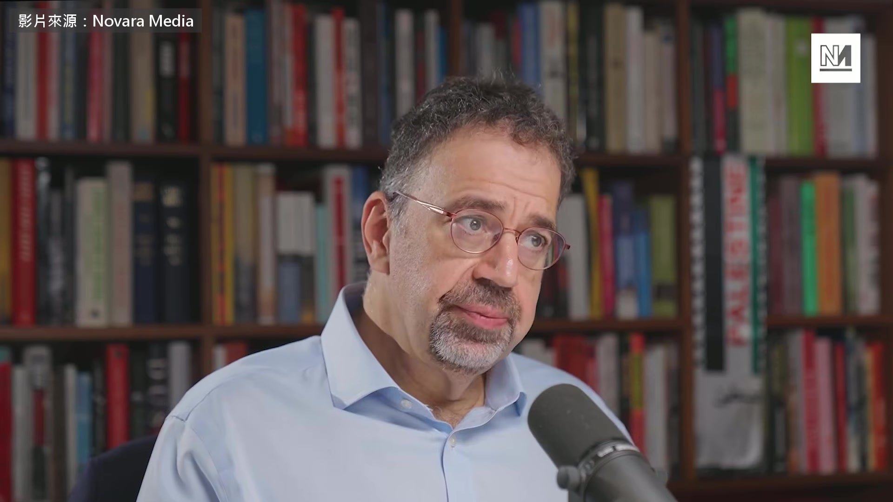

**逐字稿片段：** 比如你看他們的 AI 產業

**話題推測：** 以中國的AI產業為例說明其優勢

---

## 00:04:41

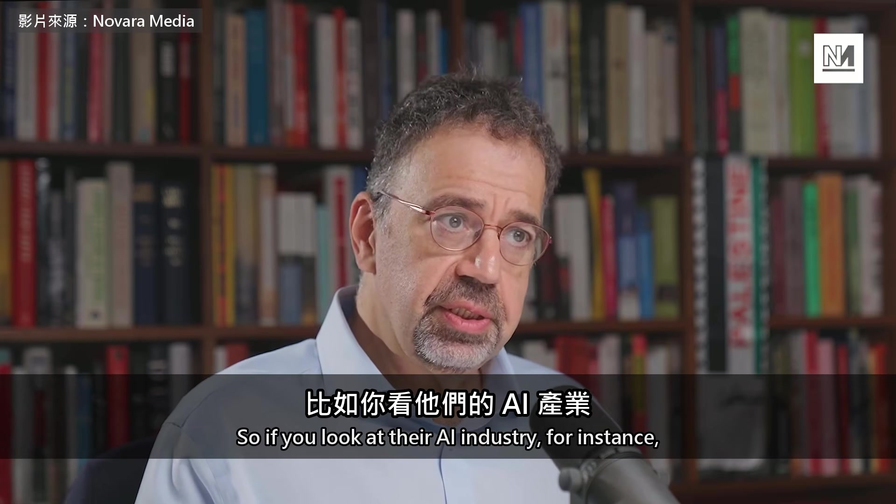

**逐字稿片段：** 他們做出 DeepSeek、Kimi 這些模型 是工程上的奇蹟 怎麼把現有的方法用得又省錢，他們做到了極致 好，也許他們用了一些蒸餾技術 去反推更先進模型的部分權重（蒸餾是拿別的模型的回答當教材來訓練自己的模型，拿不到對方的權重） 但他們真的做得又便宜又漂亮

**話題推測：** 提及中國的DeepSeek、Kimi等具體AI模型

---

## 00:05:06

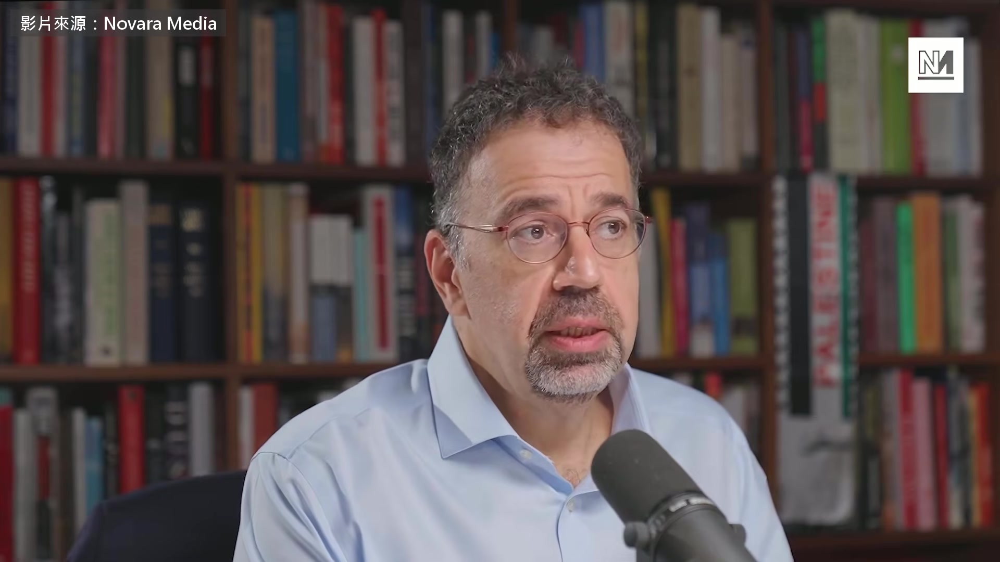

**逐字稿片段：** 你再看他們的製造業，同樣是工程上的奇蹟 每一個環節都在想辦法最佳化 所以站在最前面的，是比亞迪、鴻海 鴻海是台灣公司但在中國有大量業務 還有華為 因為它們都是大公司 新血進來挑戰整個體系這件事，還是不怎麼活躍 這會不會變成 中國經濟往後發展的障礙，還要再看

**話題推測：** 轉向討論中國製造業的工程奇蹟

---

## 00:05:43

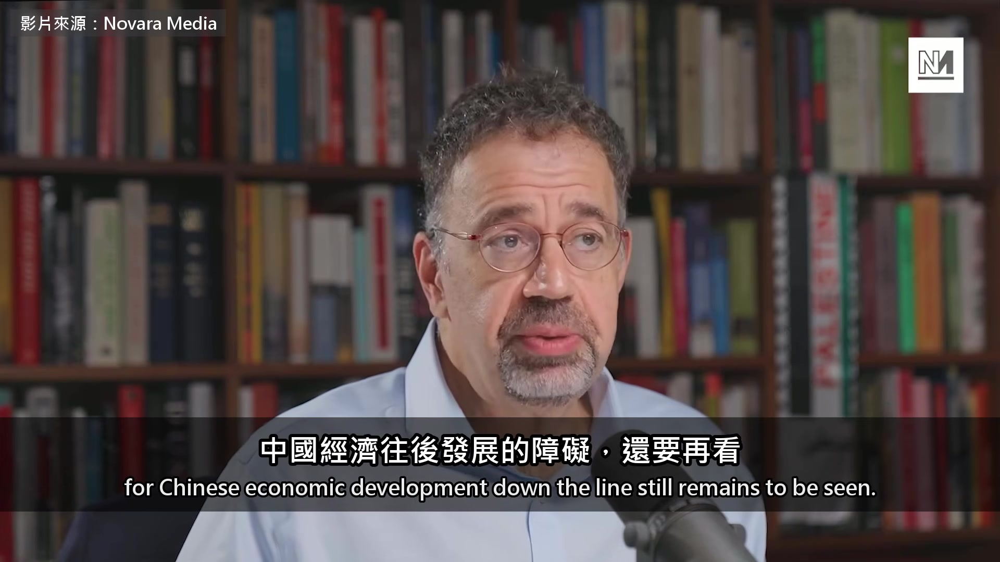

**逐字稿片段：** 中國的人均 GDP 還沒到西歐、英國或美國的水準 但正在快速接近

**話題推測：** 比較中國人均GDP與西方國家水準

---

## 00:05:52

**逐字稿片段：** 訪談最後，主持人問他 英國的生產力從 2008 年到現在幾乎沒有成長 該怎麼辦

**話題推測：** 訪談結束，主持人提出關於英國生產力的問題

---

## 00:05:58

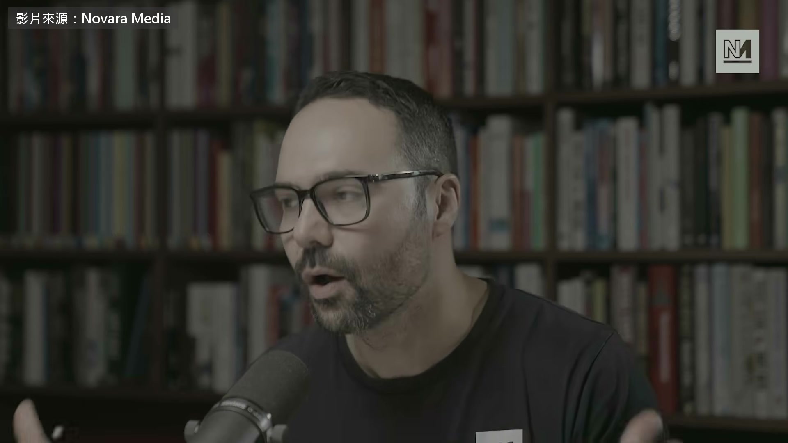

**逐字稿片段：** 他先講了幾個原因，撙節、脫歐 中國的競爭

**話題推測：** 列舉導致英國生產力問題的原因：撙節、脫歐、中國競爭

---

## 00:06:03

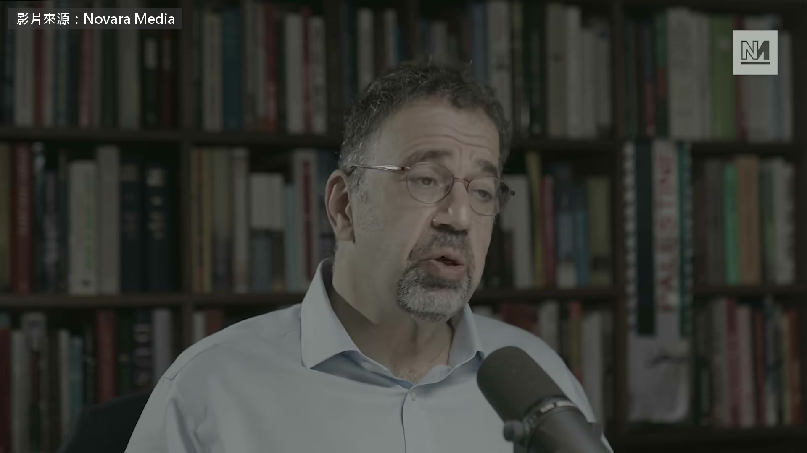

**逐字稿片段：** 而我認為 AI 其實可以帶來一些機會 這不是說英國該跟著美國走，正好相反

**話題推測：** 提出AI為英國帶來機會的觀點

---

## 00:06:14

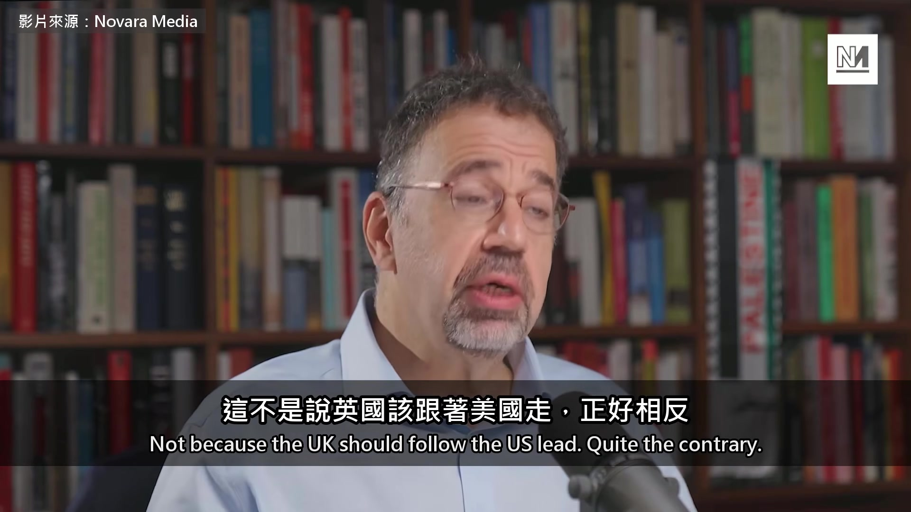

**逐字稿片段：** 我認為英國可以專攻開發有用的應用 用更有遠見的方式，把 AI 整合進我們的生活 跟生產流程，做得比美國公司更好 更以勞工為中心的… 以勞工為中心、親勞工的 AI。對，親勞工的 AI，這可以是英國的未來

**話題推測：** 具體建議英國專攻開發有用應用

---

## 00:06:34

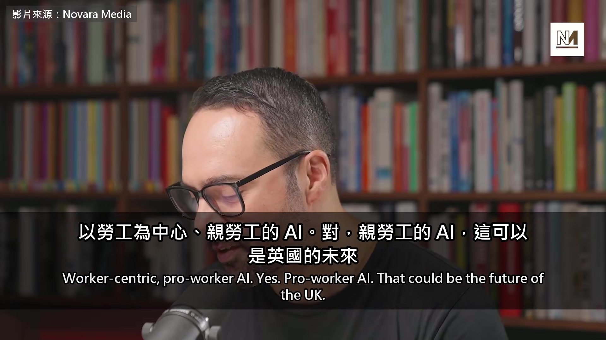

**逐字稿片段：** 所以這就是你開的政策處方。假設 Andy Burnham 的政策幕僚正在聽 你會跟他們說什麼？ 親勞工的 AI，要怎麼做？ 我認為還是要從應用開始，伸手就摘得到的果子太多了

**話題推測：** 針對特定政治人物 Andy Burnham 的政策幕僚提出假設性建議

---

## 00:06:47

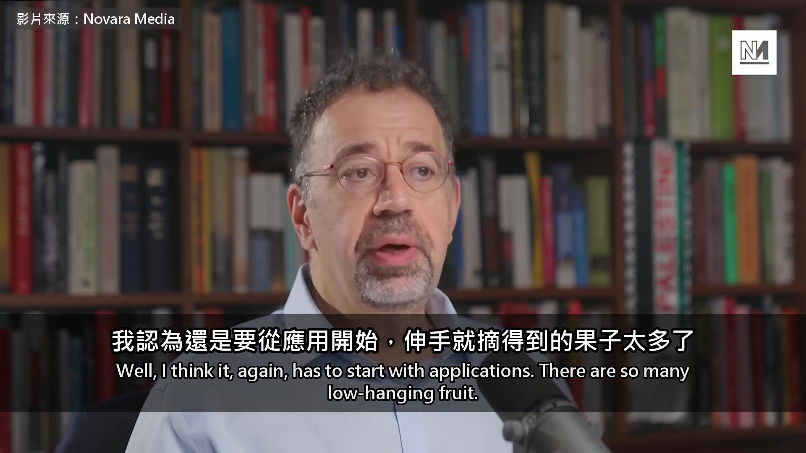

**逐字稿片段：** 護理師、電工，我們能幫他們做的事太多了 老師、科學家，我們能幫他們做的事太多了 不去取代他們，不去模仿人的才能 而是給他們更好的工具，擴大他們的專業，讓他們做到以前做不到的事 做更有創意、更創新的事 英國需要更多創新，全世界都需要 因為氣候變遷、人口老化，還有全球勢力的消長 而在可預見的未來，創新還是一件 需要人才的事 所以問題是，我們怎麼給這些人才更好的工具 對，這一點在書裡也看得很清楚 你談了非常多自動化，但重點不是取代人 是增強人的能力，把生產力的提升拉到最大 沒錯 這一點我們真的已經忘了，對吧？ 百分之百。這就是 AGI 這條路線造成的 AGI 這條路線不知道怎麼辦到的，讓所有人都相信 AI 最好、唯一、而且必然的用法 就是把它做得越來越像人，直到它比人更強

**話題推測：** 舉例護理師、電工等能受益於AI的職業

---

## 00:07:51

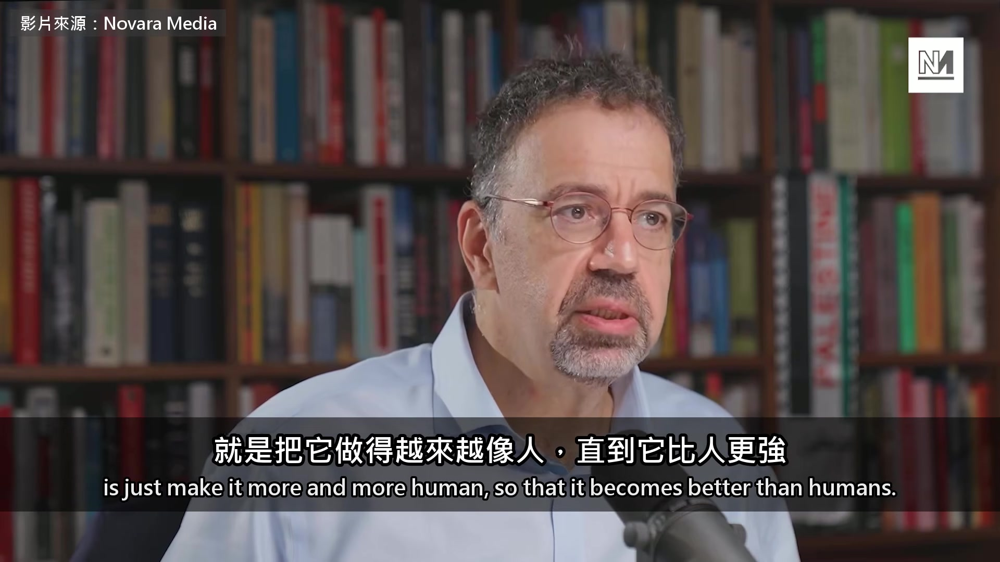

**逐字稿片段：** 最後一個問題，為什麼這麼多人買單？

**話題推測：** 提出關於AGI敘事被廣泛接受的原因問題

---

## 00:07:55

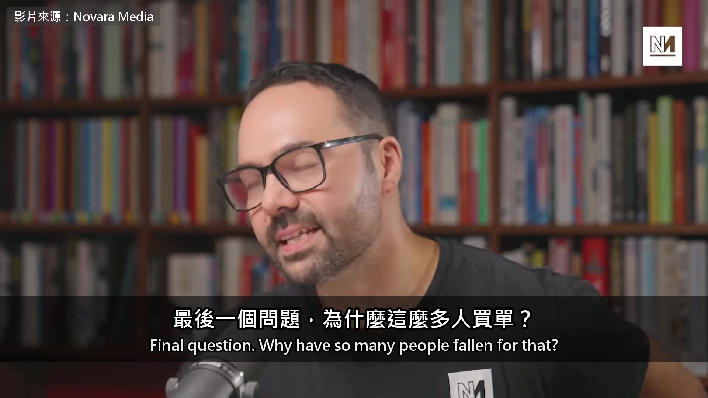

**逐字稿片段：** 這是華府史上最厲害的一次遊說 還是背後有更深的原因？ 我想一部分是歷史 科技業本來就在往那個方向走

**話題推測：** 提出第一點原因：華府史上最強遊說

---

## 00:08:06

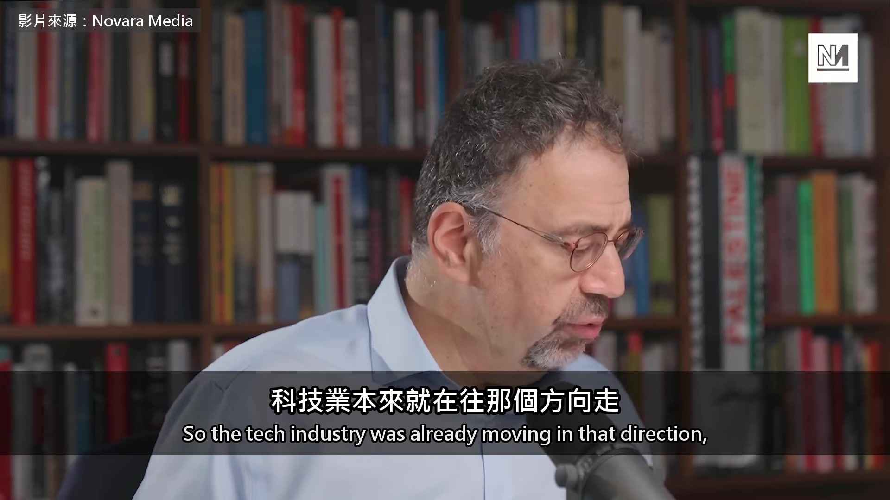

**逐字稿片段：** 微軟、Google、Oracle 都是 靠賣自動化工具給企業才變成巨頭 另一部分是科幻小說 真的，我認為 AI 這個領域從一開始就深受科幻小說影響 科幻小說的固定戲碼，就是機器變得跟人一模一樣 然後接管一切、威脅人類 這是我們想像出來的，從 1950 年代就一直在講 而我們越是想要它，就越是把它變成現實

**話題推測：** 列舉微軟、Google、Oracle等科技巨頭的例子

---

## 00:08:43

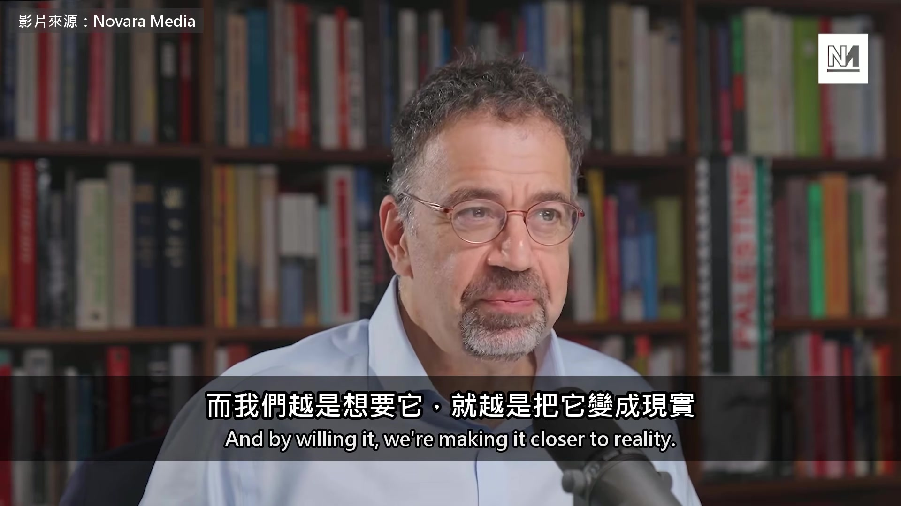

**逐字稿片段：** 照 Acemoglu 的說法 美國押在 AGI 只換到大模型上一點領先 工廠裡的 AI 已經輸給中國 他要英國別跟著美國 讓 AI 去幫護理師、電工跟老師

**話題推測：** 回顧並總結Acemoglu的觀點

---

## 00:08:55

**逐字稿片段：** 原影片 77 分鐘 大部分在談他的新書 他也講到

**話題推測：** 提及原始影片的總時長（77分鐘）

---

## 00:08:59

**逐字稿片段：** AI 公司老闆一談人類滅絕 薪水跟不平等的討論就被蓋過去 原影片連結在說明欄，有興趣可以去聽更多。

**話題推測：** 補充Acemoglu關於AI公司老闆討論人類滅絕的觀點

---
