# ai-note-101_dzhQYXN_6l4 — 關鍵畫面索引

- 來源逐字稿：[ai-note-101_dzhQYXN_6l4_GT.srt](ai-note-101_dzhQYXN_6l4_GT.srt)
- 影片：https://www.youtube.com/watch?v=dzhQYXN_6l4
- 截圖數：24

## 00:00:00

**逐字稿片段：** 這裡是 AI 101，全網最幽默的 AI 新聞

**話題推測：** 影片開場標題

---

## 00:00:04

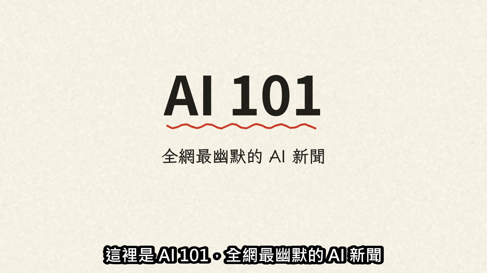

**逐字稿片段：** 微軟正在幫Copilot換跑道 不再主打陪伴，改去做工作AI

**話題推測：** 主要話題：Copilot轉型

---

## 00:00:10

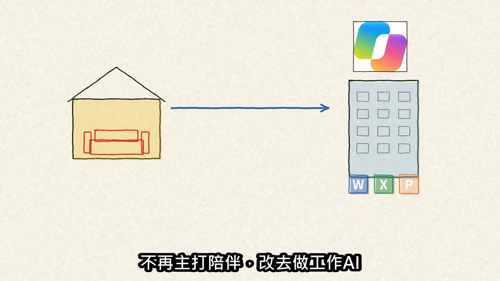

**逐字稿片段：** 以前的口號是「你的AI夥伴」 現在改成「為工作打造的AI」 消費版跟商用版也整合在一起 這次轉彎，連電腦上的招牌都換了

**話題推測：** 展示Copilot舊版口號

---

## 00:00:20

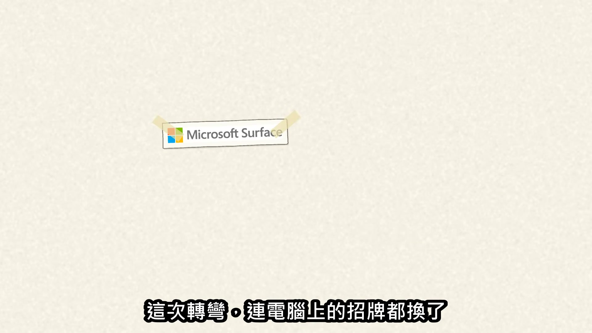

**逐字稿片段：** 微軟9月推出的Surface新機 不再叫Copilot+ PC 可是機器裡的NPU還在 撤下的是行銷招牌，不是AI硬體

**話題推測：** 提及Surface新機與Copilot+ PC品牌移除

---

## 00:00:29

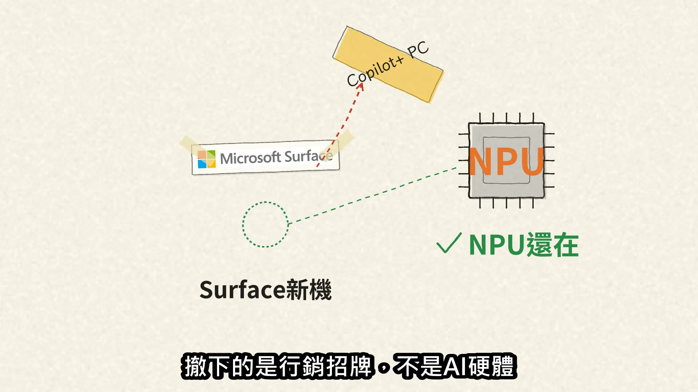

**逐字稿片段：** 那微軟為什麼要轉？ Windows、Edge、Office、手機App 甚至鍵盤上的Copilot鍵 入口開了一大堆 卻沒有變成大家的使用習慣

**話題推測：** 提出問題：轉型原因

---

## 00:00:39

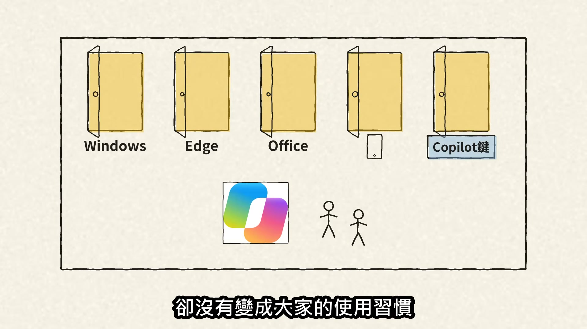

**逐字稿片段：** 差距有多大？ 根據Sensor Tower估計

**話題推測：** 提出問題：使用量差距

---

## 00:00:43

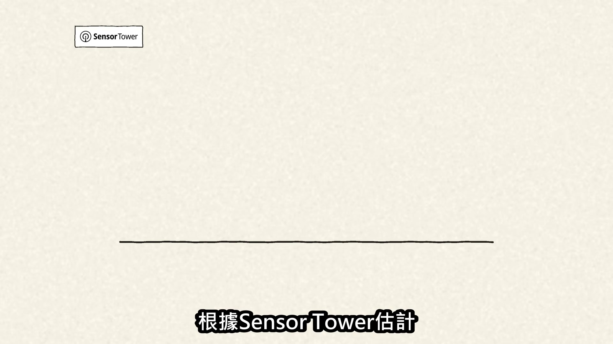

**逐字稿片段：** 7月消費版Copilot的月活躍使用者大約3850萬

**話題推測：** 展示消費版Copilot月活躍使用者數據

---

## 00:00:47

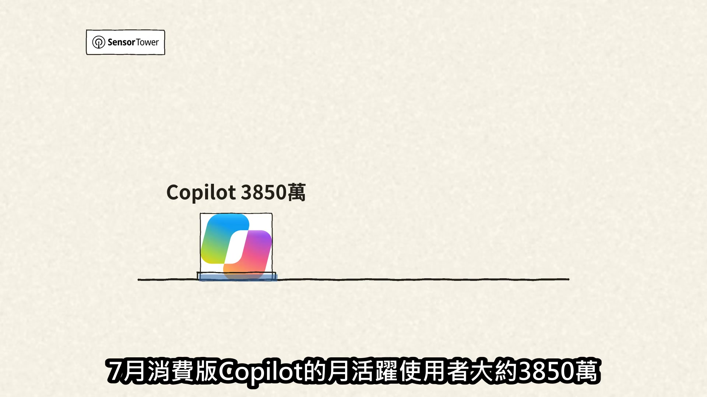

**逐字稿片段：** ChatGPT在5月大約有10億 Copilot只有ChatGPT的3.85%

**話題推測：** 展示ChatGPT月活躍使用者數據以作對比

---

## 00:00:54

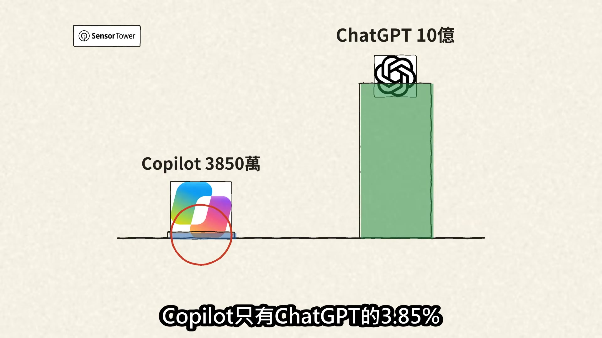

**逐字稿片段：** 可是換到企業，結果完全相反 Microsoft 365 Copilot的付費席次

**話題推測：** 轉向企業市場Copilot數據分析

---

## 00:01:00

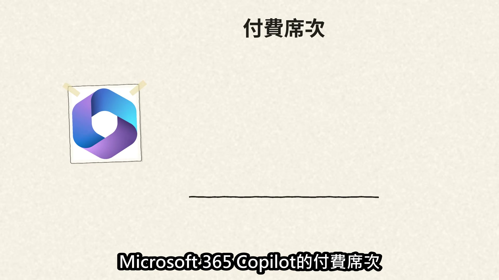

**逐字稿片段：** 3個月前大約2000萬 6月底已經超過3000萬 企業是真的肯付錢

**話題推測：** 展示企業版Copilot付費席次成長數據

---

## 00:01:07

**逐字稿片段：** 時間拉回2023年，微軟推出新版Bing 2024年，鍵盤多了Copilot鍵 又有Copilot+ PC2025年 蘇萊曼把Copilot叫做「你的AI夥伴」 個人AI助理，微軟一路越押越大

**話題推測：** 回顧Copilot發展時間線

---

## 00:01:22

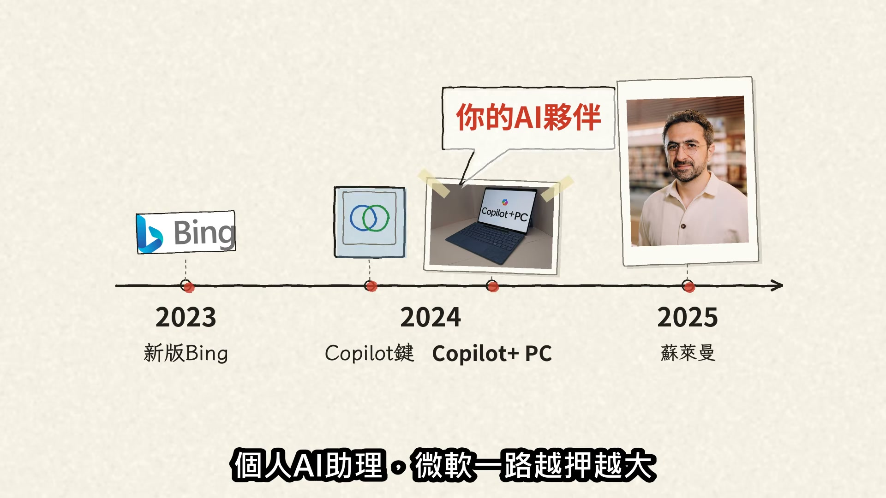

**逐字稿片段：** 其實押注途中，警訊早就出現

**話題推測：** 討論Copilot發展遇到的警訊

---

## 00:01:25

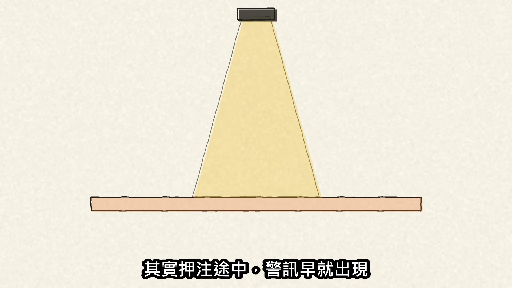

**逐字稿片段：** Copilot+ PC的主秀Recall 要像攝影式記憶一樣記下你看過的內容 卻在上市前幾天因為資安與隱私爭議延後 第一批AI電腦出貨時，主秀反而缺席 一路加碼，消費市場還是起不來

**話題推測：** 介紹Copilot+ PC主秀Recall爭議

---

## 00:01:40

**逐字稿片段：** 微軟只好動組織 2026年3月 消費和商用2個Copilot團隊合併

**話題推測：** 轉向微軟組織架構調整

---

## 00:01:46

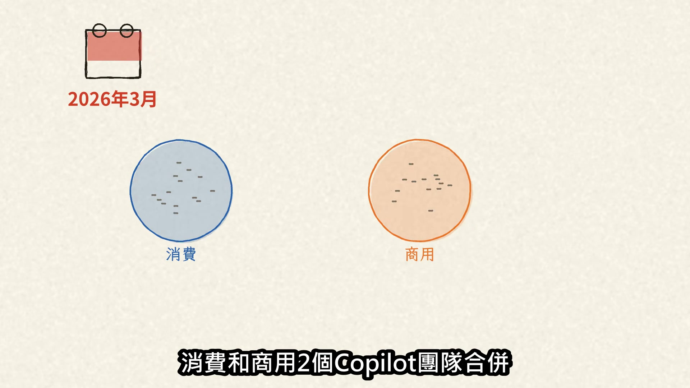

**逐字稿片段：** 交給前Snap高層雅各布・安德魯統管 蘇萊曼則轉去做自研模型 團隊併了，產品也跟著併

**話題推測：** 介紹新任主管雅各布・安德魯

---

## 00:01:55

**逐字稿片段：** 8月，2個Copilot App開始合成一個

**話題推測：** 討論Copilot App產品合併

---

## 00:01:58

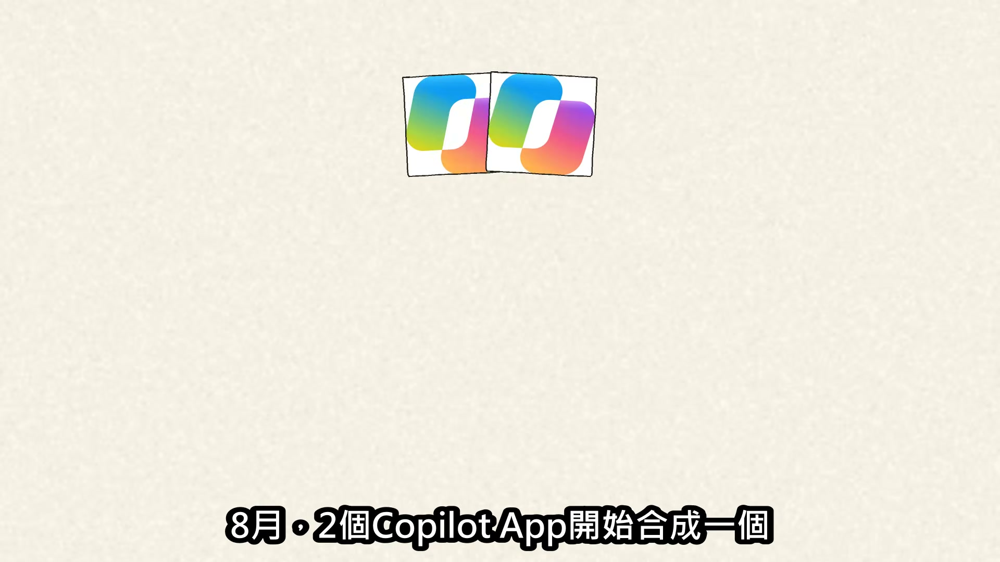

**逐字稿片段：** Podcasts、群組聊天、Mico陸續退場 免費聊天倒是保留下來 砍掉的，正是最像陪伴的那一塊

**話題推測：** 列舉Copilot被移除的功能

---

## 00:02:07

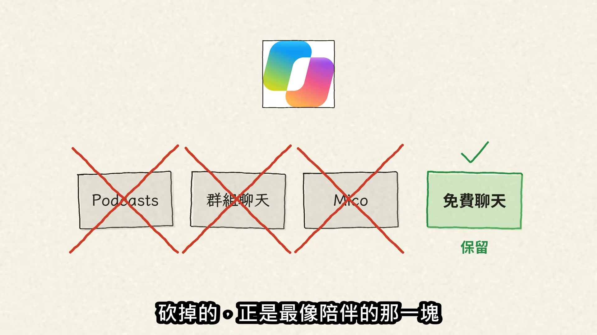

**逐字稿片段：** 砍完之後，新版 Copilot 主打3個核心：

**話題推測：** 介紹新版Copilot的三大核心功能

---

## 00:02:10

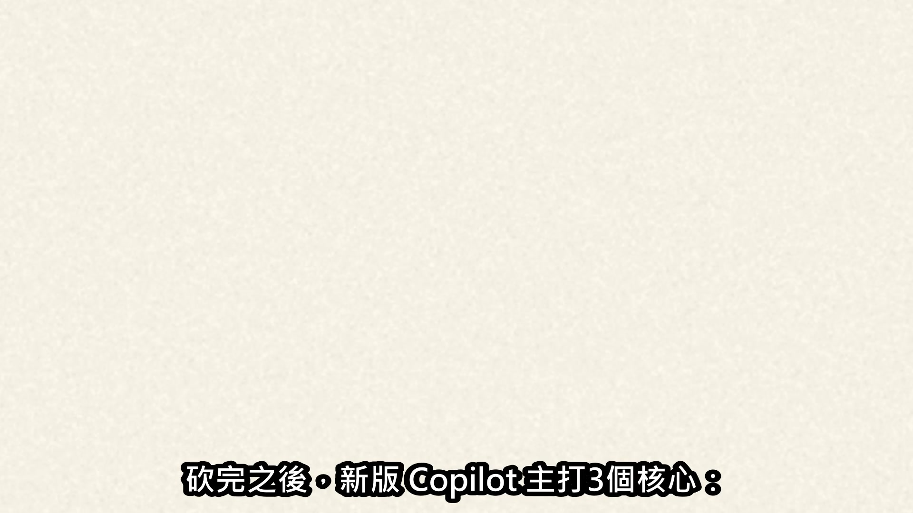

**逐字稿片段：** Home、Code、Autopilot 微軟9月25日正式公布

**話題推測：** 列舉三大核心功能名稱

---

## 00:02:14

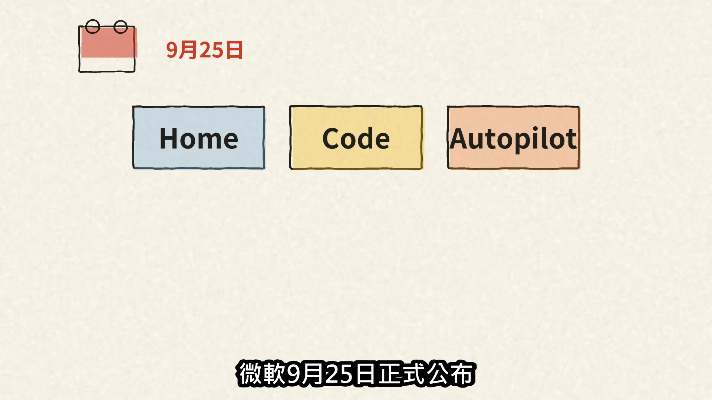

**逐字稿片段：** Word、Excel、PowerPoint 都能直接改 Autopilot 還能持續執行任務

**話題推測：** 說明Copilot與Office應用整合

---

## 00:02:21

**逐字稿片段：** 為什麼只留下工作功能？ 負責Copilot平台的主管查爾斯・拉曼納講得很直接： 微軟不是要做一個像私人夥伴的Copilot 而是要幫你把事情做完 可是就算專心上班

**話題推測：** 提出問題：只保留工作功能的原因

---

## 00:02:35

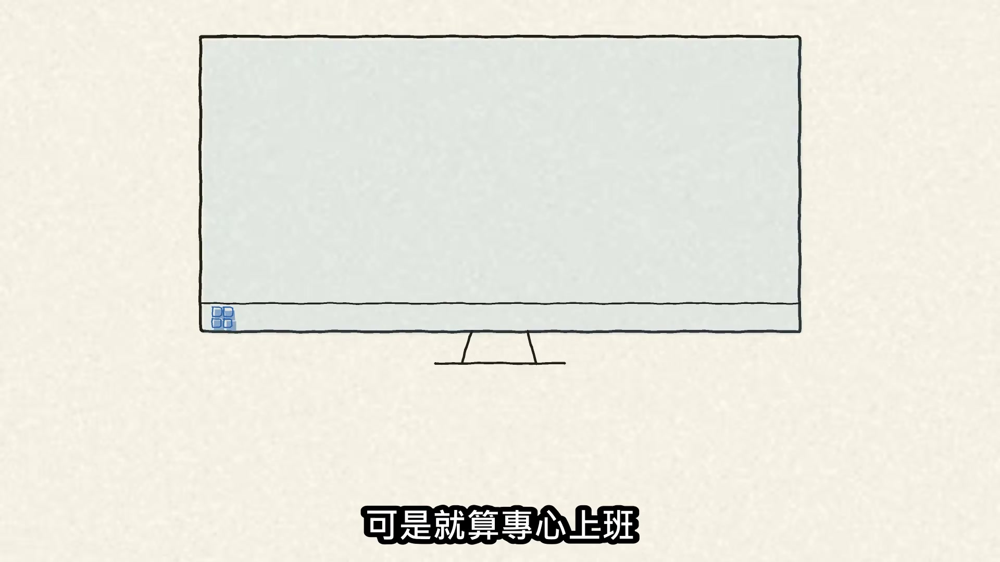

**逐字稿片段：** 微軟連自家桌面都得搶

**話題推測：** 轉向桌面AI競爭態勢

---

## 00:02:37

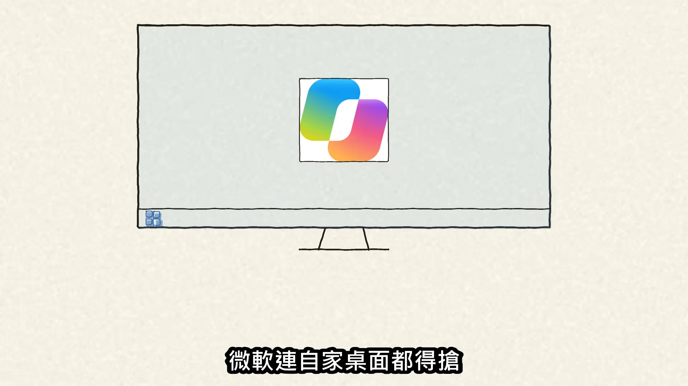

**逐字稿片段：** Google 9月推出Windows版Gemini 按Alt加空白鍵就跳出來 微軟得在自己的桌面上 跟對手搶使用者的下一次點擊 所以預載、實體按鍵、新電腦品牌 都沒讓消費者把Copilot當第一選擇

**話題推測：** 介紹Google推出Windows版Gemini

---

## 00:02:53

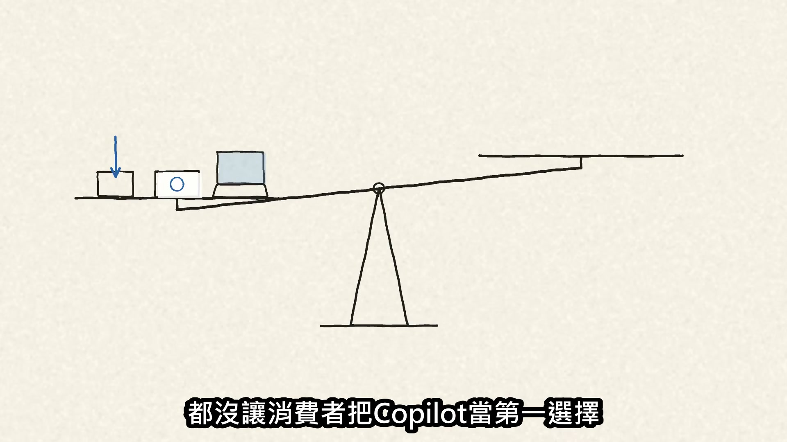

**逐字稿片段：** 微軟把賭注重新押回企業、Office、 組織資料和工作流程 Copilot往後要靠上班活下去

**話題推測：** 總結微軟Copilot的未來策略重點

---
