# ai-note-101_eV5wco3YDqM — 關鍵畫面索引

- 來源逐字稿：[ai-note-101_eV5wco3YDqM_GT.srt](ai-note-101_eV5wco3YDqM_GT.srt)
- 影片：https://www.youtube.com/watch?v=eV5wco3YDqM
- 截圖數：22

## 00:00:04

**逐字稿片段：** 今天要談的 是獲輝達參投的太空資料中心新創 Starcloud 準備在第二顆衛星 Starcloud-2 上搭載比特幣 ASIC 礦機 這不是放棄 AI、改做挖礦 而是想用價格較低、能夠長時間滿載、 產出又容易量化的礦機 測試太空機房最棘手的供電、 散熱與維修成本

**話題推測：** 引入主題：獲輝達參投的太空資料中心新創 Starcloud 與其太空挖礦計畫。

---

## 00:00:23

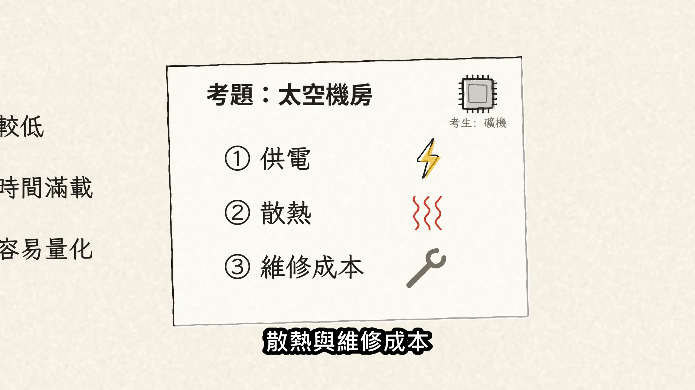

**逐字稿片段：** Starcloud 前身叫 Lumen Orbit 2024 年由 Philip Johnston、 Ezra Feilden 和 Adi Oltean 共同創立

**話題推測：** 切換至公司背景，介紹 Starcloud 的前身、創辦人與成立時間。

---

## 00:00:32

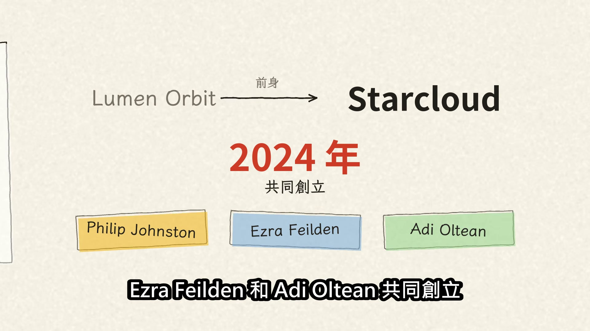

**逐字稿片段：** 它的核心構想 是把耗電驚人的 AI 資料中心搬到太空 利用太陽能供電 再把運算產生的熱透過輻射器排向太空

**話題推測：** 轉入核心技術構想，呈現將 AI 資料中心搬到太空的概念圖。

---

## 00:00:42

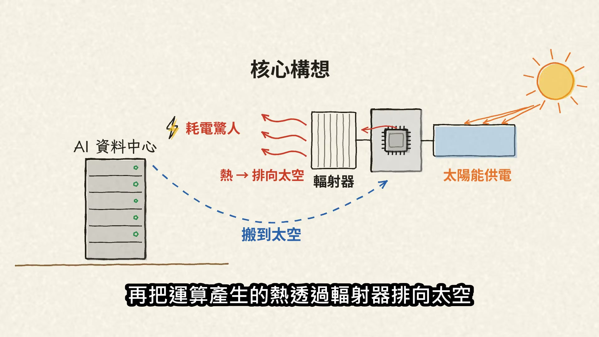

**逐字稿片段：** 這家公司真正把硬體送上軌道 是在 2025 年 11 月 當時 SpaceX 的獵鷹9號火箭發射 Starcloud-1

**話題推測：** 切換至 Starcloud-1 發射任務與 SpaceX 火箭畫面。

---

## 00:00:51

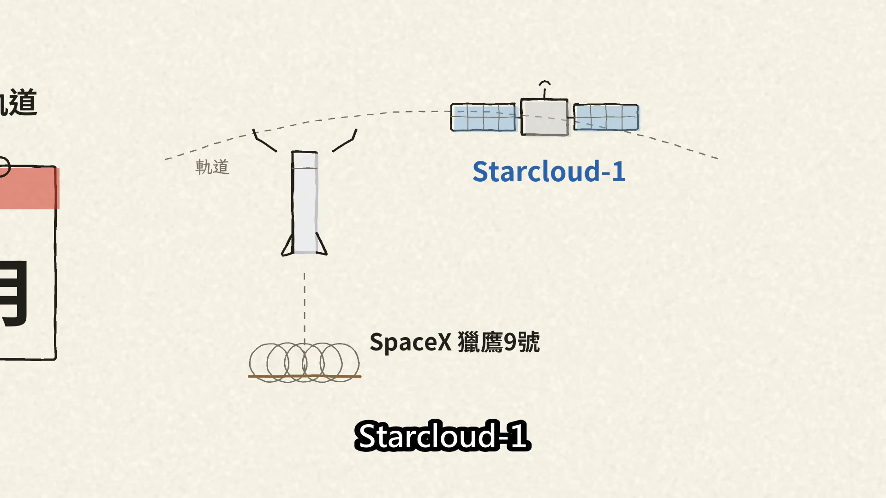

**逐字稿片段：** 這顆原型衛星大約重 60 公斤 尺寸接近1台小冰箱 裡面搭載1張輝達 H100 GPU 輝達當時宣稱 它的 GPU 算力約是過往在軌 GPU 的100倍

**話題推測：** 展示 Starcloud-1 的重量、尺寸與搭載 NVIDIA H100 GPU 等規格。

---

## 00:01:04

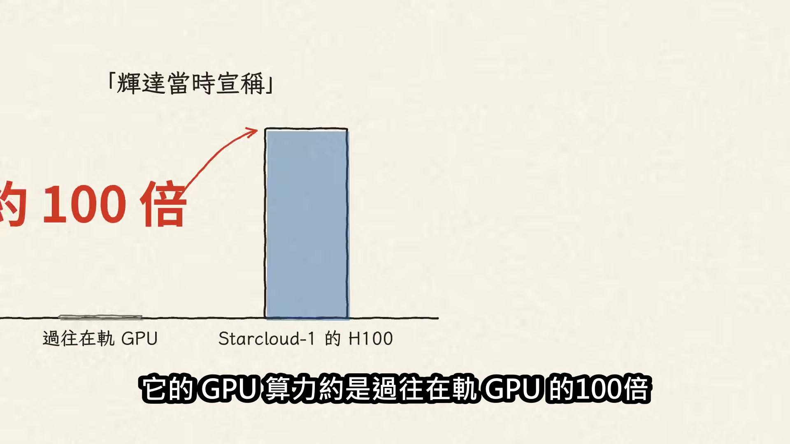

**逐字稿片段：** 1個月後，Starcloud 公布2項成果 第一 是在軌執行 Google DeepMind 的開放權重模型 Gemma 完成 AI 推論第二，是使用 nanoGPT 在莎士比亞文本上訓練小型模型 也就是說，Gemma 負責的是推論 實際拿來訓練的是 nanoGPT 並不是在太空訓練 Gemini 也不是訓練當代最大型的 AI 模型

**話題推測：** 轉入 Starcloud-1 的兩項在軌 AI 成果與模型示意。

---

## 00:01:27

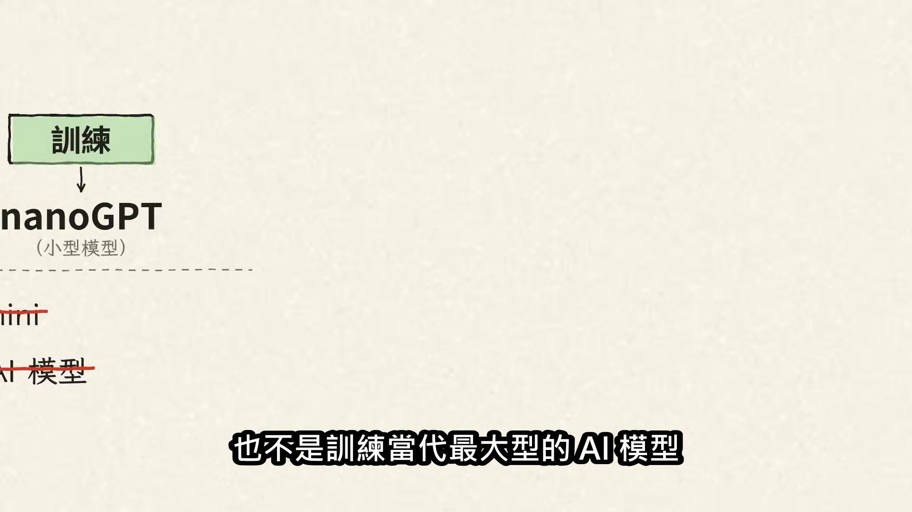

**逐字稿片段：** 接下來的 Starcloud-2 才是第一個商業任務 公司官網寫的是 GPU 叢集、持久儲存、 全天候存取 以及自研的電力和熱控制系統 預計到 2027 年在太陽同步軌道全面運作

**話題推測：** 切換介紹商業任務 Starcloud-2 的 GPU 叢集、儲存與熱控系統。

---

## 00:01:41

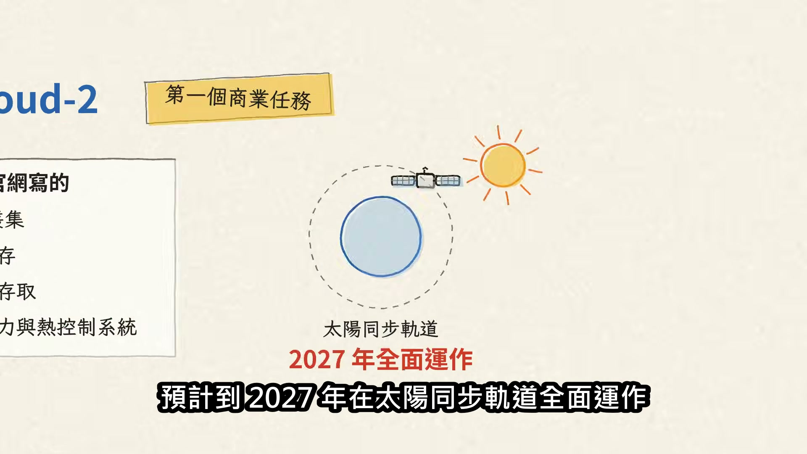

**逐字稿片段：** 至於比特幣礦機 目前主要來自執行長 Johnston 的公開訪談 公司尚未公布 ASIC 的型號、數量、 算力和功耗分配 Johnston 說 Starcloud-2 會放入一些比特幣 ASIC 並希望成為第一個在太空進行比特幣挖礦的團隊 這項計畫早在今年 3 月就已公開 9 月只是相關訪談片段再次流傳 並不是 9 月才宣布的新計畫

**話題推測：** 轉入比特幣 ASIC 礦機計畫，並說明目前公開資訊仍有限。

---

## 00:02:05

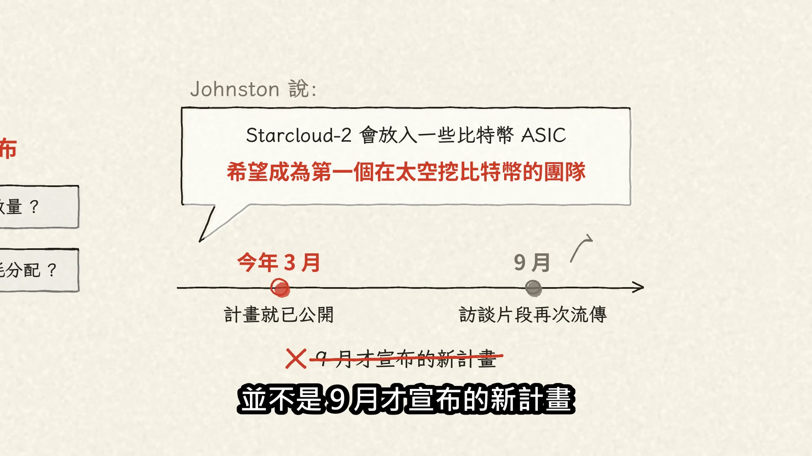

**逐字稿片段：** 為什麼一家 AI 公司要把礦機送上天？ Johnston 算了一筆帳 他表示

**話題推測：** 提出核心問題：AI 公司為何要把比特幣礦機送上太空。

---

## 00:02:11

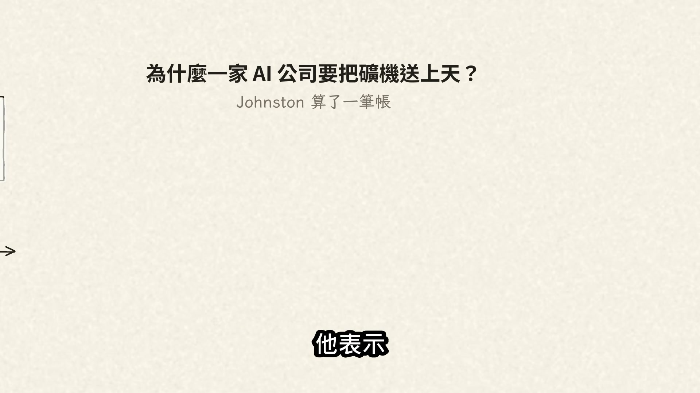

**逐字稿片段：** 如果用相同的1000瓦額定功率比較 B200 GPU 硬體大約要3萬美元 ASIC 礦機約1000美元，相差30倍 不過，這比較的是執行長自報的硬體資本成本 不是2種晶片的單價、算力或能源效率 GPU 和 ASIC 執行的工作也完全不同 不能解讀成 ASIC 做 AI 可以便宜30倍

**話題推測：** 呈現 B200 GPU 與 ASIC 礦機在相同功率下的成本比較數字。

---

## 00:02:32

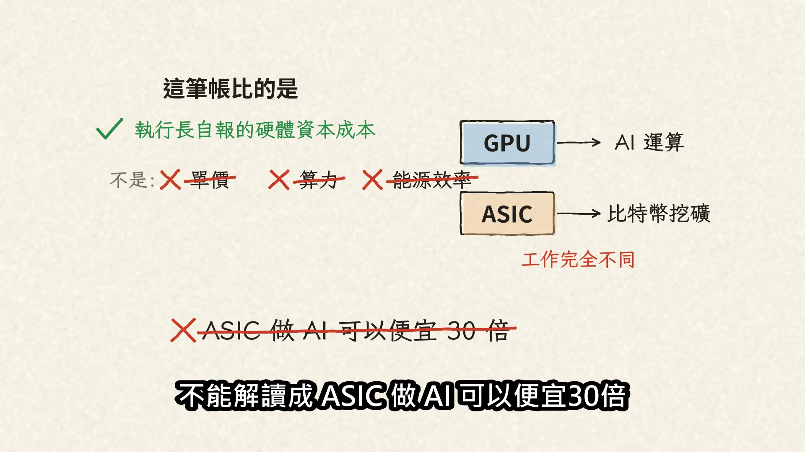

**逐字稿片段：** 對 Starcloud 而言 礦機的價值在於便宜、延遲不敏感 而且可以長時間持續運轉 挖到多少比特幣、產生多少算力 都能直接記錄 如果連 ASIC 滿載時產生的熱都處理不了 未來更大規模的 GPU 叢集就更難成立

**話題推測：** 切換至 ASIC 對 Starcloud 的實際價值，包括低成本、可持續運轉與容易量化。

---

## 00:02:50

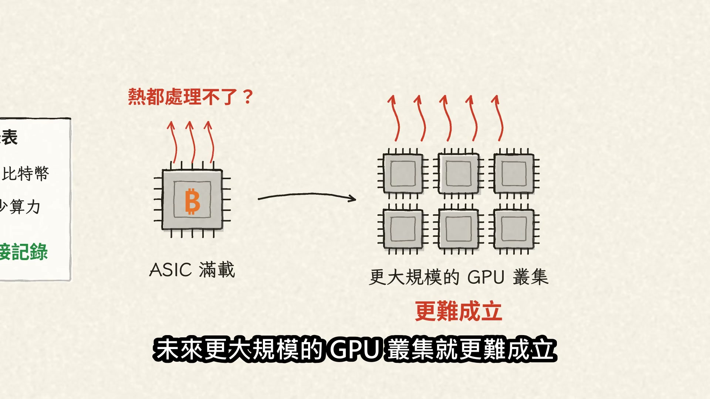

**逐字稿片段：** 因為太空雖然寒冷，真空卻不是天然冷氣 沒有空氣，就沒有對流 晶片產生的廢熱只能靠輻射器以紅外線形式慢慢排出

**話題推測：** 進入太空散熱原理，說明真空環境無法靠對流散熱。

---

## 00:03:01

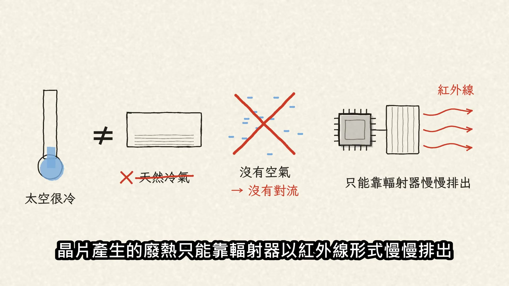

**逐字稿片段：** Johnston 曾表示 公司可能有70%工程時間都花在熱問題上 Starcloud-1 使用相變材料吸收熱量 適合短時間測試 Starcloud-2 則準備使用液體 把熱帶到大型可展開輻射板 挑戰更長時間的連續運轉

**話題推測：** 呈現公司工程資源投入熱管理的比例，以及 Starcloud-1 與 Starcloud-2 的散熱方案。

---

## 00:03:17

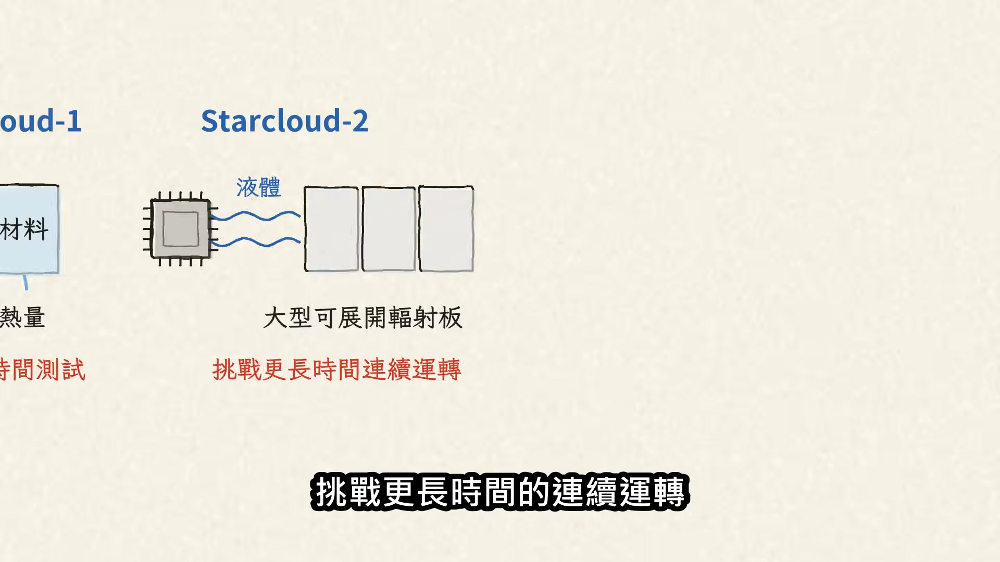

**逐字稿片段：** 所謂「太陽能免費」也只代表陽光沒有燃料費 太陽能板、遮蔽設備、通訊系統、 輻射器和火箭發射，每一項都要付錢

**話題推測：** 轉入太陽能與太空資料中心的整體成本問題。

---

## 00:03:27

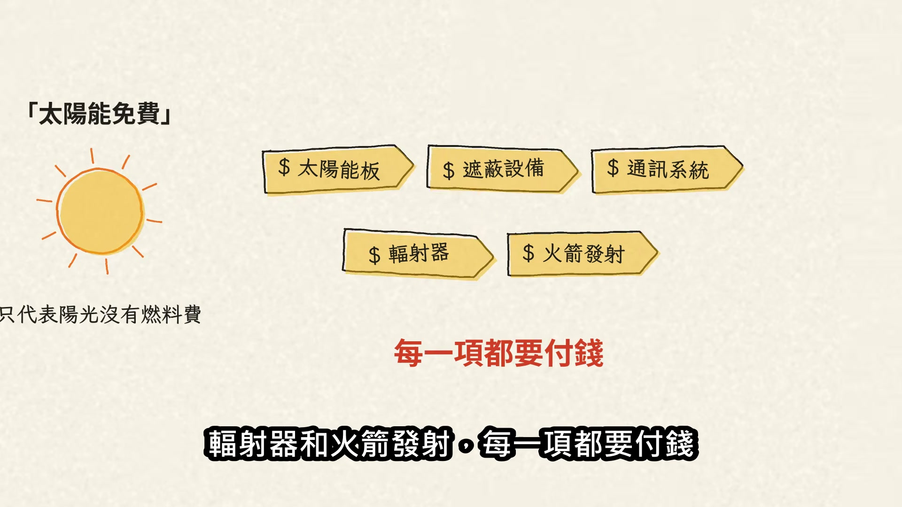

**逐字稿片段：** Johnston 自己估算，GPU 太空資料中心要等發射成本降到每公斤約500美元 才可能跨過損益點 比特幣挖礦甚至要降到約200美元 這些都是公司的成本模型 不是目前已經取得的發射價格

**話題推測：** 展示公司估算的發射成本損益門檻，區分 GPU 資料中心與比特幣挖礦。

---

## 00:03:41

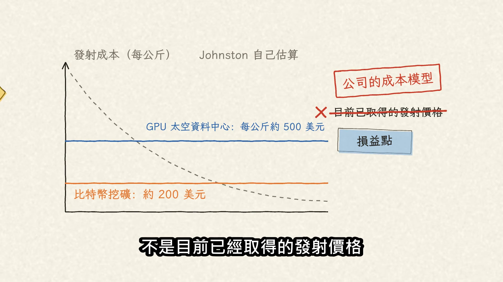

**逐字稿片段：** 礦機還有另一個問題，就是更新速度快、 經濟壽命可能比 GPU 更短 地面礦場可以隨時更換設備 衛星上卻沒有技師能抽換故障或過時的板卡 一旦比特幣挖礦難度、 幣價或新一代礦機效率改變 送上太空的舊硬體可能提早失去競爭力

**話題推測：** 切換至 ASIC 更新快、經濟壽命短與太空無法維修更換的風險。

---

## 00:04:00

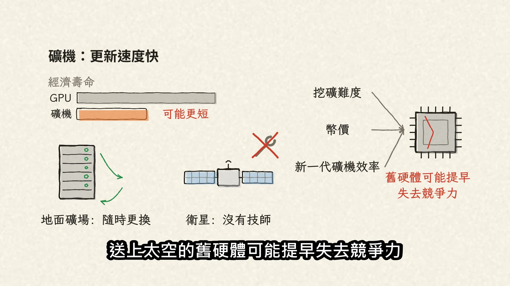

**逐字稿片段：** 但資本市場已經先下注 Starcloud 在今年 3 月完成1億7000萬美元 A 輪募資 估值11億美元 8 月再延伸募得2億5000萬美元 投後估值升到23億美元 輝達和 Cisco 都有參投 外界所傳輝達投入2500萬美元 來源是匿名交易消息人士 2家公司公開資訊並未列出這筆金額

**話題推測：** 轉入資本市場，展示 Starcloud 募資金額、估值與投資者資訊。

---

## 00:04:23

**逐字稿片段：** 公司的野心也遠超過1顆衛星 Starcloud 已向美國聯邦傳播委員會申請最多8萬8000顆、 部署於600到850公里高度的資料中心衛星 不過，這是申請上限 目前只是進入審查程序 不代表已獲批准 更不是已經下單或開始部署

**話題推測：** 切換至公司大規模衛星部署藍圖與 FCC 申請的數量、高度。

---

## 00:04:43

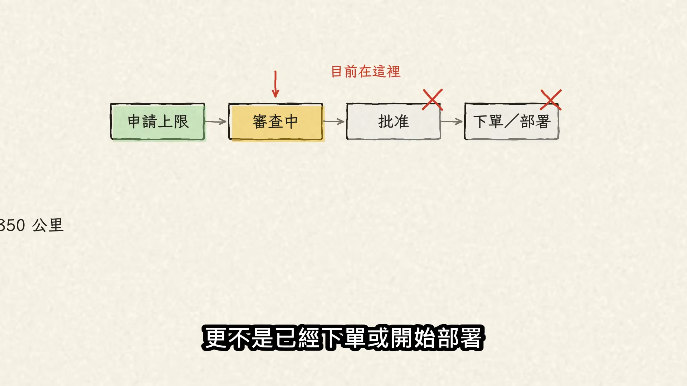

**逐字稿片段：** 美國天文學會也已提出正式反對 擔心大規模衛星影響光學與電波天文觀測 並加劇軌道壅塞

**話題推測：** 呈現美國天文學會反對衛星計畫及其對天文觀測與軌道環境的疑慮。

---

## 00:04:50

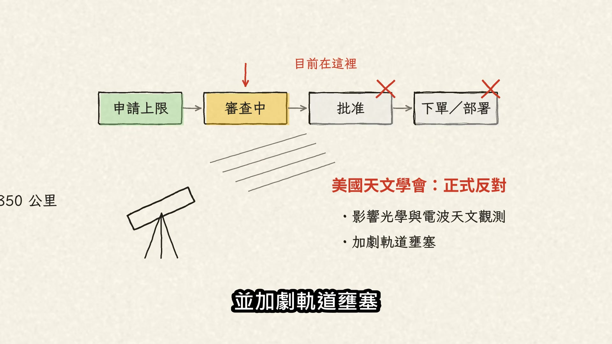

**逐字稿片段：** Starcloud 如果成功 較精確的紀錄可能是首個已知在軌執行比特幣工作量證明挖礦的 ASIC 而不是第一個把比特幣帶上太空 過去 SpaceChain 已做過太空比特幣多重簽章交易 Blockstream 也早已利用衛星廣播比特幣區塊鏈資料

**話題推測：** 澄清 Starcloud 所謂首個太空比特幣挖礦計畫，並對比 SpaceChain 與 Blockstream 的先例。

---

## 00:05:08

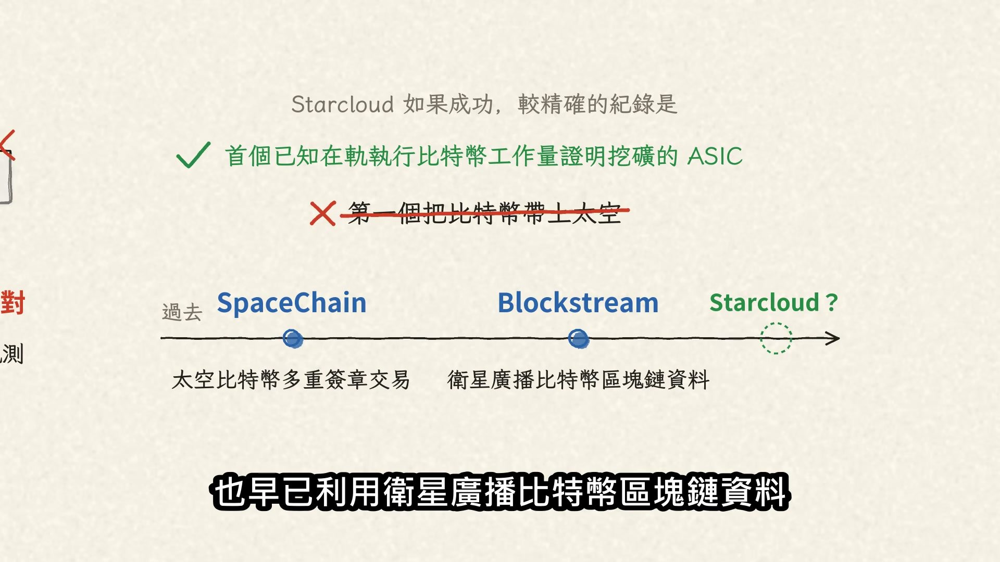

**逐字稿片段：** 目前 Starcloud-2 的發射日期還沒有確定 舊訪談指向 2026 年底 近期報導則提到可能延至 2027 年初 公司官網只承諾到 2027 年全面運作

**話題推測：** 轉入 Starcloud-2 發射時間的不確定性與不同預測年份。

---

## 00:05:21

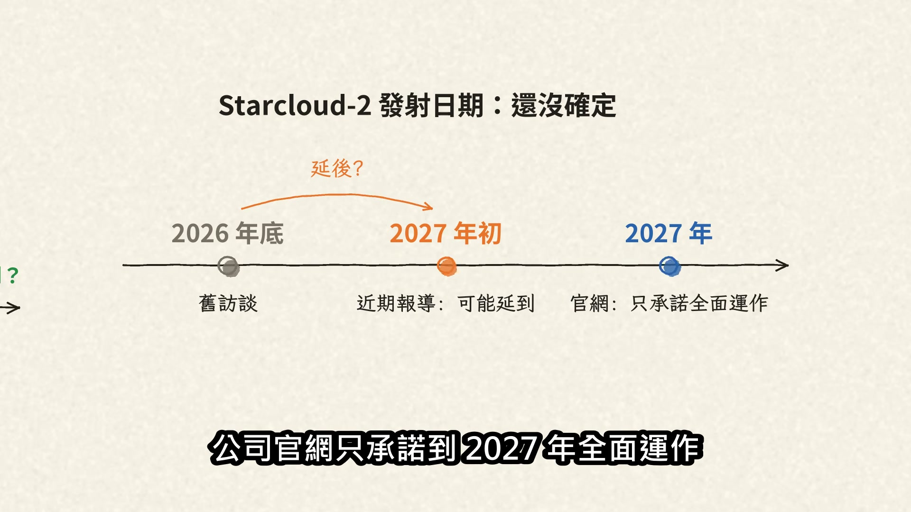

**逐字稿片段：** 真正值得觀察的 不是8萬8000顆衛星的宏大藍圖 而是這艘功率約8000瓦、 沒有人能上門維修的小型太空船 能不能在沒有空氣散熱的軌道上 讓 GPU 和比特幣礦機長時間穩定運轉

**話題推測：** 進入結論，聚焦約8000瓦且無法人工維修的小型太空船能否長期穩定運轉。

---
