# ai-note-101_efK_fHAyWvU — 關鍵畫面索引

- 來源逐字稿：[ai-note-101_efK_fHAyWvU_GT.srt](ai-note-101_efK_fHAyWvU_GT.srt)
- 影片：https://www.youtube.com/watch?v=efK_fHAyWvU
- 截圖數：22

## 00:00:00

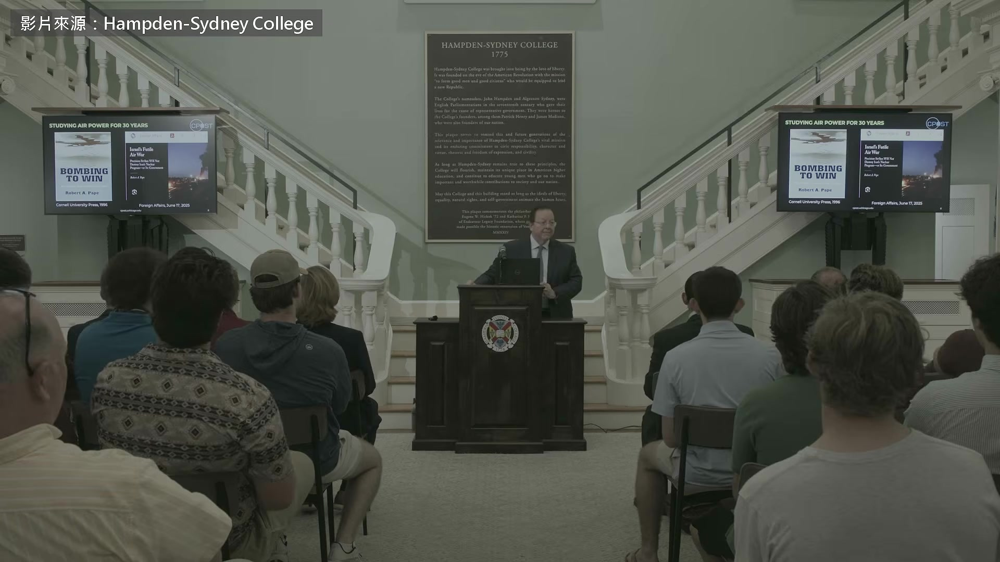

**逐字稿片段：** 1991 年美國跟伊拉克打完波灣戰爭 空軍一批剛從巴格達炸回來的飛行員 回學校進修空權戰略 他就在那裡教了 3 年 他叫 Robert Pape 現在是芝加哥大學政治學教授

**話題推測：** 介紹波灣戰爭的歷史背景

---

## 00:00:13

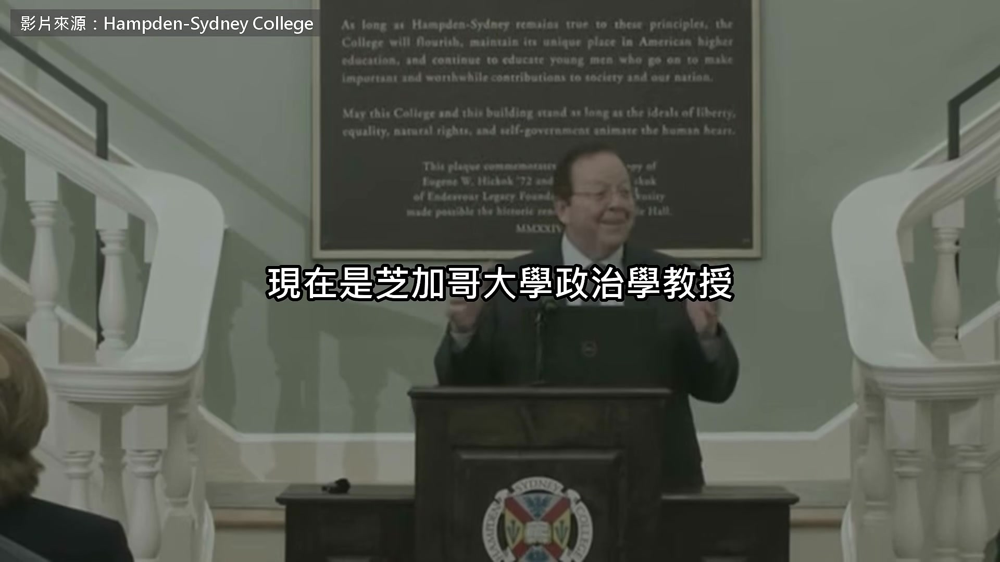

**逐字稿片段：** 1996 年他出了 Bombing to Win 把二戰到波灣戰爭的空襲一場一場拆開 結論是轟炸很少讓人民起來反政府 反而常讓他們更團結

**話題推測：** 介紹 Robert Pape 的著作《Bombing to Win》

---

## 00:00:23

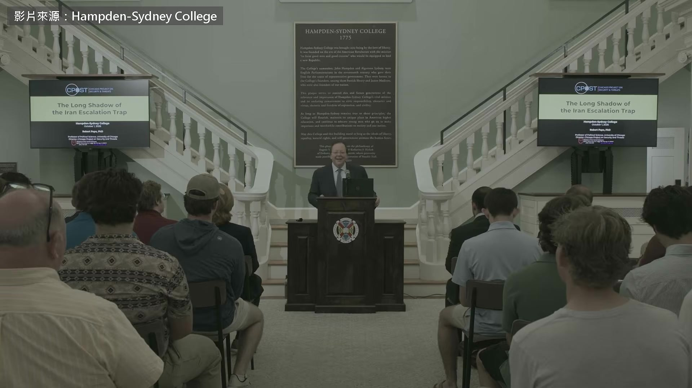

**逐字稿片段：** 這是他 10 月 1 號在維吉尼亞州一所大學的演講 講的是美伊戰爭 他說這場仗掀起的變動 要台下這一代來收拾 而下一個用無人機改寫戰局的 可能是台灣 這場美伊戰爭，我把它叫做「升級陷阱」 這個說法，是我在美伊戰爭開戰前幾天提出來的 我寫了一篇文章，放在 Substack 電子報上 我說的升級陷阱，在這次的情況是 動手的是美國跟以色列 他們出手，炸彈命中目標，炸死領導人

**話題推測：** 說明目前討論的內容來源為 Robert Pape 的一場演講

---

## 00:01:04

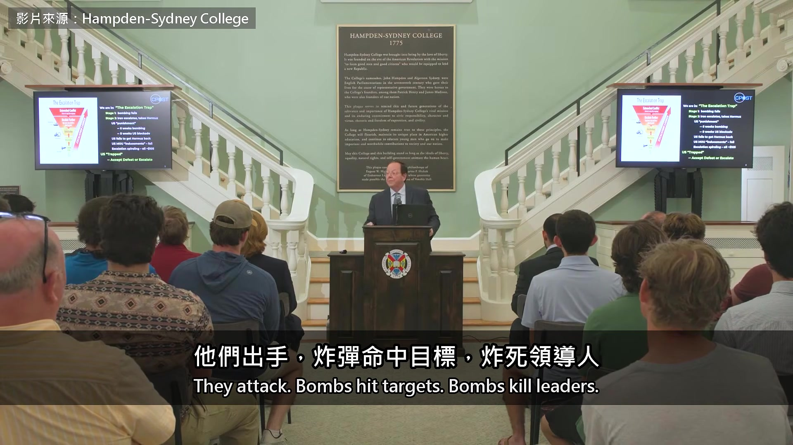

**逐字稿片段：** 今年 2 月 28 號 美國跟以色列開始空襲伊朗 第一波就炸死了伊朗的最高領袖哈米尼 他的權力比總統還大 戰術上成功了，戰略上我們卻變弱了 戰略上一變弱，我們就掉進陷阱了 因為先動手的一方一旦變弱 就得做一個選擇 要不要撤？讓步，宣布勝利然後撤走？ 那樣的話，對方已經變強了，就會更強 還是再升級一次？繼續加碼？ 過去 7 個多月，我們看到的就是這個陷阱 從開戰到現在，停火、開火來回好幾輪 7 月停火正式破局，美軍重新開炸

**話題推測：** 提及美伊戰爭開戰的具體日期

---

## 00:02:10

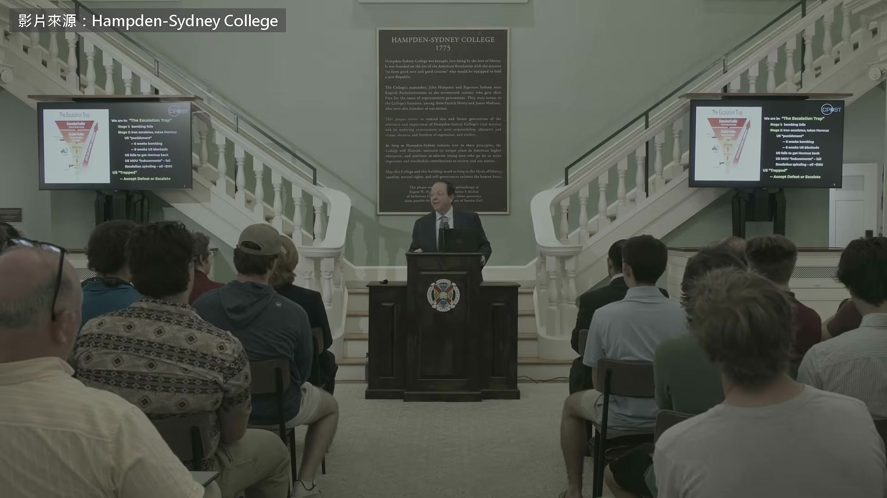

**逐字稿片段：** 10 月初 美國再加派第三艘航空母艦去中東 很遺憾，這種情況還會持續一陣子 大概至少會拖到 1 月，甚至更久 接下來，我要講幾個我所謂的戰略錯誤 他說這些錯，都是最聰明的人才會犯的 第一個是高估懲罰 以為把一個政府炸痛了，它就會垮 開戰那一波炸死的不只最高領袖哈米尼 照他的說法還有半個內閣 擺明了就是要換掉整個政權 根本的問題在於，川普總統在這裡撞上了歷史的重量 歷史的重量 為了換政權而轟炸，從一戰有這種打法開始 從來沒有光靠它推翻過任何一個政府 這話說得很重，但這是我花了 30 年研究的東西 這就是我在教的 這不是隨口說說 這本書講的就是這個

**話題推測：** 提及美軍近期增派航母到中東的最新發展

---

## 00:03:21

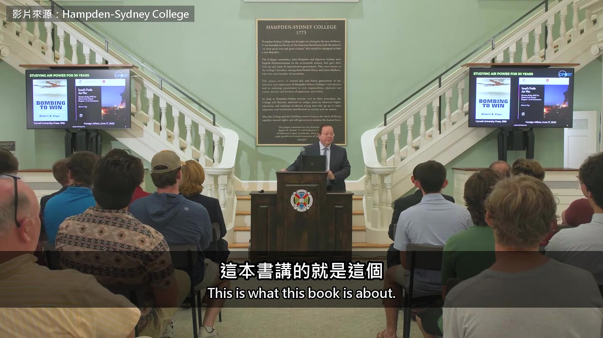

**逐字稿片段：** 伊朗封住了荷莫茲海峽 那是波斯灣的出海口 全球約兩成石油從這裡過 美國的對策是反過來封鎖伊朗 封鎖跟制裁也是他的老本行

**話題推測：** 轉向討論伊朗封鎖荷莫茲海峽的行動及其影響

---

## 00:03:32

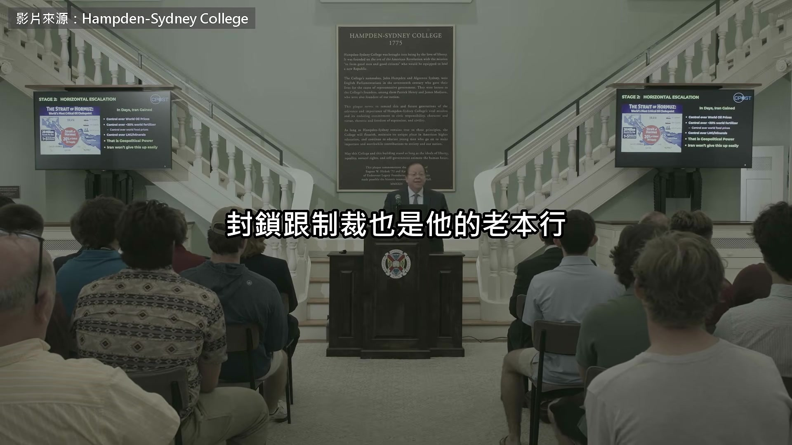

**逐字稿片段：** 1997 年他就寫過一篇論文 題目叫〈經濟制裁為什麼沒用〉 那封鎖呢？ 所以我們就祭出封鎖 預期它會垮掉 美國財長 Scott Bessent 到現在還跟你說它會垮 好，大問題來了 舉一個例子，一個就好，只要一個 我不要你舉 5 個 一戰以來，光靠封鎖就打贏戰爭的，只要一個 不能是封鎖再加上別的轟炸 不能是封鎖加原子彈，那是日本 也不能是封鎖再加上地面部隊占領全國 那是我們對德國做的事 我說的是只有封鎖 我也不是要你舉 3 個月或 6 個月內打贏的例子 我說的是，有史以來 問題就在這裡 我這輩子花了 30 年，研究一戰以來每一場空襲 一戰以來每一次制裁、每一次海上封鎖 這些不是我從哪裡看來的摘要… 寫這些論文的人就是我

**話題推測：** 提及 Robert Pape 關於經濟制裁的論文

---

## 00:04:52

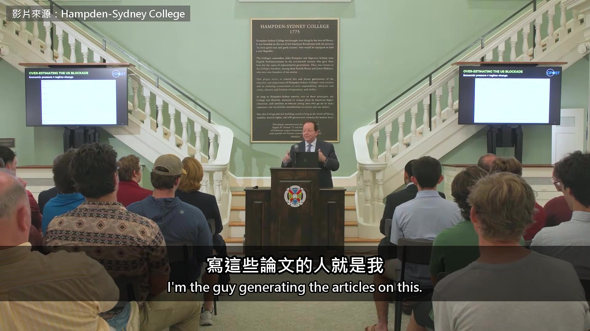

**逐字稿片段：** 第二個錯，是低估伊朗的規模

**話題推測：** 探討第二個戰略錯誤：低估伊朗的規模

---

## 00:04:55

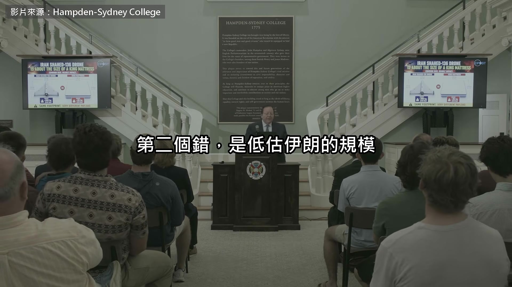

**逐字稿片段：** 伊朗的 Shahed 無人機 他形容差不多一張雙人加大床墊大 引擎很陽春，一個月能做好幾百架 打中荷莫茲海峽裡幾艘船 保險費就飆上去 他要台下的學生當負責的將軍 把伊朗 5000 到 7000 架無人機 壓到 200 架以下 我們來看看這個任務有多簡單 每一架無人機，最少能飛的距離 光靠我說的那顆兩缸引擎，不用加裝別的（Shahed-136 用的是四缸引擎） 是 500 英里，這是它的航程，500 英里 40 加侖汽油，就能飛這麼遠

**話題推測：** 介紹伊朗的 Shahed 無人機

---

## 00:05:34

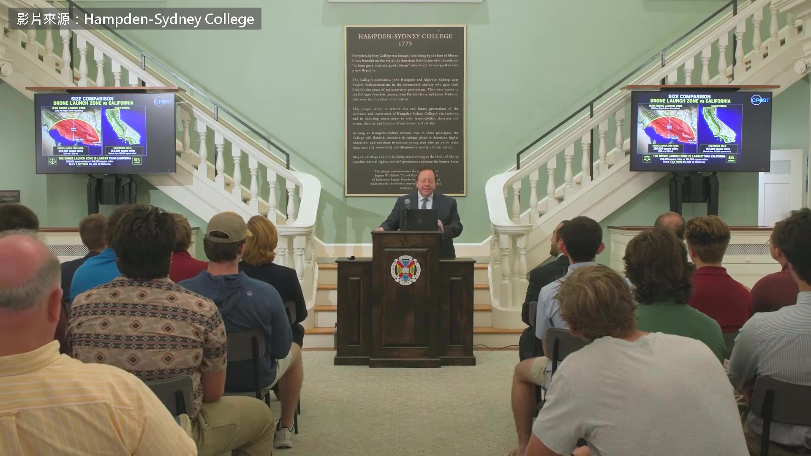

**逐字稿片段：** 500 英里的縱深，實際上就長這樣 這是以荷莫茲海峽為中心畫出來的 這整塊都是發射區 你得去搜、去找，還得把它們摧毀 這塊地有加州的 1.5 倍大 你大概已經在想，天啊，這也太難了 可是這還不是最糟的 到目前為止，我給你看的還只是平面的問題 無人機很好搬，還能拆開 兩三個人就能輕輕鬆鬆搬來搬去

**話題推測：** 以地圖視覺化 500 英里縱深的覆蓋範圍

---

## 00:06:14

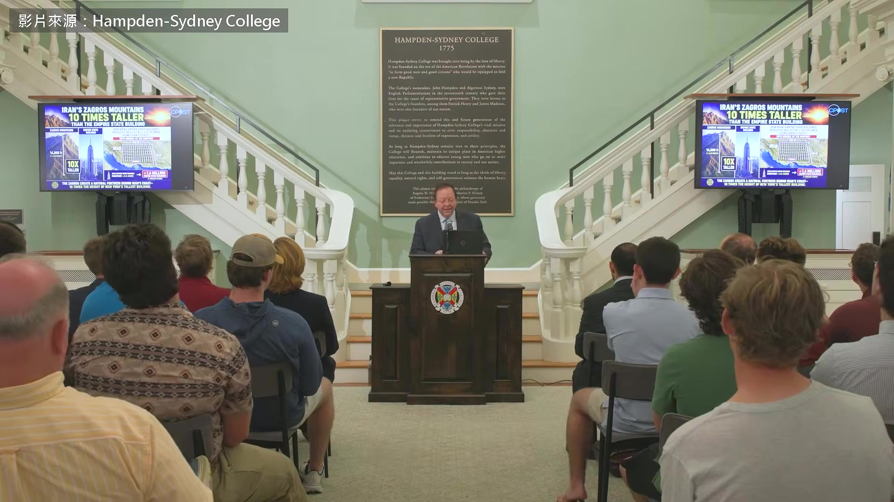

**逐字稿片段：** 無人機真正的麻煩，是山 這整塊區域，幾乎全在伊朗的札格羅斯山脈裡 札格羅斯山脈是非常巨大的山 我們換個方式來想 別想無人機，把它想成雙人加大床墊 你得在一棟摩天大樓裡，找出每一張床墊 把一座山想成一棟摩天大樓 那張床墊可能埋在大樓底下的停車場 可能在 1 樓、7 樓、77 樓 這間教室大概放得下幾張？40、50 張吧 可是這只是一棟大樓裡的一個房間，那棟樓有多大？ 比帝國大廈高 10 倍 你想想看 那 500 乘 500 英里的範圍，放得下幾棟帝國大廈？ 160 萬棟帝國大廈 換個說法，有誰去過曼哈頓？ 好，在那 500 乘 500 英里裡，你要搜的是 11,000 個曼哈頓 所以我們為什麼不去做這個任務？ 為什麼空軍做不了這件事？ 我想你已經看出來了 派陸軍、派 10 萬地面部隊，那又是另一回事 我沒說這件事不管付出多少代價都辦不到

**話題推測：** 指出無人機藏匿的關鍵難題：山區地形

---

## 00:08:03

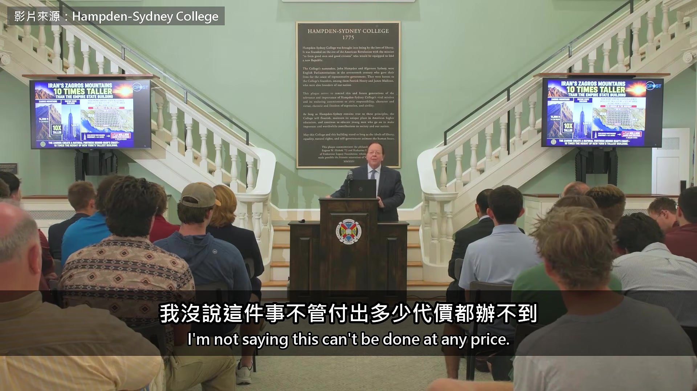

**逐字稿片段：** 他說這場美伊戰爭 剛好是 1991 年波灣戰爭的反面 那一仗美國用精準武器 一個多月就把伊拉克趕出鄰國科威特 全世界從此相信美軍打不敗

**話題推測：** 比較美伊戰爭與 1991 年波灣戰爭的差異

---

## 00:08:14

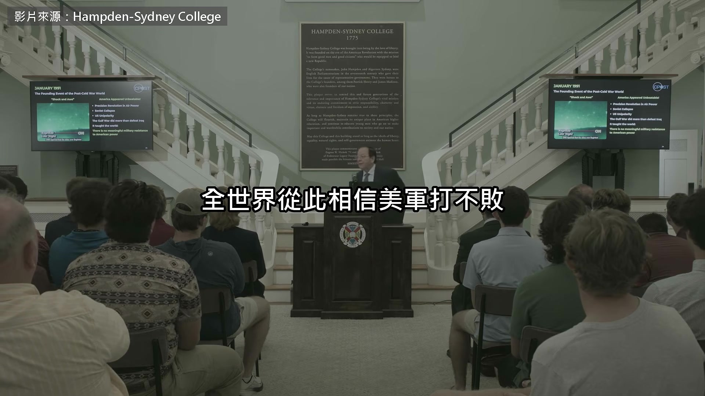

**逐字稿片段：** 30 年後 又便宜又準的無人機從烏克蘭擴散到葉門 再到伊朗，他把這叫做第二次精準革命 最大的後果有這幾個

**話題推測：** 提出「第二次精準革命」的概念及其擴散

---

## 00:08:23

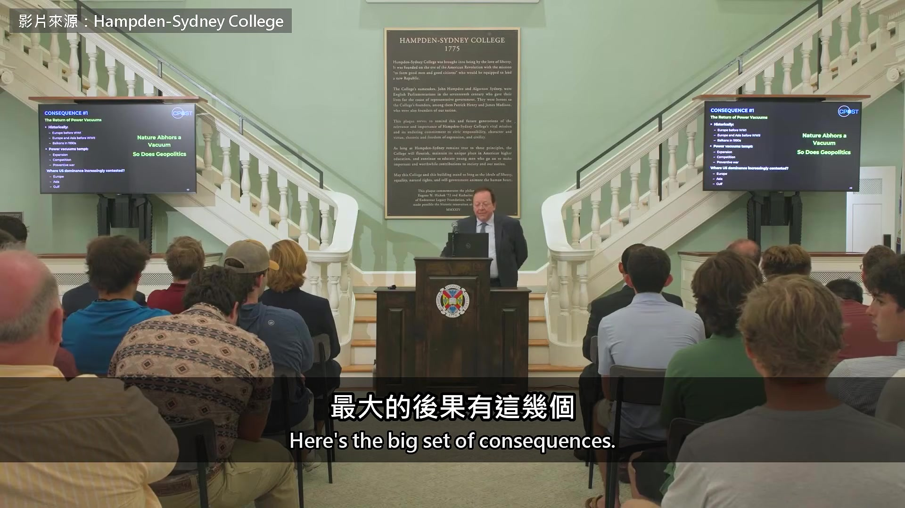

**逐字稿片段：** 第一個，權力真空回來了 這是你們這一代得面對的問題 美國打不敗的形象 原本嚇阻了世界各地那麼多勢力 現在被打碎了 這代表那些地方的權力真空正在擴大 誰擋得住這些權力真空？ 重點不在美國願不願意 兩、三個禮拜前，我人在歐洲議會 我們跟…我跟議員們談了兩個小時 本來是要談美伊戰爭 結果你知道嗎？變成在討論歐洲該拿烏克蘭怎麼辦 你知道我們沒談什麼嗎？ 怎麼說服川普出手救歐洲。完全沒有 歐洲在意的已經不是美國的意願 因為歐洲學到的是，美國沒有這個能力 那是完全不同的一件事 如果歐洲人在烏克蘭這件事上已經這樣想 日本、南韓跟台灣也會這樣想 所以重點不是美國選擇不幫 而是全世界都不覺得我們幫得上忙 就算我們真的出手，他們也很怕越幫越忙 但最大的問題是，他們不覺得我們有這個能力

**話題推測：** 討論第二次精準革命的第一個後果：權力真空再現

---

## 00:09:51

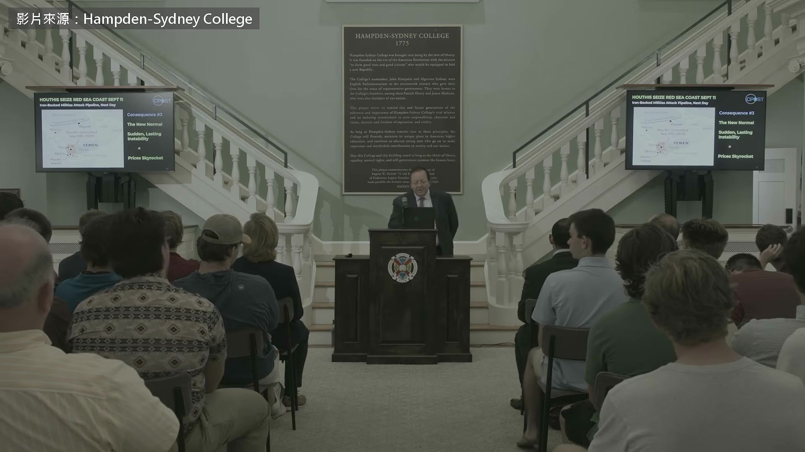

**逐字稿片段：** 葉門有個武裝組織叫胡塞 伊朗在背後撐腰 9 月，胡塞拿下葉門整段紅海沿岸 紅海是亞洲貨船去歐洲最近的路 他說胡塞敢這樣做 就是因為美國已經嚇不住對手了 這波革命接下來還會在別的地方 讓全世界嚇一跳 我要給你們看的最大意外，跟中國和台灣有關 幾十年來，我們一直擔心中國入侵台灣、拿下台灣

**話題推測：** 介紹葉門胡塞組織及其在紅海的行動

---

## 00:10:20

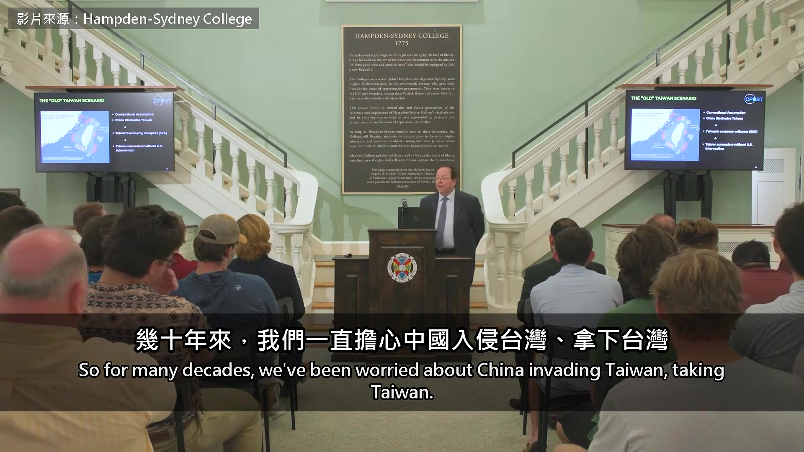

**逐字稿片段：** 有一個大家一直在推演的劇本，叫封鎖劇本 這個劇本我很熟，我上課就在教這個 所以我非常清楚。台灣是一座島 問題來了 第二次精準革命來了以後 如果我們連伊朗的無人機都打不贏 根本不可能對付得了中國的飛彈 各位，這不可能，就是不可能 可是這代表台灣只能孤軍奮戰、什麼都做不了嗎？ 這就是…矛盾的地方 我要讓你們看到，我們確實救不了他們 可是台灣自己呢？

**話題推測：** 討論中國入侵台灣的「封鎖劇本」

---

## 00:11:03

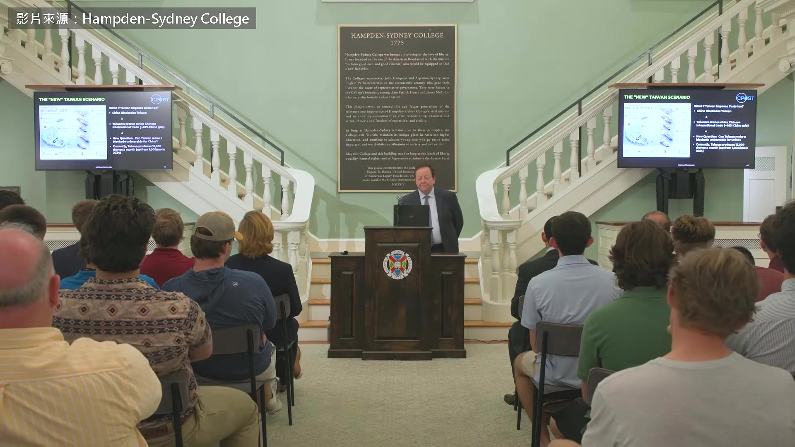

**逐字稿片段：** 把台灣想成下一個伊朗 想像一下，台灣已經有 1 萬架無人機

**話題推測：** 提出將台灣視為下一個伊朗的防禦策略假設

---

## 00:11:11

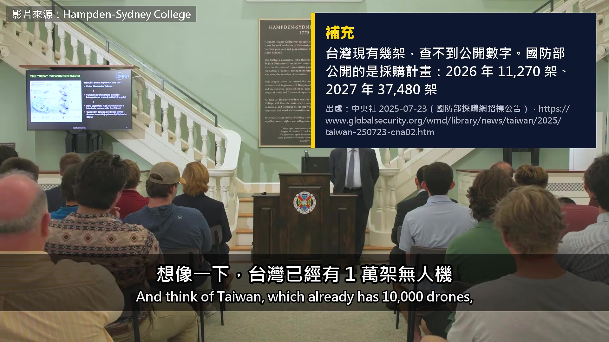

**逐字稿片段：** 用…台灣的無人機去打中國的港口 中國的港口

**話題推測：** 探討台灣使用無人機攻擊中國港口的可能性

---

## 00:11:19

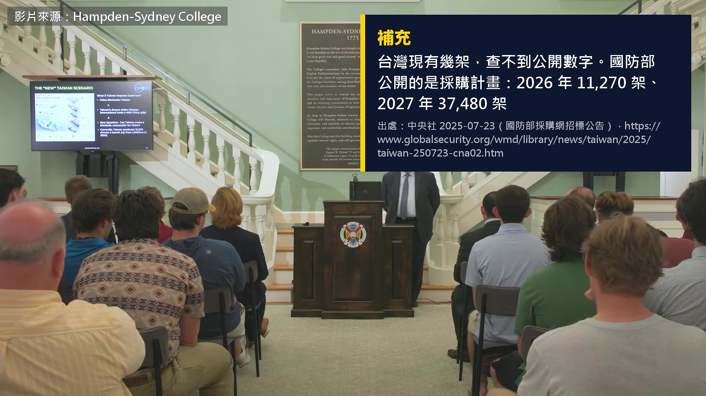

**逐字稿片段：** 那些港口，中國 40% 的貿易…不對，是 GDP 幾乎所有的貿易、40% 的 GDP，都要經過那些港口 台灣的無人機打得到那些港口，就像伊朗的無人機打荷莫茲海峽的船 你不必派兵去占領港口 只要把船擊沉就好 船上都是平民，他們不會想送命 在未來的兩岸戰爭裡，這會大大扭轉局勢 那對我們代表什麼？ 你可能會說，太好了，Pape 教授，那場仗我們不用打 我們少打一場仗。這部分是真的

**話題推測：** 說明中國經濟對這些港口的依賴程度（GDP/貿易數據）

---

## 00:12:09

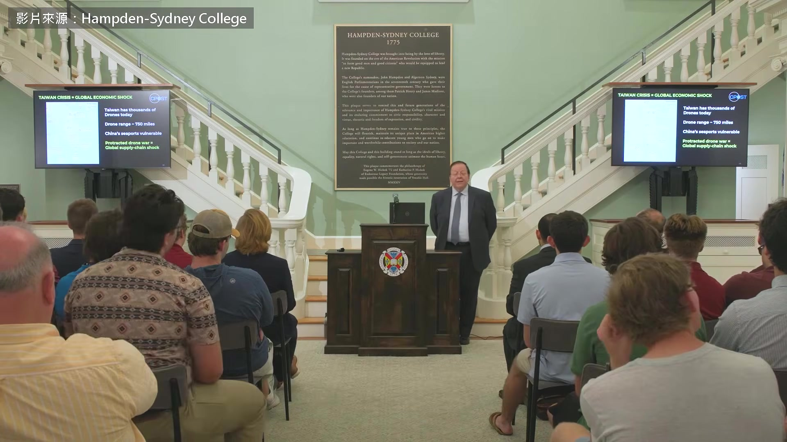

**逐字稿片段：** 可是這代表我們會吃到供應衝擊 你覺得荷莫茲海峽已經夠震撼了？ 等中國的海運停擺 3 個月、6 個月再說 那會在我們國內掀起很大的連鎖效應 利率已經在漲了，這會讓它漲得更高 這就是我們接下來得面對的世界 我認為美伊戰爭對全球的影響，才剛開始 這就是我說的，你們這一代要面對的劇烈變動 抱歉，真希望我能帶來好一點的消息 照 Pape 的推論 轟炸跟封鎖都逼不垮伊朗 美軍打不敗的神話反而先碎了 下一場如果打在台灣海峽 他說美國救不了台灣 自己還會吃到供應衝擊

**話題推測：** 討論台海衝突對全球供應鏈的衝擊

---

## 00:13:05

**逐字稿片段：** 原影片一個多小時 問答時間他還擔心

**話題推測：** 總結原影片的額外內容

---

## 00:13:09

**逐字稿片段：** 美國的備用油庫已經吃緊 胡塞可能趁這時候卡住沙烏地阿拉伯從紅海運出去的油 他也估計 美伊戰爭演變成第三次世界大戰的機率 大約十分之一 原影片連結在說明欄，有興趣可以去聽更多。

**話題推測：** 提及美國備用油庫吃緊的擔憂

---
