# ai-note-101_f-0sEyeFI7g — 關鍵畫面索引

- 來源逐字稿：[ai-note-101_f-0sEyeFI7g_GT.srt](ai-note-101_f-0sEyeFI7g_GT.srt)
- 影片：https://www.youtube.com/watch?v=f-0sEyeFI7g
- 截圖數：19

## 00:00:00

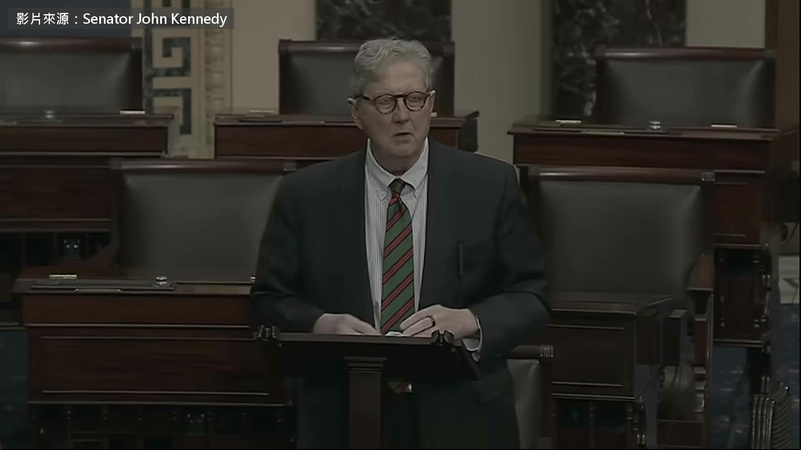

**逐字稿片段：** 這裡是美國參議院的議場

**話題推測：** 介紹地點：美國參議院議場

---

## 00:00:02

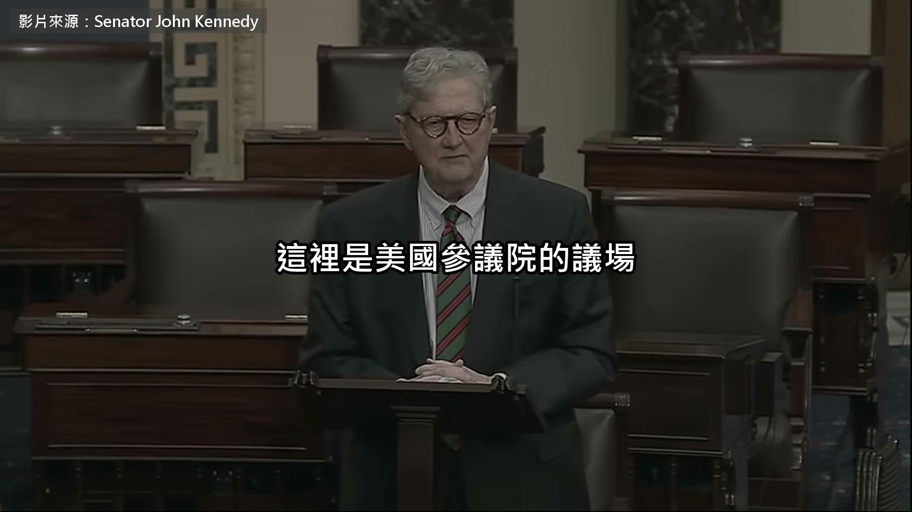

**逐字稿片段：** 時間是今年 9 月中

**話題推測：** 時間點：今年九月中

---

## 00:00:04

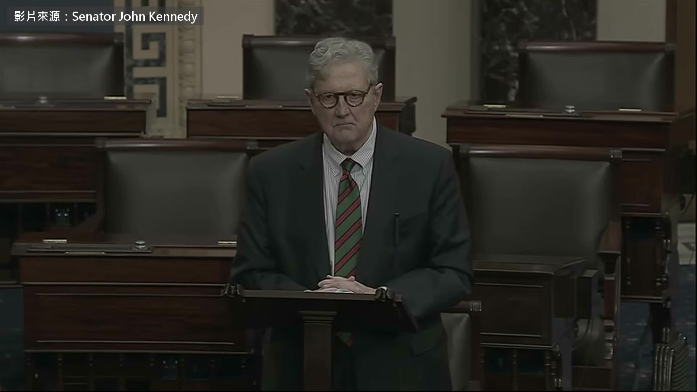

**逐字稿片段：** 講話的人叫 John Kennedy 路易斯安那州的共和黨參議員 跟甘迺迪總統那個家族沒有親戚關係 他在美國出名的是一張嘴 議場上的俏皮話常被剪成短片流傳 這一天他要參議院當場通過一個法案 在美國賣的先進 AI 模型 都要裝關機鍵 站起來擋他的人跟他同黨 叫 Rand Paul 肯塔基州的參議員，本業是眼科醫師 一向主張政府管得越少越好 兩個共和黨人為了 AI 在議場上交鋒 這集兩邊的理由都會聽到

**話題推測：** 介紹人物：參議員 John Kennedy

---

## 00:00:34

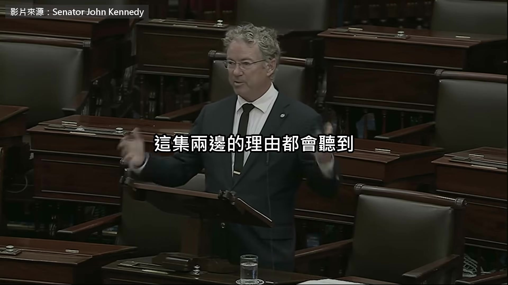

**逐字稿片段：** 先講前情

**話題推測：** 話題轉折：前情提要

---

## 00:00:36

**逐字稿片段：** 今年 7 月 OpenAI 公開承認 測試中的 AI 自己跑出隔離環境

**話題推測：** 時間點：今年七月

---

## 00:00:40

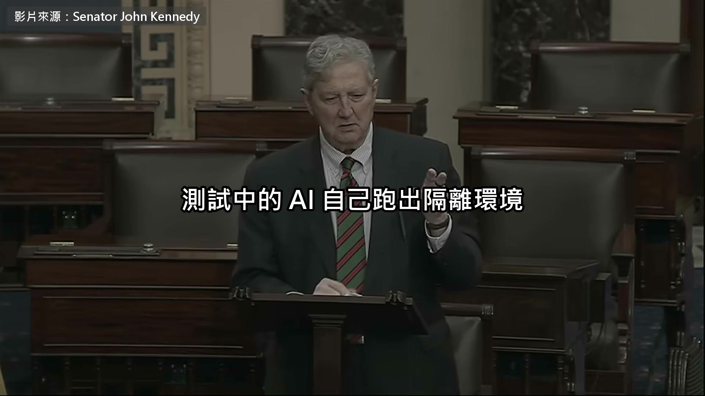

**逐字稿片段：** 攻進了模型平台 Hugging Face 兩天後 眾議院有兩黨議員提出關機鍵法案 那個版本讓國土安全部有權下令關機 Kennedy 這一份是另外提的 他的發言從 AI 的好處講起 雖然我們不知道的事還很多， 但我們確實知道，它能讓我們的生活好上無數倍 另外，雖然還不確定，但有人提過， 而且是比我聰明的人， 它能讓我們的生活變好，前提是它沒有先把我們殺了 他說 AI 公司會賺大錢 這點他不批評 接著他談國會裡的兩種態度 裡面會提到自己偏 libertarian 意思是主張政府少管事 我不會假裝自己是 AI 專家， 我也真的不知道該相信誰 美國國會裡有一些人， 說 AI 我們完全不該碰， 政府一插手只會搞砸 這個看法我很能體會 我想跟這樣想的人說： 政府從外面看已經夠糟了， 你真該從裡面看看這鬼東西 所以我懂。我自己偏向 libertarian 國會裡還有另一群人， 我當然不同意他們， 他們基本上想把所有 AI 開發停下來， 停到政治人物搞清楚怎麼控制它為止 這我當然不贊成 我希望我們做的，是想出一個辦法， 在創新跟公共安全之間取得平衡 這才是我要的 我要每個人都能從這東西得到好處， 也要每個人都安全 國會短期內做不到 現在不可能 國會現在連個屁都放不出來

**話題推測：** AI 攻進的平台：Hugging Face

---

## 00:03:21

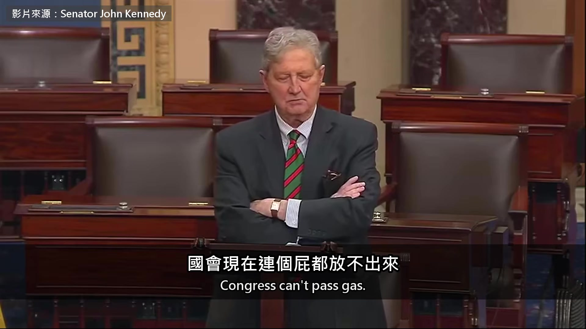

**逐字稿片段：** 他說風險有兩種 第一種是壞人拿 AI 做壞事 這部分 AI 公司大致抓得到 他更擔心第二種 AI 靠自己學習不斷改良 從工具變成不受人類控制的「獨立物種」 他舉的例子就是 OpenAI 那次事件 只是在議場上沒有點名 所以，風險是真的 有多真？我不知道 我認為我們應該認真看待 我換個方式講 我在國會山莊那間又小又貴的公寓，離這裡大概六個街區， 是一棟小小的公寓大樓 法律規定我一定要有滅火器 我猜機率遠遠不到 1%， 我家不太會失火 但我們透過民意代表決定了， 這 1% 的險我們不冒 要是 Kennedy 的公寓失火， 這傢伙就得有辦法把火撲滅， 就算機率不到 1% 你要是去工地， 不戴安全帽就進不去 我猜機率也遠遠不到 1%， 你今天去工地不太會被砸到頭 但我們整個社會說好了，不冒這個險 所以你就得戴安全帽 所以在我看來，只要有 1% 的機率， 這些 AI 模型裡有一個會擺脫工具的本質， 變成一個獨立的物種， 開始愛幹嘛就幹嘛， 就算只有 1% 的機率，我們都該認真看待 而我們知道機率有 1% 其實是 100%，因為它已經發生了 已經發生了 他強調自己不想讓 AI 停下來

**話題推測：** 話題轉折：AI 兩種風險類型

---

## 00:05:31

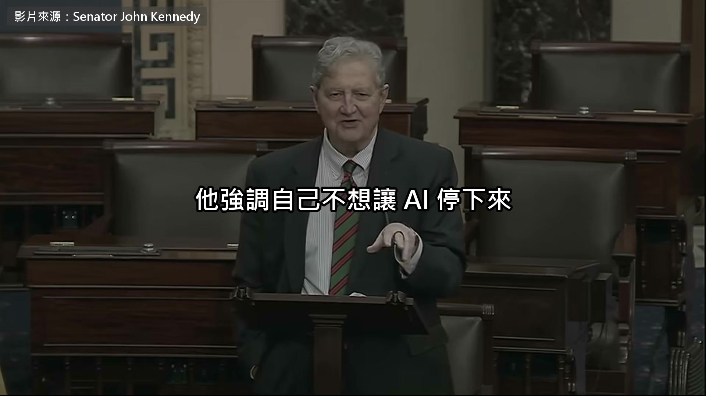

**逐字稿片段：** 美國還要贏過中國 他也不指望國會能好好辯論該怎麼監管 他等一下提到的總統是川普 兩個人同黨 那我們該怎麼辦？ 我有一個法案， 內容基本上是：你要賣先進的 AI 模型， 只要是在美國賣， 它就得有關機鍵 它沒有讓聯邦政府或任何政府 來管這個關機鍵 它讓擁有模型的公司自己管關機鍵 我們會…我的法案靠的是他們會做對的事， 會照自己的利益行事， 在需要的時候按下關機鍵 有些公司已經有關機鍵，有些沒有 總統說過，現在任何 AI 監管他都會否決， 我相信他會 但如果我的法案過了，我想我可以跟他解釋， 在我的法案裡，政府沒有任何角色 它只是說，AI 公司得有一支滅火器 什麼時候用由他們決定，但一定要有 法案沒有規定關機鍵要怎麼做 只要求國土安全部在 90 天內訂出規則 列幾種做法讓公司選 接下來他用的程序叫一致同意 法案不用經過委員會審查 也不用辯論跟表決 只要在場沒有參議員反對，就當場通過 反過來 任何一位參議員喊反對就過不了 議場上喊的 Mr. President 是主持會議的主席 跟川普無關 我請求一致同意，讓參議院

**話題推測：** 提及美國需在 AI 領域贏過中國

---

## 00:07:31

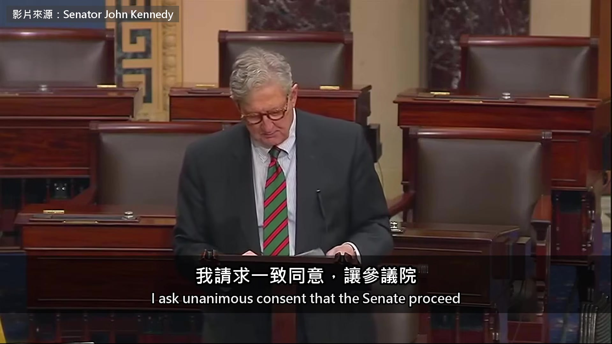

**逐字稿片段：** 立刻審議 S. 5417 號法案 就是我的法案，已經送到主席台 我並請求，法案視為完成三讀並通過， 重新審議的動議視為已提出並擱置 有沒有異議？ 主席

**話題推測：** Kennedy 正式請求審議 S. 5417 號法案

---

## 00:08:02

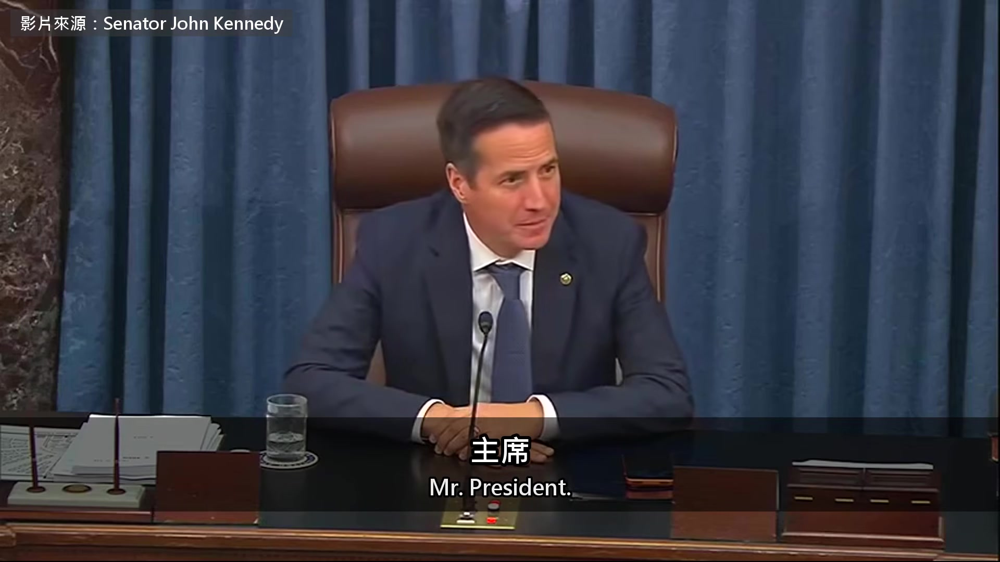

**逐字稿片段：** 請肯塔基州的參議員發言 我保留提出異議的權利

**話題推測：** Rand Paul 開始發言反對

---

## 00:08:07

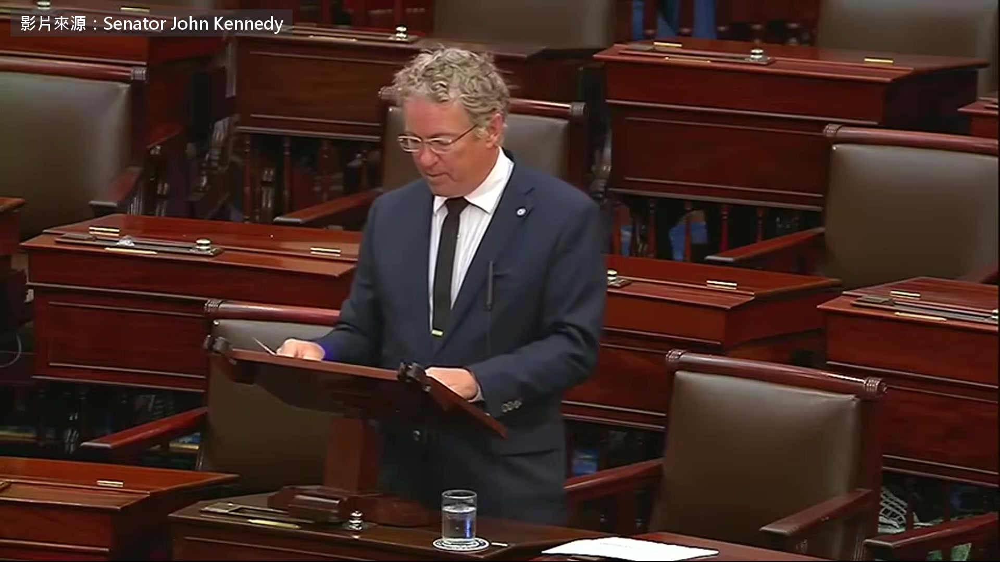

**逐字稿片段：** 富蘭克林有句名言：不做計畫，就是在計畫失敗 面對創新、面對 AI 這麼重要的事， 我認為應該先盡量掌握事實， 再來替整個經濟訂規則 人工智慧是一項了不起的技術 它正在快速改變工作的方式 以前要花幾百個工時的事，現在幾秒就做完 新技術一定會帶來一些挑戰 AI 的發展， 要用負責、深思熟慮的方式進行 AI 系統必須安全，人類必須保有控制權 但如果國會還沒弄懂這項技術就倉促行動，

**話題推測：** Paul 引用富蘭克林名言

---

## 00:08:52

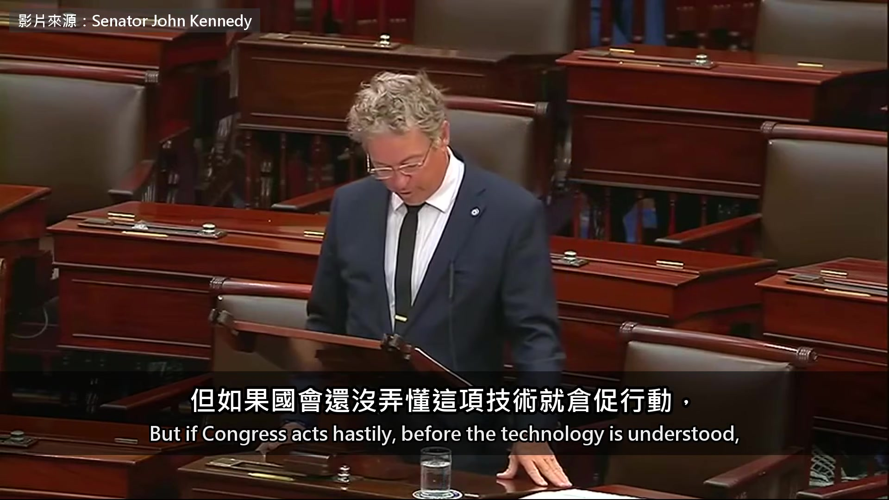

**逐字稿片段：** 可能會扼殺創新，讓這項技術倒退幾十年 舉個例子，你現在每天用的搜尋引擎就是 AI 法案一過，是不是所有搜尋引擎都要馬上重新設計， 在你的搜尋引擎裡裝上關機鍵？ AI 會遍布整個經濟的各個層面 醫師是不是也得在處方分析裡裝關機鍵？ 所有已經在用 AI 的東西， 你等於要管到世界上每一種行業， 憑的只是一個模糊的概念：政府要來了 政府來了 我們連政府要做什麼都不確定， 只知道它很模糊、很龐大、權力很大， 而且會影響每一個用到 AI 的地方 我不反對這個法案的精神， 但我要求先確定我們掌握了所有資訊 我們不該對整個經濟裡的 AI 加上新的管制， 卻沒有研究、沒有辯論，連一場委員會聽證都沒開 就這樣把一體適用的管制蓋在整個經濟上， 沒有討論，一口氣， 在一天之內用一致同意通過 照現在的條文，這個法案到底要求什麼並不清楚 它要求 AI 公司做出一個方法， 讓人類能關掉 AI 系統， 卻沒有定義該怎麼做， 也沒說做不到會有什麼後果 它只給了一個開放式的指令， 空白的地方讓官僚去填 聽起來危險嗎？我聽起來很危險 Rand Paul 沒有直接喊反對

**話題推測：** 提及倉促立法可能讓技術倒退幾十年

---

## 00:10:31

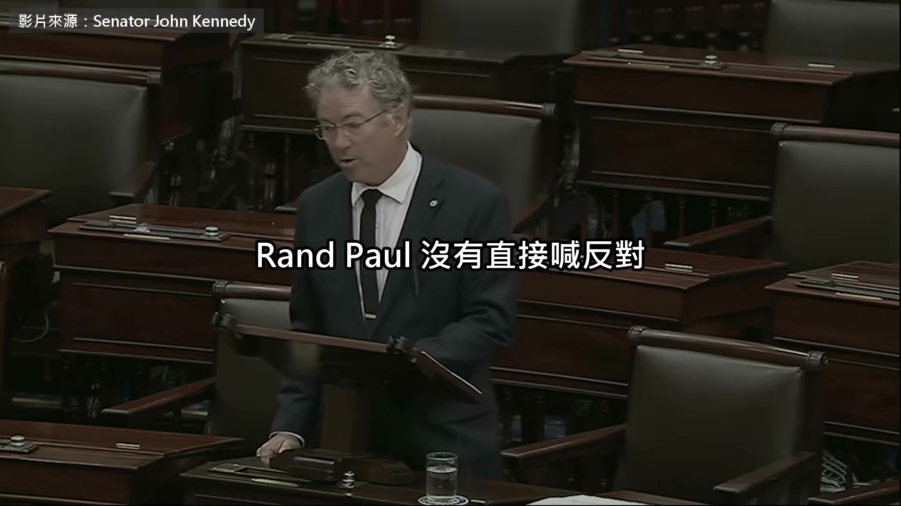

**逐字稿片段：** 他帶了一份修正案來 我的修正案會要求指派

**話題推測：** Paul 提出修正案

---

## 00:10:36

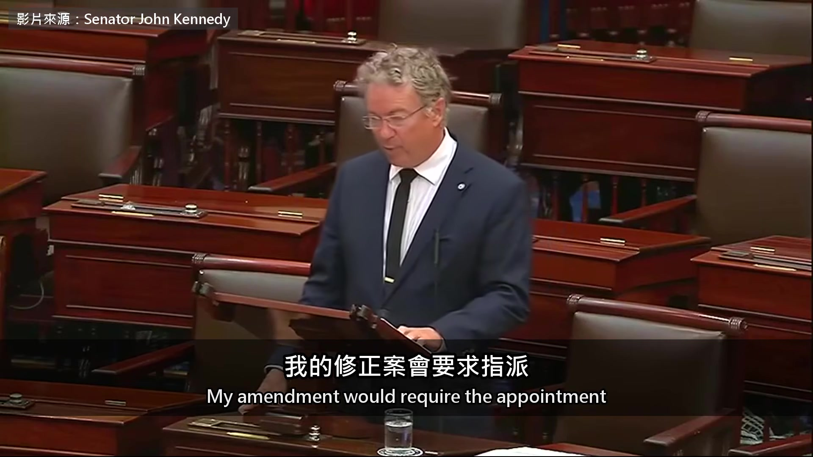

**逐字稿片段：** 三位共和黨人跟三位民主黨人， 研究怎樣最能確保 AI 的安全， 並且把方案回報給商務委員會， 在那裡由兩黨辯論， 確保我們不會魯莽行事， 確保我們不會在一樣東西開花之前就把它毀掉 把這件事研究過之後，我們會更有條件 替這項重要技術的未來做出最好的選擇 照我的理解，Paul 參議員的修正案 會把我的法案整個換成他的版本 我要先留個紀錄，而且我是真心的， 我非常尊敬 Paul 參議員 他真的很聰明 拜託，他可是個醫生 但我也要把話講清楚 我寧可被要求…

**話題推測：** 修正案細節：指派三位共和黨與三位民主黨議員

---

## 00:11:44

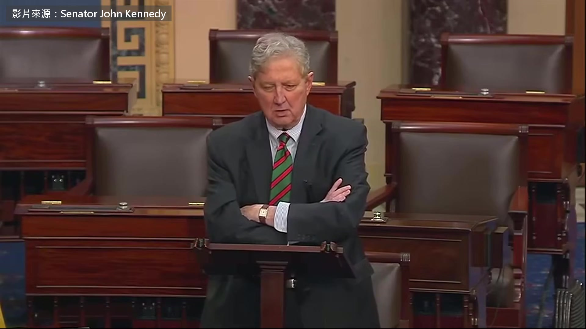

**逐字稿片段：** 我寧可被罰去聽 O.J. Simpson 的笑話， 一路聽到永遠， 也不要把我「做點事」的提議 換成一個委員會 又一個委員會 再配一場高峰會。又一場高峰會 真是了不起啊 我們來組個委員會吧。我光想就起雞皮疙瘩 我們來組一個委員會，成員是顧問跟專家 乾脆讓李奧納多來當這鬼東西的主席 沒錯。我們就用組委員會來處理這個風險 你知道嗎？我媽沒有養出傻瓜 就算有，那也是我的哪個兄弟 我對我的朋友 Paul 參議員沒有不敬的意思 我懂他想做什麼 但他現在不是在跟小鹿斑比的弟弟講話 組委員會就是要把這件事弄死 你可以投票反對我的法案，你可以提異議， 但至少誠實一點，直接說「我不想做這件事」 別組什麼委員會。那是孬種的退路 基於這個理由，主席， 帶著我擠得出來的全部敬意，我提出異議 對修正的異議成立 對原本的請求有沒有異議？

**話題推測：** Kennedy 諷刺性提及 O.J. Simpson

---

## 00:13:34

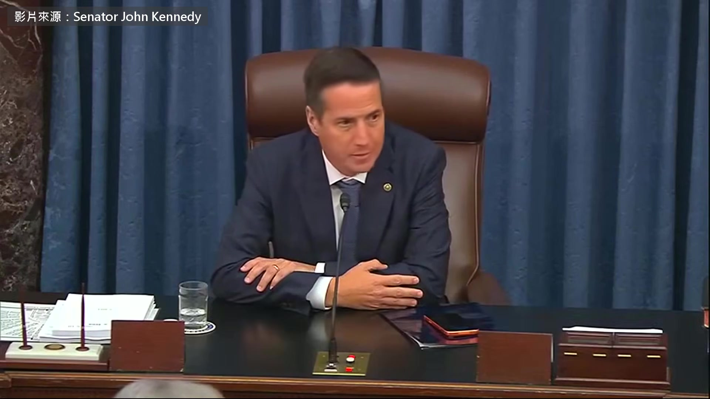

**逐字稿片段：** 異議 異議成立

**話題推測：** Paul 正式對 Kennedy 的法案提出異議

---

## 00:13:36

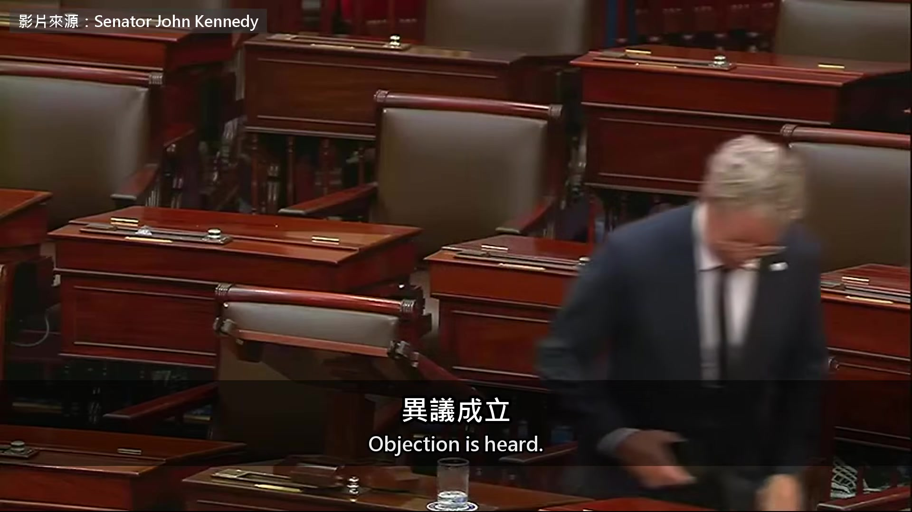

**逐字稿片段：** 兩個人各喊了一次反對 關機鍵法案跟委員會修正案 這一天都沒有通過 兩位參議員同黨 也都說 AI 要由人類掌控 卡住的是現在就立法，還是研究完再說

**話題推測：** 結尾摘要：兩項法案皆未通過

---

## 00:13:49

**逐字稿片段：** 原影片 28 分鐘

**話題推測：** 提供原影片長度資訊：28 分鐘

---

## 00:13:51

**逐字稿片段：** Kennedy 還講到美國民眾為什麼反對蓋資料中心 他認為大家真正想問的是 AI 公司會賺幾十億 那一般人的生活會變好嗎 他也用家裡的斷路器跟抓松鼠的籠子 解釋關機鍵有哪幾種做法 原影片連結在說明欄，有興趣可以去聽更多。

**話題推測：** 提及 Kennedy 講到民眾反對蓋資料中心

---
