# ai-note-101_n3fXJ6MumSA — 關鍵畫面索引

- 來源逐字稿：[ai-note-101_n3fXJ6MumSA_GT.srt](ai-note-101_n3fXJ6MumSA_GT.srt)
- 影片：https://www.youtube.com/watch?v=n3fXJ6MumSA
- 截圖數：17

## 00:00:01

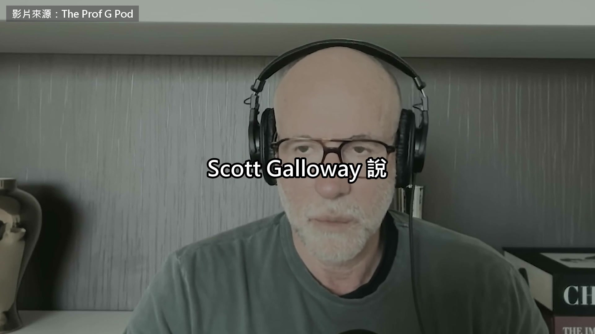

**逐字稿片段：** 中國的 AI 模型價錢只要美國頂尖模型的 35 分之 1 他認為這是傾銷，矽谷撐不了多久 Galloway 在紐約大學商學院教行銷 寫過《四騎士主宰的未來》 2019 年 WeWork 準備上市 他公開說那個估值撐不住 一個多月後上市案就撤了 這集是他的 podcast 9 月 3 號上架

**話題推測：** 新數字：中國AI模型價格與美國頂尖模型的比較。

---

## 00:00:22

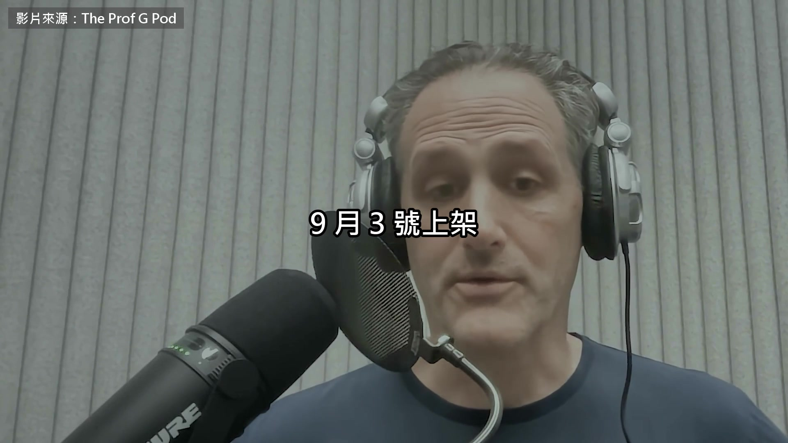

**逐字稿片段：** 來賓 Josh Tyrangiel 是《大西洋月刊》的記者 剛出了一本書叫 AI for Good 講中國之前 兩個人先談了一個聽起來很極端的主張 政府把 AI 公司收歸國有 Tyrangiel 說喊這件事的人裡面有兩個名字 Bernie Sanders 是自稱民主社會主義者的參議員 Steve Bannon 是川普第一個任期的白宮首席策略長 兩個人站在美國政治的兩頭 這個想法在很多地方都有人提過

**話題推測：** 介紹來賓 Josh Tyrangiel 的背景。

---

## 00:00:48

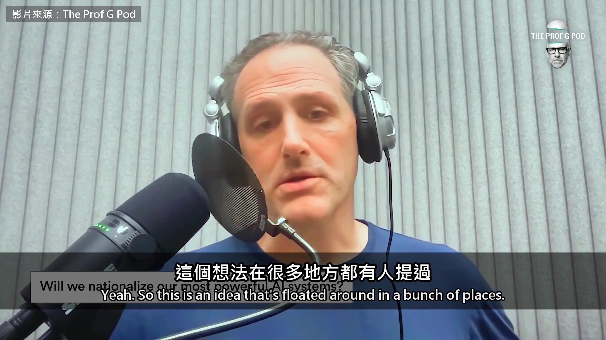

**逐字稿片段：** GPT-3.5 剛出來沒多久，我第一次跟 Sam Altman 談 那是 2023 年初 我跟他說，這東西看起來很強 政府該不該把它接管過去？ 他說，你這樣問很有意思 2017 年我跑了聯邦政府好幾個單位 跟他們說，我們覺得你們可能會想把這個收歸國有 結果沒人理 我心想，這有意思 等等，我先喊個暫停 我聽起來像在唬爛，這是真的嗎？ 聽著，AI 圈炒作成這樣，誰講的話我都不直接信 所以我去查了 我特別去問了國防部的人 國防部說沒聽過這件事，沒聽過 Sam Altman 應該說，他們知道他是誰，但沒談過這種事 我也問到行政部門的一個人，他說，對，可能有過這回事 我心想，喔，好吧 2017 年有人說不會把 AI 收歸國有，我不怪他們 因為那時候根本沒有東西能證明你在講什麼 我舉這個例子只是要說 這個主張，做 AI 的人自己提過 反對 AI 的人也提過，包括 Bernie Sanders，包括 Steve Bannon 因為他們覺得… 我認為民粹就是在這裡，變成 AI 辯論裡很重要的一塊 他們不相信我們這套制度管得了 AI 所以走到這個很極端的想法，反正我們永遠管不了 那就去拿董事席次，或是拿…

**話題推測：** 提及 Sam Altman 及其與政府討論的經歷。

---

## 00:02:30

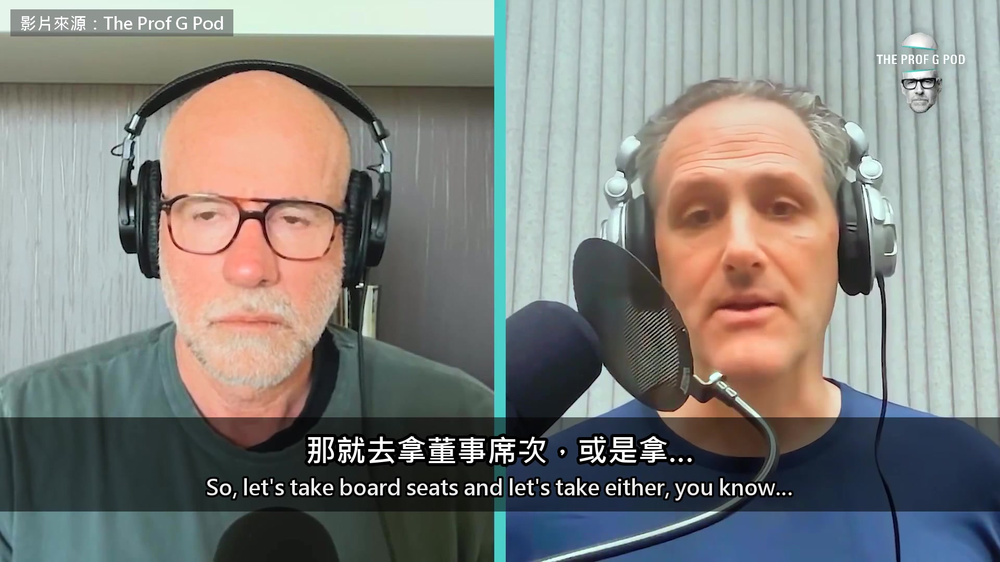

**逐字稿片段：** Steve Bannon 想拿下這些公司 50% 以上 我覺得那很多，在現代美國沒有前例 但這個想法一直冒出來，很值得玩味 因為我想大家是真的擔心，我們管不住這些公司 也真的擔心後面會有不好的影響 我很希望我們除了一句收歸國有，還能想得更細一點 但也許我們做不到

**話題推測：** 提及 Steve Bannon 對AI公司控制權的具體主張（拿下50%以上股份）。

---

## 00:02:59

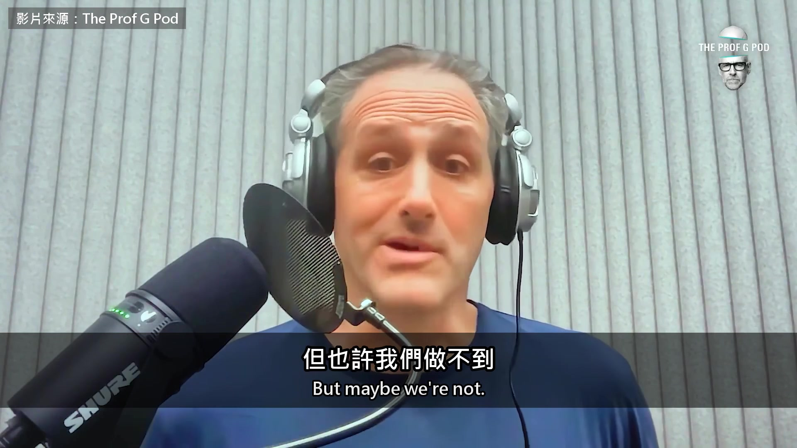

**逐字稿片段：** Galloway 接著拿原子彈來比

**話題推測：** 引入原子彈和曼哈頓計畫的比喻。

---

## 00:03:02

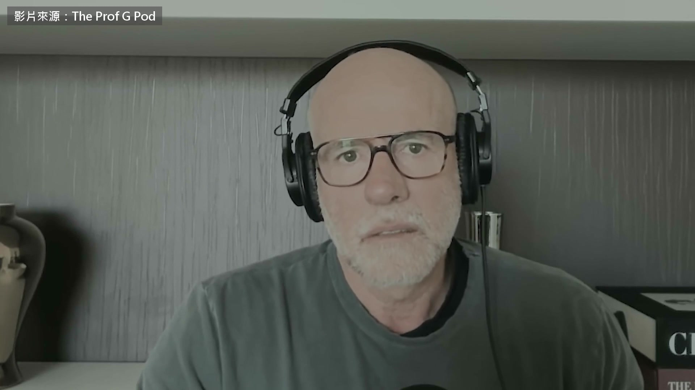

**逐字稿片段：** 美國當年做原子彈的曼哈頓計畫 從頭到尾是政府出錢、軍方在管 帶領實驗室的科學家就是奧本海默 這個想法沒有聽起來那麼瘋 因為如果你相信 AI 公司的創辦人跟幾位高層講的 這項技術比核分裂還強… 核彈是核分裂還是核融合？我老是搞混 總之，如果它比核彈還強 我們當年會讓奧本海默開一家公司 把產品賣給 LVMH、把核彈賣給法國嗎？ 所以這個想法很有道理 你說得對，細的地方在於，我覺得已經太晚了 不管 Sam Altman 怎麼講，還有那些喊著來管我們的人，那種話很可笑

**話題推測：** 提及曼哈頓計畫的政府主導性質。

---

## 00:03:59

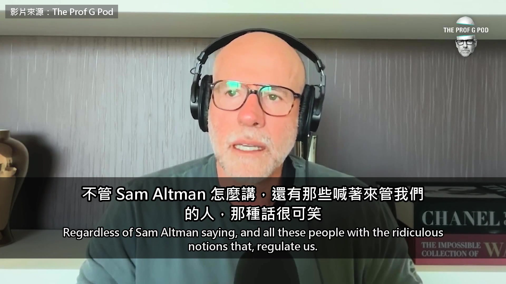

**逐字稿片段：** 還記得 Facebook 的 Sheryl Sandberg 說他們歡迎監管嗎 同一時間卻派出幾百、甚至幾千個律師，擋下任何像是監管的東西 我覺得細的做法是，好，最少最少，先管住它們

**話題推測：** 提及 Sheryl Sandberg 和 Facebook 對監管的態度。

---

## 00:04:14

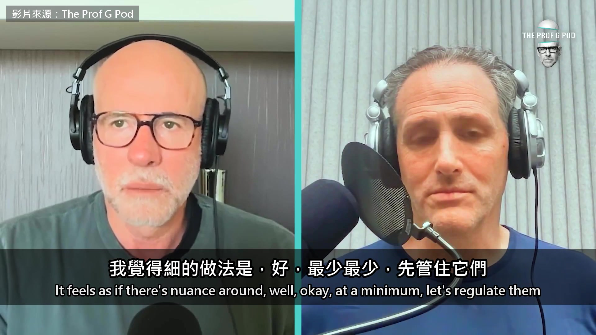

**逐字稿片段：** 甚至做一些大膽的事，比如設 60 天的等待期 找一個認真的專家小組，有你這樣的人，有經濟學家，有技術專家 先把這些東西往死裡測，再放出去給大眾用 我們連這個都沒有 沒有 你提到核武，我剛開始跑這條線的時候 聽到有人拿核能跟 AI 比，我是有點懷疑的 因為很明顯，如果你在炒作自家的 AI 產品 你說它有能力毀滅世界，是會嚇到一些人 但也會讓另一些人很興奮 他們想知道，一套能毀滅世界的軟體，報酬率是多少

**話題推測：** 提出AI模型上市前應設60天等待期的具體建議。

---

## 00:04:54

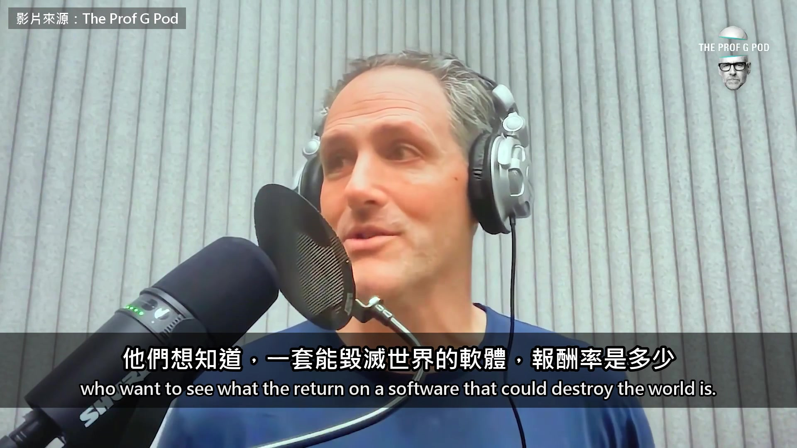

**逐字稿片段：** 但後來有人提到，國際上其實真的有核子監管 它不完美，但大致上是成功的

**話題推測：** 引入國際核子監管的案例。

---

## 00:05:04

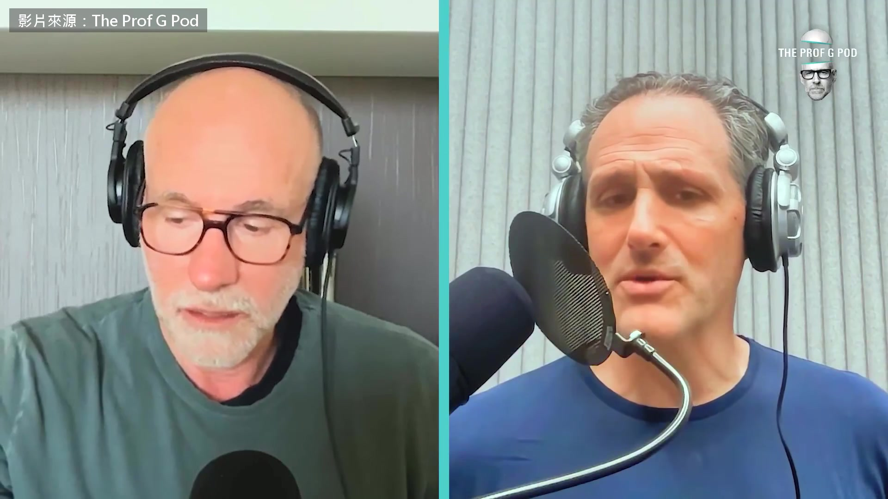

**逐字稿片段：** 所以我們能不能比照國際原子能總署 你手上有哪些核材料，一定要申報 一定要開放檢查 超過一定規模的模型，要先送國際監管機構確認安全 而這件事每次都死在同一個地方，我一直很好奇為什麼

**話題推測：** 提出比照國際原子能總署監管AI的建議。

---

## 00:05:28

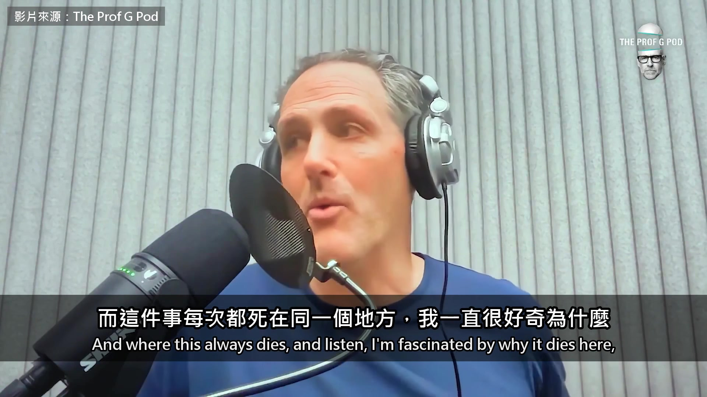

**逐字稿片段：** 就是我們剛提到的那些人會說：「對，可是中國。」 可是中國怎樣？ 這種話從來沒人細想，我們就是假設自己知道中國想從 AI 得到什麼 但我們真的知道嗎？ 有意思的是，川普跟習近平今年春天第一次談了 AI 我認識的每一個報導中國、寫中國、研究中國的人，講的都一樣 中國想從 AI 得到的，跟它想從任何事得到的一樣，就是穩定 他們要穩定 所以這兩個大國，在全球這件事上要的東西差不多… 他們都想當世界的老大 AI 會不會是那種可以坐下來說 至少我們兩邊都照這個方式來管的事？ 我們沒試過，但我們手上有一個蠻成功的範本 我聽過其他人也在談 我想其他國家一定樂見某種制度在這裡運作起來 但我目前還感覺不到什麼進展

**話題推測：** 引入對中國在AI領域擔憂的討論。

---

## 00:06:34

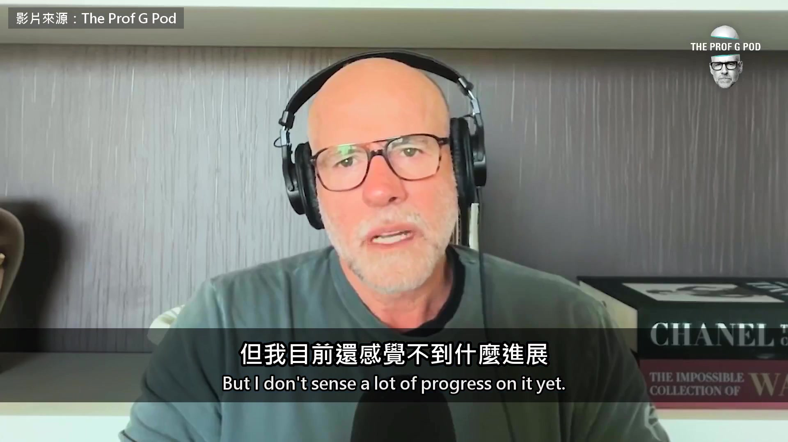

**逐字稿片段：** 中間聊烏克蘭無人機的部分先跳過 Galloway 接下來的論點 要先補兩段背景

**話題推測：** 標示話題轉折，跳過烏克蘭無人機內容。

---

## 00:06:39

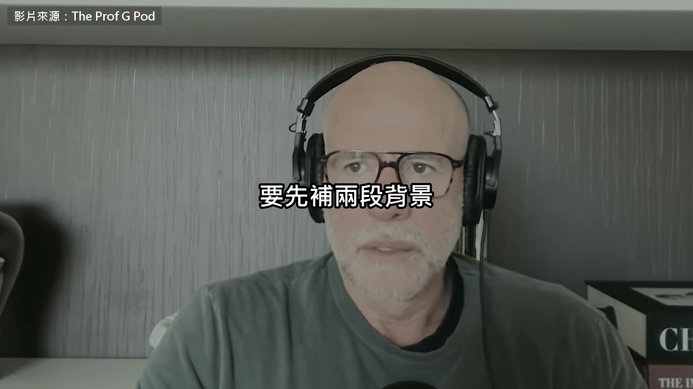

**逐字稿片段：** 第一段是傾銷 意思是用低於正常價值的價錢出口 通常是比在自己國內賣得還便宜 不一定有政府補貼 中國的鋼鐵就被美國跟歐洲這樣指控過 第二段是東京跟底特律 東京指日本車廠 底特律是美國三大車廠的大本營 1970 年代石油危機之後 日本車靠省油跟便宜打進美國 三大車廠在本土的市占從將近九成掉到不到一半 2008 年豐田的全球銷量超過通用 隔年通用跟克萊斯勒聲請破產保護 我想談一下 AI 跟中國 我提一個論點，請你回應

**話題推測：** 定義「傾銷」的概念。

---

## 00:07:17

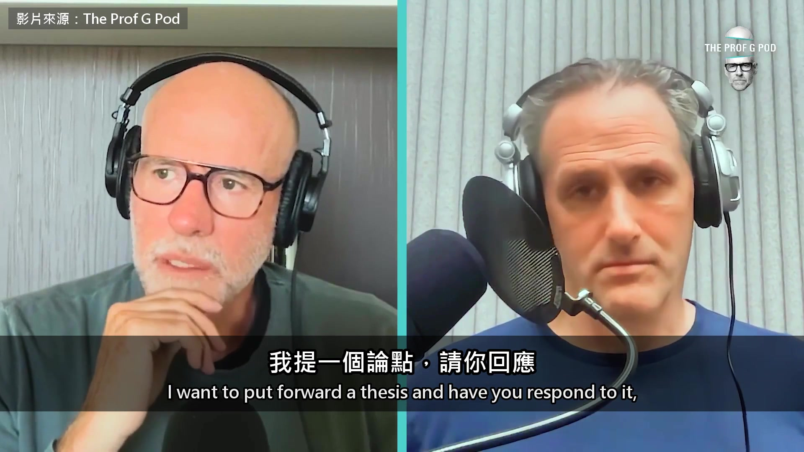

**逐字稿片段：** 我認為中國在 80、90 年代對鋼鐵業做的事 現在正在 AI 上重來一次 它在做的是…我認為這是商業界最大的一條新聞 它正在大規模傾銷 AI，用的是拿了補貼的便宜大型語言模型 全美國的財務長，現在越來越常追問投資報酬率

**話題推測：** 將中國在鋼鐵業的行為與AI領域進行歷史對比。

---

## 00:07:41

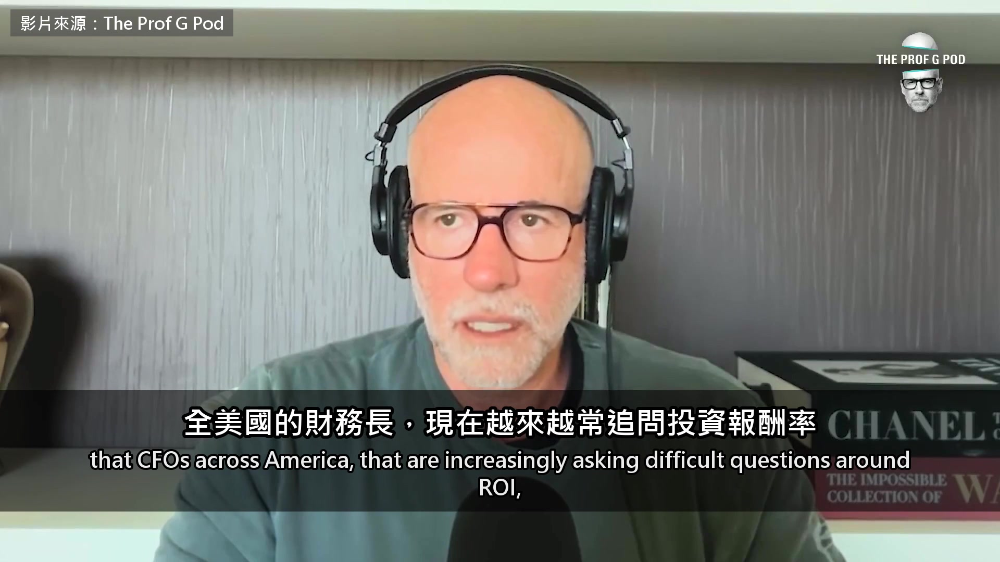

**逐字稿片段：** 他們會改用次一級的模型，價錢只要頂尖模型的 35 分之 1 北京只要 30 週，就會對矽谷做出 底特律…抱歉說反了，是東京花 30 年對底特律做的事 你怎麼看這個論點？ Tyrangiel 的回答會提到蒸餾 這是一種訓練方法 拿別人的大模型當老師，大量對它提問 再用它的回答訓練自己的模型 成本比從頭做低很多 完全有可能，這很說得通 我補一件背景 就是我們到現在還不知道，蒸餾佔了多少 蒸餾說穿了就是盜版

**話題推測：** 重申中國AI模型價格優勢的關鍵數字（35分之1）。

---

## 00:08:27

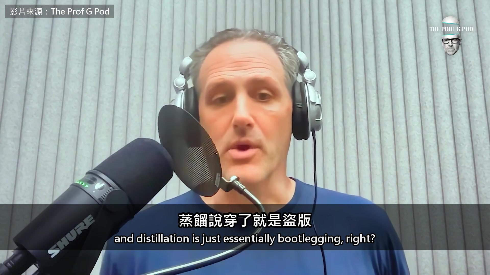

**逐字稿片段：** Anthropic 或 OpenAI 每推出一個新模型 原本大家認為，它們會領先中國 9 個月到 1 年 不管是模型的成熟度還是規模 但我們現在看到，這個差距縮得很快 這些實驗室指控的是，中國這些模型是蒸餾來的，等於偷去再改 對，這就是典型的智慧財產權竊盜 80 年代以來，每個重要產業都看過這種事，從… 所以在供給這一端，他們指控對方根本是直接偷產品 但能把價格壓得比你低，這件事影響很大 中國這套打法，我們在絲路沿線看過 在非洲看過，在拉丁美洲也看過 他們會補貼成本，讓一整個國家的客戶改用中國產品 然後他們贏兩次 一方面，他們打進了這些國家的文化，拿到資料 客戶會綁在他們的基礎設施上很長一段時間 另一方面，他們搶走了美國公司的錢 美國公司現在的問題是，它們的 AI 還沒找到賺錢的方法 算力的成本、能源的成本都太高 它們不得不做的事對客戶又很傷，就是把客戶鎖在某一個平台上 所以很多財務長、營運長的反應是，這我付不起 尤其是現在，我相信你也常聽到 你去跟執行長聊，他們會說這有點像 60 年代的廣告 有一半有效，我只希望知道是哪一半 現在變成，好，電腦…我是說 AI，是有用 但到底是哪一個環節起了作用？ 為什麼我的 token 費用高得這麼離譜？ 為什麼我查不出浪費在哪裡？ 為什麼費用還一直往上衝？ 所以一定會這樣，有人拿出一樣好的東西，或者差個 10% 但價錢只要 30 分之 1，你就會搬過去 我估計要不了多久，我們就需要一個政治上的解法 Galloway 說收歸國有已經來不及 美國現在連模型上市前審一輪的機制都沒有 Tyrangiel 則認為 中國的低價模型很快就會逼美國拿出政治上的解法 原影片一個多小時

**話題推測：** 提及兩家頂尖AI公司 Anthropic 和 OpenAI。

---

## 00:11:02

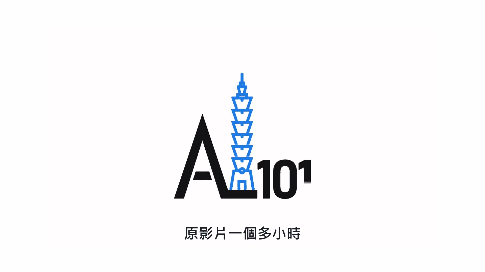

**逐字稿片段：** Tyrangiel 還講了克里夫蘭診所的例子 醫院用 AI 預測敗血症 一年下來院內的敗血症死亡率降了 41% 兩個人也談了 AI 會不會搶走工作 他說經濟學家在吵的是速度 電力取代蒸汽機花了 40 年 AI 會不會只要 3 年 原影片連結在說明欄，有興趣可以去聽更多。

**話題推測：** 提及克里夫蘭診所使用AI預測敗血症的案例。

---
