# ai-note-101_o5X5ghk5aT0 — 關鍵畫面索引

- 來源逐字稿：[ai-note-101_o5X5ghk5aT0_GT.srt](ai-note-101_o5X5ghk5aT0_GT.srt)
- 影片：https://www.youtube.com/watch?v=o5X5ghk5aT0
- 截圖數：23

## 00:00:05

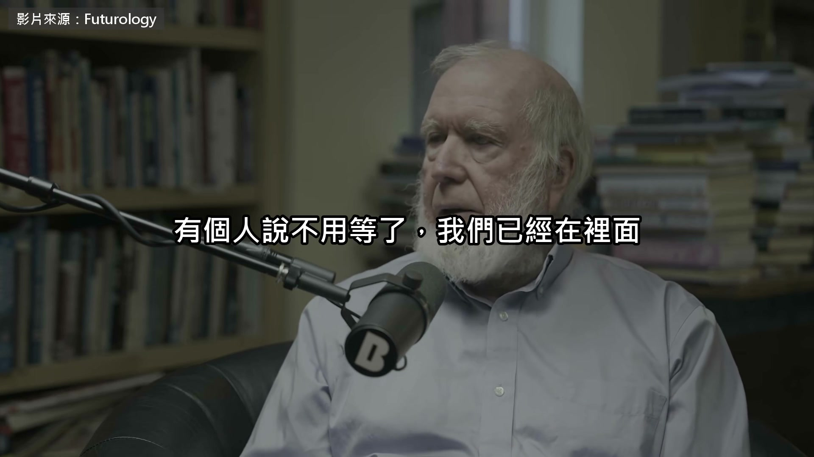

**逐字稿片段：** 他叫 Kevin Kelly 美國的科技雜誌《WIRED》1993 年創刊 他是第一任執行主編 2016 年他在《必然》這本書裡寫 以前通了電的東西 接下來都會通上 AI 這是 podcast《Futurology》今年 9 月上線的訪談 到他家裡錄的

**話題推測：** 介紹主要講者 Kevin Kelly 的姓名與頭銜

---

## 00:00:21

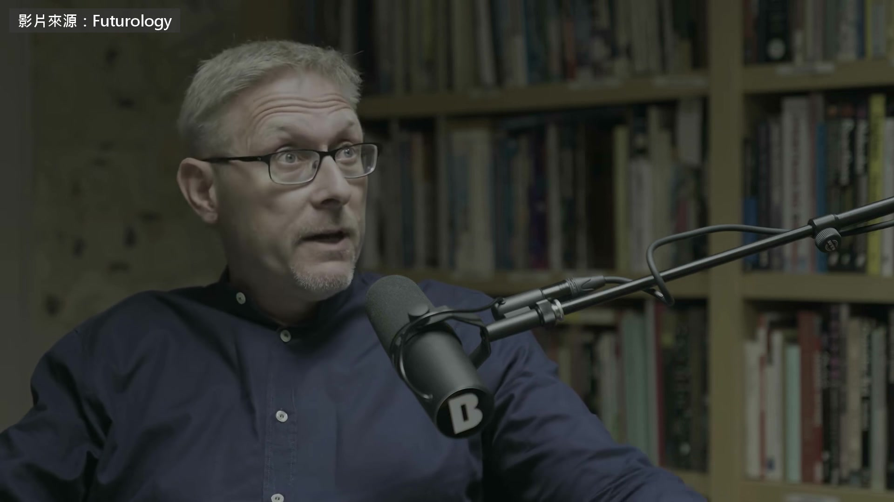

**逐字稿片段：** 提問的 Nils Gilman 來自智庫 Berggruen Institute 他不只發問，自己的看法也講了不少

**話題推測：** 介紹提問者 Nils Gilman 及其所屬智庫

---

## 00:00:27

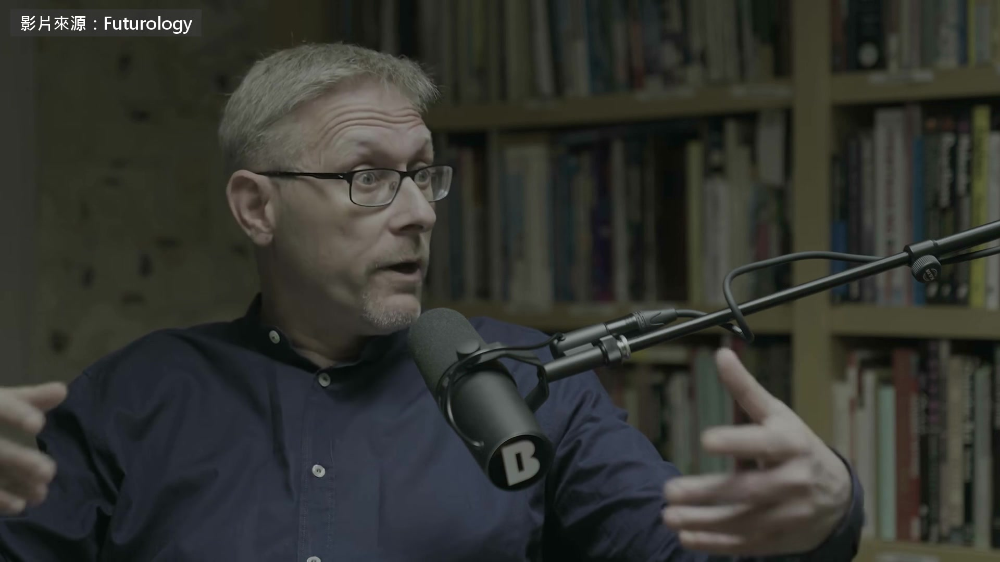

**逐字稿片段：** 奇點原本是物理學的詞

**話題推測：** 從物理學詞彙定義「奇點」

---

## 00:00:29

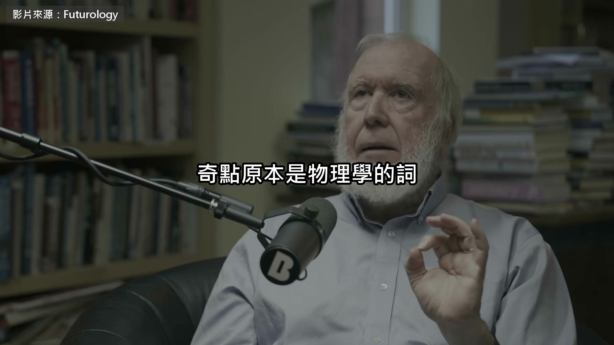

**逐字稿片段：** 科幻作家 Vernor Vinge 把它借來談 AI 的未來 等 AI 聰明到能做出更聰明的下一代 智力會一路爆炸下去 Kevin Kelly 從 Vinge 的定義講起 Vernor 的想法是，這件事要是真的發生了， 我們會想像不出另一邊是什麼樣子 某種意義上，我們的知識會整個失效 我覺得這個想法其實站得住腳， 而且我認為，人類已經經歷過一次奇點了 哪一次？

**話題推測：** 介紹科幻作家 Vernor Vinge 借用「奇點」一詞的背景

---

## 00:01:03

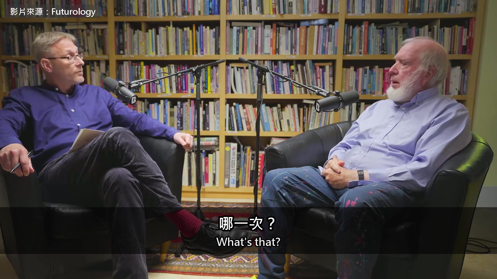

**逐字稿片段：** 語言 多講一點 還沒有語言的人類，沒辦法想像 有了語言之後，世界會是什麼樣子 那是他們搆不到的，根本進不去 因為語言才出現的一切，就像一次奇點 它打開了一整片新的領域， 在有語言之前，誰都看不到那裡 而奇點有個特點：你身在其中的時候，是看不見它的 從來沒有哪一刻，是幾個原始人圍坐著說： 「等等，你們有沒有發現我們現在在幹嘛？ 我們在講話，我們有語言了」 簡直是鬼魅般的超距作用 哇，太神奇了，這會改變一切 這種事從來沒發生過 奇點基本上只有事後回頭才看得見 所以從這個角度看，我們已經在奇點裡面了

**話題推測：** 提出「語言」作為人類已經歷的奇點實例

---

## 00:02:13

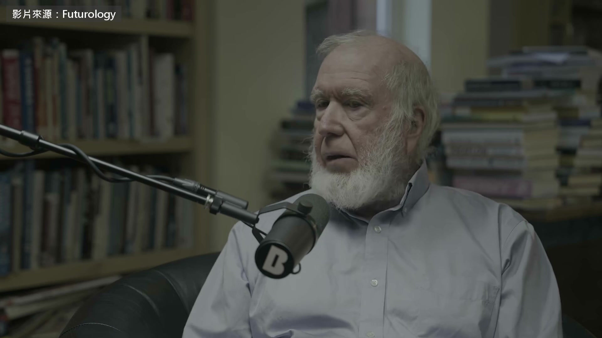

**逐字稿片段：** 接下來他講矽谷想錯的地方 他會用到一個機器學習的詞，過度擬合 意思是模型把練習題背得太熟 換一種題目就不會了 我確實認為，AI 這件事有奇點的成分， 但這裡面有個迷思， 這個迷思是：一切只跟智力有關

**話題推測：** 轉向討論矽谷對奇點的錯誤理解

---

## 00:02:39

**逐字稿片段：** 我把它叫做「思考主義」 思考主義就是… 帶偏見的那種「主義」？ 對。就是過度相信，所有問題的解法都是更多思考、更高的智力 會這樣講的，通常是某個喜歡思考的中年男人， 他覺得思考是全世界最重要的事 這是對智力很狹隘的定義， 我不認為 IQ 真的是最重要的東西 大家太過強調光靠 IQ 這件事 現在有件事正在發生，我覺得值得多探討：

**話題推測：** 提出「思考主義」這個新概念

---

## 00:03:23

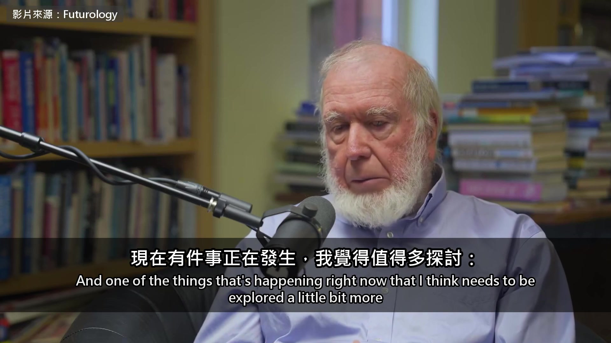

**逐字稿片段：** AI 模型正在收斂，但我認為那是過度擬合 因為這也是一種思考主義： 現在的 AI 模型，非常擅長寫軟體， 那些軟體很會做 AI， 做出來的 AI，又很會寫做 AI 的軟體 所以我們正在收斂到一種東西：它很擅長做出更多的自己 我們的 AI 真的很厲害… 現在的 AI 最厲害的地方，就是能拿來寫出更好的 AI 所以這就是過度擬合 我們希望這個世界有的東西，它只顧到很窄的一塊， 因為這種 IQ、這種智力，只是思考裡很窄的一種 這就是思考主義 Nils 接著問 這幾年大家覺得世界變得很怪 連什麼是真的都沒有共識 這種不穩定 是不是就是穿過奇點的感覺 我不用「穩不穩定」這個框架 我用的是「不確定」 我認為我們正走進一種升高的、持續的不確定 其中一部分，來自真相的流失 我們文化的根基，原本是「書的人」： 文本、經文、法律、憲法 每件事都寫下來，寫下來就是永久的，像碑文，白紙黑字， 非常明確，不會變 而且作者就是權威的來源 所以我們有真相，也有權威

**話題推測：** 探討 AI 模型收斂與過度擬合的現象

---

## 00:05:14

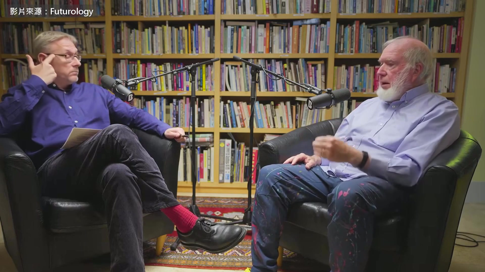

**逐字稿片段：** 現在我們搬到螢幕上了，我們是「螢幕的人」 不再是書的人 螢幕的世界很亂，它是流動的、一直在變 它會流走，稍縱即逝 你沒辦法從權威那裡拿到真相， 得自己當場把它拼出來

**話題推測：** 轉向討論以「螢幕的人」為主的現代社會

---

## 00:05:34

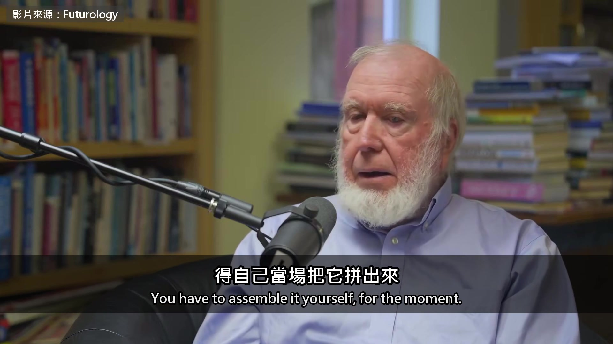

**逐字稿片段：** Nils 說很多人受不了這種不確定 所以反 AI 的聲浪越來越大

**話題推測：** Nils Gilman 提及反 AI 聲浪的增長

---

## 00:05:38

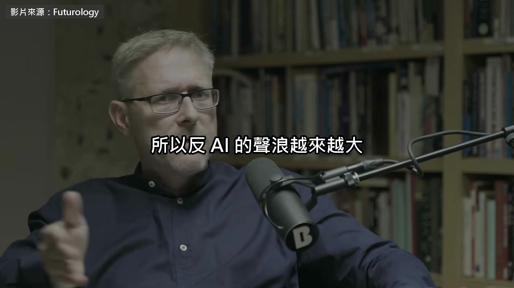

**逐字稿片段：** 焦點是資料中心，抗議它吃電、耗水 他猜資料中心成了看得見的出氣筒 大家真正怕的是那個說不準的未來 我想是 我覺得還有另一個因素：

**話題推測：** 指出資料中心成為反 AI 抗議焦點

---

## 00:05:50

**逐字稿片段：** 我去分析大部分反對 AI 的論點， 它們最後好像都會歸結到同一件事：反資本主義

**話題推測：** 探討反 AI 論點背後的反資本主義因素

---

## 00:06:02

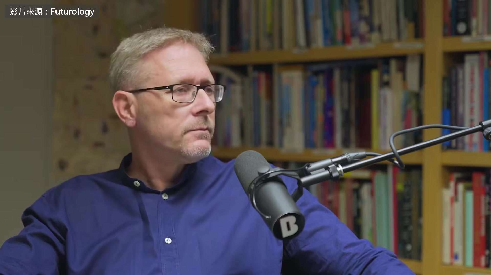

**逐字稿片段：** 問題在「大」。美國人對「大」過敏 是它們太大了 如果資料中心是小小的，有很多座，一百萬座， 大家就不會在意 但它們又大、又資本主義， 我認為是這點引出了那種反應， 倒不是因為它們成了妖怪 不過可能也有這個成分 Nils 同意

**話題推測：** 討論美國人對大型企業／事物的反感

---

## 00:06:32

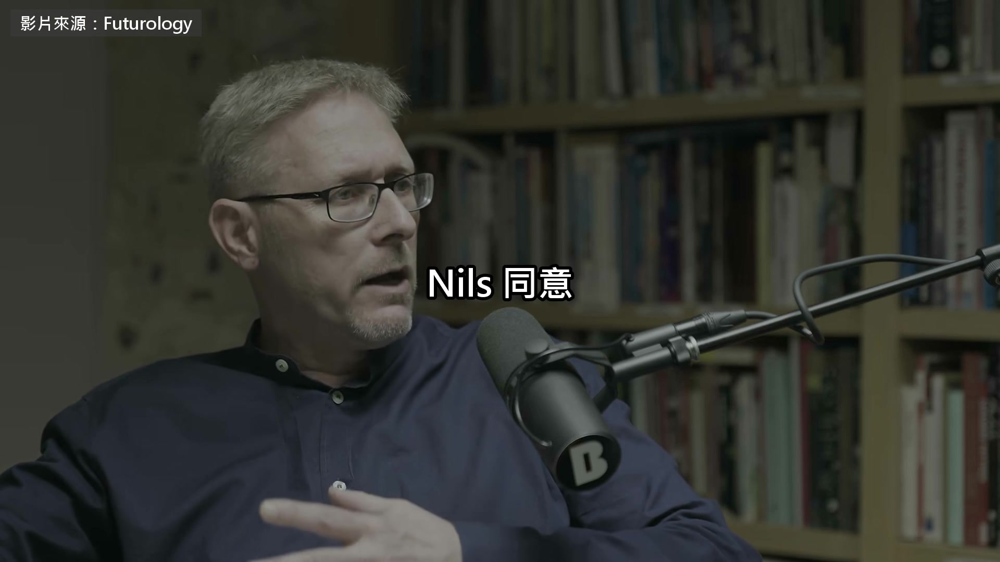

**逐字稿片段：** 他還覺得 AI 公司自己在火上加油 這些公司快要上市 高層跟員工會一夜致富 其中幾家卻公開說

**話題推測：** Nils Gilman 指出 AI 公司自身加劇爭議的行為

---

## 00:06:39

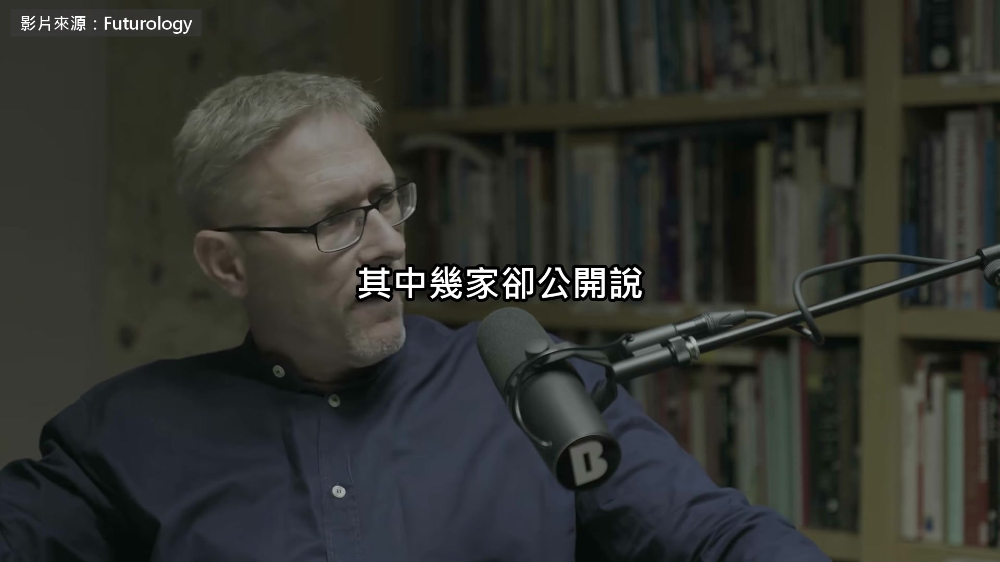

**逐字稿片段：** 這個十年結束前白領工作會少掉一半 會怎樣，我們沒辦法確定， 但我認為目前的證據支持的是： AI 造成的失業，會比大家預測的少很多 回頭看現在實際發生的事， 你去看到底有多少人真的因為 AI 被開除， 現在的狀況看不出會那樣 而就我怎麼看我們正在做的這個東西， 我覺得我們太少去預想，人可以做、也會去做的新事情， 還有它創造出來的新機會 我們只想到取代，因為那比較好想

**話題推測：** 引述 AI 將導致白領工作減半的預測

---

## 00:07:31

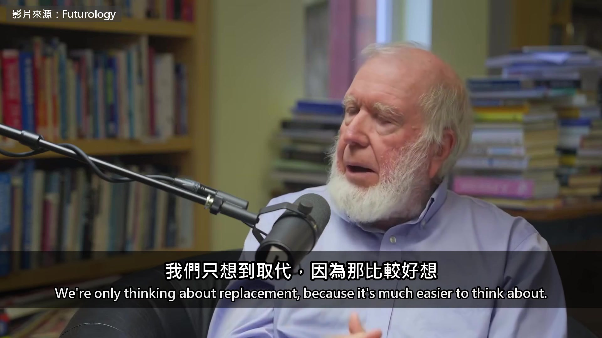

**逐字稿片段：** Nils 說經濟學家把這叫勞動總量謬誤 以為工作就那麼多，被機器拿走就沒了 他擔心的是過渡期 一個 55 歲的會計未必來得及重學 他還預測

**話題推測：** Nils Gilman 提及「勞動總量謬誤」的經濟學概念

---

## 00:07:42

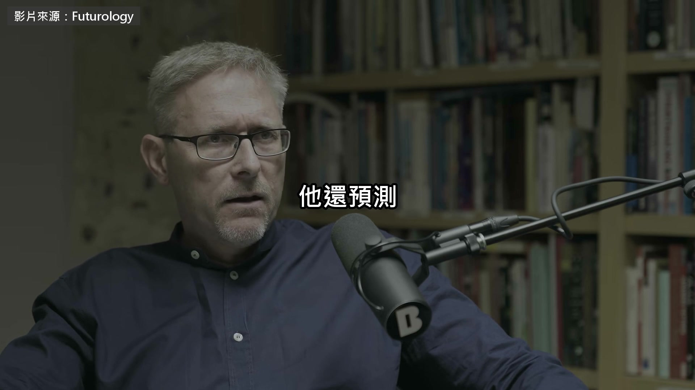

**逐字稿片段：** 下一屆美國總統大選會圍著 AI 打 也許吧，但我認為這是一條鋸齒狀的前線，很不平均 我認為 AI 會一直讓我們意外

**話題推測：** Nils Gilman 預測 AI 將成為美國總統大選焦點

---

## 00:07:57

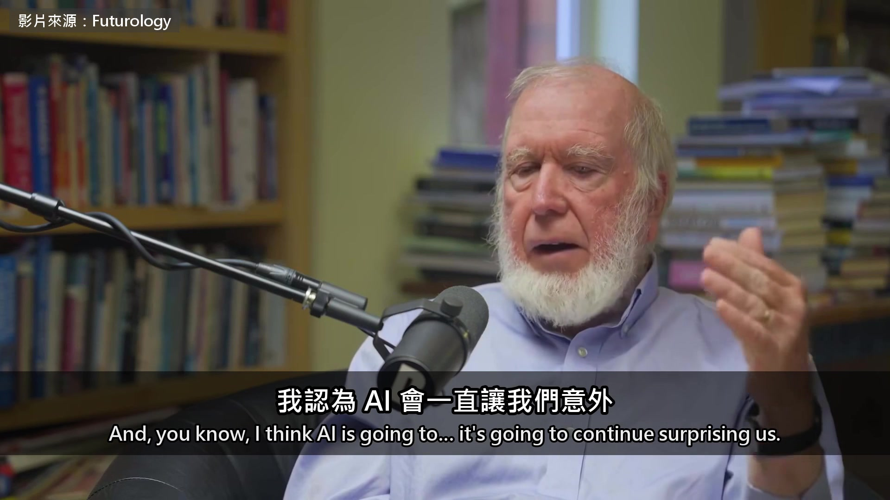

**逐字稿片段：** 到現在大概已經有四次大意外 最近的一次是， 受到威脅的不是卡車司機，也不是放射科醫師

**話題推測：** 提到 AI 發展至今已出現四次大意外

---

## 00:08:06

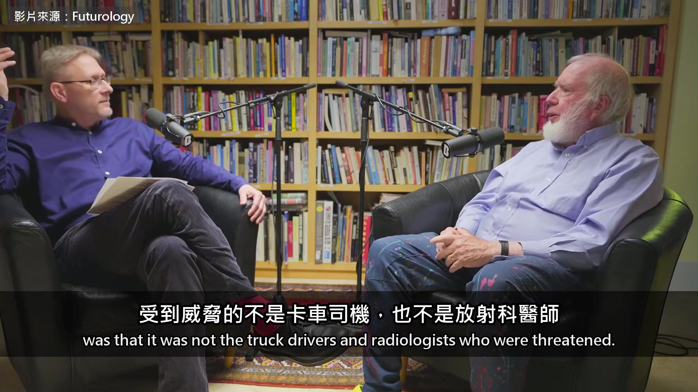

**逐字稿片段：** 是寫程式的 誰預測到了？沒有人 沒有人 而意外還沒結束 所以「誰都看得出來卡車司機會輸」這種說法， 我不認為我們看得出來 訪談後段談的是信仰

**話題推測：** 舉例說明 AI 威脅到的是寫程式的專業人士

---

## 00:08:27

**逐字稿片段：** Kevin Kelly 自己有基督信仰 Nils 問他：矽谷講奇點的口氣 很像教會在講末日跟救贖，這是巧合嗎 「阿宅版的升天」這個說法，我覺得有幾分道理， 我一直把它看成人間天堂的翻版 怪的是，AI 要嘛帶來人間天堂、讓我們永生， 要嘛把我們全殺光 中間什麼都沒有，我覺得這有點蠢 我認為結果會落在中間 所以我確實覺得，兩者至少是平行的： 奇點就像那場升天，然後你進到一個永生的烏托邦 但我不相信烏托邦， 我覺得去想它、去期待它，都有點危險

**話題推測：** 提及 Kevin Kelly 的基督信仰背景

---

## 00:09:22

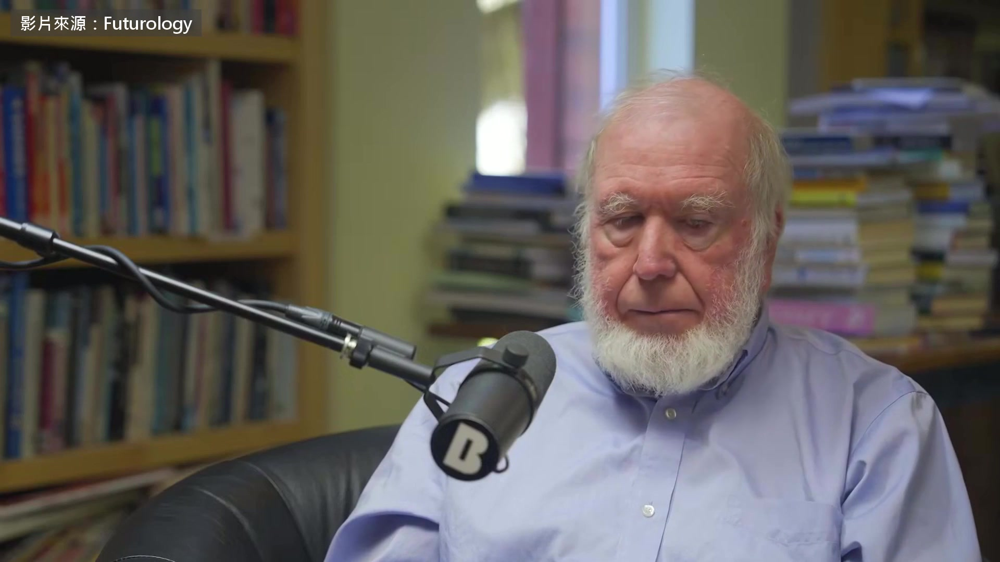

**逐字稿片段：** 我是「進托邦」派 我相信的是一點一點地，往稍微好一點點的方向走， 那樣的未來充滿新的問題，不會是沒有問題 Kevin Kelly 的答案是 奇點已經到了 只是身在裡面的人看不出來 接下來的日子落在天堂跟末日中間 一次只好一點點，還會帶來一批新問題

**話題推測：** 提出「進托邦」的概念

---

## 00:09:47

**逐字稿片段：** 原影片一百分鐘 他還講了 Anthropic 找各宗教的人去幫忙教 Claude 分辨好壞 他自己也被找去

**話題推測：** 說明原影片的長度資訊

---

## 00:09:53

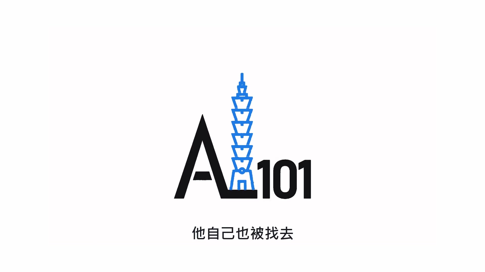

**逐字稿片段：** 另外他認為基因編輯擋不住 人類會分成改造過跟沒改造過的兩群 原影片連結在說明欄，有興趣可以去聽更多。

**話題推測：** 引入基因編輯此一新話題

---
