# ai-note-101_pPikRNLc-54 — 關鍵畫面索引

- 來源逐字稿：[ai-note-101_pPikRNLc-54_GT.srt](ai-note-101_pPikRNLc-54_GT.srt)
- 影片：https://www.youtube.com/watch?v=pPikRNLc-54
- 截圖數：21

## 00:00:00

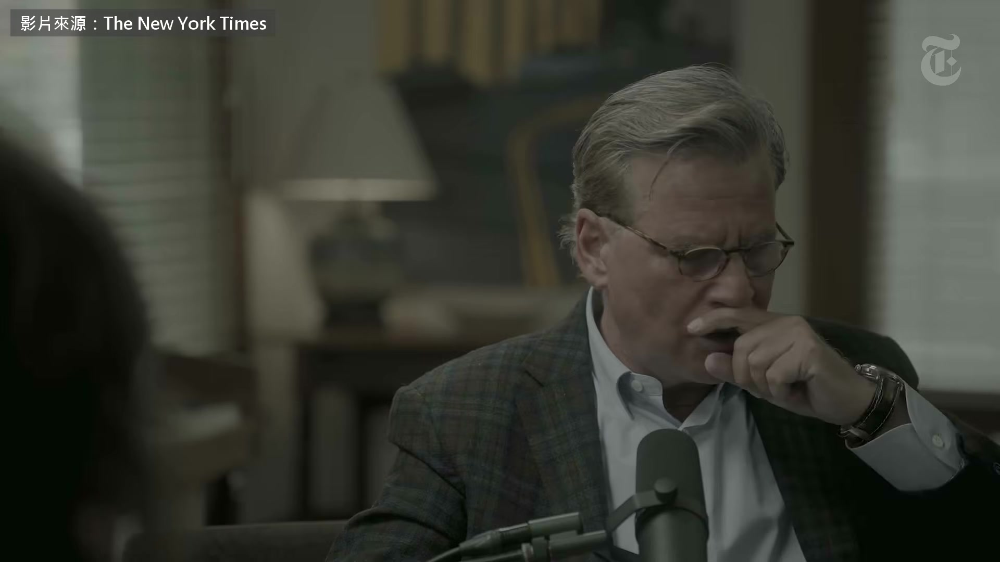

**逐字稿片段：** 2010 年的《社群網戰》 把祖克柏創辦臉書的過程搬上大銀幕 劇本拿下奧斯卡

**話題推測：** 介紹電影《社群網戰》及其年份

---

## 00:00:06

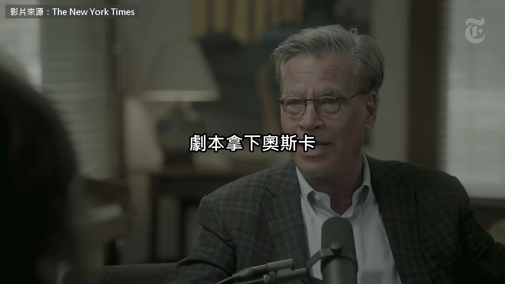

**逐字稿片段：** 寫劇本的人叫 Aaron Sorkin 影集《白宮風雲》也是他寫的 人物講話又快又密是他的招牌 16 年後他又拍了一部臉書的電影 叫 The Social Reckoning 主角換成臉書的吹哨者跟報導她的記者 美國 10 月 9 號上映 這是紐約時報 9 月上架的訪談 他在裡面說他對 AI 很樂觀 因為他覺得 AI 不會成功 訪談先談的是祖克柏 Sorkin 說，真人寫進劇本 寫到後來都會變成他自己創造的角色

**話題推測：** 介紹編劇 Aaron Sorkin

---

## 00:00:34

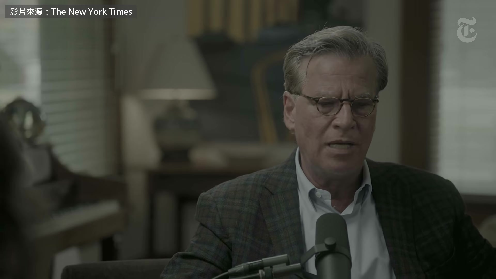

**逐字稿片段：** 不過講到祖克柏，《社群網戰》跟 The Social Reckoning 兩部都一樣， 寫任何一個反英雄也一樣，祖克柏就是反英雄 他不是反派 有些人可能分不清楚，在你心裡，反英雄跟反派差在哪裡？

**話題推測：** 比較兩部祖克柏相關電影的共通點

---

## 00:00:53

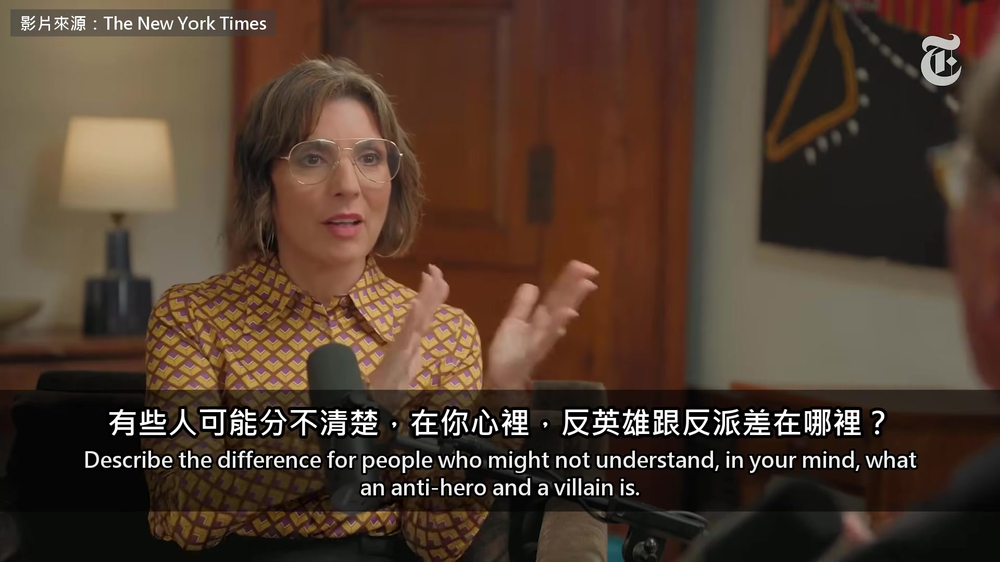

**逐字稿片段：** 反英雄的出發點是好的，他們認為自己在做好事

**話題推測：** 定義反英雄的特點

---

## 00:00:59

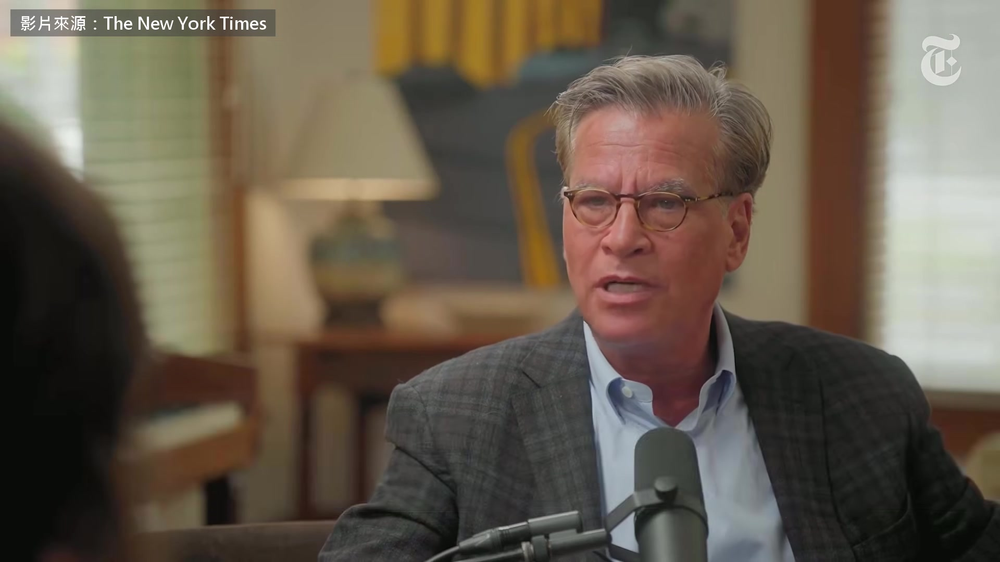

**逐字稿片段：** 像《軍官與魔鬼》裡 Jack Nicholson 演的角色，那是我寫的第一部作品 他那一整段演說，講的就是他認為自己在保護美國 企鵝人、小丑，他們只想統治高譚市 那種才是反派，其他的是反英雄 寫祖克柏，或者寫任何一個反英雄， 我是寫的人，我不能去評判這個角色 我寫他的時候，是當作他正在向上帝陳述，自己為什麼該上天堂 你不覺得祖克柏是反派？ 妳問的是真的祖克柏，還是我寫的祖克柏？ 你說說看，差別在哪裡 好。真的祖克柏我不想評斷，我不是為了這個來的

**話題推測：** 舉例《軍官與魔鬼》中的角色為反英雄

---

## 00:01:48

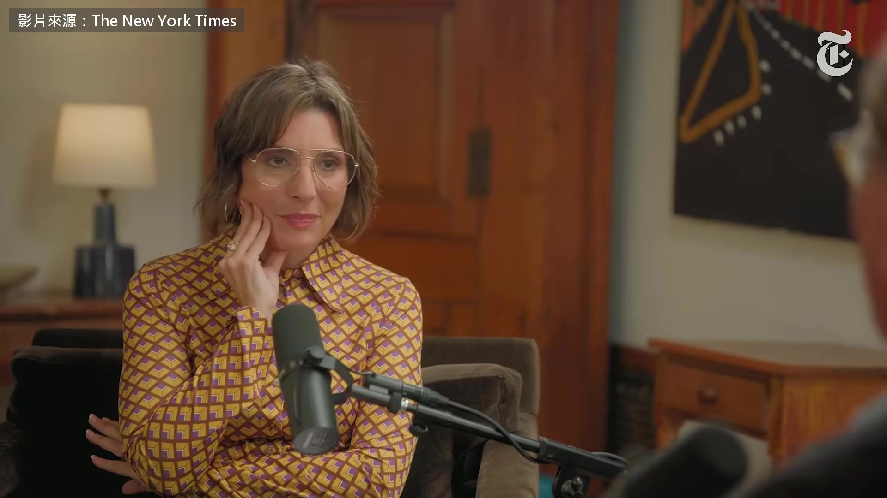

**逐字稿片段：** The Social Reckoning 裡的祖克柏是反英雄，不是反派 我還想補一句，替這個角色跟他本人辯護的，不只我一個

**話題推測：** 澄清電影中祖克柏的角色定位

---

## 00:02:05

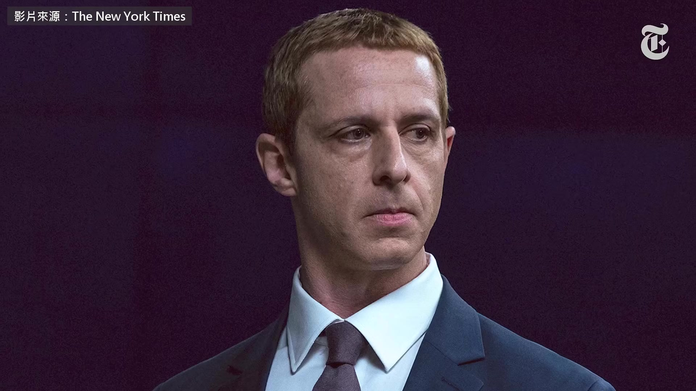

**逐字稿片段：** 演他的 Jeremy Strong，這個角色他演得太精彩了， 他一直在跟我替祖克柏辯護，不只在片場，半夜還會寫信給我 他殺青那天，最後一個鏡頭一拍完， 我才剛喊完卡、喊完檢查片門， Jeremy Strong 就大步走過來，那是我第一次在片場聽到他用自己的聲音講話， 不是祖克柏的聲音，是他自己的聲音 他說，如果我演的是記者 Jeff，我就會替 Jeff 辯護 而我現在完全知道，祖克柏會怎麼向上帝陳述 我的意思是… 他在拉近人跟人的距離 這從一開始就是他的使命

**話題推測：** 介紹飾演祖克柏的演員 Jeremy Strong

---

## 00:02:51

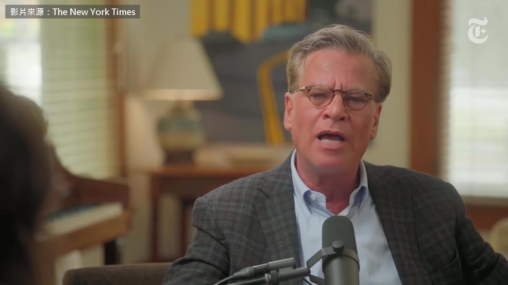

**逐字稿片段：** 我猜他現在推的那些技術，像 AI，還有那副蠢眼鏡， 在他的想像裡，都是帶著所有人往前走

**話題推測：** 討論祖克柏目前推動的 AI 和智慧眼鏡技術

---

## 00:03:06

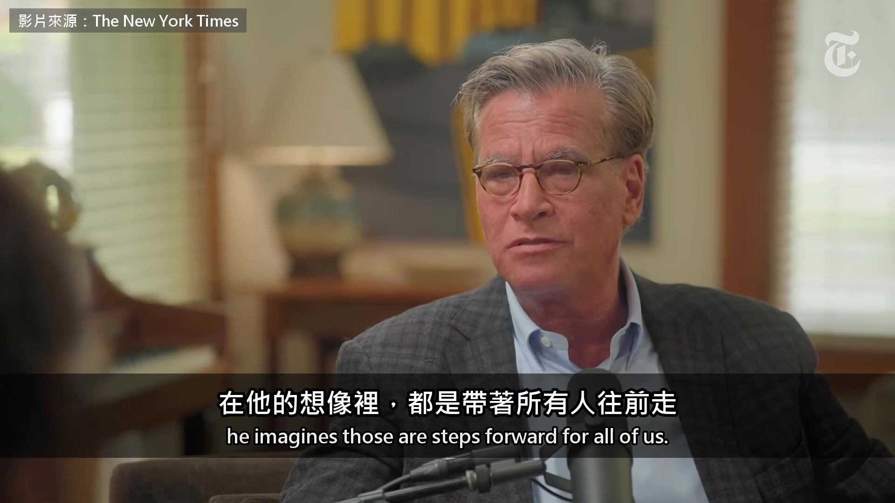

**逐字稿片段：** 主持人後來問到他怎麼寫作 Sorkin 寫對白的時候會站起來 把整場戲演一遍，邊演邊唸 他說，那是寫得順的日子 我愛寫作，我討厭的是寫不出來 偏偏對我來說，寫作大部分的時間都是寫不出來 大部分時間我都急得快抓狂，走來走去，腦袋空空 我每次都覺得，自己再也想不出下一個點子了

**話題推測：** 訪談話題轉向 Aaron Sorkin 的寫作方式

---

## 00:03:34

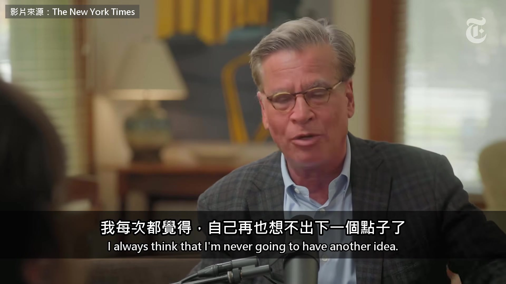

**逐字稿片段：** 《白宮風雲》我寫了 88 集，其中有 87 次， 我都跟身邊的人說，各位，到此為止了 我會的每一個字，我想得到的每一種排法，全都用完了 我沒有故事可以講了，我們麻煩大了 寫電影的時候這樣，寫舞台劇的時候還是這樣 你寫的對白風格非常好認，對吧？ 一群超聰明的人，用超快的速度，互丟超聰明的俏皮話

**話題推測：** 提及《白宮風雲》的集數

---

## 00:04:01

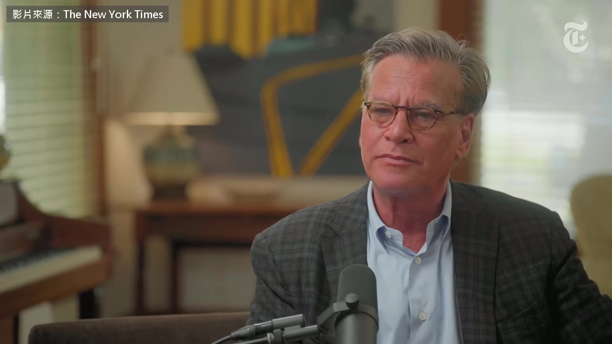

**逐字稿片段：** 現在談創意、談寫作，AI 當然是個大議題

**話題推測：** 再次將話題轉回 AI 對寫作的影響

---

## 00:04:07

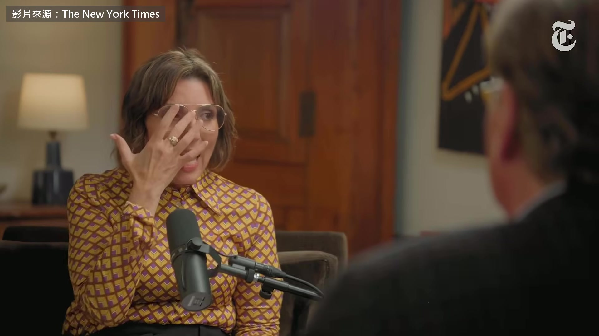

**逐字稿片段：** 你有沒有動過念頭，去找個聊天機器人，叫它寫一場 Aaron Sorkin 風格的戲？ 因為我想像得到，這種指令它們一定知道要怎麼模仿 講著講著，我自己都想去試了 不是啦，我是說模仿，沒有說它寫得比你好 我想機器人大概做得到妳說的… 不不不，我說的是模仿，因為你的風格非常鮮明 這種指令它們看得懂 謝謝妳這樣說。沒有，我沒試過

**話題推測：** 提問是否曾考慮讓 AI 模仿其寫作風格

---

## 00:04:33

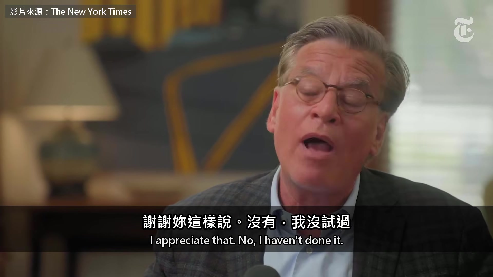

**逐字稿片段：** 不過妳想不想聽我的理論…想不想聽我為什麼對 AI 樂觀？ 想 好。因為我覺得它不會成功 我記得前陣子去參加一場晚宴，

**話題推測：** Aaron Sorkin 準備闡述他對 AI 樂觀的原因

---

## 00:04:51

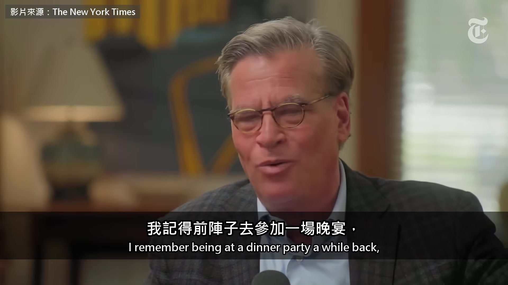

**逐字稿片段：** 牆上掛了一幅畫，是抽象畫 我還滿喜歡的，就一直看…我對藝術一竅不通 「抽象」這個詞講出來，我會的詞彙就用完了 但我喜歡那幅畫，我也說不上來 人應該從藝術得到的那個東西，當下正在發生。我喜歡它

**話題推測：** 提及晚宴中看到的抽象畫

---

## 00:05:14

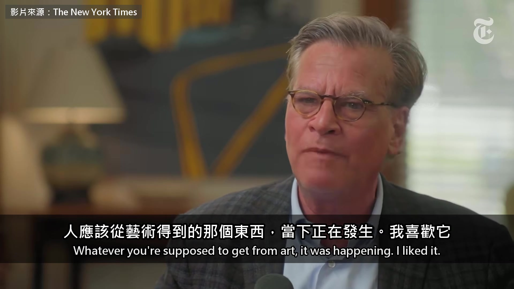

**逐字稿片段：** 然後晚宴的主人走過來跟我說：「那是機器畫的」 我很佩服這個技術，可是我對那幅畫的感覺，不管那是什麼，就這樣沒了 如果你有在打電動，如果你玩《決勝時刻》， 你在《決勝時刻》裡開槍打的那些人，你對他們不會有感情， 看 AI 做的《辛德勒的名單》，就會是這種感受 我想我們以後會發現，你走進電影院的時候， 你可能不知道導演是誰，不知道編劇是誰， 也不知道演員叫什麼名字 但我想我們會發現，那是人做的，這件事對你很重要 可是到處都有人在用這項技術抄捷徑，跳過那段辛苦的過程， 就是你為了想出一個點子，要熬的那一段 我相信妳說的。而且老實講，我要想出一個點子、要起個頭，本來就那麼難， 所以老實講，如果我去其中一個網站，跟它說， 欸，幫個忙，幫我寫一場開場戲，故事是關於… 它要是真的寫得出來，甚至只是寫得八九不離十， 到我只需要把對白稍微潤一下的程度， 那我以後大概就只會做這件事了 我想我再也不會自己去想點子了

**話題推測：** 揭露晚宴中的畫作是由機器繪製

---

## 00:06:47

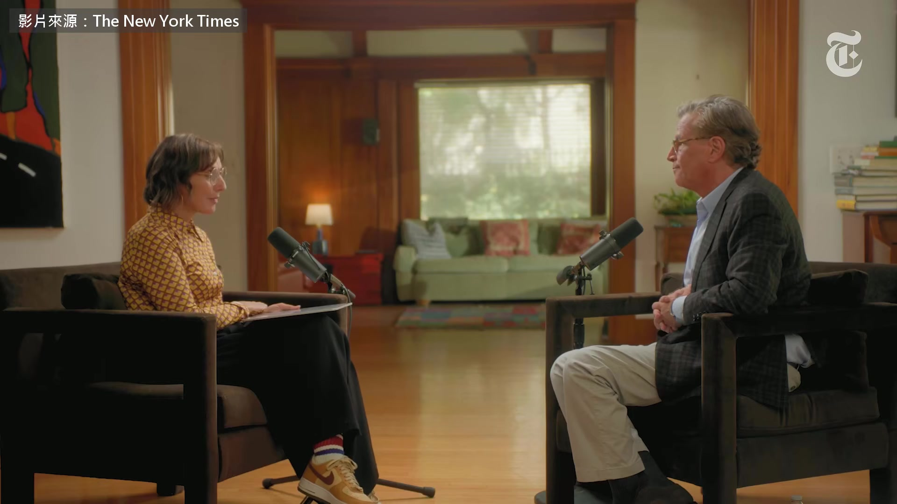

**逐字稿片段：** 危險就在這裡 嗯，對 那你為什麼還樂觀？ 首先，我是靠這個吃飯的，好嗎？ Lulu，別再想辦法說服我失業了，好不好？ 不過我是真心相信…一開始我想的是，好吧，

**話題推測：** 總結使用 AI 帶來的危險

---

## 00:07:09

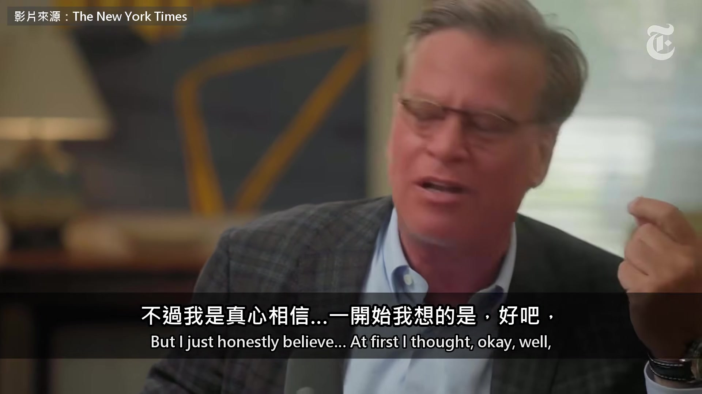

**逐字稿片段：** 也許以後不是 AI 做的電影，只有藝術戲院才看得到 偶爾會聽說，哪個小鎮有一家很棒的戲院，專門放不是 AI 做的片子 但我不相信會這樣

**話題推測：** 思考未來非 AI 製作電影的生存空間

---

## 00:07:25

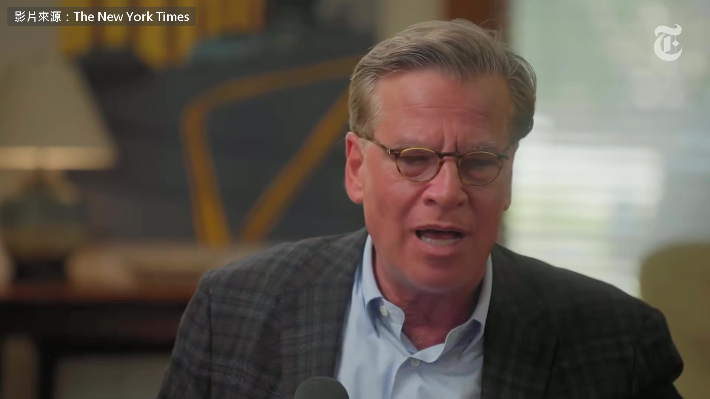

**逐字稿片段：** 我要看史柯西斯的電影，我要看史匹柏的電影， 我要看 Adam McKay 的電影，我要看 Greta Gerwig 的電影 我對 AI 電影的感覺，會跟我對那幅 AI 畫的感覺一模一樣

**話題推測：** 提及他希望觀看的知名導演作品

---

## 00:07:43

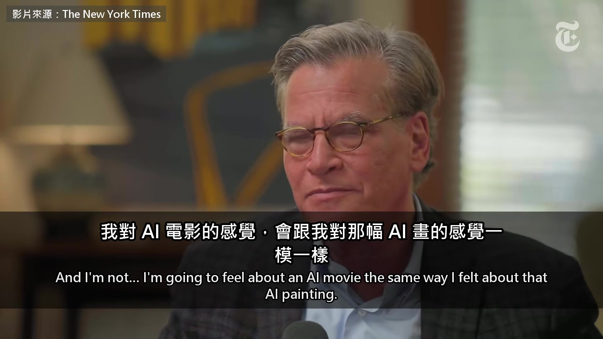

**逐字稿片段：** Sorkin 自己也承認 AI 要是寫得出一場像樣的開場戲 他大概就不會再自己想點子了 他還是相信，觀眾走進戲院的時候 會在乎那部電影是人做的

**話題推測：** 旁白開始總結 Aaron Sorkin 的觀點

---

## 00:07:55

**逐字稿片段：** 原影片一個小時 Sorkin 還講到

**話題推測：** 說明原始影片的長度

---

## 00:07:58

**逐字稿片段：** 據他了解 Meta 寄過信給出品這部片的 Sony 片廠另外請了一家律師事務所 把電影裡講到的事實一條一條核對過 他也講了 2019 年他在紐約時報寫公開信批評臉書 祖克柏拿他寫過的電影台詞來回應 原影片連結在說明欄，有興趣可以去聽更多。

**話題推測：** 提及 Meta 曾向 Sony 寄信的事件

---
